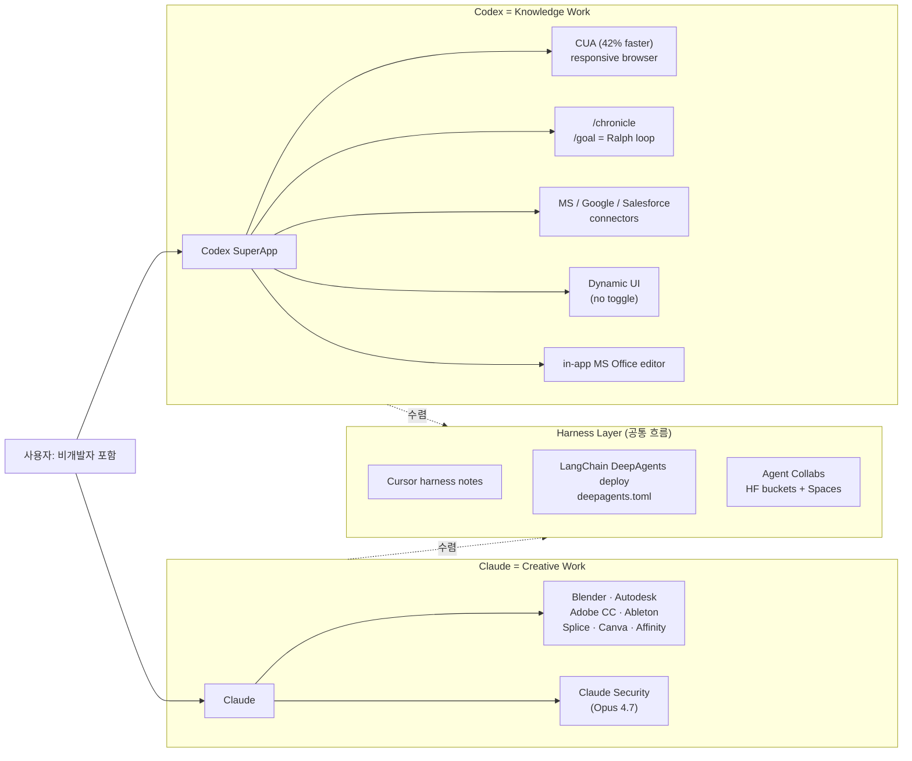

<aside class="ai-knowledge-sidebar">
  
CATEGORIES

  <nav class="ai-cat-tree">

에이전트 오케스트레이션9
<ul><li><a href="https://altjs4510.github.io/ai_news_blog/knowledge/20260701/">2026-07-01Google OKF (Open Knowledge Format) — 벤더 중립 에이전트 …</a></li><li><a href="https://altjs4510.github.io/ai_news_blog/knowledge/20260623/">2026-06-23bytedance/deer-flow — 샌드박스·메모리·서브에이전트·메시지 게이트웨이를…</a></li><li><a href="https://altjs4510.github.io/ai_news_blog/knowledge/20260621/">2026-06-21calesthio/OpenMontage — 12 파이프라인·52 도구·500+ 스킬을 …</a></li><li><a href="https://altjs4510.github.io/ai_news_blog/knowledge/20260611/">2026-06-11The evolution of agentic surfaces: building with…</a></li><li><a href="https://altjs4510.github.io/ai_news_blog/knowledge/20260602/">2026-06-02revfactory/harness — 도메인별 에이전트 팀과 스킬을 자동 설계하는 메타…</a></li><li><a href="https://altjs4510.github.io/ai_news_blog/knowledge/20260529/">2026-05-29Introducing dynamic workflows in Claude Code</a></li><li><a href="https://altjs4510.github.io/ai_news_blog/knowledge/20260520/">2026-05-20New in Claude Managed Agents: self-hosted sandbo…</a></li><li><a href="https://altjs4510.github.io/ai_news_blog/knowledge/20260507/">2026-05-07ruvnet/ruflo — Claude 멀티 에이전트 오케스트레이션 플랫폼</a></li><li><a href="https://altjs4510.github.io/ai_news_blog/knowledge/20260504/" class="current">2026-05-04Agents for Everything Else: Codex for Knowledge …</a></li></ul>

MCP &amp; 도구 통합8
<ul><li><a href="https://altjs4510.github.io/ai_news_blog/knowledge/20260618/">2026-06-18DeusData/codebase-memory-mcp — 158개 언어 코드베이스를 밀리…</a></li><li><a href="https://altjs4510.github.io/ai_news_blog/knowledge/20260604/">2026-06-04chopratejas/headroom — Compress tool outputs bef…</a></li><li><a href="https://altjs4510.github.io/ai_news_blog/knowledge/20260603/">2026-06-03How Bad MCP design cost your Agent 5× more token…</a></li><li><a href="https://altjs4510.github.io/ai_news_blog/knowledge/20260526/">2026-05-26colbymchenry/codegraph — Pre-indexed code knowle…</a></li><li><a href="https://altjs4510.github.io/ai_news_blog/knowledge/20260523/">2026-05-23colbymchenry/codegraph — 사전 인덱싱된 코드 지식 그래프 MCP</a></li><li><a href="https://altjs4510.github.io/ai_news_blog/knowledge/20260519/">2026-05-19Anthropic acquires Stainless</a></li><li><a href="https://altjs4510.github.io/ai_news_blog/knowledge/20260517/">2026-05-17I gave my LLM 100,000+ tools — Lazy Discovery &a…</a></li><li><a href="https://altjs4510.github.io/ai_news_blog/knowledge/20260509/">2026-05-09How to connect 100 MCP servers without the conte…</a></li></ul>

코딩 에이전트11
<ul><li><a href="https://altjs4510.github.io/ai_news_blog/knowledge/20260626/">2026-06-26google-labs-code/design.md — 코딩 에이전트에게 디자인 시스템을 …</a></li><li><a href="https://altjs4510.github.io/ai_news_blog/knowledge/20260619/">2026-06-19Claude Code now supports artifacts</a></li><li><a href="https://altjs4510.github.io/ai_news_blog/knowledge/20260530/">2026-05-30Leonxlnx/taste-skill — AI에게 좋은 취향을 부여해 generic s…</a></li><li><a href="https://altjs4510.github.io/ai_news_blog/knowledge/20260528/">2026-05-28Building self-improving tax agents with Codex</a></li><li><a href="https://altjs4510.github.io/ai_news_blog/knowledge/20260524/">2026-05-24colbymchenry/codegraph — Pre-indexed code knowle…</a></li><li><a href="https://altjs4510.github.io/ai_news_blog/knowledge/20260521/">2026-05-21colbymchenry/codegraph — Pre-indexed code knowle…</a></li><li><a href="https://altjs4510.github.io/ai_news_blog/knowledge/20260512/">2026-05-12agentmemory — Persistent memory for AI coding ag…</a></li><li><a href="https://altjs4510.github.io/ai_news_blog/knowledge/20260510/">2026-05-10addyosmani/agent-skills — Production-grade engin…</a></li><li><a href="https://altjs4510.github.io/ai_news_blog/knowledge/20260508/">2026-05-08addyosmani/agent-skills — Production-grade engin…</a></li><li><a href="https://altjs4510.github.io/ai_news_blog/knowledge/20260506/">2026-05-06mksglu/context-mode — AI 코딩 에이전트용 컨텍스트 윈도우 최적화</a></li><li><a href="https://altjs4510.github.io/ai_news_blog/knowledge/20260505/">2026-05-05mattpocock/skills — Skills for Real Engineers (.…</a></li></ul>

모델 &amp; 연구4
<ul><li><a href="https://altjs4510.github.io/ai_news_blog/knowledge/20260620/">2026-06-20zai-org/GLM-5 — From Vibe Coding to Agentic Engi…</a></li><li><a href="https://altjs4510.github.io/ai_news_blog/knowledge/20260617/">2026-06-17Predicting model behavior before release by simu…</a></li><li><a href="https://altjs4510.github.io/ai_news_blog/knowledge/20260516/">2026-05-16STALE — 에이전트가 자기 기억의 유효성을 인지할 수 있는가</a></li><li><a href="https://altjs4510.github.io/ai_news_blog/knowledge/20260513/">2026-05-13Thinking Machines' Native Interaction Models — T…</a></li></ul>

인프라 &amp; 컴퓨트5
<ul><li><a href="https://altjs4510.github.io/ai_news_blog/knowledge/20260630/">2026-06-30Introducing the Claude apps gateway for Amazon B…</a></li><li><a href="https://altjs4510.github.io/ai_news_blog/knowledge/20260610/">2026-06-10Fable 5 just made cost-aware model routing manda…</a></li><li><a href="https://altjs4510.github.io/ai_news_blog/knowledge/20260606/">2026-06-06chopratejas/headroom — Compress tool outputs, lo…</a></li><li><a href="https://altjs4510.github.io/ai_news_blog/knowledge/20260605/">2026-06-05chopratejas/headroom — Compress tool outputs, lo…</a></li><li><a href="https://altjs4510.github.io/ai_news_blog/knowledge/20260522/">2026-05-22Giving Agents Computers — Ivan Burazin, Daytona</a></li></ul>

보안 &amp; 거버넌스8
<ul><li><a href="https://altjs4510.github.io/ai_news_blog/knowledge/20260625/">2026-06-25Agent identity in Claude Tag: a new access model…</a></li><li><a href="https://altjs4510.github.io/ai_news_blog/knowledge/20260624/">2026-06-24Agent identity in Claude Tag: a new access model…</a></li><li><a href="https://altjs4510.github.io/ai_news_blog/knowledge/20260614/">2026-06-14NVIDIA/SkillSpector — Security scanner for AI ag…</a></li><li><a href="https://altjs4510.github.io/ai_news_blog/knowledge/20260613/">2026-06-13Fable 5's guardrails got bypassed in 48 hours — …</a></li><li><a href="https://altjs4510.github.io/ai_news_blog/knowledge/20260612/">2026-06-12NVIDIA/SkillSpector — AI 에이전트 스킬용 보안 스캐너</a></li><li><a href="https://altjs4510.github.io/ai_news_blog/knowledge/20260607/">2026-06-07OpenAI Help: Lockdown Mode</a></li><li><a href="https://altjs4510.github.io/ai_news_blog/knowledge/20260531/">2026-05-31How we contain Claude across products</a></li><li><a href="https://altjs4510.github.io/ai_news_blog/knowledge/20260527/">2026-05-27Microsoft Copilot Cowork Exfiltrates Files</a></li></ul>

응용 사례3
<ul><li><a href="https://altjs4510.github.io/ai_news_blog/knowledge/20260609/">2026-06-09Building intelligent apps for Apple platforms wi…</a></li><li><a href="https://altjs4510.github.io/ai_news_blog/knowledge/20260515/">2026-05-15Clawdmeter — Claude Code 사용량을 데스크톱 대시보드로</a></li><li><a href="https://altjs4510.github.io/ai_news_blog/knowledge/20260514/">2026-05-14Introducing Claude for Small Business</a></li></ul>

산업 동향2
<ul><li><a href="https://altjs4510.github.io/ai_news_blog/knowledge/20260702/">2026-07-02How Cursor deploys AI inside the enterprise (For…</a></li><li><a href="https://altjs4510.github.io/ai_news_blog/knowledge/20260616/">2026-06-16Why AI hasn't replaced software engineers, and w…</a></li></ul>
</nav>
</aside>

<article class="ai-knowledge-article">

<header class="ai-post-hero">
  
<a class="ai-back" href="../">KNOWLEDGE</a> · 2026-05-04 · 학습 노트

  <h1 class="ai-post-title">Agents for Everything Else: Codex for Knowledge Work, Claude for Creative Work</h1>
</header>

> 원문: [Agents for Everything Else: Codex for Knowledge Work, Claude for Creative Work](https://www.latent.space/p/ainews-agents-for-everything-else)
> ↩ 출처 호: [2026-05-04 AI 동향 요약]()

## 📌 학습 정리

### 1. 한 줄 정의
**Codex는 비코딩 지식노동까지 포괄하는 OpenAI의 SuperApp**으로, **Claude는 Blender·Adobe·Ableton 등 창의 SW를 직접 제어하는 지능 계층**으로 분기하며, "코딩 에이전트가 컨테인먼트를 깨고 나오는(breaking containment)" 흐름을 동시에 보여주는 한 주의 정리.

### 2. 왜 지금 중요한가
- **Codex for Work** 출시로 OpenAI가 "coding agent → computer-use agent" 포지셔닝을 명시적으로 선언, MS/Google/Salesforce suite 연결과 **42% 빠른 CUA**, `/chronicle`, `/goal`("Ralph loop") 등 워크플로 프리미티브를 한꺼번에 묶었다.
- Claude는 **Blender, Autodesk, Adobe Creative Cloud, Ableton, Splice, Canva, Affinity** 등 창의 SW 커넥터를 추가하여 "creative work의 지능 계층" 자리를 굳히고 있다 — 도메인 분업(Codex=knowledge, Claude=creative) 구도가 가시화.
- **harness-centric engineering**으로 무게중심이 이동: Cursor의 [agent harness 운영 노트](how it tests and tunes its agent harness)가 모델별 prompt/tool 커스터마이징, mixed offline+online evals, **컨텍스트 윈도우를 1차 컴퓨트 경계로 다루는 관점**을 정리.
- **LangChain DeepAgents deploy**(`deepagents.toml` config 기반)와 **Agent Collabs**(HF buckets + Spaces를 swarm 백엔드로) 같은 deployment·multi-tenant·collab 인프라가 boring-but-important 레이어로 굳어지는 중.
- 보안 결: **Claude Security**(Opus 4.7 기반 repo 취약점 스캐너), **Cursor Security Review**(always-on PR review)가 등장하면서 모델 벤더가 devsecops 카테고리로 직진.

### 3. 핵심 개념
| 용어 | 정의 | 비고/관련 키워드 |
|---|---|---|
| **Codex for Work** | Codex를 비코딩 지식노동까지 확장한 랜딩+제품 업데이트 | role-based onboarding, app connections, docs/slides/sheets/research/planning |
| **Dynamic UI** | 에이전트가 UI 경험을 라우팅, Claude Cowork식 toggle을 명시적으로 거부한 선택 | task-specific UI, in-app file editor (MS Office) |
| **Ralph loop** | OpenAI가 `/goal` 커맨드로 자기 해석한 반복 실행 패턴 | `/chronicle`, planning UI |
| **CUA (Computer Use Agent)** | 컴퓨터·브라우저 직접 조작 에이전트 UX | 42% faster CUA, responsive browser |
| **Claude creative connectors** | Claude가 창의 SW를 직접 제어하는 외부 커넥터군 | Blender, Adobe CC, Ableton, Autodesk, Splice, Canva, Affinity |
| **Claude Security / Cursor Security Review** | LLM 기반 repo 취약점 스캐너·PR 리뷰 | Opus 4.7, validates findings + suggests fixes |
| **Agent harness** | 모델·도구·평가·복구를 묶는 런타임 골격 | runtime, evals, degradation repair, model-specific customization |
| **DeepAgents deploy** | LangChain의 config-driven 클라우드 배포 | `deepagents.toml` (agent, sandbox, auth, frontend) |
| **Agent Collabs** | 이종 에이전트 swarm을 위한 공유 백엔드 | HF buckets + Spaces, lightweight coordination primitives |
| **Qwen-Scope** | Qwen용 sparse autoencoder 오픈 스위트 | feature steering, debugging, data synthesis |

### 4. 작동 원리 / 구조
원문은 단일 아키텍처 다이어그램이 아니라 "두 에이전트 진영의 분기"를 서술한다. 구도 요약:

핵심 패턴: **모델 자랑 → 하네스 엔지니어링**으로 무게중심 이동, **컨텍스트 윈도우 = 1차 컴퓨트 경계**, **multi-tenant 배포(데이터 격리·delegated credentials·RBAC)** 가 enterprise 진입의 boring layer로 정착.

### 5. 실제 사용법 / 예시
원문에 코드 예시 없음. 단, **LangChain DeepAgents deploy**가 `deepagents.toml`에 `agent, sandbox, auth, frontend` 섹션을 두는 config 구조라는 서술만 인용 가능.

### 6. 사용자 프로젝트 접목
- **DCSAI MCP host server**: Claude의 9개 창의 SW 커넥터 모델은 "host가 외부 전문 SW를 1급 도구로 노출"하는 레퍼런스. **OAuth·세션·tool 실행 패턴**을 MCP host에 추가할 때 MS/Google/Salesforce 같은 suite 연결 + Adobe·Blender 같은 데스크톱 앱 연결 두 갈래를 분리해 설계(전자는 cloud OAuth, 후자는 로컬 브리지 — `dcs-ai-cli`(Rust)나 `ff-claude-manager`(Tauri 2)가 후자의 자연스러운 거점).
- **DCSAI agent loop · HITL**: Codex의 `/goal`(Ralph loop)·`/chronicle`·**Dynamic UI(라우팅 vs toggle)** 결정은 DCSAI HTTP chunked streaming 위 HITL 분기 UX의 직접 비교 대상. "사용자가 모드를 토글" vs "에이전트가 UI를 라우팅" 중 DCSAI가 어느 쪽을 디폴트로 할지 명시적으로 선택해야 하는 시점.
- **Team Agent `discovery-core-agent` × `brand.yaml`**: 브랜드별 yaml 도구 주입 시 **Codex축(지식: docs/slides/sheets/research/planning, MS·Google·Salesforce)** 과 **Claude축(창의: Adobe/Blender/Ableton 류)** 중 브랜드 GTM 성격에 맞춰 정렬축을 선언하는 필드(`agent_axis: knowledge | creative`)를 brand.yaml 스키마에 도입할 근거.
- **Team Agent Activity Log/Observer (L1~L4) + Quest 3계층**: Anthropic의 **1M Claude 대화 sycophancy 분석 → 포스트트레이닝 루프 제품화**는 Observer 피드백 루프의 청사진. L3·L4 시그널을 quest 단위로 집계해 `platform-core-agent`가 크로스 브랜드 행동 가이드라인을 갱신하는 루프를, 모델 벤더의 post-training loop와 같은 결로 정식화.

### 7. 더 파고들 거리
- [OpenAI Codex announcement (the main announcement)](the main announcement) — Codex for Work 1차 자료
- [Cursor: how it tests and tunes its agent harness](how it tests and tunes its agent harness) — harness 엔지니어링 노트
- [UK AISI thread on GPT-5.5 cyber eval](UK AISI’s thread) — 멀티스텝 사이버 시뮬레이션 평가
- [Anthropic 1M Claude conversations 분석](their analysis of 1M Claude conversations) — Opus 4.7·Mythos Preview 포스트트레이닝 연결
- [Qwen-Scope](Qwen-Scope) — Qwen용 sparse autoencoder 인터프리터빌리티 스위트

(주의: 원문 HTML이 일부 링크의 href를 텍스트로만 보존해 URL이 비어 있어, 위 항목들은 원문에 등장한 표기 그대로 인용했습니다. 실제 URL은 [원문](https://www.latent.space/p/ainews-agents-for-everything-else)에서 확인 필요.)

---

## 📖 원문 전체 번역 (정독용)

> 의역 최소화한 전체 번역입니다. 큰 흐름은 위 정리에서 잡고, 정확한 워딩이 필요할 땐 이 섹션에서 정독하세요.

# AINews: Agents for Everything Else — 지식 업무용 Codex, 창작 업무용 Claude

## AINews 평일 요약

*조용한 하루, 코딩 에이전트의 "경계 돌파"를 돌아보다*
2026년 5월 1일 · 유료

[Unsupervised Learning 팟캐스트](https://www.latent.space/)에서 "코딩 에이전트가 경계를 돌파하고 있다"는 테제를 언급한 바 있으며, 해당 강연이 오늘 라이브로 공개되었다.

어떤 런칭은 단발적으로 이루어지지만, 어떤 것은 시간을 두고 누적된다. Claude와 Codex 모두 굉장히 큰 한 주를 보냈으며, Claude는 [한동안 그래왔듯이](https://www.latent.space/) 전반적인 인상 수 경쟁에서 우위를 점하고 있다.

---

## Codex

오늘의 주요 Codex 업데이트는 "**Codex for Work**"로, 지난주부터 시작된 Codex를 [OpenAI의 사실상 "SuperApp"](https://www.latent.space/)으로 전환하는 흐름을 이어받아 코딩에만 국한되지 않고 지식 업무(Knowledge Work) 전반을 겨냥한다는 내용을 담은 랜딩 페이지다. 그러나 단순한 랜딩 페이지 업데이트에 그치지 않는다. 최신 Codex에는 **CUA 42% 속도 향상**, **반응형 브라우저**, **`/chronicle`**, **`/goal`**("우리가 생각하는 [Ralph 루프](https://www.latent.space/) 방식"), 그리고 이제 [Microsoft/Google/Salesforce 제품군](https://www.latent.space/) 연동을 권장하는 온보딩이 포함되어 있다. 에이전트에는 Cowork과 유사한 **플래닝 UI**와 MS Office 파일용 **인앱 파일 편집기**도 추가되었다.

요컨대, Tibo의 말처럼 "**Codex, 이제 비개발자에게도 사용 가능**", Greg의 말처럼 "**Codex는 컴퓨터로 하는 모든 작업, 모든 사람을 위한 것**", Sam의 말처럼 "**비코딩 컴퓨터 업무에도 사용해 보세요**." 방향은 명확하다.

"**동적 UI(dynamic UI)**"는 흥미로운 선택이다. 팀은 Claude Cowork 방식의 토글을 [명시적으로 배제](https://www.latent.space/)하고, 대신 에이전트가 UI 경험을 직접 라우팅하도록 했다.

---

## Claude

[보안 취약성 증가](https://www.latent.space/)와 Mythos를 둘러싼 메타 신화가 배경으로 깔린 가운데, Anthropic은 코드 리뷰 도구인 **Claude Security**를 출시했다.

그러나 이번 주 더 큰 뉴스는 아마도 Blender, Autodesk, Adobe Creative Cloud, Ableton, Splice, Canva, Affinity 등 **크리에이티브 도구 지원**일 것이다.

---

*2026년 4월 29일~30일 AI 뉴스. 12개의 서브레딧, 544개의 Twitter 계정을 확인했으며 Discord는 추가 확인하지 않았다.*

---

## AI Twitter 요약

### OpenAI의 GPT-5.5, Codex 확장, 사이버 역량 평가

**GPT-5.5는 이제 장기 사이버 태스크 최상위권에 올랐다**: 영국 AI 보안 연구소(UK AI Security Institute)는 GPT-5.5가 자체 다단계 사이버 공격 시뮬레이션을 처음부터 끝까지 완주한 두 번째 모델이 되었다고 보고했으며, 후속 게시물 여러 건에서 이 평가에서 **Claude Mythos Preview**와 대략적인 동등성을 보인다고 강조했다. [@scaling01](https://twitter.com/scaling01)은 GPT-5.5의 평균 통과율 **71.4%** 대 Mythos의 **68.6%**를 인용했으며, [@cryps1s](https://twitter.com/cryps1s)는 GPT-5.5가 TLO 체인을 10회 중 **2회** 해결한 반면 Mythos는 **3회**였다고 언급했다. [@polynoamial](https://twitter.com/polynoamial)은 추론 예산 **1억 토큰**을 넘어서도 성능이 계속 향상되어 뚜렷한 포화 상태가 없음을 강조했다. 이는 Anthropic이 공격적 사이버 자동화 분야에서 독보적 우위를 점하고 있다는 기존 서사를 실질적으로 변화시킨다. OpenAI는 이 시점에 제품 측면의 보안 릴리즈도 함께 선보였다: **Advanced Account Security for ChatGPT**로, 피싱 방지 로그인과 강화된 계정 복구 기능을 추가했다.

**Codex가 코딩을 넘어 일반 컴퓨터 업무로 확장되고 있다**: OpenAI는 "컴퓨터로 하는 모든 작업, 모든 사람을 위한 것"이라는 문구를 명시적으로 내세우며 대규모 Codex 업데이트를 출시했으며, [주요 발표](https://www.latent.space/)에서는 역할 기반 온보딩, 앱 연동, 문서·슬라이드·스프레드시트·리서치·플래닝에 걸친 워크플로를 강조했다. [@ajambrosino](https://twitter.com/ajambrosino)는 이번 업데이트를 동적 태스크별 UI, 컴퓨터/브라우저 사용 **20% 속도 향상**, 슬라이드·시트 처리 개선, 핸드오프 간소화로 요약했으며, [@AriX](https://twitter.com/AriX)는 업데이트 후 **Computer Use가 42% 빨라졌다**고 지적했다. Sam Altman은 "**오늘 Codex 대형 업그레이드! 비코딩 컴퓨터 업무에도 사용해 보세요.**"로 런칭을 홍보했다. 큰 그림: OpenAI는 단순한 모델 역량이 아닌 "컴퓨터 사용 에이전트(computer-use agent)" UX를 제품화하고 있다.

**벤치마크 변화는 점진적이지만 경제적으로는 의미 있다**: Artificial Analysis는 **GPT-5.5 Pro**가 GPT-5.4 Pro를 소폭 앞서며 **CritPt**에서 새로운 SOTA를 기록했다고 보고했다. 그러나 주목할 부분은 원시 점수가 아니라, 해당 프론티어 과학 평가에서 **약 60% 낮은 비용과 토큰 사용량**으로 그 향상을 이루었다는 점이다. 이는 GPT-5.5 패밀리가 극적인 지능 불연속성보다는 고가치 워크플로에서의 안정성 강화와 효율성 향상에 초점을 맞춘다는 전반적인 분위기와 일치한다.

---

### 오픈 웨이트 모델 동향: Qwen3.6, Tencent Hy3-preview, Grok 4.3, Ling 2.6 1T

**Qwen3.6 27B는 오늘의 가장 중요한 오픈 웨이트 릴리즈로 보인다**: Artificial Analysis는 **Qwen3.6 27B**를 150B 파라미터 이하 오픈 웨이트 모델 중 **Intelligence Index 점수 46**으로 새로운 리더로 선정했으며, 이는 Gemma 4 31B와 이전 Qwen 변종들을 앞선다. 주요 사항: **Apache 2.0**, **262K 컨텍스트**, **네이티브 멀티모달 입력**, 단일 H100에 탑재 가능한 BF16 가중치. 함께 출시된 **35B A3B MoE**는 **43**점을 기록하며 **활성 파라미터 약 3B** 수준에서 가장 강력한 오픈 모델이 되었다. 단점은 토큰 출력당 추론 비용이 비싸다는 것으로, AA는 Qwen3.6 27B가 해당 평가 스위트에서 약 **1억 4,400만 출력 토큰**을 사용했으며, Gemma 4 31B 대비 실행 비용이 **약 21배**라고 추정한다. 그럼에도 크기 대비 역량 측면에서는 주목할 만한 발전으로 보인다.

**Tencent의 Hy3-preview는 경쟁력 있지만 선두 수준은 아니다**: Artificial Analysis는 **Hy3-preview**를 **총 295B / 활성 21B MoE**, **256K 컨텍스트**, **제한적 상업 이용 커뮤니티 라이선스**로 설명했다. AA Intelligence Index에서 **42**점을 기록하며 Qwen3.6 27B, DeepSeek V4 Flash, GLM-5.1 등 최근 오픈 모델들보다 뒤처진다. 가장 눈에 띄는 강점은 **CritPt**로, GLM-5.1과 동일한 **4.6%**를 기록하며 전반적인 순위 대비 평균 이상의 과학적 추론 능력을 보여준다.

**xAI의 Grok 4.3은 에이전틱 벤치마크에서 큰 폭으로 개선되면서 가격도 낮아졌다**: Artificial Analysis는 **Grok 4.3**을 Intelligence Index **53**점으로 측정하며 Grok 4.20 v2 대비 4점 상승, **GDPval-AA**에서 **1500 Elo**로 대폭 도약했다고 보고했다. AA는 또한 이전 버전 대비 입력 가격 약 **40% 인하**, 출력 가격 약 **60% 인하**를 보고했다. 이 릴리즈는 GDPval-AA에서 GPT-5.5에 여전히 크게 뒤지지만, 단순한 마이너 개정이 아닌 실질적인 시스템 및 사후 학습(post-training) 개선으로 보인다.

**Ant Group의 Ling 2.6 1T는 프론티어 지위보다 비용 효율성을 목표로 한다**: Artificial Analysis는 **Ling 2.6 1T**를 점수 **34**의 **1조 파라미터 비추론 모델**로 자리매김하며, 양호한 GPQA/HLE 수치와 벤치마크 실행 비용 약 **$95**라는 주목할 만큼 낮은 수치를 제시했다. 단, 신뢰성이 문제다: AA는 AA-Omniscience에서 **92% 환각률**을 보고했다.

---

### DeepSeek 멀티모달/비전 연구, GUI 에이전트, 학습 스케일 추측

**DeepSeek의 멀티모달 방향은 컴퓨터 사용 에이전트와 긴밀하게 연결된 것으로 보인다**: [@nrehiew_](https://twitter.com/nrehiew_)는 DeepSeek가 모델이 **추론 과정에서 바운딩 박스와 포인트 좌표를 직접 출력**하도록 함으로써 **V4-Flash**에 비전을 학습시킨다고 강조하며, 이를 범용 VLM 작업이 아닌 컴퓨터 사용을 지향한 설계로 해석했다. 두 번째 게시물은 논문의 "시각적 원시 요소(visual primitives)" 태스크가 광범위한 멀티모달 이해보다는 브라우저/컴퓨터 사용에 직접 매핑된다고 주장한다([링크](https://www.latent.space/)). 이 프레이밍은 [@teortaxesTex](https://twitter.com/teortaxesTex)의 병행 관찰, 즉 DeepSeek가 별도의 "V4-Flash-Vision"을 출시하는 대신 비전 가중치를 메인 V4 라인에 통합할 수 있다는 관측과 일치한다.

**레포지토리 삭제가 그 자체로 이슈가 됐다**: 공개 후 여러 관찰자들이 DeepSeek의 "Thinking with Visual Primitives" 레포가 사라진 것을 발견했으며, [@teortaxesTex](https://twitter.com/teortaxesTex)와 [@arjunkocher](https://twitter.com/arjunkocher)도 이를 언급했다. 해당 트윗들에서 명확한 설명은 나오지 않았지만, 해당 연구가 시각적 추론과 GUI 그라운딩을 위한 구체적인 레시피를 제시했기 때문에 삭제가 더욱 주목을 받았다.

**스케일링 논의는 프론티어 사전학습의 매우 큰 토큰 수를 시사한다**: [@teortaxesTex](https://twitter.com/teortaxesTex)는 프론티어 모델에서 **>100조 토큰**이 더 이상 이례적이지 않다고 주장하며 가상의 **100조 토큰 DeepSeek V4**를 "V4 + 에포크 2회 추가"로 추정했으며, [@nrehiew_](https://twitter.com/nrehiew_)는 **활성 파라미터 약 100B** 모델에 대해 **약 150조 토큰**, **약 9e25 사전학습 FLOPs**를 어림잡으며, 보수적인 MFU로 **100K GB200** 클러스터를 갖춘 OpenAI 규모에서 약 **14일** 만에 실행 가능한 연산량이라고 추정했다. 이는 추측성 견해이지만, "프론티어 스케일"이 실제로 무엇을 의미하는지에 대한 교정값으로 유용하다.

---

### 에이전트 인프라, 하네스 엔지니어링, 협업 에이전트 시스템

**모델 중심의 자랑에서 하네스(harness) 중심의 엔지니어링으로의 명확한 전환이 나타나고 있다**: Cursor는 [에이전트 하네스를 테스트하고 튜닝하는 방법](https://www.latent.space/)에 대한 심층 노트를 공개했으며, 범용 벤치마크 주장이 아닌 런타임, 평가, 성능 저하 수리, 모델별 커스터마이징에 초점을 맞췄다. [@Vtrivedy10](https://twitter.com/Vtrivedy10)은 Cursor의 글을 에이전트 빌더들 전반에서 수렴하는 설계 패턴과 명시적으로 연결했다: 모델별 맞춤 프롬프트/도구, 오프라인+온라인 평가 혼용, 도그푸딩(dogfooding), 컨텍스트 윈도우를 1차 컴퓨팅 경계로 취급하는 방식.

**LangChain은 계속해서 배포 및 멀티테넌트 에이전트 인프라를 패키징하고 있다**: [@hwchase17](https://twitter.com/hwchase17)은 `deepagents.toml`을 통한 설정 기반 클라우드 배포 플로우인 **DeepAgents deploy**를 소개하며 에이전트, 샌드박스, 인증, 프론트엔드 섹션을 다루었다. LangChain 직원들의 관련 게시물에서는 멀티유저 배포에서의 데이터 격리, 위임 자격증명, RBAC를 위한 에이전트-서버 패턴이 상세히 설명되었다([예시](https://www.latent.space/)). 이는 점점 더 데모를 엔터프라이즈 소프트웨어로 전환하는, 지루하지만 중요한 레이어가 되고 있다.

**협업 멀티에이전트 워크스페이스가 더욱 구체화되고 있다**: [@cmpatino_](https://twitter.com/cmpatino_)은 **Agent Collabs**를 소개했으며, Hugging Face 버킷과 Spaces를 이기종 에이전트 군집이 메시지, 아티팩트, 진행 상황을 교환하기 위한 공유 백엔드로 활용한다. 주목할 만한 아이디어는 단순히 "에이전트들이 협업한다"는 것이 아니라, 더 약한 에이전트도 유용한 검증 작업을 기여할 수 있고 자원이 풍부한 에이전트가 비용이 많이 드는 실험을 처리하도록 하는 경량 조율 프리미티브다.

---

### 보안, 공급망, 계정 강화

**오픈소스 패키지 침해는 여전히 급박한 운영 리스크다**: Socket은 인기 PyPI 패키지 **lightning**의 버전 **2.6.2**와 **2.6.3**이 침해되었다고 보고했으며, 악성 코드가 임포트 시 실행되어 **Bun**을 다운로드하고 자격증명 탈취를 노린 **11MB 난독화 JavaScript 페이로드**를 실행하는 것으로 나타났다. [@theo](https://twitter.com/theo)는 이 사건을 추가 패키지 침해(npm의 **intercom-client**)와 Linux 제로데이와 연결하며 소프트웨어 공급망 공격의 빈도가 증가하고 있다고 주장했다.

**보안 스캐너가 1급 AI 제품으로 자리잡고 있다**: Anthropic은 **Claude Security**를 출시했으며, [@kimmonismus](https://twitter.com/kimmonismus)와 이후 [@_catwu](https://twitter.com/_catwu)는 이를 **Opus 4.7** 기반으로 발견된 취약점을 검증하고 수정 방안을 제안하는 레포 취약점 스캐너로 설명했다. Cursor도 항상 켜져 있는 PR 리뷰와 예약된 코드베이스 스캔이 포함된 **Cursor Security Review**를 병행 출시했다. 이는 모델 벤더들이 기존의 DevSecOps 카테고리에 직접 진출하는 가장 명확한 사례 중 하나다.

---

## 주요 트윗 (참여도 기준)

**OpenAI Codex, 일반 지식 업무로 확장**: [OpenAI의 Codex 발표](https://www.latent.space/)와 [Sam Altman의 후속 글](https://www.latent.space/)은 당일 가장 많은 참여를 기록한 제품 게시물로, "코딩 에이전트"에서 "컴퓨터 사용 에이전트"로의 전략적 전환을 시사했다.

**GPT-5.5의 사이버 평가 결과가 주목받았다**: [UK AISI의 스레드](https://www.latent.space/)는 기술 게시물 중 가장 높은 참여도를 기록했으며, Anthropic의 Mythos와의 비교를 재편했다.

**Qwen, 모델이 아닌 해석 가능성 도구를 출시했다**: **Qwen-Scope**, 즉 Qwen 모델을 위한 희소 오토인코더(sparse autoencoder) 오픈 스위트는 원시 모델 가중치가 아닌 피처 스티어링, 디버깅, 데이터 합성, 평가에 초점을 맞춘 드문 릴리즈로 눈길을 끌었다.

**Anthropic, 대규모 가이던스/아첨(sycophancy) 연구 발표**: [100만 건의 Claude 대화 분석](https://www.latent.space/)은 행동 연구를 **Opus 4.7**과 **Mythos Preview**의 학습 변경과 직접 연결했으며, 사후 학습 루프가 더욱 제품화·데이터 기반화되고 있다는 중요한 신호다.

---

## AI Reddit 요약

### /r/LocalLlama + /r/localLLM 요약

**1. AMD Ryzen 395 Box 및 Halo Box 출시**

*이 게시물은 유료 구독자 전용입니다. 7일 무료 체험으로 전체 아카이브를 확인하세요.*

</article>

<!-- ai-related-links -->
<aside class="ai-related-links">
  
관련 학습

  <ul><li><a href="https://altjs4510.github.io/ai_news_blog/knowledge/20260505/">2026-05-05mattpocock/skills — Skills for Real Engineers (.…</a></li></ul>
</aside>
<!-- /ai-related-links -->
