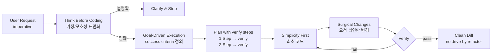

> 원문: [forrestchang/andrej-karpathy-skills (CLAUDE.md for Claude Code)](https://github.com/forrestchang/andrej-karpathy-skills)
> ↩ 출처 호: [2026-05-04 AI 동향 요약]()

## 📌 학습 정리

### 1. 한 줄 정의
**Karpathy의 LLM 코딩 함정 관찰**을 4개 원칙(Think Before Coding · Simplicity First · Surgical Changes · Goal-Driven Execution)으로 정제해 단일 **CLAUDE.md** 파일로 주입하는 **Claude Code 플러그인 / 프로젝트 룰** 저장소.

### 2. 왜 지금 중요한가
- **에이전트 행동 규약을 파일 한 장으로 주입**하는 패턴이 Claude Code plugin marketplace · Cursor `.cursor/rules/*.mdc`로 양쪽에서 표준화되는 흐름을 정면으로 보여줌.
- Karpathy가 지적한 **"wrong assumptions, hidden confusion, overcomplication, orthogonal edits"** 같은 에이전트 실패 모드가 실무에서 공감대를 얻으며, 이를 **system prompt 레이어가 아닌 skill/plugin 레이어**에서 다루는 흐름이 굳어짐.
- **"Don't tell it what to do, give it success criteria and watch it go"** — imperative → declarative 전환 원칙이 **agent loop의 종료 조건/검증 루프** 설계 핵심으로 부상.
- `/plugin marketplace add` → `/plugin install` 두 줄로 **사내 표준 가이드라인을 전사 배포**하는 운영 모델이 현실화 — `ff-claude-manager` 같은 자체 배포 도구의 존재 이유와 정확히 겹침.
- "**caution over speed**" trade-off를 명시적으로 선언 — 사소한 수정엔 과한 규율, 비자명한 작업엔 비용 절감이라는 **HITL 강도 조절** 사고와 동형.

### 3. 핵심 개념
| 용어 | 정의 | 비고/관련 키워드 |
|---|---|---|
| **Think Before Coding** | 가정·해석·트레이드오프를 명시적으로 표면화하고, 모호하면 멈추고 질문 | wrong assumptions, push back |
| **Simplicity First** | 요청된 것 이상의 기능·추상·설정·에러 처리 금지. "200줄이 50줄로 가능하면 다시 써라" | overengineering, senior engineer test |
| **Surgical Changes** | 요청된 코드만 건드림. 인접 코드 "개선" 금지, 기존 스타일 매칭, dead code는 언급만 | "Every changed line should trace directly to the user's request" |
| **Goal-Driven Execution** | 명령형 지시를 **검증 가능한 목표 + 루프**로 변환 (예: "Fix the bug" → "Write a test that reproduces it, then make it pass") | tests-first, success criteria, declarative goals |
| **Orphan cleanup 규칙** | 내 변경이 만든 unused import/var/func만 제거, 기존 dead code는 보존 | scope discipline |
| **Plugin 배포** | `/plugin marketplace add forrestchang/andrej-karpathy-skills` → `/plugin install andrej-karpathy-skills@karpathy-skills` | 전 프로젝트 공통 적용 |
| **Cursor 룰 동거** | `.cursor/rules/karpathy-guidelines.mdc`로 동일 규칙 Cursor 측 동기 | CURSOR.md 참조 |

### 4. 작동 원리 / 구조
4개 원칙은 각각 **에이전트 실패 모드 한 종류씩**과 1:1로 매칭된다. 핵심 변환은 명령형 지시 → 검증 루프 가능한 선언적 목표로 재기술하는 것.



배포 측면은 **Option A: Claude Code Plugin** (marketplace 등록 → 설치, 전 프로젝트 공통) vs **Option B: per-project CLAUDE.md** (curl로 신규 생성 또는 append) 양 갈래.

### 5. 실제 사용법 / 예시
원문에 등장한 명령 그대로:

```
/plugin marketplace add forrestchang/andrej-karpathy-skills
/plugin install andrej-karpathy-skills@karpathy-skills
```

```bash
# 신규 프로젝트
curl -o CLAUDE.md https://raw.githubusercontent.com/forrestchang/andrej-karpathy-skills/main/CLAUDE.md

# 기존 프로젝트 append
echo "" >> CLAUDE.md
curl https://raw.githubusercontent.com/forrestchang/andrej-karpathy-skills/main/CLAUDE.md >> CLAUDE.md
```

명령형 → 선언형 변환 표(원문 인용):

| Instead of... | Transform to... |
|---|---|
| "Add validation" | "Write tests for invalid inputs, then make them pass" |
| "Fix the bug" | "Write a test that reproduces it, then make it pass" |
| "Refactor X" | "Ensure tests pass before and after" |

프로젝트 고유 규칙 병합 예시(원문 인용):

```
## Project-Specific Guidelines
- Use TypeScript strict mode
- All API endpoints must have tests
- Follow the existing error handling patterns in `src/utils/errors.ts`
```

### 6. 사용자 프로젝트 접목

**DCSAI 측**
- **`dcs-ai-plugin`(Claude Code plugins)의 베이스라인 skill**로 채택 — `forrestchang/andrej-karpathy-skills` 4원칙을 그대로 가져와 `dcs-ai-plugin@dcsai-skills` 마켓플레이스 엔트리로 재패키징하고, **`ff-claude-manager`(Tauri 2)** 자동 배포 파이프라인이 사내 전 머신에 `/plugin install`을 일괄 실행하게 묶기. 사내 정책(예: FSD 폴더 규칙, server-only 강제)은 "Project-Specific Guidelines" 섹션으로 append.
- **agent loop의 종료 조건**을 **Goal-Driven Execution**으로 재설계 — Anthropic SDK 직통합 루프에서 tool call 결과를 "success criteria 충족 여부" 검증 단계로 명시 분기, **HITL 분기**는 "Stop when confused" 원칙을 트리거로 사용해 모호성·해석 충돌이 감지될 때 사용자 승인 게이트로 강제 라우팅.
- **MCP host server 자체 구현**의 시스템 프롬프트 계층에 **Surgical Changes** 규칙을 하드코딩 — 도구 응답이 요청 범위를 벗어난 파일을 수정하려 하면 차단/경고하는 가드레일과 결합.
- **HTTP chunked streaming** 응답에 "1.Step → verify, 2.Step → verify" 형태의 plan 블록을 우선 흘려보내, 클라이언트가 **검증 단계 단위로 HITL 끼어들기**가 가능하게 UX 변경.

**Team Agent 측**
- **`brand.yaml` 주입 구조** 위에 Karpathy 4원칙을 **`platform-core-agent` 공통 베이스라인**으로 두고, **`discovery-core-agent`(브랜드별)** 가 brand-specific guideline을 append하는 2층 구조. CLAUDE.md merge 패턴 그대로 차용.
- **Quest 3계층(전체·파티·플레이어)** 각 레벨에 **success criteria + verify** 포맷을 강제 — 특히 플레이어 Quest는 "imperative → declarative" 변환을 필수 필드로 만들고, **Activity Log/Observer L1~L4 피드백 루프**가 verify 단계의 통과/실패 신호를 그대로 수집하도록 스키마 정렬.
- **dcsai KG MCP 직연결** 시점에 **Think Before Coding** 원칙 적용 — KG 조회 결과가 모호하거나 다중 해석 가능할 때 silent pick 금지, Observer가 "다중 해석 표면화 실패"를 L2 이상의 결함으로 태깅.
- **server-only / FSD 경계 침범**은 **Surgical Changes** 위반으로 정의 — 에이전트가 클라이언트 컴포넌트로 server-only 코드를 흘리거나 FSD layer를 역참조하면 자동 reject.

### 7. 더 파고들 거리
- [Andrej Karpathy's observations](https://x.com/jiayuan_jy) — 원문에서 인용된 LLM 코딩 함정 포스트 (원문 본문에는 별도 직링크 없이 "Andrej's post"로만 표기되어 있어, 정확한 트윗 URL은 저장소 README 본체에서 재확인 필요)
- **Multica** — 저자가 함께 소개한 "open-source platform for running and managing coding agents with reusable skills" (원문에서 직링크 URL 미제공, 이름만 언급)
- 동봉된 **CURSOR.md** 및 **`.cursor/rules/karpathy-guidelines.mdc`** — Claude Code ↔ Cursor 룰 시스템 호환 패턴 사례

---

## 📖 원문 전체 번역 (정독용)

> 의역 최소화한 전체 번역입니다. 큰 흐름은 위 정리에서 잡고, 정확한 워딩이 필요할 땐 이 섹션에서 정독하세요.

# Karpathy에서 영감을 받은 Claude Code 가이드라인

제 새 프로젝트 **Multica**를 확인해보세요 — 재사용 가능한 스킬을 통해 코딩 에이전트를 실행하고 관리하는 오픈소스 플랫폼입니다.
X에서 팔로우하세요: https://x.com/jiayuan_jy

[Andrej Karpathy의 LLM 코딩 함정에 대한 관찰](https://x.com/karpathy)에서 도출한, Claude Code 동작을 개선하기 위한 단일 `CLAUDE.md` 파일입니다.

English | 简体中文

---

## 문제점

Andrej의 글에서 인용:

> "모델들은 당신을 대신해 잘못된 가정을 세우고, 그것을 확인하지 않은 채 그냥 진행해버립니다. 혼란을 관리하지 않고, 명확한 설명을 구하지 않으며, 불일치를 드러내지 않고, 트레이드오프를 제시하지 않으며, 마땅히 반론을 제기해야 할 때도 그러지 않습니다."

> "모델들은 코드와 API를 지나치게 복잡하게 만들고, 추상화를 비대하게 부풀리며, 죽은 코드를 정리하지 않습니다... 100줄로 충분한 것을 1000줄짜리 비대한 구조로 구현합니다."

> "모델들은 여전히 때때로 자신이 충분히 이해하지 못한 주석과 코드를 사이드 이펙트로 변경하거나 삭제합니다. 심지어 작업과 무관한 코드도 건드립니다."

---

## 해결책

이 문제들을 직접적으로 해결하는 네 가지 원칙을 하나의 파일에 담았습니다:

| 원칙 | 해결하는 문제 |
|---|---|
| 코딩 전 사고 (Think Before Coding) | 잘못된 가정, 숨겨진 혼란, 누락된 트레이드오프 |
| 단순함 우선 (Simplicity First) | 과도한 복잡화, 비대한 추상화 |
| 외과적 변경 (Surgical Changes) | 무관한 편집, 건드리지 말아야 할 코드 수정 |
| 목표 주도 실행 (Goal-Driven Execution) | 테스트 우선 방식을 통한 레버리지, 검증 가능한 성공 기준 |

---

## 네 가지 원칙 상세 설명

### 1. 코딩 전 사고 (Think Before Coding)

가정하지 마세요. 혼란을 숨기지 마세요. 트레이드오프를 드러내세요.

LLM은 종종 조용히 하나의 해석을 선택하고 그대로 진행합니다. 이 원칙은 명시적인 추론을 강제합니다:

- **가정을 명시적으로 서술하기** — 불확실할 경우 추측하지 말고 질문하기
- **여러 해석 제시하기** — 모호함이 있을 때 조용히 선택하지 않기
- **필요할 때 반론 제기하기** — 더 단순한 접근 방식이 있다면 말하기
- **혼란스러울 때 멈추기** — 불분명한 것을 명명하고 명확한 설명 요청하기

### 2. 단순함 우선 (Simplicity First)

문제를 해결하는 최소한의 코드만. 추측성 코드는 없습니다.

과도한 엔지니어링 경향에 맞서세요:

- 요청받은 것 이상의 기능 추가 금지
- 단일 사용 코드에 대한 추상화 금지
- 요청되지 않은 "유연성" 또는 "설정 가능성" 금지
- 불가능한 시나리오에 대한 에러 처리 금지
- 200줄이 50줄이 될 수 있다면 다시 작성하기

**테스트:** 시니어 엔지니어가 "이건 너무 복잡하다"고 말할 것 같은가? 그렇다면 단순화하세요.

### 3. 외과적 변경 (Surgical Changes)

반드시 필요한 것만 건드리세요. 자신이 만든 문제만 정리하세요.

기존 코드를 편집할 때:

- 인접한 코드, 주석, 또는 포맷을 "개선"하지 않기
- 고장나지 않은 것을 리팩토링하지 않기
- 다르게 하고 싶더라도 기존 스타일에 맞추기
- 무관한 죽은 코드를 발견하면 언급만 하기 — 삭제하지 않기

변경으로 인해 고립된 코드가 생겼을 때:

- **내 변경으로 인해** 사용되지 않게 된 import/변수/함수는 제거하기
- 요청받지 않은 기존 죽은 코드는 제거하지 않기

**테스트:** 변경된 모든 줄이 사용자의 요청으로 직접 추적 가능해야 합니다.

### 4. 목표 주도 실행 (Goal-Driven Execution)

성공 기준을 정의하세요. 검증될 때까지 반복하세요.

명령형 작업을 검증 가능한 목표로 변환하세요:

| 대신... | 이렇게 변환하세요... |
|---|---|
| "유효성 검사 추가" | "잘못된 입력에 대한 테스트를 작성하고, 통과시키기" |
| "버그 수정" | "버그를 재현하는 테스트를 작성하고, 통과시키기" |
| "X 리팩토링" | "리팩토링 전후로 테스트가 통과하는지 확인하기" |

멀티스텝 작업의 경우, 간략한 계획을 서술하세요:

```
1. [단계] → 검증: [확인 사항]
2. [단계] → 검증: [확인 사항]
3. [단계] → 검증: [확인 사항]
```

강력한 성공 기준은 LLM이 독립적으로 루프를 돌 수 있게 합니다. 약한 기준("작동하게 만들어")은 지속적인 명확화를 필요로 합니다.

---

## 설치

### 옵션 A: Claude Code 플러그인 (권장)

Claude Code 내에서 먼저 마켓플레이스를 추가하세요:

```
/plugin marketplace add forrestchang/andrej-karpathy-skills
```

그런 다음 플러그인을 설치하세요:

```
/plugin install andrej-karpathy-skills@karpathy-skills
```

가이드라인을 Claude Code 플러그인으로 설치하면, 모든 프로젝트에서 해당 스킬을 사용할 수 있습니다.

### 옵션 B: CLAUDE.md (프로젝트별)

새 프로젝트:

```bash
curl -o CLAUDE.md https://raw.githubusercontent.com/forrestchang/andrej-karpathy-skills/main/CLAUDE.md
```

기존 프로젝트 (추가):

```bash
echo "" >> CLAUDE.md
curl https://raw.githubusercontent.com/forrestchang/andrej-karpathy-skills/main/CLAUDE.md >> CLAUDE.md
```

---

## Cursor와 함께 사용하기

이 저장소에는 커밋된 Cursor 프로젝트 규칙(`.cursor/rules/karpathy-guidelines.mdc`)이 포함되어 있어, Cursor에서 프로젝트를 열 때도 동일한 가이드라인이 적용됩니다. 설정 방법, 다른 프로젝트에서 규칙 사용하는 방법, 그리고 Claude Code와의 관계에 대해서는 `CURSOR.md`를 참조하세요.

---

## 핵심 인사이트

Andrej의 말에서:

> "LLM은 특정 목표를 충족할 때까지 루프를 도는 데 매우 뛰어납니다... 무엇을 해야 하는지 지시하지 말고, 성공 기준을 제시하고 지켜보세요."

"목표 주도 실행" 원칙이 이것을 포착합니다: 명령형 지시를 검증 루프가 있는 선언적 목표로 변환하세요.

---

## 작동 여부 확인 방법

다음을 확인하면 가이드라인이 작동하고 있는 것입니다:

- **diff에서 불필요한 변경이 줄어듦** — 요청된 변경만 나타남
- **과도한 복잡화로 인한 재작성이 줄어듦** — 처음부터 코드가 단순함
- **구현 전에 명확화 질문이 먼저 나옴** — 실수 이후가 아니라
- **깔끔하고 최소한의 PR** — 드라이브바이 리팩토링이나 "개선" 없음

---

## 커스터마이징

이 가이드라인은 프로젝트별 지시사항과 병합되도록 설계되었습니다. 기존 `CLAUDE.md`에 추가하거나 새로 만드세요.

프로젝트별 규칙을 위해 다음과 같은 섹션을 추가하세요:

```markdown
## 프로젝트별 가이드라인
- TypeScript strict 모드 사용
- 모든 API 엔드포인트에는 테스트 필수
- `src/utils/errors.ts`의 기존 에러 처리 패턴을 따를 것
```

---

## 트레이드오프 참고 사항

이 가이드라인은 **속도보다 신중함**에 편향되어 있습니다. 간단한 작업(단순한 오타 수정, 명백한 한 줄짜리 변경)의 경우 판단력을 사용하세요 — 모든 변경이 완전한 엄격함을 필요로 하지는 않습니다.

목표는 사소한 작업을 늦추는 것이 아니라, 중요한 작업에서 비용이 큰 실수를 줄이는 것입니다.

---

## 라이선스

MIT
