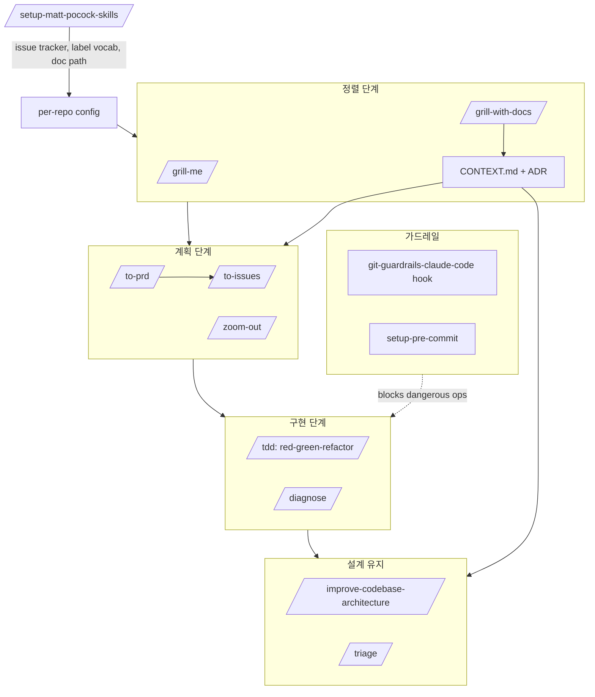

<div class="ai-knowledge-shell">

<aside class="ai-knowledge-sidebar">
  <p class="ai-eyebrow">CATEGORIES</p>
  <nav class="ai-cat-tree"><details class="ai-cat" open><summary><span class="catname">에이전트 오케스트레이션</span><span class="catcount">6</span></summary><ul><li><a href="https://altjs4510.github.io/ai_news_blog/knowledge/20260611/"><span class="kdate">2026-06-11</span><span class="ktitle">The evolution of agentic surfaces: building with…</span></a></li><li><a href="https://altjs4510.github.io/ai_news_blog/knowledge/20260602/"><span class="kdate">2026-06-02</span><span class="ktitle">revfactory/harness — 도메인별 에이전트 팀과 스킬을 자동 설계하는 메타…</span></a></li><li><a href="https://altjs4510.github.io/ai_news_blog/knowledge/20260529/"><span class="kdate">2026-05-29</span><span class="ktitle">Introducing dynamic workflows in Claude Code</span></a></li><li><a href="https://altjs4510.github.io/ai_news_blog/knowledge/20260520/"><span class="kdate">2026-05-20</span><span class="ktitle">New in Claude Managed Agents: self-hosted sandbo…</span></a></li><li><a href="https://altjs4510.github.io/ai_news_blog/knowledge/20260507/"><span class="kdate">2026-05-07</span><span class="ktitle">ruvnet/ruflo — Claude 멀티 에이전트 오케스트레이션 플랫폼</span></a></li><li><a href="https://altjs4510.github.io/ai_news_blog/knowledge/20260504/"><span class="kdate">2026-05-04</span><span class="ktitle">Agents for Everything Else: Codex for Knowledge …</span></a></li></ul></details><details class="ai-cat" open><summary><span class="catname">MCP &amp; 도구 통합</span><span class="catcount">8</span></summary><ul><li><a href="https://altjs4510.github.io/ai_news_blog/knowledge/20260604/"><span class="kdate">2026-06-04</span><span class="ktitle">chopratejas/headroom — Compress tool outputs bef…</span></a></li><li><a href="https://altjs4510.github.io/ai_news_blog/knowledge/20260603/"><span class="kdate">2026-06-03</span><span class="ktitle">How Bad MCP design cost your Agent 5× more token…</span></a></li><li><a href="https://altjs4510.github.io/ai_news_blog/knowledge/20260526/"><span class="kdate">2026-05-26</span><span class="ktitle">colbymchenry/codegraph — Pre-indexed code knowle…</span></a></li><li><a href="https://altjs4510.github.io/ai_news_blog/knowledge/20260523/"><span class="kdate">2026-05-23</span><span class="ktitle">colbymchenry/codegraph — 사전 인덱싱된 코드 지식 그래프 MCP</span></a></li><li><a href="https://altjs4510.github.io/ai_news_blog/knowledge/20260521/"><span class="kdate">2026-05-21</span><span class="ktitle">colbymchenry/codegraph — Pre-indexed code knowle…</span></a></li><li><a href="https://altjs4510.github.io/ai_news_blog/knowledge/20260519/"><span class="kdate">2026-05-19</span><span class="ktitle">Anthropic acquires Stainless</span></a></li><li><a href="https://altjs4510.github.io/ai_news_blog/knowledge/20260517/"><span class="kdate">2026-05-17</span><span class="ktitle">I gave my LLM 100,000+ tools — Lazy Discovery &a…</span></a></li><li><a href="https://altjs4510.github.io/ai_news_blog/knowledge/20260509/"><span class="kdate">2026-05-09</span><span class="ktitle">How to connect 100 MCP servers without the conte…</span></a></li></ul></details><details class="ai-cat" open><summary><span class="catname">코딩 에이전트</span><span class="catcount">8</span></summary><ul><li><a href="https://altjs4510.github.io/ai_news_blog/knowledge/20260530/"><span class="kdate">2026-05-30</span><span class="ktitle">Leonxlnx/taste-skill — AI에게 좋은 취향을 부여해 generic s…</span></a></li><li><a href="https://altjs4510.github.io/ai_news_blog/knowledge/20260528/"><span class="kdate">2026-05-28</span><span class="ktitle">Building self-improving tax agents with Codex</span></a></li><li><a href="https://altjs4510.github.io/ai_news_blog/knowledge/20260524/"><span class="kdate">2026-05-24</span><span class="ktitle">colbymchenry/codegraph — Pre-indexed code knowle…</span></a></li><li><a href="https://altjs4510.github.io/ai_news_blog/knowledge/20260512/"><span class="kdate">2026-05-12</span><span class="ktitle">agentmemory — Persistent memory for AI coding ag…</span></a></li><li><a href="https://altjs4510.github.io/ai_news_blog/knowledge/20260510/"><span class="kdate">2026-05-10</span><span class="ktitle">addyosmani/agent-skills — Production-grade engin…</span></a></li><li><a href="https://altjs4510.github.io/ai_news_blog/knowledge/20260508/"><span class="kdate">2026-05-08</span><span class="ktitle">addyosmani/agent-skills — Production-grade engin…</span></a></li><li><a href="https://altjs4510.github.io/ai_news_blog/knowledge/20260506/"><span class="kdate">2026-05-06</span><span class="ktitle">mksglu/context-mode — AI 코딩 에이전트용 컨텍스트 윈도우 최적화</span></a></li><li><a href="https://altjs4510.github.io/ai_news_blog/knowledge/20260505/" class="current"><span class="kdate">2026-05-05</span><span class="ktitle">mattpocock/skills — Skills for Real Engineers (.…</span></a></li></ul></details><details class="ai-cat" open><summary><span class="catname">모델 &amp; 연구</span><span class="catcount">3</span></summary><ul><li><a href="https://altjs4510.github.io/ai_news_blog/knowledge/20260617/"><span class="kdate">2026-06-17</span><span class="ktitle">Predicting model behavior before release by simu…</span></a></li><li><a href="https://altjs4510.github.io/ai_news_blog/knowledge/20260516/"><span class="kdate">2026-05-16</span><span class="ktitle">STALE — 에이전트가 자기 기억의 유효성을 인지할 수 있는가</span></a></li><li><a href="https://altjs4510.github.io/ai_news_blog/knowledge/20260513/"><span class="kdate">2026-05-13</span><span class="ktitle">Thinking Machines' Native Interaction Models — T…</span></a></li></ul></details><details class="ai-cat" open><summary><span class="catname">인프라 &amp; 컴퓨트</span><span class="catcount">4</span></summary><ul><li><a href="https://altjs4510.github.io/ai_news_blog/knowledge/20260610/"><span class="kdate">2026-06-10</span><span class="ktitle">Fable 5 just made cost-aware model routing manda…</span></a></li><li><a href="https://altjs4510.github.io/ai_news_blog/knowledge/20260606/"><span class="kdate">2026-06-06</span><span class="ktitle">chopratejas/headroom — Compress tool outputs, lo…</span></a></li><li><a href="https://altjs4510.github.io/ai_news_blog/knowledge/20260605/"><span class="kdate">2026-06-05</span><span class="ktitle">chopratejas/headroom — Compress tool outputs, lo…</span></a></li><li><a href="https://altjs4510.github.io/ai_news_blog/knowledge/20260522/"><span class="kdate">2026-05-22</span><span class="ktitle">Giving Agents Computers — Ivan Burazin, Daytona</span></a></li></ul></details><details class="ai-cat" open><summary><span class="catname">보안 &amp; 거버넌스</span><span class="catcount">6</span></summary><ul><li><a href="https://altjs4510.github.io/ai_news_blog/knowledge/20260614/"><span class="kdate">2026-06-14</span><span class="ktitle">NVIDIA/SkillSpector — Security scanner for AI ag…</span></a></li><li><a href="https://altjs4510.github.io/ai_news_blog/knowledge/20260613/"><span class="kdate">2026-06-13</span><span class="ktitle">Fable 5's guardrails got bypassed in 48 hours — …</span></a></li><li><a href="https://altjs4510.github.io/ai_news_blog/knowledge/20260612/"><span class="kdate">2026-06-12</span><span class="ktitle">NVIDIA/SkillSpector — AI 에이전트 스킬용 보안 스캐너</span></a></li><li><a href="https://altjs4510.github.io/ai_news_blog/knowledge/20260607/"><span class="kdate">2026-06-07</span><span class="ktitle">OpenAI Help: Lockdown Mode</span></a></li><li><a href="https://altjs4510.github.io/ai_news_blog/knowledge/20260531/"><span class="kdate">2026-05-31</span><span class="ktitle">How we contain Claude across products</span></a></li><li><a href="https://altjs4510.github.io/ai_news_blog/knowledge/20260527/"><span class="kdate">2026-05-27</span><span class="ktitle">Microsoft Copilot Cowork Exfiltrates Files</span></a></li></ul></details><details class="ai-cat" open><summary><span class="catname">응용 사례</span><span class="catcount">3</span></summary><ul><li><a href="https://altjs4510.github.io/ai_news_blog/knowledge/20260609/"><span class="kdate">2026-06-09</span><span class="ktitle">Building intelligent apps for Apple platforms wi…</span></a></li><li><a href="https://altjs4510.github.io/ai_news_blog/knowledge/20260515/"><span class="kdate">2026-05-15</span><span class="ktitle">Clawdmeter — Claude Code 사용량을 데스크톱 대시보드로</span></a></li><li><a href="https://altjs4510.github.io/ai_news_blog/knowledge/20260514/"><span class="kdate">2026-05-14</span><span class="ktitle">Introducing Claude for Small Business</span></a></li></ul></details><details class="ai-cat" open><summary><span class="catname">산업 동향</span><span class="catcount">1</span></summary><ul><li><a href="https://altjs4510.github.io/ai_news_blog/knowledge/20260616/"><span class="kdate">2026-06-16</span><span class="ktitle">Why AI hasn't replaced software engineers, and w…</span></a></li></ul></details></nav>
</aside>

<article class="ai-knowledge-article">

<header class="ai-post-hero">
  <p class="ai-eyebrow"><a class="ai-back" href="../">KNOWLEDGE</a> · 2026-05-05 · 학습 노트</p>
  <h1 class="ai-post-title">mattpocock/skills — Skills for Real Engineers (.claude directory 공개)</h1>
</header>

> 원문: [mattpocock/skills — Skills for Real Engineers (.claude directory 공개)](https://github.com/mattpocock/skills)
>
> ↩ 출처 호: [2026-05-05 AI 동향 요약]()

## 📌 학습 정리

### 1. 한 줄 정의
**Matt Pocock**이 매일 실전 엔지니어링에 쓰는 **Claude Code/Codex용 skill 모음**으로, 작고 조립 가능하며 모델 무관하게 동작하도록 설계된 **에이전트 실패 모드 4가지(정렬 실패·과잉 verbosity·코드 작동 실패·진흙공 아키텍처)** 대응 도구다.

### 2. 왜 지금 중요한가
- **GSD/BMAD/Spec-Kit 같은 프로세스 소유형 프레임워크의 반대 노선** — 프로세스를 빼앗지 않고 작은 skill 단위로 조립하게 해 버그 추적과 통제권을 사용자에게 남긴다.
- **에이전트 자율성↑ 시대의 가드레일 패턴**으로 `git-guardrails-claude-code` 처럼 **위험 명령(push, reset --hard, clean) 차단 hook**이 표준 skill로 들어와 있어, Cursor 9초 DB 삭제류 사고의 1차 방어선 레퍼런스가 된다.
- **공유 언어(ubiquitous language) + ADR을 skill에 내장**해 도메인 모델을 코드/대화/이름짓기에 일관되게 흐르게 하는, **DDD를 에이전트 워크플로에 이식**한 첫 실전 사례에 가깝다.
- **red-green-refactor TDD를 skill로 강제**(`/tdd`)하고 **debugging loop도 skill화**(`/diagnose`)해, 에이전트의 피드백 루프 부재 문제를 코드화된 절차로 해결한다.
- **`/improve-codebase-architecture`를 며칠마다 돌려 ball-of-mud를 정기 청소**하라는 운영 권고는, 에이전트가 가속하는 **소프트웨어 엔트로피**에 대한 새로운 운영 모델 제안이다.

### 3. 핵심 개념
| 용어 | 정의 | 비고/관련 키워드 |
|---|---|---|
| **Skill** | 작고 조립 가능한 에이전트 행동 단위, 모델 무관 | `/grill-me`, `/tdd` 등 슬래시 커맨드 |
| **Grilling Session** | 변경 시작 전 에이전트가 사용자에게 디테일을 캐묻는 정렬 단계 | `/grill-me`, `/grill-with-docs` |
| **Shared Language / CONTEXT.md** | 프로젝트 jargon을 디코딩하는 도메인 문서 | DDD ubiquitous language, ADR과 짝 |
| **ADR** | 설명하기 어려운 결정을 기록하는 아키텍처 결정 문서 | `docs/adr/` |
| **Red-Green-Refactor** | 실패 테스트 → 통과 → 리팩터로 이어지는 TDD 피드백 루프 | `/tdd` |
| **Diagnosis Loop** | 재현 → 최소화 → 가설 → 계측 → 수정 → 회귀 테스트 | `/diagnose` |
| **Vertical Slice** | 계획·PRD를 독립적으로 잡을 수 있는 단위로 쪼개기 | `/to-issues`, `/tdd` |
| **Triage State Machine** | 라벨 기반 역할 전이로 이슈를 분류 | `/triage`, label vocabulary |
| **Deepening (Ousterhout)** | 단순 인터페이스로 큰 기능을 감싸는 깊은 모듈 만들기 | `/improve-codebase-architecture` |
| **Caveman Mode** | filler 제거로 토큰 ~75% 절감하는 압축 통신 모드 | 기술 정확도 유지 |
| **Git Guardrails Hook** | Claude Code hook으로 위험 git 명령 사전 차단 | push, reset --hard, clean |

### 4. 작동 원리 / 구조



핵심은 **`/setup-matt-pocock-skills`로 repo별 config(이슈 트래커·triage 라벨·docs 경로)를 1회 세팅**한 뒤, 다른 skill들이 그 config를 공통 소비하는 구조다. **`CONTEXT.md` + `docs/adr/`이 모든 skill의 공유 메모리** 역할을 한다.

### 5. 실제 사용법 / 예시

설치 명령:
```
npx skills@latest add mattpocock/skills
```

세팅 명령(에이전트 안에서 실행):
```
/setup-matt-pocock-skills
```

CONTEXT.md 효과 예시(원문 인용):
- BEFORE: "There's a problem when a lesson inside a section of a course is made 'real' (i.e. given a spot in the file system)"
- AFTER: "There's a problem with the materialization cascade"

이외 슬래시 커맨드: `/grill-me`, `/grill-with-docs`, `/to-prd`, `/to-issues`, `/triage`, `/tdd`, `/diagnose`, `/zoom-out`, `/improve-codebase-architecture`, `/caveman`, `/write-a-skill`, `git-guardrails-claude-code`, `migrate-to-shoehorn`, `scaffold-exercises`, `setup-pre-commit`.

### 6. 사용자 프로젝트 접목

- **DCSAI `dcs-ai-plugin`(Claude Code plugin)에 사내 표준 skill 디렉터리를 그대로 포팅** — `git-guardrails-claude-code` hook 패턴을 차용해 **DCSAI agent loop의 HITL 분기**에 DB 변경/삭제·Snowflake 쓰기·Neo4j 스키마 변경을 사전 차단하는 **위험 작업 전용 skill**로 1차 PoC. `setup-matt-pocock-skills` 같은 **per-repo config 세팅 skill**을 만들어 `ff-claude-manager`(Tauri 2)가 사내 레포에 일괄 배포·업데이트하는 파이프라인에 결합.
- **DCSAI MCP host 서버에 `/grill-with-docs` 흐름을 MCP tool로 노출** — Anthropic SDK 직통합 agent loop 안에서 변경 시작 전 **CONTEXT.md/ADR 자동 갱신**을 강제, **HTTP chunked streaming**으로 grilling 질문을 점진 표시. `/diagnose`·`/tdd` skill을 MCP tool 카탈로그에 등록해 코드 작업 에이전트의 기본 절차로 사용.
- **Team Agent `discovery-core-agent`별 `brand.yaml` 옆에 브랜드별 `CONTEXT.md`(공유 언어 사전) + `docs/adr/`를 페어로 둔다** — 브랜드 jargon(상품 라이프사이클, 채널 용어)을 ubiquitous language로 고정해 **L1~L4 Activity Log/Observer 피드백 루프의 토큰 비용**을 줄이고 라벨 일관성을 확보. `/improve-codebase-architecture`의 deepening 관점을 **`platform-core-agent`가 크로스 브랜드 모듈 리팩터를 정기 점검**하는 cron 형태 Quest로 편성.
- **Quest 3계층(전체·파티·플레이어)에 `/to-prd` → `/to-issues` vertical slice 패턴 이식** — 전체 Quest를 PRD로, 파티/플레이어 Quest를 독립 grabbable 이슈로 쪼개고, `/triage` state machine을 **Observer 라벨 어휘**와 매핑해 자동 트리아지. **FSD/server-only Next.js 15** 코드베이스에는 `/zoom-out`을 PR 리뷰 봇으로 붙여 슬라이스 경계 침범을 사전 경고.

### 7. 더 파고들 거리
- [Sign Up To The Newsletter](https://github.com/mattpocock/skills) — 원문 내 동일 페이지 링크(저자 뉴스레터 안내)
- 원문 인용 도서: David Thomas & Andrew Hunt, *The Pragmatic Programmer* / Eric Evans, *Domain-Driven Design* / Kent Beck, *Extreme Programming Explained* / John Ousterhout, *A Philosophy Of Software Design* (외부 URL은 원문에 없음)

---

## 📖 원문 전체 번역 (정독용)

> 의역 최소화한 전체 번역입니다. 큰 흐름은 위 정리에서 잡고, 정확한 워딩이 필요할 땐 이 섹션에서 정독하세요.

# 실제 엔지니어를 위한 스킬 (Skills For Real Engineers)

바이브 코딩이 아닌, 실제 엔지니어링에 매일 사용하는 나의 에이전트 스킬들.

실제 애플리케이션 개발은 어렵다. GSD, BMAD, Spec-Kit 같은 접근법들은 프로세스를 직접 관장함으로써 도움을 주려 한다. 하지만 그렇게 하는 과정에서 개발자의 통제권을 빼앗고, 프로세스 내의 버그를 해결하기 어렵게 만든다.

이 스킬들은 작고, 적응하기 쉬우며, 조합 가능하도록 설계되었다. 어떤 모델에서도 동작한다. 수십 년의 엔지니어링 경험을 바탕으로 만들어졌다. 마음껏 변형하고, 자신만의 것으로 만들어라. 즐겨라.

이 스킬들의 변경 사항과 새로 만드는 스킬들을 계속 받아보고 싶다면, 약 60,000명의 다른 개발자들이 구독 중인 뉴스레터에 가입할 수 있다.

---

## 빠른 시작 (30초 설정)

`skills.sh` 인스톨러를 실행한다:

```
npx skills@latest add mattpocock/skills
```

원하는 스킬과 설치할 코딩 에이전트를 선택한다.

반드시 `/setup-matt-pocock-skills`를 선택한다.

에이전트에서 `/setup-matt-pocock-skills`를 실행한다. 그러면 다음을 수행한다:

- 사용하려는 이슈 트래커 선택 요청 (GitHub, Linear, 또는 로컬 파일)
- 티켓 트리아지 시 적용하는 레이블 입력 요청 (`/triage`는 레이블을 사용함)
- 생성하는 문서를 저장할 위치 입력 요청

완료 — 이제 시작할 준비가 됐다.

---

## 이 스킬들이 존재하는 이유

나는 Claude Code, Codex, 그리고 다른 코딩 에이전트에서 흔히 보이는 실패 패턴을 수정하기 위해 이 스킬들을 만들었다.

---

### #1: 에이전트가 내가 원하는 것을 하지 않는다

> "아무도 자신이 정확히 무엇을 원하는지 모른다"
> — David Thomas & Andrew Hunt, *The Pragmatic Programmer*

**문제.** 소프트웨어 개발에서 가장 흔한 실패 패턴은 정렬 불일치(misalignment)다. 개발자가 내가 원하는 것을 안다고 생각한다. 그런데 개발자가 만든 결과물을 보면 — 전혀 이해하지 못했다는 것을 깨닫게 된다.

AI 시대에도 마찬가지다. 당신과 에이전트 사이에는 커뮤니케이션 간극이 존재한다. 이를 해결하는 방법은 **심문 세션 (grilling session)** — 에이전트가 당신이 만들고 있는 것에 대해 상세한 질문을 던지게 하는 것이다.

**해결책**으로 다음을 사용한다:

- `/grill-me` — 코드가 아닌 용도에 사용
- `/grill-with-docs` — `/grill-me`와 동일하되, 추가 기능이 있음 (아래 참고)

이것들은 내 스킬 중 가장 인기 있는 것들이다. 시작하기 전에 에이전트와 정렬을 맞추고, 만들고자 하는 변경사항에 대해 깊이 생각하는 데 도움을 준다. 변경을 원할 때마다 **매번** 사용하라.

---

### #2: 에이전트가 너무 장황하다

> "유비쿼터스 언어를 사용하면, 개발자들 간의 대화와 코드의 표현이 모두 동일한 도메인 모델로부터 파생된다."
> — Eric Evans, *Domain-Driven Design*

**문제**: 프로젝트 초반에는 개발자와 소프트웨어를 함께 만드는 사람들(도메인 전문가)이 보통 서로 다른 언어를 쓰고 있다.

나는 에이전트와도 동일한 긴장감을 느꼈다. 에이전트들은 보통 프로젝트에 투입된 후 전문 용어를 알아서 파악하도록 요청받는다. 그래서 1개의 단어로 충분한 것을 20개의 단어로 표현한다.

**해결책**은 공유 언어(shared language)다. 에이전트가 프로젝트에서 사용하는 전문 용어를 해독하는 데 도움을 주는 문서다.

**예시**

아래는 내 `course-video-manager` 저장소의 `CONTEXT.md` 예시다. 어느 쪽이 읽기 쉬운가?

- **이전**: "코스의 섹션 안에 있는 레슨이 '실체화'될 때(즉, 파일 시스템에 자리를 부여받을 때) 문제가 발생한다"
- **이후**: "materialization cascade에 문제가 있다"

이 간결함은 세션이 거듭될수록 효과를 발휘한다.

이 기능은 `/grill-with-docs`에 내장되어 있다. 심문 세션이지만, AI와 공유 언어를 구축하고, 설명하기 어려운 결정사항들을 ADR (Architecture Decision Record)로 문서화하는 데 도움을 준다.

이것이 얼마나 강력한지 설명하기가 쉽지 않다. 이 저장소에서 가장 멋진 단일 기법일 수도 있다. 직접 써보면 안다.

> **팁**
> 공유 언어는 장황함 감소 외에도 다양한 이점이 있다:
> - **변수, 함수, 파일이 일관성 있게 명명된다**, 공유 언어를 사용해
> - 그 결과, **코드베이스를 에이전트가 탐색하기 더 쉬워진다**
> - 에이전트는 **더 간결한 언어에 접근할 수 있기 때문에 생각하는 데 소비하는 토큰이 줄어든다**

---

### #3: 코드가 작동하지 않는다

> "항상 작고 의도적인 단계를 밟아라. 피드백 속도가 곧 당신의 속도 제한이다. 너무 큰 작업은 절대 맡지 마라."
> — David Thomas & Andrew Hunt, *The Pragmatic Programmer*

**문제**: 당신과 에이전트가 무엇을 만들지 정렬이 되어 있다고 하자. 그런데 에이전트가 **여전히** 엉망인 코드를 만들어내면 어떻게 되는가?

피드백 루프를 살펴볼 때다. 에이전트가 만든 코드가 실제로 어떻게 실행되는지에 대한 피드백 없이는, 에이전트는 눈을 감고 비행하는 것이나 마찬가지다.

**해결책**: 정적 타입, 브라우저 접근, 자동화된 테스트라는 일반적인 피드백 루프들이 필요하다.

자동화된 테스트의 경우, red-green-refactor 루프가 핵심이다. 에이전트가 먼저 실패하는 테스트를 작성한 다음, 그 테스트를 통과시키는 방식이다. 이는 에이전트에게 일관된 수준의 피드백을 제공하여 훨씬 나은 코드를 만들어낸다.

어떤 프로젝트에도 꽂아 쓸 수 있는 `/tdd` 스킬을 만들었다. red-green-refactor를 장려하고, 좋은 테스트와 나쁜 테스트가 무엇인지에 대한 충분한 지침을 에이전트에게 제공한다.

디버깅을 위해서는, 최선의 디버깅 관행을 단순한 루프로 감싼 `/diagnose` 스킬도 만들었다.

---

### #4: 우리는 진흙 덩어리 (Ball of Mud)를 만들었다

> "**매일** 시스템 설계에 투자하라."
> — Kent Beck, *Extreme Programming Explained*

> "최고의 모듈은 깊다. 단순한 인터페이스를 통해 많은 기능에 접근할 수 있게 해준다."
> — John Ousterhout, *A Philosophy of Software Design*

**문제**: 에이전트로 만든 대부분의 앱은 복잡하고 변경하기 어렵다. 에이전트가 코딩 속도를 급격히 높일 수 있기 때문에, 소프트웨어 엔트로피도 가속화된다. 코드베이스는 전례 없는 속도로 복잡해진다.

**해결책**은 AI 기반 개발에 대한 근본적으로 새로운 접근법이다: 코드 설계를 신경 쓰는 것.

이는 이 스킬들의 모든 계층에 내장되어 있다:

- `/to-prd`는 PRD를 만들기 전에 어떤 모듈에 손을 대는지 퀴즈를 낸다
- `/zoom-out`은 에이전트에게 전체 시스템 맥락에서 코드를 설명하도록 지시한다
- 그리고 결정적으로, `/improve-codebase-architecture`는 진흙 덩어리가 된 코드베이스를 구제하는 데 도움을 준다. 며칠에 한 번씩 코드베이스에 실행하는 것을 권장한다.

---

## 요약

소프트웨어 엔지니어링의 기본 원칙은 그 어느 때보다 중요하다. 이 스킬들은 이러한 기본 원칙을 반복 가능한 관행으로 응축하여, 당신이 커리어 최고의 앱을 출시할 수 있도록 돕기 위한 나의 최선의 노력이다. 즐겨라.

---

## 참고 자료 (Reference)

### 엔지니어링 (Engineering)

코드 작업에 매일 사용하는 스킬들.

- **diagnose** — 어려운 버그와 성능 회귀에 대한 규율 있는 진단 루프: 재현 → 최소화 → 가설 수립 → 계측 → 수정 → 회귀 테스트.
- **grill-with-docs** — 기존 도메인 모델에 대해 계획을 검증하고, 용어를 명확히 하며, `CONTEXT.md`와 ADR을 인라인으로 업데이트하는 심문 세션.
- **triage** — 트리아지 역할의 상태 머신을 통해 이슈를 트리아지한다.
- **improve-codebase-architecture** — `CONTEXT.md`의 도메인 언어와 `docs/adr/`의 결정사항을 참고하여, 코드베이스에서 심화(deepening) 기회를 발굴한다.
- **setup-matt-pocock-skills** — `to-issues`, `to-prd`, `triage`, `diagnose`, `tdd`, `improve-codebase-architecture`, `zoom-out`을 사용하기 전에, 다른 엔지니어링 스킬들이 소비하는 저장소별 설정(이슈 트래커, 트리아지 레이블 어휘, 도메인 문서 레이아웃)을 스캐폴드한다. 저장소당 한 번 실행한다.
- **tdd** — red-green-refactor 루프를 활용한 테스트 주도 개발. 수직 슬라이스 단위로 기능을 구축하거나 버그를 수정한다.
- **to-issues** — 임의의 계획, 스펙, PRD를 수직 슬라이스를 사용해 독립적으로 가져갈 수 있는 GitHub 이슈로 분해한다.
- **to-prd** — 현재 대화 컨텍스트를 PRD로 변환하고 GitHub 이슈로 제출한다. 인터뷰 없이 — 이미 논의한 내용을 종합하기만 한다.
- **zoom-out** — 에이전트에게 줌 아웃하여, 익숙하지 않은 코드 섹션에 대해 더 넓은 맥락 또는 상위 수준의 관점을 제공하도록 지시한다.

---

### 생산성 (Productivity)

코드에 특화되지 않은 일반 워크플로 도구들.

- **caveman** — 초압축 커뮤니케이션 모드. 불필요한 표현을 제거하되 완전한 기술적 정확성을 유지함으로써 토큰 사용량을 약 75% 줄인다.
- **grill-me** — 의사결정 트리의 모든 분기가 해소될 때까지 계획이나 설계에 대해 집요하게 인터뷰 받는다.
- **write-a-skill** — 적절한 구조, 점진적 공개(progressive disclosure), 번들 리소스를 갖춘 새 스킬을 만든다.

---

### 기타 (Misc)

보관해두지만 거의 사용하지 않는 도구들.

- **git-guardrails-claude-code** — 위험한 git 명령어(push, reset --hard, clean 등)가 실행되기 전에 차단하는 Claude Code 훅을 설정한다.
- **migrate-to-shoehorn** — `as` 타입 단언을 사용하는 테스트 파일을 @total-typescript/shoehorn으로 마이그레이션한다.
- **scaffold-exercises** — 섹션, 문제, 풀이, 설명이 포함된 연습 디렉토리 구조를 생성한다.
- **setup-pre-commit** — lint-staged, Prettier, 타입 검사, 테스트를 포함한 Husky pre-commit 훅을 설정한다.

</article>

</div>

<!-- ai-related-links -->
<aside class="ai-related-links">
  <p class="ai-eyebrow">관련 학습</p>
  <ul><li><a href="https://altjs4510.github.io/ai_news_blog/knowledge/20260504/"><span class="kdate">2026-05-04</span><span class="ktitle">Agents for Everything Else: Codex for Knowledge …</span></a></li><li><a href="https://altjs4510.github.io/ai_news_blog/knowledge/20260506/"><span class="kdate">2026-05-06</span><span class="ktitle">mattpocock/skills — Skills for Real Engineers (.…</span></a></li></ul>
</aside>
<!-- /ai-related-links -->
