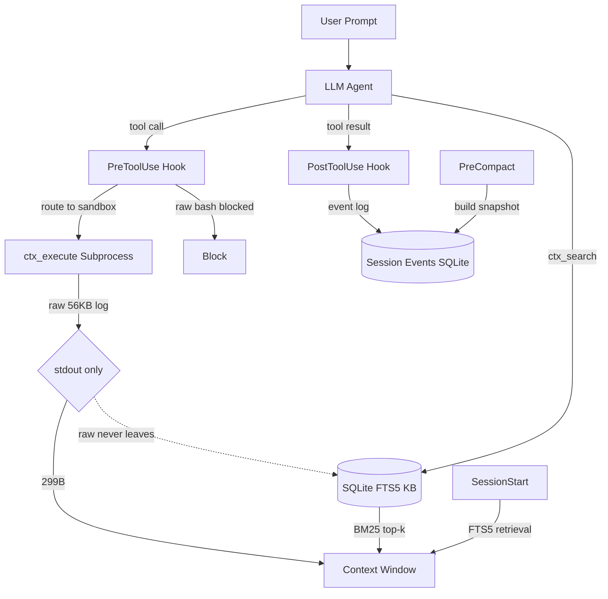

<div class="ai-knowledge-shell">

<aside class="ai-knowledge-sidebar">
  <p class="ai-eyebrow">CATEGORIES</p>
  <nav class="ai-cat-tree"><details class="ai-cat" open><summary><span class="catname">에이전트 오케스트레이션</span><span class="catcount">6</span></summary><ul><li><a href="https://altjs4510.github.io/ai_news_blog/knowledge/20260805/"><span class="kdate">2026-08-05</span><span class="ktitle">TencentCloud/TencentDB-Agent-Memory — 대화·문서·코드를 …</span></a></li><li><a href="https://altjs4510.github.io/ai_news_blog/knowledge/20260707/"><span class="kdate">2026-07-07</span><span class="ktitle">AI Hero Skills Catalog — 실무 엔지니어를 위한 재사용 가능한 판단 …</span></a></li><li><a href="https://altjs4510.github.io/ai_news_blog/knowledge/20260623/"><span class="kdate">2026-06-23</span><span class="ktitle">bytedance/deer-flow — 샌드박스·메모리·서브에이전트·메시지 게이트웨이를…</span></a></li><li><a href="https://altjs4510.github.io/ai_news_blog/knowledge/20260602/"><span class="kdate">2026-06-02</span><span class="ktitle">revfactory/harness — 도메인별 에이전트 팀과 스킬을 자동 설계하는 메타…</span></a></li><li><a href="https://altjs4510.github.io/ai_news_blog/knowledge/20260529/"><span class="kdate">2026-05-29</span><span class="ktitle">Introducing dynamic workflows in Claude Code</span></a></li><li><a href="https://altjs4510.github.io/ai_news_blog/knowledge/20260507/"><span class="kdate">2026-05-07</span><span class="ktitle">ruvnet/ruflo — Claude 멀티 에이전트 오케스트레이션 플랫폼</span></a></li></ul></details><details class="ai-cat" open><summary><span class="catname">MCP &amp; 도구 통합</span><span class="catcount">17</span></summary><ul><li><a href="https://altjs4510.github.io/ai_news_blog/knowledge/20260802/"><span class="kdate">2026-08-02</span><span class="ktitle">Stateless MCP has recaptured my interest (and in…</span></a></li><li><a href="https://altjs4510.github.io/ai_news_blog/knowledge/20260801/"><span class="kdate">2026-08-01</span><span class="ktitle">different-ai/openwork — Claude Cowork의 오픈소스 대체 에…</span></a></li><li><a href="https://altjs4510.github.io/ai_news_blog/knowledge/20260731/"><span class="kdate">2026-07-31</span><span class="ktitle">different-ai/openwork — Claude Cowork의 오픈소스 대안(o…</span></a></li><li><a href="https://altjs4510.github.io/ai_news_blog/knowledge/20260729/"><span class="kdate">2026-07-29</span><span class="ktitle">Bringing MCP 2026-07-28 to Claude</span></a></li><li><a href="https://altjs4510.github.io/ai_news_blog/knowledge/20260721/"><span class="kdate">2026-07-21</span><span class="ktitle">tirth8205/code-review-graph — 로컬 우선 코드 인텔리전스 그래프…</span></a></li><li><a href="https://altjs4510.github.io/ai_news_blog/knowledge/20260719/"><span class="kdate">2026-07-19</span><span class="ktitle">tirth8205/code-review-graph — 로컬 우선 코드 인텔리전스 그래프…</span></a></li><li><a href="https://altjs4510.github.io/ai_news_blog/knowledge/20260718/"><span class="kdate">2026-07-18</span><span class="ktitle">tirth8205/code-review-graph — MCP·CLI용 로컬 코드 인텔리…</span></a></li><li><a href="https://altjs4510.github.io/ai_news_blog/knowledge/20260708/"><span class="kdate">2026-07-08</span><span class="ktitle">Expanding Managed Agents in Gemini API: backgrou…</span></a></li><li><a href="https://altjs4510.github.io/ai_news_blog/knowledge/20260618/"><span class="kdate">2026-06-18</span><span class="ktitle">DeusData/codebase-memory-mcp — 158개 언어 코드베이스를 밀리…</span></a></li><li><a href="https://altjs4510.github.io/ai_news_blog/knowledge/20260606/"><span class="kdate">2026-06-06</span><span class="ktitle">chopratejas/headroom — Compress tool outputs, lo…</span></a></li><li><a href="https://altjs4510.github.io/ai_news_blog/knowledge/20260605/"><span class="kdate">2026-06-05</span><span class="ktitle">chopratejas/headroom — Compress tool outputs, lo…</span></a></li><li><a href="https://altjs4510.github.io/ai_news_blog/knowledge/20260604/"><span class="kdate">2026-06-04</span><span class="ktitle">chopratejas/headroom — Compress tool outputs bef…</span></a></li><li><a href="https://altjs4510.github.io/ai_news_blog/knowledge/20260603/"><span class="kdate">2026-06-03</span><span class="ktitle">How Bad MCP design cost your Agent 5× more token…</span></a></li><li><a href="https://altjs4510.github.io/ai_news_blog/knowledge/20260523/"><span class="kdate">2026-05-23</span><span class="ktitle">colbymchenry/codegraph — 사전 인덱싱된 코드 지식 그래프 MCP</span></a></li><li><a href="https://altjs4510.github.io/ai_news_blog/knowledge/20260517/"><span class="kdate">2026-05-17</span><span class="ktitle">I gave my LLM 100,000+ tools — Lazy Discovery &a…</span></a></li><li><a href="https://altjs4510.github.io/ai_news_blog/knowledge/20260509/"><span class="kdate">2026-05-09</span><span class="ktitle">How to connect 100 MCP servers without the conte…</span></a></li><li><a href="https://altjs4510.github.io/ai_news_blog/knowledge/20260506/" class="current"><span class="kdate">2026-05-06</span><span class="ktitle">mksglu/context-mode — AI 코딩 에이전트용 컨텍스트 윈도우 최적화</span></a></li></ul></details><details class="ai-cat" open><summary><span class="catname">코딩 에이전트</span><span class="catcount">21</span></summary><ul><li><a href="https://altjs4510.github.io/ai_news_blog/knowledge/20260811/"><span class="kdate">2026-08-11</span><span class="ktitle">PrimeIntellect-ai/prime-agent — 장기 자율 실행을 전제로 설계…</span></a></li><li><a href="https://altjs4510.github.io/ai_news_blog/knowledge/20260810/"><span class="kdate">2026-08-10</span><span class="ktitle">Auto mode is now the default in Claude Code for …</span></a></li><li><a href="https://altjs4510.github.io/ai_news_blog/knowledge/20260809/"><span class="kdate">2026-08-09</span><span class="ktitle">PrimeIntellect-ai/prime-agent — 코딩 워크플로우·장기 자율 작…</span></a></li><li><a href="https://altjs4510.github.io/ai_news_blog/knowledge/20260808/"><span class="kdate">2026-08-08</span><span class="ktitle">PrimeIntellect-ai/prime-agent — 코딩 워크플로우와 장시간 자율…</span></a></li><li><a href="https://altjs4510.github.io/ai_news_blog/knowledge/20260804/"><span class="kdate">2026-08-04</span><span class="ktitle">esengine/DeepSeek-Reasonix — prefix-cache 안정성을 축…</span></a></li><li><a href="https://altjs4510.github.io/ai_news_blog/knowledge/20260728/"><span class="kdate">2026-07-28</span><span class="ktitle">alibaba/open-code-review — 결정론적 파이프라인 + LLM 에이전트…</span></a></li><li><a href="https://altjs4510.github.io/ai_news_blog/knowledge/20260725/"><span class="kdate">2026-07-25</span><span class="ktitle">The new rules of context engineering for Claude …</span></a></li><li><a href="https://altjs4510.github.io/ai_news_blog/knowledge/20260722/"><span class="kdate">2026-07-22</span><span class="ktitle">tirth8205/code-review-graph — MCP·CLI용 로컬 우선 코드 …</span></a></li><li><a href="https://altjs4510.github.io/ai_news_blog/knowledge/20260714/"><span class="kdate">2026-07-14</span><span class="ktitle">Graphify-Labs/graphify — 코드베이스를 질의 가능한 지식 그래프로 만…</span></a></li><li><a href="https://altjs4510.github.io/ai_news_blog/knowledge/20260705/"><span class="kdate">2026-07-05</span><span class="ktitle">openai/codex-plugin-cc — Claude Code에서 Codex를 위임…</span></a></li><li><a href="https://altjs4510.github.io/ai_news_blog/knowledge/20260626/"><span class="kdate">2026-06-26</span><span class="ktitle">google-labs-code/design.md — 코딩 에이전트에게 디자인 시스템을 …</span></a></li><li><a href="https://altjs4510.github.io/ai_news_blog/knowledge/20260619/"><span class="kdate">2026-06-19</span><span class="ktitle">Claude Code now supports artifacts</span></a></li><li><a href="https://altjs4510.github.io/ai_news_blog/knowledge/20260530/"><span class="kdate">2026-05-30</span><span class="ktitle">Leonxlnx/taste-skill — AI에게 좋은 취향을 부여해 generic s…</span></a></li><li><a href="https://altjs4510.github.io/ai_news_blog/knowledge/20260528/"><span class="kdate">2026-05-28</span><span class="ktitle">Building self-improving tax agents with Codex</span></a></li><li><a href="https://altjs4510.github.io/ai_news_blog/knowledge/20260526/"><span class="kdate">2026-05-26</span><span class="ktitle">colbymchenry/codegraph — Pre-indexed code knowle…</span></a></li><li><a href="https://altjs4510.github.io/ai_news_blog/knowledge/20260524/"><span class="kdate">2026-05-24</span><span class="ktitle">colbymchenry/codegraph — Pre-indexed code knowle…</span></a></li><li><a href="https://altjs4510.github.io/ai_news_blog/knowledge/20260521/"><span class="kdate">2026-05-21</span><span class="ktitle">colbymchenry/codegraph — Pre-indexed code knowle…</span></a></li><li><a href="https://altjs4510.github.io/ai_news_blog/knowledge/20260512/"><span class="kdate">2026-05-12</span><span class="ktitle">agentmemory — Persistent memory for AI coding ag…</span></a></li><li><a href="https://altjs4510.github.io/ai_news_blog/knowledge/20260510/"><span class="kdate">2026-05-10</span><span class="ktitle">addyosmani/agent-skills — Production-grade engin…</span></a></li><li><a href="https://altjs4510.github.io/ai_news_blog/knowledge/20260508/"><span class="kdate">2026-05-08</span><span class="ktitle">addyosmani/agent-skills — Production-grade engin…</span></a></li><li><a href="https://altjs4510.github.io/ai_news_blog/knowledge/20260505/"><span class="kdate">2026-05-05</span><span class="ktitle">mattpocock/skills — Skills for Real Engineers (.…</span></a></li></ul></details><details class="ai-cat" open><summary><span class="catname">모델 &amp; 연구</span><span class="catcount">5</span></summary><ul><li><a href="https://altjs4510.github.io/ai_news_blog/knowledge/20260716-proprag/"><span class="kdate">2026-07-16</span><span class="ktitle">PropRAG — 프로포지션 경로 위 beam search로 멀티홉 검색 안내</span></a></li><li><a href="https://altjs4510.github.io/ai_news_blog/knowledge/20260620/"><span class="kdate">2026-06-20</span><span class="ktitle">zai-org/GLM-5 — From Vibe Coding to Agentic Engi…</span></a></li><li><a href="https://altjs4510.github.io/ai_news_blog/knowledge/20260617/"><span class="kdate">2026-06-17</span><span class="ktitle">Predicting model behavior before release by simu…</span></a></li><li><a href="https://altjs4510.github.io/ai_news_blog/knowledge/20260516/"><span class="kdate">2026-05-16</span><span class="ktitle">STALE — 에이전트가 자기 기억의 유효성을 인지할 수 있는가</span></a></li><li><a href="https://altjs4510.github.io/ai_news_blog/knowledge/20260513/"><span class="kdate">2026-05-13</span><span class="ktitle">Thinking Machines' Native Interaction Models — T…</span></a></li></ul></details><details class="ai-cat" open><summary><span class="catname">인프라 &amp; 컴퓨트</span><span class="catcount">7</span></summary><ul><li><a href="https://altjs4510.github.io/ai_news_blog/knowledge/20260806/"><span class="kdate">2026-08-06</span><span class="ktitle">cloudflare/computer — 에이전트에게 컴퓨터를 통째로 주는 엣지 실행 샌…</span></a></li><li><a href="https://altjs4510.github.io/ai_news_blog/knowledge/20260724/"><span class="kdate">2026-07-24</span><span class="ktitle">diegosouzapw/OmniRoute — 단일 엔드포인트로 278+ 프로바이더·50…</span></a></li><li><a href="https://altjs4510.github.io/ai_news_blog/knowledge/20260723/"><span class="kdate">2026-07-23</span><span class="ktitle">diegosouzapw/OmniRoute — 268+ 프로바이더를 단일 엔드포인트로 묶…</span></a></li><li><a href="https://altjs4510.github.io/ai_news_blog/knowledge/20260630/"><span class="kdate">2026-06-30</span><span class="ktitle">Introducing the Claude apps gateway for Amazon B…</span></a></li><li><a href="https://altjs4510.github.io/ai_news_blog/knowledge/20260611/"><span class="kdate">2026-06-11</span><span class="ktitle">The evolution of agentic surfaces: building with…</span></a></li><li><a href="https://altjs4510.github.io/ai_news_blog/knowledge/20260522/"><span class="kdate">2026-05-22</span><span class="ktitle">Giving Agents Computers — Ivan Burazin, Daytona</span></a></li><li><a href="https://altjs4510.github.io/ai_news_blog/knowledge/20260520/"><span class="kdate">2026-05-20</span><span class="ktitle">New in Claude Managed Agents: self-hosted sandbo…</span></a></li></ul></details><details class="ai-cat" open><summary><span class="catname">보안 &amp; 거버넌스</span><span class="catcount">14</span></summary><ul><li><a href="https://altjs4510.github.io/ai_news_blog/knowledge/20260730/"><span class="kdate">2026-07-30</span><span class="ktitle">Anatomy of a Frontier Lab Agent Intrusion: A Tec…</span></a></li><li><a href="https://altjs4510.github.io/ai_news_blog/knowledge/20260716/"><span class="kdate">2026-07-16</span><span class="ktitle">Dicklesworthstone/destructive_command_guard — 에이…</span></a></li><li><a href="https://altjs4510.github.io/ai_news_blog/knowledge/20260715/"><span class="kdate">2026-07-15</span><span class="ktitle">Dicklesworthstone/destructive_command_guard — 에이…</span></a></li><li><a href="https://altjs4510.github.io/ai_news_blog/knowledge/20260710/"><span class="kdate">2026-07-10</span><span class="ktitle">70개 MCP 서버 strace 런타임 감사 — 부팅 시 아웃바운드 호출 서버 적발</span></a></li><li><a href="https://altjs4510.github.io/ai_news_blog/knowledge/20260704/"><span class="kdate">2026-07-04</span><span class="ktitle">Cloudflare is about to block AI agents by defaul…</span></a></li><li><a href="https://altjs4510.github.io/ai_news_blog/knowledge/20260703/"><span class="kdate">2026-07-03</span><span class="ktitle">Giving admins more visibility and control over C…</span></a></li><li><a href="https://altjs4510.github.io/ai_news_blog/knowledge/20260625/"><span class="kdate">2026-06-25</span><span class="ktitle">Agent identity in Claude Tag: a new access model…</span></a></li><li><a href="https://altjs4510.github.io/ai_news_blog/knowledge/20260624/"><span class="kdate">2026-06-24</span><span class="ktitle">Agent identity in Claude Tag: a new access model…</span></a></li><li><a href="https://altjs4510.github.io/ai_news_blog/knowledge/20260614/"><span class="kdate">2026-06-14</span><span class="ktitle">NVIDIA/SkillSpector — Security scanner for AI ag…</span></a></li><li><a href="https://altjs4510.github.io/ai_news_blog/knowledge/20260613/"><span class="kdate">2026-06-13</span><span class="ktitle">Fable 5's guardrails got bypassed in 48 hours — …</span></a></li><li><a href="https://altjs4510.github.io/ai_news_blog/knowledge/20260612/"><span class="kdate">2026-06-12</span><span class="ktitle">NVIDIA/SkillSpector — AI 에이전트 스킬용 보안 스캐너</span></a></li><li><a href="https://altjs4510.github.io/ai_news_blog/knowledge/20260607/"><span class="kdate">2026-06-07</span><span class="ktitle">OpenAI Help: Lockdown Mode</span></a></li><li><a href="https://altjs4510.github.io/ai_news_blog/knowledge/20260531/"><span class="kdate">2026-05-31</span><span class="ktitle">How we contain Claude across products</span></a></li><li><a href="https://altjs4510.github.io/ai_news_blog/knowledge/20260527/"><span class="kdate">2026-05-27</span><span class="ktitle">Microsoft Copilot Cowork Exfiltrates Files</span></a></li></ul></details><details class="ai-cat" open><summary><span class="catname">응용 사례</span><span class="catcount">7</span></summary><ul><li><a href="https://altjs4510.github.io/ai_news_blog/knowledge/20260726/"><span class="kdate">2026-07-26</span><span class="ktitle">citrolabs/ego-lite — 로그인된 브라우저 상태를 AI 에이전트와 공유하는…</span></a></li><li><a href="https://altjs4510.github.io/ai_news_blog/knowledge/20260717/"><span class="kdate">2026-07-17</span><span class="ktitle">After a year building agent memory, 'save everyt…</span></a></li><li><a href="https://altjs4510.github.io/ai_news_blog/knowledge/20260712/"><span class="kdate">2026-07-12</span><span class="ktitle">Do Automated Evals Work?</span></a></li><li><a href="https://altjs4510.github.io/ai_news_blog/knowledge/20260709/"><span class="kdate">2026-07-09</span><span class="ktitle">mvanhorn/last30days-skill — Reddit·X·YouTube·HN·…</span></a></li><li><a href="https://altjs4510.github.io/ai_news_blog/knowledge/20260621/"><span class="kdate">2026-06-21</span><span class="ktitle">calesthio/OpenMontage — 12 파이프라인·52 도구·500+ 스킬을 …</span></a></li><li><a href="https://altjs4510.github.io/ai_news_blog/knowledge/20260609/"><span class="kdate">2026-06-09</span><span class="ktitle">Building intelligent apps for Apple platforms wi…</span></a></li><li><a href="https://altjs4510.github.io/ai_news_blog/knowledge/20260514/"><span class="kdate">2026-05-14</span><span class="ktitle">Introducing Claude for Small Business</span></a></li></ul></details><details class="ai-cat" open><summary><span class="catname">산업 동향</span><span class="catcount">8</span></summary><ul><li><a href="https://altjs4510.github.io/ai_news_blog/knowledge/20260711/"><span class="kdate">2026-07-11</span><span class="ktitle">OpenAI says GPT 5.6 is the 'preferred model' for…</span></a></li><li><a href="https://altjs4510.github.io/ai_news_blog/knowledge/20260702/"><span class="kdate">2026-07-02</span><span class="ktitle">How Cursor deploys AI inside the enterprise (For…</span></a></li><li><a href="https://altjs4510.github.io/ai_news_blog/knowledge/20260701/"><span class="kdate">2026-07-01</span><span class="ktitle">Google OKF (Open Knowledge Format) — 벤더 중립 에이전트 …</span></a></li><li><a href="https://altjs4510.github.io/ai_news_blog/knowledge/20260616/"><span class="kdate">2026-06-16</span><span class="ktitle">Why AI hasn't replaced software engineers, and w…</span></a></li><li><a href="https://altjs4510.github.io/ai_news_blog/knowledge/20260610/"><span class="kdate">2026-06-10</span><span class="ktitle">Fable 5 just made cost-aware model routing manda…</span></a></li><li><a href="https://altjs4510.github.io/ai_news_blog/knowledge/20260519/"><span class="kdate">2026-05-19</span><span class="ktitle">Anthropic acquires Stainless</span></a></li><li><a href="https://altjs4510.github.io/ai_news_blog/knowledge/20260515/"><span class="kdate">2026-05-15</span><span class="ktitle">Clawdmeter — Claude Code 사용량을 데스크톱 대시보드로</span></a></li><li><a href="https://altjs4510.github.io/ai_news_blog/knowledge/20260504/"><span class="kdate">2026-05-04</span><span class="ktitle">Agents for Everything Else: Codex for Knowledge …</span></a></li></ul></details></nav>
</aside>

<article class="ai-knowledge-article">

<header class="ai-post-hero">
  <p class="ai-eyebrow"><a class="ai-back" href="../">KNOWLEDGE</a> · 2026-05-06 · 오늘의 학습</p>
  <h2 class="ai-post-title">mksglu/context-mode — AI 코딩 에이전트용 컨텍스트 윈도우 최적화</h2>
</header>

> 원문: [mksglu/context-mode — AI 코딩 에이전트용 컨텍스트 윈도우 최적화](https://github.com/mksglu/context-mode)

## 📌 학습 정리

### 1. 한 줄 정의
**Context Mode**는 MCP 도구 호출 결과를 서브프로세스 샌드박스에 가둬 stdout만 컨텍스트로 흘려보내고, 세션 이벤트는 **SQLite FTS5 + BM25**로 인덱싱해 컴팩션 이후에도 연속성을 보장하는 **MCP 서버**다.

### 2. 왜 지금 중요한가
- **Agent loop의 컨텍스트 폭주 병목**을 정조준한다. Playwright 스냅샷 56KB, GitHub 이슈 20개 59KB, 액세스 로그 1개 45KB가 그대로 messages에 쌓이는 현실에서 **315KB → 5.4KB (98% 감축)**을 주장한다.
- 컴팩션이 일어나도 원문을 다시 컨텍스트에 덤프하지 않고 **FTS5 인덱스에서 BM25로 관련 조각만 회수**한다. "어떤 파일을 편집 중이었는지 잊어버리는" 전형적 long-running agent 문제 해결을 시도한다.
- **"Think in Code" 패러다임**: LLM을 데이터 처리기가 아닌 코드 생성기로 취급. 50개 파일 Read 대신 ctx_execute 스크립트 1개로 `console.log`만 컨텍스트에 진입 — `47 × Read() = 700 KB → 1 × ctx_execute() = 3.6 KB`.
- **Output Compression**: 모델 출력 자체도 caveman 스타일로 압축해 ~65-75% output token 감축. 입출력 양쪽 다 조인다.
- **Claude Code, Gemini CLI, VS Code/JetBrains Copilot, Cursor, Codex CLI, Qwen Code, OpenCode, Kiro, Zed** 등 14개 플랫폼에 통합 적용되는 **PreToolUse/PostToolUse/SessionStart/PreCompact 훅 표준화** 사례로서 가치.

### 3. 핵심 개념
| 용어 | 정의 | 비고/관련 키워드 |
|---|---|---|
| **Sandbox tool** | 격리된 서브프로세스에서 코드 실행, stdout만 컨텍스트로 진입 | `ctx_execute`, 11개 런타임(JS/TS/Python/Shell/Ruby/Go/Rust/PHP/Perl/R/Elixir), Bun 자동 감지 |
| **Knowledge Base** | 마크다운을 heading 기준으로 chunking, code block 보존 후 FTS5 가상 테이블에 저장 | `bun:sqlite` / `node:sqlite` (Node 22.13+) / `better-sqlite3` 자동 선택 |
| **BM25 ranking** | 확률 기반 relevance 알고리즘으로 인덱스 검색 | `ctx_search`, on-demand retrieval |
| **Intent-driven filtering** | 출력이 5KB 초과 + intent 제공 시, 전체를 인덱싱 후 intent 매칭 부분만 반환 | searchable vocabulary 동반 |
| **Session Continuity** | 파일 편집·git 작업·태스크·에러·사용자 결정을 SQLite에 기록, 컴팩션 후 재진입 시 BM25로만 회수 | `--continue` 없으면 즉시 삭제(clean slate) |
| **Output Compression** | "Terse like caveman" 스타일 강제 — 관사/필러/완곡어 제거, fragment 허용, 보안 경고만 auto-expand | ~65-75% output token 감축 |
| **Hook 표준** | PreToolUse(라우팅 강제), PostToolUse(이벤트 캡처), SessionStart(상태 복원), PreCompact(스냅샷), UserPromptSubmit, Stop | 플랫폼마다 구현 상이 |
| **Credential passthrough** | `gh`, `aws`, `gcloud`, `kubectl`, `docker` CLI가 환경변수/config 경로를 상속하되 대화에는 노출 안 됨 | 인증된 CLI 활용 |

### 4. 작동 원리 / 구조



핵심 설계: **raw data는 sandbox 경계를 절대 넘지 않음**. 세션 이벤트는 별도 SQLite에 쌓이고, 컴팩션이 일어나면 dump 대신 **BM25 검색을 통한 lazy retrieval**로만 복원.

### 5. 실제 사용법 / 예시

**Think in Code 패러다임 — 47 Read를 1 execute로**:
```js
// Before: 47 × Read() = 700 KB.  After: 1 × ctx_execute() = 3.6 KB.
ctx_execute("javascript", `
const files = fs.readdirSync('src').filter(f => f.endsWith('.ts'));
files.forEach(f => console.log(f + ': ' + fs.readFileSync('src/'+f,'utf8').split('\\n').length + ' lines'));
`);
```

**Tool 카탈로그(원문 표 인용)**:
- `ctx_batch_execute` — 다중 명령+검색 1콜, concurrency 1-8 (986 KB → 62 KB)
- `ctx_execute` — 11개 언어 코드 실행, stdout만 진입 (56 KB → 299 B)
- `ctx_execute_file` — 샌드박스 파일 처리 (45 KB → 155 B)
- `ctx_index` — 마크다운 → FTS5 + BM25 (60 KB → 40 B)
- `ctx_search` — 다중 쿼리 1콜
- `ctx_fetch_and_index` — URL fetch + 인덱싱, 24h TTL 캐시, `requests: [{url, source}, ...]` + `concurrency: 1-8` 병렬

**Claude Code 설치(원문 그대로)**:
```
/plugin marketplace add mksglu/context-mode
/plugin install context-mode@context-mode
```

**Gemini CLI BeforeTool matcher 패턴** — 무거운 도구만 가로채기:
```
"matcher": "run_shell_command|read_file|read_many_files|grep_search|search_file_content|web_fetch|activate_skill|mcp__plugin_context-mode"
```
경량 도구는 훅 오버헤드 회피, 대형 출력 도구만 인터셉트하는 설계 원칙.

**Cursor 한계점** — `additional_context`를 hook response로 받지만 모델에 surface하지 않음([forum #155689](https://forum.cursor.com)는 본문 표기), 그래서 `.cursor/rules/context-mode.mdc` rules 파일로 우회.

**Codex CLI 한계점** — PreToolUse가 아직 deny rule만 지원, `updatedInput` rewrite 미지원 ([openai/codex#18491](https://github.com/openai/codex) 추적), 컨텍스트 주입은 PostToolUse/SessionStart로 우회.

### 6. 사용자 프로젝트 접목

- **DCSAI agent loop / Anthropic SDK 직통합**: tool_use → tool_result 사이클에서 **MCP host server가 받는 응답을 messages에 그대로 append하지 말고 sandbox 패턴으로 재설계**. KG MCP나 Snowflake/Neo4j 쿼리 결과 같은 대형 페이로드는 별도 SQLite FTS5 스토어에 인덱싱하고, agent에게는 "ref handle + intent-driven 요약"만 노출. **HTTP chunked streaming 세션의 토큰·지연 동시 절감**.
- **DCSAI MCP host**: 자체 구현한 host에 PreToolUse/PostToolUse 훅 레이어를 추가해 **dangerous command deny + 결과 크기 임계치(원문 5KB) 초과 시 자동 인덱싱**으로 라우팅. ctx_execute 같은 sandbox tool을 KG MCP와 병렬로 등록해 "Think in Code" 패턴(LLM이 KG 결과를 가공할 때 직접 코드 생성) 시도.
- **DCSAI HITL 분기**: 원문의 **PreCompact + SessionStart hook 패턴**을 HITL 승인 대기 상태 저장에 차용. 사용자가 자리를 비웠다 돌아왔을 때 컨텍스트 dump 대신 **이벤트 로그 BM25 회수**로 "어디까지 진행됐는지" 복원하는 구조 — `--continue` 의미론이 HITL resume과 정확히 매칭.
- **dcs-ai-cli (Rust) / dcs-ai-plugin (Claude Code)**: plugin 쪽은 원문이 직접 다루는 영역이라 **context-mode를 plugin marketplace 의존성으로 동시 설치하는 권장 셋업**을 ff-claude-manager(Tauri 2)에서 자동화. statusline 토글 + `/context-mode:ctx-stats`를 매니저 UI에 노출.
- **Team Agent — discovery-core-agent ↔ platform-core-agent**: 두 계층 사이 **KG MCP 응답을 platform 레벨에서 한 번 인덱싱하고 brand별 agent에는 ref만 전달**. brand.yaml 주입 시 brand-scoped FTS5 namespace를 함께 만들어 brand간 컨텍스트 cross-leak 방지.
- **Activity Log / Observer 피드백 루프(L1~L4)**: 원문의 **23 event categories · 90 metrics · 4 composite scores(productivity, quality, delegation, context health)** 구조는 Observer가 측정해야 할 KPI 후보 그대로. `ctx_insight` 대시보드 설계가 L3/L4 평가 지표 정의의 레퍼런스가 됨.
- **Quest 3계층 / server-only**: Player 단위 quest 진행 상태를 server-only 영역의 FTS5 KB에 저장하고, 파티/전체 quest는 **상위 namespace에서 BM25 회수**로 합치는 구조. FSD 측에서는 KB write/read를 server-only feature로 격리.

### 7. 더 파고들 거리
- 저장소 본체: [mksglu/context-mode](https://github.com/mksglu/context-mode)
- 호환 플랫폼 사례: [OpenClaw plugin API](https://github.com/mksglu/context-mode.git)(원문 인용 git URL), Pi Agent, OpenCode `experimental.chat.system.transform` / `experimental.session.compacting` 훅
- 업스트림 이슈 추적(원문 언급): `openai/codex#18491` (PreToolUse updatedInput 지원), Cursor forum #155689 (additional_context surface), OpenCode #14808 / #5409 (SessionStart 부재)
- Linux SIGSEGV 회피 — `node:sqlite` 빌트인 모듈로의 자동 폴백(원문에서 V8 `madvise(MADV_DONTNEED)`이 `.got.plt` 손상시키는 이슈 언급)

---

## 📖 원문 전체 번역 (정독용)

> 의역 최소화한 전체 번역입니다. 큰 흐름은 위 정리에서 잡고, 정확한 워딩이 필요할 땐 이 섹션에서 정독하세요.

# Context Mode

컨텍스트 문제의 나머지 절반.

---

## 문제점

MCP 툴을 호출할 때마다 원시 데이터가 컨텍스트 윈도우에 그대로 쏟아집니다. Playwright 스냅샷 하나에 56 KB, GitHub 이슈 20개에 59 KB, 접근 로그 하나에 45 KB가 소모됩니다. 30분이 지나면 컨텍스트의 40%가 사라집니다. 에이전트가 공간을 확보하기 위해 대화를 압축(compact)하면, 어떤 파일을 편집하고 있었는지, 어떤 작업이 진행 중이었는지, 마지막으로 무엇을 요청했는지를 잊어버립니다. 게다가 에이전트는 군더더기 문장, 인사말, 장황한 설명에 출력 토큰을 낭비하여 양쪽에서 컨텍스트를 소진시킵니다.

---

## Context Mode가 문제를 해결하는 방법

Context Mode는 이 문제의 네 가지 측면을 모두 해결하는 MCP 서버입니다.

**컨텍스트 절약 (Context Saving)**
— 샌드박스 툴이 원시 데이터를 컨텍스트 윈도우 밖에 유지합니다. 315 KB가 5.4 KB로 줄어듭니다. 98% 감소.

**세션 연속성 (Session Continuity)**
— 모든 파일 편집, git 작업, 태스크, 오류, 사용자 결정이 SQLite에 추적됩니다. 대화가 압축될 때 context-mode는 이 데이터를 다시 컨텍스트에 덤프하지 않고, 이벤트를 FTS5에 인덱싱하여 BM25 검색을 통해 관련 항목만 검색합니다. 모델은 정확히 중단된 지점에서 다시 시작합니다. `--continue`를 사용하지 않으면 이전 세션 데이터가 즉시 삭제됩니다. 새 세션은 깨끗한 슬레이트를 의미합니다.

**코드로 생각하기 (Think in Code)**
— LLM은 분석을 직접 수행하는 것이 아니라 분석을 수행하는 코드를 작성해야 합니다. 함수 수를 세기 위해 50개의 파일을 컨텍스트로 읽는 대신, 에이전트는 카운팅을 수행하고 결과만 `console.log()`로 출력하는 스크립트를 작성합니다. 스크립트 하나가 툴 호출 열 개를 대체하고 컨텍스트를 100배 절약합니다. 이것은 14개 플랫폼 전체에 걸친 필수 패러다임입니다. LLM을 데이터 프로세서로 취급하지 말고, 코드 생성기로 취급하세요.

```javascript
// 이전: 47 × Read() = 700 KB.  이후: 1 × ctx_execute() = 3.6 KB.
ctx_execute("javascript", `
const files = fs.readdirSync('src').filter(f => f.endsWith('.ts'));
files.forEach(f => console.log(f + ': ' + fs.readFileSync('src/'+f,'utf8').split('\\n').length + ' lines'));
`);
```

**출력 압축 (Output Compression)**
— 원시인처럼 간결하게. 기술적 내용은 정확하게. 군더더기만 제거. 관사, 불필요한 표현(just/really/basically), 인사말, 회피 표현 생략. 단편적 문장 허용. 짧은 동의어 사용. 코드는 그대로 유지. 패턴: [대상] [행동] [이유]. [다음 단계]. 보안 경고, 되돌릴 수 없는 작업, 사용자 혼동 시 자동 확장. 완전한 기술적 정확성을 유지하면서 출력 토큰 약 65~75% 감소.

---

## 설치

플랫폼은 설치 복잡도에 따라 분류됩니다. 훅(hook)을 지원하는 플랫폼은 자동 라우팅 적용을 받습니다. 훅을 지원하지 않는 플랫폼은 라우팅 파일을 한 번 복사해야 합니다.

---

### Claude Code — 플러그인 마켓플레이스, 완전 자동

**전제 조건:**
Claude Code v1.0.33+ (`claude --version`). `/plugin`이 인식되지 않으면 먼저 업데이트하세요:
`brew upgrade claude-code` 또는 `npm update -g @anthropic-ai/claude-code`

**설치:**

```
/plugin marketplace add mksglu/context-mode
/plugin install context-mode@context-mode
```

Claude Code를 재시작하거나 `/reload-plugins`를 실행합니다.

**검증:**

```
/context-mode:ctx-doctor
```

모든 항목이 `[x]`로 표시되어야 합니다. doctor는 런타임, 훅, FTS5, 플러그인 등록을 검증합니다.

**라우팅:**
자동. SessionStart 훅이 런타임에 라우팅 지시사항을 주입합니다. 프로젝트에 파일이 작성되지 않습니다. 플러그인은 모든 훅(PreToolUse, PostToolUse, PreCompact, SessionStart)과 11개의 MCP 툴을 등록합니다. 6개의 샌드박스 툴(`ctx_batch_execute`, `ctx_execute`, `ctx_execute_file`, `ctx_index`, `ctx_search`, `ctx_fetch_and_index`)과 5개의 메타 툴(`ctx_stats`, `ctx_doctor`, `ctx_upgrade`, `ctx_purge`, `ctx_insight`)로 구성됩니다.

| 슬래시 명령어 | 기능 |
|---|---|
| `/context-mode:ctx-stats` | 컨텍스트 절약 내역 — 툴별 분류, 소비 토큰, 절약 비율. |
| `/context-mode:ctx-doctor` | 진단 — 런타임, 훅, FTS5, 플러그인 등록, 버전. |
| `/context-mode:ctx-upgrade` | 최신 버전 가져오기, 재빌드, 캐시 마이그레이션, 훅 수정. |
| `/context-mode:ctx-purge` | 지식 베이스에서 인덱싱된 모든 콘텐츠 영구 삭제. |
| `/context-mode:ctx-insight` | 개인 분석 대시보드 — 90개 지표, 37개 인사이트 패턴, 23개 이벤트 카테고리에 걸친 4개 복합 점수(생산성, 품질, 위임, 컨텍스트 건강). 로컬 웹 UI 실행. |

**참고:** 슬래시 명령어는 Claude Code 플러그인 기능입니다. 다른 플랫폼에서는 채팅에 `ctx stats`, `ctx doctor`, `ctx upgrade`, `ctx insight`를 입력하면 모델이 MCP 툴을 자동으로 호출합니다. Utility Commands를 참조하세요.

**상태 표시줄 (선택 사항):**
Claude Code의 플러그인 매니페스트는 상태 표시줄을 선언할 수 없으므로, `~/.claude/settings.json`을 수동으로 한 번 편집해야 합니다:

```json
{
  "statusLine": {
    "type": "command",
    "command": "context-mode statusline"
  }
}
```

저장 후 Claude Code를 재시작합니다. 표시줄에 `$ 이번 세션 절약 · $ 전체 세션 절약 · % 효율`이 표시되어 절약량이 실시간으로 누적되는 것을 볼 수 있습니다. 배선은 경로 독립적입니다. `context-mode statusline`은 플러그인 캐시의 위치에 상관없이 번들된 CLI를 통해 해석됩니다.

**대안 — MCP 전용 설치 (훅 또는 슬래시 명령어 없음)**

```
claude mcp add context-mode -- npx -y context-mode
```

이 방법은 자동 라우팅 없이 11개의 MCP 툴 모두를 제공합니다. 모델이 툴을 사용할 수는 있지만 raw Bash/Read/WebFetch보다 우선하도록 유도되지 않습니다. 풀 플러그인으로 전환하기 전에 테스트해보기에 적합합니다.

---

### Gemini CLI — 설정 파일 하나, 훅 포함

**전제 조건:**
Node.js 18+, Gemini CLI 설치됨.

**설치:**

context-mode를 전역으로 설치합니다:

```
npm install -g context-mode
```

다음 내용을 `~/.gemini/settings.json`에 추가합니다. 이 단일 파일이 MCP 서버와 4개의 훅 모두를 등록합니다:

```json
{
  "mcpServers": {
    "context-mode": {
      "command": "context-mode"
    }
  },
  "hooks": {
    "BeforeTool": [
      {
        "matcher": "run_shell_command|read_file|read_many_files|grep_search|search_file_content|web_fetch|activate_skill|mcp__plugin_context-mode",
        "hooks": [{"type": "command", "command": "context-mode hook gemini-cli beforetool"}]
      }
    ],
    "AfterTool": [
      {
        "matcher": "",
        "hooks": [{"type": "command", "command": "context-mode hook gemini-cli aftertool"}]
      }
    ],
    "PreCompress": [
      {
        "matcher": "",
        "hooks": [{"type": "command", "command": "context-mode hook gemini-cli precompress"}]
      }
    ],
    "SessionStart": [
      {
        "matcher": "",
        "hooks": [{"type": "command", "command": "context-mode hook gemini-cli sessionstart"}]
      }
    ]
  }
}
```

Gemini CLI를 재시작합니다.

**검증:**

```
/mcp list
```

`context-mode: ... - Connected`가 표시되어야 합니다.

**라우팅:**
SessionStart 훅을 통해 자동. 모델의 완전한 라우팅 인식을 위해 라우팅 지시사항을 선택적으로 복사할 수 있습니다:

```
cp node_modules/context-mode/configs/gemini-cli/GEMINI.md ./GEMINI.md
```

**BeforeTool matcher를 사용하는 이유?**
대용량 출력을 생성하는 툴(`run_shell_command`, `read_file`, `read_many_files`, `grep_search`, `search_file_content`, `web_fetch`, `activate_skill`)과 context-mode 자체 툴(`mcp__plugin_context-mode`)만을 대상으로 합니다. 이렇게 하면 컨텍스트 윈도우에 과부하를 줄 수 있는 모든 툴을 차단하면서 경량 툴에 대한 불필요한 훅 오버헤드를 방지합니다.

전체 설정 참조: `configs/gemini-cli/settings.json`

---

### VS Code Copilot — SessionStart를 포함한 훅

**전제 조건:**
Node.js 18+, VS Code와 Copilot Chat v0.32+.

**설치:**

context-mode를 전역으로 설치합니다:

```
npm install -g context-mode
```

프로젝트 루트에 `.vscode/mcp.json`을 생성합니다:

```json
{
  "servers": {
    "context-mode": {
      "command": "context-mode"
    }
  }
}
```

`.github/hooks/context-mode.json`을 생성합니다:

```json
{
  "hooks": {
    "PreToolUse": [
      {"type": "command", "command": "context-mode hook vscode-copilot pretooluse"}
    ],
    "PostToolUse": [
      {"type": "command", "command": "context-mode hook vscode-copilot posttooluse"}
    ],
    "SessionStart": [
      {"type": "command", "command": "context-mode hook vscode-copilot sessionstart"}
    ]
  }
}
```

VS Code를 재시작합니다.

**검증:**
Copilot Chat을 열고 `ctx stats`를 입력합니다. context-mode 툴이 나타나고 응답해야 합니다.

**라우팅:**
SessionStart 훅을 통해 자동. 모델의 완전한 라우팅 인식을 위해 라우팅 지시사항을 선택적으로 복사할 수 있습니다:

```
cp node_modules/context-mode/configs/vscode-copilot/copilot-instructions.md .github/copilot-instructions.md
```

PreCompact를 포함한 전체 훅 설정: `configs/vscode-copilot/hooks.json`

---

### JetBrains Copilot — SessionStart를 포함한 훅

**전제 조건:**
Node.js 18+, GitHub Copilot 플러그인 v1.5.57+가 설치된 JetBrains IDE.

**설치:**

context-mode를 전역으로 설치합니다:

```
npm install -g context-mode
```

Settings UI를 통해 MCP 서버를 추가합니다:
`Settings > Tools > AI Assistant > Model Context Protocol (MCP) > Add Server`:

- 이름: `context-mode`
- 명령어: `context-mode`

`.github/hooks/context-mode.json`을 생성합니다:

```json
{
  "hooks": {
    "PreToolUse": [
      {"type": "command", "command": "context-mode hook jetbrains-copilot pretooluse"}
    ],
    "PostToolUse": [
      {"type": "command", "command": "context-mode hook jetbrains-copilot posttooluse"}
    ],
    "SessionStart": [
      {"type": "command", "command": "context-mode hook jetbrains-copilot sessionstart"}
    ]
  }
}
```

JetBrains IDE를 재시작합니다.

**검증:**
Copilot Chat을 열고 `ctx stats`를 입력합니다. context-mode 툴이 나타나고 응답해야 합니다.

**라우팅:**
SessionStart 훅을 통해 자동. 모델의 완전한 라우팅 인식을 위해 라우팅 지시사항을 선택적으로 복사할 수 있습니다:

```
cp node_modules/context-mode/configs/jetbrains-copilot/copilot-instructions.md .github/copilot-instructions.md
```

PreCompact를 포함한 전체 훅 설정: `configs/jetbrains-copilot/hooks.json`

전체 설치 가이드: `docs/jetbrains-copilot.md`

---

### Cursor — stop 지원을 포함한 훅

**전제 조건:**
Node.js 18+, 에이전트 모드를 사용하는 Cursor.

**설치:**

context-mode를 전역으로 설치합니다:

```
npm install -g context-mode
```

프로젝트 루트에 `.cursor/mcp.json`을 생성합니다 (또는 전역 설정의 경우 `~/.cursor/mcp.json`):

```json
{
  "mcpServers": {
    "context-mode": {
      "command": "context-mode"
    }
  }
}
```

`.cursor/hooks.json`을 생성합니다 (또는 전역 설정의 경우 `~/.cursor/hooks.json`):

```json
{
  "version": 1,
  "hooks": {
    "preToolUse": [
      {
        "command": "context-mode hook cursor pretooluse",
        "matcher": "Shell|Read|Grep|WebFetch|Task|MCP:ctx_execute|MCP:ctx_execute_file|MCP:ctx_batch_execute"
      }
    ],
    "postToolUse": [
      {
        "command": "context-mode hook cursor posttooluse"
      }
    ],
    "stop": [
      {
        "command": "context-mode hook cursor stop"
      }
    ]
  }
}
```

`preToolUse` matcher는 선택 사항입니다. 없으면 훅이 모든 툴에 대해 실행됩니다. `stop` 훅은 에이전트 턴이 종료될 때 실행되며 루프를 계속하기 위한 후속 메시지를 보낼 수 있습니다. `afterAgentResponse`도 사용 가능합니다 (fire-and-forget, 전체 응답 텍스트 수신).

라우팅 규칙 파일을 복사합니다. Cursor에는 SessionStart 훅이 없으므로 모델에게 라우팅 인식을 위한 규칙 파일이 필요합니다:

```
mkdir -p .cursor/rules
cp node_modules/context-mode/configs/cursor/context-mode.mdc .cursor/rules/context-mode.mdc
```

Cursor를 재시작하거나 새 에이전트 세션을 엽니다.

**검증:**
Cursor Settings > MCP를 열고 "context-mode"가 연결됨으로 표시되는지 확인합니다. 에이전트 채팅에서 `ctx stats`를 입력합니다.

**라우팅:**
훅이 `preToolUse`/`postToolUse`/`stop`을 통해 프로그래밍 방식으로 라우팅을 적용합니다. `.cursor/rules/context-mode.mdc` 파일은 Cursor의 `sessionStart` 훅이 현재 해당 유효성 검사기에 의해 거부되기 때문에 세션 시작 시 라우팅 지시사항을 제공합니다 (포럼 보고). 프로젝트 `.cursor/hooks.json`이 `~/.cursor/hooks.json`보다 우선합니다.

**알려진 제한사항:**
Cursor는 훅 응답에서 `additional_context`를 받지만 이를 모델에 노출하지 않습니다 (포럼 #155689). 라우팅은 훅 컨텍스트 주입 대신 `.mdc` 규칙 파일에 의존합니다.

전체 설정: `configs/cursor/hooks.json` | `configs/cursor/mcp.json` | `configs/cursor/context-mode.mdc`

---

### OpenCode — 훅을 포함한 TypeScript 플러그인

**전제 조건:**
Node.js 18+, OpenCode 설치됨.

**설치:**

context-mode를 전역으로 설치합니다:

```
npm install -g context-mode
```

프로젝트 루트의 `opencode.json`에 추가합니다 (또는 전역 설정의 경우 `~/.config/opencode/opencode.json`):

```json
{
  "$schema": "https://opencode.ai/config.json",
  "mcp": {
    "context-mode": {
      "type": "local",
      "command": ["context-mode"]
    }
  },
  "plugin": ["context-mode"]
}
```

`mcp` 항목은 11개의 MCP 툴을 모두 등록합니다. `plugin` 항목은 훅을 활성화합니다. OpenCode는 각 툴 실행 전후에 플러그인의 TypeScript 함수를 직접 호출하여 위험한 명령을 차단하고 샌드박스 라우팅을 적용합니다.

**(선택 사항)** 라우팅 규칙 파일을 복사합니다. 모델에게 라우팅 인식을 위한 `AGENTS.md` 파일이 필요합니다:

```
cp node_modules/context-mode/configs/opencode/AGENTS.md AGENTS.md
```

이 파일은 모델에게 어떤 툴을 사용할지, 어떤 명령이 차단되는지 알려줍니다. 없어도 훅이 라우팅을 적용하지만, 모델은 명령이 거부된 *이유*를 알 수 없습니다.

OpenCode를 재시작합니다.

**검증:**
OpenCode 세션에서 `ctx stats`를 입력합니다. context-mode 툴이 나타나고 응답해야 합니다.

**라우팅:**
훅이 `tool.execute.before`와 `tool.execute.after`를 통해 프로그래밍 방식으로 라우팅을 적용합니다. 선택적 `AGENTS.md` 파일은 모델 인식을 위한 라우팅 지시사항을 제공합니다. `experimental.session.compacting` 훅은 대화가 압축될 때 재개 스냅샷을 생성합니다. `experimental.chat.system.transform` 훅은 세션 시작 시 라우팅 블록과 이전 세션 스냅샷을 시스템 프롬프트에 주입하여 재시작 시 세션 연속성을 가능하게 합니다. `chat.message` 훅은 사용자 프롬프트와 결정을 캡처합니다 (UserPromptSubmit에 해당).

**참고:** OpenCode에는 실제 SessionStart 훅이 없습니다 (#14808, #5409). 플러그인은 `experimental.chat.system.transform`을 대리로 사용합니다. 라우팅 블록과 재개 스냅샷 모두를 시스템 프롬프트에 주입합니다. 사용자 프롬프트 캡처는 누락된 UserPromptSubmit 훅 대신 `chat.message`를 사용합니다. AGENTS.md/CLAUDE.md/CONTEXT.md 규칙은 프로젝트당 첫 번째 훅 실행 시 자동으로 캡처됩니다.

전체 설정: `configs/opencode/opencode.json` | `configs/opencode/AGENTS.md`

---

### KiloCode — 훅을 포함한 TypeScript 플러그인

**전제 조건:**
Node.js 18+, KiloCode 설치됨.

**설치:**

context-mode를 전역으로 설치합니다:

```
npm install -g context-mode
```

프로젝트 루트의 `kilo.json`에 추가합니다 (또는 전역 설정의 경우 `~/.config/kilo/kilo.json`):

```json
{
  "$schema": "https://app.kilo.ai/config.json",
  "mcp": {
    "context-mode": {
      "type": "local",
      "command": ["context-mode"]
    }
  },
  "plugin": ["context-mode"]
}
```

`mcp` 항목은 11개의 MCP 툴을 모두 등록합니다. `plugin` 항목은 훅을 활성화합니다. KiloCode는 각 툴 실행 전후에 플러그인의 TypeScript 함수를 직접 호출하여 위험한 명령을 차단하고 샌드박스 라우팅을 적용합니다.

**(선택 사항)** 라우팅 규칙 파일을 복사합니다. KiloCode는 OpenCode 플러그인 아키텍처를 공유하므로 모델에게 라우팅 인식을 위한 `AGENTS.md` 파일이 필요합니다:

```
cp node_modules/context-mode/configs/opencode/AGENTS.md AGENTS.md
```

KiloCode를 재시작합니다.

**검증:**
KiloCode 세션에서 `ctx stats`를 입력합니다. context-mode 툴이 나타나고 응답해야 합니다.

**라우팅:**
훅이 `tool.execute.before`와 `tool.execute.after`를 통해 프로그래밍 방식으로 라우팅을 적용합니다. 선택적 `AGENTS.md` 파일은 모델 인식을 위한 라우팅 지시사항을 제공합니다. `experimental.session.compacting` 훅은 대화가 압축될 때 재개 스냅샷을 생성합니다. `experimental.chat.system.transform` 훅은 세션 시작 시 라우팅 블록과 이전 세션 스냅샷을 시스템 프롬프트에 주입하여 재시작 시 세션 연속성을 가능하게 합니다. `chat.message` 훅은 사용자 프롬프트와 결정을 캡처합니다 (UserPromptSubmit에 해당).

**참고:** KiloCode는 OpenCode와 동일한 플러그인 아키텍처를 공유하며, 플랫폼 별 설정 경로(`opencode.json` 대신 `kilo.json`, `~/.config/opencode/` 대신 `~/.config/kilo/`)를 사용하는 OpenCodeAdapter를 사용합니다. OpenCode와 마찬가지로 실제 SessionStart 훅이 없어 플러그인이 `experimental.chat.system.transform`을 대리로 사용합니다. 사용자 프롬프트 캡처는 누락된 UserPromptSubmit 훅 대신 `chat.message`를 사용합니다. AGENTS.md/CLAUDE.md/CONTEXT.md 규칙은 프로젝트당 첫 번째 훅 실행 시 자동으로 캡처됩니다.

---

### OpenClaw / Pi Agent — 네이티브 게이트웨이 플러그인

**전제 조건:**
OpenClaw 게이트웨이 실행 중 (`>2026.1.29`), Node.js 22+.

context-mode는 네이티브 OpenClaw 게이트웨이 플러그인으로 실행되며, Pi Agent 세션(Read/Write/Edit/Bash 툴)을 대상으로 합니다. 다른 플랫폼과 달리 별도의 MCP 서버가 없습니다. 플러그인은 OpenClaw의 플러그인 API를 통해 게이트웨이 런타임에 직접 등록됩니다.

**설치:**

클론 및 설치:

```
git clone https://github.com/mksglu/context-mode.git
cd context-mode
npm run install:openclaw
```

설치 프로그램은 환경의 `$OPENCLAW_STATE_DIR`을 사용합니다 (기본값: `/openclaw`). 커스텀 경로를 지정하려면:

```
npm run install:openclaw -- /path/to/openclaw-state
```

일반적인 위치:
- Docker — `/openclaw` (기본값).
- 로컬 — `~/.openclaw` 또는 `OPENCLAW_STATE_DIR`을 설정한 위치.

설치 프로그램이 모든 작업을 처리합니다: `npm install`, `npm run build`, `better-sqlite3` 네이티브 재빌드, `runtime.json`에 확장 등록, SIGUSR1을 통한 게이트웨이 재시작.

Pi Agent 세션을 엽니다.

**검증:**
플러그인은 `api.on()`(라이프사이클)과 `api.registerHook()`(명령)을 통해 8개의 훅을 등록합니다. `ctx stats`를 입력하여 툴이 로드되었는지 확인합니다.

**라우팅:**
자동. 모든 툴 차단, 세션 추적, 압축 복구 훅이 자동으로 활성화됩니다. 수동 훅 설정이나 라우팅 파일이 필요하지 않습니다.

**최소 버전:**
OpenClaw >2026.1.29 — PR #9761의 `api.on()` 라이프사이클 수정이 포함됩니다. 이전 버전에서는 라이프사이클 훅이 자동으로 실패합니다. 어댑터는 DB 스냅샷 재구성으로 폴백합니다 (정확도는 낮지만 중요 상태를 보존합니다).

전체 문서: `docs/adapters/openclaw.md`

---

### Codex CLI — MCP + 훅

**전제 조건:**
Node.js 18+, Codex CLI 설치됨.

**설치:**

context-mode를 전역으로 설치합니다:

```
npm install -g context-mode
```

`~/.codex/config.toml`에 추가합니다:

```toml
[mcp_servers.context-mode]
command = "context-mode"
```

라우팅 적용 및 세션 추적을 위한 훅을 추가합니다. `~/.codex/hooks.json`을 생성합니다:

```json
{
  "hooks": {
    "PreToolUse": [{"matcher": "local_shell|shell|shell_command|exec_command|container.exec|Bash|Shell|grep_files|mcp__plugin_context-mode_context-mode__ctx_execute|mcp__plugin_context-mode_context-mode__ctx_execute_file|mcp__plugin_context-mode_context-mode__ctx_batch_execute",
      "hooks": [{"type": "command", "command": "context-mode hook codex pretooluse"}]}],
    "PostToolUse": [{"hooks": [{"type": "command", "command": "context-mode hook codex posttooluse"}]}],
    "SessionStart": [{"hooks": [{"type": "command", "command": "context-mode hook codex sessionstart"}]}],
    "UserPromptSubmit": [{"hooks": [{"type": "command", "command": "context-mode hook codex userpromptsubmit"}]}],
    "Stop": [{"hooks": [{"type": "command", "command": "context-mode hook codex stop"}]}]
  }
}
```

`PreToolUse`는 현재 deny/block 라우팅을 적용하며, Codex가 지원하면 입력 재작성을 위해 준비됩니다. `PostToolUse`는 세션 이벤트를 캡처합니다. `SessionStart`는 압축 후 상태를 복원합니다. `UserPromptSubmit`은 사용자 결정과 수정을 캡처합니다. `Stop`은 턴 종료 상태를 기록합니다.

**참고:** Codex PreToolUse 라우팅은 현재 deny 규칙만 지원합니다 (위험한 명령 차단). context-mode가 툴 입력을 재작성하기 전에 업스트림의 `updatedInput` 지원이 필요합니다; openai/codex#18491을 추적하세요. Codex PreToolUse에서는 컨텍스트 주입(`additionalContext`)이 지원되지 않습니다. 대신 PostToolUse와 SessionStart를 통해 작동합니다. 이것은 자동으로 처리됩니다.

라우팅 지시사항을 복사합니다 (완전한 라우팅 인식을 위해 훅이 있더라도 권장):

```
cp node_modules/context-mode/configs/codex/AGENTS.md ./AGENTS.md
```

전역 사용의 경우: `cp node_modules/context-mode/configs/codex/AGENTS.md ~/.codex/AGENTS.md`. 전역 설정은 모든 프로젝트에 적용됩니다. 둘 다 있으면 Codex CLI가 병합합니다.

Codex CLI를 재시작합니다.

**검증:**
세션을 시작하고 `ctx stats`를 입력합니다. context-mode 툴이 나타나고 응답해야 합니다.

**라우팅:**
MCP 툴이 작동합니다. `~/.codex/hooks.json`이 설정된 경우 훅 기반 라우팅이 활성화됩니다. `AGENTS.md` 파일이 모델 인식을 위한 라우팅 지시사항을 제공합니다.

---

### Qwen Code — MCP + 훅 (Claude Code와 동일한 와이어 프로토콜)

**전제 조건:**
Node.js 18+, Qwen Code 설치됨 (`npm install -g @qwen-code/qwen-code`).

context-mode를 설치합니다:

```
npm install -g context-mode
```

context-mode를 MCP 서버로 추가합니다. `~/.qwen/settings.json`에 추가합니다:

```json
{
  "mcpServers": {
    "context-mode": {
      "command": "context-mode",
      "args": []
    }
  }
}
```

라우팅 적용 및 세션 추적을 위한 훅을 추가합니다. `~/.qwen/settings.json`에 추가합니다:

```json
{
  "hooks": {
    "PreToolUse": [{"matcher": "run_shell_command|read_file|read_many_files|grep_search|web_fetch|agent|mcp__plugin_context-mode_context-mode__ctx_execute|mcp__plugin_context-mode_context-mode__ctx_execute_file|mcp__plugin_context-mode_context-mode__ctx_batch_execute",
      "hooks": [{"type": "command", "command": "context-mode hook qwen-code pretooluse"}]}],
    "PostToolUse": [{"matcher": "",
      "hooks": [{"type": "command", "command": "context-mode hook qwen-code posttooluse"}]}],
    "SessionStart": [{"matcher": "",
      "hooks": [{"type": "command", "command": "context-mode hook qwen-code sessionstart"}]}],
    "PreCompact": [{"matcher": "",
      "hooks": [{"type": "command", "command": "context-mode hook qwen-code precompact"}]}],
    "UserPromptSubmit": [{"matcher": "",
      "hooks": [{"type": "command", "command": "context-mode hook qwen-code userpromptsubmit"}]}]
  }
}
```

라우팅 지시사항을 복사합니다 (완전한 라우팅 인식을 위해 권장):

```
cp node_modules/context-mode/configs/qwen-code/QWEN.md ./QWEN.md
```

전역 사용의 경우: `cp node_modules/context-mode/configs/qwen-code/QWEN.md ~/.qwen/QWEN.md`

Qwen Code를 재시작합니다.

**검증:**
세션을 시작하고 `ctx stats`를 입력합니다. context-mode 툴이 나타나고 응답해야 합니다.

**참고:** Qwen Code는 Claude Code와 동일한 훅 와이어 프로토콜을 사용합니다 (JSON stdin/stdout, 동일한 이벤트 이름). MCP clientInfo(`qwen-cli-mcp-client-*`) 또는 `QWEN_PROJECT_DIR` 환경 변수를 통해 자동 감지됩니다.

---

### Antigravity — MCP 전용, 훅 없음

**전제 조건:**
Node.js 18+, Antigravity 설치됨.

**설치:**

context-mode를 전역으로 설치합니다:

```
npm install -g context-mode
```

`~/.gemini/antigravity/mcp_config.json`에 추가합니다:

```json
{
  "mcpServers": {
    "context-mode": {
      "command": "context-mode"
    }
  }
}
```

라우팅 지시사항을 복사합니다 (Antigravity는 훅을 지원하지 않습니다):

```
cp node_modules/context-mode/configs/antigravity/GEMINI.md ./GEMINI.md
```

Antigravity를 재시작합니다.

**검증:**
Antigravity 세션에서 `ctx stats`를 입력합니다. context-mode 툴이 나타나고 응답해야 합니다.

**라우팅:**
수동. `GEMINI.md` 파일이 유일한 적용 방법입니다 (준수율 약 60%). 프로그래밍 방식의 차단이 없습니다. MCP 프로토콜 핸드셰이크(`clientInfo.name`)를 통해 자동 감지됩니다. 수동 플랫폼 설정이 필요하지 않습니다.

전체 설정: `configs/antigravity/mcp_config.json` | `configs/antigravity/GEMINI.md`

---

### Kiro — 스티어링 파일을 포함한 훅

**전제 조건:**
Node.js 18+, MCP가 활성화된 Kiro (Settings > "MCP" 검색).

**설치:**

context-mode를 전역으로 설치합니다:

```
npm install -g context-mode
```

프로젝트의 `.kiro/settings/mcp.json`에 추가합니다 (또는 전역 설정의 경우 `~/.kiro/settings/mcp.json`):

```json
{
  "mcpServers": {
    "context-mode": {
      "command": "context-mode"
    }
  }
}
```

`.kiro/hooks/context-mode.json`을 생성합니다:

```json
{
  "name": "context-mode",
  "description": "Context-mode hooks for context window protection",
  "hooks": {
    "preToolUse": [
      {
        "matcher": "execute_bash|fs_read|@context-mode/ctx_execute|@context-mode/ctx_execute_file|@context-mode/ctx_batch_execute",
        "command": "context-mode hook kiro pretooluse"
      }
    ],
    "postToolUse": [
      {
        "matcher": "*",
        "command": "context-mode hook kiro posttooluse"
      }
    ]
  }
}
```

라우팅 지시사항을 복사합니다. Kiro의 `agentSpawn`(SessionStart)이 아직 구현되지 않았으므로 모델에게 세션 시작 시 라우팅 파일이 필요합니다:

```
cp node_modules/context-mode/configs/kiro/KIRO.md ./KIRO.md
```

Kiro를 재시작합니다.

**검증:**
Kiro 패널 > MCP Servers 탭을 열고 "context-mode"에 녹색 상태 표시기가 표시되는지 확인합니다. 채팅에서 `ctx stats`를 입력합니다.

**라우팅:**
훅이 `preToolUse`/`postToolUse`를 통해 프로그래밍 방식으로 라우팅을 적용합니다. `agentSpawn`(SessionStart에 해당)이 아직 연결되지 않았으므로 `KIRO.md` 파일이 라우팅 지시사항을 제공합니다. 툴 이름은 `@context-mode/ctx_batch_execute`, `@context-mode/ctx_search` 등으로 표시됩니다. MCP 프로토콜 핸드셰이크를 통해 자동 감지됩니다.

전체 설정: `configs/kiro/mcp.json` | `configs/kiro/agent.json` | `configs/kiro/KIRO.md`

---

### Zed — MCP 전용, 훅 없음

**전제 조건:**
Node.js 18+, Zed 설치됨.

**설치:**

context-mode를 전역으로 설치합니다:

```
npm install -g context-mode
```

`~/.config/zed/settings.json`에 추가합니다 (Windows: `%APPDATA%\Zed\settings.json`):

```json
{
  "context_servers": {
    "context-mode": {
      "command": {
        "path": "context-mode"
      }
    }
  }
}
```

**참고:** Zed는 다른 플랫폼과 달리 `"mcpServers"` 또는 `"

</article>

</div>

<!-- ai-related-links -->
<aside class="ai-related-links">
  <p class="ai-eyebrow">관련 학습</p>
  <ul><li><a href="https://altjs4510.github.io/ai_news_blog/knowledge/20260504/"><span class="kdate">2026-05-04</span><span class="ktitle">Agents for Everything Else: Codex for Knowledge …</span></a></li><li><a href="https://altjs4510.github.io/ai_news_blog/knowledge/20260505/"><span class="kdate">2026-05-05</span><span class="ktitle">mattpocock/skills — Skills for Real Engineers (.…</span></a></li></ul>
</aside>
<!-- /ai-related-links -->
