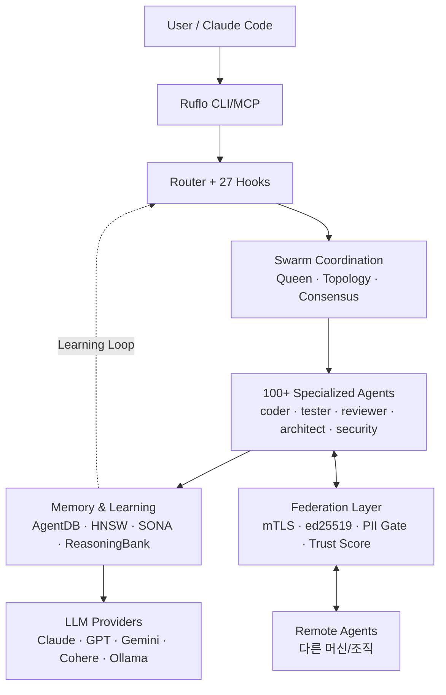

<div class="ai-knowledge-shell">

<aside class="ai-knowledge-sidebar">
  <p class="ai-eyebrow">CATEGORIES</p>
  <nav class="ai-cat-tree"><details class="ai-cat" open><summary><span class="catname">에이전트 오케스트레이션</span><span class="catcount">7</span></summary><ul><li><a href="https://altjs4510.github.io/ai_news_blog/knowledge/20260709/"><span class="kdate">2026-07-09</span><span class="ktitle">mvanhorn/last30days-skill — Reddit·X·YouTube·HN·…</span></a></li><li><a href="https://altjs4510.github.io/ai_news_blog/knowledge/20260707/"><span class="kdate">2026-07-07</span><span class="ktitle">AI Hero Skills Catalog — 실무 엔지니어를 위한 재사용 가능한 판단 …</span></a></li><li><a href="https://altjs4510.github.io/ai_news_blog/knowledge/20260623/"><span class="kdate">2026-06-23</span><span class="ktitle">bytedance/deer-flow — 샌드박스·메모리·서브에이전트·메시지 게이트웨이를…</span></a></li><li><a href="https://altjs4510.github.io/ai_news_blog/knowledge/20260611/"><span class="kdate">2026-06-11</span><span class="ktitle">The evolution of agentic surfaces: building with…</span></a></li><li><a href="https://altjs4510.github.io/ai_news_blog/knowledge/20260602/"><span class="kdate">2026-06-02</span><span class="ktitle">revfactory/harness — 도메인별 에이전트 팀과 스킬을 자동 설계하는 메타…</span></a></li><li><a href="https://altjs4510.github.io/ai_news_blog/knowledge/20260529/"><span class="kdate">2026-05-29</span><span class="ktitle">Introducing dynamic workflows in Claude Code</span></a></li><li><a href="https://altjs4510.github.io/ai_news_blog/knowledge/20260507/" class="current"><span class="kdate">2026-05-07</span><span class="ktitle">ruvnet/ruflo — Claude 멀티 에이전트 오케스트레이션 플랫폼</span></a></li></ul></details><details class="ai-cat" open><summary><span class="catname">MCP &amp; 도구 통합</span><span class="catcount">20</span></summary><ul><li><a href="https://altjs4510.github.io/ai_news_blog/knowledge/20260802/"><span class="kdate">2026-08-02</span><span class="ktitle">Stateless MCP has recaptured my interest (and in…</span></a></li><li><a href="https://altjs4510.github.io/ai_news_blog/knowledge/20260801/"><span class="kdate">2026-08-01</span><span class="ktitle">different-ai/openwork — Claude Cowork의 오픈소스 대체 에…</span></a></li><li><a href="https://altjs4510.github.io/ai_news_blog/knowledge/20260731/"><span class="kdate">2026-07-31</span><span class="ktitle">different-ai/openwork — Claude Cowork의 오픈소스 대안(o…</span></a></li><li><a href="https://altjs4510.github.io/ai_news_blog/knowledge/20260729/"><span class="kdate">2026-07-29</span><span class="ktitle">Bringing MCP 2026-07-28 to Claude</span></a></li><li><a href="https://altjs4510.github.io/ai_news_blog/knowledge/20260724/"><span class="kdate">2026-07-24</span><span class="ktitle">diegosouzapw/OmniRoute — 단일 엔드포인트로 278+ 프로바이더·50…</span></a></li><li><a href="https://altjs4510.github.io/ai_news_blog/knowledge/20260723/"><span class="kdate">2026-07-23</span><span class="ktitle">diegosouzapw/OmniRoute — 268+ 프로바이더를 단일 엔드포인트로 묶…</span></a></li><li><a href="https://altjs4510.github.io/ai_news_blog/knowledge/20260721/"><span class="kdate">2026-07-21</span><span class="ktitle">tirth8205/code-review-graph — 로컬 우선 코드 인텔리전스 그래프…</span></a></li><li><a href="https://altjs4510.github.io/ai_news_blog/knowledge/20260719/"><span class="kdate">2026-07-19</span><span class="ktitle">tirth8205/code-review-graph — 로컬 우선 코드 인텔리전스 그래프…</span></a></li><li><a href="https://altjs4510.github.io/ai_news_blog/knowledge/20260718/"><span class="kdate">2026-07-18</span><span class="ktitle">tirth8205/code-review-graph — MCP·CLI용 로컬 코드 인텔리…</span></a></li><li><a href="https://altjs4510.github.io/ai_news_blog/knowledge/20260708/"><span class="kdate">2026-07-08</span><span class="ktitle">Expanding Managed Agents in Gemini API: backgrou…</span></a></li><li><a href="https://altjs4510.github.io/ai_news_blog/knowledge/20260701/"><span class="kdate">2026-07-01</span><span class="ktitle">Google OKF (Open Knowledge Format) — 벤더 중립 에이전트 …</span></a></li><li><a href="https://altjs4510.github.io/ai_news_blog/knowledge/20260618/"><span class="kdate">2026-06-18</span><span class="ktitle">DeusData/codebase-memory-mcp — 158개 언어 코드베이스를 밀리…</span></a></li><li><a href="https://altjs4510.github.io/ai_news_blog/knowledge/20260606/"><span class="kdate">2026-06-06</span><span class="ktitle">chopratejas/headroom — Compress tool outputs, lo…</span></a></li><li><a href="https://altjs4510.github.io/ai_news_blog/knowledge/20260605/"><span class="kdate">2026-06-05</span><span class="ktitle">chopratejas/headroom — Compress tool outputs, lo…</span></a></li><li><a href="https://altjs4510.github.io/ai_news_blog/knowledge/20260604/"><span class="kdate">2026-06-04</span><span class="ktitle">chopratejas/headroom — Compress tool outputs bef…</span></a></li><li><a href="https://altjs4510.github.io/ai_news_blog/knowledge/20260603/"><span class="kdate">2026-06-03</span><span class="ktitle">How Bad MCP design cost your Agent 5× more token…</span></a></li><li><a href="https://altjs4510.github.io/ai_news_blog/knowledge/20260523/"><span class="kdate">2026-05-23</span><span class="ktitle">colbymchenry/codegraph — 사전 인덱싱된 코드 지식 그래프 MCP</span></a></li><li><a href="https://altjs4510.github.io/ai_news_blog/knowledge/20260517/"><span class="kdate">2026-05-17</span><span class="ktitle">I gave my LLM 100,000+ tools — Lazy Discovery &a…</span></a></li><li><a href="https://altjs4510.github.io/ai_news_blog/knowledge/20260509/"><span class="kdate">2026-05-09</span><span class="ktitle">How to connect 100 MCP servers without the conte…</span></a></li><li><a href="https://altjs4510.github.io/ai_news_blog/knowledge/20260506/"><span class="kdate">2026-05-06</span><span class="ktitle">mksglu/context-mode — AI 코딩 에이전트용 컨텍스트 윈도우 최적화</span></a></li></ul></details><details class="ai-cat" open><summary><span class="catname">코딩 에이전트</span><span class="catcount">17</span></summary><ul><li><a href="https://altjs4510.github.io/ai_news_blog/knowledge/20260804/"><span class="kdate">2026-08-04</span><span class="ktitle">esengine/DeepSeek-Reasonix — prefix-cache 안정성을 축…</span></a></li><li><a href="https://altjs4510.github.io/ai_news_blog/knowledge/20260728/"><span class="kdate">2026-07-28</span><span class="ktitle">alibaba/open-code-review — 결정론적 파이프라인 + LLM 에이전트…</span></a></li><li><a href="https://altjs4510.github.io/ai_news_blog/knowledge/20260725/"><span class="kdate">2026-07-25</span><span class="ktitle">The new rules of context engineering for Claude …</span></a></li><li><a href="https://altjs4510.github.io/ai_news_blog/knowledge/20260722/"><span class="kdate">2026-07-22</span><span class="ktitle">tirth8205/code-review-graph — MCP·CLI용 로컬 우선 코드 …</span></a></li><li><a href="https://altjs4510.github.io/ai_news_blog/knowledge/20260714/"><span class="kdate">2026-07-14</span><span class="ktitle">Graphify-Labs/graphify — 코드베이스를 질의 가능한 지식 그래프로 만…</span></a></li><li><a href="https://altjs4510.github.io/ai_news_blog/knowledge/20260705/"><span class="kdate">2026-07-05</span><span class="ktitle">openai/codex-plugin-cc — Claude Code에서 Codex를 위임…</span></a></li><li><a href="https://altjs4510.github.io/ai_news_blog/knowledge/20260626/"><span class="kdate">2026-06-26</span><span class="ktitle">google-labs-code/design.md — 코딩 에이전트에게 디자인 시스템을 …</span></a></li><li><a href="https://altjs4510.github.io/ai_news_blog/knowledge/20260619/"><span class="kdate">2026-06-19</span><span class="ktitle">Claude Code now supports artifacts</span></a></li><li><a href="https://altjs4510.github.io/ai_news_blog/knowledge/20260530/"><span class="kdate">2026-05-30</span><span class="ktitle">Leonxlnx/taste-skill — AI에게 좋은 취향을 부여해 generic s…</span></a></li><li><a href="https://altjs4510.github.io/ai_news_blog/knowledge/20260528/"><span class="kdate">2026-05-28</span><span class="ktitle">Building self-improving tax agents with Codex</span></a></li><li><a href="https://altjs4510.github.io/ai_news_blog/knowledge/20260526/"><span class="kdate">2026-05-26</span><span class="ktitle">colbymchenry/codegraph — Pre-indexed code knowle…</span></a></li><li><a href="https://altjs4510.github.io/ai_news_blog/knowledge/20260524/"><span class="kdate">2026-05-24</span><span class="ktitle">colbymchenry/codegraph — Pre-indexed code knowle…</span></a></li><li><a href="https://altjs4510.github.io/ai_news_blog/knowledge/20260521/"><span class="kdate">2026-05-21</span><span class="ktitle">colbymchenry/codegraph — Pre-indexed code knowle…</span></a></li><li><a href="https://altjs4510.github.io/ai_news_blog/knowledge/20260512/"><span class="kdate">2026-05-12</span><span class="ktitle">agentmemory — Persistent memory for AI coding ag…</span></a></li><li><a href="https://altjs4510.github.io/ai_news_blog/knowledge/20260510/"><span class="kdate">2026-05-10</span><span class="ktitle">addyosmani/agent-skills — Production-grade engin…</span></a></li><li><a href="https://altjs4510.github.io/ai_news_blog/knowledge/20260508/"><span class="kdate">2026-05-08</span><span class="ktitle">addyosmani/agent-skills — Production-grade engin…</span></a></li><li><a href="https://altjs4510.github.io/ai_news_blog/knowledge/20260505/"><span class="kdate">2026-05-05</span><span class="ktitle">mattpocock/skills — Skills for Real Engineers (.…</span></a></li></ul></details><details class="ai-cat" open><summary><span class="catname">모델 &amp; 연구</span><span class="catcount">6</span></summary><ul><li><a href="https://altjs4510.github.io/ai_news_blog/knowledge/20260716-proprag/"><span class="kdate">2026-07-16</span><span class="ktitle">PropRAG — 프로포지션 경로 위 beam search로 멀티홉 검색 안내</span></a></li><li><a href="https://altjs4510.github.io/ai_news_blog/knowledge/20260620/"><span class="kdate">2026-06-20</span><span class="ktitle">zai-org/GLM-5 — From Vibe Coding to Agentic Engi…</span></a></li><li><a href="https://altjs4510.github.io/ai_news_blog/knowledge/20260617/"><span class="kdate">2026-06-17</span><span class="ktitle">Predicting model behavior before release by simu…</span></a></li><li><a href="https://altjs4510.github.io/ai_news_blog/knowledge/20260610/"><span class="kdate">2026-06-10</span><span class="ktitle">Fable 5 just made cost-aware model routing manda…</span></a></li><li><a href="https://altjs4510.github.io/ai_news_blog/knowledge/20260516/"><span class="kdate">2026-05-16</span><span class="ktitle">STALE — 에이전트가 자기 기억의 유효성을 인지할 수 있는가</span></a></li><li><a href="https://altjs4510.github.io/ai_news_blog/knowledge/20260513/"><span class="kdate">2026-05-13</span><span class="ktitle">Thinking Machines' Native Interaction Models — T…</span></a></li></ul></details><details class="ai-cat" open><summary><span class="catname">인프라 &amp; 컴퓨트</span><span class="catcount">3</span></summary><ul><li><a href="https://altjs4510.github.io/ai_news_blog/knowledge/20260630/"><span class="kdate">2026-06-30</span><span class="ktitle">Introducing the Claude apps gateway for Amazon B…</span></a></li><li><a href="https://altjs4510.github.io/ai_news_blog/knowledge/20260522/"><span class="kdate">2026-05-22</span><span class="ktitle">Giving Agents Computers — Ivan Burazin, Daytona</span></a></li><li><a href="https://altjs4510.github.io/ai_news_blog/knowledge/20260520/"><span class="kdate">2026-05-20</span><span class="ktitle">New in Claude Managed Agents: self-hosted sandbo…</span></a></li></ul></details><details class="ai-cat" open><summary><span class="catname">보안 &amp; 거버넌스</span><span class="catcount">14</span></summary><ul><li><a href="https://altjs4510.github.io/ai_news_blog/knowledge/20260730/"><span class="kdate">2026-07-30</span><span class="ktitle">Anatomy of a Frontier Lab Agent Intrusion: A Tec…</span></a></li><li><a href="https://altjs4510.github.io/ai_news_blog/knowledge/20260716/"><span class="kdate">2026-07-16</span><span class="ktitle">Dicklesworthstone/destructive_command_guard — 에이…</span></a></li><li><a href="https://altjs4510.github.io/ai_news_blog/knowledge/20260715/"><span class="kdate">2026-07-15</span><span class="ktitle">Dicklesworthstone/destructive_command_guard — 에이…</span></a></li><li><a href="https://altjs4510.github.io/ai_news_blog/knowledge/20260710/"><span class="kdate">2026-07-10</span><span class="ktitle">70개 MCP 서버 strace 런타임 감사 — 부팅 시 아웃바운드 호출 서버 적발</span></a></li><li><a href="https://altjs4510.github.io/ai_news_blog/knowledge/20260704/"><span class="kdate">2026-07-04</span><span class="ktitle">Cloudflare is about to block AI agents by defaul…</span></a></li><li><a href="https://altjs4510.github.io/ai_news_blog/knowledge/20260703/"><span class="kdate">2026-07-03</span><span class="ktitle">Giving admins more visibility and control over C…</span></a></li><li><a href="https://altjs4510.github.io/ai_news_blog/knowledge/20260625/"><span class="kdate">2026-06-25</span><span class="ktitle">Agent identity in Claude Tag: a new access model…</span></a></li><li><a href="https://altjs4510.github.io/ai_news_blog/knowledge/20260624/"><span class="kdate">2026-06-24</span><span class="ktitle">Agent identity in Claude Tag: a new access model…</span></a></li><li><a href="https://altjs4510.github.io/ai_news_blog/knowledge/20260614/"><span class="kdate">2026-06-14</span><span class="ktitle">NVIDIA/SkillSpector — Security scanner for AI ag…</span></a></li><li><a href="https://altjs4510.github.io/ai_news_blog/knowledge/20260613/"><span class="kdate">2026-06-13</span><span class="ktitle">Fable 5's guardrails got bypassed in 48 hours — …</span></a></li><li><a href="https://altjs4510.github.io/ai_news_blog/knowledge/20260612/"><span class="kdate">2026-06-12</span><span class="ktitle">NVIDIA/SkillSpector — AI 에이전트 스킬용 보안 스캐너</span></a></li><li><a href="https://altjs4510.github.io/ai_news_blog/knowledge/20260607/"><span class="kdate">2026-06-07</span><span class="ktitle">OpenAI Help: Lockdown Mode</span></a></li><li><a href="https://altjs4510.github.io/ai_news_blog/knowledge/20260531/"><span class="kdate">2026-05-31</span><span class="ktitle">How we contain Claude across products</span></a></li><li><a href="https://altjs4510.github.io/ai_news_blog/knowledge/20260527/"><span class="kdate">2026-05-27</span><span class="ktitle">Microsoft Copilot Cowork Exfiltrates Files</span></a></li></ul></details><details class="ai-cat" open><summary><span class="catname">응용 사례</span><span class="catcount">7</span></summary><ul><li><a href="https://altjs4510.github.io/ai_news_blog/knowledge/20260805/"><span class="kdate">2026-08-05</span><span class="ktitle">TencentCloud/TencentDB-Agent-Memory — 대화·문서·코드를 …</span></a></li><li><a href="https://altjs4510.github.io/ai_news_blog/knowledge/20260726/"><span class="kdate">2026-07-26</span><span class="ktitle">citrolabs/ego-lite — 로그인된 브라우저 상태를 AI 에이전트와 공유하는…</span></a></li><li><a href="https://altjs4510.github.io/ai_news_blog/knowledge/20260717/"><span class="kdate">2026-07-17</span><span class="ktitle">After a year building agent memory, 'save everyt…</span></a></li><li><a href="https://altjs4510.github.io/ai_news_blog/knowledge/20260712/"><span class="kdate">2026-07-12</span><span class="ktitle">Do Automated Evals Work?</span></a></li><li><a href="https://altjs4510.github.io/ai_news_blog/knowledge/20260621/"><span class="kdate">2026-06-21</span><span class="ktitle">calesthio/OpenMontage — 12 파이프라인·52 도구·500+ 스킬을 …</span></a></li><li><a href="https://altjs4510.github.io/ai_news_blog/knowledge/20260609/"><span class="kdate">2026-06-09</span><span class="ktitle">Building intelligent apps for Apple platforms wi…</span></a></li><li><a href="https://altjs4510.github.io/ai_news_blog/knowledge/20260514/"><span class="kdate">2026-05-14</span><span class="ktitle">Introducing Claude for Small Business</span></a></li></ul></details><details class="ai-cat" open><summary><span class="catname">산업 동향</span><span class="catcount">6</span></summary><ul><li><a href="https://altjs4510.github.io/ai_news_blog/knowledge/20260711/"><span class="kdate">2026-07-11</span><span class="ktitle">OpenAI says GPT 5.6 is the 'preferred model' for…</span></a></li><li><a href="https://altjs4510.github.io/ai_news_blog/knowledge/20260702/"><span class="kdate">2026-07-02</span><span class="ktitle">How Cursor deploys AI inside the enterprise (For…</span></a></li><li><a href="https://altjs4510.github.io/ai_news_blog/knowledge/20260616/"><span class="kdate">2026-06-16</span><span class="ktitle">Why AI hasn't replaced software engineers, and w…</span></a></li><li><a href="https://altjs4510.github.io/ai_news_blog/knowledge/20260519/"><span class="kdate">2026-05-19</span><span class="ktitle">Anthropic acquires Stainless</span></a></li><li><a href="https://altjs4510.github.io/ai_news_blog/knowledge/20260515/"><span class="kdate">2026-05-15</span><span class="ktitle">Clawdmeter — Claude Code 사용량을 데스크톱 대시보드로</span></a></li><li><a href="https://altjs4510.github.io/ai_news_blog/knowledge/20260504/"><span class="kdate">2026-05-04</span><span class="ktitle">Agents for Everything Else: Codex for Knowledge …</span></a></li></ul></details></nav>
</aside>

<article class="ai-knowledge-article">

<header class="ai-post-hero">
  <p class="ai-eyebrow"><a class="ai-back" href="../">KNOWLEDGE</a> · 2026-05-07 · 오늘의 학습</p>
  <h2 class="ai-post-title">ruvnet/ruflo — Claude 멀티 에이전트 오케스트레이션 플랫폼</h2>
</header>

> 원문: [ruvnet/ruflo — Claude 멀티 에이전트 오케스트레이션 플랫폼](https://github.com/ruvnet/ruflo)

## 📌 학습 정리

### 1. 한 줄 정의
**Ruflo**는 **Claude Code** 위에 **swarm 코디네이션·자기학습 메모리·Zero-trust federation·엔터프라이즈 보안**을 얹어 100+ 전문 에이전트를 머신·팀·신뢰경계 너머로 협업시키는 멀티에이전트 오케스트레이션 플랫폼이다.

### 2. 왜 지금 중요한가
- **Claude Code 네이티브 통합**이라는 새 결: `claude mcp add ruflo` 한 줄로 MCP 서버를 붙이고, Plugin Marketplace(`/plugin marketplace add ruvnet/ruflo`) 형태로 32개 플러그인을 슬래시 커맨드로 배포하는 방식이 표준화되고 있다.
- **단일 에이전트 → swarm + federation**으로 패러다임 이동: **Queen-led 계층, Raft/Byzantine/Gossip 컨센서스**, mTLS+ed25519 기반 cross-org 협업이 "에이전트판 Slack"으로 제시된다.
- **Self-learning 루프의 일반화**: **SONA neural patterns, ReasoningBank, trajectory learning**, **HNSW-indexed AgentDB**(150x~12,500x faster search)로 세션 간 학습이 인프라 레이어로 내려왔다.
- **GOAP A\* planner**(`goal.ruv.io`)로 plain-English goal → preconditions/actions/effects 분해 + 실패 시 replanning이 실제 UI로 제품화되었다 — Quest/Goal 분해를 고민하는 팀에 직접적 레퍼런스.
- **PII gating + 행동 기반 trust scoring**(`0.4×success + 0.2×uptime + 0.2×threat + 0.2×integrity`)이 federation 전제로 들어가, 엔터프라이즈에서 멀티에이전트를 실서비스화하는 보안 모델이 구체화됐다.

### 3. 핵심 개념
| 용어 | 정의 | 비고/관련 키워드 |
|---|---|---|
| **Ruflo init** | `npx ruflo init`로 Claude Code에 hooks·daemon·MCP·98 agents·60+ commands·30 skills를 일괄 주입 | Path B (full loop) |
| **Plugin (Path A)** | `/plugin install ruflo-*@ruflo` 형태로 슬래시 커맨드만 설치, MCP 서버 미등록 | `memory_store`/`swarm_init` 호출 불가 |
| **MCP Server** | `claude mcp add ruflo -- npx ruflo@latest mcp start` | Claude Code ↔ Ruflo 브리지 |
| **Swarm Coordination** | Hierarchical/Mesh/Adaptive topology + consensus | Queen-led, Raft/Byzantine/Gossip |
| **SONA / ReasoningBank** | 성공 패턴·trajectory를 누적해 라우팅·플래닝에 반영하는 자기학습 레이어 | trajectory learning |
| **AgentDB + HNSW** | 벡터 메모리, sub-ms 검색, 세션 간 영속 | `ruflo-agentdb`, `ruflo-rag-memory` |
| **Hooks (27)** | `init` 후 자동 라우팅·패턴 학습·백그라운드 코디네이션 | "use Claude Code normally" |
| **Background Workers (12)** | audit, optimize, testgaps 등 자동 트리거되는 루프 워커 | `ruflo-loop-workers` |
| **Federation** | mTLS+ed25519 zero-trust로 cross-machine 에이전트 협업, PII gating 14-type | `federation_init/join/send/trust/audit` |
| **PII Pipeline** | 14-type 탐지 → BLOCK/REDACT/HASH/PASS 정책, adaptive calibration | outbound 메시지 스캔 |
| **Trust Score** | `0.4×success + 0.2×uptime + 0.2×threat + 0.2×integrity` | 상승은 누적, 하강은 즉시 |
| **GOAP A\* Planner** | plain-English goal → state-space search + replanning | [goal.ruv.io](https://goal.ruv.io/), `/agents` 대시보드 |
| **ruvLLM** | MicroLoRA 어댑터·SONA로 로컬에서 자기개선되는 모델 레이어 | `ruvnet/RuVector/examples/ruvLLM` |
| **Cognitum.one** | Ruflo 하부 agentic 아키텍처(Rust 엔진·embeddings·plugin) | [Cognitum.one](https://cognitum.one) (원문 인용) |

### 4. 작동 원리 / 구조



핵심은 **Router가 Hooks를 통해 자동 라우팅**하고, **Swarm이 토폴로지·컨센서스로 작업 분배**하며, 모든 결과가 **AgentDB(HNSW)** 에 적재되어 다음 라우팅·플래닝에 **Learning Loop**로 되먹이는 구조다. 외부 협업은 Federation 레이어가 PII gating과 trust score로 격리한다.

### 5. 실제 사용법 / 예시

**설치 (Path B, full loop)**
```
curl -fsSL https://cdn.jsdelivr.net/gh/ruvnet/ruflo@main/scripts/install.sh | bash
# 또는
npx ruflo@latest init wizard
# 또는
npm install -g ruflo@latest
```

**MCP 등록 (canonical form)**
```
claude mcp add ruflo -- npx ruflo@latest mcp start
```

**Plugin Marketplace (Path A)**
```
/plugin marketplace add ruvnet/ruflo
/plugin install ruflo-core@ruflo
/plugin install ruflo-swarm@ruflo
/plugin install ruflo-autopilot@ruflo
/plugin install ruflo-federation@ruflo
```

**Federation — 두 팀이 PII 노출 없이 fraud 신호 공유**
```
# Team A
npx claude-flow@latest federation init
npx claude-flow@latest federation join wss://team-b.example.com:8443
npx claude-flow@latest federation send --to team-b --type task-request \
  --message "Analyze transaction patterns for account anomalies"
npx claude-flow@latest federation status
```

### 6. 사용자 프로젝트 접목

- **Team Agent / `platform-core-agent` ↔ `discovery-core-agent` 라우팅**: Ruflo의 **Queen-led hierarchy + Router/27 Hooks** 패턴을 PoC 레퍼런스로 사용해, `platform-core-agent`가 브랜드별 `discovery-core-agent`를 호출할 때의 **토폴로지(Hierarchical 우선, 크로스브랜드 분석은 Mesh)** 와 **consensus 정책**을 정의. 특히 "Path A vs Path B" 구분(슬래시 커맨드만 vs MCP 풀 통합)을 그대로 차용해 **브랜드 도입 단계별 lite/full 프로파일**을 만들 수 있다.

- **Team Agent / Activity Log·Observer (L1~L4) → AgentDB·SONA·ReasoningBank**: L1 Activity Log 수집 → Observer 피드백 → Quest 재계획 흐름이 Ruflo의 **Learning Loop(trajectory → ReasoningBank → Router 재학습)** 와 정확히 1:1. **HNSW 검색 + adaptive replanning**을 참고해 L3/L4 Quest 분해와 실패 시 재계획 정책을 설계. **GOAP A\* planner**(`goal.ruv.io`)는 Quest 3계층(전체·파티·플레이어)의 preconditions/effects 모델링 직접 레퍼런스.

- **Team Agent / `brand.yaml` 주입 + server-only**: Ruflo의 **plugin scaffold**(`ruflo-plugin-creator`) + **per-plugin agent definitions** 패턴을 참고해 brand.yaml → 브랜드 전용 agent definition + skill set으로 컴파일하는 빌드 단계를 추가. FSD/server-only 경계는 **Federation의 PII gating(BLOCK/REDACT/HASH/PASS)** 모델을 참고해 브랜드간 데이터 격리 정책으로 확장 가능.

- **DCSAI / MCP host server + Anthropic SDK agent loop**: 자체 구현한 MCP host에 Ruflo MCP 서버를 **클라이언트로 연결**하는 시나리오를 검증(`claude mcp add` 형태 → DCSAI host 측 MCP client 등록). HITL 분기에는 Ruflo의 **trust score downgrade-instant** 모델을 참고해 "Observer가 risky한 trajectory 감지 시 즉시 권한 강등 후 사람 개입"으로 일반화.

- **DCSAI / `dcs-ai-plugin`(Claude Code) + `ff-claude-manager`(Tauri 2)**: Ruflo의 **32개 Claude Code 네이티브 플러그인 구조**(슬래시 커맨드 + agent definitions 단위 패키징)를 `dcs-ai-plugin` 확장 표준으로 채택 검토. Tauri 매니저는 Ruflo **Web UI(self-hostable Docker, `ruflo/src/ruvocal/Dockerfile`)** 의 **MCP pill → Add Server** UX를 참고해 사내 MCP 엔드포인트 등록·trust 관리 화면을 설계.

### 7. 더 파고들 거리
- [ruvnet/ruflo](https://github.com/ruvnet/ruflo) — 본 저장소
- [Cognitum.one](https://cognitum.one) — Ruflo 하부 agentic 아키텍처
- [flo.ruv.io](https://flo.ruv.io/) — Web UI hosted demo (parallel MCP tool calling, in-browser WASM tool gallery)
- [goal.ruv.io](https://goal.ruv.io/) · [goal.ruv.io/agents](https://goal.ruv.io/agents) — GOAP A\* planner & live agent dashboard
- 원문에서 언급된 ADR/Issue 트래커: **ADR-033**(Web UI 아키텍처), **issue #1689**(Web UI roadmap), **issue #1669**(Federation 아키텍처·trust model), **issue #1744**(install path 분기) — `ruvnet/ruflo` GitHub Issues에서 검색

---

## 📖 원문 전체 번역 (정독용)

> 의역 최소화한 전체 번역입니다. 큰 흐름은 위 정리에서 잡고, 정확한 워딩이 필요할 땐 이 섹션에서 정독하세요.

# Ruflo
## Claude Code를 위한 멀티 에이전트 AI 오케스트레이션

머신, 팀, 그리고 신뢰 경계를 넘나들며 100개 이상의 특화 AI 에이전트를 오케스트레이션하세요. Ruflo는 조율된 스웜(swarm), 자기 학습 메모리, 페더레이션 통신, 그리고 엔터프라이즈 보안을 Claude Code에 추가합니다 — 에이전트가 단순히 실행되는 것이 아니라, 협업하도록.

---

## 왜 Ruflo인가?

Claude Flow는 이제 Ruflo가 되었습니다 — Rust, 플로우 상태(flow states), 그리고 필연적으로 느껴지는 것들을 만드는 것을 사랑하는 [rUv](https://github.com/ruvnet)가 이름을 붙였습니다. "Ru"는 rUv이고, "flo"는 새벽 3시까지 작업하는 것입니다. 그 아래에는 Rust 기반 AI 엔진, 임베딩, 메모리, 그리고 플러그인 시스템으로 구동되는 [Cognitum.One](https://cognitum.one) 에이전틱 아키텍처가 탑재되어 있습니다.

---

## Ruflo가 하는 일

`npx ruvflo init` 하나로 Claude Code에 신경계를 부여합니다: 에이전트들은 스스로 스웜으로 조직되고, 모든 태스크에서 학습하며, 세션을 넘어 기억하고 — 페더레이션과 함께 — 데이터를 유출하지 않고 다른 머신의 에이전트와 안전하게 통신합니다. 당신은 계속 코드를 작성하면 됩니다. 조율은 Ruflo가 처리합니다.

### 자기 학습 / 자기 최적화 에이전트 아키텍처

```
User --> Ruflo (CLI/MCP) --> Router --> Swarm --> Agents --> Memory --> LLM Providers
                          ^                           |
                          +---- Learning Loop <-------+
```

---

## Ruflo가 처음이신가요?

314개의 MCP 도구나 26개의 CLI 명령어를 배울 필요가 없습니다. `init` 이후에는 Claude Code를 평소처럼 사용하기만 하면 됩니다 -- hooks 시스템이 자동으로 태스크를 라우팅하고, 성공한 패턴에서 학습하며, 백그라운드에서 에이전트를 조율합니다.

---

## 빠른 시작

표면적이 매우 다른 **두 가지 설치 경로**가 있습니다. 필요에 따라 선택하세요 (#1744):

| | Claude Code Plugin | CLI 설치 (`npx ruflo init`) |
|---|---|---|
| **제공 내용** | 슬래시 명령어 + 몇 가지 스킬 + 플러그인별 에이전트 정의 | 전체 Ruflo 루프 — 98개 에이전트, 60개 이상의 명령어, 30개 스킬, MCP 서버, hooks, 데몬 |
| **워크스페이스 파일** | 없음 | `.claude/`, `.claude-flow/`, `CLAUDE.md`, 헬퍼, 설정 |
| **MCP 서버 등록** | 아니오 (`memory_store`, `swarm_init` 등 Claude에서 사용 불가) | 예 |
| **Hooks 설치** | 아니오 | 예 |
| **적합한 용도** | 전체 설치 없이 단일 플러그인 명령어 체험 | 프로덕션 사용 — 문서대로 모든 기능 작동 |

### 경로 A — Claude Code 플러그인 (라이트, 슬래시 명령어 전용)

```bash
# 마켓플레이스 추가
/plugin marketplace add ruvnet/ruflo

# 코어 + 필요한 플러그인 설치
/plugin install ruflo-core@ruflo
/plugin install ruflo-swarm@ruflo
/plugin install ruflo-autopilot@ruflo
/plugin install ruflo-federation@ruflo
```

이 방법은 슬래시 명령어와 에이전트 정의만 추가합니다. Ruflo MCP 서버는 등록되지 **않으므로**, `memory_store`, `swarm_init`, `agent_spawn` 등은 Claude에서 호출할 수 없습니다. 전체 루프를 사용하려면 아래 경로 B를 사용하세요.

---

## 🔌 전체 32개 플러그인

### 코어 & 오케스트레이션

| 플러그인 | 기능 |
|---|---|
| ruflo-core | 기반 — 서버, 헬스 체크, 플러그인 디스커버리 |
| ruflo-swarm | 여러 에이전트를 팀으로 조율 |
| ruflo-autopilot | 에이전트가 루프 내에서 자율적으로 실행 |
| ruflo-loop-workers | 타이머 기반 백그라운드 태스크 스케줄링 |
| ruflo-workflows | 재사용 가능한 멀티 스텝 태스크 템플릿 |
| ruflo-federation | 다른 머신의 에이전트가 안전하게 협업 |

### 메모리 & 지식

| 플러그인 | 기능 |
|---|---|
| ruflo-agentdb | 에이전트 메모리를 위한 빠른 벡터 데이터베이스 |
| ruflo-rag-memory | 스마트 검색 — 하이브리드 검색, 그래프 홉, 다양성 랭킹 |
| ruflo-rvf | 세션 간 에이전트 메모리 저장 및 복원 |
| ruflo-ruvector | ruvector — GPU 가속 검색, Graph RAG, 103개 도구 |
| ruflo-knowledge-graph | 엔티티 관계 맵 구축 및 순회 |

### 인텔리전스 & 학습

| 플러그인 | 기능 |
|---|---|
| ruflo-intelligence | 에이전트가 과거 성공에서 학습하며 더 스마트해짐 |
| ruflo-daa | 동적 에이전트 행동 및 인지 패턴 |
| ruflo-ruvllm | 스마트 라우팅으로 로컬 LLM (Ollama 등) 실행 |
| ruflo-goals | 큰 목표를 계획으로 분해하고 진행 상황 추적 |

### 코드 품질 & 테스팅

| 플러그인 | 기능 |
|---|---|
| ruflo-testgen | 누락된 테스트를 찾아 자동으로 생성 |
| ruflo-browser | Playwright로 브라우저 테스팅 자동화 |
| ruflo-jujutsu | git diff 분석, 리스크 점수화, 리뷰어 제안 |
| ruflo-docs | 문서 자동 생성 및 유지 관리 |

### 보안 & 컴플라이언스

| 플러그인 | 기능 |
|---|---|
| ruflo-security-audit | 취약점 및 CVE 스캔 |
| ruflo-aidefence | 프롬프트 인젝션 차단, PII 감지, 안전성 스캔 |

### 아키텍처 & 방법론

| 플러그인 | 기능 |
|---|---|
| ruflo-adr | 살아있는 기록으로 아키텍처 결정 사항 추적 |
| ruflo-ddd | 도메인 주도 설계 스캐폴딩 — 컨텍스트, 애그리게이트, 이벤트 |
| ruflo-sparc | 품질 게이트를 갖춘 가이드 5단계 개발 방법론 |

### DevOps & 옵저버빌리티

| 플러그인 | 기능 |
|---|---|
| ruflo-migrations | 데이터베이스 스키마 변경을 안전하게 관리 |
| ruflo-observability | 구조화된 로그, 트레이스, 메트릭을 한 곳에서 |
| ruflo-cost-tracker | 토큰 사용량 추적, 예산 설정, 비용 알림 |

### 확장성

| 플러그인 | 기능 |
|---|---|
| ruflo-wasm | 샌드박스 WebAssembly 에이전트 실행 |
| ruflo-plugin-creator | 자신만의 플러그인 스캐폴딩, 검증, 게시 |

### 도메인 특화

| 플러그인 | 기능 |
|---|---|
| ruflo-iot-cognitum | IoT 디바이스 관리 — 신뢰 점수, 이상 감지, 플릿 |
| ruflo-neural-trader | neural-trader — 4개 에이전트, 백테스팅, 112개 이상 도구를 갖춘 AI 트레이딩 |
| ruflo-market-data | 시장 데이터 수집, OHLCV 벡터화, 패턴 감지 |

---

## CLI 설치

```bash
# 원라인 설치
curl -fsSL https://cdn.jsdelivr.net/gh/ruvnet/ruflo@main/scripts/install.sh | bash

# 또는 npx를 통한 대화형 설정
npx ruflo@latest init wizard

# 빠른 비대화형 init
# npx ruflo@latest init

# 또는 전역 설치
npm install -g ruflo@latest
```

### MCP 서버

```bash
# Claude Code에 Ruflo를 MCP 서버로 추가 (표준 형식, USERGUIDE.md와 일치)
claude mcp add ruflo -- npx ruflo@latest mcp start
```

---

## 제공 기능

| 기능 | 설명 |
|---|---|
| 🤖 100개 이상의 에이전트 | 코딩, 테스팅, 보안, 문서, 아키텍처 전담 에이전트 |
| 📡 통신 레이어 | 제로 트러스트 페더레이션 — 머신/조직 간 에이전트가 안전하게 디스커버리, 인증, 작업 교환 |
| 🐝 스웜 조율 | 컨센서스를 갖춘 계층적, 메시, 적응형 토폴로지 |
| 🧠 자기 학습 | SONA 뉴럴 패턴, ReasoningBank, 트라젝토리 학습 |
| 💾 벡터 메모리 | HNSW 인덱스 AgentDB — 150배~12,500배 빠른 검색 |
| ⚡ 백그라운드 워커 | 12개 자동 트리거 워커 (audit, optimize, testgaps 등) |
| 🧩 플러그인 마켓플레이스 | 32개 네이티브 Claude Code 플러그인 + 21개 npm 플러그인 |
| 🔌 멀티 프로바이더 | Claude, GPT, Gemini, Cohere, Ollama와 스마트 라우팅 |
| 🛡️ 보안 | AIDefence, 입력 유효성 검사, CVE 교정, 경로 순회 방지 |
| 🌐 에이전트 페더레이션 | 제로 트러스트 보안으로 설치 간 에이전트 협업 |
| 💬 Web UI 베타 | flo.ruv.io에서 병렬 MCP 도구 호출과 인브라우저 WASM 도구 갤러리를 갖춘 멀티 모델 채팅 |
| 🎯 RuFlo Research | goal.ruv.io의 GOAP A* 플래너 — 일반 영어 목표 → 실행 가능한 에이전트 계획, `/agents`의 라이브 에이전트 대시보드 포함 |

---

## Web UI (베타) — 자체 호스팅 가능, 호스팅 데모: flo.ruv.io

RuFlo의 웹 UI는 내장된 Model Context Protocol (MCP) 도구 호출 기능을 갖춘 멀티 모델 AI 채팅입니다.

Qwen, Claude, Gemini, 또는 OpenAI와 대화하는 동안 RuFlo는 CLI가 사용하는 것과 동일한 MCP 도구를 직접 채팅에서 호출합니다 — 에이전트 오케스트레이션, 영속적 메모리, 스웜 조율, 코드 리뷰, GitHub 작업. 설치 불필요, 체험에 API 키 불필요.

| 기능 | 의미 |
|---|---|
| 🧠 로컬 또는 원격 모든 모델 | 기본 제공 6개 최첨단 모델 — Qwen 3.6 Max (기본값), Claude Sonnet 4.6, Claude Haiku 4.5, Gemini 2.5 Pro, Gemini 2.5 Flash, OpenAI — OpenRouter 경유. 직접 추가: 모든 OpenAI 호환 엔드포인트 (vLLM, Ollama, LM Studio, Together, Groq, 자체 호스팅). |
| 🦾 ruvLLM 자기 학습 AI | [ruvLLM](https://github.com/ruvnet/RuVector/tree/main/examples/ruvLLM) 네이티브 지원 (위치: `ruvnet/RuVector/examples/ruvLLM`) — RuFlo의 자기 개선 로컬 모델 레이어. MicroLoRA 어댑터로 라우팅, SONA를 통해 트라젝토리에서 학습, 머신에서 실행. 클라우드 모델과 함께 사용하거나 완전 오프라인 실행 가능. |
| 🛠️ ~210개 도구, 즉시 호출 가능 | 5개 서버 그룹 (코어, 인텔리전스, 에이전트, 메모리, 개발도구) + 브라우저에서 완전히 실행되는 18개 도구 갤러리 — 오프라인 작동. |
| 🔌 자신만의 MCP 서버 연결 | 채팅 입력의 `MCP (n)` 버튼 클릭 → `Add Server`에서 MCP 엔드포인트 (HTTP, SSE, 또는 stdio) 붙여넣기. 도구들이 RuFlo 네이티브 도구와 같은 병렬 실행 플로우에 합류. `localhost:3000`의 로컬 MCP 서버도 바로 작동. |
| ⚡ 병렬 도구 실행 | 모델 응답 하나로 4~6개 이상의 도구가 동시에 실행될 수 있음. UI는 `Step 1 — 2 tools completed` 배지가 있는 카드로 표시되어 정확히 무엇이 실행됐는지 확인 가능. |
| 💾 지속되는 메모리 | `"내가 좋아하는 색은 인디고야"` 라고 말하고 몇 주 후에 물어봐도 RuFlo가 기억. AgentDB + HNSW 벡터 검색 기반 (무차별 탐색 대비 ≥150배 빠름). |
| 📘 내장 기능 투어 | 사이드바의 물음표 아이콘 클릭 — "RuFlo Capabilities" 모달이 열리며 전체 도구 목록, 모델 강점, 아키텍처, 키보드 단축키 확인 가능. |
| 🏠 자체 호스팅 가능 | 웹 UI는 Docker (`ruflo/src/ruvocal/Dockerfile`, MongoDB 내장)로 제공. Cloud Run / Fly / Kubernetes / docker-compose에 배포 가능. 호스팅된 `flo.ruv.io` 데모는 하나의 옵션이며, 직접 실행도 완전히 지원. |
| 🚀 설치 없이 체험 | 호스팅된 URL 열고, 모델 선택, 질문 입력. 온보딩 전부. |

**호스팅 데모 체험:** https://flo.ruv.io/ — 계정 불필요, API 키 불필요.

**직접 실행:** 소스는 `ruflo/src/ruvocal/`에 있으며, 멀티 스테이지 Dockerfile (`INCLUDE_DB=true`는 MongoDB 포함 빌드)과 Google Cloud Run을 위한 `cloudbuild.yaml` 포함. 아키텍처는 ADR-033, 로드맵은 issue #1689 참조.

---

## Goal Planner UI — goal.ruv.io의 자율 에이전트

**고수준 목표를 실행 가능한 에이전트 계획으로 전환하세요.**

[goal.ruv.io](https://goal.ruv.io/)는 RuFlo의 호스팅된 GOAP(Goal-Oriented Action Planning) 프론트엔드입니다 — 일반 영어로 결과를 설명하면 RuFlo가 이를 전제 조건, 액션, 그리고 상태 공간을 통한 A* 경로로 분해한 다음, `/agents`에서 라이브 에이전트에게 작업을 전달하는 것을 지켜볼 수 있습니다.

| 기능 | 의미 |
|---|---|
| 🎯 일반 영어 목표 | `"테스트와 PR을 포함하여 auth 리팩토링 완료"` 입력 — RuFlo가 성공 기준, 제약 조건, 암묵적 전제 조건을 추출. JSON 불필요, DSL 불필요. |
| 🧭 GOAP A* 플래너 | 소프트웨어 작업에 이식된 클래식 게임 AI 플래닝: 전제 조건/효과가 있는 액션을 통해 상태 공간을 탐색하여 가장 짧은 실행 가능한 경로를 찾음. 상태 변경 시 즉시 재계획. |
| 🤖 라이브 에이전트 대시보드 | goal.ruv.io/agents에서 생성된 모든 에이전트 — 역할, 현재 단계, 메모리 네임스페이스, 토큰 예산, 상태 표시. 클릭하여 트라젝토리 검사, 폭주 워커 종료, 재할당 가능. |
| 🌳 비주얼 계획 트리 | 목표가 진행 상황, 차단된 브랜치, 롤백이 강조 표시된 접을 수 있는 액션 트리로 렌더링. 에이전트가 경로를 선택한 이유를 **정확히** 확인 — 불투명한 chain-of-thought 없음. |
| ♻️ 적응형 재계획 | 액션이 실패하거나 새 정보가 도착하면 플래너가 처음부터 재시작하는 대신 현재 상태에서 A*를 재실행. 실패가 학습이 되고, 루프가 되지 않음. |
| 🧠 공유 메모리 + SONA | 계획, 트라젝토리, 결과가 AgentDB로 유입됨. 미래 계획은 HNSW를 통해 과거 솔루션을 검색 — 매 실행마다 플래너가 더 스마트해짐. |
| 🔗 MCP 도구와 연결 | 모든 액션 노드는 도구 호출에 매핑됨 (RuFlo의 ~210개 MCP 도구, 커스텀 서버, 또는 셸). 의존성 그래프가 허용하는 경우 플래너가 병렬로 스케줄링. |
| 🚀 설치 없이 체험 | goal.ruv.io 열고, 목표 설명, 실행 확인. 소스는 `v3/goal_ui/`에 있음 — Vite + Supabase, 자체 호스팅 가능. |

**체험:** https://goal.ruv.io/ 목표용 · https://goal.ruv.io/agents 라이브 에이전트용.

**직접 실행:** `goal` 브랜치를 클론하고 `cd v3/goal_ui && npm install && npm run dev`.

---

## 에이전트 페더레이션 — 에이전트를 위한 Slack

```
Your Agent --> [ Remove secrets ] --> [ Sign message ] --> [ Encrypted channel ]
                 Emails, SSNs,        Proves it came       No one reads it
                 keys stripped         from you              in transit
                                                                |
                                                                v
Their Agent <-- [ Block attacks ] <-- [ Check identity ] <------+
                 Stops prompt          Rejects forgeries
                 injection

                          Audit trail on both sides.
                  Trust builds over time. Bad behavior = instant downgrade.
```

Slack이 팀에게 채널을 제공한 것처럼, 페더레이션은 에이전트에게 같은 것을 제공합니다 — **신뢰 경계를 넘나드는 공유 워크스페이스**, 즉 다른 머신, 조직, 또는 클라우드 리전의 에이전트가 서로를 디스커버리하고, 신원을 증명하며, 태스크에서 협업할 수 있는 공간입니다.

차이점: 일부 채널은 신뢰할 수 있고, 일부는 그렇지 않습니다.

`@claude-flow/plugin-agent-federation`이 이것을 자동으로 처리합니다. 에이전트들이 페더레이션에 가입하고, mTLS + ed25519를 통해 검증을 받은 후 작업 교환을 시작합니다 — 노드를 떠나기 전에 PII가 제거되고 모든 메시지가 감사 가능합니다. 신뢰할 수 없는 에이전트도 더 낮은 권한으로 참여할 수 있습니다: 디스커버리 정보는 볼 수 있지만, 메모리는 접근 불가. 신뢰할 수 있음을 증명할수록 신뢰가 업그레이드됩니다. 잘못된 행동을 하면 즉시 다운그레이드됩니다 — 루프에 사람이 개입할 필요 없음.

핸드셰이크를 구성하거나 인증서를 관리할 필요가 없습니다. `federation init`, `federation join`만 하면 에이전트들이 통신을 시작합니다. 프로토콜이 신원을 처리하고, PII 파이프라인이 데이터 안전을 처리하며, 감사 추적이 컴플라이언스를 처리합니다.

### 페더레이션 기능

| 기능 | 작동 방식 |
|---|---|
| 🔒 제로 트러스트 페더레이션 | 원격 에이전트는 신뢰할 수 없는 상태로 시작. mTLS + ed25519 챌린지-리스폰스로 신원 증명. API 키 불필요, 공유 시크릿 불필요. |
| 🛡️ PII 게이트 데이터 플로우 | 14개 유형 감지 파이프라인이 모든 아웃바운드 메시지를 스캔. 신뢰 수준별 정책: BLOCK, REDACT, HASH, 또는 PASS. 적응형 보정으로 오탐 감소. |
| 📊 행동 신뢰 점수 | 공식 (`0.4×success + 0.2×uptime + 0.2×threat + 0.2×integrity`)으로 피어를 지속적으로 평가. 업그레이드는 히스토리 필요; 다운그레이드는 즉시. |
| 📋 내장 컴플라이언스 | HIPAA, SOC2, GDPR 감사 추적을 컴플라이언스 모드로. 모든 페더레이션 이벤트는 HNSW를 통해 검색 가능한 구조화된 레코드 생성. |
| 🤝 9개 MCP 도구 + 10개 CLI 명령어 | 전체 수명 주기: `federation_init`, `federation_send`, `federation_trust`, `federation_audit` 등. |

### 예시: 고객 데이터 없이 사기 신호를 공유하는 두 팀

```bash
# 팀 A: 페더레이션 초기화 및 키쌍 생성
npx claude-flow@latest federation init

# 팀 A: 팀 B의 페더레이션 엔드포인트에 참여
npx claude-flow@latest federation join wss://team-b.example.com:8443

# 팀 A: 태스크 전송 — PII는 전송 전에 자동으로 제거됨
npx claude-flow@latest federation send --to team-b --type task-request \
  --message "Analyze transaction patterns for account anomalies"

# 팀 A: 피어 신뢰 수준 및 세션 상태 확인
npx claude-flow@latest federation status
```

전체 아키텍처, 신뢰 모델, 구현 로드맵은 issue #1669 참조.

```bash
# Claude Code 플러그인
/plugin install ruflo-federation@ruflo

# 또는 CLI를 통해
npx claude-flow@latest plugins install @claude-flow/plugin-agent-federation
```

---

## Claude Code: Ruflo 없이 vs 있을 때

| 기능 | Claude Code 단독 | + Ruflo |
|---|---|---|
| 에이전트 협업 | 격리됨, 공유 컨텍스트 없음 | 공유 메모리와 컨센서스를 가진 스웜 |
| 조율 | 수동 오케스트레이션 | Queen 주도 계층 구조 (Raft, Byzantine, Gossip) |
| 메모리 | 세션 전용 | 서브 밀리초 검색을 갖춘 HNSW 벡터 메모리 |
| 학습 | 정적 행동 | 패턴 매칭을 갖춘 SONA 자기 학습 |
| 태스크 라우팅 | 직접 결정 | 지능형 라우팅 (89% 정확도) |
| 백그라운드 워커 | 없음 | 12개 자동 트리거 워커 |
| LLM 프로바이더 | Anthropic 전용 | 페일오버를 갖춘 5개 프로바이더 |
| 보안 | 표준 | AIDefence를 갖춘 CVE 강화 |

---

## 아키텍처 개요

```
User --> Claude Code / CLI
          |
          v
    Orchestration Layer
    (MCP Server, Router, 27 Hooks)
          |
          v
    Swarm Coordination
    (Queen, Topology, Consensus)
          |
          v
    100+ Specialized Agents
    (coder, tester, reviewer, architect, security...)
          |
          v
    Memory & Learning
    (AgentDB, HNSW, SONA, ReasoningBank)
          |
          v
    LLM Providers
    (Claude, GPT, Gemini, Cohere, Ollama)
```

---

## 문서

세 가지 독자를 위한 세 가지 문서:

| 문서 | 읽을 때 |
|---|---|
| (현재 상태 문서) | 현재 작동하는 것 확인 — 기능 수, 테스트 기준선, 최근 수정 사항, 다음 단계. *준비됐나?* 문서. |
| User Guide | 일상적인 참조 — 모든 명령어, 모든 설정 플래그, 모든 플러그인. *어떻게 하나요?* 문서. |
| Verification | 설치된 바이트가 서명된 위트니스와 일치하는지 암호학적으로 증명 — `ruflo verify`. *신뢰하되 검증* 문서. |

### User Guide 섹션 인덱스

| 섹션 | 주제 |
|---|---|
| 빠른 시작 | 설치, 전제 조건, 설치 프로필 |
| 코어 기능 | MCP 도구, 에이전트, 메모리, 뉴럴 학습 |
| 인텔리전스 & 학습 | Hooks, 워커, SONA, 모델 라우팅 |
| 스웜 & 조율 | 토폴로지, 컨센서스, 하이브 마인드 |
| 보안 | AIDefence, CVE 교정, 유효성 검사 |
| 에코시스템 | RuVector, agentic-flow, Flow Nexus |
| 설정 | 환경 변수, 설정 스키마 |
| 플러그인 마켓플레이스 | 플러그인 탐색 및 설치 |

---

## 지원

| 리소스 | 링크 |
|---|---|
| 문서 | User Guide |
| 이슈 & 버그 | GitHub Issues |
| 엔터프라이즈 | ruv.io |
| 커뮤니티 | Agentics Foundation Discord |

Powered by [Cognitum.one](https://cognitum.one)

라이선스: MIT - RuvNet

</article>

</div>

<!-- ai-related-links -->
<aside class="ai-related-links">
  <p class="ai-eyebrow">관련 학습</p>
  <ul><li><a href="https://altjs4510.github.io/ai_news_blog/knowledge/20260504/"><span class="kdate">2026-05-04</span><span class="ktitle">Agents for Everything Else: Codex for Knowledge …</span></a></li><li><a href="https://altjs4510.github.io/ai_news_blog/knowledge/20260506/"><span class="kdate">2026-05-06</span><span class="ktitle">mksglu/context-mode — AI 코딩 에이전트용 컨텍스트 윈도우 최적화</span></a></li></ul>
</aside>
<!-- /ai-related-links -->
