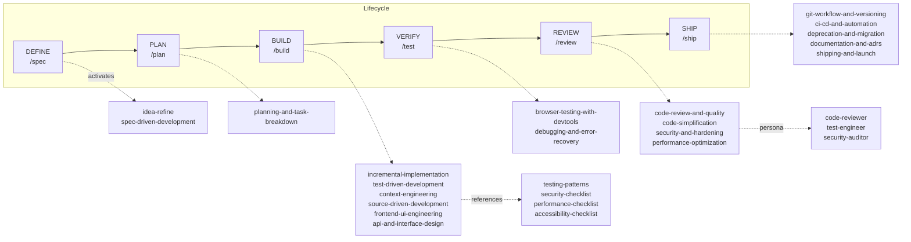

<div class="ai-knowledge-shell">

<aside class="ai-knowledge-sidebar">
  <p class="ai-eyebrow">CATEGORIES</p>
  <nav class="ai-cat-tree"><details class="ai-cat" open><summary><span class="catname">에이전트 오케스트레이션</span><span class="catcount">8</span></summary><ul><li><a href="https://altjs4510.github.io/ai_news_blog/knowledge/20260623/"><span class="kdate">2026-06-23</span><span class="ktitle">bytedance/deer-flow — 샌드박스·메모리·서브에이전트·메시지 게이트웨이를…</span></a></li><li><a href="https://altjs4510.github.io/ai_news_blog/knowledge/20260621/"><span class="kdate">2026-06-21</span><span class="ktitle">calesthio/OpenMontage — 12 파이프라인·52 도구·500+ 스킬을 …</span></a></li><li><a href="https://altjs4510.github.io/ai_news_blog/knowledge/20260611/"><span class="kdate">2026-06-11</span><span class="ktitle">The evolution of agentic surfaces: building with…</span></a></li><li><a href="https://altjs4510.github.io/ai_news_blog/knowledge/20260602/"><span class="kdate">2026-06-02</span><span class="ktitle">revfactory/harness — 도메인별 에이전트 팀과 스킬을 자동 설계하는 메타…</span></a></li><li><a href="https://altjs4510.github.io/ai_news_blog/knowledge/20260529/"><span class="kdate">2026-05-29</span><span class="ktitle">Introducing dynamic workflows in Claude Code</span></a></li><li><a href="https://altjs4510.github.io/ai_news_blog/knowledge/20260520/"><span class="kdate">2026-05-20</span><span class="ktitle">New in Claude Managed Agents: self-hosted sandbo…</span></a></li><li><a href="https://altjs4510.github.io/ai_news_blog/knowledge/20260507/"><span class="kdate">2026-05-07</span><span class="ktitle">ruvnet/ruflo — Claude 멀티 에이전트 오케스트레이션 플랫폼</span></a></li><li><a href="https://altjs4510.github.io/ai_news_blog/knowledge/20260504/"><span class="kdate">2026-05-04</span><span class="ktitle">Agents for Everything Else: Codex for Knowledge …</span></a></li></ul></details><details class="ai-cat" open><summary><span class="catname">MCP &amp; 도구 통합</span><span class="catcount">8</span></summary><ul><li><a href="https://altjs4510.github.io/ai_news_blog/knowledge/20260618/"><span class="kdate">2026-06-18</span><span class="ktitle">DeusData/codebase-memory-mcp — 158개 언어 코드베이스를 밀리…</span></a></li><li><a href="https://altjs4510.github.io/ai_news_blog/knowledge/20260604/"><span class="kdate">2026-06-04</span><span class="ktitle">chopratejas/headroom — Compress tool outputs bef…</span></a></li><li><a href="https://altjs4510.github.io/ai_news_blog/knowledge/20260603/"><span class="kdate">2026-06-03</span><span class="ktitle">How Bad MCP design cost your Agent 5× more token…</span></a></li><li><a href="https://altjs4510.github.io/ai_news_blog/knowledge/20260526/"><span class="kdate">2026-05-26</span><span class="ktitle">colbymchenry/codegraph — Pre-indexed code knowle…</span></a></li><li><a href="https://altjs4510.github.io/ai_news_blog/knowledge/20260523/"><span class="kdate">2026-05-23</span><span class="ktitle">colbymchenry/codegraph — 사전 인덱싱된 코드 지식 그래프 MCP</span></a></li><li><a href="https://altjs4510.github.io/ai_news_blog/knowledge/20260519/"><span class="kdate">2026-05-19</span><span class="ktitle">Anthropic acquires Stainless</span></a></li><li><a href="https://altjs4510.github.io/ai_news_blog/knowledge/20260517/"><span class="kdate">2026-05-17</span><span class="ktitle">I gave my LLM 100,000+ tools — Lazy Discovery &a…</span></a></li><li><a href="https://altjs4510.github.io/ai_news_blog/knowledge/20260509/"><span class="kdate">2026-05-09</span><span class="ktitle">How to connect 100 MCP servers without the conte…</span></a></li></ul></details><details class="ai-cat" open><summary><span class="catname">코딩 에이전트</span><span class="catcount">10</span></summary><ul><li><a href="https://altjs4510.github.io/ai_news_blog/knowledge/20260619/"><span class="kdate">2026-06-19</span><span class="ktitle">Claude Code now supports artifacts</span></a></li><li><a href="https://altjs4510.github.io/ai_news_blog/knowledge/20260530/"><span class="kdate">2026-05-30</span><span class="ktitle">Leonxlnx/taste-skill — AI에게 좋은 취향을 부여해 generic s…</span></a></li><li><a href="https://altjs4510.github.io/ai_news_blog/knowledge/20260528/"><span class="kdate">2026-05-28</span><span class="ktitle">Building self-improving tax agents with Codex</span></a></li><li><a href="https://altjs4510.github.io/ai_news_blog/knowledge/20260524/"><span class="kdate">2026-05-24</span><span class="ktitle">colbymchenry/codegraph — Pre-indexed code knowle…</span></a></li><li><a href="https://altjs4510.github.io/ai_news_blog/knowledge/20260521/"><span class="kdate">2026-05-21</span><span class="ktitle">colbymchenry/codegraph — Pre-indexed code knowle…</span></a></li><li><a href="https://altjs4510.github.io/ai_news_blog/knowledge/20260512/"><span class="kdate">2026-05-12</span><span class="ktitle">agentmemory — Persistent memory for AI coding ag…</span></a></li><li><a href="https://altjs4510.github.io/ai_news_blog/knowledge/20260510/"><span class="kdate">2026-05-10</span><span class="ktitle">addyosmani/agent-skills — Production-grade engin…</span></a></li><li><a href="https://altjs4510.github.io/ai_news_blog/knowledge/20260508/" class="current"><span class="kdate">2026-05-08</span><span class="ktitle">addyosmani/agent-skills — Production-grade engin…</span></a></li><li><a href="https://altjs4510.github.io/ai_news_blog/knowledge/20260506/"><span class="kdate">2026-05-06</span><span class="ktitle">mksglu/context-mode — AI 코딩 에이전트용 컨텍스트 윈도우 최적화</span></a></li><li><a href="https://altjs4510.github.io/ai_news_blog/knowledge/20260505/"><span class="kdate">2026-05-05</span><span class="ktitle">mattpocock/skills — Skills for Real Engineers (.…</span></a></li></ul></details><details class="ai-cat" open><summary><span class="catname">모델 &amp; 연구</span><span class="catcount">4</span></summary><ul><li><a href="https://altjs4510.github.io/ai_news_blog/knowledge/20260620/"><span class="kdate">2026-06-20</span><span class="ktitle">zai-org/GLM-5 — From Vibe Coding to Agentic Engi…</span></a></li><li><a href="https://altjs4510.github.io/ai_news_blog/knowledge/20260617/"><span class="kdate">2026-06-17</span><span class="ktitle">Predicting model behavior before release by simu…</span></a></li><li><a href="https://altjs4510.github.io/ai_news_blog/knowledge/20260516/"><span class="kdate">2026-05-16</span><span class="ktitle">STALE — 에이전트가 자기 기억의 유효성을 인지할 수 있는가</span></a></li><li><a href="https://altjs4510.github.io/ai_news_blog/knowledge/20260513/"><span class="kdate">2026-05-13</span><span class="ktitle">Thinking Machines' Native Interaction Models — T…</span></a></li></ul></details><details class="ai-cat" open><summary><span class="catname">인프라 &amp; 컴퓨트</span><span class="catcount">4</span></summary><ul><li><a href="https://altjs4510.github.io/ai_news_blog/knowledge/20260610/"><span class="kdate">2026-06-10</span><span class="ktitle">Fable 5 just made cost-aware model routing manda…</span></a></li><li><a href="https://altjs4510.github.io/ai_news_blog/knowledge/20260606/"><span class="kdate">2026-06-06</span><span class="ktitle">chopratejas/headroom — Compress tool outputs, lo…</span></a></li><li><a href="https://altjs4510.github.io/ai_news_blog/knowledge/20260605/"><span class="kdate">2026-06-05</span><span class="ktitle">chopratejas/headroom — Compress tool outputs, lo…</span></a></li><li><a href="https://altjs4510.github.io/ai_news_blog/knowledge/20260522/"><span class="kdate">2026-05-22</span><span class="ktitle">Giving Agents Computers — Ivan Burazin, Daytona</span></a></li></ul></details><details class="ai-cat" open><summary><span class="catname">보안 &amp; 거버넌스</span><span class="catcount">6</span></summary><ul><li><a href="https://altjs4510.github.io/ai_news_blog/knowledge/20260614/"><span class="kdate">2026-06-14</span><span class="ktitle">NVIDIA/SkillSpector — Security scanner for AI ag…</span></a></li><li><a href="https://altjs4510.github.io/ai_news_blog/knowledge/20260613/"><span class="kdate">2026-06-13</span><span class="ktitle">Fable 5's guardrails got bypassed in 48 hours — …</span></a></li><li><a href="https://altjs4510.github.io/ai_news_blog/knowledge/20260612/"><span class="kdate">2026-06-12</span><span class="ktitle">NVIDIA/SkillSpector — AI 에이전트 스킬용 보안 스캐너</span></a></li><li><a href="https://altjs4510.github.io/ai_news_blog/knowledge/20260607/"><span class="kdate">2026-06-07</span><span class="ktitle">OpenAI Help: Lockdown Mode</span></a></li><li><a href="https://altjs4510.github.io/ai_news_blog/knowledge/20260531/"><span class="kdate">2026-05-31</span><span class="ktitle">How we contain Claude across products</span></a></li><li><a href="https://altjs4510.github.io/ai_news_blog/knowledge/20260527/"><span class="kdate">2026-05-27</span><span class="ktitle">Microsoft Copilot Cowork Exfiltrates Files</span></a></li></ul></details><details class="ai-cat" open><summary><span class="catname">응용 사례</span><span class="catcount">3</span></summary><ul><li><a href="https://altjs4510.github.io/ai_news_blog/knowledge/20260609/"><span class="kdate">2026-06-09</span><span class="ktitle">Building intelligent apps for Apple platforms wi…</span></a></li><li><a href="https://altjs4510.github.io/ai_news_blog/knowledge/20260515/"><span class="kdate">2026-05-15</span><span class="ktitle">Clawdmeter — Claude Code 사용량을 데스크톱 대시보드로</span></a></li><li><a href="https://altjs4510.github.io/ai_news_blog/knowledge/20260514/"><span class="kdate">2026-05-14</span><span class="ktitle">Introducing Claude for Small Business</span></a></li></ul></details><details class="ai-cat" open><summary><span class="catname">산업 동향</span><span class="catcount">1</span></summary><ul><li><a href="https://altjs4510.github.io/ai_news_blog/knowledge/20260616/"><span class="kdate">2026-06-16</span><span class="ktitle">Why AI hasn't replaced software engineers, and w…</span></a></li></ul></details></nav>
</aside>

<article class="ai-knowledge-article">

<header class="ai-post-hero">
  <p class="ai-eyebrow"><a class="ai-back" href="../">KNOWLEDGE</a> · 2026-05-08 · 오늘의 학습</p>
  <h2 class="ai-post-title">addyosmani/agent-skills — Production-grade engineering skills for AI coding agents</h2>
</header>

> 원문: [addyosmani/agent-skills — Production-grade engineering skills for AI coding agents](https://github.com/addyosmani/agent-skills)

## 📌 학습 정리

### 1. 한 줄 정의
**Agent Skills**는 시니어 엔지니어의 워크플로·품질 게이트·반(反)합리화 규칙을 **20개 SKILL.md + 7개 슬래시 커맨드 + 3개 페르소나 + 4개 체크리스트**로 패키징해 Claude Code·Cursor·Gemini CLI·Copilot 등 다양한 코딩 에이전트에 주입하는 프로덕션급 스킬 라이브러리다.

### 2. 왜 지금 중요한가
- **에이전트 = 스킬 라이브러리 + 런타임** 구도가 굳어지는 흐름의 대표 사례. 단발 프롬프트가 아니라 **DEFINE → PLAN → BUILD → VERIFY → REVIEW → SHIP** 6단계 라이프사이클을 슬래시 커맨드로 고정한다.
- 스킬을 **process, not prose**로 정의해 단계·체크포인트·exit criteria를 강제한다. "참고 문서"가 아니라 "에이전트가 따라가는 실행 그래프"라는 점이 핵심.
- **Anti-rationalization 테이블**과 **Verification 증거 요구**를 모든 스킬에 내장 — "I'll add tests later" 같은 회피 문구에 대한 반박을 미리 박아둔다.
- **Progressive disclosure**: SKILL.md만 항상 로드, 보조 reference는 필요할 때만 끌어와 토큰을 아낀다. 컨텍스트 엔지니어링의 정석.
- **Software Engineering at Google**의 Hyrum's Law·Beyonce Rule·Chesterton's Fence·trunk-based dev·Shift Left 같은 원칙을 워크플로 단계로 직접 박아넣었다 — 추상 원칙이 아닌 실행 가능한 단계로의 번역.

### 3. 핵심 개념
| 용어 | 정의 | 비고/관련 키워드 |
|---|---|---|
| **Skill** | name·description 프런트매터 + Overview/When/Process/Rationalizations/Red Flags/Verification 6블록을 갖는 SKILL.md 단일 파일 | lowercase-hyphen-name, progressive disclosure |
| **Slash Command** | 라이프사이클 단계의 진입점. `/spec` `/plan` `/build` `/test` `/review` `/code-simplify` `/ship` 7종 | `.claude/commands/`, `.gemini/commands/` |
| **Auto-activation** | 작업 맥락(API 설계·UI 구현 등)에 따라 관련 스킬이 자동 트리거 | api-and-interface-design, frontend-ui-engineering |
| **Anti-rationalization** | 에이전트가 단계를 건너뛸 때 쓰는 변명과 그에 대한 반박을 표로 명시 | "tests later", red flags |
| **Verification gate** | 모든 스킬은 테스트 통과·빌드 출력·런타임 데이터 같은 증거 요구로 끝남 | "Seems right is never sufficient" |
| **Agent Persona** | 리뷰 관점 고정용 사전 구성 페르소나 — code-reviewer / test-engineer / security-auditor | Senior Staff Engineer 시점 |
| **Reference Checklist** | 스킬이 필요 시 끌어오는 체크리스트 4종 — testing/security/performance/accessibility | OWASP Top 10, Core Web Vitals, WCAG 2.1 AA |
| **Hook** | `hooks/`에 위치한 세션 라이프사이클 훅 | session lifecycle |
| **Five-axis review** | code-review-and-quality 스킬의 핵심. 변경 크기 ~100 lines, severity 라벨(Nit/Optional/FYI) | change sizing |
| **Stop-the-line** | debugging-and-error-recovery의 5단계 트리아지(reproduce·localize·reduce·fix·guard) 중 원칙 | safe fallbacks |
| **Three-tier boundary** | security-and-hardening의 경계 검증 패턴 | OWASP, secrets management |
| **Test pyramid 80/15/5** | test-driven-development의 비율. DAMP over DRY, Beyonce Rule | Red-Green-Refactor |

### 4. 작동 원리 / 구조



각 SKILL.md는 **Frontmatter(name·description·Use when) → Overview → When to Use → Process → Rationalizations → Red Flags → Verification** 순서의 고정 anatomy를 가진다. 진입점은 SKILL.md 한 장이고, references는 필요 시점에만 로드된다.

### 5. 실제 사용법 / 예시

Claude Code 마켓플레이스 설치:
```
/plugin marketplace add addyosmani/agent-skills
/plugin install agent-skills@addy-agent-skills
```

SSH 키가 없을 때 HTTPS 강제:
```
/plugin marketplace add https://github.com/addyosmani/agent-skills.git
/plugin install agent-skills@addy-agent-skills
```

로컬 개발용:
```
git clone https://github.com/addyosmani/agent-skills.git
claude --plugin-dir /path/to/agent-skills
```

Gemini CLI:
```
gemini skills install https://github.com/addyosmani/agent-skills.git --path skills
gemini skills install ./agent-skills/skills/
```

Cursor는 `SKILL.md`를 `.cursor/rules/`에 복사하거나 `skills/` 디렉터리 전체를 참조. Copilot은 `agents/`를 페르소나로, 스킬 본문을 `.github/copilot-instructions.md`로 사용. Kiro는 `.kiro/skills/` 하위에 Project/Global 레벨로 배치.

### 6. 사용자 프로젝트 접목

- **DCSAI `dcs-ai-plugin`(Claude Code plugins) 카탈로그 재정렬**: 현재의 commands/agents/skills/hooks 폴더 구조를 이 레포의 `skills/<name>/SKILL.md` + `.claude/commands/` + `agents/` + `hooks/` + `references/` 5분할 구조에 맞춰 PoC. 특히 **DEFINE→SHIP 6단계 슬래시 커맨드**를 그대로 차용하되, F&F 사내 컨벤션(보안·MS SSO·Snowflake/Neo4j 데이터 접근 가드)을 `security-and-hardening`·`api-and-interface-design` 스킬의 three-tier boundary 패턴으로 확장.
- **DCSAI agent loop의 HITL 분기 직전 사전검증 hook**: `hooks/` 세션 라이프사이클 훅 패턴을 참고해, Anthropic SDK 직통합 루프에서 tool-call 직전에 `verification gate`(테스트·빌드 증거)와 `anti-rationalization` 체크를 강제 실행하는 pre-HITL hook을 신설. 통과 못 하면 자동으로 HITL 큐로 라우팅.
- **DCSAI MCP host server의 재사용 코딩 스킬 셋**: `incremental-implementation`·`test-driven-development`·`source-driven-development`·`debugging-and-error-recovery`를 MCP resource로 등록해 dcs-ai-cli(Rust)·ff-claude-manager(Tauri 2)에서도 동일하게 호출. **progressive disclosure** 원칙대로 SKILL.md만 default load, references는 필요 시 fetch.
- **Team Agent `discovery-core-agent` ↔ `platform-core-agent` 계층의 스킬 상속 모델**: platform 레벨에 본 레포의 20 스킬을 베이스로 두고, `brand.yaml`에 브랜드별 anti-rationalization 항목·red flag·verification 임계치를 오버라이드하도록 설계. discovery-core-agent는 platform 스킬을 상속받되 브랜드 컨텍스트만 주입.
- **Team Agent Activity Log/Observer L1~L4와 verification 결합**: 각 스킬의 `Verification` 단계 산출물(tests passing·build output·runtime data)을 Activity Log 이벤트로 표준화 → Observer가 L1(증거 누락)~L4(품질 회귀) 피드백을 자동 라벨링. **Quest 3계층**(전체·파티·플레이어) 중 플레이어 Quest 완료 조건을 verification 증거로 정의.
- **Team Agent FSD/server-only 경계에 `code-review-and-quality`의 five-axis · ~100 lines 룰 적용**: PR 사이즈 가드와 splitting strategy를 CI 파이프라인의 quality gate로 박아 `ci-cd-and-automation`의 Shift Left·feature flags 패턴과 결합.

### 7. 더 파고들 거리
- 원문에 등장한 외부 자료는 [Software Engineering at Google](https://abseil.io/resources/swe-book)와 Google의 [engineering practices guide](https://google.github.io/eng-practices/), 그리고 [Kiro skills docs](https://kiro.dev/docs/skills/) 셋이며, 본 레포 내부 문서로는 `docs/getting-started.md`·`docs/skill-anatomy.md`·`docs/cursor-setup.md`·`docs/gemini-cli-setup.md`·`docs/windsurf-setup.md`·`docs/opencode-setup.md`·`docs/copilot-setup.md`·`CONTRIBUTING.md`가 명시되어 있다.

---

## 📖 원문 전체 번역 (정독용)

> 의역 최소화한 전체 번역입니다. 큰 흐름은 위 정리에서 잡고, 정확한 워딩이 필요할 땐 이 섹션에서 정독하세요.

# Agent Skills
AI 코딩 에이전트를 위한 프로덕션 수준의 엔지니어링 스킬.

스킬은 시니어 엔지니어가 소프트웨어를 개발할 때 사용하는 워크플로우, 품질 게이트, 그리고 모범 사례를 담고 있습니다. 이 스킬들은 AI 에이전트가 개발의 모든 단계에서 일관되게 따를 수 있도록 패키지화되어 있습니다.

```
DEFINE          PLAN           BUILD          VERIFY         REVIEW          SHIP
 ┌──────┐      ┌──────┐      ┌──────┐      ┌──────┐      ┌──────┐      ┌──────┐
 │ Idea │ ───▶ │ Spec │ ───▶ │ Code │ ───▶ │ Test │ ───▶ │  QA  │ ───▶ │  Go  │
 │Refine│      │  PRD │      │ Impl │      │Debug │      │ Gate │      │ Live │
 └──────┘      └──────┘      └──────┘      └──────┘      └──────┘      └──────┘
  /spec          /plan          /build        /test         /review       /ship
```

## 명령어 (Commands)

개발 생명주기에 대응하는 7개의 슬래시 명령어. 각 명령어는 적절한 스킬을 자동으로 활성화합니다.

| 하고 있는 일 | 명령어 | 핵심 원칙 |
|---|---|---|
| 무엇을 만들지 정의 | `/spec` | 코드보다 스펙 먼저 |
| 어떻게 만들지 계획 | `/plan` | 작고 원자적인 태스크 |
| 점진적으로 구현 | `/build` | 한 번에 한 슬라이스씩 |
| 동작함을 증명 | `/test` | 테스트는 증거다 |
| 병합 전 리뷰 | `/review` | 코드 건전성 개선 |
| 코드 단순화 | `/code-simplify` | 영리함보다 명확함 |
| 프로덕션에 배포 | `/ship` | 빠를수록 더 안전하다 |

스킬은 또한 현재 작업에 따라 자동으로 활성화됩니다 — API 설계 시 `api-and-interface-design`이, UI 구현 시 `frontend-ui-engineering`이 트리거되는 식입니다.

## 빠른 시작 (Quick Start)

### Claude Code (권장)

마켓플레이스 설치:

```
/plugin marketplace add addyosmani/agent-skills
/plugin install agent-skills@addy-agent-skills
```

**SSH 오류?**

마켓플레이스는 SSH를 통해 저장소를 클론합니다. GitHub에 SSH 키가 설정되어 있지 않다면, [SSH 키를 추가](https://github.com/settings/keys)하거나, 전체 HTTPS URL을 사용해 HTTPS 클론을 강제하세요:

```
/plugin marketplace add https://github.com/addyosmani/agent-skills.git
/plugin install agent-skills@addy-agent-skills
```

로컬 / 개발 환경:

```
git clone https://github.com/addyosmani/agent-skills.git
claude --plugin-dir /path/to/agent-skills
```

### Cursor

임의의 `SKILL.md` 파일을 `.cursor/rules/`에 복사하거나, 전체 `skills/` 디렉터리를 참조하세요. `docs/cursor-setup.md`를 참고하세요.

### Gemini CLI

자동 검색을 위해 네이티브 스킬로 설치하거나, 영속적인 컨텍스트를 위해 `GEMINI.md`에 추가하세요. `docs/gemini-cli-setup.md`를 참고하세요.

저장소에서 설치:

```
gemini skills install https://github.com/addyosmani/agent-skills.git --path skills
```

로컬 클론에서 설치:

```
gemini skills install ./agent-skills/skills/
```

### Windsurf

스킬 내용을 Windsurf 규칙 설정에 추가하세요. `docs/windsurf-setup.md`를 참고하세요.

### OpenCode

AGENTS.md와 `skill` 도구를 통한 에이전트 주도 스킬 실행을 사용합니다.
`docs/opencode-setup.md`를 참고하세요.

### GitHub Copilot

`agents/`의 에이전트 정의를 Copilot 페르소나로 사용하고, `.github/copilot-instructions.md`에 스킬 내용을 추가하세요. `docs/copilot-setup.md`를 참고하세요.

### Kiro IDE & CLI

Kiro용 스킬은 `.kiro/skills/` 아래에 위치하며, 프로젝트 레벨 또는 글로벌 레벨로 저장할 수 있습니다. Kiro는 Agents.md도 지원합니다. Kiro 문서는 https://kiro.dev/docs/skills/ 를 참고하세요.

### Codex / 기타 에이전트

스킬은 순수한 마크다운으로 작성되어 있어, 시스템 프롬프트나 인스트럭션 파일을 허용하는 모든 에이전트에서 동작합니다. `docs/getting-started.md`를 참고하세요.

## 전체 20개 스킬 (All 20 Skills)

위의 명령어들은 진입점입니다. 내부적으로는 아래 20개의 스킬을 활성화하며, 각 스킬은 단계, 검증 게이트, 합리화 방지 테이블이 포함된 구조화된 워크플로우입니다. 스킬을 직접 참조할 수도 있습니다.

### Define - 무엇을 만들지 명확히 하기

| 스킬 | 기능 | 사용 시점 |
|---|---|---|
| `idea-refine` | 막연한 아이디어를 구체적인 제안으로 전환하기 위한 구조화된 발산/수렴 사고 | 탐색이 필요한 거친 개념이 있을 때 |
| `spec-driven-development` | 코드 작성 전에 목표, 명령어, 구조, 코드 스타일, 테스트, 경계를 포함한 PRD 작성 | 새 프로젝트, 기능, 또는 중요한 변경을 시작할 때 |

### Plan - 분해하기

| 스킬 | 기능 | 사용 시점 |
|---|---|---|
| `planning-and-task-breakdown` | 스펙을 수용 기준과 의존성 순서가 있는 작고 검증 가능한 태스크로 분해 | 스펙이 있고 구현 가능한 단위가 필요할 때 |

### Build - 코드 작성하기

| 스킬 | 기능 | 사용 시점 |
|---|---|---|
| `incremental-implementation` | 얇은 수직 슬라이스 — 구현, 테스트, 검증, 커밋. 피처 플래그, 안전한 기본값, 롤백 친화적 변경 | 두 개 이상의 파일에 영향을 주는 모든 변경 |
| `test-driven-development` | Red-Green-Refactor, 테스트 피라미드(80/15/5), 테스트 크기, DRY보다 DAMP, Beyonce Rule, 브라우저 테스팅 | 로직 구현, 버그 수정, 또는 동작 변경 시 |
| `context-engineering` | 에이전트에게 적시에 올바른 정보 제공 — 규칙 파일, 컨텍스트 패킹, MCP 통합 | 세션 시작, 태스크 전환, 또는 출력 품질이 떨어질 때 |
| `source-driven-development` | 모든 프레임워크 결정을 공식 문서에 근거 — 검증, 출처 인용, 미검증 항목 표시 | 프레임워크나 라이브러리에 대해 권위 있고 출처가 인용된 코드를 원할 때 |
| `frontend-ui-engineering` | 컴포넌트 아키텍처, 디자인 시스템, 상태 관리, 반응형 디자인, WCAG 2.1 AA 접근성 | 사용자 대면 인터페이스를 구현하거나 수정할 때 |
| `api-and-interface-design` | 계약 우선 설계, Hyrum's Law, One-Version Rule, 오류 시맨틱, 경계 유효성 검사 | API, 모듈 경계, 또는 공개 인터페이스 설계 시 |

### Verify - 동작함을 증명하기

| 스킬 | 기능 | 사용 시점 |
|---|---|---|
| `browser-testing-with-devtools` | 라이브 런타임 데이터를 위한 Chrome DevTools MCP — DOM 검사, 콘솔 로그, 네트워크 트레이스, 성능 프로파일링 | 브라우저에서 실행되는 것을 구현하거나 디버깅할 때 |
| `debugging-and-error-recovery` | 5단계 트리아지: 재현, 국소화, 축소, 수정, 방어. Stop-the-line 규칙, 안전한 폴백 | 테스트 실패, 빌드 오류, 또는 예상치 못한 동작 발생 시 |

### Review - 병합 전 품질 게이트

| 스킬 | 기능 | 사용 시점 |
|---|---|---|
| `code-review-and-quality` | 5축 리뷰, 변경 크기(~100줄), 심각도 레이블(Nit/Optional/FYI), 리뷰 속도 기준, 분리 전략 | 모든 변경 사항 병합 전 |
| `code-simplification` | Chesterton's Fence, Rule of 500, 정확한 동작을 보존하면서 복잡도 감소 | 코드는 동작하지만 필요 이상으로 읽거나 유지하기 어려울 때 |
| `security-and-hardening` | OWASP Top 10 예방, 인증 패턴, 시크릿 관리, 의존성 감사, 3계층 경계 시스템 | 사용자 입력, 인증, 데이터 저장, 또는 외부 통합 처리 시 |
| `performance-optimization` | 측정 우선 접근법 — Core Web Vitals 목표, 프로파일링 워크플로우, 번들 분석, 안티패턴 감지 | 성능 요구사항이 있거나 회귀가 의심될 때 |

### Ship - 자신 있게 배포하기

| 스킬 | 기능 | 사용 시점 |
|---|---|---|
| `git-workflow-and-versioning` | 트렁크 기반 개발, 원자적 커밋, 변경 크기(~100줄), 커밋-세이브포인트 패턴 | 모든 코드 변경 시 (항상) |
| `ci-cd-and-automation` | Shift Left, 빠를수록 더 안전, 피처 플래그, 품질 게이트 파이프라인, 실패 피드백 루프 | 빌드 및 배포 파이프라인 설정 또는 수정 시 |
| `deprecation-and-migration` | 코드-부채 마인드셋, 필수적 vs 권고적 deprecation, 마이그레이션 패턴, 좀비 코드 제거 | 오래된 시스템 제거, 사용자 마이그레이션, 또는 기능 종료 시 |
| `documentation-and-adrs` | Architecture Decision Records (ADR), API 문서, 인라인 문서 표준 — *이유*를 문서화 | 아키텍처 결정, API 변경, 또는 기능 출시 시 |
| `shipping-and-launch` | 출시 전 체크리스트, 피처 플래그 생명주기, 단계적 롤아웃, 롤백 절차, 모니터링 설정 | 프로덕션 배포 준비 시 |

## 에이전트 페르소나 (Agent Personas)

목적에 맞는 리뷰를 위한 사전 구성된 전문가 페르소나:

| 에이전트 | 역할 | 관점 |
|---|---|---|
| `code-reviewer` | 시니어 스태프 엔지니어 | "스태프 엔지니어가 이것을 승인할 것인가?" 기준의 5축 코드 리뷰 |
| `test-engineer` | QA 전문가 | 테스트 전략, 커버리지 분석, 그리고 Prove-It 패턴 |
| `security-auditor` | 보안 엔지니어 | 취약점 탐지, 위협 모델링, OWASP 평가 |

## 참조 체크리스트 (Reference Checklists)

스킬이 필요할 때 가져오는 빠른 참조 자료:

| 참조 자료 | 포함 내용 |
|---|---|
| `testing-patterns.md` | 테스트 구조, 네이밍, 모킹, React/API/E2E 예시, 안티패턴 |
| `security-checklist.md` | 커밋 전 체크, 인증, 입력 유효성 검사, 헤더, CORS, OWASP Top 10 |
| `performance-checklist.md` | Core Web Vitals 목표, 프론트엔드/백엔드 체크리스트, 측정 명령어 |
| `accessibility-checklist.md` | 키보드 탐색, 스크린 리더, 시각적 디자인, ARIA, 테스팅 도구 |

## 스킬의 동작 방식 (How Skills Work)

모든 스킬은 일관된 구조를 따릅니다:

```
┌─────────────────────────────────────────────────┐
│  SKILL.md                                       │
│                                                 │
│  ┌─ Frontmatter ─────────────────────────────┐  │
│  │ name: lowercase-hyphen-name               │  │
│  │ description: Guides agents through [task].│  │
│  │              Use when…                    │  │
│  └───────────────────────────────────────────┘  │
│  Overview         → 이 스킬이 하는 일           │
│  When to Use      → 트리거 조건                 │
│  Process          → 단계별 워크플로우           │
│  Rationalizations → 변명 + 반박                 │
│  Red Flags        → 문제의 징후                 │
│  Verification     → 증거 요구사항               │
└─────────────────────────────────────────────────┘
```

**주요 설계 선택:**

**프로세스, 산문이 아님.** 스킬은 에이전트가 읽는 참조 문서가 아니라, 따르는 워크플로우입니다. 각 스킬에는 단계, 체크포인트, 종료 기준이 있습니다.

**합리화 방지.** 모든 스킬에는 에이전트가 단계를 건너뛰기 위해 사용하는 일반적인 변명들(예: "나중에 테스트를 추가하겠습니다")과 문서화된 반박이 담긴 테이블이 포함되어 있습니다.

**검증은 협상 불가.** 모든 스킬은 증거 요구사항 — 테스트 통과, 빌드 출력, 런타임 데이터 — 으로 끝납니다. "맞는 것 같다"는 결코 충분하지 않습니다.

**점진적 공개.** `SKILL.md`가 진입점입니다. 지원 참조 자료는 필요할 때만 로드되어, 토큰 사용을 최소로 유지합니다.

## 프로젝트 구조 (Project Structure)

```
agent-skills/
├── skills/                            # 20개의 핵심 스킬 (디렉터리당 SKILL.md)
│   ├── idea-refine/                   #   Define
│   ├── spec-driven-development/       #   Define
│   ├── planning-and-task-breakdown/   #   Plan
│   ├── incremental-implementation/    #   Build
│   ├── context-engineering/           #   Build
│   ├── source-driven-development/     #   Build
│   ├── frontend-ui-engineering/       #   Build
│   ├── test-driven-development/       #   Build
│   ├── api-and-interface-design/      #   Build
│   ├── browser-testing-with-devtools/ #   Verify
│   ├── debugging-and-error-recovery/  #   Verify
│   ├── code-review-and-quality/       #   Review
│   ├── code-simplification/          #   Review
│   ├── security-and-hardening/        #   Review
│   ├── performance-optimization/      #   Review
│   ├── git-workflow-and-versioning/   #   Ship
│   ├── ci-cd-and-automation/          #   Ship
│   ├── deprecation-and-migration/     #   Ship
│   ├── documentation-and-adrs/        #   Ship
│   ├── shipping-and-launch/           #   Ship
│   └── using-agent-skills/            #   Meta: 이 팩을 사용하는 방법
├── agents/                            # 3개의 전문가 페르소나
├── references/                        # 4개의 보완 체크리스트
├── hooks/                             # 세션 생명주기 훅
├── .claude/commands/                  # 7개의 슬래시 명령어 (Claude Code)
├── .gemini/commands/                  # 7개의 슬래시 명령어 (Gemini CLI)
└── docs/                              # 도구별 설정 가이드
```

## Agent Skills가 필요한 이유 (Why Agent Skills?)

AI 코딩 에이전트는 기본적으로 최단 경로를 선택합니다 — 이는 종종 스펙, 테스트, 보안 리뷰, 그리고 소프트웨어를 신뢰할 수 있게 만드는 관행들을 건너뜀을 의미합니다. Agent Skills는 에이전트에게 시니어 엔지니어가 프로덕션 코드에 적용하는 것과 동일한 규율을 강제하는 구조화된 워크플로우를 제공합니다.

각 스킬은 힘들게 얻은 엔지니어링 판단을 담고 있습니다: 스펙을 *언제* 작성할지, *무엇을* 테스트할지, *어떻게* 리뷰할지, 그리고 *언제* 출시할지. 이것들은 범용 프롬프트가 아닙니다 — 프로덕션 품질의 작업과 프로토타입 품질의 작업을 구분 짓는 종류의, 의견이 반영된 프로세스 중심의 워크플로우입니다.

스킬은 Google의 엔지니어링 문화 — [Software Engineering at Google](https://abseil.io/resources/swe-book)과 Google의 [engineering practices guide](https://google.github.io/eng-practices/)를 포함하여 — 의 모범 사례를 내재하고 있습니다. API 설계에서의 Hyrum's Law, 테스팅에서의 Beyonce Rule과 테스트 피라미드, 코드 리뷰에서의 변경 크기 및 리뷰 속도 기준, 단순화에서의 Chesterton's Fence, git 워크플로우에서의 트렁크 기반 개발, CI/CD에서의 Shift Left와 피처 플래그, 그리고 코드를 부채로 취급하는 전용 deprecation 스킬을 찾아볼 수 있습니다. 이것들은 추상적인 원칙이 아닙니다 — 에이전트가 따르는 단계별 워크플로우에 직접 내장되어 있습니다.

## 기여하기 (Contributing)

스킬은 **구체적**이어야 하고(모호한 조언이 아닌 실행 가능한 단계), **검증 가능**해야 하며(증거 요구사항이 있는 명확한 종료 기준), **실전 검증**이 되어야 하고(실제 워크플로우에 기반), **최소**여야 합니다(에이전트를 안내하는 데 필요한 것만).

형식 명세는 `docs/skill-anatomy.md`를, 가이드라인은 `CONTRIBUTING.md`를 참고하세요.

## 라이선스 (License)

MIT — 이 스킬들을 여러분의 프로젝트, 팀, 도구에서 자유롭게 사용하세요.

</article>

</div>

<!-- ai-related-links -->
<aside class="ai-related-links">
  <p class="ai-eyebrow">관련 학습</p>
  <ul><li><a href="https://altjs4510.github.io/ai_news_blog/knowledge/20260505/"><span class="kdate">2026-05-05</span><span class="ktitle">mattpocock/skills — Skills for Real Engineers (.…</span></a></li><li><a href="https://altjs4510.github.io/ai_news_blog/knowledge/20260506/"><span class="kdate">2026-05-06</span><span class="ktitle">mksglu/context-mode — AI 코딩 에이전트용 컨텍스트 윈도우 최적화</span></a></li></ul>
</aside>
<!-- /ai-related-links -->
