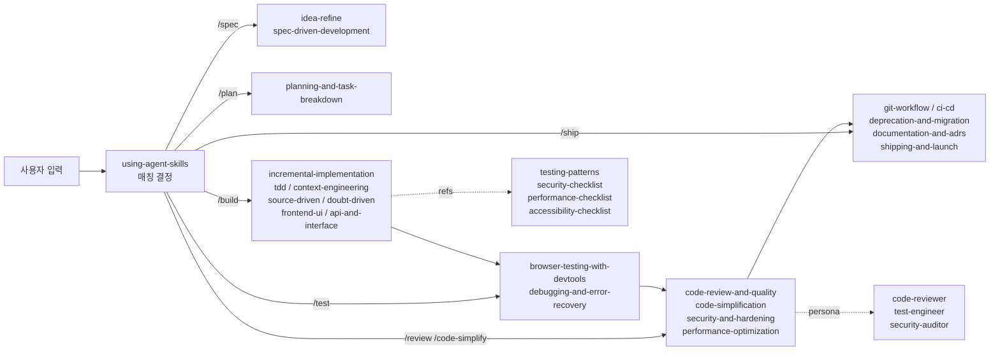

<div class="ai-knowledge-shell">

<aside class="ai-knowledge-sidebar">
  <p class="ai-eyebrow">CATEGORIES</p>
  <nav class="ai-cat-tree"><details class="ai-cat" open><summary><span class="catname">에이전트 오케스트레이션</span><span class="catcount">3</span></summary><ul><li><a href="https://altjs4510.github.io/ai_news_blog/knowledge/20260520/"><span class="kdate">2026-05-20</span><span class="ktitle">New in Claude Managed Agents: self-hosted sandbo…</span></a></li><li><a href="https://altjs4510.github.io/ai_news_blog/knowledge/20260507/"><span class="kdate">2026-05-07</span><span class="ktitle">ruvnet/ruflo — Claude 멀티 에이전트 오케스트레이션 플랫폼</span></a></li><li><a href="https://altjs4510.github.io/ai_news_blog/knowledge/20260504/"><span class="kdate">2026-05-04</span><span class="ktitle">Agents for Everything Else: Codex for Knowledge …</span></a></li></ul></details><details class="ai-cat" open><summary><span class="catname">MCP &amp; 도구 통합</span><span class="catcount">3</span></summary><ul><li><a href="https://altjs4510.github.io/ai_news_blog/knowledge/20260519/"><span class="kdate">2026-05-19</span><span class="ktitle">Anthropic acquires Stainless</span></a></li><li><a href="https://altjs4510.github.io/ai_news_blog/knowledge/20260517/"><span class="kdate">2026-05-17</span><span class="ktitle">I gave my LLM 100,000+ tools — Lazy Discovery &a…</span></a></li><li><a href="https://altjs4510.github.io/ai_news_blog/knowledge/20260509/"><span class="kdate">2026-05-09</span><span class="ktitle">How to connect 100 MCP servers without the conte…</span></a></li></ul></details><details class="ai-cat" open><summary><span class="catname">코딩 에이전트</span><span class="catcount">6</span></summary><ul><li><a href="https://altjs4510.github.io/ai_news_blog/knowledge/20260521/"><span class="kdate">2026-05-21</span><span class="ktitle">colbymchenry/codegraph — Pre-indexed code knowle…</span></a></li><li><a href="https://altjs4510.github.io/ai_news_blog/knowledge/20260512/"><span class="kdate">2026-05-12</span><span class="ktitle">agentmemory — Persistent memory for AI coding ag…</span></a></li><li><a href="https://altjs4510.github.io/ai_news_blog/knowledge/20260510/" class="current"><span class="kdate">2026-05-10</span><span class="ktitle">addyosmani/agent-skills — Production-grade engin…</span></a></li><li><a href="https://altjs4510.github.io/ai_news_blog/knowledge/20260508/"><span class="kdate">2026-05-08</span><span class="ktitle">addyosmani/agent-skills — Production-grade engin…</span></a></li><li><a href="https://altjs4510.github.io/ai_news_blog/knowledge/20260506/"><span class="kdate">2026-05-06</span><span class="ktitle">mksglu/context-mode — AI 코딩 에이전트용 컨텍스트 윈도우 최적화</span></a></li><li><a href="https://altjs4510.github.io/ai_news_blog/knowledge/20260505/"><span class="kdate">2026-05-05</span><span class="ktitle">mattpocock/skills — Skills for Real Engineers (.…</span></a></li></ul></details><details class="ai-cat" open><summary><span class="catname">모델 &amp; 연구</span><span class="catcount">2</span></summary><ul><li><a href="https://altjs4510.github.io/ai_news_blog/knowledge/20260516/"><span class="kdate">2026-05-16</span><span class="ktitle">STALE — 에이전트가 자기 기억의 유효성을 인지할 수 있는가</span></a></li><li><a href="https://altjs4510.github.io/ai_news_blog/knowledge/20260513/"><span class="kdate">2026-05-13</span><span class="ktitle">Thinking Machines' Native Interaction Models — T…</span></a></li></ul></details><details class="ai-cat" open><summary><span class="catname">인프라 &amp; 컴퓨트</span><span class="catcount">1</span></summary><ul><li><a href="https://altjs4510.github.io/ai_news_blog/knowledge/20260522/"><span class="kdate">2026-05-22</span><span class="ktitle">Giving Agents Computers — Ivan Burazin, Daytona</span></a></li></ul></details><details class="ai-cat" open><summary><span class="catname">응용 사례</span><span class="catcount">2</span></summary><ul><li><a href="https://altjs4510.github.io/ai_news_blog/knowledge/20260515/"><span class="kdate">2026-05-15</span><span class="ktitle">Clawdmeter — Claude Code 사용량을 데스크톱 대시보드로</span></a></li><li><a href="https://altjs4510.github.io/ai_news_blog/knowledge/20260514/"><span class="kdate">2026-05-14</span><span class="ktitle">Introducing Claude for Small Business</span></a></li></ul></details></nav>
</aside>

<article class="ai-knowledge-article">

<header class="ai-post-hero">
  <p class="ai-eyebrow"><a class="ai-back" href="../">KNOWLEDGE</a> · 2026-05-10 · 오늘의 학습</p>
  <h2 class="ai-post-title">addyosmani/agent-skills — Production-grade engineering skills for AI coding agents</h2>
</header>

> 원문: [addyosmani/agent-skills — Production-grade engineering skills for AI coding agents](https://github.com/addyosmani/agent-skills)

## 📌 학습 정리

### 1. 한 줄 정의
**Agent Skills**는 시니어 엔지니어가 프로덕션 코드를 만들 때 쓰는 워크플로·품질 게이트·반-합리화(anti-rationalization) 패턴을 21개 **SKILL.md** 단위로 묶어 AI 코딩 에이전트가 일관되게 따르도록 만든 **Claude Code 플러그인 패키지**다.

### 2. 왜 지금 중요한가
- **Claude Code Skill 패턴의 정착 사례**: `/plugin marketplace add`로 한 줄에 설치 가능한 플러그인 마켓플레이스 형태가 굳어지고 있고, 이 저장소는 그 레퍼런스 구현에 가깝다.
- **Slash command ↔ Skill 자동 매칭**: `/spec`·`/plan`·`/build`·`/test`·`/review`·`/ship`·`/code-simplify` 7개 명령이 **개발 라이프사이클 단계**에 매핑되고, 작업 종류(API 설계 → `api-and-interface-design`, UI → `frontend-ui-engineering`)에 따라 스킬이 **자동 활성화**된다.
- **에이전트의 "지름길 본능"을 막는 장치**: 모든 스킬에 **Rationalizations 표**(스킵 핑계 + 반박)와 **Verification 증거 요구**가 강제로 들어간다 — "seems right" 금지.
- **멀티 에이전트 환경 호환**: Claude Code뿐 아니라 **Cursor**(`.cursor/rules/`), **Gemini CLI**(`gemini skills install`), **Windsurf**, **OpenCode**(AGENTS.md + `skill` tool), **GitHub Copilot**(`.github/copilot-instructions.md`), **Kiro**(`.kiro/skills/`)까지 동일 Markdown 자산을 재사용. 스킬이 사실상 **에이전트 중립 포맷**으로 자리잡는 흐름.
- **Google 엔지니어링 문화의 코드화**: Hyrum's Law, Beyonce Rule, 테스트 피라미드, Chesterton's Fence, trunk-based development, Shift Left 등 [Software Engineering at Google](https://abseil.io/resources/swe-book)과 [engineering practices guide](https://google.github.io/eng-practices/)의 원칙이 **실행 가능한 step**으로 박혀 있다.

### 3. 핵심 개념
| 용어 | 정의 | 비고/관련 키워드 |
|---|---|---|
| **SKILL.md** | 스킬 단위 진입점 파일. frontmatter(name·description·"Use when") + Overview/When to Use/Process/Rationalizations/Red Flags/Verification 구조 | Progressive disclosure: 본문이 entry, 참조 자료는 필요 시 로드 |
| **Slash Commands (7개)** | `/spec` `/plan` `/build` `/test` `/review` `/code-simplify` `/ship` | `.claude/commands/`, `.gemini/commands/`에 양쪽 정의 |
| **Auto-activation** | 작업 맥락(API 설계, UI 빌드 등)에 따라 스킬이 자동 트리거 | `using-agent-skills` 메타 스킬이 매칭 담당 |
| **Anti-rationalization Table** | "나중에 테스트 추가하지" 같은 핑계와 그 반박을 명시 | 모든 스킬에 포함 |
| **Verification Gate** | 통과 증거(테스트 통과, 빌드 출력, 런타임 데이터) 없이는 종료 불가 | "Tests are proof" 원칙 |
| **doubt-driven-development** | CLAIM → EXTRACT → DOUBT → RECONCILE → STOP의 in-flight 적대적 검증, 사용자 인가 시 cross-model 에스컬레이션 | 고위험·낯선 코드·자신만만한 출력에 발동 |
| **context-engineering** | rules 파일·context packing·MCP 통합으로 적시 정보 주입 | 세션 시작·태스크 전환·출력 품질 저하 시 |
| **source-driven-development** | 모든 프레임워크 결정을 공식 문서로 검증·인용·미검증 표시 | 권위 있는 코드 생성 |
| **Agent Personas** | `code-reviewer`(Senior Staff), `test-engineer`(QA), `security-auditor`(Security) 3종 | `agents/` 디렉터리, Copilot 페르소나로도 재사용 |
| **References** | `testing-patterns.md`, `security-checklist.md`, `performance-checklist.md`, `accessibility-checklist.md` 4종 보조 체크리스트 | 스킬이 필요할 때 끌어다 씀 |
| **Hooks** | `hooks/`에 세션 라이프사이클 훅 | Claude Code plugin 표준 hook |

### 4. 작동 원리 / 구조



각 스킬은 **Process(steps)** → **Verification(evidence)** → **Red Flags(이상 신호)** 순으로 실행되고, 도중에 **Rationalizations** 표가 핑계를 차단한다.

### 5. 실제 사용법 / 예시

Claude Code 마켓플레이스 설치:
```
/plugin marketplace add addyosmani/agent-skills
/plugin install agent-skills@addy-agent-skills
```

SSH 키 없을 때 HTTPS 강제:
```
/plugin marketplace add https://github.com/addyosmani/agent-skills.git
/plugin install agent-skills@addy-agent-skills
```

로컬 개발:
```
git clone https://github.com/addyosmani/agent-skills.git
claude --plugin-dir /path/to/agent-skills
```

Gemini CLI:
```
gemini skills install https://github.com/addyosmani/agent-skills.git --path skills
gemini skills install ./agent-skills/skills/
```

**SKILL.md** anatomy(원문 발췌):
```
name: lowercase-hyphen-name
description: Guides agents through [task]. Use when…
```
`Overview / When to Use / Process / Rationalizations / Red Flags / Verification` 6 섹션.

프로젝트 구조:
```
agent-skills/
├── skills/        # 21 core skills (SKILL.md per directory)
├── agents/        # 3 specialist personas
├── references/    # 4 supplementary checklists
├── hooks/         # Session lifecycle hooks
├── .claude/commands/   # 7 slash commands (Claude Code)
├── .gemini/commands/   # 7 slash commands (Gemini CLI)
└── docs/          # Setup guides per tool
```

### 6. 사용자 프로젝트 접목

- **DCSAI `dcs-ai-plugin` 카탈로그 재정비**: 현재의 commands/agents/skills/hooks 폴더를 이 저장소의 **DEFINE→PLAN→BUILD→VERIFY→REVIEW→SHIP** 6단계 + 7 slash command 매핑으로 리팩터. 특히 `using-agent-skills` 메타 스킬을 본떠 **F&F 사내 매칭 스킬**(예: `dcs-spec`, `dcs-snowflake-query`, `dcs-neo4j-cypher`)을 만들어 두면, DCSAI가 다루는 PostgreSQL/Snowflake/Neo4j 컨텍스트에서 자동 발화시킬 수 있음.

- **DCSAI agent loop의 HITL 분기 앞단에 skill-match 단계 삽입**: Anthropic SDK 직통합 루프에서 tool_use 호출 직전에 `context-engineering` + `doubt-driven-development`의 **CLAIM→EXTRACT→DOUBT→RECONCILE→STOP** 절차를 끼워, 고위험(production·security·irreversible) 도구 호출만 HITL로 승격하고 나머지는 자동 스킬로 흡수. **MCP host server**가 이미 자체 구현이라 hook 위치 통제가 쉽다.

- **`ff-claude-manager`(Tauri 2)에 마켓플레이스 미러**: 사내용 skill pack(`dcs-skills@ff`)을 `/plugin marketplace add` 패턴으로 배포·버전 관리. **HTTPS 강제 옵션**이 그대로 사내 Git 환경에 유효하므로 SSH 키 정책 무관하게 깔린다.

- **Team Agent — `brand.yaml` × Skill 결합**: `discovery-core-agent`(브랜드)와 `platform-core-agent`(크로스 브랜드)에 스킬을 **계층별로 다르게 주입**. 예: `frontend-ui-engineering`·`api-and-interface-design`은 platform-core-agent의 공용 표준으로, 브랜드별 KPI/네이밍/허용 톤은 brand.yaml에서 SKILL.md frontmatter의 "Use when"을 동적 합성. **server-only / FSD** 경계 검증은 `code-review-and-quality`의 5축 리뷰로 자동화.

- **Activity Log/Observer L1~L4에 Verification Gate 매핑**: 스킬마다 강제되는 **evidence requirement**(테스트 출력·빌드 로그·런타임 데이터)를 Observer 피드백 루프의 L1(원시 로그)~L4(가치 회수 신호) 스키마에 1:1로 흘려서, **Quest 3계층(전체·파티·플레이어)** 각각의 완료 판정을 "seems right"가 아닌 증거 기반으로 전환. `shipping-and-launch`의 staged rollout/rollback 체크리스트는 Build/Operate 2축 중 **Operate 회수** 단계의 표준 체크리스트로 채택 가능.

### 7. 더 파고들 거리
- [Software Engineering at Google](https://abseil.io/resources/swe-book) — 책의 Beyonce Rule, 테스트 피라미드, 변경 사이즈 규범 등이 스킬에 반영
- [Google engineering practices guide](https://google.github.io/eng-practices/) — code review speed norms, change sizing 출처
- [Kiro Skills 공식 문서](https://kiro.dev/docs/skills/) — `.kiro/skills/` 프로젝트/글로벌 레벨 운용
- 저장소 내부 문서: `docs/getting-started.md`, `docs/skill-anatomy.md`, `docs/cursor-setup.md`, `docs/gemini-cli-setup.md`, `docs/windsurf-setup.md`, `docs/opencode-setup.md`, `docs/copilot-setup.md`, `CONTRIBUTING.md` (원문 본문에서 직접 언급)

---

## 📖 원문 전체 번역 (정독용)

> 의역 최소화한 전체 번역입니다. 큰 흐름은 위 정리에서 잡고, 정확한 워딩이 필요할 땐 이 섹션에서 정독하세요.

# Agent Skills
AI 코딩 에이전트를 위한 프로덕션 수준의 엔지니어링 스킬 모음.

스킬(Skill)은 시니어 엔지니어가 소프트웨어를 개발할 때 사용하는 워크플로우, 품질 게이트, 그리고 모범 사례를 담고 있습니다. 이 스킬들은 AI 에이전트가 개발의 모든 단계에서 일관되게 따를 수 있도록 패키지 형태로 제공됩니다.

```
DEFINE          PLAN           BUILD          VERIFY         REVIEW          SHIP
 ┌──────┐      ┌──────┐      ┌──────┐      ┌──────┐      ┌──────┐      ┌──────┐
 │ Idea │ ───▶ │ Spec │ ───▶ │ Code │ ───▶ │ Test │ ───▶ │  QA  │ ───▶ │  Go  │
 │Refine│      │  PRD │      │ Impl │      │Debug │      │ Gate │      │ Live │
 └──────┘      └──────┘      └──────┘      └──────┘      └──────┘      └──────┘
  /spec          /plan          /build        /test         /review       /ship
```

## 명령어 (Commands)

개발 라이프사이클에 매핑된 7개의 슬래시 명령어. 각 명령어는 적절한 스킬을 자동으로 활성화합니다.

| 현재 작업 | 명령어 | 핵심 원칙 |
|---|---|---|
| 무엇을 만들지 정의 | `/spec` | 코드 전에 명세(Spec) 먼저 |
| 어떻게 만들지 계획 | `/plan` | 작고 원자적인 태스크 |
| 점진적으로 구현 | `/build` | 한 번에 하나의 슬라이스 |
| 동작 증명 | `/test` | 테스트는 증거다 |
| 머지 전 리뷰 | `/review` | 코드 건전성 향상 |
| 코드 단순화 | `/code-simplify` | 영리함보다 명확함 |
| 프로덕션에 배포 | `/ship` | 빠를수록 더 안전하다 |

스킬은 현재 수행 중인 작업에 따라 자동으로 활성화되기도 합니다 — API를 설계하면 `api-and-interface-design`이, UI를 구현하면 `frontend-ui-engineering`이 활성화되는 방식입니다.

## 빠른 시작 (Quick Start)

### Claude Code (권장)

**마켓플레이스 설치:**
```
/plugin marketplace add addyosmani/agent-skills
/plugin install agent-skills@addy-agent-skills
```

**SSH 오류 발생 시?**

마켓플레이스는 SSH를 통해 저장소를 복제합니다. GitHub에 SSH 키가 설정되어 있지 않다면, [SSH 키를 추가](https://docs.github.com/en/authentication/connecting-to-github-with-ssh/adding-a-new-ssh-key-to-your-github-account)하거나 HTTPS 클로닝을 강제하는 전체 HTTPS URL을 사용하세요:
```
/plugin marketplace add https://github.com/addyosmani/agent-skills.git
/plugin install agent-skills@addy-agent-skills
```

**로컬 / 개발 환경:**
```
git clone https://github.com/addyosmani/agent-skills.git
claude --plugin-dir /path/to/agent-skills
```

### Cursor

임의의 `SKILL.md`를 `.cursor/rules/`에 복사하거나, 전체 `skills/` 디렉터리를 참조하세요. [docs/cursor-setup.md](docs/cursor-setup.md) 참조.

### Gemini CLI

자동 탐색을 위해 네이티브 스킬로 설치하거나, 지속적인 컨텍스트를 위해 `GEMINI.md`에 추가하세요. [docs/gemini-cli-setup.md](docs/gemini-cli-setup.md) 참조.

**저장소에서 설치:**
```
gemini skills install https://github.com/addyosmani/agent-skills.git --path skills
```

**로컬 클론에서 설치:**
```
gemini skills install ./agent-skills/skills/
```

### Windsurf

Windsurf rules 설정에 스킬 내용을 추가하세요. [docs/windsurf-setup.md](docs/windsurf-setup.md) 참조.

### OpenCode

AGENTS.md와 `skill` 도구를 통한 에이전트 기반 스킬 실행을 사용합니다. [docs/opencode-setup.md](docs/opencode-setup.md) 참조.

### GitHub Copilot

`agents/`의 에이전트 정의를 Copilot 페르소나로 활용하고, 스킬 내용을 `.github/copilot-instructions.md`에 추가하세요. [docs/copilot-setup.md](docs/copilot-setup.md) 참조.

### Kiro IDE & CLI

Kiro용 스킬은 ".kiro/skills/" 하위에 위치하며, 프로젝트 또는 글로벌 수준으로 저장할 수 있습니다. Kiro는 Agents.md도 지원합니다. Kiro 문서: https://kiro.dev/docs/skills/

### Codex / 기타 에이전트

스킬은 순수 마크다운이므로 시스템 프롬프트나 명령 파일을 허용하는 모든 에이전트와 호환됩니다. [docs/getting-started.md](docs/getting-started.md) 참조.

## 전체 21개 스킬

위의 명령어들은 진입점입니다. 이 팩에는 총 21개의 스킬이 포함되어 있으며, 각각 단계, 검증 게이트, 그리고 합리화 방지 표를 갖춘 구조화된 워크플로우입니다. 스킬을 직접 참조할 수도 있습니다.

### Meta - 어떤 스킬이 적용되는지 파악

| 스킬 | 역할 | 사용 시점 |
|---|---|---|
| `using-agent-skills` | 들어온 작업을 적절한 스킬 워크플로우에 매핑하고 공유 운영 규칙 정의 | 세션을 시작하거나 어떤 스킬을 적용할지 결정할 때 |

### Define - 무엇을 만들지 명확화

| 스킬 | 역할 | 사용 시점 |
|---|---|---|
| `idea-refine` | 모호한 아이디어를 구체적인 제안으로 전환하는 확산/수렴 사고 구조 | 탐색이 필요한 거친 개념이 있을 때 |
| `spec-driven-development` | 코드 작성 전에 목표, 명령어, 구조, 코드 스타일, 테스팅, 경계를 아우르는 PRD 작성 | 새 프로젝트, 기능, 또는 중요한 변경을 시작할 때 |

### Plan - 분해하기

| 스킬 | 역할 | 사용 시점 |
|---|---|---|
| `planning-and-task-breakdown` | 명세를 수용 기준 및 의존성 순서가 있는 작고 검증 가능한 태스크로 분해 | 명세가 있고 구현 가능한 단위가 필요할 때 |

### Build - 코드 작성

| 스킬 | 역할 | 사용 시점 |
|---|---|---|
| `incremental-implementation` | 얇은 수직 슬라이스 — 구현, 테스트, 검증, 커밋. 피처 플래그, 안전한 기본값, 롤백 친화적인 변경 | 두 개 이상의 파일에 영향을 미치는 모든 변경 |
| `test-driven-development` | Red-Green-Refactor, 테스트 피라미드(80/15/5), 테스트 크기, DRY보다 DAMP, Beyonce Rule, 브라우저 테스팅 | 로직 구현, 버그 수정, 또는 동작 변경 시 |
| `context-engineering` | 에이전트에게 적절한 시점에 적절한 정보 제공 — rules 파일, 컨텍스트 패킹, MCP 통합 | 세션 시작, 태스크 전환, 또는 출력 품질이 저하될 때 |
| `source-driven-development` | 공식 문서에 근거한 모든 프레임워크 결정 — 검증, 출처 인용, 미검증 항목 플래그 처리 | 임의의 프레임워크나 라이브러리에 대한 권위 있고 출처가 명시된 코드를 원할 때 |
| `doubt-driven-development` | 진행 중인 모든 비자명한 결정에 대한 적대적 신선-컨텍스트 리뷰 — CLAIM → EXTRACT → DOUBT → RECONCILE → STOP, 사용자 승인 기반 교차-모델 에스컬레이션 옵션 포함 | 리스크가 높을 때(프로덕션, 보안, 되돌릴 수 없는 상황), 낯선 코드에서 작업할 때, 또는 자신 있는 결과물을 나중에 디버깅하는 것보다 지금 검증하는 편이 비용이 적을 때 |
| `frontend-ui-engineering` | 컴포넌트 아키텍처, 디자인 시스템, 상태 관리, 반응형 디자인, WCAG 2.1 AA 접근성 | 사용자 대면 인터페이스를 구축하거나 수정할 때 |
| `api-and-interface-design` | 컨트랙트 우선 설계, Hyrum's Law, One-Version Rule, 오류 시맨틱스, 경계 유효성 검사 | API, 모듈 경계, 또는 공개 인터페이스를 설계할 때 |

### Verify - 동작 증명

| 스킬 | 역할 | 사용 시점 |
|---|---|---|
| `browser-testing-with-devtools` | 라이브 런타임 데이터를 위한 Chrome DevTools MCP — DOM 검사, 콘솔 로그, 네트워크 추적, 성능 프로파일링 | 브라우저에서 실행되는 모든 것을 구축하거나 디버깅할 때 |
| `debugging-and-error-recovery` | 5단계 트리아지: 재현, 국소화, 축소, 수정, 방어. Stop-the-line 규칙, 안전한 폴백 | 테스트 실패, 빌드 중단, 또는 예상치 못한 동작 발생 시 |

### Review - 머지 전 품질 게이트

| 스킬 | 역할 | 사용 시점 |
|---|---|---|
| `code-review-and-quality` | 5축 리뷰, 변경 크기(~100 라인), 심각도 레이블(Nit/Optional/FYI), 리뷰 속도 기준, 분리 전략 | 모든 변경을 머지하기 전 |
| `code-simplification` | Chesterton's Fence, Rule of 500, 정확한 동작을 유지하면서 복잡성 감소 | 코드는 동작하지만 필요 이상으로 읽거나 유지보수하기 어려울 때 |
| `security-and-hardening` | OWASP Top 10 예방, 인증 패턴, 시크릿 관리, 의존성 감사, 3계층 경계 시스템 | 사용자 입력, 인증, 데이터 저장, 또는 외부 통합을 처리할 때 |
| `performance-optimization` | 측정 우선 접근법 — Core Web Vitals 목표, 프로파일링 워크플로우, 번들 분석, 안티패턴 감지 | 성능 요건이 존재하거나 회귀를 의심할 때 |

### Ship - 자신 있게 배포

| 스킬 | 역할 | 사용 시점 |
|---|---|---|
| `git-workflow-and-versioning` | 트렁크 기반 개발, 원자적 커밋, 변경 크기(~100 라인), commit-as-save-point 패턴 | 모든 코드 변경 시 (항상) |
| `ci-cd-and-automation` | Shift Left, Faster is Safer, 피처 플래그, 품질 게이트 파이프라인, 실패 피드백 루프 | 빌드 및 배포 파이프라인을 설정하거나 수정할 때 |
| `deprecation-and-migration` | 코드-as-부채 마인드셋, 필수적/권고적 지원 중단, 마이그레이션 패턴, 좀비 코드 제거 | 구형 시스템 제거, 사용자 마이그레이션, 또는 기능 일몰 시 |
| `documentation-and-adrs` | Architecture Decision Records, API 문서, 인라인 문서 표준 — *왜(why)*를 문서화 | 아키텍처 결정, API 변경, 또는 기능 배포 시 |
| `shipping-and-launch` | 출시 전 체크리스트, 피처 플래그 라이프사이클, 단계적 롤아웃, 롤백 절차, 모니터링 설정 | 프로덕션 배포 준비 시 |

## 에이전트 페르소나 (Agent Personas)

표적화된 리뷰를 위한 사전 설정된 전문가 페르소나:

| 에이전트 | 역할 | 관점 |
|---|---|---|
| `code-reviewer` | 시니어 스태프 엔지니어 | "스태프 엔지니어가 이것을 승인하겠는가?"라는 기준으로 5축 코드 리뷰 |
| `test-engineer` | QA 전문가 | 테스트 전략, 커버리지 분석, Prove-It 패턴 |
| `security-auditor` | 보안 엔지니어 | 취약점 탐지, 위협 모델링, OWASP 평가 |

## 참조 체크리스트 (Reference Checklists)

스킬이 필요할 때 가져다 쓰는 빠른 참조 자료:

| 참조 자료 | 다루는 내용 |
|---|---|
| `testing-patterns.md` | 테스트 구조, 명명, 모킹, React/API/E2E 예시, 안티패턴 |
| `security-checklist.md` | 커밋 전 점검, 인증, 입력 유효성 검사, 헤더, CORS, OWASP Top 10 |
| `performance-checklist.md` | Core Web Vitals 목표, 프론트엔드/백엔드 체크리스트, 측정 명령어 |
| `accessibility-checklist.md` | 키보드 내비게이션, 스크린 리더, 시각적 디자인, ARIA, 테스팅 도구 |

## 스킬 동작 방식 (How Skills Work)

모든 스킬은 일관된 구조를 따릅니다:

```
┌─────────────────────────────────────────────────┐
│  SKILL.md                                       │
│                                                 │
│  ┌─ Frontmatter ─────────────────────────────┐  │
│  │ name: lowercase-hyphen-name               │  │
│  │ description: Guides agents through [task].│  │
│  │              Use when…                    │  │
│  └───────────────────────────────────────────┘  │
│  Overview         → 이 스킬이 하는 일            │
│  When to Use      → 트리거 조건                  │
│  Process          → 단계별 워크플로우             │
│  Rationalizations → 변명 + 반박                  │
│  Red Flags        → 문제 징후                    │
│  Verification     → 증거 요건                    │
└─────────────────────────────────────────────────┘
```

**핵심 설계 원칙:**

**프로세스, 산문이 아님.** 스킬은 에이전트가 따르는 워크플로우이지, 읽기 위한 참고 문서가 아닙니다. 각 스킬에는 단계, 체크포인트, 종료 기준이 있습니다.

**합리화 방지.** 모든 스킬에는 에이전트가 단계를 건너뛰기 위해 사용하는 일반적인 변명(예: "테스트는 나중에 추가하겠다")과 그에 대한 문서화된 반박 논거가 담긴 표가 포함되어 있습니다.

**검증은 협상 불가.** 모든 스킬은 증거 요건으로 마무리됩니다 — 테스트 통과, 빌드 출력, 런타임 데이터. "맞는 것 같다"는 절대 충분하지 않습니다.

**점진적 공개.** `SKILL.md`가 진입점입니다. 지원 참조 자료는 필요할 때만 로드되어 토큰 사용을 최소화합니다.

## 프로젝트 구조 (Project Structure)

```
agent-skills/
├── skills/                            # 21개 핵심 스킬 (디렉터리당 SKILL.md)
│   ├── idea-refine/                   #   Define
│   ├── spec-driven-development/       #   Define
│   ├── planning-and-task-breakdown/   #   Plan
│   ├── incremental-implementation/    #   Build
│   ├── context-engineering/           #   Build
│   ├── source-driven-development/     #   Build
│   ├── doubt-driven-development/      #   Build
│   ├── frontend-ui-engineering/       #   Build
│   ├── test-driven-development/       #   Build
│   ├── api-and-interface-design/      #   Build
│   ├── browser-testing-with-devtools/ #   Verify
│   ├── debugging-and-error-recovery/  #   Verify
│   ├── code-review-and-quality/       #   Review
│   ├── code-simplification/          #   Review
│   ├── security-and-hardening/        #   Review
│   ├── performance-optimization/      #   Review
│   ├── git-workflow-and-versioning/   #   Ship
│   ├── ci-cd-and-automation/          #   Ship
│   ├── deprecation-and-migration/     #   Ship
│   ├── documentation-and-adrs/        #   Ship
│   ├── shipping-and-launch/           #   Ship
│   └── using-agent-skills/            #   Meta: 이 팩 사용 방법
├── agents/                            # 3개의 전문가 페르소나
├── references/                        # 4개의 보조 체크리스트
├── hooks/                             # 세션 라이프사이클 훅
├── .claude/commands/                  # 7개의 슬래시 명령어 (Claude Code)
├── .gemini/commands/                  # 7개의 슬래시 명령어 (Gemini CLI)
└── docs/                              # 도구별 설정 가이드
```

## Agent Skills를 사용하는 이유 (Why Agent Skills?)

AI 코딩 에이전트는 기본적으로 최단 경로를 택합니다 — 이는 종종 명세 작성, 테스트, 보안 리뷰, 그리고 소프트웨어를 신뢰할 수 있게 만드는 관행들을 건너뛰는 것을 의미합니다. Agent Skills는 에이전트에게 시니어 엔지니어가 프로덕션 코드에 적용하는 것과 동일한 규율을 강제하는 구조화된 워크플로우를 제공합니다.

각 스킬에는 오랜 경험으로 얻은 엔지니어링 판단이 담겨 있습니다: 언제 명세를 작성할지, 무엇을 테스트할지, 어떻게 리뷰할지, 언제 배포할지. 이것들은 일반적인 프롬프트가 아닙니다 — 프로토타입 수준의 작업과 프로덕션 수준의 작업을 가르는 의견이 담긴 프로세스 중심의 워크플로우입니다.

스킬에는 Google의 엔지니어링 문화에서 나온 모범 사례가 내재되어 있습니다 — [Software Engineering at Google](https://abseil.io/resources/swe-book)과 Google의 [엔지니어링 관행 가이드](https://google.github.io/eng-practices/)의 개념을 포함합니다. API 설계의 Hyrum's Law, 테스팅의 Beyonce Rule과 테스트 피라미드, 코드 리뷰의 변경 크기 및 리뷰 속도 기준, 단순화의 Chesterton's Fence, git 워크플로우의 트렁크 기반 개발, CI/CD의 Shift Left와 피처 플래그, 그리고 코드를 부채로 취급하는 전용 지원 중단(deprecation) 스킬을 찾아볼 수 있습니다. 이것들은 추상적인 원칙이 아닙니다 — 에이전트가 따르는 단계별 워크플로우에 직접 내장되어 있습니다.

## 기여 (Contributing)

스킬은 **구체적**이어야 하고(모호한 조언이 아닌 실행 가능한 단계), **검증 가능**해야 하며(증거 요건이 있는 명확한 종료 기준), **실전 검증**이 되어야 하고(실제 워크플로우 기반), **최소화**되어야 합니다(에이전트를 안내하는 데 필요한 것만).

형식 명세는 [docs/skill-anatomy.md](docs/skill-anatomy.md)를, 가이드라인은 [CONTRIBUTING.md](CONTRIBUTING.md)를 참조하세요.

## 라이선스 (License)

MIT — 프로젝트, 팀, 도구에서 이 스킬들을 자유롭게 사용하세요.

</article>

</div>

<!-- ai-related-links -->
<aside class="ai-related-links">
  <p class="ai-eyebrow">관련 학습</p>
  <ul><li><a href="https://altjs4510.github.io/ai_news_blog/knowledge/20260508/"><span class="kdate">2026-05-08</span><span class="ktitle">addyosmani/agent-skills — Production-grade engin…</span></a></li><li><a href="https://altjs4510.github.io/ai_news_blog/knowledge/20260505/"><span class="kdate">2026-05-05</span><span class="ktitle">mattpocock/skills — Skills for Real Engineers (.…</span></a></li><li><a href="https://altjs4510.github.io/ai_news_blog/knowledge/20260506/"><span class="kdate">2026-05-06</span><span class="ktitle">mksglu/context-mode — AI 코딩 에이전트용 컨텍스트 윈도우 최적화</span></a></li></ul>
</aside>
<!-- /ai-related-links -->
