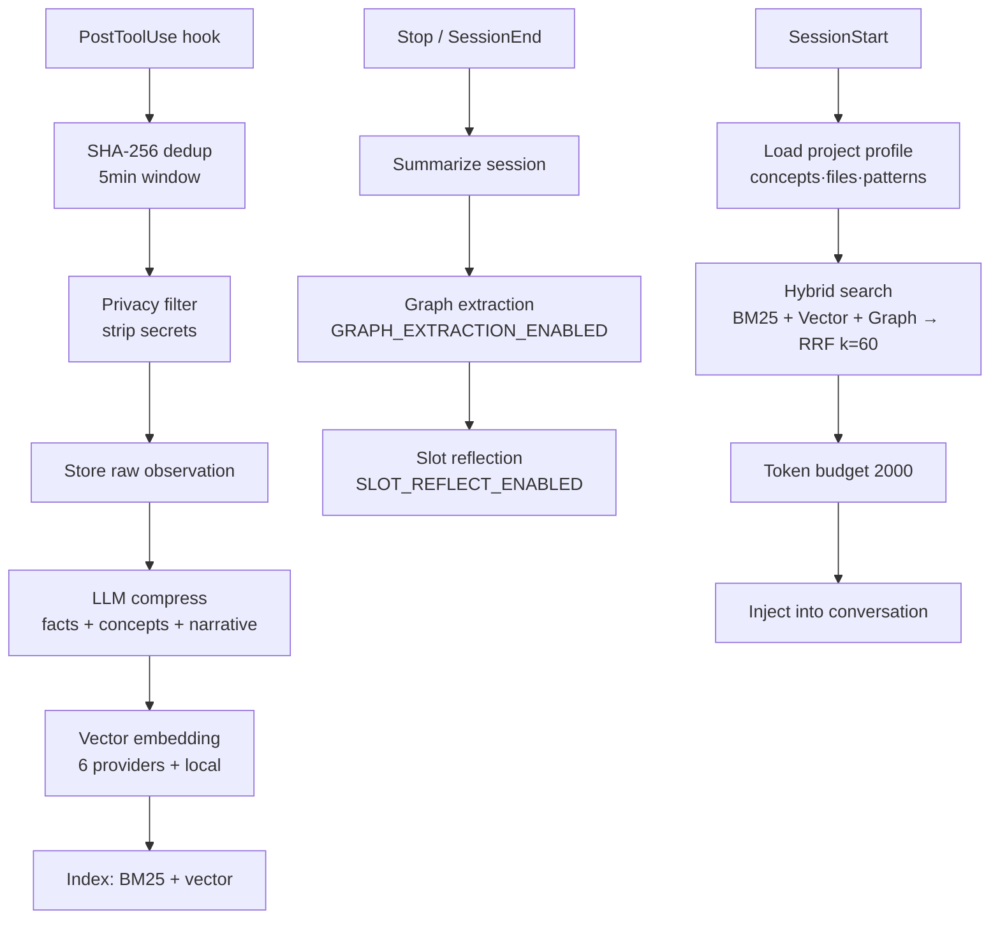

<div class="ai-knowledge-shell">

<aside class="ai-knowledge-sidebar">
  <p class="ai-eyebrow">CATEGORIES</p>
  <nav class="ai-cat-tree"><details class="ai-cat" open><summary><span class="catname">에이전트 오케스트레이션</span><span class="catcount">15</span></summary><ul><li><a href="https://altjs4510.github.io/ai_news_blog/knowledge/20260904/"><span class="kdate">2026-09-04</span><span class="ktitle">HarnessDev: Can LLMs Create and Evolve Their Own…</span></a></li><li><a href="https://altjs4510.github.io/ai_news_blog/knowledge/20260831-openexecutive-virtual-c-suite/"><span class="kdate">2026-08-31</span><span class="ktitle">Open Executive — 8명의 전문 에이전트를 하나의 임원 목소리로</span></a></li><li><a href="https://altjs4510.github.io/ai_news_blog/knowledge/20260828/"><span class="kdate">2026-08-28</span><span class="ktitle">Google ADK for Python v2.8.0 — RemoteA2aAgent 네이…</span></a></li><li><a href="https://altjs4510.github.io/ai_news_blog/knowledge/20260826/"><span class="kdate">2026-08-26</span><span class="ktitle">apache/maka — 도구 호출·권한 결정·종료 이벤트를 append-only 로그…</span></a></li><li><a href="https://altjs4510.github.io/ai_news_blog/knowledge/20260823/"><span class="kdate">2026-08-23</span><span class="ktitle">The Evolution of the Agent Harness — 하네스가 모델 가중치…</span></a></li><li><a href="https://altjs4510.github.io/ai_news_blog/knowledge/20260821/"><span class="kdate">2026-08-21</span><span class="ktitle">volcengine/OpenViking — 에이전트 메모리·Knowledge RAG·스…</span></a></li><li><a href="https://altjs4510.github.io/ai_news_blog/knowledge/20260805/"><span class="kdate">2026-08-05</span><span class="ktitle">TencentCloud/TencentDB-Agent-Memory — 대화·문서·코드를 …</span></a></li><li><a href="https://altjs4510.github.io/ai_news_blog/knowledge/20260708/"><span class="kdate">2026-07-08</span><span class="ktitle">Expanding Managed Agents in Gemini API: backgrou…</span></a></li><li><a href="https://altjs4510.github.io/ai_news_blog/knowledge/20260707/"><span class="kdate">2026-07-07</span><span class="ktitle">AI Hero Skills Catalog — 실무 엔지니어를 위한 재사용 가능한 판단 …</span></a></li><li><a href="https://altjs4510.github.io/ai_news_blog/knowledge/20260623/"><span class="kdate">2026-06-23</span><span class="ktitle">bytedance/deer-flow — 샌드박스·메모리·서브에이전트·메시지 게이트웨이를…</span></a></li><li><a href="https://altjs4510.github.io/ai_news_blog/knowledge/20260621/"><span class="kdate">2026-06-21</span><span class="ktitle">calesthio/OpenMontage — 12 파이프라인·52 도구·500+ 스킬을 …</span></a></li><li><a href="https://altjs4510.github.io/ai_news_blog/knowledge/20260611/"><span class="kdate">2026-06-11</span><span class="ktitle">The evolution of agentic surfaces: building with…</span></a></li><li><a href="https://altjs4510.github.io/ai_news_blog/knowledge/20260602/"><span class="kdate">2026-06-02</span><span class="ktitle">revfactory/harness — 도메인별 에이전트 팀과 스킬을 자동 설계하는 메타…</span></a></li><li><a href="https://altjs4510.github.io/ai_news_blog/knowledge/20260529/"><span class="kdate">2026-05-29</span><span class="ktitle">Introducing dynamic workflows in Claude Code</span></a></li><li><a href="https://altjs4510.github.io/ai_news_blog/knowledge/20260507/"><span class="kdate">2026-05-07</span><span class="ktitle">ruvnet/ruflo — Claude 멀티 에이전트 오케스트레이션 플랫폼</span></a></li></ul></details><details class="ai-cat" open><summary><span class="catname">MCP &amp; 도구 통합</span><span class="catcount">16</span></summary><ul><li><a href="https://altjs4510.github.io/ai_news_blog/knowledge/20260829/"><span class="kdate">2026-08-29</span><span class="ktitle">cursor/plugins — 플러그인 명세(specification)와 공식 플러그인…</span></a></li><li><a href="https://altjs4510.github.io/ai_news_blog/knowledge/20260802/"><span class="kdate">2026-08-02</span><span class="ktitle">Stateless MCP has recaptured my interest (and in…</span></a></li><li><a href="https://altjs4510.github.io/ai_news_blog/knowledge/20260801/"><span class="kdate">2026-08-01</span><span class="ktitle">different-ai/openwork — Claude Cowork의 오픈소스 대체 에…</span></a></li><li><a href="https://altjs4510.github.io/ai_news_blog/knowledge/20260731/"><span class="kdate">2026-07-31</span><span class="ktitle">different-ai/openwork — Claude Cowork의 오픈소스 대안(o…</span></a></li><li><a href="https://altjs4510.github.io/ai_news_blog/knowledge/20260729/"><span class="kdate">2026-07-29</span><span class="ktitle">Bringing MCP 2026-07-28 to Claude</span></a></li><li><a href="https://altjs4510.github.io/ai_news_blog/knowledge/20260721/"><span class="kdate">2026-07-21</span><span class="ktitle">tirth8205/code-review-graph — 로컬 우선 코드 인텔리전스 그래프…</span></a></li><li><a href="https://altjs4510.github.io/ai_news_blog/knowledge/20260719/"><span class="kdate">2026-07-19</span><span class="ktitle">tirth8205/code-review-graph — 로컬 우선 코드 인텔리전스 그래프…</span></a></li><li><a href="https://altjs4510.github.io/ai_news_blog/knowledge/20260709/"><span class="kdate">2026-07-09</span><span class="ktitle">mvanhorn/last30days-skill — Reddit·X·YouTube·HN·…</span></a></li><li><a href="https://altjs4510.github.io/ai_news_blog/knowledge/20260618/"><span class="kdate">2026-06-18</span><span class="ktitle">DeusData/codebase-memory-mcp — 158개 언어 코드베이스를 밀리…</span></a></li><li><a href="https://altjs4510.github.io/ai_news_blog/knowledge/20260606/"><span class="kdate">2026-06-06</span><span class="ktitle">chopratejas/headroom — Compress tool outputs, lo…</span></a></li><li><a href="https://altjs4510.github.io/ai_news_blog/knowledge/20260605/"><span class="kdate">2026-06-05</span><span class="ktitle">chopratejas/headroom — Compress tool outputs, lo…</span></a></li><li><a href="https://altjs4510.github.io/ai_news_blog/knowledge/20260604/"><span class="kdate">2026-06-04</span><span class="ktitle">chopratejas/headroom — Compress tool outputs bef…</span></a></li><li><a href="https://altjs4510.github.io/ai_news_blog/knowledge/20260603/"><span class="kdate">2026-06-03</span><span class="ktitle">How Bad MCP design cost your Agent 5× more token…</span></a></li><li><a href="https://altjs4510.github.io/ai_news_blog/knowledge/20260523/"><span class="kdate">2026-05-23</span><span class="ktitle">colbymchenry/codegraph — 사전 인덱싱된 코드 지식 그래프 MCP</span></a></li><li><a href="https://altjs4510.github.io/ai_news_blog/knowledge/20260517/"><span class="kdate">2026-05-17</span><span class="ktitle">I gave my LLM 100,000+ tools — Lazy Discovery &a…</span></a></li><li><a href="https://altjs4510.github.io/ai_news_blog/knowledge/20260509/"><span class="kdate">2026-05-09</span><span class="ktitle">How to connect 100 MCP servers without the conte…</span></a></li></ul></details><details class="ai-cat" open><summary><span class="catname">코딩 에이전트</span><span class="catcount">30</span></summary><ul><li><a href="https://altjs4510.github.io/ai_news_blog/knowledge/20260903/"><span class="kdate">2026-09-03</span><span class="ktitle">pacifio/atlas — 여러 코딩 에이전트의 변경을 한곳에서 추적·질의하는 '에이…</span></a></li><li><a href="https://altjs4510.github.io/ai_news_blog/knowledge/20260901/"><span class="kdate">2026-09-01</span><span class="ktitle">affaan-m/ECC — 스킬·본능·메모리·보안을 묶은 에이전트 하네스 성능 최적화 …</span></a></li><li><a href="https://altjs4510.github.io/ai_news_blog/knowledge/20260831-gitnexus-code-knowledge-graph/"><span class="kdate">2026-08-31</span><span class="ktitle">GitNexus — 코드베이스를 지식그래프로 바꿔 에이전트에게 쥐어주기</span></a></li><li><a href="https://altjs4510.github.io/ai_news_blog/knowledge/20260822/"><span class="kdate">2026-08-22</span><span class="ktitle">mattpocock/skills — Skills for Real Engineers (하…</span></a></li><li><a href="https://altjs4510.github.io/ai_news_blog/knowledge/20260820/"><span class="kdate">2026-08-20</span><span class="ktitle">akitaonrails/ai-memory — 코딩 에이전트 CLI의 장기 메모리와 벤더…</span></a></li><li><a href="https://altjs4510.github.io/ai_news_blog/knowledge/20260819/"><span class="kdate">2026-08-19</span><span class="ktitle">akitaonrails/ai-memory — 코딩 에이전트 CLI 간 장기 기억과 벤더…</span></a></li><li><a href="https://altjs4510.github.io/ai_news_blog/knowledge/20260811/"><span class="kdate">2026-08-11</span><span class="ktitle">PrimeIntellect-ai/prime-agent — 장기 자율 실행을 전제로 설계…</span></a></li><li><a href="https://altjs4510.github.io/ai_news_blog/knowledge/20260810/"><span class="kdate">2026-08-10</span><span class="ktitle">Auto mode is now the default in Claude Code for …</span></a></li><li><a href="https://altjs4510.github.io/ai_news_blog/knowledge/20260809/"><span class="kdate">2026-08-09</span><span class="ktitle">PrimeIntellect-ai/prime-agent — 코딩 워크플로우·장기 자율 작…</span></a></li><li><a href="https://altjs4510.github.io/ai_news_blog/knowledge/20260808/"><span class="kdate">2026-08-08</span><span class="ktitle">PrimeIntellect-ai/prime-agent — 코딩 워크플로우와 장시간 자율…</span></a></li><li><a href="https://altjs4510.github.io/ai_news_blog/knowledge/20260804/"><span class="kdate">2026-08-04</span><span class="ktitle">esengine/DeepSeek-Reasonix — prefix-cache 안정성을 축…</span></a></li><li><a href="https://altjs4510.github.io/ai_news_blog/knowledge/20260728/"><span class="kdate">2026-07-28</span><span class="ktitle">alibaba/open-code-review — 결정론적 파이프라인 + LLM 에이전트…</span></a></li><li><a href="https://altjs4510.github.io/ai_news_blog/knowledge/20260725/"><span class="kdate">2026-07-25</span><span class="ktitle">The new rules of context engineering for Claude …</span></a></li><li><a href="https://altjs4510.github.io/ai_news_blog/knowledge/20260722/"><span class="kdate">2026-07-22</span><span class="ktitle">tirth8205/code-review-graph — MCP·CLI용 로컬 우선 코드 …</span></a></li><li><a href="https://altjs4510.github.io/ai_news_blog/knowledge/20260718/"><span class="kdate">2026-07-18</span><span class="ktitle">tirth8205/code-review-graph — MCP·CLI용 로컬 코드 인텔리…</span></a></li><li><a href="https://altjs4510.github.io/ai_news_blog/knowledge/20260715/"><span class="kdate">2026-07-15</span><span class="ktitle">Dicklesworthstone/destructive_command_guard — 에이…</span></a></li><li><a href="https://altjs4510.github.io/ai_news_blog/knowledge/20260714/"><span class="kdate">2026-07-14</span><span class="ktitle">Graphify-Labs/graphify — 코드베이스를 질의 가능한 지식 그래프로 만…</span></a></li><li><a href="https://altjs4510.github.io/ai_news_blog/knowledge/20260705/"><span class="kdate">2026-07-05</span><span class="ktitle">openai/codex-plugin-cc — Claude Code에서 Codex를 위임…</span></a></li><li><a href="https://altjs4510.github.io/ai_news_blog/knowledge/20260626/"><span class="kdate">2026-06-26</span><span class="ktitle">google-labs-code/design.md — 코딩 에이전트에게 디자인 시스템을 …</span></a></li><li><a href="https://altjs4510.github.io/ai_news_blog/knowledge/20260619/"><span class="kdate">2026-06-19</span><span class="ktitle">Claude Code now supports artifacts</span></a></li><li><a href="https://altjs4510.github.io/ai_news_blog/knowledge/20260530/"><span class="kdate">2026-05-30</span><span class="ktitle">Leonxlnx/taste-skill — AI에게 좋은 취향을 부여해 generic s…</span></a></li><li><a href="https://altjs4510.github.io/ai_news_blog/knowledge/20260528/"><span class="kdate">2026-05-28</span><span class="ktitle">Building self-improving tax agents with Codex</span></a></li><li><a href="https://altjs4510.github.io/ai_news_blog/knowledge/20260526/"><span class="kdate">2026-05-26</span><span class="ktitle">colbymchenry/codegraph — Pre-indexed code knowle…</span></a></li><li><a href="https://altjs4510.github.io/ai_news_blog/knowledge/20260524/"><span class="kdate">2026-05-24</span><span class="ktitle">colbymchenry/codegraph — Pre-indexed code knowle…</span></a></li><li><a href="https://altjs4510.github.io/ai_news_blog/knowledge/20260521/"><span class="kdate">2026-05-21</span><span class="ktitle">colbymchenry/codegraph — Pre-indexed code knowle…</span></a></li><li><a href="https://altjs4510.github.io/ai_news_blog/knowledge/20260512/" class="current"><span class="kdate">2026-05-12</span><span class="ktitle">agentmemory — Persistent memory for AI coding ag…</span></a></li><li><a href="https://altjs4510.github.io/ai_news_blog/knowledge/20260510/"><span class="kdate">2026-05-10</span><span class="ktitle">addyosmani/agent-skills — Production-grade engin…</span></a></li><li><a href="https://altjs4510.github.io/ai_news_blog/knowledge/20260508/"><span class="kdate">2026-05-08</span><span class="ktitle">addyosmani/agent-skills — Production-grade engin…</span></a></li><li><a href="https://altjs4510.github.io/ai_news_blog/knowledge/20260506/"><span class="kdate">2026-05-06</span><span class="ktitle">mksglu/context-mode — AI 코딩 에이전트용 컨텍스트 윈도우 최적화</span></a></li><li><a href="https://altjs4510.github.io/ai_news_blog/knowledge/20260505/"><span class="kdate">2026-05-05</span><span class="ktitle">mattpocock/skills — Skills for Real Engineers (.…</span></a></li></ul></details><details class="ai-cat" open><summary><span class="catname">모델 &amp; 연구</span><span class="catcount">5</span></summary><ul><li><a href="https://altjs4510.github.io/ai_news_blog/knowledge/20260716-proprag/"><span class="kdate">2026-07-16</span><span class="ktitle">PropRAG — 프로포지션 경로 위 beam search로 멀티홉 검색 안내</span></a></li><li><a href="https://altjs4510.github.io/ai_news_blog/knowledge/20260620/"><span class="kdate">2026-06-20</span><span class="ktitle">zai-org/GLM-5 — From Vibe Coding to Agentic Engi…</span></a></li><li><a href="https://altjs4510.github.io/ai_news_blog/knowledge/20260617/"><span class="kdate">2026-06-17</span><span class="ktitle">Predicting model behavior before release by simu…</span></a></li><li><a href="https://altjs4510.github.io/ai_news_blog/knowledge/20260516/"><span class="kdate">2026-05-16</span><span class="ktitle">STALE — 에이전트가 자기 기억의 유효성을 인지할 수 있는가</span></a></li><li><a href="https://altjs4510.github.io/ai_news_blog/knowledge/20260513/"><span class="kdate">2026-05-13</span><span class="ktitle">Thinking Machines' Native Interaction Models — T…</span></a></li></ul></details><details class="ai-cat" open><summary><span class="catname">인프라 &amp; 컴퓨트</span><span class="catcount">7</span></summary><ul><li><a href="https://altjs4510.github.io/ai_news_blog/knowledge/20260813/"><span class="kdate">2026-08-13</span><span class="ktitle">semantica-agi/semantica — 컨텍스트와 책임 추적을 위한 그래프 네이…</span></a></li><li><a href="https://altjs4510.github.io/ai_news_blog/knowledge/20260812/"><span class="kdate">2026-08-12</span><span class="ktitle">semantica-agi/semantica — 컨텍스트와 '책임 추적 가능한(accou…</span></a></li><li><a href="https://altjs4510.github.io/ai_news_blog/knowledge/20260806/"><span class="kdate">2026-08-06</span><span class="ktitle">cloudflare/computer — 에이전트에게 컴퓨터를 통째로 주는 엣지 실행 샌…</span></a></li><li><a href="https://altjs4510.github.io/ai_news_blog/knowledge/20260724/"><span class="kdate">2026-07-24</span><span class="ktitle">diegosouzapw/OmniRoute — 단일 엔드포인트로 278+ 프로바이더·50…</span></a></li><li><a href="https://altjs4510.github.io/ai_news_blog/knowledge/20260723/"><span class="kdate">2026-07-23</span><span class="ktitle">diegosouzapw/OmniRoute — 268+ 프로바이더를 단일 엔드포인트로 묶…</span></a></li><li><a href="https://altjs4510.github.io/ai_news_blog/knowledge/20260522/"><span class="kdate">2026-05-22</span><span class="ktitle">Giving Agents Computers — Ivan Burazin, Daytona</span></a></li><li><a href="https://altjs4510.github.io/ai_news_blog/knowledge/20260520/"><span class="kdate">2026-05-20</span><span class="ktitle">New in Claude Managed Agents: self-hosted sandbo…</span></a></li></ul></details><details class="ai-cat" open><summary><span class="catname">보안 &amp; 거버넌스</span><span class="catcount">17</span></summary><ul><li><a href="https://altjs4510.github.io/ai_news_blog/knowledge/20260902/"><span class="kdate">2026-09-02</span><span class="ktitle">AIR raises $50M to help companies vet the skills…</span></a></li><li><a href="https://altjs4510.github.io/ai_news_blog/knowledge/20260827/"><span class="kdate">2026-08-27</span><span class="ktitle">Claude in Chrome is generally available</span></a></li><li><a href="https://altjs4510.github.io/ai_news_blog/knowledge/20260819-mind-viruses/"><span class="kdate">2026-08-19</span><span class="ktitle">탈옥도, 인젝션도 없이 — 대화로만 퍼지는 에이전트의 '마인드 바이러스'</span></a></li><li><a href="https://altjs4510.github.io/ai_news_blog/knowledge/20260730/"><span class="kdate">2026-07-30</span><span class="ktitle">Anatomy of a Frontier Lab Agent Intrusion: A Tec…</span></a></li><li><a href="https://altjs4510.github.io/ai_news_blog/knowledge/20260716/"><span class="kdate">2026-07-16</span><span class="ktitle">Dicklesworthstone/destructive_command_guard — 에이…</span></a></li><li><a href="https://altjs4510.github.io/ai_news_blog/knowledge/20260710/"><span class="kdate">2026-07-10</span><span class="ktitle">70개 MCP 서버 strace 런타임 감사 — 부팅 시 아웃바운드 호출 서버 적발</span></a></li><li><a href="https://altjs4510.github.io/ai_news_blog/knowledge/20260704/"><span class="kdate">2026-07-04</span><span class="ktitle">Cloudflare is about to block AI agents by defaul…</span></a></li><li><a href="https://altjs4510.github.io/ai_news_blog/knowledge/20260703/"><span class="kdate">2026-07-03</span><span class="ktitle">Giving admins more visibility and control over C…</span></a></li><li><a href="https://altjs4510.github.io/ai_news_blog/knowledge/20260630/"><span class="kdate">2026-06-30</span><span class="ktitle">Introducing the Claude apps gateway for Amazon B…</span></a></li><li><a href="https://altjs4510.github.io/ai_news_blog/knowledge/20260625/"><span class="kdate">2026-06-25</span><span class="ktitle">Agent identity in Claude Tag: a new access model…</span></a></li><li><a href="https://altjs4510.github.io/ai_news_blog/knowledge/20260624/"><span class="kdate">2026-06-24</span><span class="ktitle">Agent identity in Claude Tag: a new access model…</span></a></li><li><a href="https://altjs4510.github.io/ai_news_blog/knowledge/20260614/"><span class="kdate">2026-06-14</span><span class="ktitle">NVIDIA/SkillSpector — Security scanner for AI ag…</span></a></li><li><a href="https://altjs4510.github.io/ai_news_blog/knowledge/20260613/"><span class="kdate">2026-06-13</span><span class="ktitle">Fable 5's guardrails got bypassed in 48 hours — …</span></a></li><li><a href="https://altjs4510.github.io/ai_news_blog/knowledge/20260612/"><span class="kdate">2026-06-12</span><span class="ktitle">NVIDIA/SkillSpector — AI 에이전트 스킬용 보안 스캐너</span></a></li><li><a href="https://altjs4510.github.io/ai_news_blog/knowledge/20260607/"><span class="kdate">2026-06-07</span><span class="ktitle">OpenAI Help: Lockdown Mode</span></a></li><li><a href="https://altjs4510.github.io/ai_news_blog/knowledge/20260531/"><span class="kdate">2026-05-31</span><span class="ktitle">How we contain Claude across products</span></a></li><li><a href="https://altjs4510.github.io/ai_news_blog/knowledge/20260527/"><span class="kdate">2026-05-27</span><span class="ktitle">Microsoft Copilot Cowork Exfiltrates Files</span></a></li></ul></details><details class="ai-cat" open><summary><span class="catname">응용 사례</span><span class="catcount">7</span></summary><ul><li><a href="https://altjs4510.github.io/ai_news_blog/knowledge/20260814/"><span class="kdate">2026-08-14</span><span class="ktitle">cathrynlavery/diagram-design — Claude Code용 에디토리…</span></a></li><li><a href="https://altjs4510.github.io/ai_news_blog/knowledge/20260726/"><span class="kdate">2026-07-26</span><span class="ktitle">citrolabs/ego-lite — 로그인된 브라우저 상태를 AI 에이전트와 공유하는…</span></a></li><li><a href="https://altjs4510.github.io/ai_news_blog/knowledge/20260717/"><span class="kdate">2026-07-17</span><span class="ktitle">After a year building agent memory, 'save everyt…</span></a></li><li><a href="https://altjs4510.github.io/ai_news_blog/knowledge/20260712/"><span class="kdate">2026-07-12</span><span class="ktitle">Do Automated Evals Work?</span></a></li><li><a href="https://altjs4510.github.io/ai_news_blog/knowledge/20260609/"><span class="kdate">2026-06-09</span><span class="ktitle">Building intelligent apps for Apple platforms wi…</span></a></li><li><a href="https://altjs4510.github.io/ai_news_blog/knowledge/20260515/"><span class="kdate">2026-05-15</span><span class="ktitle">Clawdmeter — Claude Code 사용량을 데스크톱 대시보드로</span></a></li><li><a href="https://altjs4510.github.io/ai_news_blog/knowledge/20260514/"><span class="kdate">2026-05-14</span><span class="ktitle">Introducing Claude for Small Business</span></a></li></ul></details><details class="ai-cat" open><summary><span class="catname">산업 동향</span><span class="catcount">8</span></summary><ul><li><a href="https://altjs4510.github.io/ai_news_blog/knowledge/20260830/"><span class="kdate">2026-08-30</span><span class="ktitle">[AINews] OpenAI shuts off Cursor — 프론티어 모델 공급 차단…</span></a></li><li><a href="https://altjs4510.github.io/ai_news_blog/knowledge/20260711/"><span class="kdate">2026-07-11</span><span class="ktitle">OpenAI says GPT 5.6 is the 'preferred model' for…</span></a></li><li><a href="https://altjs4510.github.io/ai_news_blog/knowledge/20260702/"><span class="kdate">2026-07-02</span><span class="ktitle">How Cursor deploys AI inside the enterprise (For…</span></a></li><li><a href="https://altjs4510.github.io/ai_news_blog/knowledge/20260701/"><span class="kdate">2026-07-01</span><span class="ktitle">Google OKF (Open Knowledge Format) — 벤더 중립 에이전트 …</span></a></li><li><a href="https://altjs4510.github.io/ai_news_blog/knowledge/20260616/"><span class="kdate">2026-06-16</span><span class="ktitle">Why AI hasn't replaced software engineers, and w…</span></a></li><li><a href="https://altjs4510.github.io/ai_news_blog/knowledge/20260610/"><span class="kdate">2026-06-10</span><span class="ktitle">Fable 5 just made cost-aware model routing manda…</span></a></li><li><a href="https://altjs4510.github.io/ai_news_blog/knowledge/20260519/"><span class="kdate">2026-05-19</span><span class="ktitle">Anthropic acquires Stainless</span></a></li><li><a href="https://altjs4510.github.io/ai_news_blog/knowledge/20260504/"><span class="kdate">2026-05-04</span><span class="ktitle">Agents for Everything Else: Codex for Knowledge …</span></a></li></ul></details></nav>
</aside>

<article class="ai-knowledge-article">

<header class="ai-post-hero">
  <p class="ai-eyebrow"><a class="ai-back" href="../">KNOWLEDGE</a> · 2026-05-12 · 오늘의 학습</p>
  <h2 class="ai-post-title">agentmemory — Persistent memory for AI coding agents</h2>
</header>

> 원문: [agentmemory — Persistent memory for AI coding agents](https://github.com/rohitg00/agentmemory)

## 📌 학습 정리

### 1. 한 줄 정의
**agentmemory**는 코딩 에이전트의 세션을 가로질러 관찰값을 자동 포착·압축·검색하는 **MCP/REST 기반 퍼시스턴트 메모리 서버**로, **iii engine** 위에서 BM25+Vector+Graph 하이브리드 검색과 4-tier 메모리 통합을 제공한다.

### 2. 왜 지금 중요한가
- **CLAUDE.md / .cursorrules의 200-line cap**과 stale 문제를 정면으로 다루며, "sticky note" 수준의 내장 메모리를 **searchable DB**로 대체하는 흐름의 대표 구현이다.
- **LongMemEval-S (ICLR 2025, 500 questions)** 기준 R@5 95.2% / MRR 88.2%로 **mem0(68.5%)·Letta(83.2%)** 대비 우위를 실측 공개 — 메모리 레이어가 벤치 가능한 분리된 컴포넌트로 굳어지고 있다는 신호.
- **PostToolUse → dedup → privacy filter → LLM compress → embedding → BM25/vector index** 파이프라인이 hook 기반으로 표준화되어, 에이전트 loop 안에 메모리 캡처를 끼워 넣는 패턴이 명확해졌다.
- **MCP + REST + leases + signals**로 멀티 에이전트 조정(action, routine, sentinel, mesh-sync)을 한 서버에서 다루며, 단발성 tool use → **장기 협업 상태**로 축을 옮긴다.
- **iii engine** 단일 런타임이 HTTP·KV·Stream·OTEL·pubsub·queue·cron을 모두 primitive로 노출 → Postgres/Redis/Express/pm2/Prometheus 없이 **하나의 워커 그래프**로 메모리 시스템을 구성하는 구조적 베팅을 보여줌.

### 3. 핵심 개념
| 용어 | 정의 | 비고/관련 키워드 |
|---|---|---|
| **iii engine** | agentmemory가 올라타는 단일 런타임. HTTP Trigger·KV State·Stream·OTEL이 primitive | v0.11.2 핀, `iii worker add` 확장 |
| **12 hooks** | SessionStart·UserPromptSubmit·PreToolUse·PostToolUse·PostToolUseFailure·PreCompact·SubagentStart/Stop·Stop·SessionEnd 등 | Claude Code 통합의 자동 캡처 축 |
| **4-tier consolidation** | Working → Episodic → Semantic → Procedural | Ebbinghaus decay·contradiction 해소·auto-evict |
| **Hybrid Search (RRF)** | BM25 + Vector(cosine) + Graph(BFS) 3-stream을 **Reciprocal Rank Fusion (k=60)** 으로 융합 | session-diversified (max 3/session) |
| **Memory Slots** | persona·user_preferences·tool_guidelines·project_context·guidance·pending_items·session_patterns·self_notes (size-limited, agent가 `memory_slot_*`로 편집) | `AGENTMEMORY_SLOTS=false` 기본 |
| **Action / Routine / Lease / Signal / Sentinel** | 멀티 에이전트 작업 그래프 — `memory_frontier`, `memory_next`, `memory_lease`(exclusive), `memory_signal_send/read`, `memory_sentinel_create` | sketch → promote → crystallize |
| **Claude bridge** | MEMORY.md와 **양방향 sync** | `memory_claude_bridge_sync` |
| **Session Replay** | prompts/tool calls/tool results/responses를 discrete event로 scrub (0.5×–4×) | `mem::replay::*`, `import-jsonl` |
| **Privacy filter** | API key·secret·`<private>` 태그를 저장 전 제거 | SHA-256 dedup 5min window 선행 |
| **Token efficiency** | ~1,900 tokens/session, ~170K tokens/yr | Built-in 22K+@240 obs 대비 92% 절감 |
| **iii console (port 3114)** | Workers·Functions·Triggers·States·Streams·Queues·Traces·Logs·Config — agentmemory의 OTEL waterfall | viewer(3113)와 다른 "engine-shaped" 창 |

### 4. 작동 원리 / 구조


핵심은 **캡처는 PostToolUse, 압축·그래프 추출은 SessionEnd, 회수는 SessionStart**로 hook이 분리되어 있고, 회수 경로가 hybrid search → RRF → token budget(`TOKEN_BUDGET=2000`) 컷오프 → 컨텍스트 주입으로 결정론적이라는 점이다. 검색 가중치는 `BM25_WEIGHT=0.4`·`VECTOR_WEIGHT=0.6` 디폴트, 임베딩은 **all-MiniLM-L6-v2** 로컬을 권장(+8pp recall over BM25-only).

### 5. 실제 사용법 / 예시

서버 기동 + 데모:
```
npx @agentmemory/agentmemory
npx @agentmemory/agentmemory demo
```

MCP 표준 블록 (Cursor·Claude Desktop·Cline·Roo Code·Windsurf·Gemini CLI·OpenClaw 공통, 기존 `mcpServers`에 **merge**):
```json
"agentmemory": {
  "command": "npx",
  "args": ["-y", "@agentmemory/mcp"],
  "env": {
    "AGENTMEMORY_URL": "http://localhost:3111"
  }
}
```

Hermes (`~/.hermes/config.yaml`):
```yaml
mcp_servers:
  agentmemory:
    command: npx
    args: ["-y", "@agentmemory/mcp"]

memory:
  provider: agentmemory
```

REST 직접 호출(Aider 등):
```
curl -X POST http://localhost:3111/agentmemory/smart-search -d '{"query": "auth"}'
```

Health & viewer:
```
curl http://localhost:3111/agentmemory/health
open http://localhost:3113
```

Sandboxed MCP client (Flatpak/Snap)는 env에 `"AGENTMEMORY_FORCE_PROXY": "1"` 추가하고 `AGENTMEMORY_URL`을 LAN IP로.

JSONL 임포트:
```
npx @agentmemory/agentmemory import-jsonl
npx @agentmemory/agentmemory import-jsonl ~/.claude/projects/-my-project/abc123.jsonl
```

엔진 확장:
```
iii worker add iii-pubsub
iii worker add iii-cron
iii worker add iii-queue
iii worker add iii-observability
iii worker add iii-sandbox
iii console --port 3114
```

핵심 설정(`~/.agentmemory/.env`)에서 주의할 플래그:
- `AGENTMEMORY_AUTO_COMPRESS=false` (기본 OFF, #138 — 켜면 매 PostToolUse마다 LLM 압축 호출)
- `AGENTMEMORY_ALLOW_AGENT_SDK=true` (Claude subscription fallback, **Stop-hook 무한 recursion 위험** #149 follow-up으로 기본 비활성)
- `AGENTMEMORY_SLOTS=false` (편집 가능한 pinned slot 8종)

### 6. 사용자 프로젝트 접목

- **DCSAI · MCP host + agent loop**: 자체 구현한 **MCP host server**에 `@agentmemory/mcp`를 또 하나의 stdio MCP server로 등록(또는 REST `http://localhost:3111/agentmemory/smart-search` 직호출 어댑터)하고, Anthropic SDK 직통합 loop의 **PostToolUse 지점**에 `memory_save` / `memory_smart_search`를 페어로 끼워 tool 호출 결과를 자동 회수. 회수 컷오프는 `TOKEN_BUDGET=2000`·`BM25_WEIGHT/VECTOR_WEIGHT`로 streaming 응답 latency budget과 맞춰 튜닝.
- **DCSAI · HITL 분기**: `memory_governance_delete`·`memory_audit`·`memory_snapshot_create`의 **audit trail 패턴**을 HITL 승인 이력 저장 포맷으로 채택하고, `memory_lease`(exclusive action lease)를 동일 사용자/세션의 **중복 승인 경합** 방지 락으로 활용. **PreCompact hook**이 "compaction 직전 메모리 재주입"을 한다는 점은 chunked streaming 중간에 컨텍스트가 잘릴 때의 fallback 설계와 정확히 같은 결.
- **DCSAI · ff-claude-manager (Tauri 2) / dcs-ai-plugin**: Tauri 매니저에서 **viewer(:3113)**·**iii console(:3114)** 을 임베디드 패널로 띄워 로컬 메모리/트레이스를 관찰. dcs-ai-plugin(Claude Code)은 `/plugin marketplace add rohitg00/agentmemory` + `/plugin install agentmemory` 패턴을 그대로 차용해 **12 hooks + 4 skills + 51 MCP tools** 묶음을 사내 배포 단위로 캡슐화.
- **Team Agent · discovery-core-agent의 Activity Log → Observer (L1~L4)**: L1 raw activity → L2 episodic → L3 semantic → L4 procedural을 agentmemory의 **4-tier consolidation** (Working/Episodic/Semantic/Procedural)에 1:1 매핑. Observer feedback loop의 "패턴 검출"은 `memory_patterns`·`memory_consolidate`·`memory_frontier`로 위임 가능.
- **Team Agent · Quest 3계층(전체·파티·플레이어)**: **Team memory namespacing** ("Namespaced shared + private across team members")과 `memory_team_share`/`memory_team_feed`를 그대로 사용해 — 플레이어=private, 파티=team-shared namespace, 전체=mesh-synced (`iii worker add iii-pubsub` + `memory_mesh_sync`)로 3단을 구현. Quest 단위 컨텍스트 회수는 `memory_profile` + `agentmemory://project/{name}/profile` 리소스로 표준화.
- **Team Agent · platform-core-agent ↔ discovery-core-agent**: 두 계층 간 핸드오프를 `session_handoff` 프롬프트 + `memory_signal_send/read` (receipts 포함)로 처리하고, 크로스 브랜드 워크플로는 `memory_routine_run`(routine instantiate) + `memory_sentinel_create`(event-driven watcher)로 선언. **brand.yaml** 주입 메타데이터는 `memory_facet_tag`(dimension:value)로 색인해 `memory_facet_query`로 브랜드 필터링.
- **Team Agent · dcsai KG MCP 직연결과의 분업**: KG MCP는 도메인 지식 그래프, agentmemory는 **세션·운영 메모리** — 양자를 합칠 때 agentmemory의 `memory_graph_query`(엔티티 BFS)·`memory_verify`(citation provenance)를 KG MCP 응답의 trace-back 메커니즘으로 활용해 **L1 Activity Log의 출처 추적**을 강화.
- **Team Agent · Next.js 15 App Router + FSD + server-only**: 클라이언트가 메모리 서버에 직접 닿지 않도록 REST 호출을 **server-only 어댑터** (예: `entities/memory/api/smart-search.ts`)에 격리하고, `AGENTMEMORY_SECRET` bearer-token 규칙(viewer/REST 공통)을 NestJS 게이트웨이 또는 RSC fetch 래퍼에서 강제.

### 7. 더 파고들 거리
- [benchmark/LONGMEMEVAL.md](https://github.com/rohitg00/agentmemory) — LongMemEval-S (ICLR 2025) 실측 리포트
- [benchmark/COMPARISON.md](https://github.com/rohitg00/agentmemory) — mem0 / Letta / Khoj / claude-mem / Hippo 비교
- [benchmark/QUALITY.md](https://github.com/rohitg00/agentmemory), [benchmark/SCALE.md](https://github.com/rohitg00/agentmemory)
- [agent-memory.dev](https://agent-memory.dev) — v0.9.0 랜딩, `@agentmemory/fs-watcher` 필터시스템 커넥터
- [workers.iii.dev](https://workers.iii.dev) — `iii worker add` 레지스트리 (pubsub·cron·queue·observability·sandbox·database·mcp)
- [iii.dev/docs](https://iii.dev/docs) — iii engine 공식 문서 (v0.11.2 핀, sandbox 모델 v0.11.6 refactor 대기)

---

## 📖 원문 전체 번역 (정독용)

> 의역 최소화한 전체 번역입니다. 큰 흐름은 위 정리에서 잡고, 정확한 워딩이 필요할 땐 이 섹션에서 정독하세요.

# agentmemory — AI 코딩 에이전트를 위한 영속 메모리

당신의 코딩 에이전트가 모든 것을 기억합니다. 더 이상 반복 설명은 없습니다.
iii 엔진 기반으로 제작되었습니다.
Claude Code, Cursor, Gemini CLI, Codex CLI, pi, OpenCode, 그리고 모든 MCP 클라이언트를 위한 영속 메모리.

이 프로젝트는 Karpathy의 LLM Wiki 패턴을 신뢰도 점수(confidence scoring), 생명주기(lifecycle), 지식 그래프(knowledge graphs), 하이브리드 검색(hybrid search)으로 확장합니다. agentmemory는 그 구현체입니다.

[빠른 시작] · [벤치마크] · [경쟁 제품 비교] · [에이전트] · [작동 원리] · [MCP] · [뷰어] · [iii 콘솔] · [iii 기반] · [설정] · [API]

agentmemory는 hooks, MCP, REST API를 지원하는 모든 에이전트와 함께 작동합니다. 모든 에이전트는 동일한 메모리 서버를 공유합니다.

| 에이전트 | 연동 방식 |
|---|---|
| Claude Code | 12 hooks + MCP + skills |
| OpenClaw | MCP + 플러그인 |
| Hermes | MCP + 플러그인 |
| Cursor | MCP 서버 |
| Gemini CLI | MCP 서버 |
| OpenCode | MCP 서버 |
| Codex CLI | MCP 서버 |
| Cline | MCP 서버 |
| Goose | MCP 서버 |
| Kilo Code | MCP 서버 |
| Aider | REST API |
| Claude Desktop | MCP 서버 |
| Windsurf | MCP 서버 |
| Roo Code | MCP 서버 |
| Claude SDK | AgentSDKProvider |
| 기타 모든 에이전트 | REST API |

MCP 또는 HTTP를 지원하는 **모든** 에이전트와 작동합니다. 서버 하나로 모든 에이전트의 메모리를 공유합니다.

---

매 세션마다 동일한 아키텍처를 설명합니다. 동일한 버그를 반복해서 발견합니다. 동일한 선호 사항을 반복해서 가르칩니다. 내장 메모리(CLAUDE.md, .cursorrules)는 200줄에서 한계에 달하고 금세 낡아버립니다. agentmemory가 이를 해결합니다. 에이전트가 하는 작업을 조용히 캡처하고, 검색 가능한 메모리로 압축하며, 다음 세션이 시작될 때 적절한 컨텍스트를 주입합니다. 명령어 하나로. 모든 에이전트에서 작동합니다.

**달라지는 점:**

세션 1에서 JWT 인증을 설정했습니다. 세션 2에서 속도 제한(rate limiting)을 요청합니다. 에이전트는 이미 인증에 `src/middleware/auth.ts`의 jose 미들웨어가 사용된다는 것, 테스트가 토큰 검증을 커버한다는 것, 그리고 Edge 호환성을 위해 jsonwebtoken 대신 jose를 선택했다는 것을 알고 있습니다. 재설명 없음. 복사 붙여넣기 없음. 에이전트가 그냥 **알고** 있습니다.

```
npx @agentmemory/agentmemory
```

---

## v0.9.0 새로운 기능

`agent-memory.dev`에 랜딩 사이트 추가, 파일시스템 커넥터(`@agentmemory/fs-watcher`), 독립형 MCP가 이제 실행 중인 서버에 프록시되어 hooks과 뷰어가 일치함, 모든 삭제 경로에 감사 정책 코드화, 작은 Node 프로세스에서 `memory_critical`로 잘못 표시되는 health 문제 수정. 전체 내용은 `CHANGELOG.md` 참조.

---

## 검색 정확도

**LongMemEval-S** (ICLR 2025, 500개 질문)

| 시스템 | R@5 | R@10 | MRR |
|---|---|---|---|
| agentmemory | 95.2% | 98.6% | 88.2% |
| BM25 전용 폴백 | 86.2% | 94.6% | 71.5% |

---

## 토큰 절감

| 방식 | 연간 토큰 수 | 연간 비용 |
|---|---|---|
| 전체 컨텍스트 붙여넣기 | 19.5M+ | 불가능 (컨텍스트 창 초과) |
| LLM 요약 | ~650K | ~$500 |
| agentmemory | ~170K | ~$10 |
| agentmemory + 로컬 임베딩 | ~170K | $0 |

임베딩 모델: `all-MiniLM-L6-v2` (로컬, 무료, API 키 불필요). 전체 보고서: `benchmark/LONGMEMEVAL.md`, `benchmark/QUALITY.md`, `benchmark/SCALE.md`. 경쟁 제품 비교: `benchmark/COMPARISON.md` — agentmemory vs mem0, Letta, Khoj, claude-mem, Hippo.

---

## 경쟁 제품 비교

| | agentmemory | mem0 (53K ⭐) | Letta / MemGPT (22K ⭐) | 내장 (CLAUDE.md) |
|---|---|---|---|---|
| **유형** | 메모리 엔진 + MCP 서버 | 메모리 레이어 API | 완전한 에이전트 런타임 | 정적 파일 |
| **검색 R@5** | 95.2% | 68.5% (LoCoMo) | 83.2% (LoCoMo) | 해당 없음 (grep) |
| **자동 캡처** | 12 hooks (수동 작업 없음) | 수동 `add()` 호출 | 에이전트 자체 편집 | 수동 편집 |
| **검색** | BM25 + 벡터 + 그래프 (RRF 융합) | 벡터 + 그래프 | 벡터 (아카이브) | 모든 내용을 컨텍스트에 로드 |
| **멀티 에이전트** | MCP + REST + 리스 + 시그널 | API (조율 없음) | Letta 런타임 내에서만 | 에이전트별 파일 |
| **프레임워크 종속성** | 없음 (모든 MCP 클라이언트) | 없음 | 높음 (Letta 필수) | 에이전트별 형식 |
| **외부 의존성** | 없음 (SQLite + iii-engine) | Qdrant / pgvector | Postgres + 벡터 DB | 없음 |
| **메모리 생명주기** | 4단계 통합 + 감쇠 + 자동 삭제 | 수동 추출 | 에이전트 관리 | 수동 정리 |
| **토큰 효율성** | 세션당 ~1,900 토큰 ($10/yr) | 통합 방식에 따라 다름 | 컨텍스트에 핵심 메모리 포함 | 240개 관찰 시 22K+ 토큰 |
| **실시간 뷰어** | 있음 (포트 3113) | 클라우드 대시보드 | 클라우드 대시보드 | 없음 |
| **셀프 호스팅** | 예 (기본값) | 선택적 | 선택적 | 예 |

호환성: 이번 릴리스는 안정 버전 `iii-sdk ^0.11.0` 및 iii-engine v0.11.x를 대상으로 합니다.

---

## 30초 만에 체험하기

```bash
# 터미널 1: 서버 시작
npx @agentmemory/agentmemory

# 터미널 2: 샘플 데이터를 시드하고 실제 회상 확인
npx @agentmemory/agentmemory demo
```

`demo`는 3개의 실제 세션(JWT 인증, N+1 쿼리 수정, 속도 제한)을 시드하고 해당 세션에 대해 시맨틱 검색을 실행합니다. "database performance optimization"으로 검색할 때 "N+1 query fix"를 찾는 것을 볼 수 있습니다 — 키워드 매칭으로는 불가능한 일입니다.

`http://localhost:3113`을 열어 메모리가 실시간으로 구축되는 것을 확인하세요.

---

## 세션 재생(Session Replay)

agentmemory가 기록하는 모든 세션은 재생이 가능합니다. 뷰어를 열고 **Replay** 탭을 선택한 뒤 타임라인을 스크럽하세요: 프롬프트, 도구 호출, 도구 결과, 응답이 재생/일시정지, 속도 제어(0.5×–4×), 키보드 단축키(스페이스로 토글, 화살표로 스텝)와 함께 개별 이벤트로 렌더링됩니다.

이미 가지고 있는 기존 Claude Code JSONL 트랜스크립트를 가져오고 싶으신가요?

```bash
# 기본 ~/.claude/projects 하위의 모든 파일 가져오기
npx @agentmemory/agentmemory import-jsonl

# 또는 단일 파일 가져오기
npx @agentmemory/agentmemory import-jsonl ~/.claude/projects/-my-project/abc123.jsonl
```

가져온 세션은 기본 세션과 함께 Replay 선택기에 나타납니다. 내부적으로 각 항목은 `mem::replay::load`, `mem::replay::sessions`, `mem::replay::import-jsonl` iii 함수를 통해 라우팅됩니다 — 별도의 사이드채널 서버는 없습니다.

---

## 업그레이드 / 유지보수

로컬 런타임을 의도적으로 업데이트하려면 maintenance 명령어를 사용하세요:

```bash
npx @agentmemory/agentmemory upgrade
```

> **경고:** 이 명령어는 현재 워크스페이스/런타임을 변경합니다. JavaScript 의존성을 업데이트하고, `cargo install iii-engine --force`를 실행하며, Docker 이미지를 pull할 수 있습니다.

구현 세부 사항은 `src/cli.ts`의 `runUpgrade` 함수(`src/cli.ts:544-595` 영역)에 있습니다.

---

## 에이전트별 설치 안내

### Claude Code (한 블록, 그대로 붙여넣기)

```
agentmemory를 설치하세요: 별도의 터미널에서 `npx @agentmemory/agentmemory`를 실행하여 메모리 서버를 시작하세요. 그런 다음 `/plugin marketplace add rohitg00/agentmemory`와 `/plugin install agentmemory`를 실행하세요 — 플러그인이 12개의 hooks, 4개의 skills를 모두 등록하고, `.mcp.json`을 통해 `@agentmemory/mcp` stdio 서버를 자동으로 연결하므로, 별도의 추가 설정 없이 51개의 MCP 도구(memory_smart_search, memory_save, memory_sessions, memory_governance_delete 등)를 사용할 수 있습니다. `curl http://localhost:3111/agentmemory/health`로 확인하세요. 실시간 뷰어는 http://localhost:3113에 있습니다.
```

### OpenClaw (이 프롬프트를 붙여넣기)

```
OpenClaw용 agentmemory를 설치합니다. 별도의 터미널에서 `npx @agentmemory/agentmemory`를 실행하여 localhost:3111에서 메모리 서버를 시작하세요. 그런 다음 agentmemory를 51개의 메모리 도구와 함께 사용할 수 있도록 OpenClaw MCP 설정에 다음을 추가하세요:

{
  "mcpServers": {
    "agentmemory": {
      "command": "npx",
      "args": ["-y", "@agentmemory/mcp"],
      "env": {
        "AGENTMEMORY_URL": "http://localhost:3111"
      }
    }
  }
}

OpenClaw를 재시작하세요. `curl http://localhost:3111/agentmemory/health`로 확인하세요. 실시간 뷰어는 http://localhost:3113에 있습니다. 더 깊은 메모리 슬롯 연동을 원하시면 `integrations/openclaw`를 `~/.openclaw/extensions/agentmemory`에 복사하고 `~/.openclaw/openclaw.json`에서 `plugins.slots.memory = "agentmemory"`를 활성화하세요.
```

전체 가이드: `integrations/openclaw/`

### Hermes Agent (이 프롬프트를 붙여넣기)

```
Hermes용 agentmemory를 설치합니다. 별도의 터미널에서 `npx @agentmemory/agentmemory`를 실행하여 localhost:3111에서 메모리 서버를 시작하세요. 그런 다음 Hermes가 agentmemory를 51개의 메모리 도구가 포함된 MCP 서버로 사용할 수 있도록 ~/.hermes/config.yaml에 다음을 추가하세요:

mcp_servers:
  agentmemory:
    command: npx
    args: ["-y", "@agentmemory/mcp"]

memory:
  provider: agentmemory

`curl http://localhost:3111/agentmemory/health`로 확인하세요. 실시간 뷰어는 http://localhost:3113에 있습니다. 더 깊은 6-hook 메모리 제공자 연동(LLM 이전 컨텍스트 주입, 턴 캡처, MEMORY.md 미러링, 시스템 프롬프트 블록)을 원하시면 agentmemory 저장소의 integrations/hermes를 ~/.hermes/plugins/agentmemory에 복사하세요.
```

전체 가이드: `integrations/hermes/`

### 기타 에이전트

메모리 서버를 시작하세요:

```bash
npx @agentmemory/agentmemory
```

agentmemory 항목은 `mcpServers` 형식을 사용하는 모든 호스트(Cursor, Claude Desktop, Cline, Roo Code, Windsurf, Gemini CLI, OpenClaw)에서 **동일한 MCP 서버 블록**입니다:

```json
"agentmemory": {
  "command": "npx",
  "args": ["-y", "@agentmemory/mcp"],
  "env": {
    "AGENTMEMORY_URL": "http://localhost:3111"
  }
}
```

이 항목을 호스트의 기존 `mcpServers` 객체에 **병합**하세요 — 파일을 교체하지 마세요. 파일에 이미 다른 서버가 있다면 `agentmemory`를 `mcpServers` 안에 또 다른 키로 추가하세요. `mcpServers`가 아예 없다면 블록을 `{ "mcpServers": { ... } }` 안에 붙여넣으세요.

| 에이전트 | 설정 파일 | 비고 |
|---|---|---|
| Cursor | `~/.cursor/mcp.json` | `mcpServers`에 병합. 웹사이트에서 원클릭 딥링크도 사용 가능. |
| Claude Desktop | `claude_desktop_config.json` (Application Support) | `mcpServers`에 병합. 편집 후 Claude Desktop 재시작. |
| Cline / Roo Code / Kilo Code | Cline MCP 설정 (Settings UI → MCP Servers → Edit) | 동일한 `mcpServers` 블록. |
| Windsurf | `~/.codeium/windsurf/mcp_config.json` | 동일한 `mcpServers` 블록. |
| Gemini CLI | `~/.gemini/settings.json` | `gemini mcp add agentmemory npx -y @agentmemory/mcp --scope user` (자동 병합). |
| OpenClaw | OpenClaw MCP 설정 | 동일한 `mcpServers` 블록, 또는 더 깊은 메모리 플러그인 사용. |
| Codex CLI | `.codex/config.toml` | TOML 형식: `codex mcp add agentmemory -- npx -y @agentmemory/mcp`, 또는 `[mcp_servers.agentmemory]` 수동 추가. |
| OpenCode | `opencode.json` | 다른 형식 — 최상위 `mcp` 키, 배열로 된 command: `{"mcp": {"agentmemory": {"type": "local", "command": ["npx", "-y", "@agentmemory/mcp"], "enabled": true}}}`. |
| pi | `~/.pi/agent/extensions/agentmemory` | `integrations/pi`를 복사하고 pi를 재시작. |
| Hermes Agent | `~/.hermes/config.yaml` | `memory.provider: agentmemory`와 함께 더 깊은 메모리 제공자 플러그인 사용. |
| Goose | Goose MCP 설정 UI | 동일한 `mcpServers` 블록. |
| Aider | 해당 없음 | REST API에 직접 요청: `curl -X POST http://localhost:3111/agentmemory/smart-search -d '{"query": "auth"}'`. |
| 기타 모든 에이전트 (32+) | 해당 없음 | `npx skillkit install agentmemory`가 호스트를 자동 감지하여 병합. |

호스트의 `localhost`에 접근할 수 없는 샌드박스 MCP 클라이언트(Flatpak / Snap / 제한적 컨테이너): `env` 블록에 `"AGENTMEMORY_FORCE_PROXY": "1"`도 설정하고 `AGENTMEMORY_URL`을 샌드박스가 실제로 접근할 수 있는 경로(예: LAN IP)로 지정하세요. 진단 방법은 #234를 참조하세요.

---

### 소스에서 빌드

```bash
git clone https://github.com/rohitg00/agentmemory.git && cd agentmemory
npm install && npm run build && npm start
```

`iii`가 이미 설치되어 있으면 로컬 `iii-engine`으로, Docker가 사용 가능하면 Docker Compose로 폴백하여 agentmemory를 시작합니다. REST, 스트림, 뷰어는 기본적으로 `127.0.0.1`에 바인딩됩니다.

---

### iii-engine 수동 설치

agentmemory는 현재 `iii-engine`을 `v0.11.2`에 고정합니다 — `v0.11.6`은 agentmemory가 아직 리팩토링하지 않은 새로운 `iii worker add`를 통한 샌드박스 모델을 도입합니다. 리팩토링이 완료되면 고정이 해제됩니다. 수동으로 샌드박스 모델로 마이그레이션한 경우 `AGENTMEMORY_III_VERSION=<version>`으로 재정의하세요.

- **macOS arm64:** `mkdir -p ~/.local/bin && curl -fsSL https://github.com/iii-hq/iii/releases/download/iii/v0.11.2/iii-aarch64-apple-darwin.tar.gz | tar -xz -C ~/.local/bin && chmod +x ~/.local/bin/iii`
- **macOS x64:** `aarch64-apple-darwin`을 `x86_64-apple-darwin`으로 교체
- **Linux x64:** `x86_64-unknown-linux-gnu`로 교체
- **Linux arm64:** `aarch64-unknown-linux-gnu`로 교체
- **Windows:** [iii-hq/iii releases v0.11.2](https://github.com/iii-hq/iii/releases/tag/iii%2Fv0.11.2)에서 `iii-x86_64-pc-windows-msvc.zip`을 다운로드하고, `iii.exe`를 압축 해제한 후 PATH에 추가

또는 Docker 사용 (번들된 `docker-compose.yml`이 `iiidev/iii:0.11.2`를 pull합니다). 전체 문서: `iii.dev/docs`.

---

### Windows

agentmemory는 Windows 10/11에서 실행되지만, Node.js 패키지만으로는 충분하지 않습니다 — 백그라운드 프로세스로 `iii-engine` 런타임(별도의 네이티브 바이너리)도 필요합니다. 공식 업스트림 설치 프로그램은 `sh` 스크립트이며, 현재 PowerShell 설치 프로그램이나 scoop/winget 패키지가 없으므로 Windows 사용자에게는 두 가지 방법이 있습니다:

**옵션 A — 사전 빌드된 Windows 바이너리 (권장):**

```
# 1. 브라우저에서 https://github.com/iii-hq/iii/releases/tag/iii%2Fv0.11.2 열기
#    (agentmemory가 새 샌드박스 모델을 요구하는 엔진 v0.11.6+ 용
#    리팩토링을 완료할 때까지 v0.11.2에 고정)
# 2. iii-x86_64-pc-windows-msvc.zip 다운로드
#    (ARM 기기라면 iii-aarch64-pc-windows-msvc.zip)
# 3. iii.exe를 PATH 어딘가에 압축 해제하거나 다음 위치에 배치:
#    %USERPROFILE%\.local\bin\iii.exe
#    (agentmemory가 해당 위치를 자동으로 확인)
# 4. 확인:
iii --version
#    출력 결과: 0.11.2
# 5. 그런 다음 평소대로 agentmemory 실행:
npx -y @agentmemory/agentmemory
```

**옵션 B — Docker Desktop:**

```
# 1. Windows용 Docker Desktop 설치
# 2. Docker Desktop을 시작하고 엔진이 실행 중인지 확인
# 3. agentmemory 실행 — 번들된 compose 파일을 자동으로 시작:
npx -y @agentmemory/agentmemory
```

**옵션 C — 독립형 MCP만 (엔진 없음):**
REST API, 뷰어, cron 작업 없이 에이전트용 MCP 도구만 필요한 경우 엔진을 완전히 건너뛸 수 있습니다:

```
npx -y @agentmemory/agentmemory mcp
# 또는 shim 패키지를 통해:
npx -y @agentmemory/mcp
```

**Windows 진단:**
`npx @agentmemory/agentmemory`가 실패하면 `--verbose`와 함께 다시 실행하여 실제 엔진 stderr를 확인하세요. 일반적인 실패 원인:

| 증상 | 해결책 |
|---|---|
| iii-engine 프로세스가 시작된 후 15초 내에 준비 상태가 되지 않음 | 엔진이 시작 시 충돌 — `--verbose`로 재실행하여 stderr 확인 |
| Could not start iii-engine | `iii.exe`와 Docker 모두 설치되지 않음. 옵션 A 또는 B 참조 |
| 포트 충돌 | `netstat -ano | findstr :3111`로 바인딩된 항목 확인 후 종료하거나 `--port <N>` 사용 |
| Docker가 설치되어 있음에도 Docker 폴백 건너뜀 | Docker Desktop이 실제로 실행 중인지 확인 (시스템 트레이 아이콘) |

참고: `cargo install iii-engine`은 없습니다 — `iii`는 crates.io에 게시되지 않습니다. 지원되는 유일한 설치 방법은 위의 사전 빌드된 바이너리, 업스트림 `sh` 설치 스크립트(macOS/Linux 전용), Docker 이미지입니다.

---

## 작동 원리

모든 코딩 에이전트는 세션이 끝나면 모든 것을 잊어버립니다. 매 세션의 첫 5분을 스택을 재설명하는 데 낭비합니다. agentmemory는 백그라운드에서 실행되며 이를 완전히 제거합니다.

```
세션 1: "API에 인증 추가"
  에이전트가 코드를 작성하고 테스트를 실행하고 버그를 수정함
  agentmemory가 모든 도구 사용을 조용히 캡처
  세션 종료 -> 관찰이 구조화된 메모리로 압축됨

세션 2: "이제 속도 제한 추가"
  에이전트가 이미 알고 있음:
    - 인증은 src/middleware/auth.ts의 JWT 미들웨어 사용
    - test/auth.test.ts의 테스트가 토큰 검증 커버
    - Edge 호환성을 위해 jsonwebtoken 대신 jose 선택
  재설명 없음. 즉시 작업 시작.
```

---

## 내장 에이전트 메모리와 비교

모든 AI 코딩 에이전트에는 내장 메모리가 있습니다 — Claude Code에는 `MEMORY.md`, Cursor에는 노트패드, Cline에는 메모리 뱅크가 있습니다. 이것들은 포스트잇 메모처럼 작동합니다. agentmemory는 포스트잇 메모 뒤에 있는 검색 가능한 데이터베이스입니다.

| | 내장 (CLAUDE.md) | agentmemory |
|---|---|---|
| **규모** | 200줄 제한 | 무제한 |
| **검색** | 모든 내용을 컨텍스트에 로드 | BM25 + 벡터 + 그래프 (상위-K만) |
| **토큰 비용** | 240개 관찰 시 22K+ | ~1,900 토큰 (92% 절감) |
| **크로스 에이전트** | 에이전트별 파일 | MCP + REST (모든 에이전트) |
| **조율** | 없음 | 리스, 시그널, 액션, 루틴 |
| **관찰 가능성** | 수동으로 파일 읽기 | :3113의 실시간 뷰어 |

---

## 메모리 파이프라인

```
PostToolUse hook 발생
  -> SHA-256 중복 제거 (5분 윈도우)
  -> 개인정보 필터 (비밀키, API 키 제거)
  -> 원시 관찰 저장
  -> LLM 압축 -> 구조화된 사실 + 개념 + 서사
  -> 벡터 임베딩 (6개 제공자 + 로컬)
  -> BM25 + 벡터 인덱싱

Stop / SessionEnd hook 발생
  -> 세션 요약
  -> 지식 그래프 추출 (GRAPH_EXTRACTION_ENABLED=true인 경우)
  -> 슬롯 리플렉션 (SLOT_REFLECT_ENABLED=true인 경우)

SessionStart hook 발생
  -> 프로젝트 프로필 로드 (상위 개념, 파일, 패턴)
  -> 하이브리드 검색 (BM25 + 벡터 + 그래프)
  -> 토큰 예산 (기본값: 2000 토큰)
  -> 대화에 주입
```

---

## 4단계 메모리 통합 (4-Tier Memory Consolidation)

인간 뇌가 메모리를 처리하는 방식에서 영감을 받았습니다 — 수면 중 기억 통합과 유사합니다.

| 단계 | 내용 | 비유 |
|---|---|---|
| Working (작업) | 도구 사용으로 인한 원시 관찰 | 단기 기억 |
| Episodic (에피소드) | 압축된 세션 요약 | "무슨 일이 있었나" |
| Semantic (시맨틱) | 추출된 사실과 패턴 | "내가 아는 것" |
| Procedural (절차) | 워크플로우와 의사결정 패턴 | "어떻게 하는지" |

메모리는 시간이 지남에 따라 감쇠합니다(Ebbinghaus 곡선). 자주 접근하는 메모리는 강화됩니다. 오래된 메모리는 자동으로 제거됩니다. 모순이 감지되고 해결됩니다.

---

## 캡처되는 내용

| Hook | 캡처 내용 |
|---|---|
| SessionStart | 프로젝트 경로, 세션 ID |
| UserPromptSubmit | 사용자 프롬프트 (개인정보 필터링됨) |
| PreToolUse | 파일 접근 패턴 + 강화된 컨텍스트 |
| PostToolUse | 도구 이름, 입력, 출력 |
| PostToolUseFailure | 오류 컨텍스트 |
| PreCompact | 압축 전 메모리 재주입 |
| SubagentStart/Stop | 서브에이전트 생명주기 |
| Stop | 세션 종료 요약 |
| SessionEnd | 세션 완료 마커 |

---

## 주요 기능

| 기능 | 설명 |
|---|---|
| 자동 캡처 | hooks을 통해 모든 도구 사용 기록 — 수동 작업 없음 |
| 시맨틱 검색 | BM25 + 벡터 + RRF 융합을 사용한 지식 그래프 |
| 메모리 진화 | 버전 관리, 대체, 관계 그래프 |
| 자동 삭제 | TTL 만료, 모순 감지, 중요도 기반 제거 |
| 개인정보 우선 | API 키, 비밀키, `<private>` 태그를 저장 전에 제거 |
| 자가 치유 | 회로 차단기, 제공자 폴백 체인, 상태 모니터링 |
| Claude 브리지 | MEMORY.md와 양방향 동기화 |
| 지식 그래프 | 엔티티 추출 + BFS 탐색 |
| 팀 메모리 | 팀원 간 네임스페이스된 공유 + 개인 공간 |
| 출처 인용 | 모든 메모리를 소스 관찰까지 추적 |
| Git 스냅샷 | 메모리 상태 버전 관리, 롤백, diff |

---

## 트리플 스트림 검색

세 가지 신호를 결합한 트리플 스트림 검색:

| 스트림 | 기능 | 활성화 조건 |
|---|---|---|
| BM25 | 동의어 확장이 포함된 스테밍 키워드 매칭 | 항상 켜짐 |
| 벡터 | 밀집 임베딩에 대한 코사인 유사도 | 임베딩 제공자 설정 시 |
| 그래프 | 엔티티 매칭을 통한 지식 그래프 탐색 | 쿼리에서 엔티티 감지 시 |

역순위 융합(RRF, k=60)으로 융합되며 세션 다양화(세션당 최대 3개 결과)가 적용됩니다.

---

## 임베딩 제공자

agentmemory가 제공자를 자동 감지합니다. 최상의 결과를 위해 로컬 임베딩(무료)을 설치하세요:

```bash
npm install @xenova/transformers
```

| 제공자 | 모델 | 비용 | 비고 |
|---|---|---|---|
| 로컬 (권장) | all-MiniLM-L6-v2 | 무료 | 오프라인, BM25 전용 대비 +8pp 회상률 |
| Gemini | text-embedding-004 | 무료 티어 | 분당 1500 요청 |
| OpenAI | text-embedding-3-small | $0.02/1M | 최고 품질 |
| Voyage AI | voyage-code-3 | 유료 | 코드 최적화 |
| Cohere | embed-english-v3.0 | 무료 체험 | 범용 |
| OpenRouter | 모든 모델 | 다양 | 멀티모델 프록시 |

---

## MCP 도구

51개 도구, 6개 리소스, 3개 프롬프트, 4개 skills — 모든 에이전트를 위한 가장 포괄적인 MCP 메모리 툴킷.

### 핵심 도구 (항상 사용 가능)

| 도구 | 설명 |
|---|---|
| memory_recall | 과거 관찰 검색 |
| memory_compress_file | 구조를 유지하면서 마크다운 파일 압축 |
| memory_save | 인사이트, 결정, 또는 패턴 저장 |
| memory_patterns | 반복 패턴 감지 |
| memory_smart_search | 하이브리드 시맨틱 + 키워드 검색 |
| memory_file_history | 특정 파일에 대한 과거 관찰 |
| memory_sessions | 최근 세션 목록 |
| memory_timeline | 시간순 관찰 |
| memory_profile | 프로젝트 프로필 (개념, 파일, 패턴) |
| memory_export | 모든 메모리 데이터 내보내기 |
| memory_relations | 관계 그래프 쿼리 |

### 확장 도구 (총 50개 — `AGENTMEMORY_TOOLS=all` 설정)

| 도구 | 설명 |
|---|---|
| memory_patterns | 반복 패턴 감지 |
| memory_timeline | 시간순 관찰 |
| memory_relations | 관계 그래프 쿼리 |
| memory_graph_query | 지식 그래프 탐색 |
| memory_consolidate | 4단계 통합 실행 |
| memory_claude_bridge_sync | MEMORY.md와 동기화 |
| memory_team_share | 팀원과 공유 |
| memory_team_feed | 최근 공유 항목 |
| memory_audit | 작업 감사 추적 |
| memory_governance_delete | 감사 추적과 함께 삭제 |
| memory_snapshot_create | Git 버전 스냅샷 |
| memory_action_create | 의존성이 있는 작업 항목 생성 |
| memory_action_update | 액션 상태 업데이트 |
| memory_frontier | 우선순위별 차단되지 않은 액션 |
| memory_next | 가장 중요한 다음 단일 액션 |
| memory_lease | 독점 액션 리스 (멀티 에이전트) |
| memory_routine_run | 워크플로우 루틴 인스턴스화 |
| memory_signal_send | 에이전트 간 메시징 |
| memory_signal_read | 수신 확인과 함께 메시지 읽기 |
| memory_checkpoint | 외부 조건 게이트 |
| memory_mesh_sync | 인스턴스 간 P2P 동기화 |
| memory_sentinel_create | 이벤트 기반 감시자 |
| memory_sentinel_trigger | 외부에서 sentinel 발동 |
| memory_sketch_create | 임시 액션 그래프 |
| memory_sketch_promote | 영구적으로 승격 |
| memory_crystallize | 액션 체인 압축 |
| memory_diagnose | 상태 점검 |
| memory_heal | 고착 상태 자동 수정 |
| memory_facet_tag | 차원:값 태그 |
| memory_facet_query | 패싯 태그로 쿼리 |
| memory_verify | 출처 추적 |

### 6개 리소스 · 3개 프롬프트 · 4개 Skills

| 유형 | 이름 | 설명 |
|---|---|---|
| 리소스 | `agentmemory://status` | 상태, 세션 수, 메모리 수 |
| 리소스 | `agentmemory://project/{name}/profile` | 프로젝트별 인텔리전스 |
| 리소스 | `agentmemory://memories/latest` | 최신 10개 활성 메모리 |
| 리소스 | `agentmemory://graph/stats` | 지식 그래프 통계 |
| 프롬프트 | `recall_context` | 검색 + 컨텍스트 메시지 반환 |
| 프롬프트 | `session_handoff` | 에이전트 간 핸드오프 데이터 |
| 프롬프트 | `detect_patterns` | 반복 패턴 분석 |
| Skill | `/recall` | 메모리 검색 |
| Skill | `/remember` | 장기 메모리에 저장 |
| Skill | `/session-history` | 최근 세션 요약 |
| Skill | `/forget` | 관찰/세션 삭제 |

---

## 독립형 MCP

전체 서버 없이 실행 — 모든 MCP 클라이언트에서 사용 가능. 다음 중 하나가 작동합니다:

```bash
npx -y @agentmemory/agentmemory mcp  # 정규 (항상 사용 가능)
npx -y @agentmemory/mcp              # shim 패키지 별칭
```

또는 에이전트의 M

</article>

</div>

<!-- ai-related-links -->
<aside class="ai-related-links">
  <p class="ai-eyebrow">관련 학습</p>
  <ul><li><a href="https://altjs4510.github.io/ai_news_blog/knowledge/20260508/"><span class="kdate">2026-05-08</span><span class="ktitle">addyosmani/agent-skills — Production-grade engin…</span></a></li><li><a href="https://altjs4510.github.io/ai_news_blog/knowledge/20260506/"><span class="kdate">2026-05-06</span><span class="ktitle">mksglu/context-mode — AI 코딩 에이전트용 컨텍스트 윈도우 최적화</span></a></li></ul>
</aside>
<!-- /ai-related-links -->
