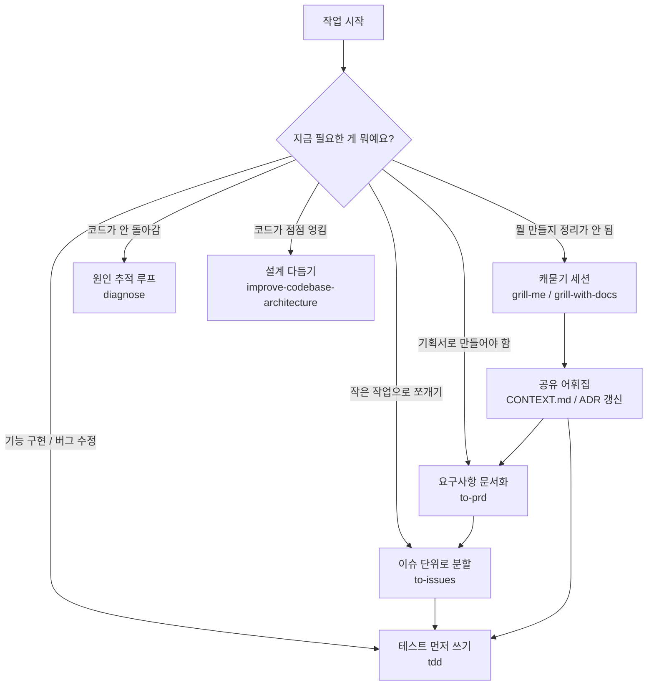

<div class="ai-knowledge-shell">

<aside class="ai-knowledge-sidebar">
  <p class="ai-eyebrow">CATEGORIES</p>
  <nav class="ai-cat-tree"><details class="ai-cat" open><summary><span class="catname">에이전트 오케스트레이션</span><span class="catcount">2</span></summary><ul><li><a href="https://altjs4510.github.io/ai_news_blog/knowledge/20260507/"><span class="kdate">2026-05-07</span><span class="ktitle">ruvnet/ruflo — Claude 멀티 에이전트 오케스트레이션 플랫폼</span></a></li><li><a href="https://altjs4510.github.io/ai_news_blog/knowledge/20260504/"><span class="kdate">2026-05-04</span><span class="ktitle">Agents for Everything Else: Codex for Knowledge …</span></a></li></ul></details><details class="ai-cat" open><summary><span class="catname">MCP &amp; 도구 통합</span><span class="catcount">1</span></summary><ul><li><a href="https://altjs4510.github.io/ai_news_blog/knowledge/20260509/"><span class="kdate">2026-05-09</span><span class="ktitle">How to connect 100 MCP servers without the conte…</span></a></li></ul></details><details class="ai-cat" open><summary><span class="catname">코딩 에이전트</span><span class="catcount">6</span></summary><ul><li><a href="https://altjs4510.github.io/ai_news_blog/knowledge/20260513/" class="current"><span class="kdate">2026-05-13</span><span class="ktitle">mattpocock/skills — Skills for Real Engineers (.…</span></a></li><li><a href="https://altjs4510.github.io/ai_news_blog/knowledge/20260512/"><span class="kdate">2026-05-12</span><span class="ktitle">agentmemory — Persistent memory for AI coding ag…</span></a></li><li><a href="https://altjs4510.github.io/ai_news_blog/knowledge/20260510/"><span class="kdate">2026-05-10</span><span class="ktitle">addyosmani/agent-skills — Production-grade engin…</span></a></li><li><a href="https://altjs4510.github.io/ai_news_blog/knowledge/20260508/"><span class="kdate">2026-05-08</span><span class="ktitle">addyosmani/agent-skills — Production-grade engin…</span></a></li><li><a href="https://altjs4510.github.io/ai_news_blog/knowledge/20260506/"><span class="kdate">2026-05-06</span><span class="ktitle">mksglu/context-mode — AI 코딩 에이전트용 컨텍스트 윈도우 최적화</span></a></li><li><a href="https://altjs4510.github.io/ai_news_blog/knowledge/20260505/"><span class="kdate">2026-05-05</span><span class="ktitle">mattpocock/skills — Skills for Real Engineers (.…</span></a></li></ul></details></nav>
</aside>

<article class="ai-knowledge-article">

<header class="ai-post-hero">
  <p class="ai-eyebrow"><a class="ai-back" href="../">KNOWLEDGE</a> · 2026-05-13 · 오늘의 학습</p>
  <h2 class="ai-post-title">mattpocock/skills — Skills for Real Engineers (.claude 디렉토리 공개)</h2>
</header>

> 원문: [mattpocock/skills — Skills for Real Engineers (.claude 디렉토리 공개)](https://github.com/mattpocock/skills)

## 📌 학습 정리

### 1. 한 줄로 말하면

코딩 보조 인공지능에게 "이렇게 일해줘"라고 알려주는 작은 사용 설명서 묶음이에요. 분위기로 대충 만드는 코딩이 아니라, 진짜 엔지니어처럼 일하게 만드는 게 목표예요.

### 2. 왜 이게 만들어졌어요?

요즘 클로드 코드(Claude Code)나 코덱스(Codex) 같은 코딩 보조 도구를 쓰다 보면 자주 부딪히는 벽이 있어요. 시키는 걸 엉뚱하게 만들거나, 말을 너무 장황하게 늘어놓거나, 코드는 그럴듯한데 막상 안 돌아가거나, 시간이 갈수록 코드가 진흙탕이 되는 식이죠. 기존에는 GSD·BMAD·스펙킷(Spec-Kit)처럼 "이런 절차로 일해라" 하고 큰 틀을 통째로 정해주는 방식이 있었는데, 그러면 사람이 흐름을 통제하기가 어렵고 중간에 문제가 생겨도 손대기 까다로워요. 그래서 이 저장소는 절차를 통째로 강제하는 대신, 작고 갈아끼우기 쉬운 "기능 단위(Skill)"로 쪼개서 필요할 때 꺼내 쓰도록 만들었어요. 수십 년치 엔지니어링 경험에서 자주 통하던 습관들을 인공지능 친구에게 옮겨심는 셈이에요.

### 3. 비유로 풀면

이건 마치 신입 개발자에게 "이런 상황엔 이 체크리스트대로 해봐" 하고 건네는 작업 매뉴얼 모음 같아요. 또는 요리할 때 "지금은 칼질용 도마, 지금은 반죽용 매트" 하고 상황별로 작업 매트를 바꿔 까는 것과 비슷하고요. 그래서 결국 인공지능에게 한 번에 거대한 절차를 떠안기는 대신, 지금 마주한 문제에 맞는 작은 행동 지침만 골라 쥐여주는 방식이에요.

### 4. 어떻게 작동하는지 (그림으로)



흐름은 대체로 "먼저 의도를 또렷하게 만들고 → 작업 단위로 잘게 쪼개고 → 테스트로 피드백을 받으며 만들고 → 가끔 멈춰서 구조를 정돈한다"는 네 박자예요. 처음에 한 번 `setup-matt-pocock-skills`를 돌려서 이슈 트래커 종류, 분류 라벨, 문서 저장 위치 같은 이 저장소가 공통으로 쓰는 설정을 잡아두고, 그다음부터는 상황에 맞는 기능을 골라 부르는 식이에요. 특히 캐묻기 세션에서 만들어지는 `CONTEXT.md`(프로젝트 용어집)와 결정 기록 문서가 이후 다른 작업의 재료가 되는 게 핵심이에요.

### 5. 처음 보는 용어 풀이

- **기능 단위 묶음 (Skill)** — 인공지능에게 "이 상황에선 이렇게 일해줘"라고 알려주는 작은 지침서 한 장이에요. 큰 절차를 통째로 강제하지 않고, 필요할 때 한 장씩 꺼내 쓸 수 있게 만들어 둔 단위예요.
- **캐묻기 세션 (grilling session)** — 만들기 전에 인공지능이 사용자에게 거꾸로 꼬치꼬치 질문을 던지게 하는 단계예요. "내가 뭘 원하는지 나도 잘 모르는" 상태에서 의도를 또렷하게 만드는 데 써요.
- **공유 어휘집 (CONTEXT.md)** — 이 프로젝트에서만 쓰는 용어와 그 뜻을 적어두는 문서예요. 이게 있으면 인공지능이 길게 풀어 쓸 말을 짧은 단어 하나로 처리할 수 있어서, 대화가 간결해지고 이름 짓기도 일관돼져요.
- **결정 기록 문서 (ADR, Architecture Decision Record)** — "왜 이렇게 만들기로 했는지" 그 이유를 짧게 남기는 메모예요. 나중에 누가 봐도 결정 배경을 알 수 있어서, 같은 논의를 반복하지 않게 도와줘요.
- **빨강-초록-리팩터 (red-green-refactor)** — 테스트 먼저 쓰는 개발(TDD)의 기본 박자예요. 일부러 실패하는 테스트(빨강)를 먼저 쓰고, 통과시키고(초록), 그다음 코드를 정돈(리팩터)하는 순서예요. 인공지능에게 매 단계 정직한 피드백을 주는 장치로 쓰여요.
- **수직 슬라이스 (vertical slice)** — 기능을 위·아래로 얇게 한 줄 잘라낸 단위예요. 화면부터 데이터 저장까지 끝까지 작동하는 작은 조각으로 쪼개야, 인공지능이 한 번에 다루기 좋고 진척도도 눈에 보여요.
- **진흙 덩어리 코드 (Ball of Mud)** — 시간이 지나면서 구조가 뭉개져 손대기 무서워진 코드를 가리키는 표현이에요. 인공지능이 빠르게 코드를 뽑다 보면 이 상태로 가속되기 쉬워서, 며칠에 한 번씩 구조를 다듬자는 권유가 따라붙어요.

### 6. 한 발 더 들어가고 싶다면

- [mattpocock/skills 저장소](https://github.com/mattpocock/skills) — 각 기능 단위의 실제 지시문과 폴더 구조를 직접 들여다볼 수 있어요.
- 『The Pragmatic Programmer』 (데이비드 토머스, 앤드루 헌트) — 본문에서 인용된 "아무도 자기가 뭘 원하는지 정확히 모른다", "피드백 속도가 곧 작업 속도다" 같은 격언의 출처예요. 캐묻기 세션과 작은 단계로 나누는 발상의 뿌리를 읽을 수 있어요.
- 『Domain-Driven Design』 (에릭 에반스) — "공유 어휘"라는 발상이 어디서 왔는지 알 수 있는 책이에요. `CONTEXT.md`가 왜 위력적인지 이해하는 데 도움이 돼요.
- 『A Philosophy of Software Design』 (존 오스터하우트) — "좋은 모듈은 깊다"는 인용의 출처로, `improve-codebase-architecture`가 노리는 "단순한 인터페이스 뒤에 풍부한 기능" 감각을 익힐 수 있어요.
- 『Extreme Programming Explained』 (켄트 벡) — "매일 설계에 투자하라"는 인용처예요. 진흙 덩어리가 되기 전에 꾸준히 다듬는 습관의 배경을 잡아줘요.

---

## 📖 원문 전체 번역 (정독용)

> 의역 최소화한 전체 번역입니다. 큰 흐름은 위 정리에서 잡고, 정확한 워딩이 필요할 땐 이 섹션에서 정독하세요.

# 실전 엔지니어를 위한 Skills

매일 실제 엔지니어링에 사용하는 나의 에이전트 스킬 모음 — 바이브 코딩(vibe coding)이 아닌.

실제 애플리케이션을 개발하는 것은 어렵다. GSD, BMAD, Spec-Kit 같은 접근법들은 프로세스를 직접 관장함으로써 도움을 주려 한다. 하지만 그렇게 하면서 당신의 통제권을 빼앗고, 프로세스상의 버그를 해결하기 어렵게 만든다.

이 스킬들은 작고, 적용하기 쉬우며, 조합 가능하도록 설계되었다. 어떤 모델에서도 작동한다. 수십 년간의 엔지니어링 경험을 기반으로 한다. 자유롭게 뜯어고쳐도 된다. 자신만의 것으로 만들어라. 즐겨라.

이 스킬들의 변경 사항과 새로 만드는 스킬을 계속 받아보고 싶다면, 내 뉴스레터에서 약 60,000명의 다른 개발자들과 함께할 수 있다:

뉴스레터 구독하기

---

## 빠른 시작 (30초 설정)

`skills.sh` 인스톨러를 실행한다:

```
npx skills@latest add mattpocock/skills
```

원하는 스킬과 설치할 코딩 에이전트를 선택한다.

반드시 `/setup-matt-procock-skills`를 선택해야 한다.

에이전트에서 `/setup-matt-procock-skills`를 실행한다. 그러면 다음을 수행한다:

- 어떤 이슈 트래커를 사용할지 묻는다 (GitHub, Linear, 또는 로컬 파일)
- 티켓을 트리아지(triage)할 때 적용하는 레이블이 무엇인지 묻는다 (`/triage`는 레이블을 사용함)
- 생성되는 문서를 어디에 저장할지 묻는다

끝 — 이제 시작할 준비가 되었다.

---

## 이 스킬들이 존재하는 이유

나는 Claude Code, Codex, 그리고 기타 코딩 에이전트에서 공통적으로 나타나는 실패 패턴을 해결하기 위해 이 스킬들을 만들었다.

---

### #1: 에이전트가 내가 원하는 것을 하지 않았다

> "아무도 자신이 정확히 무엇을 원하는지 알지 못한다"
>
> David Thomas & Andrew Hunt, *The Pragmatic Programmer*

**문제.** 소프트웨어 개발에서 가장 흔한 실패 패턴은 불일치(misalignment)다. 당신은 개발자가 당신이 원하는 것을 안다고 생각한다. 그런데 그들이 만든 것을 보면 — 전혀 이해하지 못했다는 것을 깨닫게 된다.

AI 시대에도 똑같다. 당신과 에이전트 사이에는 커뮤니케이션 갭이 존재한다. 이에 대한 해결책은 **그릴링 세션(grilling session)**이다 — 에이전트로 하여금 당신이 만들고 있는 것에 대해 상세한 질문을 던지게 하는 것.

**해결책**은 다음을 사용하는 것이다:

- `/grill-me` — 코드 외적인 용도에 사용
- `/grill-with-docs` — `/grill-me`와 동일하지만 추가적인 기능을 제공 (아래 참조)

이것들은 내 가장 인기 있는 스킬이다. 시작하기 전에 에이전트와 방향을 맞추고, 당신이 만들고 있는 변경 사항에 대해 깊이 생각할 수 있게 해준다. 변경 사항을 만들고 싶을 때마다 **매번** 사용하라.

---

### #2: 에이전트가 너무 장황하다

> "유비쿼터스 언어(ubiquitous language)를 사용하면, 개발자들 간의 대화와 코드의 표현이 모두 동일한 도메인 모델로부터 도출된다."
>
> Eric Evans, *Domain-Driven-Design*

**문제**: 프로젝트 초기에 개발자와 소프트웨어를 의뢰한 사람들(도메인 전문가들)은 보통 서로 다른 언어를 사용한다.

나도 에이전트와의 관계에서 같은 긴장감을 느꼈다. 에이전트는 대개 프로젝트에 투입되어 전문 용어를 그때그때 파악하도록 요청받는다. 그래서 1개의 단어로 충분한 곳에 20개의 단어를 쓴다.

**해결책**은 공유 언어(shared language)다. 이것은 에이전트가 프로젝트에서 사용되는 전문 용어를 해독하는 데 도움을 주는 문서다.

**예시**

다음은 내 `course-video-manager` 레포에서 가져온 `CONTEXT.md` 예시다. 어느 것이 더 읽기 쉬운가?

- **이전**: "코스의 섹션 내에 있는 레슨이 '실체화'될 때(즉, 파일 시스템에서 자리를 부여받을 때) 문제가 생긴다"
- **이후**: "materialization cascade에 문제가 생긴다"

이러한 간결함은 세션이 거듭될수록 그 효과가 쌓인다.

이것은 `/grill-with-docs`에 내장되어 있다. 이것은 그릴링 세션이면서, AI와의 공유 언어를 구축하고 설명하기 어려운 결정들을 ADR(Architecture Decision Record)로 문서화하는 것을 돕는다.

이것이 얼마나 강력한지 설명하기가 쉽지 않다. 이 레포에서 가장 멋진 기법일 수도 있다. 직접 시도해 보라.

> **팁**
>
> 공유 언어는 장황함을 줄이는 것 이외에도 다른 많은 이점이 있다:
>
> - **변수, 함수, 파일들이 일관되게 명명된다**, 공유 언어를 사용하여
> - 그 결과, **코드베이스가 에이전트에게 탐색하기 더 쉬워진다**
> - 에이전트가 **더 간결한 언어를 사용할 수 있기 때문에 생각하는 데 더 적은 토큰을 소비한다**

---

### #3: 코드가 작동하지 않는다

> "항상 작고 신중한 단계를 밟아라. 피드백의 속도가 당신의 속도 제한이다. 너무 큰 작업은 절대 떠맡지 마라."
>
> David Thomas & Andrew Hunt, *The Pragmatic Programmer*

**문제**: 당신과 에이전트가 무엇을 만들지 합의했다고 하자. 그런데 에이전트가 **여전히** 쓰레기를 만들어낸다면 어떻게 되는가?

이제 피드백 루프를 살펴볼 때다. 에이전트가 만드는 코드가 실제로 어떻게 실행되는지에 대한 피드백 없이는, 에이전트는 맹목적으로 작동하게 된다.

**해결책**: 정적 타입, 브라우저 접근, 자동화된 테스트라는 일반적인 피드백 루프 트리오가 필요하다.

자동화된 테스트를 위해서는 레드-그린-리팩터(red-green-refactor) 루프가 핵심이다. 이것은 에이전트가 먼저 실패하는 테스트를 작성한 다음 그 테스트를 통과시키는 방식이다. 이것은 에이전트에게 일관된 수준의 피드백을 제공하여 훨씬 더 나은 코드를 만들어낸다.

어떤 프로젝트에도 슬롯처럼 끼워 넣을 수 있는 `/tdd` 스킬을 만들었다. 레드-그린-리팩터를 장려하고, 좋은 테스트와 나쁜 테스트가 무엇인지에 대한 충분한 지침을 에이전트에게 제공한다.

디버깅을 위해서는 최선의 디버깅 관행을 단순한 루프로 감싸는 `/diagnose` 스킬도 만들었다.

---

### #4: 우리는 진흙 덩어리(Ball of Mud)를 만들었다

> "시스템의 설계에 **매일** 투자하라."
>
> Kent Beck, *Extreme Programming Explained*

> "최선의 모듈은 깊다. 단순한 인터페이스를 통해 많은 기능에 접근할 수 있게 해준다."
>
> John Ousterhout, *A Philosophy Of Software Design*

**문제**: 에이전트로 만든 대부분의 앱은 복잡하고 변경하기 어렵다. 에이전트가 코딩 속도를 급격히 높일 수 있기 때문에, 소프트웨어 엔트로피도 가속화된다. 코드베이스는 전례 없는 속도로 더 복잡해진다.

**해결책**은 AI 기반 개발에 대한 근본적으로 새로운 접근법이다: 코드의 설계에 관심을 갖는 것.

이것은 이 스킬들의 모든 계층에 내장되어 있다:

- `/to-prd`는 PRD를 생성하기 전에 어떤 모듈에 손대는지 질문을 통해 확인한다
- `/zoom-out`은 에이전트에게 전체 시스템의 맥락에서 코드를 설명하도록 지시한다
- 그리고 결정적으로, `/improve-codebase-architecture`는 진흙 덩어리가 된 코드베이스를 구제하는 데 도움을 준다. 며칠에 한 번씩 코드베이스에 실행하는 것을 권장한다.

---

## 요약

소프트웨어 엔지니어링의 기본 원칙은 그 어느 때보다 중요하다. 이 스킬들은 이러한 기본 원칙들을 반복 가능한 실천 방법으로 압축하여, 당신이 커리어 최고의 앱을 출시하도록 돕기 위한 나의 최선의 노력이다. 즐겨라.

---

## 레퍼런스

### 엔지니어링

코드 작업에 매일 사용하는 스킬들.

- **diagnose** — 어려운 버그와 성능 회귀에 대한 체계적인 진단 루프: 재현 → 최소화 → 가설 수립 → 계측 → 수정 → 회귀 테스트.
- **grill-with-docs** — 기존 도메인 모델에 비추어 계획을 검토하고, 용어를 다듬으며, `CONTEXT.md`와 ADR을 인라인으로 업데이트하는 그릴링 세션.
- **triage** — 트리아지 역할의 상태 머신을 통해 이슈를 분류한다.
- **improve-codebase-architecture** — `CONTEXT.md`의 도메인 언어와 `docs/adr/`의 결정 사항을 참고하여 코드베이스에서 심화 기회를 찾는다.
- **setup-matt-procock-skills** — 다른 엔지니어링 스킬들이 사용하는 레포별 설정(이슈 트래커, 트리아지 레이블 어휘, 도메인 문서 레이아웃)을 스캐폴딩한다. `to-issues`, `to-prd`, `triage`, `diagnose`, `tdd`, `improve-codebase-architecture`, 또는 `zoom-out`을 사용하기 전에 레포당 한 번 실행한다.
- **tdd** — 레드-그린-리팩터 루프를 사용하는 테스트 주도 개발(Test-driven development). 수직 슬라이스(vertical slice) 단위로 기능을 구현하거나 버그를 수정한다.
- **to-issues** — 어떤 계획, 스펙, 또는 PRD도 수직 슬라이스를 사용하여 독립적으로 집어 들 수 있는 GitHub 이슈들로 분해한다.
- **to-prd** — 현재 대화 컨텍스트를 PRD로 변환하여 GitHub 이슈로 제출한다. 인터뷰 없이 — 이미 논의한 내용을 그대로 종합한다.
- **zoom-out** — 에이전트에게 줌 아웃하여 낯선 코드 섹션에 대해 더 넓은 맥락이나 더 높은 수준의 관점을 제공하도록 지시한다.
- **prototype** — 설계를 구체화하기 위한 일회용 프로토타입을 만든다 — 상태/비즈니스 로직 문제를 위한 실행 가능한 터미널 앱이거나, 하나의 라우트에서 전환 가능한 여러 가지 근본적으로 다른 UI 변형들.

---

### 생산성

코드에 특정하지 않은 일반적인 워크플로 도구들.

- **caveman** — 초압축 커뮤니케이션 모드. 불필요한 내용을 제거하면서도 완전한 기술적 정확성을 유지하여 토큰 사용량을 약 75% 줄인다.
- **grill-me** — 결정 트리의 모든 분기가 해소될 때까지 계획이나 설계에 대해 가차 없이 인터뷰를 받는다.
- **handoff** — 다른 에이전트가 작업을 이어받을 수 있도록 현재 대화를 핸드오프 문서로 압축한다.
- **write-a-skill** — 적절한 구조, 점진적 공개(progressive disclosure), 그리고 번들된 리소스를 갖춘 새로운 스킬을 만든다.

---

### 기타

갖고는 있지만 거의 사용하지 않는 도구들.

- **git-guardrails-claude-code** — 위험한 git 명령어(push, reset --hard, clean 등)가 실행되기 전에 차단하는 Claude Code 훅을 설정한다.
- **migrate-to-shoehorn** — 테스트 파일에서 `as` 타입 단언(type assertion)을 @total-typescript/shoehorn으로 마이그레이션한다.
- **scaffold-exercises** — 섹션, 문제, 솔루션, 설명자(explainer)가 있는 연습 디렉토리 구조를 생성한다.
- **setup-pre-commit** — lint-staged, Prettier, 타입 체킹, 그리고 테스트를 포함한 Husky pre-commit 훅을 설정한다.

</article>

</div>

<!-- ai-related-links -->
<aside class="ai-related-links">
  <p class="ai-eyebrow">관련 학습</p>
  <ul><li><a href="https://altjs4510.github.io/ai_news_blog/knowledge/20260505/"><span class="kdate">2026-05-05</span><span class="ktitle">mattpocock/skills — Skills for Real Engineers (.…</span></a></li><li><a href="https://altjs4510.github.io/ai_news_blog/knowledge/20260508/"><span class="kdate">2026-05-08</span><span class="ktitle">addyosmani/agent-skills — Production-grade engin…</span></a></li><li><a href="https://altjs4510.github.io/ai_news_blog/knowledge/20260510/"><span class="kdate">2026-05-10</span><span class="ktitle">addyosmani/agent-skills — Production-grade engin…</span></a></li></ul>
</aside>
<!-- /ai-related-links -->
