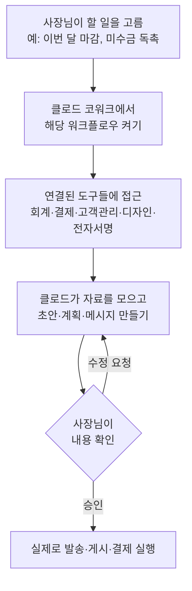

<aside class="ai-knowledge-sidebar">
  
CATEGORIES

  <nav class="ai-cat-tree">

에이전트 오케스트레이션7
<ul><li><a href="https://altjs4510.github.io/ai_news_blog/knowledge/20260623/">2026-06-23bytedance/deer-flow — 샌드박스·메모리·서브에이전트·메시지 게이트웨이를…</a></li><li><a href="https://altjs4510.github.io/ai_news_blog/knowledge/20260611/">2026-06-11The evolution of agentic surfaces: building with…</a></li><li><a href="https://altjs4510.github.io/ai_news_blog/knowledge/20260602/">2026-06-02revfactory/harness — 도메인별 에이전트 팀과 스킬을 자동 설계하는 메타…</a></li><li><a href="https://altjs4510.github.io/ai_news_blog/knowledge/20260529/">2026-05-29Introducing dynamic workflows in Claude Code</a></li><li><a href="https://altjs4510.github.io/ai_news_blog/knowledge/20260520/">2026-05-20New in Claude Managed Agents: self-hosted sandbo…</a></li><li><a href="https://altjs4510.github.io/ai_news_blog/knowledge/20260507/">2026-05-07ruvnet/ruflo — Claude 멀티 에이전트 오케스트레이션 플랫폼</a></li><li><a href="https://altjs4510.github.io/ai_news_blog/knowledge/20260504/">2026-05-04Agents for Everything Else: Codex for Knowledge …</a></li></ul>

MCP &amp; 도구 통합9
<ul><li><a href="https://altjs4510.github.io/ai_news_blog/knowledge/20260618/">2026-06-18DeusData/codebase-memory-mcp — 158개 언어 코드베이스를 밀리…</a></li><li><a href="https://altjs4510.github.io/ai_news_blog/knowledge/20260604/">2026-06-04chopratejas/headroom — Compress tool outputs bef…</a></li><li><a href="https://altjs4510.github.io/ai_news_blog/knowledge/20260603/">2026-06-03How Bad MCP design cost your Agent 5× more token…</a></li><li><a href="https://altjs4510.github.io/ai_news_blog/knowledge/20260526/">2026-05-26colbymchenry/codegraph — Pre-indexed code knowle…</a></li><li><a href="https://altjs4510.github.io/ai_news_blog/knowledge/20260523/">2026-05-23colbymchenry/codegraph — 사전 인덱싱된 코드 지식 그래프 MCP</a></li><li><a href="https://altjs4510.github.io/ai_news_blog/knowledge/20260521/">2026-05-21colbymchenry/codegraph — Pre-indexed code knowle…</a></li><li><a href="https://altjs4510.github.io/ai_news_blog/knowledge/20260519/">2026-05-19Anthropic acquires Stainless</a></li><li><a href="https://altjs4510.github.io/ai_news_blog/knowledge/20260517/">2026-05-17I gave my LLM 100,000+ tools — Lazy Discovery &a…</a></li><li><a href="https://altjs4510.github.io/ai_news_blog/knowledge/20260509/">2026-05-09How to connect 100 MCP servers without the conte…</a></li></ul>

코딩 에이전트10
<ul><li><a href="https://altjs4510.github.io/ai_news_blog/knowledge/20260626/">2026-06-26google-labs-code/design.md — 코딩 에이전트에게 디자인 시스템을 …</a></li><li><a href="https://altjs4510.github.io/ai_news_blog/knowledge/20260619/">2026-06-19Claude Code now supports artifacts</a></li><li><a href="https://altjs4510.github.io/ai_news_blog/knowledge/20260530/">2026-05-30Leonxlnx/taste-skill — AI에게 좋은 취향을 부여해 generic s…</a></li><li><a href="https://altjs4510.github.io/ai_news_blog/knowledge/20260528/">2026-05-28Building self-improving tax agents with Codex</a></li><li><a href="https://altjs4510.github.io/ai_news_blog/knowledge/20260524/">2026-05-24colbymchenry/codegraph — Pre-indexed code knowle…</a></li><li><a href="https://altjs4510.github.io/ai_news_blog/knowledge/20260512/">2026-05-12agentmemory — Persistent memory for AI coding ag…</a></li><li><a href="https://altjs4510.github.io/ai_news_blog/knowledge/20260510/">2026-05-10addyosmani/agent-skills — Production-grade engin…</a></li><li><a href="https://altjs4510.github.io/ai_news_blog/knowledge/20260508/">2026-05-08addyosmani/agent-skills — Production-grade engin…</a></li><li><a href="https://altjs4510.github.io/ai_news_blog/knowledge/20260506/">2026-05-06mksglu/context-mode — AI 코딩 에이전트용 컨텍스트 윈도우 최적화</a></li><li><a href="https://altjs4510.github.io/ai_news_blog/knowledge/20260505/">2026-05-05mattpocock/skills — Skills for Real Engineers (.…</a></li></ul>

모델 &amp; 연구4
<ul><li><a href="https://altjs4510.github.io/ai_news_blog/knowledge/20260620/">2026-06-20zai-org/GLM-5 — From Vibe Coding to Agentic Engi…</a></li><li><a href="https://altjs4510.github.io/ai_news_blog/knowledge/20260617/">2026-06-17Predicting model behavior before release by simu…</a></li><li><a href="https://altjs4510.github.io/ai_news_blog/knowledge/20260516/">2026-05-16STALE — 에이전트가 자기 기억의 유효성을 인지할 수 있는가</a></li><li><a href="https://altjs4510.github.io/ai_news_blog/knowledge/20260513/">2026-05-13Thinking Machines' Native Interaction Models — T…</a></li></ul>

인프라 &amp; 컴퓨트5
<ul><li><a href="https://altjs4510.github.io/ai_news_blog/knowledge/20260630/">2026-06-30Introducing the Claude apps gateway for Amazon B…</a></li><li><a href="https://altjs4510.github.io/ai_news_blog/knowledge/20260610/">2026-06-10Fable 5 just made cost-aware model routing manda…</a></li><li><a href="https://altjs4510.github.io/ai_news_blog/knowledge/20260606/">2026-06-06chopratejas/headroom — Compress tool outputs, lo…</a></li><li><a href="https://altjs4510.github.io/ai_news_blog/knowledge/20260605/">2026-06-05chopratejas/headroom — Compress tool outputs, lo…</a></li><li><a href="https://altjs4510.github.io/ai_news_blog/knowledge/20260522/">2026-05-22Giving Agents Computers — Ivan Burazin, Daytona</a></li></ul>

보안 &amp; 거버넌스8
<ul><li><a href="https://altjs4510.github.io/ai_news_blog/knowledge/20260625/">2026-06-25Agent identity in Claude Tag: a new access model…</a></li><li><a href="https://altjs4510.github.io/ai_news_blog/knowledge/20260624/">2026-06-24Agent identity in Claude Tag: a new access model…</a></li><li><a href="https://altjs4510.github.io/ai_news_blog/knowledge/20260614/">2026-06-14NVIDIA/SkillSpector — Security scanner for AI ag…</a></li><li><a href="https://altjs4510.github.io/ai_news_blog/knowledge/20260613/">2026-06-13Fable 5's guardrails got bypassed in 48 hours — …</a></li><li><a href="https://altjs4510.github.io/ai_news_blog/knowledge/20260612/">2026-06-12NVIDIA/SkillSpector — AI 에이전트 스킬용 보안 스캐너</a></li><li><a href="https://altjs4510.github.io/ai_news_blog/knowledge/20260607/">2026-06-07OpenAI Help: Lockdown Mode</a></li><li><a href="https://altjs4510.github.io/ai_news_blog/knowledge/20260531/">2026-05-31How we contain Claude across products</a></li><li><a href="https://altjs4510.github.io/ai_news_blog/knowledge/20260527/">2026-05-27Microsoft Copilot Cowork Exfiltrates Files</a></li></ul>

응용 사례4
<ul><li><a href="https://altjs4510.github.io/ai_news_blog/knowledge/20260621/">2026-06-21calesthio/OpenMontage — 12 파이프라인·52 도구·500+ 스킬을 …</a></li><li><a href="https://altjs4510.github.io/ai_news_blog/knowledge/20260609/">2026-06-09Building intelligent apps for Apple platforms wi…</a></li><li><a href="https://altjs4510.github.io/ai_news_blog/knowledge/20260515/">2026-05-15Clawdmeter — Claude Code 사용량을 데스크톱 대시보드로</a></li><li><a href="https://altjs4510.github.io/ai_news_blog/knowledge/20260514/" class="current">2026-05-14Introducing Claude for Small Business</a></li></ul>

산업 동향1
<ul><li><a href="https://altjs4510.github.io/ai_news_blog/knowledge/20260616/">2026-06-16Why AI hasn't replaced software engineers, and w…</a></li></ul>
</nav>
</aside>

<article class="ai-knowledge-article">

<header class="ai-post-hero">
  
<a class="ai-back" href="../">KNOWLEDGE</a> · 2026-05-14 · 오늘의 학습

  <h2 class="ai-post-title">Introducing Claude for Small Business</h2>
</header>

> 원문: [Introducing Claude for Small Business](https://www.anthropic.com/news/claude-for-small-business)

## 📌 학습 정리

### 1. 한 줄로 말하면

작은 가게·작은 회사 사장님이 매일 쓰는 회계·결제·고객관리 같은 도구 안으로 클로드(Claude)가 직접 들어가서, 밤늦게까지 쌓이는 잡무를 대신 처리해 주는 묶음 상품이에요.

### 2. 왜 이게 만들어졌어요?

미국 경제의 약 44%, 민간 일자리의 절반 가까이를 작은 사업체들이 책임지고 있는데, 정작 인공지능(AI) 도입은 큰 회사들에 비해 한참 뒤처져 있다고 해요. 시중의 도구나 교육이 작은 사업체의 일하는 방식에 맞춰져 있지 않다 보니, 대부분 채팅창에 질문 한 번 던져 보는 데서 멈추는 경우가 많았던 거죠. 그러다 보니 "AI는 좋다는데 내 업무에 어떻게 붙이지?"라는 벽에 부딪힙니다. 이번에 앤트로픽(Anthropic, 클로드를 만든 회사)이 발표한 [Claude for Small Business](https://claude.com/solutions/small-business)는, 사장님이 이미 쓰고 있는 도구들에 클로드를 끼워 넣어서 그 벽을 낮춰 보려는 시도예요.

### 3. 비유로 풀면

이건 마치 **단골 회계사·마케터·총무를 한 명씩 따로 고용하는 대신, 이 모든 일을 거들어 주는 비서 한 명을 회사 책상 위에 앉혀 두는 것**과 비슷해요. 그 비서는 회계 장부(QuickBooks), 결제 내역(PayPal), 고객 명단(HubSpot), 디자인 도구(Canva), 전자서명(Docusign)을 직접 열어 보면서 일을 진행하고, 보내거나 결제하기 직전에 사장님한테 "이렇게 보내도 될까요?" 하고 한 번 더 물어봐요.

그래서 결국, 사장님은 "이 일을 해 줘"라고 말만 하고, 실제로 시스템에 손을 담그는 건 클로드가 하되 **마지막 결재 도장은 사람이 찍는** 구조라고 보면 됩니다.

### 4. 어떻게 작동하는지 (그림으로)

핵심은 세 단계예요. 먼저 사장님이 미리 만들어진 작업 묶음(워크플로우) 중 하나를 고르고, 클로드가 연결된 도구들에서 데이터를 끌어와 결과물 초안을 만들어요. 그다음 사장님이 한 번 검토해서 승인하면 그제야 실제 발송·결제 같은 행동이 일어납니다.

### 5. 처음 보는 용어 풀이

- **소상공인용 클로드 (Claude for Small Business)** — 작은 사업체가 쓰는 도구들에 클로드를 끼워 넣은 묶음 상품이에요. 일을 대신 해 주는 작업 흐름과 자주 하는 잡일 처리법이 미리 들어 있어요.
- **함께 일하는 작업실 (Claude Cowork)** — 클로드를 켜고, 외부 도구를 연결하고, 어떤 일을 시킬지 고르는 사장님용 작업 화면이에요. 이 안에서 토글(스위치) 하나로 소상공인용 기능을 켤 수 있어요.
- **연결 장치 (Connector)** — 클로드가 회계 프로그램이나 결제 서비스 같은 외부 도구의 데이터를 읽고 작업할 수 있게 이어 주는 다리예요. 이 자료에서는 PayPal, QuickBooks, HubSpot, Canva, Docusign, Google Workspace, Microsoft 365가 언급됩니다.
- **알아서 일을 진행하는 작업 흐름 (agentic workflow)** — "월말 마감하기" 같은 큰 일을 시키면, 클로드가 여러 단계를 스스로 이어가며 처리하는 방식이에요. 사람이 매 단계 명령을 다시 내릴 필요가 없어요. 다만 실제 발송·결제 같은 마지막 단계는 사장님 승인을 받게 되어 있어요.
- **반복 작업 처리법 (Skill)** — 사장님들이 "이게 제일 시간 잡아먹어요"라고 말한 자잘하지만 자주 하는 일들(미수금 독촉, 영수증 정리 등)을 빠르게 처리하도록 묶어 둔 단위 기능이에요. 이번 발표에서는 15개가 함께 제공된다고 해요.
- **권한 그대로 따르기 (existing permissions)** — 회사에서 직원 A가 회계 장부의 어떤 부분을 못 보게 막혀 있다면, 클로드를 통해서도 그 부분은 안 보여요. 새 권한 체계를 만들지 않고 기존 도구의 권한을 그대로 따른다는 뜻이에요.
- **기본적으로 학습에 안 쓰기 (no training on your data by default)** — 팀(Team)·기업(Enterprise) 요금제에서는 사장님 회사 데이터를 클로드 모델 학습에 쓰지 않는 게 기본 설정이에요. 회사 정보가 다른 곳에 새어 들어갈 걱정을 줄여 주는 장치죠.

### 6. 한 발 더 들어가고 싶다면

- [Claude for Small Business 솔루션 페이지](https://claude.com/solutions/small-business) — 어떤 도구가 연결되고 어떤 작업이 가능한지, 가입은 어떻게 하는지 한자리에서 볼 수 있어요.
- [작업 흐름 모음 페이지](http://claude.com/plugins/small-business) — 기본 제공되는 15개의 자동 작업 흐름이 어떤 것들인지 살펴볼 수 있어요.
- [소상공인을 위한 AI 활용 강의 (AI Fluency for Small Business)](https://anthropic.skilljar.com/ai-fluency-for-small-businesses) — 페이팔(PayPal)과 함께 만든 무료 온라인 강의로, AI를 안전·책임감 있게 업무에 도입하는 법을 단계별로 배울 수 있어요.
- [신뢰 센터 (Trust Center)](https://trust.anthropic.com/) — 데이터 보안·개인정보 처리 정책의 자세한 내용을 확인할 수 있어요. 도입 전 보안 검토를 할 때 참고하기 좋아요.
- [금융 서비스를 위한 에이전트 발표](https://www.anthropic.com/news/finance-agents) — 같은 흐름에서 금융·보험 업종을 겨냥해 만든 패키지 발표예요. 업종별로 어떻게 묶음을 다르게 가져가는지 비교해 볼 수 있어요.

---

## 📖 원문 전체 번역 (정독용)

> 의역 최소화한 전체 번역입니다. 큰 흐름은 위 정리에서 잡고, 정확한 워딩이 필요할 땐 이 섹션에서 정독하세요.

우리는 [Claude for Small Business](https://claude.com/solutions/small-business)를 출시합니다. 이는 소규모 사업체들이 의존하는 도구들 안에 Claude를 심어주는 커넥터 및 즉시 실행 가능한 워크플로 패키지로, 소기업 오너들이 AI를 최대한 활용하고 할 일 목록의 항목들을 하나씩 지워나갈 수 있도록 돕기 위해 만들어졌습니다.

소규모 사업체들은 미국 GDP의 44%를 차지하고 민간 부문 노동력의 거의 절반을 고용하고 있지만, AI 도입은 대기업에 비해 뒤처져 있습니다. 도구와 교육 훈련이 소기업의 운영 방식에 맞게 설계되는 경우가 드물어, 결과적으로 소기업의 AI 활용은 채팅 창에서 멈추는 경우가 많습니다. 공익적 사명의 일환으로, 우리는 사업주들이 가장 중요한 업무에 AI를 보다 충실하고 효과적으로 활용할 수 있도록 돕는 데 전념하고 있습니다.

Claude for Small Business는 토글 설치 방식으로, 소기업 오너들이 이미 사용 중인 도구들—Intuit QuickBooks, PayPal, HubSpot, Canva, Docusign, Google Workspace, Microsoft 365—안에서 Claude를 작동시킵니다. 이 도구들을 통해 급여 계획 수립, 월말 결산, 영업 캠페인 운영, 미수금 독촉 등의 업무를 수행할 수 있습니다.

> _"소규모 사업체들은 미국 경제의 거의 절반을 차지하지만, 대기업과 같은 자원을 가진 적이 없었습니다. AI는 마침내 그 격차를 좁힐 수 있는 최초의 기술이며, 바로 그 이유로 우리는 Claude for Small Business를 출시합니다. 또한 AI가 가장 필요한 기업인들과 지역 사회에 실질적으로 닿을 수 있도록 교육 및 파트너십도 함께 제공합니다. Claude for Small Business는 오너들이 이미 의존하는 QuickBooks, PayPal, HubSpot 같은 도구들 안에서 작동하며, 급여 계획 수립, 미수금 독촉, 마케팅 프로젝트 착수 등 퇴근 후에 쌓이는 업무들을 처리합니다. 사람이 사업을 운영하고, Claude가 늦은 밤의 업무를 덜어줍니다."_
>
> _—다니엘라 아모데이(Daniela Amodei), Anthropic 공동창업자 겸 사장_

## **작동 방식**

Claude Cowork 내에서 Claude for Small Business를 켜고, 이미 사용 중인 도구들을 연결한 뒤 작업을 선택하세요. Claude가 업무를 수행하고, 무언가를 전송하거나 게시하거나 결제하기 전에 반드시 사용자가 승인합니다.

재무, 운영, 영업, 마케팅, HR, 고객 서비스 전반에 걸쳐 **즉시 실행 가능한 15개의 에이전틱 워크플로 (agentic workflows)**가 포함되어 있습니다. 또한 오너들이 가장 시간을 잡아먹는다고 알려준 반복 작업에 기반한 **15개의 스킬**도 포함됩니다.

주요 기능은 다음과 같습니다:

- **자신 있게 급여 계획 수립하기.** QuickBooks의 현금 포지션을 PayPal 정산 수입과 대조하고, 30일 예측을 수립하며, 연체 항목 우선순위를 매기고, 사용자가 승인 후 발송할 수 있도록 미수금 독촉 알림을 대기열에 추가합니다.
- **오류를 줄이며 월말 결산하기.** 장부와 정산 내역을 대조하고, 불일치 항목을 표시하며, 평이한 영어(한국어)로 P&L(손익계산서)을 작성하고, Intuit QuickBooks를 통해 회계사에게 바로 전달할 수 있는 결산 패킷을 내보냅니다.
- **사업 현황 파악하기.** 주기적으로 가장 중요한 비즈니스 인사이트를 한 페이지에 표시합니다: Intuit QuickBooks를 통한 현금 포지션, 매출 추세, 파이프라인 변동, 이번 주 약속 일정 등.
- **다음 캠페인 운영하기.** 매출의 부진 구간을 찾아내고, HubSpot 캠페인 성과를 분석하며, 프로모션 전략 초안을 작성하고, 다음 발송 준비를 위해 Canva에서 에셋을 생성합니다.

그 밖에 청구서 독촉 도구, 마진 분석기, 월말 준비 도구, 세금 시즌 정리 도구, 계약서 검토기, 리드 분류기, 콘텐츠 전략가 등도 포함되어 있습니다.

> "문제를 해결해줄 뿐만 아니라, 제가 몰랐던 문제들도 보여주었습니다." — Purity Coffee

> "우리가 제약이라고 생각했던 것들이 더 이상 제약이 아닙니다. 정말 힘이 납니다. 의미 없는 것들을 들여다보던 수많은 시간이 사라졌습니다. 모든 구성원이 매일 이 도구를 사용하는 조직을 만들고 싶습니다." — Simple Modern

> "매우 지루한 사무 작업이었던 일들을 해방시켜, 더 부가가치 있는 업무에 집중할 수 있게 해주고 있습니다." — MidCentral Energy

### **스택에 연결하기**

Claude Cowork를 통해 실행되며, 연결된 각 도구는 특정 작업을 담당합니다:

- **PayPal**은 Claude 내에서 정산, 청구서 발행, 분쟁, 환불을 처리합니다.
- **Intuit QuickBooks**는 급여 계획, 월말 결산, 현금 흐름 관리를 담당하며, 기업의 세금 시즌 준비와 다른 모든 시스템에 연결되는 조정 업무를 지원하는 도구도 포함합니다.
- **HubSpot**은 리드 분류, 고객 현황 파악, 캠페인 기여 분석을 수행합니다.
- **Canva**는 모든 채널용 콘텐츠를 생성하며, 팀과의 협업 및 편집, 에셋 게시, 성과 추적 기능을 포함합니다.
- **Docusign**은 서명을 위한 계약서 발송, 상태 추적, 체결된 계약서를 적절한 위치에 보관하는 역할을 합니다.

스킬, 자동화 기능, 커넥터 전체 목록은 [솔루션 페이지](http://claude.com/solutions/small-business)에서 확인할 수 있습니다.

> "중소기업은 우리 경제를 이끌어가며, QuickBooks는 수십 년간 그들의 신뢰받는 재무 파트너였습니다. QuickBooks 플랫폼의 에이전틱 AI 역량을 Claude for Small Business에 통합함으로써, 소기업들에게 재무 관리의 복잡성을 줄이고, 급여 워크플로를 가속화하며, 데이터 기반의 인사이트를 통해 빠르고 자신 있게 성장하고 확장할 수 있는 AI 기반 자동화 및 경험을 제공하고 있습니다." — Intuit QuickBooks

> "HubSpot의 사명은 AI로 성장 중인 기업들이 성장할 수 있도록 돕는 것입니다. 우리는 Anthropic과 협력하여 Claude 최초의 CRM 커넥터를 구축했으며, 이를 통해 go-to-market 팀이 어디서 일하든 HubSpot 컨텍스트에 접근할 수 있게 했습니다. 소기업에게 이는 고객 플랫폼에서 직접 맞춤형 답변, 요약, 시각화를 제공받아 더 스마트하게 세그먼트를 나누고, 더 나은 캠페인을 운영하며, 더 많은 리드를 창출할 수 있음을 의미합니다." — HubSpot

> "소기업에는 그들의 속도에 맞게 움직이는 AI가 필요합니다. Canva가 Claude for Small Business에서 콘텐츠 제작을 지원함으로써, 사업주는 아이디어에서 출발해 게시 가능한 브랜드 일관성 있는 디자인까지 하나의 흐름으로 도달할 수 있으며, AI가 그 중간 과정을 간소화합니다. 복잡한 AI 워크플로를 단순하게 만들어 디자인을 통해 사람들이 목표를 달성할 수 있도록 돕겠다는 우리의 비전의 일환입니다." — Canva

## **신뢰를 기반으로 구축**

우리가 소기업 오너들을 대상으로 실시한 설문에서, 절반이 데이터 보안을 AI에 대한 가장 큰 우려 사항으로 꼽았습니다.

Claude for Small Business에서는:

- **사용자가 항상 의사결정 과정에 참여합니다.** Claude 내에서 실행되는 모든 작업과 워크플로는 사용자가 직접 시작합니다. 먼저 계획을 승인하거나, 준비가 되면 처음부터 끝까지 자동으로 실행할 수 있습니다.
- **기존 권한 설정이 그대로 유지됩니다.** 직원이 현재 QuickBooks나 Drive에서 볼 수 없는 것은 Claude를 통해서도 볼 수 없습니다.
- **Team 및 Enterprise 플랜에서는 기본적으로 사용자 데이터로 학습하지 않습니다.**

전체 세부 사항은 [Trust Center](https://trust.anthropic.com/)에서 확인할 수 있습니다.

## **소기업을 위한 AI 활용 역량 교육 (AI Fluency for Small Business)**

도구만으로는 충분하지 않습니다. 오너와 팀원들은 언제, 어떻게 도구를 활용할지 알아야 하며, 대부분은 배울 기회를 갖지 못했습니다.

그래서 우리는 **PayPal**과 협력하여 **AI Fluency for Small Business**—소기업 운영에 AI를 활용하는 방법에 관한 무료 온라인 강좌—를 만들었습니다. 이 강좌는 브루클린의 [Prospect Butcher Co.](https://www.prospectbutcher.com/), 캘리포니아의 [MAKS TIPM Rebuilders](https://tipmrebuilders.com/) 등 자신의 사업에 AI를 직접 도입한 오너들이 강의를 진행하며, AI를 안전하고 책임감 있으며 윤리적으로 사업에 활용하는 방법에 대한 단계별 안내를 제공합니다. 사업 내 어떤 작업이 AI에 적합한지 파악하는 방법과 시작하는 방법 등의 주제를 다룹니다.

> _"PayPal은 Anthropic과 협력하여 중소기업들이 AI 중심 경제의 잠재력을 최대한 활용할 수 있도록 돕게 된 것을 자랑스럽게 생각합니다. 우리는 함께 이 사업주들과 기업인들에게 빠르게 진화하는 디지털 경제에서 경쟁하고 번영하는 데 필요한 도구, 전문 지식, 신뢰할 수 있는 인프라를 갖추어 주고, 혁신하고 성장하며 고객을 더 잘 섬길 수 있는 새로운 기회를 만들고 있습니다." — 에이미 보니타티버스(Amy Bonitatibus), PayPal 최고기업커뮤니케이션책임자_

강좌는 오늘부터 [온디맨드](https://anthropic.skilljar.com/ai-fluency-for-small-businesses)로 수강 가능합니다.

## **Claude SMB 투어**

5월 14일 시카고를 시작으로 Claude for Small Business 로드 투어를 진행합니다. 이 투어는 현지 소기업 리더 100명을 대상으로 하는 무료 반일 라이브 AI 활용 역량 교육 및 실습 워크숍입니다. Anthropic과 파트너 [Tenex.co](https://urldefense.com/v3/__http:/tenex.co__;!!O2kDR7mm-zSJ!v3-kRuVPOHD90OZIZdaen9CTKCNbgWvw86UQk0DD9QnsZhl71Q0nwBAUFehj3mP3kFmEMaIRlfU_$)가 투어를 주최하며, 각 도시에는 현지 파트너들이 함께합니다. 참가자들은 AI를 일상 업무에 통합하기 시작할 수 있도록 한 달간의 Claude Max 구독권을 받습니다.

봄 방문 도시: [시카고](https://anthropic.swoogo.com/smb-workshops-chicago/details), [털사](https://anthropic.swoogo.com/smb-workshop-tulsa/details), [댈러스](https://anthropic.swoogo.com/smb-workshop-dallas), [해밀턴 타운십](https://anthropic.swoogo.com/smb-workshop-new-jersey-2026/rta), [배턴루지](https://anthropic.swoogo.com/smb-workshop-baton-rouge/details), [버밍엄](https://anthropic.swoogo.com/claude-smb-workshop-birmingham/rta?), [솔트레이크시티](https://anthropic.swoogo.com/smb-workshop-salt-lake-city-2026/register), [볼티모어](https://anthropic.swoogo.com/smb-workshop-baltimore-2026/register), [산호세](https://anthropic.swoogo.com/smb-workshop-san-jose-2026/register), [인디애나폴리스](https://anthropic.swoogo.com/smb-workshop-indianapolis-2026/register).

3월에 개념 검증을 함께 진행해준 Greater Cleveland Partnership과 National Talent Collaborative에 감사드립니다. 가을에는 더 많은 도시가 추가될 예정입니다.

## **소기업 중심 비영리 단체와의 파트너십**

공익 법인으로서 Anthropic의 사명 중 하나는 AI로부터 오는 이익이 모든 사람과 커뮤니티, 특히 역사적으로 새로운 기술 혜택을 마지막에 받아온 이들에게도 돌아가도록 보장하는 것입니다. 소기업 오너들—그리고 그들을 지원하고 자문하는 지역 기관들—이 바로 그 대상입니다. 그래서 Claude for Small Business와 함께, 우리는 Claude를 소기업 오너들과 그들의 성장을 돕는 기관들에게 직접 전달하는 파트너십에 투자하고 있습니다.

우리는 AI가 가장 작은 사업체들, 1인 기업가(solopreneur)들을 포함하여, 가능성을 의미 있게 확장할 수 있다고 믿습니다. Workday, LISC(Local Initiatives Support Corporation)와 함께 [Workday Foundation Solopreneurship Accelerator Program](https://www.lisc.org/our-initiatives/small-business/our-work/workday-foundation-solopreneurship-accelerator-program/)을 지원합니다. 이 프로그램은 2026년에 초기 코호트 15명의 예비 1인 기업가들에게 Workday Foundation의 시드 펀딩, Anthropic의 Claude 크레딧, LISC가 개발한 AI 우선 창업 커리큘럼을 제공할 예정입니다.

소기업은 또한 자금 접근성을 포함한 지원 환경에 의존합니다. 그래서 우리는 자체 운영과 서비스에 AI를 도입하고 있는 세 곳의 지역개발금융기관 (CDFI, Community Development Financial Institutions)—[Accion Opportunity Fund](https://aofund.org/), [Community Reinvestment Fund USA](https://www.anthropic.com/news/claude-for-small-business), [Pacific Community Ventures](https://www.pacificcommunityventures.org/)—와 파트너십을 맺고 있습니다. Claude 크레딧과 우리 팀의 실질적인 기술 지원을 통해, 이 CDFI들은 더 많은 소기업이 자금을 확보할 수 있도록 돕는 도구를 구축하고 있습니다. 예를 들어 Pacific Community Ventures는 Claude를 활용하여 CDFI 네트워크를 위한 공유 자원인 Radiant Data Hub를 운영하며, 소기업 고객 및 그 직원들로부터 음성 기반 피드백을 수집하고 종합하여 제품과 서비스를 개선하고 있습니다.

## **시작하기**

Claude for Small Business에 대해 더 알아보고 AI Fluency for Small Business 강좌에 접근하려면 [여기](http://claude.com/solutions/small-business)에서 시작하세요.

</article>

<!-- ai-related-links -->
<aside class="ai-related-links">
  
관련 학습

  <ul><li><a href="https://altjs4510.github.io/ai_news_blog/knowledge/20260504/">2026-05-04Agents for Everything Else: Codex for Knowledge …</a></li><li><a href="https://altjs4510.github.io/ai_news_blog/knowledge/20260507/">2026-05-07ruvnet/ruflo — Claude 멀티 에이전트 오케스트레이션 플랫폼</a></li></ul>
</aside>
<!-- /ai-related-links -->
