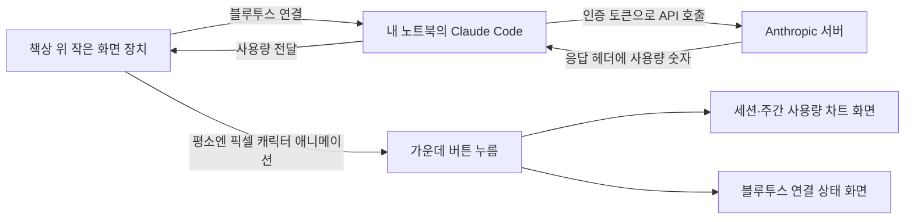

<aside class="ai-knowledge-sidebar">
  
CATEGORIES

  <nav class="ai-cat-tree">

에이전트 오케스트레이션12
<ul><li><a href="https://altjs4510.github.io/ai_news_blog/knowledge/20260828/">2026-08-28Google ADK for Python v2.8.0 — RemoteA2aAgent 네이…</a></li><li><a href="https://altjs4510.github.io/ai_news_blog/knowledge/20260826/">2026-08-26apache/maka — 도구 호출·권한 결정·종료 이벤트를 append-only 로그…</a></li><li><a href="https://altjs4510.github.io/ai_news_blog/knowledge/20260805/">2026-08-05TencentCloud/TencentDB-Agent-Memory — 대화·문서·코드를 …</a></li><li><a href="https://altjs4510.github.io/ai_news_blog/knowledge/20260726/">2026-07-26citrolabs/ego-lite — 로그인된 브라우저 상태를 AI 에이전트와 공유하는…</a></li><li><a href="https://altjs4510.github.io/ai_news_blog/knowledge/20260708/">2026-07-08Expanding Managed Agents in Gemini API: backgrou…</a></li><li><a href="https://altjs4510.github.io/ai_news_blog/knowledge/20260707/">2026-07-07AI Hero Skills Catalog — 실무 엔지니어를 위한 재사용 가능한 판단 …</a></li><li><a href="https://altjs4510.github.io/ai_news_blog/knowledge/20260623/">2026-06-23bytedance/deer-flow — 샌드박스·메모리·서브에이전트·메시지 게이트웨이를…</a></li><li><a href="https://altjs4510.github.io/ai_news_blog/knowledge/20260621/">2026-06-21calesthio/OpenMontage — 12 파이프라인·52 도구·500+ 스킬을 …</a></li><li><a href="https://altjs4510.github.io/ai_news_blog/knowledge/20260602/">2026-06-02revfactory/harness — 도메인별 에이전트 팀과 스킬을 자동 설계하는 메타…</a></li><li><a href="https://altjs4510.github.io/ai_news_blog/knowledge/20260529/">2026-05-29Introducing dynamic workflows in Claude Code</a></li><li><a href="https://altjs4510.github.io/ai_news_blog/knowledge/20260507/">2026-05-07ruvnet/ruflo — Claude 멀티 에이전트 오케스트레이션 플랫폼</a></li><li><a href="https://altjs4510.github.io/ai_news_blog/knowledge/20260504/">2026-05-04Agents for Everything Else: Codex for Knowledge …</a></li></ul>

MCP &amp; 도구 통합20
<ul><li><a href="https://altjs4510.github.io/ai_news_blog/knowledge/20260829/">2026-08-29cursor/plugins — 플러그인 명세(specification)와 공식 플러그인…</a></li><li><a href="https://altjs4510.github.io/ai_news_blog/knowledge/20260802/">2026-08-02Stateless MCP has recaptured my interest (and in…</a></li><li><a href="https://altjs4510.github.io/ai_news_blog/knowledge/20260801/">2026-08-01different-ai/openwork — Claude Cowork의 오픈소스 대체 에…</a></li><li><a href="https://altjs4510.github.io/ai_news_blog/knowledge/20260731/">2026-07-31different-ai/openwork — Claude Cowork의 오픈소스 대안(o…</a></li><li><a href="https://altjs4510.github.io/ai_news_blog/knowledge/20260729/">2026-07-29Bringing MCP 2026-07-28 to Claude</a></li><li><a href="https://altjs4510.github.io/ai_news_blog/knowledge/20260721/">2026-07-21tirth8205/code-review-graph — 로컬 우선 코드 인텔리전스 그래프…</a></li><li><a href="https://altjs4510.github.io/ai_news_blog/knowledge/20260719/">2026-07-19tirth8205/code-review-graph — 로컬 우선 코드 인텔리전스 그래프…</a></li><li><a href="https://altjs4510.github.io/ai_news_blog/knowledge/20260718/">2026-07-18tirth8205/code-review-graph — MCP·CLI용 로컬 코드 인텔리…</a></li><li><a href="https://altjs4510.github.io/ai_news_blog/knowledge/20260709/">2026-07-09mvanhorn/last30days-skill — Reddit·X·YouTube·HN·…</a></li><li><a href="https://altjs4510.github.io/ai_news_blog/knowledge/20260701/">2026-07-01Google OKF (Open Knowledge Format) — 벤더 중립 에이전트 …</a></li><li><a href="https://altjs4510.github.io/ai_news_blog/knowledge/20260618/">2026-06-18DeusData/codebase-memory-mcp — 158개 언어 코드베이스를 밀리…</a></li><li><a href="https://altjs4510.github.io/ai_news_blog/knowledge/20260606/">2026-06-06chopratejas/headroom — Compress tool outputs, lo…</a></li><li><a href="https://altjs4510.github.io/ai_news_blog/knowledge/20260605/">2026-06-05chopratejas/headroom — Compress tool outputs, lo…</a></li><li><a href="https://altjs4510.github.io/ai_news_blog/knowledge/20260604/">2026-06-04chopratejas/headroom — Compress tool outputs bef…</a></li><li><a href="https://altjs4510.github.io/ai_news_blog/knowledge/20260603/">2026-06-03How Bad MCP design cost your Agent 5× more token…</a></li><li><a href="https://altjs4510.github.io/ai_news_blog/knowledge/20260523/">2026-05-23colbymchenry/codegraph — 사전 인덱싱된 코드 지식 그래프 MCP</a></li><li><a href="https://altjs4510.github.io/ai_news_blog/knowledge/20260519/">2026-05-19Anthropic acquires Stainless</a></li><li><a href="https://altjs4510.github.io/ai_news_blog/knowledge/20260517/">2026-05-17I gave my LLM 100,000+ tools — Lazy Discovery &a…</a></li><li><a href="https://altjs4510.github.io/ai_news_blog/knowledge/20260512/">2026-05-12agentmemory — Persistent memory for AI coding ag…</a></li><li><a href="https://altjs4510.github.io/ai_news_blog/knowledge/20260509/">2026-05-09How to connect 100 MCP servers without the conte…</a></li></ul>

코딩 에이전트26
<ul><li><a href="https://altjs4510.github.io/ai_news_blog/knowledge/20260823/">2026-08-23The Evolution of the Agent Harness — 하네스가 모델 가중치…</a></li><li><a href="https://altjs4510.github.io/ai_news_blog/knowledge/20260822/">2026-08-22mattpocock/skills — Skills for Real Engineers (하…</a></li><li><a href="https://altjs4510.github.io/ai_news_blog/knowledge/20260820/">2026-08-20akitaonrails/ai-memory — 코딩 에이전트 CLI의 장기 메모리와 벤더…</a></li><li><a href="https://altjs4510.github.io/ai_news_blog/knowledge/20260819/">2026-08-19akitaonrails/ai-memory — 코딩 에이전트 CLI 간 장기 기억과 벤더…</a></li><li><a href="https://altjs4510.github.io/ai_news_blog/knowledge/20260814/">2026-08-14cathrynlavery/diagram-design — Claude Code용 에디토리…</a></li><li><a href="https://altjs4510.github.io/ai_news_blog/knowledge/20260811/">2026-08-11PrimeIntellect-ai/prime-agent — 장기 자율 실행을 전제로 설계…</a></li><li><a href="https://altjs4510.github.io/ai_news_blog/knowledge/20260810/">2026-08-10Auto mode is now the default in Claude Code for …</a></li><li><a href="https://altjs4510.github.io/ai_news_blog/knowledge/20260809/">2026-08-09PrimeIntellect-ai/prime-agent — 코딩 워크플로우·장기 자율 작…</a></li><li><a href="https://altjs4510.github.io/ai_news_blog/knowledge/20260808/">2026-08-08PrimeIntellect-ai/prime-agent — 코딩 워크플로우와 장시간 자율…</a></li><li><a href="https://altjs4510.github.io/ai_news_blog/knowledge/20260804/">2026-08-04esengine/DeepSeek-Reasonix — prefix-cache 안정성을 축…</a></li><li><a href="https://altjs4510.github.io/ai_news_blog/knowledge/20260728/">2026-07-28alibaba/open-code-review — 결정론적 파이프라인 + LLM 에이전트…</a></li><li><a href="https://altjs4510.github.io/ai_news_blog/knowledge/20260725/">2026-07-25The new rules of context engineering for Claude …</a></li><li><a href="https://altjs4510.github.io/ai_news_blog/knowledge/20260722/">2026-07-22tirth8205/code-review-graph — MCP·CLI용 로컬 우선 코드 …</a></li><li><a href="https://altjs4510.github.io/ai_news_blog/knowledge/20260714/">2026-07-14Graphify-Labs/graphify — 코드베이스를 질의 가능한 지식 그래프로 만…</a></li><li><a href="https://altjs4510.github.io/ai_news_blog/knowledge/20260705/">2026-07-05openai/codex-plugin-cc — Claude Code에서 Codex를 위임…</a></li><li><a href="https://altjs4510.github.io/ai_news_blog/knowledge/20260626/">2026-06-26google-labs-code/design.md — 코딩 에이전트에게 디자인 시스템을 …</a></li><li><a href="https://altjs4510.github.io/ai_news_blog/knowledge/20260619/">2026-06-19Claude Code now supports artifacts</a></li><li><a href="https://altjs4510.github.io/ai_news_blog/knowledge/20260530/">2026-05-30Leonxlnx/taste-skill — AI에게 좋은 취향을 부여해 generic s…</a></li><li><a href="https://altjs4510.github.io/ai_news_blog/knowledge/20260528/">2026-05-28Building self-improving tax agents with Codex</a></li><li><a href="https://altjs4510.github.io/ai_news_blog/knowledge/20260526/">2026-05-26colbymchenry/codegraph — Pre-indexed code knowle…</a></li><li><a href="https://altjs4510.github.io/ai_news_blog/knowledge/20260524/">2026-05-24colbymchenry/codegraph — Pre-indexed code knowle…</a></li><li><a href="https://altjs4510.github.io/ai_news_blog/knowledge/20260521/">2026-05-21colbymchenry/codegraph — Pre-indexed code knowle…</a></li><li><a href="https://altjs4510.github.io/ai_news_blog/knowledge/20260510/">2026-05-10addyosmani/agent-skills — Production-grade engin…</a></li><li><a href="https://altjs4510.github.io/ai_news_blog/knowledge/20260508/">2026-05-08addyosmani/agent-skills — Production-grade engin…</a></li><li><a href="https://altjs4510.github.io/ai_news_blog/knowledge/20260506/">2026-05-06mksglu/context-mode — AI 코딩 에이전트용 컨텍스트 윈도우 최적화</a></li><li><a href="https://altjs4510.github.io/ai_news_blog/knowledge/20260505/">2026-05-05mattpocock/skills — Skills for Real Engineers (.…</a></li></ul>

모델 &amp; 연구7
<ul><li><a href="https://altjs4510.github.io/ai_news_blog/knowledge/20260821/">2026-08-21volcengine/OpenViking — 에이전트 메모리·Knowledge RAG·스…</a></li><li><a href="https://altjs4510.github.io/ai_news_blog/knowledge/20260717/">2026-07-17After a year building agent memory, 'save everyt…</a></li><li><a href="https://altjs4510.github.io/ai_news_blog/knowledge/20260716-proprag/">2026-07-16PropRAG — 프로포지션 경로 위 beam search로 멀티홉 검색 안내</a></li><li><a href="https://altjs4510.github.io/ai_news_blog/knowledge/20260620/">2026-06-20zai-org/GLM-5 — From Vibe Coding to Agentic Engi…</a></li><li><a href="https://altjs4510.github.io/ai_news_blog/knowledge/20260617/">2026-06-17Predicting model behavior before release by simu…</a></li><li><a href="https://altjs4510.github.io/ai_news_blog/knowledge/20260516/">2026-05-16STALE — 에이전트가 자기 기억의 유효성을 인지할 수 있는가</a></li><li><a href="https://altjs4510.github.io/ai_news_blog/knowledge/20260513/">2026-05-13Thinking Machines' Native Interaction Models — T…</a></li></ul>

인프라 &amp; 컴퓨트8
<ul><li><a href="https://altjs4510.github.io/ai_news_blog/knowledge/20260813/">2026-08-13semantica-agi/semantica — 컨텍스트와 책임 추적을 위한 그래프 네이…</a></li><li><a href="https://altjs4510.github.io/ai_news_blog/knowledge/20260812/">2026-08-12semantica-agi/semantica — 컨텍스트와 '책임 추적 가능한(accou…</a></li><li><a href="https://altjs4510.github.io/ai_news_blog/knowledge/20260806/">2026-08-06cloudflare/computer — 에이전트에게 컴퓨터를 통째로 주는 엣지 실행 샌…</a></li><li><a href="https://altjs4510.github.io/ai_news_blog/knowledge/20260724/">2026-07-24diegosouzapw/OmniRoute — 단일 엔드포인트로 278+ 프로바이더·50…</a></li><li><a href="https://altjs4510.github.io/ai_news_blog/knowledge/20260723/">2026-07-23diegosouzapw/OmniRoute — 268+ 프로바이더를 단일 엔드포인트로 묶…</a></li><li><a href="https://altjs4510.github.io/ai_news_blog/knowledge/20260611/">2026-06-11The evolution of agentic surfaces: building with…</a></li><li><a href="https://altjs4510.github.io/ai_news_blog/knowledge/20260522/">2026-05-22Giving Agents Computers — Ivan Burazin, Daytona</a></li><li><a href="https://altjs4510.github.io/ai_news_blog/knowledge/20260520/">2026-05-20New in Claude Managed Agents: self-hosted sandbo…</a></li></ul>

보안 &amp; 거버넌스17
<ul><li><a href="https://altjs4510.github.io/ai_news_blog/knowledge/20260827/">2026-08-27Claude in Chrome is generally available</a></li><li><a href="https://altjs4510.github.io/ai_news_blog/knowledge/20260819-mind-viruses/">2026-08-19탈옥도, 인젝션도 없이 — 대화로만 퍼지는 에이전트의 '마인드 바이러스'</a></li><li><a href="https://altjs4510.github.io/ai_news_blog/knowledge/20260730/">2026-07-30Anatomy of a Frontier Lab Agent Intrusion: A Tec…</a></li><li><a href="https://altjs4510.github.io/ai_news_blog/knowledge/20260716/">2026-07-16Dicklesworthstone/destructive_command_guard — 에이…</a></li><li><a href="https://altjs4510.github.io/ai_news_blog/knowledge/20260715/">2026-07-15Dicklesworthstone/destructive_command_guard — 에이…</a></li><li><a href="https://altjs4510.github.io/ai_news_blog/knowledge/20260710/">2026-07-1070개 MCP 서버 strace 런타임 감사 — 부팅 시 아웃바운드 호출 서버 적발</a></li><li><a href="https://altjs4510.github.io/ai_news_blog/knowledge/20260704/">2026-07-04Cloudflare is about to block AI agents by defaul…</a></li><li><a href="https://altjs4510.github.io/ai_news_blog/knowledge/20260703/">2026-07-03Giving admins more visibility and control over C…</a></li><li><a href="https://altjs4510.github.io/ai_news_blog/knowledge/20260630/">2026-06-30Introducing the Claude apps gateway for Amazon B…</a></li><li><a href="https://altjs4510.github.io/ai_news_blog/knowledge/20260625/">2026-06-25Agent identity in Claude Tag: a new access model…</a></li><li><a href="https://altjs4510.github.io/ai_news_blog/knowledge/20260624/">2026-06-24Agent identity in Claude Tag: a new access model…</a></li><li><a href="https://altjs4510.github.io/ai_news_blog/knowledge/20260614/">2026-06-14NVIDIA/SkillSpector — Security scanner for AI ag…</a></li><li><a href="https://altjs4510.github.io/ai_news_blog/knowledge/20260613/">2026-06-13Fable 5's guardrails got bypassed in 48 hours — …</a></li><li><a href="https://altjs4510.github.io/ai_news_blog/knowledge/20260612/">2026-06-12NVIDIA/SkillSpector — AI 에이전트 스킬용 보안 스캐너</a></li><li><a href="https://altjs4510.github.io/ai_news_blog/knowledge/20260607/">2026-06-07OpenAI Help: Lockdown Mode</a></li><li><a href="https://altjs4510.github.io/ai_news_blog/knowledge/20260531/">2026-05-31How we contain Claude across products</a></li><li><a href="https://altjs4510.github.io/ai_news_blog/knowledge/20260527/">2026-05-27Microsoft Copilot Cowork Exfiltrates Files</a></li></ul>

응용 사례4
<ul><li><a href="https://altjs4510.github.io/ai_news_blog/knowledge/20260712/">2026-07-12Do Automated Evals Work?</a></li><li><a href="https://altjs4510.github.io/ai_news_blog/knowledge/20260609/">2026-06-09Building intelligent apps for Apple platforms wi…</a></li><li><a href="https://altjs4510.github.io/ai_news_blog/knowledge/20260515/" class="current">2026-05-15Clawdmeter — Claude Code 사용량을 데스크톱 대시보드로</a></li><li><a href="https://altjs4510.github.io/ai_news_blog/knowledge/20260514/">2026-05-14Introducing Claude for Small Business</a></li></ul>

산업 동향4
<ul><li><a href="https://altjs4510.github.io/ai_news_blog/knowledge/20260711/">2026-07-11OpenAI says GPT 5.6 is the 'preferred model' for…</a></li><li><a href="https://altjs4510.github.io/ai_news_blog/knowledge/20260702/">2026-07-02How Cursor deploys AI inside the enterprise (For…</a></li><li><a href="https://altjs4510.github.io/ai_news_blog/knowledge/20260616/">2026-06-16Why AI hasn't replaced software engineers, and w…</a></li><li><a href="https://altjs4510.github.io/ai_news_blog/knowledge/20260610/">2026-06-10Fable 5 just made cost-aware model routing manda…</a></li></ul>
</nav>
</aside>

<article class="ai-knowledge-article">

<header class="ai-post-hero">
  
<a class="ai-back" href="../">KNOWLEDGE</a> · 2026-05-15 · 오늘의 학습

  <h2 class="ai-post-title">Clawdmeter — Claude Code 사용량을 데스크톱 대시보드로</h2>
</header>

> 원문: [Clawdmeter — Claude Code 사용량을 데스크톱 대시보드로](https://techcrunch.com/2026/05/14/clawdmeter-turns-your-claude-code-usage-stats-into-a-tiny-desktop-dashboard/)

## 📌 학습 정리

### 1. 한 줄로 말하면

내가 오늘 AI한테 얼마나 많이 일을 시켰는지, 책상 위 작은 화면이 깜찍한 픽셀 캐릭터와 함께 알려주는 장난감 같은 장치예요.

### 2. 왜 이게 만들어졌어요?

요즘 개발자들 사이에서는 Anthropic의 코딩 보조 도구인 Claude Code를 많이 쓰는데, 이게 사용량에 따라 한도가 정해져 있어요. 원래는 터미널(검은 명령창)에서 명령어를 치거나 외부 도구·앱을 띄워서 사용량을 확인했는데, 이게 일하는 도중에 일일이 들여다보기엔 번거롭죠. 그래서 아이슬란드 레이캬비크의 개발자 [Hermann Haraldsson](https://techcrunch.com/2026/05/14/clawdmeter-turns-your-claude-code-usage-stats-into-a-tiny-desktop-dashboard/)이 책상 한쪽에 두고 곁눈질로 슬쩍 볼 수 있는 작은 하드웨어 계기판을 만들었어요. 마침 실리콘밸리에서는 "토큰맥싱(tokenmaxxing)" — 즉 AI를 얼마나 많이 굴렸는지를 일종의 자랑거리로 여기는 분위기 — 까지 퍼지고 있어서, 이런 가시화 도구가 더 흥미를 끄는 상황이에요. 만든 사람도 임베디드(작은 기기에 들어가는 소프트웨어) 개발자가 아니었지만, Claude의 도움을 받아 며칠 만에 완성했다고 해요.

### 3. 비유로 풀면

이건 마치 자동차 계기판의 연료 게이지 같은 거예요. 운전 중에 굳이 주유소 앱을 켜지 않아도, 눈만 살짝 돌리면 "기름이 얼마나 남았지?"가 보이잖아요. 또는 한 레딧 사용자 표현을 빌리면 "내 컨텍스트 창을 위한 하드웨어 다마고치" 같은 거고요. 그래서 결국, 화면 한 구석에 또 다른 창을 띄우지 않고도 책상 위 작은 물체가 사용량을 대신 보여주는 거예요.

### 4. 어떻게 작동하는지 (그림으로)

장치는 Claude Code의 인증 토큰(OAuth token, 로그인 증표 같은 것)을 읽어서 API를 한 번 호출하고, 그 응답에 딸려오는 사용량 숫자를 그대로 가져와 보여줘요. 평소에는 "Clawd"라는 픽셀 캐릭터가 화면에서 춤추는데, 사용량이 올라갈수록 더 부산스럽게 움직이고요. 가운데 버튼을 누르면 캐릭터 애니메이션 대신 이번 세션과 이번 주 사용량 차트가 뜨고, 한 번 더 누르면 블루투스 상태 화면으로 넘어가요. 양옆 버튼은 Claude Code의 단축키(음성 모드, 모드 전환)를 블루투스로 노트북에 보내는 역할을 해요.

### 5. 처음 보는 용어 풀이

- **클로드 코드 (Claude Code)** — Anthropic이라는 회사가 만든, 개발자가 코딩할 때 옆에서 도와주는 AI 도구예요. 명령창에서 자연어로 말을 걸면 코드를 짜주거나 고쳐줘요.
- **토큰 (token)** — AI가 글을 읽고 쓸 때 세는 단위예요. 단어보다 좀 더 잘게 쪼개진 조각이라고 보면 되고, 사용량과 요금이 이 토큰 수로 계산돼요.
- **토큰맥싱 (tokenmaxxing)** — 회사에서 AI 토큰을 얼마나 많이 썼는지를 "내가 AI를 얼마나 적극적으로 쓰고 있는가"의 척도로 삼는 농담 섞인 트렌드예요. 많이 쓸수록 잘하고 있다는 분위기죠.
- **임베디드 기기 (embedded device)** — 일반 컴퓨터가 아니라, 특정 기능 하나를 위해 만들어진 작은 하드웨어를 말해요. Clawdmeter처럼 화면과 버튼만 달린 손바닥만 한 장치가 그 예예요.
- **OAuth 토큰 (OAuth token)** — 매번 비밀번호를 입력하지 않아도 "이 사용자가 맞다"는 걸 증명해주는 디지털 출입증 같은 거예요. Clawdmeter는 이 출입증으로 Anthropic 서버에 사용량을 물어봐요.
- **응답 헤더 (response headers)** — 서버가 답을 보낼 때, 본문과 별도로 같이 딸려 보내는 메모 같은 부분이에요. 여기에 "당신은 지금까지 얼마를 썼고 한도는 얼마입니다" 같은 정보가 담겨요.
- **포크 (fork)** — 오픈소스 프로젝트를 내 쪽으로 복사해 와서 자유롭게 고쳐 쓰는 걸 말해요. Clawdmeter도 이미 50명 정도가 자기 버전으로 가져갔다고 해요.

### 6. 한 발 더 들어가고 싶다면

- [Clawdmeter 프로젝트 소개](https://techcrunch.com/2026/05/14/clawdmeter-turns-your-claude-code-usage-stats-into-a-tiny-desktop-dashboard/) — 만든 사람이 어떻게 며칠 만에 완성했는지, 어떤 부품을 썼는지 맥락을 알 수 있어요.
- [Waveshare ESP32-S3-Touch-AMOLED-2.16 디스플레이](https://www.waveshare.com/esp32-s3-touch-amoled-2.16.htm) — Clawdmeter의 본체로 쓰인 작은 터치 디스플레이 부품을 볼 수 있어요. 직접 만들어보고 싶다면 출발점이 돼요.
- [픽셀 아트 Clawd 애니메이션](https://x.com/bearlyai/status/1822334...) — 화면에서 춤추는 캐릭터가 실제로 어떻게 움직이는지 영상으로 확인할 수 있어요. (원문에 임베드된 트윗 기준)
- [Claude Code 사용량을 추적하는 다른 도구·앱](https://techcrunch.com/2026/05/14/clawdmeter-turns-your-claude-code-usage-stats-into-a-tiny-desktop-dashboard/) — 하드웨어 없이 소프트웨어로만 사용량을 보고 싶다면 이런 대안이 있다는 점을 알 수 있어요.

---

## 📖 원문 전체 번역 (정독용)

> 의역 최소화한 전체 번역입니다. 큰 흐름은 위 정리에서 잡고, 정확한 워딩이 필요할 땐 이 섹션에서 정독하세요.

실리콘밸리의 토큰맥싱(tokenmaxxing) 시대가 이제 자체 하드웨어를 갖추게 됐다. 새로운 오픈소스 프로젝트가 Claude Code 사용 통계를 작은 데스크톱 대시보드로 불러와, AI 파워 유저들이 자신의 사용량을 한눈에 확인할 수 있게 해준다.

물론 터미널에서 명령어나 외부 툴, 앱을 통해 Claude Code 사용량을 직접 추적할 수도 있다. 하지만 픽셀 아트 버전의 Clawd 스프라이트가 화면에서 춤추다가 토큰 사용 정보를 한눈에 보여주는 것만큼 재미있지는 않지 않을까?

"Clawdmeter"라 불리는 이 기기는 AI 파워 유저들을 위한 재미있는 사이드 프로젝트인 동시에, Anthropic의 Claude가 개발자 커뮤니티에 얼마나 깊이 침투했는지, 그리고 토큰맥싱에 대한 관심이 얼마나 커지고 있는지를 시의적절하게 보여주는 사례다. 이 새로운 "생산성" 트렌드는 다양한 테크 기업의 소프트웨어 엔지니어들이 AI를 얼마나 적극적으로 수용했는지를 측정하는 지표로서 업무 중 소비하는 AI 토큰 수를 극대화하는 것을 뜻한다.

한 Reddit 사용자는 이 [프로젝트](https://github.com/hermannharaldsson/clawdmeter)를 처음 봤을 때 이렇게 농담했다. "이쯤 되면 Anthropic이 그냥 무료로 우편으로 보내줘야 하는 거 아닌가요?"

또 다른 사용자는 등록된 카드로 용량을 늘리거나 토큰을 충전하는 버튼을 추가하자고 제안했다. (하하, 꽤 위험할 수 있겠다!)

> 누군가 책상에 올려놓을 작은 하드웨어 기기를 만들어 Claude 토큰 사용량을 모니터링하고 있다.
> Clawdmeter라고 부른다. 꽤 천재적이다.
>
> — Bearly AI (@bearlyai), 2026년 5월 12일

이 프로젝트의 아이디어는 아이슬란드 레이캬비크에 거주하는 소프트웨어 개발자 Hermann Haraldsson으로부터 나왔다. 그는 항상 임베디드 디바이스를 가지고 놀고 싶었지만 지금까지 시간이 없었다고 말한다.

"저는 임베디드 개발자 같은 건 아니에요"라고 Haraldsson은 TechCrunch와의 통화에서 밝혔다. 하지만 Claude 덕분에 불과 며칠 만에 프로젝트를 완성할 수 있었다고 그는 말했다. "프로그래밍에 대한 접근이 정말 민주화되어서, 이제는 누구든 예전에 개발자들만 할 수 있었던 일을 할 수 있게 됐어요. 사실 그게 정말 긍정적이라고 생각해요."

기기를 만드는 데 보낸 시간의 대부분은 디자인에 집중됐으며, 폰트, 색상, 작은 애니메이션을 정확히 맞추는 데 공을 들였다.

직접 대시보드를 만들려면 노트북과 Bluetooth로 연결되는 소형 리튬이온 배터리 구동 디스플레이, 예를 들어 [Waveshare ESP32-S3-Touch-AMOLED-2.16](https://www.waveshare.com/esp32-s3-touch-amoled-2.16.htm) 같은 기기를 사용하면 된다. 기기를 켜면 스플래시 화면에서 픽셀 아트 Clawd 애니메이션이 재생되며, 사용량이 올라갈수록 애니메이션이 더 바빠진다. 가운데 버튼을 눌러 원하는 경우 다양한 애니메이션으로 전환할 수도 있다.

"일하면서 그게 막 미친 듯이 돌아가는 걸 보는 게 좋아요 — 마치 작은 도파민 루프 같달까요"라고 Haraldsson은 말한다.

애니메이션은 가운데 버튼을 누를 때까지 화면에 표시되며, 버튼을 누르면 세션 및 주간 Claude 활용 데이터가 간단한 차트 형태로 표시된다.

이 버튼을 다시 누르면 Bluetooth 화면으로 전환되어 연결 상태를 표시하고 초기화 기능을 제공한다. 그 화면에서 화면을 탭하면 원래의 스플래시 화면 애니메이션으로 돌아갈 수 있다.

*이미지 제공: Hermann Haraldsson*

한편, 나머지 두 개의 사이드 버튼은 Claude Code의 음성 모드 및 모드 전환 단축키를 위해 Bluetooth를 통해 Space와 Shift+Tab을 전송한다. 후자를 통해 기본 Normal 모드, "Accept Edits" 모드, Plan Mode, Auto Mode 사이를 전환할 수 있다.

Haraldsson은 이 기기가 사용 한도를 계속 추적할 수 있는 이유는 Claude Code OAuth 토큰을 읽어 API 호출을 한 다음, 응답 헤더에서 직접 사용량 수치를 가져오기 때문이라고 설명한다.

Clawdmeter는 오픈소스 프로젝트이기 때문에, 누구든 자신의 관심사와 필요에 따라 자체 기능, 애니메이션, 화면 등을 추가하기 위해 포크(fork)할 수 있다.

Haraldsson은 5월 10일 출시 이후 GitHub에서 800명 이상이 별표를 찍었고, 50명이 이미 자체 개발을 위해 프로젝트를 포크했다는 사실에 놀라움을 표했다. 그는 이 기기가 향수를 불러일으키는 느낌 때문에 사람들의 호응을 얻고 있다고 추측한다.

"예전에는 모든 것에 하드웨어 기기가 있었잖아요 — 음악을 들으려면 Walkman이 있었고, iPod도 있었고요. 그런 향수 같은 게 있어요"라고 Haraldsson은 말한다. (어느 Reddit 사용자의 표현처럼, Clawdmeter는 "내 컨텍스트 윈도우를 위한 하드웨어 다마고치"라고 할 수 있다.)

"이게 뭔가를 대체하는 건 아니라는 걸 알아요 — 컴퓨터에서도 이걸 가질 수 있을 테니까요 — 하지만 그냥 재미있잖아요"라고 Haraldsson은 말한다.

---

**관련 태그:** AI, AI 토큰(ai tokens), Claude, Claude Code, 가젯(Gadgets), 토큰맥싱(tokenmaxxing)

---

**필자 소개 — Sarah Perez**

Sarah는 2011년 8월부터 TechCrunch 기자로 활동하고 있다. ReadWriteWeb에서 3년 이상 근무한 후 TechCrunch에 합류했다. 기자로 활동하기 전에는 금융, 리테일, 소프트웨어 등 다양한 산업에서 IT 분야에 종사했다.

</article>

<!-- ai-related-links -->
<aside class="ai-related-links">
  
관련 학습

  <ul><li><a href="https://altjs4510.github.io/ai_news_blog/knowledge/20260514/">2026-05-14Introducing Claude for Small Business</a></li><li><a href="https://altjs4510.github.io/ai_news_blog/knowledge/20260507/">2026-05-07ruvnet/ruflo — Claude 멀티 에이전트 오케스트레이션 플랫폼</a></li></ul>
</aside>
<!-- /ai-related-links -->
