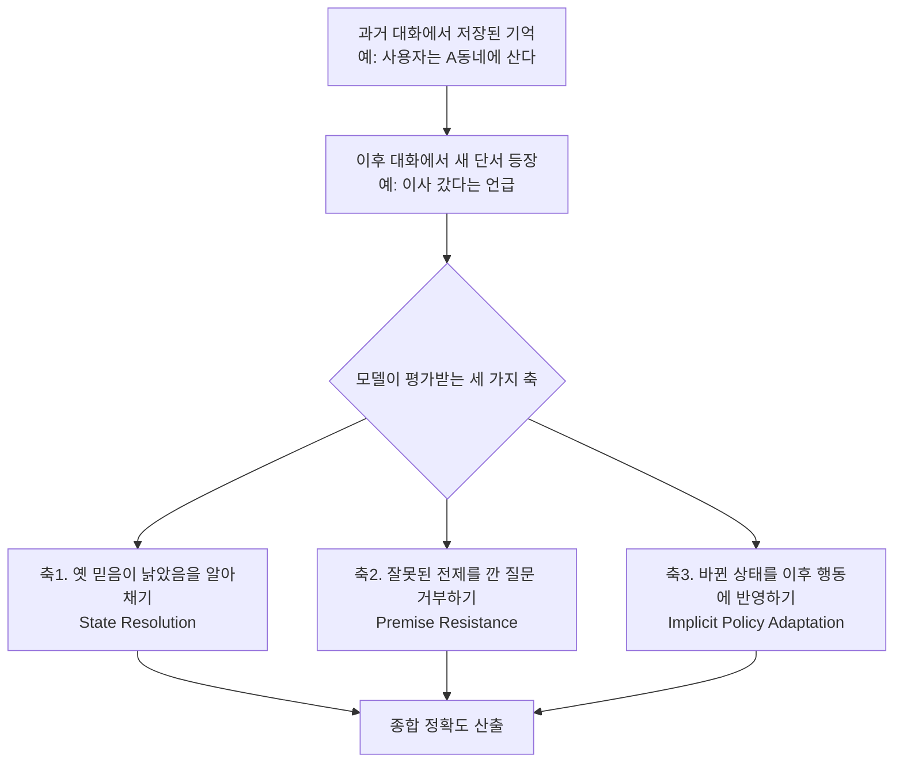

<aside class="ai-knowledge-sidebar">
  
CATEGORIES

  <nav class="ai-cat-tree">

에이전트 오케스트레이션5
<ul><li><a href="https://altjs4510.github.io/ai_news_blog/knowledge/20260707/">2026-07-07AI Hero Skills Catalog — 실무 엔지니어를 위한 재사용 가능한 판단 …</a></li><li><a href="https://altjs4510.github.io/ai_news_blog/knowledge/20260623/">2026-06-23bytedance/deer-flow — 샌드박스·메모리·서브에이전트·메시지 게이트웨이를…</a></li><li><a href="https://altjs4510.github.io/ai_news_blog/knowledge/20260602/">2026-06-02revfactory/harness — 도메인별 에이전트 팀과 스킬을 자동 설계하는 메타…</a></li><li><a href="https://altjs4510.github.io/ai_news_blog/knowledge/20260529/">2026-05-29Introducing dynamic workflows in Claude Code</a></li><li><a href="https://altjs4510.github.io/ai_news_blog/knowledge/20260507/">2026-05-07ruvnet/ruflo — Claude 멀티 에이전트 오케스트레이션 플랫폼</a></li></ul>

MCP &amp; 도구 통합15
<ul><li><a href="https://altjs4510.github.io/ai_news_blog/knowledge/20260729/">2026-07-29Bringing MCP 2026-07-28 to Claude</a></li><li><a href="https://altjs4510.github.io/ai_news_blog/knowledge/20260724/">2026-07-24diegosouzapw/OmniRoute — 단일 엔드포인트로 278+ 프로바이더·50…</a></li><li><a href="https://altjs4510.github.io/ai_news_blog/knowledge/20260721/">2026-07-21tirth8205/code-review-graph — 로컬 우선 코드 인텔리전스 그래프…</a></li><li><a href="https://altjs4510.github.io/ai_news_blog/knowledge/20260719/">2026-07-19tirth8205/code-review-graph — 로컬 우선 코드 인텔리전스 그래프…</a></li><li><a href="https://altjs4510.github.io/ai_news_blog/knowledge/20260718/">2026-07-18tirth8205/code-review-graph — MCP·CLI용 로컬 코드 인텔리…</a></li><li><a href="https://altjs4510.github.io/ai_news_blog/knowledge/20260709/">2026-07-09mvanhorn/last30days-skill — Reddit·X·YouTube·HN·…</a></li><li><a href="https://altjs4510.github.io/ai_news_blog/knowledge/20260708/">2026-07-08Expanding Managed Agents in Gemini API: backgrou…</a></li><li><a href="https://altjs4510.github.io/ai_news_blog/knowledge/20260618/">2026-06-18DeusData/codebase-memory-mcp — 158개 언어 코드베이스를 밀리…</a></li><li><a href="https://altjs4510.github.io/ai_news_blog/knowledge/20260606/">2026-06-06chopratejas/headroom — Compress tool outputs, lo…</a></li><li><a href="https://altjs4510.github.io/ai_news_blog/knowledge/20260605/">2026-06-05chopratejas/headroom — Compress tool outputs, lo…</a></li><li><a href="https://altjs4510.github.io/ai_news_blog/knowledge/20260604/">2026-06-04chopratejas/headroom — Compress tool outputs bef…</a></li><li><a href="https://altjs4510.github.io/ai_news_blog/knowledge/20260603/">2026-06-03How Bad MCP design cost your Agent 5× more token…</a></li><li><a href="https://altjs4510.github.io/ai_news_blog/knowledge/20260523/">2026-05-23colbymchenry/codegraph — 사전 인덱싱된 코드 지식 그래프 MCP</a></li><li><a href="https://altjs4510.github.io/ai_news_blog/knowledge/20260517/">2026-05-17I gave my LLM 100,000+ tools — Lazy Discovery &a…</a></li><li><a href="https://altjs4510.github.io/ai_news_blog/knowledge/20260509/">2026-05-09How to connect 100 MCP servers without the conte…</a></li></ul>

코딩 에이전트18
<ul><li><a href="https://altjs4510.github.io/ai_news_blog/knowledge/20260728/">2026-07-28alibaba/open-code-review — 결정론적 파이프라인 + LLM 에이전트…</a></li><li><a href="https://altjs4510.github.io/ai_news_blog/knowledge/20260725/">2026-07-25The new rules of context engineering for Claude …</a></li><li><a href="https://altjs4510.github.io/ai_news_blog/knowledge/20260722/">2026-07-22tirth8205/code-review-graph — MCP·CLI용 로컬 우선 코드 …</a></li><li><a href="https://altjs4510.github.io/ai_news_blog/knowledge/20260716/">2026-07-16Dicklesworthstone/destructive_command_guard — 에이…</a></li><li><a href="https://altjs4510.github.io/ai_news_blog/knowledge/20260714/">2026-07-14Graphify-Labs/graphify — 코드베이스를 질의 가능한 지식 그래프로 만…</a></li><li><a href="https://altjs4510.github.io/ai_news_blog/knowledge/20260705/">2026-07-05openai/codex-plugin-cc — Claude Code에서 Codex를 위임…</a></li><li><a href="https://altjs4510.github.io/ai_news_blog/knowledge/20260626/">2026-06-26google-labs-code/design.md — 코딩 에이전트에게 디자인 시스템을 …</a></li><li><a href="https://altjs4510.github.io/ai_news_blog/knowledge/20260619/">2026-06-19Claude Code now supports artifacts</a></li><li><a href="https://altjs4510.github.io/ai_news_blog/knowledge/20260530/">2026-05-30Leonxlnx/taste-skill — AI에게 좋은 취향을 부여해 generic s…</a></li><li><a href="https://altjs4510.github.io/ai_news_blog/knowledge/20260528/">2026-05-28Building self-improving tax agents with Codex</a></li><li><a href="https://altjs4510.github.io/ai_news_blog/knowledge/20260526/">2026-05-26colbymchenry/codegraph — Pre-indexed code knowle…</a></li><li><a href="https://altjs4510.github.io/ai_news_blog/knowledge/20260524/">2026-05-24colbymchenry/codegraph — Pre-indexed code knowle…</a></li><li><a href="https://altjs4510.github.io/ai_news_blog/knowledge/20260521/">2026-05-21colbymchenry/codegraph — Pre-indexed code knowle…</a></li><li><a href="https://altjs4510.github.io/ai_news_blog/knowledge/20260512/">2026-05-12agentmemory — Persistent memory for AI coding ag…</a></li><li><a href="https://altjs4510.github.io/ai_news_blog/knowledge/20260510/">2026-05-10addyosmani/agent-skills — Production-grade engin…</a></li><li><a href="https://altjs4510.github.io/ai_news_blog/knowledge/20260508/">2026-05-08addyosmani/agent-skills — Production-grade engin…</a></li><li><a href="https://altjs4510.github.io/ai_news_blog/knowledge/20260506/">2026-05-06mksglu/context-mode — AI 코딩 에이전트용 컨텍스트 윈도우 최적화</a></li><li><a href="https://altjs4510.github.io/ai_news_blog/knowledge/20260505/">2026-05-05mattpocock/skills — Skills for Real Engineers (.…</a></li></ul>

모델 &amp; 연구5
<ul><li><a href="https://altjs4510.github.io/ai_news_blog/knowledge/20260716-proprag/">2026-07-16PropRAG — 프로포지션 경로 위 beam search로 멀티홉 검색 안내</a></li><li><a href="https://altjs4510.github.io/ai_news_blog/knowledge/20260620/">2026-06-20zai-org/GLM-5 — From Vibe Coding to Agentic Engi…</a></li><li><a href="https://altjs4510.github.io/ai_news_blog/knowledge/20260617/">2026-06-17Predicting model behavior before release by simu…</a></li><li><a href="https://altjs4510.github.io/ai_news_blog/knowledge/20260516/" class="current">2026-05-16STALE — 에이전트가 자기 기억의 유효성을 인지할 수 있는가</a></li><li><a href="https://altjs4510.github.io/ai_news_blog/knowledge/20260513/">2026-05-13Thinking Machines' Native Interaction Models — T…</a></li></ul>

인프라 &amp; 컴퓨트5
<ul><li><a href="https://altjs4510.github.io/ai_news_blog/knowledge/20260723/">2026-07-23diegosouzapw/OmniRoute — 268+ 프로바이더를 단일 엔드포인트로 묶…</a></li><li><a href="https://altjs4510.github.io/ai_news_blog/knowledge/20260630/">2026-06-30Introducing the Claude apps gateway for Amazon B…</a></li><li><a href="https://altjs4510.github.io/ai_news_blog/knowledge/20260611/">2026-06-11The evolution of agentic surfaces: building with…</a></li><li><a href="https://altjs4510.github.io/ai_news_blog/knowledge/20260522/">2026-05-22Giving Agents Computers — Ivan Burazin, Daytona</a></li><li><a href="https://altjs4510.github.io/ai_news_blog/knowledge/20260520/">2026-05-20New in Claude Managed Agents: self-hosted sandbo…</a></li></ul>

보안 &amp; 거버넌스12
<ul><li><a href="https://altjs4510.github.io/ai_news_blog/knowledge/20260715/">2026-07-15Dicklesworthstone/destructive_command_guard — 에이…</a></li><li><a href="https://altjs4510.github.io/ai_news_blog/knowledge/20260710/">2026-07-1070개 MCP 서버 strace 런타임 감사 — 부팅 시 아웃바운드 호출 서버 적발</a></li><li><a href="https://altjs4510.github.io/ai_news_blog/knowledge/20260704/">2026-07-04Cloudflare is about to block AI agents by defaul…</a></li><li><a href="https://altjs4510.github.io/ai_news_blog/knowledge/20260703/">2026-07-03Giving admins more visibility and control over C…</a></li><li><a href="https://altjs4510.github.io/ai_news_blog/knowledge/20260625/">2026-06-25Agent identity in Claude Tag: a new access model…</a></li><li><a href="https://altjs4510.github.io/ai_news_blog/knowledge/20260624/">2026-06-24Agent identity in Claude Tag: a new access model…</a></li><li><a href="https://altjs4510.github.io/ai_news_blog/knowledge/20260614/">2026-06-14NVIDIA/SkillSpector — Security scanner for AI ag…</a></li><li><a href="https://altjs4510.github.io/ai_news_blog/knowledge/20260613/">2026-06-13Fable 5's guardrails got bypassed in 48 hours — …</a></li><li><a href="https://altjs4510.github.io/ai_news_blog/knowledge/20260612/">2026-06-12NVIDIA/SkillSpector — AI 에이전트 스킬용 보안 스캐너</a></li><li><a href="https://altjs4510.github.io/ai_news_blog/knowledge/20260607/">2026-06-07OpenAI Help: Lockdown Mode</a></li><li><a href="https://altjs4510.github.io/ai_news_blog/knowledge/20260531/">2026-05-31How we contain Claude across products</a></li><li><a href="https://altjs4510.github.io/ai_news_blog/knowledge/20260527/">2026-05-27Microsoft Copilot Cowork Exfiltrates Files</a></li></ul>

응용 사례7
<ul><li><a href="https://altjs4510.github.io/ai_news_blog/knowledge/20260726/">2026-07-26citrolabs/ego-lite — 로그인된 브라우저 상태를 AI 에이전트와 공유하는…</a></li><li><a href="https://altjs4510.github.io/ai_news_blog/knowledge/20260717/">2026-07-17After a year building agent memory, 'save everyt…</a></li><li><a href="https://altjs4510.github.io/ai_news_blog/knowledge/20260712/">2026-07-12Do Automated Evals Work?</a></li><li><a href="https://altjs4510.github.io/ai_news_blog/knowledge/20260621/">2026-06-21calesthio/OpenMontage — 12 파이프라인·52 도구·500+ 스킬을 …</a></li><li><a href="https://altjs4510.github.io/ai_news_blog/knowledge/20260609/">2026-06-09Building intelligent apps for Apple platforms wi…</a></li><li><a href="https://altjs4510.github.io/ai_news_blog/knowledge/20260515/">2026-05-15Clawdmeter — Claude Code 사용량을 데스크톱 대시보드로</a></li><li><a href="https://altjs4510.github.io/ai_news_blog/knowledge/20260514/">2026-05-14Introducing Claude for Small Business</a></li></ul>

산업 동향7
<ul><li><a href="https://altjs4510.github.io/ai_news_blog/knowledge/20260711/">2026-07-11OpenAI says GPT 5.6 is the 'preferred model' for…</a></li><li><a href="https://altjs4510.github.io/ai_news_blog/knowledge/20260702/">2026-07-02How Cursor deploys AI inside the enterprise (For…</a></li><li><a href="https://altjs4510.github.io/ai_news_blog/knowledge/20260701/">2026-07-01Google OKF (Open Knowledge Format) — 벤더 중립 에이전트 …</a></li><li><a href="https://altjs4510.github.io/ai_news_blog/knowledge/20260616/">2026-06-16Why AI hasn't replaced software engineers, and w…</a></li><li><a href="https://altjs4510.github.io/ai_news_blog/knowledge/20260610/">2026-06-10Fable 5 just made cost-aware model routing manda…</a></li><li><a href="https://altjs4510.github.io/ai_news_blog/knowledge/20260519/">2026-05-19Anthropic acquires Stainless</a></li><li><a href="https://altjs4510.github.io/ai_news_blog/knowledge/20260504/">2026-05-04Agents for Everything Else: Codex for Knowledge …</a></li></ul>
</nav>
</aside>

<article class="ai-knowledge-article">

<header class="ai-post-hero">
  
<a class="ai-back" href="../">KNOWLEDGE</a> · 2026-05-16 · 오늘의 학습

  <h2 class="ai-post-title">STALE — 에이전트가 자기 기억의 유효성을 인지할 수 있는가</h2>
</header>

> 원문: [STALE — 에이전트가 자기 기억의 유효성을 인지할 수 있는가](https://huggingface.co/papers/2605.06527)

## 📌 학습 정리

### 1. 한 줄로 말하면

사용자에 대해 기억해 둔 정보가 시간이 지나 더 이상 맞지 않게 됐을 때, 인공지능 비서가 "어, 이거 옛날 얘기네" 하고 스스로 알아챌 수 있는지를 시험하는 평가 모음이에요.

### 2. 왜 이게 만들어졌어요?

요즘 인공지능 비서(LLM 에이전트)는 사용자에 대해 오래 기억하면서 점점 더 개인화된 응답을 주는 방향으로 가고 있어요. 그런데 지금까지 나온 평가 방식들은 대부분 "예전에 저장해 둔 사실을 다시 꺼내올 수 있는가"만 측정해 왔습니다. 문제는 사람의 상황이 계속 바뀐다는 거예요. 이사를 갔거나, 반려동물을 더는 키우지 않거나, 직업이 바뀌면 예전 메모는 무효가 되거든요. 저자들은 특히 **누가 명시적으로 "그거 취소해"라고 말하지 않아도, 새 대화 내용으로부터 옛 기억이 더는 유효하지 않다는 걸 추론해야 하는 상황**을 "암묵적 충돌(Implicit Conflict)"이라 부르며, 이걸 정면으로 평가할 도구가 없었다는 점을 짚어요.

### 3. 비유로 풀면

이건 마치 오래된 주소록을 들고 다니는 친구 같아요. 친구가 "너 아직 그 동네 살지? 거기 ○○ 카페 갈래?"라고 묻는데, 사실 당신은 지난달에 이미 다른 도시로 이사했다고 흘리듯 말한 적이 있는 상황이죠. 좋은 친구라면 그 단서를 떠올리고 "아, 너 이사 갔지, 그럼 거기 근처로 알아볼게"라고 반응할 거예요. 그래서 결국 STALE이 보는 것은, 인공지능이 단순히 메모를 잘 저장·검색하는 수준을 넘어 **그 메모가 지금도 유효한지 스스로 판단하고 행동을 바꿀 수 있는가**입니다.

### 4. 어떻게 작동하는지 (그림으로)

흐름을 풀면 이래요. 평가 데이터에는 **이전 기억 + 그걸 무효로 만드는 새 정보**가 함께 들어 있고, 모델은 같은 시나리오에 대해 세 가지 다른 각도의 질문을 받습니다. 옛 정보가 낡았다는 걸 인지하는지, 사용자가 옛 전제를 깔고 질문해도 휘말리지 않는지, 그리고 후속 추천·답변에 새 상태를 자연스럽게 반영하는지를 각각 따로 채점해서 합산하는 구조예요.

벤치마크 규모는 전문가 검수를 거친 충돌 시나리오 400개, 평가 질의 1,200개(시나리오당 세 축 × 1)이고, 일상 주제 100가지 이상을 다루며 맥락 길이는 최대 15만 토큰까지 길어집니다. 결과를 보면 가장 잘하는 모델조차 전체 정확도가 55.2%에 그쳐요. 특히 **사용자 질문 안에 슬쩍 깔려 있는 낡은 가정을 그대로 받아들이는 실수**, 그리고 **사용자 상태의 한 부분이 바뀌면 그와 연결된 다른 기억도 같이 무효가 되어야 한다는 걸 못 알아채는 실수**가 흔하게 나타났다고 합니다.

마지막으로 저자들은 이 문제를 풀어보는 첫 시도로 CUPMem이라는 시제품 메모리 시스템을 함께 제시해요. 핵심 아이디어는 두 가지예요. 하나는 메모리에 새 정보를 쓸 때 단순히 추가만 하지 않고 **사용자 상태를 구조화해서 정리·갱신**하는 것, 다른 하나는 검색할 때도 **하나의 변화가 다른 메모리에 미치는 파급을 함께 따져보는 방식**으로 가져오는 것입니다.

### 5. 처음 보는 용어 풀이

- **개인화된 장기 기억 (personalized memory)** — 인공지능 비서가 사용자에 대해 알게 된 사실(취향, 상황, 관계 등)을 세션을 넘어 계속 저장해 두는 메모를 말해요. 다음 대화에서 같은 얘기를 또 하지 않게 해 주는 역할이죠.
- **암묵적 충돌 (Implicit Conflict)** — "취소해"처럼 대놓고 부정하는 말 없이, 새 대화 내용을 읽어보면 자연스럽게 옛 기억이 무효가 된다는 걸 추론해야 하는 상황입니다. 이 논문의 출발점이 되는 실패 유형이에요.
- **상태 해소 (State Resolution)** — 저장돼 있던 옛 믿음이 지금은 더 이상 맞지 않는다는 걸 모델이 인지하는 능력. 세 평가 축 중 첫 번째예요.
- **전제 저항 (Premise Resistance)** — 사용자가 낡은 사실을 당연한 것처럼 깔고 질문해도, 그 전제를 그대로 따라가지 않고 바로잡는 능력입니다. 예: "내 강아지 산책 코스 추천해 줘" 라고 묻는데 사실은 강아지를 더 이상 키우지 않는 경우.
- **암묵적 정책 적응 (Implicit Policy Adaptation)** — 누가 시키지 않아도, 바뀐 사용자 상태를 이후 추천·제안 같은 행동에 알아서 반영하는 능력. 단순히 "알았다"가 아니라 다음 행동이 실제로 달라져야 합니다.
- **CUPMem** — 저자들이 함께 제안한 프로토타입 메모리 시스템 이름. 메모를 쓸 때 사용자 상태를 정돈해 합치고, 검색할 때 변경의 파급 효과까지 고려하는 방식으로 동작해요.
- **구조화된 상태 통합 (structured state consolidation)** — 메모를 그냥 쌓아 두지 않고, 사용자에 관한 사실들을 정리된 상태값으로 묶어 새 정보가 들어올 때 기존 항목을 갱신·정리하는 처리 방식입니다.
- **파급 인지 검색 (propagation-aware search)** — 한 가지 사실이 바뀌면 그것과 연관된 다른 메모도 영향을 받을 수 있다는 점을 검색 단계에서 같이 따지는 방법이에요.

### 6. 한 발 더 들어가고 싶다면

- [arXiv 페이지](https://arxiv.org/abs/2605.06527) — 논문의 정식 초록과 메타 정보를 확인할 수 있어요.
- [PDF 원문](https://arxiv.org/pdf/2605.06527) — 세 가지 평가 축의 구체적 예시와 CUPMem 구조를 그림과 함께 볼 수 있어요.
- [개인화된 메모리 관련 논문 모음](https://huggingface.co/papers?q=personalized%20memory) — 같은 주제로 묶인 다른 연구들을 한꺼번에 훑어보고 싶을 때 유용합니다.

---

## 📖 원문 전체 번역 (정독용)

> 의역 최소화한 전체 번역입니다. 큰 흐름은 위 정리에서 잡고, 정확한 워딩이 필요할 땐 이 섹션에서 정독하세요.

# STALE — 에이전트가 자기 기억의 유효성을 인지할 수 있는가

2025년 5월 7일 게재

## 초록

대형 언어 모델은 새로운 증거가 등장할 때 개인화된 기억을 갱신하는 데 어려움을 겪으며, 이는 암묵적 충돌을 감지하기 위해 문맥적 추론과 상식 추론을 요구한다는 사실이 포괄적인 벤치마크와 상태 인식 메모리 시스템 평가를 통해 입증되었다.

*(AI 생성 요약)*

대형 언어 모델(LLM) 에이전트는 일관되고 장기적인 개인화된 기억(personalized memory)을 유지하도록 점점 더 많이 요구받고 있으나, 현재의 벤치마크들은 주로 정적인 사실 검색만을 측정하고, 새로운 증거가 등장했을 때 저장된 믿음을 수정하는 능력은 간과하고 있다. 우리는 **암묵적 충돌(Implicit Conflict)**이라는 중요하고 아직 충분히 탐구되지 않은 실패 모드를 식별했다: 이후의 관찰이 명시적 부정 없이 이전 기억을 무효화하는 상황으로, 이를 감지하려면 문맥적 추론과 상식 추론이 필요하다. 이 능력을 엄밀하게 평가하기 위해 우리는 **STALE**을 제안한다. STALE은 400개의 전문가 검증 충돌 시나리오(세 가지 탐색 차원에 걸쳐 1,200개의 평가 쿼리)로 구성된 벤치마크로, 최대 150K 토큰의 문맥을 가진 100개 이상의 일상적 주제를 다룬다. 우리는 세 가지 차원의 탐색 프레임워크를 제안한다: **상태 해소(State Resolution)**(이전 믿음이 outdated되었음을 감지), **전제 저항(Premise Resistance)**(오래된 상태를 거짓으로 전제하는 쿼리를 거부), **암묵적 정책 적응(Implicit Policy Adaptation)**(갱신된 상태를 하위 행동에 선제적으로 적용). 최첨단 LLM과 특화된 메모리 프레임워크에 대한 체계적 평가 결과, 갱신된 증거를 검색하는 것과 그에 따라 실제로 행동하는 것 사이에 만연한 격차가 드러났으며, 가장 우수한 평가 모델조차 전체 정확도 55.2%에 그쳤다. 모델들은 사용자의 쿼리에 내재된 outdated된 가정을 종종 수용하며, 사용자 상태의 한 측면이 변화했을 때 관련 기억들이 무효화되어야 함을 인식하는 데 어려움을 겪는다. 상태 인식 메모리의 초기 기준선을 수립하기 위해, 우리는 추가로 **CUPMem**을 제시한다. CUPMem은 구조화된 상태 통합(structured state consolidation)과 전파 인식 검색(propagation-aware search)을 통해 쓰기 시점의 수정을 강화하는 프로토타입으로, 명시적인 상태 판정(state adjudication)이 견고한 에이전트 메모리를 위한 유망한 방향임을 시사한다.

---

## 이 논문을 인용한 모델 0

이 논문을 연결한 모델 없음

이 페이지에서 연결하려면 모델 README.md에 arxiv.org/abs/2605.06527을 인용하세요.

## 이 논문을 인용한 데이터셋 0

이 논문을 연결한 데이터셋 없음

이 페이지에서 연결하려면 데이터셋 README.md에 arxiv.org/abs/2605.06527을 인용하세요.

### 이 논문을 인용한 Space 1

### 이 논문을 포함한 컬렉션 0

이 논문을 포함한 컬렉션 없음

이 페이지에서 연결하려면 이 논문을 [컬렉션](https://huggingface.co/new-collection)에 추가하세요.

</article>

<!-- ai-related-links -->
<aside class="ai-related-links">
  
관련 학습

  <ul><li><a href="https://altjs4510.github.io/ai_news_blog/knowledge/20260512/">2026-05-12agentmemory — Persistent memory for AI coding ag…</a></li><li><a href="https://altjs4510.github.io/ai_news_blog/knowledge/20260506/">2026-05-06mksglu/context-mode — AI 코딩 에이전트용 컨텍스트 윈도우 최적화</a></li></ul>
</aside>
<!-- /ai-related-links -->
