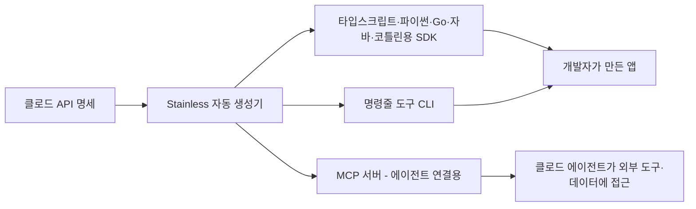

<aside class="ai-knowledge-sidebar">
  
CATEGORIES

  <nav class="ai-cat-tree">

에이전트 오케스트레이션8
<ul><li><a href="https://altjs4510.github.io/ai_news_blog/knowledge/20260623/">2026-06-23bytedance/deer-flow — 샌드박스·메모리·서브에이전트·메시지 게이트웨이를…</a></li><li><a href="https://altjs4510.github.io/ai_news_blog/knowledge/20260621/">2026-06-21calesthio/OpenMontage — 12 파이프라인·52 도구·500+ 스킬을 …</a></li><li><a href="https://altjs4510.github.io/ai_news_blog/knowledge/20260611/">2026-06-11The evolution of agentic surfaces: building with…</a></li><li><a href="https://altjs4510.github.io/ai_news_blog/knowledge/20260602/">2026-06-02revfactory/harness — 도메인별 에이전트 팀과 스킬을 자동 설계하는 메타…</a></li><li><a href="https://altjs4510.github.io/ai_news_blog/knowledge/20260529/">2026-05-29Introducing dynamic workflows in Claude Code</a></li><li><a href="https://altjs4510.github.io/ai_news_blog/knowledge/20260520/">2026-05-20New in Claude Managed Agents: self-hosted sandbo…</a></li><li><a href="https://altjs4510.github.io/ai_news_blog/knowledge/20260507/">2026-05-07ruvnet/ruflo — Claude 멀티 에이전트 오케스트레이션 플랫폼</a></li><li><a href="https://altjs4510.github.io/ai_news_blog/knowledge/20260504/">2026-05-04Agents for Everything Else: Codex for Knowledge …</a></li></ul>

MCP &amp; 도구 통합9
<ul><li><a href="https://altjs4510.github.io/ai_news_blog/knowledge/20260618/">2026-06-18DeusData/codebase-memory-mcp — 158개 언어 코드베이스를 밀리…</a></li><li><a href="https://altjs4510.github.io/ai_news_blog/knowledge/20260604/">2026-06-04chopratejas/headroom — Compress tool outputs bef…</a></li><li><a href="https://altjs4510.github.io/ai_news_blog/knowledge/20260603/">2026-06-03How Bad MCP design cost your Agent 5× more token…</a></li><li><a href="https://altjs4510.github.io/ai_news_blog/knowledge/20260526/">2026-05-26colbymchenry/codegraph — Pre-indexed code knowle…</a></li><li><a href="https://altjs4510.github.io/ai_news_blog/knowledge/20260523/">2026-05-23colbymchenry/codegraph — 사전 인덱싱된 코드 지식 그래프 MCP</a></li><li><a href="https://altjs4510.github.io/ai_news_blog/knowledge/20260521/">2026-05-21colbymchenry/codegraph — Pre-indexed code knowle…</a></li><li><a href="https://altjs4510.github.io/ai_news_blog/knowledge/20260519/" class="current">2026-05-19Anthropic acquires Stainless</a></li><li><a href="https://altjs4510.github.io/ai_news_blog/knowledge/20260517/">2026-05-17I gave my LLM 100,000+ tools — Lazy Discovery &a…</a></li><li><a href="https://altjs4510.github.io/ai_news_blog/knowledge/20260509/">2026-05-09How to connect 100 MCP servers without the conte…</a></li></ul>

코딩 에이전트10
<ul><li><a href="https://altjs4510.github.io/ai_news_blog/knowledge/20260626/">2026-06-26google-labs-code/design.md — 코딩 에이전트에게 디자인 시스템을 …</a></li><li><a href="https://altjs4510.github.io/ai_news_blog/knowledge/20260619/">2026-06-19Claude Code now supports artifacts</a></li><li><a href="https://altjs4510.github.io/ai_news_blog/knowledge/20260530/">2026-05-30Leonxlnx/taste-skill — AI에게 좋은 취향을 부여해 generic s…</a></li><li><a href="https://altjs4510.github.io/ai_news_blog/knowledge/20260528/">2026-05-28Building self-improving tax agents with Codex</a></li><li><a href="https://altjs4510.github.io/ai_news_blog/knowledge/20260524/">2026-05-24colbymchenry/codegraph — Pre-indexed code knowle…</a></li><li><a href="https://altjs4510.github.io/ai_news_blog/knowledge/20260512/">2026-05-12agentmemory — Persistent memory for AI coding ag…</a></li><li><a href="https://altjs4510.github.io/ai_news_blog/knowledge/20260510/">2026-05-10addyosmani/agent-skills — Production-grade engin…</a></li><li><a href="https://altjs4510.github.io/ai_news_blog/knowledge/20260508/">2026-05-08addyosmani/agent-skills — Production-grade engin…</a></li><li><a href="https://altjs4510.github.io/ai_news_blog/knowledge/20260506/">2026-05-06mksglu/context-mode — AI 코딩 에이전트용 컨텍스트 윈도우 최적화</a></li><li><a href="https://altjs4510.github.io/ai_news_blog/knowledge/20260505/">2026-05-05mattpocock/skills — Skills for Real Engineers (.…</a></li></ul>

모델 &amp; 연구4
<ul><li><a href="https://altjs4510.github.io/ai_news_blog/knowledge/20260620/">2026-06-20zai-org/GLM-5 — From Vibe Coding to Agentic Engi…</a></li><li><a href="https://altjs4510.github.io/ai_news_blog/knowledge/20260617/">2026-06-17Predicting model behavior before release by simu…</a></li><li><a href="https://altjs4510.github.io/ai_news_blog/knowledge/20260516/">2026-05-16STALE — 에이전트가 자기 기억의 유효성을 인지할 수 있는가</a></li><li><a href="https://altjs4510.github.io/ai_news_blog/knowledge/20260513/">2026-05-13Thinking Machines' Native Interaction Models — T…</a></li></ul>

인프라 &amp; 컴퓨트4
<ul><li><a href="https://altjs4510.github.io/ai_news_blog/knowledge/20260610/">2026-06-10Fable 5 just made cost-aware model routing manda…</a></li><li><a href="https://altjs4510.github.io/ai_news_blog/knowledge/20260606/">2026-06-06chopratejas/headroom — Compress tool outputs, lo…</a></li><li><a href="https://altjs4510.github.io/ai_news_blog/knowledge/20260605/">2026-06-05chopratejas/headroom — Compress tool outputs, lo…</a></li><li><a href="https://altjs4510.github.io/ai_news_blog/knowledge/20260522/">2026-05-22Giving Agents Computers — Ivan Burazin, Daytona</a></li></ul>

보안 &amp; 거버넌스8
<ul><li><a href="https://altjs4510.github.io/ai_news_blog/knowledge/20260625/">2026-06-25Agent identity in Claude Tag: a new access model…</a></li><li><a href="https://altjs4510.github.io/ai_news_blog/knowledge/20260624/">2026-06-24Agent identity in Claude Tag: a new access model…</a></li><li><a href="https://altjs4510.github.io/ai_news_blog/knowledge/20260614/">2026-06-14NVIDIA/SkillSpector — Security scanner for AI ag…</a></li><li><a href="https://altjs4510.github.io/ai_news_blog/knowledge/20260613/">2026-06-13Fable 5's guardrails got bypassed in 48 hours — …</a></li><li><a href="https://altjs4510.github.io/ai_news_blog/knowledge/20260612/">2026-06-12NVIDIA/SkillSpector — AI 에이전트 스킬용 보안 스캐너</a></li><li><a href="https://altjs4510.github.io/ai_news_blog/knowledge/20260607/">2026-06-07OpenAI Help: Lockdown Mode</a></li><li><a href="https://altjs4510.github.io/ai_news_blog/knowledge/20260531/">2026-05-31How we contain Claude across products</a></li><li><a href="https://altjs4510.github.io/ai_news_blog/knowledge/20260527/">2026-05-27Microsoft Copilot Cowork Exfiltrates Files</a></li></ul>

응용 사례3
<ul><li><a href="https://altjs4510.github.io/ai_news_blog/knowledge/20260609/">2026-06-09Building intelligent apps for Apple platforms wi…</a></li><li><a href="https://altjs4510.github.io/ai_news_blog/knowledge/20260515/">2026-05-15Clawdmeter — Claude Code 사용량을 데스크톱 대시보드로</a></li><li><a href="https://altjs4510.github.io/ai_news_blog/knowledge/20260514/">2026-05-14Introducing Claude for Small Business</a></li></ul>

산업 동향1
<ul><li><a href="https://altjs4510.github.io/ai_news_blog/knowledge/20260616/">2026-06-16Why AI hasn't replaced software engineers, and w…</a></li></ul>
</nav>
</aside>

<article class="ai-knowledge-article">

<header class="ai-post-hero">
  
<a class="ai-back" href="../">KNOWLEDGE</a> · 2026-05-19 · 오늘의 학습

  <h2 class="ai-post-title">Anthropic acquires Stainless</h2>
</header>

> 원문: [Anthropic acquires Stainless](https://www.anthropic.com/news/anthropic-acquires-stainless)

## 📌 학습 정리

### 1. 한 줄로 말하면

API를 만들면 자동으로 따라오던 "개발자용 편의 도구"를 만들어 주던 회사를 Anthropic이 품에 안았다는 소식이에요. 앞으로 클로드(Claude)를 다른 시스템과 연결하는 길이 더 매끄러워진다는 신호예요.

### 2. 왜 이게 만들어졌어요?

원래 인공지능(AI)은 "질문하면 답해 주는" 모델 중심이었는데, 요즘은 모델이 직접 일을 처리하는 에이전트(agent) 쪽으로 무게가 옮겨가고 있어요. 그런데 에이전트는 결국 외부 시스템(데이터베이스, 사내 도구, 다른 서비스)에 손을 뻗을 수 있어야 쓸모가 생겨요. 그 "손을 뻗는 통로"가 바로 소프트웨어 개발 키트(SDK), 명령줄 도구(CLI), 그리고 모델 컨텍스트 프로토콜 서버(MCP server)인데, 이걸 회사마다 손으로 만들면 품이 너무 많이 들고 언어별로 품질도 들쭉날쭉해져요. Stainless는 이 통로들을 API 명세 한 벌에서 자동으로 뽑아내 주는 회사라, Anthropic이 이 팀을 직접 합류시켜 클로드의 연결성을 한 단계 끌어올리려는 거예요.

### 3. 비유로 풀면

이건 마치 식당이 "맛있는 요리(API)"를 만들었는데, 손님 테이블까지 음식을 깔끔하게 나르는 "서빙 동선과 식기 세트(SDK)"를 외주 전문 업체가 도맡아 만들어 주던 상황과 비슷해요. 그동안 그 외주 업체에 일을 맡겨 왔는데, 이제 아예 같은 회사로 들여서 주방과 서빙 시스템을 한 몸으로 굴리겠다는 거죠.

그래서 결국, 클로드의 API라는 "요리"를 여러 프로그래밍 언어와 도구라는 "식기"에 담아 내는 일이 같은 팀 안에서 더 빠르고 일관되게 이뤄질 거라는 뜻이에요.

### 4. 어떻게 작동하는지 (그림으로)

Anthropic이 클로드 API의 명세(어떤 기능이 있고 어떻게 부르는지 적은 설계도)를 Stainless에 넘기면, Stainless의 자동 생성 엔진이 여러 언어용 SDK와 CLI, MCP 서버를 한꺼번에 뽑아내 줘요. 개발자는 자기가 쓰는 언어에 자연스럽게 맞춰진 라이브러리를 받고, 에이전트는 MCP 서버를 통해 외부 데이터·도구에 손을 뻗을 수 있게 되는 흐름이에요.

### 5. 처음 보는 용어 풀이

- **소프트웨어 개발 키트 (SDK)** — 어떤 서비스의 기능을 특정 프로그래밍 언어에서 쉽게 갖다 쓸 수 있게 미리 포장해 둔 코드 묶음이에요. 매번 통신 코드를 직접 짜지 않아도 되도록 도와줘요.
- **명령줄 도구 (CLI)** — 검은 화면(터미널)에 명령어를 쳐서 서비스를 부려 쓰는 도구예요. 자동화 스크립트나 빠른 테스트에 유용해요.
- **API 명세 (API spec)** — 어떤 서비스가 어떤 기능을 가지고 있고 어떻게 호출해야 하는지 적어 둔 설계도 같은 문서예요. 이 문서가 정확해야 SDK를 자동 생성할 수 있어요.
- **에이전트 (agent)** — 사람이 일일이 시키지 않아도 목표를 받아서 스스로 도구를 골라 쓰고 행동까지 하는 AI를 말해요. 답만 하던 챗봇에서 한 발 더 나간 형태예요.
- **모델 컨텍스트 프로토콜 (MCP, Model Context Protocol)** — AI 모델(에이전트)이 외부 데이터·도구와 표준화된 방식으로 연결되도록 Anthropic이 만든 약속이에요. 도구마다 제각기 연결법을 만들 필요 없이 공용 규격을 따르게 해요.
- **MCP 서버 (MCP server)** — 위의 약속을 따라 "이 도구는 이렇게 쓰면 된다"고 에이전트에 알려 주는 작은 중개자예요. 에이전트가 실제 시스템에 닿게 해 주는 다리 역할을 해요.
- **클로드 플랫폼 (Claude Platform)** — Anthropic이 클로드를 중심으로 묶어 놓은 개발자용 환경 전체를 가리키는 말이에요. API, SDK, 연결 도구가 모두 이 안에 들어와요.

### 6. 한 발 더 들어가고 싶다면

- [PwC가 클로드를 도입해 기업 업무를 재설계한다는 소식](https://www.anthropic.com/news/pwc-expanded-partnership) — 이걸 보면 클로드와 클로드 코드(Claude Code)가 실제 대형 기업 현장에 어떻게 깔리는지 감을 잡을 수 있어요.
- [Anthropic과 게이츠 재단의 2억 달러 파트너십](https://www.anthropic.com/news/gates-foundation-partnership) — 이걸 보면 Anthropic이 상업 영역 외에 어떤 방향으로 협력을 넓히는지 엿볼 수 있어요.
- [소상공인을 위한 클로드(Claude for Small Business) 소개](https://www.anthropic.com/news/claude-for-small-business) — 이걸 보면 "연결자(커넥터)와 즉시 쓰는 워크플로"라는 개념이 실제 제품에서 어떻게 구체화되는지 볼 수 있어요.

---

## 📖 원문 전체 번역 (정독용)

> 의역 최소화한 전체 번역입니다. 큰 흐름은 위 정리에서 잡고, 정확한 워딩이 필요할 땐 이 섹션에서 정독하세요.

AI의 최전선은 질문에 답하는 모델에서 행동하는 에이전트로 이동하고 있으며, 에이전트의 역량은 그것이 연결할 수 있는 시스템에 달려 있습니다. 오늘 Anthropic은 SDK 및 MCP 서버 툴링 분야의 선두주자인 Stainless를 인수하여 그 연결 범위를 한층 더 확장합니다.

2022년에 설립된 Stainless는 Anthropic API 초창기부터 모든 공식 Anthropic SDK 생성을 지원해 왔습니다. 수백 개의 기업이 Stainless를 통해 SDK, CLI, MCP 서버—즉 개발자와 에이전트가 API를 사용할 수 있게 해주는 라이브러리, 커맨드라인 툴, 커넥터—를 생성하고 있습니다. Stainless는 API 스펙을 TypeScript, Python, Go, Java, Kotlin 등 다양한 언어의 SDK로 변환합니다. 각 SDK는 빠르고 안정적이며, 해당 언어에서 네이티브처럼 느껴지도록 설계되어 있습니다.

"Stainless는 처음부터 개발자들이 Claude API를 경험하는 방식을 만들어왔으며, 함께 협력해온 것이 매우 좋은 경험이었습니다,"라고 Anthropic의 플랫폼 엔지니어링 책임자인 Katelyn Lesse가 말했습니다. "에이전트는 연결할 수 있는 대상이 많을수록 유용합니다. Stainless 팀을 Anthropic에 합류시켜 Claude가 데이터와 툴에 연결하는 능력을 발전시키게 되어 기대가 큽니다."

"저는 SDK가 그것이 감싸는 API만큼 세심한 관리를 받을 자격이 있다는 믿음으로 Stainless를 창업했습니다. Anthropic은 이 철학에 처음으로 베팅한 팀 중 하나였습니다,"라고 Stainless의 창업자 겸 CEO인 Alex Rattray가 말했습니다. "지난 몇 년간 개발자들이 Claude 위에서 무엇을 만들어왔는지 지켜봐 왔고, 그것이 두 팀을 하나로 합치는 결정을 쉽게 만들었습니다. 우리 팀은 가장 중요한 플랫폼 위에서 우리가 사랑하는 일을 계속할 수 있게 되었습니다."

Anthropic은 에이전트 연결성을 가능하게 하기 위해 MCP를 만들었습니다. Stainless와 Anthropic 팀을 하나로 합침으로써, Claude 플랫폼은 개발자 경험과 에이전트 연결성의 최전선을 계속해서 개척해 나갈 것입니다.

## 관련 콘텐츠

### PwC가 Claude를 도입하여 고객을 위한 기술 구축, 딜 실행, 엔터프라이즈 기능 혁신에 나서다

PwC는 미국 팀을 시작으로 수십만 명의 전 세계 임직원으로 확장하며 Claude Code와 Cowork를 도입하고, 공동 Center of Excellence를 설립하며, 3만 명의 PwC 전문가를 Claude 관련 교육 및 인증 프로그램에 참여시킬 예정입니다.

[더 읽기](https://www.anthropic.com/news/pwc-expanded-partnership)

### Anthropic, Gates Foundation과 2억 달러 규모의 파트너십 체결

[더 읽기](https://www.anthropic.com/news/gates-foundation-partnership)

### 소규모 비즈니스를 위한 Claude 소개

소규모 비즈니스가 매일 사용하는 툴 안에 Claude를 바로 적용할 수 있는 커넥터와 바로 실행 가능한 워크플로우 패키지인 Claude for Small Business를 출시합니다.

[더 읽기](https://www.anthropic.com/news/claude-for-small-business)

</article>

<!-- ai-related-links -->
<aside class="ai-related-links">
  
관련 학습

  <ul><li><a href="https://altjs4510.github.io/ai_news_blog/knowledge/20260517/">2026-05-17I gave my LLM 100,000+ tools — Lazy Discovery &a…</a></li><li><a href="https://altjs4510.github.io/ai_news_blog/knowledge/20260509/">2026-05-09How to connect 100 MCP servers without the conte…</a></li></ul>
</aside>
<!-- /ai-related-links -->
