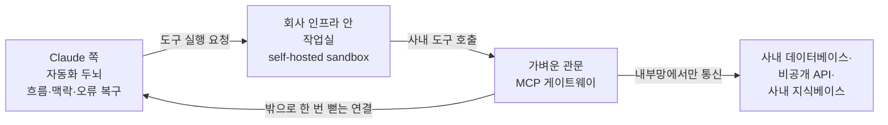

<aside class="ai-knowledge-sidebar">
  
CATEGORIES

  <nav class="ai-cat-tree">

에이전트 오케스트레이션5
<ul><li><a href="https://altjs4510.github.io/ai_news_blog/knowledge/20260602/">2026-06-02revfactory/harness — 도메인별 에이전트 팀과 스킬을 자동 설계하는 메타…</a></li><li><a href="https://altjs4510.github.io/ai_news_blog/knowledge/20260529/">2026-05-29Introducing dynamic workflows in Claude Code</a></li><li><a href="https://altjs4510.github.io/ai_news_blog/knowledge/20260520/" class="current">2026-05-20New in Claude Managed Agents: self-hosted sandbo…</a></li><li><a href="https://altjs4510.github.io/ai_news_blog/knowledge/20260507/">2026-05-07ruvnet/ruflo — Claude 멀티 에이전트 오케스트레이션 플랫폼</a></li><li><a href="https://altjs4510.github.io/ai_news_blog/knowledge/20260504/">2026-05-04Agents for Everything Else: Codex for Knowledge …</a></li></ul>

MCP &amp; 도구 통합6
<ul><li><a href="https://altjs4510.github.io/ai_news_blog/knowledge/20260526/">2026-05-26colbymchenry/codegraph — Pre-indexed code knowle…</a></li><li><a href="https://altjs4510.github.io/ai_news_blog/knowledge/20260523/">2026-05-23colbymchenry/codegraph — 사전 인덱싱된 코드 지식 그래프 MCP</a></li><li><a href="https://altjs4510.github.io/ai_news_blog/knowledge/20260521/">2026-05-21colbymchenry/codegraph — Pre-indexed code knowle…</a></li><li><a href="https://altjs4510.github.io/ai_news_blog/knowledge/20260519/">2026-05-19Anthropic acquires Stainless</a></li><li><a href="https://altjs4510.github.io/ai_news_blog/knowledge/20260517/">2026-05-17I gave my LLM 100,000+ tools — Lazy Discovery &a…</a></li><li><a href="https://altjs4510.github.io/ai_news_blog/knowledge/20260509/">2026-05-09How to connect 100 MCP servers without the conte…</a></li></ul>

코딩 에이전트8
<ul><li><a href="https://altjs4510.github.io/ai_news_blog/knowledge/20260530/">2026-05-30Leonxlnx/taste-skill — AI에게 좋은 취향을 부여해 generic s…</a></li><li><a href="https://altjs4510.github.io/ai_news_blog/knowledge/20260528/">2026-05-28Building self-improving tax agents with Codex</a></li><li><a href="https://altjs4510.github.io/ai_news_blog/knowledge/20260524/">2026-05-24colbymchenry/codegraph — Pre-indexed code knowle…</a></li><li><a href="https://altjs4510.github.io/ai_news_blog/knowledge/20260512/">2026-05-12agentmemory — Persistent memory for AI coding ag…</a></li><li><a href="https://altjs4510.github.io/ai_news_blog/knowledge/20260510/">2026-05-10addyosmani/agent-skills — Production-grade engin…</a></li><li><a href="https://altjs4510.github.io/ai_news_blog/knowledge/20260508/">2026-05-08addyosmani/agent-skills — Production-grade engin…</a></li><li><a href="https://altjs4510.github.io/ai_news_blog/knowledge/20260506/">2026-05-06mksglu/context-mode — AI 코딩 에이전트용 컨텍스트 윈도우 최적화</a></li><li><a href="https://altjs4510.github.io/ai_news_blog/knowledge/20260505/">2026-05-05mattpocock/skills — Skills for Real Engineers (.…</a></li></ul>

모델 &amp; 연구2
<ul><li><a href="https://altjs4510.github.io/ai_news_blog/knowledge/20260516/">2026-05-16STALE — 에이전트가 자기 기억의 유효성을 인지할 수 있는가</a></li><li><a href="https://altjs4510.github.io/ai_news_blog/knowledge/20260513/">2026-05-13Thinking Machines' Native Interaction Models — T…</a></li></ul>

인프라 &amp; 컴퓨트1
<ul><li><a href="https://altjs4510.github.io/ai_news_blog/knowledge/20260522/">2026-05-22Giving Agents Computers — Ivan Burazin, Daytona</a></li></ul>

보안 &amp; 거버넌스2
<ul><li><a href="https://altjs4510.github.io/ai_news_blog/knowledge/20260531/">2026-05-31How we contain Claude across products</a></li><li><a href="https://altjs4510.github.io/ai_news_blog/knowledge/20260527/">2026-05-27Microsoft Copilot Cowork Exfiltrates Files</a></li></ul>

응용 사례2
<ul><li><a href="https://altjs4510.github.io/ai_news_blog/knowledge/20260515/">2026-05-15Clawdmeter — Claude Code 사용량을 데스크톱 대시보드로</a></li><li><a href="https://altjs4510.github.io/ai_news_blog/knowledge/20260514/">2026-05-14Introducing Claude for Small Business</a></li></ul>
</nav>
</aside>

<article class="ai-knowledge-article">

<header class="ai-post-hero">
  
<a class="ai-back" href="../">KNOWLEDGE</a> · 2026-05-20 · 오늘의 학습

  <h2 class="ai-post-title">New in Claude Managed Agents: self-hosted sandboxes and MCP tunnels</h2>
</header>

> 원문: [New in Claude Managed Agents: self-hosted sandboxes and MCP tunnels](https://claude.com/blog/claude-managed-agents-updates)

## 📌 학습 정리

### 1. 한 줄로 말하면

Claude가 대신 굴려주는 자동화 비서를, 회사 담장 안쪽 작업실에서 일하게 하고 회사 내부 자료실에도 안전하게 드나들 수 있게 해주는 기능이에요.

### 2. 왜 이게 만들어졌어요?

원래는 Claude가 관리해주는 자동 일꾼(Managed Agents)이 도구를 실행할 때, 그 작업이 일어나는 작은 작업 공간(sandbox)도 Claude 쪽 인프라에서 돌아갔어요. 그런데 회사 입장에서는 민감한 파일이나 내부 코드, 사내 데이터베이스를 다루는 일을 외부 환경에서 처리하게 두는 게 부담스러웠죠. 또 사내에만 열려 있는 도구 서버에 자동 일꾼이 접근하려면, 그 서버를 외부 인터넷에 노출하거나 방화벽 규칙을 새로 뚫어야 하는 문제가 있었어요. 그래서 Anthropic은 작업이 실제로 벌어지는 작업실은 회사 인프라 안에 두고, 사내 도구 서버에는 안전한 비밀 통로로 닿도록 하는 두 가지 길을 열었습니다.

### 3. 비유로 풀면

이건 마치 외부 컨설턴트를 회사에 부르는 상황 같아요. 회사의 전체 일정·진행 상황을 짜주는 매니저(Claude의 자동화 두뇌)는 바깥에 있지만, 실제로 손을 움직여 작업하는 책상은 회사 회의실에 마련해주는 거예요. 그리고 사내 자료실에 들어갈 때는 정문에서 외부에 문을 새로 내는 게 아니라, 회사 내부에서 바깥으로 한 번 손을 뻗어 만든 비밀 복도(터널)로만 오가게 하고요.

그래서 결국, 자동 일꾼이 일하는 환경과 만지는 자료가 회사 보안 경계 안에 머무르면서도 Claude의 똑똑한 흐름 관리는 그대로 빌려 쓰는 구조가 됩니다.

### 4. 어떻게 작동하는지 (그림으로)

매니저 역할(자동화 두뇌)은 Anthropic 쪽에 남아서 어떤 도구를 어떤 순서로 쓸지 정하고, 실제 도구를 돌리는 작업실은 회사가 고른 인프라(자체 서버 또는 Cloudflare·Daytona·Modal·Vercel 같은 제공자)에서 돌아가요. 사내 도구 서버에 닿아야 할 때는, 회사 안에 심어둔 작은 관문이 바깥으로 한 번 연결을 만들어두고, 그 통로를 따라서만 요청이 오갑니다. 외부에서 들어오는 방화벽 구멍을 뚫지 않아도 되고, 통신은 끝에서 끝까지 암호화돼요.

### 5. 처음 보는 용어 풀이

- **Claude가 대신 굴려주는 자동 일꾼 (Claude Managed Agents)** — 사용자가 시킨 일을 단계별로 풀어가며 도구를 호출하고 오류도 알아서 수습하는 자동화 흐름을, Anthropic이 운영해주는 서비스예요. 직접 자동화 루프를 짜지 않아도 클라우드에서 안정적으로 돌아갑니다.
- **자동화 루프 (agent loop)** — "지금 뭐 해야 하지?"를 판단하고, 도구를 부르고, 결과를 받아서 다음 행동을 또 정하는 반복 흐름이에요. 자동 일꾼의 두뇌에 해당하는 부분입니다.
- **격리된 작업실 (sandbox)** — 도구 실행이나 파일 작업이 외부에 영향을 주지 않게 따로 떼어놓은 임시 환경이에요. 자동 일꾼이 명령을 돌릴 때 이 안에서만 움직이도록 합니다.
- **회사가 직접 운영하는 작업실 (self-hosted sandbox)** — 그 작업실을 Anthropic이 아니라 회사가 자기 인프라(또는 회사가 고른 클라우드 제공자) 위에서 돌리는 방식이에요. 민감한 파일과 자원이 회사 보안 경계 밖으로 나가지 않습니다.
- **모델이 도구와 대화하는 공통 규약 (Model Context Protocol, MCP)** — AI 모델이 외부 도구·데이터 소스를 일관된 방식으로 부르도록 정해둔 약속이에요. 이걸 따르면 도구 하나하나에 맞춤 연결을 새로 짜지 않아도 됩니다.
- **사설망 비밀 통로 (MCP tunnel)** — 사내에 있는 MCP 서버를 외부 인터넷에 노출하지 않고도 자동 일꾼이 호출할 수 있게 해주는 안전한 연결이에요. 회사 안쪽에서 밖으로 한 번만 연결을 만들어두면, 외부에서 들어오는 방화벽 구멍은 따로 뚫지 않아도 됩니다.
- **가벼운 관문 (lightweight gateway)** — 사설망 비밀 통로를 만들기 위해 회사 쪽에 심어두는 작은 중계 프로그램이에요. 이 관문이 바깥과의 단일 연결을 책임지고, 사내 도구 호출은 이 안쪽으로 흘려보냅니다.

### 6. 한 발 더 들어가고 싶다면

- [self-hosted sandboxes 문서](https://platform.claude.com/docs/en/managed-agents/self-hosted-sandboxes) — 회사가 직접 작업실을 돌릴 때 어떤 설정과 흐름이 필요한지 공식 안내를 볼 수 있어요.
- [MCP tunnels 개요 문서](http://platform.claude.com/docs/en/agents-and-tools/mcp-tunnels/overview) — 사내 MCP 서버를 비밀 통로로 연결하는 방식과 관리 화면 위치를 확인할 수 있어요.
- [자동화 루프(agent loop) 설명 글](https://www.anthropic.com/engineering/managed-agents) — Managed Agents의 두뇌 역할이 어떻게 흐름·맥락·오류를 다루는지 배경을 잡을 수 있어요.
- [self-hosted sandboxes용 쿡북 저장소](https://github.com/anthropics/claude-cookbooks/tree/main/managed_agents/self_hosted_sandboxes) — 제공자별로 작업실을 실제로 띄워보는 예제 코드를 따라가 볼 수 있어요.
- [MCP tunnels 신청 폼](https://claude.com/form/claude-managed-agents) — 아직 리서치 프리뷰 단계라 사용해보려면 접근 신청이 필요한데, 그 입구예요.

---

## 📖 원문 전체 번역 (정독용)

> 의역 최소화한 전체 번역입니다. 큰 흐름은 위 정리에서 잡고, 정확한 워딩이 필요할 땐 이 섹션에서 정독하세요.

# Claude Managed Agents의 새로운 기능: 자체 호스팅 샌드박스 및 MCP 터널

- **카테고리:** Product
- **플랫폼:** Claude Platform
- **날짜:** 2026년 5월 19일
- **읽기 소요 시간:** 5분

---

오늘부터 Claude Managed Agents는 사용자가 직접 제어하는 샌드박스에서 작동하고, 사용자의 프라이빗 Model Context Protocol (MCP) 서버에 연결할 수 있습니다. 에이전트가 도구를 실행하는 샌드박스와 에이전트가 접근하는 서비스 모두, 귀사의 보안 및 런타임 제어 하에 엔터프라이즈 경계 내에서 운영됩니다.

샌드박스는 귀사의 자체 인프라에서 실행하거나, 컴퓨팅과 격리 환경을 대신 처리해주는 [Cloudflare](https://developers.cloudflare.com/sandbox/claude-managed-agents/), [Daytona](https://www.daytona.io/docs/en/guides/claude/claude-managed-agents), [Modal](https://github.com/modal-labs/claude-managed-agents-modal-sandbox/tree/main), [Vercel](https://vercel.com/kb/guide/run-claude-managed-agent-tools-with-vercel-sandbox) 등의 매니지드 공급자를 통해 실행할 수 있습니다.

Claude Platform에서 [자체 호스팅 샌드박스 (self-hosted sandboxes)](https://platform.claude.com/docs/en/managed-agents/self-hosted-sandboxes)는 퍼블릭 베타로 제공되고 있으며, MCP 터널은 리서치 프리뷰로 제공됩니다 ([액세스 요청](https://claude.com/form/claude-managed-agents)).

---

## **에이전트 실행을 자사 경계 내에 유지**

자체 호스팅 샌드박스를 사용하면, 민감한 파일·패키지·서비스를 자체 인프라 또는 매니지드 샌드박스 공급자 내에 보관할 수 있습니다. 오케스트레이션, 컨텍스트 관리, 오류 복구를 담당하는 [에이전트 루프 (agent loop)](https://www.anthropic.com/engineering/managed-agents)는 Anthropic의 인프라에 유지되는 반면, 도구 실행은 사용자가 구성한 환경으로 이동합니다.

자사 경계 내에는 이미 네트워크 정책, 감사 로깅, 보안 도구가 갖추어져 있으며, 파일과 레포지토리가 외부로 유출되지 않습니다. 컴퓨팅 자원도 직접 제어할 수 있습니다. 리소스 크기 조정과 런타임 이미지는 사용자 측에서 설정하므로, 장시간 빌드나 이미지 생성 같은 컴퓨팅 집약적 작업을 수행하는 에이전트가 해당 작업에 필요한 CPU, 메모리, 용량을 확보할 수 있습니다.

---

## **샌드박스 클라이언트 선택**

원하는 샌드박스 클라이언트를 직접 가져오거나, 지원되는 공급자 중 하나를 사용해 시작할 수 있습니다:

- [**Cloudflare**](https://developers.cloudflare.com/sandbox/claude-managed-agents/)는 마이크로VM과 경량 isolate를 사용하여 샌드박스를 대규모로 운영합니다. 아웃바운드 네트워크 요청은 사용자가 직접 제어하며, zero-trust 시크릿 주입, 이그레스(egress)를 감사·재라우팅·수정할 수 있는 커스터마이징 가능한 프록시, Cloudflare 네트워크를 통한 내부 서비스 연결 기능이 제공됩니다. [**Amplitude**](https://amplitude.com/blog/design-agent)는 더 강화된 가시성과 제어를 위해 Managed Agents와 Cloudflare를 기반으로 브랜드에 맞는 프로덕션 UI 및 마케팅 디자인을 위한 내부 도구인 Design Agent를 구축하고 있습니다.
- [**Daytona**](https://www.daytona.io/docs/en/guides/claude/claude-managed-agents) 샌드박스는 완전한 조합 가능한 컴퓨터로, 장시간 실행되고 상태를 유지합니다. 동일한 프리미티브(primitive)로 짧은 버스트 작업이나 수 시간 동안 작동하는 에이전트를 모두 실행할 수 있습니다. 샌드박스는 세션이 실행되는 동안 SSH 또는 인증된 프리뷰 URL을 통해 접근 가능하며, 전체 상태를 보존한 채 일시 중지 및 복원할 수 있습니다. [**Clay**](http://clay.com/)의 GTM 엔지니어링 에이전트인 Sculptor는 Managed Agents와 Daytona를 기반으로 GTM 워크플로를 자율적으로 구축·테스트·모니터링합니다.
- [**Modal**](https://modal.com/blog/introducing-claude-managed-agents-with-modal-sandboxes)은 AI 워크로드를 위해 구축된 클라우드 플랫폼으로, 샌드박스가 Modal의 함수·스토리지·네트워킹 프리미티브와 동일한 기반을 공유하여 프로덕션 AI 시스템 구축에 필요한 모든 것을 제공합니다. Modal의 커스텀 컨테이너 런타임은 어떤 이미지에서도 1초 미만의 시작 시간을 제공하고, 수십만 개의 동시 샌드박스로 확장되며, 온디맨드 CPU 및 GPU 리소스를 제공합니다.
- [**Vercel**](https://vercel.com/kb/guide/run-claude-managed-agent-tools-with-vercel-sandbox) 샌드박스는 VM 보안, VPC 피어링, 자체 클라우드 연동(bring your own cloud)을 밀리초 단위의 시작 시간과 결합합니다. Managed Agents가 모델·도구·세션 상태를 처리하는 동안, Vercel Sandbox 방화벽은 네트워크 경계에서 자격 증명을 주입하여 해당 정보가 샌드박스에 진입하지 않도록 합니다. 기관 금융을 위한 AI 플랫폼인 [**Rogo**](https://rogo.ai/)는 독점 데이터를 안전하게 처리하기 위해 Managed Agents와 Vercel Sandbox를 기반으로 애널리스트 에이전트를 구축하고 있습니다.

---

## **프라이빗 네트워크 내 서비스에 연결**

[MCP 터널 (MCP tunnels)](http://platform.claude.com/docs/en/agents-and-tools/mcp-tunnels/overview)을 사용하면, 에이전트가 내부 MCP 서버를 공용 인터넷에 노출시키지 않고 프라이빗 네트워크 내에서 접근할 수 있습니다. 내부 데이터베이스, 프라이빗 API, 지식 베이스, 티케팅 시스템이 에이전트가 호출할 수 있는 도구가 됩니다. 사용자가 배포하는 경량 게이트웨이는 단일 아웃바운드 연결을 수립하며, 인바운드 방화벽 규칙이 없고, 공개 엔드포인트가 없으며, 트래픽은 종단 간 암호화됩니다.

MCP 터널은 Managed Agents 및 Messages API에서 지원됩니다. MCP 터널은 조직 관리자가 [Claude Console](https://platform.claude.com/) 내 워크스페이스 설정에서 관리합니다.

---

## 고객 사례

> "GTM 워크플로를 자율적으로 구축하고 테스트하는 Clay의 GTM 엔지니어링 에이전트인 Sculptor를 구축할 때, 우리는 단순히 루프 안에서 도구를 사용하는 것보다 더 유연하고 강력한 방식으로 액션을 수행할 수 있기를 원했습니다. Claude Managed Agents 덕분에 로컬 에이전트의 강점을 클라우드 에이전트의 신뢰성·버전 관리·백그라운드 실행과 함께 재현할 수 있었습니다. Daytona 같은 샌드박스로 실행하면 파일시스템을 제어할 수 있어 외부 파일 스토어를 마운트하고 패키지를 즉석에서 설치할 수 있습니다."
>
> — Ryan Chang, AI Engineering

> "Claude Managed Agents가 에이전트 루프를 처리하고, Vercel의 샌드박스는 워크로드에 맞게 구성할 수 있는 환경을 제공합니다. 이를 통해 우리는 최고 수준의 인프라를 활용하면서, 금융 AI 플랫폼에서 복리 효과를 내는 것에 집중할 수 있습니다. 바로 도구와 데이터의 깊이·폭, 그리고 투자자와 뱅커가 실제로 일하는 방식에 맞춰 구축된 제품 표면입니다."
>
> — Strib Walker, Head of Product

> "저희 사용 사례는 복잡한 제품 표면 전반에 걸쳐 내부 도구의 안전한 오케스트레이션을 필요로 합니다. Modal의 샌드박스는 엔터프라이즈 고객이 필요로 하는 보안 경계를 제공하고, Claude Managed Agents와 결합하면 추가적인 복잡성을 직접 구현하지 않아도 되는 강력한 하네스를 갖출 수 있습니다. 일주일도 안 돼 작동하는 버전을 만들었고, 고객의 신뢰성도 높아졌습니다."
>
> — Sai Yandapalli, CTO

> "Claude Managed Agents와 Cloudflare 덕분에 이미 알고 신뢰하는 인프라 위에서 단 이틀 만에 디자인 에이전트의 첫 번째 유용한 버전을 실행할 수 있었습니다."
>
> — Will Newton, Design

> "로컬 비즈니스를 위한 에이전틱 커머스(agentic commerce)를 확장하면서, 완전한 하네스 제어·확장성·신뢰성을 갖춘 프로덕션으로의 고효율 경로가 필요합니다. Modal을 통해 AI 인프라를 구축하며 이 다음 단계를 위해 Claude Managed Agents를 평가하게 되어 기대가 큽니다!"
>
> — Andy Fang, Co-founder

---

## **시작하기**

자체 호스팅 샌드박스와 MCP 터널 모두 Managed Agents가 지원하는 동일한 핵심 프리미티브 내에서 작동합니다. 자체 호스팅 샌드박스는 퍼블릭 베타로, MCP 터널은 리서치 프리뷰로 제공됩니다. MCP 터널을 시작하려면 [액세스를 요청](https://claude.com/form/claude-managed-agents)하세요.

자세한 내용은 [문서 (docs)](https://platform.claude.com/docs/en/managed-agents/self-hosted-sandboxes)를 참고하거나, [쿡북 (cookbooks)](https://github.com/anthropics/claude-cookbooks/tree/main/managed_agents/self_hosted_sandboxes)을 따라 샌드박스 공급자를 설정하거나, [Claude Console](https://platform.claude.com/)에서 첫 번째 에이전트를 배포하세요.

</article>

<!-- ai-related-links -->
<aside class="ai-related-links">
  
관련 학습

  <ul><li><a href="https://altjs4510.github.io/ai_news_blog/knowledge/20260507/">2026-05-07ruvnet/ruflo — Claude 멀티 에이전트 오케스트레이션 플랫폼</a></li><li><a href="https://altjs4510.github.io/ai_news_blog/knowledge/20260509/">2026-05-09How to connect 100 MCP servers without the conte…</a></li><li><a href="https://altjs4510.github.io/ai_news_blog/knowledge/20260517/">2026-05-17I gave my LLM 100,000+ tools — Lazy Discovery &a…</a></li></ul>
</aside>
<!-- /ai-related-links -->
