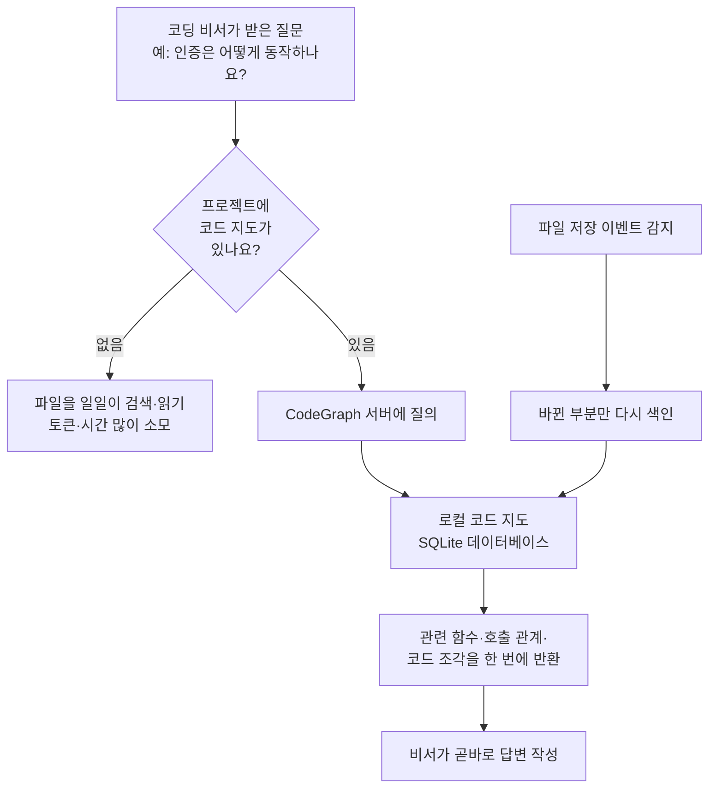

<div class="ai-knowledge-shell">

<aside class="ai-knowledge-sidebar">
  <p class="ai-eyebrow">CATEGORIES</p>
  <nav class="ai-cat-tree"><details class="ai-cat" open><summary><span class="catname">에이전트 오케스트레이션</span><span class="catcount">13</span></summary><ul><li><a href="https://altjs4510.github.io/ai_news_blog/knowledge/20260717/"><span class="kdate">2026-07-17</span><span class="ktitle">After a year building agent memory, 'save everyt…</span></a></li><li><a href="https://altjs4510.github.io/ai_news_blog/knowledge/20260708/"><span class="kdate">2026-07-08</span><span class="ktitle">Expanding Managed Agents in Gemini API: backgrou…</span></a></li><li><a href="https://altjs4510.github.io/ai_news_blog/knowledge/20260707/"><span class="kdate">2026-07-07</span><span class="ktitle">AI Hero Skills Catalog — 실무 엔지니어를 위한 재사용 가능한 판단 …</span></a></li><li><a href="https://altjs4510.github.io/ai_news_blog/knowledge/20260705/"><span class="kdate">2026-07-05</span><span class="ktitle">openai/codex-plugin-cc — Claude Code에서 Codex를 위임…</span></a></li><li><a href="https://altjs4510.github.io/ai_news_blog/knowledge/20260701/"><span class="kdate">2026-07-01</span><span class="ktitle">Google OKF (Open Knowledge Format) — 벤더 중립 에이전트 …</span></a></li><li><a href="https://altjs4510.github.io/ai_news_blog/knowledge/20260623/"><span class="kdate">2026-06-23</span><span class="ktitle">bytedance/deer-flow — 샌드박스·메모리·서브에이전트·메시지 게이트웨이를…</span></a></li><li><a href="https://altjs4510.github.io/ai_news_blog/knowledge/20260621/"><span class="kdate">2026-06-21</span><span class="ktitle">calesthio/OpenMontage — 12 파이프라인·52 도구·500+ 스킬을 …</span></a></li><li><a href="https://altjs4510.github.io/ai_news_blog/knowledge/20260611/"><span class="kdate">2026-06-11</span><span class="ktitle">The evolution of agentic surfaces: building with…</span></a></li><li><a href="https://altjs4510.github.io/ai_news_blog/knowledge/20260602/"><span class="kdate">2026-06-02</span><span class="ktitle">revfactory/harness — 도메인별 에이전트 팀과 스킬을 자동 설계하는 메타…</span></a></li><li><a href="https://altjs4510.github.io/ai_news_blog/knowledge/20260529/"><span class="kdate">2026-05-29</span><span class="ktitle">Introducing dynamic workflows in Claude Code</span></a></li><li><a href="https://altjs4510.github.io/ai_news_blog/knowledge/20260520/"><span class="kdate">2026-05-20</span><span class="ktitle">New in Claude Managed Agents: self-hosted sandbo…</span></a></li><li><a href="https://altjs4510.github.io/ai_news_blog/knowledge/20260507/"><span class="kdate">2026-05-07</span><span class="ktitle">ruvnet/ruflo — Claude 멀티 에이전트 오케스트레이션 플랫폼</span></a></li><li><a href="https://altjs4510.github.io/ai_news_blog/knowledge/20260504/"><span class="kdate">2026-05-04</span><span class="ktitle">Agents for Everything Else: Codex for Knowledge …</span></a></li></ul></details><details class="ai-cat" open><summary><span class="catname">MCP &amp; 도구 통합</span><span class="catcount">9</span></summary><ul><li><a href="https://altjs4510.github.io/ai_news_blog/knowledge/20260718/"><span class="kdate">2026-07-18</span><span class="ktitle">tirth8205/code-review-graph — MCP·CLI용 로컬 코드 인텔리…</span></a></li><li><a href="https://altjs4510.github.io/ai_news_blog/knowledge/20260618/"><span class="kdate">2026-06-18</span><span class="ktitle">DeusData/codebase-memory-mcp — 158개 언어 코드베이스를 밀리…</span></a></li><li><a href="https://altjs4510.github.io/ai_news_blog/knowledge/20260604/"><span class="kdate">2026-06-04</span><span class="ktitle">chopratejas/headroom — Compress tool outputs bef…</span></a></li><li><a href="https://altjs4510.github.io/ai_news_blog/knowledge/20260603/"><span class="kdate">2026-06-03</span><span class="ktitle">How Bad MCP design cost your Agent 5× more token…</span></a></li><li><a href="https://altjs4510.github.io/ai_news_blog/knowledge/20260526/"><span class="kdate">2026-05-26</span><span class="ktitle">colbymchenry/codegraph — Pre-indexed code knowle…</span></a></li><li><a href="https://altjs4510.github.io/ai_news_blog/knowledge/20260523/"><span class="kdate">2026-05-23</span><span class="ktitle">colbymchenry/codegraph — 사전 인덱싱된 코드 지식 그래프 MCP</span></a></li><li><a href="https://altjs4510.github.io/ai_news_blog/knowledge/20260519/"><span class="kdate">2026-05-19</span><span class="ktitle">Anthropic acquires Stainless</span></a></li><li><a href="https://altjs4510.github.io/ai_news_blog/knowledge/20260517/"><span class="kdate">2026-05-17</span><span class="ktitle">I gave my LLM 100,000+ tools — Lazy Discovery &a…</span></a></li><li><a href="https://altjs4510.github.io/ai_news_blog/knowledge/20260509/"><span class="kdate">2026-05-09</span><span class="ktitle">How to connect 100 MCP servers without the conte…</span></a></li></ul></details><details class="ai-cat" open><summary><span class="catname">코딩 에이전트</span><span class="catcount">12</span></summary><ul><li><a href="https://altjs4510.github.io/ai_news_blog/knowledge/20260714/"><span class="kdate">2026-07-14</span><span class="ktitle">Graphify-Labs/graphify — 코드베이스를 질의 가능한 지식 그래프로 만…</span></a></li><li><a href="https://altjs4510.github.io/ai_news_blog/knowledge/20260626/"><span class="kdate">2026-06-26</span><span class="ktitle">google-labs-code/design.md — 코딩 에이전트에게 디자인 시스템을 …</span></a></li><li><a href="https://altjs4510.github.io/ai_news_blog/knowledge/20260619/"><span class="kdate">2026-06-19</span><span class="ktitle">Claude Code now supports artifacts</span></a></li><li><a href="https://altjs4510.github.io/ai_news_blog/knowledge/20260530/"><span class="kdate">2026-05-30</span><span class="ktitle">Leonxlnx/taste-skill — AI에게 좋은 취향을 부여해 generic s…</span></a></li><li><a href="https://altjs4510.github.io/ai_news_blog/knowledge/20260528/"><span class="kdate">2026-05-28</span><span class="ktitle">Building self-improving tax agents with Codex</span></a></li><li><a href="https://altjs4510.github.io/ai_news_blog/knowledge/20260524/"><span class="kdate">2026-05-24</span><span class="ktitle">colbymchenry/codegraph — Pre-indexed code knowle…</span></a></li><li><a href="https://altjs4510.github.io/ai_news_blog/knowledge/20260521/" class="current"><span class="kdate">2026-05-21</span><span class="ktitle">colbymchenry/codegraph — Pre-indexed code knowle…</span></a></li><li><a href="https://altjs4510.github.io/ai_news_blog/knowledge/20260512/"><span class="kdate">2026-05-12</span><span class="ktitle">agentmemory — Persistent memory for AI coding ag…</span></a></li><li><a href="https://altjs4510.github.io/ai_news_blog/knowledge/20260510/"><span class="kdate">2026-05-10</span><span class="ktitle">addyosmani/agent-skills — Production-grade engin…</span></a></li><li><a href="https://altjs4510.github.io/ai_news_blog/knowledge/20260508/"><span class="kdate">2026-05-08</span><span class="ktitle">addyosmani/agent-skills — Production-grade engin…</span></a></li><li><a href="https://altjs4510.github.io/ai_news_blog/knowledge/20260506/"><span class="kdate">2026-05-06</span><span class="ktitle">mksglu/context-mode — AI 코딩 에이전트용 컨텍스트 윈도우 최적화</span></a></li><li><a href="https://altjs4510.github.io/ai_news_blog/knowledge/20260505/"><span class="kdate">2026-05-05</span><span class="ktitle">mattpocock/skills — Skills for Real Engineers (.…</span></a></li></ul></details><details class="ai-cat" open><summary><span class="catname">모델 &amp; 연구</span><span class="catcount">6</span></summary><ul><li><a href="https://altjs4510.github.io/ai_news_blog/knowledge/20260716-proprag/"><span class="kdate">2026-07-16</span><span class="ktitle">PropRAG — 프로포지션 경로 위 beam search로 멀티홉 검색 안내</span></a></li><li><a href="https://altjs4510.github.io/ai_news_blog/knowledge/20260712/"><span class="kdate">2026-07-12</span><span class="ktitle">Do Automated Evals Work?</span></a></li><li><a href="https://altjs4510.github.io/ai_news_blog/knowledge/20260620/"><span class="kdate">2026-06-20</span><span class="ktitle">zai-org/GLM-5 — From Vibe Coding to Agentic Engi…</span></a></li><li><a href="https://altjs4510.github.io/ai_news_blog/knowledge/20260617/"><span class="kdate">2026-06-17</span><span class="ktitle">Predicting model behavior before release by simu…</span></a></li><li><a href="https://altjs4510.github.io/ai_news_blog/knowledge/20260516/"><span class="kdate">2026-05-16</span><span class="ktitle">STALE — 에이전트가 자기 기억의 유효성을 인지할 수 있는가</span></a></li><li><a href="https://altjs4510.github.io/ai_news_blog/knowledge/20260513/"><span class="kdate">2026-05-13</span><span class="ktitle">Thinking Machines' Native Interaction Models — T…</span></a></li></ul></details><details class="ai-cat" open><summary><span class="catname">인프라 &amp; 컴퓨트</span><span class="catcount">5</span></summary><ul><li><a href="https://altjs4510.github.io/ai_news_blog/knowledge/20260630/"><span class="kdate">2026-06-30</span><span class="ktitle">Introducing the Claude apps gateway for Amazon B…</span></a></li><li><a href="https://altjs4510.github.io/ai_news_blog/knowledge/20260610/"><span class="kdate">2026-06-10</span><span class="ktitle">Fable 5 just made cost-aware model routing manda…</span></a></li><li><a href="https://altjs4510.github.io/ai_news_blog/knowledge/20260606/"><span class="kdate">2026-06-06</span><span class="ktitle">chopratejas/headroom — Compress tool outputs, lo…</span></a></li><li><a href="https://altjs4510.github.io/ai_news_blog/knowledge/20260605/"><span class="kdate">2026-06-05</span><span class="ktitle">chopratejas/headroom — Compress tool outputs, lo…</span></a></li><li><a href="https://altjs4510.github.io/ai_news_blog/knowledge/20260522/"><span class="kdate">2026-05-22</span><span class="ktitle">Giving Agents Computers — Ivan Burazin, Daytona</span></a></li></ul></details><details class="ai-cat" open><summary><span class="catname">보안 &amp; 거버넌스</span><span class="catcount">13</span></summary><ul><li><a href="https://altjs4510.github.io/ai_news_blog/knowledge/20260716/"><span class="kdate">2026-07-16</span><span class="ktitle">Dicklesworthstone/destructive_command_guard — 에이…</span></a></li><li><a href="https://altjs4510.github.io/ai_news_blog/knowledge/20260715/"><span class="kdate">2026-07-15</span><span class="ktitle">Dicklesworthstone/destructive_command_guard — 에이…</span></a></li><li><a href="https://altjs4510.github.io/ai_news_blog/knowledge/20260710/"><span class="kdate">2026-07-10</span><span class="ktitle">70개 MCP 서버 strace 런타임 감사 — 부팅 시 아웃바운드 호출 서버 적발</span></a></li><li><a href="https://altjs4510.github.io/ai_news_blog/knowledge/20260704/"><span class="kdate">2026-07-04</span><span class="ktitle">Cloudflare is about to block AI agents by defaul…</span></a></li><li><a href="https://altjs4510.github.io/ai_news_blog/knowledge/20260703/"><span class="kdate">2026-07-03</span><span class="ktitle">Giving admins more visibility and control over C…</span></a></li><li><a href="https://altjs4510.github.io/ai_news_blog/knowledge/20260625/"><span class="kdate">2026-06-25</span><span class="ktitle">Agent identity in Claude Tag: a new access model…</span></a></li><li><a href="https://altjs4510.github.io/ai_news_blog/knowledge/20260624/"><span class="kdate">2026-06-24</span><span class="ktitle">Agent identity in Claude Tag: a new access model…</span></a></li><li><a href="https://altjs4510.github.io/ai_news_blog/knowledge/20260614/"><span class="kdate">2026-06-14</span><span class="ktitle">NVIDIA/SkillSpector — Security scanner for AI ag…</span></a></li><li><a href="https://altjs4510.github.io/ai_news_blog/knowledge/20260613/"><span class="kdate">2026-06-13</span><span class="ktitle">Fable 5's guardrails got bypassed in 48 hours — …</span></a></li><li><a href="https://altjs4510.github.io/ai_news_blog/knowledge/20260612/"><span class="kdate">2026-06-12</span><span class="ktitle">NVIDIA/SkillSpector — AI 에이전트 스킬용 보안 스캐너</span></a></li><li><a href="https://altjs4510.github.io/ai_news_blog/knowledge/20260607/"><span class="kdate">2026-06-07</span><span class="ktitle">OpenAI Help: Lockdown Mode</span></a></li><li><a href="https://altjs4510.github.io/ai_news_blog/knowledge/20260531/"><span class="kdate">2026-05-31</span><span class="ktitle">How we contain Claude across products</span></a></li><li><a href="https://altjs4510.github.io/ai_news_blog/knowledge/20260527/"><span class="kdate">2026-05-27</span><span class="ktitle">Microsoft Copilot Cowork Exfiltrates Files</span></a></li></ul></details><details class="ai-cat" open><summary><span class="catname">응용 사례</span><span class="catcount">4</span></summary><ul><li><a href="https://altjs4510.github.io/ai_news_blog/knowledge/20260709/"><span class="kdate">2026-07-09</span><span class="ktitle">mvanhorn/last30days-skill — Reddit·X·YouTube·HN·…</span></a></li><li><a href="https://altjs4510.github.io/ai_news_blog/knowledge/20260609/"><span class="kdate">2026-06-09</span><span class="ktitle">Building intelligent apps for Apple platforms wi…</span></a></li><li><a href="https://altjs4510.github.io/ai_news_blog/knowledge/20260515/"><span class="kdate">2026-05-15</span><span class="ktitle">Clawdmeter — Claude Code 사용량을 데스크톱 대시보드로</span></a></li><li><a href="https://altjs4510.github.io/ai_news_blog/knowledge/20260514/"><span class="kdate">2026-05-14</span><span class="ktitle">Introducing Claude for Small Business</span></a></li></ul></details><details class="ai-cat" open><summary><span class="catname">산업 동향</span><span class="catcount">3</span></summary><ul><li><a href="https://altjs4510.github.io/ai_news_blog/knowledge/20260711/"><span class="kdate">2026-07-11</span><span class="ktitle">OpenAI says GPT 5.6 is the 'preferred model' for…</span></a></li><li><a href="https://altjs4510.github.io/ai_news_blog/knowledge/20260702/"><span class="kdate">2026-07-02</span><span class="ktitle">How Cursor deploys AI inside the enterprise (For…</span></a></li><li><a href="https://altjs4510.github.io/ai_news_blog/knowledge/20260616/"><span class="kdate">2026-06-16</span><span class="ktitle">Why AI hasn't replaced software engineers, and w…</span></a></li></ul></details></nav>
</aside>

<article class="ai-knowledge-article">

<header class="ai-post-hero">
  <p class="ai-eyebrow"><a class="ai-back" href="../">KNOWLEDGE</a> · 2026-05-21 · 오늘의 학습</p>
  <h2 class="ai-post-title">colbymchenry/codegraph — Pre-indexed code knowledge graph for Claude Code, Codex, Cursor, OpenCode</h2>
</header>

> 원문: [colbymchenry/codegraph — Pre-indexed code knowledge graph for Claude Code, Codex, Cursor, OpenCode](https://github.com/colbymchenry/codegraph)

## 📌 학습 정리

### 1. 한 줄로 말하면

코드베이스 전체를 미리 "지도"로 만들어 두고, AI 코딩 도구가 파일을 일일이 뒤지는 대신 그 지도만 펼쳐 보게 해주는 도구예요.

### 2. 왜 이게 만들어졌어요?

요즘 많이 쓰는 AI 코딩 비서들(Claude Code, Cursor, Codex CLI, opencode 같은 것들)은 "이 기능이 어떻게 동작하나요?" 같은 질문을 받으면, 직접 파일을 grep으로 검색하고, 디렉터리를 훑고, 일일이 열어 읽는 식으로 답을 찾아요. 이 과정에서 매번 도구 호출(tool call)이 일어나고, 읽은 코드가 전부 대화 맥락(context)에 쌓여서 토큰 비용이 빠르게 늘어납니다. 큰 저장소일수록 비서가 보조 에이전트(Explore agents)까지 여러 개 띄워 흩어져 탐색하기 때문에, 한 번 질문에 수십 번의 파일 읽기가 따라붙기도 해요. CodeGraph는 이 탐색 과정을 미리 한 번 해놓자는 발상에서 출발했어요. 코드의 함수·클래스·호출 관계를 사전에 분석해 로컬 데이터베이스에 넣어 두면, 비서는 파일을 뒤질 필요 없이 그래프에 한 번 질의해서 바로 답을 얻을 수 있다는 거죠.

### 3. 비유로 풀면

낯선 도시에서 길을 찾는다고 해볼게요. 지도 없이 골목마다 돌아다니며 간판을 일일이 확인하는 게 기존 방식이라면, CodeGraph는 미리 만들어 둔 지하철 노선도를 손에 쥐여주는 거예요. "강남역에서 시청역 가려면?"을 물었을 때 노선도만 보면 환승 경로가 한눈에 들어오죠.

또 하나, 도서관 사서를 떠올려도 좋아요. 도서관 전체를 처음부터 둘러보며 책을 찾는 대신, 사서가 미리 만들어 둔 색인 카드를 뽑아서 "이 주제는 3층 B-12에 있어요"라고 즉답해주는 식이에요. 그래서 결국, 비서가 코드를 "탐색"하는 데 쓰던 시간과 비용을, "이미 만들어진 색인을 꺼내 보는" 데 쓰도록 바꿔주는 도구예요.

### 4. 어떻게 작동하는지 (그림으로)



흐름을 풀어 보면 이래요. 처음에 `codegraph init`으로 프로젝트를 한 번 분석하면, 코드의 구조 정보가 `.codegraph/` 폴더 안 SQLite 데이터베이스에 저장돼요. 이후 비서가 질문을 받으면 파일을 직접 뒤지지 않고 이 지도에 먼저 물어보고, 필요한 부분만 한 번에 받아옵니다. 코드를 수정하면 운영체제의 파일 변경 이벤트를 감지해 바뀐 부분만 자동으로 다시 색인하기 때문에, 지도는 늘 최신 상태로 유지돼요.

### 5. 처음 보는 용어 풀이

- **지식 그래프 (knowledge graph)** — 코드 안의 함수·클래스·파일 같은 요소들을 점(node)으로, "이 함수가 저 함수를 부른다" 같은 관계를 선(edge)으로 표현한 그물망 구조예요. 이 그물망이 있으면 "어디서 이 함수를 호출하나?" 같은 질문에 즉시 답할 수 있어요.

- **MCP 서버 (MCP server)** — 코딩 비서가 외부 도구를 불러 쓸 수 있게 해주는 표준 통로예요. CodeGraph는 이 통로를 통해 비서에게 검색·호출관계 조회 같은 기능을 노출해요.

- **도구 호출 (tool call)** — 비서가 파일 읽기, 검색, 명령 실행 같은 작업을 한 번 수행하는 단위. 호출이 많아질수록 시간·토큰 비용이 늘어나요.

- **트리시터 (tree-sitter)** — 소스 코드를 빠르게 파싱해서 구조(추상 구문 트리)로 바꿔주는 라이브러리예요. CodeGraph는 이걸로 함수·클래스·호출 같은 정보를 뽑아냅니다.

- **추상 구문 트리 (AST, Abstract Syntax Tree)** — 코드를 글자가 아니라 "함수 정의 안에 if 문이 있고, 그 안에 함수 호출이 있다" 같은 트리 모양 구조로 표현한 것. 코드 분석의 출발점이에요.

- **전체 텍스트 검색 (FTS5)** — SQLite에 내장된 빠른 텍스트 검색 기능. 이름으로 심볼(함수·클래스 이름)을 즉시 찾을 수 있게 해줘요.

- **영향 반경 (impact radius)** — 어떤 함수나 클래스를 바꿨을 때 영향을 받는 다른 코드들의 범위. 수정 전에 무엇이 깨질 수 있는지 미리 보는 데 써요.

- **증분 동기화 (incremental sync)** — 전체를 다시 분석하지 않고 바뀐 파일만 골라서 색인을 갱신하는 방식이에요. 그래서 코드를 고쳐도 빠르게 최신 상태가 유지돼요.

- **헤드리스 실행 (headless)** — 화면 인터페이스 없이 명령만 받아 실행하는 모드. 벤치마크에서 비서를 자동으로 돌리기 위해 이 모드를 썼어요.

### 6. 한 발 더 들어가고 싶다면

- [colbymchenry/codegraph 저장소](https://github.com/colbymchenry/codegraph) — 설치 옵션, CLI 명령, 라이브러리 사용법까지 원문을 직접 확인할 수 있어요.
- [npm 패키지 페이지](https://www.npmjs.com/package/@colbymchenry/codegraph) — 버전 이력과 설치 방법을 보고 싶을 때 들어가 보세요.
- [tree-sitter 공식 사이트](https://tree-sitter.github.io/) — CodeGraph가 코드를 어떻게 분석하는지 그 기반 기술이 궁금하다면 여기서 시작하면 좋아요.

---

## 📖 원문 전체 번역 (정독용)

> 의역 최소화한 전체 번역입니다. 큰 흐름은 위 정리에서 잡고, 정확한 워딩이 필요할 땐 이 섹션에서 정독하세요.

## Claude Code, Cursor, Codex, OpenCode를 시맨틱 코드 인텔리전스로 강화하세요

**~35% 비용 절감 · ~70% 툴 호출 감소 · 100% 로컬**

---

## 왜 CodeGraph인가?

Claude Code가 코드베이스를 탐색할 때, grep, glob, Read로 파일을 스캔하는 **Explore 에이전트**를 생성하며 — 모든 툴 호출마다 토큰을 소비합니다.

**CodeGraph는 그 에이전트들에게 사전 인덱싱된 지식 그래프를 제공합니다** — 심볼 관계, 콜 그래프, 코드 구조. 에이전트는 파일을 스캔하는 대신 그래프를 즉시 쿼리합니다.

### 벤치마크 결과

7개 언어에 걸친 **7개의 실제 오픈소스 코드베이스**를 대상으로, 에이전트(Claude Code, 헤드리스 모드)가 아키텍처 관련 질문 하나에 답할 때 CodeGraph **사용 시**와 **미사용 시**를 비교했습니다. 각 셀은 **arm당 4회 실행의 중앙값** 기준 절감량입니다.

> **평균: 35% 비용 절감 · 59% 토큰 감소 · 49% 속도 향상 · 70% 툴 호출 감소**

| 코드베이스 | 언어 | 비용 | 토큰 | 시간 | 툴 호출 |
| --- | --- | --- | --- | --- | --- |
| **VS Code** | TypeScript · ~1만 파일 | 35% 절감 | 73% 감소 | 41% 단축 | 72% 감소 |
| **Excalidraw** | TypeScript · ~600 | 47% 절감 | 73% 감소 | 60% 단축 | 86% 감소 |
| **Django** | Python · ~2,700 | 34% 절감 | 64% 감소 | 59% 단축 | 81% 감소 |
| **Tokio** | Rust · ~700 | 52% 절감 | 81% 감소 | 63% 단축 | 89% 감소 |
| **OkHttp** | Java · ~640 | 17% 절감 | 41% 감소 | 36% 단축 | 64% 감소 |
| **Gin** | Go · ~150 | 22% 절감 | 23% 감소 | 34% 단축 | 19% 감소 |
| **Alamofire** | Swift · ~100 | 38% 절감 | 59% 감소 | 51% 단축 | 77% 감소 |

성능 향상은 코드베이스 크기에 비례해 커집니다. 대형 레포에서는 에이전트가 **파일 읽기 없이** 몇 번의 호출만으로 인덱스에서 바로 답변하는 반면, CodeGraph 없는 에이전트는 grep/find/Read(그리고 그것이 생성하는 하위 에이전트)에 걸쳐 광범위하게 탐색합니다. Gin(~150 파일)처럼 작은 레포에서는 네이티브 검색이 이미 저렴하므로 격차가 좁아집니다.

**전체 벤치마크 상세 정보**

**방법론.** 각 arm은 `--strict-mcp-config` 옵션으로 레포에 대해 헤드리스로 실행된 `claude -p` (Claude Opus 4.7, Claude Code v2.1.145)입니다: **WITH** = CodeGraph의 MCP 서버 활성화, **WITHOUT** = 빈 MCP 설정. 내장된 Read/Grep/Bash는 양쪽 모두에서 사용 가능. 레포당 동일한 질문, **arm당 4회 실행, 중앙값 보고**. 비용 = 실행의 `total_cost_usd`; 토큰 = 처리된 총 토큰(캐시 포함 입력 + 출력); 시간 = 실제 경과 시간; 툴 호출 = 모델이 생성하는 하위 에이전트 내부 호출 포함 모든 툴 호출. 레포는 `--depth 1`로 클론 후 서빙과 동일한 CodeGraph 빌드로 인덱싱.

**쿼리 목록:**

| 코드베이스 | 쿼리 |
| --- | --- |
| VS Code | "extension host는 메인 프로세스와 어떻게 통신하는가?" |
| Excalidraw | "Excalidraw는 캔버스 요소를 어떻게 렌더링하고 업데이트하는가?" |
| Django | "Django의 ORM은 QuerySet으로부터 쿼리를 어떻게 빌드하고 실행하는가?" |
| Tokio | "tokio는 런타임에서 비동기 태스크를 어떻게 스케줄링하고 실행하는가?" |
| OkHttp | "OkHttp는 인터셉터 체인을 통해 요청을 어떻게 처리하는가?" |
| Gin | "gin은 미들웨어 체인을 통해 요청을 어떻게 라우팅하는가?" |
| Alamofire | "Alamofire는 요청을 어떻게 빌드, 전송, 검증하는가?" |

**원시 중앙값 — WITH → WITHOUT:**

| 코드베이스 | 비용 | 토큰 | 시간 | 툴 호출 |
| --- | --- | --- | --- | --- |
| VS Code | $0.42 → $0.64 | 393k → 1.4M | 1분 0초 → 1분 43초 | 7 → 23 |
| Excalidraw | $0.54 → $1.02 | 851k → 3.2M | 1분 17초 → 3분 14초 | 12 → 83 |
| Django | $0.41 → $0.62 | 499k → 1.4M | 1분 0초 → 2분 25초 | 9 → 48 |
| Tokio | $0.50 → $1.04 | 657k → 3.4M | 1분 5초 → 2분 56초 | 9 → 75 |
| OkHttp | $0.36 → $0.44 | 352k → 596k | 45초 → 1분 11초 | 5 → 14 |
| Gin | $0.36 → $0.46 | 431k → 562k | 47초 → 1분 11초 | 7 → 8 |
| Alamofire | $0.61 → $0.99 | 1.1M → 2.6M | 1분 19초 → 2분 41초 | 15 → 64 |

**CodeGraph가 우세한 이유:** 인덱스를 사용할 수 있으면 에이전트가 직접 답변합니다 — 영역을 파악하기 위한 `codegraph_context` 호출 후 관련 소스에 대한 `codegraph_explore` 한 번으로 종료되며, 파일 읽기가 없는 경우가 대부분입니다. 인덱스 없이는 에이전트(그리고 에이전트가 생성하는 Explore 하위 에이전트)가 올바른 코드를 읽기 전에 발견(find/ls/grep)에 대부분의 예산을 소비합니다. CodeGraph는 _직접_ 쿼리될 때만 도움이 되므로, 에이전트가 파일 읽기 하위 에이전트에 탐색을 위임하지 않고 직접 답변하도록 지시합니다 — 그렇지 않으면 하위 에이전트가 어차피 파일을 읽게 되어 CodeGraph가 오히려 오버헤드가 됩니다.

---

## 주요 기능

|  |  |
| --- | --- |
| **스마트 컨텍스트 빌딩** | 단 한 번의 툴 호출로 진입점, 관련 심볼, 코드 스니펫 반환 — 비용이 많이 드는 탐색 에이전트 불필요 |
| **전체 텍스트 검색** | FTS5 기반으로 전체 코드베이스에서 이름으로 즉시 코드 검색 |
| **영향 분석** | 변경 전에 임의 심볼의 호출자, 피호출자, 전체 영향 범위 추적 |
| **항상 최신 상태** | 파일 감시자가 네이티브 OS 이벤트(FSEvents/inotify/ReadDirectoryChangesW)와 디바운스된 자동 동기화 사용 — 코딩하는 동안 그래프가 최신 상태 유지, 설정 불필요 |
| **19개 이상 언어** | TypeScript, JavaScript, Python, Go, Rust, Java, C#, PHP, Ruby, C, C++, Swift, Kotlin, Dart, Svelte, Liquid, Pascal/Delphi |
| **프레임워크 인식 라우트** | 웹 프레임워크 라우팅 파일을 인식하고 13개 프레임워크에 걸쳐 URL 패턴을 핸들러에 연결 |
| **100% 로컬** | 데이터가 머신 밖으로 나가지 않음. API 키 불필요. 외부 서비스 없음. SQLite 데이터베이스만 사용 |

---

## 프레임워크 인식 라우트

CodeGraph는 웹 프레임워크 라우팅 파일을 감지하고 `references` 엣지로 핸들러 클래스나 함수에 연결된 `route` 노드를 생성합니다. 뷰/컨트롤러의 호출자를 쿼리하면 해당 뷰/컨트롤러와 바인딩된 URL 패턴도 함께 표시됩니다.

| 프레임워크 | 인식 패턴 |
| --- | --- |
| **Django** | `urls.py`의 `path()`, `re_path()`, `url()`, `include()` (CBV `.as_view()`, 점 표기 경로) |
| **Flask** | `@app.route('/path', methods=[...])`, 블루프린트 라우트 |
| **FastAPI** | `@app.get(...)`, `@router.post(...)`, 모든 표준 메서드 |
| **Express** | 미들웨어 체인 포함 `app.get(...)`, `router.post(...)` |
| **NestJS** | `@Controller` + `@Get/@Post/...`, GraphQL `@Resolver` + `@Query/@Mutation`, `@MessagePattern`/`@EventPattern`, `@SubscribeMessage` |
| **Laravel** | `Route::get()`, `Route::resource()`, `Controller@action`, 튜플 문법 |
| **Rails** | `get '/x', to: 'users#index'`, 해시 로켓 `=>` 문법 |
| **Spring** | 메서드의 `@GetMapping`, `@PostMapping`, `@RequestMapping` |
| **Gin / chi / gorilla / mux** | `r.GET(...)`, `router.HandleFunc(...)` |
| **Axum / actix / Rocket** | `.route("/x", get(handler))` |
| **ASP.NET** | 액션 메서드의 `[HttpGet("/x")]` 어트리뷰트 |
| **Vapor** | `app.get("x", use: handler)` |
| **React Router** / **SvelteKit** | 라우트 컴포넌트 노드 |

---

## 빠른 시작

### 1. 인스톨러 실행

```
npx @colbymchenry/codegraph
```

인스톨러가 수행하는 작업:

- 구성할 에이전트를 묻습니다 — 설치된 에이전트를 자동 감지: **Claude Code**, **Cursor**, **Codex CLI**, **opencode**
- PATH에 `codegraph` 설치 여부를 묻습니다 (에이전트가 MCP 서버를 실행할 수 있도록)
- 설정을 모든 프로젝트에 적용할지 현재 프로젝트에만 적용할지 묻습니다
- 선택한 각 에이전트의 MCP 서버 설정 + 지침 파일 작성 (예: `CLAUDE.md`, `.cursor/rules/codegraph.mdc`, `~/.codex/AGENTS.md`)
- Claude Code가 대상 중 하나인 경우 자동 허용 권한 설정
- 현재 프로젝트 초기화 (로컬 설치만 해당)

**비대화형 (스크립팅 / CI):**

```
codegraph install --yes                              # 에이전트 자동 감지, 전역 설치
codegraph install --target=cursor,claude --yes       # 명시적 대상 목록
codegraph install --target=auto --location=local     # 감지된 에이전트, 프로젝트 로컬
codegraph install --print-config codex               # 스니펫 출력, 파일 쓰기 없음
```

| 플래그 | 값 | 기본값 |
| --- | --- | --- |
| `--target` | `auto`, `all`, `none`, 또는 csv (`claude,cursor,...`) | 프롬프트 |
| `--location` | `global`, `local` | 프롬프트 |
| `--yes` | (불리언) | 매 단계 프롬프트 |
| `--no-permissions` | (불리언) Claude 자동 허용 목록 건너뜀 | 권한 활성화 |
| `--print-config <id>` | 에이전트 하나의 스니펫 출력 후 종료 | — |

### 2. 에이전트 재시작

MCP 서버가 로드되도록 에이전트(Claude Code / Cursor / Codex CLI / opencode)를 재시작하세요.

### 3. 프로젝트 초기화

```
cd your-project
codegraph init -i
```

프로젝트별 지식 그래프 인덱스를 빌드합니다. 또한 프로젝트 로컬 에이전트 서피스(예: Cursor의 `.cursor/rules/codegraph.mdc`)를 연결하여 단일 전역 `codegraph install`이 여는 모든 프로젝트에서 작동하도록 합니다 — 프로젝트마다 인스톨러를 다시 실행할 필요가 없습니다.

이게 전부입니다 — `.codegraph/` 디렉토리가 존재하면 에이전트가 자동으로 CodeGraph 툴을 사용합니다.

**수동 설정 (대안)**

**전역 설치:**

```
npm install -g @colbymchenry/codegraph
```

**`~/.claude.json`에 추가:**

```json
{
  "mcpServers": {
    "codegraph": {
      "type": "stdio",
      "command": "codegraph",
      "args": ["serve", "--mcp"]
    }
  }
}
```

**`~/.claude/settings.json`에 추가 (선택 사항, 자동 허용용):**

```json
{
  "permissions": {
    "allow": [
      "mcp__codegraph__codegraph_search",
      "mcp__codegraph__codegraph_context",
      "mcp__codegraph__codegraph_callers",
      "mcp__codegraph__codegraph_callees",
      "mcp__codegraph__codegraph_impact",
      "mcp__codegraph__codegraph_node",
      "mcp__codegraph__codegraph_status",
      "mcp__codegraph__codegraph_files"
    ]
  }
}
```

**전역 지침 참조**

인스톨러가 `~/.claude/CLAUDE.md`에 자동으로 다음 지침을 추가합니다:

```
## CodeGraph

CodeGraph는 더 빠르고 스마트한 코드 탐색을 위해 코드베이스의 시맨틱 지식 그래프를 구축합니다.

### 프로젝트에 `.codegraph/`가 존재하는 경우

**메인 세션에서 `codegraph_explore` 또는 `codegraph_context`를 직접 호출하지 마세요.**
이 툴들은 메인 세션 컨텍스트를 채우는 대량의 소스 코드를 반환합니다.
대신, 탐색 질문(예: "X는 어떻게 작동하는가?", "Y 시스템을 설명하라", "Z는 어디에 구현되어 있는가?")에는
항상 Explore 에이전트를 생성하세요.

**Explore 에이전트를 생성할 때**, 프롬프트에 다음 지침을 포함하세요:

> 이 프로젝트는 CodeGraph가 초기화되어 있습니다(.codegraph/가 존재합니다).
> `codegraph_explore`를 PRIMARY 툴로 사용하세요 — 한 번의 호출로 모든 관련 파일의
> 전체 소스 코드 섹션을 반환합니다.
>
> **규칙:**
> 1. `codegraph_explore` 툴 설명에 있는 탐색 호출 예산을 따르세요 — 프로젝트 크기에 따라 자동으로 조정됩니다.
> 2. codegraph_explore가 이미 소스 코드를 반환한 파일을 다시 읽지 마세요. 소스 섹션은 완전하고 신뢰할 수 있습니다.
> 3. 더 많은 세부 정보가 필요하거나 codegraph가 결과를 반환하지 않은 경우에만
>    "추가 관련 파일" 아래에 나열된 파일에 대해 grep/glob/read로 폴백하세요.

**메인 세션은 다음 경량 툴만 직접 사용할 수 있습니다** (탐색이 아닌 편집 전 타겟팅된 조회용):

| 툴 | 용도 |
|------|---------|
| `codegraph_search` | 이름으로 심볼 검색 |
| `codegraph_callers` / `codegraph_callees` | 콜 플로우 추적 |
| `codegraph_impact` | 편집 전 영향받는 항목 확인 |
| `codegraph_node` | 단일 심볼의 세부 정보 가져오기 |

### `.codegraph/`가 존재하지 않는 경우

세션 시작 시 사용자에게 CodeGraph 초기화 여부를 묻습니다:

"이 프로젝트에 CodeGraph가 초기화되지 않은 것을 확인했습니다. `codegraph init -i`를 실행하여 코드 지식 그래프를 구축할까요?"
```

---

## 작동 방식

```
┌─────────────────────────────────────────────────────────────────┐
│                        Claude Code                               │
│                                                                  │
│  "사용자 인증 구현"                                               │
│           │                                                      │
│           ▼                                                      │
│  ┌─────────────────┐      ┌─────────────────┐                   │
│  │  Explore Agent  │ ──── │  Explore Agent  │                   │
│  └────────┬────────┘      └────────┬────────┘                   │
│           │                        │                             │
└───────────┼────────────────────────┼─────────────────────────────┘
            │                        │
            ▼                        ▼
┌───────────────────────────────────────────────────────────────────┐
│                     CodeGraph MCP Server                          │
│  ┌─────────────┐  ┌─────────────┐  ┌─────────────┐               │
│  │   Search    │  │   Callers   │  │   Context   │               │
│  │  "auth"     │  │  "login()"  │  │  for task   │               │
│  └──────┬──────┘  └──────┬──────┘  └──────┬──────┘               │
│         │                │                │                       │
│         └────────────────┼────────────────┘                       │
│                          ▼                                        │
│              ┌───────────────────────┐                            │
│              │   SQLite Graph DB     │                            │
│              │   • 387 symbols       │                            │
│              │   • 1,204 edges       │                            │
│              │   • Instant lookups   │                            │
│              └───────────────────────┘                            │
└───────────────────────────────────────────────────────────────────┘
```

1. **추출** — [tree-sitter](https://tree-sitter.github.io/)가 소스 코드를 AST로 파싱합니다. 언어별 쿼리가 노드(함수, 클래스, 메서드)와 엣지(호출, 임포트, 상속, 구현)를 추출합니다.

2. **저장** — 모든 것이 FTS5 전체 텍스트 검색을 갖춘 로컬 SQLite 데이터베이스(`.codegraph/codegraph.db`)에 저장됩니다.

3. **해석** — 추출 후 참조가 해석됩니다: 함수 호출 → 정의, 임포트 → 소스 파일, 클래스 상속, 프레임워크 특정 패턴.

4. **자동 동기화** — MCP 서버가 네이티브 OS 파일 이벤트를 사용하여 프로젝트를 감시합니다. 변경사항은 디바운스(2초 정지 구간)되고 소스 파일만 필터링되어 점진적으로 동기화됩니다. 설정 없이 코딩하는 동안 그래프가 최신 상태를 유지합니다.

---

## CLI 참조

```
codegraph                         # 대화형 인스톨러 실행
codegraph install                 # 인스톨러 실행 (명시적)
codegraph init [path]             # 프로젝트 초기화 (--index로 인덱싱도 함께)
codegraph uninit [path]           # 프로젝트에서 CodeGraph 제거 (--force로 프롬프트 건너뜀)
codegraph index [path]            # 전체 인덱싱 (--force로 재인덱싱, --quiet으로 출력 감소)
codegraph sync [path]             # 점진적 업데이트
codegraph status [path]           # 통계 표시
codegraph query <search>          # 심볼 검색 (--kind, --limit, --json)
codegraph files [path]            # 파일 구조 표시 (--format, --filter, --max-depth, --json)
codegraph context <task>          # AI용 컨텍스트 빌드 (--format, --max-nodes)
codegraph affected [files...]     # 변경사항으로 영향받는 테스트 파일 찾기 (아래 참조)
codegraph serve --mcp             # MCP 서버 시작
```

### `codegraph affected`

변경된 소스 파일로 인해 영향받는 테스트 파일을 찾기 위해 임포트 의존성을 전이적으로 추적합니다.

```
codegraph affected src/utils.ts src/api.ts         # 파일을 인수로 전달
git diff --name-only | codegraph affected --stdin   # git diff에서 파이프
codegraph affected src/auth.ts --filter "e2e/*"     # 커스텀 테스트 파일 패턴
```

| 옵션 | 설명 | 기본값 |
| --- | --- | --- |
| `--stdin` | stdin에서 파일 목록 읽기 | `false` |
| `-d, --depth <n>` | 최대 의존성 순회 깊이 | `5` |
| `-f, --filter <glob>` | 테스트 파일을 식별하기 위한 커스텀 glob | 자동 감지 |
| `-j, --json` | JSON으로 출력 | `false` |
| `-q, --quiet` | 파일 경로만 출력 | `false` |

**CI/훅 예제:**

```bash
#!/usr/bin/env bash
AFFECTED=$(git diff --name-only HEAD | codegraph affected --stdin --quiet)
if [ -n "$AFFECTED" ]; then
  npx vitest run $AFFECTED
fi
```

---

## MCP 툴

MCP 서버로 실행 시 CodeGraph는 Claude Code에 다음 툴을 제공합니다:

| 툴 | 목적 |
| --- | --- |
| `codegraph_search` | 코드베이스 전체에서 이름으로 심볼 검색 |
| `codegraph_context` | 태스크에 관련된 코드 컨텍스트 빌드 |
| `codegraph_callers` | 함수를 호출하는 것 찾기 |
| `codegraph_callees` | 함수가 호출하는 것 찾기 |
| `codegraph_impact` | 심볼 변경 시 영향받는 코드 분석 |
| `codegraph_node` | 특정 심볼의 세부 정보 가져오기 (선택적으로 소스 코드 포함) |
| `codegraph_files` | 인덱싱된 파일 구조 가져오기 (파일시스템 스캔보다 빠름) |
| `codegraph_status` | 인덱스 상태 및 통계 확인 |

---

## 라이브러리 사용

```javascript
import CodeGraph from '@colbymchenry/codegraph';

const cg = await CodeGraph.init('/path/to/project');
// 또는: const cg = await CodeGraph.open('/path/to/project');

await cg.indexAll({
  onProgress: (p) => console.log(`${p.phase}: ${p.current}/${p.total}`)
});

const results = cg.searchNodes('UserService');
const callers = cg.getCallers(results[0].node.id);
const context = await cg.buildContext('fix login bug', { maxNodes: 20, includeCode: true, format: 'markdown' });
const impact = cg.getImpactRadius(results[0].node.id, 2);

cg.watch();   // 파일 변경 시 자동 동기화
cg.unwatch(); // 감시 중지
cg.close();
```

---

## 설정

`.codegraph/config.json` 파일이 인덱싱을 제어합니다:

```json
{
  "version": 1,
  "languages": ["typescript", "javascript"],
  "exclude": ["node_modules/**", "dist/**", "build/**", "*.min.js"],
  "frameworks": [],
  "maxFileSize": 1048576,
  "extractDocstrings": true,
  "trackCallSites": true
}
```

| 옵션 | 설명 | 기본값 |
| --- | --- | --- |
| `languages` | 인덱싱할 언어 (비어 있으면 자동 감지) | `[]` |
| `exclude` | 무시할 glob 패턴 | `["node_modules/**", ...]` |
| `frameworks` | 더 나은 해석을 위한 프레임워크 힌트 | `[]` |
| `maxFileSize` | 이 크기(바이트)보다 큰 파일 건너뜀 | `1048576` (1MB) |
| `extractDocstrings` | 코드에서 docstring 추출 | `true` |
| `trackCallSites` | 콜 사이트 위치 추적 | `true` |

## 지원 언어

| 언어 | 확장자 | 상태 |
| --- | --- | --- |
| TypeScript | `.ts`, `.tsx` | 완전 지원 |
| JavaScript | `.js`, `.jsx`, `.mjs` | 완전 지원 |
| Python | `.py` | 완전 지원 |
| Go | `.go` | 완전 지원 |
| Rust | `.rs` | 완전 지원 |
| Java | `.java` | 완전 지원 |
| C# | `.cs` | 완전 지원 |
| PHP | `.php` | 완전 지원 |
| Ruby | `.rb` | 완전 지원 |
| C | `.c`, `.h` | 완전 지원 |
| C++ | `.cpp`, `.hpp`, `.cc` | 완전 지원 |
| Swift | `.swift` | 완전 지원 |
| Kotlin | `.kt`, `.kts` | 완전 지원 |
| Scala | `.scala`, `.sc` | 완전 지원 (클래스, 트레이트, 메서드, 타입 별칭, Scala 3 열거형) |
| Dart | `.dart` | 완전 지원 |
| Svelte | `.svelte` | 완전 지원 (스크립트 추출, Svelte 5 룬, SvelteKit 라우트) |
| Vue | `.vue` | 완전 지원 (script + script-setup 추출, Nuxt 페이지/API/미들웨어 라우트) |
| Liquid | `.liquid` | 완전 지원 |
| Pascal / Delphi | `.pas`, `.dpr`, `.dpk`, `.lpr` | 완전 지원 (클래스, 레코드, 인터페이스, 열거형, DFM/FMX 폼 파일) |

## 트러블슈팅

**"CodeGraph not initialized"** — 먼저 프로젝트 디렉토리에서 `codegraph init`을 실행하세요.

**인덱싱이 느림** — `node_modules` 및 다른 대형 디렉토리가 제외되어 있는지 확인하세요. `--quiet`을 사용하여 출력 오버헤드를 줄이세요.

**인덱싱이 느림 / MCP `database is locked` / WASM 폴백 활성화** — `codegraph`는 `better-sqlite3`(네이티브 모듈, `optionalDependencies`로 선언됨)를 설치할 수 없는 환경을 위해 WASM SQLite 폴백을 내장하고 있습니다. 폴백은 네이티브 백엔드보다 5-10배 느리고 작성자가 독자를 차단할 수 있는 저널 모드를 사용하므로, 인덱싱 실행 중에 MCP 쿼리도 `database is locked`에 걸릴 수 있습니다. `codegraph status`를 실행하고 `Backend:` 줄을 확인하세요:

- `Backend: native` — 빠른 경로에 있으므로 아무것도 할 필요 없습니다.

- `Backend: wasm` — 느린 폴백에 있습니다. 일반적인 원인: C 빌드 도구 없음, Node 버전에 대한 사전 빌드 바이너리 없음, 또는 설치 후 Node 버전이 변경됨. 수정 방법:

```bash
# macOS
xcode-select --install                                  # C 컴파일러 설치

# Linux (Debian / Ubuntu)
sudo apt install build-essential python3 make

# Linux (RHEL / Fedora)
sudo yum groupinstall "Development Tools"

# 그런 다음 모든 플랫폼에서 재빌드:
npm rebuild better-sqlite3

# 또는 하드 의존성으로 강제 포함:
npm install better-sqlite3 --save
```

수정 후 `codegraph status`에 `Backend: native`가 표시되어야 합니다.

**MCP 서버가 연결되지 않음** — 프로젝트가 초기화/인덱싱되어 있는지 확인하고, MCP 설정의 경로를 검증하고, 커맨드라인에서 `codegraph serve --mcp`가 작동하는지 확인하세요.

**심볼 누락** — MCP 서버가 저장 시 자동 동기화합니다(몇 초 기다리세요). 필요한 경우 `codegraph sync`를 수동으로 실행하세요. 해당 파일의 언어가 지원되는지, 설정 패턴에 의해 제외되지 않는지 확인하세요.

## 라이선스

MIT

</article>

</div>

<!-- ai-related-links -->
<aside class="ai-related-links">
  <p class="ai-eyebrow">관련 학습</p>
  <ul><li><a href="https://altjs4510.github.io/ai_news_blog/knowledge/20260506/"><span class="kdate">2026-05-06</span><span class="ktitle">mksglu/context-mode — AI 코딩 에이전트용 컨텍스트 윈도우 최적화</span></a></li><li><a href="https://altjs4510.github.io/ai_news_blog/knowledge/20260512/"><span class="kdate">2026-05-12</span><span class="ktitle">agentmemory — Persistent memory for AI coding ag…</span></a></li></ul>
</aside>
<!-- /ai-related-links -->
