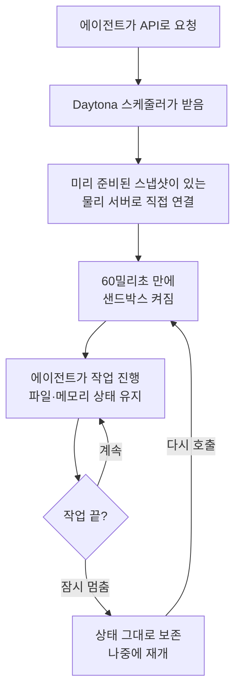

<aside class="ai-knowledge-sidebar">
  
CATEGORIES

  <nav class="ai-cat-tree">

에이전트 오케스트레이션5
<ul><li><a href="https://altjs4510.github.io/ai_news_blog/knowledge/20260623/">2026-06-23bytedance/deer-flow — 샌드박스·메모리·서브에이전트·메시지 게이트웨이를…</a></li><li><a href="https://altjs4510.github.io/ai_news_blog/knowledge/20260621/">2026-06-21calesthio/OpenMontage — 12 파이프라인·52 도구·500+ 스킬을 …</a></li><li><a href="https://altjs4510.github.io/ai_news_blog/knowledge/20260602/">2026-06-02revfactory/harness — 도메인별 에이전트 팀과 스킬을 자동 설계하는 메타…</a></li><li><a href="https://altjs4510.github.io/ai_news_blog/knowledge/20260529/">2026-05-29Introducing dynamic workflows in Claude Code</a></li><li><a href="https://altjs4510.github.io/ai_news_blog/knowledge/20260507/">2026-05-07ruvnet/ruflo — Claude 멀티 에이전트 오케스트레이션 플랫폼</a></li></ul>

MCP &amp; 도구 통합20
<ul><li><a href="https://altjs4510.github.io/ai_news_blog/knowledge/20260724/">2026-07-24diegosouzapw/OmniRoute — 단일 엔드포인트로 278+ 프로바이더·50…</a></li><li><a href="https://altjs4510.github.io/ai_news_blog/knowledge/20260723/">2026-07-23diegosouzapw/OmniRoute — 268+ 프로바이더를 단일 엔드포인트로 묶…</a></li><li><a href="https://altjs4510.github.io/ai_news_blog/knowledge/20260722/">2026-07-22tirth8205/code-review-graph — MCP·CLI용 로컬 우선 코드 …</a></li><li><a href="https://altjs4510.github.io/ai_news_blog/knowledge/20260721/">2026-07-21tirth8205/code-review-graph — 로컬 우선 코드 인텔리전스 그래프…</a></li><li><a href="https://altjs4510.github.io/ai_news_blog/knowledge/20260719/">2026-07-19tirth8205/code-review-graph — 로컬 우선 코드 인텔리전스 그래프…</a></li><li><a href="https://altjs4510.github.io/ai_news_blog/knowledge/20260718/">2026-07-18tirth8205/code-review-graph — MCP·CLI용 로컬 코드 인텔리…</a></li><li><a href="https://altjs4510.github.io/ai_news_blog/knowledge/20260709/">2026-07-09mvanhorn/last30days-skill — Reddit·X·YouTube·HN·…</a></li><li><a href="https://altjs4510.github.io/ai_news_blog/knowledge/20260708/">2026-07-08Expanding Managed Agents in Gemini API: backgrou…</a></li><li><a href="https://altjs4510.github.io/ai_news_blog/knowledge/20260701/">2026-07-01Google OKF (Open Knowledge Format) — 벤더 중립 에이전트 …</a></li><li><a href="https://altjs4510.github.io/ai_news_blog/knowledge/20260618/">2026-06-18DeusData/codebase-memory-mcp — 158개 언어 코드베이스를 밀리…</a></li><li><a href="https://altjs4510.github.io/ai_news_blog/knowledge/20260609/">2026-06-09Building intelligent apps for Apple platforms wi…</a></li><li><a href="https://altjs4510.github.io/ai_news_blog/knowledge/20260606/">2026-06-06chopratejas/headroom — Compress tool outputs, lo…</a></li><li><a href="https://altjs4510.github.io/ai_news_blog/knowledge/20260605/">2026-06-05chopratejas/headroom — Compress tool outputs, lo…</a></li><li><a href="https://altjs4510.github.io/ai_news_blog/knowledge/20260604/">2026-06-04chopratejas/headroom — Compress tool outputs bef…</a></li><li><a href="https://altjs4510.github.io/ai_news_blog/knowledge/20260603/">2026-06-03How Bad MCP design cost your Agent 5× more token…</a></li><li><a href="https://altjs4510.github.io/ai_news_blog/knowledge/20260526/">2026-05-26colbymchenry/codegraph — Pre-indexed code knowle…</a></li><li><a href="https://altjs4510.github.io/ai_news_blog/knowledge/20260523/">2026-05-23colbymchenry/codegraph — 사전 인덱싱된 코드 지식 그래프 MCP</a></li><li><a href="https://altjs4510.github.io/ai_news_blog/knowledge/20260517/">2026-05-17I gave my LLM 100,000+ tools — Lazy Discovery &a…</a></li><li><a href="https://altjs4510.github.io/ai_news_blog/knowledge/20260512/">2026-05-12agentmemory — Persistent memory for AI coding ag…</a></li><li><a href="https://altjs4510.github.io/ai_news_blog/knowledge/20260509/">2026-05-09How to connect 100 MCP servers without the conte…</a></li></ul>

코딩 에이전트15
<ul><li><a href="https://altjs4510.github.io/ai_news_blog/knowledge/20260725/">2026-07-25The new rules of context engineering for Claude …</a></li><li><a href="https://altjs4510.github.io/ai_news_blog/knowledge/20260716/">2026-07-16Dicklesworthstone/destructive_command_guard — 에이…</a></li><li><a href="https://altjs4510.github.io/ai_news_blog/knowledge/20260714/">2026-07-14Graphify-Labs/graphify — 코드베이스를 질의 가능한 지식 그래프로 만…</a></li><li><a href="https://altjs4510.github.io/ai_news_blog/knowledge/20260707/">2026-07-07AI Hero Skills Catalog — 실무 엔지니어를 위한 재사용 가능한 판단 …</a></li><li><a href="https://altjs4510.github.io/ai_news_blog/knowledge/20260705/">2026-07-05openai/codex-plugin-cc — Claude Code에서 Codex를 위임…</a></li><li><a href="https://altjs4510.github.io/ai_news_blog/knowledge/20260626/">2026-06-26google-labs-code/design.md — 코딩 에이전트에게 디자인 시스템을 …</a></li><li><a href="https://altjs4510.github.io/ai_news_blog/knowledge/20260619/">2026-06-19Claude Code now supports artifacts</a></li><li><a href="https://altjs4510.github.io/ai_news_blog/knowledge/20260530/">2026-05-30Leonxlnx/taste-skill — AI에게 좋은 취향을 부여해 generic s…</a></li><li><a href="https://altjs4510.github.io/ai_news_blog/knowledge/20260528/">2026-05-28Building self-improving tax agents with Codex</a></li><li><a href="https://altjs4510.github.io/ai_news_blog/knowledge/20260524/">2026-05-24colbymchenry/codegraph — Pre-indexed code knowle…</a></li><li><a href="https://altjs4510.github.io/ai_news_blog/knowledge/20260521/">2026-05-21colbymchenry/codegraph — Pre-indexed code knowle…</a></li><li><a href="https://altjs4510.github.io/ai_news_blog/knowledge/20260510/">2026-05-10addyosmani/agent-skills — Production-grade engin…</a></li><li><a href="https://altjs4510.github.io/ai_news_blog/knowledge/20260508/">2026-05-08addyosmani/agent-skills — Production-grade engin…</a></li><li><a href="https://altjs4510.github.io/ai_news_blog/knowledge/20260506/">2026-05-06mksglu/context-mode — AI 코딩 에이전트용 컨텍스트 윈도우 최적화</a></li><li><a href="https://altjs4510.github.io/ai_news_blog/knowledge/20260505/">2026-05-05mattpocock/skills — Skills for Real Engineers (.…</a></li></ul>

모델 &amp; 연구7
<ul><li><a href="https://altjs4510.github.io/ai_news_blog/knowledge/20260717/">2026-07-17After a year building agent memory, 'save everyt…</a></li><li><a href="https://altjs4510.github.io/ai_news_blog/knowledge/20260716-proprag/">2026-07-16PropRAG — 프로포지션 경로 위 beam search로 멀티홉 검색 안내</a></li><li><a href="https://altjs4510.github.io/ai_news_blog/knowledge/20260712/">2026-07-12Do Automated Evals Work?</a></li><li><a href="https://altjs4510.github.io/ai_news_blog/knowledge/20260620/">2026-06-20zai-org/GLM-5 — From Vibe Coding to Agentic Engi…</a></li><li><a href="https://altjs4510.github.io/ai_news_blog/knowledge/20260617/">2026-06-17Predicting model behavior before release by simu…</a></li><li><a href="https://altjs4510.github.io/ai_news_blog/knowledge/20260516/">2026-05-16STALE — 에이전트가 자기 기억의 유효성을 인지할 수 있는가</a></li><li><a href="https://altjs4510.github.io/ai_news_blog/knowledge/20260513/">2026-05-13Thinking Machines' Native Interaction Models — T…</a></li></ul>

인프라 &amp; 컴퓨트3
<ul><li><a href="https://altjs4510.github.io/ai_news_blog/knowledge/20260611/">2026-06-11The evolution of agentic surfaces: building with…</a></li><li><a href="https://altjs4510.github.io/ai_news_blog/knowledge/20260522/" class="current">2026-05-22Giving Agents Computers — Ivan Burazin, Daytona</a></li><li><a href="https://altjs4510.github.io/ai_news_blog/knowledge/20260520/">2026-05-20New in Claude Managed Agents: self-hosted sandbo…</a></li></ul>

보안 &amp; 거버넌스13
<ul><li><a href="https://altjs4510.github.io/ai_news_blog/knowledge/20260715/">2026-07-15Dicklesworthstone/destructive_command_guard — 에이…</a></li><li><a href="https://altjs4510.github.io/ai_news_blog/knowledge/20260710/">2026-07-1070개 MCP 서버 strace 런타임 감사 — 부팅 시 아웃바운드 호출 서버 적발</a></li><li><a href="https://altjs4510.github.io/ai_news_blog/knowledge/20260704/">2026-07-04Cloudflare is about to block AI agents by defaul…</a></li><li><a href="https://altjs4510.github.io/ai_news_blog/knowledge/20260703/">2026-07-03Giving admins more visibility and control over C…</a></li><li><a href="https://altjs4510.github.io/ai_news_blog/knowledge/20260630/">2026-06-30Introducing the Claude apps gateway for Amazon B…</a></li><li><a href="https://altjs4510.github.io/ai_news_blog/knowledge/20260625/">2026-06-25Agent identity in Claude Tag: a new access model…</a></li><li><a href="https://altjs4510.github.io/ai_news_blog/knowledge/20260624/">2026-06-24Agent identity in Claude Tag: a new access model…</a></li><li><a href="https://altjs4510.github.io/ai_news_blog/knowledge/20260614/">2026-06-14NVIDIA/SkillSpector — Security scanner for AI ag…</a></li><li><a href="https://altjs4510.github.io/ai_news_blog/knowledge/20260613/">2026-06-13Fable 5's guardrails got bypassed in 48 hours — …</a></li><li><a href="https://altjs4510.github.io/ai_news_blog/knowledge/20260612/">2026-06-12NVIDIA/SkillSpector — AI 에이전트 스킬용 보안 스캐너</a></li><li><a href="https://altjs4510.github.io/ai_news_blog/knowledge/20260607/">2026-06-07OpenAI Help: Lockdown Mode</a></li><li><a href="https://altjs4510.github.io/ai_news_blog/knowledge/20260531/">2026-05-31How we contain Claude across products</a></li><li><a href="https://altjs4510.github.io/ai_news_blog/knowledge/20260527/">2026-05-27Microsoft Copilot Cowork Exfiltrates Files</a></li></ul>

응용 사례2
<ul><li><a href="https://altjs4510.github.io/ai_news_blog/knowledge/20260726/">2026-07-26citrolabs/ego-lite — 로그인된 브라우저 상태를 AI 에이전트와 공유하는…</a></li><li><a href="https://altjs4510.github.io/ai_news_blog/knowledge/20260514/">2026-05-14Introducing Claude for Small Business</a></li></ul>

산업 동향7
<ul><li><a href="https://altjs4510.github.io/ai_news_blog/knowledge/20260711/">2026-07-11OpenAI says GPT 5.6 is the 'preferred model' for…</a></li><li><a href="https://altjs4510.github.io/ai_news_blog/knowledge/20260702/">2026-07-02How Cursor deploys AI inside the enterprise (For…</a></li><li><a href="https://altjs4510.github.io/ai_news_blog/knowledge/20260616/">2026-06-16Why AI hasn't replaced software engineers, and w…</a></li><li><a href="https://altjs4510.github.io/ai_news_blog/knowledge/20260610/">2026-06-10Fable 5 just made cost-aware model routing manda…</a></li><li><a href="https://altjs4510.github.io/ai_news_blog/knowledge/20260519/">2026-05-19Anthropic acquires Stainless</a></li><li><a href="https://altjs4510.github.io/ai_news_blog/knowledge/20260515/">2026-05-15Clawdmeter — Claude Code 사용량을 데스크톱 대시보드로</a></li><li><a href="https://altjs4510.github.io/ai_news_blog/knowledge/20260504/">2026-05-04Agents for Everything Else: Codex for Knowledge …</a></li></ul>
</nav>
</aside>

<article class="ai-knowledge-article">

<header class="ai-post-hero">
  
<a class="ai-back" href="../">KNOWLEDGE</a> · 2026-05-22 · 오늘의 학습

  <h2 class="ai-post-title">Giving Agents Computers — Ivan Burazin, Daytona</h2>
</header>

> 원문: [Giving Agents Computers — Ivan Burazin, Daytona](https://www.latent.space/p/daytona)

## 📌 학습 정리

### 1. 한 줄로 말하면

AI 에이전트(스스로 판단해 작업하는 프로그램)가 일하려면 사람처럼 "자기만의 컴퓨터 한 대"가 필요한데, Daytona는 그 컴퓨터를 인터넷 너머에서 즉석으로 빌려주는 회사예요.

### 2. 왜 이게 만들어졌어요?

원래 개발자들은 자기 노트북에 개발 환경을 깔아놓고 일했어요. 그런데 노트북마다 설정이 달라서 "내 컴퓨터에선 되는데?" 같은 문제가 끊이지 않았고, 이걸 해결하려고 일찍부터 "개발 환경을 클라우드로 옮기자"는 시도들이 있었습니다(브라우저 기반 통합개발환경 CodeAnywhere, Cloud9 같은 것들). 다만 그땐 시장이 준비가 안 됐어요. 그러다 AI 에이전트가 등장하면서 상황이 달라졌습니다. 에이전트는 노트북을 켜둘 사람도, 좋아하는 에디터도 필요 없어요. 그냥 API(프로그램끼리 대화하는 창구)로 접속할 수 있는, 빠르고 안전하고 오래 살아남는 컴퓨터가 필요할 뿐이죠. Daytona는 바로 그 수요에 맞춰 방향을 튼 회사입니다.

### 3. 비유로 풀면

이건 마치 **호텔 객실 같은 거예요**. 손님(에이전트)이 체크인하면 곧바로 들어갈 수 있는 방이 준비되어 있고, 잠깐 외출했다가 돌아와도 짐은 그대로 있고, 옆방 손님과는 완전히 격리돼 있죠. 필요하면 스위트룸으로 옮겨서 더 큰 책상을 쓸 수도 있고요.

또는 **사무실 임대**에 가깝기도 해요. 책상 하나만 빌리는 게 아니라, 일하는 데 필요한 컴퓨터·네트워크·서랍장(저장소)까지 통째로 빌리는 거예요.

그래서 결국, Daytona는 "코드 한 줄 실행하고 사라지는 일회용 상자"가 아니라 **에이전트가 계속 일을 이어갈 수 있는 진짜 작업 공간**을 빌려주는 서비스라는 뜻이에요.

### 4. 어떻게 작동하는지 (그림으로)

흐름을 풀어보면, 에이전트가 "컴퓨터 하나 줘"라고 요청하면 Daytona의 자체 스케줄러(작업 분배 담당)가 그 요청을 받아서, 이미 필요한 환경이 깔려 있는 물리 서버로 곧장 연결해 줍니다. 가상 서버를 거치지 않고 진짜 하드웨어(베어메탈) 위에서 바로 돌리기 때문에 약 60밀리초(1초의 1/16) 만에 켜져요. 작업을 잠시 멈췄다가 다시 깨워도 메모리·디스크 상태가 그대로 남아 있어서, 사람이 노트북 덮개를 닫았다 여는 것처럼 이어서 일할 수 있습니다.

### 5. 처음 보는 용어 풀이

- **에이전트 (agent)** — 사람의 지시를 받아 스스로 여러 단계 작업을 처리하는 AI 프로그램이에요. 코드를 짜거나, 웹을 뒤지거나, 파일을 고치는 등 실제 손발 역할을 합니다.

- **샌드박스 (sandbox)** — 다른 곳에 영향을 주지 않도록 격리된 작업 공간이에요. 원래는 테스트용 임시 공간을 뜻했는데, Daytona는 이걸 "에이전트가 진짜 일하는 본 무대"로 끌어올렸습니다.

- **베어메탈 (bare metal)** — 가상 서버를 거치지 않고 물리 서버 위에서 바로 돌리는 방식이에요. 중간 단계가 없으니 디스크·CPU 속도가 훨씬 빠릅니다. 보통의 클라우드는 그 위에 가상 머신(VM)을 한 겹 더 얹어요.

- **스냅샷 (snapshot)** — 특정 순간의 컴퓨터 상태를 통째로 찍어둔 사진 같은 거예요. 이걸 미리 물리 서버에 깔아두면, 새 샌드박스를 켤 때 처음부터 설치하지 않고 즉시 띄울 수 있습니다.

- **스케줄러 (scheduler)** — 들어온 요청을 어느 서버에 보낼지 결정하는 교통정리 담당이에요. Daytona는 일반적인 도구(쿠버네티스, Nomad)가 자기네 요구에 안 맞아서 직접 만들었다고 합니다.

- **상태 보존 (stateful)** — 작업 중간 결과나 메모리 내용을 유지한다는 뜻이에요. 반대 개념인 "상태 없음(stateless)"은 끝나면 모든 걸 잊어버려서, 긴 작업을 이어 하기 어렵죠.

- **강화학습 워크로드 (RL workload)** — AI 모델을 훈련시키려고 수많은 시행착오를 동시에 돌리는 작업이에요. 갑자기 CPU 0개에서 10만 개로 치솟는 식의 들쭉날쭉한 부하가 특징이라, 일반 클라우드로는 감당하기 까다롭습니다.

### 6. 한 발 더 들어가고 싶다면

- [Daytona 공식 사이트](https://www.daytona.io/) — 실제 제품이 어떻게 생겼고 어떤 기능을 제공하는지 직접 볼 수 있어요.
- [Manus의 클라우드 컴퓨터 소개](https://manus.im/blog/manus-cloud-computer) — Daytona 같은 인프라 위에서 어떤 식의 에이전트 제품이 만들어지는지 감을 잡을 수 있어요.
- [Perplexity Comet/Computer](https://www.perplexity.ai/computer) — "에이전트에게 컴퓨터를 준다"는 흐름이 검색 제품에서 어떻게 나타나는지 비교해 볼 수 있어요.
- [Cursor의 세 번째 시대 (Latent Space)](https://www.latent.space/p/cursor-third-era) — 같은 흐름이 코드 에디터 쪽에서 어떻게 진행되는지 짚어주는 글이에요.
- [LLM OS 스택 정리 (smol.ai)](https://news.smol.ai/frozen-issues/25-05-27-mistral-agents.html) — 에이전트 시대의 표준 구성 요소들이 어떻게 자리잡고 있는지 한눈에 볼 수 있어요.

---

## 📖 원문 전체 번역 (정독용)

> 의역 최소화한 전체 번역입니다. 큰 흐름은 위 정리에서 잡고, 정확한 워딩이 필요할 땐 이 섹션에서 정독하세요.

---

제품 측면에서는 모두가 Computer를 도입하고 있다 — [Perplexity](https://www.perplexity.ai/computer), [Manus](https://manus.im/blog/manus-cloud-computer), [Cursor](https://www.latent.space/p/cursor-third-era) 등. 한편 연구 측면에서는 TerminalBench나 GDPVal 같은 에이전틱 평가(agentic eval)도 컴퓨터를 전제로 설계되고 있다 ([Harbor](https://x.com/swyx/status/2027213347570188635)). 양쪽 모두에서, 수렴하고 있는 [LLM OS 스택](https://news.smol.ai/frozen-issues/25-05-27-mistral-agents.html)은 표준 툴킷이 되었고, Daytona는 그 덕분에 급성장하고 있는 소수의 AI 인프라 기업 중 하나다.

**"localhost의 종말"** 은 Ivan Burazin이 10년 넘게 집착해온 주제다.

> **Ivan Burazin @ivanburazin**
> 나는 2010년부터 localhost의 죽음을 응원해왔다. 그리고 마침내 그 일이 일어나고 있다. 자율 에이전트가 그 관에 마지막 못을 박고 있다. 노트북을 닫아서 에이전트의 워크플로를 중간에 멈출 수는 없다. 에이전트를 로컬 컴퓨팅으로 제한할 수도 없다.
> *오후 9:00 · 2026년 4월 1일 · 조회수 2,920*

너무나 익숙한 풍경…

*(Infobip Shift 2022)*

에이전트가 소프트웨어 개발을 논하는 기본 방식이 되기 훨씬 전부터, Ivan은 이미 **개발이 불안정한 로컬 머신에 의존해서는 안 된다**는 아이디어를 쫓고 있었다. 최초의 브라우저 기반 IDE 중 하나인 *[CodeAnywhere](https://codeanywhere.com/)* 는 그 미래를 향한 초기 시도였다. 개발 환경을 클라우드로 옮기고, 설정을 재현 가능하게 만들고, 개발자들을 끝없는 "내 머신에서는 됩니다" 문제로부터 해방시키는 것이었다.

방향성은 맞았지만, 시장은 아직 준비되지 않았다.

그러나 에이전트가 그것을 바꿨다. **에이전트는 노트북이나 책상 설정, 혹은 자기가 좋아하는 에디터 같은 것에 신경 쓰지 않는다.** 에이전트는 API를 통해 접근할 수 있는 컴퓨터가 필요하다. 계속 작동할 수 있을 만큼 충분히 상태를 유지(stateful)하고, 즉시 시작할 수 있을 만큼 빠르며, 크기를 조정할 수 있을 만큼 유연하고, 안전할 만큼 격리되어 있으며, 실제 소프트웨어 엔지니어링이 실제로 요구하는 지저분한 실세계 워크플로를 실행할 수 있을 만큼 조합 가능한(composable) 무언가가 필요하다.

Daytona는 좁은 의미의 코드 실행 용도로서의 *"샌드박스"* 를 파는 것이 아니다. 그것은 **Ivan의 원래 localhost 테제의 최신 버전**이다.

이번 에피소드에서 Daytona의 CEO가 swyx와 함께, **AI 에이전트에게 코드 실행 박스 그 이상이 필요한 이유**를 설명한다. 에이전트에게는 조합 가능한 컴퓨터, 상태를 유지하는 샌드박스, 즉각적인 시작, 동적 리소스 조정, 그리고 **0개에서 100,000개의 CPU로 급증하는** 워크로드를 견딜 수 있는 인프라가 필요하다.

**새로운 에이전트 컴퓨팅 시장**에 대해 깊이 파고든다: 인간 대상 개발 환경에서 AI 샌드박스로의 Daytona의 급격한 피벗, 고객들이 애원하며 달라고 했던 **새해 전날 MVP**, Daytona가 자체 스케줄러와 함께 베어 메탈 위에서 실행되는 이유, **한 고객이 하루에 거의 850,000개의 샌드박스를 실행하는 방법**, 그리고 RL/평가(eval) 워크로드가 불과 몇 달 만에 사용량의 0%에서 약 50%로 증가한 이유. Ivan은 또한 **에이전트에게 Windows와 macOS 머신이 필요한 이유**, CLI가 MCP보다 더 중요할 수 있는 이유, Kubernetes가 이 워크로드에 고통스러운 이유, 그리고 미래의 AI 클라우드가 AWS보다 Stripe에 더 가까워 보일 수 있는 이유를 설명한다.

---

**이 에피소드의 주요 주제:**

- Daytona가 CodeAnywhere, Shift, 그리고 "localhost의 종말" 테제에서 **어떻게 성장했는지**
- Daytona가 **인간 대상 개발 환경에서 AI 샌드박스로 피벗한 이유**
- 에이전트가 **일회용 코드 실행 박스** 대신 **조합 가능한 컴퓨터**를 필요로 하는 이유
- **새해 전날 MVP**와 API 키를 간청하던 고객들
- Daytona가 **베어 메탈, 상태 유지 스냅샷, 자체 스케줄러**를 선택한 이유
- Daytona가 하나의 샌드박스를 **약 60ms에, 50,000개의 샌드박스를 약 75초에** 시작하는 방법
- Daytona의 최대 고객이 **하루에 약 850,000개의 샌드박스**를 실행하는 이유
- RL/평가 워크로드가 어떻게 **0개에서 100,000개의 CPU로 급증하는** 스파이크를 만드는지
- RL 워크로드가 **Daytona 사용량의 0%에서 약 50%로** 증가한 이유
- 고객들이 Daytona를 **EKS/GKS**와 비교하며 **"다시는 돌아가지 않겠다"** 고 말하는 이유
- Windows 및 macOS 환경을 포함하여 **모든 AI 에이전트에게 컴퓨터가 필요할 수 있는 이유**
- macOS 샌드박스를 어렵게 만드는 Apple 라이선스 제약
- **MCP**보다 **CLI**가 에이전트에게 더 많은 힘을 주는 이유
- **오픈 소스**가 에이전트의 Daytona 통합을 어떻게 돕는지
- 에이전트가 생성한 PR이 **오늘날의 CI/CD 가정을 깨뜨릴 수 있는 이유**
- **토큰을 재판매하는** AI SaaS 기업들이 차가운 현실을 맞이할 수 있는 이유
- AI 클라우드가 AWS보다 Stripe에 더 가까워 보일 수 있는 이유

---

**Ivan Burazin**

- **LinkedIn:** [https://www.linkedin.com/in/ivanburazin](https://www.linkedin.com/in/ivanburazin)
- **X:** [https://x.com/ivanburazin](https://x.com/ivanburazin)

**Daytona**

- **Website:** [https://www.daytona.io](https://www.daytona.io/)
- **X:** [https://x.com/daytonaio](https://x.com/daytonaio)

---

**목차:**

- 00:00:00 도입부
- 00:01:12 소개
- 00:03:15 CodeAnywhere, Shift, 그리고 localhost의 종말
- 00:05:58 Daytona란 무엇인가: AI 에이전트를 위한 조합 가능한 컴퓨터
- 00:08:07 개발 환경에서 AI 샌드박스로의 피벗
- 00:10:17 새해 전날 MVP와 API 키를 간청하는 고객들
- 00:12:56 베어 메탈, 상태 유지 샌드박스, Daytona의 스케줄러
- 00:17:28 60ms 시작, 50,000개 샌드박스, 그리고 하루 850,000회 실행
- 00:21:53 불규칙한 RL/평가 워크로드와 새로운 에이전트 인프라 문제
- 00:28:12 RL 워크로드, Kubernetes의 고통, 동적 크기 조정
- 00:33:31 모든 AI 에이전트에게 컴퓨터가 필요한 이유
- 00:38:48 macOS 샌드박스와 Apple의 라이선스 문제
- 00:44:28 CLI가 MCP보다 더 중요할 수 있는 이유
- 00:48:11 오픈 소스, GitHub 스타, 에이전트 통합
- 00:53:11 Git, CI/CD, 에이전트 협업 병목
- 00:58:15 창업자의 삶과 25인 인프라 회사 만들기
- 01:02:44 AI SaaS, 토큰 재판매, API 우선 비즈니스 모델
- 01:06:10 GPU 샌드박스, 데이터 센터, 컴퓨팅 성장
- 01:09:48 AI 클라우드가 AWS보다 Stripe에 가까워 보일 수 있는 이유
- 01:11:26 마무리 생각

---

**Swyx [00:00:02]:** 좋습니다, Daytona의 CEO Ivan Burazin과 스튜디오에 함께 있습니다. 환영합니다.

**Ivan [00:00:07]:** 불러줘서 고마워요.

**Swyx [00:00:08]:** Ivan, 우리는 오랜 인연이 있죠.

**Ivan [00:00:10]:** 아주 오래됐죠.

**Swyx [00:00:11]:** 어떻게 알게 됐는지도 모르겠어요. 당신이 연락했나요, Shift 때문에요?

**Ivan [00:00:17]:** 제가 연락했어요. 이유는 - 저는 CodeAnywhere의 공동창업자였는데, 첫 번째 브라우저 기반 IDE였죠. 그래서 우리는 오래전부터 'localhost는 사라져야 한다'는 생각을 해왔어요. 그리고 당신이 그 글을 썼잖아요.

**Swyx [00:00:29]:** "localhost의 종말."

**Ivan [00:00:30]:** 그래서 제가 그 때문에 연락했고, 우리가 이야기를 나눴어요. 저는 당시 다른 직장에 있었는데 개발자 경험(developer experience) 책임자로 일하고 있었어요. 그 분야에 당신이 꽤 조예가 깊었고, 저는 그 부분에 대해 어떻게 접근해야 할지, 핵심이 무엇인지 알고 싶어서 당신을 포함한 여러 사람에게 연락했어요. 당신은 친절하게 통화를 받아줬는데, 제가 늦었던 기억이 나요.

**Swyx [00:00:51]:** 기억이 안 나는데요.

**Ivan [00:00:52]:** 저는 기억해요. 당시 이탈리아에서 휴가 중이었는데 그 때 여자친구인지 아내인지 — 어차피 같은 사람이니 다행이지만 — 와 함께 있다가 늦어버렸어요. 너무 미안했는데, 당신이 너무 좋게 이해해줬어요.

**Swyx [00:01:10]:** 제가 관대한 이유는 저도 다른 사람들한테 늦기 때문이에요. 죄 없는 자가 먼저 돌을 던지라고. 모르시는 분들을 위해 말씀드리면, Infobip Shift라는 행사가 있었는데 당신이 예전에 했던 거잖아요. 그게 사실 제가 AI Engineer를 시작하게 된 영감 중 하나였어요. "아, 컨퍼런스를 직접 만들고 운영할 수도 있구나"라는 걸 알게 해줬으니 고마워해야죠.

**Ivan [00:01:34]:** 처음에 어드바이저 지분을 달라고 했던 거 기억해요. 그런데 저는 하던 일에 너무 집중해서 거절했어요. 받았어야 했는데. 미안해요.

**Swyx [00:01:43]:** 우리는 벤처 투자를 받지 않았어요.

**Ivan [00:01:44]:** 그래도 상관없잖아요.

**Swyx [00:01:45]:** 어쨌든, 당신이 인상적인 점은 CodeAnywhere가 당신이 계속 만들려고 했던 것이었는데, Infobip 이후에 다시 돌아왔다는 거예요. Daytona로 이어지는 이야기와 출발점을 말씀해주세요.

**Ivan [00:02:05]:** 네. 정말 오래전부터, 저와 공동창업자가 함께 해왔어요. 이 표현을 여러 번 썼는데, 결혼하고 이혼하고 다시 결혼한 것 같다고요. 어떤 사람들은 제 공동창업자가 제 파트너냐고 진지하게 묻기도 해요. 말 그대로는 아니지만, 여러 회사를 함께 해왔어요. 말씀하신 대로, CodeAnywhere에서 Shift라는 컨퍼런스로, 그리고 다시 Daytona로 왔어요. 원래 2000년대 초에 서버를 쌓고 가상화를 하고, 라우터를 다루고, 기본적인 수준에서 이런 것들을 하는 서비스 회사를 시작했어요. 그 서비스 회사를 매각하고, 제 공동창업자가 사실 발명한 것, 즉 최초의 브라우저 기반 IDE에 집중했어요. '최초'라고 하지만, 사실 우리보다 먼저 Heroku가 있었어요. 그들이 Heroku가 되기 전까지 아주 짧은 기간 동안 했었죠. 그것을 제외하면 우리가 유일했어요.

**Swyx [00:02:55]:** Cloud9도 있었잖아요.

**Ivan [00:02:57]:** Cloud9은 우리보다 약간 나중에 나왔어요. Replit은 우리가 그걸 그만뒀을 때 나왔는데, 그 이후로 성공적으로 운영되고 있어요. Nitrous.io도 있었고. 당시에 꽤 여러 곳이 있었는데, 시기가 너무 일렀어요. 흥미로운 점은 당시에 VS Code도 없었고, Kubernetes도 없었고, Docker는 막 시작하던 때였어요. 공개됐는지도 확실하지 않아요. 그래서 전체 스택을 다 직접 만들어야 했고, 그것이 지금 Daytona에서 활용하고 있는 핵심 학습이었어요. 너무 일찍 시작했던 거죠. CodeAnywhere를 약 300만 명이 사용했고, 엔젤 투자 중심이었어요. 규모가 크지 않아서 모두에게 돈을 돌려줬어요. 그러다가 3년 전에 비슷한 것을 Daytona로 시작했는데, 지금의 Daytona와는 달랐어요. 처음엔 인간 엔지니어를 위한 개발 환경 자동화, 즉 CodeAnywhere의 기반 스택이었어요. 그러다가 작년 1월에 샌드박스로 완전히 피벗했고, 지금 여기 있습니다.

**Swyx [00:04:01]:** 역사적인 피벗이었죠. 저는 CodeAnywhere에도 투자했지만 E2B에도 독립적으로 투자했는데, 두 회사 모두 같은 방향으로 피벗하는 걸 보면서 "망했다"고 생각했어요.

**Ivan [00:04:12]:** 당신은 Daytona에 투자했어요. Daytona에 투자한 거예요. 당신이 처음이었는데, 당신의 투자가 없었다면 우리는 하지 못했을 거예요.

**Swyx [00:04:18]:** 설마요.

**Ivan [00:04:19]:** 아니요, 진짜예요. "그를 먼저 참여시켜야 해"였고, 당신이 우리를 시작하게 해준 계기였어요.

**Swyx [00:04:23]:** 그럴 리가요. 당신이 피치덱에 저를 올려놓았잖아요. 저는 "투자 안 하면 큰일 나겠다"고 생각했어요.

**Ivan [00:04:29]:** 그건 당신의 인용구 때문이었어요.

**Swyx [00:04:30]:** 맞아요, "localhost의 종말."

**Ivan [00:04:31]:** localhost의 종말에 관심 있는 사람이 누군지 연구를 많이 했거든요.

**Swyx [00:04:34]:** 제가 그 블로그 포스트를 썼더니 그 분야의 모든 회사가 연락해왔고, 그 피치를 받던 모든 VC도 저한테 전화해서 이야기를 나눠야 했어요.

**Ivan [00:04:47]:** 드디어 이루어지고 있잖아요.

**Swyx [00:04:48]:** 정말 흥미로웠어요.

**Ivan [00:04:48]:** 마침내 이루어지고 있어요.

**Swyx [00:04:49]:** 마침내.

**Ivan [00:04:49]:** 네, 드디어요.

**Swyx [00:04:49]:** 드디어 이루어지고 있죠.

**Ivan [00:04:49]:** 네.

**Swyx [00:04:49]:** 어쩌면 인간이 아닌 사용자들과 함께. 그래서 오늘날 Daytona는 무엇인가요? 간단하게 설명해주세요. 저는 티셔츠를 입고 있는데요.

**Ivan [00:04:58]:** 입고 계시네요.

**Swyx [00:04:59]:** 브랜딩이 정말 좋다고 생각해요. 일관성이 있고, "AI 코드를 실행합니다(Runs AI Code)" — 이보다 더 간단할 수가 없잖아요.

**Ivan [00:05:05]:** 맞아요. 근데 아마 바꿔야 할 것 같아요.

**Swyx [00:05:07]:** 아, 이런.

**Ivan [00:05:07]:** 우리가 하는 것의 일부분이거든요. 이 문구를 정말 좋아해서 아쉽지만요. "Run AI Code"는 매우 간단한데, 사람들이 다양하게 해석해요. 5,000~6,000장 정도 나눠줬는데 사람들이 자랑스럽게 입어요. 사실 Daytona를 홍보하는 게 아니라 입는 사람 자신을 홍보하는 면이 있어서 잘 만든 것 같아요. 그런데 이것도 우리가 하는 것의 일부분이에요. "Run AI Code"라고 하면 사람들은 이런 작은 격리된 코드 실행 박스만 생각해요. 코드를 보내면 결과가 나오는 것. 하지만 오늘날 Daytona는 본질적으로 **AI 에이전트를 위한 조합 가능한 컴퓨터**예요. 시장에서는 샌드박스라고 부르는데 오해를 불러일으킬 수 있어요.

**Swyx [00:05:44]:** 여러 가지 의미로 쓰이죠.

**Ivan [00:05:45]:** 맞아요. 오해를 불러일으킬 수 있는 게, 사람들은 보통 샌드박스를 데모나 테스트 환경으로 생각하지, 프로덕션급 환경으로 생각하지 않거든요. Daytona가 하는 것을 생각해보면, 앞에 있는 노트북, 저쪽의 컴퓨터, 또는 제 아내는 건축가라서 3D 렌더링을 위해 3D 그래픽 카드가 달린 Windows PC를 갖고 있는 것처럼, 인간은 서로 다른 구성의 컴퓨터를 갖고 있잖아요. 우리는 에이전트도 오늘날과 앞으로 다양한 작업을 수행하기 위해 이 모든 다양한 구성의 컴퓨터를 필요로 할 것이라고 강하게 믿습니다. 그래서 우리는 API를 통해 그것을 제공합니다.

**Swyx [00:06:19]:** 맞아요. 사람들이 "아하!" 하는 순간, 즉 와우 모멘트를 먼저 보여드려야 할 것 같아서 - 시장이 폭발적으로 성장하고 있잖아요. 월 74% 성장을 보고하고 계시고, 계속 성장해왔어요. 그리고 여러분만이 아니라 모든 곳이.

**Ivan [00:06:41]:** 모두가요.

**Swyx [00:06:42]:** 컴퓨팅 제공업체들, 이렇게 말하는 게 맞는지 모르겠지만요.

**Ivan [00:06:48]:** 상관없어요.

**Swyx [00:06:48]:** 유기적인 PLG(Product-Led Growth) 성장이기도 하고 엔터프라이즈도 잘 되고 있죠. 작년 1월 피벗 시점으로 돌아가고 싶어요. 당신은 분명히 이 시장을 일찍 알아보고 그에 맞게 포지셔닝했고, 지금은 시장 리더 중 하나가 되었잖아요. 피벗을 결정하게 만든 인사이트는 무엇이었나요?

**Ivan [00:07:06]:** 피벗을 결정하게 만든 인사이트는 그 직전 분기, 즉 2024년 말에 있었어요. 기본적으로 Devin으로 데모를 했는데 - Devin이 공개되지 않았을 때였고, 실은 당신이 저한테 Devin 접근권을 줬어요.

**Swyx [00:07:25]:** 제가요?

**Ivan [00:07:26]:** 네.

**Swyx [00:07:26]:** 그러면 안 됐던 거 같은데요.

**Ivan [00:07:27]:** 맞아요.

**Swyx [00:07:28]:** 저는.

**Ivan [00:07:28]:** 어쨌든 상관없어요.

**Swyx [00:07:29]:** 친구 몇 명한테만 줬는데.

**Ivan [00:07:31]:** 네, 통화에서 보여줬는지 뭔지는 모르지만 어쨌든. 또 OpenDevin, 지금은 OpenHands라고 불리는 것도 사용할 수 있었어요. 그래서 "오, 이건 뭔가 될 것 같은데. 아직 공개되지 않았으니까, 인간을 위한 개발 환경 자동화를 가져다가 OpenDevin을 얹어서 SaaS로 출시해보자"고 했어요. 그렇게 했는데 많은 사람이 가입하지는 않았어요. 대신 에이전트를 만드는 사람들이 많이 연락해서는 "내 에이전트에게 컴퓨팅 샌드박스 런타임이 필요한데"라고 했어요. 뭐라고 불렀는지는 기억이 안 나지만요. 그래서 "오, 이건 새로운 시장이네. 우리 인프라와 제품을 써봐"라고 했죠. 그런데 매우 빨리 사람들이 우리가 만든 것을 좋아하지 않는다는 걸 알았어요. 작동이 안 됐거든요. 처음에 이 일을 할 때 사람들한테 이야기하면 "에이전트용 샌드박스가 왜 다른 거야? 똑같은 거잖아. EC2, VM 다 있는데"라고 했어요. 그런데 주었던 20~30명 모두가 "아니요, 이건 아니에요. 이건 망가지네요"라고 했어요. 저와 공동창업자는 인프라 사람이지 AI 사람이 아니라 잘 몰랐거든요. 그래서 저는 관련된 모든 팟캐스트를 보고, 모든 블로그를 읽고, 무슨 일이 일어나고 있는지 이해하기 위해 직접 나섰어요.

**Swyx [00:08:45]:** 도움이 됐던 다른 분들을 언급하고 싶으세요? 비슷한 상황에 있는 분들을 위해서요.

**Ivan [00:08:49]:** 일반적으로 - 몇 가지 팟캐스트를 봤는데 세그먼트별로 달랐어요. 여기 팟캐스트, No Priors, Bill Gurley 것도 있는 동안 좋았고요.

**Swyx [00:09:04]:** VG2, 맞아요.

**Ivan [00:09:05]:** 네, 있는 동안. 20VC도 다른 관점에서 흥미롭고요. 또 Red Points도 있었어요.

**Swyx [00:09:14]:** 저희는 컴퓨팅 시장에 특화되어 있진 않아요.

**Ivan [00:09:15]:** 이미 그것도 - 죄송해요?

**Swyx [00:09:16]:** 에이전트 인프라 시장을 보고 싶으셨던 거잖아요.

**Ivan [00:09:19]:** 에이전트 시장과 AI 시장 전반을 보면서, 누가 플레이어인지, 어떤 인식이 있는지, 어떻게 흘러가는지 파악하려 했어요. 물론 컨퍼런스, 이벤트, 밋업 참가, 백서 읽기 등 상황을 이해하기 위해 해야 할 모든 것을 했죠. 그래서 무엇을 만들어야 할지 아이디어가 잡혔을 때, 문자 그대로 새해 전날 밤에, 저는 Daytona가 오늘날 무엇인지의 첫 번째 MVP를 거의 바이브 코딩(vibe coding)으로 반쯤 만들었어요. 새벽 3시쯤 잠이 들었어요. 갓 태어난 딸과 아내를 재우고 — "새해 복 많이 받으세요"하고 다시 이걸 만들었죠. 공동창업자 CTO한테 보냈더니 아침에 보고 "완전 쓰레기다, 아무한테도 절대 보여주지 마라. 근데 아이디어는 좋다"고 했어요. 그래서 2주 동안 그가 다시 만들었어요.

**Swyx [00:10:09]:** 어느 정도였나요? 제 말은, 초안 같은 건가요?

**Ivan [00:10:12]:** 그것도 아니에요. 훨씬 더 형편없었어요. 그냥 어떤 모습이어야 하는지의 매우 단순한 버전이었어요. 작동은 했는데 이상적이지 않았어요. 그래서 CTO가, 그게 그의 역할이니까, 내려가서 새 버전을 가지고 돌아왔어요. 그리고 분기 전에 "이거 별로야"라고 했던 모든 사람들에게 다시 연락했어요. 모든 사람에게 통화를 설정하고 데모를 보여줬어요. 모든 통화가 길어졌어요. 15분짜리 통화가 모두 25~30분으로 넘어갔어요. 그리고 모두 "접근권을 갖고 싶다"고 했어요. 로그인도 없고 API 키만 있었어요. 베타 혹은 알파였으니까요. "접근하고 싶다"고 하길래 "그럼요, 알겠습니다. 감사합니다"라고 했어요. 그런데 다음 날, 우리가 보내지 않았더니 그 통화를 했던 모든 사람이 다시 연락해왔어요. "내 API 키 어딨어요?" 모두가 원했어요. 그때 "이거다"라는 느낌이 왔어요. 살면서 여러 회사를 해봤지만, 줘야 하는데 주지 않았다고 진짜 전화를 걸어오는 경험은 처음이었어요. 다들 지금 당장 원한다는 거잖아요. 그러니까 사람들이 원하는 것이 없거나, 찾지 못한 것이고, 우리가 만든 것을 정말 원한다는 걸 알게 됐어요. 그리고 뭔가를 잡았다는 걸 깨달았고, 시장 규모를 생각해보면 — 인간 엔지니어와 기업 시장도 GitLab 같은 걸 생각하면 매우 큰 시장이지만, 앞으로 존재하게 될 모든 에이전트를 위한 시장은 어떤 규모인가? 그 시장이 얼마나 클까? — "올인이다"고 했어요. 그래서 거기서 구제품과 신제품을 분리하게 됐어요.

**Swyx [00:12:02]:** 그 시점엔 조합 가능하지 않았죠?

**Ivan [00:12:05]:** 아주 기본적이었어요. 그냥 CPU 수, 디스크, RAM을 정의할 수 있는 Linux 박스였어요. 그게 전부였어요. 여러 운영체제를 가질 수 없었고, 실시간으로 크기를 조정할 수 없었고, GPU를 추가할 수 없었고, 그런 것들이 안 됐어요. 그냥 그 첫 번째 버전이었죠.

**Swyx [00:12:22]:** 처음부터 베어 메탈(bare metal)이었나요?

**Ivan [00:12:24]:** 처음부터 베어 메탈이었어요. 그리고 우리가 바로 생각했던 게 있는데요.

**Swyx [00:12:29]:** 사람들한테 배경을 설명해줘야 할 것 같아요. 일반적인 경로가 무엇인지요.

**Ivan [00:12:32]:** 네, 대부분의 제공업체들은 VM 위에서 이걸 실행해요. 또한.

**Swyx [00:12:37]:** Firecracker요.

**Ivan [00:12:38]:** 맞아요, Firecracker와 VM 위에서요. 우리도 여러 격리 레이어가 있고 그렇게 할 수 있어요. 하지만 일반적인 방식은 첫째로, 머신의 상태, 즉 하드디스크가 샌드박스 자체의 일부가 아니라는 거예요. 그리고 다른 하나는 영원히 지속되도록 설계되지 않았다는 거예요. 대부분이 선점형(preemptible)이에요. 살 수 있는 시간이 정해져 있어요. 우리가 생각했던 건, 에이전트도 인간과 비슷한 면이 있다는 거예요. 일이 끝나기 전에 노트북을 꺼뜨리고 싶지 않잖아요. 뚜껑을 닫았다가 열면 같은 상태여야 하고요. 에이전트도 그걸 원할 거예요 — 일시 정지했다가 돌아오기. 그 두 가지를 원하는 거죠. 그리고 에이전트는 속도도 진짜 원하고요. 그래서 "엄청나게 빠르고, 장기 실행이 가능하고, 상태 유지가 되는 것이 필요하다"고 생각했어요. Lambda와 EC2를 합친 것이요. 그 두 가지를 결합한 거죠. 다른 사람들이 어떻게 하는지는 몰랐어요. 이런 시장이 있는 줄도 몰랐거든요. 그냥 "이것이 필요한 것이다"라고 생각하고, Kubernetes를 봤는데 충분하지 않았어요. Nomad를 봤는데 이걸 가능하게 해주지 않았어요. 그래서 CodeAnywhere에서 자체 스케줄러를 다시 작성했던 경험이 바로 CTO가 활용한 거예요. "그때의 학습이 있다"며 가져온 거죠. 재미있는 건, 세 번째 공동창업자가 그걸 보고 "이게 뭐야, 2008년 같잖아, 시간을 거슬러 올라간 것 같아"라고 했는데, "바로 그거야"라고 했어요. Daytona가 초고속인 이유는 기본적으로 베어 메탈 위에서 실행하고, 자체 스케줄러를 사용하며, 기반 머신의 디스크, CPU, RAM을 직접 사용하기 때문이에요. EBS 같은 것과 네트워크가 없으니 IOPS가 엄청나게 빠른 거예요. 또한 스냅샷, 특정 시점의 템플릿도 베어 메탈 머신에 미리 로드되어 있어요. 그래서 템플릿이나 스냅샷에서 샌드박스를 실행하면, 기본적으로 그 스냅샷이 NVMe 드라이브에 기반하고 있는 베어 메탈 머신으로 직접 보내지는 거예요. 그냥 그 머신을 켜는 것이고, 로컬이기 때문에 네트워크 지연이 없어요. 에이전트를 위한 컴퓨터가 어떤 모습이어야 하는지 제1원칙에서 생각했을 때 나온 결론이고, 우리가 만든 것이에요.

**Swyx [00:15:02]:** 아마 추천을 받아야 할지 모르겠지만, compute SDK를 하는 사람이 있는데 Time-to-Interactive(TTI) 면에서 여러분이 매우 잘하고 있어요. 이게 여러분한테 관련 있는 벤치마크인가요?

**Ivan [00:15:16]:** 모르겠어요, 매일 바뀌거든요. 오늘은 RKL이.

**Swyx [00:15:18]:** RKL이 뭔지 모르겠는데요. 처음 들어봐요.

**Ivan [00:15:20]:** 네, RK, 거기 있어요.

**Swyx [00:15:22]:** 적어도 다음 성능 구간보다 3분의 1 수준이고, 다른 더 잘 알려진 이름들은 시작이 엄청 느리더라고요.

**Ivan [00:15:31]:** 네, 저희가 오랫동안 압도적 1위였고, 지금은 샌드박스에 대한 다른 정의, 다른 격리 패턴, 다른 것들이 생겨났어요. RKL은 S3 데이터 위에서 직접 실행하기 때문에 매우 달라요. 컨테이너를 띄우는 방식이라 다른 종류의 것이에요. 샌드박스의 정의에 대해 우리 모두 합의가 필요해요. 어쨌든 저희는 시작하는 속도가 엄청나게 빠르고요. 0.10에서 0.11 정도로 나와 있는 걸 보실 수 있어요.

**Swyx [00:16:03]:** 충분히 가깝죠. 더 뭐가 필요하겠어요?

**Ivan [00:16:05]:** 벤치마크 자체가, 저는

</article>

<!-- ai-related-links -->
<aside class="ai-related-links">
  
관련 학습

  <ul><li><a href="https://altjs4510.github.io/ai_news_blog/knowledge/20260520/">2026-05-20New in Claude Managed Agents: self-hosted sandbo…</a></li><li><a href="https://altjs4510.github.io/ai_news_blog/knowledge/20260507/">2026-05-07ruvnet/ruflo — Claude 멀티 에이전트 오케스트레이션 플랫폼</a></li></ul>
</aside>
<!-- /ai-related-links -->
