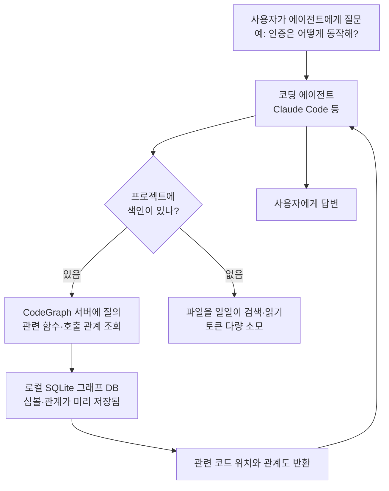

<div class="ai-knowledge-shell">

<aside class="ai-knowledge-sidebar">
  <p class="ai-eyebrow">CATEGORIES</p>
  <nav class="ai-cat-tree"><details class="ai-cat" open><summary><span class="catname">에이전트 오케스트레이션</span><span class="catcount">6</span></summary><ul><li><a href="https://altjs4510.github.io/ai_news_blog/knowledge/20260709/"><span class="kdate">2026-07-09</span><span class="ktitle">mvanhorn/last30days-skill — Reddit·X·YouTube·HN·…</span></a></li><li><a href="https://altjs4510.github.io/ai_news_blog/knowledge/20260707/"><span class="kdate">2026-07-07</span><span class="ktitle">AI Hero Skills Catalog — 실무 엔지니어를 위한 재사용 가능한 판단 …</span></a></li><li><a href="https://altjs4510.github.io/ai_news_blog/knowledge/20260623/"><span class="kdate">2026-06-23</span><span class="ktitle">bytedance/deer-flow — 샌드박스·메모리·서브에이전트·메시지 게이트웨이를…</span></a></li><li><a href="https://altjs4510.github.io/ai_news_blog/knowledge/20260602/"><span class="kdate">2026-06-02</span><span class="ktitle">revfactory/harness — 도메인별 에이전트 팀과 스킬을 자동 설계하는 메타…</span></a></li><li><a href="https://altjs4510.github.io/ai_news_blog/knowledge/20260529/"><span class="kdate">2026-05-29</span><span class="ktitle">Introducing dynamic workflows in Claude Code</span></a></li><li><a href="https://altjs4510.github.io/ai_news_blog/knowledge/20260507/"><span class="kdate">2026-05-07</span><span class="ktitle">ruvnet/ruflo — Claude 멀티 에이전트 오케스트레이션 플랫폼</span></a></li></ul></details><details class="ai-cat" open><summary><span class="catname">MCP &amp; 도구 통합</span><span class="catcount">16</span></summary><ul><li><a href="https://altjs4510.github.io/ai_news_blog/knowledge/20260729/"><span class="kdate">2026-07-29</span><span class="ktitle">Bringing MCP 2026-07-28 to Claude</span></a></li><li><a href="https://altjs4510.github.io/ai_news_blog/knowledge/20260724/"><span class="kdate">2026-07-24</span><span class="ktitle">diegosouzapw/OmniRoute — 단일 엔드포인트로 278+ 프로바이더·50…</span></a></li><li><a href="https://altjs4510.github.io/ai_news_blog/knowledge/20260723/"><span class="kdate">2026-07-23</span><span class="ktitle">diegosouzapw/OmniRoute — 268+ 프로바이더를 단일 엔드포인트로 묶…</span></a></li><li><a href="https://altjs4510.github.io/ai_news_blog/knowledge/20260722/"><span class="kdate">2026-07-22</span><span class="ktitle">tirth8205/code-review-graph — MCP·CLI용 로컬 우선 코드 …</span></a></li><li><a href="https://altjs4510.github.io/ai_news_blog/knowledge/20260721/"><span class="kdate">2026-07-21</span><span class="ktitle">tirth8205/code-review-graph — 로컬 우선 코드 인텔리전스 그래프…</span></a></li><li><a href="https://altjs4510.github.io/ai_news_blog/knowledge/20260719/"><span class="kdate">2026-07-19</span><span class="ktitle">tirth8205/code-review-graph — 로컬 우선 코드 인텔리전스 그래프…</span></a></li><li><a href="https://altjs4510.github.io/ai_news_blog/knowledge/20260718/"><span class="kdate">2026-07-18</span><span class="ktitle">tirth8205/code-review-graph — MCP·CLI용 로컬 코드 인텔리…</span></a></li><li><a href="https://altjs4510.github.io/ai_news_blog/knowledge/20260708/"><span class="kdate">2026-07-08</span><span class="ktitle">Expanding Managed Agents in Gemini API: backgrou…</span></a></li><li><a href="https://altjs4510.github.io/ai_news_blog/knowledge/20260618/"><span class="kdate">2026-06-18</span><span class="ktitle">DeusData/codebase-memory-mcp — 158개 언어 코드베이스를 밀리…</span></a></li><li><a href="https://altjs4510.github.io/ai_news_blog/knowledge/20260606/"><span class="kdate">2026-06-06</span><span class="ktitle">chopratejas/headroom — Compress tool outputs, lo…</span></a></li><li><a href="https://altjs4510.github.io/ai_news_blog/knowledge/20260605/"><span class="kdate">2026-06-05</span><span class="ktitle">chopratejas/headroom — Compress tool outputs, lo…</span></a></li><li><a href="https://altjs4510.github.io/ai_news_blog/knowledge/20260604/"><span class="kdate">2026-06-04</span><span class="ktitle">chopratejas/headroom — Compress tool outputs bef…</span></a></li><li><a href="https://altjs4510.github.io/ai_news_blog/knowledge/20260603/"><span class="kdate">2026-06-03</span><span class="ktitle">How Bad MCP design cost your Agent 5× more token…</span></a></li><li><a href="https://altjs4510.github.io/ai_news_blog/knowledge/20260523/"><span class="kdate">2026-05-23</span><span class="ktitle">colbymchenry/codegraph — 사전 인덱싱된 코드 지식 그래프 MCP</span></a></li><li><a href="https://altjs4510.github.io/ai_news_blog/knowledge/20260517/"><span class="kdate">2026-05-17</span><span class="ktitle">I gave my LLM 100,000+ tools — Lazy Discovery &a…</span></a></li><li><a href="https://altjs4510.github.io/ai_news_blog/knowledge/20260509/"><span class="kdate">2026-05-09</span><span class="ktitle">How to connect 100 MCP servers without the conte…</span></a></li></ul></details><details class="ai-cat" open><summary><span class="catname">코딩 에이전트</span><span class="catcount">16</span></summary><ul><li><a href="https://altjs4510.github.io/ai_news_blog/knowledge/20260728/"><span class="kdate">2026-07-28</span><span class="ktitle">alibaba/open-code-review — 결정론적 파이프라인 + LLM 에이전트…</span></a></li><li><a href="https://altjs4510.github.io/ai_news_blog/knowledge/20260725/"><span class="kdate">2026-07-25</span><span class="ktitle">The new rules of context engineering for Claude …</span></a></li><li><a href="https://altjs4510.github.io/ai_news_blog/knowledge/20260714/"><span class="kdate">2026-07-14</span><span class="ktitle">Graphify-Labs/graphify — 코드베이스를 질의 가능한 지식 그래프로 만…</span></a></li><li><a href="https://altjs4510.github.io/ai_news_blog/knowledge/20260705/"><span class="kdate">2026-07-05</span><span class="ktitle">openai/codex-plugin-cc — Claude Code에서 Codex를 위임…</span></a></li><li><a href="https://altjs4510.github.io/ai_news_blog/knowledge/20260626/"><span class="kdate">2026-06-26</span><span class="ktitle">google-labs-code/design.md — 코딩 에이전트에게 디자인 시스템을 …</span></a></li><li><a href="https://altjs4510.github.io/ai_news_blog/knowledge/20260619/"><span class="kdate">2026-06-19</span><span class="ktitle">Claude Code now supports artifacts</span></a></li><li><a href="https://altjs4510.github.io/ai_news_blog/knowledge/20260530/"><span class="kdate">2026-05-30</span><span class="ktitle">Leonxlnx/taste-skill — AI에게 좋은 취향을 부여해 generic s…</span></a></li><li><a href="https://altjs4510.github.io/ai_news_blog/knowledge/20260528/"><span class="kdate">2026-05-28</span><span class="ktitle">Building self-improving tax agents with Codex</span></a></li><li><a href="https://altjs4510.github.io/ai_news_blog/knowledge/20260526/"><span class="kdate">2026-05-26</span><span class="ktitle">colbymchenry/codegraph — Pre-indexed code knowle…</span></a></li><li><a href="https://altjs4510.github.io/ai_news_blog/knowledge/20260524/" class="current"><span class="kdate">2026-05-24</span><span class="ktitle">colbymchenry/codegraph — Pre-indexed code knowle…</span></a></li><li><a href="https://altjs4510.github.io/ai_news_blog/knowledge/20260521/"><span class="kdate">2026-05-21</span><span class="ktitle">colbymchenry/codegraph — Pre-indexed code knowle…</span></a></li><li><a href="https://altjs4510.github.io/ai_news_blog/knowledge/20260512/"><span class="kdate">2026-05-12</span><span class="ktitle">agentmemory — Persistent memory for AI coding ag…</span></a></li><li><a href="https://altjs4510.github.io/ai_news_blog/knowledge/20260510/"><span class="kdate">2026-05-10</span><span class="ktitle">addyosmani/agent-skills — Production-grade engin…</span></a></li><li><a href="https://altjs4510.github.io/ai_news_blog/knowledge/20260508/"><span class="kdate">2026-05-08</span><span class="ktitle">addyosmani/agent-skills — Production-grade engin…</span></a></li><li><a href="https://altjs4510.github.io/ai_news_blog/knowledge/20260506/"><span class="kdate">2026-05-06</span><span class="ktitle">mksglu/context-mode — AI 코딩 에이전트용 컨텍스트 윈도우 최적화</span></a></li><li><a href="https://altjs4510.github.io/ai_news_blog/knowledge/20260505/"><span class="kdate">2026-05-05</span><span class="ktitle">mattpocock/skills — Skills for Real Engineers (.…</span></a></li></ul></details><details class="ai-cat" open><summary><span class="catname">모델 &amp; 연구</span><span class="catcount">5</span></summary><ul><li><a href="https://altjs4510.github.io/ai_news_blog/knowledge/20260716-proprag/"><span class="kdate">2026-07-16</span><span class="ktitle">PropRAG — 프로포지션 경로 위 beam search로 멀티홉 검색 안내</span></a></li><li><a href="https://altjs4510.github.io/ai_news_blog/knowledge/20260620/"><span class="kdate">2026-06-20</span><span class="ktitle">zai-org/GLM-5 — From Vibe Coding to Agentic Engi…</span></a></li><li><a href="https://altjs4510.github.io/ai_news_blog/knowledge/20260617/"><span class="kdate">2026-06-17</span><span class="ktitle">Predicting model behavior before release by simu…</span></a></li><li><a href="https://altjs4510.github.io/ai_news_blog/knowledge/20260516/"><span class="kdate">2026-05-16</span><span class="ktitle">STALE — 에이전트가 자기 기억의 유효성을 인지할 수 있는가</span></a></li><li><a href="https://altjs4510.github.io/ai_news_blog/knowledge/20260513/"><span class="kdate">2026-05-13</span><span class="ktitle">Thinking Machines' Native Interaction Models — T…</span></a></li></ul></details><details class="ai-cat" open><summary><span class="catname">인프라 &amp; 컴퓨트</span><span class="catcount">4</span></summary><ul><li><a href="https://altjs4510.github.io/ai_news_blog/knowledge/20260630/"><span class="kdate">2026-06-30</span><span class="ktitle">Introducing the Claude apps gateway for Amazon B…</span></a></li><li><a href="https://altjs4510.github.io/ai_news_blog/knowledge/20260611/"><span class="kdate">2026-06-11</span><span class="ktitle">The evolution of agentic surfaces: building with…</span></a></li><li><a href="https://altjs4510.github.io/ai_news_blog/knowledge/20260522/"><span class="kdate">2026-05-22</span><span class="ktitle">Giving Agents Computers — Ivan Burazin, Daytona</span></a></li><li><a href="https://altjs4510.github.io/ai_news_blog/knowledge/20260520/"><span class="kdate">2026-05-20</span><span class="ktitle">New in Claude Managed Agents: self-hosted sandbo…</span></a></li></ul></details><details class="ai-cat" open><summary><span class="catname">보안 &amp; 거버넌스</span><span class="catcount">13</span></summary><ul><li><a href="https://altjs4510.github.io/ai_news_blog/knowledge/20260730/"><span class="kdate">2026-07-30</span><span class="ktitle">Anatomy of a Frontier Lab Agent Intrusion: A Tec…</span></a></li><li><a href="https://altjs4510.github.io/ai_news_blog/knowledge/20260716/"><span class="kdate">2026-07-16</span><span class="ktitle">Dicklesworthstone/destructive_command_guard — 에이…</span></a></li><li><a href="https://altjs4510.github.io/ai_news_blog/knowledge/20260715/"><span class="kdate">2026-07-15</span><span class="ktitle">Dicklesworthstone/destructive_command_guard — 에이…</span></a></li><li><a href="https://altjs4510.github.io/ai_news_blog/knowledge/20260710/"><span class="kdate">2026-07-10</span><span class="ktitle">70개 MCP 서버 strace 런타임 감사 — 부팅 시 아웃바운드 호출 서버 적발</span></a></li><li><a href="https://altjs4510.github.io/ai_news_blog/knowledge/20260703/"><span class="kdate">2026-07-03</span><span class="ktitle">Giving admins more visibility and control over C…</span></a></li><li><a href="https://altjs4510.github.io/ai_news_blog/knowledge/20260625/"><span class="kdate">2026-06-25</span><span class="ktitle">Agent identity in Claude Tag: a new access model…</span></a></li><li><a href="https://altjs4510.github.io/ai_news_blog/knowledge/20260624/"><span class="kdate">2026-06-24</span><span class="ktitle">Agent identity in Claude Tag: a new access model…</span></a></li><li><a href="https://altjs4510.github.io/ai_news_blog/knowledge/20260614/"><span class="kdate">2026-06-14</span><span class="ktitle">NVIDIA/SkillSpector — Security scanner for AI ag…</span></a></li><li><a href="https://altjs4510.github.io/ai_news_blog/knowledge/20260613/"><span class="kdate">2026-06-13</span><span class="ktitle">Fable 5's guardrails got bypassed in 48 hours — …</span></a></li><li><a href="https://altjs4510.github.io/ai_news_blog/knowledge/20260612/"><span class="kdate">2026-06-12</span><span class="ktitle">NVIDIA/SkillSpector — AI 에이전트 스킬용 보안 스캐너</span></a></li><li><a href="https://altjs4510.github.io/ai_news_blog/knowledge/20260607/"><span class="kdate">2026-06-07</span><span class="ktitle">OpenAI Help: Lockdown Mode</span></a></li><li><a href="https://altjs4510.github.io/ai_news_blog/knowledge/20260531/"><span class="kdate">2026-05-31</span><span class="ktitle">How we contain Claude across products</span></a></li><li><a href="https://altjs4510.github.io/ai_news_blog/knowledge/20260527/"><span class="kdate">2026-05-27</span><span class="ktitle">Microsoft Copilot Cowork Exfiltrates Files</span></a></li></ul></details><details class="ai-cat" open><summary><span class="catname">응용 사례</span><span class="catcount">8</span></summary><ul><li><a href="https://altjs4510.github.io/ai_news_blog/knowledge/20260726/"><span class="kdate">2026-07-26</span><span class="ktitle">citrolabs/ego-lite — 로그인된 브라우저 상태를 AI 에이전트와 공유하는…</span></a></li><li><a href="https://altjs4510.github.io/ai_news_blog/knowledge/20260717/"><span class="kdate">2026-07-17</span><span class="ktitle">After a year building agent memory, 'save everyt…</span></a></li><li><a href="https://altjs4510.github.io/ai_news_blog/knowledge/20260712/"><span class="kdate">2026-07-12</span><span class="ktitle">Do Automated Evals Work?</span></a></li><li><a href="https://altjs4510.github.io/ai_news_blog/knowledge/20260702/"><span class="kdate">2026-07-02</span><span class="ktitle">How Cursor deploys AI inside the enterprise (For…</span></a></li><li><a href="https://altjs4510.github.io/ai_news_blog/knowledge/20260621/"><span class="kdate">2026-06-21</span><span class="ktitle">calesthio/OpenMontage — 12 파이프라인·52 도구·500+ 스킬을 …</span></a></li><li><a href="https://altjs4510.github.io/ai_news_blog/knowledge/20260609/"><span class="kdate">2026-06-09</span><span class="ktitle">Building intelligent apps for Apple platforms wi…</span></a></li><li><a href="https://altjs4510.github.io/ai_news_blog/knowledge/20260515/"><span class="kdate">2026-05-15</span><span class="ktitle">Clawdmeter — Claude Code 사용량을 데스크톱 대시보드로</span></a></li><li><a href="https://altjs4510.github.io/ai_news_blog/knowledge/20260514/"><span class="kdate">2026-05-14</span><span class="ktitle">Introducing Claude for Small Business</span></a></li></ul></details><details class="ai-cat" open><summary><span class="catname">산업 동향</span><span class="catcount">7</span></summary><ul><li><a href="https://altjs4510.github.io/ai_news_blog/knowledge/20260711/"><span class="kdate">2026-07-11</span><span class="ktitle">OpenAI says GPT 5.6 is the 'preferred model' for…</span></a></li><li><a href="https://altjs4510.github.io/ai_news_blog/knowledge/20260704/"><span class="kdate">2026-07-04</span><span class="ktitle">Cloudflare is about to block AI agents by defaul…</span></a></li><li><a href="https://altjs4510.github.io/ai_news_blog/knowledge/20260701/"><span class="kdate">2026-07-01</span><span class="ktitle">Google OKF (Open Knowledge Format) — 벤더 중립 에이전트 …</span></a></li><li><a href="https://altjs4510.github.io/ai_news_blog/knowledge/20260616/"><span class="kdate">2026-06-16</span><span class="ktitle">Why AI hasn't replaced software engineers, and w…</span></a></li><li><a href="https://altjs4510.github.io/ai_news_blog/knowledge/20260610/"><span class="kdate">2026-06-10</span><span class="ktitle">Fable 5 just made cost-aware model routing manda…</span></a></li><li><a href="https://altjs4510.github.io/ai_news_blog/knowledge/20260519/"><span class="kdate">2026-05-19</span><span class="ktitle">Anthropic acquires Stainless</span></a></li><li><a href="https://altjs4510.github.io/ai_news_blog/knowledge/20260504/"><span class="kdate">2026-05-04</span><span class="ktitle">Agents for Everything Else: Codex for Knowledge …</span></a></li></ul></details></nav>
</aside>

<article class="ai-knowledge-article">

<header class="ai-post-hero">
  <p class="ai-eyebrow"><a class="ai-back" href="../">KNOWLEDGE</a> · 2026-05-24 · 오늘의 학습</p>
  <h2 class="ai-post-title">colbymchenry/codegraph — Pre-indexed code knowledge graph for coding agents</h2>
</header>

> 원문: [colbymchenry/codegraph — Pre-indexed code knowledge graph for coding agents](https://github.com/colbymchenry/codegraph)

## 📌 학습 정리

### 1. 한 줄로 말하면

코딩 도우미 AI가 매번 파일을 뒤지지 않아도 되도록, 코드베이스의 구조와 연결 관계를 미리 정리해 둔 "지도"를 만들어 주는 도구예요.

### 2. 왜 이게 만들어졌어요?

Claude Code 같은 AI 코딩 에이전트가 "이 기능이 어떻게 동작해?"라는 질문을 받으면, 보통 파일 검색(grep), 패턴 매칭(glob), 파일 읽기(Read)를 반복해서 코드를 훑어요. 문제는 이 과정에서 토큰(AI가 처리하는 글자 단위 비용)이 엄청나게 소모된다는 점이에요. 큰 저장소일수록 에이전트가 수십 번씩 도구를 호출하고, 보조 에이전트까지 새로 띄워서 또 파일을 읽고… 비용도 시간도 부풀어 오르죠. CodeGraph는 이런 탐색 작업을 매번 처음부터 하지 말고, 코드의 구조(함수가 어디서 호출되는지, 어떤 클래스를 상속하는지 같은 관계)를 미리 한 번 분석해서 데이터베이스에 저장해 두자는 발상에서 출발했어요. 에이전트는 그 데이터베이스에 질문만 던지면 되니, 파일을 다시 읽지 않아도 답을 찾을 수 있어요.

### 3. 비유로 풀면

이건 마치 처음 가는 도서관에서 책을 찾을 때, 매번 서가를 돌아다니는 대신 사서가 미리 만들어 둔 "도서 색인 카드"를 보는 것과 비슷해요. 책 제목, 저자, 어떤 책이 어떤 책을 인용하는지가 다 정리돼 있으니 한 번의 조회로 필요한 책 무더기를 바로 짚어낼 수 있죠.

그래서 결국, AI 에이전트가 "이 함수 누가 부르지?" 같은 질문을 할 때 파일을 일일이 열어보는 대신 미리 만들어진 색인을 한 번 조회해 답을 얻는 구조예요.

### 4. 어떻게 작동하는지 (그림으로)



먼저 한 번 `codegraph init`을 돌리면 코드 분석기(tree-sitter)가 소스 파일을 읽어 함수·클래스 같은 "노드"와 호출·상속 같은 "관계"를 뽑아 로컬 SQLite 데이터베이스에 저장해요. 이후 에이전트가 질문을 받으면 파일을 헤집는 대신 이 데이터베이스에 바로 조회를 날리고, 파일 변경이 생기면 운영체제의 파일 변경 이벤트를 통해 자동으로 색인이 갱신돼요.

### 5. 처음 보는 용어 풀이

- **지식 그래프 (knowledge graph)** — 정보를 "점(노드)"과 "선(관계)"으로 표현한 데이터 구조예요. 여기서는 함수·클래스가 점이 되고, "A가 B를 호출한다" 같은 관계가 선이 돼요.
- **MCP 서버 (Model Context Protocol server)** — AI 에이전트가 외부 도구나 데이터를 끌어다 쓸 때 쓰는 표준 통로예요. CodeGraph는 이 통로로 자기 기능을 에이전트에게 노출해요.
- **사전 인덱싱 (pre-indexing)** — 질문이 들어오기 전에 코드를 미리 분석해 검색 가능한 형태로 정리해 두는 작업이에요. 매번 처음부터 훑지 않아도 되게 해줘요.
- **트리시터 (tree-sitter)** — 다양한 프로그래밍 언어의 소스 코드를 구문 트리(AST)로 빠르게 파싱해 주는 라이브러리예요. CodeGraph가 19개 넘는 언어를 지원할 수 있는 이유이기도 해요.
- **호출 그래프 (call graph)** — "이 함수는 누가 부르고, 누구를 부르는지"를 그려 놓은 관계도예요. 코드를 고치기 전에 영향 범위를 가늠할 때 유용해요.
- **영향 분석 (impact analysis)** — 어떤 함수나 클래스를 바꾸면 어디까지 파장이 미치는지 미리 살펴보는 작업이에요. 의도치 않은 곳을 깨뜨리지 않게 도와줘요.
- **WAL 모드 (Write-Ahead Logging)** — SQLite의 동작 모드 중 하나로, 누군가 데이터를 쓰는 동안에도 다른 쪽에서 읽기가 막히지 않게 해줘요. 동시에 여러 도구가 색인에 접근해도 충돌이 잘 안 나도록 해주는 장치예요.

### 6. 한 발 더 들어가고 싶다면

- [colbymchenry/codegraph (GitHub 저장소)](https://github.com/colbymchenry/codegraph) — 설치 방법, 벤치마크 원본, 프레임워크별 라우트 인식 같은 세부 동작을 직접 확인할 수 있어요.
- [tree-sitter 공식 사이트](https://tree-sitter.github.io/) — CodeGraph가 코드를 어떻게 구문 분석하는지, 그 토대가 되는 파서 라이브러리의 원리를 살펴볼 수 있어요.
- [npm 패키지 페이지 (@colbymchenry/codegraph)](https://www.npmjs.com/package/@colbymchenry/codegraph) — Node.js 환경에서 라이브러리로 직접 가져다 쓰고 싶을 때 참고하기 좋아요.

---

## 📖 원문 전체 번역 (정독용)

> 의역 최소화한 전체 번역입니다. 큰 흐름은 위 정리에서 잡고, 정확한 워딩이 필요할 땐 이 섹션에서 정독하세요.

## Claude Code, Cursor, Codex, OpenCode, Hermes Agent를 시맨틱 코드 인텔리전스로 강화하세요

**~35% 비용 절감 · ~70% 적은 툴 호출 · 100% 로컬**

## 시작하기

**Node.js 불필요** — 명령어 하나로 OS에 맞는 빌드를 받아옵니다:

```bash
# macOS / Linux
curl -fsSL https://raw.githubusercontent.com/colbymchenry/codegraph/main/install.sh | sh

# Windows (PowerShell)
irm https://raw.githubusercontent.com/colbymchenry/codegraph/main/install.ps1 | iex
```

이미 Node가 있다면 npm을 대신 사용하세요 (모든 버전에서 작동):

```bash
npx @colbymchenry/codegraph        # 설치 없이 실행, 또는:
npm i -g @colbymchenry/codegraph
```

CodeGraph는 자체 런타임을 번들로 포함합니다 — 컴파일 없음, 네이티브 빌드 없음, 어디서나 동일하게 작동합니다. 대화형 설치 프로그램이 에이전트(들)를 자동으로 구성합니다 — Claude Code, Cursor, Codex CLI, opencode, Hermes Agent.

### 프로젝트 초기화

```bash
cd your-project
codegraph init -i
```

### 제거

마음이 바뀌셨나요? 명령어 하나로 구성된 모든 에이전트에서 CodeGraph를 제거합니다:

```bash
codegraph uninstall
```

설치 프로그램을 역으로 실행합니다 — 구성된 각 에이전트에서 CodeGraph의 MCP 서버 설정, 지시사항, 권한을 제거합니다. 프로젝트 인덱스(`.codegraph/`)는 그대로 남겨집니다; 프로젝트별로 `codegraph uninit`으로 제거하세요. 특정 에이전트에서만 제거하려면 `--target`을, 비대화형으로 실행하려면 `--yes`를 사용하세요.

---

## CodeGraph를 사용하는 이유

Claude Code가 코드베이스를 탐색할 때, grep, glob, Read로 파일을 스캔하는 **Explore 에이전트**를 생성합니다 — 모든 툴 호출마다 토큰을 소비합니다.

**CodeGraph는 해당 에이전트에 사전 인덱싱된 지식 그래프를 제공합니다** — 심볼 관계, 호출 그래프, 코드 구조를 포함합니다. 에이전트는 파일을 스캔하는 대신 그래프를 즉시 쿼리합니다.

### 벤치마크 결과

7개 언어에 걸친 **7개의 실제 오픈소스 코드베이스**에서 테스트됨. 에이전트(Claude Code, 헤드리스)가 하나의 아키텍처 질문에 답하는 것을 CodeGraph **있을 때**와 **없을 때**를 비교. 각 셀은 **각 방향 4회 실행의 중앙값** 기준 절감량입니다.

> **평균: 35% 비용 절감 · 59% 적은 토큰 · 49% 빠름 · 70% 적은 툴 호출**

| 코드베이스 | 언어 | 비용 | 토큰 | 시간 | 툴 호출 |
| --- | --- | --- | --- | --- | --- |
| **VS Code** | TypeScript · ~10k 파일 | 35% 절감 | 73% 감소 | 41% 빠름 | 72% 감소 |
| **Excalidraw** | TypeScript · ~600 | 47% 절감 | 73% 감소 | 60% 빠름 | 86% 감소 |
| **Django** | Python · ~2.7k | 34% 절감 | 64% 감소 | 59% 빠름 | 81% 감소 |
| **Tokio** | Rust · ~700 | 52% 절감 | 81% 감소 | 63% 빠름 | 89% 감소 |
| **OkHttp** | Java · ~640 | 17% 절감 | 41% 감소 | 36% 빠름 | 64% 감소 |
| **Gin** | Go · ~150 | 22% 절감 | 23% 감소 | 34% 빠름 | 19% 감소 |
| **Alamofire** | Swift · ~100 | 38% 절감 | 59% 감소 | 51% 빠름 | 77% 감소 |

성능 향상은 코드베이스 크기에 비례합니다: 대형 저장소에서는 에이전트가 **파일 읽기 없이** 몇 번의 호출만으로 인덱스에서 답변하는 반면, CodeGraph가 없는 에이전트는 grep/find/Read(및 생성되는 하위 에이전트)에 걸쳐 퍼져나갑니다. Gin(~150 파일)처럼 작은 저장소에서는 네이티브 검색이 이미 저렴하므로 격차가 좁아집니다.

**전체 벤치마크 세부사항**

**방법론.** 각 방향은 `--strict-mcp-config`와 함께 저장소에 대해 헤드리스로 실행되는 `claude -p` (Claude Opus 4.7, Claude Code v2.1.145)입니다: **WITH** = CodeGraph의 MCP 서버 활성화, **WITHOUT** = 빈 MCP 설정. 내장된 Read/Grep/Bash는 양쪽 모두에서 사용 가능합니다. 저장소당 동일한 질문, **방향당 4회 실행, 중앙값 보고**. 비용 = 실행의 `total_cost_usd`; 토큰 = 처리된 총 토큰 수(캐시된 입력 포함 + 출력); 시간 = 벽시계 시간; 툴 호출 = 모델이 생성하는 하위 에이전트 내부 호출을 포함한 모든 툴 호출. 저장소는 `--depth 1`로 클론되고 서빙한 동일한 CodeGraph 빌드로 인덱싱됩니다.

**쿼리:**

| 코드베이스 | 쿼리 |
| --- | --- |
| VS Code | "확장 호스트는 메인 프로세스와 어떻게 통신합니까?" |
| Excalidraw | "Excalidraw는 캔버스 요소를 어떻게 렌더링하고 업데이트합니까?" |
| Django | "Django의 ORM은 QuerySet에서 쿼리를 어떻게 빌드하고 실행합니까?" |
| Tokio | "tokio는 런타임에서 비동기 작업을 어떻게 스케줄하고 실행합니까?" |
| OkHttp | "OkHttp는 인터셉터 체인을 통해 요청을 어떻게 처리합니까?" |
| Gin | "gin은 미들웨어 체인을 통해 요청을 어떻게 라우팅합니까?" |
| Alamofire | "Alamofire는 요청을 어떻게 빌드, 전송, 검증합니까?" |

**원시 중앙값 — WITH → WITHOUT:**

| 코드베이스 | 비용 | 토큰 | 시간 | 툴 호출 |
| --- | --- | --- | --- | --- |
| VS Code | $0.42 → $0.64 | 393k → 1.4M | 1m 0s → 1m 43s | 7 → 23 |
| Excalidraw | $0.54 → $1.02 | 851k → 3.2M | 1m 17s → 3m 14s | 12 → 83 |
| Django | $0.41 → $0.62 | 499k → 1.4M | 1m 0s → 2m 25s | 9 → 48 |
| Tokio | $0.50 → $1.04 | 657k → 3.4M | 1m 5s → 2m 56s | 9 → 75 |
| OkHttp | $0.36 → $0.44 | 352k → 596k | 45s → 1m 11s | 5 → 14 |
| Gin | $0.36 → $0.46 | 431k → 562k | 47s → 1m 11s | 7 → 8 |
| Alamofire | $0.61 → $0.99 | 1.1M → 2.6M | 1m 19s → 2m 41s | 15 → 64 |

**CodeGraph가 우수한 이유:** 인덱스가 사용 가능할 때 에이전트는 직접 답변합니다 — 영역을 파악하는 `codegraph_context`, 이어서 관련 소스를 위한 `codegraph_explore` 하나 — 그리고 멈춥니다. 대체로 파일 읽기가 전혀 없습니다. 없을 때는 에이전트(및 생성되는 Explore 하위 에이전트)가 올바른 코드를 읽기 전에 발견(find/ls/grep)에 예산 대부분을 소비합니다. CodeGraph는 _직접_ 쿼리될 때만 도움이 되므로, 지시사항이 에이전트에게 파일 읽기 하위 에이전트에 탐색을 위임하는 대신 직접 답변하도록 유도합니다 — 그렇지 않으면 하위 에이전트가 어차피 파일을 읽어 CodeGraph가 오버헤드가 됩니다.

---

## 주요 기능

|  |  |
| --- | --- |
| **스마트 컨텍스트 빌딩** | 툴 호출 하나로 진입점, 관련 심볼, 코드 스니펫을 반환 — 비용이 많이 드는 탐색 에이전트 불필요 |
| **전문 검색 (Full-Text Search)** | FTS5 기반으로 전체 코드베이스에서 이름으로 즉시 코드 검색 |
| **영향 분석 (Impact Analysis)** | 변경하기 전에 심볼의 호출자, 피호출자, 전체 영향 반경을 추적 |
| **항상 최신 유지** | 파일 감시자가 네이티브 OS 이벤트(FSEvents/inotify/ReadDirectoryChangesW)를 사용하며 디바운스 자동 동기화 — 코딩하는 동안 그래프가 최신 상태로 유지됨, 설정 불필요 |
| **19개 이상 언어** | TypeScript, JavaScript, Python, Go, Rust, Java, C#, PHP, Ruby, C, C++, Swift, Kotlin, Dart, Lua, Luau, Svelte, Liquid, Pascal/Delphi |
| **프레임워크 인식 라우트** | 웹 프레임워크 라우팅 파일을 인식하고 14개 프레임워크에서 URL 패턴을 핸들러와 연결 |
| **100% 로컬** | 데이터가 머신을 벗어나지 않습니다. API 키 없음. 외부 서비스 없음. SQLite 데이터베이스만 사용 |

---

## 프레임워크 인식 라우트

CodeGraph는 웹 프레임워크 라우팅 파일을 감지하고 핸들러 클래스 또는 함수에 `references` 엣지로 연결된 `route` 노드를 생성합니다. 뷰/컨트롤러의 호출자를 쿼리하면 이제 바인딩하는 URL 패턴이 함께 나타납니다.

| 프레임워크 | 인식되는 형태 |
| --- | --- |
| **Django** | `urls.py`의 `path()`, `re_path()`, `url()`, `include()` (CBV `.as_view()`, 점 표기 경로) |
| **Flask** | `@app.route('/path', methods=[...])`, 블루프린트 라우트 |
| **FastAPI** | `@app.get(...)`, `@router.post(...)`, 모든 표준 메서드 |
| **Express** | 미들웨어 체인이 있는 `app.get(...)`, `router.post(...)` |
| **NestJS** | `@Controller` + `@Get/@Post/...`, GraphQL `@Resolver` + `@Query/@Mutation`, `@MessagePattern`/`@EventPattern`, `@SubscribeMessage` |
| **Laravel** | `Route::get()`, `Route::resource()`, `Controller@action`, 튜플 문법 |
| **Drupal** | `*.routing.yml` 라우트 (`_controller`, `_form`, 엔티티 핸들러); `.module`/`.theme`/`.install`/`.inc`의 `hook_*` 구현 |
| **Rails** | `get '/x', to: 'users#index'`, 해시 로켓 `=>` 문법 |
| **Spring** | 메서드의 `@GetMapping`, `@PostMapping`, `@RequestMapping` |
| **Gin / chi / gorilla / mux** | `r.GET(...)`, `router.HandleFunc(...)` |
| **Axum / actix / Rocket** | `.route("/x", get(handler))` |
| **ASP.NET** | 액션 메서드의 `[HttpGet("/x")]` 어트리뷰트 |
| **Vapor** | `app.get("x", use: handler)` |
| **React Router** / **SvelteKit** | 라우트 컴포넌트 노드 |

---

## 빠른 시작

### 1. 설치 프로그램 실행

```bash
npx @colbymchenry/codegraph
```

설치 프로그램이 수행하는 작업:

- 구성할 에이전트를 묻습니다 — 설치된 에이전트를 자동 감지: **Claude Code**, **Cursor**, **Codex CLI**, **opencode**, **Hermes Agent**
- PATH에 `codegraph` 설치 여부를 묻습니다 (에이전트가 MCP 서버를 실행할 수 있도록)
- 설정을 모든 프로젝트에 적용할지 현재 프로젝트에만 적용할지 묻습니다
- 선택한 각 에이전트의 MCP 서버 설정 + 지시사항 파일 작성 (예: `CLAUDE.md`, `.cursor/rules/codegraph.mdc`, `~/.codex/AGENTS.md`)
- Claude Code가 대상 중 하나일 때 자동 허용 권한 설정
- 현재 프로젝트 초기화 (로컬 설치만 해당)

**비대화형 (스크립팅 / CI):**

```bash
codegraph install --yes                              # 에이전트 자동 감지, 글로벌 설치
codegraph install --target=cursor,claude --yes       # 명시적 대상 목록
codegraph install --target=auto --location=local     # 감지된 에이전트, 프로젝트 로컬
codegraph install --print-config codex               # 스니펫 출력, 파일 쓰기 없음
```

| 플래그 | 값 | 기본값 |
| --- | --- | --- |
| `--target` | `auto`, `all`, `none`, 또는 csv (`claude,cursor,...`) | 프롬프트 |
| `--location` | `global`, `local` | 프롬프트 |
| `--yes` | (불리언) | 매 단계 프롬프트 |
| `--no-permissions` | (불리언) Claude 자동 허용 목록 건너뜀 | 권한 활성화 |
| `--print-config <id>` | 하나의 에이전트 스니펫을 덤프하고 종료 | — |

### 2. 에이전트 재시작

MCP 서버를 로드하기 위해 에이전트(Claude Code / Cursor / Codex CLI / opencode / Hermes Agent)를 재시작하세요.

### 3. 프로젝트 초기화

```bash
cd your-project
codegraph init -i
```

프로젝트별 지식 그래프 인덱스를 빌드합니다. 또한 프로젝트 로컬 에이전트 인터페이스(예: Cursor의 `.cursor/rules/codegraph.mdc`)를 설정하여 단일 글로벌 `codegraph install`이 열어보는 모든 프로젝트에서 작동하게 합니다 — 프로젝트마다 설치 프로그램을 다시 실행할 필요가 없습니다.

이것으로 끝입니다 — `.codegraph/` 디렉토리가 존재하면 에이전트가 자동으로 CodeGraph 툴을 사용합니다.

**수동 설정 (대안)**

**글로벌 설치:**

```bash
npm install -g @colbymchenry/codegraph
```

**`~/.claude.json`에 추가:**

```json
{
  "mcpServers": {
    "codegraph": {
      "type": "stdio",
      "command": "codegraph",
      "args": ["serve", "--mcp"]
    }
  }
}
```

**`~/.claude/settings.json`에 추가 (선택사항, 자동 허용용):**

```json
{
  "permissions": {
    "allow": [
      "mcp__codegraph__codegraph_search",
      "mcp__codegraph__codegraph_context",
      "mcp__codegraph__codegraph_callers",
      "mcp__codegraph__codegraph_callees",
      "mcp__codegraph__codegraph_impact",
      "mcp__codegraph__codegraph_node",
      "mcp__codegraph__codegraph_status",
      "mcp__codegraph__codegraph_files"
    ]
  }
}
```

**글로벌 지시사항 참조**

설치 프로그램이 자동으로 `~/.claude/CLAUDE.md`에 다음 지시사항을 추가합니다:

```markdown
## CodeGraph

CodeGraph는 더 빠르고 스마트한 코드 탐색을 위해 코드베이스의 시맨틱 지식 그래프를 빌드합니다.

### 프로젝트에 `.codegraph/`가 있는 경우

**메인 세션에서 `codegraph_explore` 또는 `codegraph_context`를 직접 호출하지 마세요.** 이 툴들은 메인 세션 컨텍스트를 채우는 대량의 소스 코드를 반환합니다. 대신, 탐색 질문(예: "X는 어떻게 작동합니까?", "Y 시스템을 설명하세요", "Z는 어디에 구현되어 있습니까?")에 대해서는 항상 Explore 에이전트를 생성하세요.

**Explore 에이전트를 생성할 때**, 프롬프트에 다음 지시사항을 포함하세요:

> 이 프로젝트는 CodeGraph가 초기화되어 있습니다(.codegraph/가 존재함). `codegraph_explore`를 기본 툴로 사용하세요 — 한 번의 호출로 관련된 모든 파일의 전체 소스 코드 섹션을 반환합니다.
>
> **규칙:**
> 1. `codegraph_explore` 툴 설명의 탐색 호출 예산을 따르세요 — 프로젝트 크기에 따라 자동으로 조정됩니다.
> 2. codegraph_explore가 이미 소스 코드를 반환한 파일을 다시 읽지 마세요. 소스 섹션은 완전하고 권위 있습니다.
> 3. 더 많은 세부 정보가 필요하거나 codegraph가 결과를 반환하지 않은 경우에만 "추가 관련 파일" 아래에 나열된 파일에 대해 grep/glob/read로 폴백하세요.

**메인 세션은 이 경량 툴만 직접 사용할 수 있습니다** (탐색이 아닌 편집 전 대상 조회용):

| 툴 | 용도 |
|------|---------|
| `codegraph_search` | 이름으로 심볼 검색 |
| `codegraph_callers` / `codegraph_callees` | 호출 흐름 추적 |
| `codegraph_impact` | 편집 전 영향받는 항목 확인 |
| `codegraph_node` | 단일 심볼의 세부 정보 조회 |

### `.codegraph/`가 없는 경우

세션 시작 시 사용자에게 CodeGraph 초기화 여부를 물어보세요:

"이 프로젝트에 CodeGraph가 초기화되어 있지 않습니다. `codegraph init -i`를 실행하여 코드 지식 그래프를 빌드하시겠습니까?"
```

---

## 작동 방식

```
┌─────────────────────────────────────────────────────────────────┐
│                        Claude Code                               │
│                                                                  │
│  "사용자 인증 구현"                                               │
│           │                                                      │
│           ▼                                                      │
│  ┌─────────────────┐      ┌─────────────────┐                   │
│  │  Explore Agent  │ ──── │  Explore Agent  │                   │
│  └────────┬────────┘      └────────┬────────┘                   │
│           │                        │                             │
└───────────┼────────────────────────┼─────────────────────────────┘
            │                        │
            ▼                        ▼
┌───────────────────────────────────────────────────────────────────┐
│                     CodeGraph MCP Server                          │
│  ┌─────────────┐  ┌─────────────┐  ┌─────────────┐               │
│  │   Search    │  │   Callers   │  │   Context   │               │
│  │  "auth"     │  │  "login()"  │  │  for task   │               │
│  └──────┬──────┘  └──────┬──────┘  └──────┬──────┘               │
│         │                │                │                       │
│         └────────────────┼────────────────┘                       │
│                          ▼                                        │
│              ┌───────────────────────┐                            │
│              │   SQLite Graph DB     │                            │
│              │   • 387 symbols       │                            │
│              │   • 1,204 edges       │                            │
│              │   • Instant lookups   │                            │
│              └───────────────────────┘                            │
└───────────────────────────────────────────────────────────────────┘
```

1. **추출 (Extraction)** — [tree-sitter](https://tree-sitter.github.io/)가 소스 코드를 AST로 파싱합니다. 언어별 쿼리가 노드(함수, 클래스, 메서드)와 엣지(호출, 임포트, 확장, 구현)를 추출합니다.

2. **저장 (Storage)** — 모든 것이 FTS5 전문 검색을 갖춘 로컬 SQLite 데이터베이스(`.codegraph/codegraph.db`)에 저장됩니다.

3. **해석 (Resolution)** — 추출 후 참조가 해석됩니다: 함수 호출 → 정의, 임포트 → 소스 파일, 클래스 상속, 프레임워크별 패턴.

4. **자동 동기화 (Auto-Sync)** — MCP 서버가 네이티브 OS 파일 이벤트를 사용하여 프로젝트를 감시합니다. 변경 사항은 디바운스(2초 조용한 창)되어 소스 파일만 필터링되고 증분 동기화됩니다. 그래프는 코딩하는 동안 최신 상태를 유지합니다 — 설정이 필요 없습니다.

---

## CLI 참조

```bash
codegraph                         # 대화형 설치 프로그램 실행
codegraph install                 # 설치 프로그램 실행 (명시적)
codegraph uninstall               # 에이전트에서 CodeGraph 제거 (install의 역)
codegraph init [path]             # 프로젝트에서 초기화 (--index로 인덱싱도 함께)
codegraph uninit [path]           # 프로젝트에서 CodeGraph 제거 (--force로 프롬프트 건너뜀)
codegraph index [path]            # 전체 인덱스 (--force로 재인덱싱, --quiet으로 출력 감소)
codegraph sync [path]             # 증분 업데이트
codegraph status [path]           # 통계 표시
codegraph query <search>          # 심볼 검색 (--kind, --limit, --json)
codegraph files [path]            # 파일 구조 표시 (--format, --filter, --max-depth, --json)
codegraph context <task>          # AI용 컨텍스트 빌드 (--format, --max-nodes)
codegraph callers <symbol>        # 함수/메서드를 호출하는 것을 검색 (--limit, --json)
codegraph callees <symbol>        # 함수/메서드가 호출하는 것을 검색 (--limit, --json)
codegraph impact <symbol>         # 심볼 변경으로 영향받는 코드 분석 (--depth, --json)
codegraph affected [files...]     # 변경으로 영향받는 테스트 파일 검색 (아래 참조)
codegraph serve --mcp             # MCP 서버 시작
```

### `codegraph affected`

변경된 소스 파일의 영향을 받는 테스트 파일을 찾기 위해 임포트 의존성을 전이적으로 추적합니다.

```bash
codegraph affected src/utils.ts src/api.ts         # 파일을 인수로 전달
git diff --name-only | codegraph affected --stdin   # git diff에서 파이프
codegraph affected src/auth.ts --filter "e2e/*"     # 사용자 정의 테스트 파일 패턴
```

| 옵션 | 설명 | 기본값 |
| --- | --- | --- |
| `--stdin` | stdin에서 파일 목록 읽기 | `false` |
| `-d, --depth <n>` | 최대 의존성 탐색 깊이 | `5` |
| `-f, --filter <glob>` | 테스트 파일을 식별하는 사용자 정의 glob | 자동 감지 |
| `-j, --json` | JSON으로 출력 | `false` |
| `-q, --quiet` | 파일 경로만 출력 | `false` |

**CI/훅 예시:**

```bash
#!/usr/bin/env bash
AFFECTED=$(git diff --name-only HEAD | codegraph affected --stdin --quiet)
if [ -n "$AFFECTED" ]; then
  npx vitest run $AFFECTED
fi
```

---

## MCP 툴

MCP 서버로 실행될 때 CodeGraph는 Claude Code에 다음 툴을 제공합니다:

| 툴 | 목적 |
| --- | --- |
| `codegraph_search` | 코드베이스 전체에서 이름으로 심볼 검색 |
| `codegraph_context` | 작업에 맞는 관련 코드 컨텍스트 빌드 |
| `codegraph_callers` | 함수를 호출하는 것 검색 |
| `codegraph_callees` | 함수가 호출하는 것 검색 |
| `codegraph_impact` | 심볼 변경으로 영향받는 코드 분석 |
| `codegraph_node` | 특정 심볼에 대한 세부 정보 조회 (선택적으로 소스 코드 포함) |
| `codegraph_explore` | 관련 심볼 여러 개의 소스를 파일별로 그룹화하고 관계 맵과 함께 한 번의 호출로 반환 |
| `codegraph_files` | 인덱싱된 파일 구조 조회 (파일시스템 스캔보다 빠름) |
| `codegraph_status` | 인덱스 상태 및 통계 확인 |

---

## 라이브러리 사용법

```javascript
import CodeGraph from '@colbymchenry/codegraph';

const cg = await CodeGraph.init('/path/to/project');
// 또는: const cg = await CodeGraph.open('/path/to/project');

await cg.indexAll({
  onProgress: (p) => console.log(`${p.phase}: ${p.current}/${p.total}`)
});

const results = cg.searchNodes('UserService');
const callers = cg.getCallers(results[0].node.id);
const context = await cg.buildContext('fix login bug', { maxNodes: 20, includeCode: true, format: 'markdown' });
const impact = cg.getImpactRadius(results[0].node.id, 2);

cg.watch();   // 파일 변경 시 자동 동기화
cg.unwatch(); // 감시 중지
cg.close();
```

---

## 설정

설정이 없습니다 — CodeGraph는 제로 설정입니다. 확장자가 [지원 언어](https://github.com/colbymchenry/codegraph#supported-languages)에 매핑되는 모든 파일을 인덱싱하며 **`.gitignore`를 존중합니다**: git 저장소에서는 git 자체를 통해, 비-git 프로젝트에서는 `.gitignore` 파일을 직접 읽어서 처리합니다(루트 및 중첩, git과 동일한 방식으로).

실제로 의미하는 바:

- git이 무시하는 모든 것 — `node_modules`, 빌드 출력, `.env`의 시크릿 — 은 인덱싱되지 않습니다. **그래프에서 무언가를 제외하려면 `.gitignore`에 추가하세요.**
- 작성하거나 유지해야 할 설정 파일이 없으며, 언어별로 설정할 것도 없습니다: 지원은 파일 확장자로부터 자동으로 이루어집니다.
- 1 MB를 초과하는 파일은 건너뜁니다(생성된 번들, 축소된 JS, 벤더 블롭) — 유용한 심볼 없이 파싱 예산만 소비합니다.

> gitignore에 포함되지 않은 커밋된 파일은 `vendor/` 또는 커밋된 `dist/` 아래에 있어도 _인덱싱됩니다_. 그래프에 포함시키고 싶지 않은 의존성이나 빌드 디렉토리를 커밋했다면 `.gitignore`에 추가하세요.

## 지원 플랫폼

모든 릴리스는 세 가지 데스크톱 OS 모두에서 Intel/AMD (x64)와 ARM (arm64) 양쪽에 대한 자체 포함 빌드(번들된 Node 런타임 — 컴파일 불필요)를 제공합니다:

| 플랫폼 | 아키텍처 | 설치 |
| --- | --- | --- |
| Windows | x64, arm64 | PowerShell 설치 프로그램 또는 npm |
| macOS | x64, arm64 | 셸 설치 프로그램 또는 npm |
| Linux | x64, arm64 | 셸 설치 프로그램 또는 npm |

한 줄 설치 명령어는 [시작하기](https://github.com/colbymchenry/codegraph#get-started)를 참조하세요.

## 지원 에이전트

대화형 설치 프로그램이 다음 각각을 자동 감지하고 구성합니다 — MCP 서버를 연결하고 지시사항 파일을 작성합니다:

- **Claude Code**
- **Cursor**
- **Codex CLI**
- **opencode**
- **Hermes Agent**

## 지원 언어

| 언어 | 확장자 | 상태 |
| --- | --- | --- |
| TypeScript | `.ts`, `.tsx` | 완전 지원 |
| JavaScript | `.js`, `.jsx`, `.mjs` | 완전 지원 |
| Python | `.py` | 완전 지원 |
| Go | `.go` | 완전 지원 |
| Rust | `.rs` | 완전 지원 |
| Java | `.java` | 완전 지원 |
| C# | `.cs` | 완전 지원 |
| PHP | `.php` | 완전 지원 |
| Ruby | `.rb` | 완전 지원 |
| C | `.c`, `.h` | 완전 지원 |
| C++ | `.cpp`, `.hpp`, `.cc` | 완전 지원 |
| Swift | `.swift` | 완전 지원 |
| Kotlin | `.kt`, `.kts` | 완전 지원 |
| Scala | `.scala`, `.sc` | 완전 지원 (클래스, 트레잇, 메서드, 타입 별칭, Scala 3 열거형) |
| Dart | `.dart` | 완전 지원 |
| Svelte | `.svelte` | 완전 지원 (스크립트 추출, Svelte 5 룬, SvelteKit 라우트) |
| Vue | `.vue` | 완전 지원 (script + script-setup 추출, Nuxt 페이지/API/미들웨어 라우트) |
| Liquid | `.liquid` | 완전 지원 |
| Pascal / Delphi | `.pas`, `.dpr`, `.dpk`, `.lpr` | 완전 지원 (클래스, 레코드, 인터페이스, 열거형, DFM/FMX 폼 파일) |
| Lua | `.lua` | 완전 지원 (함수, 리시버가 있는 메서드, 로컬 변수, `require` 임포트, 호출 엣지) |
| Luau | `.luau` | 완전 지원 (Lua의 모든 것, 추가로 `type`/`export type` 별칭, 타입이 지정된 시그니처, Roblox 인스턴스 경로 `require`) |

## 문제 해결

**"CodeGraph not initialized"** — 먼저 프로젝트 디렉토리에서 `codegraph init`을 실행하세요.

**인덱싱이 느림** — `node_modules` 및 기타 대형 디렉토리가 제외되어 있는지 확인하세요. 출력 오버헤드를 줄이려면 `--quiet`을 사용하세요.

**MCP에서 `database is locked` 오류** — 현재 빌드에서는 발생하지 않아야 합니다: CodeGraph는 자체 Node 런타임을 번들로 포함하고 WAL 모드의 Node 내장 `node:sqlite`를 사용하며, 여기서 동시 읽기는 쓰기에 블록되지 않습니다. 여전히 발생한다면:

- **구버전(0.9 이전) 설치를 사용 중입니다.** 번들 런타임을 얻으려면 재설치하세요 — `curl -fsSL https://raw.githubusercontent.com/colbymchenry/codegraph/main/install.sh | sh` (macOS/Linux), `irm https://raw.githubusercontent.com/colbymchenry/codegraph/main/install.ps1 | iex` (Windows), 또는 `npm i -g @colbymchenry/codegraph@latest`.
- **`codegraph status`에서 `Journal:`이 `wal` 이외의 값을 표시합니다** — 이 파일시스템에서 WAL을 활성화할 수 없습니다(네트워크 공유 및 WSL2 `/mnt`에서 흔함). 따라서 읽기가 쓰기에 블록될 수 있습니다. 프로젝트(`.codegraph/` 폴더 포함)를 로컬 디스크로 이동하세요.

**MCP 서버 연결 안 됨** — 프로젝트가 초기화/인덱싱되었는지 확인하고, MCP 설정의 경로를 검증하고, 명령줄에서 `codegraph serve --mcp`가 작동하는지 확인하세요.

**누락된 심볼** — MCP 서버가 저장 시 자동 동기화됩니다(몇 초 기다리세요). 필요한 경우 `codegraph sync`를 수동으로 실행하세요. 파일의 언어가 지원되는지, 설정 패턴에 의해 제외되지 않는지 확인하세요.

</article>

</div>

<!-- ai-related-links -->
<aside class="ai-related-links">
  <p class="ai-eyebrow">관련 학습</p>
  <ul><li><a href="https://altjs4510.github.io/ai_news_blog/knowledge/20260523/"><span class="kdate">2026-05-23</span><span class="ktitle">colbymchenry/codegraph — 사전 인덱싱된 코드 지식 그래프 MCP</span></a></li><li><a href="https://altjs4510.github.io/ai_news_blog/knowledge/20260521/"><span class="kdate">2026-05-21</span><span class="ktitle">colbymchenry/codegraph — Pre-indexed code knowle…</span></a></li><li><a href="https://altjs4510.github.io/ai_news_blog/knowledge/20260517/"><span class="kdate">2026-05-17</span><span class="ktitle">I gave my LLM 100,000+ tools — Lazy Discovery &a…</span></a></li></ul>
</aside>
<!-- /ai-related-links -->
