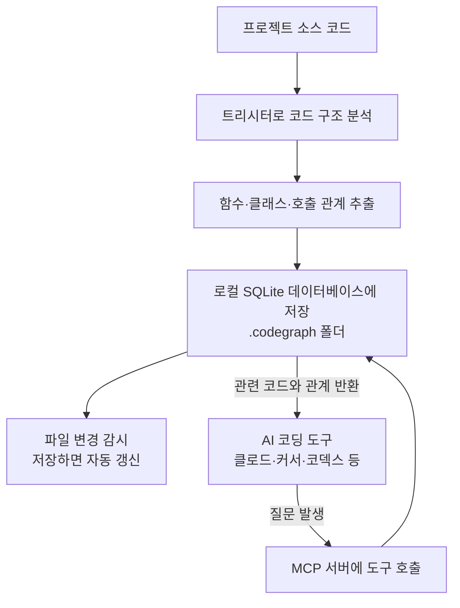

<div class="ai-knowledge-shell">

<aside class="ai-knowledge-sidebar">
  <p class="ai-eyebrow">CATEGORIES</p>
  <nav class="ai-cat-tree"><details class="ai-cat" open><summary><span class="catname">에이전트 오케스트레이션</span><span class="catcount">3</span></summary><ul><li><a href="https://altjs4510.github.io/ai_news_blog/knowledge/20260520/"><span class="kdate">2026-05-20</span><span class="ktitle">New in Claude Managed Agents: self-hosted sandbo…</span></a></li><li><a href="https://altjs4510.github.io/ai_news_blog/knowledge/20260507/"><span class="kdate">2026-05-07</span><span class="ktitle">ruvnet/ruflo — Claude 멀티 에이전트 오케스트레이션 플랫폼</span></a></li><li><a href="https://altjs4510.github.io/ai_news_blog/knowledge/20260504/"><span class="kdate">2026-05-04</span><span class="ktitle">Agents for Everything Else: Codex for Knowledge …</span></a></li></ul></details><details class="ai-cat" open><summary><span class="catname">MCP &amp; 도구 통합</span><span class="catcount">5</span></summary><ul><li><a href="https://altjs4510.github.io/ai_news_blog/knowledge/20260526/" class="current"><span class="kdate">2026-05-26</span><span class="ktitle">colbymchenry/codegraph — Pre-indexed code knowle…</span></a></li><li><a href="https://altjs4510.github.io/ai_news_blog/knowledge/20260523/"><span class="kdate">2026-05-23</span><span class="ktitle">colbymchenry/codegraph — 사전 인덱싱된 코드 지식 그래프 MCP</span></a></li><li><a href="https://altjs4510.github.io/ai_news_blog/knowledge/20260519/"><span class="kdate">2026-05-19</span><span class="ktitle">Anthropic acquires Stainless</span></a></li><li><a href="https://altjs4510.github.io/ai_news_blog/knowledge/20260517/"><span class="kdate">2026-05-17</span><span class="ktitle">I gave my LLM 100,000+ tools — Lazy Discovery &a…</span></a></li><li><a href="https://altjs4510.github.io/ai_news_blog/knowledge/20260509/"><span class="kdate">2026-05-09</span><span class="ktitle">How to connect 100 MCP servers without the conte…</span></a></li></ul></details><details class="ai-cat" open><summary><span class="catname">코딩 에이전트</span><span class="catcount">7</span></summary><ul><li><a href="https://altjs4510.github.io/ai_news_blog/knowledge/20260524/"><span class="kdate">2026-05-24</span><span class="ktitle">colbymchenry/codegraph — Pre-indexed code knowle…</span></a></li><li><a href="https://altjs4510.github.io/ai_news_blog/knowledge/20260521/"><span class="kdate">2026-05-21</span><span class="ktitle">colbymchenry/codegraph — Pre-indexed code knowle…</span></a></li><li><a href="https://altjs4510.github.io/ai_news_blog/knowledge/20260512/"><span class="kdate">2026-05-12</span><span class="ktitle">agentmemory — Persistent memory for AI coding ag…</span></a></li><li><a href="https://altjs4510.github.io/ai_news_blog/knowledge/20260510/"><span class="kdate">2026-05-10</span><span class="ktitle">addyosmani/agent-skills — Production-grade engin…</span></a></li><li><a href="https://altjs4510.github.io/ai_news_blog/knowledge/20260508/"><span class="kdate">2026-05-08</span><span class="ktitle">addyosmani/agent-skills — Production-grade engin…</span></a></li><li><a href="https://altjs4510.github.io/ai_news_blog/knowledge/20260506/"><span class="kdate">2026-05-06</span><span class="ktitle">mksglu/context-mode — AI 코딩 에이전트용 컨텍스트 윈도우 최적화</span></a></li><li><a href="https://altjs4510.github.io/ai_news_blog/knowledge/20260505/"><span class="kdate">2026-05-05</span><span class="ktitle">mattpocock/skills — Skills for Real Engineers (.…</span></a></li></ul></details><details class="ai-cat" open><summary><span class="catname">모델 &amp; 연구</span><span class="catcount">2</span></summary><ul><li><a href="https://altjs4510.github.io/ai_news_blog/knowledge/20260516/"><span class="kdate">2026-05-16</span><span class="ktitle">STALE — 에이전트가 자기 기억의 유효성을 인지할 수 있는가</span></a></li><li><a href="https://altjs4510.github.io/ai_news_blog/knowledge/20260513/"><span class="kdate">2026-05-13</span><span class="ktitle">Thinking Machines' Native Interaction Models — T…</span></a></li></ul></details><details class="ai-cat" open><summary><span class="catname">인프라 &amp; 컴퓨트</span><span class="catcount">1</span></summary><ul><li><a href="https://altjs4510.github.io/ai_news_blog/knowledge/20260522/"><span class="kdate">2026-05-22</span><span class="ktitle">Giving Agents Computers — Ivan Burazin, Daytona</span></a></li></ul></details><details class="ai-cat" open><summary><span class="catname">응용 사례</span><span class="catcount">2</span></summary><ul><li><a href="https://altjs4510.github.io/ai_news_blog/knowledge/20260515/"><span class="kdate">2026-05-15</span><span class="ktitle">Clawdmeter — Claude Code 사용량을 데스크톱 대시보드로</span></a></li><li><a href="https://altjs4510.github.io/ai_news_blog/knowledge/20260514/"><span class="kdate">2026-05-14</span><span class="ktitle">Introducing Claude for Small Business</span></a></li></ul></details></nav>
</aside>

<article class="ai-knowledge-article">

<header class="ai-post-hero">
  <p class="ai-eyebrow"><a class="ai-back" href="../">KNOWLEDGE</a> · 2026-05-26 · 오늘의 학습</p>
  <h2 class="ai-post-title">colbymchenry/codegraph — Pre-indexed code knowledge graph for Claude Code, Codex, Cursor</h2>
</header>

> 원문: [colbymchenry/codegraph — Pre-indexed code knowledge graph for Claude Code, Codex, Cursor](https://github.com/colbymchenry/codegraph)

## 📌 학습 정리

### 1. 한 줄로 말하면

코드를 미리 읽어서 "어디에 뭐가 있고, 누가 누구를 부르는지" 지도를 만들어 두는 도구예요. 그래서 AI 코딩 도우미가 매번 파일을 일일이 뒤지지 않고도 답을 빨리 찾게 해줍니다.

### 2. 왜 이게 만들어졌어요?

요즘 많이 쓰는 AI 코딩 도구들(클로드 코드, 커서, 코덱스 같은 것들)은 사용자의 질문에 답하려고 코드베이스를 직접 탐색해요. "이 기능은 어디에 있지?" 싶으면 파일 목록을 훑고(glob), 텍스트로 검색하고(grep), 파일을 열어서 읽어보는(Read) 식이죠. 문제는 이 과정에서 토큰을 엄청 쓴다는 거예요. 큰 프로젝트일수록 보조 에이전트(sub-agent)까지 여럿 띄워서 파일을 뒤지니 비용도 올라가고 시간도 오래 걸립니다. CodeGraph는 "어차피 코드 구조는 미리 분석해 둘 수 있는 거잖아?"라는 생각에서 출발해, 한 번 인덱싱해 둔 지도를 AI에게 건네주자는 발상으로 만들어졌어요.

### 3. 비유로 풀면

도서관에서 책을 찾는 상황을 떠올려 보세요. 색인 카드(요즘은 검색 시스템)가 없다면 사서는 서가를 한 칸씩 돌면서 책을 직접 펼쳐 봐야 해요. 색인이 있다면 "이 주제는 이 칸, 이 책 몇 페이지"라고 바로 답할 수 있죠.

또는 이렇게 봐도 좋아요. 처음 가는 도시에서 길을 찾을 때, 매번 골목을 직접 걸어보며 지도를 그리는 것과, 누가 미리 만들어 둔 내비게이션 앱을 켜는 것의 차이입니다.

그래서 결국 CodeGraph는 AI 코딩 도구가 매번 코드를 헤집어 다니지 않도록, 코드의 구조와 호출 관계를 미리 정리해 둔 "코드용 내비게이션"인 셈이에요.

### 4. 어떻게 작동하는지 (그림으로)



흐름을 풀어보면 이래요. 먼저 프로젝트를 한 번 인덱싱하면, 트리시터(tree-sitter)라는 파서로 소스 코드를 분석해서 함수·클래스 같은 단위와 그들 사이의 호출/상속 관계를 뽑아내고, 로컬 SQLite 파일에 저장합니다. 그다음부터는 AI 도구가 질문을 받았을 때 파일을 일일이 읽는 대신 이 데이터베이스에 "이 기능 어디 있어?", "이 함수 부르는 곳은?" 하고 묻고 답을 받아요. 코드를 수정하면 운영체제의 파일 변경 이벤트를 감지해 인덱스가 자동으로 따라옵니다.

### 5. 처음 보는 용어 풀이

- **지식 그래프 (knowledge graph)** — 정보를 "노드(점)"와 "엣지(선)"로 연결해 표현한 지도예요. 여기서는 함수·클래스가 노드, 호출·상속 관계가 엣지가 됩니다.
- **MCP 서버 (Model Context Protocol server)** — AI 도구가 외부 도구나 데이터에 접근할 때 쓰는 표준 통신 방식이에요. CodeGraph는 이 규격에 맞춰 "검색해줘", "호출자 찾아줘" 같은 도구를 AI에게 노출합니다.
- **툴 콜 (tool call)** — AI가 작업을 하려고 외부 도구(파일 읽기, 검색 등)를 호출하는 행위예요. 호출이 많아질수록 시간도 비용도 늘어납니다.
- **트리시터 (tree-sitter)** — 소스 코드를 빠르게 분석해 구조(추상 구문 트리, AST)로 바꿔주는 파서 라이브러리예요. 19개 넘는 언어를 지원하는 토대가 됩니다.
- **전문 검색 (full-text search, FTS5)** — SQLite에 내장된 텍스트 검색 기능이에요. "이름으로 함수 찾기" 같은 질의를 빠르게 처리해 줍니다.
- **호출 그래프 (call graph)** — "어떤 함수가 어떤 함수를 부르는지"를 화살표로 이은 그림이에요. 코드를 고치기 전에 영향 범위를 가늠할 때 유용합니다.
- **헤드리스 실행 (headless)** — 사람이 화면 앞에 앉아 대화하지 않고, 명령어로 자동 실행하는 방식이에요. 벤치마크에서 두 환경을 공정하게 비교할 때 썼습니다.
- **WAL 모드 (Write-Ahead Logging)** — SQLite가 읽기와 쓰기를 동시에 처리할 수 있게 해주는 저장 방식이에요. 덕분에 인덱스를 갱신하는 중에도 AI가 막힘없이 조회할 수 있습니다.
- **프레임워크 인식 라우트 (framework-aware routes)** — 장고·플라스크·익스프레스 같은 웹 프레임워크의 URL 설정을 알아채고, URL과 그것을 처리하는 함수를 연결해 주는 기능이에요.

### 6. 한 발 더 들어가고 싶다면

- [CodeGraph 공식 문서 사이트](https://colbymchenry.github.io/codegraph/) — 설치부터 도구별 사용법까지 정리된 곳이에요.
- [npm 패키지 페이지](https://www.npmjs.com/package/@colbymchenry/codegraph) — Node.js 환경에서 바로 설치하고 싶을 때 참고하면 됩니다.
- [tree-sitter 프로젝트](https://tree-sitter.github.io/) — CodeGraph가 코드 구조를 어떻게 뽑아내는지, 그 밑단의 파서가 궁금할 때 보면 좋아요.

---

## 📖 원문 전체 번역 (정독용)

> 의역 최소화한 전체 번역입니다. 큰 흐름은 위 정리에서 잡고, 정확한 워딩이 필요할 땐 이 섹션에서 정독하세요.

## Claude Code, Cursor, Codex, OpenCode, Hermes Agent를 시맨틱 코드 인텔리전스로 강화하세요

**약 35% 비용 절감 · 약 70% 적은 도구 호출 수 · 100% 로컬**

### [문서 & 웹사이트 →](https://colbymchenry.github.io/codegraph/)

## 시작하기

**Node.js 불필요** — 명령어 하나로 운영체제에 맞는 빌드를 받을 수 있습니다:

```bash
# macOS / Linux
curl -fsSL https://raw.githubusercontent.com/colbymchenry/codegraph/main/install.sh | sh

# Windows (PowerShell)
irm https://raw.githubusercontent.com/colbymchenry/codegraph/main/install.ps1 | iex
```

이미 Node가 있다면 npm을 사용하세요 (어떤 버전에서도 동작):

```bash
npx @colbymchenry/codegraph        # 설치 없이 실행, 또는:
npm i -g @colbymchenry/codegraph
```

CodeGraph는 자체 런타임을 내장하고 있어 컴파일이 필요 없고, 네이티브 빌드도 필요 없으며, 어디서나 동일하게 동작합니다. 인터랙티브 설치 프로그램이 에이전트(Claude Code, Cursor, Codex CLI, opencode, Hermes Agent)를 자동으로 구성합니다.

### 프로젝트 초기화

```bash
cd your-project
codegraph init -i
```

### 제거

마음이 바뀌셨나요? 명령어 하나로 CodeGraph가 구성한 모든 에이전트에서 제거할 수 있습니다:

```bash
codegraph uninstall
```

설치 프로그램의 역작업 — 각 구성된 에이전트에서 CodeGraph의 MCP 서버 설정, 지침, 권한을 제거합니다. 프로젝트 인덱스(`.codegraph/`)는 그대로 유지되며, 프로젝트별 제거는 `codegraph uninit`으로 수행합니다. `--target`으로 특정 에이전트에서만 제거하거나, `--yes`로 비대화형 모드로 실행할 수 있습니다.

---

## CodeGraph를 사용하는 이유

Claude Code가 코드베이스를 탐색할 때, grep, glob, Read를 사용해 파일을 스캔하는 **Explore 에이전트**를 생성하여 모든 도구 호출마다 토큰을 소비합니다.

**CodeGraph는 그 에이전트들에게 사전 인덱싱된 지식 그래프를 제공합니다** — 심볼 관계, 호출 그래프, 코드 구조 정보를 포함합니다. 에이전트는 파일을 스캔하는 대신 그래프를 즉시 조회합니다.

### 벤치마크 결과

**7개 언어에 걸친 실제 오픈소스 코드베이스 7개**를 대상으로, 에이전트(Claude Code, 헤드리스)가 아키텍처 관련 질문 하나에 답변할 때 CodeGraph **사용**과 **미사용**을 비교했습니다. 각 셀은 **arm당 4회 실행의 중앙값**에서의 절감량입니다. _**v0.9.4** (2026-05-24)에서 재검증됨._

> **평균: 35% 비용 절감 · 57% 적은 토큰 · 46% 빠른 속도 · 71% 적은 도구 호출**

| 코드베이스 | 언어 | 비용 | 토큰 | 시간 | 도구 호출 수 |
| --- | --- | --- | --- | --- | --- |
| **VS Code** | TypeScript · ~10,000개 파일 | 26% 절감 | 78% 감소 | 52% 단축 | 85% 감소 |
| **Excalidraw** | TypeScript · ~640개 | 52% 절감 | 90% 감소 | 73% 단축 | 96% 감소 |
| **Django** | Python · ~3,000개 | 12% 절감 | 36% 감소 | 19% 단축 | 53% 감소 |
| **Tokio** | Rust · ~790개 | 82% 절감 | 86% 감소 | 71% 단축 | 92% 감소 |
| **OkHttp** | Java · ~645개 | 2% 절감 | 13% 감소 | 31% 단축 | 45% 감소 |
| **Gin** | Go · ~110개 | 21% 절감 | 34% 감소 | 27% 단축 | 40% 감소 |
| **Alamofire** | Swift · ~110개 | 47% 절감 | 64% 감소 | 48% 단축 | 83% 감소 |

절감 효과는 코드베이스 크기에 비례하여 증가합니다. 대형 저장소에서는 에이전트가 **파일 읽기 없이** 몇 번의 호출만으로 인덱스에서 바로 답변하는 반면, CodeGraph 미사용 에이전트는 grep/find/Read에 걸쳐 광범위하게 탐색합니다(그리고 에이전트가 생성하는 서브 에이전트도 마찬가지입니다). Gin(~150개 파일)처럼 소규모 저장소에서는 네이티브 검색이 이미 저렴하기 때문에 차이가 줄어듭니다.

**전체 벤치마크 세부사항**

**방법론.** 각 arm은 `--strict-mcp-config`를 사용해 저장소에 대해 헤드리스로 실행된 `claude -p` (Claude Opus 4.7)입니다: **WITH** = CodeGraph의 MCP 서버 활성화, **WITHOUT** = 빈 MCP 설정. 내장된 Read/Grep/Bash는 두 경우 모두 사용 가능합니다. 저장소별 동일한 질문, **arm당 4회 실행, 중앙값 보고**. 비용 = 해당 실행의 `total_cost_usd`; 토큰 = 처리된 총 토큰 수 (캐시 포함 입력 + 출력); 시간 = 실제 경과 시간; 도구 호출 수 = 모델이 생성한 서브 에이전트 내부 호출 포함 모든 도구 호출. 저장소는 `--depth 1`로 클론 후 동일한 CodeGraph 빌드로 인덱싱됩니다. codegraph **v0.9.4** (2026-05-24)에서 재검증됨. 저장소별 수치는 without-arm이 얼마나 격렬하게 탐색하느냐에 따라 실행마다 달라집니다(4회 중앙값으로 평활화하지만 꼬리는 남음 — 예: Tokio의 without-arm은 한 배치에서 $2.41/3분에 도달).

**질의:**

| 코드베이스 | 질의 |
| --- | --- |
| VS Code | "익스텐션 호스트는 메인 프로세스와 어떻게 통신하는가?" |
| Excalidraw | "Excalidraw는 캔버스 요소를 어떻게 렌더링하고 업데이트하는가?" |
| Django | "Django의 ORM은 QuerySet에서 쿼리를 어떻게 빌드하고 실행하는가?" |
| Tokio | "tokio는 런타임에서 비동기 태스크를 어떻게 스케줄링하고 실행하는가?" |
| OkHttp | "OkHttp는 인터셉터 체인을 통해 요청을 어떻게 처리하는가?" |
| Gin | "gin은 미들웨어 체인을 통해 요청을 어떻게 라우팅하는가?" |
| Alamofire | "Alamofire는 요청을 어떻게 빌드, 전송, 검증하는가?" |

**원시 중앙값 — WITH → WITHOUT:**

| 코드베이스 | 비용 | 토큰 | 시간 | 도구 호출 수 |
| --- | --- | --- | --- | --- |
| VS Code | $0.60 → $0.80 | 601k → 2.8M | 1분 10초 → 2분 26초 | 8 → 55 |
| Excalidraw | $0.43 → $0.90 | 344k → 3.5M | 48초 → 2분 58초 | 3 → 79 |
| Django | $0.59 → $0.67 | 739k → 1.2M | 1분 19초 → 1분 38초 | 9 → 19 |
| Tokio | $0.42 → $2.41 | 379k → 2.6M | 53초 → 3분 2초 | 4 → 53 |
| OkHttp | $0.47 → $0.47 | 636k → 730k | 42초 → 1분 1초 | 6 → 11 |
| Gin | $0.37 → $0.47 | 444k → 675k | 44초 → 1분 0초 | 6 → 10 |
| Alamofire | $0.61 → $1.14 | 1.0M → 2.8M | 1분 17초 → 2분 27초 | 12 → 69 |

**CodeGraph가 우위를 점하는 이유:** 인덱스가 있으면 에이전트는 직접 답변합니다 — 영역을 파악하기 위한 `codegraph_context` 한 번, 관련 소스를 위한 `codegraph_explore` 한 번으로 종료되며, 보통 파일 읽기가 전혀 없습니다. 인덱스가 없으면 에이전트(그리고 에이전트가 생성하는 Explore 서브 에이전트)는 올바른 코드를 읽기 전에 발견(find/ls/grep)에 예산 대부분을 소비합니다. CodeGraph는 _직접_ 쿼리될 때만 도움이 되므로, 지침은 에이전트가 탐색을 파일 읽기 서브 에이전트에 위임하는 대신 직접 답변하도록 유도합니다 — 그렇지 않으면 서브 에이전트가 어차피 파일을 읽게 되어 CodeGraph가 오버헤드가 됩니다.

---

## 주요 기능

|  |  |
| --- | --- |
| **스마트 컨텍스트 빌딩** | 단 한 번의 도구 호출로 진입점, 관련 심볼, 코드 스니펫 반환 — 비용이 많이 드는 탐색 에이전트 불필요 |
| **전문 검색 (Full-Text Search)** | FTS5 기반으로 전체 코드베이스에서 이름으로 코드를 즉시 검색 |
| **영향 분석 (Impact Analysis)** | 변경 전에 임의 심볼의 호출자, 피호출자, 전체 영향 범위 추적 |
| **항상 최신 상태** | 파일 감시자가 네이티브 OS 이벤트(FSEvents/inotify/ReadDirectoryChangesW)와 디바운스 자동 동기화를 사용 — 코딩 중에도 그래프가 최신 상태 유지, 설정 불필요 |
| **19개 이상 언어** | TypeScript, JavaScript, Python, Go, Rust, Java, C#, PHP, Ruby, C, C++, Swift, Kotlin, Dart, Lua, Luau, Svelte, Liquid, Pascal/Delphi |
| **프레임워크 인식 라우트** | 웹 프레임워크 라우팅 파일을 인식하고 14개 프레임워크에서 URL 패턴을 핸들러와 연결 |
| **100% 로컬** | 데이터가 머신 밖으로 나가지 않습니다. API 키 불필요. 외부 서비스 불필요. SQLite 데이터베이스만 사용 |

---

## 프레임워크 인식 라우트

CodeGraph는 웹 프레임워크 라우팅 파일을 감지하고 `references` 엣지로 핸들러 클래스 또는 함수에 연결된 `route` 노드를 생성합니다. 뷰/컨트롤러의 호출자를 조회하면 이제 그것을 바인딩하는 URL 패턴도 표시됩니다.

| 프레임워크 | 인식되는 형태 |
| --- | --- |
| **Django** | `urls.py`의 `path()`, `re_path()`, `url()`, `include()` (CBV `.as_view()`, 점 경로) |
| **Flask** | `@app.route('/path', methods=[...])`, 블루프린트 라우트 |
| **FastAPI** | `@app.get(...)`, `@router.post(...)`, 모든 표준 메서드 |
| **Express** | 미들웨어 체인을 포함한 `app.get(...)`, `router.post(...)` |
| **NestJS** | `@Controller` + `@Get/@Post/...`, GraphQL `@Resolver` + `@Query/@Mutation`, `@MessagePattern`/`@EventPattern`, `@SubscribeMessage` |
| **Laravel** | `Route::get()`, `Route::resource()`, `Controller@action`, 튜플 문법 |
| **Drupal** | `*.routing.yml` 라우트 (`_controller`, `_form`, 엔티티 핸들러); `.module`/`.theme`/`.install`/`.inc`의 `hook_*` 구현 |
| **Rails** | `get '/x', to: 'users#index'`, 해시 로켓 `=>` 문법 |
| **Spring** | 메서드의 `@GetMapping`, `@PostMapping`, `@RequestMapping` |
| **Gin / chi / gorilla / mux** | `r.GET(...)`, `router.HandleFunc(...)` |
| **Axum / actix / Rocket** | `.route("/x", get(handler))` |
| **ASP.NET** | 액션 메서드의 `[HttpGet("/x")]` 어트리뷰트 |
| **Vapor** | `app.get("x", use: handler)` |
| **React Router** / **SvelteKit** | 라우트 컴포넌트 노드 |

---

## 빠른 시작

### 1. 설치 프로그램 실행

```bash
npx @colbymchenry/codegraph
```

설치 프로그램이 수행하는 작업:

- 구성할 에이전트 선택 — 설치된 에이전트를 자동 감지: **Claude Code**, **Cursor**, **Codex CLI**, **opencode**, **Hermes Agent**
- PATH에 `codegraph` 설치 여부 확인 (에이전트가 MCP 서버를 실행할 수 있도록)
- 설정을 모든 프로젝트에 적용할지 현재 프로젝트에만 적용할지 선택
- 선택된 각 에이전트의 MCP 서버 설정 + 지침 파일 작성 (예: `CLAUDE.md`, `.cursor/rules/codegraph.mdc`, `~/.codex/AGENTS.md`)
- Claude Code가 대상 중 하나일 경우 자동 허용 권한 설정
- 현재 프로젝트 초기화 (로컬 설치 시에만)

**비대화형 (스크립팅 / CI):**

```bash
codegraph install --yes                              # 에이전트 자동 감지, 전역 설치
codegraph install --target=cursor,claude --yes       # 명시적 대상 목록
codegraph install --target=auto --location=local     # 감지된 에이전트, 프로젝트 로컬
codegraph install --print-config codex               # 스니펫 출력, 파일 쓰기 없음
```

| 플래그 | 값 | 기본값 |
| --- | --- | --- |
| `--target` | `auto`, `all`, `none`, 또는 csv (`claude,cursor,...`) | 프롬프트 |
| `--location` | `global`, `local` | 프롬프트 |
| `--yes` | (boolean) | 매 단계 프롬프트 |
| `--no-permissions` | (boolean) Claude 자동 허용 목록 건너뜀 | 권한 활성화 |
| `--print-config <id>` | 하나의 에이전트 스니펫 출력 후 종료 | — |

### 2. 에이전트 재시작

MCP 서버가 로드되도록 에이전트(Claude Code / Cursor / Codex CLI / opencode / Hermes Agent)를 재시작하세요.

### 3. 프로젝트 초기화

```bash
cd your-project
codegraph init -i
```

프로젝트별 지식 그래프 인덱스를 빌드합니다. 프로젝트 로컬 에이전트 인터페이스(예: Cursor의 `.cursor/rules/codegraph.mdc`)도 연결하여 전역 `codegraph install` 한 번으로 열리는 모든 프로젝트에서 작동 — 프로젝트마다 설치 프로그램을 다시 실행할 필요 없음.

이것으로 완료 — `.codegraph/` 디렉토리가 존재하면 에이전트가 CodeGraph 도구를 자동으로 사용합니다.

**수동 설정 (대안)**

**전역 설치:**

```bash
npm install -g @colbymchenry/codegraph
```

**`~/.claude.json`에 추가:**

```json
{
  "mcpServers": {
    "codegraph": {
      "type": "stdio",
      "command": "codegraph",
      "args": ["serve", "--mcp"]
    }
  }
}
```

**`~/.claude/settings.json`에 추가 (선택사항, 자동 허용용):**

```json
{
  "permissions": {
    "allow": [
      "mcp__codegraph__codegraph_search",
      "mcp__codegraph__codegraph_context",
      "mcp__codegraph__codegraph_callers",
      "mcp__codegraph__codegraph_callees",
      "mcp__codegraph__codegraph_impact",
      "mcp__codegraph__codegraph_node",
      "mcp__codegraph__codegraph_status",
      "mcp__codegraph__codegraph_files"
    ]
  }
}
```

**전역 지침 참조**

설치 프로그램은 `~/.claude/CLAUDE.md`에 다음 지침을 자동으로 추가합니다:

```
## CodeGraph

CodeGraph는 빠르고 스마트한 코드 탐색을 위해 코드베이스의 시맨틱 지식 그래프를 빌드합니다.

### 프로젝트에 `.codegraph/`가 존재하는 경우

**CodeGraph로 직접 답변하세요 — 파일 읽기 서브 에이전트나 grep/read 루프에 탐색을 위임하지 마세요.**
CodeGraph는 사전 빌드된 검색 인덱스입니다; grep + Read로 그 답변을 재도출하는 것은 이미 수행한 작업을 반복하는 것이며 같은 결과에 더 많은 비용이 듭니다.
"X는 어떻게 동작하는가?", 아키텍처, 추적, 또는 X 위치 질문에 대해 몇 번의 CodeGraph 호출로 답변하고 중지하세요 — 일반적으로 **파일 읽기 없이**. 반환된 소스는 완전하고 권위 있습니다: 이미 읽은 것으로 취급하고 해당 파일을 다시 열지 마세요. CodeGraph가 다루지 않은 특정 세부 사항을 확인할 때만 원시 Read/Grep를 사용하세요.

**의도에 따른 도구 선택:**

| 도구 | 사용 시점 |
|------|---------|
| `codegraph_context` | 먼저 작업 / 기능 / 영역 파악 — 검색 + 노드 + 호출자 + 피호출자를 한 번의 호출로 구성 |
| `codegraph_trace` | "X가 Y에 어떻게 도달하는가" — 호출 경로, 각 홉의 본문 인라인 포함 (grep이 불가능한 동적 디스패치 홉 추적) |
| `codegraph_explore` | 한 번의 예산 제한 호출로 여러 관련 심볼의 소스 조사 |
| `codegraph_search` | 이름으로 심볼 찾기 |
| `codegraph_callers` / `codegraph_callees` | 한 홉씩 호출 흐름 탐색 |
| `codegraph_impact` | 편집 전에 영향받는 것 확인 |
| `codegraph_node` | 단일 심볼의 소스/시그니처 가져오기 |

직접 CodeGraph 답변은 몇 번의 호출이면 됩니다; grep/read 탐색은 수십 번입니다.

### `.codegraph/`가 존재하지 않는 경우

세션 시작 시 사용자에게 CodeGraph 초기화 여부를 확인하세요:

"이 프로젝트에 CodeGraph가 초기화되지 않은 것을 발견했습니다. 코드 지식 그래프를 빌드하기 위해 `codegraph init -i`를 실행하시겠습니까?"
```

---

## 동작 방식

```
┌───────────────────────────────────────────────────────────────────┐
│                            Claude Code                            │
│                                                                   │
│   "요청이 데이터베이스에 어떻게 도달하는가?"                        │
│       CodeGraph 도구를 직접 호출 — Explore 서브 에이전트 없음       │
│                                 │                                 │
└─────────────────────────────────┬─────────────────────────────────┘
                                  │
                                  ▼
┌───────────────────────────────────────────────────────────────────┐
│                        CodeGraph MCP 서버                         │
│                                                                   │
│       context · trace · explore · callers · callees · impact      │
│                                 │                                 │
│                                 ▼                                 │
│                       SQLite 지식 그래프                           │
│          심볼 · 엣지 · 파일 · FTS5 전문 검색                       │
└───────────────────────────────────────────────────────────────────┘
```

1. **추출** — [tree-sitter](https://tree-sitter.github.io/)가 소스 코드를 AST로 파싱합니다. 언어별 쿼리가 노드(함수, 클래스, 메서드)와 엣지(호출, 임포트, 확장, 구현)를 추출합니다.

2. **저장** — 모든 내용이 FTS5 전문 검색이 적용된 로컬 SQLite 데이터베이스(`.codegraph/codegraph.db`)에 저장됩니다.

3. **해석** — 추출 후 참조를 해석합니다: 함수 호출 → 정의, 임포트 → 소스 파일, 클래스 상속, 프레임워크별 패턴.

4. **자동 동기화** — MCP 서버가 네이티브 OS 파일 이벤트를 사용해 프로젝트를 감시합니다. 변경 사항은 디바운스(2초 정지 구간)되고, 소스 파일만 필터링하여 증분 동기화됩니다. 설정 없이 코딩 중에도 그래프가 최신 상태로 유지됩니다.

---

## CLI 참조

```bash
codegraph                         # 인터랙티브 설치 프로그램 실행
codegraph install                 # 설치 프로그램 실행 (명시적)
codegraph uninstall               # 에이전트에서 CodeGraph 제거 (install의 역작업)
codegraph init [path]             # 프로젝트 초기화 (--index로 인덱싱도 함께)
codegraph uninit [path]           # 프로젝트에서 CodeGraph 제거 (--force로 확인 건너뜀)
codegraph index [path]            # 전체 인덱스 (--force로 재인덱스, --quiet로 출력 감소)
codegraph sync [path]             # 증분 업데이트
codegraph status [path]           # 통계 표시
codegraph query <search>          # 심볼 검색 (--kind, --limit, --json)
codegraph files [path]            # 파일 구조 표시 (--format, --filter, --max-depth, --json)
codegraph context <task>          # AI용 컨텍스트 빌드 (--format, --max-nodes)
codegraph callers <symbol>        # 함수/메서드를 호출하는 것 찾기 (--limit, --json)
codegraph callees <symbol>        # 함수/메서드가 호출하는 것 찾기 (--limit, --json)
codegraph impact <symbol>         # 심볼 변경으로 영향받는 코드 분석 (--depth, --json)
codegraph affected [files...]     # 변경에 의해 영향받는 테스트 파일 찾기 (아래 참조)
codegraph serve --mcp             # MCP 서버 시작
```

### `codegraph affected`

변경된 소스 파일에 의해 영향받는 테스트 파일을 찾기 위해 임포트 의존성을 재귀적으로 추적합니다.

```bash
codegraph affected src/utils.ts src/api.ts         # 인수로 파일 전달
git diff --name-only | codegraph affected --stdin   # git diff에서 파이프
codegraph affected src/auth.ts --filter "e2e/*"     # 커스텀 테스트 파일 패턴
```

| 옵션 | 설명 | 기본값 |
| --- | --- | --- |
| `--stdin` | stdin에서 파일 목록 읽기 | `false` |
| `-d, --depth <n>` | 최대 의존성 탐색 깊이 | `5` |
| `-f, --filter <glob>` | 테스트 파일 식별용 커스텀 glob | 자동 감지 |
| `-j, --json` | JSON으로 출력 | `false` |
| `-q, --quiet` | 파일 경로만 출력 | `false` |

**CI/훅 예시:**

```bash
#!/usr/bin/env bash
AFFECTED=$(git diff --name-only HEAD | codegraph affected --stdin --quiet)
if [ -n "$AFFECTED" ]; then
  npx vitest run $AFFECTED
fi
```

---

## MCP 도구

MCP 서버로 실행 시 CodeGraph는 Claude Code에 다음 도구를 제공합니다:

| 도구 | 목적 |
| --- | --- |
| `codegraph_search` | 코드베이스 전체에서 이름으로 심볼 찾기 |
| `codegraph_context` | 작업에 관련된 코드 컨텍스트 빌드 |
| `codegraph_trace` | 두 심볼 사이의 호출 경로 추적("X가 Y에 어떻게 도달하는가") — 각 홉의 본문을 인라인으로 포함하며, grep이 추적할 수 없는 동적 디스패치 홉(콜백, React 재렌더링, 인터페이스→구현) 추적 |
| `codegraph_callers` | 함수를 호출하는 것 찾기 |
| `codegraph_callees` | 함수가 호출하는 것 찾기 |
| `codegraph_impact` | 심볼 변경으로 영향받는 코드 분석 |
| `codegraph_node` | 특정 심볼의 세부 정보 가져오기 (선택적으로 소스 코드 포함) |
| `codegraph_explore` | 파일별로 그룹화된 여러 관련 심볼의 소스와 관계 맵을 한 번의 호출로 반환 |
| `codegraph_files` | 인덱싱된 파일 구조 가져오기 (파일시스템 스캔보다 빠름) |
| `codegraph_status` | 인덱스 상태 및 통계 확인 |

---

## 라이브러리 사용법

```javascript
import CodeGraph from '@colbymchenry/codegraph';

const cg = await CodeGraph.init('/path/to/project');
// 또는: const cg = await CodeGraph.open('/path/to/project');

await cg.indexAll({
  onProgress: (p) => console.log(`${p.phase}: ${p.current}/${p.total}`)
});

const results = cg.searchNodes('UserService');
const callers = cg.getCallers(results[0].node.id);
const context = await cg.buildContext('fix login bug', { maxNodes: 20, includeCode: true, format: 'markdown' });
const impact = cg.getImpactRadius(results[0].node.id, 2);

cg.watch();   // 파일 변경 시 자동 동기화
cg.unwatch(); // 감시 중지
cg.close();
```

---

## 설정

설정이 없습니다 — CodeGraph는 설정 불필요(zero-config)입니다. [지원 언어](https://github.com/colbymchenry/codegraph#supported-languages)에 매핑되는 확장자를 가진 모든 파일을 인덱싱하며 **`.gitignore`를 준수합니다**: git 저장소에서는 git 자체를 통해, 비-git 프로젝트에서는 `.gitignore` 파일을 직접 읽어서(루트 및 중첩 파일, git과 동일한 방식으로).

실제로 의미하는 것:

- git이 무시하는 모든 것 — `node_modules`, 빌드 출력물, `.env`의 시크릿 — 은 절대 인덱싱되지 않습니다. **그래프에서 제외하려면 `.gitignore`에 추가하세요.**
- 작성하거나 동기화를 유지해야 할 설정 파일이 없으며, 언어별로 연결할 것도 없습니다: 지원은 파일 확장자에서 자동으로 이루어집니다.
- 1MB를 초과하는 파일은 건너뜁니다(생성된 번들, 압축된 JS, 벤더 블롭) — 유용한 심볼 없이 파싱 비용만 발생하기 때문입니다.

> gitignore에 없는 커밋된 파일은 `vendor/`나 커밋된 `dist/` 하위에 있더라도 _인덱싱됩니다_. 그래프에 원하지 않는 의존성이나 빌드 디렉토리를 커밋한 경우 `.gitignore`에 추가하세요.

## 지원 플랫폼

모든 릴리즈는 세 가지 데스크톱 OS 모두에서 Intel/AMD (x64) 및 ARM (arm64) 모두를 위한 자체 포함 빌드(번들된 Node 런타임 — 컴파일 불필요)를 제공합니다:

| 플랫폼 | 아키텍처 | 설치 방법 |
| --- | --- | --- |
| Windows | x64, arm64 | PowerShell 설치 프로그램 또는 npm |
| macOS | x64, arm64 | shell 설치 프로그램 또는 npm |
| Linux | x64, arm64 | shell 설치 프로그램 또는 npm |

한 줄 설치 명령어는 [시작하기](https://github.com/colbymchenry/codegraph#get-started)를 참조하세요.

## 지원 에이전트

인터랙티브 설치 프로그램이 다음 각각을 자동 감지하고 구성합니다 — MCP 서버를 연결하고 지침 파일을 작성합니다:

- **Claude Code**
- **Cursor**
- **Codex CLI**
- **opencode**
- **Hermes Agent**

## 지원 언어

| 언어 | 확장자 | 상태 |
| --- | --- | --- |
| TypeScript | `.ts`, `.tsx` | 완전 지원 |
| JavaScript | `.js`, `.jsx`, `.mjs` | 완전 지원 |
| Python | `.py` | 완전 지원 |
| Go | `.go` | 완전 지원 |
| Rust | `.rs` | 완전 지원 |
| Java | `.java` | 완전 지원 |
| C# | `.cs` | 완전 지원 |
| PHP | `.php` | 완전 지원 |
| Ruby | `.rb` | 완전 지원 |
| C | `.c`, `.h` | 완전 지원 |
| C++ | `.cpp`, `.hpp`, `.cc` | 완전 지원 |
| Swift | `.swift` | 완전 지원 |
| Kotlin | `.kt`, `.kts` | 완전 지원 |
| Scala | `.scala`, `.sc` | 완전 지원 (클래스, 트레이트, 메서드, 타입 별칭, Scala 3 열거형) |
| Dart | `.dart` | 완전 지원 |
| Svelte | `.svelte` | 완전 지원 (스크립트 추출, Svelte 5 runes, SvelteKit 라우트) |
| Vue | `.vue` | 완전 지원 (script + script-setup 추출, Nuxt 페이지/API/미들웨어 라우트) |
| Liquid | `.liquid` | 완전 지원 |
| Pascal / Delphi | `.pas`, `.dpr`, `.dpk`, `.lpr` | 완전 지원 (클래스, 레코드, 인터페이스, 열거형, DFM/FMX 폼 파일) |
| Lua | `.lua` | 완전 지원 (함수, 리시버가 있는 메서드, 지역 변수, `require` 임포트, 호출 엣지) |
| Luau | `.luau` | 완전 지원 (Lua의 모든 것 포함, 추가로 `type`/`export type` 별칭, 타입이 지정된 시그니처, Roblox 인스턴스 경로 `require`) |

## 문제 해결

**"CodeGraph not initialized"** — 먼저 프로젝트 디렉토리에서 `codegraph init`을 실행하세요.

**인덱싱이 느림** — `node_modules` 및 다른 대형 디렉토리가 제외되어 있는지 확인하세요. `--quiet`를 사용해 출력 오버헤드를 줄이세요.

**MCP에서 `database is locked` 발생** — 현재 빌드에서는 발생하지 않아야 합니다: CodeGraph는 자체 Node 런타임을 번들로 포함하며 WAL 모드에서 Node 내장 `node:sqlite`를 사용하므로, 동시 읽기는 쓰기에 의해 차단되지 않습니다. 그래도 발생한다면:

- **구 버전(0.9 이전) 설치입니다.** 번들된 런타임을 얻으려면 재설치하세요 — `curl -fsSL https://raw.githubusercontent.com/colbymchenry/codegraph/main/install.sh | sh` (macOS/Linux), `irm https://raw.githubusercontent.com/colbymchenry/codegraph/main/install.ps1 | iex` (Windows), 또는 `npm i -g @colbymchenry/codegraph@latest`.
- **`codegraph status`에서 `Journal:`이 `wal` 이외의 값 표시** — 이 파일시스템에서 WAL을 활성화할 수 없습니다(네트워크 공유 및 WSL2 `/mnt`에서 일반적), 따라서 읽기가 쓰기에 의해 차단될 수 있습니다. 프로젝트(`.codegraph/` 폴더 포함)를 로컬 디스크로 이동하세요.

**MCP 서버가 연결되지 않음** — 프로젝트가 초기화/인덱싱되었는지 확인하고, MCP 설정의 경로를 검증하며, 명령줄에서 `codegraph serve --mcp`가 동작하는지 확인하세요.

**심볼 누락** — MCP 서버가 저장 시 자동 동기화합니다(몇 초 기다리세요). 필요하면 `codegraph sync`를 수동으로 실행하세요. 파일의 언어가 지원되는지, 설정 패턴에 의해 제외되지 않는지 확인하세요.

</article>

</div>
