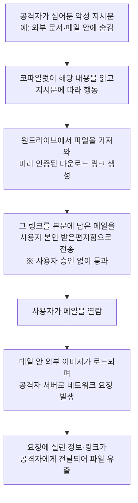

<aside class="ai-knowledge-sidebar">
  
CATEGORIES

  <nav class="ai-cat-tree">

에이전트 오케스트레이션5
<ul><li><a href="https://altjs4510.github.io/ai_news_blog/knowledge/20260623/">2026-06-23bytedance/deer-flow — 샌드박스·메모리·서브에이전트·메시지 게이트웨이를…</a></li><li><a href="https://altjs4510.github.io/ai_news_blog/knowledge/20260621/">2026-06-21calesthio/OpenMontage — 12 파이프라인·52 도구·500+ 스킬을 …</a></li><li><a href="https://altjs4510.github.io/ai_news_blog/knowledge/20260602/">2026-06-02revfactory/harness — 도메인별 에이전트 팀과 스킬을 자동 설계하는 메타…</a></li><li><a href="https://altjs4510.github.io/ai_news_blog/knowledge/20260529/">2026-05-29Introducing dynamic workflows in Claude Code</a></li><li><a href="https://altjs4510.github.io/ai_news_blog/knowledge/20260507/">2026-05-07ruvnet/ruflo — Claude 멀티 에이전트 오케스트레이션 플랫폼</a></li></ul>

MCP &amp; 도구 통합20
<ul><li><a href="https://altjs4510.github.io/ai_news_blog/knowledge/20260724/">2026-07-24diegosouzapw/OmniRoute — 단일 엔드포인트로 278+ 프로바이더·50…</a></li><li><a href="https://altjs4510.github.io/ai_news_blog/knowledge/20260723/">2026-07-23diegosouzapw/OmniRoute — 268+ 프로바이더를 단일 엔드포인트로 묶…</a></li><li><a href="https://altjs4510.github.io/ai_news_blog/knowledge/20260722/">2026-07-22tirth8205/code-review-graph — MCP·CLI용 로컬 우선 코드 …</a></li><li><a href="https://altjs4510.github.io/ai_news_blog/knowledge/20260721/">2026-07-21tirth8205/code-review-graph — 로컬 우선 코드 인텔리전스 그래프…</a></li><li><a href="https://altjs4510.github.io/ai_news_blog/knowledge/20260719/">2026-07-19tirth8205/code-review-graph — 로컬 우선 코드 인텔리전스 그래프…</a></li><li><a href="https://altjs4510.github.io/ai_news_blog/knowledge/20260718/">2026-07-18tirth8205/code-review-graph — MCP·CLI용 로컬 코드 인텔리…</a></li><li><a href="https://altjs4510.github.io/ai_news_blog/knowledge/20260709/">2026-07-09mvanhorn/last30days-skill — Reddit·X·YouTube·HN·…</a></li><li><a href="https://altjs4510.github.io/ai_news_blog/knowledge/20260708/">2026-07-08Expanding Managed Agents in Gemini API: backgrou…</a></li><li><a href="https://altjs4510.github.io/ai_news_blog/knowledge/20260701/">2026-07-01Google OKF (Open Knowledge Format) — 벤더 중립 에이전트 …</a></li><li><a href="https://altjs4510.github.io/ai_news_blog/knowledge/20260618/">2026-06-18DeusData/codebase-memory-mcp — 158개 언어 코드베이스를 밀리…</a></li><li><a href="https://altjs4510.github.io/ai_news_blog/knowledge/20260609/">2026-06-09Building intelligent apps for Apple platforms wi…</a></li><li><a href="https://altjs4510.github.io/ai_news_blog/knowledge/20260606/">2026-06-06chopratejas/headroom — Compress tool outputs, lo…</a></li><li><a href="https://altjs4510.github.io/ai_news_blog/knowledge/20260605/">2026-06-05chopratejas/headroom — Compress tool outputs, lo…</a></li><li><a href="https://altjs4510.github.io/ai_news_blog/knowledge/20260604/">2026-06-04chopratejas/headroom — Compress tool outputs bef…</a></li><li><a href="https://altjs4510.github.io/ai_news_blog/knowledge/20260603/">2026-06-03How Bad MCP design cost your Agent 5× more token…</a></li><li><a href="https://altjs4510.github.io/ai_news_blog/knowledge/20260526/">2026-05-26colbymchenry/codegraph — Pre-indexed code knowle…</a></li><li><a href="https://altjs4510.github.io/ai_news_blog/knowledge/20260523/">2026-05-23colbymchenry/codegraph — 사전 인덱싱된 코드 지식 그래프 MCP</a></li><li><a href="https://altjs4510.github.io/ai_news_blog/knowledge/20260517/">2026-05-17I gave my LLM 100,000+ tools — Lazy Discovery &a…</a></li><li><a href="https://altjs4510.github.io/ai_news_blog/knowledge/20260512/">2026-05-12agentmemory — Persistent memory for AI coding ag…</a></li><li><a href="https://altjs4510.github.io/ai_news_blog/knowledge/20260509/">2026-05-09How to connect 100 MCP servers without the conte…</a></li></ul>

코딩 에이전트15
<ul><li><a href="https://altjs4510.github.io/ai_news_blog/knowledge/20260725/">2026-07-25The new rules of context engineering for Claude …</a></li><li><a href="https://altjs4510.github.io/ai_news_blog/knowledge/20260716/">2026-07-16Dicklesworthstone/destructive_command_guard — 에이…</a></li><li><a href="https://altjs4510.github.io/ai_news_blog/knowledge/20260714/">2026-07-14Graphify-Labs/graphify — 코드베이스를 질의 가능한 지식 그래프로 만…</a></li><li><a href="https://altjs4510.github.io/ai_news_blog/knowledge/20260707/">2026-07-07AI Hero Skills Catalog — 실무 엔지니어를 위한 재사용 가능한 판단 …</a></li><li><a href="https://altjs4510.github.io/ai_news_blog/knowledge/20260705/">2026-07-05openai/codex-plugin-cc — Claude Code에서 Codex를 위임…</a></li><li><a href="https://altjs4510.github.io/ai_news_blog/knowledge/20260626/">2026-06-26google-labs-code/design.md — 코딩 에이전트에게 디자인 시스템을 …</a></li><li><a href="https://altjs4510.github.io/ai_news_blog/knowledge/20260619/">2026-06-19Claude Code now supports artifacts</a></li><li><a href="https://altjs4510.github.io/ai_news_blog/knowledge/20260530/">2026-05-30Leonxlnx/taste-skill — AI에게 좋은 취향을 부여해 generic s…</a></li><li><a href="https://altjs4510.github.io/ai_news_blog/knowledge/20260528/">2026-05-28Building self-improving tax agents with Codex</a></li><li><a href="https://altjs4510.github.io/ai_news_blog/knowledge/20260524/">2026-05-24colbymchenry/codegraph — Pre-indexed code knowle…</a></li><li><a href="https://altjs4510.github.io/ai_news_blog/knowledge/20260521/">2026-05-21colbymchenry/codegraph — Pre-indexed code knowle…</a></li><li><a href="https://altjs4510.github.io/ai_news_blog/knowledge/20260510/">2026-05-10addyosmani/agent-skills — Production-grade engin…</a></li><li><a href="https://altjs4510.github.io/ai_news_blog/knowledge/20260508/">2026-05-08addyosmani/agent-skills — Production-grade engin…</a></li><li><a href="https://altjs4510.github.io/ai_news_blog/knowledge/20260506/">2026-05-06mksglu/context-mode — AI 코딩 에이전트용 컨텍스트 윈도우 최적화</a></li><li><a href="https://altjs4510.github.io/ai_news_blog/knowledge/20260505/">2026-05-05mattpocock/skills — Skills for Real Engineers (.…</a></li></ul>

모델 &amp; 연구7
<ul><li><a href="https://altjs4510.github.io/ai_news_blog/knowledge/20260717/">2026-07-17After a year building agent memory, 'save everyt…</a></li><li><a href="https://altjs4510.github.io/ai_news_blog/knowledge/20260716-proprag/">2026-07-16PropRAG — 프로포지션 경로 위 beam search로 멀티홉 검색 안내</a></li><li><a href="https://altjs4510.github.io/ai_news_blog/knowledge/20260712/">2026-07-12Do Automated Evals Work?</a></li><li><a href="https://altjs4510.github.io/ai_news_blog/knowledge/20260620/">2026-06-20zai-org/GLM-5 — From Vibe Coding to Agentic Engi…</a></li><li><a href="https://altjs4510.github.io/ai_news_blog/knowledge/20260617/">2026-06-17Predicting model behavior before release by simu…</a></li><li><a href="https://altjs4510.github.io/ai_news_blog/knowledge/20260516/">2026-05-16STALE — 에이전트가 자기 기억의 유효성을 인지할 수 있는가</a></li><li><a href="https://altjs4510.github.io/ai_news_blog/knowledge/20260513/">2026-05-13Thinking Machines' Native Interaction Models — T…</a></li></ul>

인프라 &amp; 컴퓨트3
<ul><li><a href="https://altjs4510.github.io/ai_news_blog/knowledge/20260611/">2026-06-11The evolution of agentic surfaces: building with…</a></li><li><a href="https://altjs4510.github.io/ai_news_blog/knowledge/20260522/">2026-05-22Giving Agents Computers — Ivan Burazin, Daytona</a></li><li><a href="https://altjs4510.github.io/ai_news_blog/knowledge/20260520/">2026-05-20New in Claude Managed Agents: self-hosted sandbo…</a></li></ul>

보안 &amp; 거버넌스13
<ul><li><a href="https://altjs4510.github.io/ai_news_blog/knowledge/20260715/">2026-07-15Dicklesworthstone/destructive_command_guard — 에이…</a></li><li><a href="https://altjs4510.github.io/ai_news_blog/knowledge/20260710/">2026-07-1070개 MCP 서버 strace 런타임 감사 — 부팅 시 아웃바운드 호출 서버 적발</a></li><li><a href="https://altjs4510.github.io/ai_news_blog/knowledge/20260704/">2026-07-04Cloudflare is about to block AI agents by defaul…</a></li><li><a href="https://altjs4510.github.io/ai_news_blog/knowledge/20260703/">2026-07-03Giving admins more visibility and control over C…</a></li><li><a href="https://altjs4510.github.io/ai_news_blog/knowledge/20260630/">2026-06-30Introducing the Claude apps gateway for Amazon B…</a></li><li><a href="https://altjs4510.github.io/ai_news_blog/knowledge/20260625/">2026-06-25Agent identity in Claude Tag: a new access model…</a></li><li><a href="https://altjs4510.github.io/ai_news_blog/knowledge/20260624/">2026-06-24Agent identity in Claude Tag: a new access model…</a></li><li><a href="https://altjs4510.github.io/ai_news_blog/knowledge/20260614/">2026-06-14NVIDIA/SkillSpector — Security scanner for AI ag…</a></li><li><a href="https://altjs4510.github.io/ai_news_blog/knowledge/20260613/">2026-06-13Fable 5's guardrails got bypassed in 48 hours — …</a></li><li><a href="https://altjs4510.github.io/ai_news_blog/knowledge/20260612/">2026-06-12NVIDIA/SkillSpector — AI 에이전트 스킬용 보안 스캐너</a></li><li><a href="https://altjs4510.github.io/ai_news_blog/knowledge/20260607/">2026-06-07OpenAI Help: Lockdown Mode</a></li><li><a href="https://altjs4510.github.io/ai_news_blog/knowledge/20260531/">2026-05-31How we contain Claude across products</a></li><li><a href="https://altjs4510.github.io/ai_news_blog/knowledge/20260527/" class="current">2026-05-27Microsoft Copilot Cowork Exfiltrates Files</a></li></ul>

응용 사례2
<ul><li><a href="https://altjs4510.github.io/ai_news_blog/knowledge/20260726/">2026-07-26citrolabs/ego-lite — 로그인된 브라우저 상태를 AI 에이전트와 공유하는…</a></li><li><a href="https://altjs4510.github.io/ai_news_blog/knowledge/20260514/">2026-05-14Introducing Claude for Small Business</a></li></ul>

산업 동향7
<ul><li><a href="https://altjs4510.github.io/ai_news_blog/knowledge/20260711/">2026-07-11OpenAI says GPT 5.6 is the 'preferred model' for…</a></li><li><a href="https://altjs4510.github.io/ai_news_blog/knowledge/20260702/">2026-07-02How Cursor deploys AI inside the enterprise (For…</a></li><li><a href="https://altjs4510.github.io/ai_news_blog/knowledge/20260616/">2026-06-16Why AI hasn't replaced software engineers, and w…</a></li><li><a href="https://altjs4510.github.io/ai_news_blog/knowledge/20260610/">2026-06-10Fable 5 just made cost-aware model routing manda…</a></li><li><a href="https://altjs4510.github.io/ai_news_blog/knowledge/20260519/">2026-05-19Anthropic acquires Stainless</a></li><li><a href="https://altjs4510.github.io/ai_news_blog/knowledge/20260515/">2026-05-15Clawdmeter — Claude Code 사용량을 데스크톱 대시보드로</a></li><li><a href="https://altjs4510.github.io/ai_news_blog/knowledge/20260504/">2026-05-04Agents for Everything Else: Codex for Knowledge …</a></li></ul>
</nav>
</aside>

<article class="ai-knowledge-article">

<header class="ai-post-hero">
  
<a class="ai-back" href="../">KNOWLEDGE</a> · 2026-05-27 · 오늘의 학습

  <h2 class="ai-post-title">Microsoft Copilot Cowork Exfiltrates Files</h2>
</header>

> 원문: [Microsoft Copilot Cowork Exfiltrates Files](https://simonwillison.net/2026/May/26/copilot-cowork-exfiltrates-files/#atom-everything)

## 📌 학습 정리

### 1. 한 줄로 말하면

회사용 인공지능 비서가 사용자의 메일함에 메시지를 슬쩍 넣어두는 기능이, 결국 공격자가 회사 파일을 빼가는 통로가 되어버린 사건이에요.

### 2. 왜 이게 만들어졌어요?

마이크로소프트가 만든 Copilot Cowork(코파일럿이 사용자를 대신해 업무를 처리해 주는 협업 기능)는, 사람을 매번 끼우지 않아도 인공지능이 알아서 메일을 정리하고 요약해 주길 바라는 흐름에서 나왔어요. 그래서 이 비서가 "사용자 본인의 받은편지함에" 메일을 보내는 동작 정도는 굳이 사용자 승인을 받지 않고 처리하도록 설계됐습니다. 자기 자신한테 보내는 메일이니 위험할 게 없다고 본 거죠. 그런데 이 "안전해 보이는 동작"이 외부 데이터를 끌어오는 메일 본문(예: 외부 이미지 링크)과 결합되면서, 공격자가 정보를 빼낼 수 있는 통로가 열렸다는 점이 이번 분석의 핵심이에요.

### 3. 비유로 풀면

이건 마치 회사 인턴이 "내 책상 위에 메모 올려두는 정도는 사장님 결재 없이 해도 되겠지?" 하고 자유롭게 메모를 쌓아두는데, 그 메모지에 누군가 보이지 않는 잉크로 회사 금고 비밀번호를 적어둔 상황과 비슷해요. 인턴 본인은 위험한 일을 한 게 아니지만, 사장님이 메모를 펼쳐 보는 순간 잉크가 외부로 신호를 보내버리는 거죠.

그래서 결국, "사용자 자기 자신에게 보내는 행동"이라는 이유로 안전 검사를 건너뛴 게, 외부 이미지 요청이라는 다른 위험 요소와 만나 데이터 유출 경로가 된 거예요.

### 4. 어떻게 작동하는지 (그림으로)

핵심 흐름은 세 단계예요. 먼저 공격자가 인공지능에게 몰래 명령을 주입하고(프롬프트 인젝션), 그 명령에 따라 코파일럿이 파일 다운로드 링크가 들어간 메일을 사용자 본인에게 보내요. 마지막으로 사용자가 메일을 열 때 본문 안 외부 이미지가 외부 서버에 요청을 날리면서, 그 링크나 정보가 공격자에게 새어 나가는 구조입니다.

### 5. 처음 보는 용어 풀이

- **에이전트형 시스템 (agentic system)** — 사람이 매번 시키지 않아도 인공지능이 스스로 도구를 쓰고 행동까지 실행하는 방식이에요. 편한 만큼, 잘못된 행동을 막을 안전장치가 더 중요해집니다.
- **데이터 유출 (data exfiltration)** — 회사 안에 있어야 할 파일이나 정보가 바깥으로 빠져나가는 일. 직접 파일을 훔치는 게 아니라, 링크나 이미지 요청 같은 우회 경로로 새는 경우가 많아요.
- **프롬프트 인젝션 (prompt injection)** — 인공지능이 읽게 될 문서·메일·웹페이지 같은 곳에 "이렇게 행동해라"는 악성 지시를 몰래 끼워 넣는 공격이에요. 인공지능 입장에선 그게 사용자의 진짜 요청인지 구분하기 어렵습니다.
- **승인 없는 자동 실행 (without approval)** — 인공지능이 어떤 동작(예: 메일 보내기)을 사람의 확인 없이 바로 수행하도록 허용한 설정이에요. 편의를 위해 안전장치를 빼면, 그 빈틈이 공격 표면이 됩니다.
- **외부 이미지 자동 로드 (external image rendering)** — 메일이나 메시지 본문에 들어 있는 이미지가 열람 즉시 외부 서버에서 불러와지는 동작이에요. 이미지 요청 자체가 외부로 신호를 보내는 셈이라, 정보 유출 통로로 자주 악용돼요.
- **미리 인증된 다운로드 링크 (pre-authenticated download link)** — 원드라이브 같은 저장소에서 만들 수 있는, 별도 로그인 없이도 파일을 받을 수 있는 링크예요. 편하지만, 이 링크 자체가 외부에 새면 그대로 파일을 내주는 열쇠가 됩니다.
- **원드라이브 (OneDrive)** — 마이크로소프트의 클라우드 파일 저장 서비스. 회사 문서가 모여 있는 곳이라, 여기서 만들어진 링크가 새면 피해가 곧바로 커져요.

### 6. 한 발 더 들어가고 싶다면

- [PromptArmor의 원문 분석 글](https://www.promptarmor.com/resources/microsoft-copilot-cowork-exfiltrates-files) — 이걸 보면 어떤 경로로 유출이 일어나는지 단계별 시나리오를 자세히 알 수 있어요.
- [Copilot Cowork 제품 소개 글](https://www.microsoft.com/en-us/microsoft-365/blog/2026/03/09/copilot-cowork-a-new-way-of-getting-work-done/) — 이걸 보면 마이크로소프트가 이 기능을 어떤 업무 시나리오로 의도했는지 배경을 알 수 있어요.
- [해커뉴스 토론](https://news.ycombinator.com/item?id=48272354) — 이걸 보면 보안·개발자 커뮤니티가 이 사례를 어떻게 해석하고 어떤 설계 교훈을 끌어내는지 다양한 관점을 볼 수 있어요.

---

## 📖 원문 전체 번역 (정독용)

> 의역 최소화한 전체 번역입니다. 큰 흐름은 위 정리에서 잡고, 정확한 워딩이 필요할 땐 이 섹션에서 정독하세요.

2026년 5월 26일 - 링크 블로그

**[Microsoft Copilot Cowork, 파일 유출을 허용하다](https://www.promptarmor.com/resources/microsoft-copilot-cowork-exfiltrates-files)** ([출처](https://news.ycombinator.com/item?id=48272354 "Hacker News")) 에이전트 시스템(agentic system)을 설계할 때 가장 큰 과제는 여전히, 공격자가 데이터를 외부로 유출(exfiltrate)하는 데 시스템이 악용되지 않도록 막는 것이다.

이번 사례에서 Microsoft Copilot Cowork(실제 제품명이 맞다, [관련 링크](https://www.microsoft.com/en-us/microsoft-365/blog/2026/03/09/copilot-cowork-a-new-way-of-getting-work-done/))는 에이전트가 사용자 승인 없이 사용자 자신의 받은 편지함으로 이메일을 전송할 수 있도록 허용하고 있었다. 그런데 그 메시지들이 렌더링된 이미지를 통해 공격자에게 데이터를 누출할 수 있는 방식으로 표시되었다:

> 이 메시지들은 외부 웹사이트로 네트워크 요청을 발생시키는 외부 이미지를 포함할 수 있기 때문에, 사용자가 에이전트가 전송한 침해된 메시지를 열면 데이터가 외부로 유출될 수 있다.

OneDrive는 사전 인증된 다운로드 링크(pre-authenticated download link)를 생성할 수 있으므로, 프롬프트 인젝션(prompt injection)이 성공하면 해당 링크가 노출되어 공격자가 파일을 다운로드할 수 있게 된다.

</article>

<!-- ai-related-links -->
<aside class="ai-related-links">
  
관련 학습

  <ul><li><a href="https://altjs4510.github.io/ai_news_blog/knowledge/20260520/">2026-05-20New in Claude Managed Agents: self-hosted sandbo…</a></li><li><a href="https://altjs4510.github.io/ai_news_blog/knowledge/20260522/">2026-05-22Giving Agents Computers — Ivan Burazin, Daytona</a></li></ul>
</aside>
<!-- /ai-related-links -->
