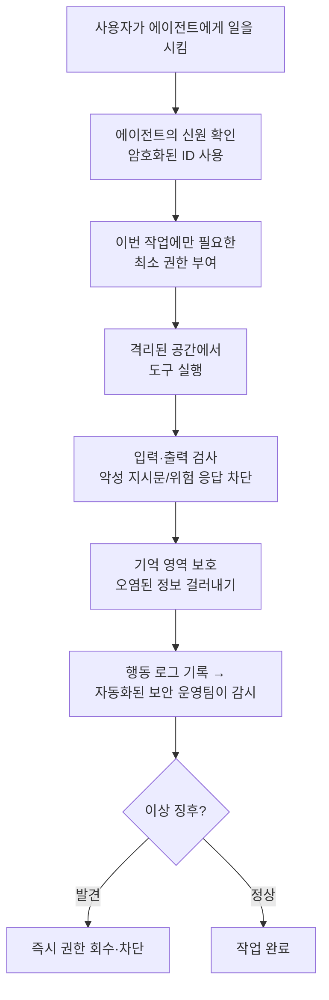

<aside class="ai-knowledge-sidebar">
  
CATEGORIES

  <nav class="ai-cat-tree">

에이전트 오케스트레이션3
<ul><li><a href="https://altjs4510.github.io/ai_news_blog/knowledge/20260520/">2026-05-20New in Claude Managed Agents: self-hosted sandbo…</a></li><li><a href="https://altjs4510.github.io/ai_news_blog/knowledge/20260507/">2026-05-07ruvnet/ruflo — Claude 멀티 에이전트 오케스트레이션 플랫폼</a></li><li><a href="https://altjs4510.github.io/ai_news_blog/knowledge/20260504/">2026-05-04Agents for Everything Else: Codex for Knowledge …</a></li></ul>

MCP &amp; 도구 통합6
<ul><li><a href="https://altjs4510.github.io/ai_news_blog/knowledge/20260526/">2026-05-26colbymchenry/codegraph — Pre-indexed code knowle…</a></li><li><a href="https://altjs4510.github.io/ai_news_blog/knowledge/20260523/">2026-05-23colbymchenry/codegraph — 사전 인덱싱된 코드 지식 그래프 MCP</a></li><li><a href="https://altjs4510.github.io/ai_news_blog/knowledge/20260521/">2026-05-21colbymchenry/codegraph — Pre-indexed code knowle…</a></li><li><a href="https://altjs4510.github.io/ai_news_blog/knowledge/20260519/">2026-05-19Anthropic acquires Stainless</a></li><li><a href="https://altjs4510.github.io/ai_news_blog/knowledge/20260517/">2026-05-17I gave my LLM 100,000+ tools — Lazy Discovery &a…</a></li><li><a href="https://altjs4510.github.io/ai_news_blog/knowledge/20260509/">2026-05-09How to connect 100 MCP servers without the conte…</a></li></ul>

코딩 에이전트6
<ul><li><a href="https://altjs4510.github.io/ai_news_blog/knowledge/20260524/">2026-05-24colbymchenry/codegraph — Pre-indexed code knowle…</a></li><li><a href="https://altjs4510.github.io/ai_news_blog/knowledge/20260512/">2026-05-12agentmemory — Persistent memory for AI coding ag…</a></li><li><a href="https://altjs4510.github.io/ai_news_blog/knowledge/20260510/">2026-05-10addyosmani/agent-skills — Production-grade engin…</a></li><li><a href="https://altjs4510.github.io/ai_news_blog/knowledge/20260508/">2026-05-08addyosmani/agent-skills — Production-grade engin…</a></li><li><a href="https://altjs4510.github.io/ai_news_blog/knowledge/20260506/">2026-05-06mksglu/context-mode — AI 코딩 에이전트용 컨텍스트 윈도우 최적화</a></li><li><a href="https://altjs4510.github.io/ai_news_blog/knowledge/20260505/">2026-05-05mattpocock/skills — Skills for Real Engineers (.…</a></li></ul>

모델 &amp; 연구2
<ul><li><a href="https://altjs4510.github.io/ai_news_blog/knowledge/20260516/">2026-05-16STALE — 에이전트가 자기 기억의 유효성을 인지할 수 있는가</a></li><li><a href="https://altjs4510.github.io/ai_news_blog/knowledge/20260513/">2026-05-13Thinking Machines' Native Interaction Models — T…</a></li></ul>

인프라 &amp; 컴퓨트1
<ul><li><a href="https://altjs4510.github.io/ai_news_blog/knowledge/20260522/">2026-05-22Giving Agents Computers — Ivan Burazin, Daytona</a></li></ul>

보안 &amp; 거버넌스2
<ul><li><a href="https://altjs4510.github.io/ai_news_blog/knowledge/20260528/" class="current">2026-05-28Zero Trust for AI agents</a></li><li><a href="https://altjs4510.github.io/ai_news_blog/knowledge/20260527/">2026-05-27Microsoft Copilot Cowork Exfiltrates Files</a></li></ul>

응용 사례2
<ul><li><a href="https://altjs4510.github.io/ai_news_blog/knowledge/20260515/">2026-05-15Clawdmeter — Claude Code 사용량을 데스크톱 대시보드로</a></li><li><a href="https://altjs4510.github.io/ai_news_blog/knowledge/20260514/">2026-05-14Introducing Claude for Small Business</a></li></ul>
</nav>
</aside>

<article class="ai-knowledge-article">

<header class="ai-post-hero">
  
<a class="ai-back" href="../">KNOWLEDGE</a> · 2026-05-28 · 오늘의 학습

  <h2 class="ai-post-title">Zero Trust for AI agents</h2>
</header>

> 원문: [Zero Trust for AI agents](https://claude.com/blog/zero-trust-for-ai-agents)

## 📌 학습 정리

### 1. 한 줄로 말하면

스스로 판단해서 움직이는 AI 비서에게 회사 시스템 열쇠를 맡기기 전에, "아무도 믿지 말고 매번 확인하자"는 보안 원칙을 어떻게 적용할지 정리한 안내서예요.

### 2. 왜 이게 만들어졌어요?

요즘 AI 모델은 보안 취약점을 찾는 속도가 사람보다 훨씬 빨라졌어요. 예전에는 새로 발견된 약점을 공격에 써먹기까지 몇 달이 걸렸다면, 이제는 몇 시간 안에 가능해진 거죠. 게다가 AI 에이전트는 단순히 답만 주는 게 아니라 직접 도구를 골라 쓰고, 여러 단계의 작업을 자기 판단으로 실행해요. 그러다 보니 "이 사람이 로그인했나?"만 확인하는 기존 권한 관리로는 부족하고, "에이전트가 지금 이 행동을 해도 되는가?"를 매 순간 검증해야 할 필요가 생겼습니다. Anthropic은 이런 변화에 맞춰 기업이 에이전트를 안전하게 도입할 수 있게 실무 프레임워크를 제안한 거예요.

### 3. 비유로 풀면

이건 마치 새로 들어온 인턴에게 회사 마스터키를 통째로 주는 대신, 그날 처리할 업무에 필요한 카드키만 그때그때 발급해 주는 것과 비슷해요. 인턴이 똑똑하고 성실해도, 외부에서 받은 메일에 숨겨진 지시문에 속을 수도 있고, 메모해 둔 내용이 누군가에 의해 조작될 수도 있으니까요.

그래서 결국 에이전트에게도 "신원은 무엇인지, 지금 무슨 일을 하려는지, 그 일에 딱 맞는 권한만 갖고 있는지"를 매번 확인하는 구조로 가자는 이야기예요.

### 4. 어떻게 작동하는지 (그림으로)

핵심 흐름은 이래요. 에이전트가 일을 시작할 때마다 "너 누구냐"를 암호로 확인하고, 그 작업에만 필요한 권한을 잠깐만 빌려주고, 격리된 환경에서 도구를 쓰게 하는 거죠. 그리고 들어오는 지시와 나가는 결과를 검사하면서, AI 공격자가 빠르게 움직이는 만큼 방어 쪽도 자동화된 보안 운영(Agentic SOAR)으로 같은 속도로 대응한다는 그림입니다.

원문 안내서는 이 과정을 세 단계 성숙도(Foundation → Advanced → Optimized)와 여덟 단계 실행 절차로 나눠 설명하고 있어요.

### 5. 처음 보는 용어 풀이

- **아무도 안 믿고 매번 확인하기 (Zero Trust)** — 사내 네트워크 안이라고 해서 자동으로 신뢰하지 않고, 모든 접근 요청마다 신원과 권한을 새로 검증하는 보안 원칙이에요. 이미 침해당했다고 가정하고 설계한다는 점이 핵심입니다.

- **AI 에이전트 (AI agent)** — 사람의 지시를 받아 스스로 도구를 골라 쓰고, 여러 단계의 작업을 알아서 처리하는 AI 프로그램이에요. 단순히 답변만 주는 챗봇과 달리 실제로 시스템을 조작하는 주체예요.

- **지시문 끼워넣기 공격 (prompt injection)** — 에이전트가 읽는 문서나 웹페이지에 몰래 악성 명령을 숨겨, 에이전트가 그 명령을 진짜 지시로 착각하게 만드는 공격이에요. "이 메일을 읽고 내용 요약해줘"가 함정이 될 수 있는 셈이죠.

- **도구 오염 (tool poisoning)** — 에이전트가 호출해 쓰는 외부 도구나 그 설명문에 악성 내용을 심어, 에이전트가 의도치 않게 위험한 행동을 하도록 유도하는 방식이에요.

- **기억 오염 (memory poisoning)** — 에이전트가 다음에도 참고하라고 저장해 둔 메모리에 가짜 정보나 악성 지시를 끼워 넣어, 이후 작업에서 계속 잘못 판단하게 만드는 공격이에요.

- **격리 실행 환경 (sandboxing)** — 에이전트가 코드나 도구를 실행할 때, 진짜 시스템과 분리된 모래상자 같은 공간에서만 동작하게 만드는 기법이에요. 사고가 나도 그 안에서 끝나도록 막아주는 거죠.

- **자동화된 보안 운영 (Agentic SOAR)** — AI가 가속한 공격 속도에 맞춰, 보안 사고 탐지·대응까지 AI 에이전트로 자동화한 운영 방식이에요. 사람이 일일이 로그를 보고 대응하기엔 너무 빨라진 환경에 맞춘 개념이에요.

### 6. 한 발 더 들어가고 싶다면

- [Zero Trust 아키텍처 위키 문서](https://en.wikipedia.org/wiki/Zero_trust_architecture) — 이 글의 바탕이 되는 "아무도 안 믿고 매번 확인하기" 원칙의 일반적인 정의와 역사를 알 수 있어요.
- [Zero Trust for AI Agents 안내서 PDF](https://cdn.prod.website-files.com/6889473510b50328dbb70ae6/6a1611a04085d7cd3dadc924_Claude-eBook-Zero-Trust-for-AI-Agents-05182026.pdf) — 본문에서 요약만 한 3단계 프레임워크와 8단계 실행 절차의 자세한 내용이 담긴 원본 자료예요.
- [LLM으로 소스코드 보안 강화하기 블로그](https://claude.com/blog/using-llms-to-secure-source-code) — AI가 방어 쪽에서 어떻게 쓰이는지, 코드 취약점을 미리 잡는 사례를 볼 수 있어요.
- [Opus를 사이버보안에 활용하는 파트너 사례](https://claude.com/blog/how-our-partners-are-putting-opus-to-work-for-cybersecurity) — 실제 보안 업체들이 강력한 모델을 어떻게 방어에 투입하고 있는지 감을 잡을 수 있어요.

---

## 📖 원문 전체 번역 (정독용)

> 의역 최소화한 전체 번역입니다. 큰 흐름은 위 정리에서 잡고, 정확한 워딩이 필요할 땐 이 섹션에서 정독하세요.

# AI 에이전트를 위한 제로 트러스트 (Zero Trust for AI agents)

우리는 엔터프라이즈 환경에서 자율 AI 에이전트를 배포하기 위한 보안 프레임워크를 공유합니다. 새로운 위협 환경, 계층형 제로 트러스트 아키텍처, 그리고 AI 가속화 공격에 대응하는 방어적 운영 방식을 다룹니다.

---

- **카테고리:** Enterprise AI, Agents
- **제품:** Claude Security
- **날짜:** 2026년 5월 27일
- **읽는 시간:** 5분

---

최전선 AI 모델들은 취약점 발견과 익스플로잇 사이의 시간을 수개월에서 수시간으로 압축하고 있습니다. 이 도구들을 채택한 방어자는 버그를 더 빠르게 찾고 수정하고, 이를 채택한 공격자 역시, 혹은 단순히 방어자의 패치를 기다렸다가 익스플로잇으로 역설계하는 공격자도 더 빠르게 움직입니다. 이는 미래의 우려가 아닙니다. 모델들은 이미 기존 도구와 인간 리뷰어가 수년간 놓쳐온 심각한 취약점을 발견할 수 있습니다.

이 가속화는 에이전트를 배포하는 모든 조직에 두 배로 중요합니다. 에이전트가 실행되는 인프라는 나머지 자산과 마찬가지로 AI 가속화된 공격에 노출되어 있고, 에이전트 자체는 목표를 해석하고 도구를 선택하며 다단계 작업을 실행하는 자율성을 도입합니다. 전통적인 접근 제어는 에이전트가 합법적인 권한을 남용하는 것을 막지 못하며, 모니터링은 익스플로잇보다는 지속성을 통해 성공하도록 설계된 공격까지 고려해야 합니다.

[제로 트러스트 (Zero Trust)](https://en.wikipedia.org/wiki/Zero_trust_architecture)—아무것도 신뢰하지 않고, 모든 것을 검증하며, 이미 침해가 발생했다고 가정한다—는 보안 리더들이 이를 해결하기 위한 검증된 토대를 제공합니다. 그러나 에이전트 시스템을 위해 이 원칙은 새로운 형태를 갖춰야 합니다. 즉, 암호학적으로 루트된 ID, 작업별로 범위가 지정된 권한, 포이즈닝에 대비해 보호된 메모리, 그리고 자율적 공격자의 속도로 실행되는 방어적 운영이 필요합니다.

보안 및 리스크 리더들이 이 변화에 대비해 구축할 수 있도록, 우리는 엔터프라이즈 환경에서 자율 AI 에이전트를 배포하기 위한 실용적인 프레임워크를 마련했습니다.

이 가이드에서 공유하는 내용:

- 도구 접근, 자율적 의사결정, 컨텍스트 지속성, 멀티 에이전트 조정 등 에이전트 시스템에 고유한 보안 고려 사항
- 프롬프트 인젝션 (prompt injection), 도구 포이즈닝 (tool poisoning), ID 및 권한 남용, 메모리 포이즈닝 (memory poisoning), 공급망 공격을 포함한 에이전트의 현재 위협 환경
- 조직의 성숙도와 리스크 허용 수준에 맞춰 매핑된 3계층 제로 트러스트 프레임워크 (기반 (Foundation), 고급 (Advanced), 최적화 (Optimized))
- ID, 접근 범위 지정, 샌드박싱 (sandboxing), 입출력 제어, 메모리 보호를 포함하는 8단계 구현 워크플로우
- AI 가속화된 공격자에 맞설 만큼 빠르게 에이전트 보안 운영 (Agentic SOAR)을 수행하는 방법
- 의료, 금융, 정부 등 규제 산업을 위한 컴플라이언스 정렬 방안

이 변화에 가장 잘 대비된 조직은 AI 지원 스캔이 처음부터 버그를 더 적게 발견할 만큼 기본기가 탄탄하고, 에이전트 배포가 첫날부터 침해를 전제로 설계된 곳입니다.

[여기](https://cdn.prod.website-files.com/6889473510b50328dbb70ae6/6a1611a04085d7cd3dadc924_Claude-eBook-Zero-Trust-for-AI-Agents-05182026.pdf)에서 확인해 보세요.

지금 바로 [Claude Security](https://www.anthropic.com/product/security)를 시작하세요.

---

## 관련 포스트

Claude로 구축하는 팀을 위한 제품 뉴스와 모범 사례를 더 살펴보세요.

**2026년 5월 27일**
### LLM을 활용한 소스 코드 보안 (Using LLMs to secure source code)
Enterprise AI

**2026년 5월 22일**
### Anthropic 재무팀이 숫자 뒤의 이야기를 만들기 위해 Claude를 활용하는 방법 (How Anthropic's finance team uses Claude to shape the narrative behind the numbers)
Enterprise AI

**2026년 5월 21일**
### Claude가 더 많은 보안 및 컴플라이언스 도구와 연동됩니다 (Claude now works with more security and compliance tools)
Enterprise AI

**2026년 5월 21일**
### 파트너들이 사이버보안을 위해 Opus를 활용하는 방법 (How our partners are putting Opus to work for cybersecurity)
Enterprise AI

</article>

