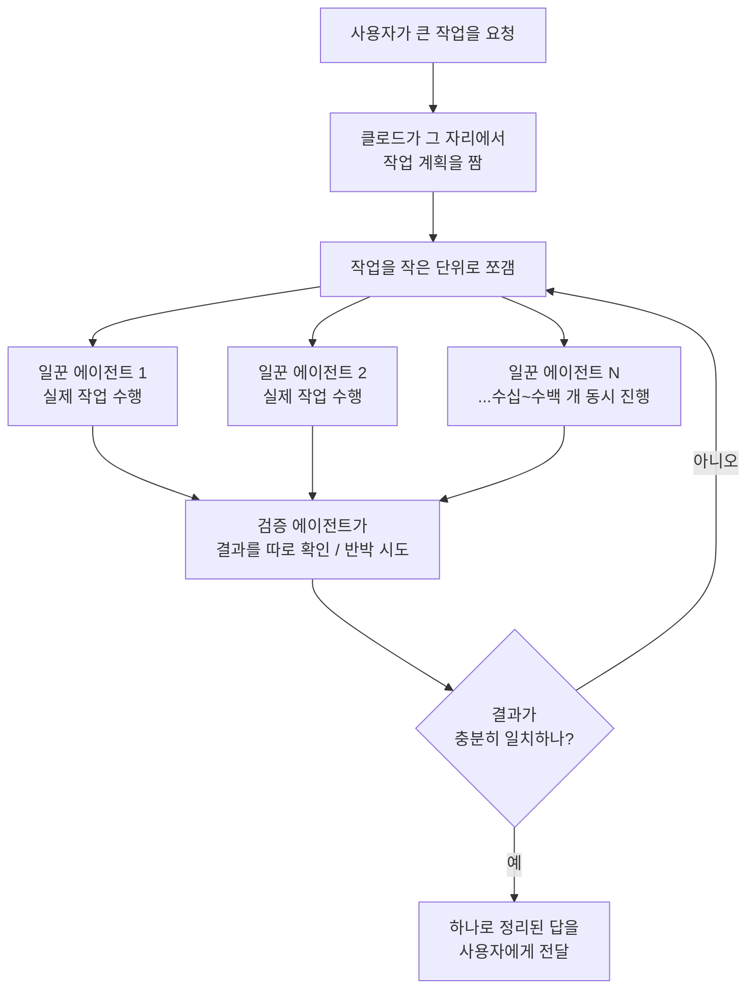

<aside class="ai-knowledge-sidebar">
  
CATEGORIES

  <nav class="ai-cat-tree">

에이전트 오케스트레이션7
<ul><li><a href="https://altjs4510.github.io/ai_news_blog/knowledge/20260708/">2026-07-08Expanding Managed Agents in Gemini API: backgrou…</a></li><li><a href="https://altjs4510.github.io/ai_news_blog/knowledge/20260623/">2026-06-23bytedance/deer-flow — 샌드박스·메모리·서브에이전트·메시지 게이트웨이를…</a></li><li><a href="https://altjs4510.github.io/ai_news_blog/knowledge/20260611/">2026-06-11The evolution of agentic surfaces: building with…</a></li><li><a href="https://altjs4510.github.io/ai_news_blog/knowledge/20260610/">2026-06-10Fable 5 just made cost-aware model routing manda…</a></li><li><a href="https://altjs4510.github.io/ai_news_blog/knowledge/20260602/">2026-06-02revfactory/harness — 도메인별 에이전트 팀과 스킬을 자동 설계하는 메타…</a></li><li><a href="https://altjs4510.github.io/ai_news_blog/knowledge/20260529/" class="current">2026-05-29Introducing dynamic workflows in Claude Code</a></li><li><a href="https://altjs4510.github.io/ai_news_blog/knowledge/20260507/">2026-05-07ruvnet/ruflo — Claude 멀티 에이전트 오케스트레이션 플랫폼</a></li></ul>

MCP &amp; 도구 통합17
<ul><li><a href="https://altjs4510.github.io/ai_news_blog/knowledge/20260731/">2026-07-31different-ai/openwork — Claude Cowork의 오픈소스 대안(o…</a></li><li><a href="https://altjs4510.github.io/ai_news_blog/knowledge/20260729/">2026-07-29Bringing MCP 2026-07-28 to Claude</a></li><li><a href="https://altjs4510.github.io/ai_news_blog/knowledge/20260724/">2026-07-24diegosouzapw/OmniRoute — 단일 엔드포인트로 278+ 프로바이더·50…</a></li><li><a href="https://altjs4510.github.io/ai_news_blog/knowledge/20260722/">2026-07-22tirth8205/code-review-graph — MCP·CLI용 로컬 우선 코드 …</a></li><li><a href="https://altjs4510.github.io/ai_news_blog/knowledge/20260721/">2026-07-21tirth8205/code-review-graph — 로컬 우선 코드 인텔리전스 그래프…</a></li><li><a href="https://altjs4510.github.io/ai_news_blog/knowledge/20260719/">2026-07-19tirth8205/code-review-graph — 로컬 우선 코드 인텔리전스 그래프…</a></li><li><a href="https://altjs4510.github.io/ai_news_blog/knowledge/20260718/">2026-07-18tirth8205/code-review-graph — MCP·CLI용 로컬 코드 인텔리…</a></li><li><a href="https://altjs4510.github.io/ai_news_blog/knowledge/20260709/">2026-07-09mvanhorn/last30days-skill — Reddit·X·YouTube·HN·…</a></li><li><a href="https://altjs4510.github.io/ai_news_blog/knowledge/20260618/">2026-06-18DeusData/codebase-memory-mcp — 158개 언어 코드베이스를 밀리…</a></li><li><a href="https://altjs4510.github.io/ai_news_blog/knowledge/20260606/">2026-06-06chopratejas/headroom — Compress tool outputs, lo…</a></li><li><a href="https://altjs4510.github.io/ai_news_blog/knowledge/20260605/">2026-06-05chopratejas/headroom — Compress tool outputs, lo…</a></li><li><a href="https://altjs4510.github.io/ai_news_blog/knowledge/20260604/">2026-06-04chopratejas/headroom — Compress tool outputs bef…</a></li><li><a href="https://altjs4510.github.io/ai_news_blog/knowledge/20260603/">2026-06-03How Bad MCP design cost your Agent 5× more token…</a></li><li><a href="https://altjs4510.github.io/ai_news_blog/knowledge/20260523/">2026-05-23colbymchenry/codegraph — 사전 인덱싱된 코드 지식 그래프 MCP</a></li><li><a href="https://altjs4510.github.io/ai_news_blog/knowledge/20260517/">2026-05-17I gave my LLM 100,000+ tools — Lazy Discovery &a…</a></li><li><a href="https://altjs4510.github.io/ai_news_blog/knowledge/20260509/">2026-05-09How to connect 100 MCP servers without the conte…</a></li><li><a href="https://altjs4510.github.io/ai_news_blog/knowledge/20260506/">2026-05-06mksglu/context-mode — AI 코딩 에이전트용 컨텍스트 윈도우 최적화</a></li></ul>

코딩 에이전트18
<ul><li><a href="https://altjs4510.github.io/ai_news_blog/knowledge/20260728/">2026-07-28alibaba/open-code-review — 결정론적 파이프라인 + LLM 에이전트…</a></li><li><a href="https://altjs4510.github.io/ai_news_blog/knowledge/20260725/">2026-07-25The new rules of context engineering for Claude …</a></li><li><a href="https://altjs4510.github.io/ai_news_blog/knowledge/20260716/">2026-07-16Dicklesworthstone/destructive_command_guard — 에이…</a></li><li><a href="https://altjs4510.github.io/ai_news_blog/knowledge/20260715/">2026-07-15Dicklesworthstone/destructive_command_guard — 에이…</a></li><li><a href="https://altjs4510.github.io/ai_news_blog/knowledge/20260714/">2026-07-14Graphify-Labs/graphify — 코드베이스를 질의 가능한 지식 그래프로 만…</a></li><li><a href="https://altjs4510.github.io/ai_news_blog/knowledge/20260707/">2026-07-07AI Hero Skills Catalog — 실무 엔지니어를 위한 재사용 가능한 판단 …</a></li><li><a href="https://altjs4510.github.io/ai_news_blog/knowledge/20260705/">2026-07-05openai/codex-plugin-cc — Claude Code에서 Codex를 위임…</a></li><li><a href="https://altjs4510.github.io/ai_news_blog/knowledge/20260626/">2026-06-26google-labs-code/design.md — 코딩 에이전트에게 디자인 시스템을 …</a></li><li><a href="https://altjs4510.github.io/ai_news_blog/knowledge/20260619/">2026-06-19Claude Code now supports artifacts</a></li><li><a href="https://altjs4510.github.io/ai_news_blog/knowledge/20260530/">2026-05-30Leonxlnx/taste-skill — AI에게 좋은 취향을 부여해 generic s…</a></li><li><a href="https://altjs4510.github.io/ai_news_blog/knowledge/20260528/">2026-05-28Building self-improving tax agents with Codex</a></li><li><a href="https://altjs4510.github.io/ai_news_blog/knowledge/20260526/">2026-05-26colbymchenry/codegraph — Pre-indexed code knowle…</a></li><li><a href="https://altjs4510.github.io/ai_news_blog/knowledge/20260524/">2026-05-24colbymchenry/codegraph — Pre-indexed code knowle…</a></li><li><a href="https://altjs4510.github.io/ai_news_blog/knowledge/20260521/">2026-05-21colbymchenry/codegraph — Pre-indexed code knowle…</a></li><li><a href="https://altjs4510.github.io/ai_news_blog/knowledge/20260512/">2026-05-12agentmemory — Persistent memory for AI coding ag…</a></li><li><a href="https://altjs4510.github.io/ai_news_blog/knowledge/20260510/">2026-05-10addyosmani/agent-skills — Production-grade engin…</a></li><li><a href="https://altjs4510.github.io/ai_news_blog/knowledge/20260508/">2026-05-08addyosmani/agent-skills — Production-grade engin…</a></li><li><a href="https://altjs4510.github.io/ai_news_blog/knowledge/20260505/">2026-05-05mattpocock/skills — Skills for Real Engineers (.…</a></li></ul>

모델 &amp; 연구5
<ul><li><a href="https://altjs4510.github.io/ai_news_blog/knowledge/20260716-proprag/">2026-07-16PropRAG — 프로포지션 경로 위 beam search로 멀티홉 검색 안내</a></li><li><a href="https://altjs4510.github.io/ai_news_blog/knowledge/20260620/">2026-06-20zai-org/GLM-5 — From Vibe Coding to Agentic Engi…</a></li><li><a href="https://altjs4510.github.io/ai_news_blog/knowledge/20260617/">2026-06-17Predicting model behavior before release by simu…</a></li><li><a href="https://altjs4510.github.io/ai_news_blog/knowledge/20260516/">2026-05-16STALE — 에이전트가 자기 기억의 유효성을 인지할 수 있는가</a></li><li><a href="https://altjs4510.github.io/ai_news_blog/knowledge/20260513/">2026-05-13Thinking Machines' Native Interaction Models — T…</a></li></ul>

인프라 &amp; 컴퓨트4
<ul><li><a href="https://altjs4510.github.io/ai_news_blog/knowledge/20260723/">2026-07-23diegosouzapw/OmniRoute — 268+ 프로바이더를 단일 엔드포인트로 묶…</a></li><li><a href="https://altjs4510.github.io/ai_news_blog/knowledge/20260630/">2026-06-30Introducing the Claude apps gateway for Amazon B…</a></li><li><a href="https://altjs4510.github.io/ai_news_blog/knowledge/20260522/">2026-05-22Giving Agents Computers — Ivan Burazin, Daytona</a></li><li><a href="https://altjs4510.github.io/ai_news_blog/knowledge/20260520/">2026-05-20New in Claude Managed Agents: self-hosted sandbo…</a></li></ul>

보안 &amp; 거버넌스12
<ul><li><a href="https://altjs4510.github.io/ai_news_blog/knowledge/20260730/">2026-07-30Anatomy of a Frontier Lab Agent Intrusion: A Tec…</a></li><li><a href="https://altjs4510.github.io/ai_news_blog/knowledge/20260710/">2026-07-1070개 MCP 서버 strace 런타임 감사 — 부팅 시 아웃바운드 호출 서버 적발</a></li><li><a href="https://altjs4510.github.io/ai_news_blog/knowledge/20260704/">2026-07-04Cloudflare is about to block AI agents by defaul…</a></li><li><a href="https://altjs4510.github.io/ai_news_blog/knowledge/20260703/">2026-07-03Giving admins more visibility and control over C…</a></li><li><a href="https://altjs4510.github.io/ai_news_blog/knowledge/20260625/">2026-06-25Agent identity in Claude Tag: a new access model…</a></li><li><a href="https://altjs4510.github.io/ai_news_blog/knowledge/20260624/">2026-06-24Agent identity in Claude Tag: a new access model…</a></li><li><a href="https://altjs4510.github.io/ai_news_blog/knowledge/20260614/">2026-06-14NVIDIA/SkillSpector — Security scanner for AI ag…</a></li><li><a href="https://altjs4510.github.io/ai_news_blog/knowledge/20260613/">2026-06-13Fable 5's guardrails got bypassed in 48 hours — …</a></li><li><a href="https://altjs4510.github.io/ai_news_blog/knowledge/20260612/">2026-06-12NVIDIA/SkillSpector — AI 에이전트 스킬용 보안 스캐너</a></li><li><a href="https://altjs4510.github.io/ai_news_blog/knowledge/20260607/">2026-06-07OpenAI Help: Lockdown Mode</a></li><li><a href="https://altjs4510.github.io/ai_news_blog/knowledge/20260531/">2026-05-31How we contain Claude across products</a></li><li><a href="https://altjs4510.github.io/ai_news_blog/knowledge/20260527/">2026-05-27Microsoft Copilot Cowork Exfiltrates Files</a></li></ul>

응용 사례6
<ul><li><a href="https://altjs4510.github.io/ai_news_blog/knowledge/20260726/">2026-07-26citrolabs/ego-lite — 로그인된 브라우저 상태를 AI 에이전트와 공유하는…</a></li><li><a href="https://altjs4510.github.io/ai_news_blog/knowledge/20260717/">2026-07-17After a year building agent memory, 'save everyt…</a></li><li><a href="https://altjs4510.github.io/ai_news_blog/knowledge/20260712/">2026-07-12Do Automated Evals Work?</a></li><li><a href="https://altjs4510.github.io/ai_news_blog/knowledge/20260621/">2026-06-21calesthio/OpenMontage — 12 파이프라인·52 도구·500+ 스킬을 …</a></li><li><a href="https://altjs4510.github.io/ai_news_blog/knowledge/20260609/">2026-06-09Building intelligent apps for Apple platforms wi…</a></li><li><a href="https://altjs4510.github.io/ai_news_blog/knowledge/20260514/">2026-05-14Introducing Claude for Small Business</a></li></ul>

산업 동향7
<ul><li><a href="https://altjs4510.github.io/ai_news_blog/knowledge/20260711/">2026-07-11OpenAI says GPT 5.6 is the 'preferred model' for…</a></li><li><a href="https://altjs4510.github.io/ai_news_blog/knowledge/20260702/">2026-07-02How Cursor deploys AI inside the enterprise (For…</a></li><li><a href="https://altjs4510.github.io/ai_news_blog/knowledge/20260701/">2026-07-01Google OKF (Open Knowledge Format) — 벤더 중립 에이전트 …</a></li><li><a href="https://altjs4510.github.io/ai_news_blog/knowledge/20260616/">2026-06-16Why AI hasn't replaced software engineers, and w…</a></li><li><a href="https://altjs4510.github.io/ai_news_blog/knowledge/20260519/">2026-05-19Anthropic acquires Stainless</a></li><li><a href="https://altjs4510.github.io/ai_news_blog/knowledge/20260515/">2026-05-15Clawdmeter — Claude Code 사용량을 데스크톱 대시보드로</a></li><li><a href="https://altjs4510.github.io/ai_news_blog/knowledge/20260504/">2026-05-04Agents for Everything Else: Codex for Knowledge …</a></li></ul>
</nav>
</aside>

<article class="ai-knowledge-article">

<header class="ai-post-hero">
  
<a class="ai-back" href="../">KNOWLEDGE</a> · 2026-05-29 · 오늘의 학습

  <h2 class="ai-post-title">Introducing dynamic workflows in Claude Code</h2>
</header>

> 원문: [Introducing dynamic workflows in Claude Code](https://claude.com/blog/introducing-dynamic-workflows-in-claude-code)

## 📌 학습 정리

### 1. 한 줄로 말하면

큰 작업 하나를 통째로 맡기면, 클로드가 알아서 잘게 쪼개서 여러 명의 분신을 동시에 부려 일을 끝내고, 결과까지 검산해서 가져다주는 방식이에요.

### 2. 왜 이게 만들어졌어요?

원래 코딩용 AI는 한 번의 대화에서 한 가지 흐름으로 일을 처리해 왔어요. 그런데 한 서비스 전체를 뒤져서 버그를 찾는다거나, 수백 개 파일을 한꺼번에 새 프레임워크로 옮긴다거나, 중요한 계획을 여러 각도에서 두들겨 보고 싶을 때는 이 한 줄짜리 흐름으로는 감당이 안 됐어요. 한 명이 처음부터 끝까지 다 보기엔 일이 너무 크고, 중간에 놓치는 게 생기거든요. 그래서 클로드가 상황에 맞춰 작업 계획을 직접 짜고, 작은 일꾼들(서브에이전트)에게 일을 나눠 던져서 동시에 굴리는 방식이 등장했어요. 결과를 사람한테 보여주기 전에 다른 에이전트가 그 결과를 검증·반박해 보게 해서, 오래 돌아가는 자율 작업의 신뢰성 문제를 정면으로 다루려는 시도예요.

### 3. 비유로 풀면

이건 마치 큰 프로젝트를 받은 팀장이, 일을 받자마자 "이건 이렇게 쪼개서, 너는 A 모듈, 너는 B 모듈, 너는 검토만 전담" 하고 그 자리에서 작업 분담표를 그려 수십~수백 명에게 동시에 일을 시키는 것과 비슷해요. 거기에다 "내가 낸 답을 일부러 깨뜨려 봐"라고 시키는 반대 입장의 검토자(adversarial agent, 일부러 결과를 무너뜨려 보는 역할)까지 따로 둬서, 답이 진짜 단단해질 때까지 서로 부딪히게 해요.

그래서 결국, 사용자는 한참 떨어졌다가 돌아왔을 때 잘 정리되고 한 번 검증까지 끝난 결과물 하나만 받게 돼요.

### 4. 어떻게 작동하는지 (그림으로)

흐름은 이래요. 큰 작업이 들어오면 클로드가 미리 만들어진 정해진 절차를 따르는 게 아니라, 그 자리에서 지휘 스크립트를 직접 써서 일을 쪼개고 분배해요. 일꾼들이 각자 결과를 가져오면 검증 담당이 따로 확인하고, 필요하면 다시 나눠서 돌리길 반복하다가 답이 수렴할 때 하나로 묶어서 가져다줘요. 진행 상황은 중간중간 저장돼서, 작업이 끊겨도 처음부터 다시 시작하지 않고 이어서 진행돼요.

### 5. 처음 보는 용어 풀이

- **동적 워크플로(dynamic workflows)** — 미리 짜둔 고정된 절차가 아니라, 받은 요청을 보고 클로드가 그 자리에서 작업 순서와 분담을 직접 설계해서 굴리는 방식이에요. "이 일은 이렇게 처리해라" 같은 매뉴얼이 없어도 되는 게 핵심이에요.
- **서브에이전트(subagent)** — 본체 클로드가 시킨 작은 일을 따로 떼어 처리하는 보조 일꾼이에요. 이번 기능에서는 한 작업에 수십~수백 개가 동시에 붙어서 일해요.
- **오케스트레이션 스크립트(orchestration script)** — 누가 무슨 일을 어떤 순서로 할지 지휘하는 진행표예요. 이걸 클로드가 사람 대신 직접 써내려가요.
- **반박 에이전트(adversarial agent)** — 다른 에이전트가 낸 답을 일부러 무너뜨려 보려고 시도하는 역할이에요. 답이 약하면 여기서 걸러져서 사용자한테는 안 가요.
- **Claude Code** — 클로드를 코드 작업에 특화해 쓸 수 있게 해주는 도구예요. 명령줄(CLI), 데스크톱 앱, VS Code 확장 등으로 쓸 수 있어요.
- **ultracode 설정** — Claude Code 안에서 켤 수 있는 옵션 이름이에요. 켜두면 노력 수준(effort)이 가장 높게 맞춰지고, 클로드가 이 작업에 워크플로를 쓸지 말지 알아서 판단해요.
- **자동 모드(auto mode)** — 클로드가 매 단계마다 사람한테 확인받지 않고 스스로 진행하는 모드예요. 동적 워크플로를 쓸 때 이걸 켜두는 게 권장돼요.
- **토큰(token)** — 모델이 글을 처리하는 최소 단위예요. 동적 워크플로는 일꾼이 많이 동시에 돌기 때문에 평소 한 세션보다 훨씬 많은 토큰을 쓰게 돼요.

### 6. 한 발 더 들어가고 싶다면

- [동적 워크플로 공식 문서](https://code.claude.com/docs/en/workflows) — 실제로 어떻게 켜고 쓰는지, 옵션이 어떻게 되는지 가장 정확하게 정리되어 있어요.
- [Claude Code 설정 문서](https://code.claude.com/docs/en/settings) — Enterprise 같은 환경에서 관리자가 이 기능을 켜고 끄는 방법을 알 수 있어요.
- [Claude Code 전체 개요 문서](https://code.claude.com/docs/en/overview) — 동적 워크플로가 올라타 있는 Claude Code 자체가 어떤 도구인지 큰 그림을 잡을 수 있어요.
- [Claude Code 제품 페이지](https://claude.com/product/claude-code) — 어떤 환경(데스크톱, VS Code, JetBrains 등)에서 쓸 수 있는지 한눈에 확인할 수 있어요.

---

## 📖 원문 전체 번역 (정독용)

> 의역 최소화한 전체 번역입니다. 큰 흐름은 위 정리에서 잡고, 정확한 워딩이 필요할 땐 이 섹션에서 정독하세요.

# Claude Code의 다이나믹 워크플로우 (Dynamic Workflows) 소개

- **카테고리:** 제품 발표 (Product announcements)
- **제품:** Claude Code
- **날짜:** 2026년 5월 28일
- **읽기 시간:** 5분

오늘 저희는 Claude Code에 다이나믹 워크플로우를 도입합니다. 이를 통해 Claude가 가장 까다로운 작업을 처음부터 끝까지 처리할 수 있게 됩니다. 일반적으로 분기(quarter) 단위로 계획하던 작업이 이제 며칠 만에 완료됩니다. Claude는 단일 세션 안에서 수십~수백 개의 병렬 서브에이전트(subagent)를 실행하는 오케스트레이션 스크립트를 동적으로 작성하고, 결과가 사용자에게 전달되기 전에 작업 내용을 직접 검토합니다.

일부 문제는 단일 에이전트 한 번의 처리로는 너무 큰 규모입니다. 특히 복잡하고 레거시(legacy)가 많은 코드베이스에서는 더욱 그렇습니다. 전체 서비스를 대상으로 한 버그 추적, 수백 개의 파일에 걸친 마이그레이션, 확정하기 전에 모든 각도에서 스트레스 테스트를 거쳐야 하는 계획 등이 이에 해당합니다. 다이나믹 워크플로우는 이 모든 작업을 처음부터 끝까지 처리할 수 있습니다.

다이나믹 워크플로우는 오늘부터 리서치 프리뷰(research preview) 형태로 Claude Code CLI, Desktop, VS Code 익스텐션에서 Max, Team, Enterprise(관리자 활성화 시) 플랜으로 이용 가능합니다. 또한 Claude API, Amazon Bedrock, Vertex AI, Microsoft Foundry에서도 지원됩니다.

**참고:** 다이나믹 워크플로우는 일반적인 Claude Code 세션보다 토큰 소비량이 상당히 많을 수 있으므로, 처음에는 제한된 범위의 작업부터 시작하여 사용량을 파악해 보시기를 권장합니다.

최적의 경험을 위해 다이나믹 워크플로우를 사용할 때는 자동 모드(auto mode)를 켜두시기 바랍니다. 이후 워크플로우를 시작하는 방법은 두 가지입니다:

1. Claude에게 다이나믹 워크플로우를 직접 생성하도록 요청합니다 (예: "워크플로우를 만들어 줘"), 또는
2. Claude Code 전용 설정인 `ultracode`를 켭니다. 이 설정은 effort 메뉴에서 접근할 수 있으며, effort 레벨을 xhigh로 설정하고 Claude가 해당 작업을 처리하기 위해 워크플로우를 사용할 시점을 자동으로 결정하도록 합니다.

## **다이나믹 워크플로우의 실제 활용**

얼리 액세스(early access) 사용자들과 Anthropic 내부 팀은 다음을 포함한 다양한 사용 사례에 다이나믹 워크플로우를 활용해 왔습니다:

- **코드베이스 전체 범위의 버그 추적, 프로파일러(profiler) 기반 최적화 감사, 보안 감사:** Claude가 서비스 또는 저장소(repo)를 병렬로 탐색한 다음, 모든 발견 사항에 대해 독립적인 검증을 수행하여 실제 문제만 보고서에 포함시킵니다. 인증(auth) 확인, 입력값 검증, 전체 코드베이스에 걸친 안전하지 않은 패턴 탐지 등 보안 강화 작업에도 동일한 방식이 적용됩니다.
- **대규모 마이그레이션 및 현대화 작업:** Claude는 수천 개의 파일에 걸쳐 프레임워크 교체, API 지원 중단 처리, 언어 포팅(porting)을 처음부터 끝까지 처리할 수 있습니다.
- **두 번 확인이 필요한 중요한 작업:** 잘못된 답변의 비용이 클 때, 워크플로우는 Claude에게 해당 문제를 독립적으로 여러 번 시도하게 하고, 결과가 사용자에게 전달되기 전에 적대적 에이전트(adversarial agent)가 결과를 검증하도록 합니다.

---

> "다이나믹 워크플로우는 대형 코드베이스에서 탐색 및 검토 작업에 특히 유용했습니다. 기존 정적 분석이 놓쳤던 데드 코드(dead code)를 식별하고 정리 기회를 발굴하는 데 탁월한 성과를 보였으며, 이를 통해 엔지니어들이 유지보수 및 리팩터링 작업을 더 빠르게 진행할 수 있게 되었습니다."
>
> — Alessio Vallero, Klarna 수석 엔지니어링 매니저

---

> "다이나믹 워크플로우는 단일 서브에이전트를 실행하는 것과 본격적인 에이전트 팀을 구축하는 것 사이의 공백을 채워줍니다. 계획에서 구현까지 자연스럽게 흘러가기 때문에, 가시성을 잃지 않고도 더 오랜 실행을 신뢰할 수 있습니다."
>
> — Ken Takao, CyberAgent 수석 시스템 엔지니어

---

### **다이나믹 워크플로우로 Bun 재작성하기**

다이나믹 워크플로우가 대규모로 가능하게 하는 것의 한 예시가 최근의 Bun 재작성입니다. Jarred Sumner는 다이나믹 워크플로우를 사용하여 Bun을 Zig에서 Rust로 포팅하였으며, 기존 테스트 스위트의 99.8%가 통과되었습니다. 약 75만 줄의 Rust 코드로, 첫 커밋부터 병합까지 11일이 걸렸습니다. 하나의 워크플로우가 Zig 코드베이스의 모든 구조체(struct) 필드에 대한 올바른 Rust 라이프타임(lifetime)을 매핑했습니다. 다음 워크플로우는 모든 `.rs` 파일을 해당하는 `.zig` 파일의 동작 동일한 포트로 작성했으며, 수백 개의 에이전트가 병렬로 작동하고 각 파일마다 두 명의 리뷰어가 배정되었습니다. 그런 다음 수정 루프가 빌드와 테스트 스위트가 모두 통과할 때까지 반복 실행되었습니다. 포팅이 완료된 후, 야간 워크플로우가 불필요한 데이터 복사를 처리하고 최종 검토를 위한 PR을 각각 열었습니다. 아직 프로덕션에 반영되지는 않았지만, 이 모든 작업이 다이나믹 워크플로우에 의해 처리되었습니다. Jarred는 향후 이에 대해 더 자세히 글을 쓸 예정입니다.

## **작동 방식**

워크플로우가 시작되면, Claude는 사용자의 프롬프트를 기반으로 동적으로 계획을 세우고, 이를 서브태스크(subtask)로 분해하여 병렬로 실행되는 서브에이전트들에게 작업을 분산시킵니다. 결과는 통합되기 전에 검토되며, 사용자는 단일하고 조율된 답변을 받게 됩니다. 에이전트들은 문제를 독립적인 각도에서 접근하고, 다른 에이전트들이 발견한 내용을 반박하려 시도하며, 답변이 수렴될 때까지 실행이 계속 반복됩니다. 이것이 바로 워크플로우가 단일 처리로는 도달할 수 없는 결과에 이르는 방식입니다.

다이나믹 워크플로우는 병렬적이고 장시간 실행되는 작업을 위해 설계되었으며, 수 시간에서 수 일까지 이어질 수 있는 가장 복잡한 엔지니어링 작업을 처리합니다. 이는 이전에 몇 주가 걸리던 작업입니다. 실행 중 진행 상황이 저장되므로, 작업이 중단되더라도 처음부터 다시 시작하지 않고 중단된 지점부터 재개됩니다. 조율이 대화 외부에서 이루어지기 때문에, 작업의 규모가 아무리 커져도 계획이 올바르게 유지됩니다.

다이나믹 워크플로우는 일반적인 Claude Code 세션보다 사용량이 의미 있는 수준으로 더 많다는 점을 유의하는 것이 중요합니다. 워크플로우가 처음 실행될 때, Claude Code는 실행될 내용을 보여주고 사용자의 확인을 요청합니다. 조직 관리자는 관리 설정을 통해 워크플로우를 선택적으로 비활성화할 수도 있습니다.

## **시작하기**

Max 또는 Team 플랜을 이용 중이거나 API를 통해 Claude Code를 사용하는 경우, 다이나믹 워크플로우는 기본적으로 활성화되어 있습니다. 시작하려면 Claude에게 워크플로우를 생성하도록 요청하거나 Claude Code 전용 설정인 `ultracode`를 켜세요. Enterprise 플랜을 사용 중인 경우, 다이나믹 워크플로우는 출시 시점에 기본적으로 비활성화되어 있습니다. 관리자는 Claude Code [설정](https://code.claude.com/docs/en/settings)에서 쉽게 변경할 수 있습니다.

자세한 내용은 [문서](https://code.claude.com/docs/en/workflows)를 참고하세요.

</article>

<!-- ai-related-links -->
<aside class="ai-related-links">
  
관련 학습

  <ul><li><a href="https://altjs4510.github.io/ai_news_blog/knowledge/20260520/">2026-05-20New in Claude Managed Agents: self-hosted sandbo…</a></li><li><a href="https://altjs4510.github.io/ai_news_blog/knowledge/20260507/">2026-05-07ruvnet/ruflo — Claude 멀티 에이전트 오케스트레이션 플랫폼</a></li></ul>
</aside>
<!-- /ai-related-links -->
