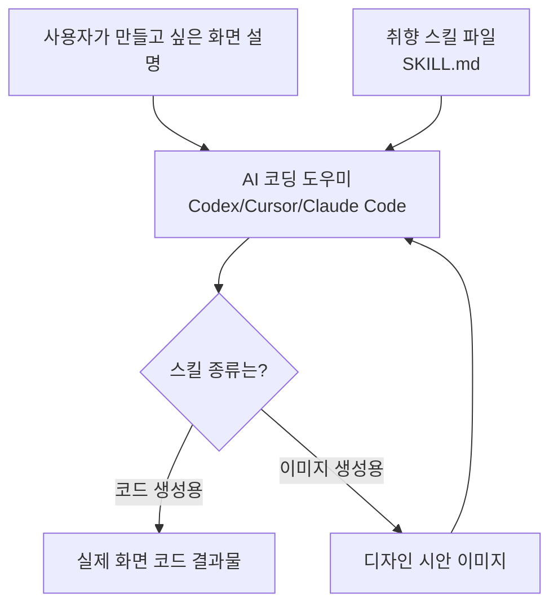

<div class="ai-knowledge-shell">

<aside class="ai-knowledge-sidebar">
  <p class="ai-eyebrow">CATEGORIES</p>
  <nav class="ai-cat-tree"><details class="ai-cat" open><summary><span class="catname">에이전트 오케스트레이션</span><span class="catcount">5</span></summary><ul><li><a href="https://altjs4510.github.io/ai_news_blog/knowledge/20260602/"><span class="kdate">2026-06-02</span><span class="ktitle">revfactory/harness — 도메인별 에이전트 팀과 스킬을 자동 설계하는 메타…</span></a></li><li><a href="https://altjs4510.github.io/ai_news_blog/knowledge/20260529/"><span class="kdate">2026-05-29</span><span class="ktitle">Introducing dynamic workflows in Claude Code</span></a></li><li><a href="https://altjs4510.github.io/ai_news_blog/knowledge/20260520/"><span class="kdate">2026-05-20</span><span class="ktitle">New in Claude Managed Agents: self-hosted sandbo…</span></a></li><li><a href="https://altjs4510.github.io/ai_news_blog/knowledge/20260507/"><span class="kdate">2026-05-07</span><span class="ktitle">ruvnet/ruflo — Claude 멀티 에이전트 오케스트레이션 플랫폼</span></a></li><li><a href="https://altjs4510.github.io/ai_news_blog/knowledge/20260504/"><span class="kdate">2026-05-04</span><span class="ktitle">Agents for Everything Else: Codex for Knowledge …</span></a></li></ul></details><details class="ai-cat" open><summary><span class="catname">MCP &amp; 도구 통합</span><span class="catcount">7</span></summary><ul><li><a href="https://altjs4510.github.io/ai_news_blog/knowledge/20260604/"><span class="kdate">2026-06-04</span><span class="ktitle">chopratejas/headroom — Compress tool outputs bef…</span></a></li><li><a href="https://altjs4510.github.io/ai_news_blog/knowledge/20260603/"><span class="kdate">2026-06-03</span><span class="ktitle">How Bad MCP design cost your Agent 5× more token…</span></a></li><li><a href="https://altjs4510.github.io/ai_news_blog/knowledge/20260526/"><span class="kdate">2026-05-26</span><span class="ktitle">colbymchenry/codegraph — Pre-indexed code knowle…</span></a></li><li><a href="https://altjs4510.github.io/ai_news_blog/knowledge/20260523/"><span class="kdate">2026-05-23</span><span class="ktitle">colbymchenry/codegraph — 사전 인덱싱된 코드 지식 그래프 MCP</span></a></li><li><a href="https://altjs4510.github.io/ai_news_blog/knowledge/20260519/"><span class="kdate">2026-05-19</span><span class="ktitle">Anthropic acquires Stainless</span></a></li><li><a href="https://altjs4510.github.io/ai_news_blog/knowledge/20260517/"><span class="kdate">2026-05-17</span><span class="ktitle">I gave my LLM 100,000+ tools — Lazy Discovery &a…</span></a></li><li><a href="https://altjs4510.github.io/ai_news_blog/knowledge/20260509/"><span class="kdate">2026-05-09</span><span class="ktitle">How to connect 100 MCP servers without the conte…</span></a></li></ul></details><details class="ai-cat" open><summary><span class="catname">코딩 에이전트</span><span class="catcount">9</span></summary><ul><li><a href="https://altjs4510.github.io/ai_news_blog/knowledge/20260530/" class="current"><span class="kdate">2026-05-30</span><span class="ktitle">Leonxlnx/taste-skill — AI에게 좋은 취향을 부여해 generic s…</span></a></li><li><a href="https://altjs4510.github.io/ai_news_blog/knowledge/20260528/"><span class="kdate">2026-05-28</span><span class="ktitle">Building self-improving tax agents with Codex</span></a></li><li><a href="https://altjs4510.github.io/ai_news_blog/knowledge/20260524/"><span class="kdate">2026-05-24</span><span class="ktitle">colbymchenry/codegraph — Pre-indexed code knowle…</span></a></li><li><a href="https://altjs4510.github.io/ai_news_blog/knowledge/20260521/"><span class="kdate">2026-05-21</span><span class="ktitle">colbymchenry/codegraph — Pre-indexed code knowle…</span></a></li><li><a href="https://altjs4510.github.io/ai_news_blog/knowledge/20260512/"><span class="kdate">2026-05-12</span><span class="ktitle">agentmemory — Persistent memory for AI coding ag…</span></a></li><li><a href="https://altjs4510.github.io/ai_news_blog/knowledge/20260510/"><span class="kdate">2026-05-10</span><span class="ktitle">addyosmani/agent-skills — Production-grade engin…</span></a></li><li><a href="https://altjs4510.github.io/ai_news_blog/knowledge/20260508/"><span class="kdate">2026-05-08</span><span class="ktitle">addyosmani/agent-skills — Production-grade engin…</span></a></li><li><a href="https://altjs4510.github.io/ai_news_blog/knowledge/20260506/"><span class="kdate">2026-05-06</span><span class="ktitle">mksglu/context-mode — AI 코딩 에이전트용 컨텍스트 윈도우 최적화</span></a></li><li><a href="https://altjs4510.github.io/ai_news_blog/knowledge/20260505/"><span class="kdate">2026-05-05</span><span class="ktitle">mattpocock/skills — Skills for Real Engineers (.…</span></a></li></ul></details><details class="ai-cat" open><summary><span class="catname">모델 &amp; 연구</span><span class="catcount">2</span></summary><ul><li><a href="https://altjs4510.github.io/ai_news_blog/knowledge/20260516/"><span class="kdate">2026-05-16</span><span class="ktitle">STALE — 에이전트가 자기 기억의 유효성을 인지할 수 있는가</span></a></li><li><a href="https://altjs4510.github.io/ai_news_blog/knowledge/20260513/"><span class="kdate">2026-05-13</span><span class="ktitle">Thinking Machines' Native Interaction Models — T…</span></a></li></ul></details><details class="ai-cat" open><summary><span class="catname">인프라 &amp; 컴퓨트</span><span class="catcount">3</span></summary><ul><li><a href="https://altjs4510.github.io/ai_news_blog/knowledge/20260606/"><span class="kdate">2026-06-06</span><span class="ktitle">chopratejas/headroom — Compress tool outputs, lo…</span></a></li><li><a href="https://altjs4510.github.io/ai_news_blog/knowledge/20260605/"><span class="kdate">2026-06-05</span><span class="ktitle">chopratejas/headroom — Compress tool outputs, lo…</span></a></li><li><a href="https://altjs4510.github.io/ai_news_blog/knowledge/20260522/"><span class="kdate">2026-05-22</span><span class="ktitle">Giving Agents Computers — Ivan Burazin, Daytona</span></a></li></ul></details><details class="ai-cat" open><summary><span class="catname">보안 &amp; 거버넌스</span><span class="catcount">3</span></summary><ul><li><a href="https://altjs4510.github.io/ai_news_blog/knowledge/20260607/"><span class="kdate">2026-06-07</span><span class="ktitle">OpenAI Help: Lockdown Mode</span></a></li><li><a href="https://altjs4510.github.io/ai_news_blog/knowledge/20260531/"><span class="kdate">2026-05-31</span><span class="ktitle">How we contain Claude across products</span></a></li><li><a href="https://altjs4510.github.io/ai_news_blog/knowledge/20260527/"><span class="kdate">2026-05-27</span><span class="ktitle">Microsoft Copilot Cowork Exfiltrates Files</span></a></li></ul></details><details class="ai-cat" open><summary><span class="catname">응용 사례</span><span class="catcount">3</span></summary><ul><li><a href="https://altjs4510.github.io/ai_news_blog/knowledge/20260609/"><span class="kdate">2026-06-09</span><span class="ktitle">Building intelligent apps for Apple platforms wi…</span></a></li><li><a href="https://altjs4510.github.io/ai_news_blog/knowledge/20260515/"><span class="kdate">2026-05-15</span><span class="ktitle">Clawdmeter — Claude Code 사용량을 데스크톱 대시보드로</span></a></li><li><a href="https://altjs4510.github.io/ai_news_blog/knowledge/20260514/"><span class="kdate">2026-05-14</span><span class="ktitle">Introducing Claude for Small Business</span></a></li></ul></details></nav>
</aside>

<article class="ai-knowledge-article">

<header class="ai-post-hero">
  <p class="ai-eyebrow"><a class="ai-back" href="../">KNOWLEDGE</a> · 2026-05-30 · 오늘의 학습</p>
  <h2 class="ai-post-title">Leonxlnx/taste-skill — AI에게 좋은 취향을 부여해 generic slop을 막는 Claude Code skill</h2>
</header>

> 원문: [Leonxlnx/taste-skill — AI에게 좋은 취향을 부여해 generic slop을 막는 Claude Code skill](https://github.com/Leonxlnx/taste-skill)

## 📌 학습 정리

### 1. 한 줄로 말하면

AI가 만든 화면이 어딘가 흔하고 밋밋해 보이지 않도록, "감각 있는 디자인 규칙"을 미리 한 묶음으로 끼워 넣는 도구예요.

### 2. 왜 이게 만들어졌어요?

요즘은 코딩하는 AI 도우미한테 "랜딩 페이지 만들어줘"라고 하면 결과가 금방 나오죠. 그런데 나오는 화면이 다들 비슷비슷하고, 여백·타이포그래피·움직임 같은 디테일이 어딘지 어설프게 느껴지는 일이 많아요. 원문에서는 이걸 "AI가 만든 흔해 빠진 결과물(generic slop)"이라고 부르는데, 이걸 줄여 보자는 게 출발점이에요. 그래서 매번 프롬프트로 "여백을 더 줘", "이런 폰트 써줘" 하고 잔소리하는 대신, 좋은 취향의 규칙을 파일 하나에 모아서 AI에 자동으로 끼워 넣는 방식으로 풀었어요. 이걸 "취향 스킬(taste skill)"이라고 부르는 거고요.

### 3. 비유로 풀면

이건 마치 신입 디자이너 옆에 앉혀 두는 "스타일 가이드 노트" 같은 거예요. 작업할 때마다 "여백은 이렇게, 글자 크기 대비는 이만큼, 이런 클리셰는 쓰지 말기"라고 적힌 노트를 펼쳐 놓고 그 결대로 그리는 거죠.

또 다른 비유로는 카메라의 "프리셋"과 비슷해요. 같은 풍경을 찍어도 어떤 프리셋을 끼우느냐에 따라 미니멀한 톤, 묵직한 산업적 톤, 부드럽고 고급스러운 톤이 달라지죠. 그래서 결국, AI가 코드를 짜는 능력은 그대로 두고 "어떤 결로 만들지"만 갈아 끼우는 겁니다.

### 4. 어떻게 작동하는지 (그림으로)



흐름은 단순해요. 평소처럼 AI에 "이런 화면 만들어줘"라고 요청하는데, 그 옆에 취향 스킬 파일을 같이 물려 두는 거예요. 그러면 AI가 코드를 만들 때 그 규칙들(여백, 움직임, 레이아웃 변주 등)을 따라가요. 만약 코드를 바로 만드는 대신 시안 이미지부터 받아 보고 싶으면, 이미지 생성용 스킬을 먼저 끼워서 참고 시안을 뽑은 다음 그걸 다시 코딩 도우미에 넘기는 식으로도 쓸 수 있어요.

### 5. 처음 보는 용어 풀이

- **에이전트 스킬 (Agent Skill)** — AI 도우미가 작업할 때 자동으로 읽어서 따르는 "규칙·지시문 묶음"이에요. 매번 프롬프트로 길게 설명하는 대신 파일 하나에 모아 두고 재사용할 수 있게 만든 형식이에요.
- **SKILL.md** — 위에서 말한 스킬을 적어 둔 마크다운 파일이에요. 프로젝트 폴더에 넣어 두거나, 대화창에 붙여 넣어서 AI에게 "이 결로 작업해 줘"라고 알려주는 용도예요.
- **흔해 빠진 결과물 (generic slop)** — AI가 만든, 어디서 본 듯한 평범하고 디테일 없는 화면을 가리키는 말이에요. 이 프로젝트가 막으려는 대상이죠.
- **반복 방지 규칙 (anti-slop / anti-repetition rules)** — AI가 매번 똑같은 클리셰(예: 가운데 정렬 히어로, 뻔한 그라데이션)를 뱉지 않도록 일부러 넣어 둔 금지·다양화 규칙이에요.
- **레이아웃 변주 (DESIGN_VARIANCE) / 모션 강도 (MOTION_INTENSITY) / 시각 밀도 (VISUAL_DENSITY)** — 기본 스킬 안에 있는 1~10 단계 다이얼이에요. 화면을 얼마나 비대칭적으로 짤지, 움직임을 얼마나 강하게 줄지, 한 화면에 정보를 얼마나 빽빽하게 넣을지 숫자로 조절해요.
- **GSAP** — 자바스크립트로 부드러운 애니메이션을 만들 때 자주 쓰는 모션 라이브러리예요. 스킬 안에 GSAP 코드의 표준 형태가 들어 있어서, AI가 움직임이 있는 화면을 만들 때 결을 잡아 줘요.
- **이미지 우선 흐름 (image-to-code)** — 코드부터 짜지 않고, 먼저 디자인 시안 이미지를 만들어 본 다음 그 이미지를 보고 코드를 구현하는 작업 순서예요. "어떻게 보일지"를 먼저 합의하고 코드로 옮기는 방식이라 결과가 더 안정적이에요.
- **재디자인 감사 (redesign audit)** — 새로 만드는 게 아니라 이미 있는 화면을 점검해서, 레이아웃·간격·위계·스타일을 어디부터 고칠지 짚어 주는 절차예요.

### 6. 한 발 더 들어가고 싶다면

- [Leonxlnx/taste-skill 저장소](https://github.com/Leonxlnx/taste-skill) — 모든 스킬 파일과 설치 방법이 모여 있는 본진이에요. 직접 SKILL.md 파일을 열어 보면 어떤 규칙이 들어 있는지 감을 잡을 수 있어요.
- [vercel-labs/agent-skills](https://github.com/vercel-labs/agent-skills) — 스킬을 설치할 때 쓰는 `npx skills add` 명령의 출처예요. 스킬이라는 형식이 어떻게 동작하는지 더 일반적인 맥락에서 볼 수 있어요.
- [CHANGELOG.md](https://github.com/Leonxlnx/taste-skill/blob/main/CHANGELOG.md) — 기본 스킬이 v1에서 v2로 어떻게, 왜 다시 쓰였는지 변화 기록이 있어요. "취향 규칙을 어떤 방향으로 다듬어 가는지" 흐름을 따라가기 좋아요.
- [research/ 폴더](https://github.com/Leonxlnx/taste-skill/blob/main/research) — 이 스킬들의 바탕이 된 배경 글이 모여 있어요. AI가 만드는 UI의 반복성과 그걸 줄이는 발상을 좀 더 깊게 보고 싶을 때 들여다볼 만해요.
- [tasteskill.dev](https://tasteskill.dev/) — 프로젝트 공식 사이트예요. 스킬로 만든 결과 예시와 업데이트 소식을 한눈에 볼 수 있어요.

---

## 📖 원문 전체 번역 (정독용)

> 의역 최소화한 전체 번역입니다. 큰 흐름은 위 정리에서 잡고, 정확한 워딩이 필요할 땐 이 섹션에서 정독하세요.

[](https://github.com/Leonxlnx/taste-skill/blob/main/assets/readme-banner.png)

_AI 에이전트를 위한 Anti-Slop 프론트엔드 프레임워크_

[](https://tasteskill.dev/ "Taste Skill - tasteskill.dev")

[](https://tasteskill.dev/)

AI가 구축한 인터페이스를 업그레이드하는 이식 가능한 **에이전트 스킬 (Agent Skills)**: 보일러플레이트처럼 보이는 UI 대신 더 강력한 레이아웃, 타이포그래피, 모션, 간격을 제공합니다. 이 저장소에는 참조 보드(웹, 모바일, 브랜드 키트)를 위한 **이미지 생성 스킬**도 포함되어 있습니다. **ChatGPT Images** 또는 유사한 생성기와 함께 사용한 뒤, 생성된 프레임을 Codex, Cursor, 또는 Claude Code에 전달하여 구현하세요.

[](https://github.com/Leonxlnx/taste-skill/stargazers)[](https://github.com/Leonxlnx/taste-skill/blob/main/LICENSE)[](https://github.com/Leonxlnx/taste-skill#installing)[](https://www.tasteskill.dev/changelog)

## 면책 조항

Taste Skill에는 공식 토큰, 코인, 또는 크립토 프로젝트가 없습니다. 본인의 이름, 이미지, 또는 프로젝트를 사용하는 어떠한 토큰도 본 프로젝트와 무관하며 본인이 지지하지 않습니다.

[면책 조항](https://github.com/Leonxlnx/taste-skill#disclaimer) · [설치](https://github.com/Leonxlnx/taste-skill#installing) · [스킬](https://github.com/Leonxlnx/taste-skill#skills) · [설정](https://github.com/Leonxlnx/taste-skill#settings-taste-skill-only) · [예시](https://github.com/Leonxlnx/taste-skill#examples) · [후원](https://github.com/Leonxlnx/taste-skill#support-the-project) · [연구](https://github.com/Leonxlnx/taste-skill#research) · [FAQ](https://github.com/Leonxlnx/taste-skill#common-questions) · [라이선스](https://github.com/Leonxlnx/taste-skill#license)

## 피드백 & 기여

여러분의 피드백을 환영합니다. 제안 및 버그 리포트:

* GitHub에서 Pull Request 또는 Issue를 열어주세요
* [@lexnlin](https://x.com/lexnlin) 또는 [@blueemi99](https://x.com/blueemi99)에게 DM
* [hello@tasteskill.dev](mailto:hello@tasteskill.dev)로 이메일

## 설치

[`npx skills add`](https://github.com/vercel-labs/agent-skills) CLI는 이 저장소의 `skills/` 폴더를 스캔하므로, **아래의 모든 스킬(코드 및 이미지 생성)은 동일한 방법으로 설치됩니다.**

```
npx skills add https://github.com/Leonxlnx/taste-skill
```

**설치 이름**(폴더 이름이 아닌 SKILL 프런트매터의 `name:` 필드)으로 단일 스킬을 설치할 수 있습니다:

```
npx skills add https://github.com/Leonxlnx/taste-skill --skill "design-taste-frontend"
```

프로젝트에 `SKILL.md`를 직접 복사하거나 ChatGPT / Codex 대화에 붙여넣을 수도 있습니다.

### 이전 버전에서 업데이트

기본 `taste-skill`(설치 이름 `design-taste-frontend`)은 이제 **v2 (실험적)**으로, 원래 v1의 대폭 재작성 버전입니다. 이미 v1이 설치되어 있다면, 설치 명령을 다시 실행하면 업그레이드됩니다:

```
npx skills add https://github.com/Leonxlnx/taste-skill --skill "design-taste-frontend"
```

설치 이름은 변경되지 않았으므로 스크립트를 업데이트할 필요가 없습니다. 새로운 SKILL.md가 기존 것을 제자리에서 교체합니다.

v1의 정확한 동작에 의존하며 명시적으로 고정하고 싶다면:

```
npx skills add https://github.com/Leonxlnx/taste-skill --skill "design-taste-frontend-v1"
```

전체 v1-v2 diff 및 변경 이유는 [CHANGELOG.md](https://github.com/Leonxlnx/taste-skill/blob/main/CHANGELOG.md)를 참조하세요.

## 스킬

각 스킬은 한 가지 작업을 수행하며, 모든 스킬이 동시에 필요한 것은 아닙니다. **구현 스킬**은 코드를 출력합니다. **이미지 생성 스킬**은 참조 이미지만 출력합니다.

`설치 이름` 열은 `--skill`에 전달하는 정확한 값입니다.

| 스킬 (폴더) | 설치 이름 | 설명 |
| --- | --- | --- |
| **taste-skill** | `design-taste-frontend` | 🆕 **v2 (실험적)** - 기본 스킬의 대폭 재작성 버전. 브리프를 읽고, 디자인 언어를 추론하며, 세 가지 다이얼(VARIANCE / MOTION / DENSITY)을 조정합니다. 브리프 추론, 디자인 시스템 맵, em-dash 엄격 금지, 정형화된 GSAP 코드 스켈레톤, 리디자인 감사 프로토콜, 엄격한 사전 점검. v2.0.0 안정 버전을 향해 활발히 반복 중. |
| **taste-skill-v1** | `design-taste-frontend-v1` | taste-skill의 원래 v1으로, 정확한 동작에 의존하는 프로젝트를 위해 보존됩니다. v2 기본값이 워크플로우에서 특정 문제를 일으키는 경우에만 사용하세요. |
| **gpt-tasteskill** | `gpt-taste` | GPT/Codex용 더 엄격한 변형: 더 높은 레이아웃 분산, 더 강한 GSAP 방향성, 공격적인 anti-slop. |
| **image-to-code-skill** | `image-to-code` | 이미지 우선 파이프라인: 사이트 참조물을 생성하고, 분석한 뒤, 그에 맞는 프론트엔드를 구현합니다. |
| **redesign-skill** | `redesign-existing-projects` | 기존 프로젝트: 먼저 UI를 감사한 뒤 레이아웃, 간격, 계층 구조, 스타일링을 수정합니다. |
| **soft-skill** | `high-end-visual-design` | 부드러운 대비, 여백, 프리미엄 폰트, 스프링 모션을 갖춘 세련되고 차분하며 고급스러운 UI. |
| **output-skill** | `full-output-enforcement` | 모델이 미완성 작업물을 제출할 때: 전체 출력, 플레이스홀더 주석 금지. |
| **minimalist-skill** | `minimalist-ui` | 에디토리얼 제품 UI (Notion/Linear 스타일), 절제된 팔레트, 명확한 구조. |
| **brutalist-skill** | `industrial-brutalist-ui` | 강한 기계적 언어: 스위스 타이포그래피, 샤프한 대비, 실험적 레이아웃. |
| **stitch-skill** | `stitch-design-taste` | Google Stitch 호환 규칙, 선택적 `DESIGN.md` 내보내기 형식 포함. |

### 이미지 생성 스킬

이 스킬들은 디자인 이미지만 생성합니다(코드 없음). ChatGPT Images, Codex 이미지 모드, 또는 이미지를 생성하는 에이전트와 함께 사용하세요.

| 스킬 (폴더) | 설치 이름 | 설명 |
| --- | --- | --- |
| **imagegen-frontend-web** | `imagegen-frontend-web` | 웹사이트 컴프: 히어로, 랜딩, 강한 타이포그래피, 간격, anti-slop 아트 디렉션이 포함된 멀티 섹션. |
| **imagegen-frontend-mobile** | `imagegen-frontend-mobile` | 모바일 화면 및 플로우: iOS/Android/크로스플랫폼, 목업, 가독성 높은 타입, 일관된 세트. |
| **brandkit** | `brandkit` | 브랜드 키트 보드: 로고 방향성, 팔레트, 타입, 카테고리 전반의 아이덴티티 응용. |

### 어떤 것을 사용해야 하나요?

* 가장 안전한 일반 기본값을 원한다면 **taste-skill**로 시작하세요. (현재 v2 실험적 버전 - [CHANGELOG](https://github.com/Leonxlnx/taste-skill/blob/main/CHANGELOG.md)에서 변경 사항 확인.)
* 원래 taste-skill의 정확한 동작에 의존한다면 **taste-skill-v1**을 설치하세요.
* 더 엄격한 GPT/Codex 지향 규칙과 모션/레이아웃 강제를 원한다면 **gpt-taste**를 사용하세요.
* 이미지 → 분석 → 코드 웹사이트 워크플로우에는 **image-to-code-skill**을 사용하세요.
* 그린필드 스타일링 대신 기존 코드베이스를 개선하려면 **redesign-skill**을 사용하세요.
* 시각적 방향이 이미 결정된 경우 **soft-skill**, **minimalist-skill**, 또는 **brutalist-skill**을 추가하세요.
* 에이전트가 출력을 계속 잘라내면 **output-skill**을 추가하세요.
* 결과물이 **이미지**(컴프, 플로우, 아이덴티티 보드)인 경우 **imagegen-frontend-web**, **imagegen-frontend-mobile**, 또는 **brandkit**을 사용하고, 결과물을 코딩 에이전트에게 전달하세요.

### 이미지 우선 팁

**image-to-code-skill**의 경우, 프롬프트에 파이프라인을 명시하세요. 예: `follow the skill: generate images, then analyze, then code`.

### ChatGPT Images와 Codex

**`imagegen-frontend-web`**, **`imagegen-frontend-mobile`**, 또는 **`brandkit`**을 첨부하거나 붙여넣고 필요한 프레임을 요청한 뒤, 렌더링 결과를 Codex, Cursor, 또는 Claude Code에 전달하세요. 참조물 생성과 사이트 코드 구현을 하나의 워크플로우로 처리하고 싶다면 **image-to-code-skill**을 사용하세요.

## 설정 (taste-skill 전용)

파일 상단의 숫자들은 1-10 다이얼입니다:

* **DESIGN_VARIANCE**: 레이아웃 실험성 (낮을수록: 중앙 정렬/깔끔함 · 높을수록: 비대칭/모던).
* **MOTION_INTENSITY**: 애니메이션 깊이 (낮을수록: 호버 · 높을수록: 스크롤/마그네틱).
* **VISUAL_DENSITY**: 뷰포트당 정보량 (낮을수록: 여유로움 · 높을수록: 밀도 높은 대시보드).

## 예시

taste-skill로 만든 결과물:

[](https://github.com/Leonxlnx/taste-skill/blob/main/examples/floria-top.webp)[](https://github.com/Leonxlnx/taste-skill/blob/main/examples/floria-bottom.webp)

## 프로젝트 지원

Taste Skill이 도움이 되었다면 후원을 고려해주세요:

[GitHub에서 후원하기](https://github.com/sponsors/Leonxlnx)

### 현재 후원자

[](https://github.com/dnakov)[](https://github.com/AkramReshad)[](https://github.com/ajmalaksar25)[](https://github.com/krikkkk)[](https://github.com/navanchauhan)[](https://github.com/robinebers)[](https://github.com/JKc66)[](https://github.com/u2393696078-rgb)[](https://github.com/a-human-created-this)[](https://github.com/AtharvaJaiswal005)[](https://github.com/ghughes7)[](https://github.com/mccun934)

[](https://www.star-history.com/leonxlnx/taste-skill)

## 연구

이 스킬들을 형성한 배경 글은 [`research/`](https://github.com/Leonxlnx/taste-skill/blob/main/research)에 있습니다.

## 자주 묻는 질문

**다른 AI 디자인 스킬과 어떻게 다른가요?**

여러 전문화된 변형, 핵심 스킬의 조정 가능한 다이얼, 전용 연구에서 도출된 반복 방지 규칙. 모든 스킬은 주요 코딩 에이전트에서 프레임워크 불가지론적(framework agnostic)으로 작동합니다.

**React, Vue, Svelte에서 작동하나요?**

네. 규칙은 특정 프레임워크 API가 아닌 디자인 의도를 대상으로 합니다.

**SKILL.md란 무엇인가요?**

에이전트가 자동으로 로드할 수 있는 이식 가능한 명령 파일로, `npx skills add`를 통해 설치하거나 저장소나 대화에 복사하여 사용합니다.

**이미지 생성 스킬도 `npx skills add`로 설치되나요?**

네. 코드 스킬과 함께 `skills/` 아래에 위치하므로 동일한 CLI가 이를 발견합니다.

## 라이선스

[MIT 라이선스](https://github.com/Leonxlnx/taste-skill/blob/main/LICENSE) · Copyright (c) 2026 Leonxlnx

</article>

</div>

<!-- ai-related-links -->
<aside class="ai-related-links">
  <p class="ai-eyebrow">관련 학습</p>
  <ul><li><a href="https://altjs4510.github.io/ai_news_blog/knowledge/20260505/"><span class="kdate">2026-05-05</span><span class="ktitle">mattpocock/skills — Skills for Real Engineers (.…</span></a></li><li><a href="https://altjs4510.github.io/ai_news_blog/knowledge/20260508/"><span class="kdate">2026-05-08</span><span class="ktitle">addyosmani/agent-skills — Production-grade engin…</span></a></li><li><a href="https://altjs4510.github.io/ai_news_blog/knowledge/20260510/"><span class="kdate">2026-05-10</span><span class="ktitle">addyosmani/agent-skills — Production-grade engin…</span></a></li></ul>
</aside>
<!-- /ai-related-links -->
