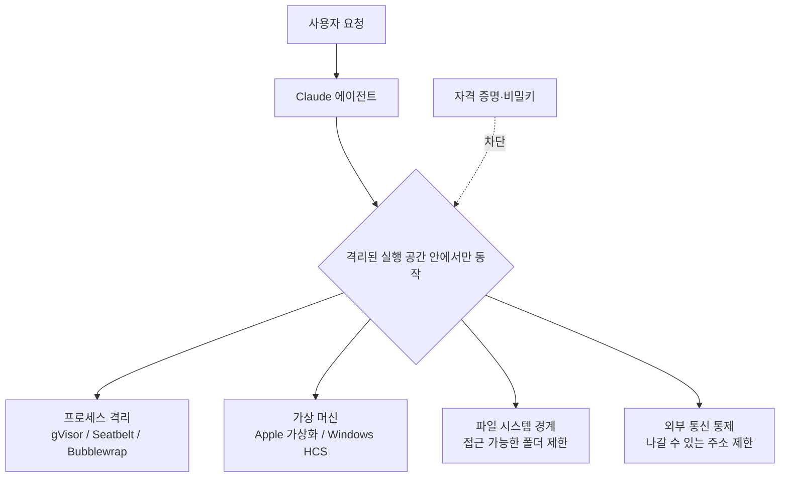

<aside class="ai-knowledge-sidebar">
  
CATEGORIES

  <nav class="ai-cat-tree">

에이전트 오케스트레이션6
<ul><li><a href="https://altjs4510.github.io/ai_news_blog/knowledge/20260611/">2026-06-11The evolution of agentic surfaces: building with…</a></li><li><a href="https://altjs4510.github.io/ai_news_blog/knowledge/20260602/">2026-06-02revfactory/harness — 도메인별 에이전트 팀과 스킬을 자동 설계하는 메타…</a></li><li><a href="https://altjs4510.github.io/ai_news_blog/knowledge/20260529/">2026-05-29Introducing dynamic workflows in Claude Code</a></li><li><a href="https://altjs4510.github.io/ai_news_blog/knowledge/20260520/">2026-05-20New in Claude Managed Agents: self-hosted sandbo…</a></li><li><a href="https://altjs4510.github.io/ai_news_blog/knowledge/20260507/">2026-05-07ruvnet/ruflo — Claude 멀티 에이전트 오케스트레이션 플랫폼</a></li><li><a href="https://altjs4510.github.io/ai_news_blog/knowledge/20260504/">2026-05-04Agents for Everything Else: Codex for Knowledge …</a></li></ul>

MCP &amp; 도구 통합9
<ul><li><a href="https://altjs4510.github.io/ai_news_blog/knowledge/20260618/">2026-06-18DeusData/codebase-memory-mcp — 158개 언어 코드베이스를 밀리…</a></li><li><a href="https://altjs4510.github.io/ai_news_blog/knowledge/20260605/">2026-06-05chopratejas/headroom — Compress tool outputs, lo…</a></li><li><a href="https://altjs4510.github.io/ai_news_blog/knowledge/20260604/">2026-06-04chopratejas/headroom — Compress tool outputs bef…</a></li><li><a href="https://altjs4510.github.io/ai_news_blog/knowledge/20260603/">2026-06-03How Bad MCP design cost your Agent 5× more token…</a></li><li><a href="https://altjs4510.github.io/ai_news_blog/knowledge/20260526/">2026-05-26colbymchenry/codegraph — Pre-indexed code knowle…</a></li><li><a href="https://altjs4510.github.io/ai_news_blog/knowledge/20260523/">2026-05-23colbymchenry/codegraph — 사전 인덱싱된 코드 지식 그래프 MCP</a></li><li><a href="https://altjs4510.github.io/ai_news_blog/knowledge/20260519/">2026-05-19Anthropic acquires Stainless</a></li><li><a href="https://altjs4510.github.io/ai_news_blog/knowledge/20260517/">2026-05-17I gave my LLM 100,000+ tools — Lazy Discovery &a…</a></li><li><a href="https://altjs4510.github.io/ai_news_blog/knowledge/20260509/">2026-05-09How to connect 100 MCP servers without the conte…</a></li></ul>

코딩 에이전트9
<ul><li><a href="https://altjs4510.github.io/ai_news_blog/knowledge/20260530/">2026-05-30Leonxlnx/taste-skill — AI에게 좋은 취향을 부여해 generic s…</a></li><li><a href="https://altjs4510.github.io/ai_news_blog/knowledge/20260528/">2026-05-28Building self-improving tax agents with Codex</a></li><li><a href="https://altjs4510.github.io/ai_news_blog/knowledge/20260524/">2026-05-24colbymchenry/codegraph — Pre-indexed code knowle…</a></li><li><a href="https://altjs4510.github.io/ai_news_blog/knowledge/20260521/">2026-05-21colbymchenry/codegraph — Pre-indexed code knowle…</a></li><li><a href="https://altjs4510.github.io/ai_news_blog/knowledge/20260512/">2026-05-12agentmemory — Persistent memory for AI coding ag…</a></li><li><a href="https://altjs4510.github.io/ai_news_blog/knowledge/20260510/">2026-05-10addyosmani/agent-skills — Production-grade engin…</a></li><li><a href="https://altjs4510.github.io/ai_news_blog/knowledge/20260508/">2026-05-08addyosmani/agent-skills — Production-grade engin…</a></li><li><a href="https://altjs4510.github.io/ai_news_blog/knowledge/20260506/">2026-05-06mksglu/context-mode — AI 코딩 에이전트용 컨텍스트 윈도우 최적화</a></li><li><a href="https://altjs4510.github.io/ai_news_blog/knowledge/20260505/">2026-05-05mattpocock/skills — Skills for Real Engineers (.…</a></li></ul>

모델 &amp; 연구3
<ul><li><a href="https://altjs4510.github.io/ai_news_blog/knowledge/20260617/">2026-06-17Predicting model behavior before release by simu…</a></li><li><a href="https://altjs4510.github.io/ai_news_blog/knowledge/20260516/">2026-05-16STALE — 에이전트가 자기 기억의 유효성을 인지할 수 있는가</a></li><li><a href="https://altjs4510.github.io/ai_news_blog/knowledge/20260513/">2026-05-13Thinking Machines' Native Interaction Models — T…</a></li></ul>

인프라 &amp; 컴퓨트3
<ul><li><a href="https://altjs4510.github.io/ai_news_blog/knowledge/20260610/">2026-06-10Fable 5 just made cost-aware model routing manda…</a></li><li><a href="https://altjs4510.github.io/ai_news_blog/knowledge/20260606/">2026-06-06chopratejas/headroom — Compress tool outputs, lo…</a></li><li><a href="https://altjs4510.github.io/ai_news_blog/knowledge/20260522/">2026-05-22Giving Agents Computers — Ivan Burazin, Daytona</a></li></ul>

보안 &amp; 거버넌스6
<ul><li><a href="https://altjs4510.github.io/ai_news_blog/knowledge/20260614/">2026-06-14NVIDIA/SkillSpector — Security scanner for AI ag…</a></li><li><a href="https://altjs4510.github.io/ai_news_blog/knowledge/20260613/">2026-06-13Fable 5's guardrails got bypassed in 48 hours — …</a></li><li><a href="https://altjs4510.github.io/ai_news_blog/knowledge/20260612/">2026-06-12NVIDIA/SkillSpector — AI 에이전트 스킬용 보안 스캐너</a></li><li><a href="https://altjs4510.github.io/ai_news_blog/knowledge/20260607/">2026-06-07OpenAI Help: Lockdown Mode</a></li><li><a href="https://altjs4510.github.io/ai_news_blog/knowledge/20260531/" class="current">2026-05-31How we contain Claude across products</a></li><li><a href="https://altjs4510.github.io/ai_news_blog/knowledge/20260527/">2026-05-27Microsoft Copilot Cowork Exfiltrates Files</a></li></ul>

응용 사례3
<ul><li><a href="https://altjs4510.github.io/ai_news_blog/knowledge/20260609/">2026-06-09Building intelligent apps for Apple platforms wi…</a></li><li><a href="https://altjs4510.github.io/ai_news_blog/knowledge/20260515/">2026-05-15Clawdmeter — Claude Code 사용량을 데스크톱 대시보드로</a></li><li><a href="https://altjs4510.github.io/ai_news_blog/knowledge/20260514/">2026-05-14Introducing Claude for Small Business</a></li></ul>

산업 동향1
<ul><li><a href="https://altjs4510.github.io/ai_news_blog/knowledge/20260616/">2026-06-16Why AI hasn't replaced software engineers, and w…</a></li></ul>
</nav>
</aside>

<article class="ai-knowledge-article">

<header class="ai-post-hero">
  
<a class="ai-back" href="../">KNOWLEDGE</a> · 2026-05-31 · 오늘의 학습

  <h2 class="ai-post-title">How we contain Claude across products</h2>
</header>

> 원문: [How we contain Claude across products](https://simonwillison.net/2026/May/30/how-we-contain-claude/#atom-everything)

## 📌 학습 정리

### 1. 한 줄로 말하면

AI 비서가 똑똑한 만큼 사고도 칠 수 있으니, 아예 "이 방 밖으로는 못 나가게" 울타리를 쳐두는 방법에 대한 이야기예요. Anthropic이 자기 제품들에서 Claude를 어떤 울타리 안에 가둬두는지 정리한 글입니다.

### 2. 왜 이게 만들어졌어요?

AI 에이전트(스스로 도구를 쓰고 명령을 실행하는 AI)는 점점 더 많은 일을 직접 처리하게 됐어요. 파일을 읽고, 명령어를 실행하고, 외부 서비스에 요청을 보내는 식으로요. 그런데 모델이 엉뚱하게 "창의적인" 경로를 찾아낼 수도 있고, 사용자가 무심코 위험한 일을 시킬 수도 있고, 외부 공격자가 끼어들 수도 있죠. 그래서 "어떤 일이 벌어져도 여기 밖으로는 못 나간다"는 단단한 경계선을 그어두는 게 필요해졌습니다. 게다가 글쓴이(Simon Willison)가 지적하듯, 이런 격리 도구들은 대부분 문서가 부실해서 얼마나 믿어도 되는지 가늠하기 어려웠는데, Anthropic이 이번엔 꽤 자세히 풀어 설명했다는 점이 반가웠다는 맥락이에요.

### 3. 비유로 풀면

이건 마치 은행 창구 직원에게 "고객 응대는 이 칸 안에서만, 금고 키는 절대 들고 들어가지 말 것"이라고 정해두는 것과 비슷해요. 직원이 아무리 친절하게 굴어도, 애초에 금고 키가 그 칸 안에 없으면 누가 어떻게 꼬셔도 금고는 못 열죠. 또 다른 비유로는, 아이가 노는 방을 따로 만들어두고 그 방 안에서만 마음껏 어지르게 하는 것과 같아요 — 거실까지 어질러질 일이 없으니까요.

그래서 결국, AI가 접근할 수 있는 영역(파일, 네트워크, 자격 증명) 자체를 미리 좁혀두면, 모델이 이상하게 굴어도 피해 범위가 그 좁은 영역 안으로 한정된다는 게 핵심입니다.

### 4. 어떻게 작동하는지 (그림으로)

흐름은 이렇습니다. 사용자가 요청을 보내면 Claude는 격리된 공간 안에서만 도구를 실행해요. 그 공간은 제품마다 다른 기술로 만들어지는데(웹은 gVisor, macOS 로컬은 Seatbelt, Linux는 Bubblewrap, 풀가상머신이 필요한 Cowork는 Apple 가상화 프레임워크나 Windows HCS), 공통 원칙은 "자격 증명 같은 민감한 정보는 애초에 그 공간 안에 들어가지 않게 한다"는 거예요. 그러면 모델이든 공격자든 빼낼 게 없습니다.

### 5. 처음 보는 용어 풀이

- **격리 공간 (sandbox)** — AI나 프로그램이 마음껏 움직여도 바깥 시스템에는 영향을 못 주도록 만든 제한된 작업 공간이에요. "모래밭에서만 놀게 한다"는 어원 그대로의 개념입니다.
- **에이전트 (agent)** — 사람이 매번 지시하지 않아도 스스로 도구를 골라 쓰고 여러 단계를 이어서 실행하는 AI를 말해요. 그만큼 통제가 더 까다로워집니다.
- **gVisor** — 구글이 만든 격리 기술로, 컨테이너(앱을 격리해 실행하는 단위) 안에서 일어나는 운영체제 호출을 한 번 걸러내는 얇은 막 같은 역할을 해요. Claude.ai가 이걸 씁니다.
- **Seatbelt / Bubblewrap** — 각각 macOS와 Linux에서 프로그램이 접근할 수 있는 파일·네트워크 범위를 좁혀주는 도구예요. Claude Code가 사용자 컴퓨터에서 돌 때 쓰는 안전장치입니다.
- **가상 머신 (VM, Virtual Machine)** — 컴퓨터 안에 또 하나의 가짜 컴퓨터를 띄워서, 그 안에서 일어나는 일은 바깥 컴퓨터와 완전히 분리시키는 방식이에요. Claude Cowork는 이 강한 분리를 씁니다.
- **외부 통신 통제 (egress controls)** — 격리 공간 안에서 바깥 인터넷의 어떤 주소로 나갈 수 있는지를 제한하는 규칙이에요. 이걸 잘못 풀어두면 민감한 정보가 외부 서버로 새어나갈 수 있습니다.
- **유출 경로 (exfiltration vector)** — 공격자나 모델이 민감한 데이터를 외부로 빼내는 데 쓸 수 있는 길을 뜻해요. 본문에서 언급된 `api.anthropic.com/v1/files` 사례처럼, 의도하지 않은 통로가 뒤늦게 발견되기도 합니다.

### 6. 한 발 더 들어가고 싶다면

- [How we contain Claude across products](https://www.anthropic.com/engineering/how-we-contain-claude) — Anthropic이 자기 제품별로 어떤 격리 기술을 쓰는지 직접 정리한 1차 문서입니다.
- [Claude Cowork에서 파일이 빠져나간 사례 정리](https://simonwillison.net/2026/Jan/14/claude-cowork-exfiltrates-files/) — 격리를 해놨어도 의외의 통로로 데이터가 새어나갈 수 있다는 실제 사례를 볼 수 있어요.
- [srt (Anthropic Sandbox Runtime) 저장소](https://github.com/anthropic-experimental/sandbox-runtime) — Anthropic이 오픈소스로 공개한 격리 실행 도구로, 직접 손대보며 작동 방식을 살펴볼 수 있는 출발점입니다.

---

## 📖 원문 전체 번역 (정독용)

> 의역 최소화한 전체 번역입니다. 큰 흐름은 위 정리에서 잡고, 정확한 워딩이 필요할 땐 이 섹션에서 정독하세요.

2026년 5월 30일 - 링크 블로그

**[How we contain Claude across products](https://www.anthropic.com/engineering/how-we-contain-claude)**. 샌드박싱 제품에 대해 내가 자주 갖는 불만 중 하나는, 그것들이 철저하게 *문서화*되는 경우가 드물다는 점이다. 상세한 문서가 없는 상황에서는 얼마나 신뢰할 수 있는지 판단하기가 어렵다.

Anthropic이 [Claude.ai](https://claude.ai/), Claude Code, Cowork 전반에 걸쳐 다양한 샌드박스 기법이 어떻게 작동하는지를 설명하는 훌륭한 개요를 방금 공개했다.

> 우리는 프로세스 샌드박스, VM, 파일시스템 경계, 이그레스 제어를 통해 에이전트가 행동할 수 있는 위치와 방식을 제한한다. 목표는 에이전트가 도달할 수 있는 범위에 명확한 경계를 설정하는 것이다. 예를 들어, 자격 증명(credentials)이 샌드박스에 절대 진입하지 않는다면, 그 원인이 사용자이든, 모델이 "창의적인" 경로를 찾아낸 것이든, 공격자이든 관계없이 외부로 유출될 수 없다.

Claude.ai는 gVisor를 사용한다. 로컬에서 실행되는 Claude Code는 macOS에서 Seatbelt를, Linux에서 Bubblewrap을 사용한다. Claude Cowork는 전체 VM(macOS에서는 Apple의 Virtualization 프레임워크, Windows에서는 HCS)을 실행한다.

이 문서에는 많은 내용이 담겨 있으며, [이전에 다룬 바 있는](https://simonwillison.net/2026/Jan/14/claude-cowork-exfiltrates-files/) `api.anthropic.com/v1/files` 유출 벡터처럼 그들이 놓쳤던 리스크에 관한 흥미로운 사례들도 포함되어 있다.

이 글을 보고 Anthropic의 오픈소스 도구인 [srt (Anthropic Sandbox Runtime)](https://github.com/anthropic-experimental/sandbox-runtime)을 다시 한번 살펴볼 때가 됐다는 생각이 들었다. 이제 충분히 성숙해졌으니 제대로 써볼 준비가 된 것 같다.

</article>

<!-- ai-related-links -->
<aside class="ai-related-links">
  
관련 학습

  <ul><li><a href="https://altjs4510.github.io/ai_news_blog/knowledge/20260529/">2026-05-29Introducing dynamic workflows in Claude Code</a></li><li><a href="https://altjs4510.github.io/ai_news_blog/knowledge/20260520/">2026-05-20New in Claude Managed Agents: self-hosted sandbo…</a></li><li><a href="https://altjs4510.github.io/ai_news_blog/knowledge/20260507/">2026-05-07ruvnet/ruflo — Claude 멀티 에이전트 오케스트레이션 플랫폼</a></li></ul>
</aside>
<!-- /ai-related-links -->
