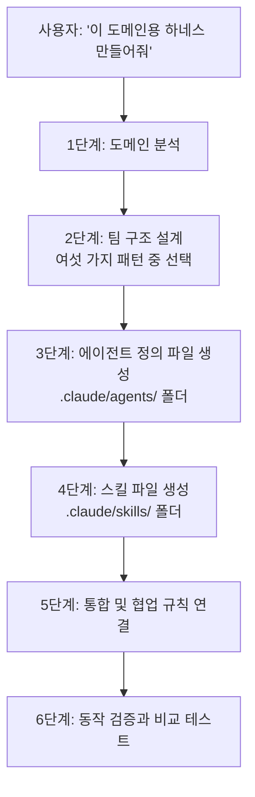

<div class="ai-knowledge-shell">

<aside class="ai-knowledge-sidebar">
  <p class="ai-eyebrow">CATEGORIES</p>
  <nav class="ai-cat-tree"><details class="ai-cat" open><summary><span class="catname">에이전트 오케스트레이션</span><span class="catcount">7</span></summary><ul><li><a href="https://altjs4510.github.io/ai_news_blog/knowledge/20260611/"><span class="kdate">2026-06-11</span><span class="ktitle">The evolution of agentic surfaces: building with…</span></a></li><li><a href="https://altjs4510.github.io/ai_news_blog/knowledge/20260605/"><span class="kdate">2026-06-05</span><span class="ktitle">chopratejas/headroom — Compress tool outputs, lo…</span></a></li><li><a href="https://altjs4510.github.io/ai_news_blog/knowledge/20260602/" class="current"><span class="kdate">2026-06-02</span><span class="ktitle">revfactory/harness — 도메인별 에이전트 팀과 스킬을 자동 설계하는 메타…</span></a></li><li><a href="https://altjs4510.github.io/ai_news_blog/knowledge/20260529/"><span class="kdate">2026-05-29</span><span class="ktitle">Introducing dynamic workflows in Claude Code</span></a></li><li><a href="https://altjs4510.github.io/ai_news_blog/knowledge/20260520/"><span class="kdate">2026-05-20</span><span class="ktitle">New in Claude Managed Agents: self-hosted sandbo…</span></a></li><li><a href="https://altjs4510.github.io/ai_news_blog/knowledge/20260507/"><span class="kdate">2026-05-07</span><span class="ktitle">ruvnet/ruflo — Claude 멀티 에이전트 오케스트레이션 플랫폼</span></a></li><li><a href="https://altjs4510.github.io/ai_news_blog/knowledge/20260504/"><span class="kdate">2026-05-04</span><span class="ktitle">Agents for Everything Else: Codex for Knowledge …</span></a></li></ul></details><details class="ai-cat" open><summary><span class="catname">MCP &amp; 도구 통합</span><span class="catcount">7</span></summary><ul><li><a href="https://altjs4510.github.io/ai_news_blog/knowledge/20260604/"><span class="kdate">2026-06-04</span><span class="ktitle">chopratejas/headroom — Compress tool outputs bef…</span></a></li><li><a href="https://altjs4510.github.io/ai_news_blog/knowledge/20260603/"><span class="kdate">2026-06-03</span><span class="ktitle">How Bad MCP design cost your Agent 5× more token…</span></a></li><li><a href="https://altjs4510.github.io/ai_news_blog/knowledge/20260526/"><span class="kdate">2026-05-26</span><span class="ktitle">colbymchenry/codegraph — Pre-indexed code knowle…</span></a></li><li><a href="https://altjs4510.github.io/ai_news_blog/knowledge/20260523/"><span class="kdate">2026-05-23</span><span class="ktitle">colbymchenry/codegraph — 사전 인덱싱된 코드 지식 그래프 MCP</span></a></li><li><a href="https://altjs4510.github.io/ai_news_blog/knowledge/20260519/"><span class="kdate">2026-05-19</span><span class="ktitle">Anthropic acquires Stainless</span></a></li><li><a href="https://altjs4510.github.io/ai_news_blog/knowledge/20260517/"><span class="kdate">2026-05-17</span><span class="ktitle">I gave my LLM 100,000+ tools — Lazy Discovery &a…</span></a></li><li><a href="https://altjs4510.github.io/ai_news_blog/knowledge/20260509/"><span class="kdate">2026-05-09</span><span class="ktitle">How to connect 100 MCP servers without the conte…</span></a></li></ul></details><details class="ai-cat" open><summary><span class="catname">코딩 에이전트</span><span class="catcount">9</span></summary><ul><li><a href="https://altjs4510.github.io/ai_news_blog/knowledge/20260530/"><span class="kdate">2026-05-30</span><span class="ktitle">Leonxlnx/taste-skill — AI에게 좋은 취향을 부여해 generic s…</span></a></li><li><a href="https://altjs4510.github.io/ai_news_blog/knowledge/20260528/"><span class="kdate">2026-05-28</span><span class="ktitle">Building self-improving tax agents with Codex</span></a></li><li><a href="https://altjs4510.github.io/ai_news_blog/knowledge/20260524/"><span class="kdate">2026-05-24</span><span class="ktitle">colbymchenry/codegraph — Pre-indexed code knowle…</span></a></li><li><a href="https://altjs4510.github.io/ai_news_blog/knowledge/20260521/"><span class="kdate">2026-05-21</span><span class="ktitle">colbymchenry/codegraph — Pre-indexed code knowle…</span></a></li><li><a href="https://altjs4510.github.io/ai_news_blog/knowledge/20260512/"><span class="kdate">2026-05-12</span><span class="ktitle">agentmemory — Persistent memory for AI coding ag…</span></a></li><li><a href="https://altjs4510.github.io/ai_news_blog/knowledge/20260510/"><span class="kdate">2026-05-10</span><span class="ktitle">addyosmani/agent-skills — Production-grade engin…</span></a></li><li><a href="https://altjs4510.github.io/ai_news_blog/knowledge/20260508/"><span class="kdate">2026-05-08</span><span class="ktitle">addyosmani/agent-skills — Production-grade engin…</span></a></li><li><a href="https://altjs4510.github.io/ai_news_blog/knowledge/20260506/"><span class="kdate">2026-05-06</span><span class="ktitle">mksglu/context-mode — AI 코딩 에이전트용 컨텍스트 윈도우 최적화</span></a></li><li><a href="https://altjs4510.github.io/ai_news_blog/knowledge/20260505/"><span class="kdate">2026-05-05</span><span class="ktitle">mattpocock/skills — Skills for Real Engineers (.…</span></a></li></ul></details><details class="ai-cat" open><summary><span class="catname">모델 &amp; 연구</span><span class="catcount">2</span></summary><ul><li><a href="https://altjs4510.github.io/ai_news_blog/knowledge/20260516/"><span class="kdate">2026-05-16</span><span class="ktitle">STALE — 에이전트가 자기 기억의 유효성을 인지할 수 있는가</span></a></li><li><a href="https://altjs4510.github.io/ai_news_blog/knowledge/20260513/"><span class="kdate">2026-05-13</span><span class="ktitle">Thinking Machines' Native Interaction Models — T…</span></a></li></ul></details><details class="ai-cat" open><summary><span class="catname">인프라 &amp; 컴퓨트</span><span class="catcount">3</span></summary><ul><li><a href="https://altjs4510.github.io/ai_news_blog/knowledge/20260610/"><span class="kdate">2026-06-10</span><span class="ktitle">Fable 5 just made cost-aware model routing manda…</span></a></li><li><a href="https://altjs4510.github.io/ai_news_blog/knowledge/20260606/"><span class="kdate">2026-06-06</span><span class="ktitle">chopratejas/headroom — Compress tool outputs, lo…</span></a></li><li><a href="https://altjs4510.github.io/ai_news_blog/knowledge/20260522/"><span class="kdate">2026-05-22</span><span class="ktitle">Giving Agents Computers — Ivan Burazin, Daytona</span></a></li></ul></details><details class="ai-cat" open><summary><span class="catname">보안 &amp; 거버넌스</span><span class="catcount">5</span></summary><ul><li><a href="https://altjs4510.github.io/ai_news_blog/knowledge/20260613/"><span class="kdate">2026-06-13</span><span class="ktitle">Fable 5's guardrails got bypassed in 48 hours — …</span></a></li><li><a href="https://altjs4510.github.io/ai_news_blog/knowledge/20260612/"><span class="kdate">2026-06-12</span><span class="ktitle">NVIDIA/SkillSpector — AI 에이전트 스킬용 보안 스캐너</span></a></li><li><a href="https://altjs4510.github.io/ai_news_blog/knowledge/20260607/"><span class="kdate">2026-06-07</span><span class="ktitle">OpenAI Help: Lockdown Mode</span></a></li><li><a href="https://altjs4510.github.io/ai_news_blog/knowledge/20260531/"><span class="kdate">2026-05-31</span><span class="ktitle">How we contain Claude across products</span></a></li><li><a href="https://altjs4510.github.io/ai_news_blog/knowledge/20260527/"><span class="kdate">2026-05-27</span><span class="ktitle">Microsoft Copilot Cowork Exfiltrates Files</span></a></li></ul></details><details class="ai-cat" open><summary><span class="catname">응용 사례</span><span class="catcount">3</span></summary><ul><li><a href="https://altjs4510.github.io/ai_news_blog/knowledge/20260609/"><span class="kdate">2026-06-09</span><span class="ktitle">Building intelligent apps for Apple platforms wi…</span></a></li><li><a href="https://altjs4510.github.io/ai_news_blog/knowledge/20260515/"><span class="kdate">2026-05-15</span><span class="ktitle">Clawdmeter — Claude Code 사용량을 데스크톱 대시보드로</span></a></li><li><a href="https://altjs4510.github.io/ai_news_blog/knowledge/20260514/"><span class="kdate">2026-05-14</span><span class="ktitle">Introducing Claude for Small Business</span></a></li></ul></details></nav>
</aside>

<article class="ai-knowledge-article">

<header class="ai-post-hero">
  <p class="ai-eyebrow"><a class="ai-back" href="../">KNOWLEDGE</a> · 2026-06-02 · 오늘의 학습</p>
  <h2 class="ai-post-title">revfactory/harness — 도메인별 에이전트 팀과 스킬을 자동 설계하는 메타 스킬</h2>
</header>

> 원문: [revfactory/harness — 도메인별 에이전트 팀과 스킬을 자동 설계하는 메타 스킬](https://github.com/revfactory/harness)

## 📌 학습 정리

### 1. 한 줄로 말하면

"이런 일을 하는 팀이 필요해요"라고 한국어로 한 줄 말하면, 그 일에 맞는 전문가 에이전트 팀과 각자가 쓸 도구 묶음을 자동으로 짜주는 도구예요.

### 2. 왜 이게 만들어졌어요?

원래는 복잡한 작업을 인공지능 비서에게 맡기려면, 사람이 직접 "어떤 역할의 에이전트를 몇 명 둘지", "이들이 어떻게 정보를 주고받을지", "각자가 쓸 스킬을 어떻게 정의할지"를 일일이 설계해야 했어요. 도메인이 바뀔 때마다 이 설계를 처음부터 다시 해야 하니, 시간도 오래 걸리고 결과물의 품질도 사람마다 들쭉날쭉했죠. 그래서 "도메인 설명 한 줄"을 받아서 에이전트 팀 구성과 스킬 파일까지 한 번에 만들어 주는, 일종의 '팀 설계 공장'이 필요해졌습니다. Harness는 이걸 클로드 코드(Claude Code, 앤트로픽이 만든 명령줄용 코딩 비서) 안에서 플러그인 형태로 풀어낸 거예요.

### 3. 비유로 풀면

이건 마치 영화 제작을 시작할 때 캐스팅 디렉터를 부르는 것과 비슷해요. "범죄 스릴러 한 편 찍을 거예요"라고만 말하면, 캐스팅 디렉터가 감독·각본가·촬영감독·편집자 후보를 추려주고, 각자가 들고 올 장비 목록까지 챙겨주는 식이죠. 또는 신축 사무실을 차릴 때 "디자인 에이전시예요"라고만 알려주면 어떤 직군을 몇 명 뽑고 어떤 소프트웨어를 깔아야 할지 추천해 주는 컨설턴트 같은 느낌이에요.

그래서 결국, Harness는 "어떤 일을 시킬지"만 알려주면 그 일을 해낼 가상 팀의 조직도와 업무 매뉴얼을 한꺼번에 뽑아 주는 도구입니다.

### 4. 어떻게 작동하는지 (그림으로)



사용자가 "하네스 만들어줘"라고 말하면 Harness는 먼저 어떤 도메인인지 해석하고, 미리 준비된 여섯 가지 팀 구조 중 알맞은 형태를 고릅니다. 그다음 에이전트 정의와 스킬 파일을 프로젝트 폴더 안에 실제로 써 넣고, 마지막으로 트리거가 잘 걸리는지·스킬을 썼을 때와 안 썼을 때 결과가 어떻게 다른지를 검증해요.

### 5. 처음 보는 용어 풀이

- **에이전트 팀 (Agent Teams)** — 여러 인공지능 비서가 각자 역할을 맡아 메시지를 주고받으며 협업하도록 묶어 놓은 단위예요. 클로드 코드의 실험 기능 중 하나로, 환경 변수 `CLAUDE_CODE_EXPERIMENTAL_AGENT_TEAMS=1`을 켜야 동작해요.
- **스킬 (Skill)** — 에이전트가 특정 상황에서 꺼내 쓰는 작은 매뉴얼 파일이에요. "이런 트리거가 들어오면 이런 절차로 일해라"가 마크다운으로 적혀 있다고 보면 됩니다.
- **메타 스킬·메타 팩토리 (Meta-Factory)** — 스킬이나 에이전트를 직접 실행하는 대신, 그것들을 만들어 내는 한 단계 위의 도구예요. Harness 자체가 "스킬을 만드는 스킬"이라 이 층에 속해요.
- **프로그레시브 디스클로저 (Progressive Disclosure)** — 처음에는 핵심 정보만 보여주고, 필요할 때 세부 내용을 펼쳐 보여주는 방식이에요. 인공지능이 한 번에 읽는 글의 양(컨텍스트)을 아끼기 위해 쓰입니다.
- **오케스트레이션 (Orchestration)** — 여러 에이전트가 누가 먼저 말하고 누구에게 결과를 넘길지를 정하는 지휘 규칙이에요. 사람이 회의를 진행할 때의 사회자 역할에 가깝습니다.
- **여섯 가지 팀 패턴 (6 Architecture Patterns)** — 작업 흐름의 모양을 미리 정해 둔 틀이에요. 일을 줄줄이 넘기는 파이프라인, 동시에 나눠 하고 합치는 팬아웃/팬인, 상황에 따라 전문가를 호출하는 익스퍼트 풀, 만들고-검토하는 프로듀서-리뷰어, 중앙 지휘자가 분배하는 슈퍼바이저, 위에서 아래로 위임이 이어지는 계층형 위임이 있어요.
- **러닝타임 vs 팀 아키텍처 (Runtime-Configuration Factory vs Team-Architecture Factory)** — 같은 메타 층 안에서도 결이 다른 두 갈래예요. 앞쪽(예: Archon)은 "어떤 환경에서 어떻게 실행될지"를 정해 주고, 뒤쪽(Harness)은 "누가 누구와 어떻게 일할지"를 설계해 줍니다.

### 6. 한 발 더 들어가고 싶다면

- [revfactory/harness-100](https://github.com/revfactory/harness-100) — Harness로 미리 뽑아 둔 100가지 도메인용 팀 구성 모음이에요. 실제 결과물이 어떤 모양인지 감을 잡고 싶을 때 보면 좋습니다.
- [revfactory/claude-code-harness](https://github.com/revfactory/claude-code-harness) — 작성자가 직접 진행한 A/B 비교 실험 자료예요. "팀을 미리 짜 주는 게 정말 도움이 되나?"를 15개 과제로 측정한 기록을 볼 수 있어요(저자 측정, n=15, 외부 재현은 아직).
- [coleam00/Archon](https://github.com/coleam00/Archon) — 같은 메타 층의 이웃 도구예요. 팀 구조가 아니라 실행 환경을 결정해 주는 쪽이라, Harness와 함께 쓸 때의 그림을 비교해 보기 좋습니다.
- [SaehwanPark/meta-harness](https://github.com/SaehwanPark/meta-harness) — 같은 아이디어를 코덱스(Codex) 런타임으로 옮긴 버전이에요. 클로드 코드 말고 다른 환경에서 비슷한 효과를 보고 싶을 때 참고할 수 있어요.
- [Agent Teams 공식 문서](https://code.claude.com/docs/en/agent-teams) — Harness가 올라타 있는 클로드 코드의 팀 기능 자체를 더 알고 싶을 때 출발점으로 쓰기 좋아요.

---

## 📖 원문 전체 번역 (정독용)

> 의역 최소화한 전체 번역입니다. 큰 흐름은 위 정리에서 잡고, 정확한 워딩이 필요할 땐 이 섹션에서 정독하세요.

# Harness — Claude Code를 위한 팀 아키텍처 팩토리

**English** | [한국어](https://github.com/revfactory/harness/blob/main/README_KO.md) | [日本語](https://github.com/revfactory/harness/blob/main/README_JA.md)

> **Harness는 Claude Code를 위한 팀 아키텍처 팩토리입니다.** **"build a harness for this project"** (영어) 또는 **"하네스 구성해줘"** (한국어) 또는 **"ハーネスを構成して"** (일본어)라고 말하면, 이 플러그인은 여섯 가지 사전 정의된 팀 아키텍처 패턴 중에서 선택하여 도메인 설명을 에이전트 팀과 그 팀이 사용하는 스킬로 변환합니다.

## 개요

Harness는 Claude Code의 에이전트 팀 시스템을 활용하여 복잡한 작업을 전문화된 에이전트들의 협력 팀으로 분해합니다. "build a harness for this project"라고 말하면 도메인에 맞춘 에이전트 정의(`.claude/agents/`)와 스킬(`.claude/skills/`)을 자동으로 생성합니다.

## 카테고리 — Harness의 위치

Harness는 Claude Code 생태계의 **L3 메타-팩토리 (Meta-Factory)** 계층에 위치합니다 — 이 계층은 하나의 하네스가 되는 것이 아니라 다른 하네스를 생성하는 계층입니다. L3 내에서 특정 서브-계층을 선택합니다: **팀-아키텍처 팩토리 (Team-Architecture Factory)**.

| 계층 | 역할 | 공존하는 이웃 |
| --- | --- | --- |
| **L3 — 메타-팩토리 / 팀-아키텍처 팩토리** (현 프로젝트) | 도메인 문장 → 에이전트 팀 + 스킬, 6가지 사전 정의된 팀 패턴 사용 | — |
| L3 — 메타-팩토리 / 런타임-구성 팩토리 | 결정론적이고 재현 가능한 런타임 구성 | [coleam00/Archon](https://github.com/coleam00/Archon) |
| L3 — 메타-팩토리 / Codex 런타임 포트 | 동일한 개념, Codex 런타임 | [SaehwanPark/meta-harness](https://github.com/SaehwanPark/meta-harness) |
| L2 — 크로스-하네스 워크플로우 | 여러 하네스에 걸쳐 스킬/규칙/훅 표준화 | [affaan-m/ECC](https://github.com/affaan-m/everything-claude-code) |

> Archon은 결정론적 런타임 구성을 생성합니다. Harness는 팀 아키텍처(파이프라인, 팬-아웃/팬-인, 전문가 풀, 프로듀서-리뷰어, 슈퍼바이저, 계층적 위임)와 에이전트가 사용하는 스킬을 생성합니다. 동일한 L3의 서로 다른 서브-계층입니다. 런타임 결정론이 필요하면 Archon을, 팀 아키텍처가 필요하면 Harness를 선택하거나, 둘을 결합하세요.

## 스타 히스토리 (Star History)

## 주요 기능

*   **에이전트 팀 설계** — 6가지 아키텍처 패턴: 파이프라인 (Pipeline), 팬-아웃/팬-인 (Fan-out/Fan-in), 전문가 풀 (Expert Pool), 프로듀서-리뷰어 (Producer-Reviewer), 슈퍼바이저 (Supervisor), 계층적 위임 (Hierarchical Delegation)
*   **스킬 생성** — 효율적인 컨텍스트 관리를 위한 점진적 공개 (Progressive Disclosure)와 함께 스킬 자동 생성
*   **오케스트레이션 (Orchestration)** — 에이전트 간 데이터 전달, 오류 처리, 팀 조율 프로토콜
*   **검증** — 트리거 검증, 드라이-런 (dry-run) 테스트, 스킬 적용 여부 비교 테스트

## 워크플로우

```
1단계: 도메인 분석
    ↓
2단계: 팀 아키텍처 설계 (에이전트 팀 vs 서브에이전트)
    ↓
3단계: 에이전트 정의 생성 (.claude/agents/)
    ↓
4단계: 스킬 생성 (.claude/skills/)
    ↓
5단계: 통합 및 오케스트레이션
    ↓
6단계: 검증 및 테스트
```

## 설치

### 마켓플레이스를 통한 설치

#### 마켓플레이스 추가

```
/plugin marketplace add revfactory/harness
```

#### 플러그인 설치

```
/plugin install harness@harness-marketplace
```

### 글로벌 스킬로 직접 설치

```bash
# skills 디렉토리를 ~/.claude/skills/harness/ 로 복사
cp -r skills/harness ~/.claude/skills/harness
```

## 플러그인 구조

```
harness/
├── .claude-plugin/
│   └── plugin.json                 # 플러그인 매니페스트
├── skills/
│   └── harness/
│       ├── SKILL.md                # 메인 스킬 정의 (6단계 워크플로우)
│       └── references/
│           ├── agent-design-patterns.md   # 6가지 아키텍처 패턴
│           ├── orchestrator-template.md   # 팀/서브에이전트 오케스트레이터 템플릿
│           ├── team-examples.md           # 5가지 실제 팀 구성 예시
│           ├── skill-writing-guide.md     # 스킬 작성 가이드
│           ├── skill-testing-guide.md     # 테스트 및 평가 방법론
│           └── qa-agent-guide.md          # QA 에이전트 통합 가이드
└── README.md
```

## 사용법

Claude Code에서 다음과 같은 프롬프트로 실행하세요:

```
Build a harness for this project
Design an agent team for this domain
Set up a harness
```

### 실행 모드

| 모드 | 설명 | 권장 대상 |
| --- | --- | --- |
| **에이전트 팀 (Agent Teams)** (기본) | TeamCreate + SendMessage + TaskCreate | 협업이 필요한 에이전트 2개 이상 |
| **서브에이전트 (Subagents)** | 직접 Agent 도구 호출 | 일회성 작업, 에이전트 간 통신 불필요 |

### 아키텍처 패턴

| 패턴 | 설명 |
| --- | --- |
| 파이프라인 (Pipeline) | 순차적 의존 작업 |
| 팬-아웃/팬-인 (Fan-out/Fan-in) | 병렬 독립 작업 |
| 전문가 풀 (Expert Pool) | 컨텍스트에 따른 선택적 호출 |
| 프로듀서-리뷰어 (Producer-Reviewer) | 생성 후 품질 검토 |
| 슈퍼바이저 (Supervisor) | 동적 작업 분배를 담당하는 중앙 에이전트 |
| 계층적 위임 (Hierarchical Delegation) | 하향식 재귀적 위임 |

## 출력

Harness가 생성하는 파일:

```
your-project/
├── .claude/
│   ├── agents/          # 에이전트 정의 파일
│   │   ├── analyst.md
│   │   ├── builder.md
│   │   └── qa.md
│   └── skills/          # 스킬 파일
│       ├── analyze/
│       │   └── SKILL.md
│       └── build/
│           ├── SKILL.md
│           └── references/
```

## 활용 사례 — 이 프롬프트를 사용해 보세요

Harness 설치 후 아래 프롬프트를 Claude Code에 복사하세요:

**딥 리서치 (Deep Research)**

```
Build a harness for deep research. I need an agent team that can investigate
any topic from multiple angles — web search, academic sources, community
sentiment — then cross-validate findings and produce a comprehensive report.
```

**웹사이트 개발**

```
Build a harness for full-stack website development. The team should handle
design, frontend (React/Next.js), backend (API), and QA testing in a
coordinated pipeline from wireframe to deployment.
```

**웹툰 / 만화 제작**

```
Build a harness for webtoon episode production. I need agents for story
writing, character design prompts, panel layout planning, and dialogue
editing. They should review each other's work for style consistency.
```

**유튜브 콘텐츠 기획**

```
Build a harness for YouTube content creation. The team should research
trending topics, write scripts, optimize titles/tags for SEO, and plan
thumbnail concepts — all coordinated by a supervisor agent.
```

**코드 리뷰 및 리팩터링**

```
Build a harness for comprehensive code review. I want parallel agents
checking architecture, security vulnerabilities, performance bottlenecks,
and code style — then merging all findings into a single report.
```

**기술 문서화**

```
Build a harness that generates API documentation from this codebase.
Agents should analyze endpoints, write descriptions, generate usage
examples, and review for completeness.
```

**데이터 파이프라인 설계**

```
Build a harness for designing data pipelines. I need agents for schema
design, ETL logic, data validation rules, and monitoring setup that
delegate sub-tasks hierarchically.
```

**마케팅 캠페인**

```
Build a harness for marketing campaign creation. The team should research
the target market, write ad copy, design visual concepts, and set up
A/B test plans with iterative quality review.
```

## 공존 관계 — Harness와 이웃 프로젝트들

Harness는 Claude Code / 에이전트 프레임워크 생태계에서 혼자가 아닙니다. 다음 저장소들은 인접 계층에 위치하며, 각 항목은 "X는 …이고, Harness는 …이다" 형태로 설명되어 있어 필요에 맞는 것을 선택하거나 여러 개를 결합할 수 있습니다.

| 저장소 | 해당 프로젝트의 위치 | Harness와의 관계 |
| --- | --- | --- |
| [coleam00/Archon](https://github.com/coleam00/Archon) | "하네스 빌더" — 결정론적이고 재현 가능한 런타임 구성 | **동일한 L3, 이웃 서브-계층.** Archon은 런타임-구성 팩토리이고, Harness는 팀-아키텍처 팩토리입니다. 런타임 결정론이 필요하면 Archon을, 팀 아키텍처가 필요하면 Harness를 선택하거나 둘을 결합하세요. |
| [SaehwanPark/meta-harness](https://github.com/SaehwanPark/meta-harness) | 동일한 개념의 Codex 포트 | **동일한 L3, 다른 런타임.** Claude Code에서는 Harness를, Codex에서는 meta-harness를 사용하세요. |
| [affaan-m/ECC](https://github.com/affaan-m/everything-claude-code) | "에이전트 하네스 성능 & 워크플로우 계층" (기존 하네스 위에 위치) | **다른 계층.** ECC는 하네스 전반에 걸친 표준화 계층이고, Harness는 하네스를 생성하는 팩토리입니다. 직렬 조합이 가능합니다. |
| [wshobson/agents](https://github.com/wshobson/agents) | 서브에이전트 / 스킬 카탈로그 (에이전트 182개, 스킬 149개) | **팩토리 ↔ 부품 공급.** wshobson은 구매할 수 있는 카탈로그이고, Harness는 팀을 설계합니다. wshobson 항목을 Harness가 생성한 팀 내 부품으로 흡수할 수 있습니다. |
| [LangGraph](https://langchain-ai.github.io/langgraph/) | 상태-그래프 오케스트레이션, LLM 불가지론 | **다른 트랙.** LangGraph는 장기 실행, 상태 복구 가능 오케스트레이션을 위한 것이고, Harness는 빠른 Claude Code 네이티브 팀 설계를 위한 것입니다. |

## Harness로 구축된 프로젝트

### Harness 100

**[revfactory/harness-100](https://github.com/revfactory/harness-100)** — 10개 도메인에 걸친 100개의 프로덕션 수준 에이전트 팀 하네스로, 영어와 한국어 양 언어로 제공됩니다 (총 200개 패키지). 각 하네스에는 4~5명의 전문 에이전트, 오케스트레이터 스킬, 도메인별 스킬이 포함되며 — 모두 이 플러그인으로 생성되었습니다. 콘텐츠 제작, 소프트웨어 개발, 데이터/AI, 비즈니스 전략, 교육, 법률, 헬스 등을 아우르는 1,808개의 마크다운 파일.

### 연구: 하네스 효과의 A/B 테스트

**[revfactory/claude-code-harness](https://github.com/revfactory/claude-code-harness)** — 15개의 소프트웨어 엔지니어링 작업에 걸쳐 구조화된 사전 구성이 LLM 코드 에이전트 출력 품질에 미치는 영향을 측정한 통제 실험.

| 지표 | 하네스 미적용 | 하네스 적용 | 개선 |
| --- | --- | --- | --- |
| 평균 품질 점수 | 49.5 | 79.3 | **+60%** |
| 승률 | — | — | **100%** (15/15) |
| 출력 분산 | — | — | **-32%** |

핵심 발견: 효과는 작업 복잡도에 따라 증가함 — 작업이 어려울수록 개선 폭이 커짐 (+23.8 기초, +29.6 고급, +36.2 전문가).

**모든 곳에서 사용할 정확한 표현:** 평균 품질 +60% (49.5 → 79.3), 15/15 승률, −32% 분산 (n=15, 저자 측정 A/B, 제3자 재현 검증 대기 중).

> 전체 논문: _Hwang, M. (2026). Harness: Structured Pre-Configuration for Enhancing LLM Code Agent Output Quality._

## 요구 사항

*   [에이전트 팀 활성화](https://code.claude.com/docs/en/agent-teams): `CLAUDE_CODE_EXPERIMENTAL_AGENT_TEAMS=1`

## FAQ

**Q1. "+60%"는 과장된 수치가 아닌가요?**
**A.** +60% 수치는 **저자가 측정한 A/B 테스트 (n=15, 15개 작업, 자매 저장소 `claude-code-harness`에서 측정)**에서 나온 것입니다. 이 저장소의 모든 인용은 같은 문장에서 "n=15, 저자 측정, 제3자 재현 검증 대기 중"이라는 공개 사항과 수치를 함께 제시합니다. 도입 결정을 위해서는 2~4주간의 내부 파일럿을 실행하고 자체 수치를 측정하도록 권장합니다.

**근거:**

*   저자 A/B: [revfactory/claude-code-harness](https://github.com/revfactory/claude-code-harness)
*   논문: _Hwang, M. (2026). Harness: Structured Pre-Configuration for Enhancing LLM Code Agent Output Quality_

**Q2. 왜 "하네스 팩토리"이지 "하네스 빌더"가 아닌가요? Archon과 경쟁하는 것 아닌가요?**
**A.** Archon은 결정론적 런타임 구성을 생성합니다 — **런타임-구성 팩토리**입니다. Harness는 에이전트 팀 아키텍처(팀 구조, 메시지 프로토콜, 리뷰 게이트)를 생성합니다 — **팀-아키텍처 팩토리**입니다. 둘은 **동일한 L3 메타-팩토리의 이웃 서브-계층**으로 서로 다른 필요를 충족합니다. 런타임 결정론이 필요하면 Archon을, 팀 아키텍처 패턴이 필요하면 Harness를 선택하거나, 둘을 결합하세요 (Harness로 아키텍처 설계 → Archon으로 런타임 배포).

**근거:**

*   Archon 자체 정의: [clawfit docs/reference-levels.md](https://github.com/hongsw/clawfit/blob/main/docs/reference-levels.md)
*   서브-계층 선언: 위의 **카테고리 — Harness의 위치** 섹션 참조
*   Archon 저장소: [github.com/coleam00/Archon](https://github.com/coleam00/Archon)

**Q3. "Claude Code 전용"은 너무 좁은 범위 아닌가요? Gemini/Codex는요?**
**A.** 현재 공식 런타임은 Claude Code 전용입니다. 동일한 개념의 Codex 포트인 [SaehwanPark/meta-harness](https://github.com/SaehwanPark/meta-harness)가 이미 공개되어 있으므로, Codex 팀은 해당 저장소에서 시작할 수 있습니다. Harness는 "멀티-런타임, 얕은 지원"보다 "Claude Code 네이티브, 깊은 지원"을 선택했습니다. 자매 저장소(meta-harness, harness-init, OpenRig)와의 크로스-런타임 협력은 로드맵에 포함되어 있습니다.

**근거:**

*   Codex 포트: [github.com/SaehwanPark/meta-harness](https://github.com/SaehwanPark/meta-harness)
*   크로스-런타임 스캐폴더: [github.com/Gizele1/harness-init](https://github.com/Gizele1/harness-init)

## 라이선스

Apache 2.0

</article>

</div>

<!-- ai-related-links -->
<aside class="ai-related-links">
  <p class="ai-eyebrow">관련 학습</p>
  <ul><li><a href="https://altjs4510.github.io/ai_news_blog/knowledge/20260507/"><span class="kdate">2026-05-07</span><span class="ktitle">ruvnet/ruflo — Claude 멀티 에이전트 오케스트레이션 플랫폼</span></a></li><li><a href="https://altjs4510.github.io/ai_news_blog/knowledge/20260529/"><span class="kdate">2026-05-29</span><span class="ktitle">Introducing dynamic workflows in Claude Code</span></a></li><li><a href="https://altjs4510.github.io/ai_news_blog/knowledge/20260520/"><span class="kdate">2026-05-20</span><span class="ktitle">New in Claude Managed Agents: self-hosted sandbo…</span></a></li></ul>
</aside>
<!-- /ai-related-links -->
