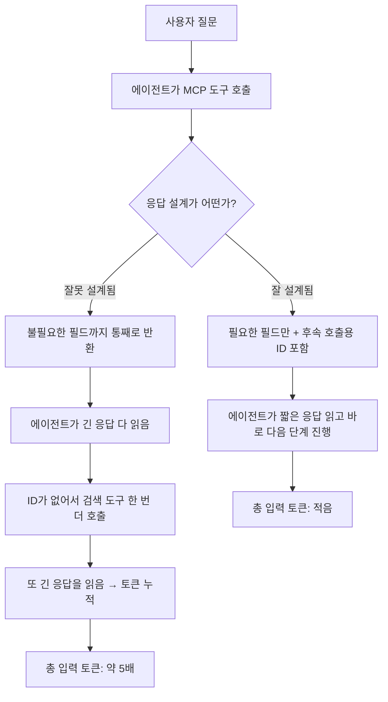

<aside class="ai-knowledge-sidebar">
  
CATEGORIES

  <nav class="ai-cat-tree">

에이전트 오케스트레이션7
<ul><li><a href="https://altjs4510.github.io/ai_news_blog/knowledge/20260805/">2026-08-05TencentCloud/TencentDB-Agent-Memory — 대화·문서·코드를 …</a></li><li><a href="https://altjs4510.github.io/ai_news_blog/knowledge/20260708/">2026-07-08Expanding Managed Agents in Gemini API: backgrou…</a></li><li><a href="https://altjs4510.github.io/ai_news_blog/knowledge/20260623/">2026-06-23bytedance/deer-flow — 샌드박스·메모리·서브에이전트·메시지 게이트웨이를…</a></li><li><a href="https://altjs4510.github.io/ai_news_blog/knowledge/20260611/">2026-06-11The evolution of agentic surfaces: building with…</a></li><li><a href="https://altjs4510.github.io/ai_news_blog/knowledge/20260602/">2026-06-02revfactory/harness — 도메인별 에이전트 팀과 스킬을 자동 설계하는 메타…</a></li><li><a href="https://altjs4510.github.io/ai_news_blog/knowledge/20260529/">2026-05-29Introducing dynamic workflows in Claude Code</a></li><li><a href="https://altjs4510.github.io/ai_news_blog/knowledge/20260507/">2026-05-07ruvnet/ruflo — Claude 멀티 에이전트 오케스트레이션 플랫폼</a></li></ul>

MCP &amp; 도구 통합17
<ul><li><a href="https://altjs4510.github.io/ai_news_blog/knowledge/20260802/">2026-08-02Stateless MCP has recaptured my interest (and in…</a></li><li><a href="https://altjs4510.github.io/ai_news_blog/knowledge/20260801/">2026-08-01different-ai/openwork — Claude Cowork의 오픈소스 대체 에…</a></li><li><a href="https://altjs4510.github.io/ai_news_blog/knowledge/20260731/">2026-07-31different-ai/openwork — Claude Cowork의 오픈소스 대안(o…</a></li><li><a href="https://altjs4510.github.io/ai_news_blog/knowledge/20260729/">2026-07-29Bringing MCP 2026-07-28 to Claude</a></li><li><a href="https://altjs4510.github.io/ai_news_blog/knowledge/20260719/">2026-07-19tirth8205/code-review-graph — 로컬 우선 코드 인텔리전스 그래프…</a></li><li><a href="https://altjs4510.github.io/ai_news_blog/knowledge/20260718/">2026-07-18tirth8205/code-review-graph — MCP·CLI용 로컬 코드 인텔리…</a></li><li><a href="https://altjs4510.github.io/ai_news_blog/knowledge/20260709/">2026-07-09mvanhorn/last30days-skill — Reddit·X·YouTube·HN·…</a></li><li><a href="https://altjs4510.github.io/ai_news_blog/knowledge/20260618/">2026-06-18DeusData/codebase-memory-mcp — 158개 언어 코드베이스를 밀리…</a></li><li><a href="https://altjs4510.github.io/ai_news_blog/knowledge/20260606/">2026-06-06chopratejas/headroom — Compress tool outputs, lo…</a></li><li><a href="https://altjs4510.github.io/ai_news_blog/knowledge/20260605/">2026-06-05chopratejas/headroom — Compress tool outputs, lo…</a></li><li><a href="https://altjs4510.github.io/ai_news_blog/knowledge/20260604/">2026-06-04chopratejas/headroom — Compress tool outputs bef…</a></li><li><a href="https://altjs4510.github.io/ai_news_blog/knowledge/20260603/" class="current">2026-06-03How Bad MCP design cost your Agent 5× more token…</a></li><li><a href="https://altjs4510.github.io/ai_news_blog/knowledge/20260523/">2026-05-23colbymchenry/codegraph — 사전 인덱싱된 코드 지식 그래프 MCP</a></li><li><a href="https://altjs4510.github.io/ai_news_blog/knowledge/20260520/">2026-05-20New in Claude Managed Agents: self-hosted sandbo…</a></li><li><a href="https://altjs4510.github.io/ai_news_blog/knowledge/20260517/">2026-05-17I gave my LLM 100,000+ tools — Lazy Discovery &a…</a></li><li><a href="https://altjs4510.github.io/ai_news_blog/knowledge/20260509/">2026-05-09How to connect 100 MCP servers without the conte…</a></li><li><a href="https://altjs4510.github.io/ai_news_blog/knowledge/20260506/">2026-05-06mksglu/context-mode — AI 코딩 에이전트용 컨텍스트 윈도우 최적화</a></li></ul>

코딩 에이전트26
<ul><li><a href="https://altjs4510.github.io/ai_news_blog/knowledge/20260820/">2026-08-20akitaonrails/ai-memory — 코딩 에이전트 CLI의 장기 메모리와 벤더…</a></li><li><a href="https://altjs4510.github.io/ai_news_blog/knowledge/20260819/">2026-08-19akitaonrails/ai-memory — 코딩 에이전트 CLI 간 장기 기억과 벤더…</a></li><li><a href="https://altjs4510.github.io/ai_news_blog/knowledge/20260814/">2026-08-14cathrynlavery/diagram-design — Claude Code용 에디토리…</a></li><li><a href="https://altjs4510.github.io/ai_news_blog/knowledge/20260811/">2026-08-11PrimeIntellect-ai/prime-agent — 장기 자율 실행을 전제로 설계…</a></li><li><a href="https://altjs4510.github.io/ai_news_blog/knowledge/20260810/">2026-08-10Auto mode is now the default in Claude Code for …</a></li><li><a href="https://altjs4510.github.io/ai_news_blog/knowledge/20260809/">2026-08-09PrimeIntellect-ai/prime-agent — 코딩 워크플로우·장기 자율 작…</a></li><li><a href="https://altjs4510.github.io/ai_news_blog/knowledge/20260808/">2026-08-08PrimeIntellect-ai/prime-agent — 코딩 워크플로우와 장시간 자율…</a></li><li><a href="https://altjs4510.github.io/ai_news_blog/knowledge/20260804/">2026-08-04esengine/DeepSeek-Reasonix — prefix-cache 안정성을 축…</a></li><li><a href="https://altjs4510.github.io/ai_news_blog/knowledge/20260728/">2026-07-28alibaba/open-code-review — 결정론적 파이프라인 + LLM 에이전트…</a></li><li><a href="https://altjs4510.github.io/ai_news_blog/knowledge/20260725/">2026-07-25The new rules of context engineering for Claude …</a></li><li><a href="https://altjs4510.github.io/ai_news_blog/knowledge/20260722/">2026-07-22tirth8205/code-review-graph — MCP·CLI용 로컬 우선 코드 …</a></li><li><a href="https://altjs4510.github.io/ai_news_blog/knowledge/20260721/">2026-07-21tirth8205/code-review-graph — 로컬 우선 코드 인텔리전스 그래프…</a></li><li><a href="https://altjs4510.github.io/ai_news_blog/knowledge/20260714/">2026-07-14Graphify-Labs/graphify — 코드베이스를 질의 가능한 지식 그래프로 만…</a></li><li><a href="https://altjs4510.github.io/ai_news_blog/knowledge/20260707/">2026-07-07AI Hero Skills Catalog — 실무 엔지니어를 위한 재사용 가능한 판단 …</a></li><li><a href="https://altjs4510.github.io/ai_news_blog/knowledge/20260705/">2026-07-05openai/codex-plugin-cc — Claude Code에서 Codex를 위임…</a></li><li><a href="https://altjs4510.github.io/ai_news_blog/knowledge/20260626/">2026-06-26google-labs-code/design.md — 코딩 에이전트에게 디자인 시스템을 …</a></li><li><a href="https://altjs4510.github.io/ai_news_blog/knowledge/20260619/">2026-06-19Claude Code now supports artifacts</a></li><li><a href="https://altjs4510.github.io/ai_news_blog/knowledge/20260530/">2026-05-30Leonxlnx/taste-skill — AI에게 좋은 취향을 부여해 generic s…</a></li><li><a href="https://altjs4510.github.io/ai_news_blog/knowledge/20260528/">2026-05-28Building self-improving tax agents with Codex</a></li><li><a href="https://altjs4510.github.io/ai_news_blog/knowledge/20260526/">2026-05-26colbymchenry/codegraph — Pre-indexed code knowle…</a></li><li><a href="https://altjs4510.github.io/ai_news_blog/knowledge/20260524/">2026-05-24colbymchenry/codegraph — Pre-indexed code knowle…</a></li><li><a href="https://altjs4510.github.io/ai_news_blog/knowledge/20260521/">2026-05-21colbymchenry/codegraph — Pre-indexed code knowle…</a></li><li><a href="https://altjs4510.github.io/ai_news_blog/knowledge/20260512/">2026-05-12agentmemory — Persistent memory for AI coding ag…</a></li><li><a href="https://altjs4510.github.io/ai_news_blog/knowledge/20260510/">2026-05-10addyosmani/agent-skills — Production-grade engin…</a></li><li><a href="https://altjs4510.github.io/ai_news_blog/knowledge/20260508/">2026-05-08addyosmani/agent-skills — Production-grade engin…</a></li><li><a href="https://altjs4510.github.io/ai_news_blog/knowledge/20260505/">2026-05-05mattpocock/skills — Skills for Real Engineers (.…</a></li></ul>

모델 &amp; 연구5
<ul><li><a href="https://altjs4510.github.io/ai_news_blog/knowledge/20260716-proprag/">2026-07-16PropRAG — 프로포지션 경로 위 beam search로 멀티홉 검색 안내</a></li><li><a href="https://altjs4510.github.io/ai_news_blog/knowledge/20260620/">2026-06-20zai-org/GLM-5 — From Vibe Coding to Agentic Engi…</a></li><li><a href="https://altjs4510.github.io/ai_news_blog/knowledge/20260617/">2026-06-17Predicting model behavior before release by simu…</a></li><li><a href="https://altjs4510.github.io/ai_news_blog/knowledge/20260516/">2026-05-16STALE — 에이전트가 자기 기억의 유효성을 인지할 수 있는가</a></li><li><a href="https://altjs4510.github.io/ai_news_blog/knowledge/20260513/">2026-05-13Thinking Machines' Native Interaction Models — T…</a></li></ul>

인프라 &amp; 컴퓨트7
<ul><li><a href="https://altjs4510.github.io/ai_news_blog/knowledge/20260821/">2026-08-21volcengine/OpenViking — 에이전트 메모리·Knowledge RAG·스…</a></li><li><a href="https://altjs4510.github.io/ai_news_blog/knowledge/20260813/">2026-08-13semantica-agi/semantica — 컨텍스트와 책임 추적을 위한 그래프 네이…</a></li><li><a href="https://altjs4510.github.io/ai_news_blog/knowledge/20260812/">2026-08-12semantica-agi/semantica — 컨텍스트와 '책임 추적 가능한(accou…</a></li><li><a href="https://altjs4510.github.io/ai_news_blog/knowledge/20260806/">2026-08-06cloudflare/computer — 에이전트에게 컴퓨터를 통째로 주는 엣지 실행 샌…</a></li><li><a href="https://altjs4510.github.io/ai_news_blog/knowledge/20260724/">2026-07-24diegosouzapw/OmniRoute — 단일 엔드포인트로 278+ 프로바이더·50…</a></li><li><a href="https://altjs4510.github.io/ai_news_blog/knowledge/20260723/">2026-07-23diegosouzapw/OmniRoute — 268+ 프로바이더를 단일 엔드포인트로 묶…</a></li><li><a href="https://altjs4510.github.io/ai_news_blog/knowledge/20260522/">2026-05-22Giving Agents Computers — Ivan Burazin, Daytona</a></li></ul>

보안 &amp; 거버넌스15
<ul><li><a href="https://altjs4510.github.io/ai_news_blog/knowledge/20260819-mind-viruses/">2026-08-19탈옥도, 인젝션도 없이 — 대화로만 퍼지는 에이전트의 '마인드 바이러스'</a></li><li><a href="https://altjs4510.github.io/ai_news_blog/knowledge/20260730/">2026-07-30Anatomy of a Frontier Lab Agent Intrusion: A Tec…</a></li><li><a href="https://altjs4510.github.io/ai_news_blog/knowledge/20260716/">2026-07-16Dicklesworthstone/destructive_command_guard — 에이…</a></li><li><a href="https://altjs4510.github.io/ai_news_blog/knowledge/20260715/">2026-07-15Dicklesworthstone/destructive_command_guard — 에이…</a></li><li><a href="https://altjs4510.github.io/ai_news_blog/knowledge/20260710/">2026-07-1070개 MCP 서버 strace 런타임 감사 — 부팅 시 아웃바운드 호출 서버 적발</a></li><li><a href="https://altjs4510.github.io/ai_news_blog/knowledge/20260704/">2026-07-04Cloudflare is about to block AI agents by defaul…</a></li><li><a href="https://altjs4510.github.io/ai_news_blog/knowledge/20260630/">2026-06-30Introducing the Claude apps gateway for Amazon B…</a></li><li><a href="https://altjs4510.github.io/ai_news_blog/knowledge/20260625/">2026-06-25Agent identity in Claude Tag: a new access model…</a></li><li><a href="https://altjs4510.github.io/ai_news_blog/knowledge/20260624/">2026-06-24Agent identity in Claude Tag: a new access model…</a></li><li><a href="https://altjs4510.github.io/ai_news_blog/knowledge/20260614/">2026-06-14NVIDIA/SkillSpector — Security scanner for AI ag…</a></li><li><a href="https://altjs4510.github.io/ai_news_blog/knowledge/20260613/">2026-06-13Fable 5's guardrails got bypassed in 48 hours — …</a></li><li><a href="https://altjs4510.github.io/ai_news_blog/knowledge/20260612/">2026-06-12NVIDIA/SkillSpector — AI 에이전트 스킬용 보안 스캐너</a></li><li><a href="https://altjs4510.github.io/ai_news_blog/knowledge/20260607/">2026-06-07OpenAI Help: Lockdown Mode</a></li><li><a href="https://altjs4510.github.io/ai_news_blog/knowledge/20260531/">2026-05-31How we contain Claude across products</a></li><li><a href="https://altjs4510.github.io/ai_news_blog/knowledge/20260527/">2026-05-27Microsoft Copilot Cowork Exfiltrates Files</a></li></ul>

응용 사례6
<ul><li><a href="https://altjs4510.github.io/ai_news_blog/knowledge/20260726/">2026-07-26citrolabs/ego-lite — 로그인된 브라우저 상태를 AI 에이전트와 공유하는…</a></li><li><a href="https://altjs4510.github.io/ai_news_blog/knowledge/20260717/">2026-07-17After a year building agent memory, 'save everyt…</a></li><li><a href="https://altjs4510.github.io/ai_news_blog/knowledge/20260621/">2026-06-21calesthio/OpenMontage — 12 파이프라인·52 도구·500+ 스킬을 …</a></li><li><a href="https://altjs4510.github.io/ai_news_blog/knowledge/20260609/">2026-06-09Building intelligent apps for Apple platforms wi…</a></li><li><a href="https://altjs4510.github.io/ai_news_blog/knowledge/20260515/">2026-05-15Clawdmeter — Claude Code 사용량을 데스크톱 대시보드로</a></li><li><a href="https://altjs4510.github.io/ai_news_blog/knowledge/20260514/">2026-05-14Introducing Claude for Small Business</a></li></ul>

산업 동향9
<ul><li><a href="https://altjs4510.github.io/ai_news_blog/knowledge/20260712/">2026-07-12Do Automated Evals Work?</a></li><li><a href="https://altjs4510.github.io/ai_news_blog/knowledge/20260711/">2026-07-11OpenAI says GPT 5.6 is the 'preferred model' for…</a></li><li><a href="https://altjs4510.github.io/ai_news_blog/knowledge/20260703/">2026-07-03Giving admins more visibility and control over C…</a></li><li><a href="https://altjs4510.github.io/ai_news_blog/knowledge/20260702/">2026-07-02How Cursor deploys AI inside the enterprise (For…</a></li><li><a href="https://altjs4510.github.io/ai_news_blog/knowledge/20260701/">2026-07-01Google OKF (Open Knowledge Format) — 벤더 중립 에이전트 …</a></li><li><a href="https://altjs4510.github.io/ai_news_blog/knowledge/20260616/">2026-06-16Why AI hasn't replaced software engineers, and w…</a></li><li><a href="https://altjs4510.github.io/ai_news_blog/knowledge/20260610/">2026-06-10Fable 5 just made cost-aware model routing manda…</a></li><li><a href="https://altjs4510.github.io/ai_news_blog/knowledge/20260519/">2026-05-19Anthropic acquires Stainless</a></li><li><a href="https://altjs4510.github.io/ai_news_blog/knowledge/20260504/">2026-05-04Agents for Everything Else: Codex for Knowledge …</a></li></ul>
</nav>
</aside>

<article class="ai-knowledge-article">

<header class="ai-post-hero">
  
<a class="ai-back" href="../">KNOWLEDGE</a> · 2026-06-03 · 오늘의 학습

  <h2 class="ai-post-title">How Bad MCP design cost your Agent 5× more tokens</h2>
</header>

> 원문: [How Bad MCP design cost your Agent 5× more tokens](https://www.reddit.com/r/mcp/comments/1tuhuqt/how_bad_mcp_design_cost_your_agent_5_more_tokens/)

## 📌 학습 정리

### 1. 한 줄로 말하면

같은 일을 하는 도구라도, 응답을 어떻게 돌려주느냐에 따라 에이전트(스스로 판단해 도구를 골라 쓰는 AI)가 읽어야 할 글자 수가 5배 가까이 차이 날 수 있다는 이야기예요.

### 2. 왜 이게 만들어졌어요?

요즘은 AI 에이전트가 외부 도구를 불러 쓸 때 **모델 컨텍스트 프로토콜(Model Context Protocol, MCP)** 이라는 공통 규격을 많이 씁니다. 도구를 만드는 쪽에서는 "그냥 데이터 다 넘겨주면 되겠지" 싶지만, 에이전트 입장에서는 그 응답을 전부 다시 읽어서(=입력 토큰으로 소비해서) 다음 행동을 정해야 해요. 그래서 응답에 불필요한 필드가 잔뜩 섞여 있거나, 다음 호출에 필요한 식별자(ID)를 빼먹어서 또 검색을 시키면, 같은 작업을 처리해도 토큰 비용이 몇 배씩 불어납니다. 이 글은 동일한 기능을 하는 MCP 서버 두 개를 직접 비교해, "나쁜 응답 설계 하나가 토큰을 약 4.98배 더 쓰게 만든다"는 걸 실측으로 보여주려고 쓰여졌어요.

> 참고: 원문 페이지가 네트워크 차단되어 본문을 직접 가져오지 못했습니다. 아래 내용은 제목과 큐레이션 메모에서 확인된 사실(동일 기능 MCP 서버 비교, 약 4.98배 토큰 차이, 핵심은 응답 필터링과 후속 호출용 ID 동시 반환)만을 바탕으로 풀어 썼습니다. 원문 본문의 구체적 수치·코드 예시는 별도 번역 단계에서 확인해 주세요.

### 3. 비유로 풀면

이건 마치 **부동산 중개인에게 "역세권 원룸 알려주세요"라고 물었을 때**, 한쪽은 "여기 후보 5개, 각 매물번호·주소·월세입니다"라고 깔끔히 적어주고, 다른 한쪽은 동네 전체 매물 200건의 PDF를 통째로 안겨주면서 "필요한 거 골라 쓰세요" 하는 차이와 비슷해요. 두 번째 중개인을 만나면, 다음에 "그럼 3번 매물 보러 갈래요"라고 말하려고 해도 매물번호가 안 적혀 있어서 다시 전화를 걸어 물어봐야 하죠.

그래서 결국, **에이전트가 읽어야 할 글자 수**와 **추가로 호출해야 할 횟수**가 둘 다 늘어나고, 토큰 청구서가 5배로 불어나는 겁니다.

### 4. 어떻게 작동하는지 (그림으로)

핵심 흐름은 두 갈래예요. 잘 설계된 응답은 **꼭 필요한 데이터**와 **다음에 쓸 식별자**를 한 번에 묶어서 돌려주기 때문에 에이전트가 한 번 읽고 다음 행동으로 넘어갑니다. 반대로 나쁜 응답은 데이터가 비대해서 읽는 비용 자체도 크고, 식별자가 빠져 있어서 같은 일을 하려고 도구를 또 부르게 되니 토큰이 누적으로 불어나는 구조예요.

### 5. 처음 보는 용어 풀이

- **모델 컨텍스트 프로토콜 (MCP, Model Context Protocol)** — AI 모델이 외부 도구·데이터에 접근할 때 쓰는 공통 규격. "어떤 도구가 있고, 어떻게 부르고, 결과를 어떤 형태로 돌려준다"를 표준화해 둔 약속입니다.
- **MCP 서버 (MCP server)** — 위 규격에 맞춰 실제 기능(검색, 조회, 쓰기 등)을 제공하는 쪽. 에이전트가 "이 도구 써줘"라고 부르면 응답을 만들어 돌려주는 역할을 해요.
- **에이전트 (agent)** — 사용자의 요청을 받아서 스스로 어떤 도구를 어떤 순서로 쓸지 정하고 실행하는 AI. 도구의 응답을 매번 읽어보고 다음 행동을 결정합니다.
- **입력 토큰 (input tokens)** — 모델이 "읽어들이는" 글자 단위. 도구가 돌려준 응답도 전부 입력 토큰으로 다시 들어가기 때문에, 응답이 길수록 비용과 지연이 커집니다.
- **응답 스키마 (response schema)** — 도구가 결과를 어떤 필드 구조로 돌려줄지 정해 둔 형식. 어떤 필드를 넣고 뺄지, 식별자를 어디에 둘지가 모두 여기서 결정돼요.
- **식별자 (ID)** — 특정 항목을 콕 집어 가리키는 번호나 키. 후속 호출(예: "그 항목의 상세 보여줘")을 하려면 응답에 이게 들어 있어야, 에이전트가 다시 검색하지 않고 바로 다음 단계로 넘어갈 수 있습니다.
- **도구 응답 필터링 (response filtering)** — 도구 안에서 미리 불필요한 필드를 잘라내고 핵심만 남겨 돌려주는 것. 에이전트한테 "골라 읽어"라고 떠넘기는 대신, 서버 쪽에서 미리 정리해 주는 설계예요.

### 6. 한 발 더 들어가고 싶다면

- [원문 Reddit 글](https://www.reddit.com/r/mcp/comments/1tuhuqt/how_bad_mcp_design_cost_your_agent_5_more_tokens/) — 두 MCP 서버를 비교한 실측 수치와 응답 예시를 직접 볼 수 있어요. (접속이 막혀 있으면 Reddit 로그인 후 다시 시도해 보세요.)

---

## 📖 원문 전체 번역 (정독용)

> 의역 최소화한 전체 번역입니다. 큰 흐름은 위 정리에서 잡고, 정확한 워딩이 필요할 땐 이 섹션에서 정독하세요.

네트워크 보안에 의해 차단되었습니다.

계속하려면 Reddit 계정으로 로그인하거나 개발자 토큰을 사용하세요.

실수로 차단된 것 같다면 아래에서 티켓을 제출해 주시면 확인하겠습니다.

[로그인](https://www.reddit.com/login/) [티켓 제출](https://support.reddithelp.com/hc/en-us/requests/new?ticket_form_id=21879292693140)

</article>

<!-- ai-related-links -->
<aside class="ai-related-links">
  
관련 학습

  <ul><li><a href="https://altjs4510.github.io/ai_news_blog/knowledge/20260509/">2026-05-09How to connect 100 MCP servers without the conte…</a></li><li><a href="https://altjs4510.github.io/ai_news_blog/knowledge/20260517/">2026-05-17I gave my LLM 100,000+ tools — Lazy Discovery &a…</a></li><li><a href="https://altjs4510.github.io/ai_news_blog/knowledge/20260520/">2026-05-20New in Claude Managed Agents: self-hosted sandbo…</a></li></ul>
</aside>
<!-- /ai-related-links -->
