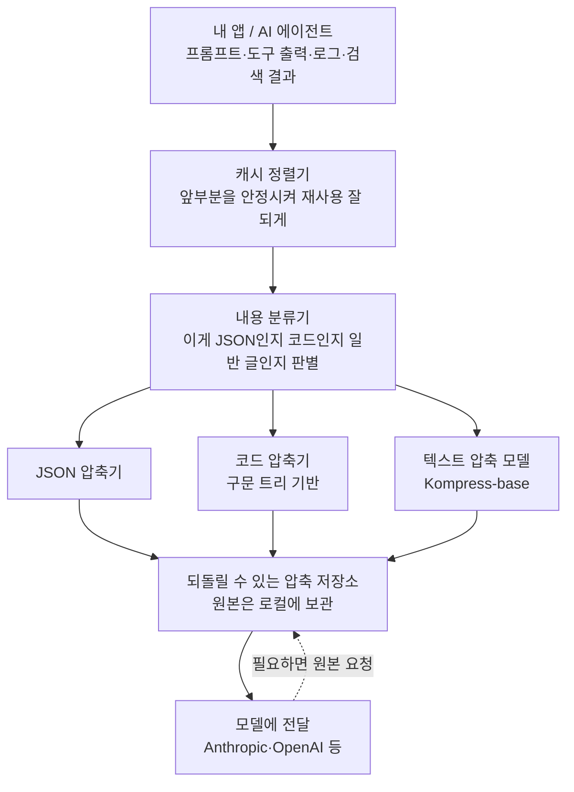

<div class="ai-knowledge-shell">

<aside class="ai-knowledge-sidebar">
  <p class="ai-eyebrow">CATEGORIES</p>
  <nav class="ai-cat-tree"><details class="ai-cat" open><summary><span class="catname">에이전트 오케스트레이션</span><span class="catcount">11</span></summary><ul><li><a href="https://altjs4510.github.io/ai_news_blog/knowledge/20260823/"><span class="kdate">2026-08-23</span><span class="ktitle">The Evolution of the Agent Harness — 하네스가 모델 가중치…</span></a></li><li><a href="https://altjs4510.github.io/ai_news_blog/knowledge/20260821/"><span class="kdate">2026-08-21</span><span class="ktitle">volcengine/OpenViking — 에이전트 메모리·Knowledge RAG·스…</span></a></li><li><a href="https://altjs4510.github.io/ai_news_blog/knowledge/20260805/"><span class="kdate">2026-08-05</span><span class="ktitle">TencentCloud/TencentDB-Agent-Memory — 대화·문서·코드를 …</span></a></li><li><a href="https://altjs4510.github.io/ai_news_blog/knowledge/20260717/"><span class="kdate">2026-07-17</span><span class="ktitle">After a year building agent memory, 'save everyt…</span></a></li><li><a href="https://altjs4510.github.io/ai_news_blog/knowledge/20260708/"><span class="kdate">2026-07-08</span><span class="ktitle">Expanding Managed Agents in Gemini API: backgrou…</span></a></li><li><a href="https://altjs4510.github.io/ai_news_blog/knowledge/20260701/"><span class="kdate">2026-07-01</span><span class="ktitle">Google OKF (Open Knowledge Format) — 벤더 중립 에이전트 …</span></a></li><li><a href="https://altjs4510.github.io/ai_news_blog/knowledge/20260623/"><span class="kdate">2026-06-23</span><span class="ktitle">bytedance/deer-flow — 샌드박스·메모리·서브에이전트·메시지 게이트웨이를…</span></a></li><li><a href="https://altjs4510.github.io/ai_news_blog/knowledge/20260611/"><span class="kdate">2026-06-11</span><span class="ktitle">The evolution of agentic surfaces: building with…</span></a></li><li><a href="https://altjs4510.github.io/ai_news_blog/knowledge/20260602/"><span class="kdate">2026-06-02</span><span class="ktitle">revfactory/harness — 도메인별 에이전트 팀과 스킬을 자동 설계하는 메타…</span></a></li><li><a href="https://altjs4510.github.io/ai_news_blog/knowledge/20260529/"><span class="kdate">2026-05-29</span><span class="ktitle">Introducing dynamic workflows in Claude Code</span></a></li><li><a href="https://altjs4510.github.io/ai_news_blog/knowledge/20260507/"><span class="kdate">2026-05-07</span><span class="ktitle">ruvnet/ruflo — Claude 멀티 에이전트 오케스트레이션 플랫폼</span></a></li></ul></details><details class="ai-cat" open><summary><span class="catname">MCP &amp; 도구 통합</span><span class="catcount">16</span></summary><ul><li><a href="https://altjs4510.github.io/ai_news_blog/knowledge/20260802/"><span class="kdate">2026-08-02</span><span class="ktitle">Stateless MCP has recaptured my interest (and in…</span></a></li><li><a href="https://altjs4510.github.io/ai_news_blog/knowledge/20260801/"><span class="kdate">2026-08-01</span><span class="ktitle">different-ai/openwork — Claude Cowork의 오픈소스 대체 에…</span></a></li><li><a href="https://altjs4510.github.io/ai_news_blog/knowledge/20260731/"><span class="kdate">2026-07-31</span><span class="ktitle">different-ai/openwork — Claude Cowork의 오픈소스 대안(o…</span></a></li><li><a href="https://altjs4510.github.io/ai_news_blog/knowledge/20260729/"><span class="kdate">2026-07-29</span><span class="ktitle">Bringing MCP 2026-07-28 to Claude</span></a></li><li><a href="https://altjs4510.github.io/ai_news_blog/knowledge/20260721/"><span class="kdate">2026-07-21</span><span class="ktitle">tirth8205/code-review-graph — 로컬 우선 코드 인텔리전스 그래프…</span></a></li><li><a href="https://altjs4510.github.io/ai_news_blog/knowledge/20260719/"><span class="kdate">2026-07-19</span><span class="ktitle">tirth8205/code-review-graph — 로컬 우선 코드 인텔리전스 그래프…</span></a></li><li><a href="https://altjs4510.github.io/ai_news_blog/knowledge/20260718/"><span class="kdate">2026-07-18</span><span class="ktitle">tirth8205/code-review-graph — MCP·CLI용 로컬 코드 인텔리…</span></a></li><li><a href="https://altjs4510.github.io/ai_news_blog/knowledge/20260709/"><span class="kdate">2026-07-09</span><span class="ktitle">mvanhorn/last30days-skill — Reddit·X·YouTube·HN·…</span></a></li><li><a href="https://altjs4510.github.io/ai_news_blog/knowledge/20260618/"><span class="kdate">2026-06-18</span><span class="ktitle">DeusData/codebase-memory-mcp — 158개 언어 코드베이스를 밀리…</span></a></li><li><a href="https://altjs4510.github.io/ai_news_blog/knowledge/20260606/"><span class="kdate">2026-06-06</span><span class="ktitle">chopratejas/headroom — Compress tool outputs, lo…</span></a></li><li><a href="https://altjs4510.github.io/ai_news_blog/knowledge/20260605/"><span class="kdate">2026-06-05</span><span class="ktitle">chopratejas/headroom — Compress tool outputs, lo…</span></a></li><li><a href="https://altjs4510.github.io/ai_news_blog/knowledge/20260604/" class="current"><span class="kdate">2026-06-04</span><span class="ktitle">chopratejas/headroom — Compress tool outputs bef…</span></a></li><li><a href="https://altjs4510.github.io/ai_news_blog/knowledge/20260603/"><span class="kdate">2026-06-03</span><span class="ktitle">How Bad MCP design cost your Agent 5× more token…</span></a></li><li><a href="https://altjs4510.github.io/ai_news_blog/knowledge/20260523/"><span class="kdate">2026-05-23</span><span class="ktitle">colbymchenry/codegraph — 사전 인덱싱된 코드 지식 그래프 MCP</span></a></li><li><a href="https://altjs4510.github.io/ai_news_blog/knowledge/20260517/"><span class="kdate">2026-05-17</span><span class="ktitle">I gave my LLM 100,000+ tools — Lazy Discovery &a…</span></a></li><li><a href="https://altjs4510.github.io/ai_news_blog/knowledge/20260509/"><span class="kdate">2026-05-09</span><span class="ktitle">How to connect 100 MCP servers without the conte…</span></a></li></ul></details><details class="ai-cat" open><summary><span class="catname">코딩 에이전트</span><span class="catcount">26</span></summary><ul><li><a href="https://altjs4510.github.io/ai_news_blog/knowledge/20260822/"><span class="kdate">2026-08-22</span><span class="ktitle">mattpocock/skills — Skills for Real Engineers (하…</span></a></li><li><a href="https://altjs4510.github.io/ai_news_blog/knowledge/20260820/"><span class="kdate">2026-08-20</span><span class="ktitle">akitaonrails/ai-memory — 코딩 에이전트 CLI의 장기 메모리와 벤더…</span></a></li><li><a href="https://altjs4510.github.io/ai_news_blog/knowledge/20260819/"><span class="kdate">2026-08-19</span><span class="ktitle">akitaonrails/ai-memory — 코딩 에이전트 CLI 간 장기 기억과 벤더…</span></a></li><li><a href="https://altjs4510.github.io/ai_news_blog/knowledge/20260811/"><span class="kdate">2026-08-11</span><span class="ktitle">PrimeIntellect-ai/prime-agent — 장기 자율 실행을 전제로 설계…</span></a></li><li><a href="https://altjs4510.github.io/ai_news_blog/knowledge/20260810/"><span class="kdate">2026-08-10</span><span class="ktitle">Auto mode is now the default in Claude Code for …</span></a></li><li><a href="https://altjs4510.github.io/ai_news_blog/knowledge/20260809/"><span class="kdate">2026-08-09</span><span class="ktitle">PrimeIntellect-ai/prime-agent — 코딩 워크플로우·장기 자율 작…</span></a></li><li><a href="https://altjs4510.github.io/ai_news_blog/knowledge/20260808/"><span class="kdate">2026-08-08</span><span class="ktitle">PrimeIntellect-ai/prime-agent — 코딩 워크플로우와 장시간 자율…</span></a></li><li><a href="https://altjs4510.github.io/ai_news_blog/knowledge/20260804/"><span class="kdate">2026-08-04</span><span class="ktitle">esengine/DeepSeek-Reasonix — prefix-cache 안정성을 축…</span></a></li><li><a href="https://altjs4510.github.io/ai_news_blog/knowledge/20260728/"><span class="kdate">2026-07-28</span><span class="ktitle">alibaba/open-code-review — 결정론적 파이프라인 + LLM 에이전트…</span></a></li><li><a href="https://altjs4510.github.io/ai_news_blog/knowledge/20260725/"><span class="kdate">2026-07-25</span><span class="ktitle">The new rules of context engineering for Claude …</span></a></li><li><a href="https://altjs4510.github.io/ai_news_blog/knowledge/20260722/"><span class="kdate">2026-07-22</span><span class="ktitle">tirth8205/code-review-graph — MCP·CLI용 로컬 우선 코드 …</span></a></li><li><a href="https://altjs4510.github.io/ai_news_blog/knowledge/20260714/"><span class="kdate">2026-07-14</span><span class="ktitle">Graphify-Labs/graphify — 코드베이스를 질의 가능한 지식 그래프로 만…</span></a></li><li><a href="https://altjs4510.github.io/ai_news_blog/knowledge/20260707/"><span class="kdate">2026-07-07</span><span class="ktitle">AI Hero Skills Catalog — 실무 엔지니어를 위한 재사용 가능한 판단 …</span></a></li><li><a href="https://altjs4510.github.io/ai_news_blog/knowledge/20260705/"><span class="kdate">2026-07-05</span><span class="ktitle">openai/codex-plugin-cc — Claude Code에서 Codex를 위임…</span></a></li><li><a href="https://altjs4510.github.io/ai_news_blog/knowledge/20260626/"><span class="kdate">2026-06-26</span><span class="ktitle">google-labs-code/design.md — 코딩 에이전트에게 디자인 시스템을 …</span></a></li><li><a href="https://altjs4510.github.io/ai_news_blog/knowledge/20260619/"><span class="kdate">2026-06-19</span><span class="ktitle">Claude Code now supports artifacts</span></a></li><li><a href="https://altjs4510.github.io/ai_news_blog/knowledge/20260530/"><span class="kdate">2026-05-30</span><span class="ktitle">Leonxlnx/taste-skill — AI에게 좋은 취향을 부여해 generic s…</span></a></li><li><a href="https://altjs4510.github.io/ai_news_blog/knowledge/20260528/"><span class="kdate">2026-05-28</span><span class="ktitle">Building self-improving tax agents with Codex</span></a></li><li><a href="https://altjs4510.github.io/ai_news_blog/knowledge/20260526/"><span class="kdate">2026-05-26</span><span class="ktitle">colbymchenry/codegraph — Pre-indexed code knowle…</span></a></li><li><a href="https://altjs4510.github.io/ai_news_blog/knowledge/20260524/"><span class="kdate">2026-05-24</span><span class="ktitle">colbymchenry/codegraph — Pre-indexed code knowle…</span></a></li><li><a href="https://altjs4510.github.io/ai_news_blog/knowledge/20260521/"><span class="kdate">2026-05-21</span><span class="ktitle">colbymchenry/codegraph — Pre-indexed code knowle…</span></a></li><li><a href="https://altjs4510.github.io/ai_news_blog/knowledge/20260512/"><span class="kdate">2026-05-12</span><span class="ktitle">agentmemory — Persistent memory for AI coding ag…</span></a></li><li><a href="https://altjs4510.github.io/ai_news_blog/knowledge/20260510/"><span class="kdate">2026-05-10</span><span class="ktitle">addyosmani/agent-skills — Production-grade engin…</span></a></li><li><a href="https://altjs4510.github.io/ai_news_blog/knowledge/20260508/"><span class="kdate">2026-05-08</span><span class="ktitle">addyosmani/agent-skills — Production-grade engin…</span></a></li><li><a href="https://altjs4510.github.io/ai_news_blog/knowledge/20260506/"><span class="kdate">2026-05-06</span><span class="ktitle">mksglu/context-mode — AI 코딩 에이전트용 컨텍스트 윈도우 최적화</span></a></li><li><a href="https://altjs4510.github.io/ai_news_blog/knowledge/20260505/"><span class="kdate">2026-05-05</span><span class="ktitle">mattpocock/skills — Skills for Real Engineers (.…</span></a></li></ul></details><details class="ai-cat" open><summary><span class="catname">모델 &amp; 연구</span><span class="catcount">5</span></summary><ul><li><a href="https://altjs4510.github.io/ai_news_blog/knowledge/20260716-proprag/"><span class="kdate">2026-07-16</span><span class="ktitle">PropRAG — 프로포지션 경로 위 beam search로 멀티홉 검색 안내</span></a></li><li><a href="https://altjs4510.github.io/ai_news_blog/knowledge/20260620/"><span class="kdate">2026-06-20</span><span class="ktitle">zai-org/GLM-5 — From Vibe Coding to Agentic Engi…</span></a></li><li><a href="https://altjs4510.github.io/ai_news_blog/knowledge/20260617/"><span class="kdate">2026-06-17</span><span class="ktitle">Predicting model behavior before release by simu…</span></a></li><li><a href="https://altjs4510.github.io/ai_news_blog/knowledge/20260516/"><span class="kdate">2026-05-16</span><span class="ktitle">STALE — 에이전트가 자기 기억의 유효성을 인지할 수 있는가</span></a></li><li><a href="https://altjs4510.github.io/ai_news_blog/knowledge/20260513/"><span class="kdate">2026-05-13</span><span class="ktitle">Thinking Machines' Native Interaction Models — T…</span></a></li></ul></details><details class="ai-cat" open><summary><span class="catname">인프라 &amp; 컴퓨트</span><span class="catcount">8</span></summary><ul><li><a href="https://altjs4510.github.io/ai_news_blog/knowledge/20260813/"><span class="kdate">2026-08-13</span><span class="ktitle">semantica-agi/semantica — 컨텍스트와 책임 추적을 위한 그래프 네이…</span></a></li><li><a href="https://altjs4510.github.io/ai_news_blog/knowledge/20260812/"><span class="kdate">2026-08-12</span><span class="ktitle">semantica-agi/semantica — 컨텍스트와 '책임 추적 가능한(accou…</span></a></li><li><a href="https://altjs4510.github.io/ai_news_blog/knowledge/20260806/"><span class="kdate">2026-08-06</span><span class="ktitle">cloudflare/computer — 에이전트에게 컴퓨터를 통째로 주는 엣지 실행 샌…</span></a></li><li><a href="https://altjs4510.github.io/ai_news_blog/knowledge/20260724/"><span class="kdate">2026-07-24</span><span class="ktitle">diegosouzapw/OmniRoute — 단일 엔드포인트로 278+ 프로바이더·50…</span></a></li><li><a href="https://altjs4510.github.io/ai_news_blog/knowledge/20260723/"><span class="kdate">2026-07-23</span><span class="ktitle">diegosouzapw/OmniRoute — 268+ 프로바이더를 단일 엔드포인트로 묶…</span></a></li><li><a href="https://altjs4510.github.io/ai_news_blog/knowledge/20260630/"><span class="kdate">2026-06-30</span><span class="ktitle">Introducing the Claude apps gateway for Amazon B…</span></a></li><li><a href="https://altjs4510.github.io/ai_news_blog/knowledge/20260522/"><span class="kdate">2026-05-22</span><span class="ktitle">Giving Agents Computers — Ivan Burazin, Daytona</span></a></li><li><a href="https://altjs4510.github.io/ai_news_blog/knowledge/20260520/"><span class="kdate">2026-05-20</span><span class="ktitle">New in Claude Managed Agents: self-hosted sandbo…</span></a></li></ul></details><details class="ai-cat" open><summary><span class="catname">보안 &amp; 거버넌스</span><span class="catcount">15</span></summary><ul><li><a href="https://altjs4510.github.io/ai_news_blog/knowledge/20260819-mind-viruses/"><span class="kdate">2026-08-19</span><span class="ktitle">탈옥도, 인젝션도 없이 — 대화로만 퍼지는 에이전트의 '마인드 바이러스'</span></a></li><li><a href="https://altjs4510.github.io/ai_news_blog/knowledge/20260730/"><span class="kdate">2026-07-30</span><span class="ktitle">Anatomy of a Frontier Lab Agent Intrusion: A Tec…</span></a></li><li><a href="https://altjs4510.github.io/ai_news_blog/knowledge/20260716/"><span class="kdate">2026-07-16</span><span class="ktitle">Dicklesworthstone/destructive_command_guard — 에이…</span></a></li><li><a href="https://altjs4510.github.io/ai_news_blog/knowledge/20260715/"><span class="kdate">2026-07-15</span><span class="ktitle">Dicklesworthstone/destructive_command_guard — 에이…</span></a></li><li><a href="https://altjs4510.github.io/ai_news_blog/knowledge/20260710/"><span class="kdate">2026-07-10</span><span class="ktitle">70개 MCP 서버 strace 런타임 감사 — 부팅 시 아웃바운드 호출 서버 적발</span></a></li><li><a href="https://altjs4510.github.io/ai_news_blog/knowledge/20260704/"><span class="kdate">2026-07-04</span><span class="ktitle">Cloudflare is about to block AI agents by defaul…</span></a></li><li><a href="https://altjs4510.github.io/ai_news_blog/knowledge/20260703/"><span class="kdate">2026-07-03</span><span class="ktitle">Giving admins more visibility and control over C…</span></a></li><li><a href="https://altjs4510.github.io/ai_news_blog/knowledge/20260625/"><span class="kdate">2026-06-25</span><span class="ktitle">Agent identity in Claude Tag: a new access model…</span></a></li><li><a href="https://altjs4510.github.io/ai_news_blog/knowledge/20260624/"><span class="kdate">2026-06-24</span><span class="ktitle">Agent identity in Claude Tag: a new access model…</span></a></li><li><a href="https://altjs4510.github.io/ai_news_blog/knowledge/20260614/"><span class="kdate">2026-06-14</span><span class="ktitle">NVIDIA/SkillSpector — Security scanner for AI ag…</span></a></li><li><a href="https://altjs4510.github.io/ai_news_blog/knowledge/20260613/"><span class="kdate">2026-06-13</span><span class="ktitle">Fable 5's guardrails got bypassed in 48 hours — …</span></a></li><li><a href="https://altjs4510.github.io/ai_news_blog/knowledge/20260612/"><span class="kdate">2026-06-12</span><span class="ktitle">NVIDIA/SkillSpector — AI 에이전트 스킬용 보안 스캐너</span></a></li><li><a href="https://altjs4510.github.io/ai_news_blog/knowledge/20260607/"><span class="kdate">2026-06-07</span><span class="ktitle">OpenAI Help: Lockdown Mode</span></a></li><li><a href="https://altjs4510.github.io/ai_news_blog/knowledge/20260531/"><span class="kdate">2026-05-31</span><span class="ktitle">How we contain Claude across products</span></a></li><li><a href="https://altjs4510.github.io/ai_news_blog/knowledge/20260527/"><span class="kdate">2026-05-27</span><span class="ktitle">Microsoft Copilot Cowork Exfiltrates Files</span></a></li></ul></details><details class="ai-cat" open><summary><span class="catname">응용 사례</span><span class="catcount">7</span></summary><ul><li><a href="https://altjs4510.github.io/ai_news_blog/knowledge/20260814/"><span class="kdate">2026-08-14</span><span class="ktitle">cathrynlavery/diagram-design — Claude Code용 에디토리…</span></a></li><li><a href="https://altjs4510.github.io/ai_news_blog/knowledge/20260726/"><span class="kdate">2026-07-26</span><span class="ktitle">citrolabs/ego-lite — 로그인된 브라우저 상태를 AI 에이전트와 공유하는…</span></a></li><li><a href="https://altjs4510.github.io/ai_news_blog/knowledge/20260712/"><span class="kdate">2026-07-12</span><span class="ktitle">Do Automated Evals Work?</span></a></li><li><a href="https://altjs4510.github.io/ai_news_blog/knowledge/20260621/"><span class="kdate">2026-06-21</span><span class="ktitle">calesthio/OpenMontage — 12 파이프라인·52 도구·500+ 스킬을 …</span></a></li><li><a href="https://altjs4510.github.io/ai_news_blog/knowledge/20260609/"><span class="kdate">2026-06-09</span><span class="ktitle">Building intelligent apps for Apple platforms wi…</span></a></li><li><a href="https://altjs4510.github.io/ai_news_blog/knowledge/20260515/"><span class="kdate">2026-05-15</span><span class="ktitle">Clawdmeter — Claude Code 사용량을 데스크톱 대시보드로</span></a></li><li><a href="https://altjs4510.github.io/ai_news_blog/knowledge/20260514/"><span class="kdate">2026-05-14</span><span class="ktitle">Introducing Claude for Small Business</span></a></li></ul></details><details class="ai-cat" open><summary><span class="catname">산업 동향</span><span class="catcount">6</span></summary><ul><li><a href="https://altjs4510.github.io/ai_news_blog/knowledge/20260711/"><span class="kdate">2026-07-11</span><span class="ktitle">OpenAI says GPT 5.6 is the 'preferred model' for…</span></a></li><li><a href="https://altjs4510.github.io/ai_news_blog/knowledge/20260702/"><span class="kdate">2026-07-02</span><span class="ktitle">How Cursor deploys AI inside the enterprise (For…</span></a></li><li><a href="https://altjs4510.github.io/ai_news_blog/knowledge/20260616/"><span class="kdate">2026-06-16</span><span class="ktitle">Why AI hasn't replaced software engineers, and w…</span></a></li><li><a href="https://altjs4510.github.io/ai_news_blog/knowledge/20260610/"><span class="kdate">2026-06-10</span><span class="ktitle">Fable 5 just made cost-aware model routing manda…</span></a></li><li><a href="https://altjs4510.github.io/ai_news_blog/knowledge/20260519/"><span class="kdate">2026-05-19</span><span class="ktitle">Anthropic acquires Stainless</span></a></li><li><a href="https://altjs4510.github.io/ai_news_blog/knowledge/20260504/"><span class="kdate">2026-05-04</span><span class="ktitle">Agents for Everything Else: Codex for Knowledge …</span></a></li></ul></details></nav>
</aside>

<article class="ai-knowledge-article">

<header class="ai-post-hero">
  <p class="ai-eyebrow"><a class="ai-back" href="../">KNOWLEDGE</a> · 2026-06-04 · 오늘의 학습</p>
  <h2 class="ai-post-title">chopratejas/headroom — Compress tool outputs before they reach the LLM</h2>
</header>

> 원문: [chopratejas/headroom — Compress tool outputs before they reach the LLM](https://github.com/chopratejas/headroom)

## 📌 학습 정리

### 1. 한 줄로 말하면

AI 비서가 읽어들이는 자료(도구 실행 결과, 로그, 검색 조각 등)를 미리 알맞게 줄여서 건네주는 "중간 정리 담당"이에요. 답은 그대로 나오는데, 읽어야 하는 분량이 60~95% 줄어드는 게 핵심입니다.

### 2. 왜 이게 만들어졌어요?

요즘 AI 코딩 비서나 에이전트(자율적으로 도구를 호출해 일하는 AI)는 명령 한 번에 어마어마한 양의 텍스트를 모델에게 넘깁니다. 파일 내용, 셸 명령 출력, 검색해 온 문서 조각, 이전 대화 기록까지 다 들어가다 보니 모델이 처리해야 할 토큰(token, 모델이 글자를 세는 단위) 수가 금세 폭발해요. 그러면 비용이 올라가고, 응답이 느려지고, 중요한 단서가 긴 텍스트 사이에 묻혀 정확도까지 떨어집니다. 그렇다고 사람이 일일이 잘라 보내자니 번거롭고, 잘못 자르면 원본이 사라져 모델이 다시 참조할 수도 없죠. Headroom은 "원본은 로컬에 그대로 두고, 모델에게는 압축본만 보내되, 필요하면 다시 꺼내볼 수 있게 하자"는 발상에서 출발했습니다.

### 3. 비유로 풀면

이건 마치 회의 들어가기 전에 비서가 두꺼운 보고서를 핵심만 요약해서 건네주는 것과 비슷해요. 임원(모델)은 요약본만 읽어도 결정을 내릴 수 있고, 더 자세히 봐야 할 부분이 생기면 "원본 28쪽 보여줘"라고 요청해 꺼내볼 수 있죠. 또는 짐을 쌀 때 진공 압축팩을 쓰는 것과도 닮았어요. 부피는 줄지만 옷 자체는 그대로라, 입을 때 다시 꺼내면 그만입니다.

그래서 결국 모델은 적은 분량을 읽고도 같은 답을 내놓고, 원본이 필요한 순간에는 도구 호출로 되살려 쓸 수 있다는 얘기예요.

### 4. 어떻게 작동하는지 (그림으로)



들어온 자료가 어떤 종류인지 먼저 분류하고, 종류에 맞는 방법으로 줄입니다. 줄인 결과만 모델에 보내되 원본은 내 컴퓨터에 남겨두고, 모델이 "더 자세히 봐야겠다" 싶을 때 `headroom_retrieve`라는 도구로 원본을 다시 꺼내 쓰는 흐름입니다.

### 5. 처음 보는 용어 풀이

- **토큰 (token)** — 모델이 글자를 세는 단위예요. 영어 단어 하나가 대략 1~2토큰쯤 됩니다. 토큰 수가 비용과 속도, 그리고 모델이 한 번에 읽을 수 있는 한도를 결정해요.
- **에이전트 (agent)** — 사람이 일일이 지시하지 않아도 스스로 도구를 호출하고 결과를 읽어가며 일을 처리하는 AI를 말합니다. Claude Code, Cursor, Aider 같은 코딩 비서가 대표적이에요.
- **도구 출력 (tool output)** — 에이전트가 셸 명령을 돌리거나 API를 호출해서 받아온 결과 텍스트입니다. 보통 양이 많고 잡음도 섞여 있어 토큰을 가장 많이 잡아먹는 부분이에요.
- **검색증강생성 조각 (RAG chunks)** — 모델에게 참고하라고 외부 문서에서 떼어 와 붙여주는 글 토막입니다. 여러 개를 한꺼번에 넣다 보면 금세 길어집니다.
- **모델 컨텍스트 프로토콜 서버 (MCP server)** — 에이전트가 외부 도구를 표준 방식으로 불러 쓸 수 있게 해주는 규격이에요. Headroom은 압축·복원·통계 기능을 이 규격으로 제공해서 다양한 클라이언트에 꽂아 쓸 수 있게 합니다.
- **되돌릴 수 있는 압축 (CCR, reversible compression)** — 줄여 보내되 원본을 버리지 않는 방식이에요. 모델이 필요하다고 판단하면 도구를 호출해 원본을 다시 받아볼 수 있습니다.
- **캐시 정렬기 (CacheAligner)** — 모델 제공자(Anthropic, OpenAI 등)는 같은 앞부분이 반복되면 그 부분을 캐시해서 비용을 깎아주는데, 압축하면 앞부분이 매번 달라져 캐시가 깨지기 쉽습니다. 이걸 안정시켜 캐시 할인이 실제로 적용되게 해주는 장치예요.
- **추상 구문 트리 (AST)** — 소스 코드를 단어 그대로가 아니라 "함수, 변수, 호출 관계" 같은 구조로 본 형태입니다. 코드 압축기가 이 구조를 활용하면 의미를 잃지 않고도 분량을 줄일 수 있어요.

### 6. 한 발 더 들어가고 싶다면

- [전체 저장소(GitHub)](https://github.com/chopratejas/headroom) — 설치, 사용법, 라이선스(Apache 2.0)까지 한눈에 볼 수 있는 출발점이에요.
- [Kompress-base 모델 카드 (HuggingFace)](https://huggingface.co/) — 텍스트 압축에 쓰이는 모델이 어떻게 학습됐는지 확인하고 싶다면 여기예요. (원문에서는 "에이전트 트레이스로 학습했다"고만 소개하고 있어요.)
- `python -m headroom.evals suite --tier 1` — GSM8K, TruthfulQA, SQuAD v2, BFCL 같은 표준 평가에서 정확도가 유지되는지 직접 재현해볼 수 있는 명령입니다. 압축이 답을 망치지 않는다는 걸 눈으로 확인하고 싶을 때 유용해요.
- `/llms.txt` — AI 에이전트가 이 도구를 스스로 이해하라고 만든 색인 파일이에요. 다른 도구를 만들 때 "에이전트 친화적 문서"가 어떤 모습인지 참고할 수 있습니다.

---

## 📖 원문 전체 번역 (정독용)

> 의역 최소화한 전체 번역입니다. 큰 흐름은 위 정리에서 잡고, 정확한 워딩이 필요할 땐 이 섹션에서 정독하세요.

```
██╗  ██╗███████╗ █████╗ ██████╗ ██████╗  ██████╗  ██████╗ ███╗   ███╗
██║  ██║██╔════╝██╔══██╗██╔══██╗██╔══██╗██╔═══██╗██╔═══██╗████╗ ████║
███████║█████╗  ███████║██║  ██║██████╔╝██║   ██║██║   ██║██╔████╔██║
██╔══██║██╔══╝  ██╔══██║██║  ██║██╔══██╗██║   ██║██║   ██║██║╚██╔╝██║
██║  ██║███████╗██║  ██║██████╔╝██║  ██║╚██████╔╝╚██████╔╝██║ ╚═╝ ██║
╚═╝  ╚═╝╚══════╝╚═╝  ╚═╝╚═════╝ ╚═╝  ╚═╝ ╚═════╝  ╚═════╝ ╚═╝     ╚═╝
                  AI 에이전트를 위한 컨텍스트 압축 레이어
```

토큰 60–95% 절감 · 라이브러리 · 프록시 · MCP · 6가지 알고리즘 · 로컬 우선 · 복원 가능

---

Headroom은 AI 에이전트가 읽는 모든 것 — 툴 출력, 로그, RAG 청크, 파일, 대화 기록 — 을 LLM에 전달되기 전에 압축합니다. 동일한 답변, 토큰은 몇 분의 일.

**라이브 예시:** 10,144 → 1,260 토큰 — 동일한 FATAL 오류 발견.

---

## 주요 기능

- **라이브러리** — Python 또는 TypeScript에서 `compress(messages)`를 임의 앱에 인라인으로 사용
- **프록시** — `headroom proxy --port 8787`, 코드 변경 없이, 모든 언어에서 사용 가능
- **에이전트 래핑** — `headroom wrap claude|codex|cursor|aider|copilot` 단 하나의 명령으로
- **MCP 서버** — 모든 MCP 클라이언트를 위한 `headroom_compress`, `headroom_retrieve`, `headroom_stats`
- **크로스 에이전트 메모리** — Claude, Codex, Gemini 간 공유 저장소, 자동 중복 제거
- **headroom learn** — 실패한 세션을 분석해 교정 내용을 `CLAUDE.md` / `AGENTS.md`에 기록
- **복원 가능 (CCR)** — 원본은 삭제되지 않음; LLM이 필요 시 직접 검색

---

## 작동 방식 (30초 요약)

```
에이전트 / 앱
   (Claude Code, Cursor, Codex, LangChain, Agno, Strands, 직접 작성한 코드…)
        │   프롬프트 · 툴 출력 · 로그 · RAG 결과 · 파일
        ▼
    ┌────────────────────────────────────────────────────┐
    │  Headroom   (로컬에서 실행 — 데이터가 여기 머뭄)   │
    │  ────────────────────────────────────────────────  │
    │  CacheAligner  →  ContentRouter  →  CCR            │
    │                    ├─ SmartCrusher   (JSON)        │
    │                    ├─ CodeCompressor (AST)         │
    │                    └─ Kompress-base  (텍스트, HF)  │
    │                                                    │
    │  크로스 에이전트 메모리  ·  headroom learn  ·  MCP │
    └────────────────────────────────────────────────────┘
        │   압축된 프롬프트  +  검색 툴
        ▼
 LLM 제공자  (Anthropic · OpenAI · Bedrock · …)
```

- **ContentRouter** — 콘텐츠 유형을 감지하고 적합한 압축기를 선택
- **SmartCrusher / CodeCompressor / Kompress-base** — JSON, AST, 또는 산문 압축
- **CacheAligner** — 프리픽스를 안정화해 제공자 KV 캐시가 실제로 적중하도록 함
- **CCR** — 원본을 로컬에 저장; LLM이 필요 시 `headroom_retrieve`를 호출

→ 아키텍처 · CCR 복원 가능 압축 · Kompress-base 모델 카드

---

## 시작하기 (60초)

### 1단계 — 설치

```bash
pip install "headroom-ai[all]"   # Python
npm install headroom-ai           # Node / TypeScript
```

### 2단계 — 모드 선택

```bash
headroom wrap claude              # 코딩 에이전트 래핑
headroom proxy --port 8787        # 드롭인 프록시, 코드 변경 없음
# 또는: from headroom import compress      # 인라인 라이브러리
```

### 3단계 — 절감 확인

```bash
headroom perf
```

세부 선택 설치: `[proxy]`, `[mcp]`, `[ml]`, `[agno]`, `[langchain]`, `[evals]`. Python 3.10+ 필요.

---

## 성능 증명

### 실제 에이전트 워크로드에서의 절감

| 워크로드 | 압축 전 | 압축 후 | 절감률 |
|---|---|---|---|
| 코드 검색 (결과 100개) | 17,765 | 1,408 | 92% |
| SRE 인시던트 디버깅 | 65,694 | 5,118 | 92% |
| GitHub 이슈 분류 | 54,174 | 14,761 | 73% |
| 코드베이스 탐색 | 78,502 | 41,254 | 47% |

### 표준 벤치마크에서의 정확도 보존

| 벤치마크 | 분류 | N | 기준선 | Headroom | 차이 |
|---|---|---|---|---|---|
| GSM8K | 수학 | 100 | 0.870 | 0.870 | ±0.000 |
| TruthfulQA | 사실 | 100 | 0.530 | 0.560 | +0.030 |
| SQuAD v2 | QA | 100 | — | 97% | 19% 압축 |
| BFCL | 툴 | 100 | — | 97% | 32% 압축 |

재현: `python -m headroom.evals suite --tier 1` · 전체 벤치마크 및 방법론

---

## 에이전트 호환성 매트릭스

| 에이전트 | headroom wrap | 비고 |
|---|---|---|
| Claude Code | ● | `--memory` · `--code-graph` |
| Codex | ● | Claude와 메모리 공유 |
| Cursor | ● | 설정 출력 — 한 번만 붙여넣기 |
| Aider | ● | 프록시 시작 + 실행 |
| Copilot CLI | ● | 프록시 시작 + 실행 |
| OpenClaw | ● | ContextEngine 플러그인으로 설치 |

OpenAI 호환 클라이언트는 `headroom proxy`를 통해 모두 작동합니다. MCP 네이티브: `headroom mcp install`.

---

## 사용 권장 · 비권장 상황

**적합한 경우:**
- AI 코딩 에이전트를 매일 사용하며 코드 변경 없이 절감을 원할 때
- 여러 에이전트를 사용하며 공유 메모리를 원할 때
- 복원 가능한 압축이 필요할 때 — CCR을 통해 원본을 언제든지 검색 가능

**건너뛰어도 되는 경우:**
- 단일 제공자의 네이티브 압축만 사용하고 크로스 에이전트 메모리가 필요 없을 때
- 로컬 프로세스를 실행할 수 없는 샌드박스 환경에서 작업할 때

---

## 통합 — 모든 스택에 Headroom 적용하기

| 환경 | 통합 방법 |
|---|---|
| 임의 Python 앱 | `compress(messages, model=…)` |
| 임의 TypeScript 앱 | `await compress(messages, { model })` |
| Anthropic / OpenAI SDK | `withHeadroom(new Anthropic())` · `withHeadroom(new OpenAI())` |
| Vercel AI SDK | `wrapLanguageModel({ model, middleware: headroomMiddleware() })` |
| LiteLLM | `litellm.callbacks = [HeadroomCallback()]` |
| LangChain | `HeadroomChatModel(your_llm)` |
| Agno | `HeadroomAgnoModel(your_model)` |
| Strands | Strands 가이드 참조 |
| ASGI 앱 | `app.add_middleware(CompressionMiddleware)` |
| 멀티 에이전트 | `SharedContext().put / .get` |
| MCP 클라이언트 | `headroom mcp install` |

---

## 내부 구성 요소

- **SmartCrusher** — 범용 JSON: 딕셔너리 배열, 중첩 객체, 혼합 타입.
- **CodeCompressor** — Python, JS, Go, Rust, Java, C++에 대한 AST 인식 압축.
- **Kompress-base** — HuggingFace에 공개된 우리 모델, 에이전트 트레이스로 학습됨.
- **이미지 압축** — 학습된 ML 라우터를 통해 40–90% 절감.
- **CacheAligner** — 프리픽스를 안정화해 Anthropic/OpenAI KV 캐시가 실제로 적중하도록 함.
- **IntelligentContext** — 학습된 중요도 기반 점수로 컨텍스트를 적합하게 조정.
- **CCR** — 복원 가능 압축; LLM이 필요 시 원본을 직접 검색.
- **크로스 에이전트 메모리** — 공유 저장소, 에이전트 출처 추적, 자동 중복 제거.
- **SharedContext** — 멀티 에이전트 워크플로우 간 압축된 컨텍스트 전달.
- **headroom learn** — Claude, Codex, Gemini를 위한 플러그인 기반 실패 분석.

---

## 파이프라인 내부 구조

Headroom은 `compress()`, SDK, 프록시 전반에 걸쳐 하나의 안정적인 요청 생명주기를 제공합니다:

```
Setup → Pre-Start → Post-Start → Input Received → Input Cached → Input Routed
→ Input Compressed → Input Remembered → Pre-Send → Post-Send → Response Received
```

**Transform**이 실제 작업을 수행합니다: CacheAligner, ContentRouter, SmartCrusher, CodeCompressor, Kompress-base, IntelligentContext / RollingWindow.

- **파이프라인 확장(Pipeline extensions)** — `on_pipeline_event(...)`를 통해 생명주기 단계를 관찰하거나 커스터마이징.
- **압축 훅(Compression hooks)** — 정규 생명주기와 나란히 추가적인 확장 이음새로 작동.
- **프록시 확장(Proxy extensions)** — ASGI 미들웨어, 라우트, 시작 정책을 위한 서버/앱 통합 이음새.

제공자 및 툴별 동작은 `headroom/providers/` 하위에 있어 핵심 오케스트레이션이 생명주기, 순서 지정, 정책에 집중할 수 있습니다.

- **CLI/툴 슬라이스**: `headroom/providers/claude`, `copilot`, `codex`, `openclaw`
- **제공자 런타임 슬라이스**: `headroom/providers/claude`, `gemini`, 그리고 `headroom/providers/registry.py`의 공유 백엔드/런타임 디스패치
- **핵심 파일은 오케스트레이션 우선**: `wrap.py`, `client.py`, `cli/proxy.py`, `proxy/server.py`는 제공자별 환경 구성, API 타겟 정규화, 백엔드 선택, 전송 디스패치를 위임함.

---

## 설치

```bash
pip install "headroom-ai[all]"                          # Python, 전체
npm install headroom-ai                                  # TypeScript / Node
docker pull ghcr.io/chopratejas/headroom:latest
```

세부 선택 설치: `[proxy]`, `[mcp]`, `[ml]` (Kompress-base), `[agno]`, `[langchain]`, `[evals]`. Python 3.10+ 필요.

`pipx` 사용 시? 지원되는 인터프리터를 명시적으로 지정하세요:

```bash
pipx install --python python3.13 "headroom-ai[all]"
```

→ 설치 가이드 — Docker 태그, 영구 서비스, PowerShell, 데브컨테이너.

---

## headroom learn

`headroom learn` — 실패한 세션을 분석해 교정 내용을 `CLAUDE.md` / `AGENTS.md` / `GEMINI.md`에 기록합니다.

---

## 문서

| 시작 | 심화 |
|---|---|
| 빠른 시작 | 아키텍처 |
| 프록시 | 압축 작동 방식 |
| MCP 툴 | CCR — 복원 가능 압축 |
| 메모리 | 캐시 최적화 |
| 실패 학습 | 벤치마크 |
| 설정 | 제한 사항 |

---

## 타 도구와 비교

Headroom은 **로컬**에서 실행되고, **모든** 콘텐츠 유형을 커버하며, 모든 주요 프레임워크와 호환되고, **복원 가능**합니다.

| | 범위 | 배포 | 로컬 | 복원 가능 |
|---|---|---|---|---|
| **Headroom** | 모든 컨텍스트 — 툴, RAG, 로그, 파일, 기록 | 프록시 · 라이브러리 · 미들웨어 · MCP | 예 | 예 |
| **RTK** | CLI 명령 출력 | CLI 래퍼 | 예 | 아니오 |
| **lean-ctx** | CLI 명령, MCP 툴, 에디터 규칙 | CLI 래퍼 · MCP | 예 | 아니오 |
| **Compresr, Token Co.** | 해당 API로 전송되는 텍스트 | 호스팅 API 호출 | 아니오 | 아니오 |
| **OpenAI Compaction** | 대화 기록 | 제공자 네이티브 | 아니오 | 아니오 |

**귀속(Attribution).** Headroom은 셸 출력 재작성을 위해 우수한 RTK 바이너리를 함께 제공합니다 — `git show --short`, 범위 지정 `ls`, 요약된 인스톨러. RTK 팀에 큰 감사를 전합니다; 그들의 툴은 우리 스택의 일급 구성원이며, Headroom은 그 하위의 모든 것을 압축합니다. Headroom은 선택된 CLI 컨텍스트 툴로 `lean-ctx`도 사용할 수 있습니다; `headroom wrap ...` 실행 전 `HEADROOM_CONTEXT_TOOL=lean-ctx`를 설정하세요.

---

## 기여하기

```bash
git clone https://github.com/chopratejas/headroom.git && cd headroom
pip install -e ".[dev]" && pytest
```

데브컨테이너는 `.devcontainer/` 에 있습니다 (기본 + Qdrant & Neo4j가 포함된 `memory-stack`). `CONTRIBUTING.md` 참조.

---

## 커뮤니티

- **Discord** — 질문, 피드백, 실전 경험 공유.
- **HuggingFace의 Kompress-base** — 텍스트 압축 기반 모델.

---

## 라이선스

Apache 2.0 — `LICENSE` 파일 참조.

</article>

</div>

<!-- ai-related-links -->
<aside class="ai-related-links">
  <p class="ai-eyebrow">관련 학습</p>
  <ul><li><a href="https://altjs4510.github.io/ai_news_blog/knowledge/20260509/"><span class="kdate">2026-05-09</span><span class="ktitle">How to connect 100 MCP servers without the conte…</span></a></li><li><a href="https://altjs4510.github.io/ai_news_blog/knowledge/20260603/"><span class="kdate">2026-06-03</span><span class="ktitle">How Bad MCP design cost your Agent 5× more token…</span></a></li><li><a href="https://altjs4510.github.io/ai_news_blog/knowledge/20260506/"><span class="kdate">2026-05-06</span><span class="ktitle">mksglu/context-mode — AI 코딩 에이전트용 컨텍스트 윈도우 최적화</span></a></li></ul>
</aside>
<!-- /ai-related-links -->
