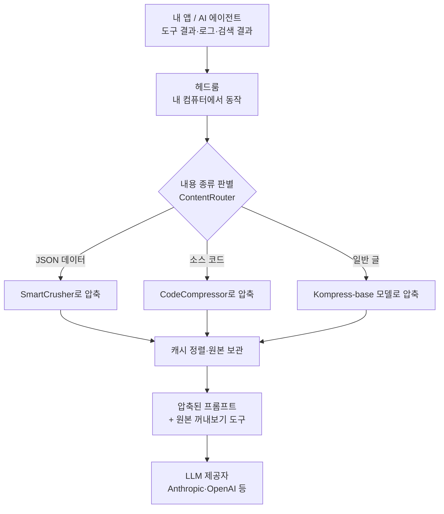

<div class="ai-knowledge-shell">

<aside class="ai-knowledge-sidebar">
  <p class="ai-eyebrow">CATEGORIES</p>
  <nav class="ai-cat-tree"><details class="ai-cat" open><summary><span class="catname">에이전트 오케스트레이션</span><span class="catcount">5</span></summary><ul><li><a href="https://altjs4510.github.io/ai_news_blog/knowledge/20260623/"><span class="kdate">2026-06-23</span><span class="ktitle">bytedance/deer-flow — 샌드박스·메모리·서브에이전트·메시지 게이트웨이를…</span></a></li><li><a href="https://altjs4510.github.io/ai_news_blog/knowledge/20260611/"><span class="kdate">2026-06-11</span><span class="ktitle">The evolution of agentic surfaces: building with…</span></a></li><li><a href="https://altjs4510.github.io/ai_news_blog/knowledge/20260602/"><span class="kdate">2026-06-02</span><span class="ktitle">revfactory/harness — 도메인별 에이전트 팀과 스킬을 자동 설계하는 메타…</span></a></li><li><a href="https://altjs4510.github.io/ai_news_blog/knowledge/20260529/"><span class="kdate">2026-05-29</span><span class="ktitle">Introducing dynamic workflows in Claude Code</span></a></li><li><a href="https://altjs4510.github.io/ai_news_blog/knowledge/20260507/"><span class="kdate">2026-05-07</span><span class="ktitle">ruvnet/ruflo — Claude 멀티 에이전트 오케스트레이션 플랫폼</span></a></li></ul></details><details class="ai-cat" open><summary><span class="catname">MCP &amp; 도구 통합</span><span class="catcount">15</span></summary><ul><li><a href="https://altjs4510.github.io/ai_news_blog/knowledge/20260723/"><span class="kdate">2026-07-23</span><span class="ktitle">diegosouzapw/OmniRoute — 268+ 프로바이더를 단일 엔드포인트로 묶…</span></a></li><li><a href="https://altjs4510.github.io/ai_news_blog/knowledge/20260721/"><span class="kdate">2026-07-21</span><span class="ktitle">tirth8205/code-review-graph — 로컬 우선 코드 인텔리전스 그래프…</span></a></li><li><a href="https://altjs4510.github.io/ai_news_blog/knowledge/20260719/"><span class="kdate">2026-07-19</span><span class="ktitle">tirth8205/code-review-graph — 로컬 우선 코드 인텔리전스 그래프…</span></a></li><li><a href="https://altjs4510.github.io/ai_news_blog/knowledge/20260718/"><span class="kdate">2026-07-18</span><span class="ktitle">tirth8205/code-review-graph — MCP·CLI용 로컬 코드 인텔리…</span></a></li><li><a href="https://altjs4510.github.io/ai_news_blog/knowledge/20260709/"><span class="kdate">2026-07-09</span><span class="ktitle">mvanhorn/last30days-skill — Reddit·X·YouTube·HN·…</span></a></li><li><a href="https://altjs4510.github.io/ai_news_blog/knowledge/20260708/"><span class="kdate">2026-07-08</span><span class="ktitle">Expanding Managed Agents in Gemini API: backgrou…</span></a></li><li><a href="https://altjs4510.github.io/ai_news_blog/knowledge/20260701/"><span class="kdate">2026-07-01</span><span class="ktitle">Google OKF (Open Knowledge Format) — 벤더 중립 에이전트 …</span></a></li><li><a href="https://altjs4510.github.io/ai_news_blog/knowledge/20260618/"><span class="kdate">2026-06-18</span><span class="ktitle">DeusData/codebase-memory-mcp — 158개 언어 코드베이스를 밀리…</span></a></li><li><a href="https://altjs4510.github.io/ai_news_blog/knowledge/20260606/"><span class="kdate">2026-06-06</span><span class="ktitle">chopratejas/headroom — Compress tool outputs, lo…</span></a></li><li><a href="https://altjs4510.github.io/ai_news_blog/knowledge/20260605/" class="current"><span class="kdate">2026-06-05</span><span class="ktitle">chopratejas/headroom — Compress tool outputs, lo…</span></a></li><li><a href="https://altjs4510.github.io/ai_news_blog/knowledge/20260604/"><span class="kdate">2026-06-04</span><span class="ktitle">chopratejas/headroom — Compress tool outputs bef…</span></a></li><li><a href="https://altjs4510.github.io/ai_news_blog/knowledge/20260603/"><span class="kdate">2026-06-03</span><span class="ktitle">How Bad MCP design cost your Agent 5× more token…</span></a></li><li><a href="https://altjs4510.github.io/ai_news_blog/knowledge/20260523/"><span class="kdate">2026-05-23</span><span class="ktitle">colbymchenry/codegraph — 사전 인덱싱된 코드 지식 그래프 MCP</span></a></li><li><a href="https://altjs4510.github.io/ai_news_blog/knowledge/20260517/"><span class="kdate">2026-05-17</span><span class="ktitle">I gave my LLM 100,000+ tools — Lazy Discovery &a…</span></a></li><li><a href="https://altjs4510.github.io/ai_news_blog/knowledge/20260509/"><span class="kdate">2026-05-09</span><span class="ktitle">How to connect 100 MCP servers without the conte…</span></a></li></ul></details><details class="ai-cat" open><summary><span class="catname">코딩 에이전트</span><span class="catcount">16</span></summary><ul><li><a href="https://altjs4510.github.io/ai_news_blog/knowledge/20260722/"><span class="kdate">2026-07-22</span><span class="ktitle">tirth8205/code-review-graph — MCP·CLI용 로컬 우선 코드 …</span></a></li><li><a href="https://altjs4510.github.io/ai_news_blog/knowledge/20260714/"><span class="kdate">2026-07-14</span><span class="ktitle">Graphify-Labs/graphify — 코드베이스를 질의 가능한 지식 그래프로 만…</span></a></li><li><a href="https://altjs4510.github.io/ai_news_blog/knowledge/20260707/"><span class="kdate">2026-07-07</span><span class="ktitle">AI Hero Skills Catalog — 실무 엔지니어를 위한 재사용 가능한 판단 …</span></a></li><li><a href="https://altjs4510.github.io/ai_news_blog/knowledge/20260705/"><span class="kdate">2026-07-05</span><span class="ktitle">openai/codex-plugin-cc — Claude Code에서 Codex를 위임…</span></a></li><li><a href="https://altjs4510.github.io/ai_news_blog/knowledge/20260626/"><span class="kdate">2026-06-26</span><span class="ktitle">google-labs-code/design.md — 코딩 에이전트에게 디자인 시스템을 …</span></a></li><li><a href="https://altjs4510.github.io/ai_news_blog/knowledge/20260619/"><span class="kdate">2026-06-19</span><span class="ktitle">Claude Code now supports artifacts</span></a></li><li><a href="https://altjs4510.github.io/ai_news_blog/knowledge/20260530/"><span class="kdate">2026-05-30</span><span class="ktitle">Leonxlnx/taste-skill — AI에게 좋은 취향을 부여해 generic s…</span></a></li><li><a href="https://altjs4510.github.io/ai_news_blog/knowledge/20260528/"><span class="kdate">2026-05-28</span><span class="ktitle">Building self-improving tax agents with Codex</span></a></li><li><a href="https://altjs4510.github.io/ai_news_blog/knowledge/20260526/"><span class="kdate">2026-05-26</span><span class="ktitle">colbymchenry/codegraph — Pre-indexed code knowle…</span></a></li><li><a href="https://altjs4510.github.io/ai_news_blog/knowledge/20260524/"><span class="kdate">2026-05-24</span><span class="ktitle">colbymchenry/codegraph — Pre-indexed code knowle…</span></a></li><li><a href="https://altjs4510.github.io/ai_news_blog/knowledge/20260521/"><span class="kdate">2026-05-21</span><span class="ktitle">colbymchenry/codegraph — Pre-indexed code knowle…</span></a></li><li><a href="https://altjs4510.github.io/ai_news_blog/knowledge/20260512/"><span class="kdate">2026-05-12</span><span class="ktitle">agentmemory — Persistent memory for AI coding ag…</span></a></li><li><a href="https://altjs4510.github.io/ai_news_blog/knowledge/20260510/"><span class="kdate">2026-05-10</span><span class="ktitle">addyosmani/agent-skills — Production-grade engin…</span></a></li><li><a href="https://altjs4510.github.io/ai_news_blog/knowledge/20260508/"><span class="kdate">2026-05-08</span><span class="ktitle">addyosmani/agent-skills — Production-grade engin…</span></a></li><li><a href="https://altjs4510.github.io/ai_news_blog/knowledge/20260506/"><span class="kdate">2026-05-06</span><span class="ktitle">mksglu/context-mode — AI 코딩 에이전트용 컨텍스트 윈도우 최적화</span></a></li><li><a href="https://altjs4510.github.io/ai_news_blog/knowledge/20260505/"><span class="kdate">2026-05-05</span><span class="ktitle">mattpocock/skills — Skills for Real Engineers (.…</span></a></li></ul></details><details class="ai-cat" open><summary><span class="catname">모델 &amp; 연구</span><span class="catcount">5</span></summary><ul><li><a href="https://altjs4510.github.io/ai_news_blog/knowledge/20260716-proprag/"><span class="kdate">2026-07-16</span><span class="ktitle">PropRAG — 프로포지션 경로 위 beam search로 멀티홉 검색 안내</span></a></li><li><a href="https://altjs4510.github.io/ai_news_blog/knowledge/20260620/"><span class="kdate">2026-06-20</span><span class="ktitle">zai-org/GLM-5 — From Vibe Coding to Agentic Engi…</span></a></li><li><a href="https://altjs4510.github.io/ai_news_blog/knowledge/20260617/"><span class="kdate">2026-06-17</span><span class="ktitle">Predicting model behavior before release by simu…</span></a></li><li><a href="https://altjs4510.github.io/ai_news_blog/knowledge/20260516/"><span class="kdate">2026-05-16</span><span class="ktitle">STALE — 에이전트가 자기 기억의 유효성을 인지할 수 있는가</span></a></li><li><a href="https://altjs4510.github.io/ai_news_blog/knowledge/20260513/"><span class="kdate">2026-05-13</span><span class="ktitle">Thinking Machines' Native Interaction Models — T…</span></a></li></ul></details><details class="ai-cat" open><summary><span class="catname">인프라 &amp; 컴퓨트</span><span class="catcount">3</span></summary><ul><li><a href="https://altjs4510.github.io/ai_news_blog/knowledge/20260630/"><span class="kdate">2026-06-30</span><span class="ktitle">Introducing the Claude apps gateway for Amazon B…</span></a></li><li><a href="https://altjs4510.github.io/ai_news_blog/knowledge/20260522/"><span class="kdate">2026-05-22</span><span class="ktitle">Giving Agents Computers — Ivan Burazin, Daytona</span></a></li><li><a href="https://altjs4510.github.io/ai_news_blog/knowledge/20260520/"><span class="kdate">2026-05-20</span><span class="ktitle">New in Claude Managed Agents: self-hosted sandbo…</span></a></li></ul></details><details class="ai-cat" open><summary><span class="catname">보안 &amp; 거버넌스</span><span class="catcount">13</span></summary><ul><li><a href="https://altjs4510.github.io/ai_news_blog/knowledge/20260716/"><span class="kdate">2026-07-16</span><span class="ktitle">Dicklesworthstone/destructive_command_guard — 에이…</span></a></li><li><a href="https://altjs4510.github.io/ai_news_blog/knowledge/20260715/"><span class="kdate">2026-07-15</span><span class="ktitle">Dicklesworthstone/destructive_command_guard — 에이…</span></a></li><li><a href="https://altjs4510.github.io/ai_news_blog/knowledge/20260710/"><span class="kdate">2026-07-10</span><span class="ktitle">70개 MCP 서버 strace 런타임 감사 — 부팅 시 아웃바운드 호출 서버 적발</span></a></li><li><a href="https://altjs4510.github.io/ai_news_blog/knowledge/20260704/"><span class="kdate">2026-07-04</span><span class="ktitle">Cloudflare is about to block AI agents by defaul…</span></a></li><li><a href="https://altjs4510.github.io/ai_news_blog/knowledge/20260703/"><span class="kdate">2026-07-03</span><span class="ktitle">Giving admins more visibility and control over C…</span></a></li><li><a href="https://altjs4510.github.io/ai_news_blog/knowledge/20260625/"><span class="kdate">2026-06-25</span><span class="ktitle">Agent identity in Claude Tag: a new access model…</span></a></li><li><a href="https://altjs4510.github.io/ai_news_blog/knowledge/20260624/"><span class="kdate">2026-06-24</span><span class="ktitle">Agent identity in Claude Tag: a new access model…</span></a></li><li><a href="https://altjs4510.github.io/ai_news_blog/knowledge/20260614/"><span class="kdate">2026-06-14</span><span class="ktitle">NVIDIA/SkillSpector — Security scanner for AI ag…</span></a></li><li><a href="https://altjs4510.github.io/ai_news_blog/knowledge/20260613/"><span class="kdate">2026-06-13</span><span class="ktitle">Fable 5's guardrails got bypassed in 48 hours — …</span></a></li><li><a href="https://altjs4510.github.io/ai_news_blog/knowledge/20260612/"><span class="kdate">2026-06-12</span><span class="ktitle">NVIDIA/SkillSpector — AI 에이전트 스킬용 보안 스캐너</span></a></li><li><a href="https://altjs4510.github.io/ai_news_blog/knowledge/20260607/"><span class="kdate">2026-06-07</span><span class="ktitle">OpenAI Help: Lockdown Mode</span></a></li><li><a href="https://altjs4510.github.io/ai_news_blog/knowledge/20260531/"><span class="kdate">2026-05-31</span><span class="ktitle">How we contain Claude across products</span></a></li><li><a href="https://altjs4510.github.io/ai_news_blog/knowledge/20260527/"><span class="kdate">2026-05-27</span><span class="ktitle">Microsoft Copilot Cowork Exfiltrates Files</span></a></li></ul></details><details class="ai-cat" open><summary><span class="catname">응용 사례</span><span class="catcount">5</span></summary><ul><li><a href="https://altjs4510.github.io/ai_news_blog/knowledge/20260717/"><span class="kdate">2026-07-17</span><span class="ktitle">After a year building agent memory, 'save everyt…</span></a></li><li><a href="https://altjs4510.github.io/ai_news_blog/knowledge/20260621/"><span class="kdate">2026-06-21</span><span class="ktitle">calesthio/OpenMontage — 12 파이프라인·52 도구·500+ 스킬을 …</span></a></li><li><a href="https://altjs4510.github.io/ai_news_blog/knowledge/20260609/"><span class="kdate">2026-06-09</span><span class="ktitle">Building intelligent apps for Apple platforms wi…</span></a></li><li><a href="https://altjs4510.github.io/ai_news_blog/knowledge/20260515/"><span class="kdate">2026-05-15</span><span class="ktitle">Clawdmeter — Claude Code 사용량을 데스크톱 대시보드로</span></a></li><li><a href="https://altjs4510.github.io/ai_news_blog/knowledge/20260514/"><span class="kdate">2026-05-14</span><span class="ktitle">Introducing Claude for Small Business</span></a></li></ul></details><details class="ai-cat" open><summary><span class="catname">산업 동향</span><span class="catcount">7</span></summary><ul><li><a href="https://altjs4510.github.io/ai_news_blog/knowledge/20260712/"><span class="kdate">2026-07-12</span><span class="ktitle">Do Automated Evals Work?</span></a></li><li><a href="https://altjs4510.github.io/ai_news_blog/knowledge/20260711/"><span class="kdate">2026-07-11</span><span class="ktitle">OpenAI says GPT 5.6 is the 'preferred model' for…</span></a></li><li><a href="https://altjs4510.github.io/ai_news_blog/knowledge/20260702/"><span class="kdate">2026-07-02</span><span class="ktitle">How Cursor deploys AI inside the enterprise (For…</span></a></li><li><a href="https://altjs4510.github.io/ai_news_blog/knowledge/20260616/"><span class="kdate">2026-06-16</span><span class="ktitle">Why AI hasn't replaced software engineers, and w…</span></a></li><li><a href="https://altjs4510.github.io/ai_news_blog/knowledge/20260610/"><span class="kdate">2026-06-10</span><span class="ktitle">Fable 5 just made cost-aware model routing manda…</span></a></li><li><a href="https://altjs4510.github.io/ai_news_blog/knowledge/20260519/"><span class="kdate">2026-05-19</span><span class="ktitle">Anthropic acquires Stainless</span></a></li><li><a href="https://altjs4510.github.io/ai_news_blog/knowledge/20260504/"><span class="kdate">2026-05-04</span><span class="ktitle">Agents for Everything Else: Codex for Knowledge …</span></a></li></ul></details></nav>
</aside>

<article class="ai-knowledge-article">

<header class="ai-post-hero">
  <p class="ai-eyebrow"><a class="ai-back" href="../">KNOWLEDGE</a> · 2026-06-05 · 오늘의 학습</p>
  <h2 class="ai-post-title">chopratejas/headroom — Compress tool outputs, logs, and RAG chunks before they reach the LLM</h2>
</header>

> 원문: [chopratejas/headroom — Compress tool outputs, logs, and RAG chunks before they reach the LLM](https://github.com/chopratejas/headroom)

## 📌 학습 정리

### 1. 한 줄로 말하면

AI 비서가 읽어야 할 길고 장황한 자료를 미리 알아서 줄여주는 "중간 정리 담당자"예요. 답은 똑같이 나오는데, 읽는 양만 확 줄여주는 게 핵심입니다.

### 2. 왜 이게 만들어졌어요?

요즘 AI 에이전트는 도구를 호출해서 결과를 받고, 로그를 읽고, 검색 결과를 참고하면서 일을 합니다. 그런데 이 과정에서 모델이 받아 삼키는 텍스트 양이 어마어마해져요. 코드 검색 한 번에 17,000 토큰, 장애 디버깅 한 번에 65,000 토큰이 그냥 쌓이는 식입니다. 토큰이 많아지면 비용도 늘고, 모델이 중요한 정보를 놓치기 쉬워지고, 응답도 느려집니다. 헤드룸(Headroom)은 이 자료들이 모델에 도달하기 *전에* 끼어들어서 60~95% 줄이고, 필요하면 원본을 다시 꺼내볼 수 있게 해주는 도구로 만들어졌어요.

### 3. 비유로 풀면

이건 마치 회의 들어가기 전에 두꺼운 자료를 핵심만 추려 한 장으로 요약해주는 비서 같은 거예요. 다만 원본 서류는 책상 서랍에 그대로 두고, 회의 중에 "이 부분 원본 좀 볼게요"라고 하면 바로 꺼내줍니다. 그래서 결국, 평소엔 가벼운 요약으로 빠르게 일하다가 정말 필요할 때만 원본을 꺼내보는 구조가 되는 거죠.

### 4. 어떻게 작동하는지 (그림으로)



흐름을 풀어 말하면, 에이전트가 LLM에 보내려던 자료를 헤드룸이 가로채서 종류별로 다른 압축기를 골라 줄입니다. 원본은 내 컴퓨터에 그대로 보관되고, 모델이 압축 결과만 보고 답하다가 필요해지면 `headroom_retrieve`라는 도구로 원본을 꺼내볼 수 있어요. 외부 서버로 데이터가 나가지 않는다는 점이 강조되어 있습니다.

### 5. 처음 보는 용어 풀이

- **토큰 (token)** — LLM이 글을 잘게 쪼개서 세는 단위예요. 토큰이 많을수록 비용이 늘고 응답이 느려지기 때문에, 같은 내용을 더 적은 토큰으로 표현하는 게 곧 절약입니다.
- **도구 출력 (tool output)** — AI 에이전트가 외부 명령이나 API를 실행해서 받은 결과예요. 검색 결과, 명령어 실행 로그, 파일 내용 같은 것들이 여기에 해당하고, 보통 길고 잡음이 많아서 압축 효과가 큽니다.
- **검색 보강 청크 (RAG chunk)** — 외부 문서에서 질문과 관련 있는 부분만 잘라 모델에 넣어주는 조각이에요. RAG는 "검색해서 보강한 생성"이라는 뜻인데, 이 조각들이 쌓이면 컨텍스트가 금방 가득 차서 줄여줄 필요가 생깁니다.
- **프록시 (proxy)** — 내 앱과 LLM 사이에 끼어드는 중간 서버예요. 코드를 한 줄도 안 고치고도 모든 요청이 헤드룸을 거쳐 가게 만들 수 있어서, 어떤 언어로 짠 앱이든 붙일 수 있습니다.
- **MCP 서버 (Model Context Protocol server)** — AI 에이전트가 외부 도구를 가져다 쓸 수 있게 표준화한 약속이에요. 헤드룸을 MCP 서버로 띄우면 클로드 등 MCP를 지원하는 클라이언트가 압축·검색·통계 기능을 도구처럼 호출할 수 있습니다.
- **되돌릴 수 있는 압축 (CCR, reversible compression)** — 줄이긴 하지만 원본을 버리지 않고 보관해서, 필요할 때 원래 내용을 다시 꺼낼 수 있게 한 방식이에요. "요약했더니 정작 중요한 디테일이 사라졌다"는 사고를 막아줍니다.
- **캐시 정렬 (CacheAligner)** — 똑같이 시작하는 프롬프트를 LLM 제공자가 알아보고 재사용(캐시)하게끔 앞부분을 일정하게 맞춰주는 장치예요. 이렇게 하면 모델 쪽 캐시가 실제로 적중해서 추가 비용 절감이 가능해집니다.
- **AST 기반 코드 압축 (AST-aware compression)** — 코드를 단순 텍스트가 아니라 문법 구조 트리로 이해해서 줄이는 방식이에요. 함수 시그니처나 핵심 구조는 살리고 덜 중요한 부분을 줄여서, 의미를 깨지 않으면서 압축률을 높입니다.

### 6. 한 발 더 들어가고 싶다면

- [Architecture 문서](https://headroom-docs.vercel.app/docs/architecture) — 헤드룸 내부에서 요청이 어떤 단계로 흘러가는지 설계 그림을 자세히 볼 수 있어요.
- [CCR 되돌릴 수 있는 압축 설명](https://headroom-docs.vercel.app/docs/ccr) — 원본을 버리지 않고도 토큰을 줄이는 방식이 어떻게 가능한지 감을 잡을 수 있어요.
- [벤치마크와 측정 방법](https://headroom-docs.vercel.app/docs/benchmarks) — "정확도가 정말 안 떨어지나?"가 궁금할 때, 어떤 데이터로 어떻게 검증했는지 확인할 수 있어요.
- [Kompress-base 모델 카드](https://huggingface.co/chopratejas/kompress-base) — 일반 텍스트 압축에 쓰이는 자체 모델의 학습 배경과 사용법을 볼 수 있어요.
- [llms.txt 인덱스](https://github.com/chopratejas/headroom/blob/main/llms.txt) — AI 에이전트가 헤드룸 문서를 빠르게 훑을 수 있게 정리된 진입점이에요. 사람도 전체 구조를 한눈에 보는 용도로 쓸 수 있습니다.

---

## 📖 원문 전체 번역 (정독용)

> 의역 최소화한 전체 번역입니다. 큰 흐름은 위 정리에서 잡고, 정확한 워딩이 필요할 땐 이 섹션에서 정독하세요.

```
██╗  ██╗███████╗ █████╗ ██████╗ ██████╗  ██████╗  ██████╗ ███╗   ███╗
  ██║  ██║██╔════╝██╔══██╗██╔══██╗██╔══██╗██╔═══██╗██╔═══██╗████╗ ████║
  ███████║█████╗  ███████║██║  ██║██████╔╝██║   ██║██║   ██║██╔████╔██║
  ██╔══██║██╔══╝  ██╔══██║██║  ██║██╔══██╗██║   ██║██║   ██║██║╚██╔╝██║
  ██║  ██║███████╗██║  ██║██████╔╝██║  ██║╚██████╔╝╚██████╔╝██║ ╚═╝ ██║
  ╚═╝  ╚═╝╚══════╝╚═╝  ╚═╝╚═════╝ ╚═╝  ╚═╝ ╚═════╝  ╚═════╝ ╚═╝     ╚═╝
                  AI 에이전트를 위한 컨텍스트 압축 레이어
```

**토큰 60–95% 절감 · 라이브러리 · 프록시 · MCP · 6가지 알고리즘 · 로컬 우선 · 가역적**

[문서](https://headroom-docs.vercel.app/docs) · [설치](https://github.com/chopratejas/headroom#get-started-60-seconds) · [성능 증거](https://github.com/chopratejas/headroom#proof) · [에이전트](https://github.com/chopratejas/headroom#agent-compatibility-matrix) · [Discord](https://discord.gg/yRmaUNpsPJ) · [llms.txt](https://github.com/chopratejas/headroom/blob/main/llms.txt)

**AI 에이전트 / LLM용:** [`/llms.txt`](https://github.com/chopratejas/headroom/blob/main/llms.txt)를 여기서 읽거나, [라이브 인덱스](https://headroom-docs.vercel.app/llms.txt) / [전체 문서 블롭](https://headroom-docs.vercel.app/llms-full.txt)을 가져오세요.

---

> Headroom은 AI 에이전트가 읽는 모든 것 — 툴 출력, 로그, RAG 청크, 파일, 대화 히스토리 — 을 LLM에 도달하기 전에 압축합니다. 동일한 답변, 토큰의 일부분만 사용.

라이브 예시: 10,144 → 1,260 토큰 — 동일한 FATAL 오류 발견.

## 기능 설명

- **라이브러리** — Python 또는 TypeScript에서 `compress(messages)`를 호출해 모든 앱에 인라인으로 사용
- **프록시** — `headroom proxy --port 8787`, 코드 변경 없이 모든 언어에서 사용 가능
- **에이전트 래핑** — `headroom wrap claude|codex|cursor|aider|copilot` 하나의 명령으로 실행
- **MCP 서버** — 모든 MCP 클라이언트를 위한 `headroom_compress`, `headroom_retrieve`, `headroom_stats`
- **크로스 에이전트 메모리** — Claude, Codex, Gemini 전반에 걸친 공유 저장소, 자동 중복 제거
- **`headroom learn`** — 실패한 세션을 마이닝하여 `CLAUDE.md` / `AGENTS.md`에 수정 사항 기록
- **가역적 (CCR)** — 원본은 절대 삭제되지 않음; LLM이 필요 시 검색

## 동작 원리 (30초)

```
사용자의 에이전트 / 앱
   (Claude Code, Cursor, Codex, LangChain, Agno, Strands, 직접 만든 코드…)
        │   프롬프트 · 툴 출력 · 로그 · RAG 결과 · 파일
        ▼
    ┌────────────────────────────────────────────────────┐
    │  Headroom   (로컬에서 실행 — 데이터가 여기에 머뭄)  │
    │  ────────────────────────────────────────────────  │
    │  CacheAligner  →  ContentRouter  →  CCR            │
    │                    ├─ SmartCrusher   (JSON)        │
    │                    ├─ CodeCompressor (AST)         │
    │                    └─ Kompress-base  (텍스트, HF)  │
    │                                                    │
    │  크로스 에이전트 메모리 · headroom learn · MCP     │
    └────────────────────────────────────────────────────┘
        │   압축된 프롬프트  +  검색 툴
        ▼
 LLM 제공자  (Anthropic · OpenAI · Bedrock · …)
```

- **ContentRouter** — 콘텐츠 유형을 감지하고 적합한 압축기를 선택
- **SmartCrusher / CodeCompressor / Kompress-base** — JSON, AST, 또는 산문을 압축
- **CacheAligner** — 프리픽스를 안정화하여 제공자 KV 캐시가 실제로 적중하도록 함
- **CCR** — 원본을 로컬에 저장; LLM이 필요 시 `headroom_retrieve` 호출

→ [아키텍처](https://headroom-docs.vercel.app/docs/architecture) · [CCR 가역 압축](https://headroom-docs.vercel.app/docs/ccr) · [Kompress-base 모델 카드](https://huggingface.co/chopratejas/kompress-base)

## 시작하기 (60초)

```bash
# 1 — 설치
pip install "headroom-ai[all]"          # Python
npm install headroom-ai                 # Node / TypeScript

# 2 — 모드 선택
headroom wrap claude                    # 코딩 에이전트 래핑
headroom proxy --port 8787              # 드롭인 프록시, 코드 변경 없음
# 또는: from headroom import compress  # 인라인 라이브러리

# 3 — 절감 확인
headroom perf
```

세분화된 extras: `[proxy]`, `[mcp]`, `[ml]`, `[code]`, `[memory]`, `[relevance]`, `[image]`, `[agno]`, `[langchain]`, `[evals]`. **Python 3.10+** 필요.

## 성능 증거

**실제 에이전트 워크로드에서의 절감:**

| 워크로드 | 압축 전 | 압축 후 | 절감률 |
| --- | --- | --- | --- |
| 코드 검색 (결과 100건) | 17,765 | 1,408 | **92%** |
| SRE 인시던트 디버깅 | 65,694 | 5,118 | **92%** |
| GitHub 이슈 트리아지 | 54,174 | 14,761 | **73%** |
| 코드베이스 탐색 | 78,502 | 41,254 | **47%** |

**표준 벤치마크에서 정확도 유지:**

| 벤치마크 | 카테고리 | N | 기준선 | Headroom | 차이 |
| --- | --- | --- | --- | --- | --- |
| GSM8K | 수학 | 100 | 0.870 | 0.870 | **±0.000** |
| TruthfulQA | 사실 | 100 | 0.530 | 0.560 | **+0.030** |
| SQuAD v2 | QA | 100 | — | **97%** | 19% 압축 |
| BFCL | 툴 | 100 | — | **97%** | 32% 압축 |

재현: `python -m headroom.evals suite --tier 1` · [전체 벤치마크 및 방법론](https://headroom-docs.vercel.app/docs/benchmarks)

## 에이전트 호환성 매트릭스

| 에이전트 | `headroom wrap` | 비고 |
| --- | --- | --- |
| Claude Code | ● | `--memory` · `--code-graph` |
| Codex | ● | Claude와 메모리 공유 |
| Cursor | ● | 설정 출력 — 한 번 붙여넣기 |
| Aider | ● | 프록시 시작 + 실행 |
| Copilot CLI | ● | 프록시 시작 + 실행 |
| OpenClaw | ● | ContextEngine 플러그인으로 설치 |

OpenAI 호환 클라이언트라면 `headroom proxy`를 통해 모두 동작합니다. MCP 네이티브: `headroom mcp install`.

### GitHub Copilot CLI 구독 모드

Headroom은 GitHub Copilot CLI 구독 트래픽을 로컬 프록시를 통해 라우팅할 수 있습니다:

```bash
headroom wrap copilot --subscription -- --model gpt-4o
```

이를 통해 Headroom이 OpenAI 호환 Copilot CLI 요청을 가로채고, GitHub Copilot의 호스팅 API로 전달하기 전에 동일한 프록시 압축 파이프라인을 적용할 수 있습니다. 래퍼는 계정별 Copilot API 엔드포인트를 확인하고 실행 시 `COPILOT_PROVIDER_API_URL=...`으로 출력합니다.

플랫폼 지원 참고 사항: Copilot CLI Keychain 저장소를 통한 macOS 인증 재사용은 스모크 테스트가 완료되었습니다. Windows Credential Manager, Linux Secret Service / `secret-tool`, Docker/CI 토큰 주입 경로는 구현되었거나 계획 중인 인증 탐색 경로이지만, 완전히 검증된 것으로 간주되기 전에 실제 OS 검증이 더 필요합니다. Docker 및 CI 환경에서는 호스트 키체인 접근에 의존하기보다 명시적으로 `GITHUB_COPILOT_TOKEN` 또는 `GITHUB_COPILOT_GITHUB_TOKEN`을 전달하는 것을 권장합니다.

## 사용 적합 경우 · 건너뛸 경우

**다음에 해당한다면 적합:**

- AI 코딩 에이전트를 매일 사용하며 코드 변경 없이 절감을 원하는 경우
- 여러 에이전트를 사용하며 공유 메모리를 원하는 경우
- 가역적 압축이 필요한 경우 — CCR을 통해 원본을 항상 검색 가능

**다음에 해당한다면 건너뛰세요:**

- 단일 제공자의 네이티브 컴팩션만 사용하고 크로스 에이전트 메모리가 필요 없는 경우
- 로컬 프로세스를 실행할 수 없는 샌드박스 환경에서 작업하는 경우

**통합 — Headroom을 모든 스택에 삽입**

| 사용 환경 | 연결 방법 |
| --- | --- |
| Python 앱 | `compress(messages, model=…)` |
| TypeScript 앱 | `await compress(messages, { model })` |
| Anthropic / OpenAI SDK | `withHeadroom(new Anthropic())` · `withHeadroom(new OpenAI())` |
| Vercel AI SDK | `wrapLanguageModel({ model, middleware: headroomMiddleware() })` |
| LiteLLM | `litellm.callbacks = [HeadroomCallback()]` |
| LangChain | `HeadroomChatModel(your_llm)` |
| Agno | `HeadroomAgnoModel(your_model)` |
| Strands | [Strands 가이드](https://headroom-docs.vercel.app/docs/strands) |
| ASGI 앱 | `app.add_middleware(CompressionMiddleware)` |
| 멀티 에이전트 | `SharedContext().put / .get` |
| MCP 클라이언트 | `headroom mcp install` |

**내부 구성 요소**

- **SmartCrusher** — 범용 JSON: 딕셔너리 배열, 중첩 객체, 혼합 타입.
- **CodeCompressor** — Python, JS, Go, Rust, Java, C++에 대한 AST 인식 압축.
- **Kompress-base** — 에이전트 트레이스로 훈련된 HuggingFace 모델.
- **이미지 압축** — 훈련된 ML 라우터를 통해 40–90% 감소.
- **CacheAligner** — Anthropic/OpenAI KV 캐시가 실제로 적중하도록 프리픽스 안정화.
- **IntelligentContext** — 학습된 중요도를 활용한 점수 기반 컨텍스트 피팅.
- **CCR** — 가역적 압축; LLM이 요청 시 원본 검색.
- **크로스 에이전트 메모리** — 공유 저장소, 에이전트 출처 추적, 자동 중복 제거.
- **SharedContext** — 멀티 에이전트 워크플로우 전반에 걸친 압축된 컨텍스트 전달.
- **`headroom learn`** — Claude, Codex, Gemini를 위한 플러그인 기반 실패 마이닝.

**파이프라인 내부 구조**

Headroom은 `compress()`, SDK, 프록시 전반에 걸쳐 하나의 안정적인 요청 생명주기를 제공합니다:

`Setup` → `Pre-Start` → `Post-Start` → `Input Received` → `Input Cached` → `Input Routed` → `Input Compressed` → `Input Remembered` → `Pre-Send` → `Post-Send` → `Response Received`

- **트랜스폼**이 실제 작업을 수행합니다: CacheAligner, ContentRouter, SmartCrusher, CodeCompressor, Kompress-base, IntelligentContext / RollingWindow.
- **파이프라인 확장**은 `on_pipeline_event(...)`를 통해 생명주기 단계를 관찰하거나 커스터마이징합니다.
- **압축 훅**은 추가적인 확장 이음새로서 표준 생명주기와 나란히 존재합니다.
- **프록시 확장**은 ASGI 미들웨어, 라우트, 시작 정책을 위한 서버/앱 통합 이음새로 유지됩니다.

제공자 및 툴별 동작은 `headroom/providers/` 아래에 위치하여 핵심 오케스트레이션이 생명주기, 순서 지정, 정책에 집중할 수 있도록 합니다.

- **CLI/툴 슬라이스**: `headroom/providers/claude`, `copilot`, `codex`, `openclaw`
- **제공자 런타임 슬라이스**: `headroom/providers/claude`, `gemini`, 그리고 `headroom/providers/registry.py`의 공유 백엔드/런타임 디스패치
- **핵심 파일은 오케스트레이션 우선 유지**: `wrap.py`, `client.py`, `cli/proxy.py`, `proxy/server.py`는 제공자별 환경 구성, API 타겟 정규화, 백엔드 선택, 전송 디스패치를 위임합니다.

## 설치

```bash
pip install "headroom-ai[all]"          # Python, 전체
npm install headroom-ai                 # TypeScript / Node
docker pull ghcr.io/chopratejas/headroom:latest
```

세분화된 extras: `[proxy]`, `[mcp]`, `[ml]` (Kompress-base), `[code]`, `[memory]`, `[relevance]`, `[image]`, `[agno]`, `[langchain]`, `[evals]`. **Python 3.10+** 필요.

`pipx`를 사용하는 경우? 지원되는 인터프리터를 명시적으로 선택하세요:

```bash
pipx install --python python3.13 "headroom-ai[all]"
```

→ [설치 가이드](https://headroom-docs.vercel.app/docs/installation) — Docker 태그, 영구 서비스, PowerShell, devcontainers.

## headroom learn

`headroom learn` — 실패한 세션을 마이닝하여 `CLAUDE.md` / `AGENTS.md` / `GEMINI.md`에 수정 사항을 기록합니다.

## 문서

| 시작점 | 심화 학습 |
| --- | --- |
| [퀵스타트](https://headroom-docs.vercel.app/docs/quickstart) | [아키텍처](https://headroom-docs.vercel.app/docs/architecture) |
| [프록시](https://headroom-docs.vercel.app/docs/proxy) | [압축 동작 원리](https://headroom-docs.vercel.app/docs/how-compression-works) |
| [MCP 툴](https://headroom-docs.vercel.app/docs/mcp) | [CCR — 가역 압축](https://headroom-docs.vercel.app/docs/ccr) |
| [메모리](https://headroom-docs.vercel.app/docs/memory) | [캐시 최적화](https://headroom-docs.vercel.app/docs/cache-optimization) |
| [실패 학습](https://headroom-docs.vercel.app/docs/failure-learning) | [벤치마크](https://headroom-docs.vercel.app/docs/benchmarks) |
| [설정](https://headroom-docs.vercel.app/docs/configuration) | [제한 사항](https://headroom-docs.vercel.app/docs/limitations) |

## 비교

Headroom은 **로컬**에서 실행되며, **모든** 콘텐츠 유형을 지원하고, 모든 주요 프레임워크와 호환되며, **가역적**입니다.

|  | 범위 | 배포 방식 | 로컬 | 가역적 |
| --- | --- | --- | --- | --- |
| **Headroom** | 모든 컨텍스트 — 툴, RAG, 로그, 파일, 히스토리 | 프록시 · 라이브러리 · 미들웨어 · MCP | Yes | Yes |
| [RTK](https://github.com/rtk-ai/rtk) | CLI 명령 출력 | CLI 래퍼 | Yes | No |
| [lean-ctx](https://github.com/yvgude/lean-ctx) | CLI 명령, MCP 툴, 에디터 규칙 | CLI 래퍼 · MCP | Yes | No |
| [Compresr](https://compresr.ai/), [Token Co.](https://thetokencompany.ai/) | 해당 API로 전송되는 텍스트 | 호스팅 API 호출 | No | No |
| OpenAI Compaction | 대화 히스토리 | 제공자 네이티브 | No | No |

> **출처 표시.** Headroom은 셸 출력 재작성을 위해 훌륭한 [RTK](https://github.com/rtk-ai/rtk) 바이너리를 포함하고 있습니다 — `git show --short`, 범위 지정 `ls`, 요약된 인스톨러. RTK 팀에 깊이 감사드립니다; 그들의 툴은 우리 스택의 일급 구성 요소이며, Headroom은 그 다운스트림의 모든 것을 압축합니다. Headroom은 선택된 CLI 컨텍스트 툴로 [lean-ctx](https://github.com/yvgude/lean-ctx)도 사용할 수 있습니다; `headroom wrap ...` 실행 전에 `HEADROOM_CONTEXT_TOOL=lean-ctx`를 설정하세요.

## 기여

```bash
git clone https://github.com/chopratejas/headroom.git && cd headroom
pip install -e ".[dev]" && pytest
```

`.devcontainer/`에 Devcontainer 포함 (기본 + Qdrant 및 Neo4j가 있는 `memory-stack`). [CONTRIBUTING.md](https://github.com/chopratejas/headroom/blob/main/CONTRIBUTING.md) 참조.

## 커뮤니티

- **[Discord](https://discord.gg/yRmaUNpsPJ)** — 질문, 피드백, 실전 경험담.
- **[HuggingFace의 Kompress-base](https://huggingface.co/chopratejas/kompress-base)** — 텍스트 압축의 기반이 되는 모델.

## 라이선스

Apache 2.0 — [LICENSE](https://github.com/chopratejas/headroom/blob/main/LICENSE) 참조.

</article>

</div>

<!-- ai-related-links -->
<aside class="ai-related-links">
  <p class="ai-eyebrow">관련 학습</p>
  <ul><li><a href="https://altjs4510.github.io/ai_news_blog/knowledge/20260604/"><span class="kdate">2026-06-04</span><span class="ktitle">chopratejas/headroom — Compress tool outputs bef…</span></a></li><li><a href="https://altjs4510.github.io/ai_news_blog/knowledge/20260506/"><span class="kdate">2026-05-06</span><span class="ktitle">mksglu/context-mode — AI 코딩 에이전트용 컨텍스트 윈도우 최적화</span></a></li><li><a href="https://altjs4510.github.io/ai_news_blog/knowledge/20260509/"><span class="kdate">2026-05-09</span><span class="ktitle">How to connect 100 MCP servers without the conte…</span></a></li></ul>
</aside>
<!-- /ai-related-links -->
