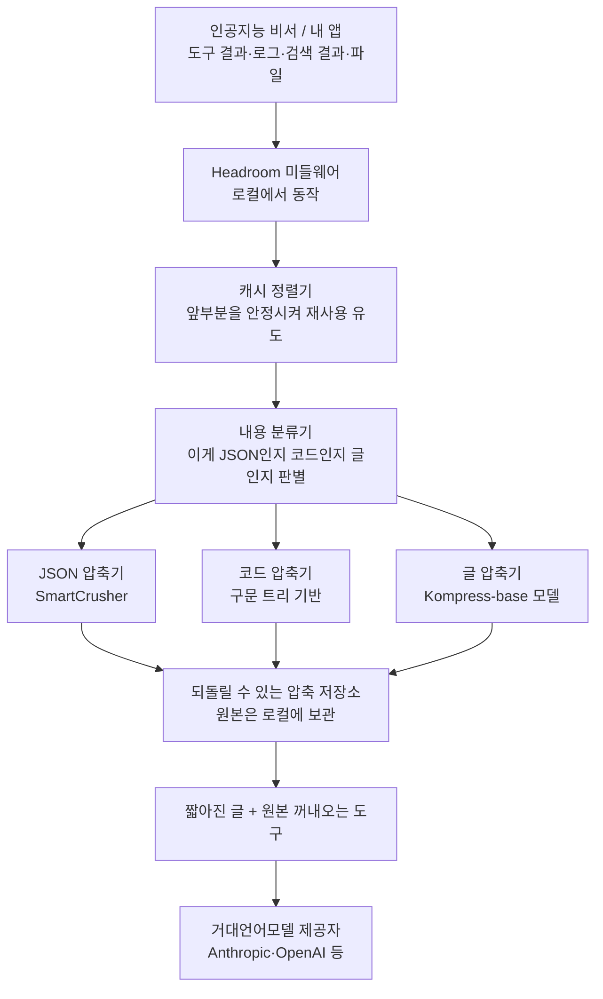

<div class="ai-knowledge-shell">

<aside class="ai-knowledge-sidebar">
  <p class="ai-eyebrow">CATEGORIES</p>
  <nav class="ai-cat-tree"><details class="ai-cat" open><summary><span class="catname">에이전트 오케스트레이션</span><span class="catcount">7</span></summary><ul><li><a href="https://altjs4510.github.io/ai_news_blog/knowledge/20260623/"><span class="kdate">2026-06-23</span><span class="ktitle">bytedance/deer-flow — 샌드박스·메모리·서브에이전트·메시지 게이트웨이를…</span></a></li><li><a href="https://altjs4510.github.io/ai_news_blog/knowledge/20260611/"><span class="kdate">2026-06-11</span><span class="ktitle">The evolution of agentic surfaces: building with…</span></a></li><li><a href="https://altjs4510.github.io/ai_news_blog/knowledge/20260602/"><span class="kdate">2026-06-02</span><span class="ktitle">revfactory/harness — 도메인별 에이전트 팀과 스킬을 자동 설계하는 메타…</span></a></li><li><a href="https://altjs4510.github.io/ai_news_blog/knowledge/20260529/"><span class="kdate">2026-05-29</span><span class="ktitle">Introducing dynamic workflows in Claude Code</span></a></li><li><a href="https://altjs4510.github.io/ai_news_blog/knowledge/20260520/"><span class="kdate">2026-05-20</span><span class="ktitle">New in Claude Managed Agents: self-hosted sandbo…</span></a></li><li><a href="https://altjs4510.github.io/ai_news_blog/knowledge/20260507/"><span class="kdate">2026-05-07</span><span class="ktitle">ruvnet/ruflo — Claude 멀티 에이전트 오케스트레이션 플랫폼</span></a></li><li><a href="https://altjs4510.github.io/ai_news_blog/knowledge/20260504/"><span class="kdate">2026-05-04</span><span class="ktitle">Agents for Everything Else: Codex for Knowledge …</span></a></li></ul></details><details class="ai-cat" open><summary><span class="catname">MCP &amp; 도구 통합</span><span class="catcount">9</span></summary><ul><li><a href="https://altjs4510.github.io/ai_news_blog/knowledge/20260618/"><span class="kdate">2026-06-18</span><span class="ktitle">DeusData/codebase-memory-mcp — 158개 언어 코드베이스를 밀리…</span></a></li><li><a href="https://altjs4510.github.io/ai_news_blog/knowledge/20260604/"><span class="kdate">2026-06-04</span><span class="ktitle">chopratejas/headroom — Compress tool outputs bef…</span></a></li><li><a href="https://altjs4510.github.io/ai_news_blog/knowledge/20260603/"><span class="kdate">2026-06-03</span><span class="ktitle">How Bad MCP design cost your Agent 5× more token…</span></a></li><li><a href="https://altjs4510.github.io/ai_news_blog/knowledge/20260526/"><span class="kdate">2026-05-26</span><span class="ktitle">colbymchenry/codegraph — Pre-indexed code knowle…</span></a></li><li><a href="https://altjs4510.github.io/ai_news_blog/knowledge/20260523/"><span class="kdate">2026-05-23</span><span class="ktitle">colbymchenry/codegraph — 사전 인덱싱된 코드 지식 그래프 MCP</span></a></li><li><a href="https://altjs4510.github.io/ai_news_blog/knowledge/20260521/"><span class="kdate">2026-05-21</span><span class="ktitle">colbymchenry/codegraph — Pre-indexed code knowle…</span></a></li><li><a href="https://altjs4510.github.io/ai_news_blog/knowledge/20260519/"><span class="kdate">2026-05-19</span><span class="ktitle">Anthropic acquires Stainless</span></a></li><li><a href="https://altjs4510.github.io/ai_news_blog/knowledge/20260517/"><span class="kdate">2026-05-17</span><span class="ktitle">I gave my LLM 100,000+ tools — Lazy Discovery &a…</span></a></li><li><a href="https://altjs4510.github.io/ai_news_blog/knowledge/20260509/"><span class="kdate">2026-05-09</span><span class="ktitle">How to connect 100 MCP servers without the conte…</span></a></li></ul></details><details class="ai-cat" open><summary><span class="catname">코딩 에이전트</span><span class="catcount">10</span></summary><ul><li><a href="https://altjs4510.github.io/ai_news_blog/knowledge/20260626/"><span class="kdate">2026-06-26</span><span class="ktitle">google-labs-code/design.md — 코딩 에이전트에게 디자인 시스템을 …</span></a></li><li><a href="https://altjs4510.github.io/ai_news_blog/knowledge/20260619/"><span class="kdate">2026-06-19</span><span class="ktitle">Claude Code now supports artifacts</span></a></li><li><a href="https://altjs4510.github.io/ai_news_blog/knowledge/20260530/"><span class="kdate">2026-05-30</span><span class="ktitle">Leonxlnx/taste-skill — AI에게 좋은 취향을 부여해 generic s…</span></a></li><li><a href="https://altjs4510.github.io/ai_news_blog/knowledge/20260528/"><span class="kdate">2026-05-28</span><span class="ktitle">Building self-improving tax agents with Codex</span></a></li><li><a href="https://altjs4510.github.io/ai_news_blog/knowledge/20260524/"><span class="kdate">2026-05-24</span><span class="ktitle">colbymchenry/codegraph — Pre-indexed code knowle…</span></a></li><li><a href="https://altjs4510.github.io/ai_news_blog/knowledge/20260512/"><span class="kdate">2026-05-12</span><span class="ktitle">agentmemory — Persistent memory for AI coding ag…</span></a></li><li><a href="https://altjs4510.github.io/ai_news_blog/knowledge/20260510/"><span class="kdate">2026-05-10</span><span class="ktitle">addyosmani/agent-skills — Production-grade engin…</span></a></li><li><a href="https://altjs4510.github.io/ai_news_blog/knowledge/20260508/"><span class="kdate">2026-05-08</span><span class="ktitle">addyosmani/agent-skills — Production-grade engin…</span></a></li><li><a href="https://altjs4510.github.io/ai_news_blog/knowledge/20260506/"><span class="kdate">2026-05-06</span><span class="ktitle">mksglu/context-mode — AI 코딩 에이전트용 컨텍스트 윈도우 최적화</span></a></li><li><a href="https://altjs4510.github.io/ai_news_blog/knowledge/20260505/"><span class="kdate">2026-05-05</span><span class="ktitle">mattpocock/skills — Skills for Real Engineers (.…</span></a></li></ul></details><details class="ai-cat" open><summary><span class="catname">모델 &amp; 연구</span><span class="catcount">4</span></summary><ul><li><a href="https://altjs4510.github.io/ai_news_blog/knowledge/20260620/"><span class="kdate">2026-06-20</span><span class="ktitle">zai-org/GLM-5 — From Vibe Coding to Agentic Engi…</span></a></li><li><a href="https://altjs4510.github.io/ai_news_blog/knowledge/20260617/"><span class="kdate">2026-06-17</span><span class="ktitle">Predicting model behavior before release by simu…</span></a></li><li><a href="https://altjs4510.github.io/ai_news_blog/knowledge/20260516/"><span class="kdate">2026-05-16</span><span class="ktitle">STALE — 에이전트가 자기 기억의 유효성을 인지할 수 있는가</span></a></li><li><a href="https://altjs4510.github.io/ai_news_blog/knowledge/20260513/"><span class="kdate">2026-05-13</span><span class="ktitle">Thinking Machines' Native Interaction Models — T…</span></a></li></ul></details><details class="ai-cat" open><summary><span class="catname">인프라 &amp; 컴퓨트</span><span class="catcount">5</span></summary><ul><li><a href="https://altjs4510.github.io/ai_news_blog/knowledge/20260630/"><span class="kdate">2026-06-30</span><span class="ktitle">Introducing the Claude apps gateway for Amazon B…</span></a></li><li><a href="https://altjs4510.github.io/ai_news_blog/knowledge/20260610/"><span class="kdate">2026-06-10</span><span class="ktitle">Fable 5 just made cost-aware model routing manda…</span></a></li><li><a href="https://altjs4510.github.io/ai_news_blog/knowledge/20260606/" class="current"><span class="kdate">2026-06-06</span><span class="ktitle">chopratejas/headroom — Compress tool outputs, lo…</span></a></li><li><a href="https://altjs4510.github.io/ai_news_blog/knowledge/20260605/"><span class="kdate">2026-06-05</span><span class="ktitle">chopratejas/headroom — Compress tool outputs, lo…</span></a></li><li><a href="https://altjs4510.github.io/ai_news_blog/knowledge/20260522/"><span class="kdate">2026-05-22</span><span class="ktitle">Giving Agents Computers — Ivan Burazin, Daytona</span></a></li></ul></details><details class="ai-cat" open><summary><span class="catname">보안 &amp; 거버넌스</span><span class="catcount">8</span></summary><ul><li><a href="https://altjs4510.github.io/ai_news_blog/knowledge/20260625/"><span class="kdate">2026-06-25</span><span class="ktitle">Agent identity in Claude Tag: a new access model…</span></a></li><li><a href="https://altjs4510.github.io/ai_news_blog/knowledge/20260624/"><span class="kdate">2026-06-24</span><span class="ktitle">Agent identity in Claude Tag: a new access model…</span></a></li><li><a href="https://altjs4510.github.io/ai_news_blog/knowledge/20260614/"><span class="kdate">2026-06-14</span><span class="ktitle">NVIDIA/SkillSpector — Security scanner for AI ag…</span></a></li><li><a href="https://altjs4510.github.io/ai_news_blog/knowledge/20260613/"><span class="kdate">2026-06-13</span><span class="ktitle">Fable 5's guardrails got bypassed in 48 hours — …</span></a></li><li><a href="https://altjs4510.github.io/ai_news_blog/knowledge/20260612/"><span class="kdate">2026-06-12</span><span class="ktitle">NVIDIA/SkillSpector — AI 에이전트 스킬용 보안 스캐너</span></a></li><li><a href="https://altjs4510.github.io/ai_news_blog/knowledge/20260607/"><span class="kdate">2026-06-07</span><span class="ktitle">OpenAI Help: Lockdown Mode</span></a></li><li><a href="https://altjs4510.github.io/ai_news_blog/knowledge/20260531/"><span class="kdate">2026-05-31</span><span class="ktitle">How we contain Claude across products</span></a></li><li><a href="https://altjs4510.github.io/ai_news_blog/knowledge/20260527/"><span class="kdate">2026-05-27</span><span class="ktitle">Microsoft Copilot Cowork Exfiltrates Files</span></a></li></ul></details><details class="ai-cat" open><summary><span class="catname">응용 사례</span><span class="catcount">4</span></summary><ul><li><a href="https://altjs4510.github.io/ai_news_blog/knowledge/20260621/"><span class="kdate">2026-06-21</span><span class="ktitle">calesthio/OpenMontage — 12 파이프라인·52 도구·500+ 스킬을 …</span></a></li><li><a href="https://altjs4510.github.io/ai_news_blog/knowledge/20260609/"><span class="kdate">2026-06-09</span><span class="ktitle">Building intelligent apps for Apple platforms wi…</span></a></li><li><a href="https://altjs4510.github.io/ai_news_blog/knowledge/20260515/"><span class="kdate">2026-05-15</span><span class="ktitle">Clawdmeter — Claude Code 사용량을 데스크톱 대시보드로</span></a></li><li><a href="https://altjs4510.github.io/ai_news_blog/knowledge/20260514/"><span class="kdate">2026-05-14</span><span class="ktitle">Introducing Claude for Small Business</span></a></li></ul></details><details class="ai-cat" open><summary><span class="catname">산업 동향</span><span class="catcount">1</span></summary><ul><li><a href="https://altjs4510.github.io/ai_news_blog/knowledge/20260616/"><span class="kdate">2026-06-16</span><span class="ktitle">Why AI hasn't replaced software engineers, and w…</span></a></li></ul></details></nav>
</aside>

<article class="ai-knowledge-article">

<header class="ai-post-hero">
  <p class="ai-eyebrow"><a class="ai-back" href="../">KNOWLEDGE</a> · 2026-06-06 · 오늘의 학습</p>
  <h2 class="ai-post-title">chopratejas/headroom — Compress tool outputs, logs, files, and RAG chunks before they reach the LLM</h2>
</header>

> 원문: [chopratejas/headroom — Compress tool outputs, logs, files, and RAG chunks before they reach the LLM](https://github.com/chopratejas/headroom)

## 📌 학습 정리

### 1. 한 줄로 말하면

인공지능 비서가 읽어야 할 글이 너무 길어질 때, 그걸 중간에서 짧게 줄여 건네주는 "압축 중계기"예요. 답은 거의 그대로인데, 읽는 분량은 절반 이하로 줄어듭니다.

### 2. 왜 이게 만들어졌어요?

요즘 인공지능 비서(코딩 도우미, 검색 도우미 같은 것들)는 일을 하면서 어마어마한 분량의 텍스트를 읽어요. 도구를 한 번 실행하면 결과가 수만 글자씩 쏟아지고, 로그 파일·검색해 온 문서 조각·이전 대화까지 전부 거대언어모델(LLM, large language model — 챗지피티 같은 인공지능의 두뇌 역할을 하는 모델)에 밀어 넣어야 하거든요. 이렇게 들어가는 글의 양이 곧 비용이고 속도이고 정확도라서, 원문 그대로 다 보내면 "맥락 세금"처럼 토큰(token — 모델이 글을 잘게 쪼갠 단위, 비용 계산의 기준이 되는 조각) 비용이 계속 새어 나가요. 원래는 각 모델 제공자가 알아서 줄여주는 기능에 의존하거나, 직접 코드를 고쳐서 잘라 넣어야 했는데 둘 다 한계가 있었습니다. Headroom은 인공지능에 글이 도달하기 *전에* 한 겹 미들웨어를 끼워서 자동으로 줄여주는 방식으로 그 문제를 풀려고 만들어졌어요.

### 3. 비유로 풀면

이건 마치 회의 들어가기 전에 두꺼운 자료를 한 장짜리 요약으로 정리해 주는 비서 같아요. 회의 중에 "원본 표 좀 보여줘" 하면 다시 꺼내올 수 있게 원본은 옆에 보관해 두고요. 그래서 결국 인공지능은 짧은 요약본만 들고 일하다가, 정말 필요할 때만 원본을 꺼내 보는 식으로 움직입니다.

### 4. 어떻게 작동하는지 (그림으로)



흐름을 풀어보면, 내 앱이 인공지능에 보내려던 글이 먼저 Headroom을 거쳐요. 거기서 글의 종류에 따라 알맞은 압축기로 보내 부피를 줄이고, 원본은 로컬(내 컴퓨터)에 따로 저장해 둡니다. 인공지능이 "원본이 필요해" 하면 그때 다시 꺼내 줄 수 있어요.

### 5. 처음 보는 용어 풀이

- **토큰 (token)** — 인공지능이 글을 잘게 쪼갠 한 조각이에요. 사용료와 처리 한도가 토큰 수로 계산되기 때문에, 토큰을 줄이는 것이 곧 비용·속도 절약입니다.
- **프록시 (proxy)** — 내 앱과 인공지능 서버 사이에 끼어 앉는 중계 서버예요. 코드를 고치지 않아도 오가는 글을 가로채서 압축할 수 있게 해 줍니다.
- **MCP 서버 (Model Context Protocol server)** — 인공지능 비서가 외부 도구를 부를 때 쓰는 표준 통신 방식의 서버예요. Headroom을 MCP 서버로 띄우면 다른 인공지능 도구들이 "이 글 좀 압축해줘" 하고 호출할 수 있습니다.
- **검색 보강 생성 청크 (RAG chunk)** — 인공지능이 답을 만들기 전에 외부 문서에서 찾아 온 글 조각이에요. 보통 수십 개씩 들어와서 분량이 크기 때문에 압축 효과가 큽니다.
- **되돌릴 수 있는 압축 (CCR, Context Compression with Retrieval)** — 줄여서 보내되 원본은 버리지 않고 보관해 두는 방식이에요. 인공지능이 세부 사항이 필요하다고 판단하면 `headroom_retrieve` 같은 도구로 원본을 다시 가져옵니다.
- **구문 트리 기반 압축 (AST-aware)** — 코드를 단순한 글로 보지 않고 문법 구조로 이해해서 압축하는 방식이에요. 그래서 줄여도 코드의 의미가 깨지지 않아요.
- **키-값 캐시 적중 (KV cache hit)** — 인공지능 모델이 이전에 처리한 앞부분을 다시 계산하지 않고 재사용하는 거예요. Headroom의 캐시 정렬기가 글의 앞부분을 안정적으로 유지해 이 재사용이 잘 일어나도록 돕습니다.
- **에이전트 루프 (agent loop)** — 인공지능 비서가 "생각 → 도구 실행 → 결과 보고 → 다시 생각"을 반복하는 흐름이에요. 도구 결과가 매 단계 컨텍스트에 쌓이기 때문에, 이 결과를 압축하는 게 가장 효과가 큽니다.

### 6. 한 발 더 들어가고 싶다면

- [Architecture 문서](https://headroom-docs.vercel.app/docs/architecture) — 내부 구조가 어떻게 짜여 있는지, 어떤 부품들이 어떻게 맞물리는지 그림과 함께 볼 수 있어요.
- [CCR — 되돌릴 수 있는 압축](https://headroom-docs.vercel.app/docs/ccr) — 원본을 버리지 않고도 압축하는 방식의 원리와, 인공지능이 원본을 다시 꺼내 쓰는 흐름을 알 수 있어요.
- [Benchmarks](https://headroom-docs.vercel.app/docs/benchmarks) — 실제로 얼마나 줄었고 정확도는 얼마나 보존됐는지, 측정 방법까지 같이 확인할 수 있어요.
- [Kompress-base 모델 카드](https://huggingface.co/chopratejas/kompress-base) — 글 압축에 쓰이는 자체 학습 모델이 어떤 데이터로 만들어졌고 어떤 특성이 있는지 알 수 있어요.
- [llms.txt](https://github.com/chopratejas/headroom/blob/main/llms.txt) — 인공지능이 직접 읽도록 정리된 요약 인덱스라, 이 도구를 인공지능에게 어떻게 소개하는지 그 결을 볼 수 있어요.

---

## 📖 원문 전체 번역 (정독용)

> 의역 최소화한 전체 번역입니다. 큰 흐름은 위 정리에서 잡고, 정확한 워딩이 필요할 땐 이 섹션에서 정독하세요.

```
██╗  ██╗███████╗ █████╗ ██████╗ ██████╗  ██████╗  ██████╗ ███╗   ███╗
  ██║  ██║██╔════╝██╔══██╗██╔══██╗██╔══██╗██╔═══██╗██╔═══██╗████╗ ████║
  ███████║█████╗  ███████║██║  ██║██████╔╝██║   ██║██║   ██║██╔████╔██║
  ██╔══██║██╔══╝  ██╔══██║██║  ██║██╔══██╗██║   ██║██║   ██║██║╚██╔╝██║
  ██║  ██║███████╗██║  ██║██████╔╝██║  ██║╚██████╔╝╚██████╔╝██║ ╚═╝ ██║
  ╚═╝  ╚═╝╚══════╝╚═╝  ╚═╝╚═════╝ ╚═╝  ╚═╝ ╚═════╝  ╚═════╝ ╚═╝     ╚═╝
                  AI 에이전트를 위한 컨텍스트 압축 레이어
```

**토큰 60–95% 감소 · 라이브러리 · 프록시 · MCP · 6가지 알고리즘 · 로컬 우선 · 가역적**

[문서](https://headroom-docs.vercel.app/docs) · [설치](https://github.com/chopratejas/headroom#get-started-60-seconds) · [성능 증명](https://github.com/chopratejas/headroom#proof) · [에이전트](https://github.com/chopratejas/headroom#agent-compatibility-matrix) · [Discord](https://discord.gg/yRmaUNpsPJ) · [llms.txt](https://github.com/chopratejas/headroom/blob/main/llms.txt) · [엔터프라이즈](https://github.com/chopratejas/headroom/blob/main/ENTERPRISE.md)

**AI 에이전트 / LLM:** [`/llms.txt`](https://github.com/chopratejas/headroom/blob/main/llms.txt)를 여기서 읽거나, [라이브 인덱스](https://headroom-docs.vercel.app/llms.txt) / [전체 문서 블롭](https://headroom-docs.vercel.app/llms-full.txt)을 가져오세요.

---

Headroom은 AI 에이전트가 읽는 모든 것 — 툴 출력, 로그, RAG 청크, 파일, 대화 이력 — 을 LLM에 도달하기 전에 압축합니다. 동일한 답변, 토큰은 일부만 사용.

[](https://github.com/chopratejas/headroom/blob/main/HeadroomDemo-Fast.gif)

라이브: 10,144 → 1,260 토큰 — 동일한 FATAL 오류 발견.

## 기능 설명

- **라이브러리** — Python 또는 TypeScript에서 `compress(messages)`를 호출, 모든 앱에 인라인 삽입
- **프록시** — `headroom proxy --port 8787`, 코드 변경 없이 모든 언어에서 사용 가능
- **에이전트 래핑** — `headroom wrap claude|codex|cursor|aider|copilot` 한 명령으로 실행
- **MCP 서버** — `headroom_compress`, `headroom_retrieve`, `headroom_stats`로 모든 MCP 클라이언트 지원
- **크로스 에이전트 메모리** — Claude, Codex, Gemini에 걸쳐 공유 저장소, 자동 중복 제거
- **`headroom learn`** — 실패한 세션을 분석해 `CLAUDE.md` / `AGENTS.md`에 수정 사항 기록
- **가역적 압축 (CCR)** — 원본은 삭제되지 않음; LLM이 필요 시 요청하여 복원

## 동작 방식 (30초)

```
사용자의 에이전트 / 앱
   (Claude Code, Cursor, Codex, LangChain, Agno, Strands, 직접 작성한 코드 등…)
        │   프롬프트 · 툴 출력 · 로그 · RAG 결과 · 파일
        ▼
    ┌────────────────────────────────────────────────────┐
    │  Headroom   (로컬에서 실행 — 데이터가 여기에 유지)  │
    │  ────────────────────────────────────────────────  │
    │  CacheAligner  →  ContentRouter  →  CCR            │
    │                    ├─ SmartCrusher   (JSON)        │
    │                    ├─ CodeCompressor (AST)         │
    │                    └─ Kompress-base  (텍스트, HF)  │
    │                                                    │
    │  크로스 에이전트 메모리  ·  headroom learn  ·  MCP │
    └────────────────────────────────────────────────────┘
        │   압축된 프롬프트  +  검색 툴
        ▼
 LLM 제공자  (Anthropic · OpenAI · Bedrock · …)
```

- **ContentRouter** — 콘텐츠 유형을 감지하고 적합한 압축기를 선택
- **SmartCrusher / CodeCompressor / Kompress-base** — JSON, AST, 또는 산문 텍스트 압축
- **CacheAligner** — 프리픽스를 안정화시켜 제공자의 KV 캐시가 실제로 적중되도록 함
- **CCR** — 원본을 로컬에 저장; LLM이 필요할 경우 `headroom_retrieve` 호출

→ [아키텍처](https://headroom-docs.vercel.app/docs/architecture) · [CCR 가역 압축](https://headroom-docs.vercel.app/docs/ccr) · [Kompress-base 모델 카드](https://huggingface.co/chopratejas/kompress-base)

## 시작하기 (60초)

```bash
# 1 — 설치
pip install "headroom-ai[all]"          # Python
npm install headroom-ai                 # Node / TypeScript

# 2 — 모드 선택
headroom wrap claude                    # 코딩 에이전트 래핑
headroom proxy --port 8787              # 드롭인 프록시, 코드 변경 없음
# 또는: from headroom import compress  # 인라인 라이브러리

# 3 — 절감 확인
headroom perf
```

세부 extras: `[proxy]`, `[mcp]`, `[ml]`, `[code]`, `[memory]`, `[relevance]`, `[image]`, `[agno]`, `[langchain]`, `[evals]`. **Python 3.10+** 필요.

## 성능 증명

**실제 에이전트 워크로드에서의 절감량:**

| 워크로드 | 이전 | 이후 | 절감 |
| --- | --- | --- | --- |
| 코드 검색 (결과 100개) | 17,765 | 1,408 | **92%** |
| SRE 인시던트 디버깅 | 65,694 | 5,118 | **92%** |
| GitHub 이슈 분류 | 54,174 | 14,761 | **73%** |
| 코드베이스 탐색 | 78,502 | 41,254 | **47%** |

**표준 벤치마크에서의 정확도 보존:**

| 벤치마크 | 카테고리 | N | 베이스라인 | Headroom | 차이 |
| --- | --- | --- | --- | --- | --- |
| GSM8K | 수학 | 100 | 0.870 | 0.870 | **±0.000** |
| TruthfulQA | 사실 | 100 | 0.530 | 0.560 | **+0.030** |
| SQuAD v2 | QA | 100 | — | **97%** | 압축률 19% |
| BFCL | 툴 | 100 | — | **97%** | 압축률 32% |

재현: `python -m headroom.evals suite --tier 1` · [전체 벤치마크 및 방법론](https://headroom-docs.vercel.app/docs/benchmarks)

## 에이전트 호환성 매트릭스

| 에이전트 | `headroom wrap` | 비고 |
| --- | --- | --- |
| Claude Code | ● | `--memory` · `--code-graph` |
| Codex | ● | Claude와 메모리 공유 |
| Cursor | ● | 설정 출력 — 한 번만 붙여넣기 |
| Aider | ● | 프록시 시작 + 실행 |
| Copilot CLI | ● | 프록시 시작 + 실행 |
| OpenClaw | ● | ContextEngine 플러그인으로 설치 |

OpenAI 호환 클라이언트는 `headroom proxy`를 통해 모두 사용 가능. MCP 네이티브: `headroom mcp install`.

### GitHub Copilot CLI 구독 모드

Headroom은 GitHub Copilot CLI 구독 트래픽을 로컬 프록시를 통해 라우팅할 수 있습니다:

```bash
headroom wrap copilot --subscription -- --model gpt-4o
```

이를 통해 Headroom이 OpenAI 호환 Copilot CLI 요청을 가로채어 GitHub Copilot의 호스팅 API로 전달하기 전에 동일한 프록시 압축 파이프라인을 적용합니다. 래퍼는 계정별 Copilot API 엔드포인트를 확인하고 실행 중에 `COPILOT_PROVIDER_API_URL=...` 형태로 출력합니다.

플랫폼 지원 참고: Copilot CLI 키체인 저장소를 통한 macOS 인증 재사용은 스모크 테스트를 완료했습니다. Windows Credential Manager, Linux Secret Service / `secret-tool`, Docker/CI 토큰 주입 경로는 인증 탐색 경로로 구현되었거나 계획 중이지만, 완전히 검증된 것으로 간주하기 전에 실제 OS 검증이 필요합니다. Docker 및 CI 환경에서는 호스트 키체인 접근에 의존하기보다 `GITHUB_COPILOT_TOKEN` 또는 `GITHUB_COPILOT_GITHUB_TOKEN`을 명시적으로 전달하는 것을 권장합니다.

## 사용 권장 상황 · 생략 권장 상황

**다음에 해당하면 적합합니다:**

- AI 코딩 에이전트를 매일 사용하며 코드 변경 없이 비용을 절감하고 싶은 경우
- 여러 에이전트에 걸쳐 작업하며 공유 메모리가 필요한 경우
- 가역적 압축이 필요한 경우 — CCR을 통해 원본 항상 복원 가능

**다음에 해당하면 생략하세요:**

- 단일 제공자의 네이티브 압축만 사용하며 크로스 에이전트 메모리가 필요 없는 경우
- 로컬 프로세스를 실행할 수 없는 샌드박스 환경에서 작업하는 경우

**통합 — 어떤 스택에도 Headroom 적용 가능**

| 환경 | 적용 방법 |
| --- | --- |
| 모든 Python 앱 | `compress(messages, model=…)` |
| 모든 TypeScript 앱 | `await compress(messages, { model })` |
| Anthropic / OpenAI SDK | `withHeadroom(new Anthropic())` · `withHeadroom(new OpenAI())` |
| Vercel AI SDK | `wrapLanguageModel({ model, middleware: headroomMiddleware() })` |
| LiteLLM | `litellm.callbacks = [HeadroomCallback()]` |
| LangChain | `HeadroomChatModel(your_llm)` |
| Agno | `HeadroomAgnoModel(your_model)` |
| Strands | [Strands 가이드](https://headroom-docs.vercel.app/docs/strands) |
| ASGI 앱 | `app.add_middleware(CompressionMiddleware)` |
| 멀티 에이전트 | `SharedContext().put / .get` |
| MCP 클라이언트 | `headroom mcp install` |

**내부 구성 요소**

- **SmartCrusher** — 범용 JSON: dict 배열, 중첩 객체, 혼합 타입.
- **CodeCompressor** — Python, JS, Go, Rust, Java, C++를 위한 AST 인식 압축.
- **Kompress-base** — 에이전트 트레이스로 학습된 HuggingFace 모델.
- **이미지 압축** — 학습된 ML 라우터를 통해 40–90% 감소.
- **CacheAligner** — Anthropic/OpenAI KV 캐시가 실제로 적중되도록 프리픽스 안정화.
- **IntelligentContext** — 학습된 중요도를 활용한 점수 기반 컨텍스트 피팅.
- **CCR** — 가역적 압축; LLM이 요청 시 원본 복원.
- **크로스 에이전트 메모리** — 공유 저장소, 에이전트 출처 추적, 자동 중복 제거.
- **SharedContext** — 멀티 에이전트 워크플로우 전반에 걸친 압축 컨텍스트 전달.
- **`headroom learn`** — Claude, Codex, Gemini를 위한 플러그인 기반 실패 분석.

**파이프라인 내부 구조**

Headroom은 `compress()`, SDK, 프록시에 걸쳐 하나의 안정적인 요청 생명 주기를 제공합니다:

`Setup` → `Pre-Start` → `Post-Start` → `Input Received` → `Input Cached` → `Input Routed` → `Input Compressed` → `Input Remembered` → `Pre-Send` → `Post-Send` → `Response Received`

- **트랜스폼**이 실제 작업을 수행합니다: CacheAligner, ContentRouter, SmartCrusher, CodeCompressor, Kompress-base, IntelligentContext / RollingWindow.
- **파이프라인 익스텐션**은 `on_pipeline_event(...)`를 통해 생명 주기 단계를 관찰하거나 커스터마이즈합니다.
- **압축 훅**은 추가적인 확장 지점으로 표준 생명 주기와 나란히 위치합니다.
- **프록시 익스텐션**은 ASGI 미들웨어, 라우트, 시작 정책을 위한 서버/앱 통합 지점입니다.

제공자 및 툴 별 동작은 `headroom/providers/` 하위에 위치하므로 핵심 오케스트레이션은 생명 주기, 시퀀싱, 정책에 집중됩니다.

- **CLI/툴 슬라이스**: `headroom/providers/claude`, `copilot`, `codex`, `openclaw`
- **제공자 런타임 슬라이스**: `headroom/providers/claude`, `gemini`, 그리고 `headroom/providers/registry.py`의 공유 백엔드/런타임 디스패치
- **핵심 파일은 오케스트레이션 우선 유지**: `wrap.py`, `client.py`, `cli/proxy.py`, `proxy/server.py`는 제공자별 환경 구성, API 대상 정규화, 백엔드 선택, 전송 디스패치를 위임합니다.

## 설치

```bash
pip install "headroom-ai[all]"          # Python, 전체 포함
npm install headroom-ai                 # TypeScript / Node
docker pull ghcr.io/chopratejas/headroom:latest
```

세부 extras: `[proxy]`, `[mcp]`, `[ml]` (Kompress-base), `[code]`, `[memory]`, `[relevance]`, `[image]`, `[agno]`, `[langchain]`, `[evals]`. **Python 3.10+** 필요.

`pipx`를 사용하는 경우 지원되는 인터프리터를 명시적으로 지정하세요:

```bash
pipx install --python python3.13 "headroom-ai[all]"
```

→ [설치 가이드](https://headroom-docs.vercel.app/docs/installation) — Docker 태그, 영구 서비스, PowerShell, 데브컨테이너.

## headroom learn

[](https://github.com/chopratejas/headroom/blob/main/headroom_learn.gif)

`headroom learn` — 실패한 세션을 분석하여 `CLAUDE.md` / `AGENTS.md` / `GEMINI.md`에 수정 사항을 기록합니다.

## 문서

| 시작 | 심화 |
| --- | --- |
| [빠른 시작](https://headroom-docs.vercel.app/docs/quickstart) | [아키텍처](https://headroom-docs.vercel.app/docs/architecture) |
| [프록시](https://headroom-docs.vercel.app/docs/proxy) | [압축 방식](https://headroom-docs.vercel.app/docs/how-compression-works) |
| [MCP 툴](https://headroom-docs.vercel.app/docs/mcp) | [CCR — 가역적 압축](https://headroom-docs.vercel.app/docs/ccr) |
| [메모리](https://headroom-docs.vercel.app/docs/memory) | [캐시 최적화](https://headroom-docs.vercel.app/docs/cache-optimization) |
| [실패 학습](https://headroom-docs.vercel.app/docs/failure-learning) | [벤치마크](https://headroom-docs.vercel.app/docs/benchmarks) |
| [설정](https://headroom-docs.vercel.app/docs/configuration) | [제한 사항](https://headroom-docs.vercel.app/docs/limitations) |

## 비교

Headroom은 **로컬**에서 실행되고, **모든** 콘텐츠 유형을 지원하며, 모든 주요 프레임워크와 호환되고, **가역적**입니다.

|  | 범위 | 배포 방식 | 로컬 | 가역적 |
| --- | --- | --- | --- | --- |
| **Headroom** | 전체 컨텍스트 — 툴, RAG, 로그, 파일, 이력 | 프록시 · 라이브러리 · 미들웨어 · MCP | 예 | 예 |
| [RTK](https://github.com/rtk-ai/rtk) | CLI 명령 출력 | CLI 래퍼 | 예 | 아니오 |
| [lean-ctx](https://github.com/yvgude/lean-ctx) | CLI 명령, MCP 툴, 에디터 규칙 | CLI 래퍼 · MCP | 예 | 아니오 |
| [Compresr](https://compresr.ai/), [Token Co.](https://thetokencompany.ai/) | 해당 API로 전송되는 텍스트 | 호스팅 API 호출 | 아니오 | 아니오 |
| OpenAI Compaction | 대화 이력 | 제공자 네이티브 | 아니오 | 아니오 |

> **저작권 표시.** Headroom은 셸 출력 재작성을 위해 우수한 [RTK](https://github.com/rtk-ai/rtk) 바이너리를 탑재합니다 — `git show --short`, 범위 지정 `ls`, 요약된 인스톨러. RTK 팀에 깊은 감사를 드리며, 그들의 툴은 저희 스택의 핵심 구성 요소이고, Headroom은 그 하위의 모든 것을 압축합니다. Headroom은 선택된 CLI 컨텍스트 툴로 [lean-ctx](https://github.com/yvgude/lean-ctx)를 사용할 수도 있습니다; `headroom wrap ...` 실행 전에 `HEADROOM_CONTEXT_TOOL=lean-ctx`를 설정하세요.

## 기여하기

```bash
git clone https://github.com/chopratejas/headroom.git && cd headroom
pip install -e ".[dev]" && pytest
```

`.devcontainer/`에 데브컨테이너 포함 (기본 + Qdrant 및 Neo4j가 있는 `memory-stack`). [CONTRIBUTING.md](https://github.com/chopratejas/headroom/blob/main/CONTRIBUTING.md) 참고.

## 커뮤니티

- **[Discord](https://discord.gg/yRmaUNpsPJ)** — 질문, 피드백, 경험담.
- **[HuggingFace의 Kompress-base](https://huggingface.co/chopratejas/kompress-base)** — 텍스트 압축 기반 모델.

## 라이선스

Apache 2.0 — [LICENSE](https://github.com/chopratejas/headroom/blob/main/LICENSE) 참고.

</article>

</div>

<!-- ai-related-links -->
<aside class="ai-related-links">
  <p class="ai-eyebrow">관련 학습</p>
  <ul><li><a href="https://altjs4510.github.io/ai_news_blog/knowledge/20260604/"><span class="kdate">2026-06-04</span><span class="ktitle">chopratejas/headroom — Compress tool outputs bef…</span></a></li><li><a href="https://altjs4510.github.io/ai_news_blog/knowledge/20260605/"><span class="kdate">2026-06-05</span><span class="ktitle">chopratejas/headroom — Compress tool outputs, lo…</span></a></li><li><a href="https://altjs4510.github.io/ai_news_blog/knowledge/20260506/"><span class="kdate">2026-05-06</span><span class="ktitle">mksglu/context-mode — AI 코딩 에이전트용 컨텍스트 윈도우 최적화</span></a></li></ul>
</aside>
<!-- /ai-related-links -->
