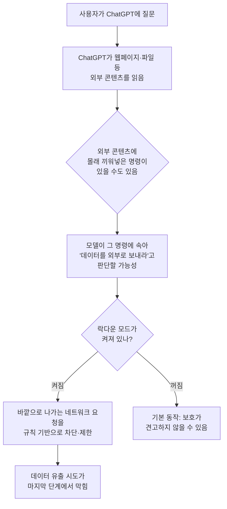

<aside class="ai-knowledge-sidebar">
  
CATEGORIES

  <nav class="ai-cat-tree">

에이전트 오케스트레이션8
<ul><li><a href="https://altjs4510.github.io/ai_news_blog/knowledge/20260623/">2026-06-23bytedance/deer-flow — 샌드박스·메모리·서브에이전트·메시지 게이트웨이를…</a></li><li><a href="https://altjs4510.github.io/ai_news_blog/knowledge/20260621/">2026-06-21calesthio/OpenMontage — 12 파이프라인·52 도구·500+ 스킬을 …</a></li><li><a href="https://altjs4510.github.io/ai_news_blog/knowledge/20260611/">2026-06-11The evolution of agentic surfaces: building with…</a></li><li><a href="https://altjs4510.github.io/ai_news_blog/knowledge/20260602/">2026-06-02revfactory/harness — 도메인별 에이전트 팀과 스킬을 자동 설계하는 메타…</a></li><li><a href="https://altjs4510.github.io/ai_news_blog/knowledge/20260529/">2026-05-29Introducing dynamic workflows in Claude Code</a></li><li><a href="https://altjs4510.github.io/ai_news_blog/knowledge/20260520/">2026-05-20New in Claude Managed Agents: self-hosted sandbo…</a></li><li><a href="https://altjs4510.github.io/ai_news_blog/knowledge/20260507/">2026-05-07ruvnet/ruflo — Claude 멀티 에이전트 오케스트레이션 플랫폼</a></li><li><a href="https://altjs4510.github.io/ai_news_blog/knowledge/20260504/">2026-05-04Agents for Everything Else: Codex for Knowledge …</a></li></ul>

MCP &amp; 도구 통합8
<ul><li><a href="https://altjs4510.github.io/ai_news_blog/knowledge/20260618/">2026-06-18DeusData/codebase-memory-mcp — 158개 언어 코드베이스를 밀리…</a></li><li><a href="https://altjs4510.github.io/ai_news_blog/knowledge/20260604/">2026-06-04chopratejas/headroom — Compress tool outputs bef…</a></li><li><a href="https://altjs4510.github.io/ai_news_blog/knowledge/20260603/">2026-06-03How Bad MCP design cost your Agent 5× more token…</a></li><li><a href="https://altjs4510.github.io/ai_news_blog/knowledge/20260526/">2026-05-26colbymchenry/codegraph — Pre-indexed code knowle…</a></li><li><a href="https://altjs4510.github.io/ai_news_blog/knowledge/20260523/">2026-05-23colbymchenry/codegraph — 사전 인덱싱된 코드 지식 그래프 MCP</a></li><li><a href="https://altjs4510.github.io/ai_news_blog/knowledge/20260519/">2026-05-19Anthropic acquires Stainless</a></li><li><a href="https://altjs4510.github.io/ai_news_blog/knowledge/20260517/">2026-05-17I gave my LLM 100,000+ tools — Lazy Discovery &a…</a></li><li><a href="https://altjs4510.github.io/ai_news_blog/knowledge/20260509/">2026-05-09How to connect 100 MCP servers without the conte…</a></li></ul>

코딩 에이전트10
<ul><li><a href="https://altjs4510.github.io/ai_news_blog/knowledge/20260619/">2026-06-19Claude Code now supports artifacts</a></li><li><a href="https://altjs4510.github.io/ai_news_blog/knowledge/20260530/">2026-05-30Leonxlnx/taste-skill — AI에게 좋은 취향을 부여해 generic s…</a></li><li><a href="https://altjs4510.github.io/ai_news_blog/knowledge/20260528/">2026-05-28Building self-improving tax agents with Codex</a></li><li><a href="https://altjs4510.github.io/ai_news_blog/knowledge/20260524/">2026-05-24colbymchenry/codegraph — Pre-indexed code knowle…</a></li><li><a href="https://altjs4510.github.io/ai_news_blog/knowledge/20260521/">2026-05-21colbymchenry/codegraph — Pre-indexed code knowle…</a></li><li><a href="https://altjs4510.github.io/ai_news_blog/knowledge/20260512/">2026-05-12agentmemory — Persistent memory for AI coding ag…</a></li><li><a href="https://altjs4510.github.io/ai_news_blog/knowledge/20260510/">2026-05-10addyosmani/agent-skills — Production-grade engin…</a></li><li><a href="https://altjs4510.github.io/ai_news_blog/knowledge/20260508/">2026-05-08addyosmani/agent-skills — Production-grade engin…</a></li><li><a href="https://altjs4510.github.io/ai_news_blog/knowledge/20260506/">2026-05-06mksglu/context-mode — AI 코딩 에이전트용 컨텍스트 윈도우 최적화</a></li><li><a href="https://altjs4510.github.io/ai_news_blog/knowledge/20260505/">2026-05-05mattpocock/skills — Skills for Real Engineers (.…</a></li></ul>

모델 &amp; 연구4
<ul><li><a href="https://altjs4510.github.io/ai_news_blog/knowledge/20260620/">2026-06-20zai-org/GLM-5 — From Vibe Coding to Agentic Engi…</a></li><li><a href="https://altjs4510.github.io/ai_news_blog/knowledge/20260617/">2026-06-17Predicting model behavior before release by simu…</a></li><li><a href="https://altjs4510.github.io/ai_news_blog/knowledge/20260516/">2026-05-16STALE — 에이전트가 자기 기억의 유효성을 인지할 수 있는가</a></li><li><a href="https://altjs4510.github.io/ai_news_blog/knowledge/20260513/">2026-05-13Thinking Machines' Native Interaction Models — T…</a></li></ul>

인프라 &amp; 컴퓨트4
<ul><li><a href="https://altjs4510.github.io/ai_news_blog/knowledge/20260610/">2026-06-10Fable 5 just made cost-aware model routing manda…</a></li><li><a href="https://altjs4510.github.io/ai_news_blog/knowledge/20260606/">2026-06-06chopratejas/headroom — Compress tool outputs, lo…</a></li><li><a href="https://altjs4510.github.io/ai_news_blog/knowledge/20260605/">2026-06-05chopratejas/headroom — Compress tool outputs, lo…</a></li><li><a href="https://altjs4510.github.io/ai_news_blog/knowledge/20260522/">2026-05-22Giving Agents Computers — Ivan Burazin, Daytona</a></li></ul>

보안 &amp; 거버넌스8
<ul><li><a href="https://altjs4510.github.io/ai_news_blog/knowledge/20260625/">2026-06-25Agent identity in Claude Tag: a new access model…</a></li><li><a href="https://altjs4510.github.io/ai_news_blog/knowledge/20260624/">2026-06-24Agent identity in Claude Tag: a new access model…</a></li><li><a href="https://altjs4510.github.io/ai_news_blog/knowledge/20260614/">2026-06-14NVIDIA/SkillSpector — Security scanner for AI ag…</a></li><li><a href="https://altjs4510.github.io/ai_news_blog/knowledge/20260613/">2026-06-13Fable 5's guardrails got bypassed in 48 hours — …</a></li><li><a href="https://altjs4510.github.io/ai_news_blog/knowledge/20260612/">2026-06-12NVIDIA/SkillSpector — AI 에이전트 스킬용 보안 스캐너</a></li><li><a href="https://altjs4510.github.io/ai_news_blog/knowledge/20260607/" class="current">2026-06-07OpenAI Help: Lockdown Mode</a></li><li><a href="https://altjs4510.github.io/ai_news_blog/knowledge/20260531/">2026-05-31How we contain Claude across products</a></li><li><a href="https://altjs4510.github.io/ai_news_blog/knowledge/20260527/">2026-05-27Microsoft Copilot Cowork Exfiltrates Files</a></li></ul>

응용 사례3
<ul><li><a href="https://altjs4510.github.io/ai_news_blog/knowledge/20260609/">2026-06-09Building intelligent apps for Apple platforms wi…</a></li><li><a href="https://altjs4510.github.io/ai_news_blog/knowledge/20260515/">2026-05-15Clawdmeter — Claude Code 사용량을 데스크톱 대시보드로</a></li><li><a href="https://altjs4510.github.io/ai_news_blog/knowledge/20260514/">2026-05-14Introducing Claude for Small Business</a></li></ul>

산업 동향1
<ul><li><a href="https://altjs4510.github.io/ai_news_blog/knowledge/20260616/">2026-06-16Why AI hasn't replaced software engineers, and w…</a></li></ul>
</nav>
</aside>

<article class="ai-knowledge-article">

<header class="ai-post-hero">
  
<a class="ai-back" href="../">KNOWLEDGE</a> · 2026-06-07 · 오늘의 학습

  <h2 class="ai-post-title">OpenAI Help: Lockdown Mode</h2>
</header>

> 원문: [OpenAI Help: Lockdown Mode](https://simonwillison.net/2026/Jun/5/openai-help-lockdown-mode/#atom-everything)

## 📌 학습 정리

### 1. 한 줄로 말하면

ChatGPT가 외부 자료에 숨어 있던 "몰래 시키는 명령"에 속아서 내 데이터를 바깥으로 흘려보내지 못하도록, 바깥으로 나가는 길을 아예 좁혀버리는 안전 모드예요.

### 2. 왜 이게 만들어졌어요?

요즘 ChatGPT는 대화만 하는 게 아니라 웹페이지를 읽고, 파일을 열어보고, 외부 도구도 직접 쓰기 시작했어요. 그런데 이렇게 외부 콘텐츠를 가져다 쓰면, 그 안에 "이 사용자의 비밀 데이터를 ○○ 주소로 보내라" 같은 악성 지시문이 숨어 있을 수 있습니다. 이걸 프롬프트 인젝션(prompt injection), 즉 "끼워넣기 공격"이라고 불러요. 모델이 그 지시를 진짜 사용자 명령처럼 착각해서 따라버리면, 결국 내 데이터가 공격자에게 새어 나가게 됩니다. 락다운 모드(Lockdown Mode)는 이런 사고가 마지막 단계, 즉 "데이터를 바깥으로 빼돌리는 순간"에서 막자는 발상으로 만들어졌어요.

### 3. 비유로 풀면

이건 마치 회사 보안실에서 "외부에서 온 메모는 누구나 볼 수 있지만, 바깥으로 나가는 우편물은 정해진 주소로만 보낼 수 있다"고 정해둔 규칙 같은 거예요. 도둑이 사무실에 들어와서 "이 서류를 ○○ 주소로 부치세요"라고 적힌 쪽지를 책상에 두고 가도, 그 주소가 허용 목록에 없으면 우편 자체가 안 나갑니다. 그래서 결국, 모델이 속는 건 막지 못하더라도 속은 결과로 데이터가 빠져나가는 마지막 길목을 차단하는 방식이에요.

### 4. 어떻게 작동하는지 (그림으로)

핵심은 두 가지예요. 첫째, 모델이 외부 명령에 속는 것 자체는 락다운 모드가 막지 못합니다. 둘째, 대신 "바깥으로 데이터가 나가는 통로"를 사람이 정한 결정적(deterministic) 규칙으로 잠가버려서, AI가 또 다른 AI에 속아 넘어가는 식의 우회가 통하지 않게 합니다.

### 5. 처음 보는 용어 풀이

- **락다운 모드 (Lockdown Mode)** — ChatGPT가 외부로 보내는 네트워크 요청을 제한해서, 프롬프트 인젝션 공격이 성공하더라도 데이터가 실제로 빠져나가지 못하게 막는 사용자 설정이에요.
- **프롬프트 인젝션 (prompt injection)** — 웹페이지나 파일 같은 외부 콘텐츠 안에 "이렇게 행동하라"는 지시를 몰래 끼워넣어, 모델이 사용자의 진짜 명령처럼 착각하게 만드는 공격이에요.
- **데이터 유출 (data exfiltration)** — 공격자가 사용자의 비밀 정보를 자기 쪽으로 빼돌리는 행위. 락다운 모드는 이 "빼돌리는 마지막 단계"를 겨냥합니다.
- **치명적 삼박자 (Lethal Trifecta)** — Simon Willison이 정리한 위험 조건으로, ① 비공개 데이터 접근, ② 신뢰할 수 없는 외부 콘텐츠 노출, ③ 데이터를 바깥으로 보낼 수 있는 통로 — 이 셋이 동시에 갖춰질 때 사고가 터진다는 개념이에요. 셋 중 하나만 끊어도 위험이 크게 줄어듭니다.
- **유출 경로 (exfiltration vector)** — 데이터가 실제로 외부로 빠져나가는 길. 이미지 URL 요청, 외부 API 호출 같은 것들이 여기 해당해요. 락다운 모드는 이 길목을 좁힙니다.
- **결정적 메커니즘 (deterministic mechanism)** — "AI가 판단해서 막는" 게 아니라, 코드로 정해진 규칙대로 무조건 막거나 허용하는 방식. AI 자체가 속아도 이 규칙은 우회할 수 없다는 게 핵심이에요.
- **CISO** — 최고정보보안책임자(Chief Information Security Officer). 회사의 보안 전반을 책임지는 임원으로, 원문에 인용된 Dane Stuckey가 OpenAI의 CISO입니다.

### 6. 한 발 더 들어가고 싶다면

- [OpenAI Help: Lockdown Mode](https://help.openai.com/en/articles/20001061-lockdown-mode) — 락다운 모드의 공식 도움말. 어떤 동작이 제한되는지 1차 자료로 확인할 수 있어요.
- [Introducing Lockdown Mode and Elevated Risk Labels in ChatGPT](https://openai.com/index/introducing-lockdown-mode-and-elevated-risk-labels-in-chatgpt/) — OpenAI가 처음 이 기능을 예고한 글. 출시 배경과 의도를 알 수 있어요.
- [The Lethal Trifecta](https://simonwillison.net/2025/Jun/16/the-lethal-trifecta/) — 왜 "비공개 데이터 + 외부 콘텐츠 + 유출 경로"의 조합이 위험한지 정리한 글. 락다운 모드가 어느 다리를 자르는지 이해하는 데 도움이 됩니다.
- [OpenAI CISO Dane Stuckey의 트윗](https://twitter.com/cryps1s/status/2062923575049531422) — 락다운 모드가 모두에게 필요한 건 아니고, 위험도가 높은 사용자에게 적합하다는 입장을 밝힌 글이에요.

---

## 📖 원문 전체 번역 (정독용)

> 의역 최소화한 전체 번역입니다. 큰 흐름은 위 정리에서 잡고, 정확한 워딩이 필요할 땐 이 섹션에서 정독하세요.

2026년 6월 5일 - 링크 블로그

**[OpenAI 도움말: Lockdown Mode](https://help.openai.com/en/articles/20001061-lockdown-mode)**. OpenAI는 [2월에 이 기능을 처음 예고](https://openai.com/index/introducing-lockdown-mode-and-elevated-risk-labels-in-chatgpt/)했으나, 이제 정식 출시되어 "Free, Go, Plus, Pro를 포함한 개인 자격 계정과 셀프서브 ChatGPT Business 계정에 순차 적용 중"이다:

> Lockdown Mode는 프롬프트 인젝션 공격의 최종 단계인 데이터 탈취(exfiltration)를 방지하기 위해, 공격자에게 민감한 데이터를 전송할 수 있는 아웃바운드 네트워크 요청을 제한하도록 설계되었습니다. Lockdown Mode는 ChatGPT가 처리하는 콘텐츠에 프롬프트 인젝션이 나타나는 것 자체를 막지는 않습니다. 예를 들어, 캐시된 웹 콘텐츠나 업로드된 파일에 프롬프트 인젝션이 포함될 수 있으며, 이는 여전히 응답의 동작이나 정확성에 영향을 줄 수 있습니다.

내가 보기엔 이 기능은 정말 훌륭하다.

[치명적 삼각형 (Lethal Trifecta)](https://simonwillison.net/2025/Jun/16/the-lethal-trifecta/)은 LLM 시스템이 다음 세 가지를 동시에 갖출 때 발생한다: 비공개 데이터에 대한 접근, 신뢰할 수 없는 콘텐츠에 대한 노출, 그리고 데이터를 탈취하여 공격자에게 전송하는 수단.

삼각형을 해결하는 유일한 방법은 세 다리 중 하나를 차단하는 것인데, LLM 시스템의 유용성을 크게 떨어뜨리지 않으면서 제한하기 가장 쉬운 다리는 단연 데이터 탈취를 위한 유출 경로(exfiltration vectors)다.

Lockdown Mode는 바로 그 다리를 직접 공략하는 것으로 보이며, 결정론적(deterministic) 메커니즘을 사용한다. 그리고 결정적으로, 충분히 교묘한 공격에 의해 스스로 전복될 수 있는 AI 시스템이 이를 평가하지 않는다는 점이 중요하다.

그러나 Lockdown Mode의 존재는 역설적으로, ChatGPT가 기본 설정 상태에서는 충분히 집요한 데이터 탈취 공격에 대해 _강력한_ 보호를 제공하지 못한다는 것을 시사한다!

**업데이트**: OpenAI CISO Dane Stuckey의 [이 트윗](https://twitter.com/cryps1s/status/2062923575049531422):

> Lockdown Mode는 모든 사람을 위한 기능이 아닙니다. 하지만 자신이 누구인지, 무슨 일을 하는지, 또는 어떤 종류의 데이터를 다루는지로 인해 위험 수준이 높은 분들에게는, 스스로를 더욱 안전하게 보호하기 위한 훌륭한 도구입니다. 기능과 편의성 면에서 일부 트레이드오프가 존재하지만, 이런 사용자들에게는 그 트레이드오프가 충분히 가치 있습니다.

</article>

<!-- ai-related-links -->
<aside class="ai-related-links">
  
관련 학습

  <ul><li><a href="https://altjs4510.github.io/ai_news_blog/knowledge/20260531/">2026-05-31How we contain Claude across products</a></li><li><a href="https://altjs4510.github.io/ai_news_blog/knowledge/20260527/">2026-05-27Microsoft Copilot Cowork Exfiltrates Files</a></li></ul>
</aside>
<!-- /ai-related-links -->
