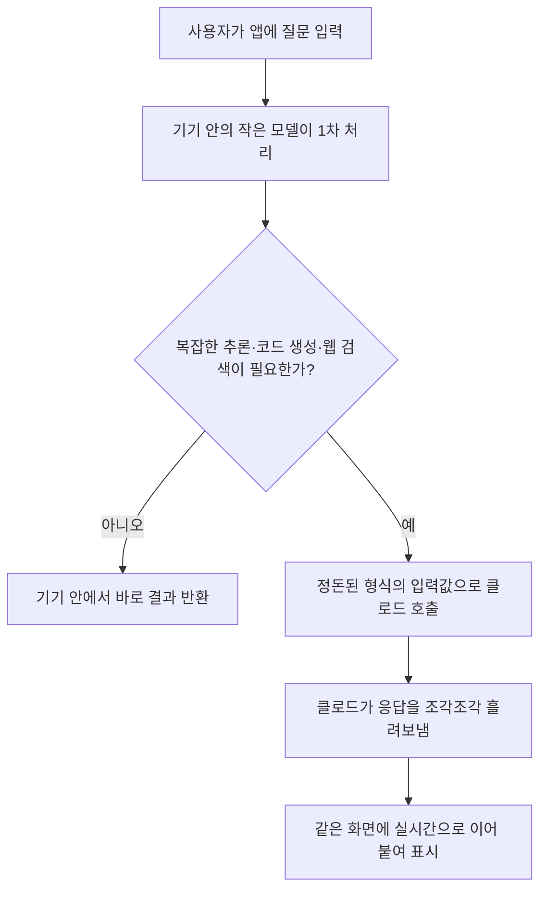

<aside class="ai-knowledge-sidebar">
  
CATEGORIES

  <nav class="ai-cat-tree">

에이전트 오케스트레이션12
<ul><li><a href="https://altjs4510.github.io/ai_news_blog/knowledge/20260708/">2026-07-08Expanding Managed Agents in Gemini API: backgrou…</a></li><li><a href="https://altjs4510.github.io/ai_news_blog/knowledge/20260707/">2026-07-07AI Hero Skills Catalog — 실무 엔지니어를 위한 재사용 가능한 판단 …</a></li><li><a href="https://altjs4510.github.io/ai_news_blog/knowledge/20260705/">2026-07-05openai/codex-plugin-cc — Claude Code에서 Codex를 위임…</a></li><li><a href="https://altjs4510.github.io/ai_news_blog/knowledge/20260701/">2026-07-01Google OKF (Open Knowledge Format) — 벤더 중립 에이전트 …</a></li><li><a href="https://altjs4510.github.io/ai_news_blog/knowledge/20260623/">2026-06-23bytedance/deer-flow — 샌드박스·메모리·서브에이전트·메시지 게이트웨이를…</a></li><li><a href="https://altjs4510.github.io/ai_news_blog/knowledge/20260621/">2026-06-21calesthio/OpenMontage — 12 파이프라인·52 도구·500+ 스킬을 …</a></li><li><a href="https://altjs4510.github.io/ai_news_blog/knowledge/20260611/">2026-06-11The evolution of agentic surfaces: building with…</a></li><li><a href="https://altjs4510.github.io/ai_news_blog/knowledge/20260602/">2026-06-02revfactory/harness — 도메인별 에이전트 팀과 스킬을 자동 설계하는 메타…</a></li><li><a href="https://altjs4510.github.io/ai_news_blog/knowledge/20260529/">2026-05-29Introducing dynamic workflows in Claude Code</a></li><li><a href="https://altjs4510.github.io/ai_news_blog/knowledge/20260520/">2026-05-20New in Claude Managed Agents: self-hosted sandbo…</a></li><li><a href="https://altjs4510.github.io/ai_news_blog/knowledge/20260507/">2026-05-07ruvnet/ruflo — Claude 멀티 에이전트 오케스트레이션 플랫폼</a></li><li><a href="https://altjs4510.github.io/ai_news_blog/knowledge/20260504/">2026-05-04Agents for Everything Else: Codex for Knowledge …</a></li></ul>

MCP &amp; 도구 통합9
<ul><li><a href="https://altjs4510.github.io/ai_news_blog/knowledge/20260618/">2026-06-18DeusData/codebase-memory-mcp — 158개 언어 코드베이스를 밀리…</a></li><li><a href="https://altjs4510.github.io/ai_news_blog/knowledge/20260604/">2026-06-04chopratejas/headroom — Compress tool outputs bef…</a></li><li><a href="https://altjs4510.github.io/ai_news_blog/knowledge/20260603/">2026-06-03How Bad MCP design cost your Agent 5× more token…</a></li><li><a href="https://altjs4510.github.io/ai_news_blog/knowledge/20260526/">2026-05-26colbymchenry/codegraph — Pre-indexed code knowle…</a></li><li><a href="https://altjs4510.github.io/ai_news_blog/knowledge/20260523/">2026-05-23colbymchenry/codegraph — 사전 인덱싱된 코드 지식 그래프 MCP</a></li><li><a href="https://altjs4510.github.io/ai_news_blog/knowledge/20260521/">2026-05-21colbymchenry/codegraph — Pre-indexed code knowle…</a></li><li><a href="https://altjs4510.github.io/ai_news_blog/knowledge/20260519/">2026-05-19Anthropic acquires Stainless</a></li><li><a href="https://altjs4510.github.io/ai_news_blog/knowledge/20260517/">2026-05-17I gave my LLM 100,000+ tools — Lazy Discovery &a…</a></li><li><a href="https://altjs4510.github.io/ai_news_blog/knowledge/20260509/">2026-05-09How to connect 100 MCP servers without the conte…</a></li></ul>

코딩 에이전트10
<ul><li><a href="https://altjs4510.github.io/ai_news_blog/knowledge/20260626/">2026-06-26google-labs-code/design.md — 코딩 에이전트에게 디자인 시스템을 …</a></li><li><a href="https://altjs4510.github.io/ai_news_blog/knowledge/20260619/">2026-06-19Claude Code now supports artifacts</a></li><li><a href="https://altjs4510.github.io/ai_news_blog/knowledge/20260530/">2026-05-30Leonxlnx/taste-skill — AI에게 좋은 취향을 부여해 generic s…</a></li><li><a href="https://altjs4510.github.io/ai_news_blog/knowledge/20260528/">2026-05-28Building self-improving tax agents with Codex</a></li><li><a href="https://altjs4510.github.io/ai_news_blog/knowledge/20260524/">2026-05-24colbymchenry/codegraph — Pre-indexed code knowle…</a></li><li><a href="https://altjs4510.github.io/ai_news_blog/knowledge/20260512/">2026-05-12agentmemory — Persistent memory for AI coding ag…</a></li><li><a href="https://altjs4510.github.io/ai_news_blog/knowledge/20260510/">2026-05-10addyosmani/agent-skills — Production-grade engin…</a></li><li><a href="https://altjs4510.github.io/ai_news_blog/knowledge/20260508/">2026-05-08addyosmani/agent-skills — Production-grade engin…</a></li><li><a href="https://altjs4510.github.io/ai_news_blog/knowledge/20260506/">2026-05-06mksglu/context-mode — AI 코딩 에이전트용 컨텍스트 윈도우 최적화</a></li><li><a href="https://altjs4510.github.io/ai_news_blog/knowledge/20260505/">2026-05-05mattpocock/skills — Skills for Real Engineers (.…</a></li></ul>

모델 &amp; 연구4
<ul><li><a href="https://altjs4510.github.io/ai_news_blog/knowledge/20260620/">2026-06-20zai-org/GLM-5 — From Vibe Coding to Agentic Engi…</a></li><li><a href="https://altjs4510.github.io/ai_news_blog/knowledge/20260617/">2026-06-17Predicting model behavior before release by simu…</a></li><li><a href="https://altjs4510.github.io/ai_news_blog/knowledge/20260516/">2026-05-16STALE — 에이전트가 자기 기억의 유효성을 인지할 수 있는가</a></li><li><a href="https://altjs4510.github.io/ai_news_blog/knowledge/20260513/">2026-05-13Thinking Machines' Native Interaction Models — T…</a></li></ul>

인프라 &amp; 컴퓨트5
<ul><li><a href="https://altjs4510.github.io/ai_news_blog/knowledge/20260630/">2026-06-30Introducing the Claude apps gateway for Amazon B…</a></li><li><a href="https://altjs4510.github.io/ai_news_blog/knowledge/20260610/">2026-06-10Fable 5 just made cost-aware model routing manda…</a></li><li><a href="https://altjs4510.github.io/ai_news_blog/knowledge/20260606/">2026-06-06chopratejas/headroom — Compress tool outputs, lo…</a></li><li><a href="https://altjs4510.github.io/ai_news_blog/knowledge/20260605/">2026-06-05chopratejas/headroom — Compress tool outputs, lo…</a></li><li><a href="https://altjs4510.github.io/ai_news_blog/knowledge/20260522/">2026-05-22Giving Agents Computers — Ivan Burazin, Daytona</a></li></ul>

보안 &amp; 거버넌스10
<ul><li><a href="https://altjs4510.github.io/ai_news_blog/knowledge/20260704/">2026-07-04Cloudflare is about to block AI agents by defaul…</a></li><li><a href="https://altjs4510.github.io/ai_news_blog/knowledge/20260703/">2026-07-03Giving admins more visibility and control over C…</a></li><li><a href="https://altjs4510.github.io/ai_news_blog/knowledge/20260625/">2026-06-25Agent identity in Claude Tag: a new access model…</a></li><li><a href="https://altjs4510.github.io/ai_news_blog/knowledge/20260624/">2026-06-24Agent identity in Claude Tag: a new access model…</a></li><li><a href="https://altjs4510.github.io/ai_news_blog/knowledge/20260614/">2026-06-14NVIDIA/SkillSpector — Security scanner for AI ag…</a></li><li><a href="https://altjs4510.github.io/ai_news_blog/knowledge/20260613/">2026-06-13Fable 5's guardrails got bypassed in 48 hours — …</a></li><li><a href="https://altjs4510.github.io/ai_news_blog/knowledge/20260612/">2026-06-12NVIDIA/SkillSpector — AI 에이전트 스킬용 보안 스캐너</a></li><li><a href="https://altjs4510.github.io/ai_news_blog/knowledge/20260607/">2026-06-07OpenAI Help: Lockdown Mode</a></li><li><a href="https://altjs4510.github.io/ai_news_blog/knowledge/20260531/">2026-05-31How we contain Claude across products</a></li><li><a href="https://altjs4510.github.io/ai_news_blog/knowledge/20260527/">2026-05-27Microsoft Copilot Cowork Exfiltrates Files</a></li></ul>

응용 사례3
<ul><li><a href="https://altjs4510.github.io/ai_news_blog/knowledge/20260609/" class="current">2026-06-09Building intelligent apps for Apple platforms wi…</a></li><li><a href="https://altjs4510.github.io/ai_news_blog/knowledge/20260515/">2026-05-15Clawdmeter — Claude Code 사용량을 데스크톱 대시보드로</a></li><li><a href="https://altjs4510.github.io/ai_news_blog/knowledge/20260514/">2026-05-14Introducing Claude for Small Business</a></li></ul>

산업 동향2
<ul><li><a href="https://altjs4510.github.io/ai_news_blog/knowledge/20260702/">2026-07-02How Cursor deploys AI inside the enterprise (For…</a></li><li><a href="https://altjs4510.github.io/ai_news_blog/knowledge/20260616/">2026-06-16Why AI hasn't replaced software engineers, and w…</a></li></ul>
</nav>
</aside>

<article class="ai-knowledge-article">

<header class="ai-post-hero">
  
<a class="ai-back" href="../">KNOWLEDGE</a> · 2026-06-09 · 오늘의 학습

  <h2 class="ai-post-title">Building intelligent apps for Apple platforms with Claude in the Foundation Models framework</h2>
</header>

> 원문: [Building intelligent apps for Apple platforms with Claude in the Foundation Models framework](https://claude.com/blog/claude-for-foundation-models)

## 📌 학습 정리

### 1. 한 줄로 말하면

애플 기기 안에서 돌아가는 작은 인공지능과, 더 똑똑하지만 인터넷 너머에 있는 클로드(Claude)를 같은 앱 안에서 자연스럽게 번갈아 쓸 수 있게 해주는 연결 통로가 생겼어요.

### 2. 왜 이게 만들어졌어요?

애플은 아이폰·맥 같은 기기 안에 작은 인공지능 모델을 넣어두고, 개발자가 Swift라는 애플 전용 프로그래밍 언어로 쉽게 부를 수 있는 도구를 제공해 왔어요. 이걸 기반 모델 프레임워크(Foundation Models framework)라고 부릅니다. 빠르고 인터넷 없이도 동작해서, 문서 요약이나 일기 앱의 질문 추천처럼 가벼운 작업에는 잘 맞아요.

문제는, 사용자가 갑자기 "지난 몇 달치 일기 전체에서 공통된 흐름을 찾아줘"처럼 깊은 추론이 필요한 요청을 던질 때예요. 기기 안 작은 모델로는 무리고, 그렇다고 개발자가 매번 외부 모델을 직접 붙이는 작업도 번거로웠죠. 그래서 애플의 기존 도구를 그대로 쓰면서, 무거운 요청만 클로드(Claude)로 넘길 수 있는 다리 역할의 묶음(Swift package)이 나왔어요.

### 3. 비유로 풀면

이건 마치 동네 편의점과 대형마트를 한 장의 멤버십 카드로 같이 쓰는 것과 비슷해요. 우유 한 팩 사러 갈 때는 가까운 편의점(기기 안의 작은 모델)이 빠르고, 가구를 사러 갈 때는 대형마트(클로드)로 가야 하잖아요. 사용자 입장에서는 카드 하나로 둘 다 쓰는 셈이고, 어디서 샀는지 신경 쓸 필요가 없어요.

그래서 결국, 사용자에게는 하나의 매끄러운 앱 경험으로 보이지만 뒤에서는 작업의 무게에 따라 적절한 모델이 자동으로 선택되는 구조예요.

### 4. 어떻게 작동하는지 (그림으로)

먼저 사용자가 입력한 내용을 기기 안의 작은 모델이 받아서, 가벼운 작업이면 그 자리에서 처리해요. 더 깊은 사고가 필요한 부분은 이미 형식이 정돈된 데이터(원문 그대로의 사용자 텍스트가 아니라 타입이 지정된 깔끔한 값)로 클로드에게 넘기고, 클로드의 답이 흘러 들어오는 대로 같은 화면에 이어 붙여 보여줍니다.

### 5. 처음 보는 용어 풀이

- **기반 모델 프레임워크 (Foundation Models framework)** — 애플이 만든 도구 묶음으로, 개발자가 Swift 코드 몇 줄만으로 애플의 인공지능 모델을 부를 수 있게 해줘요. 기기 안에서 동작하는 작은 모델에 손쉽게 접근하는 게 핵심이에요.
- **스위프트 패키지 (Swift package)** — Swift 언어로 만든 앱에 갖다 붙일 수 있는 부품 모음. 여기서는 클로드를 호출하는 데 필요한 코드를 미리 정리해 둔 부품이에요.
- **기기 내부 모델 (on-device model)** — 인터넷 서버가 아니라 사용자의 아이폰·맥 같은 기기 안에서 직접 돌아가는 인공지능. 빠르고, 데이터가 기기 밖으로 나가지 않는다는 장점이 있어요.
- **유도 생성 (guided generation)** — 모델에게 "답을 이런 모양으로 만들어줘"라고 형식을 미리 정해 두고 받는 방식. 자유 서술 대신 정해진 칸을 채우게 해서 결과를 다루기 쉽게 만들어요.
- **타입이 지정된 Swift 값 (typed Swift values)** — Swift에서 "이 데이터는 문자열, 저 데이터는 숫자" 식으로 종류가 명확히 정해진 값. 모델이 뱉은 결과가 이렇게 정돈된 형태로 나오면 다음 단계에서 그대로 받아 쓰기 편해요.
- **@Generable 표시 (@Generable annotation)** — 코드에서 "이 데이터 모양대로 모델이 결과를 채워줘"라고 알려주는 표식. 이걸 붙여두면 모델 출력이 자동으로 그 형식에 맞춰 들어와요.
- **스트리밍 (streaming)** — 답을 다 만들 때까지 기다렸다가 한 번에 보여주는 게 아니라, 만들어지는 순서대로 조금씩 흘려보내는 방식. 사용자가 답이 타이핑되듯 떠오르는 걸 볼 수 있어요.
- **도구 호출 (tool calls)** — 모델이 스스로 답하지 못하는 부분을 외부 기능(웹 검색, 코드 실행 등)에 맡기는 동작. 여기서는 클로드가 최신 정보 검색이나 데이터 분석용 코드 실행을 이런 방식으로 처리해요.
- **API 키 (API key)** — 외부 서비스를 부를 때 "이 호출은 누구의 것인지" 증명하는 비밀번호 같은 문자열. 여기서는 Anthropic이 발급하는 키를 앱에 등록해야 클로드를 부를 수 있어요.

### 6. 한 발 더 들어가고 싶다면

- [Claude 개발자 문서](https://platform.claude.com/docs) — 클로드를 코드에서 어떻게 부르는지, 어떤 기능을 쓸 수 있는지 전반적인 사용법을 볼 수 있어요.
- [Opus](https://www.anthropic.com/claude/opus) / [Sonnet](https://www.anthropic.com/claude/sonnet) / [Haiku](https://www.anthropic.com/claude/haiku) — 클로드의 세 가지 모델 라인업 소개. 작업 무게에 따라 어떤 걸 고르면 좋을지 감을 잡는 데 도움이 돼요.
- [API 가격 안내](https://claude.com/pricing#api) — 외부에서 클로드를 부를 때 비용이 어떻게 계산되는지 확인할 수 있어요.
- [Anthropic 블로그](https://claude.com/blog) — 이번 발표 같은 제품 소식과 사용 사례를 계속 따라가기 좋은 출발점이에요.

---

## 📖 원문 전체 번역 (정독용)

> 의역 최소화한 전체 번역입니다. 큰 흐름은 위 정리에서 잡고, 정확한 워딩이 필요할 땐 이 섹션에서 정독하세요.

# Foundation Models 프레임워크에서 Claude로 Apple 플랫폼용 지능형 앱 빌드하기

- **카테고리:** 제품 발표 (Product announcements)
- **제품:** Claude Platform / Claude apps
- **날짜:** 2026년 6월 8일
- **읽기 시간:** 5분

---

오늘 저희는 Apple 개발자들이 Apple의 Foundation Models 프레임워크를 사용하여 더 복잡한 워크플로우를 위해 Claude를 호출할 수 있도록 해주는 새로운 Swift 패키지를 통해, Foundation Models 프레임워크의 Claude 지원을 출시합니다.

Apple의 Foundation Models 프레임워크는 개발자들에게 Swift에서 네이티브로 모델에 접근할 수 있는 기능을 제공합니다. 이 프레임워크는 사용하기 매우 쉬우며, 가이드 생성(guided generation)을 통해 단 세 줄의 코드만으로 타입이 지정된 Swift 값을 반환할 수 있습니다. 개발자들은 이를 활용하여 요약이나 추출과 같은 빠른 로컬 작업에 Apple의 온-디바이스 모델을 활용할 수 있습니다.

이제 개발자들은 Apple의 Foundation Models 프레임워크를 사용하여 요청이 다단계 추론, 코드 생성 등을 필요로 할 때 Claude에게 작업을 넘길 수 있습니다. Claude는 또한 최신 정보를 위해 웹을 검색하고, 데이터 분석을 위해 코드를 실행할 수 있습니다. Claude의 응답을 동일한 뷰로 다시 스트리밍하세요.

Apple의 프레임워크가 `@Generable` 어노테이션을 통해 타입이 지정된 Swift 값을 반환하기 때문에, 개발자들은 가공되지 않은 사용자 텍스트 대신 깔끔한 입력값을 가지고 Claude API 호출에 도달하게 됩니다.

---

## 이것이 열어주는 가능성

Foundation Models 프레임워크는 이미 다양한 지능형 온-디바이스 기능을 구동하고 있습니다 — 개인화된 프롬프트를 제시하는 일기 앱, 계약서를 요약하는 문서 앱, 학생의 수준에 맞게 개념을 설명하는 학습 앱 등이 그 예입니다. Claude를 추가하면 이러한 각각의 패턴이 확장됩니다.

일기 앱은 온-디바이스에서 매일의 프롬프트를 생성한 다음, 수개월치 항목에 걸쳐 공통된 실마리를 찾기 위해 Claude에게 요청할 수 있습니다. 학습 앱은 온-디바이스에서 용어를 정의한 다음, 학생이 "이것이 우리가 배운 모든 것과 왜 관련이 있나요?"라고 후속 질문을 할 때 Claude에게 작업을 넘길 수 있습니다.

사용자에게는 하나의 경험으로 느껴지지만, 각 단계에 맞는 모델이 뒤에서 작동합니다.

---

## 시작하기

Foundation Models 프레임워크를 통한 Claude 지원은 내일부터 사용 가능하며, iOS 27, iPadOS 27, macOS 27, visionOS 27, watchOS 27에서 Apple의 Foundation Models 프레임워크를 통해 작동합니다. 프로젝트에 추가하고, Anthropic API 키로 로그인한 다음, Apple의 온-디바이스에서 나온 타입이 지정된 출력값을 Claude 요청으로 전달하세요 — 패키지가 스트리밍, 도구 호출, 그리고 SwiftUI 뷰로의 구조화된 응답 반환을 처리합니다.

</article>

<!-- ai-related-links -->
<aside class="ai-related-links">
  
관련 학습

  <ul><li><a href="https://altjs4510.github.io/ai_news_blog/knowledge/20260529/">2026-05-29Introducing dynamic workflows in Claude Code</a></li><li><a href="https://altjs4510.github.io/ai_news_blog/knowledge/20260520/">2026-05-20New in Claude Managed Agents: self-hosted sandbo…</a></li><li><a href="https://altjs4510.github.io/ai_news_blog/knowledge/20260507/">2026-05-07ruvnet/ruflo — Claude 멀티 에이전트 오케스트레이션 플랫폼</a></li></ul>
</aside>
<!-- /ai-related-links -->
