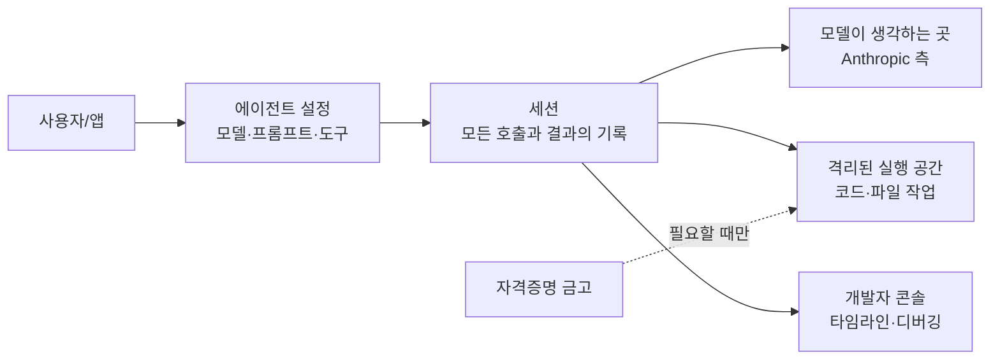

<aside class="ai-knowledge-sidebar">
  
CATEGORIES

  <nav class="ai-cat-tree">

에이전트 오케스트레이션6
<ul><li><a href="https://altjs4510.github.io/ai_news_blog/knowledge/20260623/">2026-06-23bytedance/deer-flow — 샌드박스·메모리·서브에이전트·메시지 게이트웨이를…</a></li><li><a href="https://altjs4510.github.io/ai_news_blog/knowledge/20260621/">2026-06-21calesthio/OpenMontage — 12 파이프라인·52 도구·500+ 스킬을 …</a></li><li><a href="https://altjs4510.github.io/ai_news_blog/knowledge/20260611/" class="current">2026-06-11The evolution of agentic surfaces: building with…</a></li><li><a href="https://altjs4510.github.io/ai_news_blog/knowledge/20260602/">2026-06-02revfactory/harness — 도메인별 에이전트 팀과 스킬을 자동 설계하는 메타…</a></li><li><a href="https://altjs4510.github.io/ai_news_blog/knowledge/20260529/">2026-05-29Introducing dynamic workflows in Claude Code</a></li><li><a href="https://altjs4510.github.io/ai_news_blog/knowledge/20260507/">2026-05-07ruvnet/ruflo — Claude 멀티 에이전트 오케스트레이션 플랫폼</a></li></ul>

MCP &amp; 도구 통합15
<ul><li><a href="https://altjs4510.github.io/ai_news_blog/knowledge/20260722/">2026-07-22tirth8205/code-review-graph — MCP·CLI용 로컬 우선 코드 …</a></li><li><a href="https://altjs4510.github.io/ai_news_blog/knowledge/20260721/">2026-07-21tirth8205/code-review-graph — 로컬 우선 코드 인텔리전스 그래프…</a></li><li><a href="https://altjs4510.github.io/ai_news_blog/knowledge/20260719/">2026-07-19tirth8205/code-review-graph — 로컬 우선 코드 인텔리전스 그래프…</a></li><li><a href="https://altjs4510.github.io/ai_news_blog/knowledge/20260709/">2026-07-09mvanhorn/last30days-skill — Reddit·X·YouTube·HN·…</a></li><li><a href="https://altjs4510.github.io/ai_news_blog/knowledge/20260708/">2026-07-08Expanding Managed Agents in Gemini API: backgrou…</a></li><li><a href="https://altjs4510.github.io/ai_news_blog/knowledge/20260618/">2026-06-18DeusData/codebase-memory-mcp — 158개 언어 코드베이스를 밀리…</a></li><li><a href="https://altjs4510.github.io/ai_news_blog/knowledge/20260606/">2026-06-06chopratejas/headroom — Compress tool outputs, lo…</a></li><li><a href="https://altjs4510.github.io/ai_news_blog/knowledge/20260605/">2026-06-05chopratejas/headroom — Compress tool outputs, lo…</a></li><li><a href="https://altjs4510.github.io/ai_news_blog/knowledge/20260604/">2026-06-04chopratejas/headroom — Compress tool outputs bef…</a></li><li><a href="https://altjs4510.github.io/ai_news_blog/knowledge/20260603/">2026-06-03How Bad MCP design cost your Agent 5× more token…</a></li><li><a href="https://altjs4510.github.io/ai_news_blog/knowledge/20260523/">2026-05-23colbymchenry/codegraph — 사전 인덱싱된 코드 지식 그래프 MCP</a></li><li><a href="https://altjs4510.github.io/ai_news_blog/knowledge/20260519/">2026-05-19Anthropic acquires Stainless</a></li><li><a href="https://altjs4510.github.io/ai_news_blog/knowledge/20260517/">2026-05-17I gave my LLM 100,000+ tools — Lazy Discovery &a…</a></li><li><a href="https://altjs4510.github.io/ai_news_blog/knowledge/20260509/">2026-05-09How to connect 100 MCP servers without the conte…</a></li><li><a href="https://altjs4510.github.io/ai_news_blog/knowledge/20260506/">2026-05-06mksglu/context-mode — AI 코딩 에이전트용 컨텍스트 윈도우 최적화</a></li></ul>

코딩 에이전트15
<ul><li><a href="https://altjs4510.github.io/ai_news_blog/knowledge/20260718/">2026-07-18tirth8205/code-review-graph — MCP·CLI용 로컬 코드 인텔리…</a></li><li><a href="https://altjs4510.github.io/ai_news_blog/knowledge/20260714/">2026-07-14Graphify-Labs/graphify — 코드베이스를 질의 가능한 지식 그래프로 만…</a></li><li><a href="https://altjs4510.github.io/ai_news_blog/knowledge/20260707/">2026-07-07AI Hero Skills Catalog — 실무 엔지니어를 위한 재사용 가능한 판단 …</a></li><li><a href="https://altjs4510.github.io/ai_news_blog/knowledge/20260705/">2026-07-05openai/codex-plugin-cc — Claude Code에서 Codex를 위임…</a></li><li><a href="https://altjs4510.github.io/ai_news_blog/knowledge/20260626/">2026-06-26google-labs-code/design.md — 코딩 에이전트에게 디자인 시스템을 …</a></li><li><a href="https://altjs4510.github.io/ai_news_blog/knowledge/20260619/">2026-06-19Claude Code now supports artifacts</a></li><li><a href="https://altjs4510.github.io/ai_news_blog/knowledge/20260530/">2026-05-30Leonxlnx/taste-skill — AI에게 좋은 취향을 부여해 generic s…</a></li><li><a href="https://altjs4510.github.io/ai_news_blog/knowledge/20260528/">2026-05-28Building self-improving tax agents with Codex</a></li><li><a href="https://altjs4510.github.io/ai_news_blog/knowledge/20260526/">2026-05-26colbymchenry/codegraph — Pre-indexed code knowle…</a></li><li><a href="https://altjs4510.github.io/ai_news_blog/knowledge/20260524/">2026-05-24colbymchenry/codegraph — Pre-indexed code knowle…</a></li><li><a href="https://altjs4510.github.io/ai_news_blog/knowledge/20260521/">2026-05-21colbymchenry/codegraph — Pre-indexed code knowle…</a></li><li><a href="https://altjs4510.github.io/ai_news_blog/knowledge/20260512/">2026-05-12agentmemory — Persistent memory for AI coding ag…</a></li><li><a href="https://altjs4510.github.io/ai_news_blog/knowledge/20260510/">2026-05-10addyosmani/agent-skills — Production-grade engin…</a></li><li><a href="https://altjs4510.github.io/ai_news_blog/knowledge/20260508/">2026-05-08addyosmani/agent-skills — Production-grade engin…</a></li><li><a href="https://altjs4510.github.io/ai_news_blog/knowledge/20260505/">2026-05-05mattpocock/skills — Skills for Real Engineers (.…</a></li></ul>

모델 &amp; 연구5
<ul><li><a href="https://altjs4510.github.io/ai_news_blog/knowledge/20260716-proprag/">2026-07-16PropRAG — 프로포지션 경로 위 beam search로 멀티홉 검색 안내</a></li><li><a href="https://altjs4510.github.io/ai_news_blog/knowledge/20260620/">2026-06-20zai-org/GLM-5 — From Vibe Coding to Agentic Engi…</a></li><li><a href="https://altjs4510.github.io/ai_news_blog/knowledge/20260617/">2026-06-17Predicting model behavior before release by simu…</a></li><li><a href="https://altjs4510.github.io/ai_news_blog/knowledge/20260516/">2026-05-16STALE — 에이전트가 자기 기억의 유효성을 인지할 수 있는가</a></li><li><a href="https://altjs4510.github.io/ai_news_blog/knowledge/20260513/">2026-05-13Thinking Machines' Native Interaction Models — T…</a></li></ul>

인프라 &amp; 컴퓨트3
<ul><li><a href="https://altjs4510.github.io/ai_news_blog/knowledge/20260630/">2026-06-30Introducing the Claude apps gateway for Amazon B…</a></li><li><a href="https://altjs4510.github.io/ai_news_blog/knowledge/20260522/">2026-05-22Giving Agents Computers — Ivan Burazin, Daytona</a></li><li><a href="https://altjs4510.github.io/ai_news_blog/knowledge/20260520/">2026-05-20New in Claude Managed Agents: self-hosted sandbo…</a></li></ul>

보안 &amp; 거버넌스13
<ul><li><a href="https://altjs4510.github.io/ai_news_blog/knowledge/20260716/">2026-07-16Dicklesworthstone/destructive_command_guard — 에이…</a></li><li><a href="https://altjs4510.github.io/ai_news_blog/knowledge/20260715/">2026-07-15Dicklesworthstone/destructive_command_guard — 에이…</a></li><li><a href="https://altjs4510.github.io/ai_news_blog/knowledge/20260710/">2026-07-1070개 MCP 서버 strace 런타임 감사 — 부팅 시 아웃바운드 호출 서버 적발</a></li><li><a href="https://altjs4510.github.io/ai_news_blog/knowledge/20260704/">2026-07-04Cloudflare is about to block AI agents by defaul…</a></li><li><a href="https://altjs4510.github.io/ai_news_blog/knowledge/20260703/">2026-07-03Giving admins more visibility and control over C…</a></li><li><a href="https://altjs4510.github.io/ai_news_blog/knowledge/20260625/">2026-06-25Agent identity in Claude Tag: a new access model…</a></li><li><a href="https://altjs4510.github.io/ai_news_blog/knowledge/20260624/">2026-06-24Agent identity in Claude Tag: a new access model…</a></li><li><a href="https://altjs4510.github.io/ai_news_blog/knowledge/20260614/">2026-06-14NVIDIA/SkillSpector — Security scanner for AI ag…</a></li><li><a href="https://altjs4510.github.io/ai_news_blog/knowledge/20260613/">2026-06-13Fable 5's guardrails got bypassed in 48 hours — …</a></li><li><a href="https://altjs4510.github.io/ai_news_blog/knowledge/20260612/">2026-06-12NVIDIA/SkillSpector — AI 에이전트 스킬용 보안 스캐너</a></li><li><a href="https://altjs4510.github.io/ai_news_blog/knowledge/20260607/">2026-06-07OpenAI Help: Lockdown Mode</a></li><li><a href="https://altjs4510.github.io/ai_news_blog/knowledge/20260531/">2026-05-31How we contain Claude across products</a></li><li><a href="https://altjs4510.github.io/ai_news_blog/knowledge/20260527/">2026-05-27Microsoft Copilot Cowork Exfiltrates Files</a></li></ul>

응용 사례5
<ul><li><a href="https://altjs4510.github.io/ai_news_blog/knowledge/20260717/">2026-07-17After a year building agent memory, 'save everyt…</a></li><li><a href="https://altjs4510.github.io/ai_news_blog/knowledge/20260712/">2026-07-12Do Automated Evals Work?</a></li><li><a href="https://altjs4510.github.io/ai_news_blog/knowledge/20260609/">2026-06-09Building intelligent apps for Apple platforms wi…</a></li><li><a href="https://altjs4510.github.io/ai_news_blog/knowledge/20260515/">2026-05-15Clawdmeter — Claude Code 사용량을 데스크톱 대시보드로</a></li><li><a href="https://altjs4510.github.io/ai_news_blog/knowledge/20260514/">2026-05-14Introducing Claude for Small Business</a></li></ul>

산업 동향6
<ul><li><a href="https://altjs4510.github.io/ai_news_blog/knowledge/20260711/">2026-07-11OpenAI says GPT 5.6 is the 'preferred model' for…</a></li><li><a href="https://altjs4510.github.io/ai_news_blog/knowledge/20260702/">2026-07-02How Cursor deploys AI inside the enterprise (For…</a></li><li><a href="https://altjs4510.github.io/ai_news_blog/knowledge/20260701/">2026-07-01Google OKF (Open Knowledge Format) — 벤더 중립 에이전트 …</a></li><li><a href="https://altjs4510.github.io/ai_news_blog/knowledge/20260616/">2026-06-16Why AI hasn't replaced software engineers, and w…</a></li><li><a href="https://altjs4510.github.io/ai_news_blog/knowledge/20260610/">2026-06-10Fable 5 just made cost-aware model routing manda…</a></li><li><a href="https://altjs4510.github.io/ai_news_blog/knowledge/20260504/">2026-05-04Agents for Everything Else: Codex for Knowledge …</a></li></ul>
</nav>
</aside>

<article class="ai-knowledge-article">

<header class="ai-post-hero">
  
<a class="ai-back" href="../">KNOWLEDGE</a> · 2026-06-11 · 오늘의 학습

  <h2 class="ai-post-title">The evolution of agentic surfaces: building with Claude Managed Agents</h2>
</header>

> 원문: [The evolution of agentic surfaces: building with Claude Managed Agents](https://claude.com/blog/building-with-claude-managed-agents)

## 📌 학습 정리

### 1. 한 줄로 말하면

복잡한 인공지능 비서(에이전트)를 직접 처음부터 깔고 운영하지 않아도 되도록, Anthropic이 실행 환경·자격증명·기록 관리 같은 뒷단을 통째로 맡아주는 서비스예요.

### 2. 왜 이게 만들어졌어요?

처음 Claude를 개발자에게 열었을 때(2023년) 인터페이스는 아주 단순했어요. 입력을 넣으면 답이 한 번 돌아오는 구조라, 문서 요약이나 분류 같은 "한 번에 끝나는 일"에는 충분했죠. 그런데 사람들이 점점 "여러 단계를 거쳐 스스로 도구를 쓰고, 결과를 보고, 다음 행동을 결정하는" 일을 맡기고 싶어 하면서 문제가 생겼어요. 이런 일을 시키려면 모델에게 도구를 호출하게 하고, 결과를 다시 넣어주고, 반복하는 루프(loop)를 직접 만들어야 했고, 거기에 더해 어디서 코드를 실행할지·자격증명은 어떻게 보관할지·세션은 어떻게 이어붙일지까지 전부 팀이 떠안아야 했죠. 이런 운영 인프라 작업에 시간이 너무 많이 빨려 들어가는 패턴을 반복적으로 보고, Anthropic이 그 부분을 대신 떠맡는 [Claude Managed Agents](https://platform.claude.com/docs/en/managed-agents/overview)를 만들었어요.

### 3. 비유로 풀면

이건 마치 **요리사와 주방을 분리한 식당** 같은 거예요. 예전 방식에서는 요리사(모델)와 주방(코드 실행 공간)이 같은 방에 있었는데, 그러다 보니 손님 정보(자격증명)도 그 방 안에 같이 있어서 위험했고, 주방 불을 켜는 동안 요리사도 가만히 기다려야 했죠. Managed Agents는 요리사를 따로 두고, 주문이 오면 주방은 따로 준비를 시작하게 만들어요. 요리사는 바로 생각하기 시작하고, 손님 카드 정보는 금고(별도의 자격증명 저장소)에 두니 주방에 흘러 들어가지 않아요.

그래서 결국, **"모델이 생각하는 곳"과 "도구가 실제로 실행되는 곳"을 떼어놓는 것**이 이 서비스의 핵심 아이디어예요.

### 4. 어떻게 작동하는지 (그림으로)

흐름은 이래요. 사용자가 요청을 보내면 미리 정의해둔 **에이전트(agent)** 설정이 작동하기 시작하고, 모든 모델 호출·도구 호출·결과는 **세션(session)**이라는 기록에 차곡차곡 쌓여요. 모델은 한쪽에서 추론을 시작하고, 코드 실행이 필요하면 별도의 격리된 공간에서 진행되며, 자격증명은 필요한 순간에만 금고에서 꺼내 써요. 세션이 그대로 로그가 되니, 중간에 멈췄다 이어서 하거나 나중에 한 단계씩 되짚어 보는 일이 자연스럽게 가능해져요.

### 5. 처음 보는 용어 풀이

- **에이전트 (agent)** — 모델 혼자 답하는 게 아니라, 도구를 쓰고 결과를 보고 다음 행동을 스스로 정하면서 일을 끝까지 끌고 가는 형태의 인공지능 작업 방식이에요.
- **에이전트 골격/하네스 (agent harness)** — 모델 주변을 둘러싼 운영 코드예요. "모델한테 뭘 할지 묻고 → 도구 실행 → 결과를 다시 넣어주고 → 반복"하는 루프와, 컨텍스트 관리·하위 에이전트 호출 같은 잡일을 처리해요.
- **샌드박스 (sandbox)** — 모델이 만든 코드를 실제로 돌려보는 격리된 공간이에요. 문제가 생겨도 다른 시스템에 피해가 번지지 않도록 울타리를 친 작업장이라고 보면 돼요.
- **세션 (session)** — 한 번의 작업 실행을 처음부터 끝까지 기록한 이벤트 묶음이에요. 모델이 무슨 호출을 했고, 어떤 도구가 어떤 결과를 돌려줬는지가 시간순으로 쌓여요.
- **자격증명 금고 (Vaults)** — API 토큰 같은 민감한 접근 정보를 모델 작업 공간에서 떨어뜨려 따로 보관해두는 저장소예요. 필요할 때만 꺼내 쓰는 식이라, 모델이 만든 코드가 토큰을 직접 보지 못하게 막아줘요.
- **모델 컨텍스트 프로토콜 (MCP, Model Context Protocol)** — 외부 도구·데이터 소스를 모델에 연결할 때 쓰는 표준 통로예요. Managed Agents는 사내망 안에 있는 MCP 서버까지 안전하게 닿게 해주는 **MCP 터널(MCP tunnels)**도 제공해요.
- **컨텍스트 불안 (context anxiety)** — 모델이 사용 가능한 문맥 길이가 끝나갈 때 쫓기듯 일을 서둘러 마치는 행동 패턴이에요. 모델 버전이 바뀌면 이런 버릇도 바뀌기 때문에, 골격을 모델에 맞춰 계속 손봐야 한다는 점을 잘 보여주는 사례예요.
- **드리밍 (Dreaming)** — 세션 기록과 메모리를 주기적으로 훑어 패턴을 뽑아내고, 다음 실행 때 더 잘하도록 기억을 정리해두는 백그라운드 작업이에요.

### 6. 한 발 더 들어가고 싶다면

- [Claude Managed Agents 개요 문서](https://platform.claude.com/docs/en/managed-agents/overview) — 에이전트·환경·세션이라는 세 가지 기본 구성 요소가 어떻게 맞물리는지 공식 문서로 정리되어 있어요.
- [Managed Agents 엔지니어링 글: 두뇌와 손의 분리](https://www.anthropic.com/engineering/managed-agents) — 왜 모델 추론과 코드 실행을 떼어놓는 구조가 보안·지연 시간 면에서 유리한지 설계 관점으로 풀어줘요.
- [장시간 실행 앱을 위한 하네스 설계](https://www.anthropic.com/engineering/harness-design-long-running-apps) — "컨텍스트 불안" 같은 모델 행동 변화에 골격이 어떻게 적응해야 하는지 사례 중심으로 보여줘요.
- [Claude Agent SDK 문서](https://code.claude.com/docs/en/agent-sdk/overview) — Managed Agents 이전 단계, 즉 직접 골격을 가져다 쓰면서도 Claude Code의 검증된 기반 위에서 에이전트를 만드는 방법을 알 수 있어요.
- [자체 호스팅 샌드박스](https://platform.claude.com/docs/en/managed-agents/self-hosted-sandboxes) / [MCP 터널](https://platform.claude.com/docs/en/agents-and-tools/mcp-tunnels/overview) — 코드 실행과 내부망 연결을 자체 환경 안에 묶어두고 싶을 때 어떤 선택지가 있는지 확인할 수 있어요.

---

## 📖 원문 전체 번역 (정독용)

> 의역 최소화한 전체 번역입니다. 큰 흐름은 위 정리에서 잡고, 정확한 워딩이 필요할 땐 이 섹션에서 정독하세요.

# 에이전틱 서피스의 진화: Claude Managed Agents로 구축하기

에이전트를 프로덕션에 올리는 일은 좋은 프롬프트 하나로 끝나지 않는다. 에이전트가 작성한 코드를 실행할 공간, 데이터에 접근하기 위한 자격 증명, 관찰 가능한 세션, 그리고 사용량에 따라 확장되는 인프라가 필요하다. Applied AI 팀은 제품, 연구, 그리고 Claude 위에서 구축하는 고객들이 만나는 지점에서 일하며, 동일한 패턴을 반복해서 목격한다. 인프라야말로 프로토타입과 프로덕션 에이전트를 가르는 요소다. 너무나 자주, 팀들은 보안, 상태 관리, 권한 부여, 하니스 튜닝에 개발 사이클을 소진한다.

[Claude Managed Agents](https://platform.claude.com/docs/en/managed-agents/overview)는 프로덕션급 에이전트를 구축하고 배포하기 위한 조합 가능한 API 모음으로, 성능에 맞게 튜닝된 에이전트 하니스와 프로덕션 인프라를 결합해 팀이 수개월이 아닌 수일 안에 프로토타입에서 런칭까지 도달할 수 있게 한다. 이 글에서는 Anthropic의 에이전틱 빌딩 블록이 어떻게 진화해왔는지, 왜 Claude Managed Agents를 구축했는지, 그리고 팀들이 오늘날 프로덕션에서 어떻게 활용하고 있는지를 다룬다.

## **에이전트 아키텍처의 진화**

2023년에 개발자들에게 Claude를 공개했을 때, API는 의도적으로 단순하게 설계되었다. 토큰을 넣으면 토큰이 나왔다. 프롬프트를 보내면 Claude가 완성을 반환하고, 하니스와 기반 인프라는 개발자가 직접 구축했다.

API는 수년에 걸쳐 꾸준히 풍부해졌지만, 그 아래의 계약은 변하지 않았다. 요청 하나, 모델 턴 하나, 그리고 다음에 무슨 일이 일어날지는 애플리케이션이 결정한다. 오랫동안 그것으로 충분했다. 문서를 요약하거나, 지원 티켓을 분류하거나, 텍스트 블록을 재작성하는 일—단일 턴에 무리 없이 맞아떨어지는 종류의 작업들이었다.

그러나 시간이 지나면서, 사람들이 맡기고 싶어 하는 작업들이 더 이상 맞아떨어지지 않게 되었다. 그들은 Claude가 작업을 처음부터 끝까지 완수하고, 무언가를 조회하고, 그에 따라 행동하고, 무엇이 바뀌었는지 확인하고, 다음에 무엇을 해야 할지 결정하길 원했다. 그리고 코드베이스, 내부 위키, 티켓 시스템 같이 업무가 이미 돌아가고 있는 시스템들 _안에서_ 동작하길 원했다.

API로 Claude를 에이전트로 만들려면 자체 루프를 구축해야 했다. 모델에 무엇을 할지 물어보고, 도구를 실행하고, 결과를 다시 피드백하고, 반복한다. 개발자가 에이전트 스캐폴딩을 구축하고 배포해야 했으며, 이는 모델이 진화함에 따라 튜닝이 필요할 수 있었다. 완전한 커스터마이징이 필요한 에이전트에는 이 접근 방식이 맞다. 그러나 더 예측 가능하고 덜 복잡한 에이전틱 워크로드의 경우, 모델과 제품이 진화함에 따라 하니스를 최적화하는 작업이 번거로워졌다.

[Claude Code](https://code.claude.com/docs/en/overview)는 2025년에 출시된 에이전틱 코딩 도구로, Claude가 코드베이스와 직접 상호작용할 수 있게 하며, 자체적인 하니스 버전을 포함했다. 루프, 도구 실행, 서브에이전트, 컨텍스트 관리, 그리고 효과적인 에이전트로 만들어주는 풍부한 기능들이 그 안에 있었다. 개발자들은 자연스럽게 다양한 도메인에서 자신의 에이전트에 유사한 하니스 기계를 원했다.

Claude Code 하니스 위에서 에이전트를 구축할 수 있도록, 우리는 [Claude Agent SDK](https://code.claude.com/docs/en/agent-sdk/overview)를 출시했다. Claude Agent SDK는 개발자들이 자체 제작 루프를 유지하는 대신, Claude Code를 구동하는 것과 동일한 기계 위에서 에이전트를 구축할 수 있는 도구를 제공한다. 많은 팀에게 이것은 에이전트가 실용적으로 된 순간이었다. 하니스는 인프라 프리미티브와 함께 Claude에 맞게 이미 튜닝된 채로 등장했고, Claude Code가 발전함에 따라 계속 개선되었다.

그러나 하니스가 있어도 프로덕션 환경에서 에이전트를 배포하는 것은 여러 이유로 어려울 수 있다.

*   **호스팅과 확장.** 에이전트는 어디서 실행되고, 수시간이 걸리는 작업을 위해 프로세스가 얼마나 오래 살아있을 수 있으며, 사용량이 늘어나면 무엇이 확장해주는가?
*   **세션 관리.** 에이전트의 기록과 진행 상황은 어디에 저장되는가? 실행이 중단을 견디고 방해 없이 재개될 수 있는가? 이전 세션에서 무슨 일이 있었는지 돌아보고 검사할 수 있는가?
*   **파일시스템 관리.** 실제 작업을 한다는 것은 아티팩트를 생성하는 것을 의미한다. 코드 편집, 파일 작성, 출력물 생성. 에이전트가 작업할 워크스페이스는 어디서 얻으며, 실행 사이에 그 워크스페이스는 어떻게 되는가?
*   **실행 격리.** Claude가 작성한 코드는 어딘가에서 실행되어야 한다. 코드가 잘못되었을 때의 피해 범위는 어떻게 되며, 프로덕션에서 실제로 신뢰할 수 있는 경계는 무엇인가?
*   **자격 증명.** 에이전트는 시스템에 접근해야 한다. 에이전트가 생성하는 코드에 독점 정보를 노출하지 않으면서 어떻게 그 접근 권한을 얻는가?
*   **관찰 가능성.** 에이전트가 한 시간 동안 자율적으로 작동하다가 예상치 못한 일을 했을 때, 그것이 취한 모든 단계를 재구성할 수 있는가?

Agent SDK를 통해, 앞서 언급한 프로덕션 인프라의 많은 요소들이 Claude Code의 기계를 통해 제공된다. 에이전트는 작업할 실제 파일시스템을 갖게 되고, 세션 상태는 로컬 또는 외부 스토리지에 지속되며, 관찰 가능성은 이미 운영 중인 모니터링 스택으로 OpenTelemetry를 통해 내보낼 수 있다.

그러나 팀들이 에이전트를 로컬 개발에서 프로덕션으로 점점 더 이동시킴에 따라, 규모에 맞게 배포하고 관리되는 인프라를 갖출 방법이 필요해졌다. 그리고 모델과 그것을 둘러싼 하니스가 더 발전함에 따라—더 오래 실행되고, 더 많은 코드를 실행하고, 더 많은 시스템을 다루고, 더 많은 액션을 취하면서—확장, 보안, 샌드박싱이 더욱 어려워졌다.

이러한 장애물 중 여러 가지는 공통적인 아키텍처 선택에서 비롯된다. 에이전트 하니스는 종종 작업하는 파일시스템과 _동일한 컨테이너 안에서_ 실행된다. Claude가 생각하기 전에 컨테이너가 기동되어야 하고(시작 비용을 치름), 에이전트와 코드 실행이 자격 증명 바로 옆에 있으며, 컨테이너가 죽으면 실행도 함께 죽는다.

Managed Agents는 [두뇌와 손을 분리](https://www.anthropic.com/engineering/managed-agents)함으로써 이 문제들을 해결한다. Claude를 호출하는 하니스는 코드가 실행되는 샌드박스와 별도로 실행되며, 세션—모든 모델 호출, 도구 호출, 결과의 추가 전용 로그—이 두 가지를 연결한다. Claude는 컨테이너가 존재하기 전에 추론을 시작할 수 있고, 샌드박스는 자격 증명과 멀리 떨어져 있으며, 전체 실행은 언제든지 세션에서 재구성될 수 있다.

## **Claude Managed Agents를 사용할 때와 이유**

Managed Agents로 구축할 때, 사용자는 작업, 도구, 가드레일을 정의하고, Anthropic이 자체 인프라에서 에이전트를 실행하며 아래의 에이전틱 루프를 처리한다. 에이전트에게 도구를 호출할 실행 환경을 제공하는 방법, 무언가 실패했을 때 복구하는 방법, 멀티에이전트 오케스트레이션 등이 포함된다.

하니스가 모델 지능과 함께 진화하지 않으면 [에이전트는 고장난다](https://www.anthropic.com/engineering/harness-design-long-running-apps). Claude Sonnet 4.5에서, 에이전트는 컨텍스트 한도에 가까워지면 서두르며 작업을 마치려 했고, 남은 공간을 활용하는 대신 작업을 중간에 끊었다—"컨텍스트 불안 (context anxiety)"이라 불리는 패턴이었다. 우리의 해결책은 하니스에 컨텍스트 리셋을 추가하는 것이었고, Claude가 한도 근처에서 일관성을 유지하는 데 도움이 필요하다는 가정을 내장했다. 그 가정은 다음 모델에서 살아남지 못했다. Claude Opus 4.5에서는 그 동작이 사라졌고, 우리가 추가한 리셋은 그저 오버헤드가 되었다.

대부분의 조직에게, 하니스를 유지하는 것은 제품을 차별화하지 못하는 오버헤드다. 하니스는 특정 모델 동작에 맞게 튜닝되어야 하며, 컴팩션, 도구 실행, 캐싱 같은 프리미티브는 다른 모델에서와 달리 Claude에서 다르게 작동한다. Claude Managed Agents를 사용하면, 하니스가 모델과 함께 진화하므로 팀은 에이전트를 차별화할 것에 집중할 수 있다. **컨텍스트 관리와 도메인 전문성이 바로 그것이다.**

효과적인 에이전트를 구축하는 데 필요한 컨텍스트와 도구를 개발자가 설정할 수 있도록, Managed Agents는 세 가지 주요 리소스를 중심으로 구축된다. 에이전트 (agent), 환경 (environment), 세션 (session)이다. _에이전트_는 구성이다. 모델, 프롬프트, 도구 집합, 그리고 그것을 둘러싼 가드레일이다. _환경_은 에이전트가 실행되는 실행 컨텍스트다. 샌드박스 컨테이너, 네트워킹 규칙, 사전 설치된 패키지로, 우리 클라우드 또는 개발자가 관리하는 인프라에 호스팅된다. 각 실행은 _세션_으로, 에이전트와 환경을 결합하여 격리된 샌드박스 인스턴스를 받는다. 세션은 전체 이벤트 기록, 샌드박스 상태, 출력물을 서버 측에 지속시키므로, 장기 실행 작업이 일시 중지되고 깔끔하게 재개될 수 있으며, 사후에 단계별로 추적될 수 있다. Managed Agents를 사용하면, 에이전트와 환경을 한 번 정의한 다음 워크로드가 증가함에 따라 동일한 구성에 대해 많은 세션을 실행할 수 있다.

.png)

## **Managed Agents에서 프로덕션과 규모를 위해 구축하기**

Applied AI 내에서, 우리는 에이전트가 Anthropic 내부와 고객 시스템 전반에 걸쳐 프로토타입에서 프로덕션으로 전환되는 것을 목격한다. 코딩, 금융, 지원, 법률, 그리고 수십 가지 다른 도메인에서. 이를 통해 우리는 데모와 프로덕션 준비 에이전트를 구분하는 것이 무엇인지, 그리고 팀들이 자주 막히는 곳이 어디인지 명확하게 볼 수 있다.

아래에, Claude Managed Agents 같은 관리 서비스 위에서 구축해야 하는 가장 일반적인 이유를 공유한다.

**1. 자격 증명은 샌드박스 밖에 보관된다.** 모든 것이 하나의 컨테이너에서 실행될 때, Claude가 생성하는 코드가 자격 증명 바로 옆에 위치하므로, 프롬프트 인젝션이 모델을 설득하여 자체 환경을 읽게 함으로써 토큰을 유출하도록 이끌 수 있다. 동일한 컨테이너 내에 강력한 가드레일을 설정하여 이를 방지할 수 있지만, 아키텍처를 분리하면 샌드박스에서 자격 증명을 완전히 제거함으로써 훨씬 더 안전한 접근 방식을 가능하게 한다. MCP, CLI, GitHub 리포지토리와 같은 도구의 토큰은 별도의 볼트에 보관되며, 프록시가 온디맨드로만 가져와 복호화한다. Managed Agents는 [Vaults](https://platform.claude.com/docs/en/managed-agents/vaults)를 기본으로 제공하므로, 자체 시크릿 스토어를 운영하거나, 매 호출마다 토큰을 전송하거나, 에이전트가 어떤 최종 사용자를 대신해 행동했는지 놓치는 일이 없다. Vault 자격 증명은 저장 전에 봉투 암호화로 보호되며, 검색에는 검증을 위한 서명된 요청 토큰이 필요하다.

.png)

**2. 샌드박스 오버헤드 제거로 낮아진 지연 시간.** 지연 시간은 많은 엔터프라이즈 팀이 최우선으로 여기는 지표다. 사용자들은 Claude의 응답을 기다리는 것을 예민하게 느끼기 때문이다. Managed Agents 아키텍처가 없으면, 에이전트가 생각만 하고 도구를 실행하지 않는 세션에서도 모든 세션마다 컨테이너가 기동되어야 한다. 그 설정 시간은 낭비이며, 사용자는 첫 번째 응답 전의 지연으로 느낀다. Managed Agents를 사용하면, Claude가 즉시 추론을 시작하는 동안 환경이 병렬로 기동되며, 도구를 실행하지 않는 세션은 컨테이너를 완전히 건너뛴다. 이는 사용자가 컨테이너 시작을 기다리지 않고 첫 번째 토큰을 보게 되며, 에이전트가 무언가를 실행해야 할 때쯤에는 환경이 준비되어 있다는 것을 의미한다. 우리의 테스트에서, 이는 중간값 (p50)에서 첫 번째 토큰까지의 시간을 약 60%, 가장 느린 경우 (p95)에서는 90% 이상 단축했다.

**3. 세션 관리, 관찰 가능성, 메모리를 가능하게 하는 신뢰할 수 있고 지속적인 세션.** 요청/응답 대신, Managed Agents는 _이벤트_ 단위로 생각한다. 세션은 지속적인 이벤트 스트림이다. 모든 모델 호출, 도구 호출, 결과가 에이전트를 실행하는 프로세스 외부에 존재하는 로그에 추가된다. 이 아키텍처를 통해, 에이전트가 작동하는 동안 이벤트가 스트리밍되면서 실시간 업데이트를 받고, 관리할 데이터베이스나 저장 지점 없이 나중에 어떤 세션이든 재개할 수 있다. 세션을 삭제하지 않는 한 상호작용 간에 기록이 보존되며, 세션이 유휴 상태가 되면 컨테이너가 체크포인트되어 일시 중지된 지점에서 깔끔하게 재개할 수 있다. 그리고 전체 실행이 이미 이벤트 레코드이므로, 관찰 가능성과 메모리가 함께 따라온다. Claude Developer Console은 에이전트 세션의 네이티브 시각적 타임라인 뷰와, 모든 트랜스크립트를 심층적으로 검사할 수 있는 디버깅 경험을 제공한다. Managed Agents에는 이 세션 지속성을 활용하는 Memory와 Dreaming 같은 기능도 포함된다. [Dreaming](https://platform.claude.com/docs/en/managed-agents/dreams)은 에이전트 세션과 메모리 스토어를 검토하고, 패턴을 추출하고, 메모리를 큐레이팅하여 에이전트가 시간이 지남에 따라 개선되는 스케줄된 프로세스다. Dreaming은 지속적인 세션 로그를 읽어 반복적인 실수와 사용자 선호도로부터 개선할 수 있도록 세션 간 메모리를 정제한다.

**4. Anthropic 관리 또는 자체 호스팅 클라우드 컨테이너에서의 유연성.** 기본적으로, Managed Agents를 사용하면 오케스트레이션과 도구 실행 모두를 Anthropic 관리 클라우드 컨테이너에 위임할 수 있다. 이는 호스팅과 확장을 단순하고 쉽게 만들어 더 빠른 프로덕션 경로를 제공한다. Managed Agents에서 두뇌가 손에서 분리되어 있기 때문에, 손은 Virtual Private Cloud (VPC) 내부를 포함해 어디에든 있을 수 있다. 따라서 우리는 도구 실행을 제어하고 싶은 팀을 위한 [자체 호스팅 샌드박스](https://platform.claude.com/docs/en/managed-agents/self-hosted-sandboxes)도 제공하여, 에이전트의 코드, 파일시스템, 네트워크 이그레스가 해당 환경을 절대 벗어나지 않도록 한다. 또한 사설 네트워크 내에서 실행되는 Model Context Protocol (MCP) 서버에 Claude를 연결할 수 있는 [MCP 터널](https://platform.claude.com/docs/en/agents-and-tools/mcp-tunnels/overview)도 제공한다. 따라서 자체 호스팅 샌드박스는 _에이전트 코드가 실행되는 위치_를 제어하고, MCP 터널은 _Anthropic이 네트워크 내 MCP 서버에 도달하는 방법_을 제어하여, 경계 내에 무엇이 남아있을지 정확하게 제어할 수 있다.

_Claude Managed Agents의 내장 관찰 가능성 콘솔은 모든 이벤트를 기록하므로, 타임라인을 스크러빙하고, 어떤 단계든 열어보고, 원시 페이로드를 읽을 수 있다._

이러한 기능들 외에도, 에이전트가 루브릭에 따라 자체 작업을 평가하는 결과 (outcomes), 멀티에이전트 오케스트레이션, 권한 정책, 웹훅 같은 추가 기능이 포함된다. 자세한 내용은 [여기](https://platform.claude.com/docs/en/managed-agents/overview)에서 확인하라.

### **고객들이 오늘날 Managed Agents로 구축하는 방법**

산업 전반에 걸쳐, 고객들은 이미 Claude Managed Agents를 사용해 프로덕션에서 에이전트를 출시하고 있다. 몇 가지 예시를 소개한다.

*   [Notion](https://claude.com/customers/notion)은 Managed Agents 위에서 Custom Agents를 실행한다. 팀이 작업 보드에서 직접 Claude에 작업을 할당하면, Claude가 각 작업 주변의 문서, 회의 메모, 연결된 데이터를 가져오고, 완성된 코드, 데크, 사이트가 검토를 위해 워크스페이스로 돌아온다. 수십 개의 작업이 병렬로 실행되며, 팀은 초기 프로토타입이 약 12시간의 작업을 20분으로 단축한다고 설명했다.
*   [Rakuten](https://claude.com/customers/rakuten)은 Managed Agents를 사용해 제품, 영업, 마케팅, 재무에 걸친 전문 에이전트를 출시했으며, 각각 약 일주일 내에 라이브가 되었다.
*   [Sentry](https://claude.com/customers/sentry)는 Seer 디버깅 에이전트와 패치를 작성하고 PR을 여는 Claude 에이전트를 결합했으며, 한 명의 엔지니어가 수개월 대신 수 주 안에 구축했다.
*   [Asana](https://claude.com/blog/claude-managed-agents)는 프로젝트 내에서 작업을 픽업하는 AI Teammates를 구축했고, [Atlassian](https://claude.com/blog/claude-managed-agents)은 Jira 워크플로우에 개발자 에이전트를 추가했다.

## **Claude Managed Agents 시작하기**

우리는 Managed Agents를 [platform.claude.com](http://platform.claude.com/)에서 Claude Code와 Claude Developer Console을 통해 에이전트를 최대한 쉽게 가동할 수 있도록 구축했다. 예를 들어, Console의 퀵스타트를 통해 에이전트 템플릿에서 시작하거나 일반 언어로 에이전트를 설명한 다음, 몇 분 안에 보안을 적용하고 배포할 수 있는 프로덕션 준비 에이전트로 전환할 수 있다.

_platform.claude.com의 에이전트 퀵스타트: 템플릿에서 시작하거나 구축하고 싶은 것을 설명하세요._

_몇 단계 후: 에이전트가 생성되고, 환경이 구성되었으며, 세션이 라이브 상태다. 콘솔이 실행되는 대로 스트리밍한다._

Claude Code에서, [/claude-api 스킬](https://platform.claude.com/docs/en/agents-and-tools/agent-skills/claude-api-skill)은 기본으로 제공되며 Claude에게 Claude Managed Agents 위에서 애플리케이션을 구축하기 위한 상세하고 최신의 참조 자료를 제공한다. Managed Agents 애플리케이션 설정을 위한 모범 사례를 위해 이를 활용할 것을 강력히 권장한다. 처음부터 새로운 Managed Agent를 설정하기 위한 인터뷰 방식의 안내를 받으려면 /claude-api managed-agents-onboard를 실행하여 시작하라.

## **관리 에이전트 구축의 미래**

팀들이 Managed Agents로 구축하는 것을 공유할 때, 우리는 프로덕션 인프라에 사용하던 시간이 이제 에이전트를 차별화하는 것으로 가고 있다는 것을 확인한다. 컨텍스트를 관리하고 사용자에게 경험을 맞추는 것이 그것이다. 이제 새로운 모델이 출시되면, 에이전트를 업데이트해 그것을 사용하고, 평가를 다시 실행하고, 아래의 아키텍처를 건드리지 않고 개선 사항을 출시한다.

여러분이 무엇을 구축할지 기대된다.

[**_Claude Managed Agents 시작하기_**](https://platform.claude.com/docs/en/managed-agents/overview)

_이 글은 Anthropic Applied AI 팀의 테크니컬 스태프인 Gagan Bhat과 Isabella He가 작성했습니다. Hema Thanki, Jess Yan, Molly Vorwerck의 기여에 감사드립니다._

</article>

<!-- ai-related-links -->
<aside class="ai-related-links">
  
관련 학습

  <ul><li><a href="https://altjs4510.github.io/ai_news_blog/knowledge/20260520/">2026-05-20New in Claude Managed Agents: self-hosted sandbo…</a></li><li><a href="https://altjs4510.github.io/ai_news_blog/knowledge/20260507/">2026-05-07ruvnet/ruflo — Claude 멀티 에이전트 오케스트레이션 플랫폼</a></li><li><a href="https://altjs4510.github.io/ai_news_blog/knowledge/20260529/">2026-05-29Introducing dynamic workflows in Claude Code</a></li></ul>
</aside>
<!-- /ai-related-links -->
