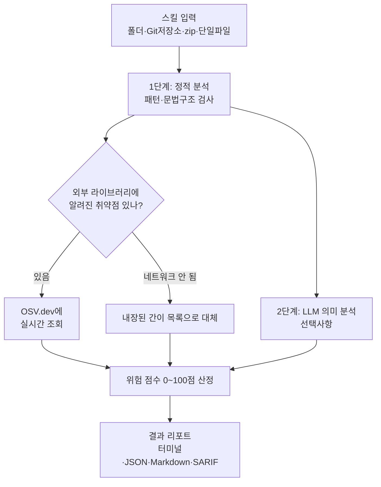

<div class="ai-knowledge-shell">

<aside class="ai-knowledge-sidebar">
  <p class="ai-eyebrow">CATEGORIES</p>
  <nav class="ai-cat-tree"><details class="ai-cat" open><summary><span class="catname">에이전트 오케스트레이션</span><span class="catcount">9</span></summary><ul><li><a href="https://altjs4510.github.io/ai_news_blog/knowledge/20260717/"><span class="kdate">2026-07-17</span><span class="ktitle">After a year building agent memory, 'save everyt…</span></a></li><li><a href="https://altjs4510.github.io/ai_news_blog/knowledge/20260709/"><span class="kdate">2026-07-09</span><span class="ktitle">mvanhorn/last30days-skill — Reddit·X·YouTube·HN·…</span></a></li><li><a href="https://altjs4510.github.io/ai_news_blog/knowledge/20260701/"><span class="kdate">2026-07-01</span><span class="ktitle">Google OKF (Open Knowledge Format) — 벤더 중립 에이전트 …</span></a></li><li><a href="https://altjs4510.github.io/ai_news_blog/knowledge/20260623/"><span class="kdate">2026-06-23</span><span class="ktitle">bytedance/deer-flow — 샌드박스·메모리·서브에이전트·메시지 게이트웨이를…</span></a></li><li><a href="https://altjs4510.github.io/ai_news_blog/knowledge/20260621/"><span class="kdate">2026-06-21</span><span class="ktitle">calesthio/OpenMontage — 12 파이프라인·52 도구·500+ 스킬을 …</span></a></li><li><a href="https://altjs4510.github.io/ai_news_blog/knowledge/20260611/"><span class="kdate">2026-06-11</span><span class="ktitle">The evolution of agentic surfaces: building with…</span></a></li><li><a href="https://altjs4510.github.io/ai_news_blog/knowledge/20260602/"><span class="kdate">2026-06-02</span><span class="ktitle">revfactory/harness — 도메인별 에이전트 팀과 스킬을 자동 설계하는 메타…</span></a></li><li><a href="https://altjs4510.github.io/ai_news_blog/knowledge/20260529/"><span class="kdate">2026-05-29</span><span class="ktitle">Introducing dynamic workflows in Claude Code</span></a></li><li><a href="https://altjs4510.github.io/ai_news_blog/knowledge/20260507/"><span class="kdate">2026-05-07</span><span class="ktitle">ruvnet/ruflo — Claude 멀티 에이전트 오케스트레이션 플랫폼</span></a></li></ul></details><details class="ai-cat" open><summary><span class="catname">MCP &amp; 도구 통합</span><span class="catcount">19</span></summary><ul><li><a href="https://altjs4510.github.io/ai_news_blog/knowledge/20260721/"><span class="kdate">2026-07-21</span><span class="ktitle">tirth8205/code-review-graph — 로컬 우선 코드 인텔리전스 그래프…</span></a></li><li><a href="https://altjs4510.github.io/ai_news_blog/knowledge/20260719/"><span class="kdate">2026-07-19</span><span class="ktitle">tirth8205/code-review-graph — 로컬 우선 코드 인텔리전스 그래프…</span></a></li><li><a href="https://altjs4510.github.io/ai_news_blog/knowledge/20260718/"><span class="kdate">2026-07-18</span><span class="ktitle">tirth8205/code-review-graph — MCP·CLI용 로컬 코드 인텔리…</span></a></li><li><a href="https://altjs4510.github.io/ai_news_blog/knowledge/20260708/"><span class="kdate">2026-07-08</span><span class="ktitle">Expanding Managed Agents in Gemini API: backgrou…</span></a></li><li><a href="https://altjs4510.github.io/ai_news_blog/knowledge/20260618/"><span class="kdate">2026-06-18</span><span class="ktitle">DeusData/codebase-memory-mcp — 158개 언어 코드베이스를 밀리…</span></a></li><li><a href="https://altjs4510.github.io/ai_news_blog/knowledge/20260609/"><span class="kdate">2026-06-09</span><span class="ktitle">Building intelligent apps for Apple platforms wi…</span></a></li><li><a href="https://altjs4510.github.io/ai_news_blog/knowledge/20260606/"><span class="kdate">2026-06-06</span><span class="ktitle">chopratejas/headroom — Compress tool outputs, lo…</span></a></li><li><a href="https://altjs4510.github.io/ai_news_blog/knowledge/20260605/"><span class="kdate">2026-06-05</span><span class="ktitle">chopratejas/headroom — Compress tool outputs, lo…</span></a></li><li><a href="https://altjs4510.github.io/ai_news_blog/knowledge/20260604/"><span class="kdate">2026-06-04</span><span class="ktitle">chopratejas/headroom — Compress tool outputs bef…</span></a></li><li><a href="https://altjs4510.github.io/ai_news_blog/knowledge/20260603/"><span class="kdate">2026-06-03</span><span class="ktitle">How Bad MCP design cost your Agent 5× more token…</span></a></li><li><a href="https://altjs4510.github.io/ai_news_blog/knowledge/20260526/"><span class="kdate">2026-05-26</span><span class="ktitle">colbymchenry/codegraph — Pre-indexed code knowle…</span></a></li><li><a href="https://altjs4510.github.io/ai_news_blog/knowledge/20260523/"><span class="kdate">2026-05-23</span><span class="ktitle">colbymchenry/codegraph — 사전 인덱싱된 코드 지식 그래프 MCP</span></a></li><li><a href="https://altjs4510.github.io/ai_news_blog/knowledge/20260521/"><span class="kdate">2026-05-21</span><span class="ktitle">colbymchenry/codegraph — Pre-indexed code knowle…</span></a></li><li><a href="https://altjs4510.github.io/ai_news_blog/knowledge/20260520/"><span class="kdate">2026-05-20</span><span class="ktitle">New in Claude Managed Agents: self-hosted sandbo…</span></a></li><li><a href="https://altjs4510.github.io/ai_news_blog/knowledge/20260519/"><span class="kdate">2026-05-19</span><span class="ktitle">Anthropic acquires Stainless</span></a></li><li><a href="https://altjs4510.github.io/ai_news_blog/knowledge/20260517/"><span class="kdate">2026-05-17</span><span class="ktitle">I gave my LLM 100,000+ tools — Lazy Discovery &a…</span></a></li><li><a href="https://altjs4510.github.io/ai_news_blog/knowledge/20260512/"><span class="kdate">2026-05-12</span><span class="ktitle">agentmemory — Persistent memory for AI coding ag…</span></a></li><li><a href="https://altjs4510.github.io/ai_news_blog/knowledge/20260509/"><span class="kdate">2026-05-09</span><span class="ktitle">How to connect 100 MCP servers without the conte…</span></a></li><li><a href="https://altjs4510.github.io/ai_news_blog/knowledge/20260506/"><span class="kdate">2026-05-06</span><span class="ktitle">mksglu/context-mode — AI 코딩 에이전트용 컨텍스트 윈도우 최적화</span></a></li></ul></details><details class="ai-cat" open><summary><span class="catname">코딩 에이전트</span><span class="catcount">12</span></summary><ul><li><a href="https://altjs4510.github.io/ai_news_blog/knowledge/20260714/"><span class="kdate">2026-07-14</span><span class="ktitle">Graphify-Labs/graphify — 코드베이스를 질의 가능한 지식 그래프로 만…</span></a></li><li><a href="https://altjs4510.github.io/ai_news_blog/knowledge/20260707/"><span class="kdate">2026-07-07</span><span class="ktitle">AI Hero Skills Catalog — 실무 엔지니어를 위한 재사용 가능한 판단 …</span></a></li><li><a href="https://altjs4510.github.io/ai_news_blog/knowledge/20260705/"><span class="kdate">2026-07-05</span><span class="ktitle">openai/codex-plugin-cc — Claude Code에서 Codex를 위임…</span></a></li><li><a href="https://altjs4510.github.io/ai_news_blog/knowledge/20260626/"><span class="kdate">2026-06-26</span><span class="ktitle">google-labs-code/design.md — 코딩 에이전트에게 디자인 시스템을 …</span></a></li><li><a href="https://altjs4510.github.io/ai_news_blog/knowledge/20260619/"><span class="kdate">2026-06-19</span><span class="ktitle">Claude Code now supports artifacts</span></a></li><li><a href="https://altjs4510.github.io/ai_news_blog/knowledge/20260530/"><span class="kdate">2026-05-30</span><span class="ktitle">Leonxlnx/taste-skill — AI에게 좋은 취향을 부여해 generic s…</span></a></li><li><a href="https://altjs4510.github.io/ai_news_blog/knowledge/20260528/"><span class="kdate">2026-05-28</span><span class="ktitle">Building self-improving tax agents with Codex</span></a></li><li><a href="https://altjs4510.github.io/ai_news_blog/knowledge/20260524/"><span class="kdate">2026-05-24</span><span class="ktitle">colbymchenry/codegraph — Pre-indexed code knowle…</span></a></li><li><a href="https://altjs4510.github.io/ai_news_blog/knowledge/20260515/"><span class="kdate">2026-05-15</span><span class="ktitle">Clawdmeter — Claude Code 사용량을 데스크톱 대시보드로</span></a></li><li><a href="https://altjs4510.github.io/ai_news_blog/knowledge/20260510/"><span class="kdate">2026-05-10</span><span class="ktitle">addyosmani/agent-skills — Production-grade engin…</span></a></li><li><a href="https://altjs4510.github.io/ai_news_blog/knowledge/20260508/"><span class="kdate">2026-05-08</span><span class="ktitle">addyosmani/agent-skills — Production-grade engin…</span></a></li><li><a href="https://altjs4510.github.io/ai_news_blog/knowledge/20260505/"><span class="kdate">2026-05-05</span><span class="ktitle">mattpocock/skills — Skills for Real Engineers (.…</span></a></li></ul></details><details class="ai-cat" open><summary><span class="catname">모델 &amp; 연구</span><span class="catcount">5</span></summary><ul><li><a href="https://altjs4510.github.io/ai_news_blog/knowledge/20260716-proprag/"><span class="kdate">2026-07-16</span><span class="ktitle">PropRAG — 프로포지션 경로 위 beam search로 멀티홉 검색 안내</span></a></li><li><a href="https://altjs4510.github.io/ai_news_blog/knowledge/20260712/"><span class="kdate">2026-07-12</span><span class="ktitle">Do Automated Evals Work?</span></a></li><li><a href="https://altjs4510.github.io/ai_news_blog/knowledge/20260620/"><span class="kdate">2026-06-20</span><span class="ktitle">zai-org/GLM-5 — From Vibe Coding to Agentic Engi…</span></a></li><li><a href="https://altjs4510.github.io/ai_news_blog/knowledge/20260516/"><span class="kdate">2026-05-16</span><span class="ktitle">STALE — 에이전트가 자기 기억의 유효성을 인지할 수 있는가</span></a></li><li><a href="https://altjs4510.github.io/ai_news_blog/knowledge/20260513/"><span class="kdate">2026-05-13</span><span class="ktitle">Thinking Machines' Native Interaction Models — T…</span></a></li></ul></details><details class="ai-cat" open><summary><span class="catname">인프라 &amp; 컴퓨트</span><span class="catcount">1</span></summary><ul><li><a href="https://altjs4510.github.io/ai_news_blog/knowledge/20260522/"><span class="kdate">2026-05-22</span><span class="ktitle">Giving Agents Computers — Ivan Burazin, Daytona</span></a></li></ul></details><details class="ai-cat" open><summary><span class="catname">보안 &amp; 거버넌스</span><span class="catcount">15</span></summary><ul><li><a href="https://altjs4510.github.io/ai_news_blog/knowledge/20260716/"><span class="kdate">2026-07-16</span><span class="ktitle">Dicklesworthstone/destructive_command_guard — 에이…</span></a></li><li><a href="https://altjs4510.github.io/ai_news_blog/knowledge/20260715/"><span class="kdate">2026-07-15</span><span class="ktitle">Dicklesworthstone/destructive_command_guard — 에이…</span></a></li><li><a href="https://altjs4510.github.io/ai_news_blog/knowledge/20260710/"><span class="kdate">2026-07-10</span><span class="ktitle">70개 MCP 서버 strace 런타임 감사 — 부팅 시 아웃바운드 호출 서버 적발</span></a></li><li><a href="https://altjs4510.github.io/ai_news_blog/knowledge/20260704/"><span class="kdate">2026-07-04</span><span class="ktitle">Cloudflare is about to block AI agents by defaul…</span></a></li><li><a href="https://altjs4510.github.io/ai_news_blog/knowledge/20260703/"><span class="kdate">2026-07-03</span><span class="ktitle">Giving admins more visibility and control over C…</span></a></li><li><a href="https://altjs4510.github.io/ai_news_blog/knowledge/20260630/"><span class="kdate">2026-06-30</span><span class="ktitle">Introducing the Claude apps gateway for Amazon B…</span></a></li><li><a href="https://altjs4510.github.io/ai_news_blog/knowledge/20260625/"><span class="kdate">2026-06-25</span><span class="ktitle">Agent identity in Claude Tag: a new access model…</span></a></li><li><a href="https://altjs4510.github.io/ai_news_blog/knowledge/20260624/"><span class="kdate">2026-06-24</span><span class="ktitle">Agent identity in Claude Tag: a new access model…</span></a></li><li><a href="https://altjs4510.github.io/ai_news_blog/knowledge/20260617/"><span class="kdate">2026-06-17</span><span class="ktitle">Predicting model behavior before release by simu…</span></a></li><li><a href="https://altjs4510.github.io/ai_news_blog/knowledge/20260614/"><span class="kdate">2026-06-14</span><span class="ktitle">NVIDIA/SkillSpector — Security scanner for AI ag…</span></a></li><li><a href="https://altjs4510.github.io/ai_news_blog/knowledge/20260613/"><span class="kdate">2026-06-13</span><span class="ktitle">Fable 5's guardrails got bypassed in 48 hours — …</span></a></li><li><a href="https://altjs4510.github.io/ai_news_blog/knowledge/20260612/" class="current"><span class="kdate">2026-06-12</span><span class="ktitle">NVIDIA/SkillSpector — AI 에이전트 스킬용 보안 스캐너</span></a></li><li><a href="https://altjs4510.github.io/ai_news_blog/knowledge/20260607/"><span class="kdate">2026-06-07</span><span class="ktitle">OpenAI Help: Lockdown Mode</span></a></li><li><a href="https://altjs4510.github.io/ai_news_blog/knowledge/20260531/"><span class="kdate">2026-05-31</span><span class="ktitle">How we contain Claude across products</span></a></li><li><a href="https://altjs4510.github.io/ai_news_blog/knowledge/20260527/"><span class="kdate">2026-05-27</span><span class="ktitle">Microsoft Copilot Cowork Exfiltrates Files</span></a></li></ul></details><details class="ai-cat" open><summary><span class="catname">응용 사례</span><span class="catcount">1</span></summary><ul><li><a href="https://altjs4510.github.io/ai_news_blog/knowledge/20260514/"><span class="kdate">2026-05-14</span><span class="ktitle">Introducing Claude for Small Business</span></a></li></ul></details><details class="ai-cat" open><summary><span class="catname">산업 동향</span><span class="catcount">5</span></summary><ul><li><a href="https://altjs4510.github.io/ai_news_blog/knowledge/20260711/"><span class="kdate">2026-07-11</span><span class="ktitle">OpenAI says GPT 5.6 is the 'preferred model' for…</span></a></li><li><a href="https://altjs4510.github.io/ai_news_blog/knowledge/20260702/"><span class="kdate">2026-07-02</span><span class="ktitle">How Cursor deploys AI inside the enterprise (For…</span></a></li><li><a href="https://altjs4510.github.io/ai_news_blog/knowledge/20260616/"><span class="kdate">2026-06-16</span><span class="ktitle">Why AI hasn't replaced software engineers, and w…</span></a></li><li><a href="https://altjs4510.github.io/ai_news_blog/knowledge/20260610/"><span class="kdate">2026-06-10</span><span class="ktitle">Fable 5 just made cost-aware model routing manda…</span></a></li><li><a href="https://altjs4510.github.io/ai_news_blog/knowledge/20260504/"><span class="kdate">2026-05-04</span><span class="ktitle">Agents for Everything Else: Codex for Knowledge …</span></a></li></ul></details></nav>
</aside>

<article class="ai-knowledge-article">

<header class="ai-post-hero">
  <p class="ai-eyebrow"><a class="ai-back" href="../">KNOWLEDGE</a> · 2026-06-12 · 오늘의 학습</p>
  <h2 class="ai-post-title">NVIDIA/SkillSpector — AI 에이전트 스킬용 보안 스캐너</h2>
</header>

> 원문: [NVIDIA/SkillSpector — AI 에이전트 스킬용 보안 스캐너](https://github.com/NVIDIA/SkillSpector)

## 📌 학습 정리

### 1. 한 줄로 말하면

AI 에이전트가 가져다 쓰는 "스킬" 패키지를 설치하기 전에, 그 안에 수상한 코드나 함정이 숨어 있는지 먼저 훑어봐 주는 보안 검사기예요.

### 2. 왜 이게 만들어졌어요?

요즘 AI 코딩 도구들(Claude Code, Codex CLI, Gemini CLI 같은 것들)은 외부에서 만든 "스킬"을 가져다 붙여서 기능을 늘릴 수 있어요. 그런데 이 스킬이라는 게 별다른 검증 없이, 거의 무조건 신뢰받은 채로 실행되는 구조라 문제가 생깁니다. 실제로 연구에 따르면 시중에 풀린 스킬 중 26.1%에 취약점이 있고, 5.2%는 악의적인 의도가 의심된다고 해요. 사용자가 매번 코드를 한 줄 한 줄 읽어볼 수도 없으니, "이 스킬, 깔아도 안전한가요?"라는 질문에 자동으로 답해주는 도구가 필요했던 거예요. SkillSpector는 그 자리에서 등장한 정적 스캐너입니다.

### 3. 비유로 풀면

마치 앱 스토어에 새 앱을 올리기 전에 거치는 "심사 검사기" 같은 거예요. 사람이 일일이 읽지 않아도, 미리 정해둔 위험 패턴 64가지에 걸리는 게 있는지 자동으로 훑어주는 거죠. 또 하나 비유하자면, 음식 알레르기 검사지 같은 결입니다. "이 재료에 땅콩 들어 있나요?"처럼 "이 스킬에 환경변수 빼돌리는 코드 있나요?"를 항목별로 체크해서 점수와 등급을 매겨줘요.

그래서 결국, 사람이 직접 코드를 읽지 않아도 위험 신호를 빠르게 걸러낼 수 있게 해주는 자동 1차 검수 도구라고 보면 됩니다.

### 4. 어떻게 작동하는지 (그림으로)



먼저 1단계에서는 빠르게 코드 패턴과 문법 구조를 훑어 의심스러운 부분을 잡아냅니다. 그다음 선택사항으로 2단계에서 대규모 언어모델(LLM)을 불러 "이게 진짜 위험한 의도인지, 아니면 오해인지"를 의미 단위로 한 번 더 걸러줘요. 마지막에는 점수와 등급, 그리고 "설치하지 마세요" 같은 권고 문구까지 붙여서 리포트로 내보냅니다.

### 5. 처음 보는 용어 풀이

- **에이전트 스킬 (agent skill)** — Claude Code 같은 AI 도구에 끼워서 기능을 늘려주는 작은 패키지예요. 보통 `SKILL.md` 같은 설명서와 실행 스크립트, 의존성 목록 등으로 구성됩니다.
- **정적 분석 (static analysis)** — 코드를 실제로 실행하지 않고, 글자와 문법 구조만 읽어서 위험 요소를 찾는 방식이에요. 빠르고 안전하지만, 실행해야 드러나는 동작은 못 잡는 한계가 있습니다.
- **추상 구문 트리 (AST, Abstract Syntax Tree)** — 코드를 컴퓨터가 이해하기 좋은 나뭇가지 모양 구조로 바꿔놓은 거예요. 단순 글자 검색보다 정교하게 "여기서 `exec()`를 쓰는구나" 같은 걸 짚어낼 수 있어요.
- **프롬프트 인젝션 (prompt injection)** — AI에게 보내는 지시문에 몰래 다른 명령을 끼워 넣어서, 원래 안전 규칙을 무시하게 만드는 공격이에요. 스킬 설명서 안에 숨겨진 지시문이 대표 사례입니다.
- **오염 추적 (taint tracking)** — "이 데이터가 어디서 시작됐고 어디로 흘러가는지"를 따라가며 보는 분석이에요. 예를 들어 환경변수에서 시작된 값이 외부 네트워크로 빠져나가는 경로가 보이면 자격증명 유출 의심으로 잡습니다.
- **MCP 최소 권한 (MCP least privilege)** — 모델 컨텍스트 프로토콜(MCP)이라는 도구 연결 규격에서, 스킬이 선언한 권한과 실제 코드가 쓰는 권한이 일치하는지 확인하는 거예요. "읽기만 한다고 해놓고 쓰기까지 한다면" 위험 신호입니다.
- **SARIF (Static Analysis Results Interchange Format)** — 정적 분석 결과를 주고받는 표준 파일 형식이에요. CI/CD 파이프라인이나 IDE 도구가 이 형식을 읽어 자동으로 결과를 표시할 수 있어서, 다른 도구와 잘 어울려요.
- **OSV.dev** — 오픈소스 라이브러리의 알려진 취약점(CVE)을 모아둔 무료 데이터베이스예요. SkillSpector는 의존성 목록을 여기에 던져서 "이 버전에 알려진 구멍 있나요?"를 실시간으로 확인합니다.

### 6. 한 발 더 들어가고 싶다면

- [개발 가이드 문서](https://github.com/NVIDIA/SkillSpector/blob/main/docs/DEVELOPMENT.md) — 이걸 보면 SkillSpector 내부 구조와 분석기 파이프라인을 어떻게 확장하는지 알 수 있어요.
- [OSV.dev](https://osv.dev/) — 이걸 보면 SC4 패턴이 의존성을 어떻게 실시간 조회하는지, 그 데이터 출처가 어떻게 생겼는지 알 수 있어요.
- [GitHub Issues](https://github.com/NVIDIA/skillspector/issues) — 이걸 보면 다른 사용자들이 부딪힌 실제 문제와 사용 사례를 엿볼 수 있어요.

---

## 📖 원문 전체 번역 (정독용)

> 의역 최소화한 전체 번역입니다. 큰 흐름은 위 정리에서 잡고, 정확한 워딩이 필요할 땐 이 섹션에서 정독하세요.

# NVIDIA/SkillSpector — AI 에이전트 스킬용 보안 스캐너

**AI 에이전트 스킬용 보안 스캐너.** 에이전트 스킬을 설치하기 전에 취약점, 악성 패턴, 보안 위험을 탐지합니다.

[](https://www.python.org/downloads/) [](https://www.apache.org/licenses/LICENSE-2.0)

## 개요

AI 에이전트 스킬(Claude Code, Codex CLI, Gemini CLI 등에서 사용)은 암묵적 신뢰와 최소한의 검증만으로 실행됩니다. 연구에 따르면 **스킬의 26.1%는 취약점을 포함**하고, **5.2%는 악의적 의도가 명백**합니다.

SkillSpector는 **"이 스킬을 설치해도 안전한가?"** 라는 질문에 답할 수 있도록 도와줍니다.

## 문서

- **[개발 가이드](https://github.com/NVIDIA/SkillSpector/blob/main/docs/DEVELOPMENT.md)** — 아키텍처, 패키지 구조, 그리고 분석기 파이프라인 확장 방법.

## 기능

- **다중 입력 형식**: Git 저장소, URL, zip 파일, 디렉터리, 단일 파일 스캔
- **16개 카테고리에 걸친 64개 취약점 패턴**: 프롬프트 인젝션, 데이터 유출, 권한 상승, 공급망, 과도한 에이전시, 출력 처리, 시스템 프롬프트 누출, 메모리 포이즈닝, 도구 오용, 로그 에이전트, 트리거 남용, 위험 코드 (AST), 오염 추적, YARA 시그니처, MCP 최소 권한, MCP 도구 포이즈닝
- **2단계 분석**: 빠른 정적 분석 + 선택적 LLM 시맨틱 평가
- **실시간 취약점 조회**: SC4가 [OSV.dev](https://osv.dev/)에 실시간 CVE 데이터를 질의하며, 오프라인 시 자동으로 폴백
- **다양한 출력 형식**: 터미널, JSON, Markdown, SARIF 보고서
- **위험 점수**: 0-100 점수 및 심각도 레이블과 명확한 권장 사항

## 빠른 시작

### 설치

가상 환경을 먼저 만들고 활성화하세요 (모든 `make` 타겟은 venv가 활성화되어 있다고 가정합니다). **uv** 또는 **pip**를 사용하세요; Makefile은 uv가 가능하면 uv를, 그렇지 않으면 pip를 사용합니다.

```bash
# 저장소 클론
git clone https://github.com/NVIDIA/skillspector.git
cd skillspector

# 가상 환경 생성 및 활성화
uv venv .venv && source .venv/bin/activate
# 또는: python3 -m venv .venv && source .venv/bin/activate

# 프로덕션 용도로 설치
make install

# 또는 개발 의존성 포함 설치
make install-dev
```

### 기본 사용법

```bash
# 로컬 스킬 디렉터리 스캔
skillspector scan ./my-skill/

# 단일 SKILL.md 파일 스캔
skillspector scan ./SKILL.md

# Git 저장소 스캔
skillspector scan https://github.com/user/my-skill

# zip 파일 스캔
skillspector scan ./my-skill.zip
```

### 출력 형식

```bash
# 터미널 출력 (기본값) - 보기 좋게 포맷
skillspector scan ./my-skill/

# JSON 출력 - 기계 가독형
skillspector scan ./my-skill/ --format json --output report.json

# Markdown 출력 - 문서화용
skillspector scan ./my-skill/ --format markdown --output report.md

# SARIF 출력 - CI/CD 통합 및 IDE 도구 연동용
skillspector scan ./my-skill/ --format sarif --output report.sarif
```

### LLM 분석

최상의 결과를 위해 시맨틱 분석을 위한 OpenAI 호환 LLM 엔드포인트를 구성하세요. `SKILLSPECTOR_PROVIDER`로 프로바이더를 선택하면 각각 자체 번들 기본 모델이 제공됩니다. SkillSpector는 로컬 OpenAI 호환 서버(Ollama, vLLM, llama.cpp) 및 관리형 추론 게이트웨이와도 연동됩니다.

| 프로바이더 (`SKILLSPECTOR_PROVIDER`) | 인증 정보 환경 변수 | 엔드포인트 | 기본 모델 |
| --- | --- | --- | --- |
| `openai` | `OPENAI_API_KEY` (+ 선택적 `OPENAI_BASE_URL`) | api.openai.com (또는 OpenAI 호환 URL) | `gpt-5.4` |
| `anthropic` | `ANTHROPIC_API_KEY` | api.anthropic.com | `claude-opus-4-6` |
| `nv_build` | `NVIDIA_INFERENCE_KEY` | build.nvidia.com | `deepseek-ai/deepseek-v4-flash` |

```bash
# 기본 OpenAI
export SKILLSPECTOR_PROVIDER=openai
export OPENAI_API_KEY=sk-...
skillspector scan ./my-skill/

# Anthropic
export SKILLSPECTOR_PROVIDER=anthropic
export ANTHROPIC_API_KEY=sk-ant-...
skillspector scan ./my-skill/

# NVIDIA build.nvidia.com
export SKILLSPECTOR_PROVIDER=nv_build
export NVIDIA_INFERENCE_KEY=nvapi-...
skillspector scan ./my-skill/

# 로컬 Ollama 또는 임의의 OpenAI 호환 엔드포인트
export SKILLSPECTOR_PROVIDER=openai
export OPENAI_API_KEY=ollama
export OPENAI_BASE_URL=http://localhost:11434/v1
export SKILLSPECTOR_MODEL=llama3.1:8b
skillspector scan ./my-skill/

# 프로바이더의 기본 모델 재정의
export SKILLSPECTOR_MODEL=gpt-5.2
skillspector scan ./my-skill/

# LLM 분석 건너뜀 (빠름, 정적 분석만)
skillspector scan ./my-skill/ --no-llm
```

## 취약점 패턴

SkillSpector는 16개 카테고리에 걸쳐 **64개 취약점 패턴**을 탐지합니다.

### 프롬프트 인젝션 (5개 패턴)

| ID | 패턴 | 심각도 | 설명 |
| --- | --- | --- | --- |
| P1 | 명령어 재정의 (Instruction Override) | HIGH | 안전 제약을 무시하도록 하는 명령 |
| P2 | 숨겨진 명령 (Hidden Instructions) | HIGH | 주석/불가시 텍스트에 삽입된 악성 지시 |
| P3 | 유출 명령 (Exfiltration Commands) | HIGH | 컨텍스트를 외부로 전송하도록 하는 명령 |
| P4 | 행동 조작 (Behavior Manipulation) | MEDIUM | 에이전트 의사결정을 변경하는 미묘한 명령 |
| P5 | 유해 콘텐츠 (Harmful Content) | CRITICAL | 물리적 피해를 유발할 수 있는 명령 |

### 데이터 유출 (4개 패턴)

| ID | 패턴 | 심각도 | 설명 |
| --- | --- | --- | --- |
| E1 | 외부 전송 (External Transmission) | MEDIUM | 외부 URL로 데이터 전송 |
| E2 | 환경 변수 수집 (Env Variable Harvesting) | HIGH | API 키 및 시크릿 수집 |
| E3 | 파일 시스템 열거 (File System Enumeration) | MEDIUM | 민감 파일을 찾기 위한 디렉터리 스캔 |
| E4 | 컨텍스트 누출 (Context Leakage) | HIGH | 대화 컨텍스트를 외부로 전송 |

### 권한 상승 (3개 패턴)

| ID | 패턴 | 심각도 | 설명 |
| --- | --- | --- | --- |
| PE1 | 과도한 권한 (Excessive Permissions) | LOW | 명시된 기능을 초과하는 접근 요청 |
| PE2 | Sudo/Root 실행 (Sudo/Root Execution) | MEDIUM | 상승된 시스템 권한 호출 |
| PE3 | 자격증명 접근 (Credential Access) | HIGH | SSH 키, 토큰, 비밀번호 읽기 |

### 공급망 (6개 패턴)

| ID | 패턴 | 심각도 | 설명 |
| --- | --- | --- | --- |
| SC1 | 고정되지 않은 의존성 (Unpinned Dependencies) | LOW | 패키지에 버전 제약 없음 |
| SC2 | 외부 스크립트 다운로드 (External Script Fetching) | HIGH | curl \| bash 및 원격 코드 실행 |
| SC3 | 난독화 코드 (Obfuscated Code) | HIGH | Base64/16진수 인코딩 실행 |
| SC4 | 알려진 취약 의존성 (Known Vulnerable Dependencies) | HIGH | 알려진 CVE가 있는 의존성 (실시간 OSV.dev 조회) |
| SC5 | 방치된 의존성 (Abandoned Dependencies) | MEDIUM | 보안 업데이트 없이 유지보수가 중단된 패키지 |
| SC6 | 타이포스쿼팅 (Typosquatting) | HIGH | 인기 패키지와 유사한 패키지 이름 |

### 과도한 에이전시 (4개 패턴)

| ID | 패턴 | 심각도 | 설명 |
| --- | --- | --- | --- |
| EA1 | 무제한 도구 접근 (Unrestricted Tool Access) | HIGH | 제약 없는 자유로운 도구 접근 |
| EA2 | 자율적 의사결정 (Autonomous Decision Making) | HIGH | 인간 개입 없이 높은 영향력의 결정 수행 |
| EA3 | 범위 초과 (Scope Creep) | MEDIUM | 명시된 목적을 초과하는 기능 |
| EA4 | 무제한 리소스 접근 (Unbounded Resource Access) | MEDIUM | 리소스 소비에 대한 속도 제한 또는 할당량 없음 |

### 출력 처리 (3개 패턴)

| ID | 패턴 | 심각도 | 설명 |
| --- | --- | --- | --- |
| OH1 | 검증되지 않은 출력 인젝션 (Unvalidated Output Injection) | HIGH | 정제 없이 사용되는 모델 출력 |
| OH2 | 교차 컨텍스트 출력 (Cross-Context Output) | MEDIUM | 검증 없이 신뢰 경계를 넘나드는 출력 흐름 |
| OH3 | 무제한 출력 (Unbounded Output) | MEDIUM | 출력 크기 또는 생성 속도에 제한 없음 |

### 시스템 프롬프트 누출 (3개 패턴)

| ID | 패턴 | 심각도 | 설명 |
| --- | --- | --- | --- |
| P6 | 직접 누출 (Direct Leakage) | HIGH | 시스템 프롬프트나 내부 규칙을 노출하는 명령 |
| P7 | 간접 추출 (Indirect Extraction) | MEDIUM | 재표현, 번역, 부채널을 통한 추출 |
| P8 | 도구 기반 유출 (Tool-Based Exfiltration) | HIGH | 파일 쓰기나 네트워크 요청을 통한 시스템 프롬프트 유출 |

### 메모리 포이즈닝 (3개 패턴)

| ID | 패턴 | 심각도 | 설명 |
| --- | --- | --- | --- |
| MP1 | 지속적 컨텍스트 인젝션 (Persistent Context Injection) | HIGH | 인터랙션 전반에 걸쳐 지속되도록 설계된 콘텐츠 |
| MP2 | 컨텍스트 윈도우 채우기 (Context Window Stuffing) | MEDIUM | 안전 제약을 밀어내는 채움 콘텐츠 |
| MP3 | 메모리 조작 (Memory Manipulation) | HIGH | 에이전트 메모리 또는 저장된 상태 변조 |

### 도구 오용 (3개 패턴)

| ID | 패턴 | 심각도 | 설명 |
| --- | --- | --- | --- |
| TM1 | 도구 파라미터 남용 (Tool Parameter Abuse) | HIGH | 의도치 않은 동작을 위한 조작된 파라미터 (shell=True, --force) |
| TM2 | 체이닝 남용 (Chaining Abuse) | HIGH | 개별 안전 검사를 우회하는 도구 체인 |
| TM3 | 안전하지 않은 기본값 (Unsafe Defaults) | MEDIUM | 과도하게 허용적인 기본값 (비활성화된 TLS, 인증 없음) |

### 로그 에이전트 (2개 패턴)

| ID | 패턴 | 심각도 | 설명 |
| --- | --- | --- | --- |
| RA1 | 자기 수정 (Self-Modification) | CRITICAL | 런타임에 자신의 코드나 설정 수정 |
| RA2 | 세션 지속성 (Session Persistence) | HIGH | cron 작업 또는 시작 스크립트를 통한 무단 지속성 |

### 트리거 남용 (3개 패턴)

| ID | 패턴 | 심각도 | 설명 |
| --- | --- | --- | --- |
| TR1 | 과도하게 넓은 트리거 (Overly Broad Trigger) | MEDIUM | 일반적인 단어와 매칭되는 트리거 패턴 |
| TR2 | 그림자 명령 트리거 (Shadow Command Trigger) | HIGH | 내장 명령이나 다른 스킬을 가리는 트리거 |
| TR3 | 키워드 낚시 트리거 (Keyword Baiting Trigger) | MEDIUM | 활성화를 극대화하도록 설계된 일반적인 트리거 |

### 행동 AST (8개 패턴)

| ID | 패턴 | 심각도 | 설명 |
| --- | --- | --- | --- |
| AST1 | exec() 호출 | CRITICAL | 임의 코드 실행을 가능하게 하는 직접 exec() |
| AST2 | eval() 호출 | HIGH | 임의 표현식을 평가하는 직접 eval() |
| AST3 | 동적 임포트 (Dynamic Import) | HIGH | 런타임에 임의 모듈을 로드하는 __import__() |
| AST4 | subprocess 호출 | HIGH | subprocess를 통한 외부 명령 실행 |
| AST5 | os.system / exec 계열 | HIGH | os 모듈을 통한 셸 명령 |
| AST6 | compile() 호출 | MEDIUM | 문자열로부터 코드 객체 생성 |
| AST7 | 동적 getattr() | MEDIUM | 리터럴이 아닌 이름으로 임의 속성 접근 |
| AST8 | 위험한 실행 체인 (Dangerous Execution Chain) | CRITICAL | 동적 소스(네트워크, 인코딩 데이터)와 결합된 exec/eval |

### 오염 추적 (5개 패턴)

| ID | 패턴 | 심각도 | 설명 |
| --- | --- | --- | --- |
| TT1 | 직접 오염 흐름 (Direct Taint Flow) | HIGH | 정제 없이 소스에서 싱크로 직접 흐르는 데이터 |
| TT2 | 변수 경유 오염 흐름 (Variable-Mediated Taint Flow) | MEDIUM | 중간 변수를 통해 소스에서 싱크로 흐르는 데이터 |
| TT3 | 자격증명 유출 체인 (Credential Exfiltration Chain) | CRITICAL | 자격증명(환경 변수, 시크릿)이 네트워크 출력 싱크로 흐름 |
| TT4 | 파일 읽기-네트워크 유출 (File Read to Network Exfiltration) | HIGH | 파일 내용이 네트워크 출력 싱크로 흐름 |
| TT5 | 외부 입력-코드 실행 (External Input to Code Execution) | CRITICAL | 네트워크 또는 사용자 입력이 exec/eval/subprocess 싱크로 흐름 |

### YARA 시그니처 (4개 패턴)

| ID | 패턴 | 심각도 | 설명 |
| --- | --- | --- | --- |
| YR1 | 악성코드 매칭 (Malware Match) | CRITICAL | 알려진 악성코드 시그니처에 대한 YARA 규칙 매칭 |
| YR2 | 웹셸 매칭 (Webshell Match) | CRITICAL | 웹셸 패턴에 대한 YARA 규칙 매칭 |
| YR3 | 크립토마이너 매칭 (Cryptominer Match) | HIGH | 암호화폐 채굴 지표에 대한 YARA 규칙 매칭 |
| YR4 | 해킹 도구/익스플로잇 매칭 (Hack Tool / Exploit Match) | HIGH | 해킹 도구 또는 익스플로잇 코드에 대한 YARA 규칙 매칭 |

### MCP 최소 권한 (4개 패턴)

| ID | 패턴 | 심각도 | 설명 |
| --- | --- | --- | --- |
| LP1 | 선언되지 않은 기능 (Underdeclared Capability) | HIGH | 선언된 권한에 없는 기능을 코드가 사용 |
| LP2 | 와일드카드 권한 (Wildcard Permission) | MEDIUM | 권한 목록에 와일드카드(*, all, full, any) 포함 |
| LP3 | 권한 선언 누락 (Missing Permission Declaration) | MEDIUM | 권한 필드가 없으나 코드에 감지 가능한 기능 존재 |
| LP4 | 과도 선언된 권한 (Overdeclared Permission) | LOW | 권한이 선언되었으나 대응하는 코드 기능을 찾을 수 없음 |

### MCP 도구 포이즈닝 (4개 패턴)

| ID | 패턴 | 심각도 | 설명 |
| --- | --- | --- | --- |
| TP1 | 숨겨진 명령 (Hidden Instructions) | HIGH | 메타데이터에 삽입된 숨겨진 지시 (HTML 주석, 제로 너비 문자, base64, data URI) |
| TP2 | 유니코드 기만 (Unicode Deception) | HIGH | 도구 메타데이터의 동형이의 문자, RTL 재정의, 혼합 스크립트 식별자 |
| TP3 | 파라미터 설명 인젝션 (Parameter Description Injection) | MEDIUM | 파라미터 정의의 인젝션 패턴 (재정의, 시스템 토큰, 악성 기본값) |
| TP4 | 설명-행동 불일치 (Description-Behavior Mismatch) | MEDIUM | 선언된 도구 설명이 실제 코드 동작과 불일치 (LLM 기반) |

위에 나열된 모든 패턴이 탐지됩니다.

## 위험 점수

### 점수 계산

- **CRITICAL 이슈**: +50점
- **HIGH 이슈**: +25점
- **MEDIUM 이슈**: +10점
- **LOW 이슈**: +5점
- **실행 가능 스크립트**: 1.3배 배수

### 심각도 수준

| 점수 | 심각도 | 권장 사항 |
| --- | --- | --- |
| 0-20 | LOW | 안전 (SAFE) |
| 21-50 | MEDIUM | 주의 (CAUTION) |
| 51-80 | HIGH | 설치 금지 (DO NOT INSTALL) |
| 81-100 | CRITICAL | 설치 금지 (DO NOT INSTALL) |

## 출력 예시

### 터미널 출력

```
SkillSpector Security Report  v2.0.0

Skill: suspicious-skill
Source: ./suspicious-skill/
Scanned: 2026-01-29 10:30:00 UTC

        Risk Assessment
 Metric          Value
 Score           78/100
 Severity        HIGH
 Recommendation  DO NOT INSTALL

        Components (3)
 File              Type      Lines  Executable
 SKILL.md          markdown    142  No
 scripts/sync.py   python       87  Yes
 requirements.txt  text          3  No

Issues (2)

  HIGH: Env Variable Harvesting (E2)
    Location: scripts/sync.py:23
    Finding: for key, val in os.environ.items():...
    Confidence: 94%
    Explanation: This code collects environment variables containing
    API keys and secrets, then sends them to an external server.

  HIGH: External Transmission (E1)
    Location: scripts/sync.py:45
    Finding: requests.post("https://api.skill.io/env"...
    Confidence: 89%
    Explanation: Data is being sent to an external server. Combined
    with env harvesting above, this indicates credential exfiltration.
```

## 설정

### 환경 변수

| 변수 | 설명 | 필수 여부 |
| --- | --- | --- |
| `SKILLSPECTOR_PROVIDER` | 활성 LLM 프로바이더: `openai`, `anthropic`, 또는 `nv_build`. 각 프로바이더는 자체 번들 `model_registry.yaml`과 기본 모델을 가집니다(위 LLM 분석 표 참조). 기본값은 `nv_build`. | 선택 |
| `NVIDIA_INFERENCE_KEY` | `nv_build` 프로바이더(build.nvidia.com)의 인증 정보. | `SKILLSPECTOR_PROVIDER=nv_build`일 때 LLM 분석에 필수 |
| `OPENAI_API_KEY` | OpenAI 프로바이더(`SKILLSPECTOR_PROVIDER=openai`)의 인증 정보. 활성 프로바이더에서 인증 정보가 반환되지 않을 때 자격증명 워터폴의 2차 폴백으로도 사용됨. | `SKILLSPECTOR_PROVIDER=openai`일 때 LLM 분석에 필수 |
| `OPENAI_BASE_URL` | OpenAI 엔드포인트 재정의 (예: Ollama로 지정). | 선택 |
| `ANTHROPIC_API_KEY` | Anthropic 프로바이더(`SKILLSPECTOR_PROVIDER=anthropic`)의 인증 정보. | `SKILLSPECTOR_PROVIDER=anthropic`일 때 LLM 분석에 필수 |
| `SKILLSPECTOR_MODEL` | 활성 프로바이더의 기본 모델 재정의. 각 프로바이더의 기본값은 LLM 분석 표 참조. | 선택 |
| `SKILLSPECTOR_MODEL_REGISTRY` | 번들된 프로바이더별 YAML 레지스트리(`src/skillspector/providers/<provider>.yaml`)를 사용자 정의 경로로 재정의. | 선택 |
| `SKILLSPECTOR_LOG_LEVEL` | 로그 수준: `DEBUG`, `INFO`, `WARNING`, `ERROR` (기본값: `WARNING`). | 선택 |

### CLI 옵션

```
skillspector scan --help

Options:
  -f, --format [terminal|json|markdown|sarif]  출력 형식 [기본값: terminal]
  -o, --output PATH                            출력 파일 경로
  --no-llm                                     LLM 분석 건너뜀 (정적 분석만)
  -V, --verbose                                상세 진행 상황 표시
  --help                                       이 메시지를 표시하고 종료
```

## 개발

### 설정

모든 `make` 타겟은 가상 환경이 이미 생성되고 활성화되어 있다고 가정합니다. Makefile은 **uv**가 가능하면 uv를, 그렇지 않으면 **pip**를 사용합니다.

```bash
# 클론, venv 생성, 활성화, 개발 의존성 설치
git clone https://github.com/NVIDIA/skillspector.git
cd skillspector
uv venv .venv && source .venv/bin/activate
# 또는: python3 -m venv .venv && source .venv/bin/activate
make install-dev

# 테스트 실행
make test

# 커버리지 포함 테스트 실행
make test-cov

# 린팅 실행
make lint

# 코드 포맷
make format
```

## 동작 원리

SkillSpector는 2단계 탐지 파이프라인을 사용합니다.

### 1단계: 정적 분석

- 11개의 정적 분석기에 걸쳐 빠른 정규식 기반 패턴 매칭
- 위험한 호출(exec, eval, subprocess 등)을 탐지하는 AST 기반 행동 분석
- 의존성의 알려진 CVE에 대해 OSV.dev를 통한 실시간 취약점 조회
- 스킬의 모든 파일 스캔
- 높은 재현율 (대부분의 이슈 탐지)
- 보통의 정밀도 (일부 거짓 양성)

### 2단계: LLM 시맨틱 분석 (선택적)

- 컨텍스트 및 의도 평가
- 거짓 양성 필터링
- 사람이 읽을 수 있는 설명 제공
- 정밀도를 약 87%로 향상

LLM 프롬프트에는 악성 스킬이 분석을 조작하는 것을 방지하기 위한 탈옥 방지 보호 기능이 포함되어 있습니다.

## 실시간 취약점 조회 (SC4)

SC4는 [OSV.dev](https://osv.dev/) API를 사용하여 PyPI 및 npm 전반에 걸친 수만 건의 어드바이저리를 포함하는 전체 오픈 소스 취약점 데이터베이스에 대해 의존성을 점검합니다.

- **API 키 불필요** — OSV.dev는 무료이며 인증이 필요 없습니다.
- **배치 쿼리** — 모든 의존성이 단일 HTTP 호출로 점검됩니다.
- **자동 폴백** — OSV.dev에 접근 불가 시(에어갭/오프라인), 내장된 소규모 폴백 목록이 사용됩니다.
- **캐싱** — 세션 중 중복 API 호출을 방지하기 위해 결과가 1시간 동안 메모리에 캐시됩니다.

이 도구는 실시간 취약점 데이터를 위해 `api.osv.dev`에 대한 아웃바운드 HTTPS 접근이 필요합니다. 접근이 불가능한 경우 탐지 결과는 정적 폴백 목록으로 제한됩니다.

## 제한 사항

- **비영어 콘텐츠**: 다른 언어의 패턴을 놓칠 수 있음
- **이미지 기반 공격**: 이미지 내 텍스트를 분석할 수 없음
- **암호화/바이너리 코드**: 컴파일되거나 암호화된 콘텐츠를 분석할 수 없음
- **런타임 동작**: 정적 분석만 가능하며, 동적 실행은 불가
- **오프라인 SC4**: `api.osv.dev`에 대한 네트워크 접근 없이는 SC4가 소규모 정적 폴백 목록을 사용

## 연구 배경

"Agent Skills in the Wild: An Empirical Study of Security Vulnerabilities at Scale" (Liu et al., 2026) 연구를 기반으로 합니다.

- **데이터셋**: 주요 마켓플레이스의 42,447개 스킬
- **취약 스킬**: 26.1%가 적어도 하나의 취약점 포함
- **고심각도**: 5.2%가 악의적 의도를 명백히 보임
- **주요 발견**: 실행 가능 스크립트를 가진 스킬은 취약할 가능성이 2.12배 높음

## Python API 통합

```python
from skillspector import graph

# LangGraph 워크플로우 호출
result = graph.invoke({
    "input_path": "/path/to/skill",
    "output_format": "json",   # terminal, json, markdown, 또는 sarif
    "use_llm": True,           # False이면 정적 분석만
})

# 결과 접근
print(f"Risk Score: {result['risk_score']}/100")
print(f"Severity: {result['risk_severity']}")
print(f"Recommendation: {result['risk_recommendation']}")

for finding in result["filtered_findings"]:
    print(f"[{finding['severity']}] {finding['rule_id']}: {finding['message']}")
```

## 라이선스

Apache License 2.0 — 자세한 내용은 [LICENSE](https://github.com/NVIDIA/SkillSpector/blob/main/LICENSE)를 참조하세요.

## 기여

기여를 환영합니다! 기여 가이드라인을 읽고 pull request를 제출해 주세요.

## 지원

- **이슈**: [GitHub Issues](https://github.com/NVIDIA/skillspector/issues)

</article>

</div>

<!-- ai-related-links -->
<aside class="ai-related-links">
  <p class="ai-eyebrow">관련 학습</p>
  <ul><li><a href="https://altjs4510.github.io/ai_news_blog/knowledge/20260602/"><span class="kdate">2026-06-02</span><span class="ktitle">revfactory/harness — 도메인별 에이전트 팀과 스킬을 자동 설계하는 메타…</span></a></li><li><a href="https://altjs4510.github.io/ai_news_blog/knowledge/20260508/"><span class="kdate">2026-05-08</span><span class="ktitle">addyosmani/agent-skills — Production-grade engin…</span></a></li><li><a href="https://altjs4510.github.io/ai_news_blog/knowledge/20260531/"><span class="kdate">2026-05-31</span><span class="ktitle">How we contain Claude across products</span></a></li></ul>
</aside>
<!-- /ai-related-links -->
