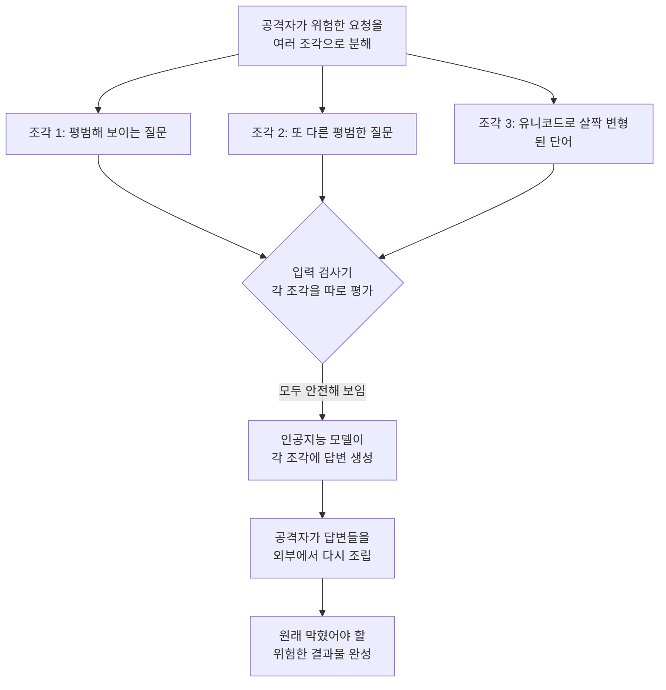

<aside class="ai-knowledge-sidebar">
  
CATEGORIES

  <nav class="ai-cat-tree">

에이전트 오케스트레이션9
<ul><li><a href="https://altjs4510.github.io/ai_news_blog/knowledge/20260701/">2026-07-01Google OKF (Open Knowledge Format) — 벤더 중립 에이전트 …</a></li><li><a href="https://altjs4510.github.io/ai_news_blog/knowledge/20260623/">2026-06-23bytedance/deer-flow — 샌드박스·메모리·서브에이전트·메시지 게이트웨이를…</a></li><li><a href="https://altjs4510.github.io/ai_news_blog/knowledge/20260621/">2026-06-21calesthio/OpenMontage — 12 파이프라인·52 도구·500+ 스킬을 …</a></li><li><a href="https://altjs4510.github.io/ai_news_blog/knowledge/20260611/">2026-06-11The evolution of agentic surfaces: building with…</a></li><li><a href="https://altjs4510.github.io/ai_news_blog/knowledge/20260602/">2026-06-02revfactory/harness — 도메인별 에이전트 팀과 스킬을 자동 설계하는 메타…</a></li><li><a href="https://altjs4510.github.io/ai_news_blog/knowledge/20260529/">2026-05-29Introducing dynamic workflows in Claude Code</a></li><li><a href="https://altjs4510.github.io/ai_news_blog/knowledge/20260520/">2026-05-20New in Claude Managed Agents: self-hosted sandbo…</a></li><li><a href="https://altjs4510.github.io/ai_news_blog/knowledge/20260507/">2026-05-07ruvnet/ruflo — Claude 멀티 에이전트 오케스트레이션 플랫폼</a></li><li><a href="https://altjs4510.github.io/ai_news_blog/knowledge/20260504/">2026-05-04Agents for Everything Else: Codex for Knowledge …</a></li></ul>

MCP &amp; 도구 통합9
<ul><li><a href="https://altjs4510.github.io/ai_news_blog/knowledge/20260618/">2026-06-18DeusData/codebase-memory-mcp — 158개 언어 코드베이스를 밀리…</a></li><li><a href="https://altjs4510.github.io/ai_news_blog/knowledge/20260605/">2026-06-05chopratejas/headroom — Compress tool outputs, lo…</a></li><li><a href="https://altjs4510.github.io/ai_news_blog/knowledge/20260604/">2026-06-04chopratejas/headroom — Compress tool outputs bef…</a></li><li><a href="https://altjs4510.github.io/ai_news_blog/knowledge/20260603/">2026-06-03How Bad MCP design cost your Agent 5× more token…</a></li><li><a href="https://altjs4510.github.io/ai_news_blog/knowledge/20260526/">2026-05-26colbymchenry/codegraph — Pre-indexed code knowle…</a></li><li><a href="https://altjs4510.github.io/ai_news_blog/knowledge/20260523/">2026-05-23colbymchenry/codegraph — 사전 인덱싱된 코드 지식 그래프 MCP</a></li><li><a href="https://altjs4510.github.io/ai_news_blog/knowledge/20260519/">2026-05-19Anthropic acquires Stainless</a></li><li><a href="https://altjs4510.github.io/ai_news_blog/knowledge/20260517/">2026-05-17I gave my LLM 100,000+ tools — Lazy Discovery &a…</a></li><li><a href="https://altjs4510.github.io/ai_news_blog/knowledge/20260509/">2026-05-09How to connect 100 MCP servers without the conte…</a></li></ul>

코딩 에이전트11
<ul><li><a href="https://altjs4510.github.io/ai_news_blog/knowledge/20260626/">2026-06-26google-labs-code/design.md — 코딩 에이전트에게 디자인 시스템을 …</a></li><li><a href="https://altjs4510.github.io/ai_news_blog/knowledge/20260619/">2026-06-19Claude Code now supports artifacts</a></li><li><a href="https://altjs4510.github.io/ai_news_blog/knowledge/20260530/">2026-05-30Leonxlnx/taste-skill — AI에게 좋은 취향을 부여해 generic s…</a></li><li><a href="https://altjs4510.github.io/ai_news_blog/knowledge/20260528/">2026-05-28Building self-improving tax agents with Codex</a></li><li><a href="https://altjs4510.github.io/ai_news_blog/knowledge/20260524/">2026-05-24colbymchenry/codegraph — Pre-indexed code knowle…</a></li><li><a href="https://altjs4510.github.io/ai_news_blog/knowledge/20260521/">2026-05-21colbymchenry/codegraph — Pre-indexed code knowle…</a></li><li><a href="https://altjs4510.github.io/ai_news_blog/knowledge/20260512/">2026-05-12agentmemory — Persistent memory for AI coding ag…</a></li><li><a href="https://altjs4510.github.io/ai_news_blog/knowledge/20260510/">2026-05-10addyosmani/agent-skills — Production-grade engin…</a></li><li><a href="https://altjs4510.github.io/ai_news_blog/knowledge/20260508/">2026-05-08addyosmani/agent-skills — Production-grade engin…</a></li><li><a href="https://altjs4510.github.io/ai_news_blog/knowledge/20260506/">2026-05-06mksglu/context-mode — AI 코딩 에이전트용 컨텍스트 윈도우 최적화</a></li><li><a href="https://altjs4510.github.io/ai_news_blog/knowledge/20260505/">2026-05-05mattpocock/skills — Skills for Real Engineers (.…</a></li></ul>

모델 &amp; 연구4
<ul><li><a href="https://altjs4510.github.io/ai_news_blog/knowledge/20260620/">2026-06-20zai-org/GLM-5 — From Vibe Coding to Agentic Engi…</a></li><li><a href="https://altjs4510.github.io/ai_news_blog/knowledge/20260617/">2026-06-17Predicting model behavior before release by simu…</a></li><li><a href="https://altjs4510.github.io/ai_news_blog/knowledge/20260516/">2026-05-16STALE — 에이전트가 자기 기억의 유효성을 인지할 수 있는가</a></li><li><a href="https://altjs4510.github.io/ai_news_blog/knowledge/20260513/">2026-05-13Thinking Machines' Native Interaction Models — T…</a></li></ul>

인프라 &amp; 컴퓨트4
<ul><li><a href="https://altjs4510.github.io/ai_news_blog/knowledge/20260630/">2026-06-30Introducing the Claude apps gateway for Amazon B…</a></li><li><a href="https://altjs4510.github.io/ai_news_blog/knowledge/20260610/">2026-06-10Fable 5 just made cost-aware model routing manda…</a></li><li><a href="https://altjs4510.github.io/ai_news_blog/knowledge/20260606/">2026-06-06chopratejas/headroom — Compress tool outputs, lo…</a></li><li><a href="https://altjs4510.github.io/ai_news_blog/knowledge/20260522/">2026-05-22Giving Agents Computers — Ivan Burazin, Daytona</a></li></ul>

보안 &amp; 거버넌스9
<ul><li><a href="https://altjs4510.github.io/ai_news_blog/knowledge/20260703/">2026-07-03Giving admins more visibility and control over C…</a></li><li><a href="https://altjs4510.github.io/ai_news_blog/knowledge/20260625/">2026-06-25Agent identity in Claude Tag: a new access model…</a></li><li><a href="https://altjs4510.github.io/ai_news_blog/knowledge/20260624/">2026-06-24Agent identity in Claude Tag: a new access model…</a></li><li><a href="https://altjs4510.github.io/ai_news_blog/knowledge/20260614/">2026-06-14NVIDIA/SkillSpector — Security scanner for AI ag…</a></li><li><a href="https://altjs4510.github.io/ai_news_blog/knowledge/20260613/" class="current">2026-06-13Fable 5's guardrails got bypassed in 48 hours — …</a></li><li><a href="https://altjs4510.github.io/ai_news_blog/knowledge/20260612/">2026-06-12NVIDIA/SkillSpector — AI 에이전트 스킬용 보안 스캐너</a></li><li><a href="https://altjs4510.github.io/ai_news_blog/knowledge/20260607/">2026-06-07OpenAI Help: Lockdown Mode</a></li><li><a href="https://altjs4510.github.io/ai_news_blog/knowledge/20260531/">2026-05-31How we contain Claude across products</a></li><li><a href="https://altjs4510.github.io/ai_news_blog/knowledge/20260527/">2026-05-27Microsoft Copilot Cowork Exfiltrates Files</a></li></ul>

응용 사례3
<ul><li><a href="https://altjs4510.github.io/ai_news_blog/knowledge/20260609/">2026-06-09Building intelligent apps for Apple platforms wi…</a></li><li><a href="https://altjs4510.github.io/ai_news_blog/knowledge/20260515/">2026-05-15Clawdmeter — Claude Code 사용량을 데스크톱 대시보드로</a></li><li><a href="https://altjs4510.github.io/ai_news_blog/knowledge/20260514/">2026-05-14Introducing Claude for Small Business</a></li></ul>

산업 동향2
<ul><li><a href="https://altjs4510.github.io/ai_news_blog/knowledge/20260702/">2026-07-02How Cursor deploys AI inside the enterprise (For…</a></li><li><a href="https://altjs4510.github.io/ai_news_blog/knowledge/20260616/">2026-06-16Why AI hasn't replaced software engineers, and w…</a></li></ul>
</nav>
</aside>

<article class="ai-knowledge-article">

<header class="ai-post-hero">
  
<a class="ai-back" href="../">KNOWLEDGE</a> · 2026-06-13 · 오늘의 학습

  <h2 class="ai-post-title">Fable 5's guardrails got bypassed in 48 hours — 요청 분해·외부 재조립 우회 분석</h2>
</header>

> 원문: [Fable 5's guardrails got bypassed in 48 hours — 요청 분해·외부 재조립 우회 분석](https://www.reddit.com/r/PromptEngineering/comments/1u3q3kv/fable_5s_guardrails_got_bypassed_in_48_hours/)

## 📌 학습 정리

### 1. 한 줄로 말하면

아무리 촘촘히 짜둔 인공지능 안전장치라도, 사람이 위험한 요청을 잘게 쪼개서 따로따로 보내면 막아내기 어렵다는 이야기예요.

### 2. 왜 이게 만들어졌어요?

원문은 레딧의 [r/PromptEngineering 게시글](https://www.reddit.com/r/PromptEngineering/comments/1u3q3kv/fable_5s_guardrails_got_bypassed_in_48_hours/)이지만, 현재 해당 페이지는 네트워크 보안 차단 화면("You've been blocked by network security.")만 표시되어 본문 내용을 직접 확인할 수 없어요. 따라서 아래 가이드는 제목과 큐레이션 메모에 적힌 정보만으로 풀어 쓴 것이고, 원문 본문에 담긴 구체적인 우회 사례·코드·예시는 다른 경로(로그인 후 접속, 또는 별도 번역 단계)로 확인해야 해요.

큐레이션 메모에 따르면 이 글은, 오랜 시간 공들여 점검한(약 1,000시간 규모의 사전 공격 테스트) 인공지능 안전 분류기조차 이틀 만에 뚫린 사례를 다뤄요. 보통은 "위험한 입력이 들어오면 막는 필터"를 모델 앞뒤에 두면 안전하다고 여겨졌는데, 실제로는 입력을 잘게 나눠서 보내거나 외부에서 다시 합치는 식의 공격에 약하다는 것이 드러났다는 맥락이에요.

### 3. 비유로 풀면

이건 마치 공항 보안 검색대가 "가위, 라이터, 액체"를 각각 따로따로만 검사해서 통과시키는 상황과 비슷해요. 각 부품은 위험하지 않지만, 통과시킨 뒤에 화장실에서 조립하면 위험한 도구가 되는 거죠. 또 다른 비유로, 시험 감독관이 학생이 낸 답안 한 줄씩만 보고 "이 줄은 문제없네"라고 판단하는 것과 같아요. 답안 전체를 이어 붙여 봐야 부정행위가 보이는데도요.

그래서 결국, 인공지능에 들어오는 한 조각 한 조각을 따로 평가하는 방식만으로는 "쪼개서 보내고 밖에서 합치는" 공격을 막기 어렵다는 게 핵심이에요.

### 4. 어떻게 작동하는지 (그림으로)

흐름을 풀어 보면, 공격자는 "막히는 한 문장"을 그대로 넣지 않고 의미를 잘게 흩뿌려서 여러 번에 걸쳐 보내요. 검사기는 조각마다 따로 보니까 위험 신호를 못 잡고, 모델은 각 조각에 성실히 답해 줘요. 마지막으로 공격자가 그 답들을 자기 쪽에서 다시 합치면 원래 차단됐어야 할 결과물이 만들어지는 구조예요.

### 5. 처음 보는 용어 풀이

- **안전 난간 / 가드레일 (guardrails)** — 인공지능이 위험하거나 정책 위반인 답변을 내지 못하도록 입력·출력 단계에 두는 보호장치를 통틀어 부르는 말이에요. 도로의 가드레일처럼 "벗어나면 막아 주는" 역할이라 이렇게 불러요.
- **분류기 (classifier)** — 들어온 글이 "안전" 인지 "위험" 인지처럼 카테고리를 자동으로 판정해 주는 작은 인공지능이에요. 큰 모델 앞단에서 문지기 역할을 해요.
- **레드팀 (red team)** — 일부러 공격자 입장이 되어 시스템을 뚫어 보는 사전 점검 활동이에요. 출시 전에 약점을 미리 찾으려고 운영해요.
- **요청 분해와 외부 재조립 (request decomposition & external reassembly)** — 위험한 요청 하나를 여러 개의 무해해 보이는 작은 요청으로 쪼개 보낸 다음, 받은 답을 인공지능 바깥에서 다시 합치는 우회 기법이에요. 각 조각이 따로 보면 평범하기 때문에 분류기가 잡기 어려워요.
- **유니코드 동형문자 (unicode homoglyphs)** — 사람 눈에는 같아 보이지만 실제로는 다른 문자 코드인 글자들이에요. 예를 들어 라틴 문자 'a'와 비슷하게 생긴 다른 알파벳 'а'를 섞으면, 키워드 기반 필터를 속이기 쉬워져요.
- **장문맥 프레이밍 (long-context framing)** — 모델에 아주 긴 배경 설명이나 가짜 상황 설정을 먼저 깔아 두고, 그 흐름 속에 위험한 요청을 자연스럽게 끼워 넣는 방식이에요. 분량과 맥락에 묻혀 위험 신호가 옅어져요.
- **에이전트 루프와 사람 검토 분기 (agent loop & HITL)** — 인공지능이 스스로 도구를 쓰며 여러 단계를 반복하는 구조를 에이전트 루프라 하고, 그 중간에 사람이 끼어들어 검토·승인하는 지점을 "사람이 개입하는 단계(Human-In-The-Loop, HITL)"라고 해요. 단발 검사기로 부족할 때 위험한 행동 직전에 사람을 거치도록 설계해요.
- **도구 사용 경계 (tool use boundary)** — 인공지능이 외부 도구(검색, 코드 실행, 파일 접근 등)를 호출할 때, 어디까지 허용할지 정해 두는 울타리예요. 모델 안쪽 답변은 무해해 보여도 도구를 통해 실제 행동으로 바뀌는 순간이 가장 위험해서, 이 경계에서 한 번 더 점검이 필요해요.

### 6. 한 발 더 들어가고 싶다면

원문 페이지가 차단 화면만 보여 주고 본문 속 추가 링크를 확인할 수 없어, 이 섹션은 생략할게요. 원문에 인용된 자료가 있다면, 로그인 후 접근하거나 별도 번역 단계에서 확인하는 편이 정확해요.

---

## 📖 원문 전체 번역 (정독용)

> 의역 최소화한 전체 번역입니다. 큰 흐름은 위 정리에서 잡고, 정확한 워딩이 필요할 땐 이 섹션에서 정독하세요.

네트워크 보안에 의해 차단되었습니다.

계속하려면 Reddit 계정으로 로그인하거나 개발자 토큰을 사용하세요.

실수로 차단된 것 같다면 아래에서 티켓을 제출해 주시면 확인해 드리겠습니다.

[로그인](https://www.reddit.com/login/) [티켓 제출](https://support.reddithelp.com/hc/en-us/requests/new?ticket_form_id=21879292693140)

</article>

<!-- ai-related-links -->
<aside class="ai-related-links">
  
관련 학습

  <ul><li><a href="https://altjs4510.github.io/ai_news_blog/knowledge/20260527/">2026-05-27Microsoft Copilot Cowork Exfiltrates Files</a></li><li><a href="https://altjs4510.github.io/ai_news_blog/knowledge/20260531/">2026-05-31How we contain Claude across products</a></li><li><a href="https://altjs4510.github.io/ai_news_blog/knowledge/20260612/">2026-06-12NVIDIA/SkillSpector — AI 에이전트 스킬용 보안 스캐너</a></li></ul>
</aside>
<!-- /ai-related-links -->
