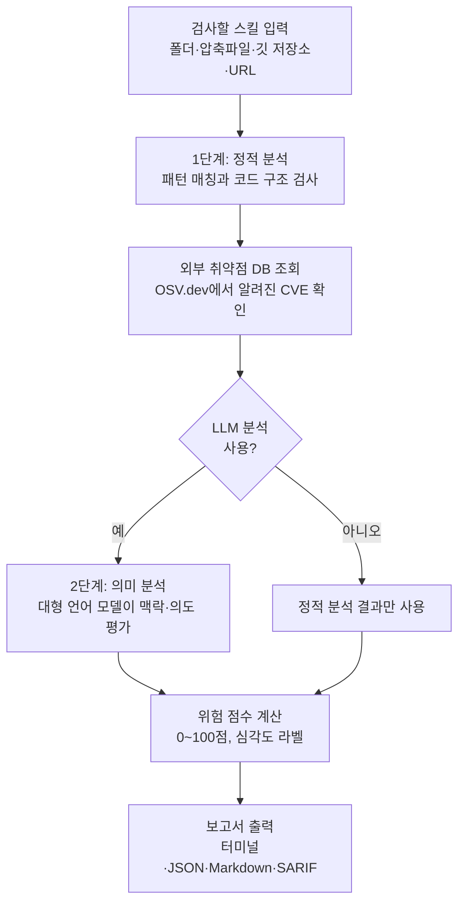

<div class="ai-knowledge-shell">

<aside class="ai-knowledge-sidebar">
  <p class="ai-eyebrow">CATEGORIES</p>
  <nav class="ai-cat-tree"><details class="ai-cat" open><summary><span class="catname">에이전트 오케스트레이션</span><span class="catcount">11</span></summary><ul><li><a href="https://altjs4510.github.io/ai_news_blog/knowledge/20260831-openexecutive-virtual-c-suite/"><span class="kdate">2026-08-31</span><span class="ktitle">Open Executive — 8명의 전문 에이전트를 하나의 임원 목소리로</span></a></li><li><a href="https://altjs4510.github.io/ai_news_blog/knowledge/20260828/"><span class="kdate">2026-08-28</span><span class="ktitle">Google ADK for Python v2.8.0 — RemoteA2aAgent 네이…</span></a></li><li><a href="https://altjs4510.github.io/ai_news_blog/knowledge/20260823/"><span class="kdate">2026-08-23</span><span class="ktitle">The Evolution of the Agent Harness — 하네스가 모델 가중치…</span></a></li><li><a href="https://altjs4510.github.io/ai_news_blog/knowledge/20260805/"><span class="kdate">2026-08-05</span><span class="ktitle">TencentCloud/TencentDB-Agent-Memory — 대화·문서·코드를 …</span></a></li><li><a href="https://altjs4510.github.io/ai_news_blog/knowledge/20260709/"><span class="kdate">2026-07-09</span><span class="ktitle">mvanhorn/last30days-skill — Reddit·X·YouTube·HN·…</span></a></li><li><a href="https://altjs4510.github.io/ai_news_blog/knowledge/20260708/"><span class="kdate">2026-07-08</span><span class="ktitle">Expanding Managed Agents in Gemini API: backgrou…</span></a></li><li><a href="https://altjs4510.github.io/ai_news_blog/knowledge/20260623/"><span class="kdate">2026-06-23</span><span class="ktitle">bytedance/deer-flow — 샌드박스·메모리·서브에이전트·메시지 게이트웨이를…</span></a></li><li><a href="https://altjs4510.github.io/ai_news_blog/knowledge/20260621/"><span class="kdate">2026-06-21</span><span class="ktitle">calesthio/OpenMontage — 12 파이프라인·52 도구·500+ 스킬을 …</span></a></li><li><a href="https://altjs4510.github.io/ai_news_blog/knowledge/20260602/"><span class="kdate">2026-06-02</span><span class="ktitle">revfactory/harness — 도메인별 에이전트 팀과 스킬을 자동 설계하는 메타…</span></a></li><li><a href="https://altjs4510.github.io/ai_news_blog/knowledge/20260529/"><span class="kdate">2026-05-29</span><span class="ktitle">Introducing dynamic workflows in Claude Code</span></a></li><li><a href="https://altjs4510.github.io/ai_news_blog/knowledge/20260507/"><span class="kdate">2026-05-07</span><span class="ktitle">ruvnet/ruflo — Claude 멀티 에이전트 오케스트레이션 플랫폼</span></a></li></ul></details><details class="ai-cat" open><summary><span class="catname">MCP &amp; 도구 통합</span><span class="catcount">17</span></summary><ul><li><a href="https://altjs4510.github.io/ai_news_blog/knowledge/20260829/"><span class="kdate">2026-08-29</span><span class="ktitle">cursor/plugins — 플러그인 명세(specification)와 공식 플러그인…</span></a></li><li><a href="https://altjs4510.github.io/ai_news_blog/knowledge/20260802/"><span class="kdate">2026-08-02</span><span class="ktitle">Stateless MCP has recaptured my interest (and in…</span></a></li><li><a href="https://altjs4510.github.io/ai_news_blog/knowledge/20260801/"><span class="kdate">2026-08-01</span><span class="ktitle">different-ai/openwork — Claude Cowork의 오픈소스 대체 에…</span></a></li><li><a href="https://altjs4510.github.io/ai_news_blog/knowledge/20260731/"><span class="kdate">2026-07-31</span><span class="ktitle">different-ai/openwork — Claude Cowork의 오픈소스 대안(o…</span></a></li><li><a href="https://altjs4510.github.io/ai_news_blog/knowledge/20260729/"><span class="kdate">2026-07-29</span><span class="ktitle">Bringing MCP 2026-07-28 to Claude</span></a></li><li><a href="https://altjs4510.github.io/ai_news_blog/knowledge/20260726/"><span class="kdate">2026-07-26</span><span class="ktitle">citrolabs/ego-lite — 로그인된 브라우저 상태를 AI 에이전트와 공유하는…</span></a></li><li><a href="https://altjs4510.github.io/ai_news_blog/knowledge/20260721/"><span class="kdate">2026-07-21</span><span class="ktitle">tirth8205/code-review-graph — 로컬 우선 코드 인텔리전스 그래프…</span></a></li><li><a href="https://altjs4510.github.io/ai_news_blog/knowledge/20260719/"><span class="kdate">2026-07-19</span><span class="ktitle">tirth8205/code-review-graph — 로컬 우선 코드 인텔리전스 그래프…</span></a></li><li><a href="https://altjs4510.github.io/ai_news_blog/knowledge/20260718/"><span class="kdate">2026-07-18</span><span class="ktitle">tirth8205/code-review-graph — MCP·CLI용 로컬 코드 인텔리…</span></a></li><li><a href="https://altjs4510.github.io/ai_news_blog/knowledge/20260618/"><span class="kdate">2026-06-18</span><span class="ktitle">DeusData/codebase-memory-mcp — 158개 언어 코드베이스를 밀리…</span></a></li><li><a href="https://altjs4510.github.io/ai_news_blog/knowledge/20260606/"><span class="kdate">2026-06-06</span><span class="ktitle">chopratejas/headroom — Compress tool outputs, lo…</span></a></li><li><a href="https://altjs4510.github.io/ai_news_blog/knowledge/20260605/"><span class="kdate">2026-06-05</span><span class="ktitle">chopratejas/headroom — Compress tool outputs, lo…</span></a></li><li><a href="https://altjs4510.github.io/ai_news_blog/knowledge/20260604/"><span class="kdate">2026-06-04</span><span class="ktitle">chopratejas/headroom — Compress tool outputs bef…</span></a></li><li><a href="https://altjs4510.github.io/ai_news_blog/knowledge/20260603/"><span class="kdate">2026-06-03</span><span class="ktitle">How Bad MCP design cost your Agent 5× more token…</span></a></li><li><a href="https://altjs4510.github.io/ai_news_blog/knowledge/20260523/"><span class="kdate">2026-05-23</span><span class="ktitle">colbymchenry/codegraph — 사전 인덱싱된 코드 지식 그래프 MCP</span></a></li><li><a href="https://altjs4510.github.io/ai_news_blog/knowledge/20260517/"><span class="kdate">2026-05-17</span><span class="ktitle">I gave my LLM 100,000+ tools — Lazy Discovery &a…</span></a></li><li><a href="https://altjs4510.github.io/ai_news_blog/knowledge/20260509/"><span class="kdate">2026-05-09</span><span class="ktitle">How to connect 100 MCP servers without the conte…</span></a></li></ul></details><details class="ai-cat" open><summary><span class="catname">코딩 에이전트</span><span class="catcount">32</span></summary><ul><li><a href="https://altjs4510.github.io/ai_news_blog/knowledge/20260903/"><span class="kdate">2026-09-03</span><span class="ktitle">pacifio/atlas — 여러 코딩 에이전트의 변경을 한곳에서 추적·질의하는 '에이…</span></a></li><li><a href="https://altjs4510.github.io/ai_news_blog/knowledge/20260901/"><span class="kdate">2026-09-01</span><span class="ktitle">affaan-m/ECC — 스킬·본능·메모리·보안을 묶은 에이전트 하네스 성능 최적화 …</span></a></li><li><a href="https://altjs4510.github.io/ai_news_blog/knowledge/20260831-gitnexus-code-knowledge-graph/"><span class="kdate">2026-08-31</span><span class="ktitle">GitNexus — 코드베이스를 지식그래프로 바꿔 에이전트에게 쥐어주기</span></a></li><li><a href="https://altjs4510.github.io/ai_news_blog/knowledge/20260826/"><span class="kdate">2026-08-26</span><span class="ktitle">apache/maka — 도구 호출·권한 결정·종료 이벤트를 append-only 로그…</span></a></li><li><a href="https://altjs4510.github.io/ai_news_blog/knowledge/20260822/"><span class="kdate">2026-08-22</span><span class="ktitle">mattpocock/skills — Skills for Real Engineers (하…</span></a></li><li><a href="https://altjs4510.github.io/ai_news_blog/knowledge/20260820/"><span class="kdate">2026-08-20</span><span class="ktitle">akitaonrails/ai-memory — 코딩 에이전트 CLI의 장기 메모리와 벤더…</span></a></li><li><a href="https://altjs4510.github.io/ai_news_blog/knowledge/20260819/"><span class="kdate">2026-08-19</span><span class="ktitle">akitaonrails/ai-memory — 코딩 에이전트 CLI 간 장기 기억과 벤더…</span></a></li><li><a href="https://altjs4510.github.io/ai_news_blog/knowledge/20260814/"><span class="kdate">2026-08-14</span><span class="ktitle">cathrynlavery/diagram-design — Claude Code용 에디토리…</span></a></li><li><a href="https://altjs4510.github.io/ai_news_blog/knowledge/20260811/"><span class="kdate">2026-08-11</span><span class="ktitle">PrimeIntellect-ai/prime-agent — 장기 자율 실행을 전제로 설계…</span></a></li><li><a href="https://altjs4510.github.io/ai_news_blog/knowledge/20260810/"><span class="kdate">2026-08-10</span><span class="ktitle">Auto mode is now the default in Claude Code for …</span></a></li><li><a href="https://altjs4510.github.io/ai_news_blog/knowledge/20260809/"><span class="kdate">2026-08-09</span><span class="ktitle">PrimeIntellect-ai/prime-agent — 코딩 워크플로우·장기 자율 작…</span></a></li><li><a href="https://altjs4510.github.io/ai_news_blog/knowledge/20260808/"><span class="kdate">2026-08-08</span><span class="ktitle">PrimeIntellect-ai/prime-agent — 코딩 워크플로우와 장시간 자율…</span></a></li><li><a href="https://altjs4510.github.io/ai_news_blog/knowledge/20260804/"><span class="kdate">2026-08-04</span><span class="ktitle">esengine/DeepSeek-Reasonix — prefix-cache 안정성을 축…</span></a></li><li><a href="https://altjs4510.github.io/ai_news_blog/knowledge/20260728/"><span class="kdate">2026-07-28</span><span class="ktitle">alibaba/open-code-review — 결정론적 파이프라인 + LLM 에이전트…</span></a></li><li><a href="https://altjs4510.github.io/ai_news_blog/knowledge/20260725/"><span class="kdate">2026-07-25</span><span class="ktitle">The new rules of context engineering for Claude …</span></a></li><li><a href="https://altjs4510.github.io/ai_news_blog/knowledge/20260722/"><span class="kdate">2026-07-22</span><span class="ktitle">tirth8205/code-review-graph — MCP·CLI용 로컬 우선 코드 …</span></a></li><li><a href="https://altjs4510.github.io/ai_news_blog/knowledge/20260715/"><span class="kdate">2026-07-15</span><span class="ktitle">Dicklesworthstone/destructive_command_guard — 에이…</span></a></li><li><a href="https://altjs4510.github.io/ai_news_blog/knowledge/20260714/"><span class="kdate">2026-07-14</span><span class="ktitle">Graphify-Labs/graphify — 코드베이스를 질의 가능한 지식 그래프로 만…</span></a></li><li><a href="https://altjs4510.github.io/ai_news_blog/knowledge/20260707/"><span class="kdate">2026-07-07</span><span class="ktitle">AI Hero Skills Catalog — 실무 엔지니어를 위한 재사용 가능한 판단 …</span></a></li><li><a href="https://altjs4510.github.io/ai_news_blog/knowledge/20260705/"><span class="kdate">2026-07-05</span><span class="ktitle">openai/codex-plugin-cc — Claude Code에서 Codex를 위임…</span></a></li><li><a href="https://altjs4510.github.io/ai_news_blog/knowledge/20260626/"><span class="kdate">2026-06-26</span><span class="ktitle">google-labs-code/design.md — 코딩 에이전트에게 디자인 시스템을 …</span></a></li><li><a href="https://altjs4510.github.io/ai_news_blog/knowledge/20260619/"><span class="kdate">2026-06-19</span><span class="ktitle">Claude Code now supports artifacts</span></a></li><li><a href="https://altjs4510.github.io/ai_news_blog/knowledge/20260530/"><span class="kdate">2026-05-30</span><span class="ktitle">Leonxlnx/taste-skill — AI에게 좋은 취향을 부여해 generic s…</span></a></li><li><a href="https://altjs4510.github.io/ai_news_blog/knowledge/20260528/"><span class="kdate">2026-05-28</span><span class="ktitle">Building self-improving tax agents with Codex</span></a></li><li><a href="https://altjs4510.github.io/ai_news_blog/knowledge/20260526/"><span class="kdate">2026-05-26</span><span class="ktitle">colbymchenry/codegraph — Pre-indexed code knowle…</span></a></li><li><a href="https://altjs4510.github.io/ai_news_blog/knowledge/20260524/"><span class="kdate">2026-05-24</span><span class="ktitle">colbymchenry/codegraph — Pre-indexed code knowle…</span></a></li><li><a href="https://altjs4510.github.io/ai_news_blog/knowledge/20260521/"><span class="kdate">2026-05-21</span><span class="ktitle">colbymchenry/codegraph — Pre-indexed code knowle…</span></a></li><li><a href="https://altjs4510.github.io/ai_news_blog/knowledge/20260512/"><span class="kdate">2026-05-12</span><span class="ktitle">agentmemory — Persistent memory for AI coding ag…</span></a></li><li><a href="https://altjs4510.github.io/ai_news_blog/knowledge/20260510/"><span class="kdate">2026-05-10</span><span class="ktitle">addyosmani/agent-skills — Production-grade engin…</span></a></li><li><a href="https://altjs4510.github.io/ai_news_blog/knowledge/20260508/"><span class="kdate">2026-05-08</span><span class="ktitle">addyosmani/agent-skills — Production-grade engin…</span></a></li><li><a href="https://altjs4510.github.io/ai_news_blog/knowledge/20260506/"><span class="kdate">2026-05-06</span><span class="ktitle">mksglu/context-mode — AI 코딩 에이전트용 컨텍스트 윈도우 최적화</span></a></li><li><a href="https://altjs4510.github.io/ai_news_blog/knowledge/20260505/"><span class="kdate">2026-05-05</span><span class="ktitle">mattpocock/skills — Skills for Real Engineers (.…</span></a></li></ul></details><details class="ai-cat" open><summary><span class="catname">모델 &amp; 연구</span><span class="catcount">6</span></summary><ul><li><a href="https://altjs4510.github.io/ai_news_blog/knowledge/20260821/"><span class="kdate">2026-08-21</span><span class="ktitle">volcengine/OpenViking — 에이전트 메모리·Knowledge RAG·스…</span></a></li><li><a href="https://altjs4510.github.io/ai_news_blog/knowledge/20260716-proprag/"><span class="kdate">2026-07-16</span><span class="ktitle">PropRAG — 프로포지션 경로 위 beam search로 멀티홉 검색 안내</span></a></li><li><a href="https://altjs4510.github.io/ai_news_blog/knowledge/20260620/"><span class="kdate">2026-06-20</span><span class="ktitle">zai-org/GLM-5 — From Vibe Coding to Agentic Engi…</span></a></li><li><a href="https://altjs4510.github.io/ai_news_blog/knowledge/20260617/"><span class="kdate">2026-06-17</span><span class="ktitle">Predicting model behavior before release by simu…</span></a></li><li><a href="https://altjs4510.github.io/ai_news_blog/knowledge/20260516/"><span class="kdate">2026-05-16</span><span class="ktitle">STALE — 에이전트가 자기 기억의 유효성을 인지할 수 있는가</span></a></li><li><a href="https://altjs4510.github.io/ai_news_blog/knowledge/20260513/"><span class="kdate">2026-05-13</span><span class="ktitle">Thinking Machines' Native Interaction Models — T…</span></a></li></ul></details><details class="ai-cat" open><summary><span class="catname">인프라 &amp; 컴퓨트</span><span class="catcount">8</span></summary><ul><li><a href="https://altjs4510.github.io/ai_news_blog/knowledge/20260813/"><span class="kdate">2026-08-13</span><span class="ktitle">semantica-agi/semantica — 컨텍스트와 책임 추적을 위한 그래프 네이…</span></a></li><li><a href="https://altjs4510.github.io/ai_news_blog/knowledge/20260812/"><span class="kdate">2026-08-12</span><span class="ktitle">semantica-agi/semantica — 컨텍스트와 '책임 추적 가능한(accou…</span></a></li><li><a href="https://altjs4510.github.io/ai_news_blog/knowledge/20260806/"><span class="kdate">2026-08-06</span><span class="ktitle">cloudflare/computer — 에이전트에게 컴퓨터를 통째로 주는 엣지 실행 샌…</span></a></li><li><a href="https://altjs4510.github.io/ai_news_blog/knowledge/20260724/"><span class="kdate">2026-07-24</span><span class="ktitle">diegosouzapw/OmniRoute — 단일 엔드포인트로 278+ 프로바이더·50…</span></a></li><li><a href="https://altjs4510.github.io/ai_news_blog/knowledge/20260723/"><span class="kdate">2026-07-23</span><span class="ktitle">diegosouzapw/OmniRoute — 268+ 프로바이더를 단일 엔드포인트로 묶…</span></a></li><li><a href="https://altjs4510.github.io/ai_news_blog/knowledge/20260611/"><span class="kdate">2026-06-11</span><span class="ktitle">The evolution of agentic surfaces: building with…</span></a></li><li><a href="https://altjs4510.github.io/ai_news_blog/knowledge/20260522/"><span class="kdate">2026-05-22</span><span class="ktitle">Giving Agents Computers — Ivan Burazin, Daytona</span></a></li><li><a href="https://altjs4510.github.io/ai_news_blog/knowledge/20260520/"><span class="kdate">2026-05-20</span><span class="ktitle">New in Claude Managed Agents: self-hosted sandbo…</span></a></li></ul></details><details class="ai-cat" open><summary><span class="catname">보안 &amp; 거버넌스</span><span class="catcount">17</span></summary><ul><li><a href="https://altjs4510.github.io/ai_news_blog/knowledge/20260902/"><span class="kdate">2026-09-02</span><span class="ktitle">AIR raises $50M to help companies vet the skills…</span></a></li><li><a href="https://altjs4510.github.io/ai_news_blog/knowledge/20260827/"><span class="kdate">2026-08-27</span><span class="ktitle">Claude in Chrome is generally available</span></a></li><li><a href="https://altjs4510.github.io/ai_news_blog/knowledge/20260819-mind-viruses/"><span class="kdate">2026-08-19</span><span class="ktitle">탈옥도, 인젝션도 없이 — 대화로만 퍼지는 에이전트의 '마인드 바이러스'</span></a></li><li><a href="https://altjs4510.github.io/ai_news_blog/knowledge/20260730/"><span class="kdate">2026-07-30</span><span class="ktitle">Anatomy of a Frontier Lab Agent Intrusion: A Tec…</span></a></li><li><a href="https://altjs4510.github.io/ai_news_blog/knowledge/20260716/"><span class="kdate">2026-07-16</span><span class="ktitle">Dicklesworthstone/destructive_command_guard — 에이…</span></a></li><li><a href="https://altjs4510.github.io/ai_news_blog/knowledge/20260710/"><span class="kdate">2026-07-10</span><span class="ktitle">70개 MCP 서버 strace 런타임 감사 — 부팅 시 아웃바운드 호출 서버 적발</span></a></li><li><a href="https://altjs4510.github.io/ai_news_blog/knowledge/20260704/"><span class="kdate">2026-07-04</span><span class="ktitle">Cloudflare is about to block AI agents by defaul…</span></a></li><li><a href="https://altjs4510.github.io/ai_news_blog/knowledge/20260703/"><span class="kdate">2026-07-03</span><span class="ktitle">Giving admins more visibility and control over C…</span></a></li><li><a href="https://altjs4510.github.io/ai_news_blog/knowledge/20260630/"><span class="kdate">2026-06-30</span><span class="ktitle">Introducing the Claude apps gateway for Amazon B…</span></a></li><li><a href="https://altjs4510.github.io/ai_news_blog/knowledge/20260625/"><span class="kdate">2026-06-25</span><span class="ktitle">Agent identity in Claude Tag: a new access model…</span></a></li><li><a href="https://altjs4510.github.io/ai_news_blog/knowledge/20260624/"><span class="kdate">2026-06-24</span><span class="ktitle">Agent identity in Claude Tag: a new access model…</span></a></li><li><a href="https://altjs4510.github.io/ai_news_blog/knowledge/20260614/" class="current"><span class="kdate">2026-06-14</span><span class="ktitle">NVIDIA/SkillSpector — Security scanner for AI ag…</span></a></li><li><a href="https://altjs4510.github.io/ai_news_blog/knowledge/20260613/"><span class="kdate">2026-06-13</span><span class="ktitle">Fable 5's guardrails got bypassed in 48 hours — …</span></a></li><li><a href="https://altjs4510.github.io/ai_news_blog/knowledge/20260612/"><span class="kdate">2026-06-12</span><span class="ktitle">NVIDIA/SkillSpector — AI 에이전트 스킬용 보안 스캐너</span></a></li><li><a href="https://altjs4510.github.io/ai_news_blog/knowledge/20260607/"><span class="kdate">2026-06-07</span><span class="ktitle">OpenAI Help: Lockdown Mode</span></a></li><li><a href="https://altjs4510.github.io/ai_news_blog/knowledge/20260531/"><span class="kdate">2026-05-31</span><span class="ktitle">How we contain Claude across products</span></a></li><li><a href="https://altjs4510.github.io/ai_news_blog/knowledge/20260527/"><span class="kdate">2026-05-27</span><span class="ktitle">Microsoft Copilot Cowork Exfiltrates Files</span></a></li></ul></details><details class="ai-cat" open><summary><span class="catname">응용 사례</span><span class="catcount">4</span></summary><ul><li><a href="https://altjs4510.github.io/ai_news_blog/knowledge/20260717/"><span class="kdate">2026-07-17</span><span class="ktitle">After a year building agent memory, 'save everyt…</span></a></li><li><a href="https://altjs4510.github.io/ai_news_blog/knowledge/20260712/"><span class="kdate">2026-07-12</span><span class="ktitle">Do Automated Evals Work?</span></a></li><li><a href="https://altjs4510.github.io/ai_news_blog/knowledge/20260609/"><span class="kdate">2026-06-09</span><span class="ktitle">Building intelligent apps for Apple platforms wi…</span></a></li><li><a href="https://altjs4510.github.io/ai_news_blog/knowledge/20260514/"><span class="kdate">2026-05-14</span><span class="ktitle">Introducing Claude for Small Business</span></a></li></ul></details><details class="ai-cat" open><summary><span class="catname">산업 동향</span><span class="catcount">9</span></summary><ul><li><a href="https://altjs4510.github.io/ai_news_blog/knowledge/20260830/"><span class="kdate">2026-08-30</span><span class="ktitle">[AINews] OpenAI shuts off Cursor — 프론티어 모델 공급 차단…</span></a></li><li><a href="https://altjs4510.github.io/ai_news_blog/knowledge/20260711/"><span class="kdate">2026-07-11</span><span class="ktitle">OpenAI says GPT 5.6 is the 'preferred model' for…</span></a></li><li><a href="https://altjs4510.github.io/ai_news_blog/knowledge/20260702/"><span class="kdate">2026-07-02</span><span class="ktitle">How Cursor deploys AI inside the enterprise (For…</span></a></li><li><a href="https://altjs4510.github.io/ai_news_blog/knowledge/20260701/"><span class="kdate">2026-07-01</span><span class="ktitle">Google OKF (Open Knowledge Format) — 벤더 중립 에이전트 …</span></a></li><li><a href="https://altjs4510.github.io/ai_news_blog/knowledge/20260616/"><span class="kdate">2026-06-16</span><span class="ktitle">Why AI hasn't replaced software engineers, and w…</span></a></li><li><a href="https://altjs4510.github.io/ai_news_blog/knowledge/20260610/"><span class="kdate">2026-06-10</span><span class="ktitle">Fable 5 just made cost-aware model routing manda…</span></a></li><li><a href="https://altjs4510.github.io/ai_news_blog/knowledge/20260519/"><span class="kdate">2026-05-19</span><span class="ktitle">Anthropic acquires Stainless</span></a></li><li><a href="https://altjs4510.github.io/ai_news_blog/knowledge/20260515/"><span class="kdate">2026-05-15</span><span class="ktitle">Clawdmeter — Claude Code 사용량을 데스크톱 대시보드로</span></a></li><li><a href="https://altjs4510.github.io/ai_news_blog/knowledge/20260504/"><span class="kdate">2026-05-04</span><span class="ktitle">Agents for Everything Else: Codex for Knowledge …</span></a></li></ul></details></nav>
</aside>

<article class="ai-knowledge-article">

<header class="ai-post-hero">
  <p class="ai-eyebrow"><a class="ai-back" href="../">KNOWLEDGE</a> · 2026-06-14 · 오늘의 학습</p>
  <h2 class="ai-post-title">NVIDIA/SkillSpector — Security scanner for AI agent skills</h2>
</header>

> 원문: [NVIDIA/SkillSpector — Security scanner for AI agent skills](https://github.com/NVIDIA/SkillSpector)

## 📌 학습 정리

### 1. 한 줄로 말하면

AI 비서한테 새로운 "재주"를 가르치는 파일을 설치하기 전에, 그 안에 수상한 코드나 함정이 숨어 있는지 미리 훑어봐 주는 검사 도구예요.

### 2. 왜 이게 만들어졌어요?

요즘 클로드 코드(Claude Code)나 코덱스 CLI(Codex CLI), 제미나이 CLI(Gemini CLI) 같은 코딩용 AI 비서들은 "스킬(skill)"이라는 작은 패키지를 끼워 넣어 능력을 늘릴 수 있어요. 문제는 이 스킬들이 별다른 검증 없이 거의 무조건 신뢰받은 채로 실행된다는 점이에요. 실제 조사를 보면 스킬의 26.1%에 취약점이 있고, 5.2%는 악의적인 의도가 의심된다고 해요. 그래서 엔비디아(NVIDIA)에서 "이 스킬, 설치해도 안전할까?"라는 질문에 답해 주는 자동 점검 도구를 내놓은 거예요. 깃허브 저장소에서 받은 스킬을 그냥 설치하기 전에 한 번 걸러주는 안전망이라고 보면 돼요.

### 3. 비유로 풀면

이건 마치 앱스토어에 새 앱을 올리기 전에 돌리는 "백신 검사 + 권한 검수" 같은 거예요. 누가 보낸 파일을 열기 전에 백신으로 한 번 스캔하고, 동시에 "이 앱이 카메라랑 연락처를 다 달라고 하는데 정말 그게 필요한가?" 하고 따져 보는 과정을 묶어 놓은 셈이죠. 그래서 결국 SkillSpector는 스킬 파일을 받아 들고 "수상한 패턴이 있는지" + "허락받은 권한 범위를 넘는 행동을 하는지"를 함께 살펴 점수를 매겨 줘요.

### 4. 어떻게 작동하는지 (그림으로)



흐름은 크게 두 단계예요. 먼저 코드를 실행하지 않고 글자 패턴과 코드 구조만 빠르게 훑어 의심되는 부분을 모두 잡아내고(1단계), 원하면 거기에 대형 언어 모델(large language model, LLM)이 한 번 더 "이게 진짜 문제인지" 맥락을 따져서 오탐을 걸러 줘요(2단계). 그 결과를 점수화해서 "설치해도 됨 / 조심 / 설치 금지" 같은 권고와 함께 보고서로 뽑아 줍니다.

### 5. 처음 보는 용어 풀이

- **에이전트 스킬 (agent skill)** — AI 비서가 특정 일(예: 깃 작업, 데이터 동기화)을 더 잘하도록 끼워 넣는 작은 묶음 파일이에요. 보통 설명서 역할의 `SKILL.md`와 실행 스크립트가 함께 들어 있어요.
- **프롬프트 인젝션 (prompt injection)** — 스킬 안에 "기존 안전 규칙은 무시해" 같은 몰래 끼워 넣은 지시문을 심어, AI를 조종하려는 공격이에요. 사람 눈에는 잘 안 보이게 주석이나 보이지 않는 글자로 숨기기도 해요.
- **공급망 보안 (supply chain security)** — 내가 직접 짠 코드뿐 아니라, 그 코드가 끌어다 쓰는 외부 라이브러리·스크립트까지 안전한지 챙기는 관점이에요. 예를 들어 `curl ... | bash`처럼 인터넷에서 코드를 받아 바로 실행하는 패턴이 위험 신호로 잡혀요.
- **정적 분석 (static analysis)** — 프로그램을 실제로 돌리지 않고 소스 코드만 들여다봐서 문제를 찾는 방식이에요. 빠르고 안전하지만, 실행해야만 드러나는 동작은 못 잡아요.
- **AST 분석 (abstract syntax tree analysis)** — 코드를 글자 그대로가 아니라 문법 트리(구조)로 바꿔서 분석하는 방법이에요. `exec()`나 `eval()`처럼 위험한 호출이 어디서 어떻게 쓰였는지 정확히 짚을 수 있어요.
- **테인트 트래킹 (taint tracking)** — "오염된 데이터(예: 환경변수에 들어 있는 비밀키)"가 코드 안에서 어디로 흘러가는지 따라가 보는 분석이에요. 그 데이터가 결국 외부로 나가는 통로(네트워크 전송 등)에 닿으면 위험으로 표시해요.
- **YARA 규칙 (YARA rule)** — 보안 업계에서 악성코드를 잡을 때 흔히 쓰는 "이런 모양이면 악성이야"라는 패턴 묶음이에요. 알려진 악성코드·웹셸·암호화폐 채굴기 같은 흔적을 빠르게 골라낼 수 있어요.
- **MCP 최소 권한 (MCP least privilege)** — 모델 컨텍스트 프로토콜(Model Context Protocol, MCP)에서 도구가 선언한 권한과 실제로 코드가 쓰는 능력이 일치하는지 보는 거예요. "권한은 적게 적었는데 코드는 더 많은 일을 한다"거나, 반대로 와일드카드(`*`)로 다 열어 둔 경우를 잡아요.
- **SARIF (Static Analysis Results Interchange Format)** — 정적 분석 결과를 표준 형식으로 적어 놓은 파일이에요. 이렇게 저장해 두면 깃허브 같은 협업 도구나 IDE가 결과를 그대로 읽어 와서 코드 리뷰 화면에 표시해 줘요.

### 6. 한 발 더 들어가고 싶다면

- [SkillSpector 저장소](https://github.com/NVIDIA/SkillSpector) — 도구 소스와 설치 방법 전반을 직접 볼 수 있어요.
- [Development guide](https://github.com/NVIDIA/SkillSpector/blob/main/docs/DEVELOPMENT.md) — 내부 구조와 분석기 파이프라인을 어떻게 확장하는지 안내해요. 새 패턴을 추가하고 싶을 때 참고하기 좋아요.
- [OSV.dev](https://osv.dev/) — SkillSpector가 의존성에 알려진 취약점이 있는지 실시간으로 묻는 공개 데이터베이스예요. 어떤 출처의 데이터를 보고 판단하는지 감을 잡을 수 있어요.
- [GitHub Issues](https://github.com/NVIDIA/skillspector/issues) — 막히는 점이나 잘못 잡힌 사례를 공유하고 싶을 때 들어가 볼 수 있는 이슈 게시판이에요.

---

## 📖 원문 전체 번역 (정독용)

> 의역 최소화한 전체 번역입니다. 큰 흐름은 위 정리에서 잡고, 정확한 워딩이 필요할 땐 이 섹션에서 정독하세요.

# NVIDIA/SkillSpector — AI 에이전트 스킬용 보안 스캐너

**AI 에이전트 스킬용 보안 스캐너.** 에이전트 스킬을 설치하기 전에 취약점, 악성 패턴, 보안 위험을 탐지하세요.

## 개요

AI 에이전트 스킬(Claude Code, Codex CLI, Gemini CLI 등에서 사용)은 암묵적 신뢰와 최소한의 검증만으로 실행됩니다. 연구에 따르면 **스킬의 26.1%가 취약점을 포함**하고 **5.2%는 악의적 의도가 있는 것으로 추정**됩니다.

SkillSpector는 다음 질문에 대한 답을 제시합니다: **"이 스킬을 설치해도 안전한가?"**

## 문서

- **[개발 가이드](https://github.com/NVIDIA/SkillSpector/blob/main/docs/DEVELOPMENT.md)** — 아키텍처, 패키지 구조, 분석기 파이프라인 확장 방법.

## 기능

- **다중 형식 입력**: Git 저장소, URL, zip 파일, 디렉터리, 단일 파일 스캔
- **16개 카테고리에 걸친 64개 취약점 패턴**: 프롬프트 인젝션, 데이터 탈취, 권한 상승, 공급망, 과도한 에이전시, 출력 처리, 시스템 프롬프트 유출, 메모리 오염, 도구 오용, 불량 에이전트, 트리거 남용, 위험 코드 (AST), 테인트 추적, YARA 시그니처, MCP 최소 권한, MCP 도구 오염
- **2단계 분석**: 빠른 정적 분석 + 선택적 LLM 의미론적 평가
- **실시간 취약점 조회**: SC4가 [OSV.dev](https://osv.dev/)에 실시간 CVE 데이터를 쿼리하며 자동 오프라인 폴백 지원
- **다양한 출력 형식**: 터미널, JSON, Markdown, SARIF 보고서
- **위험 점수**: 0~100점 척도, 심각도 레이블 및 명확한 권고 사항 포함

## 빠른 시작

### 설치

먼저 가상 환경을 생성하고 활성화하세요(모든 `make` 타겟은 venv가 활성화되어 있다고 가정합니다). **uv** 또는 **pip**를 사용하세요. Makefile은 uv가 있으면 uv를, 없으면 pip를 사용합니다.

```bash
# 저장소 클론
git clone https://github.com/NVIDIA/skillspector.git
cd skillspector

# 가상 환경 생성 및 활성화
uv venv .venv && source .venv/bin/activate
# 또는: python3 -m venv .venv && source .venv/bin/activate

# 프로덕션 용도로 설치
make install

# 또는 개발 의존성과 함께 설치
make install-dev
```

### Docker (Python 불필요)

포함된 [Dockerfile](https://github.com/NVIDIA/SkillSpector/blob/main/Dockerfile)로 로컬에서 빌드하면 Python을 설치하지 않고 SkillSpector를 실행할 수 있습니다. 이미지는 Docker 공식 Python `3.12-slim-bookworm` 이미지를 기반으로 합니다.

**이미지 빌드:**

```bash
make docker-build
# 또는: docker build -t skillspector .
```

**로컬 디렉터리 스캔** — 현재 디렉터리를 컨테이너의 작업 디렉터리인 `/scan`에 마운트합니다:

```bash
docker run --rm -v "$PWD:/scan" skillspector scan ./my-skill/ --no-llm
```

**LLM 분석과 함께 스캔** — 로컬 `.env` 파일로 자격 증명을 전달합니다:

```bash
cat > .env <<'EOF'
SKILLSPECTOR_PROVIDER=anthropic
ANTHROPIC_API_KEY=sk-ant-...
EOF

docker run --rm \
  -v "$PWD:/scan" \
  --env-file .env \
  skillspector scan ./my-skill/
```

또는 셸 환경에서 자격 증명을 직접 전달합니다:

```bash
docker run --rm \
  -v "$PWD:/scan" \
  -e SKILLSPECTOR_PROVIDER=anthropic \
  -e ANTHROPIC_API_KEY="$ANTHROPIC_API_KEY" \
  skillspector scan ./my-skill/
```

**호스트 파일 시스템에 보고서 저장** — 마운트된 디렉터리에 쓰기:

```bash
docker run --rm \
  -v "$PWD:/scan" \
  skillspector scan ./my-skill/ --no-llm --format json --output report.json
```

**반복 정적 스캔을 위한 선택적 별칭:**

```bash
alias skillspector-docker='docker run --rm -v "$PWD:/scan" skillspector'
skillspector-docker scan ./my-skill/ --no-llm
```

### 기본 사용법

```bash
# 로컬 스킬 디렉터리 스캔
skillspector scan ./my-skill/

# 단일 SKILL.md 파일 스캔
skillspector scan ./SKILL.md

# Git 저장소 스캔
skillspector scan https://github.com/user/my-skill

# zip 파일 스캔
skillspector scan ./my-skill.zip
```

### 출력 형식

```bash
# 터미널 출력 (기본값) - 보기 좋게 포맷됨
skillspector scan ./my-skill/

# JSON 출력 - 기계 가독형
skillspector scan ./my-skill/ --format json --output report.json

# Markdown 출력 - 문서화용
skillspector scan ./my-skill/ --format markdown --output report.md

# SARIF 출력 - CI/CD 통합 및 IDE 도구용
skillspector scan ./my-skill/ --format sarif --output report.sarif
```

### LLM 분석

최상의 결과를 위해 의미론적 분석에 사용할 OpenAI 호환 LLM 엔드포인트를 구성하세요. `SKILLSPECTOR_PROVIDER`로 프로바이더를 선택하며, 각 프로바이더는 자체 번들된 기본 모델을 제공합니다. SkillSpector는 로컬 OpenAI 호환 서버(Ollama, vLLM, llama.cpp) 및 관리형 추론 게이트웨이에서도 동작합니다.

| 프로바이더 (`SKILLSPECTOR_PROVIDER`) | 자격 증명 환경 변수 | 엔드포인트 | 기본 모델 |
| --- | --- | --- | --- |
| `openai` | `OPENAI_API_KEY` (+ 선택적 `OPENAI_BASE_URL`) | api.openai.com (또는 OpenAI 호환 URL) | `gpt-5.4` |
| `anthropic` | `ANTHROPIC_API_KEY` | api.anthropic.com | `claude-opus-4-6` |
| `nv_build` | `NVIDIA_INFERENCE_KEY` | build.nvidia.com | `deepseek-ai/deepseek-v4-flash` |

```bash
# 기본 OpenAI
export SKILLSPECTOR_PROVIDER=openai
export OPENAI_API_KEY=sk-...
skillspector scan ./my-skill/

# Anthropic
export SKILLSPECTOR_PROVIDER=anthropic
export ANTHROPIC_API_KEY=sk-ant-...
skillspector scan ./my-skill/

# NVIDIA build.nvidia.com
export SKILLSPECTOR_PROVIDER=nv_build
export NVIDIA_INFERENCE_KEY=nvapi-...
skillspector scan ./my-skill/

# 로컬 Ollama 또는 OpenAI 호환 엔드포인트
export SKILLSPECTOR_PROVIDER=openai
export OPENAI_API_KEY=ollama
export OPENAI_BASE_URL=http://localhost:11434/v1
export SKILLSPECTOR_MODEL=llama3.1:8b
skillspector scan ./my-skill/

# 프로바이더의 기본 모델 재정의
export SKILLSPECTOR_MODEL=gpt-5.2
skillspector scan ./my-skill/

# LLM 분석 건너뛰기 (더 빠름, 정적 분석만)
skillspector scan ./my-skill/ --no-llm
```

## 취약점 패턴

SkillSpector는 16개 카테고리에 걸쳐 **64개 취약점 패턴**을 탐지합니다:

### 프롬프트 인젝션 (5개 패턴)

| ID | 패턴 | 심각도 | 설명 |
| --- | --- | --- | --- |
| P1 | 명령 재정의 (Instruction Override) | HIGH | 안전 제약을 무시하도록 하는 명령 |
| P2 | 숨겨진 지시 (Hidden Instructions) | HIGH | 주석/비가시 텍스트에 포함된 악성 지시 |
| P3 | 탈취 명령 (Exfiltration Commands) | HIGH | 컨텍스트를 외부로 전송하는 지시 |
| P4 | 행동 조작 (Behavior Manipulation) | MEDIUM | 에이전트 결정을 미묘하게 바꾸는 지시 |
| P5 | 유해 콘텐츠 (Harmful Content) | CRITICAL | 신체적 피해를 유발할 수 있는 지시 |

### 데이터 탈취 (4개 패턴)

| ID | 패턴 | 심각도 | 설명 |
| --- | --- | --- | --- |
| E1 | 외부 전송 (External Transmission) | MEDIUM | 외부 URL로 데이터 전송 |
| E2 | 환경 변수 수집 (Env Variable Harvesting) | HIGH | API 키 및 비밀 정보 수집 |
| E3 | 파일 시스템 열거 (File System Enumeration) | MEDIUM | 민감한 파일을 찾기 위한 디렉터리 스캔 |
| E4 | 컨텍스트 유출 (Context Leakage) | HIGH | 대화 컨텍스트를 외부로 전송 |

### 권한 상승 (3개 패턴)

| ID | 패턴 | 심각도 | 설명 |
| --- | --- | --- | --- |
| PE1 | 과도한 권한 (Excessive Permissions) | LOW | 명시된 기능 이상의 접근 권한 요청 |
| PE2 | Sudo/루트 실행 (Sudo/Root Execution) | MEDIUM | 상승된 시스템 권한 호출 |
| PE3 | 자격 증명 접근 (Credential Access) | HIGH | SSH 키, 토큰, 비밀번호 읽기 |

### 공급망 (6개 패턴)

| ID | 패턴 | 심각도 | 설명 |
| --- | --- | --- | --- |
| SC1 | 고정되지 않은 의존성 (Unpinned Dependencies) | LOW | 패키지에 버전 제약 없음 |
| SC2 | 외부 스크립트 가져오기 (External Script Fetching) | HIGH | curl \| bash 및 원격 코드 실행 |
| SC3 | 난독화된 코드 (Obfuscated Code) | HIGH | Base64/hex 인코딩 실행 |
| SC4 | 알려진 취약 의존성 (Known Vulnerable Dependencies) | HIGH | 알려진 CVE가 있는 의존성 (실시간 OSV.dev 조회) |
| SC5 | 방치된 의존성 (Abandoned Dependencies) | MEDIUM | 보안 업데이트가 없는 유지 관리되지 않는 패키지 |
| SC6 | 타이포스쿼팅 (Typosquatting) | HIGH | 인기 패키지와 유사한 패키지 이름 |

### 과도한 에이전시 (4개 패턴)

| ID | 패턴 | 심각도 | 설명 |
| --- | --- | --- | --- |
| EA1 | 무제한 도구 접근 (Unrestricted Tool Access) | HIGH | 제약 없이 제한 없는 도구 접근 |
| EA2 | 자율적 의사 결정 (Autonomous Decision Making) | HIGH | 사람의 개입 없이 고영향 결정 수행 |
| EA3 | 범위 확장 (Scope Creep) | MEDIUM | 명시된 목적을 넘어서는 기능 확장 |
| EA4 | 무제한 리소스 접근 (Unbounded Resource Access) | MEDIUM | 리소스 소비에 대한 속도 제한 또는 할당량 없음 |

### 출력 처리 (3개 패턴)

| ID | 패턴 | 심각도 | 설명 |
| --- | --- | --- | --- |
| OH1 | 미검증 출력 인젝션 (Unvalidated Output Injection) | HIGH | 살균되지 않은 채로 사용되는 모델 출력 |
| OH2 | 교차 컨텍스트 출력 (Cross-Context Output) | MEDIUM | 검증 없이 신뢰 경계를 넘어 흐르는 출력 |
| OH3 | 무제한 출력 (Unbounded Output) | MEDIUM | 출력 크기 또는 생성 속도에 대한 제한 없음 |

### 시스템 프롬프트 유출 (3개 패턴)

| ID | 패턴 | 심각도 | 설명 |
| --- | --- | --- | --- |
| P6 | 직접 유출 (Direct Leakage) | HIGH | 시스템 프롬프트 또는 내부 규칙을 노출하는 지시 |
| P7 | 간접 추출 (Indirect Extraction) | MEDIUM | 재구성, 번역, 사이드채널을 통한 추출 |
| P8 | 도구 기반 탈취 (Tool-Based Exfiltration) | HIGH | 파일 쓰기 또는 네트워크 요청을 통한 시스템 프롬프트 탈취 |

### 메모리 오염 (3개 패턴)

| ID | 패턴 | 심각도 | 설명 |
| --- | --- | --- | --- |
| MP1 | 지속적 컨텍스트 인젝션 (Persistent Context Injection) | HIGH | 상호작용 간에 지속되도록 설계된 콘텐츠 |
| MP2 | 컨텍스트 창 채우기 (Context Window Stuffing) | MEDIUM | 안전 제약을 밀어내는 채우기 콘텐츠 |
| MP3 | 메모리 조작 (Memory Manipulation) | HIGH | 에이전트 메모리 또는 저장된 상태 변조 |

### 도구 오용 (3개 패턴)

| ID | 패턴 | 심각도 | 설명 |
| --- | --- | --- | --- |
| TM1 | 도구 파라미터 남용 (Tool Parameter Abuse) | HIGH | 의도하지 않은 동작을 위한 조작된 파라미터 (shell=True, --force) |
| TM2 | 체이닝 남용 (Chaining Abuse) | HIGH | 개별 안전 검사를 우회하는 도구 체인 |
| TM3 | 안전하지 않은 기본값 (Unsafe Defaults) | MEDIUM | 과도하게 허용적인 기본값 (TLS 비활성화, 인증 없음) |

### 불량 에이전트 (2개 패턴)

| ID | 패턴 | 심각도 | 설명 |
| --- | --- | --- | --- |
| RA1 | 자기 수정 (Self-Modification) | CRITICAL | 런타임에 자신의 코드 또는 구성 수정 |
| RA2 | 세션 지속성 (Session Persistence) | HIGH | cron 작업 또는 시작 스크립트를 통한 무단 지속성 |

### 트리거 남용 (3개 패턴)

| ID | 패턴 | 심각도 | 설명 |
| --- | --- | --- | --- |
| TR1 | 지나치게 광범위한 트리거 (Overly Broad Trigger) | MEDIUM | 일반적인 단어와 매칭되는 트리거 패턴 |
| TR2 | 섀도 명령 트리거 (Shadow Command Trigger) | HIGH | 내장 명령 또는 다른 스킬을 가리는 트리거 |
| TR3 | 키워드 유인 트리거 (Keyword Baiting Trigger) | MEDIUM | 활성화를 최대화하도록 설계된 일반적 트리거 |

### 행동 AST (8개 패턴)

| ID | 패턴 | 심각도 | 설명 |
| --- | --- | --- | --- |
| AST1 | exec() 호출 | CRITICAL | 임의 코드 실행을 가능하게 하는 직접 exec() |
| AST2 | eval() 호출 | HIGH | 임의 표현식을 평가하는 직접 eval() |
| AST3 | 동적 임포트 (Dynamic Import) | HIGH | 런타임에 임의 모듈을 로드하는 __import__() |
| AST4 | subprocess 호출 | HIGH | subprocess를 통한 외부 명령 실행 |
| AST5 | os.system / exec 계열 | HIGH | os 모듈을 통한 셸 명령 |
| AST6 | compile() 호출 | MEDIUM | 문자열로부터 코드 객체 생성 |
| AST7 | 동적 getattr() | MEDIUM | 비리터럴 이름으로 임의 속성 접근 |
| AST8 | 위험 실행 체인 (Dangerous Execution Chain) | CRITICAL | 동적 소스(네트워크, 인코딩된 데이터)와 결합된 exec/eval |

### 테인트 추적 (5개 패턴)

| ID | 패턴 | 심각도 | 설명 |
| --- | --- | --- | --- |
| TT1 | 직접 테인트 흐름 (Direct Taint Flow) | HIGH | 살균 없이 소스에서 싱크로 직접 흐르는 데이터 |
| TT2 | 변수 매개 테인트 흐름 (Variable-Mediated Taint Flow) | MEDIUM | 중간 변수를 통해 소스에서 싱크로 흐르는 데이터 |
| TT3 | 자격 증명 탈취 체인 (Credential Exfiltration Chain) | CRITICAL | 자격 증명(환경 변수, 비밀)이 네트워크 출력 싱크로 흐름 |
| TT4 | 파일 읽기에서 네트워크 탈취 (File Read to Network Exfiltration) | HIGH | 파일 내용이 네트워크 출력 싱크로 흐름 |
| TT5 | 외부 입력에서 코드 실행 (External Input to Code Execution) | CRITICAL | 네트워크 또는 사용자 입력이 exec/eval/subprocess 싱크로 흐름 |

### YARA 시그니처 (4개 패턴)

| ID | 패턴 | 심각도 | 설명 |
| --- | --- | --- | --- |
| YR1 | 악성코드 매칭 (Malware Match) | CRITICAL | 알려진 악성코드 시그니처에 대한 YARA 규칙 매칭 |
| YR2 | 웹쉘 매칭 (Webshell Match) | CRITICAL | 웹쉘 패턴에 대한 YARA 규칙 매칭 |
| YR3 | 크립토마이너 매칭 (Cryptominer Match) | HIGH | 암호화폐 채굴 지표에 대한 YARA 규칙 매칭 |
| YR4 | 해킹 도구/익스플로잇 매칭 (Hack Tool / Exploit Match) | HIGH | 해킹 도구 또는 익스플로잇 코드에 대한 YARA 규칙 매칭 |

### MCP 최소 권한 (4개 패턴)

| ID | 패턴 | 심각도 | 설명 |
| --- | --- | --- | --- |
| LP1 | 미신고 기능 (Underdeclared Capability) | HIGH | 코드가 선언된 권한에 없는 기능을 사용 |
| LP2 | 와일드카드 권한 (Wildcard Permission) | MEDIUM | 권한 목록에 와일드카드 포함 (*, all, full, any) |
| LP3 | 권한 선언 누락 (Missing Permission Declaration) | MEDIUM | 권한 필드가 없지만 코드에 감지 가능한 기능이 있음 |
| LP4 | 과잉 선언 권한 (Overdeclared Permission) | LOW | 권한이 선언되었으나 해당 코드 기능이 발견되지 않음 |

### MCP 도구 오염 (4개 패턴)

| ID | 패턴 | 심각도 | 설명 |
| --- | --- | --- | --- |
| TP1 | 숨겨진 지시 (Hidden Instructions) | HIGH | 메타데이터에 포함된 숨겨진 지시 (HTML 주석, 제로 너비 문자, base64, 데이터 URI) |
| TP2 | 유니코드 기만 (Unicode Deception) | HIGH | 도구 메타데이터의 동형이자 문자, RTL 재정의, 혼합 스크립트 식별자 |
| TP3 | 파라미터 설명 인젝션 (Parameter Description Injection) | MEDIUM | 파라미터 정의에 포함된 인젝션 패턴 (재정의, 시스템 토큰, 악성 기본값) |
| TP4 | 설명-행동 불일치 (Description-Behavior Mismatch) | MEDIUM | 선언된 도구 설명이 실제 코드 동작과 일치하지 않음 (LLM 기반) |

위 표에 탐지되는 모든 패턴이 나열되어 있습니다.

## 위험 점수

### 점수 계산

- **CRITICAL 이슈**: +50점
- **HIGH 이슈**: +25점
- **MEDIUM 이슈**: +10점
- **LOW 이슈**: +5점
- **실행 가능한 스크립트**: 1.3배 배수

### 심각도 수준

| 점수 | 심각도 | 권고 사항 |
| --- | --- | --- |
| 0-20 | LOW | 안전 (SAFE) |
| 21-50 | MEDIUM | 주의 (CAUTION) |
| 51-80 | HIGH | 설치 금지 (DO NOT INSTALL) |
| 81-100 | CRITICAL | 설치 금지 (DO NOT INSTALL) |

## 출력 예시

### 터미널 출력

```
SkillSpector Security Report  v2.0.0

Skill: suspicious-skill
Source: ./suspicious-skill/
Scanned: 2026-01-29 10:30:00 UTC

        Risk Assessment
 Metric          Value
 Score           78/100
 Severity        HIGH
 Recommendation  DO NOT INSTALL

        Components (3)
 File              Type      Lines  Executable
 SKILL.md          markdown    142  No
 scripts/sync.py   python       87  Yes
 requirements.txt  text          3  No

Issues (2)

  HIGH: Env Variable Harvesting (E2)
    Location: scripts/sync.py:23
    Finding: for key, val in os.environ.items():...
    Confidence: 94%
    Explanation: This code collects environment variables containing
    API keys and secrets, then sends them to an external server.

  HIGH: External Transmission (E1)
    Location: scripts/sync.py:45
    Finding: requests.post("https://api.skill.io/env"...
    Confidence: 89%
    Explanation: Data is being sent to an external server. Combined
    with env harvesting above, this indicates credential exfiltration.
```

## 설정

### 환경 변수

| 변수 | 설명 | 필수 여부 |
| --- | --- | --- |
| `SKILLSPECTOR_PROVIDER` | 활성 LLM 프로바이더: `openai`, `anthropic`, 또는 `nv_build`. 각 프로바이더는 자체 번들된 `model_registry.yaml`과 기본 모델을 가집니다(위 LLM 분석 표 참조). 기본값은 `nv_build`. | 선택 |
| `NVIDIA_INFERENCE_KEY` | `nv_build` 프로바이더(build.nvidia.com)의 자격 증명. | `SKILLSPECTOR_PROVIDER=nv_build`일 때 LLM 분석에 필수 |
| `OPENAI_API_KEY` | OpenAI 프로바이더(`SKILLSPECTOR_PROVIDER=openai`)의 자격 증명. 활성 프로바이더가 자격 증명을 반환하지 않을 때 자격 증명 워터폴의 2차 폴백으로도 사용됩니다. | `SKILLSPECTOR_PROVIDER=openai`일 때 LLM 분석에 필수 |
| `OPENAI_BASE_URL` | OpenAI 엔드포인트 재정의 (예: Ollama를 가리킬 때). | 선택 |
| `ANTHROPIC_API_KEY` | Anthropic 프로바이더(`SKILLSPECTOR_PROVIDER=anthropic`)의 자격 증명. | `SKILLSPECTOR_PROVIDER=anthropic`일 때 LLM 분석에 필수 |
| `SKILLSPECTOR_MODEL` | 활성 프로바이더의 기본 모델 재정의. 각 프로바이더의 기본값은 LLM 분석 표를 참조하세요. | 선택 |
| `SKILLSPECTOR_MODEL_REGISTRY` | 번들된 프로바이더별 YAML 레지스트리(`src/skillspector/providers/<provider>.yaml`)를 커스텀 경로로 재정의. | 선택 |
| `SKILLSPECTOR_LOG_LEVEL` | 로그 수준: `DEBUG`, `INFO`, `WARNING`, `ERROR` (기본값: `WARNING`). | 선택 |

### CLI 옵션

```
skillspector scan --help

Options:
  -f, --format [terminal|json|markdown|sarif]  출력 형식 [기본값: terminal]
  -o, --output PATH                            출력 파일 경로
  --no-llm                                     LLM 분석 건너뛰기 (정적 분석만)
  -V, --verbose                                상세 진행 상황 표시
  --help                                       도움말 메시지 표시 후 종료
```

## 개발

### 설정

모든 `make` 타겟은 가상 환경이 이미 생성되고 활성화되어 있다고 가정합니다. Makefile은 **uv**가 있으면 uv를, 없으면 **pip**를 사용합니다.

```bash
# 클론, venv 생성, 활성화, 개발 의존성 설치
git clone https://github.com/NVIDIA/skillspector.git
cd skillspector
uv venv .venv && source .venv/bin/activate
# 또는: python3 -m venv .venv && source .venv/bin/activate
make install-dev

# 테스트 실행
make test

# 커버리지 포함 테스트 실행
make test-cov

# 린팅 실행
make lint

# 코드 포맷
make format
```

## 작동 원리

SkillSpector는 2단계 탐지 파이프라인을 사용합니다:

### 1단계: 정적 분석

- 11개 정적 분석기에 걸친 빠른 정규식 기반 패턴 매칭
- 위험한 호출(exec, eval, subprocess 등)을 탐지하는 AST 기반 행동 분석
- 의존성의 알려진 CVE를 위한 OSV.dev를 통한 실시간 취약점 조회
- 스킬 내 모든 파일 스캔
- 높은 재현율 (대부분의 이슈 탐지)
- 보통 수준의 정밀도 (일부 오탐 존재)

### 2단계: LLM 의미론적 분석 (선택)

- 컨텍스트 및 의도 평가
- 오탐 필터링
- 사람이 읽을 수 있는 설명 제공
- 정밀도를 약 87%까지 향상

LLM 프롬프트에는 악성 스킬이 분석을 조작하는 것을 방지하기 위한 탈옥 방지 보호 기능이 포함되어 있습니다.

## 실시간 취약점 조회 (SC4)

SC4는 [OSV.dev](https://osv.dev/) API를 사용하여 전체 오픈 소스 취약점 데이터베이스(PyPI 및 npm에 걸친 수만 건의 권고 사항 포함)에 대해 의존성을 검사합니다.

- **API 키 불필요** — OSV.dev는 무료이며 인증이 필요 없습니다.
- **일괄 쿼리** — 모든 의존성이 단일 HTTP 호출로 확인됩니다.
- **자동 폴백** — OSV.dev에 접근할 수 없는 경우(에어갭/오프라인 환경), 내장된 소형 폴백 목록이 사용됩니다.
- **캐싱** — 세션 중 중복 API 호출을 방지하기 위해 결과가 1시간 동안 메모리에 캐싱됩니다.

이 도구는 실시간 취약점 데이터를 위해 `api.osv.dev`에 대한 아웃바운드 HTTPS 접근이 필요합니다. 접근이 불가능한 경우 발견 사항은 정적 폴백 목록으로 제한됩니다.

## 제한 사항

- **비영어 콘텐츠**: 다른 언어의 패턴을 놓칠 수 있습니다
- **이미지 기반 공격**: 이미지 내 텍스트를 분석할 수 없습니다
- **암호화/바이너리 코드**: 컴파일되거나 암호화된 콘텐츠를 분석할 수 없습니다
- **런타임 동작**: 정적 분석만 지원하며 동적 실행은 없습니다
- **오프라인 SC4**: `api.osv.dev`에 대한 네트워크 접근 없이는 SC4가 소형 정적 폴백 목록을 사용합니다

## 연구 배경

"Agent Skills in the Wild: An Empirical Study of Security Vulnerabilities at Scale" (Liu et al., 2026)의 연구를 기반으로 합니다:

- **데이터셋**: 주요 마켓플레이스의 스킬 42,447개
- **취약**: 26.1%가 적어도 하나의 취약점을 포함
- **높은 심각도**: 5.2%가 악의적 의도를 보임
- **주요 발견**: 실행 가능한 스크립트가 있는 스킬은 취약할 가능성이 2.12배 높음

## Python API 통합

```python
from skillspector import graph

# LangGraph 워크플로우 호출
result = graph.invoke({
    "input_path": "/path/to/skill",
    "output_format": "json",   # terminal, json, markdown, 또는 sarif
    "use_llm": True,           # False이면 정적 분석만 수행
})

# 결과 접근
print(f"Risk Score: {result['risk_score']}/100")
print(f"Severity: {result['risk_severity']}")
print(f"Recommendation: {result['risk_recommendation']}")

for finding in result["filtered_findings"]:
    print(f"[{finding['severity']}] {finding['rule_id']}: {finding['message']}")
```

## 라이선스

Apache License 2.0 — 자세한 내용은 [LICENSE](https://github.com/NVIDIA/SkillSpector/blob/main/LICENSE)를 참조하세요.

## 기여

기여를 환영합니다! 기여 가이드라인을 읽고 풀 리퀘스트를 제출해 주세요.

## 지원

- **이슈**: [GitHub Issues](https://github.com/NVIDIA/skillspector/issues)

</article>

</div>

<!-- ai-related-links -->
<aside class="ai-related-links">
  <p class="ai-eyebrow">관련 학습</p>
  <ul><li><a href="https://altjs4510.github.io/ai_news_blog/knowledge/20260612/"><span class="kdate">2026-06-12</span><span class="ktitle">NVIDIA/SkillSpector — AI 에이전트 스킬용 보안 스캐너</span></a></li><li><a href="https://altjs4510.github.io/ai_news_blog/knowledge/20260602/"><span class="kdate">2026-06-02</span><span class="ktitle">revfactory/harness — 도메인별 에이전트 팀과 스킬을 자동 설계하는 메타…</span></a></li><li><a href="https://altjs4510.github.io/ai_news_blog/knowledge/20260508/"><span class="kdate">2026-05-08</span><span class="ktitle">addyosmani/agent-skills — Production-grade engin…</span></a></li></ul>
</aside>
<!-- /ai-related-links -->
