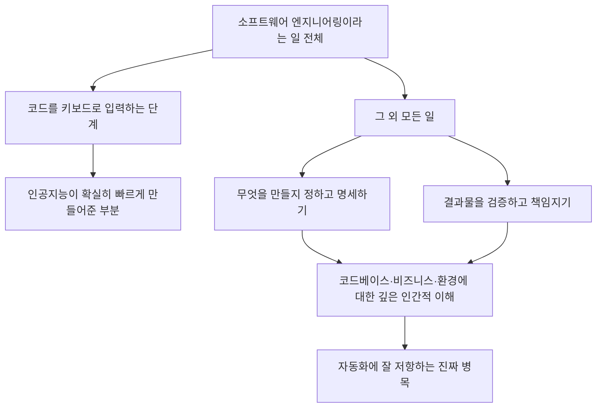

<aside class="ai-knowledge-sidebar">
  
CATEGORIES

  <nav class="ai-cat-tree">

에이전트 오케스트레이션6
<ul><li><a href="https://altjs4510.github.io/ai_news_blog/knowledge/20260611/">2026-06-11The evolution of agentic surfaces: building with…</a></li><li><a href="https://altjs4510.github.io/ai_news_blog/knowledge/20260602/">2026-06-02revfactory/harness — 도메인별 에이전트 팀과 스킬을 자동 설계하는 메타…</a></li><li><a href="https://altjs4510.github.io/ai_news_blog/knowledge/20260529/">2026-05-29Introducing dynamic workflows in Claude Code</a></li><li><a href="https://altjs4510.github.io/ai_news_blog/knowledge/20260520/">2026-05-20New in Claude Managed Agents: self-hosted sandbo…</a></li><li><a href="https://altjs4510.github.io/ai_news_blog/knowledge/20260507/">2026-05-07ruvnet/ruflo — Claude 멀티 에이전트 오케스트레이션 플랫폼</a></li><li><a href="https://altjs4510.github.io/ai_news_blog/knowledge/20260504/">2026-05-04Agents for Everything Else: Codex for Knowledge …</a></li></ul>

MCP &amp; 도구 통합7
<ul><li><a href="https://altjs4510.github.io/ai_news_blog/knowledge/20260604/">2026-06-04chopratejas/headroom — Compress tool outputs bef…</a></li><li><a href="https://altjs4510.github.io/ai_news_blog/knowledge/20260603/">2026-06-03How Bad MCP design cost your Agent 5× more token…</a></li><li><a href="https://altjs4510.github.io/ai_news_blog/knowledge/20260526/">2026-05-26colbymchenry/codegraph — Pre-indexed code knowle…</a></li><li><a href="https://altjs4510.github.io/ai_news_blog/knowledge/20260523/">2026-05-23colbymchenry/codegraph — 사전 인덱싱된 코드 지식 그래프 MCP</a></li><li><a href="https://altjs4510.github.io/ai_news_blog/knowledge/20260519/">2026-05-19Anthropic acquires Stainless</a></li><li><a href="https://altjs4510.github.io/ai_news_blog/knowledge/20260517/">2026-05-17I gave my LLM 100,000+ tools — Lazy Discovery &a…</a></li><li><a href="https://altjs4510.github.io/ai_news_blog/knowledge/20260509/">2026-05-09How to connect 100 MCP servers without the conte…</a></li></ul>

코딩 에이전트9
<ul><li><a href="https://altjs4510.github.io/ai_news_blog/knowledge/20260530/">2026-05-30Leonxlnx/taste-skill — AI에게 좋은 취향을 부여해 generic s…</a></li><li><a href="https://altjs4510.github.io/ai_news_blog/knowledge/20260528/">2026-05-28Building self-improving tax agents with Codex</a></li><li><a href="https://altjs4510.github.io/ai_news_blog/knowledge/20260524/">2026-05-24colbymchenry/codegraph — Pre-indexed code knowle…</a></li><li><a href="https://altjs4510.github.io/ai_news_blog/knowledge/20260521/">2026-05-21colbymchenry/codegraph — Pre-indexed code knowle…</a></li><li><a href="https://altjs4510.github.io/ai_news_blog/knowledge/20260512/">2026-05-12agentmemory — Persistent memory for AI coding ag…</a></li><li><a href="https://altjs4510.github.io/ai_news_blog/knowledge/20260510/">2026-05-10addyosmani/agent-skills — Production-grade engin…</a></li><li><a href="https://altjs4510.github.io/ai_news_blog/knowledge/20260508/">2026-05-08addyosmani/agent-skills — Production-grade engin…</a></li><li><a href="https://altjs4510.github.io/ai_news_blog/knowledge/20260506/">2026-05-06mksglu/context-mode — AI 코딩 에이전트용 컨텍스트 윈도우 최적화</a></li><li><a href="https://altjs4510.github.io/ai_news_blog/knowledge/20260505/">2026-05-05mattpocock/skills — Skills for Real Engineers (.…</a></li></ul>

모델 &amp; 연구2
<ul><li><a href="https://altjs4510.github.io/ai_news_blog/knowledge/20260516/">2026-05-16STALE — 에이전트가 자기 기억의 유효성을 인지할 수 있는가</a></li><li><a href="https://altjs4510.github.io/ai_news_blog/knowledge/20260513/">2026-05-13Thinking Machines' Native Interaction Models — T…</a></li></ul>

인프라 &amp; 컴퓨트4
<ul><li><a href="https://altjs4510.github.io/ai_news_blog/knowledge/20260610/">2026-06-10Fable 5 just made cost-aware model routing manda…</a></li><li><a href="https://altjs4510.github.io/ai_news_blog/knowledge/20260606/">2026-06-06chopratejas/headroom — Compress tool outputs, lo…</a></li><li><a href="https://altjs4510.github.io/ai_news_blog/knowledge/20260605/">2026-06-05chopratejas/headroom — Compress tool outputs, lo…</a></li><li><a href="https://altjs4510.github.io/ai_news_blog/knowledge/20260522/">2026-05-22Giving Agents Computers — Ivan Burazin, Daytona</a></li></ul>

보안 &amp; 거버넌스6
<ul><li><a href="https://altjs4510.github.io/ai_news_blog/knowledge/20260614/">2026-06-14NVIDIA/SkillSpector — Security scanner for AI ag…</a></li><li><a href="https://altjs4510.github.io/ai_news_blog/knowledge/20260613/">2026-06-13Fable 5's guardrails got bypassed in 48 hours — …</a></li><li><a href="https://altjs4510.github.io/ai_news_blog/knowledge/20260612/">2026-06-12NVIDIA/SkillSpector — AI 에이전트 스킬용 보안 스캐너</a></li><li><a href="https://altjs4510.github.io/ai_news_blog/knowledge/20260607/">2026-06-07OpenAI Help: Lockdown Mode</a></li><li><a href="https://altjs4510.github.io/ai_news_blog/knowledge/20260531/">2026-05-31How we contain Claude across products</a></li><li><a href="https://altjs4510.github.io/ai_news_blog/knowledge/20260527/">2026-05-27Microsoft Copilot Cowork Exfiltrates Files</a></li></ul>

응용 사례3
<ul><li><a href="https://altjs4510.github.io/ai_news_blog/knowledge/20260609/">2026-06-09Building intelligent apps for Apple platforms wi…</a></li><li><a href="https://altjs4510.github.io/ai_news_blog/knowledge/20260515/">2026-05-15Clawdmeter — Claude Code 사용량을 데스크톱 대시보드로</a></li><li><a href="https://altjs4510.github.io/ai_news_blog/knowledge/20260514/">2026-05-14Introducing Claude for Small Business</a></li></ul>

산업 동향1
<ul><li><a href="https://altjs4510.github.io/ai_news_blog/knowledge/20260616/" class="current">2026-06-16Why AI hasn't replaced software engineers, and w…</a></li></ul>
</nav>
</aside>

<article class="ai-knowledge-article">

<header class="ai-post-hero">
  
<a class="ai-back" href="../">KNOWLEDGE</a> · 2026-06-16 · 오늘의 학습

  <h2 class="ai-post-title">Why AI hasn't replaced software engineers, and won't</h2>
</header>

> 원문: [Why AI hasn't replaced software engineers, and won't](https://simonwillison.net/2026/Jun/14/why-ai-hasnt-replaced-software-engineers/#atom-everything)

## 📌 학습 정리

### 1. 한 줄로 말하면

코드를 빠르게 쳐주는 도구가 생겼다고 해서 소프트웨어 엔지니어라는 직업이 사라지지는 않더라는 이야기예요. 코딩은 일의 일부일 뿐이고, 진짜 중요한 부분은 따로 있다는 거죠.

### 2. 왜 이게 만들어졌어요?

요즘 "인공지능이 개발자를 대체할 거다", "곧 대규모 해고가 시작된다" 같은 말이 자주 들리잖아요. 그런데 막상 데이터를 들여다보면 그런 일이 실제로 벌어지고 있지는 않아요. Arvind Narayanan과 Sayash Kapoor 두 연구자가 "그럼 진짜로 무슨 일이 벌어지고 있는 거지?"라는 질문을 들고, 인공지능이 가장 잘 침투할 만한 직업인 소프트웨어 엔지니어링을 사례로 분석한 글이에요. 인공지능 때문에 일자리가 사라진다는 서사가 왜 현실과 어긋나는지, 그리고 그게 다른 직군에는 어떤 의미인지를 짚어보려는 시도예요.

### 3. 비유로 풀면

이건 마치 "전동 드릴이 나왔으니 목수가 사라질 것"이라고 말하는 것과 비슷해요. 드릴이 구멍 뚫는 속도는 압도적으로 빠르게 만들어줬지만, 어떤 가구를 만들지 정하고, 치수를 재고, 완성품이 튼튼한지 확인하고, 고객의 공간에 맞게 조율하는 일은 여전히 사람이 해요.

그래서 결국, 인공지능이 빨라지게 만든 건 "코드를 타이핑하는 단계"이고, 개발이라는 일 전체에서 그 단계는 일부에 불과하다는 게 핵심이에요.

### 4. 어떻게 작동하는지 (그림으로)

원문에서는 소프트웨어 엔지니어링이라는 일을 "타이핑"과 "그 외"로 나눠보고, 진짜 병목이 어디에 있는지를 짚어요.

흐름을 풀어보면, 인공지능 덕분에 빨라진 건 그림 왼쪽 가지인 "타이핑" 부분이에요. 하지만 오른쪽 가지인 "무엇을 만들지 결정하기", "만들어진 걸 검증하고 책임지기", 그리고 그 둘을 떠받치는 "깊은 이해"는 여전히 사람의 몫으로 남아 있어요. 그래서 인공지능이 도구로서는 큰 도움이 되지만, 그 도움을 가치 있는 결과로 바꾸는 건 문제와 해법을 얼마나 깊이 이해하고 있느냐에 달려 있다는 결론으로 이어져요.

### 5. 처음 보는 용어 풀이

- **인공지능에 의한 대량 해고 서사 (mass layoffs narrative)** — "인공지능 성능이 어떤 임계치를 넘으면 일자리가 한꺼번에 사라질 것"이라는 통념이에요. 원문은 이 통념을 받아들이지 말자고 주장하는 글이에요.
- **사전 해고 통보법 (WARN Act)** — 미국에서 회사가 대규모 해고를 할 때 미리 신고하도록 강제하는 제도예요. 누가 언제 얼마나 해고됐는지를 공식적으로 들여다볼 수 있는 자료원이라 "정말 해고가 늘었나?"를 확인하는 근거로 쓰여요.
- **인공지능 사유 체크박스 (AI disclosure checkbox)** — 위 신고서에 "이 해고가 인공지능 때문인가요?"를 표시하는 칸이에요. 2025년 3월부터 뉴욕주가 처음 도입했는데, 첫 1년간 160개 넘는 회사가 신고를 했지만 이 칸을 체크한 곳이 한 곳도 없었다는 게 본문의 핵심 통계예요.
- **작업 분해 설문 (task-breakdown surveys)** — 개발자들이 하루 중 어떤 일에 시간을 얼마나 쓰는지 항목별로 쪼개서 묻는 조사예요. 이걸 보면 "코드 타이핑"이 차지하는 비중이 생각보다 작고, 회의나 디버깅 같은 활동이 크다는 게 드러나요.
- **디버깅 (debugging)** — 이미 짜둔 코드에서 문제가 왜 생기는지 추적하고 고치는 일이에요. 단순히 코드를 더 쓰는 게 아니라, 시스템이 왜 그렇게 동작하는지 이해해야 풀리는 작업이라 자동화가 생각보다 어려워요.
- **코드베이스 (codebase)** — 한 제품이나 회사가 쌓아온 소스코드 전체를 말해요. 같은 기능이라도 이 코드베이스 안에서는 어떻게 짜야 자연스러운지가 다르기 때문에, 이 맥락을 아는 사람이 있어야 결정과 검증이 제대로 돼요.
- **자동화에 저항하는 깊은 인간적 이해 (deep human understanding)** — 코드, 사업의 맥락, 사용자가 처한 환경을 한꺼번에 꿰어 보는 능력이에요. 원문은 인공지능이 아무리 좋아져도 이 부분이 가치의 핵심으로 남는다고 봐요.

### 6. 한 발 더 들어가고 싶다면

- [Why AI hasn’t replaced software engineers (원문)](https://www.normaltech.ai/p/why-ai-hasnt-replaced-software-engineers) — 이걸 보면 두 연구자가 "코딩 ≠ 소프트웨어 엔지니어링"이라는 주장을 어떤 근거로 풀어가는지 전체 논증을 따라갈 수 있어요.
- [뉴욕주 WARN Act 첫 1년 분석](https://www.hunton.com/hunton-employment-labor-perspectives/new-york-warn-act-no-ai-related-layoffs-reported-in-first-year-of-adding-ai-related-disclosure-to-the-system) — 이걸 보면 "인공지능 때문에 해고했다"고 공식적으로 신고한 회사가 한 곳도 없었다는 통계의 1차 출처를 확인할 수 있어요.

---

## 📖 원문 전체 번역 (정독용)

> 의역 최소화한 전체 번역입니다. 큰 흐름은 위 정리에서 잡고, 정확한 워딩이 필요할 땐 이 섹션에서 정독하세요.

2026년 6월 14일 - 링크 블로그

**[AI가 소프트웨어 엔지니어를 대체하지 못한 이유, 그리고 앞으로도 그럴 이유](https://www.normaltech.ai/p/why-ai-hasnt-replaced-software-engineers)**. Arvind Narayanan과 Sayash Kappor가 AI로 인한 일자리 감소 문제를 AI 파괴에 가장 취약한 직종인 소프트웨어 엔지니어링의 관점에서 다룬다.

> 이 에세이에서 우리는, AI 역량이 일정 임계치에 도달하면 대규모 해고를 일으킬 것이라는 서사를 부정할 충분한 증거가 존재한다고 주장한다. 규제 장벽이 거의 없는 분야에서조차 이것이 사실이라면, 다른 대부분의 직종은 훨씬 더 잘 보호받을 가능성이 높다.

첫 번째 희소식은 AI가 대규모 실업을 유발하고 있다는 주장을 데이터가 여전히 뒷받침하지 않는다는 점이다.

> 2025년 3월, 뉴욕은 미국 최초로 WARN Act 신고서에 AI 공개 체크박스를 추가한 주가 되었다. 만 1년 동안 160개 이상의 기업이 WARN 통지를 제출했다. [단 한 곳도](https://www.hunton.com/hunton-employment-labor-perspectives/new-york-warn-act-no-ai-related-layoffs-reported-in-first-year-of-adding-ai-related-disclosure-to-the-system) AI 체크박스를 선택하지 않았다.

AI는 컴퓨터에 코드를 입력하는 단계를 빠르게 해주지만, 알고 보면 소프트웨어 엔지니어링은 그것보다 훨씬 많은 것을 포함한다.

> 코드 작성이 병목이 아니라면, 무엇이 병목인가? 업무 분류 설문조사는 회의나 디버깅 같은 것들을 지목한다. 이는 다시 더 많은 질문으로 이어진다. 개발자들은 그 회의에서 무엇을 하고 있으며, 왜 그것을 AI가 대신할 수 없는가? 역량이 향상되면 디버깅도 자동화되지 않을까? 진짜 병목을 이해하려면 정성적으로 접근해야 하며, 소프트웨어 엔지니어 스스로가 자신의 업무 중 어떤 부분이 자동화에 저항하는지를 어떻게 이해하는지 깊이 파고들어야 한다.
>
> 이 분석을 수행했을 때, 세 가지가 진짜 병목으로 드러났다. (1) 무엇을 만들지 결정하고 명세화하는 것, (2) 산출물을 검증하고 그에 대해 책임지는 것, (3) 이 두 가지를 수행하는 데 필요한 코드베이스, 비즈니스, 환경에 대한 깊은 인간적 이해.

나 자신도 AI 도움을 통해 결정과 검증 단계에서 도움을 받고 있다는 것을 느끼지만, 내가 제공하는 가치의 핵심은 여전히 "깊은 인간적 이해"에 있다. 세상의 모든 AI 지원을 받더라도, 내가 만들어내는 가치는 결국 내가 문제와, 에이전트들이 그 문제를 위해 구축하는 해결책을 얼마나 깊이 이해하느냐에 달려 있다.

</article>

