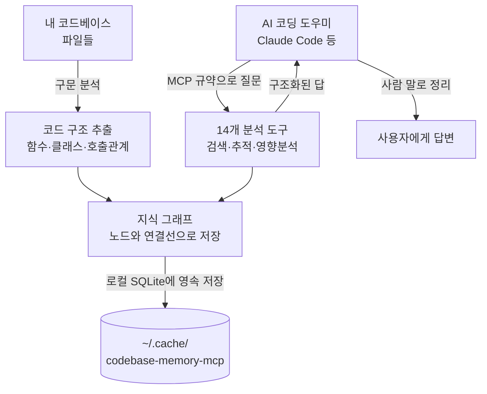

<div class="ai-knowledge-shell">

<aside class="ai-knowledge-sidebar">
  <p class="ai-eyebrow">CATEGORIES</p>
  <nav class="ai-cat-tree"><details class="ai-cat" open><summary><span class="catname">에이전트 오케스트레이션</span><span class="catcount">10</span></summary><ul><li><a href="https://altjs4510.github.io/ai_news_blog/knowledge/20260705/"><span class="kdate">2026-07-05</span><span class="ktitle">openai/codex-plugin-cc — Claude Code에서 Codex를 위임…</span></a></li><li><a href="https://altjs4510.github.io/ai_news_blog/knowledge/20260701/"><span class="kdate">2026-07-01</span><span class="ktitle">Google OKF (Open Knowledge Format) — 벤더 중립 에이전트 …</span></a></li><li><a href="https://altjs4510.github.io/ai_news_blog/knowledge/20260623/"><span class="kdate">2026-06-23</span><span class="ktitle">bytedance/deer-flow — 샌드박스·메모리·서브에이전트·메시지 게이트웨이를…</span></a></li><li><a href="https://altjs4510.github.io/ai_news_blog/knowledge/20260621/"><span class="kdate">2026-06-21</span><span class="ktitle">calesthio/OpenMontage — 12 파이프라인·52 도구·500+ 스킬을 …</span></a></li><li><a href="https://altjs4510.github.io/ai_news_blog/knowledge/20260611/"><span class="kdate">2026-06-11</span><span class="ktitle">The evolution of agentic surfaces: building with…</span></a></li><li><a href="https://altjs4510.github.io/ai_news_blog/knowledge/20260602/"><span class="kdate">2026-06-02</span><span class="ktitle">revfactory/harness — 도메인별 에이전트 팀과 스킬을 자동 설계하는 메타…</span></a></li><li><a href="https://altjs4510.github.io/ai_news_blog/knowledge/20260529/"><span class="kdate">2026-05-29</span><span class="ktitle">Introducing dynamic workflows in Claude Code</span></a></li><li><a href="https://altjs4510.github.io/ai_news_blog/knowledge/20260520/"><span class="kdate">2026-05-20</span><span class="ktitle">New in Claude Managed Agents: self-hosted sandbo…</span></a></li><li><a href="https://altjs4510.github.io/ai_news_blog/knowledge/20260507/"><span class="kdate">2026-05-07</span><span class="ktitle">ruvnet/ruflo — Claude 멀티 에이전트 오케스트레이션 플랫폼</span></a></li><li><a href="https://altjs4510.github.io/ai_news_blog/knowledge/20260504/"><span class="kdate">2026-05-04</span><span class="ktitle">Agents for Everything Else: Codex for Knowledge …</span></a></li></ul></details><details class="ai-cat" open><summary><span class="catname">MCP &amp; 도구 통합</span><span class="catcount">8</span></summary><ul><li><a href="https://altjs4510.github.io/ai_news_blog/knowledge/20260618/" class="current"><span class="kdate">2026-06-18</span><span class="ktitle">DeusData/codebase-memory-mcp — 158개 언어 코드베이스를 밀리…</span></a></li><li><a href="https://altjs4510.github.io/ai_news_blog/knowledge/20260604/"><span class="kdate">2026-06-04</span><span class="ktitle">chopratejas/headroom — Compress tool outputs bef…</span></a></li><li><a href="https://altjs4510.github.io/ai_news_blog/knowledge/20260603/"><span class="kdate">2026-06-03</span><span class="ktitle">How Bad MCP design cost your Agent 5× more token…</span></a></li><li><a href="https://altjs4510.github.io/ai_news_blog/knowledge/20260526/"><span class="kdate">2026-05-26</span><span class="ktitle">colbymchenry/codegraph — Pre-indexed code knowle…</span></a></li><li><a href="https://altjs4510.github.io/ai_news_blog/knowledge/20260523/"><span class="kdate">2026-05-23</span><span class="ktitle">colbymchenry/codegraph — 사전 인덱싱된 코드 지식 그래프 MCP</span></a></li><li><a href="https://altjs4510.github.io/ai_news_blog/knowledge/20260519/"><span class="kdate">2026-05-19</span><span class="ktitle">Anthropic acquires Stainless</span></a></li><li><a href="https://altjs4510.github.io/ai_news_blog/knowledge/20260517/"><span class="kdate">2026-05-17</span><span class="ktitle">I gave my LLM 100,000+ tools — Lazy Discovery &a…</span></a></li><li><a href="https://altjs4510.github.io/ai_news_blog/knowledge/20260509/"><span class="kdate">2026-05-09</span><span class="ktitle">How to connect 100 MCP servers without the conte…</span></a></li></ul></details><details class="ai-cat" open><summary><span class="catname">코딩 에이전트</span><span class="catcount">11</span></summary><ul><li><a href="https://altjs4510.github.io/ai_news_blog/knowledge/20260626/"><span class="kdate">2026-06-26</span><span class="ktitle">google-labs-code/design.md — 코딩 에이전트에게 디자인 시스템을 …</span></a></li><li><a href="https://altjs4510.github.io/ai_news_blog/knowledge/20260619/"><span class="kdate">2026-06-19</span><span class="ktitle">Claude Code now supports artifacts</span></a></li><li><a href="https://altjs4510.github.io/ai_news_blog/knowledge/20260530/"><span class="kdate">2026-05-30</span><span class="ktitle">Leonxlnx/taste-skill — AI에게 좋은 취향을 부여해 generic s…</span></a></li><li><a href="https://altjs4510.github.io/ai_news_blog/knowledge/20260528/"><span class="kdate">2026-05-28</span><span class="ktitle">Building self-improving tax agents with Codex</span></a></li><li><a href="https://altjs4510.github.io/ai_news_blog/knowledge/20260524/"><span class="kdate">2026-05-24</span><span class="ktitle">colbymchenry/codegraph — Pre-indexed code knowle…</span></a></li><li><a href="https://altjs4510.github.io/ai_news_blog/knowledge/20260521/"><span class="kdate">2026-05-21</span><span class="ktitle">colbymchenry/codegraph — Pre-indexed code knowle…</span></a></li><li><a href="https://altjs4510.github.io/ai_news_blog/knowledge/20260512/"><span class="kdate">2026-05-12</span><span class="ktitle">agentmemory — Persistent memory for AI coding ag…</span></a></li><li><a href="https://altjs4510.github.io/ai_news_blog/knowledge/20260510/"><span class="kdate">2026-05-10</span><span class="ktitle">addyosmani/agent-skills — Production-grade engin…</span></a></li><li><a href="https://altjs4510.github.io/ai_news_blog/knowledge/20260508/"><span class="kdate">2026-05-08</span><span class="ktitle">addyosmani/agent-skills — Production-grade engin…</span></a></li><li><a href="https://altjs4510.github.io/ai_news_blog/knowledge/20260506/"><span class="kdate">2026-05-06</span><span class="ktitle">mksglu/context-mode — AI 코딩 에이전트용 컨텍스트 윈도우 최적화</span></a></li><li><a href="https://altjs4510.github.io/ai_news_blog/knowledge/20260505/"><span class="kdate">2026-05-05</span><span class="ktitle">mattpocock/skills — Skills for Real Engineers (.…</span></a></li></ul></details><details class="ai-cat" open><summary><span class="catname">모델 &amp; 연구</span><span class="catcount">4</span></summary><ul><li><a href="https://altjs4510.github.io/ai_news_blog/knowledge/20260620/"><span class="kdate">2026-06-20</span><span class="ktitle">zai-org/GLM-5 — From Vibe Coding to Agentic Engi…</span></a></li><li><a href="https://altjs4510.github.io/ai_news_blog/knowledge/20260617/"><span class="kdate">2026-06-17</span><span class="ktitle">Predicting model behavior before release by simu…</span></a></li><li><a href="https://altjs4510.github.io/ai_news_blog/knowledge/20260516/"><span class="kdate">2026-05-16</span><span class="ktitle">STALE — 에이전트가 자기 기억의 유효성을 인지할 수 있는가</span></a></li><li><a href="https://altjs4510.github.io/ai_news_blog/knowledge/20260513/"><span class="kdate">2026-05-13</span><span class="ktitle">Thinking Machines' Native Interaction Models — T…</span></a></li></ul></details><details class="ai-cat" open><summary><span class="catname">인프라 &amp; 컴퓨트</span><span class="catcount">5</span></summary><ul><li><a href="https://altjs4510.github.io/ai_news_blog/knowledge/20260630/"><span class="kdate">2026-06-30</span><span class="ktitle">Introducing the Claude apps gateway for Amazon B…</span></a></li><li><a href="https://altjs4510.github.io/ai_news_blog/knowledge/20260610/"><span class="kdate">2026-06-10</span><span class="ktitle">Fable 5 just made cost-aware model routing manda…</span></a></li><li><a href="https://altjs4510.github.io/ai_news_blog/knowledge/20260606/"><span class="kdate">2026-06-06</span><span class="ktitle">chopratejas/headroom — Compress tool outputs, lo…</span></a></li><li><a href="https://altjs4510.github.io/ai_news_blog/knowledge/20260605/"><span class="kdate">2026-06-05</span><span class="ktitle">chopratejas/headroom — Compress tool outputs, lo…</span></a></li><li><a href="https://altjs4510.github.io/ai_news_blog/knowledge/20260522/"><span class="kdate">2026-05-22</span><span class="ktitle">Giving Agents Computers — Ivan Burazin, Daytona</span></a></li></ul></details><details class="ai-cat" open><summary><span class="catname">보안 &amp; 거버넌스</span><span class="catcount">10</span></summary><ul><li><a href="https://altjs4510.github.io/ai_news_blog/knowledge/20260704/"><span class="kdate">2026-07-04</span><span class="ktitle">Cloudflare is about to block AI agents by defaul…</span></a></li><li><a href="https://altjs4510.github.io/ai_news_blog/knowledge/20260703/"><span class="kdate">2026-07-03</span><span class="ktitle">Giving admins more visibility and control over C…</span></a></li><li><a href="https://altjs4510.github.io/ai_news_blog/knowledge/20260625/"><span class="kdate">2026-06-25</span><span class="ktitle">Agent identity in Claude Tag: a new access model…</span></a></li><li><a href="https://altjs4510.github.io/ai_news_blog/knowledge/20260624/"><span class="kdate">2026-06-24</span><span class="ktitle">Agent identity in Claude Tag: a new access model…</span></a></li><li><a href="https://altjs4510.github.io/ai_news_blog/knowledge/20260614/"><span class="kdate">2026-06-14</span><span class="ktitle">NVIDIA/SkillSpector — Security scanner for AI ag…</span></a></li><li><a href="https://altjs4510.github.io/ai_news_blog/knowledge/20260613/"><span class="kdate">2026-06-13</span><span class="ktitle">Fable 5's guardrails got bypassed in 48 hours — …</span></a></li><li><a href="https://altjs4510.github.io/ai_news_blog/knowledge/20260612/"><span class="kdate">2026-06-12</span><span class="ktitle">NVIDIA/SkillSpector — AI 에이전트 스킬용 보안 스캐너</span></a></li><li><a href="https://altjs4510.github.io/ai_news_blog/knowledge/20260607/"><span class="kdate">2026-06-07</span><span class="ktitle">OpenAI Help: Lockdown Mode</span></a></li><li><a href="https://altjs4510.github.io/ai_news_blog/knowledge/20260531/"><span class="kdate">2026-05-31</span><span class="ktitle">How we contain Claude across products</span></a></li><li><a href="https://altjs4510.github.io/ai_news_blog/knowledge/20260527/"><span class="kdate">2026-05-27</span><span class="ktitle">Microsoft Copilot Cowork Exfiltrates Files</span></a></li></ul></details><details class="ai-cat" open><summary><span class="catname">응용 사례</span><span class="catcount">3</span></summary><ul><li><a href="https://altjs4510.github.io/ai_news_blog/knowledge/20260609/"><span class="kdate">2026-06-09</span><span class="ktitle">Building intelligent apps for Apple platforms wi…</span></a></li><li><a href="https://altjs4510.github.io/ai_news_blog/knowledge/20260515/"><span class="kdate">2026-05-15</span><span class="ktitle">Clawdmeter — Claude Code 사용량을 데스크톱 대시보드로</span></a></li><li><a href="https://altjs4510.github.io/ai_news_blog/knowledge/20260514/"><span class="kdate">2026-05-14</span><span class="ktitle">Introducing Claude for Small Business</span></a></li></ul></details><details class="ai-cat" open><summary><span class="catname">산업 동향</span><span class="catcount">2</span></summary><ul><li><a href="https://altjs4510.github.io/ai_news_blog/knowledge/20260702/"><span class="kdate">2026-07-02</span><span class="ktitle">How Cursor deploys AI inside the enterprise (For…</span></a></li><li><a href="https://altjs4510.github.io/ai_news_blog/knowledge/20260616/"><span class="kdate">2026-06-16</span><span class="ktitle">Why AI hasn't replaced software engineers, and w…</span></a></li></ul></details></nav>
</aside>

<article class="ai-knowledge-article">

<header class="ai-post-hero">
  <p class="ai-eyebrow"><a class="ai-back" href="../">KNOWLEDGE</a> · 2026-06-18 · 오늘의 학습</p>
  <h2 class="ai-post-title">DeusData/codebase-memory-mcp — 158개 언어 코드베이스를 밀리초 인덱싱하는 MCP 서버</h2>
</header>

> 원문: [DeusData/codebase-memory-mcp — 158개 언어 코드베이스를 밀리초 인덱싱하는 MCP 서버](https://github.com/DeusData/codebase-memory-mcp)

## 📌 학습 정리

### 1. 한 줄로 말하면

거대한 코드 더미를 빠르게 훑어서 "어디서 누구를 부르고, 어떤 길로 이어지는지" 지도를 만들어 두고, AI 코딩 도우미가 그 지도만 펼쳐 보면 되도록 도와주는 도구예요.

### 2. 왜 이게 만들어졌어요?

AI 코딩 도우미한테 "이 함수 어디서 쓰여?" 같은 질문을 하면, 보통 파일을 하나하나 열어보고 grep으로 뒤지면서 답을 찾아요. 이 과정에서 도우미가 읽어들이는 텍스트가 어마어마해서, 비용(토큰)이 많이 들고 시간도 오래 걸리고, 도구 호출도 여러 번 반복되죠. 게다가 같은 질문을 다시 해도 매번 처음부터 뒤지고요. 그래서 "차라리 코드베이스 전체를 한 번에 분석해서 함수·클래스·호출 관계를 그래프로 저장해 두고, 질문이 올 때 그 그래프에서 바로 답하면 어떨까?" 하는 발상이 나왔어요. 이 도구는 그 그래프를 만들어 주고, AI 도우미가 표준 규약(MCP)으로 질문을 던지면 즉시 답을 돌려주는 역할을 해요.

### 3. 비유로 풀면

이건 마치 **방대한 도서관에 색인 카드를 미리 만들어 두는 사서**와 비슷해요. 누가 "톨스토이가 인용한 작가들 다 알려줘"라고 물으면, 책을 한 권씩 다 펼쳐보는 게 아니라 미리 만들어둔 색인을 따라가서 답을 찍어주죠. 또는 **지하철 노선도** 같은 거예요. 강남에서 종로까지 어떻게 가는지 알고 싶을 때 모든 역을 직접 걸어보지 않잖아요. 노선도만 보면 환승 경로가 한눈에 들어와요.

그래서 결국, "코드를 읽는다"는 작업을 "지도를 본다"는 작업으로 바꿔주는 셈이에요.

### 4. 어떻게 작동하는지 (그림으로)



흐름은 이래요. 먼저 코드베이스를 한 번 인덱싱(indexing)하면 함수·클래스·호출 관계 등이 그래프 형태로 추출돼서 로컬 데이터베이스에 저장돼요. 그 다음부터는 AI 도우미가 "이 함수 누가 부르나?" 같은 질문을 받으면, 파일을 직접 뒤지는 대신 이 그래프에 질의를 던져 답을 받아요. 사용자에게는 도우미가 그 결과를 사람 말로 풀어 전달하고요.

### 5. 처음 보는 용어 풀이

- **모델 컨텍스트 규약 (MCP, Model Context Protocol)** — AI 도우미와 외부 도구가 서로 대화하기 위한 표준 약속이에요. 이 약속을 지키면, AI 도우미가 어떤 도구든 같은 방식으로 호출해서 정보를 받아올 수 있어요.

- **지식 그래프 (knowledge graph)** — 정보를 "점(노드)"과 "선(연결)"으로 표현한 지도예요. 여기서는 함수·클래스가 점이고, "A가 B를 호출함" 같은 관계가 선이에요. 점과 선이 모이면 코드 전체의 짜임새가 한눈에 보여요.

- **구문 트리 분석기 (tree-sitter)** — 소스 코드를 읽어서 "이건 함수 정의, 이건 변수 선언" 같은 구조로 쪼개주는 도구예요. 이 프로젝트는 158개 언어용 분석기를 미리 내장하고 있어서, 따로 설치할 게 없어요.

- **언어 서버 규약 (LSP, Language Server Protocol)** — 코드 편집기가 자동완성·타입 추론 같은 똑똑한 기능을 제공받기 위해 쓰는 표준이에요. 이 도구는 "Hybrid LSP"라는 이름으로 일부 언어에 대해 정밀한 타입 분석을 곁들여 그래프의 정확도를 높여요.

- **토큰 (token) 절감** — AI 도우미가 한 번 일할 때 읽고 쓰는 글자 단위가 토큰이에요. 토큰을 많이 쓸수록 비용·시간이 늘어나죠. 파일을 하나하나 뒤지는 대신 그래프 한 번 조회로 끝내면, 같은 질문에 드는 토큰이 100분의 1 수준으로 줄어요.

- **사이퍼 질의 (Cypher query)** — 그래프 데이터베이스에서 "이런 조건의 점과 선을 찾아줘"라고 묻는 질의 언어예요. 예를 들어 "main 함수가 호출하는 모든 함수의 이름"을 한 줄로 물어볼 수 있어요. 이 도구는 읽기 전용으로 일부 문법을 지원해요.

- **단일 정적 바이너리 (single static binary)** — 실행에 필요한 모든 게 하나의 파일 안에 들어있는 형태예요. Docker나 별도 라이브러리 설치 없이, 파일 하나 받아서 바로 실행하면 끝이에요.

- **인프라를 코드로 (Infrastructure-as-code)** — 서버·배포 환경을 Dockerfile이나 쿠버네티스(Kubernetes) 설정 같은 텍스트 파일로 적어두는 방식이에요. 이 도구는 그런 설정 파일도 코드와 같은 그래프 안에 넣어줘서, "이 서비스가 어떤 리소스를 쓰는지"까지 추적할 수 있게 해요.

### 6. 한 발 더 들어가고 싶다면

- [프로젝트 GitHub 저장소](https://github.com/DeusData/codebase-memory-mcp) — 이걸 보면 전체 소스 코드와 최신 문서를 확인할 수 있어요.
- [설계와 벤치마크를 정리한 논문 (arXiv:2603.27277)](https://arxiv.org/abs/2603.27277) — 31개 실제 저장소에서 이 방식이 답변 품질·토큰·도구 호출 면에서 어떤 결과를 냈는지 수치로 보고 싶을 때 읽어보면 좋아요.
- [tree-sitter 공식 사이트](https://tree-sitter.github.io/tree-sitter/) — 이 도구가 158개 언어를 어떻게 파싱하는지, 그 기반이 되는 구문 분석기의 원리가 궁금하다면 여기서 출발하면 돼요.
- [보안 정책 문서 (SECURITY.md)](https://github.com/DeusData/codebase-memory-mcp/blob/main/SECURITY.md) — 코드를 읽고 설정 파일을 쓰는 도구라서 신뢰가 중요한데, 어떤 보안 절차를 따르는지 여기서 확인할 수 있어요.
- [SLSA 공급망 보안 등급](https://slsa.dev/) — 배포 바이너리가 어떻게 검증되는지 이해하고 싶다면 이 표준의 개념을 살펴보면 도움이 돼요.

---

## 📖 원문 전체 번역 (정독용)

> 의역 최소화한 전체 번역입니다. 큰 흐름은 위 정리에서 잡고, 정확한 워딩이 필요할 땐 이 섹션에서 정독하세요.

# DeusData/codebase-memory-mcp — 158개 언어 코드베이스를 밀리초 단위로 인덱싱하는 MCP 서버

**AI 코딩 에이전트를 위한 가장 빠르고 효율적인 코드 인텔리전스 엔진.** 평균적인 저장소를 밀리초 단위로 전체 인덱싱하며, Linux 커널(2,800만 LOC, 75,000개 파일)은 3분 안에 처리합니다. 구조적 쿼리에 1ms 이내로 응답합니다. macOS, Linux, Windows용 단일 정적 바이너리로 제공됩니다 — 다운로드 후 `install` 실행, 끝.

[tree-sitter](https://tree-sitter.github.io/tree-sitter/) AST 분석을 통해 158개 언어 전반에 걸친 고품질 파싱을 제공하며, Python, TypeScript / JavaScript / JSX / TSX, PHP, C#, Go, C, C++, Java, Kotlin, Rust에 대한 [**하이브리드 LSP (Hybrid LSP)** 시맨틱 타입 해석](https://github.com/DeusData/codebase-memory-mcp#hybrid-lsp)으로 강화됩니다. 함수, 클래스, 호출 체인, HTTP 라우트, 서비스 간 링크에 대한 영속적 지식 그래프를 생성합니다. 14개의 MCP 도구. 의존성 없음. 11개의 코딩 에이전트에서 플러그 앤 플레이.

> **연구** — 이 프로젝트의 설계와 벤치마크는 프리프린트 [_Codebase-Memory: Tree-Sitter-Based Knowledge Graphs for LLM Code Exploration via MCP_](https://arxiv.org/abs/2603.27277) (arXiv:2603.27277)에 설명되어 있습니다. 31개의 실제 저장소를 대상으로 평가: 83% 답변 품질, 파일별 탐색 대비 10배 적은 토큰, 2.1배 적은 도구 호출.

> **보안 및 신뢰** — 이 도구는 코드베이스를 읽고 에이전트 설정 파일에 씁니다. 그것이 이 도구의 설계 목적입니다. 실행 전에 감사하기를 원한다면 [전체 소스가 여기](https://github.com/DeusData/codebase-memory-mcp)에 있습니다 — 모든 릴리스 바이너리는 서명되고, 체크섬이 있으며, 70개 이상의 안티바이러스 엔진으로 스캔됩니다. 모든 처리는 100% 로컬에서 이루어지며, 코드는 절대 외부로 전송되지 않습니다. 보안 이슈를 발견하셨나요? 알려주세요 — [SECURITY.md](https://github.com/DeusData/codebase-memory-mcp/blob/main/SECURITY.md)를 참고하십시오. 보안은 저희의 최우선 순위입니다.

_내장 3D 그래프 시각화 (UI 변형) — localhost:9749에서 지식 그래프 탐색_

## codebase-memory-mcp를 사용하는 이유

*   **극한의 인덱싱 속도** — Linux 커널(2,800만 LOC, 75,000개 파일)을 3분 안에 처리. RAM 우선 파이프라인: LZ4 압축, 인메모리 SQLite, 퓨전 Aho-Corasick 패턴 매칭. 인덱싱 후 메모리 해제.
*   **플러그 앤 플레이** — macOS (arm64/amd64), Linux (arm64/amd64), Windows (amd64)용 단일 정적 바이너리. Docker 불필요, 런타임 의존성 없음, API 키 없음. 다운로드 → `install` → 에이전트 재시작 → 완료.
*   **158개 언어** — 벤더링된 tree-sitter 문법이 바이너리에 컴파일. 별도 설치 불필요, 깨질 것도 없음.
*   **120배 적은 토큰** — 구조적 쿼리 5회: 파일별 검색 약 412,000 토큰 대비 약 3,400 토큰. 그래프 쿼리 한 번이 수십 번의 grep/read 사이클을 대체.
*   **11개 에이전트, 명령어 하나** — `install`이 Claude Code, Codex CLI, Gemini CLI, Zed, OpenCode, Antigravity, Aider, KiloCode, VS Code, OpenClaw, Kiro를 자동 감지하여 각각에 대해 MCP 항목, 인스트럭션 파일, pre-tool 훅을 설정.
*   **내장 그래프 시각화** — `localhost:9749`의 3D 인터랙티브 UI (선택적 UI 바이너리 변형).
*   **인프라스트럭처-애즈-코드 인덱싱** — Dockerfiles, Kubernetes 매니페스트, Kustomize 오버레이가 크로스 레퍼런스를 포함한 그래프 노드로 인덱싱. K8s 종류에 대한 `Resource` 노드, 참조된 리소스에 대한 `IMPORTS` 엣지를 가진 Kustomize 오버레이의 `Module` 노드.
*   **14개 MCP 도구** — 검색, 추적, 아키텍처, 영향 분석, Cypher 쿼리, 데드 코드 감지, 크로스 서비스 HTTP 링킹, ADR 관리 등.

## 빠른 시작

**원라인 설치** (macOS / Linux):

```bash
curl -fsSL https://raw.githubusercontent.com/DeusData/codebase-memory-mcp/main/install.sh | bash
```

그래프 시각화 UI 포함:

```bash
curl -fsSL https://raw.githubusercontent.com/DeusData/codebase-memory-mcp/main/install.sh | bash -s -- --ui
```

**Windows** (PowerShell):

```powershell
# 1. 인스톨러 다운로드
Invoke-WebRequest -Uri https://raw.githubusercontent.com/DeusData/codebase-memory-mcp/main/install.ps1 -OutFile install.ps1

# 2. (선택 사항이지만 권장) 스크립트 검토
notepad install.ps1

# 3. 실행
.\install.ps1
```

옵션: `--ui` (그래프 시각화), `--skip-config` (바이너리만, 에이전트 설정 없음), `--dir=<path>` (커스텀 위치).

코딩 에이전트를 재시작하세요. **"이 프로젝트를 인덱싱해줘"** 라고 말하면 — 완료.

<details>
<summary>수동 설치</summary>

1. [최신 릴리스](https://github.com/DeusData/codebase-memory-mcp/releases/latest)에서 플랫폼에 맞는 아카이브를 **다운로드**하세요:

    *   `codebase-memory-mcp-<os>-<arch>.tar.gz` (macOS/Linux) 또는 `.zip` (Windows) — 표준
    *   `codebase-memory-mcp-ui-<os>-<arch>.tar.gz` / `.zip` — 그래프 시각화 포함

2. **압축 해제 후 설치** (각 아카이브에 `install.sh` 또는 `install.ps1` 포함):

macOS / Linux:

```bash
tar xzf codebase-memory-mcp-*.tar.gz
./install.sh
```

Windows (PowerShell):

```powershell
Expand-Archive codebase-memory-mcp-windows-amd64.zip -DestinationPath .
.\install.ps1
```

3. 코딩 에이전트를 **재시작**하세요.

</details>

`install` 명령은 macOS 격리 속성을 자동으로 제거하고 바이너리에 애드혹 서명합니다 — 수동 `xattr`/`codesign` 불필요.

`install` 명령은 설치된 모든 코딩 에이전트를 자동 감지하여 각각에 대한 MCP 서버 항목, 인스트럭션 파일, 스킬, pre-tool 훅을 설정합니다.

### 그래프 시각화 UI

`ui` 변형을 다운로드한 경우:

```bash
codebase-memory-mcp --ui=true --port=9749
```

브라우저에서 `http://localhost:9749`를 여세요. UI는 MCP 서버와 함께 백그라운드 스레드로 실행됩니다 — 에이전트가 연결되어 있을 때마다 사용 가능합니다.

### 자동 인덱싱

MCP 세션 시작 시 자동 인덱싱 활성화:

```bash
codebase-memory-mcp config set auto_index true
```

활성화되면 새 프로젝트는 첫 연결 시 자동으로 인덱싱됩니다. 이전에 인덱싱된 프로젝트는 지속적인 git 기반 변경 감지를 위해 백그라운드 워처에 등록됩니다. 설정 가능한 파일 한도: `config set auto_index_limit 50000`.

### 업데이트 유지

```bash
codebase-memory-mcp update
```

MCP 서버는 시작 시 업데이트를 확인하고 더 새로운 릴리스가 있을 경우 첫 번째 도구 호출에서 알림을 표시합니다.

### 제거

```bash
codebase-memory-mcp uninstall
```

모든 에이전트 설정, 스킬, 훅, 인스트럭션을 제거합니다. 바이너리나 SQLite 데이터베이스는 제거하지 않습니다.

## 기능

### 그래프 및 분석

*   **아키텍처 개요**: `get_architecture`가 단일 호출로 언어, 패키지, 진입점, 라우트, 핫스팟, 경계, 레이어, 클러스터를 반환
*   **아키텍처 결정 기록 (Architecture Decision Records)**: `manage_adr`가 세션 전반에 걸쳐 아키텍처 결정을 영속화
*   **루뱅 커뮤니티 감지 (Louvain community detection)**: 호출 엣지를 클러스터링하여 기능 모듈 발견
*   **Git diff 영향 매핑**: `detect_changes`가 커밋되지 않은 변경 사항을 위험 분류와 함께 영향받는 심볼에 매핑
*   **호출 그래프**: 파일 및 패키지 전반에 걸쳐 함수 호출 해석 (import 인식, 타입 추론)
*   **데드 코드 감지**: 호출자가 없는 함수를 찾으며 진입점 제외
*   **Cypher 유사 쿼리**: `MATCH (f:Function)-[:CALLS]->(g) WHERE f.name = 'main' RETURN g.name`

### 검색

*   **시맨틱 검색** (`semantic_query`): 바이너리에 컴파일된 번들 Nomic `nomic-embed-code` 임베딩(40K 토큰, 768d int8)으로 구동되는 전체 그래프에 대한 벡터 검색 — API 키 불필요, Ollama 불필요, Docker 불필요. 11개 신호 복합 스코어링 (TF-IDF, RRI, API/타입/데코레이터 시그니처, AST 프로파일, 데이터 흐름, Halstead-lite, MinHash, 모듈 근접성, 그래프 확산).
*   `cbm_camel_split` 토크나이저(camelCase / snake_case 인식)를 사용한 SQLite FTS5 기반 **BM25 전문 검색**
*   **구조적 검색** (`search_graph`): 정규식 이름 패턴, 레이블 필터, 최소/최대 차수, 파일 스코핑
*   **코드 검색** (`search_code`): 인덱싱된 파일에 대한 그래프 강화 grep

### 크로스 서비스 링킹

*   신뢰도 점수를 포함한 **HTTP** 라우트 ↔ 호출 지점 매칭
*   protobuf Route 추출을 포함한 **gRPC, GraphQL, tRPC** 서비스 감지
*   상수 해석을 포함한 8개 언어에 걸쳐 Socket.IO, EventEmitter, 일반 pub-sub 패턴에 대한 **채널 감지** (`EMITS` / `LISTENS_ON`)

### 크로스 저장소 인텔리전스

*   **`CROSS_*` 엣지**가 동일 스토어 아래 인덱싱된 여러 저장소의 노드를 연결
*   크로스 저장소 아키텍처 시각화를 위한 **멀티 갤럭시 3D UI 레이아웃**
*   인덱싱된 전체 플릿에 걸쳐 서비스, 라우트, 의존성을 결합한 **크로스 저장소 아키텍처 요약**

### 엣지 타입 (선택)

*   `CALLS`, `IMPORTS`, `DEFINES`, `IMPLEMENTS`, `INHERITS`
*   `HTTP_CALLS`, `ASYNC_CALLS` (크로스 서비스)
*   `EMITS`, `LISTENS_ON` (채널)
*   arg-to-param 매핑 + 필드 접근 체인을 포함한 `DATA_FLOWS`
*   `SIMILAR_TO` (MinHash + LSH 근접 클론 감지, Jaccard 점수화)
*   `SEMANTICALLY_RELATED` (어휘 불일치, 동일 언어, 점수 ≥ 0.80)

### 인덱싱 파이프라인

*   바이너리에 컴파일된 **158개 벤더링된 tree-sitter 문법**
*   **범용 패키지/모듈 해석** — `@myorg/pkg`, `github.com/foo/bar`, `use my_crate::foo` 같은 bare specifier를 매니페스트 스캔(`package.json`, `go.mod`, `Cargo.toml`, `pyproject.toml`, `composer.json`, `pubspec.yaml`, `pom.xml`, `build.gradle`, `mix.exs`, `*.gemspec`)을 통해 해석
*   **인프라스트럭처-애즈-코드 인덱싱** — Dockerfiles, Kubernetes 매니페스트, Kustomize 오버레이를 그래프 노드로
*   Python, TypeScript / JavaScript / JSX / TSX, PHP, C#, Go, C, C++, Java, Kotlin, Rust에 대한 **[하이브리드 LSP 시맨틱 타입 해석](https://github.com/DeusData/codebase-memory-mcp#hybrid-lsp)** — tsserver / typescript-go, pyright, gopls, Roslyn, Eclipse JDT, rust-analyzer를 포함한 주요 언어 서버와 구조적으로 영감을 받고 호환되는 언어 타입 해석 알고리즘의 경량 C 구현 (파라미터 바인딩, 반환 타입 추론, 제네릭 치환, JSX 컴포넌트 디스패치, 일반 JS 파일에 대한 JSDoc 추론, PHP를 위한 네임스페이스 + 트레이트 + late-static-binding 해석, C#을 위한 파일 범위 네임스페이스 + 레코드 + LINQ 메서드 구문, Java를 위한 클래스 계층 + 오버로드 + 람다 해석, Kotlin을 위한 확장 함수 + 스코프 함수 해석, Rust를 위한 트레이트 메서드 + UFCS 해석)
*   **RAM 우선 파이프라인**: LZ4 압축, 인메모리 SQLite, 마지막에 단일 덤프. 이후 메모리 해제.

### 배포 및 운영

*   **단일 정적 바이너리, 인프라 불필요**: SQLite 백엔드, `~/.cache/codebase-memory-mcp/`에 영속화
*   **자동 동기화**: 백그라운드 워처가 파일 변경을 감지하고 자동으로 재인덱싱
*   **라우트 노드**: REST 엔드포인트가 일급 그래프 엔티티
*   **CLI 모드**: `codebase-memory-mcp cli search_graph '{"name_pattern": ".*Handler.*"}'`
*   **사용 가능 경로**: npm, PyPI, Homebrew, Scoop, Winget, Chocolatey, AUR, `go install`

## 팀 공유 그래프 아티팩트

저장소에 단일 압축 파일을 커밋하면 팀원들이 재인덱싱을 건너뛸 수 있습니다.

`.codebase-memory/graph.db.zst`는 소스 옆에 위치하는 지식 그래프의 zstd 압축 스냅샷입니다. 인덱싱할 때 아티팩트가 작성되거나 갱신되며, 팀원이 저장소를 클론하고 처음 `codebase-memory-mcp`를 실행할 때 아티팩트가 압축 해제되고 증분 인덱싱이 로컬 diff를 채웁니다.

*   **형식**: SQLite 데이터베이스, 인덱스 제거, `VACUUM INTO` 압축, 이후 zstd 1.5.7 압축 (일반적으로 8–13:1 비율)
*   **두 계층**:
    *   **최고 품질** (`zstd -9` + 인덱스 제거 + `VACUUM INTO`) — 명시적 `index_repository` 시 작성
    *   **고속** (`zstd -3`) — 저지연 증분 업데이트를 위해 워처가 작성

*   **부트스트랩**: 로컬 DB가 없지만 아티팩트가 있을 때, `index_repository`가 먼저 아티팩트를 임포트한 후 증분 인덱싱을 실행 — 전체 재인덱싱 비용 회피
*   **병합 문제 없음**: `merge=ours`를 포함한 `.gitattributes` 줄이 첫 내보내기 시 자동 생성되어 바이너리 아티팩트에서 동시 편집이 충돌을 발생시키지 않음
*   **선택 사항**: 원하지 않으면 커밋하지 않아도 됩니다. 모든 사람이 처음부터 재인덱싱하기를 원한다면 `.codebase-memory/`를 `.gitignore`에 추가하세요.

결과는 graphify의 `graphify-out/` 디렉토리와 정신적으로 유사하지만, 명시적 2계층 내보내기, 무결성 검사 임포트, 병합 마찰 없는 단일 압축 파일입니다.

## 작동 방식

codebase-memory-mcp는 **구조적 분석 백엔드**입니다 — 지식 그래프를 구축하고 쿼리합니다. LLM을 **포함하지 않습니다**. 대신 MCP 클라이언트(Claude Code 또는 MCP 호환 에이전트)가 인텔리전스 레이어 역할을 합니다.

```
사용자: "ProcessOrder를 호출하는 것이 뭐야?"

에이전트 호출: trace_path(function_name="ProcessOrder", direction="inbound")

codebase-memory-mcp: 그래프 쿼리 실행, 구조적 결과 반환

에이전트: 호출 체인을 평문 영어로 제시
```

**왜 내장 LLM이 없나요?** 다른 코드 그래프 도구들은 자연어 → 그래프 쿼리 변환을 위해 LLM을 내장합니다. 이는 추가 API 키, 추가 비용, 설정할 또 다른 모델을 의미합니다. MCP를 사용하면 이미 대화하고 있는 에이전트 _자체가_ 쿼리 변환기입니다.

## 성능

Apple M3 Pro에서 벤치마크:

| 작업 | 시간 | 비고 |
| --- | --- | --- |
| **Linux 커널 전체 인덱싱** | **3분** | 2,800만 LOC, 75,000개 파일 → 481만 노드, 772만 엣지 |
| Linux 커널 빠른 인덱싱 | 1분 12초 | 188만 노드 |
| Django 전체 인덱싱 | ~6초 | 49,000개 노드, 196,000개 엣지 |
| Cypher 쿼리 | <1ms | 관계 순회 |
| 이름 검색 (정규식) | <10ms | SQL LIKE 사전 필터링 |
| 데드 코드 감지 | ~150ms | 차수 필터링을 포함한 전체 그래프 스캔 |
| 호출 경로 추적 (depth=5) | <10ms | BFS 순회 |

**RAM 우선 파이프라인**: 모든 인덱싱은 메모리에서 실행됩니다 (LZ4 HC 압축 읽기, 인메모리 SQLite, 마지막에 단일 덤프). 인덱싱 완료 후 메모리는 OS로 반환됩니다.

**토큰 효율성**: 구조적 쿼리 5회에서 codebase-memory-mcp는 약 3,400 토큰을 소비한 반면 파일별 grep 탐색은 약 412,000 토큰 소비 — **99.2% 감소**.

## 설치

### 사전 빌드 바이너리

| 플랫폼 | 표준 | 그래프 UI 포함 |
| --- | --- | --- |
| macOS (Apple Silicon) | `codebase-memory-mcp-darwin-arm64.tar.gz` | `codebase-memory-mcp-ui-darwin-arm64.tar.gz` |
| macOS (Intel) | `codebase-memory-mcp-darwin-amd64.tar.gz` | `codebase-memory-mcp-ui-darwin-amd64.tar.gz` |
| Linux (x86_64) | `codebase-memory-mcp-linux-amd64.tar.gz` | `codebase-memory-mcp-ui-linux-amd64.tar.gz` |
| Linux (ARM64) | `codebase-memory-mcp-linux-arm64.tar.gz` | `codebase-memory-mcp-ui-linux-arm64.tar.gz` |
| Windows (x86_64) | `codebase-memory-mcp-windows-amd64.zip` | `codebase-memory-mcp-ui-windows-amd64.zip` |

모든 릴리스에는 SHA-256 해시가 포함된 `checksums.txt`가 포함됩니다. 모든 바이너리는 정적 링크됩니다 — 공유 라이브러리 의존성 없음.

> **Windows 참고**: SmartScreen이 서명되지 않은 소프트웨어에 대한 경고를 표시할 수 있습니다. **"추가 정보"** → **"실행"**을 클릭하세요. `checksums.txt`로 무결성을 확인하세요.

### 설정 스크립트

<details>
<summary>자동화된 다운로드 + 설치</summary>

**macOS / Linux:**

```bash
curl -fsSL https://raw.githubusercontent.com/DeusData/codebase-memory-mcp/main/scripts/setup.sh | bash
```

**Windows (PowerShell):**

```powershell
irm https://raw.githubusercontent.com/DeusData/codebase-memory-mcp/main/scripts/setup-windows.ps1 | iex
```

</details>

### AUR (Arch Linux)

```bash
yay -S codebase-memory-mcp-bin
```

```bash
paru -S codebase-memory-mcp-bin
```

`codebase-memory-mcp-bin` 패키지는 [https://aur.archlinux.org/packages/codebase-memory-mcp-bin](https://aur.archlinux.org/packages/codebase-memory-mcp-bin)에서 사용 가능합니다.

### Claude Code를 통한 설치

```
사용자: "이 MCP 서버를 설치해줘: https://github.com/DeusData/codebase-memory-mcp"
```

### 소스에서 빌드

<details>
<summary>사전 조건: C 컴파일러 + zlib</summary>

| 요구 사항 | 확인 | 설치 |
| --- | --- | --- |
| **C 컴파일러** (gcc 또는 clang) | `gcc --version` 또는 `clang --version` | macOS: `xcode-select --install`, Linux: `apt install build-essential` |
| **C++ 컴파일러** | `g++ --version` 또는 `clang++ --version` | 위와 동일 |
| **zlib** | — | macOS: 포함됨, Linux: `apt install zlib1g-dev` |
| **Git** | `git --version` | 대부분의 시스템에 사전 설치됨 |

</details>

```bash
git clone https://github.com/DeusData/codebase-memory-mcp.git
cd codebase-memory-mcp
scripts/build.sh                    # 표준 바이너리
scripts/build.sh --with-ui          # 그래프 시각화 포함
# 바이너리 위치: build/c/codebase-memory-mcp
```

### 수동 MCP 설정

<details>
<summary>install 명령을 사용하지 않으려는 경우</summary>

`~/.claude/.mcp.json` (전역) 또는 프로젝트 `.mcp.json`에 추가:

```json
{
  "mcpServers": {
    "codebase-memory-mcp": {
      "command": "/path/to/codebase-memory-mcp",
      "args": []
    }
  }
}
```

</details>

에이전트를 재시작하세요. `/mcp`로 확인하세요 — 14개 도구가 포함된 `codebase-memory-mcp`가 보여야 합니다.

## 멀티 에이전트 지원

`install`이 설치된 모든 에이전트를 자동 감지하고 설정합니다:

| 에이전트 | MCP 설정 | 인스트럭션 | 훅 |
| --- | --- | --- | --- |
| Claude Code | `.claude/.mcp.json` | 4개 스킬 | PreToolUse (Grep/Glob 그래프 보강, 비차단) |
| Codex CLI | `.codex/config.toml` | `.codex/AGENTS.md` | SessionStart 리마인더 |
| Gemini CLI | `.gemini/settings.json` | `.gemini/GEMINI.md` | BeforeTool (grep 리마인더) + SessionStart 리마인더 |
| Zed | `settings.json` (JSONC) | — | — |
| OpenCode | `opencode.json` | `AGENTS.md` | — |
| Antigravity | `.gemini/config/mcp_config.json` (공유) | `antigravity-cli/AGENTS.md` | SessionStart 리마인더 |
| Aider | — | `CONVENTIONS.md` | — |
| KiloCode | `mcp_settings.json` | `~/.kilocode/rules/` | — |
| VS Code | `Code/User/mcp.json` | — | — |
| OpenClaw | `openclaw.json` | — | — |
| Kiro | `.kiro/settings/mcp.json` | — | — |

**훅은 구조적으로 비차단** (종료 코드 0, 모든 실패 경로). Claude Code의 경우 `PreToolUse` 훅은 `Grep`/`Glob`을 가로채고 (`Read`는 절대 아님 — `Read` 차단은 read-before-edit 불변성을 깨뜨림), 검색 토큰이 인덱싱된 심볼과 일치하면 `search_graph`를 통해 이를 `additionalContext`로 주입하여 에이전트가 일반 검색 결과와 함께 구조적 컨텍스트를 얻도록 합니다. Codex, Gemini CLI, Antigravity의 경우 `SessionStart` 훅이 한 줄의 코드 발견 리마인더를 세션 컨텍스트로 주입합니다 (Gemini CLI는 `BeforeTool` 리마인더도 유지). 설치된 Claude 심 파일은 기존 설치와의 하위 호환성을 위해 `cbm-code-discovery-gate`로 명명됩니다; 레거시 이름에도 불구하고 절대 차단하지 않습니다.

## CLI 모드

모든 MCP 도구를 커맨드 라인에서 호출할 수 있습니다:

```bash
codebase-memory-mcp cli index_repository '{"repo_path": "/path/to/repo"}'
codebase-memory-mcp cli search_graph '{"name_pattern": ".*Handler.*", "label": "Function"}'
codebase-memory-mcp cli trace_path '{"function_name": "Search", "direction": "both"}'
codebase-memory-mcp cli query_graph '{"query": "MATCH (f:Function) RETURN f.name LIMIT 5"}'
codebase-memory-mcp cli list_projects
codebase-memory-mcp cli --raw search_graph '{"label": "Function"}' | jq '.results[].name'
```

## MCP 도구

### 인덱싱

| 도구 | 설명 |
| --- | --- |
| `index_repository` | 저장소를 그래프에 인덱싱합니다. 이후 자동 동기화가 최신 상태를 유지합니다. |
| `list_projects` | 노드/엣지 수와 함께 모든 인덱싱된 프로젝트를 나열합니다. |
| `delete_project` | 프로젝트와 모든 그래프 데이터를 제거합니다. |
| `index_status` | 프로젝트의 인덱싱 상태를 확인합니다. |

### 쿼리

| 도구 | 설명 |
| --- | --- |
| `search_graph` | 레이블, 이름 패턴, 파일 패턴, 차수 필터에 의한 구조적 검색. limit/offset으로 페이지네이션. |
| `trace_path` | BFS 순회 — 함수를 호출하는 것과 함수가 호출하는 것 (별칭: `trace_call_path`). 깊이 1-5. |
| `detect_changes` | git diff를 위험 분류와 함께 영향받는 심볼 + 영향 범위에 매핑합니다. |
| `query_graph` | Cypher 유사 그래프 쿼리 실행 (읽기 전용). |
| `get_graph_schema` | 레이블별 노드/엣지 수, 관계 패턴, 속성 정의. 먼저 이것을 실행하세요. |
| `get_code_snippet` | 정규화된 이름으로 함수의 소스 코드를 읽습니다. |
| `get_architecture` | 코드베이스 개요: 언어, 패키지, 라우트, 핫스팟, 클러스터, ADR. |
| `search_code` | 인덱싱된 프로젝트 파일 내에서 grep 유사 텍스트 검색. |
| `manage_adr` | 아키텍처 결정 기록에 대한 CRUD. |
| `ingest_traces` | HTTP_CALLS 엣지 검증을 위한 런타임 트레이스 수집. |

## 그래프 데이터 모델

### 노드 레이블

`Project`, `Package`, `Folder`, `File`, `Module`, `Class`, `Function`, `Method`, `Interface`, `Enum`, `Type`, `Route`, `Resource`

### 엣지 타입

`CONTAINS_PACKAGE`, `CONTAINS_FOLDER`, `CONTAINS_FILE`, `DEFINES`, `DEFINES_METHOD`, `IMPORTS`, `CALLS`, `HTTP_CALLS`, `ASYNC_CALLS`, `IMPLEMENTS`, `HANDLES`, `USAGE`, `CONFIGURES`, `WRITES`, `MEMBER_OF`, `TESTS`, `USES_TYPE`, `FILE_CHANGES_WITH`

### 정규화된 이름

`get_code_snippet`은 정규화된 이름을 사용합니다: `<project>.<path_parts>.<name>`. 먼저 `search_graph`로 발견하세요.

### 지원하는 Cypher (openCypher 읽기 서브셋)

`query_graph`는 읽기 전용 openCypher 서브셋입니다:

*   **절 (Clauses)**: `MATCH`, `OPTIONAL MATCH`, 다중 `MATCH`, `WHERE`, `WITH` (+ `WITH … WHERE`), `RETURN`, `ORDER BY`, `SKIP`, `LIMIT`, `DISTINCT`, `UNWIND`, `UNION` / `UNION ALL`, `CASE`.
*   **패턴**: 레이블 있는 노드, 레이블 대안 `(n:A|B)`, 관계 타입/방향, 가변 길이 경로 `[*1..3]`, 인라인 속성 맵.
*   **WHERE**: `= <> < <= > >=`, `AND/OR/XOR/NOT`, `IN`, `CONTAINS`, `STARTS WITH`, `ENDS WITH`, `IS [NOT] NULL`, 정규식 `=~`, 레이블 테스트 `n:Label`, `EXISTS { (n)-[:TYPE]->() }` (단일 홉 존재 — 데드 코드에 유용, 예: `WHERE NOT EXISTS { (f)<-[:CALLS]-() }`).
*   **집계**: `count` (+`DISTINCT`), `sum`, `avg`, `min`, `max`, `collect`.
*   **함수**: `labels`, `type`, `id`, `keys`, `properties`; `toLower/toUpper/toString/toInteger/toFloat/toBoolean`; `size`, `length`, `trim/ltrim/rtrim`, `reverse`; `coalesce`, `substring`, `replace`, `left`, `right`.

이 서브셋 외의 것들 (쓰기/`MERGE`/`CALL` 절, 지원하지 않는 함수, 리스트/맵 리터럴, 컴프리헨션, 경로 함수, 파라미터)은 빈 결과를 반환하는 대신 **명확한 `unsupported …` 오류로 실패**합니다.

## 파일 무시

계층적 적용: 하드코딩된 패턴 (`.git`, `node_modules` 등) → `.gitignore` 계층 → `.cbmignore` (프로젝트별, gitignore 구문). 심볼릭 링크는 항상 건너뜁니다.

## 설정

```bash
codebase-memory-mcp config list                          # 모든 설정 표시
codebase-memory-mcp config set auto_index true           # 세션 시작 시 자동 인덱싱
codebase-memory-mcp config set auto_index_limit 50000    # 자동 인덱싱 최대 파일 수
codebase-memory-mcp config reset auto_index              # 기본값으로 재설정
```

### 환경 변수

| 변수 | 기본값 | 설명 |
| --- | --- | --- |
| `CBM_CACHE_DIR` | `~/.cache/codebase-memory-mcp` | 데이터베이스 저장 디렉토리 재정의. 모든 프로젝트 인덱스와 설정이 여기에 저장됩니다. |
| `CBM_DIAGNOSTICS` | `false` | 주기적인 진단 출력을 `/tmp/cbm-diagnostics-<pid>.json`에 활성화하려면 `1` 또는 `true`로 설정. |
| `CBM_DOWNLOAD_URL` | _(GitHub 릴리스)_ | 업데이트를 위한 다운로드 URL 재정의. 테스트나 자체 호스팅 배포에 사용. |
| `CBM_LOG_LEVEL` | `info` | 최소 로그 레벨 설정. 허용 값 (대소문자 무관): `debug`, `info`, `warn`, `error`, `none` — 또는 내부 열거형에 해당하는 숫자 `0`–`4`. 로그는 stderr로 출력되며 stdout은 MCP JSON-RPC용으로 예약됩니다. |
| `CBM_WORKERS` | _(감지됨)_ | `cbm_default_worker_count`가 반환하는 병렬 인덱싱 워커 수를 재정의합니다. `sysconf(_SC_NPROCESSORS_ONLN)`이 cgroup의 실효 할당량 대신 호스트 CPU를 보고하는 컨테이너 내부에서 유용합니다. 범위 1–256; 유효하지 않은 값은 경고와 함께 무시됩니다. |

```bash
# 커스텀 디렉토리에 인덱스 저장
export CBM_CACHE_DIR=/custom/path

</article>

</div>

<!-- ai-related-links -->
<aside class="ai-related-links">
  <p class="ai-eyebrow">관련 학습</p>
  <ul><li><a href="https://altjs4510.github.io/ai_news_blog/knowledge/20260521/"><span class="kdate">2026-05-21</span><span class="ktitle">colbymchenry/codegraph — Pre-indexed code knowle…</span></a></li><li><a href="https://altjs4510.github.io/ai_news_blog/knowledge/20260523/"><span class="kdate">2026-05-23</span><span class="ktitle">colbymchenry/codegraph — 사전 인덱싱된 코드 지식 그래프 MCP</span></a></li><li><a href="https://altjs4510.github.io/ai_news_blog/knowledge/20260512/"><span class="kdate">2026-05-12</span><span class="ktitle">agentmemory — Persistent memory for AI coding ag…</span></a></li></ul>
</aside>
<!-- /ai-related-links -->
