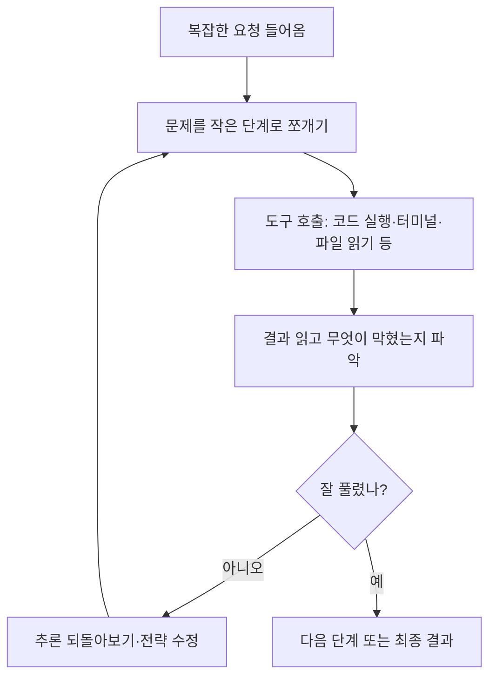

<aside class="ai-knowledge-sidebar">
  
CATEGORIES

  <nav class="ai-cat-tree">

에이전트 오케스트레이션12
<ul><li><a href="https://altjs4510.github.io/ai_news_blog/knowledge/20260708/">2026-07-08Expanding Managed Agents in Gemini API: backgrou…</a></li><li><a href="https://altjs4510.github.io/ai_news_blog/knowledge/20260707/">2026-07-07AI Hero Skills Catalog — 실무 엔지니어를 위한 재사용 가능한 판단 …</a></li><li><a href="https://altjs4510.github.io/ai_news_blog/knowledge/20260705/">2026-07-05openai/codex-plugin-cc — Claude Code에서 Codex를 위임…</a></li><li><a href="https://altjs4510.github.io/ai_news_blog/knowledge/20260701/">2026-07-01Google OKF (Open Knowledge Format) — 벤더 중립 에이전트 …</a></li><li><a href="https://altjs4510.github.io/ai_news_blog/knowledge/20260623/">2026-06-23bytedance/deer-flow — 샌드박스·메모리·서브에이전트·메시지 게이트웨이를…</a></li><li><a href="https://altjs4510.github.io/ai_news_blog/knowledge/20260621/">2026-06-21calesthio/OpenMontage — 12 파이프라인·52 도구·500+ 스킬을 …</a></li><li><a href="https://altjs4510.github.io/ai_news_blog/knowledge/20260611/">2026-06-11The evolution of agentic surfaces: building with…</a></li><li><a href="https://altjs4510.github.io/ai_news_blog/knowledge/20260602/">2026-06-02revfactory/harness — 도메인별 에이전트 팀과 스킬을 자동 설계하는 메타…</a></li><li><a href="https://altjs4510.github.io/ai_news_blog/knowledge/20260529/">2026-05-29Introducing dynamic workflows in Claude Code</a></li><li><a href="https://altjs4510.github.io/ai_news_blog/knowledge/20260520/">2026-05-20New in Claude Managed Agents: self-hosted sandbo…</a></li><li><a href="https://altjs4510.github.io/ai_news_blog/knowledge/20260507/">2026-05-07ruvnet/ruflo — Claude 멀티 에이전트 오케스트레이션 플랫폼</a></li><li><a href="https://altjs4510.github.io/ai_news_blog/knowledge/20260504/">2026-05-04Agents for Everything Else: Codex for Knowledge …</a></li></ul>

MCP &amp; 도구 통합10
<ul><li><a href="https://altjs4510.github.io/ai_news_blog/knowledge/20260709/">2026-07-09mvanhorn/last30days-skill — Reddit·X·YouTube·HN·…</a></li><li><a href="https://altjs4510.github.io/ai_news_blog/knowledge/20260618/">2026-06-18DeusData/codebase-memory-mcp — 158개 언어 코드베이스를 밀리…</a></li><li><a href="https://altjs4510.github.io/ai_news_blog/knowledge/20260604/">2026-06-04chopratejas/headroom — Compress tool outputs bef…</a></li><li><a href="https://altjs4510.github.io/ai_news_blog/knowledge/20260603/">2026-06-03How Bad MCP design cost your Agent 5× more token…</a></li><li><a href="https://altjs4510.github.io/ai_news_blog/knowledge/20260526/">2026-05-26colbymchenry/codegraph — Pre-indexed code knowle…</a></li><li><a href="https://altjs4510.github.io/ai_news_blog/knowledge/20260523/">2026-05-23colbymchenry/codegraph — 사전 인덱싱된 코드 지식 그래프 MCP</a></li><li><a href="https://altjs4510.github.io/ai_news_blog/knowledge/20260521/">2026-05-21colbymchenry/codegraph — Pre-indexed code knowle…</a></li><li><a href="https://altjs4510.github.io/ai_news_blog/knowledge/20260519/">2026-05-19Anthropic acquires Stainless</a></li><li><a href="https://altjs4510.github.io/ai_news_blog/knowledge/20260517/">2026-05-17I gave my LLM 100,000+ tools — Lazy Discovery &a…</a></li><li><a href="https://altjs4510.github.io/ai_news_blog/knowledge/20260509/">2026-05-09How to connect 100 MCP servers without the conte…</a></li></ul>

코딩 에이전트10
<ul><li><a href="https://altjs4510.github.io/ai_news_blog/knowledge/20260626/">2026-06-26google-labs-code/design.md — 코딩 에이전트에게 디자인 시스템을 …</a></li><li><a href="https://altjs4510.github.io/ai_news_blog/knowledge/20260619/">2026-06-19Claude Code now supports artifacts</a></li><li><a href="https://altjs4510.github.io/ai_news_blog/knowledge/20260530/">2026-05-30Leonxlnx/taste-skill — AI에게 좋은 취향을 부여해 generic s…</a></li><li><a href="https://altjs4510.github.io/ai_news_blog/knowledge/20260528/">2026-05-28Building self-improving tax agents with Codex</a></li><li><a href="https://altjs4510.github.io/ai_news_blog/knowledge/20260524/">2026-05-24colbymchenry/codegraph — Pre-indexed code knowle…</a></li><li><a href="https://altjs4510.github.io/ai_news_blog/knowledge/20260512/">2026-05-12agentmemory — Persistent memory for AI coding ag…</a></li><li><a href="https://altjs4510.github.io/ai_news_blog/knowledge/20260510/">2026-05-10addyosmani/agent-skills — Production-grade engin…</a></li><li><a href="https://altjs4510.github.io/ai_news_blog/knowledge/20260508/">2026-05-08addyosmani/agent-skills — Production-grade engin…</a></li><li><a href="https://altjs4510.github.io/ai_news_blog/knowledge/20260506/">2026-05-06mksglu/context-mode — AI 코딩 에이전트용 컨텍스트 윈도우 최적화</a></li><li><a href="https://altjs4510.github.io/ai_news_blog/knowledge/20260505/">2026-05-05mattpocock/skills — Skills for Real Engineers (.…</a></li></ul>

모델 &amp; 연구4
<ul><li><a href="https://altjs4510.github.io/ai_news_blog/knowledge/20260620/" class="current">2026-06-20zai-org/GLM-5 — From Vibe Coding to Agentic Engi…</a></li><li><a href="https://altjs4510.github.io/ai_news_blog/knowledge/20260617/">2026-06-17Predicting model behavior before release by simu…</a></li><li><a href="https://altjs4510.github.io/ai_news_blog/knowledge/20260516/">2026-05-16STALE — 에이전트가 자기 기억의 유효성을 인지할 수 있는가</a></li><li><a href="https://altjs4510.github.io/ai_news_blog/knowledge/20260513/">2026-05-13Thinking Machines' Native Interaction Models — T…</a></li></ul>

인프라 &amp; 컴퓨트5
<ul><li><a href="https://altjs4510.github.io/ai_news_blog/knowledge/20260630/">2026-06-30Introducing the Claude apps gateway for Amazon B…</a></li><li><a href="https://altjs4510.github.io/ai_news_blog/knowledge/20260610/">2026-06-10Fable 5 just made cost-aware model routing manda…</a></li><li><a href="https://altjs4510.github.io/ai_news_blog/knowledge/20260606/">2026-06-06chopratejas/headroom — Compress tool outputs, lo…</a></li><li><a href="https://altjs4510.github.io/ai_news_blog/knowledge/20260605/">2026-06-05chopratejas/headroom — Compress tool outputs, lo…</a></li><li><a href="https://altjs4510.github.io/ai_news_blog/knowledge/20260522/">2026-05-22Giving Agents Computers — Ivan Burazin, Daytona</a></li></ul>

보안 &amp; 거버넌스10
<ul><li><a href="https://altjs4510.github.io/ai_news_blog/knowledge/20260704/">2026-07-04Cloudflare is about to block AI agents by defaul…</a></li><li><a href="https://altjs4510.github.io/ai_news_blog/knowledge/20260703/">2026-07-03Giving admins more visibility and control over C…</a></li><li><a href="https://altjs4510.github.io/ai_news_blog/knowledge/20260625/">2026-06-25Agent identity in Claude Tag: a new access model…</a></li><li><a href="https://altjs4510.github.io/ai_news_blog/knowledge/20260624/">2026-06-24Agent identity in Claude Tag: a new access model…</a></li><li><a href="https://altjs4510.github.io/ai_news_blog/knowledge/20260614/">2026-06-14NVIDIA/SkillSpector — Security scanner for AI ag…</a></li><li><a href="https://altjs4510.github.io/ai_news_blog/knowledge/20260613/">2026-06-13Fable 5's guardrails got bypassed in 48 hours — …</a></li><li><a href="https://altjs4510.github.io/ai_news_blog/knowledge/20260612/">2026-06-12NVIDIA/SkillSpector — AI 에이전트 스킬용 보안 스캐너</a></li><li><a href="https://altjs4510.github.io/ai_news_blog/knowledge/20260607/">2026-06-07OpenAI Help: Lockdown Mode</a></li><li><a href="https://altjs4510.github.io/ai_news_blog/knowledge/20260531/">2026-05-31How we contain Claude across products</a></li><li><a href="https://altjs4510.github.io/ai_news_blog/knowledge/20260527/">2026-05-27Microsoft Copilot Cowork Exfiltrates Files</a></li></ul>

응용 사례3
<ul><li><a href="https://altjs4510.github.io/ai_news_blog/knowledge/20260609/">2026-06-09Building intelligent apps for Apple platforms wi…</a></li><li><a href="https://altjs4510.github.io/ai_news_blog/knowledge/20260515/">2026-05-15Clawdmeter — Claude Code 사용량을 데스크톱 대시보드로</a></li><li><a href="https://altjs4510.github.io/ai_news_blog/knowledge/20260514/">2026-05-14Introducing Claude for Small Business</a></li></ul>

산업 동향2
<ul><li><a href="https://altjs4510.github.io/ai_news_blog/knowledge/20260702/">2026-07-02How Cursor deploys AI inside the enterprise (For…</a></li><li><a href="https://altjs4510.github.io/ai_news_blog/knowledge/20260616/">2026-06-16Why AI hasn't replaced software engineers, and w…</a></li></ul>
</nav>
</aside>

<article class="ai-knowledge-article">

<header class="ai-post-hero">
  
<a class="ai-back" href="../">KNOWLEDGE</a> · 2026-06-20 · 오늘의 학습

  <h2 class="ai-post-title">zai-org/GLM-5 — From Vibe Coding to Agentic Engineering</h2>
</header>

> 원문: [zai-org/GLM-5 — From Vibe Coding to Agentic Engineering](https://github.com/zai-org/GLM-5)

## 📌 학습 정리

### 1. 한 줄로 말하면

오랜 시간 동안 스스로 일을 끌고 가는 "일꾼형" 인공지능을 목표로, 코드를 짜고 도구를 다루는 능력을 크게 끌어올린 오픈소스 모델 묶음(GLM-5 / 5.1 / 5.2)이에요.

### 2. 왜 이게 만들어졌어요?

기존의 큰 언어 모델들은 짧은 질문엔 잘 답해도, 몇 시간씩 이어지는 복잡한 작업에서는 금방 밑천이 드러나는 경향이 있었어요. 익숙한 방법으로 초반에만 점수를 올리고, 시간이 더 주어져도 같은 자리에서 맴도는 식이죠. 원문에서는 GLM-5 이전 모델들도 이런 한계를 보였다고 솔직하게 말하고 있어요.

그래서 GLM-5 계열은 처음부터 "긴 호흡의 작업(long-horizon task)"을 잘 해내는 데 초점을 맞춰 설계됐어요. 한 번에 답을 내는 게 아니라, 문제를 잘게 쪼개고 실험을 돌리고 결과를 읽어가며 전략을 수정하는, 사람 개발자처럼 일하는 방식을 지향한다고 보면 됩니다. 동시에 모델 자체도 더 크게 키우고(파라미터·학습 데이터 모두), 긴 문맥을 다루는 비용을 줄이는 새 구조를 더했어요.

### 3. 비유로 풀면

이건 마치 **퇴근 시간이 다가올수록 집중력이 흩어지는 신입 개발자** 대신, **밤을 새도 페이스가 떨어지지 않는 시니어 개발자**를 데려온 것에 가까워요. 짧은 일은 둘 다 잘하지만, 며칠짜리 프로젝트를 맡겨두면 차이가 벌어지는 그런 결이에요.

또 하나 비유하자면, 두꺼운 책을 통째로 책상에 펼쳐놓고도 흐름을 놓치지 않는 사람 같아요. "100만 토큰 문맥(1M context)"이라는 표현이 그런 의미예요. 그래서 결국 GLM-5 계열은 *길고 복잡한 일거리를 끝까지 끌고 가는 능력*을 핵심 자랑거리로 내세우는 모델이에요.

### 4. 어떻게 작동하는지 (그림으로)

핵심 동작은 "한 번에 답하기"가 아니라 **계획 → 도구 사용 → 결과 확인 → 전략 수정**의 고리를 수백 번 반복하는 거예요. 원문에서는 "수백 라운드, 수천 번의 도구 호출"을 견디며 점점 결과를 좋게 만들어 간다고 표현하고 있어요. GLM-5.2는 여기에 "생각의 깊이"를 조절할 수 있는 옵션(`reasoning_effort`로 `max` 또는 `high`)을 더해, 속도와 품질의 균형을 잡을 수 있게 했어요.

### 5. 처음 보는 용어 풀이

- **에이전트형 작업 (agentic task)** — 모델이 단순히 답만 주는 게 아니라, 스스로 도구를 골라 쓰고 여러 단계를 거쳐 목표를 달성해야 하는 일을 말해요. 코드 저장소를 고치거나 터미널 명령을 이어 실행하는 작업이 대표적입니다.
- **긴 호흡의 작업 (long-horizon task)** — 한두 번 주고받아 끝나는 게 아니라, 수십~수백 단계가 이어지는 작업이에요. 중간에 길을 잃지 않고 끝까지 가는 능력이 중요해요.
- **100만 토큰 문맥 (1M context)** — 모델이 한 번에 기억하고 참고할 수 있는 텍스트 양이 100만 토큰 규모라는 뜻이에요. 큰 코드베이스나 긴 문서를 통째로 들고 일할 수 있는 정도의 크기예요.
- **희소 어텐션 (sparse attention) / DeepSeek Sparse Attention (DSA)** — 입력이 길어질수록 모델이 모든 단어를 다 비교하면 비용이 폭증하는데, 중요한 부분만 골라 보게 해서 비용을 줄이는 방식이에요. GLM-5는 이 방식을 도입해 긴 문맥을 더 싸게 다뤄요.
- **IndexShare** — 원문에서 새로 제안한 구조로, 위에서 말한 희소 어텐션의 "어느 부분이 중요한지 찾는 부품(인덱서)"을 여러 층이 공유하게 해서 계산량을 줄이는 기법이에요. 100만 토큰 길이에서 토큰당 연산량을 약 2.9배 줄였다고 해요.
- **추측 디코딩 (speculative decoding) / MTP 레이어** — 모델이 답을 한 글자씩 만들지 않고, 미리 여러 글자를 추측해 빠르게 만들어내는 가속 기법이에요. GLM-5.2는 이걸 개선해 추측이 받아들여지는 길이를 최대 20% 늘렸어요.
- **비동기 강화학습 인프라 (asynchronous RL infrastructure) / slime** — 모델을 사후에 더 잘 다듬는 강화학습은 효율이 나쁘기로 유명한데, 이를 비동기 방식으로 돌려 학습 처리량을 높인 자체 시스템이에요. 더 자주, 더 세밀하게 모델을 개선할 수 있게 해줘요.
- **사고 강도 옵션 (reasoning_effort)** — 모델이 얼마나 깊게 생각할지 고르는 손잡이예요. 기본값 `max`는 가장 깊게 생각하는 모드이고, `high`는 그보다 가벼운 모드, `enable_thinking=false`로 아예 끌 수도 있어요.
- **BF16 / FP8** — 모델 가중치를 저장하는 정밀도예요. BF16은 일반적인 고정밀, FP8은 더 가볍게 압축한 버전이라 같은 모델이라도 메모리·속도가 달라져요.

### 6. 한 발 더 들어가고 싶다면

- [GLM-5.2 블로그](https://z.ai) 및 [GLM-5 기술 보고서](https://arxiv.org/abs/2602.15763) — 모델의 설계 의도와 벤치마크 수치를 공식 설명으로 확인할 수 있어요.
- [Z.ai API 플랫폼](https://Z.ai) — 직접 모델을 띄우지 않고 API로 GLM-5.2를 써보고 싶을 때 들어가 볼 곳이에요.
- [Hugging Face](https://huggingface.co) / [ModelScope](https://modelscope.cn) — 가중치(BF16·FP8 버전)를 직접 내려받을 수 있는 두 곳이에요.
- SGLang, vLLM, Transformers, KTransformers — 원문에서 "내 컴퓨터/서버에서 직접 돌리고 싶다면 이 프레임워크들의 최신 버전 가이드를 따라가라"고 안내하고 있어요. 어떤 환경에서 어떻게 띄우는지 비교해볼 수 있는 출발점이에요.
- [Vending Bench 2](https://andonlabs.com/evals/vending-bench) — "1년치 자판기 사업을 시뮬레이션으로 운영"시키는 평가로, 모델이 장기 계획과 자원 관리에 얼마나 강한지 가늠하는 벤치마크가 어떤 모양새인지 볼 수 있어요.

---

## 📖 원문 전체 번역 (정독용)

> 의역 최소화한 전체 번역입니다. 큰 흐름은 위 정리에서 잡고, 정확한 워딩이 필요할 땐 이 섹션에서 정독하세요.

_(번역 생성에 실패했습니다. 원문 URL을 직접 참고하세요.)_

</article>

<!-- ai-related-links -->
<aside class="ai-related-links">
  
관련 학습

  <ul><li><a href="https://altjs4510.github.io/ai_news_blog/knowledge/20260611/">2026-06-11The evolution of agentic surfaces: building with…</a></li><li><a href="https://altjs4510.github.io/ai_news_blog/knowledge/20260602/">2026-06-02revfactory/harness — 도메인별 에이전트 팀과 스킬을 자동 설계하는 메타…</a></li><li><a href="https://altjs4510.github.io/ai_news_blog/knowledge/20260529/">2026-05-29Introducing dynamic workflows in Claude Code</a></li></ul>
</aside>
<!-- /ai-related-links -->
