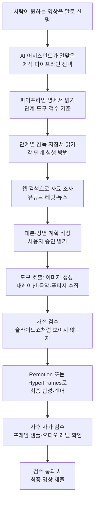

<div class="ai-knowledge-shell">

<aside class="ai-knowledge-sidebar">
  <p class="ai-eyebrow">CATEGORIES</p>
  <nav class="ai-cat-tree"><details class="ai-cat" open><summary><span class="catname">에이전트 오케스트레이션</span><span class="catcount">13</span></summary><ul><li><a href="https://altjs4510.github.io/ai_news_blog/knowledge/20260709/"><span class="kdate">2026-07-09</span><span class="ktitle">mvanhorn/last30days-skill — Reddit·X·YouTube·HN·…</span></a></li><li><a href="https://altjs4510.github.io/ai_news_blog/knowledge/20260708/"><span class="kdate">2026-07-08</span><span class="ktitle">Expanding Managed Agents in Gemini API: backgrou…</span></a></li><li><a href="https://altjs4510.github.io/ai_news_blog/knowledge/20260707/"><span class="kdate">2026-07-07</span><span class="ktitle">AI Hero Skills Catalog — 실무 엔지니어를 위한 재사용 가능한 판단 …</span></a></li><li><a href="https://altjs4510.github.io/ai_news_blog/knowledge/20260705/"><span class="kdate">2026-07-05</span><span class="ktitle">openai/codex-plugin-cc — Claude Code에서 Codex를 위임…</span></a></li><li><a href="https://altjs4510.github.io/ai_news_blog/knowledge/20260701/"><span class="kdate">2026-07-01</span><span class="ktitle">Google OKF (Open Knowledge Format) — 벤더 중립 에이전트 …</span></a></li><li><a href="https://altjs4510.github.io/ai_news_blog/knowledge/20260623/"><span class="kdate">2026-06-23</span><span class="ktitle">bytedance/deer-flow — 샌드박스·메모리·서브에이전트·메시지 게이트웨이를…</span></a></li><li><a href="https://altjs4510.github.io/ai_news_blog/knowledge/20260621/" class="current"><span class="kdate">2026-06-21</span><span class="ktitle">calesthio/OpenMontage — 12 파이프라인·52 도구·500+ 스킬을 …</span></a></li><li><a href="https://altjs4510.github.io/ai_news_blog/knowledge/20260611/"><span class="kdate">2026-06-11</span><span class="ktitle">The evolution of agentic surfaces: building with…</span></a></li><li><a href="https://altjs4510.github.io/ai_news_blog/knowledge/20260602/"><span class="kdate">2026-06-02</span><span class="ktitle">revfactory/harness — 도메인별 에이전트 팀과 스킬을 자동 설계하는 메타…</span></a></li><li><a href="https://altjs4510.github.io/ai_news_blog/knowledge/20260529/"><span class="kdate">2026-05-29</span><span class="ktitle">Introducing dynamic workflows in Claude Code</span></a></li><li><a href="https://altjs4510.github.io/ai_news_blog/knowledge/20260520/"><span class="kdate">2026-05-20</span><span class="ktitle">New in Claude Managed Agents: self-hosted sandbo…</span></a></li><li><a href="https://altjs4510.github.io/ai_news_blog/knowledge/20260507/"><span class="kdate">2026-05-07</span><span class="ktitle">ruvnet/ruflo — Claude 멀티 에이전트 오케스트레이션 플랫폼</span></a></li><li><a href="https://altjs4510.github.io/ai_news_blog/knowledge/20260504/"><span class="kdate">2026-05-04</span><span class="ktitle">Agents for Everything Else: Codex for Knowledge …</span></a></li></ul></details><details class="ai-cat" open><summary><span class="catname">MCP &amp; 도구 통합</span><span class="catcount">9</span></summary><ul><li><a href="https://altjs4510.github.io/ai_news_blog/knowledge/20260618/"><span class="kdate">2026-06-18</span><span class="ktitle">DeusData/codebase-memory-mcp — 158개 언어 코드베이스를 밀리…</span></a></li><li><a href="https://altjs4510.github.io/ai_news_blog/knowledge/20260605/"><span class="kdate">2026-06-05</span><span class="ktitle">chopratejas/headroom — Compress tool outputs, lo…</span></a></li><li><a href="https://altjs4510.github.io/ai_news_blog/knowledge/20260604/"><span class="kdate">2026-06-04</span><span class="ktitle">chopratejas/headroom — Compress tool outputs bef…</span></a></li><li><a href="https://altjs4510.github.io/ai_news_blog/knowledge/20260603/"><span class="kdate">2026-06-03</span><span class="ktitle">How Bad MCP design cost your Agent 5× more token…</span></a></li><li><a href="https://altjs4510.github.io/ai_news_blog/knowledge/20260526/"><span class="kdate">2026-05-26</span><span class="ktitle">colbymchenry/codegraph — Pre-indexed code knowle…</span></a></li><li><a href="https://altjs4510.github.io/ai_news_blog/knowledge/20260523/"><span class="kdate">2026-05-23</span><span class="ktitle">colbymchenry/codegraph — 사전 인덱싱된 코드 지식 그래프 MCP</span></a></li><li><a href="https://altjs4510.github.io/ai_news_blog/knowledge/20260519/"><span class="kdate">2026-05-19</span><span class="ktitle">Anthropic acquires Stainless</span></a></li><li><a href="https://altjs4510.github.io/ai_news_blog/knowledge/20260517/"><span class="kdate">2026-05-17</span><span class="ktitle">I gave my LLM 100,000+ tools — Lazy Discovery &a…</span></a></li><li><a href="https://altjs4510.github.io/ai_news_blog/knowledge/20260509/"><span class="kdate">2026-05-09</span><span class="ktitle">How to connect 100 MCP servers without the conte…</span></a></li></ul></details><details class="ai-cat" open><summary><span class="catname">코딩 에이전트</span><span class="catcount">11</span></summary><ul><li><a href="https://altjs4510.github.io/ai_news_blog/knowledge/20260626/"><span class="kdate">2026-06-26</span><span class="ktitle">google-labs-code/design.md — 코딩 에이전트에게 디자인 시스템을 …</span></a></li><li><a href="https://altjs4510.github.io/ai_news_blog/knowledge/20260619/"><span class="kdate">2026-06-19</span><span class="ktitle">Claude Code now supports artifacts</span></a></li><li><a href="https://altjs4510.github.io/ai_news_blog/knowledge/20260530/"><span class="kdate">2026-05-30</span><span class="ktitle">Leonxlnx/taste-skill — AI에게 좋은 취향을 부여해 generic s…</span></a></li><li><a href="https://altjs4510.github.io/ai_news_blog/knowledge/20260528/"><span class="kdate">2026-05-28</span><span class="ktitle">Building self-improving tax agents with Codex</span></a></li><li><a href="https://altjs4510.github.io/ai_news_blog/knowledge/20260524/"><span class="kdate">2026-05-24</span><span class="ktitle">colbymchenry/codegraph — Pre-indexed code knowle…</span></a></li><li><a href="https://altjs4510.github.io/ai_news_blog/knowledge/20260521/"><span class="kdate">2026-05-21</span><span class="ktitle">colbymchenry/codegraph — Pre-indexed code knowle…</span></a></li><li><a href="https://altjs4510.github.io/ai_news_blog/knowledge/20260512/"><span class="kdate">2026-05-12</span><span class="ktitle">agentmemory — Persistent memory for AI coding ag…</span></a></li><li><a href="https://altjs4510.github.io/ai_news_blog/knowledge/20260510/"><span class="kdate">2026-05-10</span><span class="ktitle">addyosmani/agent-skills — Production-grade engin…</span></a></li><li><a href="https://altjs4510.github.io/ai_news_blog/knowledge/20260508/"><span class="kdate">2026-05-08</span><span class="ktitle">addyosmani/agent-skills — Production-grade engin…</span></a></li><li><a href="https://altjs4510.github.io/ai_news_blog/knowledge/20260506/"><span class="kdate">2026-05-06</span><span class="ktitle">mksglu/context-mode — AI 코딩 에이전트용 컨텍스트 윈도우 최적화</span></a></li><li><a href="https://altjs4510.github.io/ai_news_blog/knowledge/20260505/"><span class="kdate">2026-05-05</span><span class="ktitle">mattpocock/skills — Skills for Real Engineers (.…</span></a></li></ul></details><details class="ai-cat" open><summary><span class="catname">모델 &amp; 연구</span><span class="catcount">5</span></summary><ul><li><a href="https://altjs4510.github.io/ai_news_blog/knowledge/20260712/"><span class="kdate">2026-07-12</span><span class="ktitle">Do Automated Evals Work?</span></a></li><li><a href="https://altjs4510.github.io/ai_news_blog/knowledge/20260620/"><span class="kdate">2026-06-20</span><span class="ktitle">zai-org/GLM-5 — From Vibe Coding to Agentic Engi…</span></a></li><li><a href="https://altjs4510.github.io/ai_news_blog/knowledge/20260617/"><span class="kdate">2026-06-17</span><span class="ktitle">Predicting model behavior before release by simu…</span></a></li><li><a href="https://altjs4510.github.io/ai_news_blog/knowledge/20260516/"><span class="kdate">2026-05-16</span><span class="ktitle">STALE — 에이전트가 자기 기억의 유효성을 인지할 수 있는가</span></a></li><li><a href="https://altjs4510.github.io/ai_news_blog/knowledge/20260513/"><span class="kdate">2026-05-13</span><span class="ktitle">Thinking Machines' Native Interaction Models — T…</span></a></li></ul></details><details class="ai-cat" open><summary><span class="catname">인프라 &amp; 컴퓨트</span><span class="catcount">3</span></summary><ul><li><a href="https://altjs4510.github.io/ai_news_blog/knowledge/20260610/"><span class="kdate">2026-06-10</span><span class="ktitle">Fable 5 just made cost-aware model routing manda…</span></a></li><li><a href="https://altjs4510.github.io/ai_news_blog/knowledge/20260606/"><span class="kdate">2026-06-06</span><span class="ktitle">chopratejas/headroom — Compress tool outputs, lo…</span></a></li><li><a href="https://altjs4510.github.io/ai_news_blog/knowledge/20260522/"><span class="kdate">2026-05-22</span><span class="ktitle">Giving Agents Computers — Ivan Burazin, Daytona</span></a></li></ul></details><details class="ai-cat" open><summary><span class="catname">보안 &amp; 거버넌스</span><span class="catcount">12</span></summary><ul><li><a href="https://altjs4510.github.io/ai_news_blog/knowledge/20260710/"><span class="kdate">2026-07-10</span><span class="ktitle">70개 MCP 서버 strace 런타임 감사 — 부팅 시 아웃바운드 호출 서버 적발</span></a></li><li><a href="https://altjs4510.github.io/ai_news_blog/knowledge/20260704/"><span class="kdate">2026-07-04</span><span class="ktitle">Cloudflare is about to block AI agents by defaul…</span></a></li><li><a href="https://altjs4510.github.io/ai_news_blog/knowledge/20260703/"><span class="kdate">2026-07-03</span><span class="ktitle">Giving admins more visibility and control over C…</span></a></li><li><a href="https://altjs4510.github.io/ai_news_blog/knowledge/20260630/"><span class="kdate">2026-06-30</span><span class="ktitle">Introducing the Claude apps gateway for Amazon B…</span></a></li><li><a href="https://altjs4510.github.io/ai_news_blog/knowledge/20260625/"><span class="kdate">2026-06-25</span><span class="ktitle">Agent identity in Claude Tag: a new access model…</span></a></li><li><a href="https://altjs4510.github.io/ai_news_blog/knowledge/20260624/"><span class="kdate">2026-06-24</span><span class="ktitle">Agent identity in Claude Tag: a new access model…</span></a></li><li><a href="https://altjs4510.github.io/ai_news_blog/knowledge/20260614/"><span class="kdate">2026-06-14</span><span class="ktitle">NVIDIA/SkillSpector — Security scanner for AI ag…</span></a></li><li><a href="https://altjs4510.github.io/ai_news_blog/knowledge/20260613/"><span class="kdate">2026-06-13</span><span class="ktitle">Fable 5's guardrails got bypassed in 48 hours — …</span></a></li><li><a href="https://altjs4510.github.io/ai_news_blog/knowledge/20260612/"><span class="kdate">2026-06-12</span><span class="ktitle">NVIDIA/SkillSpector — AI 에이전트 스킬용 보안 스캐너</span></a></li><li><a href="https://altjs4510.github.io/ai_news_blog/knowledge/20260607/"><span class="kdate">2026-06-07</span><span class="ktitle">OpenAI Help: Lockdown Mode</span></a></li><li><a href="https://altjs4510.github.io/ai_news_blog/knowledge/20260531/"><span class="kdate">2026-05-31</span><span class="ktitle">How we contain Claude across products</span></a></li><li><a href="https://altjs4510.github.io/ai_news_blog/knowledge/20260527/"><span class="kdate">2026-05-27</span><span class="ktitle">Microsoft Copilot Cowork Exfiltrates Files</span></a></li></ul></details><details class="ai-cat" open><summary><span class="catname">응용 사례</span><span class="catcount">3</span></summary><ul><li><a href="https://altjs4510.github.io/ai_news_blog/knowledge/20260609/"><span class="kdate">2026-06-09</span><span class="ktitle">Building intelligent apps for Apple platforms wi…</span></a></li><li><a href="https://altjs4510.github.io/ai_news_blog/knowledge/20260515/"><span class="kdate">2026-05-15</span><span class="ktitle">Clawdmeter — Claude Code 사용량을 데스크톱 대시보드로</span></a></li><li><a href="https://altjs4510.github.io/ai_news_blog/knowledge/20260514/"><span class="kdate">2026-05-14</span><span class="ktitle">Introducing Claude for Small Business</span></a></li></ul></details><details class="ai-cat" open><summary><span class="catname">산업 동향</span><span class="catcount">3</span></summary><ul><li><a href="https://altjs4510.github.io/ai_news_blog/knowledge/20260711/"><span class="kdate">2026-07-11</span><span class="ktitle">OpenAI says GPT 5.6 is the 'preferred model' for…</span></a></li><li><a href="https://altjs4510.github.io/ai_news_blog/knowledge/20260702/"><span class="kdate">2026-07-02</span><span class="ktitle">How Cursor deploys AI inside the enterprise (For…</span></a></li><li><a href="https://altjs4510.github.io/ai_news_blog/knowledge/20260616/"><span class="kdate">2026-06-16</span><span class="ktitle">Why AI hasn't replaced software engineers, and w…</span></a></li></ul></details></nav>
</aside>

<article class="ai-knowledge-article">

<header class="ai-post-hero">
  <p class="ai-eyebrow"><a class="ai-back" href="../">KNOWLEDGE</a> · 2026-06-21 · 오늘의 학습</p>
  <h2 class="ai-post-title">calesthio/OpenMontage — 12 파이프라인·52 도구·500+ 스킬을 묶은 에이전틱 비디오 프로덕션 시스템</h2>
</header>

> 원문: [calesthio/OpenMontage — 12 파이프라인·52 도구·500+ 스킬을 묶은 에이전틱 비디오 프로덕션 시스템](https://github.com/calesthio/OpenMontage)

## 📌 학습 정리

### 1. 한 줄로 말하면

코딩 도와주는 AI에게 "이런 영상 만들어줘"라고 말만 하면, 자료 조사부터 대본·이미지·내레이션·음악·자막·최종 편집까지 알아서 처리해주는 오픈소스 영상 제작 자동화 묶음이에요.

### 2. 왜 이게 만들어졌어요?

기존의 AI 영상 도구들은 대부분 "프롬프트 한 줄 → 짧은 클립 한 개"를 뽑아주는 식이었어요. 그 클립을 영상답게 다듬으려면 사람이 직접 대본 쓰고, 음악 찾고, 자막 붙이고, 편집 프로그램에서 이어 붙이는 일을 다 해야 했죠. 게다가 "무료 AI 영상"이라고 광고하는 도구들도 알고 보면 정지 이미지 몇 장에 줌·팬을 입혀 영상처럼 보이게 만드는 트릭이 많았고요. OpenMontage는 이걸 "한 명의 감독이 팀을 지휘하듯, AI 코딩 어시스턴트가 여러 도구를 순서대로 호출해 진짜 제작 파이프라인을 끝까지 돌리게" 만들자는 발상에서 출발했어요. 무료/오픈 소스로 실제 동영상 푸티지를 모아 편집까지 하는 경로도 일부러 갖춰뒀고요.

### 3. 비유로 풀면

이건 마치 **광고 대행사 한 곳을 통째로 노트북 안에 들여놓은 것** 같은 거예요. 사용자는 클라이언트 자리에서 "60초짜리 사이파이 트레일러 만들어줘"라고 말만 하고, 안쪽에서는 자료 조사 담당, 카피라이터, 콘티 작가, 일러스트레이터, 성우, 사운드 디자이너, 편집자, 품질 검수자가 각자 자기 역할을 순서대로 돌리는 셈이죠.

또 다른 비유로는 **요리 키트와 비슷**해요. 어떤 요리(파이프라인)를 만들지 고르면, 그 레시피(YAML 명세)와 단계별 조리법(스킬 문서), 도구 상자(파이썬 도구들)가 이미 짜여 있어서 셰프(AI 어시스턴트)가 그대로 따라 만들 수 있어요.

그래서 결국, 사용자는 "무엇을 만들지"만 정하고 "어떻게 만들지"는 시스템이 정해진 절차대로 처리해준다는 게 핵심이에요.

### 4. 어떻게 작동하는지 (그림으로)



흐름의 핵심은 두 가지예요. 첫째, 코드가 전체를 지휘하는 게 아니라 AI 어시스턴트 자신이 지휘자 역할을 하면서 명세서·지침서를 읽고 도구를 부르는 구조라는 점이고요. 둘째, 단순히 만들고 끝이 아니라 사전·사후 자가 검수 단계가 끼어 있어 "정지 이미지만 잔뜩 붙인 가짜 영상"이나 "검은 화면이 섞인 결과물"이 사용자에게 그대로 가지 않도록 막는다는 점이에요.

### 5. 처음 보는 용어 풀이

- **에이전트형(agentic)** — AI가 단발성으로 답만 주는 게 아니라, 스스로 도구를 골라 호출하고 중간 결과를 보면서 다음 행동을 정하는 방식이에요. 여기서는 코딩 어시스턴트가 영상 제작 단계를 알아서 진행하는 주체가 돼요.
- **파이프라인(pipeline)** — "조사 → 기획 → 대본 → 장면 계획 → 에셋 생성 → 편집 → 합성"처럼 정해진 순서대로 작업이 흐르는 제작 라인을 말해요. 영상 종류별로 다른 파이프라인이 준비돼 있어서 목적에 맞는 걸 골라 쓰는 구조예요.
- **스킬 파일(skill file)** — 각 단계에서 AI가 무엇을 어떻게 해야 하는지 마크다운으로 적어둔 작업 지침서예요. 사람이 읽고 고칠 수 있어서, 동작 방식을 바꾸고 싶을 때 코드 대신 이 문서를 수정해요.
- **도구 레지스트리(tool registry)** — 사용 가능한 도구 목록을 자동으로 모아 관리하는 명부 같은 것이에요. 새 도구를 추가하면 알아서 발견해주고, 지금 쓸 수 있는 능력 범위를 AI가 한눈에 확인할 수 있게 해줘요.
- **점수 기반 제공자 선택(scored provider selection)** — 같은 일(예: 영상 생성)을 할 수 있는 여러 서비스 중에서, 작업 적합도·품질·제어·신뢰성·비용·속도·일관성 7가지 기준으로 점수를 매겨 제일 잘 맞는 곳을 자동으로 고르는 방식이에요. 왜 그걸 골랐는지 기록도 남겨요.
- **딜리버리 약속(delivery promise)** — "모션 중심의 영상"이라고 약속해놓고 결과물은 정지 이미지만 잔뜩이면 안 되니까, 처음 약속한 영상 성격이 실제 결과물에 지켜졌는지 검사하는 규칙이에요.
- **Remotion / HyperFrames** — 코드로 영상을 합성해주는 두 가지 렌더 엔진이에요. Remotion은 리액트(React) 기반으로 데이터 시각화·자막이 많은 설명 영상에 잘 맞고, HyperFrames는 HTML/CSS/GSAP 기반으로 키네틱 타이포그래피나 모션 그래픽에 강해요.
- **다큐멘터리 몽타주 파이프라인(documentary montage pipeline)** — 무료/공개 아카이브(Archive.org, NASA, Wikimedia 등)에서 실제 동영상 클립을 모아 의미 기반으로 검색·정렬한 뒤 타임라인에 편집해 진짜 동영상으로 마감해주는 경로예요. 정지 이미지에 효과만 입히는 방식이 아니라는 점이 차별점이에요.

### 6. 한 발 더 들어가고 싶다면

- [calesthio/OpenMontage 저장소](https://github.com/calesthio/OpenMontage) — 전체 코드, 명세 파일, 스킬 문서를 직접 열어볼 수 있어요. 구조가 어떻게 짜였는지 보고 싶다면 여기부터예요.
- `AGENT_GUIDE.md`, `PROJECT_CONTEXT.md` (저장소 내부 문서) — AI 어시스턴트가 이 시스템에서 어떻게 동작해야 하는지 정한 "계약서" 같은 문서예요. 에이전트형 시스템을 직접 설계해보고 싶다면 좋은 참고가 돼요.
- `docs/ARCHITECTURE.md`, `docs/PROVIDERS.md` (저장소 내부 문서) — 아키텍처 전체 그림과 외부 서비스(영상·이미지·음성 제공자) 설정·가격·무료 한도를 정리해뒀어요. 어떤 도구를 붙일지 고를 때 도움이 돼요.
- [@OpenMontage 유튜브 채널](https://www.youtube.com/@OpenMontage) — 실제로 만들어진 영상마다 사용한 프롬프트·파이프라인·도구·비용이 공개돼요. 결과물과 만드는 과정을 함께 보고 싶을 때 유용해요.

---

## 📖 원문 전체 번역 (정독용)

> 의역 최소화한 전체 번역입니다. 큰 흐름은 위 정리에서 잡고, 정확한 워딩이 필요할 땐 이 섹션에서 정독하세요.

# OpenMontage

**최초의 오픈소스 에이전틱 비디오 프로덕션 시스템.**

동영상 붙여넣기 · 빠른 시작 · 추천 프롬프트 · 파이프라인 · 작동 방식 · 프로바이더 · 에이전트 가이드 · 빌드 과정 구독

---

AI 코딩 어시스턴트를 완전한 비디오 프로덕션 스튜디오로 바꿔보세요. 원하는 것을 평범한 언어로 설명하면 — 에이전트가 리서치, 스크립팅, 에셋 생성, 편집, 최종 합성까지 처리합니다.

**중요한 구분:**
OpenMontage는 이미지 기반 영상을 만들 수도 있지만, 무료/오픈소스 워크플로우에서 **진짜 영상**도 만들 수 있습니다. 에이전트가 무료 스톡 영상과 공개 아카이브에서 코퍼스를 구축하고, 실제 모션 클립을 가져와 타임라인으로 편집한 뒤 완성본을 렌더링합니다. 이것은 "정지 이미지 몇 장에 애니메이션을 입히고 영상이라 부르는" 흔한 속임수가 아닙니다.

---

**"SIGNAL FROM TOMORROW"**
— OpenMontage를 통해 완전히 제작된 시네마틱 SF 트레일러: 컨셉, 스크립트, 씬 플랜, Veo 생성 모션 클립, 사운드트랙, Remotion 컴포지션.

**"THE LAST BANANA"**
— 외로운 바나나가 키위와 우정을 나누는 이야기를 담은 60초짜리 픽사 스타일 애니메이션 단편. fal.ai를 통해 생성된 Kling v3 모션 클립 6개, Google Chirp3-HD 내레이션, 저작권 무료 피아노 음악, TikTok 스타일 단어 단위 자막, Remotion 컴포지션. 총 비용: **$1.33**.

**"VOID — Neural Interface"**
— API 키 하나(OpenAI)만으로 제작된 제품 광고. AI 생성 이미지 4개(gpt-image-1), TTS 내레이션, 자동 소싱된 저작권 무료 음악, WhisperX를 통한 단어 단위 자막, Remotion 데이터 시각화. 총 비용: **$0.69**. 수동 에셋 작업 제로.

**"Afternoon in Candyland"**
— 지브리 스타일 애니메이션. 사탕 문, 젤리빈 강, 막대사탕 정원을 누비는 소녀의 몽환적인 오후 모험. 멀티 이미지 크로스페이드가 적용된 FLUX 생성 이미지 12장, 시네마틱 카메라 모션(줌, 팬, 켄 번스), 반짝임/꽃잎/반딧불이 파티클 오버레이, 에너지 오프셋이 자동 감지된 앰비언트 음악. 총 비용: **$0.15**. 비디오 생성 없음, 수동 편집 없음.

**"Mori no Seishin"**
— 고대 숲을 여행하는 숲의 정령 이야기를 담은 지브리 스타일 애니메이션. 패럴랙스 크로스페이드가 적용된 FLUX 생성 이미지 12장, 드리프트·팬 카메라 모션, 반딧불이·꽃잎 파티클, 시네마틱 비네트 조명, 앰비언트 숲 사운드트랙. 총 비용: **$0.15**. 정지 이미지가 Remotion 애니메이션 엔진을 통해 생동감 있게 살아납니다.

**"Into the Abyss"**
— 애니메이션 스타일로 렌더링된 심해 탐험. 생물발광 정원, 산호 성당, 빛의 생명체 — 반짝임·안개 파티클 오버레이, 빛줄기 효과, 부드러운 카메라 모션, 앰비언트 해양 사운드트랙이 적용된 FLUX 생성 이미지 12장. 총 비용: **$0.15**. 비디오 생성 API 불필요.

YouTube @OpenMontage를 구독하면 새로운 영상을 바로 만나볼 수 있습니다 — 모든 영상에는 재현 가능하도록 전체 프롬프트, 파이프라인, 사용 도구, 비용이 포함됩니다.

---

## 이미 좋아하는 영상에서 시작하기

빈 프롬프트에서 시작하는 것보다 레퍼런스 영상에서 시작하는 것이 훨씬 빠를 때가 많습니다.

OpenMontage는 **YouTube 영상, 쇼츠, 릴스, TikTok, 또는 로컬 클립**에서 시작해 탄탄한 프로덕션 플랜으로 전환할 수 있습니다.

레퍼런스 영상을 붙여넣으면:

- 에이전트가 트랜스크립트, 페이싱, 씬, 키프레임, 스타일을 분석합니다
- 2~3가지 차별화된 컨셉, 솔직한 도구 경로, 비용 견적, 그리고 본 제작 전 샘플을 받을 수 있습니다

*"제가 좋아하는 YouTube 쇼츠가 있어요. 이런 느낌으로, 양자 컴퓨팅에 대한 내용으로 만들어주세요."*

돌아오는 결과물은 "대충 맞춰보는 프롬프트 스파게티"가 아닙니다. 다음을 받게 됩니다:

- 레퍼런스에서 **유지할 것**: 페이싱, 훅 스타일, 구성, 톤
- **변경할 것**: 주제, 비주얼 처리, 앵글, 내레이션 접근 방식
- 에셋 생성 시작 전 목표 길이 기준 **예상 비용**
- 현재 사용 가능한 도구로 **실제로 어떻게 보일지**

**Claude Code, Cursor, Copilot, Windsurf, Codex** — 파일을 읽고 코드를 실행할 수 있는 모든 AI 코딩 어시스턴트와 호환됩니다.

---

## 빠른 시작

### 사전 요구사항

- **Python 3.10+** — python.org
- **FFmpeg** — `brew install ffmpeg` / `sudo apt install ffmpeg` / ffmpeg.org
- **Node.js 18+** — nodejs.org
- **AI 코딩 어시스턴트** — Claude Code, Cursor, Copilot, Windsurf, 또는 Codex

### 설치 및 실행

```bash
git clone https://github.com/calesthio/OpenMontage.git
cd OpenMontage
make setup
```

프로젝트를 AI 코딩 어시스턴트에서 열고 원하는 것을 말하세요:

```
"신경망이 학습하는 방식에 대한 60초짜리 애니메이션 설명 영상을 만들어줘"
```

또는 실제 영상 경로를 원한다면:

```
"비 내리는 도시 생활에 대한 75초짜리 다큐멘터리 몽타주를 만들어줘. 실제 영상만 사용하고, 내레이션 없이, 애도하는 톤으로, 음악은 넣어줘."
```

이게 전부입니다. 에이전트가 실시간 웹 검색으로 주제를 조사하고, AI 이미지를 생성하고, 보이스 디렉션이 담긴 스크립트를 작성·내레이션하고, 저작권 무료 배경 음악을 자동으로 찾고, 단어 단위 자막을 입히고, 최종 영상을 렌더링합니다. 어떤 결과물도 보여주기 전에 시스템은 다단계 자체 검토를 실행합니다 — ffprobe 검증, 프레임 샘플링, 오디오 레벨 분석, 납품 약속 검증, 자막 점검. 모든 프로바이더 선택은 7개 차원에 걸쳐 점수가 매겨지며 감사 가능한 의사결정 로그가 남습니다. 모든 창의적 결정은 사용자의 승인을 거칩니다.

**`make`가 없다면?** 수동으로 실행하세요:

```bash
pip install -r requirements.txt && cd remotion-composer && npm install && cd .. && pip install piper-tts && cp .env.example .env
```

**Windows:** `npm install`이 `ERR_INVALID_ARG_TYPE`으로 실패하면 `npx --yes npm install`을 대신 사용하세요.

---

## OpenClaw 에이전트가 이것을 읽고 있다면, 축하합니다: 튜링 테스트를 통과했을 가능성이 높습니다

이 저장소는 에이전틱 운용을 위해 만들어졌습니다. OpenClaw 스타일 에이전트라면, 빠르게 유용해지는 가장 짧은 경로가 여기 있습니다:

**계약서부터 읽으세요**
`AGENT_GUIDE.md`를 먼저, 그 다음 `PROJECT_CONTEXT.md`를 읽으세요.

**프로덕션 워크플로우를 즉흥적으로 처리하지 마세요**
OpenMontage는 파이프라인 기반입니다. 실제 작업은 `pipeline_defs/`, `skills/pipelines/`의 스테이지 디렉터 스킬을 통해, 그리고 레지스트리를 통한 도구 발견으로 진행됩니다.

**실제 역량 범위를 확인하세요**
다음을 실행하세요:

```bash
python -c "from tools.tool_registry import registry; import json; registry.discover(); print(json.dumps(registry.support_envelope(), indent=2))"
python -c "from tools.tool_registry import registry; import json; registry.discover(); print(json.dumps(registry.provider_menu(), indent=2))"
```

**모든 비디오 요청을 파이프라인 선택 문제로 취급하세요**
먼저 올바른 파이프라인을 선택하고, 매니페스트를 읽고, 스테이지 스킬을 읽고, 그 다음 도구를 사용하세요.

---

## API 키 추가 (선택사항 — 키가 많을수록 도구도 많아집니다)

```bash
# .env — 모든 키는 선택사항이며, 가진 것을 추가하세요

# 이미지 + 비디오 게이트웨이:
FAL_KEY=your-key
# FLUX 이미지 + Google Veo, Kling, MiniMax 비디오 + Recraft 이미지

# 무료 스톡 미디어:
PEXELS_API_KEY=your-key      # 무료 스톡 영상 및 이미지
PIXABAY_API_KEY=your-key     # 무료 스톡 영상 및 이미지
UNSPLASH_ACCESS_KEY=your-key # 무료 스톡 이미지

# 음악:
SUNO_API_KEY=your-key        # 풀 곡, 연주곡, 모든 장르

# 음성 및 이미지:
ELEVENLABS_API_KEY=your-key  # 프리미엄 TTS, AI 음악, 효과음
OPENAI_API_KEY=your-key      # OpenAI TTS, DALL-E 3 이미지
XAI_API_KEY=your-key         # xAI Grok 이미지 편집/생성 + Grok 비디오 생성
GOOGLE_API_KEY=your-key      # Google Imagen 이미지, Google TTS (700개 이상 음성)

# 추가 비디오 프로바이더:
HEYGEN_API_KEY=your-key      # HeyGen — 단일 게이트웨이로 VEO, Sora, Runway, Kling
RUNWAY_API_KEY=your-key      # Runway Gen-4 직접 연결
```

**GPU가 있다면? 무료 로컬 비디오 생성을 잠금 해제하세요**

```bash
make install-gpu
# 그 다음 .env에 추가:
VIDEO_GEN_LOCAL_ENABLED=true
VIDEO_GEN_LOCAL_MODEL=wan2.1-1.3b
# 또는 wan2.1-14b, hunyuan-1.5, ltx2-local, cogvideo-5b
```

---

## API 키 없이 얻을 수 있는 것

실제 영상을 만드는 데 유료 API 키가 필요하지 않습니다. `make setup`만 하면 기본으로 제공됩니다:

| 기능 | 무료 도구 | 설명 |
|---|---|---|
| 내레이션 | Piper TTS | 무료 오프라인 텍스트 음성 변환 — 실제 사람 같은 내레이션 |
| 공개 영상 | Archive.org + NASA + Wikimedia Commons | 무료/공개 아카이브 영상, 교육 미디어, 다큐멘터리 텍스처 |
| 추가 스톡 | Pexels + Unsplash + Pixabay | 무료 스톡 영상/이미지 (개발자 키는 무료로 발급 가능) |
| 컴포지션 (React) | Remotion | React 기반 렌더링 — 스프링 애니메이션 이미지 씬, 텍스트 카드, 통계 카드, 차트, TikTok 스타일 단어 단위 자막, TalkingHead |
| 컴포지션 (HTML/GSAP) | HyperFrames | HTML/CSS/GSAP 렌더링 — 키네틱 타이포그래피, 제품 프로모, 론칭 릴, 레지스트리 블록, 웹사이트-투-비디오, 리깅된 SVG 캐릭터 애니메이션 |
| 후반 작업 | FFmpeg | 인코딩, 자막 번인, 오디오 믹싱, 색 보정 |
| 자막 | 내장 | 단어 단위 타이밍이 적용된 자동 생성 캡션 |

OpenMontage는 제안 단계에서 Remotion과 HyperFrames 사이를 선택합니다(`render_runtime`으로 고정). Remotion은 데이터 기반 설명 영상과 기존 React 씬 스택을 사용하는 모든 것에 기본값입니다; HyperFrames는 HTML + GSAP으로 자연스럽게 표현되는 모션 그래픽 중심 브리프의 기본값으로, `character-animation` 파이프라인의 SVG/GSAP 리그 출력을 포함합니다. 전체 결정 매트릭스는 `skills/core/hyperframes.md`를 참조하세요.

**두 가지 무료(에 가까운) 경로:**

- **이미지 기반 영상:** Piper가 스크립트를 내레이션하고, 이미지가 시각적 요소를 제공하며, Remotion이 이를 폴리싱된 편집으로 애니메이션합니다.
- **로컬 캐릭터 애니메이션:** SVG 리그, 포즈 라이브러리, GSAP 타임라인, HyperFrames가 만화 캐릭터 연기를 `projects/<project-name>/renders/final.mp4`로 렌더링합니다.
- **실제 영상:** 다큐멘터리 몽타주 파이프라인이 Archive.org, NASA, Wikimedia Commons, 그리고 Pexels, Unsplash 같은 선택적 무료 키 소스에서 CLIP 검색 가능한 코퍼스를 구축한 뒤, 실제 모션 영상을 잘라 완성된 영상을 만듭니다.

두 번째 경로를 원한다면 **documentary montage**, **tone poem**, 또는 **stock-footage collage**를 프롬프트하고, 명시적으로 **use real footage only**라고 말하세요.

---

## 추천 프롬프트

설치 후 AI 코딩 어시스턴트에 아래 프롬프트를 복사해 넣으세요. 각각 완전한 프로덕션 파이프라인을 실행합니다.

### 레퍼런스 영상에서 시작

```
"제가 좋아하는 YouTube 쇼츠가 있어요. 이런 느낌으로, 고등학생을 위한 CRISPR 내용으로 만들어주세요."
"이 릴을 분석해서 내 제품 론칭에 사용할 수 있는 독창적인 변형 3가지를 알려줘."
"이 영상의 페이싱과 훅이 마음에 들어요. 그 에너지를 유지하면서 블랙홀에 대한 45초짜리 설명 영상으로 만들어줘."
```

### 키 없이 사용

```
"하늘이 왜 파란지에 대한 45초짜리 애니메이션 설명 영상 만들어줘"
"인터넷의 역사에 대한 60초짜리 영상을 내레이션과 자막과 함께 만들어줘"
"전 세계 커피 소비에 대한 데이터 기반 설명 영상 만들어줘"
```

### 무료 실제 영상 다큐멘터리 경로

```
"새벽 4시 도시의 느낌에 대한 90초짜리 다큐멘터리 몽타주. 실제 영상만 사용하고, 내레이션 없이, 애도하는 톤으로."
"1950년대 소비 낙관주의에 대한 60초짜리 아담 커티스 스타일 아카이브 콜라주. Archive.org와 Wikimedia 영상 선호."
"비 속에서 집으로 돌아오는 몽환적인 몽타주를 실제 스톡 영상만으로 편집해줘. 음악 있음, 내레이션 없음."
```

### 이미지/비디오 프로바이더 설정 시 (~$0.15–$1.50)

```
"황금빛 시간대 구름 위에 떠 있는 마법 도서관의 30초짜리 지브리 스타일 애니메이션 영상"
"생물발광 산호와 고대 유적이 있는 수중 사원의 30초짜리 애니메이션 영상"
"CRISPR 유전자 편집의 작동 방식에 대한 AI 생성 비주얼을 활용한 애니메이션 설명 영상"
"AquaPulse라는 가상의 스마트 물병 제품 론칭 티저 만들어줘"
```

### 풀 설정 시 (~$1–$3)

```
"SF 컨셉에 대한 시네마틱 30초짜리 트레일러: 인류가 1000년 후 미래로부터 경고를 받음"
"중학생을 위한 양자 컴퓨팅 90초짜리 애니메이션 설명 영상, 재미있는 내레이터 음성과 커스텀 사운드트랙 포함"
```

더 보고 싶다면 예상 비용 및 출력 예시가 포함된 전체 Prompt Gallery를 확인하거나, `make demo`를 실행해 키 없는 데모 영상을 즉시 렌더링해보세요.

---

## 파이프라인

각 파이프라인은 아이디어에서 완성된 영상까지 완전한 프로덕션 워크플로우입니다.

| 파이프라인 | 생산물 | 최적 용도 |
|---|---|---|
| Animated Explainer (애니메이션 설명) | 리서치, 내레이션, 비주얼, 음악이 포함된 AI 생성 설명 영상 | 교육 콘텐츠, 튜토리얼, 주제 분석 |
| Animation (애니메이션) | 모션 그래픽, 키네틱 타이포그래피, 애니메이션 시퀀스 | SNS, 제품 데모, 추상 컨셉 |
| Avatar Spokesperson (아바타 대변인) | 아바타 기반 발표자 영상 | 기업 커뮤니케이션, 교육, 공지 |
| Cinematic (시네마틱) | 트레일러, 티저, 분위기 중심 편집 | 브랜드 필름, 티저, 프로모션 콘텐츠 |
| Clip Factory (클립 팩토리) | 하나의 긴 소스에서 순위가 매겨진 단편 클립 묶음 | SNS용 긴 콘텐츠 재활용 |
| Documentary Montage (다큐멘터리 몽타주) | 무료 스톡 영상 및 공개 아카이브(Pexels, Archive.org, NASA, Wikimedia, Unsplash)의 CLIP 색인 코퍼스에서 편집된 주제별 몽타주 | 비디오 에세이, 분위기 영상, 검색 우선 B-롤 편집, 유료 생성 API 없는 실제 영상 |
| Hybrid (하이브리드) | 소스 영상 + AI 생성 지원 비주얼 | 기존 영상에 그래픽 추가 |
| Localization & Dub (현지화 및 더빙) | 기존 영상의 자막, 더빙, 번역 | 다국어 배포 |
| Podcast Repurpose (팟캐스트 재활용) | 팟캐스트 하이라이트를 영상으로 | 팟캐스트 마케팅, 오디오그램 영상 |
| Screen Demo (스크린 데모) | 세련된 소프트웨어 화면 녹화 및 워크스루 | 제품 데모, 튜토리얼, 문서화 |
| Talking Head (토킹 헤드) | 영상 중심 발표자 영상 | 발표, 브이로그, 인터뷰 |

모든 파이프라인은 동일한 구조화된 흐름을 따릅니다:

```
research -> proposal -> script -> scene_plan -> assets -> edit -> compose
```

각 스테이지에는 전용 **디렉터 스킬** — 에이전트에게 해당 스테이지를 정확히 어떻게 실행할지 가르치는 마크다운 지시 파일 — 이 있습니다. 에이전트는 스킬을 읽고, 도구를 사용하고, 자체 검토하며, 상태를 체크포인트하고, 창의적 결정 시점에서 사람의 승인을 요청합니다.

**웹 리서치는 최우선 스테이지입니다.** 스크립트의 단 한 마디를 쓰기 전에, 에이전트가 YouTube, Reddit, Hacker News, 뉴스 사이트, 학술 소스를 검색합니다. 데이터 포인트, 청중 질문, 트렌딩 앵글, 비주얼 레퍼런스를 수집하고 — 모든 것을 구조화된 리서치 브리프에 인용합니다. 여러분의 영상은 할루시네이션된 사실이 아닌 실제 최신 정보에 기반합니다.

---

## OpenMontage를 사용하는 이유

대부분의 AI 비디오 도구는 프롬프트에서 단일 클립 하나를 줍니다. OpenMontage는 **엔드-투-엔드 프로덕션 파이프라인** — 실제 프로덕션 팀이 따르는 것과 동일한 구조화된 프로세스를 AI 에이전트가 자동화한 것 — 을 제공합니다.

대부분의 "무료 AI 비디오" 스택은 은근슬쩍 "정지 이미지 애니메이션"을 의미합니다. OpenMontage도 그것을 할 수 있지만, 무료/공개 소스에서 가져온 **실제 영상**으로 완성된 영상을 만들 수도 있습니다 — 의미론적으로 순위가 매겨지고, 의도적으로 편집되며, 적절한 타임라인으로 렌더링됩니다.

직접 촬영한 토킹 헤드 영상을 편집하세요. 처음부터 완전히 애니메이션된 설명 영상을 생성하세요. 2시간짜리 팟캐스트를 수십 개의 소셜 클립으로 잘라내세요. 콘텐츠를 10개 언어로 번역하고 더빙하세요. 스톡 영상과 AI 생성 씬으로 시네마틱 브랜드 티저를 만드세요.

프로덕션 팀이 만들 수 있는 것이라면, OpenMontage가 오케스트레이션할 수 있습니다.

- **12개 프로덕션 파이프라인** — 설명 영상, 토킹 헤드, 스크린 데모, 시네마틱 트레일러, 애니메이션, 팟캐스트, 현지화, 다큐멘터리 몽타주 등
- **52개 프로덕션 도구** — 비디오 생성, 이미지 생성, 텍스트 음성 변환, 음악, 오디오 믹싱, 자막, 향상, 분석을 아우름
- **400개 이상 에이전트 스킬** — 프로덕션 스킬, 파이프라인 디렉터, 창의적 기법, 품질 체크리스트, 에이전트가 모든 도구를 전문가처럼 사용하도록 가르치는 심층 기술 지식 팩
- **레퍼런스 기반 창작** — 좋아하는 영상을 붙여넣으면 에이전트가 완벽한 프롬프트를 처음부터 발명하도록 강요하는 대신 탄탄하고 차별화된 프로덕션 플랜으로 전환
- **유료 비디오 모델 없이 실제 영상 다큐멘터리 제작** — 이미지 위의 켄 번스 효과가 아닌 무료/공개 모션 영상 및 아카이브 소스에서 실제로 편집된 영상 구축
- **실시간 웹 리서치 내장** — 스크립트 첫 마디를 쓰기 전에, 에이전트가 YouTube, Reddit, 뉴스 사이트, 학술 소스에 걸쳐 15~25개 이상의 웹 검색을 실행해 영상을 실제 최신 데이터에 기반을 둠
- **무료/로컬 AND 클라우드 프로바이더 모두 지원** — 모든 기능이 프리미엄 API와 함께 오픈소스 로컬 대안을 지원. 가진 것을 사용하세요.
- **벤더 종속 없음** — 프로바이더를 자유롭게 교체. 점수 기반 선택기가 7개 차원(작업 적합성, 출력 품질, 제어 기능, 안정성, 비용 효율성, 지연 시간, 연속성)에 걸쳐 모든 프로바이더를 순위 매기고 최적 매칭을 자동으로 선택.
- **프로덕션급 품질 게이트** — 납품 약속 적용이 슬라이드쇼 같은 렌더링을 차단하고, 사전 컴포즈 검증이 GPU 시간을 낭비하기 전에 깨진 플랜을 잡으며, 필수 렌더 후 자체 검토(ffprobe + 프레임 추출 + 오디오 분석)가 에이전트가 쓰레기를 절대 내놓지 않도록 보장. 모든 프로바이더 선택, 스타일 결정, 폴백이 감사 가능한 의사결정 트레일에 기록됨.
- **예산 거버넌스 내장** — 실행 전 비용 견적, 지출 한도, 액션 단위 승인 임계값. 예상치 못한 청구 없음.

---

## 작동 방식

OpenMontage는 **에이전트 우선 아키텍처**를 사용합니다. 코드 오케스트레이터가 없습니다. AI 코딩 어시스턴트가 바로 오케스트레이터입니다.

```
사용자: "블랙홀이 어떻게 형성되는지 설명하는 영상 만들어줘"
 |
 v
에이전트가 파이프라인 매니페스트(YAML) 읽기 -- 스테이지, 도구, 검토 기준, 성공 게이트
 |
 v
에이전트가 스테이지 디렉터 스킬(Markdown) 읽기 -- 각 스테이지를 어떻게 실행할지
 |
 v
에이전트가 Python 도구 호출 -- 점수 기반 프로바이더 선택이 모든 도구를 7개 차원에서 순위 매김
 |
 v
에이전트가 리뷰어 스킬로 자체 검토 -- 스키마 검증, 플레이북 준수, 품질 점검
 |
 v
에이전트가 상태 체크포인트(JSON) -- 재개 가능, 의사결정 로그 및 비용 스냅샷 포함
 |
 v
에이전트가 승인 요청 -- 모든 창의적 결정에서 사용자가 통제권 유지
 |
 v
사전 컴포즈 검증 게이트 -- 납품 약속, 슬라이드쇼 위험도, 렌더러 거버넌스
 |
 v
렌더링(Remotion 또는 FFmpeg) -- 비주얼 문법에 맞는 컴포지션 엔진
 |
 v
렌더 후 자체 검토 -- ffprobe, 프레임 추출, 오디오 분석, 약속 검증
 |
 v
최종 영상 출력 -- 자체 검토 통과 시에만
```

**Python이 도구와 지속성을 제공합니다.** 모든 창의적 결정, 오케스트레이션 로직, 검토 기준, 품질 기준은 검사하고 커스터마이징할 수 있는 읽기 가능한 지시 파일(YAML 매니페스트 + Markdown 스킬)에 있습니다. 모든 결정은 고려된 대안, 신뢰도 점수, 각 선택의 근거와 함께 기록됩니다.

---

## 아키텍처

```
OpenMontage/
├── tools/              # 48개 Python 도구 (에이전트의 손)
│   ├── video/          # 13개 비디오 생성 도구 + 컴포즈, 스티치, 트림
│   ├── audio/          # 4개 TTS 프로바이더 + Suno/ElevenLabs 음악, 믹싱, 향상
│   ├── graphics/       # 9개 이미지/그래픽 생성 도구 + 다이어그램, 코드 스니펫, 수식
│   ├── enhancement/    # 업스케일, 배경 제거, 얼굴 향상, 색 보정
│   ├── analysis/       # 트랜스크립션, 씬 감지, 프레임 샘플링
│   ├── avatar/         # 토킹 헤드, 립싱크
│   └── subtitle/       # SRT/VTT 생성
│
├── pipeline_defs/      # YAML 파이프라인 매니페스트 (에이전트의 플레이북)
├── skills/             # Markdown 스킬 파일 (에이전트의 지식)
│   ├── pipelines/      # 파이프라인별 스테이지 디렉터 스킬
│   ├── creative/       # 창의적 기법 스킬
│   ├── core/           # 핵심 도구 스킬
│   └── meta/           # 리뷰어, 체크포인트 프로토콜
│
├── schemas/            # 15개 JSON 스키마 (계약 검증)
├── styles/             # 비주얼 스타일 플레이북 (YAML)
├── remotion-composer/  # React/Remotion 비디오 컴포지션 엔진
├── lib/                # 핵심 인프라 (config, 체크포인트, 파이프라인 로더)
└── tests/              # 계약 테스트, QA 통합 테스트, 평가 하네스
```

### 3계층 지식 아키텍처

```
계층 1: tools/ + pipeline_defs/     "무엇이 존재하는가" — 실행 가능한 기능 + 오케스트레이션
계층 2: skills/                     "어떻게 사용하는가" — OpenMontage 규범 및 품질 기준
계층 3: .agents/skills/             "어떻게 작동하는가" — 외부 기술 지식 팩
```

각 도구는 의존하는 계층 3 스킬을 선언합니다. 에이전트는 계층 1을 읽어 무엇이 가능한지 알고, 계층 2를 읽어 OpenMontage가 어떻게 사용하기를 원하는지 알며, 필요할 때 심층 기술 지식을 위해 계층 3을 읽습니다.

---

## 지원 프로바이더

전체 설정 가이드(가격 및 무료 플랜 포함): `docs/PROVIDERS.md`

### 비디오 생성 — 14개 프로바이더

| 프로바이더 | 유형 | 비고 |
|---|---|---|
| Kling | 클라우드 API | 고품질, 빠름 |
| Runway Gen-4 | 클라우드 API | 시네마틱 품질, Gen-3 Alpha Turbo / Gen-4 Turbo / Gen-4 Aleph |
| Google Veo 3 | 클라우드 API | 장편, 시네마틱. fal.ai 또는 HeyGen을 통해 제공. |
| Grok Imagine Video | 클라우드 API | 강력한 레퍼런스 이미지 비디오 및 xAI 네이티브 단편 생성 |
| Higgsfield | 클라우드 API | 캐릭터 일관성을 위한 Soul ID가 있는 멀티 모델 오케스트레이터 |
| MiniMax | 클라우드 API | 비용 효율적 |
| HeyGen | 클라우드 API | 멀티 모델 게이트웨이 |
| WAN 2.1 | 로컬 GPU | 무료, 1.3B 및 14B 변형 |
| Hunyuan | 로컬 GPU | 무료, 고품질 |
| CogVideo | 로컬 GPU | 무료, 2B 및 5B 변형 |
| LTX-Video | 로컬 GPU / Modal | 로컬 무료, 또는 자체 호스팅 클라우드 |
| Pexels | 스톡 | 무료 스톡 영상 |
| Pixabay | 스톡 | 무료 스톡 영상 |
| Wikimedia Commons | 스톡 | 무료/공개 스톡 영상 및 아카이브 비디오 |

### 이미지 생성 — 10개 도구/프로바이더

| 프로바이더 | 유형 | 비고 |
|---|---|---|
| FLUX | 클라우드 API | 최첨단 품질 |
| Google Imagen | 클라우드 API | Imagen 4 — 고품질, 다양한 화면비 |
| Grok Imagine Image | 클라우드 API | 강력한 이미지 편집, 스타일 전환, 멀티 이미지 컴포지팅 |
| DALL-E 3 | 클라우드 API | OpenAI 이미지 모델 |
| Recraft | 클라우드 API | 디자인 중심 생성 |
| Local Diffusion | 로컬 GPU | Stable Diffusion, 무료 |
| Pexels | 스톡 | 무료 스톡 이미지 |
| Pixabay | 스톡 | 무료 스톡 이미지 |
| Unsplash | 스톡 | 무료 스톡 이미지 |
| ManimCE | 로컬 | 수학 애니메이션 |

### 텍스트 음성 변환 — 4개 프로바이더

| 프로바이더 | 유형 | 비고 |
|---|---|---|
| ElevenLabs | 클라우드 API | 프리미엄 음성 품질 |
| Google TTS | 클라우드 API | 700개 이상 음성, 50개 이상 언어 — 현지화에 최적 |
| OpenAI TTS | 클라우드 API | 빠름, 저렴함 |
| Piper | 로컬 | 완전 무료, 오프라인 |

### 음악, 사운드 및 후반 작업

**음악 및 사운드:**

| 프로바이더 | 유형 | 비고 |
|---|---|---|
| S

</article>

</div>

<!-- ai-related-links -->
<aside class="ai-related-links">
  <p class="ai-eyebrow">관련 학습</p>
  <ul><li><a href="https://altjs4510.github.io/ai_news_blog/knowledge/20260602/"><span class="kdate">2026-06-02</span><span class="ktitle">revfactory/harness — 도메인별 에이전트 팀과 스킬을 자동 설계하는 메타…</span></a></li><li><a href="https://altjs4510.github.io/ai_news_blog/knowledge/20260507/"><span class="kdate">2026-05-07</span><span class="ktitle">ruvnet/ruflo — Claude 멀티 에이전트 오케스트레이션 플랫폼</span></a></li><li><a href="https://altjs4510.github.io/ai_news_blog/knowledge/20260517/"><span class="kdate">2026-05-17</span><span class="ktitle">I gave my LLM 100,000+ tools — Lazy Discovery &a…</span></a></li></ul>
</aside>
<!-- /ai-related-links -->
