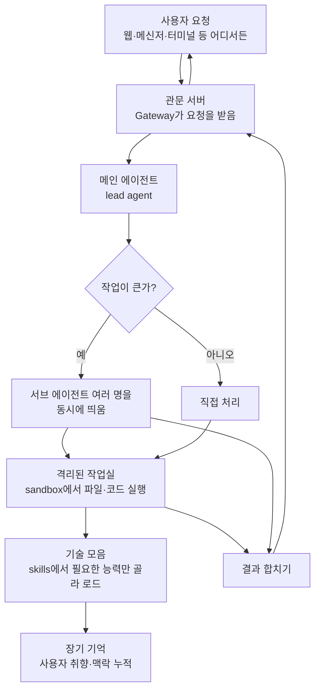

<div class="ai-knowledge-shell">

<aside class="ai-knowledge-sidebar">
  <p class="ai-eyebrow">CATEGORIES</p>
  <nav class="ai-cat-tree"><details class="ai-cat" open><summary><span class="catname">에이전트 오케스트레이션</span><span class="catcount">6</span></summary><ul><li><a href="https://altjs4510.github.io/ai_news_blog/knowledge/20260708/"><span class="kdate">2026-07-08</span><span class="ktitle">Expanding Managed Agents in Gemini API: backgrou…</span></a></li><li><a href="https://altjs4510.github.io/ai_news_blog/knowledge/20260707/"><span class="kdate">2026-07-07</span><span class="ktitle">AI Hero Skills Catalog — 실무 엔지니어를 위한 재사용 가능한 판단 …</span></a></li><li><a href="https://altjs4510.github.io/ai_news_blog/knowledge/20260623/" class="current"><span class="kdate">2026-06-23</span><span class="ktitle">bytedance/deer-flow — 샌드박스·메모리·서브에이전트·메시지 게이트웨이를…</span></a></li><li><a href="https://altjs4510.github.io/ai_news_blog/knowledge/20260602/"><span class="kdate">2026-06-02</span><span class="ktitle">revfactory/harness — 도메인별 에이전트 팀과 스킬을 자동 설계하는 메타…</span></a></li><li><a href="https://altjs4510.github.io/ai_news_blog/knowledge/20260529/"><span class="kdate">2026-05-29</span><span class="ktitle">Introducing dynamic workflows in Claude Code</span></a></li><li><a href="https://altjs4510.github.io/ai_news_blog/knowledge/20260507/"><span class="kdate">2026-05-07</span><span class="ktitle">ruvnet/ruflo — Claude 멀티 에이전트 오케스트레이션 플랫폼</span></a></li></ul></details><details class="ai-cat" open><summary><span class="catname">MCP &amp; 도구 통합</span><span class="catcount">14</span></summary><ul><li><a href="https://altjs4510.github.io/ai_news_blog/knowledge/20260724/"><span class="kdate">2026-07-24</span><span class="ktitle">diegosouzapw/OmniRoute — 단일 엔드포인트로 278+ 프로바이더·50…</span></a></li><li><a href="https://altjs4510.github.io/ai_news_blog/knowledge/20260722/"><span class="kdate">2026-07-22</span><span class="ktitle">tirth8205/code-review-graph — MCP·CLI용 로컬 우선 코드 …</span></a></li><li><a href="https://altjs4510.github.io/ai_news_blog/knowledge/20260721/"><span class="kdate">2026-07-21</span><span class="ktitle">tirth8205/code-review-graph — 로컬 우선 코드 인텔리전스 그래프…</span></a></li><li><a href="https://altjs4510.github.io/ai_news_blog/knowledge/20260719/"><span class="kdate">2026-07-19</span><span class="ktitle">tirth8205/code-review-graph — 로컬 우선 코드 인텔리전스 그래프…</span></a></li><li><a href="https://altjs4510.github.io/ai_news_blog/knowledge/20260718/"><span class="kdate">2026-07-18</span><span class="ktitle">tirth8205/code-review-graph — MCP·CLI용 로컬 코드 인텔리…</span></a></li><li><a href="https://altjs4510.github.io/ai_news_blog/knowledge/20260709/"><span class="kdate">2026-07-09</span><span class="ktitle">mvanhorn/last30days-skill — Reddit·X·YouTube·HN·…</span></a></li><li><a href="https://altjs4510.github.io/ai_news_blog/knowledge/20260618/"><span class="kdate">2026-06-18</span><span class="ktitle">DeusData/codebase-memory-mcp — 158개 언어 코드베이스를 밀리…</span></a></li><li><a href="https://altjs4510.github.io/ai_news_blog/knowledge/20260606/"><span class="kdate">2026-06-06</span><span class="ktitle">chopratejas/headroom — Compress tool outputs, lo…</span></a></li><li><a href="https://altjs4510.github.io/ai_news_blog/knowledge/20260605/"><span class="kdate">2026-06-05</span><span class="ktitle">chopratejas/headroom — Compress tool outputs, lo…</span></a></li><li><a href="https://altjs4510.github.io/ai_news_blog/knowledge/20260604/"><span class="kdate">2026-06-04</span><span class="ktitle">chopratejas/headroom — Compress tool outputs bef…</span></a></li><li><a href="https://altjs4510.github.io/ai_news_blog/knowledge/20260603/"><span class="kdate">2026-06-03</span><span class="ktitle">How Bad MCP design cost your Agent 5× more token…</span></a></li><li><a href="https://altjs4510.github.io/ai_news_blog/knowledge/20260523/"><span class="kdate">2026-05-23</span><span class="ktitle">colbymchenry/codegraph — 사전 인덱싱된 코드 지식 그래프 MCP</span></a></li><li><a href="https://altjs4510.github.io/ai_news_blog/knowledge/20260517/"><span class="kdate">2026-05-17</span><span class="ktitle">I gave my LLM 100,000+ tools — Lazy Discovery &a…</span></a></li><li><a href="https://altjs4510.github.io/ai_news_blog/knowledge/20260509/"><span class="kdate">2026-05-09</span><span class="ktitle">How to connect 100 MCP servers without the conte…</span></a></li></ul></details><details class="ai-cat" open><summary><span class="catname">코딩 에이전트</span><span class="catcount">17</span></summary><ul><li><a href="https://altjs4510.github.io/ai_news_blog/knowledge/20260728/"><span class="kdate">2026-07-28</span><span class="ktitle">alibaba/open-code-review — 결정론적 파이프라인 + LLM 에이전트…</span></a></li><li><a href="https://altjs4510.github.io/ai_news_blog/knowledge/20260725/"><span class="kdate">2026-07-25</span><span class="ktitle">The new rules of context engineering for Claude …</span></a></li><li><a href="https://altjs4510.github.io/ai_news_blog/knowledge/20260715/"><span class="kdate">2026-07-15</span><span class="ktitle">Dicklesworthstone/destructive_command_guard — 에이…</span></a></li><li><a href="https://altjs4510.github.io/ai_news_blog/knowledge/20260714/"><span class="kdate">2026-07-14</span><span class="ktitle">Graphify-Labs/graphify — 코드베이스를 질의 가능한 지식 그래프로 만…</span></a></li><li><a href="https://altjs4510.github.io/ai_news_blog/knowledge/20260705/"><span class="kdate">2026-07-05</span><span class="ktitle">openai/codex-plugin-cc — Claude Code에서 Codex를 위임…</span></a></li><li><a href="https://altjs4510.github.io/ai_news_blog/knowledge/20260626/"><span class="kdate">2026-06-26</span><span class="ktitle">google-labs-code/design.md — 코딩 에이전트에게 디자인 시스템을 …</span></a></li><li><a href="https://altjs4510.github.io/ai_news_blog/knowledge/20260619/"><span class="kdate">2026-06-19</span><span class="ktitle">Claude Code now supports artifacts</span></a></li><li><a href="https://altjs4510.github.io/ai_news_blog/knowledge/20260530/"><span class="kdate">2026-05-30</span><span class="ktitle">Leonxlnx/taste-skill — AI에게 좋은 취향을 부여해 generic s…</span></a></li><li><a href="https://altjs4510.github.io/ai_news_blog/knowledge/20260528/"><span class="kdate">2026-05-28</span><span class="ktitle">Building self-improving tax agents with Codex</span></a></li><li><a href="https://altjs4510.github.io/ai_news_blog/knowledge/20260526/"><span class="kdate">2026-05-26</span><span class="ktitle">colbymchenry/codegraph — Pre-indexed code knowle…</span></a></li><li><a href="https://altjs4510.github.io/ai_news_blog/knowledge/20260524/"><span class="kdate">2026-05-24</span><span class="ktitle">colbymchenry/codegraph — Pre-indexed code knowle…</span></a></li><li><a href="https://altjs4510.github.io/ai_news_blog/knowledge/20260521/"><span class="kdate">2026-05-21</span><span class="ktitle">colbymchenry/codegraph — Pre-indexed code knowle…</span></a></li><li><a href="https://altjs4510.github.io/ai_news_blog/knowledge/20260512/"><span class="kdate">2026-05-12</span><span class="ktitle">agentmemory — Persistent memory for AI coding ag…</span></a></li><li><a href="https://altjs4510.github.io/ai_news_blog/knowledge/20260510/"><span class="kdate">2026-05-10</span><span class="ktitle">addyosmani/agent-skills — Production-grade engin…</span></a></li><li><a href="https://altjs4510.github.io/ai_news_blog/knowledge/20260508/"><span class="kdate">2026-05-08</span><span class="ktitle">addyosmani/agent-skills — Production-grade engin…</span></a></li><li><a href="https://altjs4510.github.io/ai_news_blog/knowledge/20260506/"><span class="kdate">2026-05-06</span><span class="ktitle">mksglu/context-mode — AI 코딩 에이전트용 컨텍스트 윈도우 최적화</span></a></li><li><a href="https://altjs4510.github.io/ai_news_blog/knowledge/20260505/"><span class="kdate">2026-05-05</span><span class="ktitle">mattpocock/skills — Skills for Real Engineers (.…</span></a></li></ul></details><details class="ai-cat" open><summary><span class="catname">모델 &amp; 연구</span><span class="catcount">5</span></summary><ul><li><a href="https://altjs4510.github.io/ai_news_blog/knowledge/20260716-proprag/"><span class="kdate">2026-07-16</span><span class="ktitle">PropRAG — 프로포지션 경로 위 beam search로 멀티홉 검색 안내</span></a></li><li><a href="https://altjs4510.github.io/ai_news_blog/knowledge/20260620/"><span class="kdate">2026-06-20</span><span class="ktitle">zai-org/GLM-5 — From Vibe Coding to Agentic Engi…</span></a></li><li><a href="https://altjs4510.github.io/ai_news_blog/knowledge/20260617/"><span class="kdate">2026-06-17</span><span class="ktitle">Predicting model behavior before release by simu…</span></a></li><li><a href="https://altjs4510.github.io/ai_news_blog/knowledge/20260516/"><span class="kdate">2026-05-16</span><span class="ktitle">STALE — 에이전트가 자기 기억의 유효성을 인지할 수 있는가</span></a></li><li><a href="https://altjs4510.github.io/ai_news_blog/knowledge/20260513/"><span class="kdate">2026-05-13</span><span class="ktitle">Thinking Machines' Native Interaction Models — T…</span></a></li></ul></details><details class="ai-cat" open><summary><span class="catname">인프라 &amp; 컴퓨트</span><span class="catcount">4</span></summary><ul><li><a href="https://altjs4510.github.io/ai_news_blog/knowledge/20260723/"><span class="kdate">2026-07-23</span><span class="ktitle">diegosouzapw/OmniRoute — 268+ 프로바이더를 단일 엔드포인트로 묶…</span></a></li><li><a href="https://altjs4510.github.io/ai_news_blog/knowledge/20260611/"><span class="kdate">2026-06-11</span><span class="ktitle">The evolution of agentic surfaces: building with…</span></a></li><li><a href="https://altjs4510.github.io/ai_news_blog/knowledge/20260522/"><span class="kdate">2026-05-22</span><span class="ktitle">Giving Agents Computers — Ivan Burazin, Daytona</span></a></li><li><a href="https://altjs4510.github.io/ai_news_blog/knowledge/20260520/"><span class="kdate">2026-05-20</span><span class="ktitle">New in Claude Managed Agents: self-hosted sandbo…</span></a></li></ul></details><details class="ai-cat" open><summary><span class="catname">보안 &amp; 거버넌스</span><span class="catcount">13</span></summary><ul><li><a href="https://altjs4510.github.io/ai_news_blog/knowledge/20260716/"><span class="kdate">2026-07-16</span><span class="ktitle">Dicklesworthstone/destructive_command_guard — 에이…</span></a></li><li><a href="https://altjs4510.github.io/ai_news_blog/knowledge/20260710/"><span class="kdate">2026-07-10</span><span class="ktitle">70개 MCP 서버 strace 런타임 감사 — 부팅 시 아웃바운드 호출 서버 적발</span></a></li><li><a href="https://altjs4510.github.io/ai_news_blog/knowledge/20260704/"><span class="kdate">2026-07-04</span><span class="ktitle">Cloudflare is about to block AI agents by defaul…</span></a></li><li><a href="https://altjs4510.github.io/ai_news_blog/knowledge/20260703/"><span class="kdate">2026-07-03</span><span class="ktitle">Giving admins more visibility and control over C…</span></a></li><li><a href="https://altjs4510.github.io/ai_news_blog/knowledge/20260630/"><span class="kdate">2026-06-30</span><span class="ktitle">Introducing the Claude apps gateway for Amazon B…</span></a></li><li><a href="https://altjs4510.github.io/ai_news_blog/knowledge/20260625/"><span class="kdate">2026-06-25</span><span class="ktitle">Agent identity in Claude Tag: a new access model…</span></a></li><li><a href="https://altjs4510.github.io/ai_news_blog/knowledge/20260624/"><span class="kdate">2026-06-24</span><span class="ktitle">Agent identity in Claude Tag: a new access model…</span></a></li><li><a href="https://altjs4510.github.io/ai_news_blog/knowledge/20260614/"><span class="kdate">2026-06-14</span><span class="ktitle">NVIDIA/SkillSpector — Security scanner for AI ag…</span></a></li><li><a href="https://altjs4510.github.io/ai_news_blog/knowledge/20260613/"><span class="kdate">2026-06-13</span><span class="ktitle">Fable 5's guardrails got bypassed in 48 hours — …</span></a></li><li><a href="https://altjs4510.github.io/ai_news_blog/knowledge/20260612/"><span class="kdate">2026-06-12</span><span class="ktitle">NVIDIA/SkillSpector — AI 에이전트 스킬용 보안 스캐너</span></a></li><li><a href="https://altjs4510.github.io/ai_news_blog/knowledge/20260607/"><span class="kdate">2026-06-07</span><span class="ktitle">OpenAI Help: Lockdown Mode</span></a></li><li><a href="https://altjs4510.github.io/ai_news_blog/knowledge/20260531/"><span class="kdate">2026-05-31</span><span class="ktitle">How we contain Claude across products</span></a></li><li><a href="https://altjs4510.github.io/ai_news_blog/knowledge/20260527/"><span class="kdate">2026-05-27</span><span class="ktitle">Microsoft Copilot Cowork Exfiltrates Files</span></a></li></ul></details><details class="ai-cat" open><summary><span class="catname">응용 사례</span><span class="catcount">6</span></summary><ul><li><a href="https://altjs4510.github.io/ai_news_blog/knowledge/20260726/"><span class="kdate">2026-07-26</span><span class="ktitle">citrolabs/ego-lite — 로그인된 브라우저 상태를 AI 에이전트와 공유하는…</span></a></li><li><a href="https://altjs4510.github.io/ai_news_blog/knowledge/20260717/"><span class="kdate">2026-07-17</span><span class="ktitle">After a year building agent memory, 'save everyt…</span></a></li><li><a href="https://altjs4510.github.io/ai_news_blog/knowledge/20260712/"><span class="kdate">2026-07-12</span><span class="ktitle">Do Automated Evals Work?</span></a></li><li><a href="https://altjs4510.github.io/ai_news_blog/knowledge/20260621/"><span class="kdate">2026-06-21</span><span class="ktitle">calesthio/OpenMontage — 12 파이프라인·52 도구·500+ 스킬을 …</span></a></li><li><a href="https://altjs4510.github.io/ai_news_blog/knowledge/20260609/"><span class="kdate">2026-06-09</span><span class="ktitle">Building intelligent apps for Apple platforms wi…</span></a></li><li><a href="https://altjs4510.github.io/ai_news_blog/knowledge/20260514/"><span class="kdate">2026-05-14</span><span class="ktitle">Introducing Claude for Small Business</span></a></li></ul></details><details class="ai-cat" open><summary><span class="catname">산업 동향</span><span class="catcount">8</span></summary><ul><li><a href="https://altjs4510.github.io/ai_news_blog/knowledge/20260711/"><span class="kdate">2026-07-11</span><span class="ktitle">OpenAI says GPT 5.6 is the 'preferred model' for…</span></a></li><li><a href="https://altjs4510.github.io/ai_news_blog/knowledge/20260702/"><span class="kdate">2026-07-02</span><span class="ktitle">How Cursor deploys AI inside the enterprise (For…</span></a></li><li><a href="https://altjs4510.github.io/ai_news_blog/knowledge/20260701/"><span class="kdate">2026-07-01</span><span class="ktitle">Google OKF (Open Knowledge Format) — 벤더 중립 에이전트 …</span></a></li><li><a href="https://altjs4510.github.io/ai_news_blog/knowledge/20260616/"><span class="kdate">2026-06-16</span><span class="ktitle">Why AI hasn't replaced software engineers, and w…</span></a></li><li><a href="https://altjs4510.github.io/ai_news_blog/knowledge/20260610/"><span class="kdate">2026-06-10</span><span class="ktitle">Fable 5 just made cost-aware model routing manda…</span></a></li><li><a href="https://altjs4510.github.io/ai_news_blog/knowledge/20260519/"><span class="kdate">2026-05-19</span><span class="ktitle">Anthropic acquires Stainless</span></a></li><li><a href="https://altjs4510.github.io/ai_news_blog/knowledge/20260515/"><span class="kdate">2026-05-15</span><span class="ktitle">Clawdmeter — Claude Code 사용량을 데스크톱 대시보드로</span></a></li><li><a href="https://altjs4510.github.io/ai_news_blog/knowledge/20260504/"><span class="kdate">2026-05-04</span><span class="ktitle">Agents for Everything Else: Codex for Knowledge …</span></a></li></ul></details></nav>
</aside>

<article class="ai-knowledge-article">

<header class="ai-post-hero">
  <p class="ai-eyebrow"><a class="ai-back" href="../">KNOWLEDGE</a> · 2026-06-23 · 오늘의 학습</p>
  <h2 class="ai-post-title">bytedance/deer-flow — 샌드박스·메모리·서브에이전트·메시지 게이트웨이를 묶은 long-horizon SuperAgent 하네스</h2>
</header>

> 원문: [bytedance/deer-flow — 샌드박스·메모리·서브에이전트·메시지 게이트웨이를 묶은 long-horizon SuperAgent 하네스](https://github.com/bytedance/deer-flow)

## 📌 학습 정리

### 1. 한 줄로 말하면

DeerFlow는 인공지능 비서(에이전트)가 "분 단위에서 시간 단위가 걸리는 긴 작업"을 끝까지 해낼 수 있도록, 작업 공간·기억·도구·보조 일꾼을 한 묶음으로 미리 깔아둔 오픈소스 작업대(harness)예요.

### 2. 왜 이게 만들어졌어요?

원래 DeerFlow는 "깊이 있는 리서치"를 자동으로 해주는 도구로 출발했어요. 그런데 사용자들이 이걸 가지고 리서치만 한 게 아니라, 데이터 처리 파이프라인을 짜거나 슬라이드를 만들거나 대시보드를 띄우는 등 예상 못한 일들을 해내기 시작했죠. 그래서 만든 쪽에서 깨달은 게 있었어요 — 이건 단순한 리서치 프레임워크가 아니라, 에이전트가 "실제로 일을 끝까지 해낼 수 있게" 받쳐주는 인프라구나, 라는 점이요. 그래서 2.0에서는 완전히 새로 짜서, 파일 시스템·기억·도구·격리된 실행 환경(sandbox)·보조 에이전트 호출 능력을 처음부터 다 갖춘 형태로 다시 내놓았어요. 1.0과는 코드를 공유하지 않는 사실상 별개 프로젝트입니다.

### 3. 비유로 풀면

이건 마치 **신입 직원에게 책상·노트북·메모장·인턴 호출 권한·회사 위키 접근권을 한꺼번에 세팅해주는 것**과 비슷해요. 보통 인공지능 비서한테 "이거 해줘"라고 시키면 입만 있고 손은 없는 상태인데, DeerFlow는 손에 해당하는 것들 — 파일을 쓰고 저장할 공간, 코드를 안전하게 돌릴 격리된 작업실, 이전 대화에서 알아낸 사용자 취향을 적어둘 장기 기억장 — 을 미리 깔아두는 거죠.

또 하나의 비유는 **프로젝트 매니저와 인턴들**이에요. 큰 작업이 들어오면 한 명(메인 에이전트)이 다 처리하는 게 아니라, 작업을 쪼개서 인턴 여러 명(서브 에이전트)을 동시에 부리고, 결과를 모아서 최종 보고서로 합쳐줍니다.

그래서 결국 DeerFlow는 "도구를 한 번 부르는 챗봇"이 아니라 "작업 공간과 일꾼들을 거느린 실행자"가 되도록 받쳐주는 뼈대예요.

### 4. 어떻게 작동하는지 (그림으로)



흐름을 풀어보면, 사용자의 요청은 일단 관문(Gateway)을 거쳐 메인 에이전트에게 전달되고, 메인 에이전트는 작업 크기에 따라 직접 처리하거나 보조 일꾼들을 동시에 부립니다. 실제 파일 읽기·쓰기·셸 명령은 모두 격리된 작업실 안에서 일어나고, 필요한 능력은 그때그때 "기술(skill)" 단위로 불러옵니다. 사용자에 대해 알게 된 정보는 장기 기억에 쌓여서 다음 대화에서도 이어집니다.

### 5. 처음 보는 용어 풀이

- **작업대 / 하네스 (harness)** — 에이전트가 실제로 일할 수 있도록 받쳐주는 받침대 같은 거예요. 모델 하나만으로는 부족하니까, 파일 공간·도구·기억·실행 환경을 한 세트로 묶어놓은 걸 말합니다.
- **격리된 작업실 (sandbox)** — 에이전트가 코드를 돌리거나 명령어를 실행할 때, 본체 컴퓨터를 건드리지 못하게 분리해둔 공간이에요. DeerFlow는 Docker 컨테이너 안에서 돌리는 방식, 로컬에서 그대로 돌리는 방식, 쿠버네티스(Kubernetes) 환경에서 돌리는 방식을 모두 지원합니다.
- **보조 에이전트 (sub-agent)** — 메인 에이전트가 일을 쪼개서 띄우는 인턴 같은 존재예요. 각자 자기만의 맥락·도구·종료 조건을 갖고 동시에 일하다가, 결과를 메인에게 보고하고 사라집니다. 큰 리서치 한 건이 인턴 수십 명으로 부풀었다가 다시 한 편의 보고서로 합쳐지는 식이에요.
- **기술 모음 (skills)** — "이런 종류의 일은 이렇게 한다"를 적어놓은 작업 매뉴얼 파일들이에요. 마크다운으로 워크플로와 모범 사례를 적어두면, 에이전트가 필요한 순간에만 골라 읽어들입니다. 처음부터 다 읽지 않아서 맥락 창(context window)이 가벼워져요.
- **맥락 창 (context window)** — 모델이 한 번에 머리에 담을 수 있는 글의 양을 가리켜요. 너무 많이 담으면 비싸지고 느려지니까, DeerFlow는 끝난 작업은 요약하고 중간 결과는 파일로 빼두는 식으로 머릿속을 가볍게 유지합니다.
- **장기 기억 (long-term memory)** — 대화가 끝나도 사라지지 않는 메모장이에요. 사용자가 어떤 글투를 좋아하는지, 어떤 기술 스택을 쓰는지 같은 정보가 쌓여서, 쓸수록 더 맞춤형이 됩니다. 로컬에 저장되어 본인이 통제할 수 있어요.
- **모델 통신 규약 (MCP, Model Context Protocol) 서버** — 외부 도구를 에이전트에 붙일 때 쓰는 공용 규격이에요. 이 규격을 따르는 서버를 연결하면 DeerFlow의 능력을 손쉽게 확장할 수 있습니다.
- **관문 서버 (Gateway)** — 외부에서 들어오는 모든 요청(웹 UI·메신저 봇·외부 클라이언트)을 받아 내부 에이전트 실행기로 연결해주는 단일 입구예요. 실행 상태를 자기 메모리에 들고 있어서, 운영 시에는 작업자(worker) 프로세스를 하나만 두는 게 기본입니다.
- **메신저 연결 (IM channels)** — 텔레그램·슬랙·디스코드·페이슈/라크·딩톡·위챗·위컴 같은 채팅 앱에서 DeerFlow에 바로 일을 시킬 수 있게 해주는 연결고리예요. 외부에 공개된 IP가 없어도 작동하도록 설계되어 있습니다.

### 6. 한 발 더 들어가고 싶다면

- [공식 웹사이트](https://github.com/bytedance/deer-flow) — 실제 데모 영상과 사용 사례를 볼 수 있어요. 글로만 봐서는 안 잡히던 "에이전트가 일하는 모습"이 그려질 거예요.
- [1.x 브랜치](https://github.com/bytedance/deer-flow/tree/1.x) — 2.0과는 별개로 유지되는 원래의 깊이 리서치(Deep Research) 프레임워크예요. 리서치 자동화 쪽만 깔끔하게 보고 싶다면 이쪽을 보면 됩니다.
- [클로드 코드 연동 기술 (claude-to-deerflow)](https://github.com/bytedance/deer-flow) — 터미널에서 쓰는 Claude Code 안에서 DeerFlow에 직접 일을 시키는 방법이에요. 에이전트끼리 협업시키는 구도가 어떻게 생겼는지 감을 잡을 수 있어요.
- LangSmith·Langfuse 추적 연동 — 에이전트가 안에서 무슨 호출을 하고 있는지 들여다보고 싶을 때 어떻게 붙이는지가 원문 "LangSmith Tracing"·"Langfuse Tracing" 절에 나와 있어요. 장기 작업에서 디버깅이 왜 중요한지 체감하기 좋은 부분입니다.

---

## 📖 원문 전체 번역 (정독용)

> 의역 최소화한 전체 번역입니다. 큰 흐름은 위 정리에서 잡고, 정확한 워딩이 필요할 땐 이 섹션에서 정독하세요.

# 🦌 DeerFlow - 2.0

[English] | [中文] | [日本語] | [Français] | [Русский]

2026년 2월 28일, DeerFlow는 버전 2 출시 이후 GitHub 트렌딩 🏆 1위를 차지했습니다. 이를 가능하게 해주신 놀라운 커뮤니티 여러분께 진심으로 감사드립니다! 💪🔥

DeerFlow (**D**eep **E**xploration and **E**fficient **R**esearch **Flow**)는 오픈소스 **슈퍼 에이전트 하네스(super agent harness)**로, **서브 에이전트(sub-agents)**, **메모리(memory)**, **샌드박스(sandboxes)**를 조율하여 거의 모든 일을 수행할 수 있으며, **확장 가능한 스킬(extensible skills)**로 구동됩니다.

> **참고**
>
> DeerFlow 2.0은 처음부터 완전히 재작성된 버전입니다.
> v1과 코드를 공유하지 않습니다. 원래의 Deep Research 프레임워크를 찾고 계신다면, `1.x` 브랜치에서 유지 관리되고 있으며 — 그쪽 기여도 여전히 환영합니다. 활발한 개발은 2.0으로 이동했습니다.

**공식 웹사이트**
공식 웹사이트에서 자세한 내용과 실제 데모를 확인하세요.

**ByteDance Volcengine의 코딩 플랜**
DeerFlow 실행에는 Doubao-Seed-2.0-Code, DeepSeek v3.2, Kimi 2.5 사용을 강력히 권장합니다.

**InfoQuest**
DeerFlow는 BytePlus가 독자적으로 개발한 지능형 검색 및 크롤링 툴셋인 **InfoQuest(무료 온라인 체험 지원)**를 새롭게 통합했습니다.

---

## 목차

- 원라인 에이전트 설정
- 빠른 시작
  - 설정
  - 애플리케이션 실행
  - 배포 규모 산정
  - 옵션 1: Docker (권장)
  - 옵션 2: 로컬 개발
- 고급
  - 샌드박스 모드
  - MCP 서버
  - IM 채널
  - LangSmith 트레이싱
  - Langfuse 트레이싱
  - 두 공급자 모두 사용
- Deep Research에서 슈퍼 에이전트 하네스로
- 핵심 기능
  - 스킬 & 도구
  - Claude Code 통합
  - 서브 에이전트
  - 샌드박스 & 파일 시스템
  - 컨텍스트 엔지니어링
  - 장기 메모리
- 권장 모델
- 임베디드 Python 클라이언트
- 문서
- ⚠️ 보안 공지
- 기여
- 라이선스
- 감사의 말
- 주요 기여자
- Star 히스토리

---

## 원라인 에이전트 설정

Claude Code, Codex, Cursor, Windsurf, 또는 다른 코딩 에이전트를 사용하고 있다면, 한 문장으로 설정 지침을 전달할 수 있습니다:

```
Help me clone DeerFlow if needed, then bootstrap it for local development by following https://raw.githubusercontent.com/bytedance/deer-flow/main/Install.md
```

이 프롬프트는 코딩 에이전트용입니다. 필요한 경우 저장소를 클론하고, 가능하면 Docker를 선택하며, 정확한 다음 명령어와 사용자가 아직 제공해야 할 누락된 설정 정보를 알려주도록 에이전트에게 지시합니다.

---

## 빠른 시작

### 설정

**DeerFlow 저장소 클론**

```bash
git clone https://github.com/bytedance/deer-flow.git
cd deer-flow
```

**설정 마법사 실행**

프로젝트 루트 디렉토리(`deer-flow/`)에서 실행:

```bash
make setup
```

이 명령은 LLM 공급자 선택, 선택적 웹 검색, 샌드박스 모드·bash 접근·파일 쓰기 도구 등 실행/보안 설정을 안내하는 대화형 마법사를 실행합니다. 최소한의 `config.yaml`을 생성하고 키를 `.env`에 기록합니다. 약 2분 소요됩니다.

마법사에서 선택적 웹 검색 공급자를 설정하거나, 나중으로 건너뛸 수 있습니다.

`make doctor`를 언제든지 실행하여 설정을 확인하고 실행 가능한 수정 힌트를 얻을 수 있습니다.

**고급/수동 설정**: `config.yaml`을 직접 편집하려면 `make setup` 대신 `make config`를 실행하여 전체 템플릿을 복사하세요. CLI 기반 공급자(Codex CLI, Claude Code OAuth), OpenRouter, Responses API 등을 포함한 전체 참조는 `config.example.yaml`을 참조하세요.

**수동 모델 설정 예시**

```yaml
models:
  - name: gpt-4o
    display_name: GPT-4o
    use: langchain_openai:ChatOpenAI
    model: gpt-4o
    api_key: $OPENAI_API_KEY

  - name: openrouter-gemini-2.5-flash
    display_name: Gemini 2.5 Flash (OpenRouter)
    use: langchain_openai:ChatOpenAI
    model: google/gemini-2.5-flash-preview
    api_key: $OPENROUTER_API_KEY
    base_url: https://openrouter.ai/api/v1

  - name: gpt-5-responses
    display_name: GPT-5 (Responses API)
    use: langchain_openai:ChatOpenAI
    model: gpt-5
    api_key: $OPENAI_API_KEY
    use_responses_api: true
    output_version: responses/v1

  - name: qwen3-32b-vllm
    display_name: Qwen3 32B (vLLM)
    use: deerflow.models.vllm_provider:VllmChatModel
    model: Qwen/Qwen3-32B
    api_key: $VLLM_API_KEY
    base_url: http://localhost:8000/v1
    supports_thinking: true
    when_thinking_enabled:
      extra_body:
        chat_template_kwargs:
          enable_thinking: true
```

OpenRouter 및 유사한 OpenAI 호환 게이트웨이는 `langchain_openai:ChatOpenAI`와 `base_url`을 함께 사용하여 설정해야 합니다. 공급자별 환경 변수 이름을 선호하는 경우, `api_key`를 해당 변수에 명시적으로 지정하세요(예: `api_key: $OPENROUTER_API_KEY`).

OpenAI 모델을 `/v1/responses`를 통해 라우팅하려면, 계속 `langchain_openai:ChatOpenAI`를 사용하고 `use_responses_api: true`와 `output_version: responses/v1`을 설정하세요.

vLLM 0.19.0에는 `deerflow.models.vllm_provider:VllmChatModel`을 사용하세요. Qwen 스타일의 추론 모델의 경우, DeerFlow는 `extra_body.chat_template_kwargs.enable_thinking`으로 추론을 토글하며, 다중 턴 도구 호출 대화에서 vLLM의 비표준 `reasoning` 필드를 보존합니다. 레거시 `thinking` 설정은 하위 호환성을 위해 자동으로 정규화됩니다. 추론 모델은 서버를 `--reasoning-parser ...`로 시작해야 할 수도 있습니다. 로컬 vLLM 배포가 비어 있지 않은 API 키를 허용하는 경우, `VLLM_API_KEY`를 임의의 플레이스홀더 값으로 설정할 수 있습니다.

**CLI 기반 공급자 예시:**

```yaml
models:
  - name: gpt-5.4
    display_name: GPT-5.4 (Codex CLI)
    use: deerflow.models.openai_codex_provider:CodexChatModel
    model: gpt-5.4
    supports_thinking: true
    supports_reasoning_effort: true

  - name: claude-sonnet-4.6
    display_name: Claude Sonnet 4.6 (Claude Code OAuth)
    use: deerflow.models.claude_provider:ClaudeChatModel
    model: claude-sonnet-4-6
    max_tokens: 4096
    supports_thinking: true
```

- Codex CLI는 `~/.codex/auth.json`을 읽습니다.
- Claude Code는 `CLAUDE_CODE_OAUTH_TOKEN`, `ANTHROPIC_AUTH_TOKEN`, `CLAUDE_CODE_CREDENTIALS_PATH`, 또는 `~/.claude/.credentials.json`을 허용합니다.
- ACP 에이전트 항목은 모델 공급자와 별개입니다 — `acp_agents.codex`를 설정할 경우, `npx -y @zed-industries/codex-acp`와 같은 Codex ACP 어댑터를 지정하세요.

macOS에서는 필요한 경우 Claude Code 인증을 명시적으로 내보내세요:

```bash
eval "$(python3 scripts/export_claude_code_oauth.py --print-export)"
```

API 키는 `.env`에 수동으로 설정하거나(권장) 셸에서 export할 수 있습니다:

```
OPENAI_API_KEY=your-openai-api-key
TAVILY_API_KEY=your-tavily-api-key
```

---

### 애플리케이션 실행

#### 배포 규모 산정

DeerFlow를 실행하는 방법을 선택할 때 아래 표를 실용적인 시작점으로 사용하세요:

| 배포 대상 | 시작 기준 | 권장 사양 | 참고 |
|---|---|---|---|
| 로컬 평가 / `make dev` | 4 vCPU, 8 GB RAM, 20 GB 여유 SSD | 8 vCPU, 16 GB RAM | 호스팅된 모델 API를 사용하는 개발자 한 명 또는 가벼운 세션 한 개에 적합. **2 vCPU / 4 GB**는 보통 부족합니다. |
| Docker 개발 / `make docker-start` | 4 vCPU, 8 GB RAM, 25 GB 여유 SSD | 8 vCPU, 16 GB RAM | 이미지 빌드, 바인드 마운트, 샌드박스 컨테이너는 순수 로컬 개발보다 여유 공간이 더 필요합니다. |
| 장기 운영 서버 / `make up` | 8 vCPU, 16 GB RAM, 40 GB 여유 SSD | 16 vCPU, 32 GB RAM | 공유 사용, 멀티 에이전트 실행, 보고서 생성, 또는 무거운 샌드박스 워크로드에 권장. |

이 수치는 DeerFlow 자체에 해당합니다. 로컬 LLM도 함께 호스팅하는 경우, 해당 서비스는 별도로 규모를 산정하세요.

영구 서버를 위한 권장 배포 대상은 Linux + Docker입니다. macOS와 Windows는 개발 또는 평가 환경으로 사용하는 것이 좋습니다.

CPU 또는 메모리 사용률이 지속적으로 높게 유지된다면, 먼저 동시 실행 수를 줄이고, 그 다음 상위 규모 계층으로 이동하세요.

---

#### 옵션 1: Docker (권장)

**개발 모드** (핫 리로드, 소스 마운트):

```bash
make docker-init    # 샌드박스 이미지 풀 (최초 1회 또는 이미지 업데이트 시)
make docker-start   # 서비스 시작 (config.yaml에서 샌드박스 모드 자동 감지)
```

`make docker-start`는 `config.yaml`이 프로비저너 모드(`sandbox.use: deerflow.community.aio_sandbox:AioSandboxProvider` + `provisioner_url`)를 사용할 때만 `provisioner`를 시작합니다.

Docker 빌드는 기본적으로 업스트림 `uv` 레지스트리를 사용합니다. 제한된 네트워크에서 더 빠른 미러가 필요한 경우, `make docker-init` 또는 `make docker-start`를 실행하기 전에 `UV_INDEX_URL=https://pypi.tuna.tsinghua.edu.cn/simple`과 `NPM_REGISTRY=https://registry.npmmirror.com`을 export하세요.

백엔드 프로세스는 다음 설정 접근 시 `config.yaml` 변경 사항을 자동으로 반영하므로, 개발 중에 모델 메타데이터 업데이트를 위해 수동으로 재시작할 필요가 없습니다.

> **팁**
>
> Linux에서 Docker 기반 명령이 `permission denied while trying to connect to the Docker daemon socket at unix:///var/run/docker.sock` 오류로 실패하는 경우, 사용자를 `docker` 그룹에 추가하고 재로그인 후 다시 시도하세요. 전체 수정 방법은 `CONTRIBUTING.md`를 참조하세요.

**프로덕션 모드** (이미지를 로컬에서 빌드하고, 런타임 설정 및 데이터 마운트):

```bash
make up     # 이미지 빌드 및 모든 프로덕션 서비스 시작
make down   # 컨테이너 중지 및 제거
```

접속: `http://localhost:2026`

통합 nginx 엔드포인트는 기본적으로 same-origin이며 브라우저 CORS 헤더를 내보내지 않습니다. 분리된 origin 또는 포트 포워딩된 브라우저 클라이언트를 실행하는 경우, `GATEWAY_CORS_ORIGINS`를 `http://localhost:3000`과 같은 쉼표로 구분된 정확한 origin으로 설정하세요. Gateway는 CORS 허용 목록과 일치하는 CSRF origin 검사를 적용합니다.

> **중요**
>
> Gateway는 실행 상태(RunManager 및 스트림 브릿지)를 프로세스 내에 유지하므로, 프로덕션은 기본적으로 단일 Gateway 워커(`GATEWAY_WORKERS=1`)로 설정됩니다. 아직 제공되지 않는 크로스 워커 공유 스트림 브릿지 없이 워커 수를 늘리면, nginx가 스티키 세션을 사용하지 않고 각 워커가 자체 실행 상태를 유지하기 때문에 실행 취소, SSE 재연결, 요청 중복 제거, IM 채널이 중단됩니다. `GATEWAY_WORKERS`를 늘리는 대신 단일 워커에 더 많은 CPU/RAM을 할당하거나(또는 데이터베이스와 샌드박스를 전용 계층으로 이동) 확장하세요.

자세한 Docker 개발 가이드는 `CONTRIBUTING.md`를 참조하세요.

---

#### 옵션 2: 로컬 개발

서비스를 로컬에서 실행하려면:

**전제 조건**: 먼저 위의 "설정" 단계를 완료하세요(`make setup`).

`make dev`를 사용하려면 프로젝트 루트에 유효한 `config.yaml`이 필요합니다. `DEER_FLOW_PROJECT_ROOT`를 설정하여 해당 루트를 명시적으로 정의하거나, `DEER_FLOW_CONFIG_PATH`를 특정 설정 파일로 지정할 수 있습니다. 런타임 상태는 기본적으로 프로젝트 루트 아래 `.deer-flow`에 저장되며 `DEER_FLOW_HOME`으로 이동할 수 있습니다. 스킬은 기본적으로 프로젝트 루트 아래 `skills/`에 위치하며 `DEER_FLOW_SKILLS_PATH`로 이동할 수 있습니다. 시작 전에 `make doctor`를 실행하여 설정을 확인하세요.

Windows에서는 Git Bash에서 로컬 개발 흐름을 실행하세요. 네이티브 `cmd.exe` 및 PowerShell 셸은 bash 기반 서비스 스크립트를 지원하지 않으며, 일부 스크립트가 `cygpath`와 같은 Git for Windows 유틸리티에 의존하기 때문에 WSL도 보장되지 않습니다.

**전제 조건 확인**:

```bash
make check   # Node.js 22+, pnpm, uv, nginx 확인
```

**의존성 설치**:

```bash
make install   # 백엔드 + 프론트엔드 의존성 + pre-commit 훅 설치
```

**(선택 사항) 샌드박스 이미지 사전 다운로드**:

```bash
# Docker/컨테이너 기반 샌드박스를 사용하는 경우 권장
make setup-sandbox
```

**(선택 사항) 로컬 검토를 위한 샘플 메모리 데이터 로드**:

```bash
python scripts/load_memory_sample.py
```

이 명령은 샘플 픽스처를 기본 로컬 런타임 메모리 파일에 복사하여 검토자가 `Settings > Memory`를 즉시 테스트할 수 있게 합니다. 최단 검토 흐름은 `backend/docs/MEMORY_SETTINGS_REVIEW.md`를 참조하세요.

**서비스 시작**:

```bash
make dev
```

**접속**: `http://localhost:2026`

#### 시작 모드

DeerFlow는 Gateway API 내에서 에이전트 런타임을 실행합니다. 개발 모드는 핫 리로드를 활성화하고, 프로덕션 모드는 사전 빌드된 프론트엔드를 사용합니다.

|  | 로컬 포그라운드 | 로컬 데몬 | Docker Dev | Docker Prod |
|---|---|---|---|---|
| **Dev** | `./scripts/serve.sh --dev` / `make dev` | `./scripts/serve.sh --dev --daemon` / `make dev-daemon` | `./scripts/docker.sh start` / `make docker-start` | — |
| **Prod** | `./scripts/serve.sh --prod` / `make start` | `./scripts/serve.sh --prod --daemon` / `make start-daemon` | — | `./scripts/deploy.sh` / `make up` |

| 액션 | 로컬 | Docker Dev | Docker Prod |
|---|---|---|---|
| **중지** | `./scripts/serve.sh --stop` / `make stop` | `./scripts/docker.sh stop` / `make docker-stop` | `./scripts/deploy.sh down` / `make down` |
| **재시작** | `./scripts/serve.sh --restart [flags]` | `./scripts/docker.sh restart` | — |

Gateway는 `/api/langgraph/*`를 소유하며, 해당 공개 LangGraph 호환 경로를 nginx 뒤의 네이티브 `/api/*` 라우터로 변환합니다.

**Docker 프로덕션 배포**

`deploy.sh`는 빌드와 시작을 별도로 지원합니다:

```bash
# 원스텝 (빌드 + 시작)
deploy.sh

# 투스텝 (한 번 빌드, 나중에 시작)
deploy.sh build   # 모든 이미지 빌드
deploy.sh start   # 사전 빌드된 이미지 시작

# 중지
deploy.sh down
```

---

## 고급

### 샌드박스 모드

DeerFlow는 여러 샌드박스 실행 모드를 지원합니다:

- **로컬 실행** (샌드박스 코드를 호스트 머신에서 직접 실행)
- **Docker 실행** (샌드박스 코드를 격리된 Docker 컨테이너에서 실행)
- **Kubernetes를 사용한 Docker 실행** (프로비저너 서비스를 통해 Kubernetes 파드에서 샌드박스 코드 실행)

Docker 개발의 경우, 서비스 시작은 `config.yaml` 샌드박스 모드를 따릅니다. 로컬/Docker 모드에서는 `provisioner`가 시작되지 않습니다.

선호하는 모드를 설정하려면 샌드박스 설정 가이드를 참조하세요.

---

### MCP 서버

DeerFlow는 기능 확장을 위해 설정 가능한 MCP 서버와 스킬을 지원합니다.

HTTP/SSE MCP 서버의 경우, OAuth 토큰 흐름(`client_credentials`, `refresh_token`)이 지원됩니다.

자세한 지침은 MCP 서버 가이드를 참조하세요.

---

### IM 채널

DeerFlow는 메시징 앱에서 작업을 수신하는 것을 지원합니다. 채널은 설정되면 자동으로 시작되며 — 공개 IP가 필요하지 않습니다.

DeerFlow는 워크스페이스 UI에서 사용자 소유의 IM 채널 연결을 노출할 수도 있습니다. `channel_connections`가 활성화되면, 로그인한 사용자는 사이드바/Settings > Channels에서 Telegram, Slack, Discord, Feishu/Lark, DingTalk, WeChat, 또는 WeCom을 연결할 수 있습니다. 기존의 아웃바운드 `channels.*` 전송을 재사용하므로 공개 IP나 공급자 콜백 URL이 필요하지 않습니다. 수신 IM 메시지는 연결된 DeerFlow 사용자 계정으로 실행됩니다. 설정 및 보안 참고 사항은 IM 채널 연결을 참조하세요.

| 채널 | 전송 방식 | 난이도 |
|---|---|---|
| Telegram | Bot API (롱 폴링) | 쉬움 |
| Slack | 소켓 모드 | 보통 |
| Feishu / Lark | WebSocket | 보통 |
| WeChat | Tencent iLink (롱 폴링) | 보통 |
| WeCom | WebSocket | 보통 |
| DingTalk | 스트림 푸시 (WebSocket) | 보통 |

**`config.yaml` 설정**:

```yaml
channels:
  # LangGraph 호환 Gateway API 기본 URL (기본값: http://localhost:8001/api)
  langgraph_url: http://localhost:8001/api
  # Gateway API URL (기본값: http://localhost:8001)
  gateway_url: http://localhost:8001

  # 선택 사항: 모든 모바일 채널에 대한 글로벌 세션 기본값
  session:
    assistant_id: lead_agent  # 또는 커스텀 에이전트 이름; 커스텀 에이전트는 lead_agent + agent_name을 통해 라우팅됨
    config:
      recursion_limit: 100
    context:
      thinking_enabled: true
      is_plan_mode: false
      subagent_enabled: false

  feishu:
    enabled: true
    app_id: $FEISHU_APP_ID
    app_secret: $FEISHU_APP_SECRET
    # domain: https://open.feishu.cn       # 중국 (기본값)
    # domain: https://open.larksuite.com   # 국제

  wecom:
    enabled: true
    bot_id: $WECOM_BOT_ID
    bot_secret: $WECOM_BOT_SECRET

  slack:
    enabled: true
    bot_token: $SLACK_BOT_TOKEN  # xoxb-...
    app_token: $SLACK_APP_TOKEN  # xapp-... (소켓 모드)
    allowed_users: []  # 비어 있으면 모두 허용

  telegram:
    enabled: true
    bot_token: $TELEGRAM_BOT_TOKEN
    allowed_users: []  # 비어 있으면 모두 허용

  wechat:
    enabled: false
    bot_token: $WECHAT_BOT_TOKEN
    ilink_bot_id: $WECHAT_ILINK_BOT_ID
    qrcode_login_enabled: true  # 선택 사항: bot_token이 없을 때 최초 QR 부트스트랩 허용
    allowed_users: []  # 비어 있으면 모두 허용
    polling_timeout: 35
    state_dir: ./.deer-flow/wechat/state
    max_inbound_image_bytes: 20971520
    max_outbound_image_bytes: 20971520
    max_inbound_file_bytes: 52428800
    max_outbound_file_bytes: 52428800
    # 선택 사항: 채널별/사용자별 세션 설정
    session:
      assistant_id: mobile-agent  # 커스텀 에이전트 이름도 지원
      context:
        thinking_enabled: false
      users:
        "123456789":
          assistant_id: vip-agent
          config:
            recursion_limit: 150
          context:
            thinking_enabled: true
            subagent_enabled: true

  dingtalk:
    enabled: true
    client_id: $DINGTALK_CLIENT_ID      # DingTalk 애플리케이션의 Client ID
    client_secret: $DINGTALK_CLIENT_SECRET  # DingTalk 애플리케이션의 Client Secret
    allowed_users: []  # 비어 있으면 모두 허용
    card_template_id: ""  # 선택 사항: 스트리밍 타이프라이터 효과를 위한 AI 카드 템플릿 ID
```

**참고:**
- `assistant_id: lead_agent`는 기본 LangGraph 어시스턴트를 직접 호출합니다.
- `assistant_id`가 커스텀 에이전트 이름으로 설정된 경우, DeerFlow는 여전히 `lead_agent`를 통해 라우팅하고 해당 값을 `agent_name`으로 주입하여, 커스텀 에이전트의 SOUL/설정이 IM 채널에서 적용됩니다.
- IM 채널 워커는 Gateway의 LangGraph 호환 API를 내부적으로 호출하고, 스레드 및 실행 생성에 필요한 프로세스 로컬 내부 인증과 CSRF 쿠키/헤더 쌍을 자동으로 첨부합니다.

`.env` 파일에 해당 API 키를 설정하세요:

```
# Telegram
TELEGRAM_BOT_TOKEN=123456789:ABCdefGHIjklMNOpqrSTUvwxYZ

# Slack
SLACK_BOT_TOKEN=xoxb-...
SLACK_APP_TOKEN=xapp-...

# Feishu / Lark
FEISHU_APP_ID=cli_xxxx
FEISHU_APP_SECRET=your_app_secret

# WeChat iLink
WECHAT_BOT_TOKEN=your_ilink_bot_token
WECHAT_ILINK_BOT_ID=your_ilink_bot_id

# WeCom
WECOM_BOT_ID=your_bot_id
WECOM_BOT_SECRET=your_bot_secret

# DingTalk
DINGTALK_CLIENT_ID=your_client_id
DINGTALK_CLIENT_SECRET=your_client_secret
```

**Telegram 설정**

`@BotFather`와 채팅하고, `/newbot`을 전송한 후 HTTP API 토큰을 복사하세요.
`.env`에 `TELEGRAM_BOT_TOKEN`을 설정하고 `config.yaml`에서 채널을 활성화하세요.

**Slack 설정**

`api.slack.com/apps` → 새 앱 만들기 → 처음부터에서 Slack 앱을 생성하세요.
`OAuth & Permissions`에서 Bot Token Scopes를 추가하세요: `app_mentions:read`, `chat:write`, `im:history`, `im:read`, `im:write`, `files:write`.
`소켓 모드` 활성화 → `connections:write` 범위로 앱 레벨 토큰(`xapp-…`) 생성.
`Event Subscriptions`에서 봇 이벤트를 구독하세요: `app_mention`, `message.im`.
`.env`에 `SLACK_BOT_TOKEN`과 `SLACK_APP_TOKEN`을 설정하고 `config.yaml`에서 채널을 활성화하세요.

**Feishu / Lark 설정**

Feishu 오픈 플랫폼에서 앱을 생성하고 `봇` 기능을 활성화하세요.
권한 추가: `im:message`, `im:message.p2p_msg:readonly`, `im:resource`.
`이벤트`에서 `im.message.receive_v1`을 구독하고 `롱 커넥션` 모드를 선택하세요.
앱 ID와 앱 시크릿을 복사하세요. `.env`에 `FEISHU_APP_ID`와 `FEISHU_APP_SECRET`을 설정하고 `config.yaml`에서 채널을 활성화하세요.

**WeChat 설정**

`config.yaml`에서 `wechat` 채널을 활성화하세요.
`.env`에 `WECHAT_BOT_TOKEN`을 설정하거나, 최초 QR 부트스트랩을 위해 `qrcode_login_enabled: true`를 설정하세요.
`bot_token`이 없고 QR 부트스트랩이 활성화된 경우, 백엔드 로그에서 iLink가 반환하는 QR 콘텐츠를 확인하고 바인딩 흐름을 완료하세요.
QR 흐름이 성공하면, DeerFlow는 이후 재시작을 위해 획득한 토큰을 `state_dir`에 저장합니다.
Docker Compose 배포의 경우, `get_updates_buf` 커서와 저장된 인증 상태가 재시작 시에도 유지되도록 `state_dir`을 영구 볼륨에 유지하세요.

**WeCom 설정**

WeCom AI Bot 플랫폼에서 봇을 생성하고 `bot_id`와 `bot_secret`을 획득하세요.
`config.yaml`에서 `channels.wecom`을 활성화하고 `bot_id`/`bot_secret`을 입력하세요.
`.env`에 `WECOM_BOT_ID`와 `WECOM_BOT_SECRET`을 설정하세요.
백엔드 의존성에 `wecom-aibot-python-sdk`가 포함되어 있는지 확인하세요. 채널은 WebSocket 롱 커넥션을 사용하며 공개 콜백 URL이 필요하지 않습니다.
현재 통합은 인바운드 텍스트, 이미지, 파일 메시지를 지원합니다. 에이전트가 생성한 최종 이미지/파일도 WeCom 대화로 전송됩니다.

**DingTalk 설정**

DingTalk 개발자 콘솔에서 DingTalk 애플리케이션을 생성하고 `로봇` 기능을 활성화하세요.
로봇 설정 페이지에서 메시지 수신 모드를 `스트림 모드`로 설정하세요.
`Client ID`와 `Client Secret`을 복사하고, `.env`에 `DINGTALK_CLIENT_ID`와 `DINGTALK_CLIENT_SECRET`을 설정한 후 `config.yaml`에서 채널을 활성화하세요.
(선택 사항) 스트리밍 AI 카드 답변(타이프라이터 효과)을 활성화하려면, DingTalk 카드 플랫폼에서 AI 카드 템플릿을 생성한 후 `config.yaml`의 `card_template_id`에 템플릿 ID를 설정하세요. `Card.Streaming.Write`와 `Card.Instance.Write` 권한도 신청해야 합니다.

DeerFlow가 Docker Compose에서 실행되는 경우, IM 채널은 `gateway` 컨테이너 내에서 실행됩니다. 이 경우 `channels.langgraph_url` 또는 `channels.gateway_url`을 `localhost`로 지정하지 마세요. 대신 `http://gateway:8001/api`, `http://gateway:8001`과 같이 컨테이너 서비스 이름을 사용하거나, `DEER_FLOW_CHANNELS_LANGGRAPH_URL`과 `DEER_FLOW_CHANNELS_GATEWAY_URL`을 설정하세요.

**명령어**

채널이 연결되면 채팅에서 DeerFlow와 직접 상호작용할 수 있습니다:

| 명령어 | 설명 |
|---|---|
| `/new` | 새 대화 시작 |
| `/status` | 현재 스레드 정보 표시 |
| `/models` | 사용 가능한 모델 목록 |
| `/memory` | 메모리 보기 |
| `/help` | 도움말 표시 |

명령어 접두사 없는 메시지는 일반 채팅으로 처리됩니다 — DeerFlow가 스레드를 생성하고 대화식으로 응답합니다.

---

### LangSmith 트레이싱

DeerFlow는 관찰 가능성을 위한 LangSmith 통합이 내장되어 있습니다. 활성화하면 모든 LLM 호출, 에이전트 실행, 도구 실행이 추적되어 LangSmith 대시보드에서 확인할 수 있습니다.

`.env` 파일에 다음을 추가하세요:

```
LANGSMITH_TRACING=true
LANGSMITH_ENDPOINT=https://api.smith.langchain.com
LANGSMITH_API_KEY=lsv2_pt_xxxxxxxxxxxxxxxx
LANGSMITH_PROJECT=xxx
```

---

### Langfuse 트레이싱

DeerFlow는 LangChain 호환 실행을 위한 Langfuse 관찰 가능성도 지원합니다.

`.env` 파일에 다음을 추가하세요:

```
LANGFUSE_TRACING=true
LANGFUSE_PUBLIC_KEY=pk-lf-xxxxxxxxxxxxxxxx
LANGFUSE_SECRET_KEY=sk-lf-xxxxxxxxxxxxxxxx
LANGFUSE_BASE_URL=https://cloud.langfuse.com
```

자체 호스팅 Langfuse 인스턴스를 사용하는 경우, `LANGFUSE_BASE_URL`을 배포 URL로 설정하세요.

**트레이스 상관 관계 필드.**
모든 에이전트 실행은 Langfuse의 예약된 트레이스 속성으로 주석이 달려, Sessions와 Users 페이지가 자동으로 활성화됩니다:

- `session_id` = LangGraph `thread_id` — 동일 대화의 모든 트레이스를 그룹화
- `user_id` = `get_effective_user_id()`의 유효 사용자 (인증 없는 모드에서는 `default`로 폴백)
- `trace_name` = 어시스턴트 id (기본값: `lead-agent`)
- `tags` = `[env:<DEER_FLOW_ENV>, model:<model_name>]` (설정되지 않은 경우 생략)

이것들은 게이트웨이 경로(`runtime/runs/worker.py::run_agent`)와 임베디드 경로(`client.py::DeerFlowClient.stream`) 모두에 대해 그래프 호출 루트의 `RunnableConfig.metadata`에 주입되므로, LangChain 호환 콜백이 이를 읽을 수 있습니다. 배포 환경별로 트레이스에 태그를 달려면 `DEER_FLOW_ENV`(또는 `ENVIRONMENT`)를 설정하세요.

---

### 두 공급자 모두 사용

LangSmith와 Langfuse가 모두 활성화된 경우, DeerFlow는 두 트레이싱 콜백을 모두 첨부하고 동일한 모델 활동을 두 시스템에 보고합니다.

공급자가 명시적으로 활성화되었지만 필요한 자격 증명이 없거나, 콜백 초기화에 실패하면, DeerFlow는 모델 생성 중 트레이싱이 초기화될 때 즉시 실패하며 오류 메시지에 실패를 유발한 공급자가 명시됩니다.

Docker 배포의 경우, 트레이싱은 기본적으로 비활성화되어 있습니다. 활성화하려면 `.env`에 `LANGSMITH_TRACING=true`와 `LANGSMITH_API_KEY`를 설정하세요.

---

## Deep Research에서 슈퍼 에이전트 하네스로

DeerFlow는 Deep Research 프레임워크로 시작했으며, 커뮤니티가 그것을 발전시켰습니다. 출시 이후, 개발자들은 리서치를 훨씬 넘어서 확장해왔습니다: 데이터 파이프라인 구축, 슬라이드 덱 생성, 대시보드 구동, 콘텐츠 워크플로우 자동화. 우리가 전혀 예상하지 못했던 것들입니다.

그것이 우리에게 중요한 것을 말해주었습니다: DeerFlow는 단순한 리서치 도구가 아니었습니다. 그것은 **하네스**였습니다 — 에이전트에게 실제 작업을 수행하기 위한 인프라를 제공하는 런타임이었습니다.

그래서 우리는 처음부터 다시 만들었습니다.

DeerFlow 2.0은 더 이상 연결해야 하는 프레임워크가 아닙니다. 배터리가 포함된 완전히 확장 가능한 슈퍼 에이전트 하네스입니다. LangGraph와 LangChain 위에 구축되어, 에이전트가 즉시 필요로 하는 모든 것을 제공합니다: 파일 시스템, 메모리, 스킬, 샌드박스 인식 실행, 복잡한 다단계 작업을 위한 계획 및 서브 에이전

</article>

</div>

<!-- ai-related-links -->
<aside class="ai-related-links">
  <p class="ai-eyebrow">관련 학습</p>
  <ul><li><a href="https://altjs4510.github.io/ai_news_blog/knowledge/20260621/"><span class="kdate">2026-06-21</span><span class="ktitle">calesthio/OpenMontage — 12 파이프라인·52 도구·500+ 스킬을 …</span></a></li><li><a href="https://altjs4510.github.io/ai_news_blog/knowledge/20260507/"><span class="kdate">2026-05-07</span><span class="ktitle">ruvnet/ruflo — Claude 멀티 에이전트 오케스트레이션 플랫폼</span></a></li><li><a href="https://altjs4510.github.io/ai_news_blog/knowledge/20260602/"><span class="kdate">2026-06-02</span><span class="ktitle">revfactory/harness — 도메인별 에이전트 팀과 스킬을 자동 설계하는 메타…</span></a></li></ul>
</aside>
<!-- /ai-related-links -->
