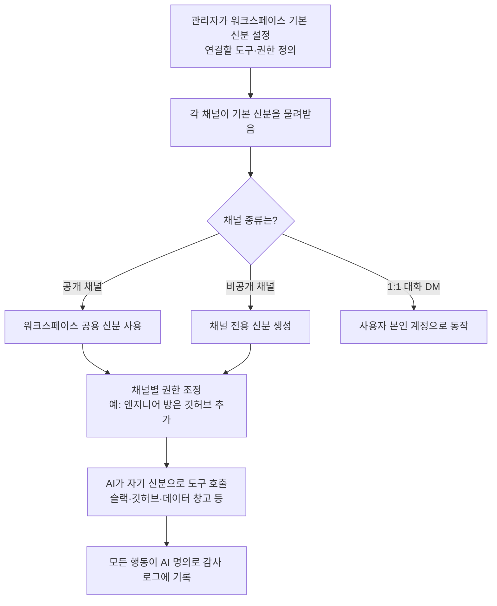

<aside class="ai-knowledge-sidebar">
  
CATEGORIES

  <nav class="ai-cat-tree">

에이전트 오케스트레이션9
<ul><li><a href="https://altjs4510.github.io/ai_news_blog/knowledge/20260624/" class="current">2026-06-24Agent identity in Claude Tag: a new access model…</a></li><li><a href="https://altjs4510.github.io/ai_news_blog/knowledge/20260623/">2026-06-23bytedance/deer-flow — 샌드박스·메모리·서브에이전트·메시지 게이트웨이를…</a></li><li><a href="https://altjs4510.github.io/ai_news_blog/knowledge/20260621/">2026-06-21calesthio/OpenMontage — 12 파이프라인·52 도구·500+ 스킬을 …</a></li><li><a href="https://altjs4510.github.io/ai_news_blog/knowledge/20260611/">2026-06-11The evolution of agentic surfaces: building with…</a></li><li><a href="https://altjs4510.github.io/ai_news_blog/knowledge/20260602/">2026-06-02revfactory/harness — 도메인별 에이전트 팀과 스킬을 자동 설계하는 메타…</a></li><li><a href="https://altjs4510.github.io/ai_news_blog/knowledge/20260529/">2026-05-29Introducing dynamic workflows in Claude Code</a></li><li><a href="https://altjs4510.github.io/ai_news_blog/knowledge/20260520/">2026-05-20New in Claude Managed Agents: self-hosted sandbo…</a></li><li><a href="https://altjs4510.github.io/ai_news_blog/knowledge/20260507/">2026-05-07ruvnet/ruflo — Claude 멀티 에이전트 오케스트레이션 플랫폼</a></li><li><a href="https://altjs4510.github.io/ai_news_blog/knowledge/20260504/">2026-05-04Agents for Everything Else: Codex for Knowledge …</a></li></ul>

MCP &amp; 도구 통합8
<ul><li><a href="https://altjs4510.github.io/ai_news_blog/knowledge/20260618/">2026-06-18DeusData/codebase-memory-mcp — 158개 언어 코드베이스를 밀리…</a></li><li><a href="https://altjs4510.github.io/ai_news_blog/knowledge/20260604/">2026-06-04chopratejas/headroom — Compress tool outputs bef…</a></li><li><a href="https://altjs4510.github.io/ai_news_blog/knowledge/20260603/">2026-06-03How Bad MCP design cost your Agent 5× more token…</a></li><li><a href="https://altjs4510.github.io/ai_news_blog/knowledge/20260526/">2026-05-26colbymchenry/codegraph — Pre-indexed code knowle…</a></li><li><a href="https://altjs4510.github.io/ai_news_blog/knowledge/20260523/">2026-05-23colbymchenry/codegraph — 사전 인덱싱된 코드 지식 그래프 MCP</a></li><li><a href="https://altjs4510.github.io/ai_news_blog/knowledge/20260519/">2026-05-19Anthropic acquires Stainless</a></li><li><a href="https://altjs4510.github.io/ai_news_blog/knowledge/20260517/">2026-05-17I gave my LLM 100,000+ tools — Lazy Discovery &a…</a></li><li><a href="https://altjs4510.github.io/ai_news_blog/knowledge/20260509/">2026-05-09How to connect 100 MCP servers without the conte…</a></li></ul>

코딩 에이전트10
<ul><li><a href="https://altjs4510.github.io/ai_news_blog/knowledge/20260619/">2026-06-19Claude Code now supports artifacts</a></li><li><a href="https://altjs4510.github.io/ai_news_blog/knowledge/20260530/">2026-05-30Leonxlnx/taste-skill — AI에게 좋은 취향을 부여해 generic s…</a></li><li><a href="https://altjs4510.github.io/ai_news_blog/knowledge/20260528/">2026-05-28Building self-improving tax agents with Codex</a></li><li><a href="https://altjs4510.github.io/ai_news_blog/knowledge/20260524/">2026-05-24colbymchenry/codegraph — Pre-indexed code knowle…</a></li><li><a href="https://altjs4510.github.io/ai_news_blog/knowledge/20260521/">2026-05-21colbymchenry/codegraph — Pre-indexed code knowle…</a></li><li><a href="https://altjs4510.github.io/ai_news_blog/knowledge/20260512/">2026-05-12agentmemory — Persistent memory for AI coding ag…</a></li><li><a href="https://altjs4510.github.io/ai_news_blog/knowledge/20260510/">2026-05-10addyosmani/agent-skills — Production-grade engin…</a></li><li><a href="https://altjs4510.github.io/ai_news_blog/knowledge/20260508/">2026-05-08addyosmani/agent-skills — Production-grade engin…</a></li><li><a href="https://altjs4510.github.io/ai_news_blog/knowledge/20260506/">2026-05-06mksglu/context-mode — AI 코딩 에이전트용 컨텍스트 윈도우 최적화</a></li><li><a href="https://altjs4510.github.io/ai_news_blog/knowledge/20260505/">2026-05-05mattpocock/skills — Skills for Real Engineers (.…</a></li></ul>

모델 &amp; 연구4
<ul><li><a href="https://altjs4510.github.io/ai_news_blog/knowledge/20260620/">2026-06-20zai-org/GLM-5 — From Vibe Coding to Agentic Engi…</a></li><li><a href="https://altjs4510.github.io/ai_news_blog/knowledge/20260617/">2026-06-17Predicting model behavior before release by simu…</a></li><li><a href="https://altjs4510.github.io/ai_news_blog/knowledge/20260516/">2026-05-16STALE — 에이전트가 자기 기억의 유효성을 인지할 수 있는가</a></li><li><a href="https://altjs4510.github.io/ai_news_blog/knowledge/20260513/">2026-05-13Thinking Machines' Native Interaction Models — T…</a></li></ul>

인프라 &amp; 컴퓨트4
<ul><li><a href="https://altjs4510.github.io/ai_news_blog/knowledge/20260610/">2026-06-10Fable 5 just made cost-aware model routing manda…</a></li><li><a href="https://altjs4510.github.io/ai_news_blog/knowledge/20260606/">2026-06-06chopratejas/headroom — Compress tool outputs, lo…</a></li><li><a href="https://altjs4510.github.io/ai_news_blog/knowledge/20260605/">2026-06-05chopratejas/headroom — Compress tool outputs, lo…</a></li><li><a href="https://altjs4510.github.io/ai_news_blog/knowledge/20260522/">2026-05-22Giving Agents Computers — Ivan Burazin, Daytona</a></li></ul>

보안 &amp; 거버넌스6
<ul><li><a href="https://altjs4510.github.io/ai_news_blog/knowledge/20260614/">2026-06-14NVIDIA/SkillSpector — Security scanner for AI ag…</a></li><li><a href="https://altjs4510.github.io/ai_news_blog/knowledge/20260613/">2026-06-13Fable 5's guardrails got bypassed in 48 hours — …</a></li><li><a href="https://altjs4510.github.io/ai_news_blog/knowledge/20260612/">2026-06-12NVIDIA/SkillSpector — AI 에이전트 스킬용 보안 스캐너</a></li><li><a href="https://altjs4510.github.io/ai_news_blog/knowledge/20260607/">2026-06-07OpenAI Help: Lockdown Mode</a></li><li><a href="https://altjs4510.github.io/ai_news_blog/knowledge/20260531/">2026-05-31How we contain Claude across products</a></li><li><a href="https://altjs4510.github.io/ai_news_blog/knowledge/20260527/">2026-05-27Microsoft Copilot Cowork Exfiltrates Files</a></li></ul>

응용 사례3
<ul><li><a href="https://altjs4510.github.io/ai_news_blog/knowledge/20260609/">2026-06-09Building intelligent apps for Apple platforms wi…</a></li><li><a href="https://altjs4510.github.io/ai_news_blog/knowledge/20260515/">2026-05-15Clawdmeter — Claude Code 사용량을 데스크톱 대시보드로</a></li><li><a href="https://altjs4510.github.io/ai_news_blog/knowledge/20260514/">2026-05-14Introducing Claude for Small Business</a></li></ul>

산업 동향1
<ul><li><a href="https://altjs4510.github.io/ai_news_blog/knowledge/20260616/">2026-06-16Why AI hasn't replaced software engineers, and w…</a></li></ul>
</nav>
</aside>

<article class="ai-knowledge-article">

<header class="ai-post-hero">
  
<a class="ai-back" href="../">KNOWLEDGE</a> · 2026-06-24 · 오늘의 학습

  <h2 class="ai-post-title">Agent identity in Claude Tag: a new access model for autonomous, team-wide AI</h2>
</header>

> 원문: [Agent identity in Claude Tag: a new access model for autonomous, team-wide AI](https://claude.com/blog/agent-identity-access-model)

## 📌 학습 정리

### 1. 한 줄로 말하면

여러 사람이 함께 쓰는 채팅방에 AI를 초대할 때, AI에게 "누구를 대신하는 게 아니라 너 자신으로 일해"라고 별도의 신분증을 쥐어주는 방식이에요.

### 2. 왜 이게 만들어졌어요?

지금까지 AI 비서는 보통 "내 계정으로 로그인해서 내 권한으로 일하는" 방식이었어요. 혼자서 챗봇이랑 대화할 때는 이게 잘 통하는데, 문제는 여러 사람이 같이 쓰는 슬랙 채널 같은 곳에 AI를 부르면 곤란해진다는 거예요. 엔지니어 셋과 기획자 한 명이 같이 이야기하는 방에서 AI가 누구의 권한으로 움직여야 할지 정답이 없거든요. 게다가 요즘 AI는 사람이 자리를 비운 뒤에도 스스로 작업을 이어가는 경우가 많아져서, 누군가의 계정을 빌려쓰게 두는 게 보안상으로도 점점 위험해지고 있어요. 그래서 "AI에게 사람과 별개의 자기 계정을 주자"는 발상이 나왔습니다.

### 3. 비유로 풀면

이건 마치 회사에 새로 들어온 인턴에게 사장님 사원증을 빌려주는 대신, 인턴 본인 명의의 사원증을 따로 발급해주는 것과 비슷해요. 그 사원증에는 "이 방에서는 이 문서까지 열람 가능"이라고 출입 권한이 적혀 있고, 인턴이 한 일은 모두 인턴 이름으로 로그가 남죠.

또 다른 비유로는, 회의실마다 다른 출입카드가 작동하는 사무실을 떠올려도 좋아요. 법무팀 회의실에 들어간 AI는 거기 있는 자료만 보고, 엔지니어링 회의실로 옮겨가면 거기서 허락된 도구만 쓸 수 있어요.

그래서 결국, AI가 누구 권한을 빌리는 게 아니라 **방(채널)별로 정해진 자기 권한**으로 움직이게 되고, 한 방에서 본 정보가 다른 방으로 새지 않게 됩니다.

### 4. 어떻게 작동하는지 (그림으로)

관리자가 워크스페이스 전체에 적용될 AI의 기본 신분을 한 번 정의하면, 각 채널이 그걸 물려받아요. 비공개 채널은 별도의 신분을 갖고, 1:1 대화에서는 예외적으로 사용자 본인 계정으로 작동합니다. AI가 어떤 도구를 호출하든 자기 명의로 움직이기 때문에, 어떤 시스템에 들어가도 "AI가 한 일"로 로그가 남아요.

### 5. 처음 보는 용어 풀이

- **에이전트 정체성 (agent identity)** — AI에게 사람과 별개로 부여하는 자기 계정·자기 신분증. 이걸로 AI가 누구를 대신하는 게 아니라 "자기 자신으로" 도구를 쓰고 행동해요.
- **클로드 태그 (Claude Tag)** — 슬랙 같은 팀 채널 안에 AI 클로드를 불러서 여러 명이 함께 쓰는 Anthropic의 기능. 이 글의 배경이 되는 제품이에요.
- **접근 제어 목록 (Access Control List, ACL)** — "누가 무엇을 할 수 있는지"를 사람 단위로 적어둔 권한 목록. 기존 방식인데, 이 글은 이걸 채널 단위로 바꾸자고 제안해요.
- **연결자 (connectors)** — AI가 깃허브·구글 드라이브·데이터 창고 같은 외부 서비스와 연결할 때 쓰는 통로와 API 키 묶음. 같은 서비스라도 채널마다 권한 수준이 다를 수 있어요.
- **스킬과 플러그인 (skills and plugins)** — AI가 특정 작업을 더 잘하도록 필요할 때 불러오는 지시문·스크립트·자료 묶음. 일종의 "전문 분야 매뉴얼" 같은 거예요.
- **역할 기반 접근 제어 (Role-Based Access Control, RBAC)** — "이 역할을 가진 사람만 이 기능을 쓸 수 있다"고 역할 단위로 권한을 정하는 방식. 누가 AI를 호출할 수 있는지까지 통제할 때 써요.
- **즉시 발급 자격 (just-in-time credential grants)** — 미리 권한을 넓혀두는 대신, 민감한 행동을 할 때 그 순간만 사용자가 승인해주는 방식. 앞으로 추가될 예정이라고 해요.
- **감사 로그 (audit trail)** — AI가 한 모든 행동, 외부 호출, 메모리 기록을 시간순으로 남긴 흔적. 나중에 누가 뭘 했는지 거슬러 올라가서 점검할 수 있어요.

### 6. 한 발 더 들어가고 싶다면

- [Claude Tag 제품 소개](https://www.claude.com/tag) — 이 글에서 다룬 기능이 실제로 어떤 제품 형태로 제공되는지 알 수 있어요.
- [Claude Tag 발표 글](http://anthropic.com/news/introducing-claude-tag) — 이 접근 제어 모델이 왜 필요해졌는지, 제품 맥락을 함께 볼 수 있어요.
- [AI 에이전트의 자율성이 빠르게 늘고 있다는 연구 정리](https://www.anthropic.com/institute/recursive-self-improvement) — AI가 혼자 처리하는 작업의 길이가 약 4개월마다 두 배가 된다는 배경을 확인할 수 있어요.

---

## 📖 원문 전체 번역 (정독용)

> 의역 최소화한 전체 번역입니다. 큰 흐름은 위 정리에서 잡고, 정확한 워딩이 필요할 땐 이 섹션에서 정독하세요.

# Claude Tag의 에이전트 정체성: 자율적이고 팀 전체를 위한 새로운 접근 모델

AI 에이전트가 인간-에이전트 팀에서 최선의 결과를 내려면, 팀의 인간 구성원들이 가진 것과 동일한 도구, 문서, 컨텍스트에 대한 접근권이 필요하다.

한 사람이 하나의 어시스턴트와 대화하는 "싱글 플레이어" AI 경험에서는 이것이 간단하다. 본인의 계정을 연결하고 에이전트가 본인을 대신해 행동하도록 하면 된다. 그러나 [Claude Tag](http://anthropic.com/news/introducing-claude-tag)와 같은 "멀티플레이어" AI 경험에서는 Claude가 동시에 여러 사람이 함께 있는 공유 채널 안에 위치하며, 특정 개인이 아닌 _워크스페이스_ 전체에 속한 도구와 컨텍스트를 활용한다.

멀티플레이어 경험이 제대로 작동하려면 Claude에게 해당 도구들에 대한 자체 계정이 필요하며, 이 계정은 관리자가 설정하고 워크스페이스에 연결된다. 우리는 이 접근 모델을 **_에이전트 정체성(agent identity)_** 이라고 부른다.

이 글에서는 에이전트 정체성이 어떻게 작동하는지, 어떻게 권한을 사용자 단위에서 채널 단위로 이동시키는지, 그리고 자신의 워크스페이스에서 이를 어떻게 적절히 범위 설정할 수 있는지 설명한다.

---

## **"사용자로서 행동하기" 모델이 실패하는 이유**

AI를 개인 어시스턴트로 사용할 때는 Google Drive, GitHub, 캘린더 같은 플랫폼을 연결하고 모델이 _본인의_ 접근 권한을 사용해 읽고 쓰도록 할 수 있다.

이 모델은 Claude Tag에서 두 가지 이유로 작동하지 않는다:

- **에이전트 자율성의 증가.** AI 에이전트가 스스로 신뢰할 수 있는 수준으로 완수할 수 있는 작업의 길이는 [약 4개월마다 두 배씩 늘어나고 있다](https://www.anthropic.com/institute/recursive-self-improvement). 에이전트는 이제 스스로 나중을 위한 작업을 예약하고, 요청한 사람이 오래전에 로그오프한 후에도 이벤트에 반응한다. 사용자가 특정 상황에서 에이전트를 작동시키는 루틴을 설정하더라도, 에이전트는 대부분 자율적으로 작업한다.

- **멀티플레이어 팀.** Claude Tag는 팀이 이미 함께 작업하는 공유 공간—예컨대 엔지니어 세 명과 PM 한 명이 함께 디버깅하는 채널—에 Claude를 배치한다. 그런데 한 명 이상이 방향을 결정할 때, 누구의 권한이 적용되어야 하는가? 항상 옳은 단 한 명의 선택은 없다. 에이전트 정체성 모델은 관리자에게 관여된 인간 구성원과 무관하게 Slack에서 에이전트가 할 수 있는 일을 정의하는 능력을 부여하며, Slack에서 수행된 작업에 대한 별도의 추적을 가능하게 한다.

### Claude는 그 자체로서 행동한다

Claude Tag가 활성화된 채널에서 Claude는 특정 단일 사용자를 대신해 행동하지 않는다. Claude는 자신이 접촉하는 각 시스템에 자체 계정을 보유한다. Slack에서는 Claude 앱으로 게시하고, GitHub에서는 Claude GitHub 앱으로 풀 리퀘스트를 열며, 데이터 웨어하우스는 관리자가 프로비저닝한 서비스 계정으로 쿼리한다.

그리고 개인 사용자 자격증명이 개입하지 않기 때문에, 공유 채널은 결코 누군가의 개인 문서로 향하는 뒷문이 될 수 없다.

### 권한 상속

에이전트 정체성 모델에서 관리자는 워크스페이스 수준에서 하나의 정체성—Claude가 어디서나 보유하는 기본 연결 및 기술의 집합—을 정의하며, 모든 채널은 기본적으로 이를 상속받는다. 그런 다음 적절한 경우, 채널 수준에서 이를 재정의할 수 있다. 예를 들어 엔지니어링 채널에는 GitHub와 데이터 웨어하우스 접근권을 부여하거나, CRM 연결을 특정 비공개 채널에만 한정하는 식이다.

자격증명 외에도 관리자는 다음을 정의한다:

- **저장소 접근:** Claude가 읽고 쓸 수 있는 저장소.
- **커넥터(Connectors):** Claude가 업무에 사용하는 도구와 API 키. 조직 전체에서 서로 다른 API 키가 서로 다른 권한 수준으로 동일한 서비스에 연결될 수 있다(예: 일반 채널에서 Claude에게 읽기 전용 웨어하우스 접근권을 부여하고, 데이터 팀의 비공개 채널에서는 쓰기 접근권을 부여하는 식).
- **스킬 및 플러그인:** Claude가 전문 작업에서 성능을 향상시키기 위해 동적으로 로드하는 지침, 스크립트, 리소스 폴더.
- **상시 지침:** 각 채널에 대한 커스텀 지침 및 컨텍스트.

이 모델이 별도의 Claude 정체성을 기반으로 작동하기 때문에, 해당 정체성을 취소하면 그 정체성이 사용된 모든 곳에서 Claude의 접근이 종료된다. 이는 수십 개의 사용자 계정 전반에 걸쳐 개별 에이전트 행동을 감사하는 것보다 훨씬 적은 노력으로 관리할 수 있다.

---

## 에이전트 정체성 모델의 작동 방식

에이전트 정체성은 "이 사용자는 무엇을 할 수 있는가?"라는 질문을 "이 에이전트는 이 구획(compartment)에서 무엇을 할 수 있는가?"로 대체한다. 이는 사용자별 접근 제어 목록(ACL)과는 다른 방식이다. 즉, 저장소에 직접 접근권이 없는 채널 구성원도, 채널 프로필이 Claude에게 해당 권한을 부여한 경우라면, Claude에게 해당 저장소를 읽어달라고 요청할 수 있다.

이것은 이례적이지만, 우리는 자율적인 멀티플레이어 에이전트에 적합한 접근 모델을 향한 필요한 단계라고 생각한다. 아래에서 해당 경계를 설정하는 방법에 대한 사고 방식을 간략히 설명한다.

### 정체성 경계의 작동 방식

Claude Tag는 각 비공개 채널에 대해 별도의 정체성을 생성하며, 워크스페이스 내 공개 채널은 워크스페이스 수준의 정체성을 공유한다. 법무 채널에서의 Claude 정체성은 해당 채널에 부여되지 않은 코드에 접근할 수 없으며, 엔지니어링 채널에서의 정체성은 해당 채널에 부여되지 않은 법무 문서를 읽을 수 없다. 메모리와 접근은 이 경계를 준수한다. Claude가 비공개 채널에서 습득한 내용은 더 넓은 워크스페이스에는 나타나지 않는다.

정체성은 채널에 속하므로, 기본적으로 채널 내 누구든 Claude를 태그할 수 있으며, 관리자는 각 채널의 프로필 범위를 최소 권한 구성원에 맞출 수 있다. Enterprise 플랜에서는 역할 기반 접근 제어(RBAC, role-based access control)를 통해 관리자가 더 나아가 어떤 구성원이 Claude를 호출할 수 있는지 결정할 수 있으므로, 채널이 에이전트가 접근할 수 있는 것과 요청할 수 있는 사람 모두를 관리하게 된다.

### 도구 및 컨텍스트에 대한 광범위한 기본 접근

.jpg)

팀이 Claude Tag에서 Claude의 도구 접근을 범위 설정하는 방식: 광범위하고 낮은 위험도의 통합은 에이전트 정체성 하에 공유 채널에서 실행되고, 개인적이거나 팀별 도구는 DM에서 사용자로서 실행된다.

Anthropic 내부에서 Claude Tag를 운영하면서, 우리는 그 가치가 도구 및 컨텍스트 접근과 함께 복리로 증가함을 발견했다. 연결된 각 시스템이 다른 모든 시스템을 더 유용하게 만드는데, Claude가 그것들 전반에 걸쳐 컨텍스트를 결합할 수 있기 때문이다. Slack의 스레드, Drive의 문서, 트래커의 티켓, 웨어하우스의 쿼리를 하나의 답변으로 엮어내는데, 이는 단일 도구만으로는 제공할 수 없는 것이다.

Claude에서 가장 많은 것을 얻는 팀은 처음부터 관대한 접근권을 부여하고, 조직의 관리자 선호도에 따라 접근을 줄여나가는 팀이다. 에이전트 정체성은 Claude가 유용한 시스템 간 작업을 수행할 수 있을 만큼 충분히 넓은 범위를 관리자에게 제공하면서도, 접근이 부여되지 않은 곳으로는 절대 이동하지 않을 만큼 견고한 경계를 유지한다. 우리의 조언은 몇 개 채널에서 기본 프로필로 시작하고, 감사 추적(audit trail)을 확인한 다음, 작업이 정당화되는 곳에서 한 번에 하나씩 의도적으로 접근을 확장하는 것이다.

더 세밀한 통제가 필요한 조직을 위해, 관리자는 특정 채널에서 Claude Tag를 비활성화할 수 있다. 또한 관리자는 역할 기반 접근 제어(RBAC)를 적용해 Claude Tag에 대한 접근을 특정 사용자로 제한할 수도 있다.

### 다이렉트 메시지

Claude Tag를 사용할 때, 다이렉트 메시지(DM)는 공유 채널과 다르게 작동한다. DM은 사용자의 개인 claude.ai 계정으로 실행된다—해당 사용자의 커넥터, 자격증명, 그리고 결과에 표시되는 이름으로. 이로 인해 DM은 이메일 초안이나 본인만 라이선스를 가진 소프트웨어처럼 채널에 존재해서는 안 되는 작업이나 도구를 Claude와 함께 처리하기에 적합한 공간이 된다.

### 보안 및 감사

관리자가 채널 프로필에 연결을 추가하면, 자격증명은 독립적으로 저장되고 해당 채널의 정체성에 매핑된 후, 요청 시점에 네트워크 경계에서 주입된다. 관리자가 허용하지 않은 호스트로의 아웃바운드 트래픽은 완전히 차단된다. 감사 측면에서는 에이전트 자격증명으로 수행된 모든 루틴, 메모리 쓰기, 네트워크 호출이 기록되며, Claude가 자체 서비스 계정 하에 행동하기 때문에 해당 작업들은 연결된 각 시스템의 자체 로그에도 남는다.

---

## 앞으로의 계획

에이전트 정체성은 Claude Tag 접근 모델의 기반이다. 앞으로 우리는 Claude Tag의 보안 기능을 강화할 계획이다. 여기에는 적시(just-in-time) 자격증명 부여—사용자가 에이전트의 범위를 영구적으로 확장하지 않고도 그 순간에 단일 민감한 작업을 승인할 수 있도록—와 더 복잡한 보안 등급 구조를 가진 조직을 위한 정체성 인식 오버레이(identity-aware overlay)가 포함된다. 이를 통해 에이전트 범위 위에 사용자 수준의 검사가 추가되어, 채널 프로필과 요청 사용자의 자체 권한 모두가 허용하는 경우에만 Claude가 행동하도록 할 것이다.

Claude Tag 같은 제품에서 싱글 플레이어에서 멀티플레이어 AI로의 전환은 장기적으로 실행되는 팀 기반 작업을 가능하게 한다. 에이전트 정체성은 Claude의 도구 접근이 유용할 만큼 충분히 넓으면서도, 엔터프라이즈 규모에서 안전할 만큼 충분히 범위가 설정되도록 보장한다.

[**Claude Tag에 대해 더 알아보기**](https://www.claude.com/tag)

_이 글은 Claude Code 팀의 기술 스태프 Noah Zweben이 작성했습니다._

</article>

