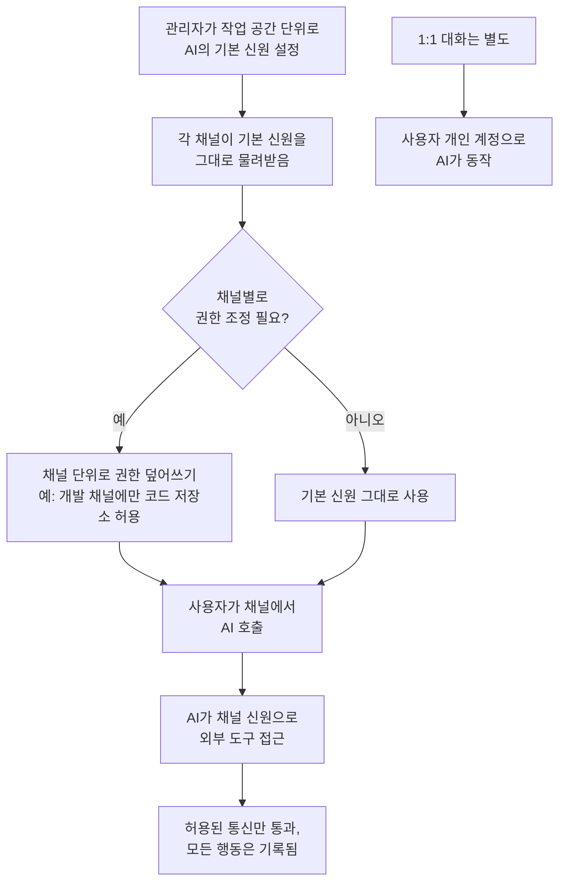

<aside class="ai-knowledge-sidebar">
  
CATEGORIES

  <nav class="ai-cat-tree">

에이전트 오케스트레이션5
<ul><li><a href="https://altjs4510.github.io/ai_news_blog/knowledge/20260623/">2026-06-23bytedance/deer-flow — 샌드박스·메모리·서브에이전트·메시지 게이트웨이를…</a></li><li><a href="https://altjs4510.github.io/ai_news_blog/knowledge/20260611/">2026-06-11The evolution of agentic surfaces: building with…</a></li><li><a href="https://altjs4510.github.io/ai_news_blog/knowledge/20260602/">2026-06-02revfactory/harness — 도메인별 에이전트 팀과 스킬을 자동 설계하는 메타…</a></li><li><a href="https://altjs4510.github.io/ai_news_blog/knowledge/20260529/">2026-05-29Introducing dynamic workflows in Claude Code</a></li><li><a href="https://altjs4510.github.io/ai_news_blog/knowledge/20260507/">2026-05-07ruvnet/ruflo — Claude 멀티 에이전트 오케스트레이션 플랫폼</a></li></ul>

MCP &amp; 도구 통합19
<ul><li><a href="https://altjs4510.github.io/ai_news_blog/knowledge/20260802/">2026-08-02Stateless MCP has recaptured my interest (and in…</a></li><li><a href="https://altjs4510.github.io/ai_news_blog/knowledge/20260801/">2026-08-01different-ai/openwork — Claude Cowork의 오픈소스 대체 에…</a></li><li><a href="https://altjs4510.github.io/ai_news_blog/knowledge/20260731/">2026-07-31different-ai/openwork — Claude Cowork의 오픈소스 대안(o…</a></li><li><a href="https://altjs4510.github.io/ai_news_blog/knowledge/20260729/">2026-07-29Bringing MCP 2026-07-28 to Claude</a></li><li><a href="https://altjs4510.github.io/ai_news_blog/knowledge/20260724/">2026-07-24diegosouzapw/OmniRoute — 단일 엔드포인트로 278+ 프로바이더·50…</a></li><li><a href="https://altjs4510.github.io/ai_news_blog/knowledge/20260722/">2026-07-22tirth8205/code-review-graph — MCP·CLI용 로컬 우선 코드 …</a></li><li><a href="https://altjs4510.github.io/ai_news_blog/knowledge/20260721/">2026-07-21tirth8205/code-review-graph — 로컬 우선 코드 인텔리전스 그래프…</a></li><li><a href="https://altjs4510.github.io/ai_news_blog/knowledge/20260718/">2026-07-18tirth8205/code-review-graph — MCP·CLI용 로컬 코드 인텔리…</a></li><li><a href="https://altjs4510.github.io/ai_news_blog/knowledge/20260709/">2026-07-09mvanhorn/last30days-skill — Reddit·X·YouTube·HN·…</a></li><li><a href="https://altjs4510.github.io/ai_news_blog/knowledge/20260708/">2026-07-08Expanding Managed Agents in Gemini API: backgrou…</a></li><li><a href="https://altjs4510.github.io/ai_news_blog/knowledge/20260618/">2026-06-18DeusData/codebase-memory-mcp — 158개 언어 코드베이스를 밀리…</a></li><li><a href="https://altjs4510.github.io/ai_news_blog/knowledge/20260606/">2026-06-06chopratejas/headroom — Compress tool outputs, lo…</a></li><li><a href="https://altjs4510.github.io/ai_news_blog/knowledge/20260605/">2026-06-05chopratejas/headroom — Compress tool outputs, lo…</a></li><li><a href="https://altjs4510.github.io/ai_news_blog/knowledge/20260604/">2026-06-04chopratejas/headroom — Compress tool outputs bef…</a></li><li><a href="https://altjs4510.github.io/ai_news_blog/knowledge/20260603/">2026-06-03How Bad MCP design cost your Agent 5× more token…</a></li><li><a href="https://altjs4510.github.io/ai_news_blog/knowledge/20260523/">2026-05-23colbymchenry/codegraph — 사전 인덱싱된 코드 지식 그래프 MCP</a></li><li><a href="https://altjs4510.github.io/ai_news_blog/knowledge/20260519/">2026-05-19Anthropic acquires Stainless</a></li><li><a href="https://altjs4510.github.io/ai_news_blog/knowledge/20260517/">2026-05-17I gave my LLM 100,000+ tools — Lazy Discovery &a…</a></li><li><a href="https://altjs4510.github.io/ai_news_blog/knowledge/20260509/">2026-05-09How to connect 100 MCP servers without the conte…</a></li></ul>

코딩 에이전트24
<ul><li><a href="https://altjs4510.github.io/ai_news_blog/knowledge/20260811/">2026-08-11PrimeIntellect-ai/prime-agent — 장기 자율 실행을 전제로 설계…</a></li><li><a href="https://altjs4510.github.io/ai_news_blog/knowledge/20260810/">2026-08-10Auto mode is now the default in Claude Code for …</a></li><li><a href="https://altjs4510.github.io/ai_news_blog/knowledge/20260809/">2026-08-09PrimeIntellect-ai/prime-agent — 코딩 워크플로우·장기 자율 작…</a></li><li><a href="https://altjs4510.github.io/ai_news_blog/knowledge/20260808/">2026-08-08PrimeIntellect-ai/prime-agent — 코딩 워크플로우와 장시간 자율…</a></li><li><a href="https://altjs4510.github.io/ai_news_blog/knowledge/20260804/">2026-08-04esengine/DeepSeek-Reasonix — prefix-cache 안정성을 축…</a></li><li><a href="https://altjs4510.github.io/ai_news_blog/knowledge/20260728/">2026-07-28alibaba/open-code-review — 결정론적 파이프라인 + LLM 에이전트…</a></li><li><a href="https://altjs4510.github.io/ai_news_blog/knowledge/20260725/">2026-07-25The new rules of context engineering for Claude …</a></li><li><a href="https://altjs4510.github.io/ai_news_blog/knowledge/20260719/">2026-07-19tirth8205/code-review-graph — 로컬 우선 코드 인텔리전스 그래프…</a></li><li><a href="https://altjs4510.github.io/ai_news_blog/knowledge/20260715/">2026-07-15Dicklesworthstone/destructive_command_guard — 에이…</a></li><li><a href="https://altjs4510.github.io/ai_news_blog/knowledge/20260714/">2026-07-14Graphify-Labs/graphify — 코드베이스를 질의 가능한 지식 그래프로 만…</a></li><li><a href="https://altjs4510.github.io/ai_news_blog/knowledge/20260707/">2026-07-07AI Hero Skills Catalog — 실무 엔지니어를 위한 재사용 가능한 판단 …</a></li><li><a href="https://altjs4510.github.io/ai_news_blog/knowledge/20260705/">2026-07-05openai/codex-plugin-cc — Claude Code에서 Codex를 위임…</a></li><li><a href="https://altjs4510.github.io/ai_news_blog/knowledge/20260626/">2026-06-26google-labs-code/design.md — 코딩 에이전트에게 디자인 시스템을 …</a></li><li><a href="https://altjs4510.github.io/ai_news_blog/knowledge/20260619/">2026-06-19Claude Code now supports artifacts</a></li><li><a href="https://altjs4510.github.io/ai_news_blog/knowledge/20260530/">2026-05-30Leonxlnx/taste-skill — AI에게 좋은 취향을 부여해 generic s…</a></li><li><a href="https://altjs4510.github.io/ai_news_blog/knowledge/20260528/">2026-05-28Building self-improving tax agents with Codex</a></li><li><a href="https://altjs4510.github.io/ai_news_blog/knowledge/20260526/">2026-05-26colbymchenry/codegraph — Pre-indexed code knowle…</a></li><li><a href="https://altjs4510.github.io/ai_news_blog/knowledge/20260524/">2026-05-24colbymchenry/codegraph — Pre-indexed code knowle…</a></li><li><a href="https://altjs4510.github.io/ai_news_blog/knowledge/20260521/">2026-05-21colbymchenry/codegraph — Pre-indexed code knowle…</a></li><li><a href="https://altjs4510.github.io/ai_news_blog/knowledge/20260512/">2026-05-12agentmemory — Persistent memory for AI coding ag…</a></li><li><a href="https://altjs4510.github.io/ai_news_blog/knowledge/20260510/">2026-05-10addyosmani/agent-skills — Production-grade engin…</a></li><li><a href="https://altjs4510.github.io/ai_news_blog/knowledge/20260508/">2026-05-08addyosmani/agent-skills — Production-grade engin…</a></li><li><a href="https://altjs4510.github.io/ai_news_blog/knowledge/20260506/">2026-05-06mksglu/context-mode — AI 코딩 에이전트용 컨텍스트 윈도우 최적화</a></li><li><a href="https://altjs4510.github.io/ai_news_blog/knowledge/20260505/">2026-05-05mattpocock/skills — Skills for Real Engineers (.…</a></li></ul>

모델 &amp; 연구5
<ul><li><a href="https://altjs4510.github.io/ai_news_blog/knowledge/20260716-proprag/">2026-07-16PropRAG — 프로포지션 경로 위 beam search로 멀티홉 검색 안내</a></li><li><a href="https://altjs4510.github.io/ai_news_blog/knowledge/20260620/">2026-06-20zai-org/GLM-5 — From Vibe Coding to Agentic Engi…</a></li><li><a href="https://altjs4510.github.io/ai_news_blog/knowledge/20260617/">2026-06-17Predicting model behavior before release by simu…</a></li><li><a href="https://altjs4510.github.io/ai_news_blog/knowledge/20260516/">2026-05-16STALE — 에이전트가 자기 기억의 유효성을 인지할 수 있는가</a></li><li><a href="https://altjs4510.github.io/ai_news_blog/knowledge/20260513/">2026-05-13Thinking Machines' Native Interaction Models — T…</a></li></ul>

인프라 &amp; 컴퓨트6
<ul><li><a href="https://altjs4510.github.io/ai_news_blog/knowledge/20260812/">2026-08-12semantica-agi/semantica — 컨텍스트와 '책임 추적 가능한(accou…</a></li><li><a href="https://altjs4510.github.io/ai_news_blog/knowledge/20260806/">2026-08-06cloudflare/computer — 에이전트에게 컴퓨터를 통째로 주는 엣지 실행 샌…</a></li><li><a href="https://altjs4510.github.io/ai_news_blog/knowledge/20260723/">2026-07-23diegosouzapw/OmniRoute — 268+ 프로바이더를 단일 엔드포인트로 묶…</a></li><li><a href="https://altjs4510.github.io/ai_news_blog/knowledge/20260630/">2026-06-30Introducing the Claude apps gateway for Amazon B…</a></li><li><a href="https://altjs4510.github.io/ai_news_blog/knowledge/20260522/">2026-05-22Giving Agents Computers — Ivan Burazin, Daytona</a></li><li><a href="https://altjs4510.github.io/ai_news_blog/knowledge/20260520/">2026-05-20New in Claude Managed Agents: self-hosted sandbo…</a></li></ul>

보안 &amp; 거버넌스12
<ul><li><a href="https://altjs4510.github.io/ai_news_blog/knowledge/20260730/">2026-07-30Anatomy of a Frontier Lab Agent Intrusion: A Tec…</a></li><li><a href="https://altjs4510.github.io/ai_news_blog/knowledge/20260716/">2026-07-16Dicklesworthstone/destructive_command_guard — 에이…</a></li><li><a href="https://altjs4510.github.io/ai_news_blog/knowledge/20260710/">2026-07-1070개 MCP 서버 strace 런타임 감사 — 부팅 시 아웃바운드 호출 서버 적발</a></li><li><a href="https://altjs4510.github.io/ai_news_blog/knowledge/20260703/">2026-07-03Giving admins more visibility and control over C…</a></li><li><a href="https://altjs4510.github.io/ai_news_blog/knowledge/20260625/" class="current">2026-06-25Agent identity in Claude Tag: a new access model…</a></li><li><a href="https://altjs4510.github.io/ai_news_blog/knowledge/20260624/">2026-06-24Agent identity in Claude Tag: a new access model…</a></li><li><a href="https://altjs4510.github.io/ai_news_blog/knowledge/20260614/">2026-06-14NVIDIA/SkillSpector — Security scanner for AI ag…</a></li><li><a href="https://altjs4510.github.io/ai_news_blog/knowledge/20260613/">2026-06-13Fable 5's guardrails got bypassed in 48 hours — …</a></li><li><a href="https://altjs4510.github.io/ai_news_blog/knowledge/20260612/">2026-06-12NVIDIA/SkillSpector — AI 에이전트 스킬용 보안 스캐너</a></li><li><a href="https://altjs4510.github.io/ai_news_blog/knowledge/20260607/">2026-06-07OpenAI Help: Lockdown Mode</a></li><li><a href="https://altjs4510.github.io/ai_news_blog/knowledge/20260531/">2026-05-31How we contain Claude across products</a></li><li><a href="https://altjs4510.github.io/ai_news_blog/knowledge/20260527/">2026-05-27Microsoft Copilot Cowork Exfiltrates Files</a></li></ul>

응용 사례7
<ul><li><a href="https://altjs4510.github.io/ai_news_blog/knowledge/20260805/">2026-08-05TencentCloud/TencentDB-Agent-Memory — 대화·문서·코드를 …</a></li><li><a href="https://altjs4510.github.io/ai_news_blog/knowledge/20260726/">2026-07-26citrolabs/ego-lite — 로그인된 브라우저 상태를 AI 에이전트와 공유하는…</a></li><li><a href="https://altjs4510.github.io/ai_news_blog/knowledge/20260717/">2026-07-17After a year building agent memory, 'save everyt…</a></li><li><a href="https://altjs4510.github.io/ai_news_blog/knowledge/20260712/">2026-07-12Do Automated Evals Work?</a></li><li><a href="https://altjs4510.github.io/ai_news_blog/knowledge/20260621/">2026-06-21calesthio/OpenMontage — 12 파이프라인·52 도구·500+ 스킬을 …</a></li><li><a href="https://altjs4510.github.io/ai_news_blog/knowledge/20260609/">2026-06-09Building intelligent apps for Apple platforms wi…</a></li><li><a href="https://altjs4510.github.io/ai_news_blog/knowledge/20260514/">2026-05-14Introducing Claude for Small Business</a></li></ul>

산업 동향8
<ul><li><a href="https://altjs4510.github.io/ai_news_blog/knowledge/20260711/">2026-07-11OpenAI says GPT 5.6 is the 'preferred model' for…</a></li><li><a href="https://altjs4510.github.io/ai_news_blog/knowledge/20260704/">2026-07-04Cloudflare is about to block AI agents by defaul…</a></li><li><a href="https://altjs4510.github.io/ai_news_blog/knowledge/20260702/">2026-07-02How Cursor deploys AI inside the enterprise (For…</a></li><li><a href="https://altjs4510.github.io/ai_news_blog/knowledge/20260701/">2026-07-01Google OKF (Open Knowledge Format) — 벤더 중립 에이전트 …</a></li><li><a href="https://altjs4510.github.io/ai_news_blog/knowledge/20260616/">2026-06-16Why AI hasn't replaced software engineers, and w…</a></li><li><a href="https://altjs4510.github.io/ai_news_blog/knowledge/20260610/">2026-06-10Fable 5 just made cost-aware model routing manda…</a></li><li><a href="https://altjs4510.github.io/ai_news_blog/knowledge/20260515/">2026-05-15Clawdmeter — Claude Code 사용량을 데스크톱 대시보드로</a></li><li><a href="https://altjs4510.github.io/ai_news_blog/knowledge/20260504/">2026-05-04Agents for Everything Else: Codex for Knowledge …</a></li></ul>
</nav>
</aside>

<article class="ai-knowledge-article">

<header class="ai-post-hero">
  
<a class="ai-back" href="../">KNOWLEDGE</a> · 2026-06-25 · 오늘의 학습

  <h2 class="ai-post-title">Agent identity in Claude Tag: a new access model for autonomous, team-wide AI</h2>
</header>

> 원문: [Agent identity in Claude Tag: a new access model for autonomous, team-wide AI](https://claude.com/blog/agent-identity-access-model)

## 📌 학습 정리

### 1. 한 줄로 말하면

AI가 여러 사람이 모인 채팅방에 들어와서 함께 일할 때, 사람의 권한을 빌려 쓰지 않고 "자기 이름"으로 일할 수 있도록 별도의 신원을 부여하는 방식이에요.

### 2. 왜 이게 만들어졌어요?

지금까지 AI 비서는 보통 "나 대신 일해줘" 식으로 썼어요. 내 구글 드라이브, 내 깃허브 계정에 연결해두면 AI가 내 권한으로 문서를 읽고 글을 쓰는 구조였죠. 그런데 AI가 점점 더 오래, 더 자율적으로 일하게 되고(요청한 사람이 퇴근한 뒤에도 작업이 이어지기도 하죠), 한 채팅방에 여러 명이 같이 들어와 AI를 부르는 상황이 생기면 이 방식이 어색해져요. 엔지니어 셋과 기획자 한 명이 같이 디버깅 중인 채널에서 AI를 호출하면 "누구의 권한으로 움직여야 하는가?"라는 질문에 답이 안 나오거든요. 그래서 AI를 사람의 분신이 아니라 별개의 주체로 보고, 자기만의 계정·권한·기록을 갖게 하자는 발상이 나온 거예요.

### 3. 비유로 풀면

이건 마치 회사에 새 인턴이 들어왔을 때, 그 인턴에게 따로 사원증과 회사 이메일 계정을 발급하는 것과 비슷해요. 옆자리 선배 사원증을 빌려 쓰게 하면 누가 무슨 일을 했는지 추적이 안 되고, 선배가 퇴사하면 인턴도 같이 출입이 막혀버리잖아요. 또 하나의 비유는 회의실마다 권한이 다른 출입 카드를 두는 것과 같아요. 법무팀 회의실에서 쓰는 카드는 코드 저장소를 못 열고, 개발팀 회의실 카드는 법무 문서함을 못 여는 식이죠.

그래서 결국, AI에게 "사람의 분신" 역할이 아니라 "독립된 직원" 역할을 주되, 어느 방에 들어와 있느냐에 따라 권한이 달라지게 만든 거예요.

### 4. 어떻게 작동하는지 (그림으로)

흐름을 풀어보면 이래요. 관리자가 작업 공간 전체에 대한 AI의 기본 권한 묶음을 정해두고, 채널마다 필요하면 권한을 더 좁히거나 넓혀요. 사용자가 채널에서 AI를 부르면 AI는 "그 채널의 신원"으로 도구에 접근하고, 허용되지 않은 외부 호출은 차단되며 모든 동작이 로그에 남아요. 1:1 대화창에서만큼은 예외적으로 개인 계정으로 동작해서, 공용 채널에 두면 안 되는 작업(예: 개인 메일 초안)도 다룰 수 있어요.

### 5. 처음 보는 용어 풀이

- **에이전트 신원 (agent identity)** — AI를 사람과 분리된 독립 주체로 보고, AI 자체에 계정과 권한을 부여하는 방식이에요. 사람의 권한을 빌려 쓰지 않고 AI 이름으로 일하기 때문에 누가 무엇을 했는지 깔끔하게 분리돼요.
- **다중 사용자 환경 (multiplayer)** — 한 채팅 공간에 여러 사람이 동시에 들어와 있고, 그 안에서 AI를 같이 부르는 상황을 말해요. 원문은 1:1로 쓰는 "혼자 모드(single player)"와 대비해 이 표현을 써요.
- **권한 상속과 덮어쓰기 (inheriting & overriding permissions)** — 작업 공간 전체에 깔아둔 기본 권한을 각 채널이 기본값으로 물려받되, 특정 채널에서만 권한을 더하거나 빼는 구조예요. 채널마다 일일이 다 설정하지 않아도 되니 관리가 편해져요.
- **연결자 (connectors)** — AI가 외부 서비스(예: 코드 저장소, 데이터 창고)와 통신할 때 쓰는 도구와 API 키 묶음이에요. 같은 서비스라도 채널에 따라 "읽기만 가능", "읽고 쓰기 가능" 식으로 다른 키를 줄 수 있어요.
- **상시 지침 (standing instructions)** — 채널마다 "AI는 이런 톤으로 답해줘", "이 프로젝트 맥락을 항상 기억해줘" 같은 맞춤 안내를 미리 박아두는 거예요. 매번 같은 말을 반복하지 않아도 돼요.
- **역할 기반 접근 통제 (role-based access control, RBAC)** — 사람의 직무나 역할에 따라 누가 AI를 호출할 수 있는지까지 제한하는 장치예요. 채널이 "AI가 무엇에 접근하는가"를 결정한다면, 이건 "누가 AI에게 시킬 수 있는가"를 결정해요.
- **즉시 권한 부여 (just-in-time credential grants)** — 앞으로 추가될 기능으로, 민감한 작업이 필요한 순간에만 사용자가 "이번 한 번만 허용" 식으로 권한을 열어주는 방식이에요. AI의 평소 권한 범위를 영구적으로 넓히지 않아도 돼서 안전해요.
- **감사 추적 (audit trail)** — AI가 어떤 자격으로 어떤 도구를 호출했는지 모두 기록해두는 로그예요. AI가 자기 계정으로 일하니까 외부 시스템의 로그에도 "이건 AI가 한 일"이라고 깔끔하게 남아요.

### 6. 한 발 더 들어가고 싶다면

- [Claude Tag 소개](http://anthropic.com/news/introducing-claude-tag) — 이 글에서 말하는 "AI가 공용 채널에 들어와 함께 일하는" 제품이 실제로 무엇인지 감을 잡을 수 있어요.
- [AI 에이전트의 자율 작업 시간이 늘어나는 추세](https://www.anthropic.com/institute/recursive-self-improvement) — 왜 "사람 권한을 빌려 쓰는 방식"이 한계에 부딪치는지, 그 배경이 되는 자율성 변화 흐름을 알 수 있어요.
- [Claude Tag 제품 페이지](https://www.claude.com/tag) — 신원·권한 모델이 실제 제품에서 어떻게 노출되는지 확인할 수 있어요.

---

## 📖 원문 전체 번역 (정독용)

> 의역 최소화한 전체 번역입니다. 큰 흐름은 위 정리에서 잡고, 정확한 워딩이 필요할 땐 이 섹션에서 정독하세요.

# Claude Tag의 에이전트 신원(Agent Identity): 자율적이고 팀 전체를 위한 새로운 접근 모델

AI 에이전트가 인간-에이전트 팀에서 최선의 성과를 내려면, 인간이 보유한 것과 동일한 도구, 문서, 컨텍스트에 접근할 수 있어야 한다.

한 명이 한 어시스턴트와 대화하는 "싱글 플레이어" AI 경험에서는 이것이 단순하다. 자신의 계정을 연결하면 에이전트가 자신을 대신해 행동한다. 그러나 [Claude Tag](http://anthropic.com/news/introducing-claude-tag)와 같은 "멀티플레이어" AI 경험에서는, Claude가 여러 사람과 함께 공유 채널에 동시에 존재하며, 특정 개인이 아니라 _워크스페이스_ 에 속한 도구와 컨텍스트를 활용한다.

멀티플레이어 경험이 작동하려면 Claude에게 해당 도구에 대한 자체 계정이 필요하며, 이는 관리자(admin)가 설정하고 워크스페이스에 귀속된다. 우리는 이 접근 모델을 **_에이전트 신원(agent identity)_** 이라고 부른다.

이 글에서는 에이전트 신원이 어떻게 작동하는지, 어떻게 권한을 사용자 단위에서 채널 단위로 이동시키는지, 그리고 자신의 워크스페이스에서 이를 어떻게 적절히 범위를 설정할 수 있는지 설명한다.

[Video 4](https://www.youtube.com/watch?v=JhipXUs1Y98)

## **"사용자로서 행동하기" 모델이 한계에 부딪히는 이유**

AI를 개인 어시스턴트로 사용할 때는 Google Drive, GitHub, 캘린더 같은 플랫폼을 연결하고, 모델이 _자신의_ 접근 권한을 이용해 해당 플랫폼에서 읽고 쓸 수 있도록 허용할 수 있다.

이 모델은 Claude Tag에는 두 가지 이유로 작동하지 않는다.

*   **에이전트 자율성의 증가.** AI 에이전트가 단독으로 안정적으로 완수할 수 있는 작업의 길이는 [약 4개월마다 두 배씩 증가](https://www.anthropic.com/institute/recursive-self-improvement)해 왔다. 에이전트는 이제 스스로 나중을 위한 작업을 일정에 등록하고, 요청한 사람이 로그오프한 지 한참 후에도 이벤트에 응답한다. 사용자가 특정 상황에서 에이전트를 트리거하는 루틴을 설정하지만, 에이전트는 대부분 자율적으로 작동한다.

*   **멀티플레이어 팀.** Claude Tag는 팀이 이미 함께 일하고 있는 공유 공간에 Claude를 배치한다. 예를 들어 세 명의 엔지니어와 PM이 함께 디버깅하는 채널이 그런 경우다. 그러나 두 명 이상이 방향을 제시할 때, 누구의 권한이 적용되어야 하는가? 언제나 옳은 단일한 인물 선택이란 존재하지 않는다. 이로 인해 관리자는 관련된 인간 구성원과 독립적으로 에이전트가 Slack에서 할 수 있는 일을 정의하고, Slack에서 이루어진 작업을 별도로 추적할 수 있게 된다.

### Claude는 자기 자신으로서 행동한다

Claude Tag가 활성화된 채널에서 Claude는 단일 사용자를 대신해 행동하지 않는다. Claude는 자신이 접하는 각 시스템에 자체 계정을 보유한다. Slack에는 Claude 앱으로 포스팅하고, GitHub에는 Claude GitHub App으로 풀 리퀘스트를 열며, 관리자가 프로비저닝한 서비스 계정으로 데이터 웨어하우스를 쿼리한다.

그리고 개인 사용자 자격 증명이 개입하지 않기 때문에, 공유 채널이 누군가의 개인 문서로 통하는 뒷문이 될 수 없다.

### 권한 상속

에이전트 신원 모델에서 관리자는 Claude가 어디서나 보유하는 기본 연결 및 기능 집합인 신원을 워크스페이스 수준에서 정의하고, 모든 채널은 기본적으로 이를 상속받는다. 그런 다음 적절한 경우, 예컨대 엔지니어링 채널에 GitHub 및 데이터 웨어하우스 접근 권한을 부여하거나 CRM 연결을 단일 비공개 채널에만 한정하는 방식으로 채널 수준에서 재정의할 수 있다.

자격 증명 외에도 관리자는 다음을 정의한다.

*   **리포지토리 접근:** Claude가 읽고 쓸 수 있는 리포지토리.
*   **커넥터(Connectors):** Claude가 작업을 수행하는 데 사용하는 도구와 API 키. 조직 전체에 걸쳐 서로 다른 API 키가 동일한 서비스에 다른 권한 수준으로 연결될 수 있다(예: 일반 채널에서는 Claude에게 읽기 전용 웨어하우스 접근 권한을 부여하고, 데이터 팀의 비공개 채널에서는 쓰기 접근 권한을 부여하는 식).
*   **스킬(Skills)과 플러그인(Plugins):** 특화된 작업에서의 성능을 향상시키기 위해 Claude가 동적으로 로드하는 지침, 스크립트, 리소스 폴더.
*   **상시 지침(Standing instructions):** 각 채널별 커스텀 지침 및 컨텍스트.

이 모델은 별개의 Claude 신원을 기반으로 작동하기 때문에, 신원을 철회하면 해당 신원이 사용된 모든 곳에서 Claude의 접근이 종료된다. 이는 수십 개의 사용자 계정에 걸친 개별 에이전트 작업을 감사하는 것보다 훨씬 적은 관리 노력을 요구한다.

## 에이전트 신원 모델의 작동 방식

에이전트 신원은 "이 사용자는 무엇을 할 수 있는가?"라는 질문을 "이 에이전트는 이 구획(compartment)에서 무엇을 할 수 있는가?"로 대체한다. 이는 사용자 단위 접근 제어 목록(Access Control Lists)에서의 탈피를 의미한다. 즉, 리포지토리에 직접 접근 권한이 없는 채널 구성원도, 채널의 프로필이 Claude에게 해당 권한을 부여한 경우라면, Claude에게 그 리포지토리를 읽도록 요청할 수 있다.

이는 이례적이지만, 우리는 이것이 자율적이고 멀티플레이어인 에이전트에 작동하는 접근 모델을 향한 필요한 단계라고 생각한다. 아래에서 그 경계를 설정하는 방법에 대한 사고 방식을 개략적으로 설명한다.

### 신원 경계의 작동 방식

Claude Tag는 각 비공개 채널에 대해 별개의 신원을 생성한다. 워크스페이스의 공개 채널은 워크스페이스 수준의 신원을 공유한다. 법무 채널에서 Claude의 신원은 그곳에 부여되지 않은 코드에 접근할 수 없으며, 엔지니어링 채널에서의 신원은 그곳에 부여되지 않은 법무 문서를 읽을 수 없다. 메모리와 접근은 그 경계를 준수한다. Claude가 비공개 채널에서 습득한 정보는 더 넓은 워크스페이스에 나타나지 않는다.

신원은 채널에 귀속되므로, 기본적으로 채널의 모든 구성원이 Claude를 태그할 수 있으며, 관리자는 각 채널의 프로필을 최소 권한 구성원에 맞게 범위를 설정할 수 있다. Enterprise 플랜에서는 역할 기반 접근 제어(RBAC)를 통해 관리자가 어떤 구성원이 Claude를 아예 호출할 수 있는지까지 결정할 수 있으므로, 채널은 에이전트가 접근할 수 있는 것과 요청할 수 있는 사람 모두를 통제하게 된다.

### 도구 및 컨텍스트에 대한 광범위한 기본 접근

.jpg)

Claude Tag에서 팀이 Claude의 도구 접근 범위를 설정하는 방식: 위험도가 낮은 광범위한 통합은 에이전트 신원 하에 공유 채널에서 실행되며, 개인적이거나 팀 특화된 도구는 DM에 머물며 사용자로서 실행된다.

Anthropic 내부에서 Claude Tag를 운영하면서, 우리는 그 가치가 도구 및 컨텍스트 접근과 함께 복리로 증가한다는 것을 발견했다. 연결된 각 시스템은 다른 모든 시스템을 더 유용하게 만드는데, 이는 Claude가 그것들 전반에 걸쳐 컨텍스트를 결합할 수 있기 때문이다. Slack의 스레드, Drive의 문서, 트래커의 티켓, 웨어하우스의 쿼리를 하나의 답변으로 종합하는 것은 어떤 단일 도구도 제공할 수 없는 것이다.

Claude에서 가장 많은 것을 얻는 팀은 처음부터 넉넉한 접근 권한을 부여하고, 조직의 관리자 설정에 따라 접근을 축소해 나가는 팀들이다. 에이전트 신원은 Claude가 유용한 시스템 간 작업을 수행할 수 있을 만큼 충분히 넓은 범위를 관리자에게 제공하되, 접근이 부여되지 않은 곳으로는 절대 이동하지 않을 만큼 확고한 경계를 유지한다. 우리의 조언은 몇 개의 채널에서 기준 프로필로 시작하고, 감사 추적을 확인한 뒤, 작업이 정당화하는 곳에서 한 번에 하나씩 신중하게 접근을 확장하는 것이다.

더 높은 세분성을 요구하는 조직의 경우, 관리자는 특정 채널에서 Claude Tag를 비활성화할 수 있다. 또한 관리자는 역할 기반 접근 제어(RBAC)를 적용하여 특정 사용자만 Claude Tag에 접근하도록 제한할 수 있다.

### 다이렉트 메시지(Direct Messages)

Claude Tag에서 다이렉트 메시지는 공유 채널과 다르게 작동한다. DM은 사용자 개인의 claude.ai 계정, 즉 그들의 커넥터, 자격 증명, 결과물에 표시되는 이름으로 실행된다. 이는 DM을 이메일 초안이나 본인만 라이선스를 보유한 소프트웨어처럼 채널에 존재해서는 안 되는 작업과 도구에 관해 Claude와 함께 일하기에 적합한 장소로 만든다.

### 보안 및 감사

관리자가 채널 프로필에 연결을 추가하면, 자격 증명은 독립적으로 저장되어 해당 채널의 신원에 매핑된 후, 요청 시점에 네트워크 경계에서 주입된다. 관리자가 허용하지 않은 호스트로의 아웃바운드 트래픽은 전면 차단된다. 감사 측면에서는, 에이전트 자격 증명으로 수행된 모든 루틴, 메모리 쓰기, 네트워크 호출이 기록되며, Claude가 자체 서비스 계정으로 행동하기 때문에 해당 작업들은 연결된 각 시스템 자체의 로그에도 남는다.

## 향후 계획

에이전트 신원은 Claude Tag 접근 모델의 토대이다. 향후에는 Claude Tag의 보안 기능을 강화하여 적시(just-in-time) 자격 증명 부여—사용자가 에이전트의 범위를 영구적으로 확대하지 않고도 순간적으로 단일한 민감한 작업을 승인할 수 있는—와, 더 복잡한 허가 구조를 가진 조직을 위한 신원 인식 오버레이를 포함할 계획이다. 이는 에이전트의 범위 위에 사용자 수준의 검사를 추가하여, 채널 프로필과 요청하는 사용자 자신의 권한이 모두 허용하는 경우에만 Claude가 행동하도록 한다.

Claude Tag와 같은 제품에서 싱글 플레이어에서 멀티플레이어 AI로의 전환은 장기 실행되는 팀 기반 작업을 가능하게 한다. 에이전트 신원은 Claude의 도구 접근이 유용할 만큼 충분히 넓되, 엔터프라이즈 규모에서 안전할 만큼 충분히 범위가 제한되도록 보장한다.

[**Claude Tag에 대해 자세히 알아보기**](https://www.claude.com/tag)

_이 글은 Claude Code 팀의 기술 스태프 멤버인 Noah Zweben이 작성했습니다._

</article>

<!-- ai-related-links -->
<aside class="ai-related-links">
  
관련 학습

  <ul><li><a href="https://altjs4510.github.io/ai_news_blog/knowledge/20260624/">2026-06-24Agent identity in Claude Tag: a new access model…</a></li><li><a href="https://altjs4510.github.io/ai_news_blog/knowledge/20260611/">2026-06-11The evolution of agentic surfaces: building with…</a></li><li><a href="https://altjs4510.github.io/ai_news_blog/knowledge/20260520/">2026-05-20New in Claude Managed Agents: self-hosted sandbo…</a></li></ul>
</aside>
<!-- /ai-related-links -->
