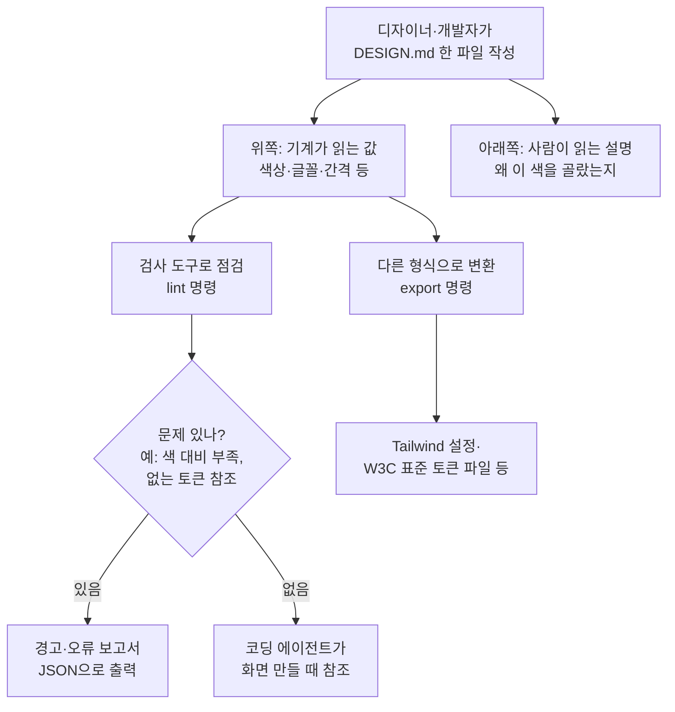

<div class="ai-knowledge-shell">

<aside class="ai-knowledge-sidebar">
  <p class="ai-eyebrow">CATEGORIES</p>
  <nav class="ai-cat-tree"><details class="ai-cat" open><summary><span class="catname">에이전트 오케스트레이션</span><span class="catcount">7</span></summary><ul><li><a href="https://altjs4510.github.io/ai_news_blog/knowledge/20260708/"><span class="kdate">2026-07-08</span><span class="ktitle">Expanding Managed Agents in Gemini API: backgrou…</span></a></li><li><a href="https://altjs4510.github.io/ai_news_blog/knowledge/20260623/"><span class="kdate">2026-06-23</span><span class="ktitle">bytedance/deer-flow — 샌드박스·메모리·서브에이전트·메시지 게이트웨이를…</span></a></li><li><a href="https://altjs4510.github.io/ai_news_blog/knowledge/20260611/"><span class="kdate">2026-06-11</span><span class="ktitle">The evolution of agentic surfaces: building with…</span></a></li><li><a href="https://altjs4510.github.io/ai_news_blog/knowledge/20260610/"><span class="kdate">2026-06-10</span><span class="ktitle">Fable 5 just made cost-aware model routing manda…</span></a></li><li><a href="https://altjs4510.github.io/ai_news_blog/knowledge/20260602/"><span class="kdate">2026-06-02</span><span class="ktitle">revfactory/harness — 도메인별 에이전트 팀과 스킬을 자동 설계하는 메타…</span></a></li><li><a href="https://altjs4510.github.io/ai_news_blog/knowledge/20260529/"><span class="kdate">2026-05-29</span><span class="ktitle">Introducing dynamic workflows in Claude Code</span></a></li><li><a href="https://altjs4510.github.io/ai_news_blog/knowledge/20260507/"><span class="kdate">2026-05-07</span><span class="ktitle">ruvnet/ruflo — Claude 멀티 에이전트 오케스트레이션 플랫폼</span></a></li></ul></details><details class="ai-cat" open><summary><span class="catname">MCP &amp; 도구 통합</span><span class="catcount">17</span></summary><ul><li><a href="https://altjs4510.github.io/ai_news_blog/knowledge/20260731/"><span class="kdate">2026-07-31</span><span class="ktitle">different-ai/openwork — Claude Cowork의 오픈소스 대안(o…</span></a></li><li><a href="https://altjs4510.github.io/ai_news_blog/knowledge/20260729/"><span class="kdate">2026-07-29</span><span class="ktitle">Bringing MCP 2026-07-28 to Claude</span></a></li><li><a href="https://altjs4510.github.io/ai_news_blog/knowledge/20260724/"><span class="kdate">2026-07-24</span><span class="ktitle">diegosouzapw/OmniRoute — 단일 엔드포인트로 278+ 프로바이더·50…</span></a></li><li><a href="https://altjs4510.github.io/ai_news_blog/knowledge/20260722/"><span class="kdate">2026-07-22</span><span class="ktitle">tirth8205/code-review-graph — MCP·CLI용 로컬 우선 코드 …</span></a></li><li><a href="https://altjs4510.github.io/ai_news_blog/knowledge/20260721/"><span class="kdate">2026-07-21</span><span class="ktitle">tirth8205/code-review-graph — 로컬 우선 코드 인텔리전스 그래프…</span></a></li><li><a href="https://altjs4510.github.io/ai_news_blog/knowledge/20260719/"><span class="kdate">2026-07-19</span><span class="ktitle">tirth8205/code-review-graph — 로컬 우선 코드 인텔리전스 그래프…</span></a></li><li><a href="https://altjs4510.github.io/ai_news_blog/knowledge/20260718/"><span class="kdate">2026-07-18</span><span class="ktitle">tirth8205/code-review-graph — MCP·CLI용 로컬 코드 인텔리…</span></a></li><li><a href="https://altjs4510.github.io/ai_news_blog/knowledge/20260709/"><span class="kdate">2026-07-09</span><span class="ktitle">mvanhorn/last30days-skill — Reddit·X·YouTube·HN·…</span></a></li><li><a href="https://altjs4510.github.io/ai_news_blog/knowledge/20260618/"><span class="kdate">2026-06-18</span><span class="ktitle">DeusData/codebase-memory-mcp — 158개 언어 코드베이스를 밀리…</span></a></li><li><a href="https://altjs4510.github.io/ai_news_blog/knowledge/20260606/"><span class="kdate">2026-06-06</span><span class="ktitle">chopratejas/headroom — Compress tool outputs, lo…</span></a></li><li><a href="https://altjs4510.github.io/ai_news_blog/knowledge/20260605/"><span class="kdate">2026-06-05</span><span class="ktitle">chopratejas/headroom — Compress tool outputs, lo…</span></a></li><li><a href="https://altjs4510.github.io/ai_news_blog/knowledge/20260604/"><span class="kdate">2026-06-04</span><span class="ktitle">chopratejas/headroom — Compress tool outputs bef…</span></a></li><li><a href="https://altjs4510.github.io/ai_news_blog/knowledge/20260603/"><span class="kdate">2026-06-03</span><span class="ktitle">How Bad MCP design cost your Agent 5× more token…</span></a></li><li><a href="https://altjs4510.github.io/ai_news_blog/knowledge/20260523/"><span class="kdate">2026-05-23</span><span class="ktitle">colbymchenry/codegraph — 사전 인덱싱된 코드 지식 그래프 MCP</span></a></li><li><a href="https://altjs4510.github.io/ai_news_blog/knowledge/20260517/"><span class="kdate">2026-05-17</span><span class="ktitle">I gave my LLM 100,000+ tools — Lazy Discovery &a…</span></a></li><li><a href="https://altjs4510.github.io/ai_news_blog/knowledge/20260509/"><span class="kdate">2026-05-09</span><span class="ktitle">How to connect 100 MCP servers without the conte…</span></a></li><li><a href="https://altjs4510.github.io/ai_news_blog/knowledge/20260506/"><span class="kdate">2026-05-06</span><span class="ktitle">mksglu/context-mode — AI 코딩 에이전트용 컨텍스트 윈도우 최적화</span></a></li></ul></details><details class="ai-cat" open><summary><span class="catname">코딩 에이전트</span><span class="catcount">18</span></summary><ul><li><a href="https://altjs4510.github.io/ai_news_blog/knowledge/20260728/"><span class="kdate">2026-07-28</span><span class="ktitle">alibaba/open-code-review — 결정론적 파이프라인 + LLM 에이전트…</span></a></li><li><a href="https://altjs4510.github.io/ai_news_blog/knowledge/20260725/"><span class="kdate">2026-07-25</span><span class="ktitle">The new rules of context engineering for Claude …</span></a></li><li><a href="https://altjs4510.github.io/ai_news_blog/knowledge/20260716/"><span class="kdate">2026-07-16</span><span class="ktitle">Dicklesworthstone/destructive_command_guard — 에이…</span></a></li><li><a href="https://altjs4510.github.io/ai_news_blog/knowledge/20260715/"><span class="kdate">2026-07-15</span><span class="ktitle">Dicklesworthstone/destructive_command_guard — 에이…</span></a></li><li><a href="https://altjs4510.github.io/ai_news_blog/knowledge/20260714/"><span class="kdate">2026-07-14</span><span class="ktitle">Graphify-Labs/graphify — 코드베이스를 질의 가능한 지식 그래프로 만…</span></a></li><li><a href="https://altjs4510.github.io/ai_news_blog/knowledge/20260707/"><span class="kdate">2026-07-07</span><span class="ktitle">AI Hero Skills Catalog — 실무 엔지니어를 위한 재사용 가능한 판단 …</span></a></li><li><a href="https://altjs4510.github.io/ai_news_blog/knowledge/20260705/"><span class="kdate">2026-07-05</span><span class="ktitle">openai/codex-plugin-cc — Claude Code에서 Codex를 위임…</span></a></li><li><a href="https://altjs4510.github.io/ai_news_blog/knowledge/20260626/" class="current"><span class="kdate">2026-06-26</span><span class="ktitle">google-labs-code/design.md — 코딩 에이전트에게 디자인 시스템을 …</span></a></li><li><a href="https://altjs4510.github.io/ai_news_blog/knowledge/20260619/"><span class="kdate">2026-06-19</span><span class="ktitle">Claude Code now supports artifacts</span></a></li><li><a href="https://altjs4510.github.io/ai_news_blog/knowledge/20260530/"><span class="kdate">2026-05-30</span><span class="ktitle">Leonxlnx/taste-skill — AI에게 좋은 취향을 부여해 generic s…</span></a></li><li><a href="https://altjs4510.github.io/ai_news_blog/knowledge/20260528/"><span class="kdate">2026-05-28</span><span class="ktitle">Building self-improving tax agents with Codex</span></a></li><li><a href="https://altjs4510.github.io/ai_news_blog/knowledge/20260526/"><span class="kdate">2026-05-26</span><span class="ktitle">colbymchenry/codegraph — Pre-indexed code knowle…</span></a></li><li><a href="https://altjs4510.github.io/ai_news_blog/knowledge/20260524/"><span class="kdate">2026-05-24</span><span class="ktitle">colbymchenry/codegraph — Pre-indexed code knowle…</span></a></li><li><a href="https://altjs4510.github.io/ai_news_blog/knowledge/20260521/"><span class="kdate">2026-05-21</span><span class="ktitle">colbymchenry/codegraph — Pre-indexed code knowle…</span></a></li><li><a href="https://altjs4510.github.io/ai_news_blog/knowledge/20260512/"><span class="kdate">2026-05-12</span><span class="ktitle">agentmemory — Persistent memory for AI coding ag…</span></a></li><li><a href="https://altjs4510.github.io/ai_news_blog/knowledge/20260510/"><span class="kdate">2026-05-10</span><span class="ktitle">addyosmani/agent-skills — Production-grade engin…</span></a></li><li><a href="https://altjs4510.github.io/ai_news_blog/knowledge/20260508/"><span class="kdate">2026-05-08</span><span class="ktitle">addyosmani/agent-skills — Production-grade engin…</span></a></li><li><a href="https://altjs4510.github.io/ai_news_blog/knowledge/20260505/"><span class="kdate">2026-05-05</span><span class="ktitle">mattpocock/skills — Skills for Real Engineers (.…</span></a></li></ul></details><details class="ai-cat" open><summary><span class="catname">모델 &amp; 연구</span><span class="catcount">5</span></summary><ul><li><a href="https://altjs4510.github.io/ai_news_blog/knowledge/20260716-proprag/"><span class="kdate">2026-07-16</span><span class="ktitle">PropRAG — 프로포지션 경로 위 beam search로 멀티홉 검색 안내</span></a></li><li><a href="https://altjs4510.github.io/ai_news_blog/knowledge/20260620/"><span class="kdate">2026-06-20</span><span class="ktitle">zai-org/GLM-5 — From Vibe Coding to Agentic Engi…</span></a></li><li><a href="https://altjs4510.github.io/ai_news_blog/knowledge/20260617/"><span class="kdate">2026-06-17</span><span class="ktitle">Predicting model behavior before release by simu…</span></a></li><li><a href="https://altjs4510.github.io/ai_news_blog/knowledge/20260516/"><span class="kdate">2026-05-16</span><span class="ktitle">STALE — 에이전트가 자기 기억의 유효성을 인지할 수 있는가</span></a></li><li><a href="https://altjs4510.github.io/ai_news_blog/knowledge/20260513/"><span class="kdate">2026-05-13</span><span class="ktitle">Thinking Machines' Native Interaction Models — T…</span></a></li></ul></details><details class="ai-cat" open><summary><span class="catname">인프라 &amp; 컴퓨트</span><span class="catcount">4</span></summary><ul><li><a href="https://altjs4510.github.io/ai_news_blog/knowledge/20260723/"><span class="kdate">2026-07-23</span><span class="ktitle">diegosouzapw/OmniRoute — 268+ 프로바이더를 단일 엔드포인트로 묶…</span></a></li><li><a href="https://altjs4510.github.io/ai_news_blog/knowledge/20260630/"><span class="kdate">2026-06-30</span><span class="ktitle">Introducing the Claude apps gateway for Amazon B…</span></a></li><li><a href="https://altjs4510.github.io/ai_news_blog/knowledge/20260522/"><span class="kdate">2026-05-22</span><span class="ktitle">Giving Agents Computers — Ivan Burazin, Daytona</span></a></li><li><a href="https://altjs4510.github.io/ai_news_blog/knowledge/20260520/"><span class="kdate">2026-05-20</span><span class="ktitle">New in Claude Managed Agents: self-hosted sandbo…</span></a></li></ul></details><details class="ai-cat" open><summary><span class="catname">보안 &amp; 거버넌스</span><span class="catcount">12</span></summary><ul><li><a href="https://altjs4510.github.io/ai_news_blog/knowledge/20260730/"><span class="kdate">2026-07-30</span><span class="ktitle">Anatomy of a Frontier Lab Agent Intrusion: A Tec…</span></a></li><li><a href="https://altjs4510.github.io/ai_news_blog/knowledge/20260710/"><span class="kdate">2026-07-10</span><span class="ktitle">70개 MCP 서버 strace 런타임 감사 — 부팅 시 아웃바운드 호출 서버 적발</span></a></li><li><a href="https://altjs4510.github.io/ai_news_blog/knowledge/20260704/"><span class="kdate">2026-07-04</span><span class="ktitle">Cloudflare is about to block AI agents by defaul…</span></a></li><li><a href="https://altjs4510.github.io/ai_news_blog/knowledge/20260703/"><span class="kdate">2026-07-03</span><span class="ktitle">Giving admins more visibility and control over C…</span></a></li><li><a href="https://altjs4510.github.io/ai_news_blog/knowledge/20260625/"><span class="kdate">2026-06-25</span><span class="ktitle">Agent identity in Claude Tag: a new access model…</span></a></li><li><a href="https://altjs4510.github.io/ai_news_blog/knowledge/20260624/"><span class="kdate">2026-06-24</span><span class="ktitle">Agent identity in Claude Tag: a new access model…</span></a></li><li><a href="https://altjs4510.github.io/ai_news_blog/knowledge/20260614/"><span class="kdate">2026-06-14</span><span class="ktitle">NVIDIA/SkillSpector — Security scanner for AI ag…</span></a></li><li><a href="https://altjs4510.github.io/ai_news_blog/knowledge/20260613/"><span class="kdate">2026-06-13</span><span class="ktitle">Fable 5's guardrails got bypassed in 48 hours — …</span></a></li><li><a href="https://altjs4510.github.io/ai_news_blog/knowledge/20260612/"><span class="kdate">2026-06-12</span><span class="ktitle">NVIDIA/SkillSpector — AI 에이전트 스킬용 보안 스캐너</span></a></li><li><a href="https://altjs4510.github.io/ai_news_blog/knowledge/20260607/"><span class="kdate">2026-06-07</span><span class="ktitle">OpenAI Help: Lockdown Mode</span></a></li><li><a href="https://altjs4510.github.io/ai_news_blog/knowledge/20260531/"><span class="kdate">2026-05-31</span><span class="ktitle">How we contain Claude across products</span></a></li><li><a href="https://altjs4510.github.io/ai_news_blog/knowledge/20260527/"><span class="kdate">2026-05-27</span><span class="ktitle">Microsoft Copilot Cowork Exfiltrates Files</span></a></li></ul></details><details class="ai-cat" open><summary><span class="catname">응용 사례</span><span class="catcount">6</span></summary><ul><li><a href="https://altjs4510.github.io/ai_news_blog/knowledge/20260726/"><span class="kdate">2026-07-26</span><span class="ktitle">citrolabs/ego-lite — 로그인된 브라우저 상태를 AI 에이전트와 공유하는…</span></a></li><li><a href="https://altjs4510.github.io/ai_news_blog/knowledge/20260717/"><span class="kdate">2026-07-17</span><span class="ktitle">After a year building agent memory, 'save everyt…</span></a></li><li><a href="https://altjs4510.github.io/ai_news_blog/knowledge/20260712/"><span class="kdate">2026-07-12</span><span class="ktitle">Do Automated Evals Work?</span></a></li><li><a href="https://altjs4510.github.io/ai_news_blog/knowledge/20260621/"><span class="kdate">2026-06-21</span><span class="ktitle">calesthio/OpenMontage — 12 파이프라인·52 도구·500+ 스킬을 …</span></a></li><li><a href="https://altjs4510.github.io/ai_news_blog/knowledge/20260609/"><span class="kdate">2026-06-09</span><span class="ktitle">Building intelligent apps for Apple platforms wi…</span></a></li><li><a href="https://altjs4510.github.io/ai_news_blog/knowledge/20260514/"><span class="kdate">2026-05-14</span><span class="ktitle">Introducing Claude for Small Business</span></a></li></ul></details><details class="ai-cat" open><summary><span class="catname">산업 동향</span><span class="catcount">7</span></summary><ul><li><a href="https://altjs4510.github.io/ai_news_blog/knowledge/20260711/"><span class="kdate">2026-07-11</span><span class="ktitle">OpenAI says GPT 5.6 is the 'preferred model' for…</span></a></li><li><a href="https://altjs4510.github.io/ai_news_blog/knowledge/20260702/"><span class="kdate">2026-07-02</span><span class="ktitle">How Cursor deploys AI inside the enterprise (For…</span></a></li><li><a href="https://altjs4510.github.io/ai_news_blog/knowledge/20260701/"><span class="kdate">2026-07-01</span><span class="ktitle">Google OKF (Open Knowledge Format) — 벤더 중립 에이전트 …</span></a></li><li><a href="https://altjs4510.github.io/ai_news_blog/knowledge/20260616/"><span class="kdate">2026-06-16</span><span class="ktitle">Why AI hasn't replaced software engineers, and w…</span></a></li><li><a href="https://altjs4510.github.io/ai_news_blog/knowledge/20260519/"><span class="kdate">2026-05-19</span><span class="ktitle">Anthropic acquires Stainless</span></a></li><li><a href="https://altjs4510.github.io/ai_news_blog/knowledge/20260515/"><span class="kdate">2026-05-15</span><span class="ktitle">Clawdmeter — Claude Code 사용량을 데스크톱 대시보드로</span></a></li><li><a href="https://altjs4510.github.io/ai_news_blog/knowledge/20260504/"><span class="kdate">2026-05-04</span><span class="ktitle">Agents for Everything Else: Codex for Knowledge …</span></a></li></ul></details></nav>
</aside>

<article class="ai-knowledge-article">

<header class="ai-post-hero">
  <p class="ai-eyebrow"><a class="ai-back" href="../">KNOWLEDGE</a> · 2026-06-26 · 오늘의 학습</p>
  <h2 class="ai-post-title">google-labs-code/design.md — 코딩 에이전트에게 디자인 시스템을 영속적으로 전달하는 포맷 명세</h2>
</header>

> 원문: [google-labs-code/design.md — 코딩 에이전트에게 디자인 시스템을 영속적으로 전달하는 포맷 명세](https://github.com/google-labs-code/design.md)

## 📌 학습 정리

### 1. 한 줄로 말하면

색·글꼴·버튼 모양 같은 디자인 규칙을 코딩을 도와주는 인공지능이 매번 새로 추측하지 않도록, 한 장의 문서에 깔끔하게 적어두는 약속된 양식입니다.

### 2. 왜 이게 만들어졌어요?

코딩을 도와주는 인공지능 도구(코딩 에이전트, coding agent)에게 "우리 서비스는 이런 색감, 이런 글꼴을 써요"라고 매번 말로 설명하면, 대화가 바뀔 때마다 같은 이야기를 반복해야 합니다. 그러다 보면 어떤 화면은 빨간 버튼이 나오고 다른 화면은 주황 버튼이 나오는 식으로 결과가 제각각이 되기 쉽습니다. 사람이 보는 디자인 가이드는 PDF나 위키 문서로 잘 정리되어 있지만, 정작 인공지능이 읽기엔 형식이 들쭉날쭉합니다. 그래서 구글 랩스(Google Labs)가 "이런 식으로 한 파일에 적어두면, 어떤 에이전트가 와도 똑같이 해석할 수 있다"는 표준 양식을 제안한 것이 `DESIGN.md`입니다. 색깔 값처럼 기계가 정확히 읽어야 할 부분과, "왜 이 색을 골랐는지"처럼 사람이 읽으며 맥락을 잡는 부분을 한 문서 안에 같이 담는다는 점이 핵심입니다.

### 3. 비유로 풀면

이건 마치 카페 프랜차이즈의 '브랜드 매뉴얼' 같은 거예요. 어느 지점에 가도 로고 색, 메뉴판 글꼴, 컵 사이즈가 똑같이 나오도록 책 한 권에 정리해두는 것처럼, `DESIGN.md`는 인공지능이 화면을 만들 때마다 펼쳐보는 매뉴얼 역할을 합니다.

또 하나 비유하자면, 요리 레시피의 재료 표(정량)와 조리 노트(설명)가 합쳐진 문서 같아요. 위쪽엔 "설탕 10g"처럼 기계도 헷갈리지 않는 정확한 수치가 있고, 아래쪽엔 "이 단계에서 약불로 줄이는 이유는 향이 날아가지 않게 하기 위해서"라는 사람용 설명이 있습니다.

그래서 결국, 정확한 값(토큰)과 그 값을 쓰는 이유(설명문)를 한 자리에 두어, 사람도 인공지능도 같은 디자인 언어로 대화하게 만드는 장치입니다.

### 4. 어떻게 작동하는지 (그림으로)



먼저 한 파일에 "기계용 값"과 "사람용 설명"을 같이 적어둡니다. 그 파일을 검사 도구에 넣으면 색 대비가 충분한지, 잘못 참조한 토큰이 있는지 등을 자동으로 살펴줍니다. 이 파일은 그 자체로 인공지능에게 던져줘도 되고, 다른 디자인 도구가 알아듣는 형식으로 변환해서 쓸 수도 있습니다.

### 5. 처음 보는 용어 풀이

- **디자인 토큰 (design token)** — 색상 코드, 글꼴 크기, 모서리 둥글기처럼 디자인을 구성하는 '값 하나하나'에 이름을 붙여둔 것입니다. 예를 들어 `colors.primary`라는 이름에 `#1A1C1E`라는 값을 묶어두면, 나중에 "이름"으로 값을 꺼내 쓸 수 있어 일관성이 유지됩니다.
- **YAML 앞머리 (YAML front matter)** — 마크다운 문서 맨 위에 `---` 줄로 감싸서 적어두는 구조화된 데이터 영역입니다. `DESIGN.md`에서는 여기에 색·글꼴 같은 기계가 읽을 값을 적어둡니다.
- **코딩 에이전트 (coding agent)** — 사람의 지시를 받아 코드를 작성하거나 화면을 만들어주는 인공지능 도구를 말합니다. 이 친구가 디자인 규칙을 헷갈리지 않게 하려고 `DESIGN.md`가 만들어졌습니다.
- **린트 (lint)** — 문서나 코드를 자동으로 점검해서 실수나 어색한 부분을 찾아주는 작업입니다. `DESIGN.md`에서는 "없는 토큰을 참조했다", "글자색과 배경색 대비가 너무 약하다" 같은 문제를 잡아줍니다.
- **WCAG 명암비 (WCAG contrast ratio)** — 웹 접근성 가이드라인에서 정한 기준으로, 글자색과 배경색이 충분히 또렷하게 구분되는지를 숫자로 표현한 값입니다. 보통 4.5:1 이상이어야 본문 글자가 잘 읽힌다고 봅니다.
- **컴포넌트 토큰 (component token)** — 버튼, 카드처럼 화면의 부품 단위로 "배경색은 이거, 글자색은 이거, 모서리는 이거"를 묶어둔 묶음입니다. 부품마다 어떤 토큰을 쓸지 미리 정해두면, 어디서 만들어도 같은 모양이 나옵니다.
- **W3C 디자인 토큰 형식 (W3C Design Tokens Format)** — 여러 디자인 도구들이 공통으로 알아듣자고 약속한 토큰 저장 형식입니다. `DESIGN.md`도 이 표준에서 영감을 받았고, 이 형식으로 내보낼 수도 있습니다.

### 6. 한 발 더 들어가고 싶다면

- [google-labs-code/design.md (GitHub 저장소)](https://github.com/google-labs-code/design.md) — 이 양식의 원문 저장소예요. 실제 예시 파일과 명령어 사용법을 직접 볼 수 있습니다.
- `docs/spec.md` (저장소 내부) — 이걸 보면 토큰 종류, 섹션 순서, 허용되는 속성 등 전체 규격을 자세히 알 수 있어요.
- W3C 디자인 토큰 형식 모듈(W3C Design Tokens Format Module) — 원문에서 영감의 출처로 언급된 표준이에요. 디자인 토큰을 도구 간에 주고받는 더 큰 흐름을 이해하는 데 도움이 됩니다.

---

## 📖 원문 전체 번역 (정독용)

> 의역 최소화한 전체 번역입니다. 큰 흐름은 위 정리에서 잡고, 정확한 워딩이 필요할 땐 이 섹션에서 정독하세요.

# DESIGN.md

코딩 에이전트에게 시각적 아이덴티티를 설명하기 위한 포맷 명세. DESIGN.md는 에이전트에게 디자인 시스템에 대한 영속적이고 구조화된 이해를 제공합니다.

## 포맷

DESIGN.md 파일은 기계가 읽을 수 있는 디자인 토큰 (YAML 전문(front matter))과 사람이 읽을 수 있는 디자인 근거 (마크다운 산문)를 결합합니다. 토큰은 에이전트에게 정확한 값을 전달합니다. 산문은 그 값이 **왜** 존재하며 어떻게 적용하는지를 알려줍니다.

```yaml
---
name: Heritage
colors:
  primary: "#1A1C1E"
  secondary: "#6C7278"
  tertiary: "#B8422E"
  neutral: "#F7F5F2"
typography:
  h1:
    fontFamily: Public Sans
    fontSize: 3rem
  body-md:
    fontFamily: Public Sans
    fontSize: 1rem
  label-caps:
    fontFamily: Space Grotesk
    fontSize: 0.75rem
rounded:
  sm: 4px
  md: 8px
spacing:
  sm: 8px
  md: 16px
---
```

## 개요

건축적 미니멀리즘(Architectural Minimalism)과 저널리즘적 무게감(Journalistic Gravitas)의 만남. UI는 고급 매트 마감 — 고급 대형 신문지 또는 현대적인 갤러리 — 을 연상시킵니다.

## 색상

팔레트는 고대비 중성색과 단일 강조색을 기반으로 합니다.

- **Primary (#1A1C1E):** 헤드라인과 핵심 텍스트를 위한 짙은 잉크색.
- **Secondary (#6C7278):** 테두리, 캡션, 메타데이터를 위한 세련된 슬레이트색.
- **Tertiary (#B8422E):** "Boston Clay" — 인터랙션을 위한 유일한 드라이버.
- **Neutral (#F7F5F2):** 순백보다 부드러운 따뜻한 석회석 기반색.

이 파일을 읽은 에이전트는 Public Sans 폰트로 짙은 잉크색 헤드라인, 따뜻한 석회석 배경, 그리고 Boston Clay 색상의 행동 유도(call-to-action) 버튼을 갖춘 UI를 생성합니다.

---

## 시작하기

DESIGN.md를 명세에 맞게 검증하고, 잘못된 토큰 참조를 찾아내고, WCAG 명암비를 확인하며, 구조적 발견 사항을 표면화합니다 — 모두 에이전트가 활용할 수 있는 구조화된 JSON 형태로 제공됩니다.

```bash
npx @google/design.md lint DESIGN.md
```

```json
{
  "findings": [
    {
      "severity": "warning",
      "path": "components.button-primary",
      "message": "textColor (#ffffff) on backgroundColor (#1A1C1E) has contrast ratio 15.42:1 — passes WCAG AA."
    }
  ],
  "summary": {
    "errors": 0,
    "warnings": 1,
    "info": 1
  }
}
```

디자인 시스템의 두 버전을 비교하여 토큰 수준 및 산문 회귀를 감지합니다:

```bash
npx @google/design.md diff DESIGN.md DESIGN-v2.md
```

```json
{
  "tokens": {
    "colors": {
      "added": ["accent"],
      "removed": [],
      "modified": ["tertiary"]
    },
    "typography": {
      "added": [],
      "removed": [],
      "modified": []
    }
  },
  "regression": false
}
```

---

## 명세

완전한 DESIGN.md 명세는 `docs/spec.md`에 있습니다. 이하는 압축된 참고 내용입니다.

### 파일 구조

DESIGN.md 파일은 두 개의 레이어로 구성됩니다:

- **YAML 전문 (front matter)** — 파일 상단의 `---` 구분자로 감싸진 기계 판독 가능한 디자인 토큰.
- **마크다운 본문 (Markdown body)** — `##` 섹션으로 구성된 사람이 읽을 수 있는 디자인 근거.

토큰은 규범적(normative) 값입니다. 산문은 토큰을 어떻게 적용할지에 대한 맥락을 제공합니다.

### 토큰 스키마

```yaml
version: <string>       # 선택 사항, 현재: "alpha"
name: <string>
description: <string>   # 선택 사항
colors:
  <token-name>: <Color>
typography:
  <token-name>: <Typography>
rounded:
  <scale-level>: <Dimension>
spacing:
  <scale-level>: <Dimension | number>
components:
  <component-name>:
    <token-name>: <string | token reference>
```

### 토큰 타입

| 타입 | 형식 | 예시 |
|---|---|---|
| Color | 모든 CSS 색상 (hex, `rgb()`, `oklch()`, named 등) | `"#1A1C1E"`, `"oklch(62% 0.18 250)"` |
| Dimension | 숫자 + 단위 (`px`, `em`, `rem`) | `48px`, `-0.02em` |
| Token Reference | `{path.to.token}` | `{colors.primary}` |
| Typography | `fontFamily`, `fontSize`, `fontWeight`, `lineHeight`, `letterSpacing`, `fontFeature`, `fontVariation`을 갖는 객체 | 위 예시 참조 |

### 섹션 순서

섹션은 `##` 헤딩을 사용합니다. 생략할 수 있지만, 존재하는 경우 다음 순서를 따라야 합니다:

| # | 섹션 | 별칭 |
|---|---|---|
| 1 | Overview | Brand & Style |
| 2 | Colors | |
| 3 | Typography | |
| 4 | Layout | Layout & Spacing |
| 5 | Elevation & Depth | Elevation |
| 6 | Shapes | |
| 7 | Components | |
| 8 | Do's and Don'ts | |

### 컴포넌트 토큰

컴포넌트는 이름을 서브 토큰 속성 그룹에 매핑합니다:

```yaml
components:
  button-primary:
    backgroundColor: "{colors.tertiary}"
    textColor: "{colors.on-tertiary}"
    rounded: "{rounded.sm}"
    padding: 12px
  button-primary-hover:
    backgroundColor: "{colors.tertiary-container}"
```

유효한 컴포넌트 속성: `backgroundColor`, `textColor`, `typography`, `rounded`, `padding`, `size`, `height`, `width`.

변형 (hover, active, pressed)은 관련된 키 이름을 가진 별도의 컴포넌트 항목으로 표현됩니다.

### 알 수 없는 콘텐츠에 대한 소비자 동작

| 시나리오 | 동작 |
|---|---|
| 알 수 없는 섹션 헤딩 | 보존; 오류를 발생시키지 않음 |
| 알 수 없는 색상 토큰 이름 | 값이 유효하면 허용 |
| 알 수 없는 타이포그래피 토큰 이름 | 유효한 타이포그래피로 허용 |
| 알 수 없는 컴포넌트 속성 | 경고와 함께 허용 |
| 중복 섹션 헤딩 | 오류; 파일 거부 |

---

## CLI 레퍼런스

### 설치

```bash
npm install @google/design.md
```

**Windows**에서는 셸이 `@`를 특수 문자로 처리하는 경우 (PowerShell, 일부 터미널) 패키지 이름을 따옴표로 감싸세요:

```bash
npm install "@google/design.md"
```

또는 직접 실행하면 (항상 공개 npm 레지스트리에서 해석됩니다):

```bash
npx @google/design.md lint DESIGN.md
```

**Windows/PowerShell**에서는 이 직접 실행 방식이 출력을 생성하지 않거나 (또는 `DESIGN.md`를 마크다운 편집기로 열 수 있습니다), `design.md` bin 이름의 `.md` 접미사가 명령 해석 시 Windows의 마크다운 파일 연결과 충돌하기 때문입니다. 대신 점 없는 `designmd` 별칭을 사용하세요 — `-p`로 `npx`가 패키지를 찾도록 지정한 다음 `designmd`를 호출합니다:

```bash
npx -p @google/design.md designmd lint DESIGN.md
```

`designmd` 심(shim)은 동일한 진입점으로 해석되며 모든 플랫폼에서 동일하게 작동합니다.

#### `npm error ENOVERSIONS` ("No versions available for @google/design.md")

CLI는 npm에 `@google/design.md`로 게시되어 있습니다. `ENOVERSIONS`는 대부분의 경우 npm이 공개 레지스트리를 조회하지 않는다는 의미입니다 (`.npmrc`의 커스텀 `registry=`, 이 패키지를 아직 동기화하지 않은 기업용 미러, 또는 `@google` 스코프에 대해 잘못 구성된 `@google:registry`).

현재 적용 중인 레지스트리를 확인하세요:

```bash
npm config get registry
```

인터넷에서 정상적으로 설치하는 경우 `https://registry.npmjs.org/`여야 합니다. 설정을 수정한 후, 오래된 404가 캐시되어 있다면 `npm cache clean --force`로 재시도하세요.

모든 명령은 파일 경로 또는 stdin을 위한 `-`를 허용합니다. 출력 기본값은 JSON입니다.

**Windows 팁**: `npx`가 아닌 `package.json` 스크립트에서 CLI를 직접 호출할 때는 `design.md` 대신 `designmd` 별칭을 사용하세요. 원래 bin 이름의 `.md` 접미사는 Windows 명령 해석 시 마크다운 파일 연결과 혼동을 일으킵니다. `designmd` 심은 동일한 진입점으로 해석되며 모든 플랫폼에서 동일하게 작동합니다.

```json
// package.json
{
  "scripts": {
    "design:lint": "designmd lint DESIGN.md"
  }
}
```

---

### lint

DESIGN.md 파일의 구조적 정확성을 검증합니다.

```bash
npx @google/design.md lint DESIGN.md
npx @google/design.md lint --format json DESIGN.md
cat DESIGN.md | npx @google/design.md lint -
```

| 옵션 | 타입 | 기본값 | 설명 |
|---|---|---|---|
| `file` | positional | 필수 | DESIGN.md 경로 (또는 stdin의 경우 `-`) |
| `--format` | `json` | `json` | 출력 형식 |

오류가 발견되면 종료 코드 `1`, 그렇지 않으면 `0`.

---

### diff

두 개의 DESIGN.md 파일을 비교하고 토큰 수준의 변경 사항을 보고합니다.

```bash
npx @google/design.md diff DESIGN.md DESIGN-v2.md
```

| 옵션 | 타입 | 기본값 | 설명 |
|---|---|---|---|
| `before` | positional | 필수 | "이전" DESIGN.md 경로 |
| `after` | positional | 필수 | "이후" DESIGN.md 경로 |
| `--format` | `json` | `json` | 출력 형식 |

회귀가 감지되면 (이후 파일에 오류 또는 경고가 더 많은 경우) 종료 코드 `1`.

---

### export

DESIGN.md 토큰을 다른 형식으로 내보냅니다.

```bash
npx @google/design.md export --format json-tailwind DESIGN.md > tailwind.theme.json
npx @google/design.md export --format css-tailwind DESIGN.md > theme.css
npx @google/design.md export --format dtcg DESIGN.md > tokens.json
```

| 옵션 | 타입 | 기본값 | 설명 |
|---|---|---|---|
| `file` | positional | 필수 | DESIGN.md 경로 (또는 stdin의 경우 `-`) |
| `--format` | `json-tailwind` \| `css-tailwind` \| `tailwind` \| `dtcg` | 필수 | 출력 형식 |

| 형식 | 출력 | 설명 |
|---|---|---|
| `json-tailwind` | JSON | Tailwind v3 `theme.extend` 설정 객체 |
| `css-tailwind` | CSS | CSS 커스텀 속성이 포함된 Tailwind v4 `@theme { ... }` 블록 |
| `tailwind` | JSON | `json-tailwind`의 별칭 |
| `dtcg` | JSON | W3C Design Tokens Format Module |

---

### spec

DESIGN.md 포맷 명세를 출력합니다 (에이전트 프롬프트에 명세 컨텍스트를 주입하는 데 유용합니다).

```bash
npx @google/design.md spec
npx @google/design.md spec --rules
npx @google/design.md spec --rules-only --format json
```

| 옵션 | 타입 | 기본값 | 설명 |
|---|---|---|---|
| `--rules` | boolean | `false` | 활성 린팅 규칙 표를 추가 출력 |
| `--rules-only` | boolean | `false` | 린팅 규칙 표만 출력 |
| `--format` | `markdown` \| `json` | `markdown` | 출력 형식 |

---

## 린팅 규칙

린터는 파싱된 DESIGN.md에 대해 아홉 가지 규칙을 실행합니다. 각 규칙은 고정된 심각도 수준에서 발견 사항을 생성합니다.

| 규칙 | 심각도 | 검사 내용 |
|---|---|---|
| `broken-ref` | error | 정의된 토큰으로 해석되지 않는 토큰 참조 (`{colors.primary}`) |
| `missing-primary` | warning | 색상이 정의되어 있지만 `primary` 색상이 없음 — 에이전트가 자동 생성함 |
| `contrast-ratio` | warning | WCAG AA 최솟값(4.5:1) 미만인 컴포넌트의 `backgroundColor`/`textColor` 쌍 |
| `orphaned-tokens` | warning | 정의되어 있지만 어떤 컴포넌트에서도 참조되지 않는 색상 토큰 |
| `token-summary` | info | 각 섹션에 정의된 토큰 수 요약 |
| `missing-sections` | info | 다른 토큰이 존재하는데 선택적 섹션(spacing, rounded)이 없는 경우 |
| `missing-typography` | warning | 색상이 정의되어 있지만 타이포그래피 토큰이 없음 — 에이전트가 기본 폰트를 사용함 |
| `section-order` | warning | 섹션이 명세에서 정의한 정규 순서와 다른 순서로 나타남 |
| `unknown-key` | warning | 최상위 YAML 키가 알려진 스키마 키의 오타처럼 보임 (예: `colours:` → `colors:`); 커스텀 확장 키는 무음 처리 |

---

## 프로그래매틱 API

린터는 라이브러리로도 사용할 수 있습니다:

```javascript
import { lint } from '@google/design.md/linter';

const report = lint(markdownString);
console.log(report.findings);      // Finding[]
console.log(report.summary);       // { errors, warnings, info }
console.log(report.designSystem);  // Parsed DesignSystemState
```

---

## 디자인 토큰 상호운용성

DESIGN.md 토큰은 W3C Design Token Format에서 영감을 받았습니다. `export` 명령은 토큰을 다른 형식으로 변환합니다:

- **Tailwind v3 config (JSON)** — `npx @google/design.md export --format json-tailwind DESIGN.md` — `tailwind.config.js`용 `theme.extend` JSON 객체를 출력합니다. `--format tailwind`는 하위 호환 별칭입니다.

- **Tailwind v4 theme (CSS)** — `npx @google/design.md export --format css-tailwind DESIGN.md` — Tailwind v4의 CSS 변수 토큰 네임스페이스 (`--color-*`, `--font-*`, `--text-*`, `--leading-*`, `--tracking-*`, `--font-weight-*`, `--radius-*`, `--spacing-*`)를 사용하는 CSS `@theme { ... }` 블록을 출력합니다.

- **DTCG tokens.json** (W3C Design Tokens Format Module) — `npx @google/design.md export --format dtcg DESIGN.md`

---

## 상태

DESIGN.md 포맷은 현재 버전 `alpha`입니다. 명세, 토큰 스키마, CLI는 활발히 개발 중입니다. 포맷이 성숙해짐에 따라 변경 사항이 있을 수 있습니다.

---

## 면책 조항

이 프로젝트는 Google Open Source Software Vulnerability Rewards Program의 대상이 아닙니다.

</article>

</div>

<!-- ai-related-links -->
<aside class="ai-related-links">
  <p class="ai-eyebrow">관련 학습</p>
  <ul><li><a href="https://altjs4510.github.io/ai_news_blog/knowledge/20260505/"><span class="kdate">2026-05-05</span><span class="ktitle">mattpocock/skills — Skills for Real Engineers (.…</span></a></li><li><a href="https://altjs4510.github.io/ai_news_blog/knowledge/20260530/"><span class="kdate">2026-05-30</span><span class="ktitle">Leonxlnx/taste-skill — AI에게 좋은 취향을 부여해 generic s…</span></a></li><li><a href="https://altjs4510.github.io/ai_news_blog/knowledge/20260508/"><span class="kdate">2026-05-08</span><span class="ktitle">addyosmani/agent-skills — Production-grade engin…</span></a></li></ul>
</aside>
<!-- /ai-related-links -->
