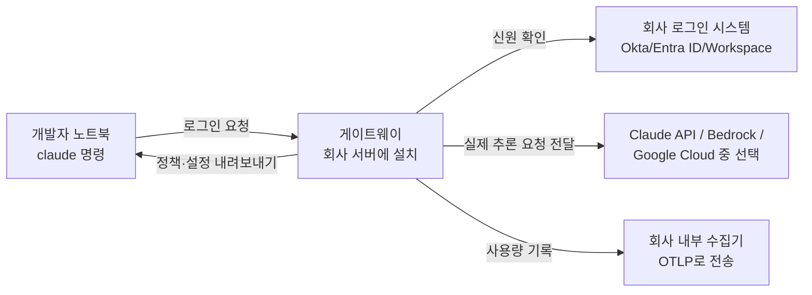

<aside class="ai-knowledge-sidebar">
  
CATEGORIES

  <nav class="ai-cat-tree">

에이전트 오케스트레이션15
<ul><li><a href="https://altjs4510.github.io/ai_news_blog/knowledge/20260904/">2026-09-04HarnessDev: Can LLMs Create and Evolve Their Own…</a></li><li><a href="https://altjs4510.github.io/ai_news_blog/knowledge/20260831-openexecutive-virtual-c-suite/">2026-08-31Open Executive — 8명의 전문 에이전트를 하나의 임원 목소리로</a></li><li><a href="https://altjs4510.github.io/ai_news_blog/knowledge/20260828/">2026-08-28Google ADK for Python v2.8.0 — RemoteA2aAgent 네이…</a></li><li><a href="https://altjs4510.github.io/ai_news_blog/knowledge/20260826/">2026-08-26apache/maka — 도구 호출·권한 결정·종료 이벤트를 append-only 로그…</a></li><li><a href="https://altjs4510.github.io/ai_news_blog/knowledge/20260823/">2026-08-23The Evolution of the Agent Harness — 하네스가 모델 가중치…</a></li><li><a href="https://altjs4510.github.io/ai_news_blog/knowledge/20260805/">2026-08-05TencentCloud/TencentDB-Agent-Memory — 대화·문서·코드를 …</a></li><li><a href="https://altjs4510.github.io/ai_news_blog/knowledge/20260717/">2026-07-17After a year building agent memory, 'save everyt…</a></li><li><a href="https://altjs4510.github.io/ai_news_blog/knowledge/20260709/">2026-07-09mvanhorn/last30days-skill — Reddit·X·YouTube·HN·…</a></li><li><a href="https://altjs4510.github.io/ai_news_blog/knowledge/20260708/">2026-07-08Expanding Managed Agents in Gemini API: backgrou…</a></li><li><a href="https://altjs4510.github.io/ai_news_blog/knowledge/20260623/">2026-06-23bytedance/deer-flow — 샌드박스·메모리·서브에이전트·메시지 게이트웨이를…</a></li><li><a href="https://altjs4510.github.io/ai_news_blog/knowledge/20260621/">2026-06-21calesthio/OpenMontage — 12 파이프라인·52 도구·500+ 스킬을 …</a></li><li><a href="https://altjs4510.github.io/ai_news_blog/knowledge/20260602/">2026-06-02revfactory/harness — 도메인별 에이전트 팀과 스킬을 자동 설계하는 메타…</a></li><li><a href="https://altjs4510.github.io/ai_news_blog/knowledge/20260529/">2026-05-29Introducing dynamic workflows in Claude Code</a></li><li><a href="https://altjs4510.github.io/ai_news_blog/knowledge/20260507/">2026-05-07ruvnet/ruflo — Claude 멀티 에이전트 오케스트레이션 플랫폼</a></li><li><a href="https://altjs4510.github.io/ai_news_blog/knowledge/20260504/">2026-05-04Agents for Everything Else: Codex for Knowledge …</a></li></ul>

MCP &amp; 도구 통합17
<ul><li><a href="https://altjs4510.github.io/ai_news_blog/knowledge/20260829/">2026-08-29cursor/plugins — 플러그인 명세(specification)와 공식 플러그인…</a></li><li><a href="https://altjs4510.github.io/ai_news_blog/knowledge/20260802/">2026-08-02Stateless MCP has recaptured my interest (and in…</a></li><li><a href="https://altjs4510.github.io/ai_news_blog/knowledge/20260801/">2026-08-01different-ai/openwork — Claude Cowork의 오픈소스 대체 에…</a></li><li><a href="https://altjs4510.github.io/ai_news_blog/knowledge/20260731/">2026-07-31different-ai/openwork — Claude Cowork의 오픈소스 대안(o…</a></li><li><a href="https://altjs4510.github.io/ai_news_blog/knowledge/20260729/">2026-07-29Bringing MCP 2026-07-28 to Claude</a></li><li><a href="https://altjs4510.github.io/ai_news_blog/knowledge/20260721/">2026-07-21tirth8205/code-review-graph — 로컬 우선 코드 인텔리전스 그래프…</a></li><li><a href="https://altjs4510.github.io/ai_news_blog/knowledge/20260719/">2026-07-19tirth8205/code-review-graph — 로컬 우선 코드 인텔리전스 그래프…</a></li><li><a href="https://altjs4510.github.io/ai_news_blog/knowledge/20260718/">2026-07-18tirth8205/code-review-graph — MCP·CLI용 로컬 코드 인텔리…</a></li><li><a href="https://altjs4510.github.io/ai_news_blog/knowledge/20260701/">2026-07-01Google OKF (Open Knowledge Format) — 벤더 중립 에이전트 …</a></li><li><a href="https://altjs4510.github.io/ai_news_blog/knowledge/20260618/">2026-06-18DeusData/codebase-memory-mcp — 158개 언어 코드베이스를 밀리…</a></li><li><a href="https://altjs4510.github.io/ai_news_blog/knowledge/20260606/">2026-06-06chopratejas/headroom — Compress tool outputs, lo…</a></li><li><a href="https://altjs4510.github.io/ai_news_blog/knowledge/20260605/">2026-06-05chopratejas/headroom — Compress tool outputs, lo…</a></li><li><a href="https://altjs4510.github.io/ai_news_blog/knowledge/20260604/">2026-06-04chopratejas/headroom — Compress tool outputs bef…</a></li><li><a href="https://altjs4510.github.io/ai_news_blog/knowledge/20260603/">2026-06-03How Bad MCP design cost your Agent 5× more token…</a></li><li><a href="https://altjs4510.github.io/ai_news_blog/knowledge/20260523/">2026-05-23colbymchenry/codegraph — 사전 인덱싱된 코드 지식 그래프 MCP</a></li><li><a href="https://altjs4510.github.io/ai_news_blog/knowledge/20260517/">2026-05-17I gave my LLM 100,000+ tools — Lazy Discovery &a…</a></li><li><a href="https://altjs4510.github.io/ai_news_blog/knowledge/20260509/">2026-05-09How to connect 100 MCP servers without the conte…</a></li></ul>

코딩 에이전트31
<ul><li><a href="https://altjs4510.github.io/ai_news_blog/knowledge/20260906/">2026-09-06DietrichGebert/ponytail — 에이전트를 '방에서 가장 게으른 시니어 …</a></li><li><a href="https://altjs4510.github.io/ai_news_blog/knowledge/20260903/">2026-09-03pacifio/atlas — 여러 코딩 에이전트의 변경을 한곳에서 추적·질의하는 '에이…</a></li><li><a href="https://altjs4510.github.io/ai_news_blog/knowledge/20260901/">2026-09-01affaan-m/ECC — 스킬·본능·메모리·보안을 묶은 에이전트 하네스 성능 최적화 …</a></li><li><a href="https://altjs4510.github.io/ai_news_blog/knowledge/20260831-gitnexus-code-knowledge-graph/">2026-08-31GitNexus — 코드베이스를 지식그래프로 바꿔 에이전트에게 쥐어주기</a></li><li><a href="https://altjs4510.github.io/ai_news_blog/knowledge/20260822/">2026-08-22mattpocock/skills — Skills for Real Engineers (하…</a></li><li><a href="https://altjs4510.github.io/ai_news_blog/knowledge/20260820/">2026-08-20akitaonrails/ai-memory — 코딩 에이전트 CLI의 장기 메모리와 벤더…</a></li><li><a href="https://altjs4510.github.io/ai_news_blog/knowledge/20260819/">2026-08-19akitaonrails/ai-memory — 코딩 에이전트 CLI 간 장기 기억과 벤더…</a></li><li><a href="https://altjs4510.github.io/ai_news_blog/knowledge/20260814/">2026-08-14cathrynlavery/diagram-design — Claude Code용 에디토리…</a></li><li><a href="https://altjs4510.github.io/ai_news_blog/knowledge/20260811/">2026-08-11PrimeIntellect-ai/prime-agent — 장기 자율 실행을 전제로 설계…</a></li><li><a href="https://altjs4510.github.io/ai_news_blog/knowledge/20260810/">2026-08-10Auto mode is now the default in Claude Code for …</a></li><li><a href="https://altjs4510.github.io/ai_news_blog/knowledge/20260809/">2026-08-09PrimeIntellect-ai/prime-agent — 코딩 워크플로우·장기 자율 작…</a></li><li><a href="https://altjs4510.github.io/ai_news_blog/knowledge/20260808/">2026-08-08PrimeIntellect-ai/prime-agent — 코딩 워크플로우와 장시간 자율…</a></li><li><a href="https://altjs4510.github.io/ai_news_blog/knowledge/20260804/">2026-08-04esengine/DeepSeek-Reasonix — prefix-cache 안정성을 축…</a></li><li><a href="https://altjs4510.github.io/ai_news_blog/knowledge/20260728/">2026-07-28alibaba/open-code-review — 결정론적 파이프라인 + LLM 에이전트…</a></li><li><a href="https://altjs4510.github.io/ai_news_blog/knowledge/20260725/">2026-07-25The new rules of context engineering for Claude …</a></li><li><a href="https://altjs4510.github.io/ai_news_blog/knowledge/20260722/">2026-07-22tirth8205/code-review-graph — MCP·CLI용 로컬 우선 코드 …</a></li><li><a href="https://altjs4510.github.io/ai_news_blog/knowledge/20260714/">2026-07-14Graphify-Labs/graphify — 코드베이스를 질의 가능한 지식 그래프로 만…</a></li><li><a href="https://altjs4510.github.io/ai_news_blog/knowledge/20260707/">2026-07-07AI Hero Skills Catalog — 실무 엔지니어를 위한 재사용 가능한 판단 …</a></li><li><a href="https://altjs4510.github.io/ai_news_blog/knowledge/20260705/">2026-07-05openai/codex-plugin-cc — Claude Code에서 Codex를 위임…</a></li><li><a href="https://altjs4510.github.io/ai_news_blog/knowledge/20260626/">2026-06-26google-labs-code/design.md — 코딩 에이전트에게 디자인 시스템을 …</a></li><li><a href="https://altjs4510.github.io/ai_news_blog/knowledge/20260619/">2026-06-19Claude Code now supports artifacts</a></li><li><a href="https://altjs4510.github.io/ai_news_blog/knowledge/20260530/">2026-05-30Leonxlnx/taste-skill — AI에게 좋은 취향을 부여해 generic s…</a></li><li><a href="https://altjs4510.github.io/ai_news_blog/knowledge/20260528/">2026-05-28Building self-improving tax agents with Codex</a></li><li><a href="https://altjs4510.github.io/ai_news_blog/knowledge/20260526/">2026-05-26colbymchenry/codegraph — Pre-indexed code knowle…</a></li><li><a href="https://altjs4510.github.io/ai_news_blog/knowledge/20260524/">2026-05-24colbymchenry/codegraph — Pre-indexed code knowle…</a></li><li><a href="https://altjs4510.github.io/ai_news_blog/knowledge/20260521/">2026-05-21colbymchenry/codegraph — Pre-indexed code knowle…</a></li><li><a href="https://altjs4510.github.io/ai_news_blog/knowledge/20260512/">2026-05-12agentmemory — Persistent memory for AI coding ag…</a></li><li><a href="https://altjs4510.github.io/ai_news_blog/knowledge/20260510/">2026-05-10addyosmani/agent-skills — Production-grade engin…</a></li><li><a href="https://altjs4510.github.io/ai_news_blog/knowledge/20260508/">2026-05-08addyosmani/agent-skills — Production-grade engin…</a></li><li><a href="https://altjs4510.github.io/ai_news_blog/knowledge/20260506/">2026-05-06mksglu/context-mode — AI 코딩 에이전트용 컨텍스트 윈도우 최적화</a></li><li><a href="https://altjs4510.github.io/ai_news_blog/knowledge/20260505/">2026-05-05mattpocock/skills — Skills for Real Engineers (.…</a></li></ul>

모델 &amp; 연구6
<ul><li><a href="https://altjs4510.github.io/ai_news_blog/knowledge/20260821/">2026-08-21volcengine/OpenViking — 에이전트 메모리·Knowledge RAG·스…</a></li><li><a href="https://altjs4510.github.io/ai_news_blog/knowledge/20260716-proprag/">2026-07-16PropRAG — 프로포지션 경로 위 beam search로 멀티홉 검색 안내</a></li><li><a href="https://altjs4510.github.io/ai_news_blog/knowledge/20260620/">2026-06-20zai-org/GLM-5 — From Vibe Coding to Agentic Engi…</a></li><li><a href="https://altjs4510.github.io/ai_news_blog/knowledge/20260617/">2026-06-17Predicting model behavior before release by simu…</a></li><li><a href="https://altjs4510.github.io/ai_news_blog/knowledge/20260516/">2026-05-16STALE — 에이전트가 자기 기억의 유효성을 인지할 수 있는가</a></li><li><a href="https://altjs4510.github.io/ai_news_blog/knowledge/20260513/">2026-05-13Thinking Machines' Native Interaction Models — T…</a></li></ul>

인프라 &amp; 컴퓨트10
<ul><li><a href="https://altjs4510.github.io/ai_news_blog/knowledge/20260905/">2026-09-05magnitudedev/magnitude — 하드웨어에 맞는 최적 로컬 모델을 띄워 이…</a></li><li><a href="https://altjs4510.github.io/ai_news_blog/knowledge/20260813/">2026-08-13semantica-agi/semantica — 컨텍스트와 책임 추적을 위한 그래프 네이…</a></li><li><a href="https://altjs4510.github.io/ai_news_blog/knowledge/20260812/">2026-08-12semantica-agi/semantica — 컨텍스트와 '책임 추적 가능한(accou…</a></li><li><a href="https://altjs4510.github.io/ai_news_blog/knowledge/20260806/">2026-08-06cloudflare/computer — 에이전트에게 컴퓨터를 통째로 주는 엣지 실행 샌…</a></li><li><a href="https://altjs4510.github.io/ai_news_blog/knowledge/20260724/">2026-07-24diegosouzapw/OmniRoute — 단일 엔드포인트로 278+ 프로바이더·50…</a></li><li><a href="https://altjs4510.github.io/ai_news_blog/knowledge/20260723/">2026-07-23diegosouzapw/OmniRoute — 268+ 프로바이더를 단일 엔드포인트로 묶…</a></li><li><a href="https://altjs4510.github.io/ai_news_blog/knowledge/20260630/" class="current">2026-06-30Introducing the Claude apps gateway for Amazon B…</a></li><li><a href="https://altjs4510.github.io/ai_news_blog/knowledge/20260611/">2026-06-11The evolution of agentic surfaces: building with…</a></li><li><a href="https://altjs4510.github.io/ai_news_blog/knowledge/20260522/">2026-05-22Giving Agents Computers — Ivan Burazin, Daytona</a></li><li><a href="https://altjs4510.github.io/ai_news_blog/knowledge/20260520/">2026-05-20New in Claude Managed Agents: self-hosted sandbo…</a></li></ul>

보안 &amp; 거버넌스17
<ul><li><a href="https://altjs4510.github.io/ai_news_blog/knowledge/20260902/">2026-09-02AIR raises $50M to help companies vet the skills…</a></li><li><a href="https://altjs4510.github.io/ai_news_blog/knowledge/20260827/">2026-08-27Claude in Chrome is generally available</a></li><li><a href="https://altjs4510.github.io/ai_news_blog/knowledge/20260819-mind-viruses/">2026-08-19탈옥도, 인젝션도 없이 — 대화로만 퍼지는 에이전트의 '마인드 바이러스'</a></li><li><a href="https://altjs4510.github.io/ai_news_blog/knowledge/20260730/">2026-07-30Anatomy of a Frontier Lab Agent Intrusion: A Tec…</a></li><li><a href="https://altjs4510.github.io/ai_news_blog/knowledge/20260716/">2026-07-16Dicklesworthstone/destructive_command_guard — 에이…</a></li><li><a href="https://altjs4510.github.io/ai_news_blog/knowledge/20260715/">2026-07-15Dicklesworthstone/destructive_command_guard — 에이…</a></li><li><a href="https://altjs4510.github.io/ai_news_blog/knowledge/20260710/">2026-07-1070개 MCP 서버 strace 런타임 감사 — 부팅 시 아웃바운드 호출 서버 적발</a></li><li><a href="https://altjs4510.github.io/ai_news_blog/knowledge/20260704/">2026-07-04Cloudflare is about to block AI agents by defaul…</a></li><li><a href="https://altjs4510.github.io/ai_news_blog/knowledge/20260703/">2026-07-03Giving admins more visibility and control over C…</a></li><li><a href="https://altjs4510.github.io/ai_news_blog/knowledge/20260625/">2026-06-25Agent identity in Claude Tag: a new access model…</a></li><li><a href="https://altjs4510.github.io/ai_news_blog/knowledge/20260624/">2026-06-24Agent identity in Claude Tag: a new access model…</a></li><li><a href="https://altjs4510.github.io/ai_news_blog/knowledge/20260614/">2026-06-14NVIDIA/SkillSpector — Security scanner for AI ag…</a></li><li><a href="https://altjs4510.github.io/ai_news_blog/knowledge/20260613/">2026-06-13Fable 5's guardrails got bypassed in 48 hours — …</a></li><li><a href="https://altjs4510.github.io/ai_news_blog/knowledge/20260612/">2026-06-12NVIDIA/SkillSpector — AI 에이전트 스킬용 보안 스캐너</a></li><li><a href="https://altjs4510.github.io/ai_news_blog/knowledge/20260607/">2026-06-07OpenAI Help: Lockdown Mode</a></li><li><a href="https://altjs4510.github.io/ai_news_blog/knowledge/20260531/">2026-05-31How we contain Claude across products</a></li><li><a href="https://altjs4510.github.io/ai_news_blog/knowledge/20260527/">2026-05-27Microsoft Copilot Cowork Exfiltrates Files</a></li></ul>

응용 사례5
<ul><li><a href="https://altjs4510.github.io/ai_news_blog/knowledge/20260726/">2026-07-26citrolabs/ego-lite — 로그인된 브라우저 상태를 AI 에이전트와 공유하는…</a></li><li><a href="https://altjs4510.github.io/ai_news_blog/knowledge/20260712/">2026-07-12Do Automated Evals Work?</a></li><li><a href="https://altjs4510.github.io/ai_news_blog/knowledge/20260609/">2026-06-09Building intelligent apps for Apple platforms wi…</a></li><li><a href="https://altjs4510.github.io/ai_news_blog/knowledge/20260515/">2026-05-15Clawdmeter — Claude Code 사용량을 데스크톱 대시보드로</a></li><li><a href="https://altjs4510.github.io/ai_news_blog/knowledge/20260514/">2026-05-14Introducing Claude for Small Business</a></li></ul>

산업 동향6
<ul><li><a href="https://altjs4510.github.io/ai_news_blog/knowledge/20260830/">2026-08-30[AINews] OpenAI shuts off Cursor — 프론티어 모델 공급 차단…</a></li><li><a href="https://altjs4510.github.io/ai_news_blog/knowledge/20260711/">2026-07-11OpenAI says GPT 5.6 is the 'preferred model' for…</a></li><li><a href="https://altjs4510.github.io/ai_news_blog/knowledge/20260702/">2026-07-02How Cursor deploys AI inside the enterprise (For…</a></li><li><a href="https://altjs4510.github.io/ai_news_blog/knowledge/20260616/">2026-06-16Why AI hasn't replaced software engineers, and w…</a></li><li><a href="https://altjs4510.github.io/ai_news_blog/knowledge/20260610/">2026-06-10Fable 5 just made cost-aware model routing manda…</a></li><li><a href="https://altjs4510.github.io/ai_news_blog/knowledge/20260519/">2026-05-19Anthropic acquires Stainless</a></li></ul>
</nav>
</aside>

<article class="ai-knowledge-article">

<header class="ai-post-hero">
  
<a class="ai-back" href="../">KNOWLEDGE</a> · 2026-06-30 · 오늘의 학습

  <h2 class="ai-post-title">Introducing the Claude apps gateway for Amazon Bedrock and Google Cloud</h2>
</header>

> 원문: [Introducing the Claude apps gateway for Amazon Bedrock and Google Cloud](https://claude.com/blog/introducing-the-claude-apps-gateway)

## 📌 학습 정리

### 1. 한 줄로 말하면

회사에서 개발자 여럿이 Claude Code를 쓸 때, 한 명 한 명 따로 계정·설정·비용을 챙기지 않고 회사 로그인 한 번으로 묶어서 관리할 수 있게 해주는 "중간 관리소"예요.

### 2. 왜 이게 만들어졌어요?

원래 아마존이나 구글 클라우드 위에서 Claude Code를 쓰려면 개발자 한 명당 클라우드 자격증명을 따로 발급해야 했어요. 그러면 사내 IT가 노트북마다 설정을 일일이 밀어넣어야 하고, 누가 얼마나 썼는지 보려면 또 별도 도구를 세팅해야 했죠. 사람이 입사하거나 퇴사할 때마다 손이 많이 가고, 정책을 한 번에 바꾸기도 어려웠어요. Claude apps gateway는 이런 분산된 관리 부담을 한곳으로 모으기 위해 만들어졌습니다.

### 3. 비유로 풀면

회사 출입 시스템을 떠올리면 쉬워요. 예전엔 직원마다 빌딩 열쇠를 따로 깎아주고, 누가 몇 층을 드나들었는지는 층마다 다른 장부에 적었어요. 게이트웨이는 1층 로비에 사원증 리더기 하나를 세운 거예요. 입사하면 사원증 등록, 퇴사하면 등록 해제, 출입 권한·층별 정책·이용 내역은 전부 그 리더기를 거치면서 한 곳에 기록됩니다.

그래서 결국, 개발자 입장에서는 평소처럼 Claude Code를 쓰면 되고, 회사 입장에서는 신원 확인(Identity Provider, IdP) 한 곳만 잘 관리하면 나머지가 따라오게 만든 거예요.

### 4. 어떻게 작동하는지 (그림으로)

개발자가 `claude`를 처음 켜면 게이트웨이로 가서 회사 로그인을 거쳐요. 게이트웨이는 그 자리에서 짧은 수명의 세션을 발급하고, 어떤 모델을 쓸 수 있는지·기본 설정은 무엇인지 같은 정책을 같이 내려보냅니다. 이후 실제 모델 호출은 게이트웨이가 위임받아 Claude API나 Amazon Bedrock, Google Cloud 중 한 곳으로 보내고, 사용량은 회사가 운영하는 수집기로 흘러갑니다.

### 5. 처음 보는 용어 풀이

- **게이트웨이 (gateway)** — 모든 요청이 거쳐 가는 "중간 관문" 서버예요. 여기서 로그인 확인, 정책 적용, 사용량 기록, 라우팅을 한꺼번에 처리합니다.
- **자체 호스팅 컨트롤 플레인 (self-hosted control plane)** — "관제탑을 우리 회사 안에 세워서 직접 운영한다"는 뜻이에요. Anthropic 서버가 아니라 회사 인프라 위에서 돌아갑니다.
- **상태가 없는 컨테이너 (stateless container)** — 데이터를 자기 안에 쌓아두지 않는 작은 실행 단위라서, 여러 개를 띄우거나 재시작해도 안전해요. 실제 데이터는 옆에 붙은 PostgreSQL이라는 데이터베이스가 들고 있습니다.
- **회사 통합 로그인 (Corporate SSO)** — 한 번 로그인하면 여러 사내 시스템에 다 들어갈 수 있게 해주는 방식이에요. 개발자 노트북에 장기 비밀번호를 박아두지 않아도 됩니다.
- **OIDC 신뢰 당사자 (OIDC relying party)** — 게이트웨이가 회사 로그인 시스템(Google Workspace, Microsoft Entra ID, Okta 등)에 "이 사람이 진짜 우리 직원 맞나요?"라고 물어보는 역할을 한다는 뜻이에요. OIDC(OpenID Connect)는 그 표준 규격입니다.
- **관리 설정 (managed settings)** — 회사가 서버 한 곳에서 정해두면 모든 개발자 노트북에 자동으로 반영되는 정책 묶음이에요. 쓸 수 있는 모델, 기본값 같은 걸 가운데서 통제합니다.
- **텔레메트리 (telemetry) / OTLP** — 누가 언제 얼마나 썼는지 기록을 보내는 길이에요. OTLP는 그 기록을 표준 형식으로 흘려보내는 규약이고, 회사가 직접 운영하는 수집기로 보내기 때문에 외부로 새지 않아요.
- **사용자별 비용 귀속 (per-user cost attribution)** — "이 비용은 누구 때문에 나왔는지" 사람 단위로 끊어서 볼 수 있게 해주는 기능이에요. 하루·주·월 단위 한도(spend cap)도 조직/그룹/사용자별로 걸 수 있습니다.
- **라우팅과 페일오버 (routing & failover)** — 같은 요청을 Claude API, Bedrock, Google Cloud 중 어디로 보낼지 게이트웨이가 정하고, 한쪽이 막히면 다른 쪽으로 우회할 수 있게 해주는 기능이에요.

### 6. 한 발 더 들어가고 싶다면

- [Claude apps gateway 공식 문서](https://code.claude.com/docs/en/claude-apps-gateway) — 설치 방법, `gateway.yaml`·`managed-settings.json` 같은 실제 설정 파일의 구조를 볼 수 있어요.
- [Claude in Microsoft Foundry is now generally available](https://claude.com/blog/claude-in-microsoft-foundry) — 같은 날 발표된 글로, Claude가 마이크로소프트 쪽 클라우드에서 정식 제공된다는 맥락을 알 수 있어요.
- [Secure access to the Claude Platform with Workload Identity Federation](https://claude.com/blog/workload-identity-federation) — 장기 비밀번호 없이 회사 신원으로 Claude에 접근하게 만드는 다른 방식이 어떤 건지 비교해서 볼 수 있어요.

---

## 📖 원문 전체 번역 (정독용)

> 의역 최소화한 전체 번역입니다. 큰 흐름은 위 정리에서 잡고, 정확한 워딩이 필요할 땐 이 섹션에서 정독하세요.

# Amazon Bedrock 및 Google Cloud를 위한 Claude 앱 게이트웨이 소개

오늘, Amazon Bedrock 및 Google Cloud를 위한 Claude 앱 게이트웨이를 소개합니다. 지금까지 이러한 플랫폼에서 Claude Code를 실행하려면 개발자 1인당 클라우드 자격증명을 별도로 프로비저닝하고, 모든 노트북에 설정을 수동으로 배포하며, 개발자별 지출 현황을 파악하기 위한 별도 툴링을 구축해야 했습니다. 게이트웨이는 자체 호스팅 방식의 컨트롤 플레인으로, Claude Code에 대해 기업 SSO 로그인, 중앙 집중식 정책 적용, 역할 기반 접근 제어, 사용자별 비용 귀속을 제공합니다.

---

## **게이트웨이 배포**

게이트웨이는 Linux 위에서 단일 스테이트리스(stateless) 컨테이너로 실행되며, PostgreSQL 데이터베이스를 백엔드로 사용합니다. 게이트웨이는 업스트림 자격증명을 보관하고, 개발자를 귀사의 ID 공급자(Identity Provider)에 대해 인증하며, 관리형 설정을 배포 및 적용하고, 사용자별 사용량을 귀사가 운영하는 수집기(collector)에 보고합니다. 개발자 온보딩은 해당 인원을 ID 공급자(IdP)에 추가하는 것으로 완료되며, 오프보딩은 해당 인원을 제거하는 것으로 완료됩니다.

게이트웨이는 개발자들이 이미 설치해 사용하고 있는 동일한 `claude` 바이너리 내부에 Anthropic이 빌드하여 배포하므로, 귀사 인프라의 단일 스테이트리스 컨테이너에서 실행할 수 있습니다. 게이트웨이와 클라이언트가 함께 빌드되기 때문에, `/login` 플로는 게이트웨이를 인식하며, 클라이언트는 로그인 시 관리형 설정을 자동으로 적용하고, 모든 요청에 정책이 일관되게 적용됩니다.

---

## **게이트웨이 작동 방식**

게이트웨이는 다음을 처리합니다:

- **신원 확인(Identity).** Google Workspace, Microsoft Entra ID, Okta, 또는 표준 준수 OIDC 공급자에 대한 OpenID Connect(OIDC) 의존 당사자(relying party)로 동작하며, 단기 세션을 발급합니다. 개발자 머신에는 장기 비밀(long-lived secrets)이 저장되지 않습니다.
- **정책(Policy).** 관리형 설정을 서버에서 한 번 정의하면, 클라이언트는 로그인 시 해당 정책을 수신하고 게이트웨이는 모든 요청에 이를 적용합니다. 허용 모델 및 기본 설정을 중앙에서 조정할 수 있습니다.
- **텔레메트리(Telemetry).** 클라이언트는 모든 요청에 대해 사용량 지표를 기록하며, 게이트웨이는 이를 귀사가 구성한 수집기로 OTLP를 통해 중계합니다. 수집기는 귀사 네트워크 내에서 귀사의 보존 일정에 따라 운영됩니다.
- **라우팅(Routing).** 게이트웨이는 업스트림 자격증명을 보관하고 추론(inference) 요청을 Claude API, Amazon Bedrock, 또는 Google Cloud로 라우팅하며, 공급자 간 선택적 장애 조치(failover)를 지원합니다.
- **지출 한도(Spend caps).** 게이트웨이를 통해 일별, 주별, 월별 지출 한도를 설정할 수 있습니다. 한도는 조직, 그룹, 또는 사용자 단위로 적용할 수 있습니다.

게이트웨이는 귀사가 Claude API를 사용하도록 구성하지 않는 한, 추론 트래픽 또는 사용량 데이터를 Anthropic에 전송하지 않습니다. 또한 게이트웨이가 사용하는 프로토콜을 공개하여, 다른 게이트웨이 개발자들도 동일한 기능을 구현할 수 있도록 할 예정입니다.

---

## **시작하기**

게이트웨이는 지금 바로 이용 가능합니다. 시작하려면:

- **게이트웨이 배포**: Claude Code CLI 바이너리를 다운로드하고, `gateway.yaml`을 OIDC 발급자(issuer) 및 업스트림 자격증명에 연결한 후, IdP에 OIDC 앱 하나를 등록합니다.
- **배포 적용**: 클라이언트 머신의 `managed-settings.json`에서 `forceLoginMethod` 및 `forceLoginGatewayUrl` 파라미터를 구성합니다. 클라이언트는 최초 부팅 시 귀사의 게이트웨이에 연결됩니다.

자세한 내용은 [문서를 참조](https://code.claude.com/docs/en/claude-apps-gateway)하세요.

</article>

<!-- ai-related-links -->
<aside class="ai-related-links">
  
관련 학습

  <ul><li><a href="https://altjs4510.github.io/ai_news_blog/knowledge/20260611/">2026-06-11The evolution of agentic surfaces: building with…</a></li><li><a href="https://altjs4510.github.io/ai_news_blog/knowledge/20260520/">2026-05-20New in Claude Managed Agents: self-hosted sandbo…</a></li><li><a href="https://altjs4510.github.io/ai_news_blog/knowledge/20260507/">2026-05-07ruvnet/ruflo — Claude 멀티 에이전트 오케스트레이션 플랫폼</a></li></ul>
</aside>
<!-- /ai-related-links -->
