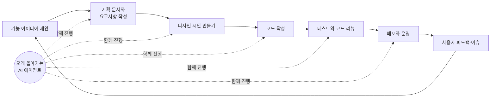

<aside class="ai-knowledge-sidebar">
  
CATEGORIES

  <nav class="ai-cat-tree">

에이전트 오케스트레이션10
<ul><li><a href="https://altjs4510.github.io/ai_news_blog/knowledge/20260705/">2026-07-05openai/codex-plugin-cc — Claude Code에서 Codex를 위임…</a></li><li><a href="https://altjs4510.github.io/ai_news_blog/knowledge/20260701/">2026-07-01Google OKF (Open Knowledge Format) — 벤더 중립 에이전트 …</a></li><li><a href="https://altjs4510.github.io/ai_news_blog/knowledge/20260623/">2026-06-23bytedance/deer-flow — 샌드박스·메모리·서브에이전트·메시지 게이트웨이를…</a></li><li><a href="https://altjs4510.github.io/ai_news_blog/knowledge/20260621/">2026-06-21calesthio/OpenMontage — 12 파이프라인·52 도구·500+ 스킬을 …</a></li><li><a href="https://altjs4510.github.io/ai_news_blog/knowledge/20260611/">2026-06-11The evolution of agentic surfaces: building with…</a></li><li><a href="https://altjs4510.github.io/ai_news_blog/knowledge/20260602/">2026-06-02revfactory/harness — 도메인별 에이전트 팀과 스킬을 자동 설계하는 메타…</a></li><li><a href="https://altjs4510.github.io/ai_news_blog/knowledge/20260529/">2026-05-29Introducing dynamic workflows in Claude Code</a></li><li><a href="https://altjs4510.github.io/ai_news_blog/knowledge/20260520/">2026-05-20New in Claude Managed Agents: self-hosted sandbo…</a></li><li><a href="https://altjs4510.github.io/ai_news_blog/knowledge/20260507/">2026-05-07ruvnet/ruflo — Claude 멀티 에이전트 오케스트레이션 플랫폼</a></li><li><a href="https://altjs4510.github.io/ai_news_blog/knowledge/20260504/">2026-05-04Agents for Everything Else: Codex for Knowledge …</a></li></ul>

MCP &amp; 도구 통합8
<ul><li><a href="https://altjs4510.github.io/ai_news_blog/knowledge/20260618/">2026-06-18DeusData/codebase-memory-mcp — 158개 언어 코드베이스를 밀리…</a></li><li><a href="https://altjs4510.github.io/ai_news_blog/knowledge/20260604/">2026-06-04chopratejas/headroom — Compress tool outputs bef…</a></li><li><a href="https://altjs4510.github.io/ai_news_blog/knowledge/20260603/">2026-06-03How Bad MCP design cost your Agent 5× more token…</a></li><li><a href="https://altjs4510.github.io/ai_news_blog/knowledge/20260526/">2026-05-26colbymchenry/codegraph — Pre-indexed code knowle…</a></li><li><a href="https://altjs4510.github.io/ai_news_blog/knowledge/20260523/">2026-05-23colbymchenry/codegraph — 사전 인덱싱된 코드 지식 그래프 MCP</a></li><li><a href="https://altjs4510.github.io/ai_news_blog/knowledge/20260519/">2026-05-19Anthropic acquires Stainless</a></li><li><a href="https://altjs4510.github.io/ai_news_blog/knowledge/20260517/">2026-05-17I gave my LLM 100,000+ tools — Lazy Discovery &a…</a></li><li><a href="https://altjs4510.github.io/ai_news_blog/knowledge/20260509/">2026-05-09How to connect 100 MCP servers without the conte…</a></li></ul>

코딩 에이전트11
<ul><li><a href="https://altjs4510.github.io/ai_news_blog/knowledge/20260626/">2026-06-26google-labs-code/design.md — 코딩 에이전트에게 디자인 시스템을 …</a></li><li><a href="https://altjs4510.github.io/ai_news_blog/knowledge/20260619/">2026-06-19Claude Code now supports artifacts</a></li><li><a href="https://altjs4510.github.io/ai_news_blog/knowledge/20260530/">2026-05-30Leonxlnx/taste-skill — AI에게 좋은 취향을 부여해 generic s…</a></li><li><a href="https://altjs4510.github.io/ai_news_blog/knowledge/20260528/">2026-05-28Building self-improving tax agents with Codex</a></li><li><a href="https://altjs4510.github.io/ai_news_blog/knowledge/20260524/">2026-05-24colbymchenry/codegraph — Pre-indexed code knowle…</a></li><li><a href="https://altjs4510.github.io/ai_news_blog/knowledge/20260521/">2026-05-21colbymchenry/codegraph — Pre-indexed code knowle…</a></li><li><a href="https://altjs4510.github.io/ai_news_blog/knowledge/20260512/">2026-05-12agentmemory — Persistent memory for AI coding ag…</a></li><li><a href="https://altjs4510.github.io/ai_news_blog/knowledge/20260510/">2026-05-10addyosmani/agent-skills — Production-grade engin…</a></li><li><a href="https://altjs4510.github.io/ai_news_blog/knowledge/20260508/">2026-05-08addyosmani/agent-skills — Production-grade engin…</a></li><li><a href="https://altjs4510.github.io/ai_news_blog/knowledge/20260506/">2026-05-06mksglu/context-mode — AI 코딩 에이전트용 컨텍스트 윈도우 최적화</a></li><li><a href="https://altjs4510.github.io/ai_news_blog/knowledge/20260505/">2026-05-05mattpocock/skills — Skills for Real Engineers (.…</a></li></ul>

모델 &amp; 연구4
<ul><li><a href="https://altjs4510.github.io/ai_news_blog/knowledge/20260620/">2026-06-20zai-org/GLM-5 — From Vibe Coding to Agentic Engi…</a></li><li><a href="https://altjs4510.github.io/ai_news_blog/knowledge/20260617/">2026-06-17Predicting model behavior before release by simu…</a></li><li><a href="https://altjs4510.github.io/ai_news_blog/knowledge/20260516/">2026-05-16STALE — 에이전트가 자기 기억의 유효성을 인지할 수 있는가</a></li><li><a href="https://altjs4510.github.io/ai_news_blog/knowledge/20260513/">2026-05-13Thinking Machines' Native Interaction Models — T…</a></li></ul>

인프라 &amp; 컴퓨트5
<ul><li><a href="https://altjs4510.github.io/ai_news_blog/knowledge/20260630/">2026-06-30Introducing the Claude apps gateway for Amazon B…</a></li><li><a href="https://altjs4510.github.io/ai_news_blog/knowledge/20260610/">2026-06-10Fable 5 just made cost-aware model routing manda…</a></li><li><a href="https://altjs4510.github.io/ai_news_blog/knowledge/20260606/">2026-06-06chopratejas/headroom — Compress tool outputs, lo…</a></li><li><a href="https://altjs4510.github.io/ai_news_blog/knowledge/20260605/">2026-06-05chopratejas/headroom — Compress tool outputs, lo…</a></li><li><a href="https://altjs4510.github.io/ai_news_blog/knowledge/20260522/">2026-05-22Giving Agents Computers — Ivan Burazin, Daytona</a></li></ul>

보안 &amp; 거버넌스10
<ul><li><a href="https://altjs4510.github.io/ai_news_blog/knowledge/20260704/">2026-07-04Cloudflare is about to block AI agents by defaul…</a></li><li><a href="https://altjs4510.github.io/ai_news_blog/knowledge/20260703/">2026-07-03Giving admins more visibility and control over C…</a></li><li><a href="https://altjs4510.github.io/ai_news_blog/knowledge/20260625/">2026-06-25Agent identity in Claude Tag: a new access model…</a></li><li><a href="https://altjs4510.github.io/ai_news_blog/knowledge/20260624/">2026-06-24Agent identity in Claude Tag: a new access model…</a></li><li><a href="https://altjs4510.github.io/ai_news_blog/knowledge/20260614/">2026-06-14NVIDIA/SkillSpector — Security scanner for AI ag…</a></li><li><a href="https://altjs4510.github.io/ai_news_blog/knowledge/20260613/">2026-06-13Fable 5's guardrails got bypassed in 48 hours — …</a></li><li><a href="https://altjs4510.github.io/ai_news_blog/knowledge/20260612/">2026-06-12NVIDIA/SkillSpector — AI 에이전트 스킬용 보안 스캐너</a></li><li><a href="https://altjs4510.github.io/ai_news_blog/knowledge/20260607/">2026-06-07OpenAI Help: Lockdown Mode</a></li><li><a href="https://altjs4510.github.io/ai_news_blog/knowledge/20260531/">2026-05-31How we contain Claude across products</a></li><li><a href="https://altjs4510.github.io/ai_news_blog/knowledge/20260527/">2026-05-27Microsoft Copilot Cowork Exfiltrates Files</a></li></ul>

응용 사례3
<ul><li><a href="https://altjs4510.github.io/ai_news_blog/knowledge/20260609/">2026-06-09Building intelligent apps for Apple platforms wi…</a></li><li><a href="https://altjs4510.github.io/ai_news_blog/knowledge/20260515/">2026-05-15Clawdmeter — Claude Code 사용량을 데스크톱 대시보드로</a></li><li><a href="https://altjs4510.github.io/ai_news_blog/knowledge/20260514/">2026-05-14Introducing Claude for Small Business</a></li></ul>

산업 동향2
<ul><li><a href="https://altjs4510.github.io/ai_news_blog/knowledge/20260702/" class="current">2026-07-02How Cursor deploys AI inside the enterprise (For…</a></li><li><a href="https://altjs4510.github.io/ai_news_blog/knowledge/20260616/">2026-06-16Why AI hasn't replaced software engineers, and w…</a></li></ul>
</nav>
</aside>

<article class="ai-knowledge-article">

<header class="ai-post-hero">
  
<a class="ai-back" href="../">KNOWLEDGE</a> · 2026-07-02 · 오늘의 학습

  <h2 class="ai-post-title">How Cursor deploys AI inside the enterprise (Forward Deployed Engineers)</h2>
</header>

> 원문: [How Cursor deploys AI inside the enterprise (Forward Deployed Engineers)](https://www.latent.space/p/cursor-forward-deployed-engineers)

## 📌 학습 정리

### 1. 한 줄로 말하면

Cursor라는 AI 코딩 도구를 큰 회사에 실제로 뿌리내리게 하려고, 고객사에 직접 들어가 그 회사의 업무 방식에 맞춰 AI를 심어주는 "출장 엔지니어" 팀 이야기예요.

### 2. 왜 이게 만들어졌어요?

원래 소프트웨어 도구는 "설치하면 바로 쓸 수 있게" 만드는 게 이상적이에요. 그런데 AI 코딩 도구는 회사마다 쓰는 시스템, 코드 저장 방식, 개발 절차가 다 달라서 그렇게 간단하지 않아요. 게다가 한 회사 안에서도 열정적인 얼리어답터 10~20%는 알아서 잘 쓰는데, 나머지 대다수는 여전히 예전 방식으로 일해요. 그래서 "도구를 판다"가 아니라 "고객사 안으로 들어가서 업무 자체를 함께 바꾼다"는 접근이 필요해졌고, 이걸 담당하는 게 바로 현장 배치 엔지니어(Forward Deployed Engineer, 줄여서 FDE) 팀이에요.

### 3. 비유로 풀면

이건 마치 새로 들여온 산업용 기계를 공장에 설치해주는 엔지니어와 비슷해요. 기계만 배송해놓고 "알아서 쓰세요" 하면 대부분 창고에서 먼지만 쌓이잖아요. 라인 배치를 어떻게 바꿀지, 어떤 작업자가 어떤 순서로 쓸지, 어디서 병목이 생기는지까지 함께 설계해줘야 실제로 생산성이 올라가요.

또 하나 비유하자면, 컨설턴트와 개발자를 반반씩 섞어놓은 역할이에요. 그래서 결국 FDE는 "AI 도구를 파는 사람"이 아니라 "AI가 실제로 일하는 방식이 되도록 고객사 안에 함께 앉아 만들어주는 사람"이라고 보면 돼요.

### 4. 어떻게 작동하는지 (그림으로)

Cursor가 말하는 "AI 소프트웨어 공장(software factory)" 개념은 이래요. 원래는 기획·디자인·개발·테스트·배포가 각각 다른 팀에서 따로 돌아가는데, 여기에 오래 돌아가는 AI 에이전트를 전 과정에 끼워넣어 이어붙이는 그림이에요.

핵심은 개별 개발자 한 명의 생산성만 올리는 게 아니라, 팀·부서 단위로 같은 방식이 반복되도록 만드는 거예요. 예를 들어 여러 개발팀에 걸쳐 동일한 품질 검사 절차를 수행하는 QA 에이전트를 두는 식이죠. FDE 팀은 이 전체 흐름을 고객사 시스템에 맞춰 설계하고 붙여주는 역할이에요.

### 5. 처음 보는 용어 풀이

- **현장 배치 엔지니어 (Forward Deployed Engineer, FDE)** — 고객사에 직접 들어가서 그 회사의 시스템·도구·업무 흐름에 맞게 제품을 설정하고 심어주는 엔지니어예요. 기성품 지원팀이 아니라, 맞춤 구축까지 함께하는 역할이에요.
- **AI 소프트웨어 공장 (AI software factory)** — 기획부터 배포·유지보수까지 소프트웨어 개발 전 과정을 AI 에이전트가 이어서 도와주도록 만든 체계예요. 각 단계가 따로 노는 걸 하나의 라인처럼 연결한다는 개념이에요.
- **오래 돌아가는 에이전트 (long-running agent)** — 짧게 한 번 답하고 끝나는 챗봇이 아니라, 여러 단계를 걸쳐 오랜 시간 작업을 이어가는 AI 에이전트예요. 예를 들어 기획 문서를 만들고, 코드를 짜고, 테스트까지 하는 흐름을 스스로 이어갈 수 있어요.
- **동기·비동기 에이전트 (synchronous / asynchronous agent)** — 동기는 사용자가 옆에서 지켜보며 함께 진행하는 방식, 비동기는 클라우드에서 혼자 돌아가서 결과만 받아보는 방식이에요. 노트북을 계속 열어두지 않아도 작업이 진행되는 게 비동기의 장점이에요.
- **로컬 AI (local AI)** — 클라우드가 아니라 내 컴퓨터나 회사 서버 안에서 돌아가는 AI예요. 데스크톱 앱이나 명령줄 도구(CLI)로 실행하는 형태가 대표적이에요.
- **얼리어답터 (early adopter)** — 새로운 도구를 남들보다 먼저 적극적으로 써보는 소수 사용자들이에요. 조직 안에서 대개 10~20% 정도인데, 이 사람들만으로는 회사 전체가 바뀌지 않는다는 게 이 인터뷰의 문제의식이에요.
- **챔피언 (champion)** — 고객사 내부에서 "우리 이렇게 바꿔봅시다" 하고 앞장서주는 사람이에요. FDE 입장에서는 이런 내부 우군을 찾는 게 도입 성공의 열쇠라고 얘기해요.

### 6. 한 발 더 들어가고 싶다면

- [소프트웨어 공장(software factories) 개념 소개](https://www.latent.space/p/software-factories) — 이 인터뷰에서 계속 나오는 "AI 소프트웨어 공장"이 어떤 맥락에서 나온 표현인지 배경을 볼 수 있어요.
- [로컬 AI에 대한 논의](https://www.latent.space/p/ahmad-osman-local-ai) — 왜 요즘 회사들이 내 컴퓨터·사내 서버에서 돌아가는 AI에 관심을 가지는지, 오픈소스 모델과 함께 어떤 흐름이 만들어지는지 짚어볼 수 있어요.
- [Pauline Brunet 링크드인](https://www.linkedin.com/in/pauline-brunet/) — 인터뷰 당사자인 Cursor의 FDE 총괄이 어떤 커리어를 밟아왔는지 확인할 수 있어요. FDE라는 역할을 하려면 어떤 경험이 쌓여야 하는지 감을 잡는 데 도움이 돼요.

---

## 📖 원문 전체 번역 (정독용)

> 의역 최소화한 전체 번역입니다. 큰 흐름은 위 정리에서 잡고, 정확한 워딩이 필요할 땐 이 섹션에서 정독하세요.

AIEWF(AI 엔지니어 월드 페어)에 참석한 Cursor의 Forward Deployed Engineering 부문 VP Pauline Brunet.

Forward Deployed Engineering(이하 FDE)은 엔터프라이즈 AI 분야에서 가장 주목받는 역할 중 하나로 빠르게 자리 잡았다. 소프트웨어 엔지니어링, 제품 개발, 고객 구현의 경계 어딘가에 위치한 Forward Deployed Engineer(FDE)들은 조직과 직접 협력하여 AI 역량을 구현하는 일을 담당한다.

Cursor에서 이 역할은 특히 야심 차다. 회사의 VP of Forward Deployed Engineering인 [Pauline Brunet](https://www.linkedin.com/in/pauline-brunet/)은 전체 소프트웨어 개발 수명 주기(software development lifecycle)에 걸쳐 에이전트(agent)를 구현하기 위해 조직과 협력하는 팀을 구축하고 있다.

Brunet은 AI 엔지니어 월드 페어(AI Engineer World's Fair)에서 Latent Space와 진행한 인터뷰를 통해 Cursor의 "AI 소프트웨어 팩토리(AI software factory)" 비전, 개별 열성 사용자를 넘어 에이전트 도입을 확산시키는 과제, 그리고 FDE 업무로 전환하고자 하는 엔지니어가 갖춰야 할 역량에 대해 논의했다.

**Latent Space:** 먼저, Forward Deployed Engineering을 어떻게 정의하시나요?

**Pauline Brunet:** Forward Deployed Engineering은 비즈니스, 제품, 고객에 따라 달라집니다. 애플리케이션이 얼마나 구성 가능한지(configurable)를 고려해야 합니다. 고객이 별도 설정 없이 바로 사용할 수 있는 것인지, 아니면 복잡하고 고도로 구성이 필요한 무언가를 배포하는 것인지를 살펴야 하죠.

또한 고객이 전환 여정의 어느 단계에 있는지도 고려해야 합니다.

저는 Forward Deployed Engineering을 전통적인 방식의, 별도 설정 없이 즉시 사용 가능한 배포를 지원하는 팀으로 보지 않습니다. 고객의 시스템과 툴 내부에 직접 들어가서 현장에서 일하며, 규모 있는 과제를 해결하는 데 도움이 되는 애플리케이션이나 플랫폼을 배포하는 팀이라고 생각합니다.

그러한 배포는 고객의 워크플로우, 프로세스, 시스템, 툴에 맞게 고도로 구성되고 커스터마이징됩니다.

**Latent Space:** Cursor의 고객은 주로 엔지니어들입니다. 그들이 제품을 사용하는 방식에 FDE 역할이 어떻게 적용되나요?

**Brunet:** Cursor는 AI 코딩 플랫폼이자 코딩 어시스턴트입니다. 저희는 AI 보조 코딩(AI-assisted coding), 동기 및 비동기 에이전트, 그리고 궁극적으로 AI 소프트웨어 팩토리라는 개념을 중심으로 고객과 협력합니다.

현재 금융 서비스, 통신, 소프트웨어 개발, 기술, 반도체 등 다양한 산업의 고객과 협력하고 있습니다.

저희는 변혁을 이끄는 리더들, IT 리더들, CTO 조직이 자신들의 운영 전반에 걸쳐 AI 소프트웨어 팩토리를 구축할 수 있도록 돕습니다. 여기에는 소프트웨어를 계획하고 설계하는 방식, 코드를 작성하는 방식, 테스트하고 검토하는 방식, 그리고 애플리케이션을 규모 있게 배포하고 유지하는 방식이 모두 포함됩니다. 즉, 소프트웨어 개발 수명 주기 전체에 집중하는 것입니다.

**Latent Space:** Cursor의 FDE 팀은 규모가 얼마나 됩니까?

**Brunet:** 빠르게 성장하고 있습니다. 12월 말까지 팀을 10배로 늘리는 것이 목표입니다.

**Latent Space:** 현재 FDE 직원들은 주로 엔지니어인가요, 아니면 제품 전문가도 포함되어 있나요?

**Brunet:** 모두 엔지니어입니다. 최소 5년 이상의 경력과 풍부한 고객 대면 경험을 갖춘 소프트웨어 엔지니어를 채용합니다.

이들은 프로덕션 환경에서 코드를 개발하고 출시한 사람들입니다. 시스템을 구축하고 설계했으며, 트레이드오프(trade-off) 결정을 내리고 어떤 시스템이나 기술을 사용해야 하는지 평가할 수 있습니다.

또한 고객 대면 경험도 필요합니다. 저희 팀에는 Spotify, Rippling, Palantir 등의 회사에서 근무했고, 고객을 위한 프로덕션 시스템을 배포한 경험이 있는 사람들이 있습니다.

**Latent Space:** "[소프트웨어 팩토리(software factory)](https://www.latent.space/p/software-factories)"라는 용어를 언급하셨는데, 업계에서 점점 더 자주 등장하고 있는 표현입니다. Cursor에서 이 용어는 무엇을 의미하나요?

**Brunet:** Cursor에게 있어 이는 처음부터 끝까지의 소프트웨어 개발 수명 주기, 즉 코드를 계획하고, 설계하고, 작성하고, 검토하고, 테스트하고, 배포하는 방식 전체를 의미합니다.

오늘날 이 단계들은 종종 서로 다른 팀에 의해 처리됩니다. 디자인 팀, 개발 팀, 그리고 그들과 함께 일하는 프로덕트 매니저가 따로 있을 수 있습니다. 각 그룹은 AI 보조 코딩으로 자신의 업무를 최적화하고 있을지 모르지만, 프로세스는 여전히 사일로(silo)로 분리되어 있습니다.

저희는 전체 수명 주기에 걸쳐 고객을 돕고 싶습니다. "이런 기능을 개발하고 싶다"고 말하면, 장기 실행 에이전트(long-running agent)가 모든 단계에서 함께 작업할 수 있어야 합니다. 여기에는 계획 및 제품 요구사항 문서(PRD) 작성, 기능이 어떻게 보일지 데모 제작, 코드 작성 및 테스트, 프로덕션 배포, 유지 관리가 포함될 수 있습니다.

이슈와 제품 피드백 역시 동일한 수명 주기로 다시 피드백되어야 합니다. 저희에게 소프트웨어 팩토리란, 그 전체 프로세스 전반에 걸쳐 사람들을 돕는 장기 실행 에이전트를 의미합니다.

**Latent Space:** 그렇다면 단순한 에이전트 오케스트레이션(agent orchestration)보다 더 넓은 개념이군요?

**Brunet:** 맞습니다. 정확히 그렇습니다.

**Latent Space:** 기업들이 에이전트 기술을 구현하려 할 때 어떤 문제에 직면하고 있나요?

**Brunet:** 한 가지 과제는 도입이 아직 얼리 어답터(early adopter)에 집중되어 있다는 점입니다.

조직 내에 열성적인 얼리 어답터가 10~20% 정도 있을 수 있습니다. 그들은 자신의 업무에 로컬 에이전트와 클라우드 에이전트를 활용해 훌륭한 성과를 내왔고, 높은 생산성을 갖게 되었습니다.

다음 단계에서 부족한 것은 팀, 프로세스, 워크플로우 전반에 걸쳐 장기 실행 에이전트를 활용하는 능력입니다.

이를 위해서는 조직 상위 리더십의 더 많은 지원이 필요합니다. 리더십이 "이것이 우리의 우선순위이며, 이 프로세스를 이런 방식으로 자동화하거나 변경하고자 한다"고 말해야 합니다.

따라서 FDE 팀에게는 조직 내에서 적절한 챔피언(champion)을 찾는 것이 중요합니다. 비즈니스를 의미 있게 변화시키고자 하고, 저희 및 내부 팀과 협력하여 업무 방식을 혁신하려는 사람들을 찾아야 합니다.

**Latent Space:** [로컬 AI(Local AI)](https://www.latent.space/p/ahmad-osman-local-ai)가 오픈소스 모델의 증가하는 가용성에 힘입어 모멘텀을 얻고 있는 것 같습니다. 고객과 함께 로컬 AI 구현 작업을 더 많이 하고 계신가요?

**Brunet:** 저희에게는 데스크톱 애플리케이션이나 CLI를 통해 실행하는 로컬 에이전트가 있으며, 그 경험은 대부분 셀프서비스(self-service)입니다. 특히 Cursor 사용자 기반 전반에 걸쳐 사람들이 이 기술을 놀라운 속도로 채택했습니다.

또한 노트북을 반쯤 열어둔 채로 작업할 필요 없이 작업을 실행할 수 있다는 점에 흥미를 느낀 사람들이 클라우드 에이전트를 채택하는 것도 목격하고 있습니다. 에이전트가 이제는 이전에 로컬에서 실행되던 작업들을 클라우드에서 처리할 수 있게 되었습니다.

흥미로워지는 지점은 이것이 한 사람의 업무를 돕는 에이전트를 넘어서는 순간입니다. 다음 질문은 에이전트가 어떻게 조직의 기능, 팀, 또는 전체 조직에 걸쳐 작동하여 프로세스를 일관되게 자동화할 수 있느냐는 것입니다. 예를 들어, QA 에이전트가 여러 개발 팀에 걸쳐 동일한 프로세스를 적용하는 것이 가능합니다.

그러한 종류의 유스케이스(use case)에 대한 질문을 고객들로부터 많이 받고 있습니다.

**Latent Space:** 이런 배포에서 얻은 교훈들이 Cursor의 핵심 제품으로 다시 피드백되나요?

**Brunet:** 그렇습니다. Forward Deployed Engineering 팀은 고객의 유스케이스를 가지고 고객과 매우 긴밀히 협력하기 때문에, 자연스럽게 제품 및 엔지니어링 팀이 고객이 다음에 무엇을 구축하고 싶어 하는지 파악할 수 있는 좋은 채널이 됩니다.

저희는 그 팀들과 긴밀히 협력하며 Cursor의 제품 로드맵을 형성하는 데 중요한 역할을 합니다.

**Latent Space:** 에이전트가 더욱 자율적으로 발전함에 따라 FDE 역할이 어떻게 진화할 것으로 예상하시나요?

**Brunet:** 역할이 크게 달라질 것이라고 생각합니다. 저는 항상, 6개월 전에 했던 일과 똑같은 일을 하고 있다면 뭔가 잘못하고 있는 것이라고 말합니다.

지금은 사람들이 여전히 해결할 수 있는 유스케이스에 대한 영감을 찾고 있기 때문에, 저희는 새로운 가능성을 제시하고자 합니다.

예를 들어 소프트웨어 개발에서, 디자이너와 프로덕트 매니저가 개발자 및 테스팅 팀과 함께 Cursor 안에서 원활하게 협력하는 방법을 보여줄 수 있습니다.

또한 콜센터나 티케팅(ticketing) 프로세스를 처음부터 끝까지 처리하기 위해 장기 실행 에이전트를 활용하는 것을 고려해본 적 있는지 기업에게 물어볼 수도 있습니다.

헬스케어, 생명과학, 공공 부문, 리테일, 소비재(consumer packaged goods) 등 다양한 산업에 걸쳐 작업하면서, 마케팅, 영업, 공급망 운영 전반에 걸쳐 유스케이스를 계속 발굴해 나갈 것입니다. FDE 역할은 그 가능성들과 함께 진화할 것입니다.

**Latent Space:** 이 컨퍼런스에는 약 7,000명의 AI 엔지니어가 참석하고 있습니다. Forward Deployed Engineering으로 전환하고자 하는 개발자들에게 어떤 조언을 해주시겠습니까?

**Brunet:** 오늘만 해도 이 대화를 다섯, 여섯 번은 한 것 같습니다. 저희는 소프트웨어 엔지니어링 경험을 갖춘 빌더(builder)를 찾고 있습니다. 즉, 문제를 발견하고 처음부터 끝까지 프로덕션 수준의 애플리케이션이나 시스템을 구축한 사람들입니다.

직접 설계하고, 개발하고, 테스트하고, 실제 사용자를 대상으로 프로덕션에 배포해본 경험이 있어야 합니다.

제가 권하고 싶은 것은, 여러분의 조직 내에서 그런 종류의 프로젝트를 찾아 처음부터 끝까지 오너십(ownership)을 가지고 이끌어 보라는 것입니다. 각 설계 결정을 왜 내렸는지 스스로 이해해야 합니다.

데이터베이스를 어떻게 선택했나요? 다양한 서비스를 어떻게 선정했나요? 시스템을 그런 방식으로 설계한 이유는 무엇인가요? 트레이드오프는 무엇이었나요?

또한 측정 가능한 투자 수익(ROI)을 이해해야 합니다. 전통적인 비즈니스 측면에서도 그렇고, 내부 고객을 위해 창출하는 가치를 보여주는 평가(evaluation) 측면에서도 마찬가지입니다.

Forward Deployed Engineering에 입문하고 싶다면, 이런 종류의 프로젝트에 익숙해지고, 실행 경험을 쌓으며, 자신이 내린 결정을 어떻게 설명할지 배우세요.

</article>

<!-- ai-related-links -->
<aside class="ai-related-links">
  
관련 학습

  <ul><li><a href="https://altjs4510.github.io/ai_news_blog/knowledge/20260514/">2026-05-14Introducing Claude for Small Business</a></li><li><a href="https://altjs4510.github.io/ai_news_blog/knowledge/20260611/">2026-06-11The evolution of agentic surfaces: building with…</a></li></ul>
</aside>
<!-- /ai-related-links -->
