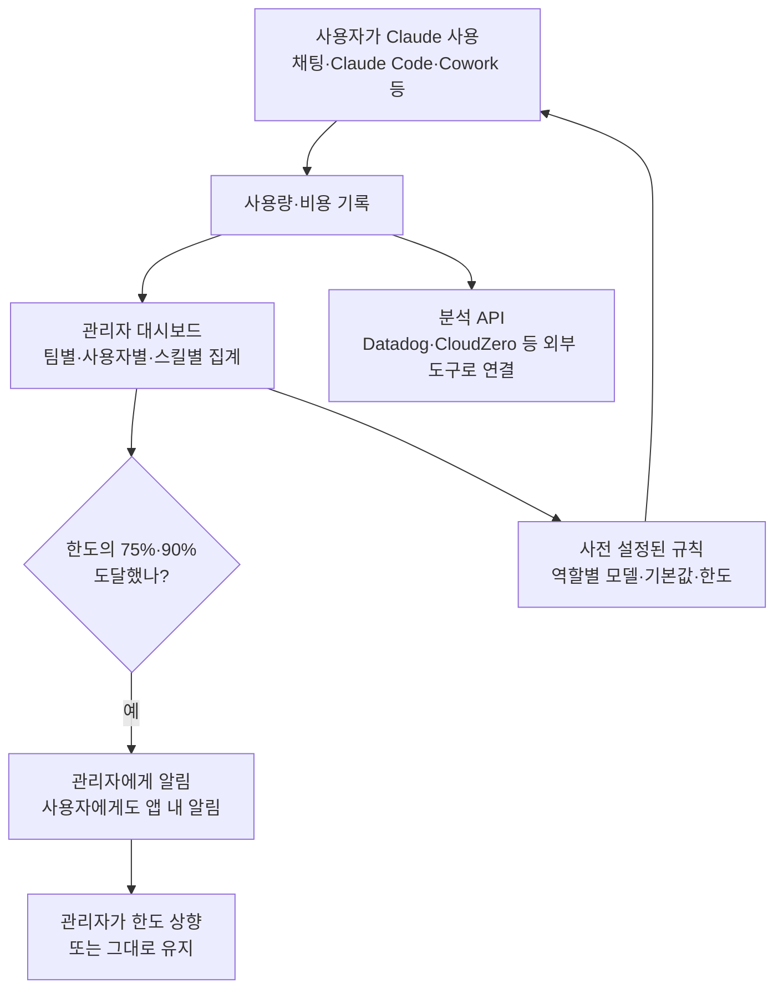

<aside class="ai-knowledge-sidebar">
  
CATEGORIES

  <nav class="ai-cat-tree">

에이전트 오케스트레이션7
<ul><li><a href="https://altjs4510.github.io/ai_news_blog/knowledge/20260709/">2026-07-09mvanhorn/last30days-skill — Reddit·X·YouTube·HN·…</a></li><li><a href="https://altjs4510.github.io/ai_news_blog/knowledge/20260707/">2026-07-07AI Hero Skills Catalog — 실무 엔지니어를 위한 재사용 가능한 판단 …</a></li><li><a href="https://altjs4510.github.io/ai_news_blog/knowledge/20260623/">2026-06-23bytedance/deer-flow — 샌드박스·메모리·서브에이전트·메시지 게이트웨이를…</a></li><li><a href="https://altjs4510.github.io/ai_news_blog/knowledge/20260611/">2026-06-11The evolution of agentic surfaces: building with…</a></li><li><a href="https://altjs4510.github.io/ai_news_blog/knowledge/20260602/">2026-06-02revfactory/harness — 도메인별 에이전트 팀과 스킬을 자동 설계하는 메타…</a></li><li><a href="https://altjs4510.github.io/ai_news_blog/knowledge/20260529/">2026-05-29Introducing dynamic workflows in Claude Code</a></li><li><a href="https://altjs4510.github.io/ai_news_blog/knowledge/20260507/">2026-05-07ruvnet/ruflo — Claude 멀티 에이전트 오케스트레이션 플랫폼</a></li></ul>

MCP &amp; 도구 통합20
<ul><li><a href="https://altjs4510.github.io/ai_news_blog/knowledge/20260802/">2026-08-02Stateless MCP has recaptured my interest (and in…</a></li><li><a href="https://altjs4510.github.io/ai_news_blog/knowledge/20260801/">2026-08-01different-ai/openwork — Claude Cowork의 오픈소스 대체 에…</a></li><li><a href="https://altjs4510.github.io/ai_news_blog/knowledge/20260731/">2026-07-31different-ai/openwork — Claude Cowork의 오픈소스 대안(o…</a></li><li><a href="https://altjs4510.github.io/ai_news_blog/knowledge/20260729/">2026-07-29Bringing MCP 2026-07-28 to Claude</a></li><li><a href="https://altjs4510.github.io/ai_news_blog/knowledge/20260724/">2026-07-24diegosouzapw/OmniRoute — 단일 엔드포인트로 278+ 프로바이더·50…</a></li><li><a href="https://altjs4510.github.io/ai_news_blog/knowledge/20260723/">2026-07-23diegosouzapw/OmniRoute — 268+ 프로바이더를 단일 엔드포인트로 묶…</a></li><li><a href="https://altjs4510.github.io/ai_news_blog/knowledge/20260721/">2026-07-21tirth8205/code-review-graph — 로컬 우선 코드 인텔리전스 그래프…</a></li><li><a href="https://altjs4510.github.io/ai_news_blog/knowledge/20260719/">2026-07-19tirth8205/code-review-graph — 로컬 우선 코드 인텔리전스 그래프…</a></li><li><a href="https://altjs4510.github.io/ai_news_blog/knowledge/20260718/">2026-07-18tirth8205/code-review-graph — MCP·CLI용 로컬 코드 인텔리…</a></li><li><a href="https://altjs4510.github.io/ai_news_blog/knowledge/20260708/">2026-07-08Expanding Managed Agents in Gemini API: backgrou…</a></li><li><a href="https://altjs4510.github.io/ai_news_blog/knowledge/20260701/">2026-07-01Google OKF (Open Knowledge Format) — 벤더 중립 에이전트 …</a></li><li><a href="https://altjs4510.github.io/ai_news_blog/knowledge/20260618/">2026-06-18DeusData/codebase-memory-mcp — 158개 언어 코드베이스를 밀리…</a></li><li><a href="https://altjs4510.github.io/ai_news_blog/knowledge/20260606/">2026-06-06chopratejas/headroom — Compress tool outputs, lo…</a></li><li><a href="https://altjs4510.github.io/ai_news_blog/knowledge/20260605/">2026-06-05chopratejas/headroom — Compress tool outputs, lo…</a></li><li><a href="https://altjs4510.github.io/ai_news_blog/knowledge/20260604/">2026-06-04chopratejas/headroom — Compress tool outputs bef…</a></li><li><a href="https://altjs4510.github.io/ai_news_blog/knowledge/20260603/">2026-06-03How Bad MCP design cost your Agent 5× more token…</a></li><li><a href="https://altjs4510.github.io/ai_news_blog/knowledge/20260523/">2026-05-23colbymchenry/codegraph — 사전 인덱싱된 코드 지식 그래프 MCP</a></li><li><a href="https://altjs4510.github.io/ai_news_blog/knowledge/20260517/">2026-05-17I gave my LLM 100,000+ tools — Lazy Discovery &a…</a></li><li><a href="https://altjs4510.github.io/ai_news_blog/knowledge/20260509/">2026-05-09How to connect 100 MCP servers without the conte…</a></li><li><a href="https://altjs4510.github.io/ai_news_blog/knowledge/20260506/">2026-05-06mksglu/context-mode — AI 코딩 에이전트용 컨텍스트 윈도우 최적화</a></li></ul>

코딩 에이전트17
<ul><li><a href="https://altjs4510.github.io/ai_news_blog/knowledge/20260804/">2026-08-04esengine/DeepSeek-Reasonix — prefix-cache 안정성을 축…</a></li><li><a href="https://altjs4510.github.io/ai_news_blog/knowledge/20260728/">2026-07-28alibaba/open-code-review — 결정론적 파이프라인 + LLM 에이전트…</a></li><li><a href="https://altjs4510.github.io/ai_news_blog/knowledge/20260725/">2026-07-25The new rules of context engineering for Claude …</a></li><li><a href="https://altjs4510.github.io/ai_news_blog/knowledge/20260722/">2026-07-22tirth8205/code-review-graph — MCP·CLI용 로컬 우선 코드 …</a></li><li><a href="https://altjs4510.github.io/ai_news_blog/knowledge/20260714/">2026-07-14Graphify-Labs/graphify — 코드베이스를 질의 가능한 지식 그래프로 만…</a></li><li><a href="https://altjs4510.github.io/ai_news_blog/knowledge/20260705/">2026-07-05openai/codex-plugin-cc — Claude Code에서 Codex를 위임…</a></li><li><a href="https://altjs4510.github.io/ai_news_blog/knowledge/20260626/">2026-06-26google-labs-code/design.md — 코딩 에이전트에게 디자인 시스템을 …</a></li><li><a href="https://altjs4510.github.io/ai_news_blog/knowledge/20260619/">2026-06-19Claude Code now supports artifacts</a></li><li><a href="https://altjs4510.github.io/ai_news_blog/knowledge/20260530/">2026-05-30Leonxlnx/taste-skill — AI에게 좋은 취향을 부여해 generic s…</a></li><li><a href="https://altjs4510.github.io/ai_news_blog/knowledge/20260528/">2026-05-28Building self-improving tax agents with Codex</a></li><li><a href="https://altjs4510.github.io/ai_news_blog/knowledge/20260526/">2026-05-26colbymchenry/codegraph — Pre-indexed code knowle…</a></li><li><a href="https://altjs4510.github.io/ai_news_blog/knowledge/20260524/">2026-05-24colbymchenry/codegraph — Pre-indexed code knowle…</a></li><li><a href="https://altjs4510.github.io/ai_news_blog/knowledge/20260521/">2026-05-21colbymchenry/codegraph — Pre-indexed code knowle…</a></li><li><a href="https://altjs4510.github.io/ai_news_blog/knowledge/20260512/">2026-05-12agentmemory — Persistent memory for AI coding ag…</a></li><li><a href="https://altjs4510.github.io/ai_news_blog/knowledge/20260510/">2026-05-10addyosmani/agent-skills — Production-grade engin…</a></li><li><a href="https://altjs4510.github.io/ai_news_blog/knowledge/20260508/">2026-05-08addyosmani/agent-skills — Production-grade engin…</a></li><li><a href="https://altjs4510.github.io/ai_news_blog/knowledge/20260505/">2026-05-05mattpocock/skills — Skills for Real Engineers (.…</a></li></ul>

모델 &amp; 연구6
<ul><li><a href="https://altjs4510.github.io/ai_news_blog/knowledge/20260716-proprag/">2026-07-16PropRAG — 프로포지션 경로 위 beam search로 멀티홉 검색 안내</a></li><li><a href="https://altjs4510.github.io/ai_news_blog/knowledge/20260620/">2026-06-20zai-org/GLM-5 — From Vibe Coding to Agentic Engi…</a></li><li><a href="https://altjs4510.github.io/ai_news_blog/knowledge/20260617/">2026-06-17Predicting model behavior before release by simu…</a></li><li><a href="https://altjs4510.github.io/ai_news_blog/knowledge/20260610/">2026-06-10Fable 5 just made cost-aware model routing manda…</a></li><li><a href="https://altjs4510.github.io/ai_news_blog/knowledge/20260516/">2026-05-16STALE — 에이전트가 자기 기억의 유효성을 인지할 수 있는가</a></li><li><a href="https://altjs4510.github.io/ai_news_blog/knowledge/20260513/">2026-05-13Thinking Machines' Native Interaction Models — T…</a></li></ul>

인프라 &amp; 컴퓨트3
<ul><li><a href="https://altjs4510.github.io/ai_news_blog/knowledge/20260630/">2026-06-30Introducing the Claude apps gateway for Amazon B…</a></li><li><a href="https://altjs4510.github.io/ai_news_blog/knowledge/20260522/">2026-05-22Giving Agents Computers — Ivan Burazin, Daytona</a></li><li><a href="https://altjs4510.github.io/ai_news_blog/knowledge/20260520/">2026-05-20New in Claude Managed Agents: self-hosted sandbo…</a></li></ul>

보안 &amp; 거버넌스14
<ul><li><a href="https://altjs4510.github.io/ai_news_blog/knowledge/20260730/">2026-07-30Anatomy of a Frontier Lab Agent Intrusion: A Tec…</a></li><li><a href="https://altjs4510.github.io/ai_news_blog/knowledge/20260716/">2026-07-16Dicklesworthstone/destructive_command_guard — 에이…</a></li><li><a href="https://altjs4510.github.io/ai_news_blog/knowledge/20260715/">2026-07-15Dicklesworthstone/destructive_command_guard — 에이…</a></li><li><a href="https://altjs4510.github.io/ai_news_blog/knowledge/20260710/">2026-07-1070개 MCP 서버 strace 런타임 감사 — 부팅 시 아웃바운드 호출 서버 적발</a></li><li><a href="https://altjs4510.github.io/ai_news_blog/knowledge/20260704/">2026-07-04Cloudflare is about to block AI agents by defaul…</a></li><li><a href="https://altjs4510.github.io/ai_news_blog/knowledge/20260703/" class="current">2026-07-03Giving admins more visibility and control over C…</a></li><li><a href="https://altjs4510.github.io/ai_news_blog/knowledge/20260625/">2026-06-25Agent identity in Claude Tag: a new access model…</a></li><li><a href="https://altjs4510.github.io/ai_news_blog/knowledge/20260624/">2026-06-24Agent identity in Claude Tag: a new access model…</a></li><li><a href="https://altjs4510.github.io/ai_news_blog/knowledge/20260614/">2026-06-14NVIDIA/SkillSpector — Security scanner for AI ag…</a></li><li><a href="https://altjs4510.github.io/ai_news_blog/knowledge/20260613/">2026-06-13Fable 5's guardrails got bypassed in 48 hours — …</a></li><li><a href="https://altjs4510.github.io/ai_news_blog/knowledge/20260612/">2026-06-12NVIDIA/SkillSpector — AI 에이전트 스킬용 보안 스캐너</a></li><li><a href="https://altjs4510.github.io/ai_news_blog/knowledge/20260607/">2026-06-07OpenAI Help: Lockdown Mode</a></li><li><a href="https://altjs4510.github.io/ai_news_blog/knowledge/20260531/">2026-05-31How we contain Claude across products</a></li><li><a href="https://altjs4510.github.io/ai_news_blog/knowledge/20260527/">2026-05-27Microsoft Copilot Cowork Exfiltrates Files</a></li></ul>

응용 사례7
<ul><li><a href="https://altjs4510.github.io/ai_news_blog/knowledge/20260805/">2026-08-05TencentCloud/TencentDB-Agent-Memory — 대화·문서·코드를 …</a></li><li><a href="https://altjs4510.github.io/ai_news_blog/knowledge/20260726/">2026-07-26citrolabs/ego-lite — 로그인된 브라우저 상태를 AI 에이전트와 공유하는…</a></li><li><a href="https://altjs4510.github.io/ai_news_blog/knowledge/20260717/">2026-07-17After a year building agent memory, 'save everyt…</a></li><li><a href="https://altjs4510.github.io/ai_news_blog/knowledge/20260712/">2026-07-12Do Automated Evals Work?</a></li><li><a href="https://altjs4510.github.io/ai_news_blog/knowledge/20260621/">2026-06-21calesthio/OpenMontage — 12 파이프라인·52 도구·500+ 스킬을 …</a></li><li><a href="https://altjs4510.github.io/ai_news_blog/knowledge/20260609/">2026-06-09Building intelligent apps for Apple platforms wi…</a></li><li><a href="https://altjs4510.github.io/ai_news_blog/knowledge/20260514/">2026-05-14Introducing Claude for Small Business</a></li></ul>

산업 동향6
<ul><li><a href="https://altjs4510.github.io/ai_news_blog/knowledge/20260711/">2026-07-11OpenAI says GPT 5.6 is the 'preferred model' for…</a></li><li><a href="https://altjs4510.github.io/ai_news_blog/knowledge/20260702/">2026-07-02How Cursor deploys AI inside the enterprise (For…</a></li><li><a href="https://altjs4510.github.io/ai_news_blog/knowledge/20260616/">2026-06-16Why AI hasn't replaced software engineers, and w…</a></li><li><a href="https://altjs4510.github.io/ai_news_blog/knowledge/20260519/">2026-05-19Anthropic acquires Stainless</a></li><li><a href="https://altjs4510.github.io/ai_news_blog/knowledge/20260515/">2026-05-15Clawdmeter — Claude Code 사용량을 데스크톱 대시보드로</a></li><li><a href="https://altjs4510.github.io/ai_news_blog/knowledge/20260504/">2026-05-04Agents for Everything Else: Codex for Knowledge …</a></li></ul>
</nav>
</aside>

<article class="ai-knowledge-article">

<header class="ai-post-hero">
  
<a class="ai-back" href="../">KNOWLEDGE</a> · 2026-07-03 · 오늘의 학습

  <h2 class="ai-post-title">Giving admins more visibility and control over Claude spend</h2>
</header>

> 원문: [Giving admins more visibility and control over Claude spend](https://claude.com/blog/giving-admins-more-visibility-and-control-over-claude-usage-and-spend)

## 📌 학습 정리

### 1. 한 줄로 말하면

회사에서 Claude를 여러 팀이 쓸 때, 관리자가 "누가 얼마나·어디에 얼마를 썼는지" 한눈에 보고, 팀별로 한도와 알림을 걸 수 있게 해주는 관리 화면이 열렸다는 이야기입니다.

### 2. 왜 이게 만들어졌어요?

원래 챗봇 도구는 "메시지 몇 번 주고받았나" 정도만 봐도 대충 감이 왔는데, 요즘 Claude는 스스로 여러 단계 작업을 수행하는 **자율 작업(agentic work)** 을 하다 보니 사용 패턴과 비용 구조가 훨씬 복잡해졌어요. 어떤 팀은 문서 몇 개 편집하는 데 그치지만, 다른 팀은 코드를 계속 돌리고 외부 도구까지 연결해서 비용이 크게 튀기도 하죠. 이러다 보니 조직 관리자 입장에서는 "월말 청구서 보고 놀라는" 상황이 잦아졌고, 또 "특정 팀이 굳이 가장 비싼 모델을 기본으로 써야 할까?" 같은 관리상의 결정도 필요해졌습니다. 그래서 관리자에게 사용량을 세세히 보여주고, 팀·역할별로 어떤 모델을 쓸지, 얼마까지 쓸지 미리 정해둘 수 있는 도구가 필요했던 겁니다.

### 3. 비유로 풀면

이건 마치 회사 법인카드를 팀장이 한 장씩 나눠주고, 실시간으로 "누가 어디서 얼마 긁었는지" 관리자 앱에서 확인하는 것과 비슷해요. 게다가 "이번 달 한도의 75%를 썼어요" 같은 알림이 미리 오고, 카드가 정지되기 전에 한도를 올려달라고 카드사에 요청할 수도 있죠.

또 하나 비유하자면, 전기 요금 스마트미터 같기도 합니다. 방마다 어느 기기가 얼마를 먹는지 실시간으로 보이니까, "거실 에어컨을 좀 약하게 틀자" 같은 결정을 월말이 아니라 지금 당장 할 수 있어요.

그래서 결국, "월말에 놀라는" 방식이 아니라 "쓰는 중에 계속 조절하는" 방식으로 관리 결이 바뀌는 겁니다.

### 4. 어떻게 작동하는지 (그림으로)

흐름을 풀어 설명하면 이렇습니다. 사용자가 Claude로 작업을 하면 그 사용량과 비용이 기록되고, 관리자는 대시보드에서 팀·사용자·기능별로 쪼개서 볼 수 있어요. 한도의 75%·90%에 다다르면 알림이 자동으로 가서, 작업이 도중에 멈추기 전에 한도를 조정할 시간을 벌어줍니다. 그리고 관리자가 미리 정해둔 규칙(예: 어떤 팀은 어떤 모델까지 쓸 수 있음)이 다시 사용자 쪽으로 반영되는 구조입니다.

### 5. 처음 보는 용어 풀이

- **관리자 (admins)** — 조직에서 Claude 사용을 관리하는 담당자예요. 누가 어떤 모델을 쓸 수 있는지, 한도는 얼마인지 정하는 사람입니다.

- **분석 대시보드 (analytics dashboard)** — 사용량과 비용을 그래프·표로 보여주는 관리 화면이에요. 팀별·사용자별로 뭘 얼마나 썼는지, 어떤 스킬이나 연결기가 쓰였는지 나란히 보여줍니다.

- **모델 기본값·권한 (model defaults and entitlements)** — 새 대화를 시작할 때 어떤 Claude 모델(예: Opus, Sonnet, Haiku)로 시작할지 미리 정해두는 설정이에요. 또 어떤 팀·역할은 어떤 모델까지 쓸 수 있는지도 제한할 수 있어요. 일상 업무가 굳이 가장 비싼 모델로 굴러가지 않게 하는 장치입니다.

- **지출 한도 알림 (spend-threshold alerts)** — 조직이 정한 지출 상한선의 75%, 90%에 다다르면 관리자에게 자동으로 보내지는 경고예요. 사용자에게도 75%·95%에 앱 안에서 알림이 갑니다. "쓰다가 갑자기 막히는" 상황을 피하는 안전장치예요.

- **분석 API (Analytics API)** — 사용량·비용 데이터를 프로그램으로 꺼내갈 수 있는 창구예요. 재무팀이나 IT팀이 이미 쓰는 클라우드 비용 관리 도구(예: Datadog Cloud Cost Management, CloudZero)에 Claude 사용 데이터를 합쳐서 볼 수 있게 해줍니다.

- **SCIM 그룹 (SCIM groups)** — 회사 IT 시스템에서 이미 관리하고 있는 사용자 그룹 정보예요. "마케팅팀", "개발팀" 같은 조직도를 Claude 관리 화면에서도 그대로 활용할 수 있게 해주는 표준이라고 생각하면 돼요.

- **스킬 (Skills)과 연결기 (Connectors)** — 스킬은 Claude가 특정 작업을 잘 하도록 준비된 기능 묶음이고, 연결기는 외부 서비스(예: 사내 문서 저장소)와 Claude를 이어주는 통로예요. 이번 업데이트에서는 어떤 스킬이 반복적으로 쓰이는지도 보여준다는 게 포인트입니다.

- **분석 챗 (Analytics chat)** — 대시보드를 클릭해서 뒤지는 대신, "이번 달에 사용량이 두 배가 된 팀은 어디야?" 같은 질문을 평범한 말로 던지면 Claude가 그래프로 답해주는 기능이에요.

### 6. 한 발 더 들어가고 싶다면

- [팀·엔터프라이즈 요금제의 사용량 분석 보기](https://support.claude.com/en/articles/12883420-view-usage-analytics-for-team-and-enterprise-plans) — 대시보드에서 실제로 어떤 지표를 볼 수 있는지 확인할 수 있어요.
- [분석 챗으로 사용량 물어보기](https://support.claude.com/en/articles/14729354-use-analytics-chat-to-ask-claude-about-usage) — 자연어 질문으로 사용량을 파악하는 방식이 어떻게 생겼는지 알 수 있어요.
- [분석 API 문서](https://platform.claude.com/docs/en/manage-claude/analytics-api) — 사용량·비용 데이터를 외부 도구로 가져올 때 참고할 개발자 문서예요.
- [조직의 모델 접근 관리](https://support.claude.com/en/articles/15694740-manage-model-access-for-your-organization) — 역할·팀별로 어떤 Claude 모델을 쓸 수 있게 할지 설정하는 방법을 알 수 있어요.
- [지출 한도 API 예시 워크플로](https://platform.claude.com/docs/en/manage-claude/spend-limits-api#example-workflows) — 한도 상향 요청 처리, 한도 근접 사용자 식별 같은 관리 작업을 스크립트로 자동화하는 예를 볼 수 있어요.
- [엔터프라이즈 분석 API 시작하기](https://support.claude.com/en/articles/13694757-get-started-with-the-claude-enterprise-analytics-api) — 관리자로 처음 설정을 시작할 때 어디부터 손대야 할지 안내해줘요.

---

## 📖 원문 전체 번역 (정독용)

> 의역 최소화한 전체 번역입니다. 큰 흐름은 위 정리에서 잡고, 정확한 워딩이 필요할 땐 이 섹션에서 정독하세요.

# 관리자에게 Claude 지출에 대한 더 높은 가시성과 통제권 제공

Claude Enterprise를 위한 새로운 분석 기능과 비용 통제 기능이 출시됩니다.

- **카테고리:** 제품 발표 (Product announcements)
- **제품:** Claude Enterprise
- **날짜:** 2026년 7월 2일
- **읽기 시간:** 5분

---

저희는 Claude Enterprise를 위한 더욱 풍부한 관리자 분석, 모델 수준의 권한 관리, 그리고 지출 알림 기능을 새롭게 선보입니다. Claude가 조직 전반에 걸쳐 점점 더 어렵고 복잡한 에이전트 작업을 수행하면서, 사용량 및 비용 패턴이 일반적인 채팅 도구와는 다른 양상을 보이고 있습니다. 이번 통제 기능은 관리자에게 Claude의 사용 방식을 이해할 수 있는 가시성과 비용을 관리할 수 있는 도구를 제공합니다.

오늘 추가되는 기능들은 Anthropic이 이미 제공하고 있는 기존 통제 기능들을 기반으로 구축됩니다: 모든 단계의 지출 한도, 접근 및 모델 라우팅, 내보내기 기능과 Analytics API를 갖춘 사용량 분석 대시보드, 그리고 노력 수준 통제(effort controls). 더욱 풍부해진 분석 기능과 보다 세분화된 비용 통제 기능은, 저희가 수개월에 걸쳐 구축해온 통제 체계에 새롭게 추가된 최신 요소입니다.

---

## 도입 현황 및 비용 추적

관리자용 [분석 대시보드](https://support.claude.com/en/articles/12883420-view-usage-analytics-for-team-and-enterprise-plans)는 이제 그룹별 및 사용자별 사용량과 비용을 표시하며, 생성된 아티팩트(artifacts), 편집된 파일, 사용된 스킬(skills) 및 커넥터(connectors) 등의 결과물이 해당 비용과 함께 직접 표시됩니다. 관리자는 IT 팀이 이미 관리하고 있는 SCIM 그룹을 기준으로 필터링할 수 있어, 분류 체계가 기존 조직도를 그대로 따릅니다.

Claude Code에는 관리자 콘솔 내 가치 및 사용량에 초점을 맞춘 두 개의 새로운 탭이 추가되어 더욱 풍부한 인사이트를 제공합니다. 사용량(Usage) 탭은 조직 전반의 활성 개발자 수, 세션 수, 상위 명령어를 표시하며 매일 업데이트됩니다. 가치(Value) 탭은 사용량 및 비용 데이터를 요약하여 관리자가 Claude Code의 가치를 한눈에 파악할 수 있도록 하며, 생산성 향상 추정치, 커밋당 비용, 연간 가치를 산출합니다. 모든 계산식은 해당 탭에서 확인할 수 있으며 입력값을 조정할 수 있습니다.

[Analytics chat](https://support.claude.com/en/articles/14729354-use-analytics-chat-to-ask-claude-about-usage)은 이제 훨씬 더 광범위한 질문에 답변하고, 더 깊이 탐색할 수 있는 풍부한 아티팩트를 생성할 수 있습니다. 관리자는 일상적인 언어로 질문을 할 수 있습니다 — "이번 달 Claude 사용량이 두 배로 늘어난 팀은 어디인가요?" 또는 "어디서 좌석당 가장 높은 가치를 얻고 있나요?" — 그러면 Claude는 이해관계자들과 공유하고 내보낼 수 있는 차트를 반환합니다.

사용량 및 비용 데이터는 [Analytics API](https://platform.claude.com/docs/en/manage-claude/analytics-api)를 통해 프로그래밍 방식으로 이용 가능하므로, 재무 및 IT 부서는 Claude 사용량 및 비용 데이터를 Datadog Cloud Cost Management, CloudZero와 같이 이미 사용 중인 도구로 가져와 나머지 클라우드 및 AI 지출과 함께 확인할 수 있습니다. 결과는 날짜 범위, 팀, 제품 또는 모델별로 필터링할 수 있습니다. 스킬은 자체 사용량과 비용을 보고하며, 새로운 엔드포인트는 플러그인 도입 현황과 아티팩트 생성을 추적합니다.

관리자는 개별 사용자에게까지 사용량 가시성을 확장할 수 있습니다 — 비용, 제품 및 모델 세부 내역, 지출 한도 대비 진행 상황을 포함하여 — 누구도 예상치 못한 사용 중단을 맞닥뜨리지 않도록 합니다. 또한 사용자는 자신의 사용량 추세를 시간 흐름에 따라 직접 확인할 수 있으며, 여기에는 가장 많이 이용하는 제품, 모델, 스킬과 그 활동이 지출로 어떻게 누적되는지도 포함됩니다.

---

## 지출 관리를 위한 통제 기능

[모델 기본값 및 권한 관리(Model defaults and entitlements)](https://support.claude.com/en/articles/15694740-manage-model-access-for-your-organization)를 통해 관리자는 채팅, Cowork, Claude Code 전반에서 새 대화가 시작될 때 사용할 Claude 모델을 설정할 수 있어, 일상적인 작업이 반드시 가장 비싼 옵션으로 기본 설정되지 않도록 합니다. 관리자는 특정 역할 또는 조직 전체에서 사용 가능한 모델을 제어할 수 있습니다.

지출 임계값 알림은 조직 수준의 지출 한도의 75% 및 90%에 도달했을 때 관리자에게 알림을 보내, 누군가가 작업 도중 차단되기 전에 한도를 높일 시간적 여유를 제공합니다. 사용자는 75% 및 95% 임계값에서 앱 내 알림을 받으며, Claude를 벗어나지 않고도 관리자에게 직접 한도 증가를 요청할 수 있습니다.

여러 그룹에 걸쳐 한도를 관리하는 조직의 경우, [Admin API](https://platform.claude.com/docs/en/manage-claude/spend-limits-api#example-workflows)를 통해 비용 통제 워크플로우를 스크립트로 이전할 수 있어 조직 규모에 맞게 통제 기능을 확장할 수 있습니다. 한도 증가 요청 검토 자동화, 지출 한도에 근접한 멤버 파악, 빠르게 변화하는 사용량 플래그 지정 등을 대규모로 수행할 수 있습니다.

---

> "비용 가시성은 한 달에 한 번 하는 작업이 아닙니다. 세분화된 지출 데이터와 알림은 팀에게 청구 주기 말미의 불시에 찾아오는 놀라움 대신, Claude를 어떻게 사용하고 있는지 정기적으로 재검토하도록 상기시켜 줍니다. Analytics API를 통해 해당 데이터를 매일 사용하는 도구로 가져올 수 있습니다."
>
> — **Kyra Abbu, 제품 관리자**

---

> "저는 우리 최고의 분기를 이끄는 사람들의 속도를 늦추지 않을 것이고, CFO도 저에게 그것을 요구하지 않습니다. 그는 ROI를 요구하고 있습니다. 저희는 엔터프라이즈 MCP 서버에 연결된 Claude를 매출 4% 향상과 연결 지었으며, 팀별로 비용과 비즈니스 영향을 함께 보는 것이 그 근거를 확실히 하는 방법입니다."
>
> — **Carter Busse, CIO**

---

> "토큰 사용량만으로는 많은 것을 알 수 없습니다. 제가 실제로 보고 싶은 것은 조직 전반에 걸쳐 반복해서 실행되는 스킬이 무엇인지입니다 — 그것이 가치의 진짜 신호입니다."
>
> — **Ciro Yamada, 제품 디렉터**

---

## 시작하기

조직 전반에 걸쳐 Claude를 관리하는 관리자를 위해: 관리자 콘솔에서 사용량 및 비용 세부 내역을 살펴보고, 그룹별 모델 기본값 및 지출 한도를 설정하며, 초과를 사전에 방지하기 위한 지출 임계값 알림을 구성하세요. 사용량 데이터는 관리자 대시보드에서 이용 가능하며, Analytics API를 통해 재무 및 IT 부서가 동일한 지표를 기존 보고 시스템으로 가져올 수 있습니다. 자세한 내용은 [여기](https://support.claude.com/en/articles/13694757-get-started-with-the-claude-enterprise-analytics-api)에서 확인하세요.

---

## 관련 게시물

Claude로 구축하는 팀을 위한 더 많은 제품 뉴스와 모범 사례를 살펴보세요.

**2026년 6월 29일**
### Amazon Bedrock 및 Google Cloud를 위한 Claude 앱 게이트웨이 소개
제품 발표

**2026년 6월 29일**
### Microsoft Foundry의 Claude가 정식 출시됩니다
제품 발표

**2026년 6월 17일**
### Workload Identity Federation으로 Claude 플랫폼에 안전하게 접근하기
제품 발표

**2026년 5월 7일**
### Excel, PowerPoint, Word, Outlook 전반에서 Claude와 협업하기
제품 발표

</article>

<!-- ai-related-links -->
<aside class="ai-related-links">
  
관련 학습

  <ul><li><a href="https://altjs4510.github.io/ai_news_blog/knowledge/20260515/">2026-05-15Clawdmeter — Claude Code 사용량을 데스크톱 대시보드로</a></li><li><a href="https://altjs4510.github.io/ai_news_blog/knowledge/20260610/">2026-06-10Fable 5 just made cost-aware model routing manda…</a></li><li><a href="https://altjs4510.github.io/ai_news_blog/knowledge/20260531/">2026-05-31How we contain Claude across products</a></li></ul>
</aside>
<!-- /ai-related-links -->
