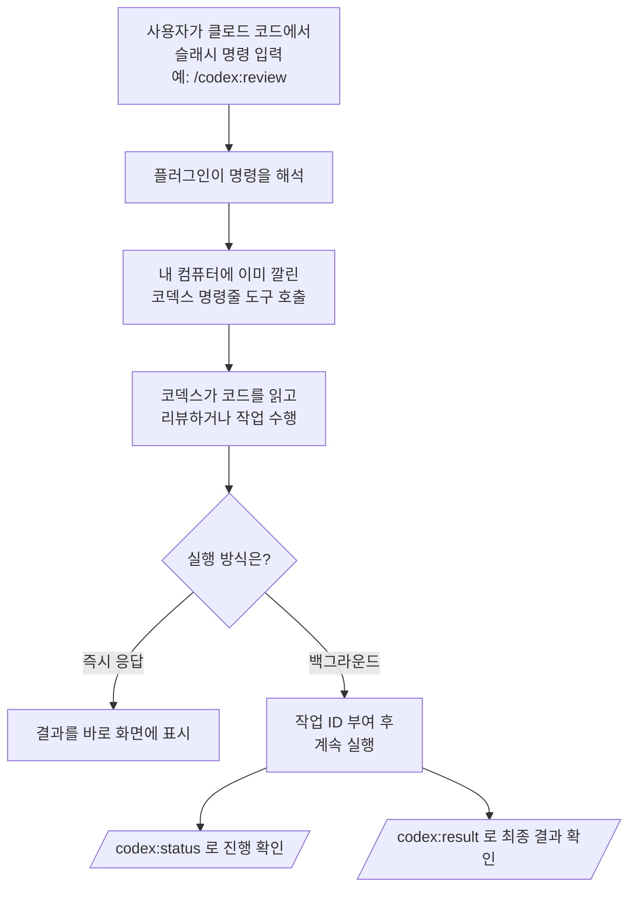

<div class="ai-knowledge-shell">

<aside class="ai-knowledge-sidebar">
  <p class="ai-eyebrow">CATEGORIES</p>
  <nav class="ai-cat-tree"><details class="ai-cat" open><summary><span class="catname">에이전트 오케스트레이션</span><span class="catcount">9</span></summary><ul><li><a href="https://altjs4510.github.io/ai_news_blog/knowledge/20260805/"><span class="kdate">2026-08-05</span><span class="ktitle">TencentCloud/TencentDB-Agent-Memory — 대화·문서·코드를 …</span></a></li><li><a href="https://altjs4510.github.io/ai_news_blog/knowledge/20260709/"><span class="kdate">2026-07-09</span><span class="ktitle">mvanhorn/last30days-skill — Reddit·X·YouTube·HN·…</span></a></li><li><a href="https://altjs4510.github.io/ai_news_blog/knowledge/20260707/"><span class="kdate">2026-07-07</span><span class="ktitle">AI Hero Skills Catalog — 실무 엔지니어를 위한 재사용 가능한 판단 …</span></a></li><li><a href="https://altjs4510.github.io/ai_news_blog/knowledge/20260701/"><span class="kdate">2026-07-01</span><span class="ktitle">Google OKF (Open Knowledge Format) — 벤더 중립 에이전트 …</span></a></li><li><a href="https://altjs4510.github.io/ai_news_blog/knowledge/20260623/"><span class="kdate">2026-06-23</span><span class="ktitle">bytedance/deer-flow — 샌드박스·메모리·서브에이전트·메시지 게이트웨이를…</span></a></li><li><a href="https://altjs4510.github.io/ai_news_blog/knowledge/20260621/"><span class="kdate">2026-06-21</span><span class="ktitle">calesthio/OpenMontage — 12 파이프라인·52 도구·500+ 스킬을 …</span></a></li><li><a href="https://altjs4510.github.io/ai_news_blog/knowledge/20260602/"><span class="kdate">2026-06-02</span><span class="ktitle">revfactory/harness — 도메인별 에이전트 팀과 스킬을 자동 설계하는 메타…</span></a></li><li><a href="https://altjs4510.github.io/ai_news_blog/knowledge/20260529/"><span class="kdate">2026-05-29</span><span class="ktitle">Introducing dynamic workflows in Claude Code</span></a></li><li><a href="https://altjs4510.github.io/ai_news_blog/knowledge/20260507/"><span class="kdate">2026-05-07</span><span class="ktitle">ruvnet/ruflo — Claude 멀티 에이전트 오케스트레이션 플랫폼</span></a></li></ul></details><details class="ai-cat" open><summary><span class="catname">MCP &amp; 도구 통합</span><span class="catcount">20</span></summary><ul><li><a href="https://altjs4510.github.io/ai_news_blog/knowledge/20260802/"><span class="kdate">2026-08-02</span><span class="ktitle">Stateless MCP has recaptured my interest (and in…</span></a></li><li><a href="https://altjs4510.github.io/ai_news_blog/knowledge/20260801/"><span class="kdate">2026-08-01</span><span class="ktitle">different-ai/openwork — Claude Cowork의 오픈소스 대체 에…</span></a></li><li><a href="https://altjs4510.github.io/ai_news_blog/knowledge/20260731/"><span class="kdate">2026-07-31</span><span class="ktitle">different-ai/openwork — Claude Cowork의 오픈소스 대안(o…</span></a></li><li><a href="https://altjs4510.github.io/ai_news_blog/knowledge/20260729/"><span class="kdate">2026-07-29</span><span class="ktitle">Bringing MCP 2026-07-28 to Claude</span></a></li><li><a href="https://altjs4510.github.io/ai_news_blog/knowledge/20260724/"><span class="kdate">2026-07-24</span><span class="ktitle">diegosouzapw/OmniRoute — 단일 엔드포인트로 278+ 프로바이더·50…</span></a></li><li><a href="https://altjs4510.github.io/ai_news_blog/knowledge/20260723/"><span class="kdate">2026-07-23</span><span class="ktitle">diegosouzapw/OmniRoute — 268+ 프로바이더를 단일 엔드포인트로 묶…</span></a></li><li><a href="https://altjs4510.github.io/ai_news_blog/knowledge/20260722/"><span class="kdate">2026-07-22</span><span class="ktitle">tirth8205/code-review-graph — MCP·CLI용 로컬 우선 코드 …</span></a></li><li><a href="https://altjs4510.github.io/ai_news_blog/knowledge/20260721/"><span class="kdate">2026-07-21</span><span class="ktitle">tirth8205/code-review-graph — 로컬 우선 코드 인텔리전스 그래프…</span></a></li><li><a href="https://altjs4510.github.io/ai_news_blog/knowledge/20260719/"><span class="kdate">2026-07-19</span><span class="ktitle">tirth8205/code-review-graph — 로컬 우선 코드 인텔리전스 그래프…</span></a></li><li><a href="https://altjs4510.github.io/ai_news_blog/knowledge/20260718/"><span class="kdate">2026-07-18</span><span class="ktitle">tirth8205/code-review-graph — MCP·CLI용 로컬 코드 인텔리…</span></a></li><li><a href="https://altjs4510.github.io/ai_news_blog/knowledge/20260708/"><span class="kdate">2026-07-08</span><span class="ktitle">Expanding Managed Agents in Gemini API: backgrou…</span></a></li><li><a href="https://altjs4510.github.io/ai_news_blog/knowledge/20260618/"><span class="kdate">2026-06-18</span><span class="ktitle">DeusData/codebase-memory-mcp — 158개 언어 코드베이스를 밀리…</span></a></li><li><a href="https://altjs4510.github.io/ai_news_blog/knowledge/20260606/"><span class="kdate">2026-06-06</span><span class="ktitle">chopratejas/headroom — Compress tool outputs, lo…</span></a></li><li><a href="https://altjs4510.github.io/ai_news_blog/knowledge/20260605/"><span class="kdate">2026-06-05</span><span class="ktitle">chopratejas/headroom — Compress tool outputs, lo…</span></a></li><li><a href="https://altjs4510.github.io/ai_news_blog/knowledge/20260604/"><span class="kdate">2026-06-04</span><span class="ktitle">chopratejas/headroom — Compress tool outputs bef…</span></a></li><li><a href="https://altjs4510.github.io/ai_news_blog/knowledge/20260603/"><span class="kdate">2026-06-03</span><span class="ktitle">How Bad MCP design cost your Agent 5× more token…</span></a></li><li><a href="https://altjs4510.github.io/ai_news_blog/knowledge/20260526/"><span class="kdate">2026-05-26</span><span class="ktitle">colbymchenry/codegraph — Pre-indexed code knowle…</span></a></li><li><a href="https://altjs4510.github.io/ai_news_blog/knowledge/20260523/"><span class="kdate">2026-05-23</span><span class="ktitle">colbymchenry/codegraph — 사전 인덱싱된 코드 지식 그래프 MCP</span></a></li><li><a href="https://altjs4510.github.io/ai_news_blog/knowledge/20260517/"><span class="kdate">2026-05-17</span><span class="ktitle">I gave my LLM 100,000+ tools — Lazy Discovery &a…</span></a></li><li><a href="https://altjs4510.github.io/ai_news_blog/knowledge/20260509/"><span class="kdate">2026-05-09</span><span class="ktitle">How to connect 100 MCP servers without the conte…</span></a></li></ul></details><details class="ai-cat" open><summary><span class="catname">코딩 에이전트</span><span class="catcount">17</span></summary><ul><li><a href="https://altjs4510.github.io/ai_news_blog/knowledge/20260804/"><span class="kdate">2026-08-04</span><span class="ktitle">esengine/DeepSeek-Reasonix — prefix-cache 안정성을 축…</span></a></li><li><a href="https://altjs4510.github.io/ai_news_blog/knowledge/20260728/"><span class="kdate">2026-07-28</span><span class="ktitle">alibaba/open-code-review — 결정론적 파이프라인 + LLM 에이전트…</span></a></li><li><a href="https://altjs4510.github.io/ai_news_blog/knowledge/20260725/"><span class="kdate">2026-07-25</span><span class="ktitle">The new rules of context engineering for Claude …</span></a></li><li><a href="https://altjs4510.github.io/ai_news_blog/knowledge/20260715/"><span class="kdate">2026-07-15</span><span class="ktitle">Dicklesworthstone/destructive_command_guard — 에이…</span></a></li><li><a href="https://altjs4510.github.io/ai_news_blog/knowledge/20260714/"><span class="kdate">2026-07-14</span><span class="ktitle">Graphify-Labs/graphify — 코드베이스를 질의 가능한 지식 그래프로 만…</span></a></li><li><a href="https://altjs4510.github.io/ai_news_blog/knowledge/20260705/" class="current"><span class="kdate">2026-07-05</span><span class="ktitle">openai/codex-plugin-cc — Claude Code에서 Codex를 위임…</span></a></li><li><a href="https://altjs4510.github.io/ai_news_blog/knowledge/20260626/"><span class="kdate">2026-06-26</span><span class="ktitle">google-labs-code/design.md — 코딩 에이전트에게 디자인 시스템을 …</span></a></li><li><a href="https://altjs4510.github.io/ai_news_blog/knowledge/20260619/"><span class="kdate">2026-06-19</span><span class="ktitle">Claude Code now supports artifacts</span></a></li><li><a href="https://altjs4510.github.io/ai_news_blog/knowledge/20260530/"><span class="kdate">2026-05-30</span><span class="ktitle">Leonxlnx/taste-skill — AI에게 좋은 취향을 부여해 generic s…</span></a></li><li><a href="https://altjs4510.github.io/ai_news_blog/knowledge/20260528/"><span class="kdate">2026-05-28</span><span class="ktitle">Building self-improving tax agents with Codex</span></a></li><li><a href="https://altjs4510.github.io/ai_news_blog/knowledge/20260524/"><span class="kdate">2026-05-24</span><span class="ktitle">colbymchenry/codegraph — Pre-indexed code knowle…</span></a></li><li><a href="https://altjs4510.github.io/ai_news_blog/knowledge/20260521/"><span class="kdate">2026-05-21</span><span class="ktitle">colbymchenry/codegraph — Pre-indexed code knowle…</span></a></li><li><a href="https://altjs4510.github.io/ai_news_blog/knowledge/20260512/"><span class="kdate">2026-05-12</span><span class="ktitle">agentmemory — Persistent memory for AI coding ag…</span></a></li><li><a href="https://altjs4510.github.io/ai_news_blog/knowledge/20260510/"><span class="kdate">2026-05-10</span><span class="ktitle">addyosmani/agent-skills — Production-grade engin…</span></a></li><li><a href="https://altjs4510.github.io/ai_news_blog/knowledge/20260508/"><span class="kdate">2026-05-08</span><span class="ktitle">addyosmani/agent-skills — Production-grade engin…</span></a></li><li><a href="https://altjs4510.github.io/ai_news_blog/knowledge/20260506/"><span class="kdate">2026-05-06</span><span class="ktitle">mksglu/context-mode — AI 코딩 에이전트용 컨텍스트 윈도우 최적화</span></a></li><li><a href="https://altjs4510.github.io/ai_news_blog/knowledge/20260505/"><span class="kdate">2026-05-05</span><span class="ktitle">mattpocock/skills — Skills for Real Engineers (.…</span></a></li></ul></details><details class="ai-cat" open><summary><span class="catname">모델 &amp; 연구</span><span class="catcount">5</span></summary><ul><li><a href="https://altjs4510.github.io/ai_news_blog/knowledge/20260716-proprag/"><span class="kdate">2026-07-16</span><span class="ktitle">PropRAG — 프로포지션 경로 위 beam search로 멀티홉 검색 안내</span></a></li><li><a href="https://altjs4510.github.io/ai_news_blog/knowledge/20260620/"><span class="kdate">2026-06-20</span><span class="ktitle">zai-org/GLM-5 — From Vibe Coding to Agentic Engi…</span></a></li><li><a href="https://altjs4510.github.io/ai_news_blog/knowledge/20260617/"><span class="kdate">2026-06-17</span><span class="ktitle">Predicting model behavior before release by simu…</span></a></li><li><a href="https://altjs4510.github.io/ai_news_blog/knowledge/20260516/"><span class="kdate">2026-05-16</span><span class="ktitle">STALE — 에이전트가 자기 기억의 유효성을 인지할 수 있는가</span></a></li><li><a href="https://altjs4510.github.io/ai_news_blog/knowledge/20260513/"><span class="kdate">2026-05-13</span><span class="ktitle">Thinking Machines' Native Interaction Models — T…</span></a></li></ul></details><details class="ai-cat" open><summary><span class="catname">인프라 &amp; 컴퓨트</span><span class="catcount">5</span></summary><ul><li><a href="https://altjs4510.github.io/ai_news_blog/knowledge/20260806/"><span class="kdate">2026-08-06</span><span class="ktitle">cloudflare/computer — 에이전트에게 컴퓨터를 통째로 주는 엣지 실행 샌…</span></a></li><li><a href="https://altjs4510.github.io/ai_news_blog/knowledge/20260630/"><span class="kdate">2026-06-30</span><span class="ktitle">Introducing the Claude apps gateway for Amazon B…</span></a></li><li><a href="https://altjs4510.github.io/ai_news_blog/knowledge/20260611/"><span class="kdate">2026-06-11</span><span class="ktitle">The evolution of agentic surfaces: building with…</span></a></li><li><a href="https://altjs4510.github.io/ai_news_blog/knowledge/20260522/"><span class="kdate">2026-05-22</span><span class="ktitle">Giving Agents Computers — Ivan Burazin, Daytona</span></a></li><li><a href="https://altjs4510.github.io/ai_news_blog/knowledge/20260520/"><span class="kdate">2026-05-20</span><span class="ktitle">New in Claude Managed Agents: self-hosted sandbo…</span></a></li></ul></details><details class="ai-cat" open><summary><span class="catname">보안 &amp; 거버넌스</span><span class="catcount">13</span></summary><ul><li><a href="https://altjs4510.github.io/ai_news_blog/knowledge/20260730/"><span class="kdate">2026-07-30</span><span class="ktitle">Anatomy of a Frontier Lab Agent Intrusion: A Tec…</span></a></li><li><a href="https://altjs4510.github.io/ai_news_blog/knowledge/20260716/"><span class="kdate">2026-07-16</span><span class="ktitle">Dicklesworthstone/destructive_command_guard — 에이…</span></a></li><li><a href="https://altjs4510.github.io/ai_news_blog/knowledge/20260710/"><span class="kdate">2026-07-10</span><span class="ktitle">70개 MCP 서버 strace 런타임 감사 — 부팅 시 아웃바운드 호출 서버 적발</span></a></li><li><a href="https://altjs4510.github.io/ai_news_blog/knowledge/20260704/"><span class="kdate">2026-07-04</span><span class="ktitle">Cloudflare is about to block AI agents by defaul…</span></a></li><li><a href="https://altjs4510.github.io/ai_news_blog/knowledge/20260703/"><span class="kdate">2026-07-03</span><span class="ktitle">Giving admins more visibility and control over C…</span></a></li><li><a href="https://altjs4510.github.io/ai_news_blog/knowledge/20260625/"><span class="kdate">2026-06-25</span><span class="ktitle">Agent identity in Claude Tag: a new access model…</span></a></li><li><a href="https://altjs4510.github.io/ai_news_blog/knowledge/20260624/"><span class="kdate">2026-06-24</span><span class="ktitle">Agent identity in Claude Tag: a new access model…</span></a></li><li><a href="https://altjs4510.github.io/ai_news_blog/knowledge/20260614/"><span class="kdate">2026-06-14</span><span class="ktitle">NVIDIA/SkillSpector — Security scanner for AI ag…</span></a></li><li><a href="https://altjs4510.github.io/ai_news_blog/knowledge/20260613/"><span class="kdate">2026-06-13</span><span class="ktitle">Fable 5's guardrails got bypassed in 48 hours — …</span></a></li><li><a href="https://altjs4510.github.io/ai_news_blog/knowledge/20260612/"><span class="kdate">2026-06-12</span><span class="ktitle">NVIDIA/SkillSpector — AI 에이전트 스킬용 보안 스캐너</span></a></li><li><a href="https://altjs4510.github.io/ai_news_blog/knowledge/20260607/"><span class="kdate">2026-06-07</span><span class="ktitle">OpenAI Help: Lockdown Mode</span></a></li><li><a href="https://altjs4510.github.io/ai_news_blog/knowledge/20260531/"><span class="kdate">2026-05-31</span><span class="ktitle">How we contain Claude across products</span></a></li><li><a href="https://altjs4510.github.io/ai_news_blog/knowledge/20260527/"><span class="kdate">2026-05-27</span><span class="ktitle">Microsoft Copilot Cowork Exfiltrates Files</span></a></li></ul></details><details class="ai-cat" open><summary><span class="catname">응용 사례</span><span class="catcount">6</span></summary><ul><li><a href="https://altjs4510.github.io/ai_news_blog/knowledge/20260726/"><span class="kdate">2026-07-26</span><span class="ktitle">citrolabs/ego-lite — 로그인된 브라우저 상태를 AI 에이전트와 공유하는…</span></a></li><li><a href="https://altjs4510.github.io/ai_news_blog/knowledge/20260717/"><span class="kdate">2026-07-17</span><span class="ktitle">After a year building agent memory, 'save everyt…</span></a></li><li><a href="https://altjs4510.github.io/ai_news_blog/knowledge/20260712/"><span class="kdate">2026-07-12</span><span class="ktitle">Do Automated Evals Work?</span></a></li><li><a href="https://altjs4510.github.io/ai_news_blog/knowledge/20260609/"><span class="kdate">2026-06-09</span><span class="ktitle">Building intelligent apps for Apple platforms wi…</span></a></li><li><a href="https://altjs4510.github.io/ai_news_blog/knowledge/20260515/"><span class="kdate">2026-05-15</span><span class="ktitle">Clawdmeter — Claude Code 사용량을 데스크톱 대시보드로</span></a></li><li><a href="https://altjs4510.github.io/ai_news_blog/knowledge/20260514/"><span class="kdate">2026-05-14</span><span class="ktitle">Introducing Claude for Small Business</span></a></li></ul></details><details class="ai-cat" open><summary><span class="catname">산업 동향</span><span class="catcount">6</span></summary><ul><li><a href="https://altjs4510.github.io/ai_news_blog/knowledge/20260711/"><span class="kdate">2026-07-11</span><span class="ktitle">OpenAI says GPT 5.6 is the 'preferred model' for…</span></a></li><li><a href="https://altjs4510.github.io/ai_news_blog/knowledge/20260702/"><span class="kdate">2026-07-02</span><span class="ktitle">How Cursor deploys AI inside the enterprise (For…</span></a></li><li><a href="https://altjs4510.github.io/ai_news_blog/knowledge/20260616/"><span class="kdate">2026-06-16</span><span class="ktitle">Why AI hasn't replaced software engineers, and w…</span></a></li><li><a href="https://altjs4510.github.io/ai_news_blog/knowledge/20260610/"><span class="kdate">2026-06-10</span><span class="ktitle">Fable 5 just made cost-aware model routing manda…</span></a></li><li><a href="https://altjs4510.github.io/ai_news_blog/knowledge/20260519/"><span class="kdate">2026-05-19</span><span class="ktitle">Anthropic acquires Stainless</span></a></li><li><a href="https://altjs4510.github.io/ai_news_blog/knowledge/20260504/"><span class="kdate">2026-05-04</span><span class="ktitle">Agents for Everything Else: Codex for Knowledge …</span></a></li></ul></details></nav>
</aside>

<article class="ai-knowledge-article">

<header class="ai-post-hero">
  <p class="ai-eyebrow"><a class="ai-back" href="../">KNOWLEDGE</a> · 2026-07-05 · 오늘의 학습</p>
  <h2 class="ai-post-title">openai/codex-plugin-cc — Claude Code에서 Codex를 위임 호출하는 공식 플러그인</h2>
</header>

> 원문: [openai/codex-plugin-cc — Claude Code에서 Codex를 위임 호출하는 공식 플러그인](https://github.com/openai/codex-plugin-cc)

## 📌 학습 정리

### 1. 한 줄로 말하면

클로드 코드(Claude Code)라는 코딩 도우미 안에서, 옆자리 동료를 부르듯 오픈AI의 코덱스(Codex)에게 코드 리뷰나 어려운 문제를 넘길 수 있게 해주는 연결 도구예요.

### 2. 왜 이게 만들어졌어요?

요즘 개발자들은 터미널 안에서 대화하듯 코드를 짜주는 인공지능 도우미(에이전트, agent)를 하나씩 쓰는데, 대표적인 두 가지가 앤트로픽의 클로드 코드와 오픈AI의 코덱스예요. 문제는 각자 잘하는 결이 조금씩 달라서, 어떤 작업은 코덱스에게 맡기고 싶은데 그러려면 창을 옮기고 문맥을 다시 설명해야 한다는 점이었죠. 이 플러그인은 클로드 코드 안에 슬래시 명령(`/codex:...`)을 심어서, 지금 하던 작업 흐름을 끊지 않고 코덱스에게 리뷰나 작업을 위임할 수 있게 만들어줍니다. 특히 시간이 오래 걸리는 리뷰나 조사 작업을 백그라운드로 돌려두고, 나중에 결과만 확인하는 식의 협업이 편해집니다.

### 3. 비유로 풀면

이건 마치 사내 메신저에서 "이 부분 좀 봐줄래?" 하고 다른 팀 동료에게 태그를 걸어 일감을 넘기는 것과 비슷해요. 내 자리(클로드 코드)를 떠나지 않은 채로, 옆 팀 전문가(코덱스)를 호출해서 리뷰를 부탁하거나 조사 과제를 던져놓고, 다시 내 일로 돌아와요.

그래서 결국, 두 개의 인공지능 도우미를 하나의 대화창에서 협업 파트너처럼 나눠 쓰는 셈이 됩니다.

### 4. 어떻게 작동하는지 (그림으로)



핵심은 이 플러그인이 별도의 새로운 코덱스를 띄우는 게 아니라, 이미 내 컴퓨터에 설치·로그인된 코덱스 명령줄 도구(Codex CLI)를 그대로 불러 쓴다는 점이에요. 그래서 로그인 정보, 설정 파일, 프로젝트 폴더가 다 그대로 이어집니다. 시간이 오래 걸릴 만한 일은 백그라운드로 돌린 뒤 상태 확인 명령으로 진행 상황을 들여다볼 수 있어요.

### 5. 처음 보는 용어 풀이

- **플러그인 (plugin)** — 어떤 도구에 새 기능을 끼워 넣는 확장 모듈이에요. 여기서는 클로드 코드에 코덱스 호출 기능을 붙여주는 역할을 합니다.
- **슬래시 명령 (slash command)** — 채팅창에서 `/`로 시작하는 짧은 명령어예요. 예를 들어 `/codex:review`라고 치면 "코덱스한테 리뷰 시켜줘"라는 뜻이 됩니다.
- **서브 에이전트 (subagent)** — 메인 인공지능 도우미가 특정 일감을 잠깐 넘겨받아 처리하는 보조 도우미예요. 여기서는 `codex:codex-rescue`가 그 역할을 해서, 클로드가 코덱스에게 작업을 위임할 때 쓰입니다.
- **백그라운드 실행 (`--background`)** — 오래 걸리는 작업을 뒤에서 조용히 돌려두고, 나는 계속 다른 일을 하는 방식이에요. 나중에 상태를 물어보면 진행 상황을 알려줍니다.
- **적대적 리뷰 (adversarial review)** — 단순히 "잘 짰네"가 아니라, 일부러 트집을 잡듯 "이 설계 정말 맞아요? 다른 방법이 더 낫지 않았나요?" 하고 의심하며 검토해주는 리뷰 모드예요. 배포 직전에 방향 자체를 점검하고 싶을 때 씁니다.
- **세션 이어받기 (session resume / transfer)** — 지금까지 클로드 코드에서 나눈 대화 맥락을 코덱스 쪽으로 그대로 넘겨서, 같은 문맥으로 이어 대화하는 기능이에요. `/codex:transfer`가 이 역할을 합니다.
- **리뷰 게이트 (review gate)** — 클로드가 답변을 마치려는 순간, 자동으로 코덱스가 짧게 검토를 한 번 하고 문제가 있으면 답변을 못 끝내게 막아주는 안전장치예요. 대신 클로드↔코덱스 사이에 왔다 갔다 하는 반복이 길어질 수 있어서 조심해서 켜야 합니다.
- **추론 강도 (reasoning effort)** — 인공지능이 답을 낼 때 얼마나 오래 생각할지를 조절하는 설정이에요. `high`로 두면 더 깊게 고민하지만 그만큼 느리고 사용량도 많이 씁니다.

### 6. 한 발 더 들어가고 싶다면

- [Codex 요금 및 사용 한도 안내](https://developers.openai.com/codex/pricing) — 이 플러그인을 쓸 때 어떤 계정·요금제로 사용량이 차감되는지 알 수 있어요.
- [Codex 앱 서버(App Server) 문서](https://developers.openai.com/codex/app-server) — 플러그인이 실제로 무엇을 감싸고 있는지, 내부 구조가 어떤지 볼 수 있어요.
- [Codex 기본 설정 가이드](https://developers.openai.com/codex/config-basic) / [설정 레퍼런스](https://developers.openai.com/codex/config-reference) — 모델이나 추론 강도 같은 기본값을 어떻게 바꾸는지 확인할 수 있어요.
- [Codex 명령줄 도구(CLI) 문서](https://developers.openai.com/codex/cli/) — 플러그인이 뒤에서 호출하는 실제 도구를 직접 다뤄보고 싶을 때 참고하면 좋습니다.
- [프로젝트 신뢰 설정 안내](https://developers.openai.com/codex/config-advanced#project-config-files-codexconfigtoml) — 프로젝트별 설정 파일이 언제 적용되는지, 왜 "신뢰된 프로젝트"만 반영되는지 알 수 있어요.

---

## 📖 원문 전체 번역 (정독용)

> 의역 최소화한 전체 번역입니다. 큰 흐름은 위 정리에서 잡고, 정확한 워딩이 필요할 땐 이 섹션에서 정독하세요.

Claude Code 내부에서 코드 리뷰를 받거나 Codex에 작업을 위임하기 위해 Codex를 사용합니다.

이 플러그인은 이미 사용 중인 Claude Code 워크플로우에서 간편하게 Codex를 사용하고 싶은 Claude Code 사용자를 위한 것입니다.

## 제공 기능

* `/codex:review` — 일반 읽기 전용 Codex 리뷰
* `/codex:adversarial-review` — 방향을 조정 가능한 도전적 리뷰
* `/codex:rescue`, `/codex:transfer`, `/codex:status`, `/codex:result`, `/codex:cancel` — 작업 위임, 세션 인계, 백그라운드 작업 관리

## 요구 사항

* **ChatGPT 구독 (무료 플랜 포함) 또는 OpenAI API 키.**
    * 사용량은 Codex 사용 한도에 합산됩니다. [자세히 알아보기](https://developers.openai.com/codex/pricing).

* **Node.js 18.18 이상**

## 설치

Claude Code에서 마켓플레이스를 추가합니다:

```
/plugin marketplace add openai/codex-plugin-cc
```

플러그인을 설치합니다:

```
/plugin install codex@openai-codex
```

플러그인을 다시 로드합니다:

```
/reload-plugins
```

그런 다음 실행합니다:

```
/codex:setup
```

`/codex:setup`은 Codex가 준비 상태인지 알려줍니다. Codex가 없고 npm이 사용 가능한 경우, Codex 설치를 제안할 수 있습니다.

직접 Codex를 설치하려면 다음을 사용하세요:

```
npm install -g @openai/codex
```

Codex가 설치되었지만 아직 로그인하지 않은 경우 다음을 실행하세요:

```
!codex login
```

설치 후 다음을 확인할 수 있어야 합니다:

* 아래 나열된 슬래시 명령어들
* `/agents`에서 `codex:codex-rescue` 서브에이전트

간단한 첫 실행 예시:

```
/codex:review --background
/codex:status
/codex:result
```

## 사용법

### `/codex:review`

현재 작업에 대해 일반적인 Codex 리뷰를 실행합니다. Codex 내부에서 직접 `/review`를 실행하는 것과 동일한 품질의 코드 리뷰를 제공합니다.

> **참고**
> 여러 파일에 걸친 변경사항에 대한 코드 리뷰는 특히 시간이 걸릴 수 있습니다. 일반적으로 백그라운드에서 실행하는 것을 권장합니다.

다음의 경우에 사용합니다:

* 현재 커밋되지 않은 변경사항 리뷰
* `main`과 같은 베이스 브랜치와 비교한 브랜치 리뷰

브랜치 리뷰에는 `--base <ref>`를 사용합니다. `--wait` 및 `--background`도 지원합니다. 방향 조정이 불가능하며 커스텀 포커스 텍스트를 받지 않습니다. 특정 결정이나 위험 영역에 대해 도전하고 싶을 때는 [`/codex:adversarial-review`](#codexadversarial-review)를 사용하세요.

사용 예시:

```
/codex:review
/codex:review --base main
/codex:review --background
```

이 명령어는 읽기 전용이며 어떠한 변경도 수행하지 않습니다. 백그라운드에서 실행할 경우 [`/codex:status`](#codexstatus)로 진행 상황을 확인하고 [`/codex:cancel`](#codexcancel)로 진행 중인 작업을 취소할 수 있습니다.

### `/codex:adversarial-review`

선택된 구현과 설계에 의문을 제기하는 **방향 조정 가능한** 리뷰를 실행합니다.

가정, 트레이드오프, 장애 모드, 그리고 다른 접근 방식이 더 안전하거나 단순했을지를 압박 테스트하는 데 사용할 수 있습니다.

`/codex:review`와 동일한 리뷰 대상 선택을 사용하며, 브랜치 리뷰를 위한 `--base <ref>`도 포함됩니다. `--wait` 및 `--background`도 지원합니다. `/codex:review`와 달리, 플래그 뒤에 추가 포커스 텍스트를 받을 수 있습니다.

다음의 경우에 사용합니다:

* 코드 세부사항뿐만 아니라 방향성 자체에 도전하는, 배포 전 리뷰
* 설계 선택, 트레이드오프, 숨겨진 가정, 대안적 접근법에 집중한 리뷰
* 인증, 데이터 손실, 롤백, 경쟁 조건, 안정성 등 특정 위험 영역에 대한 압박 테스트

사용 예시:

```
/codex:adversarial-review
/codex:adversarial-review --base main challenge whether this was the right caching and retry design
/codex:adversarial-review --background look for race conditions and question the chosen approach
```

이 명령어는 읽기 전용입니다. 코드를 수정하지 않습니다.

### `/codex:rescue`

`codex:codex-rescue` 서브에이전트를 통해 Codex에 작업을 넘깁니다.

Codex에 다음을 맡기고 싶을 때 사용합니다:

* 버그 조사
* 수정 시도
* 이전 Codex 작업 이어서 진행
* 더 작은 모델로 빠르거나 저렴하게 처리

> **참고**
> 작업 내용과 선택한 모델에 따라 이러한 작업이 오랜 시간이 걸릴 수 있으므로, 일반적으로 작업을 백그라운드로 강제 실행하거나 에이전트를 백그라운드로 이동시키는 것을 권장합니다.

`--background`, `--wait`, `--resume`, `--fresh`를 지원합니다. `--resume`과 `--fresh`를 모두 생략하면, 플러그인이 해당 저장소의 최신 rescue 스레드를 이어서 진행할지 제안할 수 있습니다.

사용 예시:

```
/codex:rescue investigate why the tests started failing
/codex:rescue fix the failing test with the smallest safe patch
/codex:rescue --resume apply the top fix from the last run
/codex:rescue --model gpt-5.4-mini --effort medium investigate the flaky integration test
/codex:rescue --model spark fix the issue quickly
/codex:rescue --background investigate the regression
```

작업을 Codex에 위임하도록 요청할 수도 있습니다:

```
Ask Codex to redesign the database connection to be more resilient.
```

**참고 사항:**

* `--model` 또는 `--effort`를 전달하지 않으면 Codex가 자체 기본값을 선택합니다.
* `spark`를 지정하면 플러그인이 이를 `gpt-5.3-codex-spark`로 매핑합니다.
* 후속 rescue 요청은 저장소의 최신 Codex 작업을 이어서 진행할 수 있습니다.

### `/codex:transfer`

현재 Claude Code 세션에서 지속적인 Codex 스레드를 생성하고 `codex resume <session-id>` 명령어를 출력합니다.

Claude Code에서 디버깅 또는 구현 대화를 시작했고, 동일한 컨텍스트를 Codex에서 직접 이어서 진행하고 싶을 때 사용합니다.

사용 예시:

```
/codex:transfer
/codex:transfer --source ~/.claude/projects/-Users-me-repo/<session-id>.jsonl
```

플러그인의 기존 `SessionStart` 훅이 현재 트랜스크립트 경로를 자동으로 제공합니다. `--source`는 수동 오버라이드로 사용할 수 있습니다. 전송은 Codex의 외부 에이전트 세션 임포터를 사용하므로, Codex 앱에서 Claude 히스토리를 가져오는 것과 동일한 변환 규칙을 따르며, 앱 또는 TUI에서 이어서 진행할 수 있는 가시적인 턴을 생성합니다. 소스는 `~/.claude/projects` 하위에 있어야 하며, 세션 임포트를 지원하지 않는 구버전 Codex는 이 명령어를 사용하기 전에 업그레이드해야 합니다.

### `/codex:status`

현재 저장소에 대해 실행 중이거나 최근에 실행된 Codex 작업을 표시합니다.

사용 예시:

```
/codex:status
/codex:status task-abc123
```

다음에 사용합니다:

* 백그라운드 작업 진행 상황 확인
* 최근 완료된 작업 확인
* 작업이 아직 실행 중인지 확인

### `/codex:result`

완료된 작업의 최종 저장된 Codex 출력을 표시합니다. 사용 가능한 경우 Codex 세션 ID도 포함되어 `codex resume <session-id>`로 해당 실행을 Codex에서 직접 다시 열 수 있습니다.

사용 예시:

```
/codex:result
/codex:result task-abc123
```

### `/codex:cancel`

활성화된 백그라운드 Codex 작업을 취소합니다.

사용 예시:

```
/codex:cancel
/codex:cancel task-abc123
```

### `/codex:setup`

Codex가 설치되어 있고 인증되었는지 확인합니다. Codex가 없고 npm이 사용 가능한 경우, Codex 설치를 제안할 수 있습니다.

`/codex:setup`을 사용하여 선택적 리뷰 게이트를 관리할 수도 있습니다.

#### 리뷰 게이트 활성화

```
/codex:setup --enable-review-gate
/codex:setup --disable-review-gate
```

리뷰 게이트가 활성화되면, 플러그인은 `Stop` 훅을 사용하여 Claude의 응답을 기반으로 대상을 지정한 Codex 리뷰를 실행합니다. 해당 리뷰에서 문제가 발견되면, Claude가 먼저 문제를 해결할 수 있도록 정지가 차단됩니다.

> **경고**
> 리뷰 게이트는 Claude/Codex 루프를 장시간 실행하게 만들어 사용 한도를 빠르게 소진할 수 있습니다. 세션을 적극적으로 모니터링할 계획일 때만 활성화하세요.

## 일반적인 사용 흐름

### 배포 전 리뷰

```
/codex:review
```

### Codex에 문제 넘기기

```
/codex:rescue investigate why the build is failing in CI
```

### 장시간 실행 작업 시작

```
/codex:adversarial-review --background
/codex:rescue --background investigate the flaky test
```

그런 다음 확인합니다:

```
/codex:status
/codex:result
```

## Codex 통합

Codex 플러그인은 [Codex 앱 서버](https://developers.openai.com/codex/app-server)를 래핑합니다. 환경에 전역으로 설치된 `codex` 바이너리를 사용하며 [동일한 설정을 적용](https://developers.openai.com/codex/config-basic)합니다.

### 일반적인 설정

플러그인에서 사용되는 기본 추론 노력 수준이나 기본 모델을 변경하고 싶다면, 사용자 수준 또는 프로젝트 수준 `config.toml`에 정의할 수 있습니다. 예를 들어 특정 프로젝트에서 항상 `high` 노력으로 `gpt-5.4-mini`를 사용하려면, Claude를 시작한 디렉토리의 루트에 있는 `.codex/config.toml` 파일에 다음을 추가할 수 있습니다:

```toml
model = "gpt-5.4-mini"
model_reasoning_effort = "high"
```

설정은 다음을 기반으로 적용됩니다:

* `~/.codex/config.toml`의 사용자 수준 설정
* `.codex/config.toml`의 프로젝트 수준 오버라이드
* 프로젝트 수준 오버라이드는 [프로젝트가 신뢰됨 상태](https://developers.openai.com/codex/config-advanced#project-config-files-codexconfigtoml)일 때만 로드됩니다.

더 많은 [설정 옵션](https://developers.openai.com/codex/config-reference)은 Codex 문서를 참조하세요.

### Codex로 작업 이전하기

위임된 작업과 [정지 게이트](#리뷰-게이트-활성화) 실행은 `codex resume`을 실행하여 Codex 내에서 직접 재개할 수도 있습니다. `/codex:result` 또는 `/codex:status` 실행 시 받은 특정 세션 ID를 사용하거나 목록에서 선택하면 됩니다.

이를 통해 Codex 작업을 검토하거나 그곳에서 작업을 이어서 진행할 수 있습니다.

## FAQ

### 이 플러그인을 위해 별도의 Codex 계정이 필요한가요?

이미 이 기기에서 Codex에 로그인되어 있다면, 해당 계정이 여기서도 즉시 작동합니다. 이 플러그인은 로컬 Codex CLI 인증을 사용합니다.

현재 Claude Code만 사용하고 있고 Codex를 사용해본 적이 없다면, ChatGPT 계정이나 API 키로 Codex에 로그인해야 합니다. [Codex는 ChatGPT 구독으로 이용 가능](https://developers.openai.com/codex/pricing/)하며, [`codex login`](https://developers.openai.com/codex/cli/reference/#codex-login)은 ChatGPT 및 API 키 로그인을 모두 지원합니다. `/codex:setup`을 실행하여 Codex가 준비 상태인지 확인하고, 그렇지 않은 경우 `!codex login`을 사용하세요.

### 플러그인이 별도의 Codex 런타임을 사용하나요?

아닙니다. 이 플러그인은 동일한 기기의 로컬 [Codex CLI](https://developers.openai.com/codex/cli/)와 [Codex 앱 서버](https://developers.openai.com/codex/app-server/)를 통해 위임합니다.

즉:

* 직접 사용할 때와 동일한 Codex 설치를 사용합니다.
* 동일한 로컬 인증 상태를 사용합니다.
* 동일한 저장소 체크아웃 및 로컬 기기 환경을 사용합니다.

### 이미 가지고 있는 Codex 설정을 그대로 사용하나요?

예. 이미 Codex를 사용하고 있다면, 플러그인은 동일한 [설정](#일반적인-설정)을 가져옵니다.

### 현재 API 키나 베이스 URL 설정을 계속 사용할 수 있나요?

예. 플러그인이 로컬 Codex CLI를 사용하기 때문에, 기존 로그인 방법과 설정이 그대로 적용됩니다.

내장된 OpenAI 프로바이더를 다른 엔드포인트로 지정해야 한다면, [Codex 설정](https://developers.openai.com/codex/config-advanced/#config-and-state-locations)에서 `openai_base_url`을 설정하세요.

</article>

</div>

<!-- ai-related-links -->
<aside class="ai-related-links">
  <p class="ai-eyebrow">관련 학습</p>
  <ul><li><a href="https://altjs4510.github.io/ai_news_blog/knowledge/20260529/"><span class="kdate">2026-05-29</span><span class="ktitle">Introducing dynamic workflows in Claude Code</span></a></li><li><a href="https://altjs4510.github.io/ai_news_blog/knowledge/20260504/"><span class="kdate">2026-05-04</span><span class="ktitle">Agents for Everything Else: Codex for Knowledge …</span></a></li><li><a href="https://altjs4510.github.io/ai_news_blog/knowledge/20260528/"><span class="kdate">2026-05-28</span><span class="ktitle">Building self-improving tax agents with Codex</span></a></li></ul>
</aside>
<!-- /ai-related-links -->
