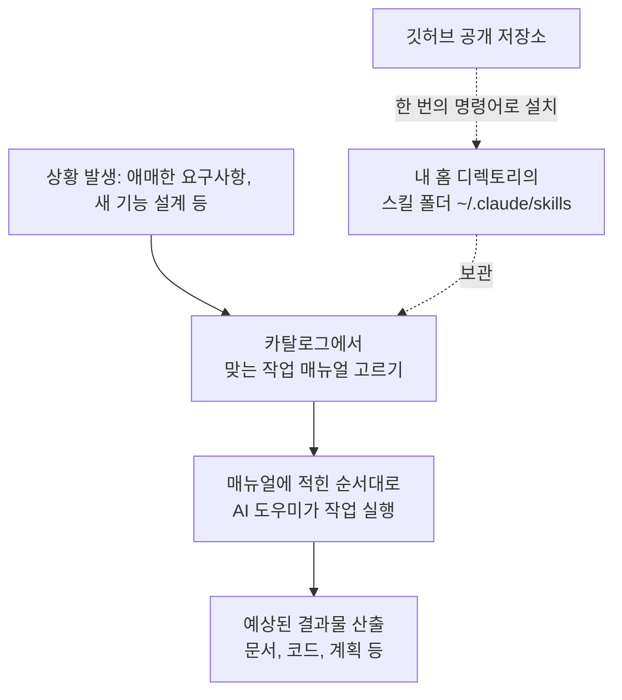

<div class="ai-knowledge-shell">

<aside class="ai-knowledge-sidebar">
  <p class="ai-eyebrow">CATEGORIES</p>
  <nav class="ai-cat-tree"><details class="ai-cat" open><summary><span class="catname">에이전트 오케스트레이션</span><span class="catcount">13</span></summary><ul><li><a href="https://altjs4510.github.io/ai_news_blog/knowledge/20260717/"><span class="kdate">2026-07-17</span><span class="ktitle">After a year building agent memory, 'save everyt…</span></a></li><li><a href="https://altjs4510.github.io/ai_news_blog/knowledge/20260708/"><span class="kdate">2026-07-08</span><span class="ktitle">Expanding Managed Agents in Gemini API: backgrou…</span></a></li><li><a href="https://altjs4510.github.io/ai_news_blog/knowledge/20260707/" class="current"><span class="kdate">2026-07-07</span><span class="ktitle">AI Hero Skills Catalog — 실무 엔지니어를 위한 재사용 가능한 판단 …</span></a></li><li><a href="https://altjs4510.github.io/ai_news_blog/knowledge/20260705/"><span class="kdate">2026-07-05</span><span class="ktitle">openai/codex-plugin-cc — Claude Code에서 Codex를 위임…</span></a></li><li><a href="https://altjs4510.github.io/ai_news_blog/knowledge/20260701/"><span class="kdate">2026-07-01</span><span class="ktitle">Google OKF (Open Knowledge Format) — 벤더 중립 에이전트 …</span></a></li><li><a href="https://altjs4510.github.io/ai_news_blog/knowledge/20260623/"><span class="kdate">2026-06-23</span><span class="ktitle">bytedance/deer-flow — 샌드박스·메모리·서브에이전트·메시지 게이트웨이를…</span></a></li><li><a href="https://altjs4510.github.io/ai_news_blog/knowledge/20260621/"><span class="kdate">2026-06-21</span><span class="ktitle">calesthio/OpenMontage — 12 파이프라인·52 도구·500+ 스킬을 …</span></a></li><li><a href="https://altjs4510.github.io/ai_news_blog/knowledge/20260611/"><span class="kdate">2026-06-11</span><span class="ktitle">The evolution of agentic surfaces: building with…</span></a></li><li><a href="https://altjs4510.github.io/ai_news_blog/knowledge/20260602/"><span class="kdate">2026-06-02</span><span class="ktitle">revfactory/harness — 도메인별 에이전트 팀과 스킬을 자동 설계하는 메타…</span></a></li><li><a href="https://altjs4510.github.io/ai_news_blog/knowledge/20260529/"><span class="kdate">2026-05-29</span><span class="ktitle">Introducing dynamic workflows in Claude Code</span></a></li><li><a href="https://altjs4510.github.io/ai_news_blog/knowledge/20260520/"><span class="kdate">2026-05-20</span><span class="ktitle">New in Claude Managed Agents: self-hosted sandbo…</span></a></li><li><a href="https://altjs4510.github.io/ai_news_blog/knowledge/20260507/"><span class="kdate">2026-05-07</span><span class="ktitle">ruvnet/ruflo — Claude 멀티 에이전트 오케스트레이션 플랫폼</span></a></li><li><a href="https://altjs4510.github.io/ai_news_blog/knowledge/20260504/"><span class="kdate">2026-05-04</span><span class="ktitle">Agents for Everything Else: Codex for Knowledge …</span></a></li></ul></details><details class="ai-cat" open><summary><span class="catname">MCP &amp; 도구 통합</span><span class="catcount">10</span></summary><ul><li><a href="https://altjs4510.github.io/ai_news_blog/knowledge/20260618/"><span class="kdate">2026-06-18</span><span class="ktitle">DeusData/codebase-memory-mcp — 158개 언어 코드베이스를 밀리…</span></a></li><li><a href="https://altjs4510.github.io/ai_news_blog/knowledge/20260605/"><span class="kdate">2026-06-05</span><span class="ktitle">chopratejas/headroom — Compress tool outputs, lo…</span></a></li><li><a href="https://altjs4510.github.io/ai_news_blog/knowledge/20260604/"><span class="kdate">2026-06-04</span><span class="ktitle">chopratejas/headroom — Compress tool outputs bef…</span></a></li><li><a href="https://altjs4510.github.io/ai_news_blog/knowledge/20260603/"><span class="kdate">2026-06-03</span><span class="ktitle">How Bad MCP design cost your Agent 5× more token…</span></a></li><li><a href="https://altjs4510.github.io/ai_news_blog/knowledge/20260526/"><span class="kdate">2026-05-26</span><span class="ktitle">colbymchenry/codegraph — Pre-indexed code knowle…</span></a></li><li><a href="https://altjs4510.github.io/ai_news_blog/knowledge/20260523/"><span class="kdate">2026-05-23</span><span class="ktitle">colbymchenry/codegraph — 사전 인덱싱된 코드 지식 그래프 MCP</span></a></li><li><a href="https://altjs4510.github.io/ai_news_blog/knowledge/20260521/"><span class="kdate">2026-05-21</span><span class="ktitle">colbymchenry/codegraph — Pre-indexed code knowle…</span></a></li><li><a href="https://altjs4510.github.io/ai_news_blog/knowledge/20260519/"><span class="kdate">2026-05-19</span><span class="ktitle">Anthropic acquires Stainless</span></a></li><li><a href="https://altjs4510.github.io/ai_news_blog/knowledge/20260517/"><span class="kdate">2026-05-17</span><span class="ktitle">I gave my LLM 100,000+ tools — Lazy Discovery &a…</span></a></li><li><a href="https://altjs4510.github.io/ai_news_blog/knowledge/20260509/"><span class="kdate">2026-05-09</span><span class="ktitle">How to connect 100 MCP servers without the conte…</span></a></li></ul></details><details class="ai-cat" open><summary><span class="catname">코딩 에이전트</span><span class="catcount">11</span></summary><ul><li><a href="https://altjs4510.github.io/ai_news_blog/knowledge/20260714/"><span class="kdate">2026-07-14</span><span class="ktitle">Graphify-Labs/graphify — 코드베이스를 질의 가능한 지식 그래프로 만…</span></a></li><li><a href="https://altjs4510.github.io/ai_news_blog/knowledge/20260626/"><span class="kdate">2026-06-26</span><span class="ktitle">google-labs-code/design.md — 코딩 에이전트에게 디자인 시스템을 …</span></a></li><li><a href="https://altjs4510.github.io/ai_news_blog/knowledge/20260619/"><span class="kdate">2026-06-19</span><span class="ktitle">Claude Code now supports artifacts</span></a></li><li><a href="https://altjs4510.github.io/ai_news_blog/knowledge/20260530/"><span class="kdate">2026-05-30</span><span class="ktitle">Leonxlnx/taste-skill — AI에게 좋은 취향을 부여해 generic s…</span></a></li><li><a href="https://altjs4510.github.io/ai_news_blog/knowledge/20260528/"><span class="kdate">2026-05-28</span><span class="ktitle">Building self-improving tax agents with Codex</span></a></li><li><a href="https://altjs4510.github.io/ai_news_blog/knowledge/20260524/"><span class="kdate">2026-05-24</span><span class="ktitle">colbymchenry/codegraph — Pre-indexed code knowle…</span></a></li><li><a href="https://altjs4510.github.io/ai_news_blog/knowledge/20260512/"><span class="kdate">2026-05-12</span><span class="ktitle">agentmemory — Persistent memory for AI coding ag…</span></a></li><li><a href="https://altjs4510.github.io/ai_news_blog/knowledge/20260510/"><span class="kdate">2026-05-10</span><span class="ktitle">addyosmani/agent-skills — Production-grade engin…</span></a></li><li><a href="https://altjs4510.github.io/ai_news_blog/knowledge/20260508/"><span class="kdate">2026-05-08</span><span class="ktitle">addyosmani/agent-skills — Production-grade engin…</span></a></li><li><a href="https://altjs4510.github.io/ai_news_blog/knowledge/20260506/"><span class="kdate">2026-05-06</span><span class="ktitle">mksglu/context-mode — AI 코딩 에이전트용 컨텍스트 윈도우 최적화</span></a></li><li><a href="https://altjs4510.github.io/ai_news_blog/knowledge/20260505/"><span class="kdate">2026-05-05</span><span class="ktitle">mattpocock/skills — Skills for Real Engineers (.…</span></a></li></ul></details><details class="ai-cat" open><summary><span class="catname">모델 &amp; 연구</span><span class="catcount">6</span></summary><ul><li><a href="https://altjs4510.github.io/ai_news_blog/knowledge/20260716-proprag/"><span class="kdate">2026-07-16</span><span class="ktitle">PropRAG — 프로포지션 경로 위 beam search로 멀티홉 검색 안내</span></a></li><li><a href="https://altjs4510.github.io/ai_news_blog/knowledge/20260712/"><span class="kdate">2026-07-12</span><span class="ktitle">Do Automated Evals Work?</span></a></li><li><a href="https://altjs4510.github.io/ai_news_blog/knowledge/20260620/"><span class="kdate">2026-06-20</span><span class="ktitle">zai-org/GLM-5 — From Vibe Coding to Agentic Engi…</span></a></li><li><a href="https://altjs4510.github.io/ai_news_blog/knowledge/20260617/"><span class="kdate">2026-06-17</span><span class="ktitle">Predicting model behavior before release by simu…</span></a></li><li><a href="https://altjs4510.github.io/ai_news_blog/knowledge/20260516/"><span class="kdate">2026-05-16</span><span class="ktitle">STALE — 에이전트가 자기 기억의 유효성을 인지할 수 있는가</span></a></li><li><a href="https://altjs4510.github.io/ai_news_blog/knowledge/20260513/"><span class="kdate">2026-05-13</span><span class="ktitle">Thinking Machines' Native Interaction Models — T…</span></a></li></ul></details><details class="ai-cat" open><summary><span class="catname">인프라 &amp; 컴퓨트</span><span class="catcount">4</span></summary><ul><li><a href="https://altjs4510.github.io/ai_news_blog/knowledge/20260630/"><span class="kdate">2026-06-30</span><span class="ktitle">Introducing the Claude apps gateway for Amazon B…</span></a></li><li><a href="https://altjs4510.github.io/ai_news_blog/knowledge/20260610/"><span class="kdate">2026-06-10</span><span class="ktitle">Fable 5 just made cost-aware model routing manda…</span></a></li><li><a href="https://altjs4510.github.io/ai_news_blog/knowledge/20260606/"><span class="kdate">2026-06-06</span><span class="ktitle">chopratejas/headroom — Compress tool outputs, lo…</span></a></li><li><a href="https://altjs4510.github.io/ai_news_blog/knowledge/20260522/"><span class="kdate">2026-05-22</span><span class="ktitle">Giving Agents Computers — Ivan Burazin, Daytona</span></a></li></ul></details><details class="ai-cat" open><summary><span class="catname">보안 &amp; 거버넌스</span><span class="catcount">13</span></summary><ul><li><a href="https://altjs4510.github.io/ai_news_blog/knowledge/20260716/"><span class="kdate">2026-07-16</span><span class="ktitle">Dicklesworthstone/destructive_command_guard — 에이…</span></a></li><li><a href="https://altjs4510.github.io/ai_news_blog/knowledge/20260715/"><span class="kdate">2026-07-15</span><span class="ktitle">Dicklesworthstone/destructive_command_guard — 에이…</span></a></li><li><a href="https://altjs4510.github.io/ai_news_blog/knowledge/20260710/"><span class="kdate">2026-07-10</span><span class="ktitle">70개 MCP 서버 strace 런타임 감사 — 부팅 시 아웃바운드 호출 서버 적발</span></a></li><li><a href="https://altjs4510.github.io/ai_news_blog/knowledge/20260704/"><span class="kdate">2026-07-04</span><span class="ktitle">Cloudflare is about to block AI agents by defaul…</span></a></li><li><a href="https://altjs4510.github.io/ai_news_blog/knowledge/20260703/"><span class="kdate">2026-07-03</span><span class="ktitle">Giving admins more visibility and control over C…</span></a></li><li><a href="https://altjs4510.github.io/ai_news_blog/knowledge/20260625/"><span class="kdate">2026-06-25</span><span class="ktitle">Agent identity in Claude Tag: a new access model…</span></a></li><li><a href="https://altjs4510.github.io/ai_news_blog/knowledge/20260624/"><span class="kdate">2026-06-24</span><span class="ktitle">Agent identity in Claude Tag: a new access model…</span></a></li><li><a href="https://altjs4510.github.io/ai_news_blog/knowledge/20260614/"><span class="kdate">2026-06-14</span><span class="ktitle">NVIDIA/SkillSpector — Security scanner for AI ag…</span></a></li><li><a href="https://altjs4510.github.io/ai_news_blog/knowledge/20260613/"><span class="kdate">2026-06-13</span><span class="ktitle">Fable 5's guardrails got bypassed in 48 hours — …</span></a></li><li><a href="https://altjs4510.github.io/ai_news_blog/knowledge/20260612/"><span class="kdate">2026-06-12</span><span class="ktitle">NVIDIA/SkillSpector — AI 에이전트 스킬용 보안 스캐너</span></a></li><li><a href="https://altjs4510.github.io/ai_news_blog/knowledge/20260607/"><span class="kdate">2026-06-07</span><span class="ktitle">OpenAI Help: Lockdown Mode</span></a></li><li><a href="https://altjs4510.github.io/ai_news_blog/knowledge/20260531/"><span class="kdate">2026-05-31</span><span class="ktitle">How we contain Claude across products</span></a></li><li><a href="https://altjs4510.github.io/ai_news_blog/knowledge/20260527/"><span class="kdate">2026-05-27</span><span class="ktitle">Microsoft Copilot Cowork Exfiltrates Files</span></a></li></ul></details><details class="ai-cat" open><summary><span class="catname">응용 사례</span><span class="catcount">4</span></summary><ul><li><a href="https://altjs4510.github.io/ai_news_blog/knowledge/20260709/"><span class="kdate">2026-07-09</span><span class="ktitle">mvanhorn/last30days-skill — Reddit·X·YouTube·HN·…</span></a></li><li><a href="https://altjs4510.github.io/ai_news_blog/knowledge/20260609/"><span class="kdate">2026-06-09</span><span class="ktitle">Building intelligent apps for Apple platforms wi…</span></a></li><li><a href="https://altjs4510.github.io/ai_news_blog/knowledge/20260515/"><span class="kdate">2026-05-15</span><span class="ktitle">Clawdmeter — Claude Code 사용량을 데스크톱 대시보드로</span></a></li><li><a href="https://altjs4510.github.io/ai_news_blog/knowledge/20260514/"><span class="kdate">2026-05-14</span><span class="ktitle">Introducing Claude for Small Business</span></a></li></ul></details><details class="ai-cat" open><summary><span class="catname">산업 동향</span><span class="catcount">3</span></summary><ul><li><a href="https://altjs4510.github.io/ai_news_blog/knowledge/20260711/"><span class="kdate">2026-07-11</span><span class="ktitle">OpenAI says GPT 5.6 is the 'preferred model' for…</span></a></li><li><a href="https://altjs4510.github.io/ai_news_blog/knowledge/20260702/"><span class="kdate">2026-07-02</span><span class="ktitle">How Cursor deploys AI inside the enterprise (For…</span></a></li><li><a href="https://altjs4510.github.io/ai_news_blog/knowledge/20260616/"><span class="kdate">2026-06-16</span><span class="ktitle">Why AI hasn't replaced software engineers, and w…</span></a></li></ul></details></nav>
</aside>

<article class="ai-knowledge-article">

<header class="ai-post-hero">
  <p class="ai-eyebrow"><a class="ai-back" href="../">KNOWLEDGE</a> · 2026-07-07 · 오늘의 학습</p>
  <h2 class="ai-post-title">AI Hero Skills Catalog — 실무 엔지니어를 위한 재사용 가능한 판단 단위 카탈로그</h2>
</header>

> 원문: [AI Hero Skills Catalog — 실무 엔지니어를 위한 재사용 가능한 판단 단위 카탈로그](https://www.aihero.dev/skills-catalog)

## 📌 학습 정리

### 1. 한 줄로 말하면

내가 자주 쓰는 작업 순서를 짧은 문서로 적어두고, AI 도우미가 매번 그 순서대로 일하게 만드는 "작업 매뉴얼 모음집"이에요.

### 2. 왜 이게 만들어졌어요?

AI 도우미(agent)에게 일을 시킬 때, 매번 처음부터 "이렇게 저렇게 해줘"라고 길게 지시하면 그때그때 결과가 달라지기 쉬워요. 어떤 날은 잘 풀리고 어떤 날은 엉뚱한 방향으로 가버리죠. 그렇다고 도우미를 감싸는 무거운 도구를 새로 만들자니 배보다 배꼽이 커지는 느낌이고요. 그래서 "내가 이 상황에서 실제로 어떤 순서로 판단하고 움직이는지"를 아예 짧은 문서로 적어두고, 도우미가 그 문서를 읽어 매번 똑같은 방식으로 일하게 만든 겁니다. 도우미의 능력을 늘리는 게 아니라, 사람의 판단 기준을 그대로 옮겨 심는 접근이에요.

### 3. 비유로 풀면

주방에서 부주방장에게 매일 아침 "오늘은 이렇게 볶고, 저렇게 간을 봐"라고 말로 설명하는 대신, 자주 쓰는 조리법을 인덱스 카드로 적어 벽에 붙여둔 것과 비슷해요. 카드에는 재료(입력), 순서(작업 단계), 완성 모양(기대 결과)이 적혀 있고, 부주방장은 필요한 카드를 뽑아 그대로 따라 하면 됩니다.

또는 팀에 새로 들어온 신입에게 넘겨주는 "인수인계 노트"라고 봐도 좋아요. 매번 말로 전달하는 대신, 손에 익은 방식을 글로 남겨두면 누가 하든 결과가 비슷해지죠.

그래서 결국, 스킬(skill)은 도우미를 똑똑하게 만드는 장치가 아니라 **사람의 판단 방식을 반복 가능하게 박제해두는 짧은 문서**입니다.

### 4. 어떻게 작동하는지 (그림으로)



흐름은 이렇습니다. 먼저 자주 쓰는 작업 매뉴얼들을 공개 저장소에서 내 컴퓨터의 스킬 폴더로 한 번에 내려받아 둡니다. 그다음 어떤 상황이 오면 그 상황에 맞는 매뉴얼을 도우미가 골라 읽고, 매뉴얼에 적힌 대로 순서를 밟아 결과물을 만들어냅니다. 사용자는 매번 지시를 새로 짜지 않아도 되고, 도우미는 매번 같은 방식으로 움직입니다.

설치는 명령어 하나로 끝나요. 전체를 전역으로 설치하려면 `npx skills add mattpocock/skills -y -g`, 지금 작업 중인 프로젝트에만 넣고 싶으면 뒤의 `-g`만 빼면 됩니다.

### 5. 처음 보는 용어 풀이

- **스킬 (skill)** — AI 도우미가 따라 할 수 있는 하나의 작업 흐름을 정리한 짧은 문서예요. 지시사항, 필요한 입력, 나올 결과가 함께 적혀 있습니다.
- **에이전트 (agent)** — 사람의 지시를 받아 여러 단계를 스스로 밟아가며 일하는 AI 도우미를 말해요. 여기서는 스킬 문서를 읽고 그대로 실행하는 주체입니다.
- **마크다운 (markdown)** — 제목·목록·강조 같은 걸 간단한 기호로 표시하는 가벼운 문서 형식이에요. 스킬은 이 형식으로 짧게 적힌 파일들입니다.
- **카탈로그 (catalog)** — 여러 스킬을 한곳에 모아놓은 목록이에요. 상황에 맞게 골라 쓸 수 있도록 정리된 도구 서랍이라고 보면 됩니다.
- **인수인계 (handoff)** — 한 작업 세션에서 얻은 맥락을 다음 세션으로 넘겨주는 흐름이에요. 도우미와의 대화가 끊기더라도 하던 일이 이어지도록 돕는 목적입니다.
- **프로토타입 (prototype)** — 정답을 찾기 위해 일부러 대충 만들고 버리는 시험용 코드를 뜻해요. 본격 개발 전에 방향을 확인하는 용도입니다.
- **PRD (Product Requirements Document)** — 어떤 제품이나 기능이 무엇을 왜 만드는지 정리한 요구사항 문서예요. 개발 전에 방향을 맞추는 기준이 됩니다.
- **백로그 (backlog)** — 앞으로 처리해야 할 일들을 쌓아둔 목록이에요. 큰 덩어리를 잘게 쪼개서 우선순위를 매기는 대상입니다.

### 6. 한 발 더 들어가고 싶다면

- [github.com/mattpocock/skills](https://github.com/mattpocock/skills) — 카탈로그의 원본 저장소예요. 어떤 스킬들이 있고 각각이 어떤 순서로 짜여 있는지 직접 파일을 열어볼 수 있어요.

---

## 📖 원문 전체 번역 (정독용)

> 의역 최소화한 전체 번역입니다. 큰 흐름은 위 정리에서 잡고, 정확한 워딩이 필요할 땐 이 섹션에서 정독하세요.

이것들은 내가 매일 의지하는 에이전트 스킬(skill)들이다. 이 스킬들은 내 `~/.claude` 디렉터리에 존재하며, 누구든 설치하거나 포크(fork)하거나, 자신만의 스킬로 PR을 올릴 수 있도록 퍼블릭 저장소로 공개되어 있다.

스킬(skill)이란 에이전트가 실행할 수 있는, 집중적이고 반복 가능한 워크플로(workflow)다. 명확한 명령 집합, 필요한 입력값, 그리고 기대할 수 있는 출력값을 하나로 묶는다. 스킬은 Claude 호환 에이전트라면 어디서든 읽어 들일 수 있는 작은 마크다운(markdown) 파일 형태로 존재한다.

핵심은 에이전트를 스캐폴딩(scaffolding)으로 감싸는 것이 아니다. 특정 문제에 대해 내가 취할 정확한 행동 절차를 글로 기록해 두어, 에이전트가 매번 내가 하는 방식 그대로 실행하도록 만드는 것이다.

명령 하나로 전체 카탈로그를 글로벌 스킬 디렉터리에 가져올 수 있다:

```
npx skills add mattpocock/skills -y -g
```

현재 프로젝트에만 설치하려면 `-g`를 제거하면 된다. 설치가 완료되면 `~/.claude/skills`를 읽는 에이전트(Claude Code가 가장 대표적이다)가 카탈로그에서 스킬을 선택해 실행할 수 있다.

전체 세트가 필요하지 않다면 개별 스킬만 설치하는 것도 가능하다. 슬러그(slug)는 소스 저장소에서 확인하면 된다: [github.com/mattpocock/skills](https://github.com/mattpocock/skills).

아래의 각 스킬은 특정 순간에 내가 찾게 되는 워크플로다: 캐내야 할 모호한 스펙, 모델링해야 할 도메인, 작성해야 할 PRD(Product Requirements Document), 분해해야 할 백로그(backlog), 테스트 주도로 개발해야 할 기능. 이것들은 "AI 생산성 꿀팁"이 아니다. 에이전트가 작업을 수행하는 동안 내 안목과 기준을 온전히 유지하기 위한 방법이다.

카탈로그는 [github.com/mattpocock/skills](https://github.com/mattpocock/skills)에 있다. 자신의 워크플로에서 자리를 잡은 스킬을 만들었다면, 공유해 주길 바란다.

</article>

</div>

<!-- ai-related-links -->
<aside class="ai-related-links">
  <p class="ai-eyebrow">관련 학습</p>
  <ul><li><a href="https://altjs4510.github.io/ai_news_blog/knowledge/20260505/"><span class="kdate">2026-05-05</span><span class="ktitle">mattpocock/skills — Skills for Real Engineers (.…</span></a></li><li><a href="https://altjs4510.github.io/ai_news_blog/knowledge/20260508/"><span class="kdate">2026-05-08</span><span class="ktitle">addyosmani/agent-skills — Production-grade engin…</span></a></li><li><a href="https://altjs4510.github.io/ai_news_blog/knowledge/20260602/"><span class="kdate">2026-06-02</span><span class="ktitle">revfactory/harness — 도메인별 에이전트 팀과 스킬을 자동 설계하는 메타…</span></a></li></ul>
</aside>
<!-- /ai-related-links -->
