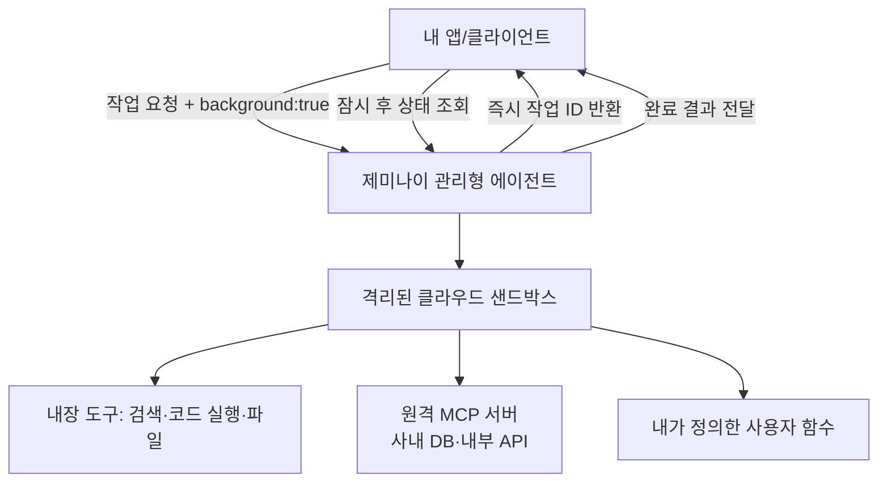

<div class="ai-knowledge-shell">

<aside class="ai-knowledge-sidebar">
  <p class="ai-eyebrow">CATEGORIES</p>
  <nav class="ai-cat-tree"><details class="ai-cat" open><summary><span class="catname">에이전트 오케스트레이션</span><span class="catcount">6</span></summary><ul><li><a href="https://altjs4510.github.io/ai_news_blog/knowledge/20260805/"><span class="kdate">2026-08-05</span><span class="ktitle">TencentCloud/TencentDB-Agent-Memory — 대화·문서·코드를 …</span></a></li><li><a href="https://altjs4510.github.io/ai_news_blog/knowledge/20260707/"><span class="kdate">2026-07-07</span><span class="ktitle">AI Hero Skills Catalog — 실무 엔지니어를 위한 재사용 가능한 판단 …</span></a></li><li><a href="https://altjs4510.github.io/ai_news_blog/knowledge/20260623/"><span class="kdate">2026-06-23</span><span class="ktitle">bytedance/deer-flow — 샌드박스·메모리·서브에이전트·메시지 게이트웨이를…</span></a></li><li><a href="https://altjs4510.github.io/ai_news_blog/knowledge/20260602/"><span class="kdate">2026-06-02</span><span class="ktitle">revfactory/harness — 도메인별 에이전트 팀과 스킬을 자동 설계하는 메타…</span></a></li><li><a href="https://altjs4510.github.io/ai_news_blog/knowledge/20260529/"><span class="kdate">2026-05-29</span><span class="ktitle">Introducing dynamic workflows in Claude Code</span></a></li><li><a href="https://altjs4510.github.io/ai_news_blog/knowledge/20260507/"><span class="kdate">2026-05-07</span><span class="ktitle">ruvnet/ruflo — Claude 멀티 에이전트 오케스트레이션 플랫폼</span></a></li></ul></details><details class="ai-cat" open><summary><span class="catname">MCP &amp; 도구 통합</span><span class="catcount">17</span></summary><ul><li><a href="https://altjs4510.github.io/ai_news_blog/knowledge/20260802/"><span class="kdate">2026-08-02</span><span class="ktitle">Stateless MCP has recaptured my interest (and in…</span></a></li><li><a href="https://altjs4510.github.io/ai_news_blog/knowledge/20260801/"><span class="kdate">2026-08-01</span><span class="ktitle">different-ai/openwork — Claude Cowork의 오픈소스 대체 에…</span></a></li><li><a href="https://altjs4510.github.io/ai_news_blog/knowledge/20260731/"><span class="kdate">2026-07-31</span><span class="ktitle">different-ai/openwork — Claude Cowork의 오픈소스 대안(o…</span></a></li><li><a href="https://altjs4510.github.io/ai_news_blog/knowledge/20260729/"><span class="kdate">2026-07-29</span><span class="ktitle">Bringing MCP 2026-07-28 to Claude</span></a></li><li><a href="https://altjs4510.github.io/ai_news_blog/knowledge/20260721/"><span class="kdate">2026-07-21</span><span class="ktitle">tirth8205/code-review-graph — 로컬 우선 코드 인텔리전스 그래프…</span></a></li><li><a href="https://altjs4510.github.io/ai_news_blog/knowledge/20260719/"><span class="kdate">2026-07-19</span><span class="ktitle">tirth8205/code-review-graph — 로컬 우선 코드 인텔리전스 그래프…</span></a></li><li><a href="https://altjs4510.github.io/ai_news_blog/knowledge/20260718/"><span class="kdate">2026-07-18</span><span class="ktitle">tirth8205/code-review-graph — MCP·CLI용 로컬 코드 인텔리…</span></a></li><li><a href="https://altjs4510.github.io/ai_news_blog/knowledge/20260708/" class="current"><span class="kdate">2026-07-08</span><span class="ktitle">Expanding Managed Agents in Gemini API: backgrou…</span></a></li><li><a href="https://altjs4510.github.io/ai_news_blog/knowledge/20260618/"><span class="kdate">2026-06-18</span><span class="ktitle">DeusData/codebase-memory-mcp — 158개 언어 코드베이스를 밀리…</span></a></li><li><a href="https://altjs4510.github.io/ai_news_blog/knowledge/20260606/"><span class="kdate">2026-06-06</span><span class="ktitle">chopratejas/headroom — Compress tool outputs, lo…</span></a></li><li><a href="https://altjs4510.github.io/ai_news_blog/knowledge/20260605/"><span class="kdate">2026-06-05</span><span class="ktitle">chopratejas/headroom — Compress tool outputs, lo…</span></a></li><li><a href="https://altjs4510.github.io/ai_news_blog/knowledge/20260604/"><span class="kdate">2026-06-04</span><span class="ktitle">chopratejas/headroom — Compress tool outputs bef…</span></a></li><li><a href="https://altjs4510.github.io/ai_news_blog/knowledge/20260603/"><span class="kdate">2026-06-03</span><span class="ktitle">How Bad MCP design cost your Agent 5× more token…</span></a></li><li><a href="https://altjs4510.github.io/ai_news_blog/knowledge/20260523/"><span class="kdate">2026-05-23</span><span class="ktitle">colbymchenry/codegraph — 사전 인덱싱된 코드 지식 그래프 MCP</span></a></li><li><a href="https://altjs4510.github.io/ai_news_blog/knowledge/20260517/"><span class="kdate">2026-05-17</span><span class="ktitle">I gave my LLM 100,000+ tools — Lazy Discovery &a…</span></a></li><li><a href="https://altjs4510.github.io/ai_news_blog/knowledge/20260509/"><span class="kdate">2026-05-09</span><span class="ktitle">How to connect 100 MCP servers without the conte…</span></a></li><li><a href="https://altjs4510.github.io/ai_news_blog/knowledge/20260506/"><span class="kdate">2026-05-06</span><span class="ktitle">mksglu/context-mode — AI 코딩 에이전트용 컨텍스트 윈도우 최적화</span></a></li></ul></details><details class="ai-cat" open><summary><span class="catname">코딩 에이전트</span><span class="catcount">21</span></summary><ul><li><a href="https://altjs4510.github.io/ai_news_blog/knowledge/20260811/"><span class="kdate">2026-08-11</span><span class="ktitle">PrimeIntellect-ai/prime-agent — 장기 자율 실행을 전제로 설계…</span></a></li><li><a href="https://altjs4510.github.io/ai_news_blog/knowledge/20260810/"><span class="kdate">2026-08-10</span><span class="ktitle">Auto mode is now the default in Claude Code for …</span></a></li><li><a href="https://altjs4510.github.io/ai_news_blog/knowledge/20260809/"><span class="kdate">2026-08-09</span><span class="ktitle">PrimeIntellect-ai/prime-agent — 코딩 워크플로우·장기 자율 작…</span></a></li><li><a href="https://altjs4510.github.io/ai_news_blog/knowledge/20260808/"><span class="kdate">2026-08-08</span><span class="ktitle">PrimeIntellect-ai/prime-agent — 코딩 워크플로우와 장시간 자율…</span></a></li><li><a href="https://altjs4510.github.io/ai_news_blog/knowledge/20260804/"><span class="kdate">2026-08-04</span><span class="ktitle">esengine/DeepSeek-Reasonix — prefix-cache 안정성을 축…</span></a></li><li><a href="https://altjs4510.github.io/ai_news_blog/knowledge/20260728/"><span class="kdate">2026-07-28</span><span class="ktitle">alibaba/open-code-review — 결정론적 파이프라인 + LLM 에이전트…</span></a></li><li><a href="https://altjs4510.github.io/ai_news_blog/knowledge/20260725/"><span class="kdate">2026-07-25</span><span class="ktitle">The new rules of context engineering for Claude …</span></a></li><li><a href="https://altjs4510.github.io/ai_news_blog/knowledge/20260722/"><span class="kdate">2026-07-22</span><span class="ktitle">tirth8205/code-review-graph — MCP·CLI용 로컬 우선 코드 …</span></a></li><li><a href="https://altjs4510.github.io/ai_news_blog/knowledge/20260714/"><span class="kdate">2026-07-14</span><span class="ktitle">Graphify-Labs/graphify — 코드베이스를 질의 가능한 지식 그래프로 만…</span></a></li><li><a href="https://altjs4510.github.io/ai_news_blog/knowledge/20260705/"><span class="kdate">2026-07-05</span><span class="ktitle">openai/codex-plugin-cc — Claude Code에서 Codex를 위임…</span></a></li><li><a href="https://altjs4510.github.io/ai_news_blog/knowledge/20260626/"><span class="kdate">2026-06-26</span><span class="ktitle">google-labs-code/design.md — 코딩 에이전트에게 디자인 시스템을 …</span></a></li><li><a href="https://altjs4510.github.io/ai_news_blog/knowledge/20260619/"><span class="kdate">2026-06-19</span><span class="ktitle">Claude Code now supports artifacts</span></a></li><li><a href="https://altjs4510.github.io/ai_news_blog/knowledge/20260530/"><span class="kdate">2026-05-30</span><span class="ktitle">Leonxlnx/taste-skill — AI에게 좋은 취향을 부여해 generic s…</span></a></li><li><a href="https://altjs4510.github.io/ai_news_blog/knowledge/20260528/"><span class="kdate">2026-05-28</span><span class="ktitle">Building self-improving tax agents with Codex</span></a></li><li><a href="https://altjs4510.github.io/ai_news_blog/knowledge/20260526/"><span class="kdate">2026-05-26</span><span class="ktitle">colbymchenry/codegraph — Pre-indexed code knowle…</span></a></li><li><a href="https://altjs4510.github.io/ai_news_blog/knowledge/20260524/"><span class="kdate">2026-05-24</span><span class="ktitle">colbymchenry/codegraph — Pre-indexed code knowle…</span></a></li><li><a href="https://altjs4510.github.io/ai_news_blog/knowledge/20260521/"><span class="kdate">2026-05-21</span><span class="ktitle">colbymchenry/codegraph — Pre-indexed code knowle…</span></a></li><li><a href="https://altjs4510.github.io/ai_news_blog/knowledge/20260512/"><span class="kdate">2026-05-12</span><span class="ktitle">agentmemory — Persistent memory for AI coding ag…</span></a></li><li><a href="https://altjs4510.github.io/ai_news_blog/knowledge/20260510/"><span class="kdate">2026-05-10</span><span class="ktitle">addyosmani/agent-skills — Production-grade engin…</span></a></li><li><a href="https://altjs4510.github.io/ai_news_blog/knowledge/20260508/"><span class="kdate">2026-05-08</span><span class="ktitle">addyosmani/agent-skills — Production-grade engin…</span></a></li><li><a href="https://altjs4510.github.io/ai_news_blog/knowledge/20260505/"><span class="kdate">2026-05-05</span><span class="ktitle">mattpocock/skills — Skills for Real Engineers (.…</span></a></li></ul></details><details class="ai-cat" open><summary><span class="catname">모델 &amp; 연구</span><span class="catcount">5</span></summary><ul><li><a href="https://altjs4510.github.io/ai_news_blog/knowledge/20260716-proprag/"><span class="kdate">2026-07-16</span><span class="ktitle">PropRAG — 프로포지션 경로 위 beam search로 멀티홉 검색 안내</span></a></li><li><a href="https://altjs4510.github.io/ai_news_blog/knowledge/20260620/"><span class="kdate">2026-06-20</span><span class="ktitle">zai-org/GLM-5 — From Vibe Coding to Agentic Engi…</span></a></li><li><a href="https://altjs4510.github.io/ai_news_blog/knowledge/20260617/"><span class="kdate">2026-06-17</span><span class="ktitle">Predicting model behavior before release by simu…</span></a></li><li><a href="https://altjs4510.github.io/ai_news_blog/knowledge/20260516/"><span class="kdate">2026-05-16</span><span class="ktitle">STALE — 에이전트가 자기 기억의 유효성을 인지할 수 있는가</span></a></li><li><a href="https://altjs4510.github.io/ai_news_blog/knowledge/20260513/"><span class="kdate">2026-05-13</span><span class="ktitle">Thinking Machines' Native Interaction Models — T…</span></a></li></ul></details><details class="ai-cat" open><summary><span class="catname">인프라 &amp; 컴퓨트</span><span class="catcount">7</span></summary><ul><li><a href="https://altjs4510.github.io/ai_news_blog/knowledge/20260806/"><span class="kdate">2026-08-06</span><span class="ktitle">cloudflare/computer — 에이전트에게 컴퓨터를 통째로 주는 엣지 실행 샌…</span></a></li><li><a href="https://altjs4510.github.io/ai_news_blog/knowledge/20260724/"><span class="kdate">2026-07-24</span><span class="ktitle">diegosouzapw/OmniRoute — 단일 엔드포인트로 278+ 프로바이더·50…</span></a></li><li><a href="https://altjs4510.github.io/ai_news_blog/knowledge/20260723/"><span class="kdate">2026-07-23</span><span class="ktitle">diegosouzapw/OmniRoute — 268+ 프로바이더를 단일 엔드포인트로 묶…</span></a></li><li><a href="https://altjs4510.github.io/ai_news_blog/knowledge/20260630/"><span class="kdate">2026-06-30</span><span class="ktitle">Introducing the Claude apps gateway for Amazon B…</span></a></li><li><a href="https://altjs4510.github.io/ai_news_blog/knowledge/20260611/"><span class="kdate">2026-06-11</span><span class="ktitle">The evolution of agentic surfaces: building with…</span></a></li><li><a href="https://altjs4510.github.io/ai_news_blog/knowledge/20260522/"><span class="kdate">2026-05-22</span><span class="ktitle">Giving Agents Computers — Ivan Burazin, Daytona</span></a></li><li><a href="https://altjs4510.github.io/ai_news_blog/knowledge/20260520/"><span class="kdate">2026-05-20</span><span class="ktitle">New in Claude Managed Agents: self-hosted sandbo…</span></a></li></ul></details><details class="ai-cat" open><summary><span class="catname">보안 &amp; 거버넌스</span><span class="catcount">14</span></summary><ul><li><a href="https://altjs4510.github.io/ai_news_blog/knowledge/20260730/"><span class="kdate">2026-07-30</span><span class="ktitle">Anatomy of a Frontier Lab Agent Intrusion: A Tec…</span></a></li><li><a href="https://altjs4510.github.io/ai_news_blog/knowledge/20260716/"><span class="kdate">2026-07-16</span><span class="ktitle">Dicklesworthstone/destructive_command_guard — 에이…</span></a></li><li><a href="https://altjs4510.github.io/ai_news_blog/knowledge/20260715/"><span class="kdate">2026-07-15</span><span class="ktitle">Dicklesworthstone/destructive_command_guard — 에이…</span></a></li><li><a href="https://altjs4510.github.io/ai_news_blog/knowledge/20260710/"><span class="kdate">2026-07-10</span><span class="ktitle">70개 MCP 서버 strace 런타임 감사 — 부팅 시 아웃바운드 호출 서버 적발</span></a></li><li><a href="https://altjs4510.github.io/ai_news_blog/knowledge/20260704/"><span class="kdate">2026-07-04</span><span class="ktitle">Cloudflare is about to block AI agents by defaul…</span></a></li><li><a href="https://altjs4510.github.io/ai_news_blog/knowledge/20260703/"><span class="kdate">2026-07-03</span><span class="ktitle">Giving admins more visibility and control over C…</span></a></li><li><a href="https://altjs4510.github.io/ai_news_blog/knowledge/20260625/"><span class="kdate">2026-06-25</span><span class="ktitle">Agent identity in Claude Tag: a new access model…</span></a></li><li><a href="https://altjs4510.github.io/ai_news_blog/knowledge/20260624/"><span class="kdate">2026-06-24</span><span class="ktitle">Agent identity in Claude Tag: a new access model…</span></a></li><li><a href="https://altjs4510.github.io/ai_news_blog/knowledge/20260614/"><span class="kdate">2026-06-14</span><span class="ktitle">NVIDIA/SkillSpector — Security scanner for AI ag…</span></a></li><li><a href="https://altjs4510.github.io/ai_news_blog/knowledge/20260613/"><span class="kdate">2026-06-13</span><span class="ktitle">Fable 5's guardrails got bypassed in 48 hours — …</span></a></li><li><a href="https://altjs4510.github.io/ai_news_blog/knowledge/20260612/"><span class="kdate">2026-06-12</span><span class="ktitle">NVIDIA/SkillSpector — AI 에이전트 스킬용 보안 스캐너</span></a></li><li><a href="https://altjs4510.github.io/ai_news_blog/knowledge/20260607/"><span class="kdate">2026-06-07</span><span class="ktitle">OpenAI Help: Lockdown Mode</span></a></li><li><a href="https://altjs4510.github.io/ai_news_blog/knowledge/20260531/"><span class="kdate">2026-05-31</span><span class="ktitle">How we contain Claude across products</span></a></li><li><a href="https://altjs4510.github.io/ai_news_blog/knowledge/20260527/"><span class="kdate">2026-05-27</span><span class="ktitle">Microsoft Copilot Cowork Exfiltrates Files</span></a></li></ul></details><details class="ai-cat" open><summary><span class="catname">응용 사례</span><span class="catcount">7</span></summary><ul><li><a href="https://altjs4510.github.io/ai_news_blog/knowledge/20260726/"><span class="kdate">2026-07-26</span><span class="ktitle">citrolabs/ego-lite — 로그인된 브라우저 상태를 AI 에이전트와 공유하는…</span></a></li><li><a href="https://altjs4510.github.io/ai_news_blog/knowledge/20260717/"><span class="kdate">2026-07-17</span><span class="ktitle">After a year building agent memory, 'save everyt…</span></a></li><li><a href="https://altjs4510.github.io/ai_news_blog/knowledge/20260712/"><span class="kdate">2026-07-12</span><span class="ktitle">Do Automated Evals Work?</span></a></li><li><a href="https://altjs4510.github.io/ai_news_blog/knowledge/20260709/"><span class="kdate">2026-07-09</span><span class="ktitle">mvanhorn/last30days-skill — Reddit·X·YouTube·HN·…</span></a></li><li><a href="https://altjs4510.github.io/ai_news_blog/knowledge/20260621/"><span class="kdate">2026-06-21</span><span class="ktitle">calesthio/OpenMontage — 12 파이프라인·52 도구·500+ 스킬을 …</span></a></li><li><a href="https://altjs4510.github.io/ai_news_blog/knowledge/20260609/"><span class="kdate">2026-06-09</span><span class="ktitle">Building intelligent apps for Apple platforms wi…</span></a></li><li><a href="https://altjs4510.github.io/ai_news_blog/knowledge/20260514/"><span class="kdate">2026-05-14</span><span class="ktitle">Introducing Claude for Small Business</span></a></li></ul></details><details class="ai-cat" open><summary><span class="catname">산업 동향</span><span class="catcount">8</span></summary><ul><li><a href="https://altjs4510.github.io/ai_news_blog/knowledge/20260711/"><span class="kdate">2026-07-11</span><span class="ktitle">OpenAI says GPT 5.6 is the 'preferred model' for…</span></a></li><li><a href="https://altjs4510.github.io/ai_news_blog/knowledge/20260702/"><span class="kdate">2026-07-02</span><span class="ktitle">How Cursor deploys AI inside the enterprise (For…</span></a></li><li><a href="https://altjs4510.github.io/ai_news_blog/knowledge/20260701/"><span class="kdate">2026-07-01</span><span class="ktitle">Google OKF (Open Knowledge Format) — 벤더 중립 에이전트 …</span></a></li><li><a href="https://altjs4510.github.io/ai_news_blog/knowledge/20260616/"><span class="kdate">2026-06-16</span><span class="ktitle">Why AI hasn't replaced software engineers, and w…</span></a></li><li><a href="https://altjs4510.github.io/ai_news_blog/knowledge/20260610/"><span class="kdate">2026-06-10</span><span class="ktitle">Fable 5 just made cost-aware model routing manda…</span></a></li><li><a href="https://altjs4510.github.io/ai_news_blog/knowledge/20260519/"><span class="kdate">2026-05-19</span><span class="ktitle">Anthropic acquires Stainless</span></a></li><li><a href="https://altjs4510.github.io/ai_news_blog/knowledge/20260515/"><span class="kdate">2026-05-15</span><span class="ktitle">Clawdmeter — Claude Code 사용량을 데스크톱 대시보드로</span></a></li><li><a href="https://altjs4510.github.io/ai_news_blog/knowledge/20260504/"><span class="kdate">2026-05-04</span><span class="ktitle">Agents for Everything Else: Codex for Knowledge …</span></a></li></ul></details></nav>
</aside>

<article class="ai-knowledge-article">

<header class="ai-post-hero">
  <p class="ai-eyebrow"><a class="ai-back" href="../">KNOWLEDGE</a> · 2026-07-08 · 오늘의 학습</p>
  <h2 class="ai-post-title">Expanding Managed Agents in Gemini API: background tasks, remote MCP and more</h2>
</header>

> 원문: [Expanding Managed Agents in Gemini API: background tasks, remote MCP and more](https://blog.google/innovation-and-ai/technology/developers-tools/expanding-managed-agents-gemini-api/)

## 📌 학습 정리

### 1. 한 줄로 말하면

구글이 만든 "AI 비서 실행 환경"이 이제 오래 걸리는 일도 뒤에서 조용히 처리하고, 회사 내부 도구에도 직접 연결할 수 있게 되었다는 이야기예요.

### 2. 왜 이게 만들어졌어요?

원래 AI 에이전트에게 뭔가 시키려면, 요청을 보낸 뒤 답이 올 때까지 계속 연결을 붙잡고 기다려야 했어요. 그런데 "이 저장소 전체를 훑어서 정리해줘" 같은 무거운 작업은 몇 분, 심하면 몇십 분이 걸리기 때문에, 그 사이에 연결이 끊기거나 타임아웃이 나기 일쑤였어요. 게다가 회사 내부 데이터베이스나 사내 API에 접근하려면 개발자가 중간에 별도의 다리 역할 코드(프록시)를 직접 짜야 했고, 로그인 토큰이 만료되면 처음부터 다시 세팅해야 하는 번거로움도 있었어요. 이번 업데이트는 이런 실무에서 자주 부딪히는 불편들을 하나씩 해결하려고 나왔어요.

### 3. 비유로 풀면

이건 마치 세탁소에 옷을 맡기는 것과 비슷해요. 예전에는 세탁이 끝날 때까지 카운터 앞에 서서 기다려야 했다면, 이제는 접수증(작업 ID)만 받아 들고 나갔다가 나중에 찾으러 가면 되는 식이에요. 그리고 세탁소가 우리 회사 창고 열쇠(내부 도구 접근 권한)도 가지고 있어서, "창고에서 이 물건 꺼내와서 세탁까지 해줘" 같은 복합 주문도 한 번에 처리할 수 있게 된 거죠.

그래서 결국 개발자는 "연결이 끊길까 봐" 걱정하지 않고 무거운 작업을 맡길 수 있고, 외부 세계(사내 시스템, 실시간 데이터)와도 정식 통로로 이어붙일 수 있게 되었어요.

### 4. 어떻게 작동하는지 (그림으로)



큰 흐름은 이래요. 내 앱이 "이 작업을 백그라운드로 돌려달라"고 요청하면 서버는 곧바로 작업 ID를 돌려주고, 실제 처리는 격리된 샌드박스 안에서 진행돼요. 그 안에서 에이전트는 필요한 도구들(구글 검색, 코드 실행, 사내 MCP 서버, 내가 짠 함수)을 골라 쓰고, 내 앱은 원할 때 다시 찾아와서 결과를 확인하면 돼요.

### 5. 처음 보는 용어 풀이

- **관리형 에이전트 (Managed Agents)** — 추론·코드 실행·파일 관리 같은 실행 환경을 구글이 알아서 준비해주는 AI 에이전트예요. 개발자는 서버·컨테이너 같은 인프라를 직접 세팅하지 않고 하나의 API 호출로 에이전트를 돌릴 수 있어요.

- **백그라운드 실행 (background execution)** — 오래 걸리는 작업을 서버 쪽에 맡겨두고, 내 앱은 연결을 끊었다가 나중에 상태를 확인하러 오는 방식이에요. HTTP 연결을 억지로 붙잡고 있지 않아도 되니 훨씬 안정적이에요.

- **모델 컨텍스트 프로토콜 (MCP, Model Context Protocol)** — AI 모델이 외부 도구·데이터 소스와 이야기할 때 쓰는 공통 규약이에요. 이 규약을 따르는 서버를 "MCP 서버"라고 부르고, 이번에 원격지에 있는 MCP 서버도 관리형 에이전트에서 바로 붙일 수 있게 됐어요.

- **원격 MCP 서버 연동 (remote MCP server integration)** — 사내 관측 시스템이나 내부 API처럼 회사 안에 있는 시스템을 MCP 방식으로 노출해두면, 별도의 중계 코드 없이 에이전트가 직접 그 서버와 대화할 수 있어요.

- **사용자 정의 함수 호출 (custom function calling)** — 내장 도구 말고, 개발자가 자기 앱 쪽에서 실행하고 싶은 함수를 미리 등록해두는 기능이에요. 에이전트가 그 함수를 부르기로 결정하면 상태가 "요청됨(requires_action)"으로 바뀌고, 실제 실행은 내 클라이언트에서 이뤄져요.

- **자격 증명 갱신 (credential refresh)** — 접근 토큰이나 API 키가 만료됐을 때, 같은 샌드박스 환경 ID를 유지한 채 새 인증 정보만 갈아 끼우는 기능이에요. 이미 설치한 패키지나 파일, 클론한 저장소는 그대로 남아 있어서 처음부터 다시 세팅할 필요가 없어요.

- **샌드박스 (sandbox)** — 다른 시스템에 영향을 주지 않도록 격리된 실행 공간이에요. 에이전트가 여기서 코드를 돌리고 파일을 만들기 때문에, 실수로 뭔가 잘못돼도 외부에는 영향이 없어요.

### 6. 한 발 더 들어가고 싶다면

- [Managed Agents in Gemini API 문서](https://ai.google.dev/gemini-api/docs/agents) — 관리형 에이전트의 전체 구조와 보안 권장 사항을 확인할 수 있어요.
- [백그라운드 실행 가이드](https://ai.google.dev/gemini-api/docs/background-execution) — 오래 걸리는 작업을 어떻게 맡기고 결과를 다시 받아오는지 상세히 나와 있어요.
- [Antigravity 에이전트 문서](https://ai.google.dev/gemini-api/docs/antigravity-agent) — 백그라운드 실행, MCP 서버 연동, 함수 호출, 자격 증명 갱신의 실제 코드 예제(파이썬·cURL 포함)를 볼 수 있어요.
- [에이전트 환경 문서](https://ai.google.dev/gemini-api/docs/agent-environment#refresh-credentials) — 샌드박스 환경을 유지하면서 인증 정보만 갱신하는 방법을 알 수 있어요.
- [Gemini Interactions API 개요](https://ai.google.dev/gemini-api/docs/interactions-overview) — 하나의 엔드포인트로 추론·코드 실행·파일 관리를 함께 처리하는 상위 개념을 파악하기에 좋아요.

---

## 📖 원문 전체 번역 (정독용)

> 의역 최소화한 전체 번역입니다. 큰 흐름은 위 정리에서 잡고, 정확한 워딩이 필요할 땐 이 섹션에서 정독하세요.

# Gemini API의 관리형 에이전트(Managed Agents) 확장: 백그라운드 작업, 원격 MCP 등

2026년 7월 7일 · 읽는 데 약 2분

비동기 상호작용을 위한 백그라운드 실행, 원격 MCP 서버 간편 연결, 커스텀 함수, 자격 증명 갱신 등 새로운 기능 지원을 추가하고 있습니다.

**작성자:**
- Philipp Schmid — Developer Relations Engineer, Google DeepMind
- Mariano Cocirio — Product Manager, Google DeepMind

---

오늘 저희는 [Gemini API의 관리형 에이전트(Managed Agents)](https://ai.google.dev/gemini-api/docs/agents)에 대한 새로운 기능들을 발표합니다. 여기에는 [백그라운드 실행(background execution)](https://ai.google.dev/gemini-api/docs/antigravity-agent#background-execution), [원격 MCP 서버 통합](https://ai.google.dev/gemini-api/docs/antigravity-agent#mcp-servers), [커스텀 함수 호출](https://ai.google.dev/gemini-api/docs/antigravity-agent#function-calling), [상호작용 간 자격 증명 갱신](https://ai.google.dev/gemini-api/docs/agent-environment#refresh-credentials)이 포함됩니다. 이러한 업데이트는 개발자 피드백과 제품 요구사항을 직접적으로 반영하여, 신뢰할 수 있는 프로덕션 수준의 에이전트를 구축할 수 있도록 합니다.

[Gemini Interactions API](https://ai.google.dev/gemini-api/docs/interactions-overview)의 관리형 에이전트를 사용하면 단일 엔드포인트를 호출하는 것만으로 Gemini가 격리된 클라우드 샌드박스 내에서 추론, 코드 실행, 패키지 설치, 파일 관리, 웹 정보 수집을 모두 처리합니다.

**AI 코딩 에이전트를 사용 중이라면**, 담당자에게 Interactions API 스킬을 설치하도록 요청하세요: `npx skills add google-gemini/gemini-skills --skill gemini-interactions-api`

아래 예시는 `@google/genai` JavaScript SDK를 사용합니다. Python 또는 cURL의 경우 [Antigravity 에이전트 문서](https://ai.google.dev/gemini-api/docs/antigravity-agent)를 참고하세요.

```shell
npm install @google/genai
```

---

## 확장된 기능으로 자율 에이전트 구축하기

### 장시간 실행되는 백그라운드 실행

장시간 실행되는 작업에 대해 HTTP 연결을 계속 열어두는 방식은 불안정합니다. [`background: true`](https://ai.google.dev/gemini-api/docs/antigravity-agent#background-execution)를 전달하면 서버에서 비동기적으로 상호작용을 실행할 수 있습니다. API는 즉시 ID를 반환하며, 클라이언트 애플리케이션은 이 ID를 사용하여 상태를 폴링하거나 진행 상황을 스트리밍하거나, 에이전트가 원격에서 작업을 완료하는 동안 나중에 재연결할 수 있습니다. 자세한 내용은 [백그라운드 실행 가이드](https://ai.google.dev/gemini-api/docs/background-execution)를 참고하세요.

```ts
import { GoogleGenAI } from "@google/genai";

const client = new GoogleGenAI({});

// 1. 장시간 실행되는 분석 작업을 백그라운드에서 시작
const interaction = await client.interactions.create({
  agent: "antigravity-preview-05-2026",
  input: "Clone https://github.com/googleapis/js-genai, find all TODO comments in the source code, and categorize them by module and priority in a markdown report.",
  environment: "remote",
  background: true,
});

console.log(`Background task started. Interaction ID: ${interaction.id}`);

// 2. HTTP 소켓을 열어두지 않고 비동기적으로 폴링
let result = interaction;
while (result.status === "in_progress") {
  await new Promise((resolve) => setTimeout(resolve, 5000));
  result = await client.interactions.get(interaction.id);
}

if (result.status === "completed") {
  console.log("Task Completed:\n", result.output_text);
} else {
  console.error(`Task ended with status: ${result.status}`);
}
```

### 원격 MCP 서버 통합

프라이빗 데이터베이스나 내부 API에 접근하기 위해 커스텀 프록시 미들웨어를 직접 작성하는 대신, 이제 관리형 에이전트를 [원격 모델 컨텍스트 프로토콜(MCP) 서버](https://ai.google.dev/gemini-api/docs/antigravity-agent#mcp-servers)에 직접 연결할 수 있습니다.

원격 도구와 내장 샌드박스 기능을 자유롭게 혼합하여 사용할 수 있습니다. 상호작용 시 `mcp_server` 도구를 Google 검색 또는 코드 실행과 함께 전달하면, 에이전트가 안전한 샌드박스에서 사용자의 엔드포인트와 통신할 수 있습니다. 외부 도구 및 API로 에이전트를 확장할 때는 [보안 모범 사례](https://ai.google.dev/gemini-api/docs/agents#security-best-practices)를 따르세요.

```ts
import { GoogleGenAI } from "@google/genai";

const client = new GoogleGenAI({});

const interaction = await client.interactions.create({
  agent: "antigravity-preview-05-2026",
  input: "Check our internal observability server for recent latency spikes in the auth service and correlate them with git commits.",
  environment: "remote",
  tools: [
    { type: "google_search" },
    { type: "code_execution" },
    {
      type: "mcp_server",
      name: "internal_telemetry",
      url: "https://mcp.internal.example.com/mcp",
    },
  ],
});

console.log(interaction.output_text);
```

### 샌드박스 도구와 함께 사용하는 커스텀 함수 호출

로컬 실행을 위해 내장 샌드박스 도구와 함께 [커스텀 도구](https://ai.google.dev/gemini-api/docs/antigravity-agent#function-calling)를 추가할 수 있습니다. API는 단계 매칭(step matching) 방식을 사용합니다. 내장 도구는 서버에서 자동으로 실행되는 반면, 커스텀 함수는 상호작용 상태를 `requires_action`으로 전환하여 클라이언트가 로컬 비즈니스 로직을 실행하도록 합니다.

```ts
import { GoogleGenAI } from "@google/genai";

const client = new GoogleGenAI({});

// 1. 커스텀 도메인 함수 정의
const getWeatherTool = {
  type: "function",
  name: "get_weather",
  description: "Gets the current weather for a given location.",
  parameters: {
    type: "object",
    properties: {
      location: {
        type: "string",
        description: "The city and country, e.g. San Francisco, USA",
      },
    },
    required: ["location"],
  },
};

// 2. 내장 코드 실행과 커스텀 함수를 함께 사용하여 에이전트 호출
const interaction = await client.interactions.create({
  agent: "antigravity-preview-05-2026",
  input: "Check the weather in Tokyo, write a Python script to convert the temperature to Fahrenheit, and save the result to weather.txt.",
  environment: "remote",
  tools: [
    { type: "code_execution" },
    getWeatherTool,
  ],
});

// 3. 커스텀 함수 실행을 명확하게 처리
if (interaction.status === "requires_action") {
  // 파일 시스템 및 샌드박스 도구는 자동으로 실행되어 매칭되는 function_result 단계를 생성합니다.
  // 클라이언트 측 실행이 필요한 보류 중인 도메인 호출만 필터링합니다.
  const executedCalls = new Set(
    interaction.steps
      .filter((s) => s.type === "function_result")
      .map((s) => s.call_id)
  );
  
  const pendingCalls = interaction.steps.filter(
    (s) => s.type === "function_call" && !executedCalls.has(s.id)
  );

  for (const call of pendingCalls) {
    console.log(`Executing client tool: ${call.name} (ID: ${call.id})`);
    // 로컬 API/데이터베이스 쿼리를 실행하고 2번째 턴에서 function_result를 다시 전송합니다.
  }
}
```

### 네트워크 자격 증명 갱신

액세스 토큰과 단기 API 키는 만료됩니다. 다음 상호작용 시 기존 `environment_id`와 함께 새로운 [네트워크 구성](https://ai.google.dev/gemini-api/docs/antigravity-agent#refresh-credentials)을 전달하여 자격 증명을 갱신하거나 키를 교체할 수 있습니다. 새 규칙은 즉시 기존 규칙을 대체합니다. 샌드박스는 파일 시스템 상태, 설치된 패키지, 클론된 저장소를 그대로 유지합니다.

```ts
import { GoogleGenAI } from "@google/genai";
const client = new GoogleGenAI({});

// 1. 첫 번째 상호작용: 초기 토큰 사용
const first = await client.interactions.create({
  agent: "antigravity-preview-05-2026",
  input: "List the files in gs://my-bucket/reports/ using the GCS JSON API.",
  environment: {
    type: "remote",
    network: {
      allowlist: [
        {
          domain: "storage.googleapis.com",
          transform: {
            Authorization: "Bearer INITIAL_TOKEN",
          },
        },
      ],
    },
  },
});

// 2. 이후: 동일한 환경에서 토큰 갱신
const result = await client.interactions.create({
  agent: "antigravity-preview-05-2026",
  input: "Now download the file reports/q1.csv from the same bucket.",
  environment: {
    type: "remote",
    // ... (환경 ID 및 갱신된 자격 증명 전달)
  },
});

</article>

</div>

<!-- ai-related-links -->
<aside class="ai-related-links">
  <p class="ai-eyebrow">관련 학습</p>
  <ul><li><a href="https://altjs4510.github.io/ai_news_blog/knowledge/20260520/"><span class="kdate">2026-05-20</span><span class="ktitle">New in Claude Managed Agents: self-hosted sandbo…</span></a></li><li><a href="https://altjs4510.github.io/ai_news_blog/knowledge/20260611/"><span class="kdate">2026-06-11</span><span class="ktitle">The evolution of agentic surfaces: building with…</span></a></li></ul>
</aside>
<!-- /ai-related-links -->
