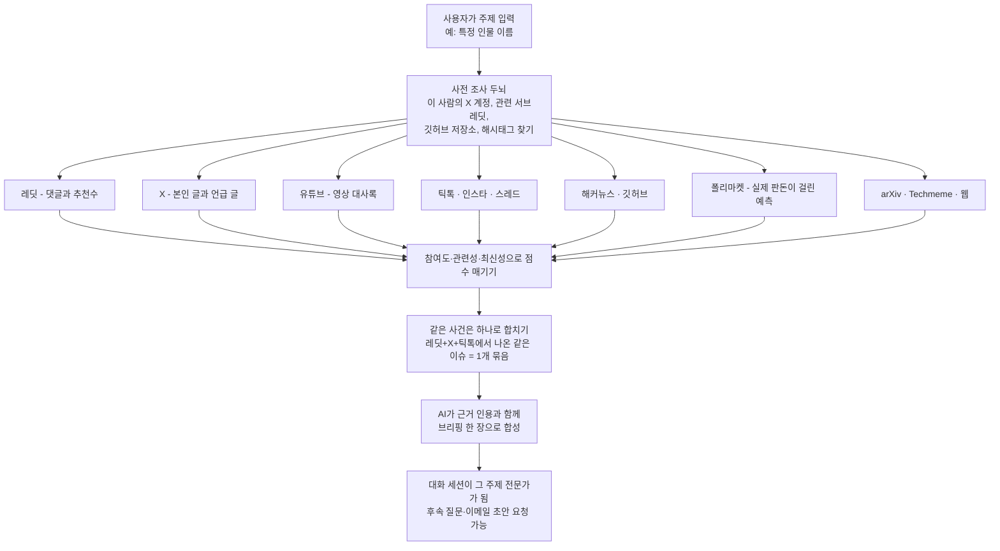

<div class="ai-knowledge-shell">

<aside class="ai-knowledge-sidebar">
  <p class="ai-eyebrow">CATEGORIES</p>
  <nav class="ai-cat-tree"><details class="ai-cat" open><summary><span class="catname">에이전트 오케스트레이션</span><span class="catcount">10</span></summary><ul><li><a href="https://altjs4510.github.io/ai_news_blog/knowledge/20260828/"><span class="kdate">2026-08-28</span><span class="ktitle">Google ADK for Python v2.8.0 — RemoteA2aAgent 네이…</span></a></li><li><a href="https://altjs4510.github.io/ai_news_blog/knowledge/20260826/"><span class="kdate">2026-08-26</span><span class="ktitle">apache/maka — 도구 호출·권한 결정·종료 이벤트를 append-only 로그…</span></a></li><li><a href="https://altjs4510.github.io/ai_news_blog/knowledge/20260823/"><span class="kdate">2026-08-23</span><span class="ktitle">The Evolution of the Agent Harness — 하네스가 모델 가중치…</span></a></li><li><a href="https://altjs4510.github.io/ai_news_blog/knowledge/20260805/"><span class="kdate">2026-08-05</span><span class="ktitle">TencentCloud/TencentDB-Agent-Memory — 대화·문서·코드를 …</span></a></li><li><a href="https://altjs4510.github.io/ai_news_blog/knowledge/20260701/"><span class="kdate">2026-07-01</span><span class="ktitle">Google OKF (Open Knowledge Format) — 벤더 중립 에이전트 …</span></a></li><li><a href="https://altjs4510.github.io/ai_news_blog/knowledge/20260623/"><span class="kdate">2026-06-23</span><span class="ktitle">bytedance/deer-flow — 샌드박스·메모리·서브에이전트·메시지 게이트웨이를…</span></a></li><li><a href="https://altjs4510.github.io/ai_news_blog/knowledge/20260611/"><span class="kdate">2026-06-11</span><span class="ktitle">The evolution of agentic surfaces: building with…</span></a></li><li><a href="https://altjs4510.github.io/ai_news_blog/knowledge/20260602/"><span class="kdate">2026-06-02</span><span class="ktitle">revfactory/harness — 도메인별 에이전트 팀과 스킬을 자동 설계하는 메타…</span></a></li><li><a href="https://altjs4510.github.io/ai_news_blog/knowledge/20260529/"><span class="kdate">2026-05-29</span><span class="ktitle">Introducing dynamic workflows in Claude Code</span></a></li><li><a href="https://altjs4510.github.io/ai_news_blog/knowledge/20260507/"><span class="kdate">2026-05-07</span><span class="ktitle">ruvnet/ruflo — Claude 멀티 에이전트 오케스트레이션 플랫폼</span></a></li></ul></details><details class="ai-cat" open><summary><span class="catname">MCP &amp; 도구 통합</span><span class="catcount">17</span></summary><ul><li><a href="https://altjs4510.github.io/ai_news_blog/knowledge/20260802/"><span class="kdate">2026-08-02</span><span class="ktitle">Stateless MCP has recaptured my interest (and in…</span></a></li><li><a href="https://altjs4510.github.io/ai_news_blog/knowledge/20260801/"><span class="kdate">2026-08-01</span><span class="ktitle">different-ai/openwork — Claude Cowork의 오픈소스 대체 에…</span></a></li><li><a href="https://altjs4510.github.io/ai_news_blog/knowledge/20260731/"><span class="kdate">2026-07-31</span><span class="ktitle">different-ai/openwork — Claude Cowork의 오픈소스 대안(o…</span></a></li><li><a href="https://altjs4510.github.io/ai_news_blog/knowledge/20260729/"><span class="kdate">2026-07-29</span><span class="ktitle">Bringing MCP 2026-07-28 to Claude</span></a></li><li><a href="https://altjs4510.github.io/ai_news_blog/knowledge/20260721/"><span class="kdate">2026-07-21</span><span class="ktitle">tirth8205/code-review-graph — 로컬 우선 코드 인텔리전스 그래프…</span></a></li><li><a href="https://altjs4510.github.io/ai_news_blog/knowledge/20260719/"><span class="kdate">2026-07-19</span><span class="ktitle">tirth8205/code-review-graph — 로컬 우선 코드 인텔리전스 그래프…</span></a></li><li><a href="https://altjs4510.github.io/ai_news_blog/knowledge/20260718/"><span class="kdate">2026-07-18</span><span class="ktitle">tirth8205/code-review-graph — MCP·CLI용 로컬 코드 인텔리…</span></a></li><li><a href="https://altjs4510.github.io/ai_news_blog/knowledge/20260709/" class="current"><span class="kdate">2026-07-09</span><span class="ktitle">mvanhorn/last30days-skill — Reddit·X·YouTube·HN·…</span></a></li><li><a href="https://altjs4510.github.io/ai_news_blog/knowledge/20260708/"><span class="kdate">2026-07-08</span><span class="ktitle">Expanding Managed Agents in Gemini API: backgrou…</span></a></li><li><a href="https://altjs4510.github.io/ai_news_blog/knowledge/20260618/"><span class="kdate">2026-06-18</span><span class="ktitle">DeusData/codebase-memory-mcp — 158개 언어 코드베이스를 밀리…</span></a></li><li><a href="https://altjs4510.github.io/ai_news_blog/knowledge/20260606/"><span class="kdate">2026-06-06</span><span class="ktitle">chopratejas/headroom — Compress tool outputs, lo…</span></a></li><li><a href="https://altjs4510.github.io/ai_news_blog/knowledge/20260605/"><span class="kdate">2026-06-05</span><span class="ktitle">chopratejas/headroom — Compress tool outputs, lo…</span></a></li><li><a href="https://altjs4510.github.io/ai_news_blog/knowledge/20260604/"><span class="kdate">2026-06-04</span><span class="ktitle">chopratejas/headroom — Compress tool outputs bef…</span></a></li><li><a href="https://altjs4510.github.io/ai_news_blog/knowledge/20260603/"><span class="kdate">2026-06-03</span><span class="ktitle">How Bad MCP design cost your Agent 5× more token…</span></a></li><li><a href="https://altjs4510.github.io/ai_news_blog/knowledge/20260523/"><span class="kdate">2026-05-23</span><span class="ktitle">colbymchenry/codegraph — 사전 인덱싱된 코드 지식 그래프 MCP</span></a></li><li><a href="https://altjs4510.github.io/ai_news_blog/knowledge/20260517/"><span class="kdate">2026-05-17</span><span class="ktitle">I gave my LLM 100,000+ tools — Lazy Discovery &a…</span></a></li><li><a href="https://altjs4510.github.io/ai_news_blog/knowledge/20260509/"><span class="kdate">2026-05-09</span><span class="ktitle">How to connect 100 MCP servers without the conte…</span></a></li></ul></details><details class="ai-cat" open><summary><span class="catname">코딩 에이전트</span><span class="catcount">27</span></summary><ul><li><a href="https://altjs4510.github.io/ai_news_blog/knowledge/20260822/"><span class="kdate">2026-08-22</span><span class="ktitle">mattpocock/skills — Skills for Real Engineers (하…</span></a></li><li><a href="https://altjs4510.github.io/ai_news_blog/knowledge/20260820/"><span class="kdate">2026-08-20</span><span class="ktitle">akitaonrails/ai-memory — 코딩 에이전트 CLI의 장기 메모리와 벤더…</span></a></li><li><a href="https://altjs4510.github.io/ai_news_blog/knowledge/20260819/"><span class="kdate">2026-08-19</span><span class="ktitle">akitaonrails/ai-memory — 코딩 에이전트 CLI 간 장기 기억과 벤더…</span></a></li><li><a href="https://altjs4510.github.io/ai_news_blog/knowledge/20260814/"><span class="kdate">2026-08-14</span><span class="ktitle">cathrynlavery/diagram-design — Claude Code용 에디토리…</span></a></li><li><a href="https://altjs4510.github.io/ai_news_blog/knowledge/20260811/"><span class="kdate">2026-08-11</span><span class="ktitle">PrimeIntellect-ai/prime-agent — 장기 자율 실행을 전제로 설계…</span></a></li><li><a href="https://altjs4510.github.io/ai_news_blog/knowledge/20260810/"><span class="kdate">2026-08-10</span><span class="ktitle">Auto mode is now the default in Claude Code for …</span></a></li><li><a href="https://altjs4510.github.io/ai_news_blog/knowledge/20260809/"><span class="kdate">2026-08-09</span><span class="ktitle">PrimeIntellect-ai/prime-agent — 코딩 워크플로우·장기 자율 작…</span></a></li><li><a href="https://altjs4510.github.io/ai_news_blog/knowledge/20260808/"><span class="kdate">2026-08-08</span><span class="ktitle">PrimeIntellect-ai/prime-agent — 코딩 워크플로우와 장시간 자율…</span></a></li><li><a href="https://altjs4510.github.io/ai_news_blog/knowledge/20260804/"><span class="kdate">2026-08-04</span><span class="ktitle">esengine/DeepSeek-Reasonix — prefix-cache 안정성을 축…</span></a></li><li><a href="https://altjs4510.github.io/ai_news_blog/knowledge/20260728/"><span class="kdate">2026-07-28</span><span class="ktitle">alibaba/open-code-review — 결정론적 파이프라인 + LLM 에이전트…</span></a></li><li><a href="https://altjs4510.github.io/ai_news_blog/knowledge/20260725/"><span class="kdate">2026-07-25</span><span class="ktitle">The new rules of context engineering for Claude …</span></a></li><li><a href="https://altjs4510.github.io/ai_news_blog/knowledge/20260722/"><span class="kdate">2026-07-22</span><span class="ktitle">tirth8205/code-review-graph — MCP·CLI용 로컬 우선 코드 …</span></a></li><li><a href="https://altjs4510.github.io/ai_news_blog/knowledge/20260714/"><span class="kdate">2026-07-14</span><span class="ktitle">Graphify-Labs/graphify — 코드베이스를 질의 가능한 지식 그래프로 만…</span></a></li><li><a href="https://altjs4510.github.io/ai_news_blog/knowledge/20260707/"><span class="kdate">2026-07-07</span><span class="ktitle">AI Hero Skills Catalog — 실무 엔지니어를 위한 재사용 가능한 판단 …</span></a></li><li><a href="https://altjs4510.github.io/ai_news_blog/knowledge/20260705/"><span class="kdate">2026-07-05</span><span class="ktitle">openai/codex-plugin-cc — Claude Code에서 Codex를 위임…</span></a></li><li><a href="https://altjs4510.github.io/ai_news_blog/knowledge/20260626/"><span class="kdate">2026-06-26</span><span class="ktitle">google-labs-code/design.md — 코딩 에이전트에게 디자인 시스템을 …</span></a></li><li><a href="https://altjs4510.github.io/ai_news_blog/knowledge/20260619/"><span class="kdate">2026-06-19</span><span class="ktitle">Claude Code now supports artifacts</span></a></li><li><a href="https://altjs4510.github.io/ai_news_blog/knowledge/20260530/"><span class="kdate">2026-05-30</span><span class="ktitle">Leonxlnx/taste-skill — AI에게 좋은 취향을 부여해 generic s…</span></a></li><li><a href="https://altjs4510.github.io/ai_news_blog/knowledge/20260528/"><span class="kdate">2026-05-28</span><span class="ktitle">Building self-improving tax agents with Codex</span></a></li><li><a href="https://altjs4510.github.io/ai_news_blog/knowledge/20260526/"><span class="kdate">2026-05-26</span><span class="ktitle">colbymchenry/codegraph — Pre-indexed code knowle…</span></a></li><li><a href="https://altjs4510.github.io/ai_news_blog/knowledge/20260524/"><span class="kdate">2026-05-24</span><span class="ktitle">colbymchenry/codegraph — Pre-indexed code knowle…</span></a></li><li><a href="https://altjs4510.github.io/ai_news_blog/knowledge/20260521/"><span class="kdate">2026-05-21</span><span class="ktitle">colbymchenry/codegraph — Pre-indexed code knowle…</span></a></li><li><a href="https://altjs4510.github.io/ai_news_blog/knowledge/20260512/"><span class="kdate">2026-05-12</span><span class="ktitle">agentmemory — Persistent memory for AI coding ag…</span></a></li><li><a href="https://altjs4510.github.io/ai_news_blog/knowledge/20260510/"><span class="kdate">2026-05-10</span><span class="ktitle">addyosmani/agent-skills — Production-grade engin…</span></a></li><li><a href="https://altjs4510.github.io/ai_news_blog/knowledge/20260508/"><span class="kdate">2026-05-08</span><span class="ktitle">addyosmani/agent-skills — Production-grade engin…</span></a></li><li><a href="https://altjs4510.github.io/ai_news_blog/knowledge/20260506/"><span class="kdate">2026-05-06</span><span class="ktitle">mksglu/context-mode — AI 코딩 에이전트용 컨텍스트 윈도우 최적화</span></a></li><li><a href="https://altjs4510.github.io/ai_news_blog/knowledge/20260505/"><span class="kdate">2026-05-05</span><span class="ktitle">mattpocock/skills — Skills for Real Engineers (.…</span></a></li></ul></details><details class="ai-cat" open><summary><span class="catname">모델 &amp; 연구</span><span class="catcount">7</span></summary><ul><li><a href="https://altjs4510.github.io/ai_news_blog/knowledge/20260821/"><span class="kdate">2026-08-21</span><span class="ktitle">volcengine/OpenViking — 에이전트 메모리·Knowledge RAG·스…</span></a></li><li><a href="https://altjs4510.github.io/ai_news_blog/knowledge/20260717/"><span class="kdate">2026-07-17</span><span class="ktitle">After a year building agent memory, 'save everyt…</span></a></li><li><a href="https://altjs4510.github.io/ai_news_blog/knowledge/20260716-proprag/"><span class="kdate">2026-07-16</span><span class="ktitle">PropRAG — 프로포지션 경로 위 beam search로 멀티홉 검색 안내</span></a></li><li><a href="https://altjs4510.github.io/ai_news_blog/knowledge/20260620/"><span class="kdate">2026-06-20</span><span class="ktitle">zai-org/GLM-5 — From Vibe Coding to Agentic Engi…</span></a></li><li><a href="https://altjs4510.github.io/ai_news_blog/knowledge/20260617/"><span class="kdate">2026-06-17</span><span class="ktitle">Predicting model behavior before release by simu…</span></a></li><li><a href="https://altjs4510.github.io/ai_news_blog/knowledge/20260516/"><span class="kdate">2026-05-16</span><span class="ktitle">STALE — 에이전트가 자기 기억의 유효성을 인지할 수 있는가</span></a></li><li><a href="https://altjs4510.github.io/ai_news_blog/knowledge/20260513/"><span class="kdate">2026-05-13</span><span class="ktitle">Thinking Machines' Native Interaction Models — T…</span></a></li></ul></details><details class="ai-cat" open><summary><span class="catname">인프라 &amp; 컴퓨트</span><span class="catcount">8</span></summary><ul><li><a href="https://altjs4510.github.io/ai_news_blog/knowledge/20260813/"><span class="kdate">2026-08-13</span><span class="ktitle">semantica-agi/semantica — 컨텍스트와 책임 추적을 위한 그래프 네이…</span></a></li><li><a href="https://altjs4510.github.io/ai_news_blog/knowledge/20260812/"><span class="kdate">2026-08-12</span><span class="ktitle">semantica-agi/semantica — 컨텍스트와 '책임 추적 가능한(accou…</span></a></li><li><a href="https://altjs4510.github.io/ai_news_blog/knowledge/20260806/"><span class="kdate">2026-08-06</span><span class="ktitle">cloudflare/computer — 에이전트에게 컴퓨터를 통째로 주는 엣지 실행 샌…</span></a></li><li><a href="https://altjs4510.github.io/ai_news_blog/knowledge/20260724/"><span class="kdate">2026-07-24</span><span class="ktitle">diegosouzapw/OmniRoute — 단일 엔드포인트로 278+ 프로바이더·50…</span></a></li><li><a href="https://altjs4510.github.io/ai_news_blog/knowledge/20260723/"><span class="kdate">2026-07-23</span><span class="ktitle">diegosouzapw/OmniRoute — 268+ 프로바이더를 단일 엔드포인트로 묶…</span></a></li><li><a href="https://altjs4510.github.io/ai_news_blog/knowledge/20260630/"><span class="kdate">2026-06-30</span><span class="ktitle">Introducing the Claude apps gateway for Amazon B…</span></a></li><li><a href="https://altjs4510.github.io/ai_news_blog/knowledge/20260522/"><span class="kdate">2026-05-22</span><span class="ktitle">Giving Agents Computers — Ivan Burazin, Daytona</span></a></li><li><a href="https://altjs4510.github.io/ai_news_blog/knowledge/20260520/"><span class="kdate">2026-05-20</span><span class="ktitle">New in Claude Managed Agents: self-hosted sandbo…</span></a></li></ul></details><details class="ai-cat" open><summary><span class="catname">보안 &amp; 거버넌스</span><span class="catcount">16</span></summary><ul><li><a href="https://altjs4510.github.io/ai_news_blog/knowledge/20260827/"><span class="kdate">2026-08-27</span><span class="ktitle">Claude in Chrome is generally available</span></a></li><li><a href="https://altjs4510.github.io/ai_news_blog/knowledge/20260819-mind-viruses/"><span class="kdate">2026-08-19</span><span class="ktitle">탈옥도, 인젝션도 없이 — 대화로만 퍼지는 에이전트의 '마인드 바이러스'</span></a></li><li><a href="https://altjs4510.github.io/ai_news_blog/knowledge/20260730/"><span class="kdate">2026-07-30</span><span class="ktitle">Anatomy of a Frontier Lab Agent Intrusion: A Tec…</span></a></li><li><a href="https://altjs4510.github.io/ai_news_blog/knowledge/20260716/"><span class="kdate">2026-07-16</span><span class="ktitle">Dicklesworthstone/destructive_command_guard — 에이…</span></a></li><li><a href="https://altjs4510.github.io/ai_news_blog/knowledge/20260715/"><span class="kdate">2026-07-15</span><span class="ktitle">Dicklesworthstone/destructive_command_guard — 에이…</span></a></li><li><a href="https://altjs4510.github.io/ai_news_blog/knowledge/20260710/"><span class="kdate">2026-07-10</span><span class="ktitle">70개 MCP 서버 strace 런타임 감사 — 부팅 시 아웃바운드 호출 서버 적발</span></a></li><li><a href="https://altjs4510.github.io/ai_news_blog/knowledge/20260704/"><span class="kdate">2026-07-04</span><span class="ktitle">Cloudflare is about to block AI agents by defaul…</span></a></li><li><a href="https://altjs4510.github.io/ai_news_blog/knowledge/20260703/"><span class="kdate">2026-07-03</span><span class="ktitle">Giving admins more visibility and control over C…</span></a></li><li><a href="https://altjs4510.github.io/ai_news_blog/knowledge/20260625/"><span class="kdate">2026-06-25</span><span class="ktitle">Agent identity in Claude Tag: a new access model…</span></a></li><li><a href="https://altjs4510.github.io/ai_news_blog/knowledge/20260624/"><span class="kdate">2026-06-24</span><span class="ktitle">Agent identity in Claude Tag: a new access model…</span></a></li><li><a href="https://altjs4510.github.io/ai_news_blog/knowledge/20260614/"><span class="kdate">2026-06-14</span><span class="ktitle">NVIDIA/SkillSpector — Security scanner for AI ag…</span></a></li><li><a href="https://altjs4510.github.io/ai_news_blog/knowledge/20260613/"><span class="kdate">2026-06-13</span><span class="ktitle">Fable 5's guardrails got bypassed in 48 hours — …</span></a></li><li><a href="https://altjs4510.github.io/ai_news_blog/knowledge/20260612/"><span class="kdate">2026-06-12</span><span class="ktitle">NVIDIA/SkillSpector — AI 에이전트 스킬용 보안 스캐너</span></a></li><li><a href="https://altjs4510.github.io/ai_news_blog/knowledge/20260607/"><span class="kdate">2026-06-07</span><span class="ktitle">OpenAI Help: Lockdown Mode</span></a></li><li><a href="https://altjs4510.github.io/ai_news_blog/knowledge/20260531/"><span class="kdate">2026-05-31</span><span class="ktitle">How we contain Claude across products</span></a></li><li><a href="https://altjs4510.github.io/ai_news_blog/knowledge/20260527/"><span class="kdate">2026-05-27</span><span class="ktitle">Microsoft Copilot Cowork Exfiltrates Files</span></a></li></ul></details><details class="ai-cat" open><summary><span class="catname">응용 사례</span><span class="catcount">5</span></summary><ul><li><a href="https://altjs4510.github.io/ai_news_blog/knowledge/20260726/"><span class="kdate">2026-07-26</span><span class="ktitle">citrolabs/ego-lite — 로그인된 브라우저 상태를 AI 에이전트와 공유하는…</span></a></li><li><a href="https://altjs4510.github.io/ai_news_blog/knowledge/20260712/"><span class="kdate">2026-07-12</span><span class="ktitle">Do Automated Evals Work?</span></a></li><li><a href="https://altjs4510.github.io/ai_news_blog/knowledge/20260621/"><span class="kdate">2026-06-21</span><span class="ktitle">calesthio/OpenMontage — 12 파이프라인·52 도구·500+ 스킬을 …</span></a></li><li><a href="https://altjs4510.github.io/ai_news_blog/knowledge/20260609/"><span class="kdate">2026-06-09</span><span class="ktitle">Building intelligent apps for Apple platforms wi…</span></a></li><li><a href="https://altjs4510.github.io/ai_news_blog/knowledge/20260514/"><span class="kdate">2026-05-14</span><span class="ktitle">Introducing Claude for Small Business</span></a></li></ul></details><details class="ai-cat" open><summary><span class="catname">산업 동향</span><span class="catcount">7</span></summary><ul><li><a href="https://altjs4510.github.io/ai_news_blog/knowledge/20260711/"><span class="kdate">2026-07-11</span><span class="ktitle">OpenAI says GPT 5.6 is the 'preferred model' for…</span></a></li><li><a href="https://altjs4510.github.io/ai_news_blog/knowledge/20260702/"><span class="kdate">2026-07-02</span><span class="ktitle">How Cursor deploys AI inside the enterprise (For…</span></a></li><li><a href="https://altjs4510.github.io/ai_news_blog/knowledge/20260616/"><span class="kdate">2026-06-16</span><span class="ktitle">Why AI hasn't replaced software engineers, and w…</span></a></li><li><a href="https://altjs4510.github.io/ai_news_blog/knowledge/20260610/"><span class="kdate">2026-06-10</span><span class="ktitle">Fable 5 just made cost-aware model routing manda…</span></a></li><li><a href="https://altjs4510.github.io/ai_news_blog/knowledge/20260519/"><span class="kdate">2026-05-19</span><span class="ktitle">Anthropic acquires Stainless</span></a></li><li><a href="https://altjs4510.github.io/ai_news_blog/knowledge/20260515/"><span class="kdate">2026-05-15</span><span class="ktitle">Clawdmeter — Claude Code 사용량을 데스크톱 대시보드로</span></a></li><li><a href="https://altjs4510.github.io/ai_news_blog/knowledge/20260504/"><span class="kdate">2026-05-04</span><span class="ktitle">Agents for Everything Else: Codex for Knowledge …</span></a></li></ul></details></nav>
</aside>

<article class="ai-knowledge-article">

<header class="ai-post-hero">
  <p class="ai-eyebrow"><a class="ai-back" href="../">KNOWLEDGE</a> · 2026-07-09 · 오늘의 학습</p>
  <h2 class="ai-post-title">mvanhorn/last30days-skill — Reddit·X·YouTube·HN·Polymarket 크로스 리서치 Claude Skill</h2>
</header>

> 원문: [mvanhorn/last30days-skill — Reddit·X·YouTube·HN·Polymarket 크로스 리서치 Claude Skill](https://github.com/mvanhorn/last30days-skill)

## 📌 학습 정리

### 1. 한 줄로 말하면

세상 사람들이 최근 한 달간 레딧, X(옛 트위터), 유튜브에 남긴 진짜 반응을 한꺼번에 긁어와서 "요즘 이 사람/회사/주제, 실제로 뭐가 벌어지고 있는지" 브리핑 한 장으로 정리해주는 도구예요.

### 2. 왜 이게 만들어졌어요?

원래 사람에 대해 알아보려면 구글 검색을 해왔죠. 그런데 구글은 대체로 편집자(기자, 블로거)가 쓴 글 위주로 모아 보여줘요. 정작 사람들이 실시간으로 떠드는 레딧 댓글, X 스레드, 틱톡 반응, 유튜브 45분짜리 리뷰 안의 핵심 문장은 검색 결과에 잘 잡히지 않고요.

게다가 각 플랫폼은 담벼락이 높아요. 챗지피티(ChatGPT)는 레딧과 계약이 있지만 X랑 틱톡은 못 뒤지고, 제미나이(Gemini)는 유튜브는 보지만 레딧은 못 보고, 클로드(Claude)는 셋 다 기본으론 못 봐요. 그래서 만든 사람이 "내 로그인 정보와 API 키를 내가 직접 붙여서, 인공지능(AI) 에이전트가 이 모든 데를 한 번에 뒤지게 하면 어떨까?" 하고 만든 게 이 스킬이에요. 처음엔 AI 업계 최신 정보를 따라잡으려고 만들었다가, 미팅 전 상대방 리서치나 여행지 사전 조사 같은 데까지 쓰임새가 넓어졌다고 해요.

### 3. 비유로 풀면

이건 마치 **취재 인턴 열댓 명을 동시에 파견하는 것** 같은 거예요. 한 명은 레딧 댓글창을 뒤지고, 한 명은 X에서 그 사람 트윗을 훑고, 한 명은 유튜브 45분짜리 영상 대사록을 훑어서 핵심 다섯 문장만 뽑아 오고, 또 한 명은 폴리마켓(Polymarket)에 걸린 실제 판돈을 확인하죠. 다들 각자 다녀와서 편집장(AI 판정자) 앞에 자료를 던지면, 편집장이 중복된 얘기는 합치고 사람들이 정말 많이 반응한 순서로 정리해 브리핑을 씁니다.

그래서 결국 "검색 결과 링크 목록"이 아니라 **"지금 사람들이 실제로 이 주제에 대해 뭐라고 하고 있는가"의 요약 한 장**이 나와요.

### 4. 어떻게 작동하는지 (그림으로)



핵심은 세 단계예요. 먼저 "누구/어디를 뒤져야 하는지"를 AI가 스스로 정하고, 그다음 모든 소스를 병렬로 훑고, 마지막에 중복을 합쳐서 사람들의 실제 반응 순으로 정렬한 브리핑을 만들어요. 한 번 돌리고 나면 그 대화창은 해당 주제에 대한 "임시 전문가" 상태가 되어서, 이어서 질문하거나 초안을 부탁할 수 있어요.

### 5. 처음 보는 용어 풀이

- **스킬 (Skill)** — 클로드(Claude) 같은 AI에게 "이런 절차로 이런 일을 해줘"라고 미리 정의해둔 작업 묶음이에요. 이 프로젝트는 리서치 워크플로 전체를 스킬 한 개로 포장한 사례예요.
- **에이전트 스킬스 (Agent Skills)** — 스킬을 여러 AI 도구(커서, 코파일럿, 제미나이 CLI 등 50여 종)에서 공통으로 설치·실행할 수 있게 해주는 개방형 규격이에요. `npx skills add ...` 명령이 여기에 해당해요. [agentskills.io](https://agentskills.io/)
- **폴리마켓 (Polymarket)** — 실제 돈을 걸고 미래 사건의 확률을 매기는 예측 시장이에요. 여기 나오는 74%는 여론조사가 아니라 "돈을 건 사람들이 74% 확률로 본다"는 뜻이라 헛소리 필터 역할을 해요.
- **arXiv** — 정식 학술지 게재 전 논문을 무료로 공개하는 저장소예요. "요즘 화제인 기술의 실제 논문"을 찾을 때 쓰여요.
- **Techmeme** — 사람이 큐레이션한 IT 뉴스 헤드라인 모음 사이트예요. 편집자 관점의 시각 하나를 더해주는 역할이에요.
- **MCP 번들 (.mcpb)** — 모델 컨텍스트 프로토콜(Model Context Protocol)이라는 규격으로 만든 확장 패키지 파일이에요. 클로드 데스크톱 설정창에 파일 하나 끌어다 놓으면 설치가 끝나요.
- **ScrapeCreators** — 틱톡·인스타·링크드인처럼 공개 API가 까다로운 소셜 데이터를 대신 긁어다 주는 유료 서비스예요. 무료 호출 1만 회를 주고 그 이후는 사용량 과금이에요.
- **yt-dlp** — 유튜브 등에서 영상 자막(대사록)을 뽑아오는 무료 오픈소스 도구예요. `brew install yt-dlp` 한 줄이면 깔려요.
- **베스트 테이크 스코어링 (Best Takes scoring)** — 정보의 관련성뿐 아니라 "얼마나 웃긴가, 얼마나 퍼졌나"까지 반영해 대표 코멘트를 뽑는 점수 방식이에요. 딱딱한 뉴스 요약을 넘어 커뮤니티 특유의 뉘앙스를 살리기 위한 장치예요.

### 6. 한 발 더 들어가고 싶다면

- [skills/last30days/SKILL.md](https://github.com/mvanhorn/last30days-skill/blob/main/skills/last30days/SKILL.md) — 실제로 AI가 읽는 스킬 정의 원본이에요. "리서치 워크플로를 스킬 한 파일로 어떻게 기술하는가"의 실물 예시를 볼 수 있어요.
- [CONFIGURATION.md](https://github.com/mvanhorn/last30days-skill/blob/main/CONFIGURATION.md) — 결과 저장 위치, 소스별 키 매트릭스, 감시 목록·주간 브리핑 같은 반복 실행 패턴 설정법이 정리돼 있어요.
- [Agent Skills 카탈로그](https://agentskills.io/) — 커서·코파일럿·제미나이 CLI 등 어떤 AI 도구에서 스킬을 공통으로 설치·실행할 수 있는지, 그 생태계 전체를 훑어볼 수 있어요.
- [vercel-labs/skills 저장소](https://github.com/vercel-labs/skills) — 위 에이전트 스킬스 규격을 만든 곳이에요. 지원 도구 목록과 명세를 확인할 수 있어요.
- [CHANGELOG.md](https://github.com/mvanhorn/last30days-skill/blob/main/CHANGELOG.md) — 커뮤니티 기여자 52명이 반년 새 무엇을 붙였는지 시간순으로 볼 수 있어서, 오픈소스 스킬이 어떻게 진화하는지 참고 사례로 쓸 만해요.

---

## 📖 원문 전체 번역 (정독용)

> 의역 최소화한 전체 번역입니다. 큰 흐름은 위 정리에서 잡고, 정확한 워딩이 필요할 땐 이 섹션에서 정독하세요.

[](https://github.com/mvanhorn/last30days-skill/blob/main/media/pr-assets/last30days-ad.gif)

[](https://github.com/mvanhorn/last30days-skill)

[](https://trendshift.io/repositories/21997)

**편집자가 아닌, 업보트·좋아요·실제 돈으로 점수를 매기는 AI 에이전트 주도 검색 엔진.**

이 README는 현재 v3 파이프라인을 추적합니다. 런타임 스킬 명세는 [skills/last30days/SKILL.md](https://github.com/mvanhorn/last30days-skill/blob/main/skills/last30days/SKILL.md)에 있으며, 최신 명령어 및 설정 동작의 단일 진실 공급원(source of truth)입니다.

**Claude Code (권장 — 마켓플레이스를 통해 자동 업데이트):**

```
/plugin marketplace add mvanhorn/last30days-skill
/plugin install last30days
```

**Codex, Cursor, Copilot, Gemini CLI, 또는 50개 이상의 [Agent Skills](https://agentskills.io/) 호스트:**

```
npx skills add mvanhorn/last30days-skill -g
```

(`-g`는 사용자 디렉터리에 전역 설치하여 모든 프로젝트에서 사용 가능합니다. 프로젝트별로 범위를 한정하려면 생략하세요.)

아래 [설치 (Install)](https://github.com/mvanhorn/last30days-skill#install) 섹션에서 더 많은 설치 옵션(claude.ai 웹, OpenClaw, 수동 설치)을 확인하세요.

설정이 필요 없습니다. Reddit, HN, Polymarket, GitHub는 즉시 동작합니다. 한 번 실행하면 설정 마법사가 30초 안에 X, YouTube, TikTok, arXiv, Techmeme 등을 잠금 해제합니다.

---

Reddit 업보트. X 좋아요. YouTube 트랜스크립트. TikTok 참여도. 실제 돈과 내부 정보로 뒷받침된 Polymarket 배당률. 이것은 매일 수백만 명이 자신의 관심과 지갑으로 투표하는 결과입니다. `/last30days`는 이 모든 것을 병렬로 검색하고, 실제 사람들이 실제로 참여하는 내용을 기준으로 점수를 매기며, AI 에이전트 심판이 이를 하나의 브리프(brief)로 종합합니다.

Google은 편집자들을 집계합니다. `/last30days`는 사람들을 검색합니다.

이 검색은 다른 어디서도 얻을 수 없습니다. 단일 AI가 이 모든 것에 접근할 수 없기 때문입니다. Google 검색은 Reddit 댓글이나 X 게시물을 건드리지 않습니다. ChatGPT는 Reddit과 계약이 있지만 X나 TikTok을 검색할 수 없습니다. Gemini는 YouTube는 있지만 Reddit이 없습니다. Claude는 이 중 어느 것도 기본적으로 갖추고 있지 않습니다. 각 플랫폼은 자체 API, 자체 토큰, 자체 인증을 가진 폐쇄형 정원(walled garden)입니다. 하지만 자신의 키와 브라우저 세션을 가져오면, 갑자기 AI 에이전트가 이 모든 것을 동시에 검색하고, 서로 점수를 매기고, 실제로 중요한 것이 무엇인지 알려줄 수 있습니다.

그것이 바로 핵심입니다. 하나의 더 나은 검색 엔진이 아닙니다. 에이전트에 의해 연결된 수십 개의 단절된 플랫폼입니다.

```
/last30days Peter Steinberger
```

내일 미팅이 있습니다. Google에서 그 사람을 검색하면 2023년 LinkedIn이 나옵니다. `/last30days`는 이번 달에 그가 실제로 무엇을 하고 있는지 알려줍니다: OpenAI에 합류해 Codex 작업 중, 서드파티 에이전트에 대한 Anthropic의 금지에 맞서 싸우는 중, 85% 병합률로 23개의 PR 제출 중, 크로스 디바이스 에이전트 제어를 위한 "LobsterOS" 구축 중, 그리고 r/ClaudeCode에서 그가 영웅인지 "참을 수 없는 사람"인지 569 업보트 논쟁 중. X 게시물, Reddit 스레드, YouTube 트랜스크립트, GitHub 커밋에 흩어져 있는 정보들. 이 중 어느 것도 Google에는 없었습니다.

## 이것이 존재하는 이유

저는 AI 분야의 흐름을 따라가기 위해 이것을 만들었습니다. 매일 모든 것이 바뀌고, Reddit과 X의 너드들은 항상 가장 먼저 파악합니다. 더 나은 프롬프트가 필요했는데, 트레이닝 데이터는 항상 커뮤니티가 이미 파악한 것보다 몇 달씩 뒤처져 있었습니다.

하지만 이것은 더 큰 무언가가 되었습니다. 이제 저는 영업 전화 전에 비즈니스에 대한 최근 30일간의 진실을 파악하기 위해 실행합니다. 미팅 전에 상대방의 최근 트윗과 팟캐스트 트랜스크립트를 읽기 위해 사용합니다. Disney World 여행 전에 어떤 놀이기구가 운휴 중인지, 커뮤니티가 Genie+에 대해 어떻게 말하는지 파악하기 위해 사용합니다. 무언가를 만들기 전에 사람들이 실제로 어떤 문제에 부딪히고 있는지 파악하기 위해 사용합니다.

CEO와 미팅한다면, 지난 30일 동안의 모든 트윗과 YouTube 트랜스크립트를 읽었습니까? 저는 읽었습니다.

## 출처, 사람들이 점수를 매기다

| 출처 | 사람들이 알려주는 것 |
| --- | --- |
| **Reddit** | 필터링되지 않은 의견. 실제 업보트 수가 있는 인기 댓글, 무료, API 키 불필요. Google이 묻어버리는 진짜 의견들. |
| **X / Twitter** | 핫 테이크, 전문가 스레드, 속보 반응. 가장 먼저 알고, 가장 먼저 논쟁한다. |
| **YouTube** | 45분짜리 심층 분석. 전체 트랜스크립트에서 중요한 5개의 인용 가능한 문장을 검색. |
| **TikTok** | 360만 명에게 닿는 크리에이터가 Google에서는 절대 찾을 수 없는 관점을 제공. |
| **Instagram Reels** | 음성 트랜스크립트가 있는 인플루언서 시각. 시각적 문화 신호. |
| **Hacker News** | 개발자 컨센서스. 825포인트, 899개 댓글. 기술 인력이 실제로 논쟁하는 곳. |
| **Polymarket** | 의견이 아닙니다. 배당률입니다. 실제 돈으로 뒷받침됩니다. 앨범 판매에 96% 신뢰도. 인수에 4%. |
| **GitHub** | 사람의 경우: PR 속도, 스타 수 기준 상위 저장소, 릴리스 노트. 주제의 경우: 이슈 및 토론. |
| **Digg** | Digg의 AI 1000 리더보드(X의 고신호 AI 계정 ~1,000개)에서 큐레이션된 스토리 클러스터, 귀속 가능한 인라인 인용문 포함(X 인증 불필요). `digg-pp-cli`가 PATH에 있을 때 자동 활성화. |
| **arXiv** | 과대 홍보 뒤에 있는 논문들. 해당 기간의 새로운 연구, 무료, API 키 불필요. `arxiv-pp-cli`가 PATH에 있을 때 자동 활성화(최초 실행 설정 시 설치). |
| **Techmeme** | 여러분의 30일 기간으로 날짜가 제한된 기술 뉴스 편집 레이어. 무료, API 키 불필요. `techmeme-pp-cli`가 PATH에 있을 때 자동 활성화(최초 실행 설정 시 설치). |
| **LinkedIn** | 전문적 신호. 게시물과 아티클, 아티클은 고신호로 가중치 부여. |
| **StockTwits** | 트레이더 감성. 주제가 티커 또는 암호화폐일 때 자동 활성화. |
| **Threads** | 포스트-Twitter 텍스트 레이어. 크리에이터와 브랜드의 대화. |
| **Pinterest** | 시각적 발견. 제품과 아이디어에 대한 핀, 저장, 댓글. |
| **Bluesky** | 탈중앙화 소셜 레이어. 포스트-Twitter 이주에서 나온 AT 프로토콜 게시물. |
| **Perplexity** | 그라운드된 Sonar 종합, 원시 Search API 행, Deep Research. |
| **Web** | 편집 커버리지, 블로그 비교. 많은 신호 중 하나이며, 유일한 신호가 아닙니다. |

커뮤니티 기여자들이 계속 더 많은 것을 추가하고 있습니다. Truth Social, 샤오홍수(小红书, RED) 등이 엔진에 포함되어 있으며 더 많은 것들이 준비 중입니다.

1,500 업보트를 받은 Reddit 스레드는 아무도 읽지 않은 블로그 포스트보다 강한 신호입니다. 360만 뷰를 받은 TikTok은 보도자료보다 문화적으로 관련 있는 것이 무엇인지 더 잘 알려줍니다. 66,000달러 거래량이 뒷받침된 Polymarket 배당률은 전문가의 추측보다 반박하기 어렵습니다.

종합은 실제 사람들이 실제로 참여한 내용을 기준으로 순위를 매깁니다. SEO 관련성이 아닌, 소셜 관련성입니다.

## 사람들이 실제로 사용하는 방법

**미팅 전.**`/last30days Peter Steinberger` - OpenAI Codex 팀에 합류, 서드파티 에이전트에 대한 Anthropic의 금지에 맞서 싸우는 중, GitHub에서 85% 병합률로 23개의 PR 병합, 크로스 디바이스 에이전트 제어를 위한 LobsterOS 구축 중. r/ClaudeCode: "OpenClaw가 출시된 이후, API가 아닌 다른 것을 통해 실행하면 결국 금지될 것이라는 것은 널리 알려져 있었다" (227 업보트). 이건 LinkedIn에 없습니다.

**채용 신호를 파악하기 위해.**`/last30days Listen Labs --hiring-signals` - 현재 채용 공고 및 경력 페이지가 포커스 이동에 대한 인용 근거가 됩니다: 엔터프라이즈 보안, 고객 성공, 인프라, 또는 제품 확장 분야로의 채용. 보고서는 채용이 시사하는 것을 말하지, 로드맵이 출시할 것을 말하지 않습니다.

**무언가가 터졌을 때.**`/last30days Kanye West` - 영국이 그의 비자를 차단하고, Wireless Festival이 취소되었으며, 스폰서들이 떠났습니다. 하지만 BULLY는 Billboard에서 2위로 데뷔했습니다. Fantano는 "야이 안식년"에서 돌아와 리뷰를 냈습니다 (63만3천 뷰). SoFi 홈커밍에서 Lauryn Hill과 Travis Scott을 불러 44곡을 공연했습니다. Polymarket: "Kanye가 다시 트윗할 것인가?" 86% Yes. 23개의 Reddit 스레드, 17개의 YouTube 영상, 8만6천 업보트.

**도구 비교를 위해.**`/last30days OpenClaw vs Hermes vs Paperclip` - "이것들은 경쟁자가 아니라 레이어입니다." OpenClaw는 실행자(GitHub 스타 35만1천 개, 라이브), Hermes는 자가 개선 두뇌(스타 3만1천 개), Paperclip은 조직도(스타 4만9천 개). 스타 수는 오래된 블로그 포스트가 아닌 GitHub API에서 실시간으로 가져옴. 아키텍처, 메모리, 보안, 최적 사용 사례가 담긴 나란히 보기 표. @IMJustinBrooke 인용: "OpenClaw = 이상해, Hermes = 리자몽."

**세상을 이해하기 위해.**`/last30days Iran vs USA` - 전쟁 38일째. Trump의 화요일 이란의 호르무즈 해협 재개방 요구 기한. 미국 전투기 2대 격추. 배럴당 126달러 유가. IEA는 이를 "세계 석유 시장 역사상 최대 공급 차질"이라고 불렀습니다. Polymarket: 12월 31일까지 휴전 가능성 74%. X 게시물 27개, YouTube 영상 10개, 예측 시장 20개.

**여행 전.**`/last30days Universal Epic Universe` - 확장 공사가 이미 진행 중. "프로젝트 680" 허가 신청. 불꽃놀이 쇼는 인프라로 확인되었지만 미발표. 대기 시간: Mine-Cart Madness 평균 148분. 아직 연간 패스 없으며 현지인들은 불만. Stardust Racers는 4월 5일까지 보수 점검으로 운휴 중.

**빠르게 무언가를 배우기 위해.**`/last30days Nano Banana Pro prompting` - JSON 구조화 프롬프트가 태그 수프를 대체하고 있습니다. @pictsbyai의 중첩 형식은 "개념 번짐(concept bleeding)"을 방지합니다. 수정 우선 워크플로우가 재생성보다 낫습니다. 그런 다음 커뮤니티가 효과 있다고 말한 내용을 정확히 사용한 프로덕션 프롬프트를 작성해줍니다.

## 새로운 것

v3.3 발표 이후 v3.11.1 기준(2026년 7월): 52명의 커뮤니티 기여자들이 참여한 122개를 포함하여 총 175개의 PR이 15번의 릴리스에 걸쳐 병합되었습니다. 다음은 포함된 내용입니다.

### OpenAI Codex에서 1등급(First-class)

`/last30days`는 이제 가이드 설치가 있는 네이티브 Codex 플러그인입니다 — 포팅이 아닌, 진정한 1등급 시민입니다. 렌더러 인식 인용은 Codex 출력이 URL 수프가 아닌 브리프처럼 읽히도록 합니다(#694). 동일한 엔진이 Claude Code, Cursor, Copilot, Gemini CLI, Claude Desktop, OpenClaw, 50개 이상의 Agent Skills 호스트에서 실행됩니다. Codex 플러그인 매니페스트는 [@rfoust](https://github.com/rfoust)(#686), Codex 인증 수정은 [@tmchow](https://github.com/tmchow)(#698)에 의해 작성되었습니다.

### arXiv, Techmeme, Digg - 무료, API 키 없음

arXiv는 과대 홍보 뒤의 논문을 제공하고, Techmeme은 편집 기술 뉴스 레이어를 제공합니다 — 무료, 키 없음. 최초 실행 설정 시 CLI를 설치하여 자동으로 활성화됩니다(#709). Digg의 AI 1000 스토리 클러스터는 동일한 방식으로 X 인증 없이 제공됩니다 — 설정이 무료 Digg CLI를 자동으로 설치합니다(#590). Trustpilot은 소비자 브랜드 리서치를 위해 옵트인으로 제공됩니다.

### 무료 Reddit에 실제 점수와 인기 댓글 추가

Reddit의 공개 .json API가 종료되었지만, 무료 경로가 더 강력하게 돌아왔습니다. 키 없는 RSS + shreddit 스크래핑(#457), arctic-shift를 통한 실제 업보트 수를 포함한 전용 서브레딧 검색(#696), 그리고 바이럴 오프 토픽 게시물이 브리프를 납치할 수 없도록 하는 관련성 기준(#488, [@rzachsmith](https://github.com/rzachsmith) 감사). API 키 없음. 실제 점수. 인기 댓글 포함.

### 모든 브리프에서 최고의 댓글

댓글은 이제 여러 출처에 걸쳐 기본으로 켜진 레이어입니다: 하나의 게시물에서 다섯 개의 핫 테이크가 모두 나오지 않도록 순위 기반 다양성을 갖춘 Instagram 댓글(#751), YouTube 댓글과 yt-dlp가 실패할 경우를 위한 ScrapeCreators 트랜스크립트 백업(#637), 그리고 커뮤니티에서 가장 웃긴 라인이 점수 매기기에서 살아남도록 Best Takes에 가중치가 적용된 군중 투표 댓글(#592, #608).

### 단 하나의 doctor 명령어

헬스 체크를 요청하면 doctor가 모든 소스를 실행한 다음 정확한 수정 방법을 처방합니다 — 어떤 키가 누락되었는지, 어떤 CLI가 PATH에 없는지, 어떤 쿠키가 만료되었는지(#753). 더 이상 X 결과가 왜 빈약한지 추측할 필요가 없습니다.

### X 검색, 재구축

X 파이프라인이 전면 재구축되었습니다: 본인의 게시물과 그에 대한 대화가 모두 순위에 오르도록 FROM 및 ABOUT 레인(#610), 사람 인식 서브쿼리 명확화(#611), 상호작용 신호 순위 매기기를 통한 1인칭 저작권 근거(#613), 자동 백엔드 장애 조치가 있는 단일 X 소스(#622). 그리고 인증을 실제로 탐지하는 정직한 `--diagnose`(#609).

### 더 많은 소스 추가

아티클을 고신호로 사용하는 ScrapeCreators를 통한 LinkedIn([@ravstr](https://github.com/ravstr), #702). 티커 및 암호화폐 주제에 대해 자동 활성화되는 StockTwits([@wtiwana](https://github.com/wtiwana), #658). 직접 API 모드와 비동기 Deep Research로 성장한 Perplexity([@sk-holmes](https://github.com/sk-holmes), #629).

### 커뮤니티에 의해 강화

보안 파동은 거의 전적으로 커뮤니티 작업이었습니다: HTML 렌더러의 저장형 XSS 수정([@iliaal](https://github.com/iliaal), [@aaronjmars](https://github.com/aaronjmars)), 잠금된 쿠키 임시 파일, OpenSSF Scorecard 및 빌드 출처 증명을 통한 공급망 강화 CI([@shaanmajid](https://github.com/shaanmajid), [@hammadxcm](https://github.com/hammadxcm), [@aniruddh909](https://github.com/aniruddh909)), Semgrep 및 OSV-Scanner 스캔과 PR 종속성 검토 게이트([@23241a6749](https://github.com/23241a6749)), 60%에서 도입되어 이후 84%로 높아진 테스트 커버리지 기준([@gourab5139014](https://github.com/gourab5139014)), 그리고 모든 CRITICAL 발견 사항이 해소된 Hermes 보안 스캔(#768).

### 더 넓게 도달

히브리어 및 비라틴 언어([@dudyme](https://github.com/dudyme)). 중국어 소스를 위한 CJK 인식 토큰화([@An-idd](https://github.com/An-idd)). Windows 호환성 파동. Chromium 계열 전체에 걸친 쿠키 추출 — Brave, Edge, Vivaldi, Opera, Arc([@andrey-esipov](https://github.com/andrey-esipov)) — 그리고 macOS Keychain 및 Linux pass(1) 자격 증명 소스. `--as-of` 과거 데이터 조회([@chiyi-creator](https://github.com/chiyi-creator)). uv를 통한 Python 3.12 자동 프로비저닝([@buntysomroy](https://github.com/buntysomroy)). 회사 채용 페이지를 읽는 `--hiring-signals`. 실행 간 워치리스트 델타.

### v3부터 이어지는 기존 기능

v3의 기반은 모두 그대로 남아 있습니다: 단일 API 호출이 실행되기 전에 올바른 핸들, 서브레딧, 해시태그를 해결하는 사전 리서치 브레인([@j-sperling](https://github.com/j-sperling) 제작); 관련성과 함께 유머와 바이럴리티 점수를 매기는 Best Takes 점수 매기기; 크로스 소스 클러스터 병합; 단일 패스 비교(12분이 아닌 3분 만에 "CLI vs MCP"); 자동 검색되는 `--competitors` 비교; GitHub 사람 모드(`--github-user=steipete`); ELI5 모드(실행 후 "eli5 on"); 공유 가능하고 자급자족하는 HTML 브리프(`--emit=html`). 설정 옵션은 [CONFIGURATION.md](https://github.com/mvanhorn/last30days-skill/blob/main/CONFIGURATION.md)에 있습니다.

## 설치

| 환경 | 설치 | 업데이트 |
| --- | --- | --- |
| **Claude Code** (권장) | `/plugin marketplace add mvanhorn/last30days-skill` | 마켓플레이스를 통해 자동, 또는 `claude plugin update last30days@last30days-skill` |
| **Codex, Cursor, Copilot, Gemini CLI, 또는 50개 이상의 [Agent Skills](https://agentskills.io/) 호스트** | `npx skills add mvanhorn/last30days-skill -g` | `npx skills update last30days -g` |
| **claude.ai** (웹) | [`last30days.skill` 다운로드](https://github.com/mvanhorn/last30days-skill/releases/latest/download/last30days.skill) 후 claude.ai > Customize > Skills > + > Create skill > Upload a skill을 통해 업로드 | 다시 다운로드하여 재업로드 |
| **Claude Desktop** | [플랫폼용 `.mcpb` 다운로드](https://github.com/mvanhorn/last30days-skill/releases/latest) 후 Settings > Extensions로 드래그 | 다시 다운로드하여 새 번들을 드래그 |
| **OpenClaw** | `clawhub install last30days-official` | `clawhub update last30days-official` |

### Claude Code (권장)

```
/plugin marketplace add mvanhorn/last30days-skill
```

Claude Code 마켓플레이스가 업데이트를 자동으로 처리하기 때문에 권장합니다 — 플러그인 캐시는 버전이 지정되며 새 릴리스가 발행될 때 자동으로 새로 고쳐집니다. 강제로 확인하려면 `claude plugin update last30days@last30days-skill`을 실행하세요.

Claude Code에서 agent-skills 설치 경로를 사용하려면 그것도 지원됩니다:

```
npx skills add mvanhorn/last30days-skill -g -a claude-code
```

네이티브 플러그인과 `npx skills` 설치는 공존할 수 있습니다. 단, Claude Code는 설치 방법 간에 중복 제거를 하지 않습니다: 마켓플레이스 플러그인과 `npx skills` 사본이 모두 활성화되어 있으면 `/last30days`에 두 개의 항목이 표시됩니다. 머신당 하나의 설치 방법을 사용하세요.

### Codex, Cursor, Copilot, Gemini CLI, 기타 Agent Skills 호스트

오픈 [Agent Skills](https://agentskills.io/) CLI를 통해 설치하세요 — `codex`, `cursor`, `github-copilot`, `gemini-cli`, `claude-code`, `windsurf`, `cline`, `continue`, `roo`, `aider-desk`, `opencode`, `goose` 등 50개 이상의 하네스를 지원합니다(전체 목록은 [vercel-labs/skills 저장소](https://github.com/vercel-labs/skills) 참조).

```
npx skills add mvanhorn/last30days-skill -g
```

`-g` (전역) 플래그는 사용자 디렉터리에 설치하므로 모든 프로젝트에서 스킬을 사용할 수 있습니다. `-g` 없이 설치하면 `npx skills`가 `./.skills/`에 프로젝트별로 설치합니다(저장소에 커밋됨). 전세계를 리서치하는 도구의 경우, 전역 설치가 원하는 방식입니다.

Codex 데스크톱과 기타 폴더 모드 호스트는 Git 저장소뿐만 아니라 일반 폴더에서도 작동할 수 있습니다. 첫 번째 리서치 전에, 호스트 에이전트에게 로드된 스킬 디렉터리에서 번들된 `scripts/last30days.py --preflight`를 실행하도록 요청하세요; 소스 체크아웃에서 동등한 명령어는 `python3 skills/last30days/scripts/last30days.py --preflight`입니다. 이 명령어는 설정 소스, 브라우저 쿠키 계획, 계획된 쓰기, 선택적 명령어, 무시된 프로젝트 설정을 보여주지만 쿠키를 읽거나 파일을 쓰거나 리서치를 실행하지 않습니다.

기본적으로 `npx skills`가 감지한 하네스에 대해 설치됩니다. 특정 하네스(또는 여러 개)를 대상으로 지정하려면:

```
npx skills add mvanhorn/last30days-skill -g -a codex
npx skills add mvanhorn/last30days-skill -g -a cursor
npx skills add mvanhorn/last30days-skill -g -a gemini-cli
npx skills add mvanhorn/last30days-skill -g -a codex -a cursor
```

나중에 업데이트하려면:

```
npx skills update last30days -g
```

또는 `npx skills`를 통해 전역으로 설치한 모든 것을 업데이트하려면:

```
npx skills update -g
```

`npx skills list -g`와 `npx skills remove last30days -g`로 목록 확인 및 제거.

### claude.ai (웹)

1. 최신 릴리스에서 [`last30days.skill`를 다운로드](https://github.com/mvanhorn/last30days-skill/releases/latest/download/last30days.skill)하세요.
2. [claude.ai > Customize > Skills](https://claude.ai/customize/skills)로 이동하세요.
3. Skills 패널에서 `+` 버튼 클릭 > `Create skill` > `Upload a skill`을 클릭하고 파일을 찾아보거나 드롭하세요.

먼저 Capabilities 아래에서 "Code execution and file creation"을 활성화하세요 — 이것 없이는 스킬이 실행되지 않습니다.

### Claude Desktop

Claude Desktop은 `.mcpb` 번들(원클릭 Model Context Protocol 패키지)을 통해 `/last30days`를 MCP 서버로 설치합니다.

1. [최신 릴리스](https://github.com/mvanhorn/last30days-skill/releases/latest)로 이동하여 플랫폼에 맞는 `.mcpb`를 다운로드하세요:
   * macOS Apple Silicon: `last30days-pp-mcp-darwin-arm64.mcpb`
   * macOS Intel: `last30days-pp-mcp-darwin-amd64.mcpb`
   * Linux x86_64: `last30days-pp-mcp-linux-amd64.mcpb`

2. Claude Desktop을 열고 Settings > Extensions으로 이동한 다음 파일을 드래그하세요.
3. 프롬프트가 표시되면 활성화하려는 소스의 API 키를 붙여넣으세요. 모든 필드는 선택 사항입니다 — 전부 건너뛰면 엔진이 웹 전용 모드로 저하됩니다. 키는 OS 키체인에 저장됩니다.
4. Claude Desktop을 재시작하세요. Claude에게 "Peter Steinberger를 리서치해줘" 또는 어떤 주제든 물어보면 `research` 도구를 호출합니다.

**호스트 요구 사항:** PATH에 Python 3.12+. 번들은 엔진 소스를 제공하지만 로컬 Python 인터프리터를 사용합니다. Windows에서는 [python.org](https://www.python.org/downloads/)에서 설치하세요; macOS와 대부분의 Linux 배포판은 호환 가능한 버전을 기본 제공합니다.

**키는 Code 스킬과 동기화되지 않습니다.** Claude Desktop과 Claude Code는 설계상 별도의 자격 증명 저장소를 유지합니다. Code 스킬을 위해 `~/.config/last30days/.env`를 이미 설정했다면 동일한 키를 여기서 한 번 더 입력해야 합니다.

Windows 지원은 플랫폼별 매니페스트 엔트리 포인트가 정리될 때까지 연기됩니다; 후속 이슈에서 추적하세요.

### OpenClaw

```
clawhub install last30days-official
```

트윗 게시 또는 답글, 팔로워 내보내기, 미디어 처리, 모니터, 경품 추첨 등 `/last30days` 리서치 외부의 X/Twitter 액션 워크플로우의 경우, [TweetClaw](https://github.com/Xquik-dev/tweetclaw)를 동반 OpenClaw 플러그인으로 사용하세요. TweetClaw는 Xquik-dev가 유지 관리하며 선택적 동반 경로로만 나열되며, last30days 종속성이나 보증이 아닙니다.

### 수동 설치 (개발자)

```
git clone https://github.com/mvanhorn/last30days-skill.git
ln -s "$(pwd)/last30days-skill/skills/last30days" ~/.claude/skills/last30days
```

심링크는 편집하면서 작업 트리와 설치를 동기화 상태로 유지합니다 — 재복사가 필요 없습니다. `claude.ai`의 경우 소스에서 `.skill` 파일을 빌드하세요: `bash skills/last30days/scripts/build-skill.sh`는 `dist/last30days.skill`을 생성합니다.

Reddit(댓글 포함), Hacker News, Polymarket, GitHub는 즉시 작동합니다. 설정이 필요 없습니다. `/last30days`를 한 번 실행하면 설정 마법사가 30초 안에 무료 arXiv 및 Techmeme CLI를 포함한 더 많은 소스를 잠금 해제합니다.

## 자체 키 가져오기

이 플랫폼들은 서로 관계가 없습니다. X는 Reddit이 무엇을 생각하는지 모릅니다. YouTube는 TikTok을 보지 못합니다. 하지만 자신의 API 키와 브라우저 토큰을 가져오면 갑자기 한꺼번에 이 모든 것에 접근할 수 있습니다.

| 소스 | 필요한 것 | 비용 |
| --- | --- | --- |
| Reddit (댓글 포함) + HN + Polymarket + GitHub + StockTwits | 없음 | 무료 |
| arXiv + Techmeme | 무료 CLI, 최초 실행 설정 시 자동 설치 | 무료 |
| X / Twitter | x.com에 어느 브라우저로든 로그인, 또는 `XQUIK_API_KEY` / `XAI_API_KEY` 설정 | 브라우저 쿠키는 무료; 키는 제공자별 상이 |
| YouTube | `brew install yt-dlp` | 무료 |
| Bluesky | bsky.app에서 앱 비밀번호 | 무료 |
| TikTok + Instagram + Threads + Pinterest + LinkedIn + YouTube 댓글 | ScrapeCreators 키 | 10,000번 무료 호출, 이후 종량제 |
| Perplexity Sonar / Search API / Deep Research | Perplexity 키, 또는 Sonar 폴백으로 OpenRouter 키 | 종량제 |
| 웹 검색 | Brave Search 키 | 월 2,000회 무료 쿼리 |

### macOS Keychain (선택 사항)

macOS에서는 `.env` 파일 대신 시스템 Keychain에 키를 저장할 수 있습니다. 스킬은 최저 우선순위 소스로 자동으로 이를 가져옵니다 — `.env` 파일과 프로세스 환경이 충돌 시 우선합니다.

```bash
# 인터랙티브 설정 — 알려진 각 키에 대해 프롬프트, 빈 입력으로 건너뜀
skills/last30days/scripts/setup-keychain.sh

# 또는 단일 키를 수동으로 저장
security add-generic-password -a "$USER" -s last30days-XAI_API_KEY -w "xai-..."

# 확인 / 정리
skills/last30days/scripts/setup-keychain.sh --list
skills/last30days/scripts/setup-keychain.sh --delete XAI_API_KEY
```

항목은 현재 사용자를 위해 서비스 이름 `last30days-<KEY>`로 저장됩니다. Darwin이 아닌 플랫폼에서는 로더가 무작동(no-op)이므로 Linux/Windows 사용자의 동작에는 변화가 없습니다.

이미 다른 Keychain 서비스 이름으로 키를 갖고 있습니까? 비밀을 복사하는 대신 [CONFIGURATION.md](https://github.com/mvanhorn/last30days-skill/blob/main/CONFIGURATION.md#reusing-existing-macos-keychain-items)에 설명된 비민감 `LAST30DAYS_KEYCHAIN_ALIASES` 매핑을 설정하세요.

소스별 전체 키 매트릭스, 추론 제공자 우선순위, 웹 검색 백엔드 우선순위는 [CONFIGURATION.md](https://github.com/mvanhorn/last30days-skill/blob/main/CONFIGURATION.md)를 참조하세요.

## 설정

첫날 알고 싶을 두 가지 사항:

**리서치 파일이 저장되는 위치.** `LAST30DAYS_

</article>

</div>

<!-- ai-related-links -->
<aside class="ai-related-links">
  <p class="ai-eyebrow">관련 학습</p>
  <ul><li><a href="https://altjs4510.github.io/ai_news_blog/knowledge/20260707/"><span class="kdate">2026-07-07</span><span class="ktitle">AI Hero Skills Catalog — 실무 엔지니어를 위한 재사용 가능한 판단 …</span></a></li><li><a href="https://altjs4510.github.io/ai_news_blog/knowledge/20260505/"><span class="kdate">2026-05-05</span><span class="ktitle">mattpocock/skills — Skills for Real Engineers (.…</span></a></li></ul>
</aside>
<!-- /ai-related-links -->
