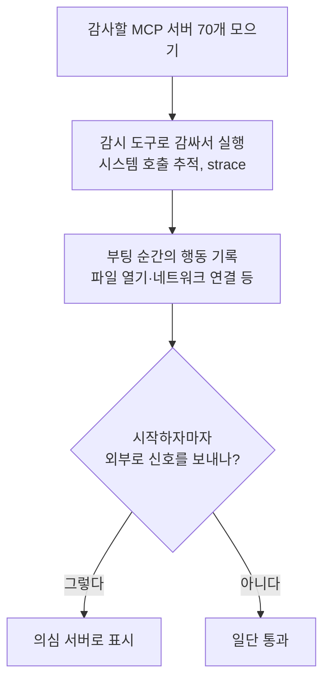

<aside class="ai-knowledge-sidebar">
  
CATEGORIES

  <nav class="ai-cat-tree">

에이전트 오케스트레이션13
<ul><li><a href="https://altjs4510.github.io/ai_news_blog/knowledge/20260717/">2026-07-17After a year building agent memory, 'save everyt…</a></li><li><a href="https://altjs4510.github.io/ai_news_blog/knowledge/20260708/">2026-07-08Expanding Managed Agents in Gemini API: backgrou…</a></li><li><a href="https://altjs4510.github.io/ai_news_blog/knowledge/20260707/">2026-07-07AI Hero Skills Catalog — 실무 엔지니어를 위한 재사용 가능한 판단 …</a></li><li><a href="https://altjs4510.github.io/ai_news_blog/knowledge/20260705/">2026-07-05openai/codex-plugin-cc — Claude Code에서 Codex를 위임…</a></li><li><a href="https://altjs4510.github.io/ai_news_blog/knowledge/20260701/">2026-07-01Google OKF (Open Knowledge Format) — 벤더 중립 에이전트 …</a></li><li><a href="https://altjs4510.github.io/ai_news_blog/knowledge/20260623/">2026-06-23bytedance/deer-flow — 샌드박스·메모리·서브에이전트·메시지 게이트웨이를…</a></li><li><a href="https://altjs4510.github.io/ai_news_blog/knowledge/20260621/">2026-06-21calesthio/OpenMontage — 12 파이프라인·52 도구·500+ 스킬을 …</a></li><li><a href="https://altjs4510.github.io/ai_news_blog/knowledge/20260611/">2026-06-11The evolution of agentic surfaces: building with…</a></li><li><a href="https://altjs4510.github.io/ai_news_blog/knowledge/20260602/">2026-06-02revfactory/harness — 도메인별 에이전트 팀과 스킬을 자동 설계하는 메타…</a></li><li><a href="https://altjs4510.github.io/ai_news_blog/knowledge/20260529/">2026-05-29Introducing dynamic workflows in Claude Code</a></li><li><a href="https://altjs4510.github.io/ai_news_blog/knowledge/20260520/">2026-05-20New in Claude Managed Agents: self-hosted sandbo…</a></li><li><a href="https://altjs4510.github.io/ai_news_blog/knowledge/20260507/">2026-05-07ruvnet/ruflo — Claude 멀티 에이전트 오케스트레이션 플랫폼</a></li><li><a href="https://altjs4510.github.io/ai_news_blog/knowledge/20260504/">2026-05-04Agents for Everything Else: Codex for Knowledge …</a></li></ul>

MCP &amp; 도구 통합9
<ul><li><a href="https://altjs4510.github.io/ai_news_blog/knowledge/20260718/">2026-07-18tirth8205/code-review-graph — MCP·CLI용 로컬 코드 인텔리…</a></li><li><a href="https://altjs4510.github.io/ai_news_blog/knowledge/20260618/">2026-06-18DeusData/codebase-memory-mcp — 158개 언어 코드베이스를 밀리…</a></li><li><a href="https://altjs4510.github.io/ai_news_blog/knowledge/20260604/">2026-06-04chopratejas/headroom — Compress tool outputs bef…</a></li><li><a href="https://altjs4510.github.io/ai_news_blog/knowledge/20260603/">2026-06-03How Bad MCP design cost your Agent 5× more token…</a></li><li><a href="https://altjs4510.github.io/ai_news_blog/knowledge/20260526/">2026-05-26colbymchenry/codegraph — Pre-indexed code knowle…</a></li><li><a href="https://altjs4510.github.io/ai_news_blog/knowledge/20260523/">2026-05-23colbymchenry/codegraph — 사전 인덱싱된 코드 지식 그래프 MCP</a></li><li><a href="https://altjs4510.github.io/ai_news_blog/knowledge/20260519/">2026-05-19Anthropic acquires Stainless</a></li><li><a href="https://altjs4510.github.io/ai_news_blog/knowledge/20260517/">2026-05-17I gave my LLM 100,000+ tools — Lazy Discovery &a…</a></li><li><a href="https://altjs4510.github.io/ai_news_blog/knowledge/20260509/">2026-05-09How to connect 100 MCP servers without the conte…</a></li></ul>

코딩 에이전트12
<ul><li><a href="https://altjs4510.github.io/ai_news_blog/knowledge/20260714/">2026-07-14Graphify-Labs/graphify — 코드베이스를 질의 가능한 지식 그래프로 만…</a></li><li><a href="https://altjs4510.github.io/ai_news_blog/knowledge/20260626/">2026-06-26google-labs-code/design.md — 코딩 에이전트에게 디자인 시스템을 …</a></li><li><a href="https://altjs4510.github.io/ai_news_blog/knowledge/20260619/">2026-06-19Claude Code now supports artifacts</a></li><li><a href="https://altjs4510.github.io/ai_news_blog/knowledge/20260530/">2026-05-30Leonxlnx/taste-skill — AI에게 좋은 취향을 부여해 generic s…</a></li><li><a href="https://altjs4510.github.io/ai_news_blog/knowledge/20260528/">2026-05-28Building self-improving tax agents with Codex</a></li><li><a href="https://altjs4510.github.io/ai_news_blog/knowledge/20260524/">2026-05-24colbymchenry/codegraph — Pre-indexed code knowle…</a></li><li><a href="https://altjs4510.github.io/ai_news_blog/knowledge/20260521/">2026-05-21colbymchenry/codegraph — Pre-indexed code knowle…</a></li><li><a href="https://altjs4510.github.io/ai_news_blog/knowledge/20260512/">2026-05-12agentmemory — Persistent memory for AI coding ag…</a></li><li><a href="https://altjs4510.github.io/ai_news_blog/knowledge/20260510/">2026-05-10addyosmani/agent-skills — Production-grade engin…</a></li><li><a href="https://altjs4510.github.io/ai_news_blog/knowledge/20260508/">2026-05-08addyosmani/agent-skills — Production-grade engin…</a></li><li><a href="https://altjs4510.github.io/ai_news_blog/knowledge/20260506/">2026-05-06mksglu/context-mode — AI 코딩 에이전트용 컨텍스트 윈도우 최적화</a></li><li><a href="https://altjs4510.github.io/ai_news_blog/knowledge/20260505/">2026-05-05mattpocock/skills — Skills for Real Engineers (.…</a></li></ul>

모델 &amp; 연구6
<ul><li><a href="https://altjs4510.github.io/ai_news_blog/knowledge/20260716-proprag/">2026-07-16PropRAG — 프로포지션 경로 위 beam search로 멀티홉 검색 안내</a></li><li><a href="https://altjs4510.github.io/ai_news_blog/knowledge/20260712/">2026-07-12Do Automated Evals Work?</a></li><li><a href="https://altjs4510.github.io/ai_news_blog/knowledge/20260620/">2026-06-20zai-org/GLM-5 — From Vibe Coding to Agentic Engi…</a></li><li><a href="https://altjs4510.github.io/ai_news_blog/knowledge/20260617/">2026-06-17Predicting model behavior before release by simu…</a></li><li><a href="https://altjs4510.github.io/ai_news_blog/knowledge/20260516/">2026-05-16STALE — 에이전트가 자기 기억의 유효성을 인지할 수 있는가</a></li><li><a href="https://altjs4510.github.io/ai_news_blog/knowledge/20260513/">2026-05-13Thinking Machines' Native Interaction Models — T…</a></li></ul>

인프라 &amp; 컴퓨트5
<ul><li><a href="https://altjs4510.github.io/ai_news_blog/knowledge/20260630/">2026-06-30Introducing the Claude apps gateway for Amazon B…</a></li><li><a href="https://altjs4510.github.io/ai_news_blog/knowledge/20260610/">2026-06-10Fable 5 just made cost-aware model routing manda…</a></li><li><a href="https://altjs4510.github.io/ai_news_blog/knowledge/20260606/">2026-06-06chopratejas/headroom — Compress tool outputs, lo…</a></li><li><a href="https://altjs4510.github.io/ai_news_blog/knowledge/20260605/">2026-06-05chopratejas/headroom — Compress tool outputs, lo…</a></li><li><a href="https://altjs4510.github.io/ai_news_blog/knowledge/20260522/">2026-05-22Giving Agents Computers — Ivan Burazin, Daytona</a></li></ul>

보안 &amp; 거버넌스13
<ul><li><a href="https://altjs4510.github.io/ai_news_blog/knowledge/20260716/">2026-07-16Dicklesworthstone/destructive_command_guard — 에이…</a></li><li><a href="https://altjs4510.github.io/ai_news_blog/knowledge/20260715/">2026-07-15Dicklesworthstone/destructive_command_guard — 에이…</a></li><li><a href="https://altjs4510.github.io/ai_news_blog/knowledge/20260710/" class="current">2026-07-1070개 MCP 서버 strace 런타임 감사 — 부팅 시 아웃바운드 호출 서버 적발</a></li><li><a href="https://altjs4510.github.io/ai_news_blog/knowledge/20260704/">2026-07-04Cloudflare is about to block AI agents by defaul…</a></li><li><a href="https://altjs4510.github.io/ai_news_blog/knowledge/20260703/">2026-07-03Giving admins more visibility and control over C…</a></li><li><a href="https://altjs4510.github.io/ai_news_blog/knowledge/20260625/">2026-06-25Agent identity in Claude Tag: a new access model…</a></li><li><a href="https://altjs4510.github.io/ai_news_blog/knowledge/20260624/">2026-06-24Agent identity in Claude Tag: a new access model…</a></li><li><a href="https://altjs4510.github.io/ai_news_blog/knowledge/20260614/">2026-06-14NVIDIA/SkillSpector — Security scanner for AI ag…</a></li><li><a href="https://altjs4510.github.io/ai_news_blog/knowledge/20260613/">2026-06-13Fable 5's guardrails got bypassed in 48 hours — …</a></li><li><a href="https://altjs4510.github.io/ai_news_blog/knowledge/20260612/">2026-06-12NVIDIA/SkillSpector — AI 에이전트 스킬용 보안 스캐너</a></li><li><a href="https://altjs4510.github.io/ai_news_blog/knowledge/20260607/">2026-06-07OpenAI Help: Lockdown Mode</a></li><li><a href="https://altjs4510.github.io/ai_news_blog/knowledge/20260531/">2026-05-31How we contain Claude across products</a></li><li><a href="https://altjs4510.github.io/ai_news_blog/knowledge/20260527/">2026-05-27Microsoft Copilot Cowork Exfiltrates Files</a></li></ul>

응용 사례4
<ul><li><a href="https://altjs4510.github.io/ai_news_blog/knowledge/20260709/">2026-07-09mvanhorn/last30days-skill — Reddit·X·YouTube·HN·…</a></li><li><a href="https://altjs4510.github.io/ai_news_blog/knowledge/20260609/">2026-06-09Building intelligent apps for Apple platforms wi…</a></li><li><a href="https://altjs4510.github.io/ai_news_blog/knowledge/20260515/">2026-05-15Clawdmeter — Claude Code 사용량을 데스크톱 대시보드로</a></li><li><a href="https://altjs4510.github.io/ai_news_blog/knowledge/20260514/">2026-05-14Introducing Claude for Small Business</a></li></ul>

산업 동향3
<ul><li><a href="https://altjs4510.github.io/ai_news_blog/knowledge/20260711/">2026-07-11OpenAI says GPT 5.6 is the 'preferred model' for…</a></li><li><a href="https://altjs4510.github.io/ai_news_blog/knowledge/20260702/">2026-07-02How Cursor deploys AI inside the enterprise (For…</a></li><li><a href="https://altjs4510.github.io/ai_news_blog/knowledge/20260616/">2026-06-16Why AI hasn't replaced software engineers, and w…</a></li></ul>
</nav>
</aside>

<article class="ai-knowledge-article">

<header class="ai-post-hero">
  
<a class="ai-back" href="../">KNOWLEDGE</a> · 2026-07-10 · 오늘의 학습

  <h2 class="ai-post-title">70개 MCP 서버 strace 런타임 감사 — 부팅 시 아웃바운드 호출 서버 적발</h2>
</header>

> 원문: [70개 MCP 서버 strace 런타임 감사 — 부팅 시 아웃바운드 호출 서버 적발](https://www.reddit.com/r/mcp/comments/1us3gv7/we_build_a_model_agnostic_claude_managed_agents/)

## 📌 학습 정리

### 1. 한 줄로 말하면

여러 곳에서 받아 쓰는 "도구 연결 서버"들이 켜지자마자 몰래 외부로 신호를 보내는지, 실제로 실행시켜 보면서 감시한 감사(audit) 기록이에요.

### 2. 왜 이게 만들어졌어요?

요즘 인공지능 비서(예: Claude, ChatGPT)에게 외부 도구를 붙여주는 표준으로 "모델 컨텍스트 프로토콜(Model Context Protocol, MCP)"이 빠르게 퍼지고 있어요. 그러다 보니 누구나 만든 MCP 서버를 받아서 로컬에 띄우는 일이 흔해졌는데, 이 서버들이 어떤 코드를 담고 있는지 사람이 일일이 다 읽어보기 어렵죠. 기존에는 소스 코드를 읽어서 위험을 찾는 "정적 분석(static analysis)" 방식이 주로 쓰였는데, 코드만 봐서는 실제로 켰을 때 무슨 짓을 하는지 놓치는 경우가 있어요. 그래서 이 자료는 실제로 서버를 부팅해 놓고 시스템 호출을 엿듣는 "런타임(runtime) 감시" 방법으로, 시작하자마자 조용히 외부로 통신하는 서버가 있는지 잡아내려는 시도예요.

### 3. 비유로 풀면

이건 마치 새 앱을 설치하고 실행한 뒤 "네트워크 사용량" 창을 열어서, 내가 아무것도 안 했는데 어디론가 몰래 데이터를 보내는지 지켜보는 것과 비슷해요. 또는 새로 들어온 택배 기사에게 짐만 맡기는 게 아니라, 문 앞에서 그 사람이 누구에게 전화를 거는지 옆에서 조용히 듣는 것과도 닮았어요. 그래서 결국, "코드 겉모습"이 아니라 "켰을 때의 실제 행동"으로 신뢰할 수 있는 서버인지 가려내려는 접근이에요.

### 4. 어떻게 작동하는지 (그림으로)

원문 접근이 막혀 있어 구체적 결과 목록은 확인할 수 없지만, 큰 흐름은 이래요. 서버를 하나씩 켤 때마다 그 프로세스가 운영체제에 내리는 명령("시스템 호출")을 옆에서 받아 적고, 그중 "바깥으로 연결하는 행위"가 부팅 직후에 있었는지 확인하는 방식이에요. 사용자가 아무 요청도 안 했는데 외부로 나가는 통신이 있다면, 그건 조사가 필요한 신호로 보는 거죠.

### 5. 처음 보는 용어 풀이

- **모델 컨텍스트 프로토콜 (Model Context Protocol, MCP)** — 인공지능 비서가 외부 도구·데이터에 접근할 수 있도록 표준화한 연결 규격이에요. 이 규격을 따르는 서버를 붙이면 비서가 그 도구를 쓸 수 있게 돼요.
- **MCP 서버 (MCP server)** — 위 규격에 맞춰서 특정 기능(파일 검색, 이메일 보내기 등)을 인공지능에 제공해주는 작은 프로그램이에요. 누구나 만들어 배포할 수 있어서 신뢰 문제가 생겨요.
- **런타임 감사 (runtime audit)** — 프로그램을 실제로 실행해 놓고 그 행동을 지켜보며 검사하는 방식이에요. 코드만 읽어서 판단하는 것과 반대되는 접근이에요.
- **시스템 호출 추적 도구 (strace)** — 리눅스에서 어떤 프로그램이 운영체제에 무슨 요청(파일 읽기, 네트워크 연결 등)을 보내는지 실시간으로 엿보게 해주는 유틸리티예요. 프로그램의 "실제 행동"을 관찰하기 좋아요.
- **아웃바운드 호출 (outbound call)** — 내 컴퓨터에서 바깥 서버로 나가는 통신을 뜻해요. 부팅 직후 이런 호출이 있다면, 사용자가 시키지 않은 일을 하고 있다는 신호일 수 있어요.
- **부팅 시 행동 (boot-time behavior)** — 서버를 켜자마자 나타나는 초기 동작이에요. 사용자의 실제 요청이 없는 시점이라, 이때 뭔가를 몰래 하는 건 특히 수상해요.
- **공급망 신뢰 (supply chain trust)** — 남이 만든 소프트웨어를 가져다 쓸 때, 그 출처와 내용물을 얼마나 믿을 수 있느냐의 문제예요. MCP 서버처럼 외부 배포물이 늘어날수록 중요해져요.

### 6. 한 발 더 들어가고 싶다면

원문 페이지가 네트워크 차단으로 열리지 않아, 이 응답에서는 별도 링크를 안내하지 않을게요. 접근 가능한 환경에서 [원문 스레드](https://www.reddit.com/r/mcp/comments/1us3gv7/we_build_a_model_agnostic_claude_managed_agents/)를 다시 열어보면 감사 대상 서버 목록과 결과를 확인할 수 있어요.

---

## 📖 원문 전체 번역 (정독용)

> 의역 최소화한 전체 번역입니다. 큰 흐름은 위 정리에서 잡고, 정확한 워딩이 필요할 땐 이 섹션에서 정독하세요.

네트워크 보안에 의해 차단되었습니다.

계속하려면 Reddit 계정으로 로그인하거나 개발자 토큰을 사용하세요.

실수로 차단된 것 같다면 아래에서 티켓을 제출하시면 확인해 드리겠습니다.

[로그인](https://www.reddit.com/login/) [티켓 제출](https://support.reddithelp.com/hc/en-us/requests/new?ticket_form_id=21879292693140)

</article>

<!-- ai-related-links -->
<aside class="ai-related-links">
  
관련 학습

  <ul><li><a href="https://altjs4510.github.io/ai_news_blog/knowledge/20260509/">2026-05-09How to connect 100 MCP servers without the conte…</a></li><li><a href="https://altjs4510.github.io/ai_news_blog/knowledge/20260527/">2026-05-27Microsoft Copilot Cowork Exfiltrates Files</a></li></ul>
</aside>
<!-- /ai-related-links -->
